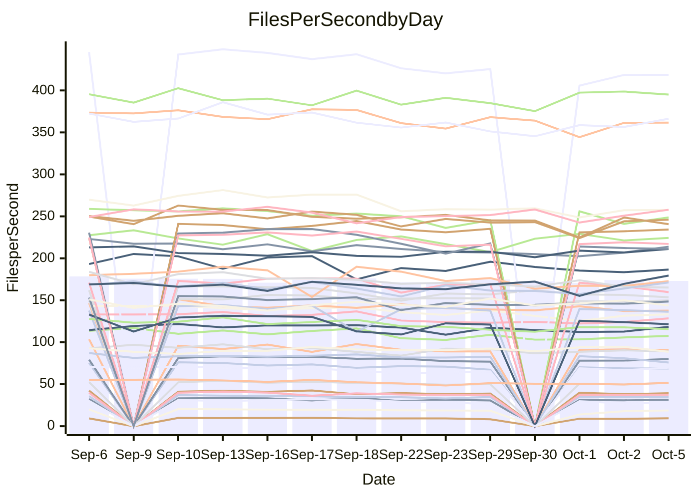

<!---
# This file is auto-generated. Do not edit.
# cspell:disable
--->
# Performance Report

## Daily Performance

## Time to Process Files

| Repository                                      | Elapsed | Min/Avg/Max           |   SD | SD Graph                |
| ----------------------------------------------- | ------: | :-------------------: | ---: | ----------------------- |
| AdaDoom3/AdaDoom3                    |    2.99 | 2.7 /   2.9 /   3.1   | 0.09 | `    ┣━━┻━━╋━●┻━━┫    ` |
| alexiosc/megistos                    |    7.28 | 6.6 /   7.3 /   7.7   | 0.26 | `    ┣━━┻━━●━━┻━━┫    ` |
| apollographql/apollo-server          |    2.11 | 2.0 /   2.1 /   2.3   | 0.08 | `     ┣━┻━●╋━━┻━┫     ` |
| aspnetboilerplate/aspnetboilerplate  |   11.01 | 10.5 /  10.9 /  12.0  | 0.37 | `    ┣━━┻━━╋●━┻━━┫    ` |
| aws-amplify/docs                     |   11.77 | 10.7 /  11.3 /  12.6  | 0.41 | `    ┣━━┻━━╋━━┻●━┫    ` |
| Azure/azure-rest-api-specs           |   14.69 | 12.9 /  13.9 /  15.4  | 0.63 | `   ┣━━━┻━━╋━━┻●━━┫   ` |
| bitjson/typescript-starter           |    0.64 | 0.6 /   0.6 /   0.7   | 0.03 | `     ┣━━┻━╋●┻━━┫     ` |
| caddyserver/caddy                    |    3.10 | 2.8 /   3.0 /   3.5   | 0.16 | `    ┣━━┻━━╋●━┻━━┫    ` |
| canada-ca/open-source-logiciel-libre |    0.74 | 0.7 /   0.8 /   0.9   | 0.05 | `     ┣━┻━●╋━━┻━┫     ` |
| chef/chef                            |    5.35 | 5.1 /   5.4 /   6.0   | 0.23 | `    ┣━━┻━●╋━━┻━━┫    ` |
| dart-lang/sdk                        |   54.19 | 55.6 /  58.3 /  70.4  | 3.22 | `  ┣━━●┻━━━╋━━━┻━━━┫  ` |
| django/django                        |   13.23 | 13.0 /  13.6 /  14.3  | 0.32 | `    ┣━━●━━╋━━┻━━┫    ` |
| eslint/eslint                        |    9.43 | 8.9 /   9.5 /  10.0   | 0.30 | `    ┣━━┻━━●━━┻━━┫    ` |
| exonum/exonum                        |    3.09 | 2.9 /   3.0 /   3.7   | 0.19 | `    ┣━━┻━━╋●━┻━━┫    ` |
| flutter/samples                      |   16.50 | 13.7 /  15.1 /  18.4  | 1.50 | `   ┣━━━┻━━╋━━●━━━┫   ` |
| gitbucket/gitbucket                  |    3.08 | 2.8 /   3.0 /   3.3   | 0.12 | `    ┣━━┻━━╋━●┻━━┫    ` |
| googleapis/google-cloud-cpp          |  136.92 | 129.1 / 135.8 / 145.8 | 4.22 | `  ┣━━━┻━━━╋●━━┻━━━┫  ` |
| graphql/express-graphql              |    0.69 | 0.6 /   0.7 /   0.8   | 0.04 | `     ┣━┻━━╋●━┻━┫     ` |
| graphql/graphql-js                   |    2.17 | 1.9 /   2.1 /   2.2   | 0.08 | `     ┣━┻━━╋━━●━┫     ` |
| graphql/graphql-relay-js             |    0.71 | 0.6 /   0.7 /   0.8   | 0.04 | `     ┣━┻━━╋●━┻━┫     ` |
| graphql/graphql-spec                 |    0.80 | 0.7 /   0.8 /   1.1   | 0.08 | `     ┣━┻━━●━━┻━┫     ` |
| iluwatar/java-design-patterns        |   11.51 | 10.3 /  10.8 /  12.5  | 0.47 | `    ┣━━┻━━╋━━┻━●┫    ` |
| ktaranov/sqlserver-kit               |    6.44 | 5.6 /   5.9 /   6.3   | 0.15 | `    ┣━━┻━━╋━━┻━━┫   ●` |
| liriliri/licia                       |    3.40 | 3.1 /   3.3 /   3.5   | 0.11 | `    ┣━━┻━━╋━━●━━┫    ` |
| MartinThoma/LaTeX-examples           |    6.48 | 5.9 /   6.3 /   7.0   | 0.26 | `    ┣━━┻━━╋━●┻━━┫    ` |
| mdx-js/mdx                           |    1.59 | 1.4 /   1.5 /   1.8   | 0.08 | `     ┣━┻━━╋●━┻━┫     ` |
| microsoft/TypeScript-Website         |    5.06 | 4.7 /   5.0 /   5.5   | 0.17 | `    ┣━━┻━━╋●━┻━━┫    ` |
| MicrosoftDocs/PowerShell-Docs        |   23.28 | 20.6 /  22.1 /  23.9  | 0.87 | `   ┣━━━┻━━╋━━┻━●━┫   ` |
| neovim/nvim-lspconfig                |    2.76 | 2.6 /   2.7 /   2.9   | 0.12 | `    ┣━━┻━━●━━┻━━┫    ` |
| pagekit/pagekit                      |    3.16 | 3.0 /   3.1 /   3.3   | 0.08 | `    ┣━━┻━━●━━┻━━┫    ` |
| php/php-src                          |   24.93 | 23.2 /  24.3 /  26.1  | 0.74 | `   ┣━━━┻━━╋━━●━━━┫   ` |
| plasticrake/tplink-smarthome-api     |    0.90 | 0.8 /   0.9 /   0.9   | 0.04 | `     ┣━┻━━╋━━●━┫     ` |
| prettier/prettier                    |    6.07 | 5.7 /   6.0 /   6.4   | 0.18 | `    ┣━━┻━━╋━●┻━━┫    ` |
| pycontribs/jira                      |    1.15 | 1.1 /   1.2 /   1.3   | 0.06 | `     ┣━┻●━╋━━┻━┫     ` |
| RustPython/RustPython                |    4.51 | 4.1 /   4.4 /   4.9   | 0.19 | `    ┣━━┻━━╋━●┻━━┫    ` |
| shoelace-style/shoelace              |    2.34 | 2.1 /   2.3 /   2.5   | 0.12 | `    ┣━━┻━━╋━●┻━━┫    ` |
| SoftwareBrothers/admin-bro           |    2.09 | 1.8 /   2.0 /   2.2   | 0.10 | `     ┣━┻━━╋━━●━┫     ` |
| sveltejs/svelte                      |   18.87 | 18.1 /  18.9 /  20.3  | 0.54 | `   ┣━━━┻━━●━━┻━━━┫   ` |
| TheAlgorithms/Python                 |    5.25 | 4.7 /   5.1 /   5.5   | 0.21 | `    ┣━━┻━━╋━━●━━┫    ` |
| twbs/bootstrap                       |    1.12 | 1.0 /   1.1 /   1.2   | 0.05 | `     ┣━┻━━╋●━┻━┫     ` |
| typescript-cheatsheets/react         |    1.03 | 1.0 /   1.0 /   1.2   | 0.04 | `     ┣━┻━━●━━┻━┫     ` |
| typescript-eslint/typescript-eslint  |    3.40 | 3.2 /   3.4 /   3.7   | 0.13 | `    ┣━━┻━━●━━┻━━┫    ` |
| vitest-dev/vitest                    |    6.99 | 6.6 /   7.0 /   7.4   | 0.22 | `    ┣━━┻━●╋━━┻━━┫    ` |
| w3c/aria-practices                   |    2.71 | 2.5 /   2.7 /   3.0   | 0.11 | `    ┣━━┻━━●━━┻━━┫    ` |
| w3c/specberus                        |    1.65 | 1.5 /   1.6 /   2.1   | 0.14 | `    ┣━━┻━━╋●━┻━━┫    ` |
| webdeveric/webpack-assets-manifest   |    0.68 | 0.6 /   0.6 /   0.8   | 0.05 | `     ┣━┻━━╋━●┻━┫     ` |
| webpack/webpack                      |    4.42 | 4.2 /   4.4 /   4.8   | 0.18 | `    ┣━━┻━━●━━┻━━┫    ` |
| wireapp/wire-desktop                 |    0.83 | 0.8 /   0.8 /   0.9   | 0.04 | `     ┣━┻━━╋●━┻━┫     ` |
| wireapp/wire-webapp                  |    7.16 | 7.0 /   7.4 /   8.0   | 0.27 | `    ┣━━●━━╋━━┻━━┫    ` |

Note:
- Elapsed time is in seconds.

## Files per Second over Time

| Repository                                      | Files |    Sec |    Fps |    Rel | Trend Fps              |    N |
| ----------------------------------------------- | ----: | -----: | -----: | -----: | ---------------------- | ---: |
| AdaDoom3/AdaDoom3                    |   103 |   2.99 |  34.49 | -2.59% | `▆▇█▇▇▆▇▅▇▅▅▅▄▅▆▆▅▅▅`  |   18 |
| alexiosc/megistos                    |   583 |   7.28 |  80.05 | -0.43% | `▅▆▅▇▆▇▅▄█▅▅▅▄▄▄▅▅▃▅`  |   18 |
| apollographql/apollo-server          |   250 |   2.11 | 118.33 |  1.03% | `█▇▇▆█▇▇▇▇▇▆▇▄▆▆▅▄▇▅▇` |   21 |
| aspnetboilerplate/aspnetboilerplate  |  2739 |  11.01 | 248.68 | -1.15% | `█▇████▇█▆█▇▆▇▅▆█▆▇▄▇` |   20 |
| aws-amplify/docs                     |  2832 |  11.77 | 240.70 | -3.92% | `██▇▇▇▇█▆▇▆▆▇▇▆▆▃▇▆▆▅` |   21 |
| Azure/azure-rest-api-specs           |  2426 |  14.69 | 165.18 | -5.07% | `█▆▇█▇▅▆▇▆▆▆▄▅▅▅▆▇▃▄▄` |   21 |
| bitjson/typescript-starter           |    20 |   0.64 |  31.47 | -1.24% | `▇▇████▇▅▅█▃▅▆▅▅▅▅▅▆`  |   18 |
| caddyserver/caddy                    |   276 |   3.10 |  89.06 | -2.63% | `▆███▇▇▄▇▆▅▃▆▆▆▅▅▆▅▆▆` |   21 |
| canada-ca/open-source-logiciel-libre |     7 |   0.74 |   9.44 |  1.09% | `▆██▇▇▇▇██▇▇▆▆▄▅▆▂▆▇`  |   18 |
| chef/chef                            |  1201 |   5.35 | 224.33 |  1.11% | `▆▇▅▅▆▇█▃▅▆▇▇▆▄▆▇█▇▄▇` |   21 |
| dart-lang/sdk                        |  9723 |  54.19 | 179.42 |  7.57% | `▆▆▇▆▇▇▂▇▇▇▆▆▆▇▇▅▅▇▇█` |   21 |
| django/django                        |  2792 |  13.23 | 211.07 |  2.42% | `█▆▇▆▇█▅█▆▆▆▆▇▇▆██▆██` |   21 |
| eslint/eslint                        |  2016 |   9.43 | 213.87 |  1.05% | `▇█▅▇▇▇█▆▅▇▆▇▅▅▅▄▆▅▅▇` |   21 |
| exonum/exonum                        |   421 |   3.09 | 136.33 | -2.00% | `▇▇▇█▇█▆█▇▂▇▇▇▇▇▆▇▆▆`  |   18 |
| flutter/samples                      |  2850 |  16.50 | 172.72 | -2.35% | `█▇███▇█▅▂█▇█▆▆▅▅▆▅▆▆` |   21 |
| gitbucket/gitbucket                  |   411 |   3.08 | 133.27 | -3.08% | `██▇▇▇▅█▇▇▇▅▇▅▇▅▄▅▅▆▅` |   21 |
| googleapis/google-cloud-cpp          | 19694 | 136.92 | 143.84 | -0.72% | `▆▇▆▆▅▄▄▆▆▇▆▆▆█▆▇█▇▇▆` |   21 |
| graphql/express-graphql              |    26 |   0.69 |  37.56 | -2.26% | `▇▆███▇█▇▃▇▆▅▅▅▅▅▅▅▆`  |   18 |
| graphql/graphql-js                   |   333 |   2.17 | 153.54 | -4.51% | `▇▇▅█▇▇▆▇▆▅▃▃▅▅▆▅▄▆▄▄` |   20 |
| graphql/graphql-relay-js             |    28 |   0.71 |  39.37 | -2.18% | `▇█▅▇█▇▅█▇▅▅▅▅▅▆▆▅▃▅`  |   18 |
| graphql/graphql-spec                 |    15 |   0.80 |  18.73 | -1.42% | `███▇█▇▇█▇▇▇▇▆▆▂▆▆▄▆`  |   18 |
| iluwatar/java-design-patterns        |  1838 |  11.51 | 159.73 | -6.15% | `▇▇▇▇▆█▇███▇▃▆▇▇▆▆▆▅`  |   18 |
| ktaranov/sqlserver-kit               |   489 |   6.44 |  75.90 | -8.54% | `█▆▇▆▆▇▆▆▆█▇▅▇▆▆▇▆▆▄▃` |   19 |
| liriliri/licia                       |  1421 |   3.40 | 418.54 | -3.37% | `█▇███▇█▇▆▇▅▆▅▆▄▅▅▅▅`  |   18 |
| MartinThoma/LaTeX-examples           |  1407 |   6.48 | 217.12 | -3.14% | `▆▆▇▆▇▇▇█▅▇▆▆▅▅▅▃▇▆▅`  |   18 |
| mdx-js/mdx                           |   144 |   1.59 |  90.76 | -2.66% | `█▆▆▄▆▆▇▆▆▃▇▅▅▄▄▅▅▄▅▅` |   19 |
| microsoft/TypeScript-Website         |   758 |   5.06 | 149.93 | -1.13% | `▇▅▆▆▆▇█▇█▆▇▆▆▆▄▆▇▇▃▆` |   20 |
| MicrosoftDocs/PowerShell-Docs        |  2692 |  23.28 | 115.62 | -4.96% | `▇▆██▆▆▆▆▇▇▅▅▅▄▃▅▅▄▅▄` |   21 |
| neovim/nvim-lspconfig                |   355 |   2.76 | 128.49 | -0.76% | `▇▇██▇█▄▇▆█▆▄▄▄▄▄▅▄▅▆` |   21 |
| pagekit/pagekit                      |   741 |   3.16 | 234.32 | -0.50% | `▄█▆█▆▅▇▆▇█▆▆▅▆▅▆▅▅▆`  |   18 |
| php/php-src                          |  2211 |  24.93 |  88.69 | -2.70% | `▄▅▅▇▆▅▆██▇▆▆▆▇▆████▆` |   21 |
| plasticrake/tplink-smarthome-api     |    62 |   0.90 |  68.74 | -4.68% | `▇▇██▆▇▅▆▇▅▅▆▅▄▅▄▃▅▄`  |   18 |
| prettier/prettier                    |  2196 |   6.07 | 361.66 | -1.41% | `▇▇▇▇▆▅▇█▇▇▆▆▅▇▆▄▇▆▄▆` |   20 |
| pycontribs/jira                      |    80 |   1.15 |  69.77 |  2.91% | `█▇█▇█▇█▆▆█▆▆▃▅▅▇▆▅▇▇` |   19 |
| RustPython/RustPython                |   621 |   4.51 | 137.72 | -3.36% | `█▇█▅▅▇▆▆▆▆▇▇▆▅▅▆▇▆▃▅` |   20 |
| shoelace-style/shoelace              |   437 |   2.34 | 186.59 | -3.13% | `▇█▇▃█▇▇▇█▃▆▅▅▆▅▅▃▅▆▅` |   21 |
| SoftwareBrothers/admin-bro           |   441 |   2.09 | 211.21 | -5.59% | `▇▇▇█▆▇███▇▅▅▄▅▅▆▃▄▄`  |   18 |
| sveltejs/svelte                      |  7455 |  18.87 | 395.08 |  1.07% | `▇▇▆▆▇▆▆▇▄▇▅▆▆▆▅▇█▆▇▇` |   21 |
| TheAlgorithms/Python                 |  1352 |   5.25 | 257.64 | -3.36% | `▇▇▇█▆▇▆▇▇▇▄▅▅▅▅▄▃▆▅▅` |   21 |
| twbs/bootstrap                       |   120 |   1.12 | 107.52 | -1.67% | `▇▅▇▇▇▇▃█▆█▅▄▄▆▄▄▅▄▅▅` |   21 |
| typescript-cheatsheets/react         |    53 |   1.03 |  51.70 |  0.37% | `▇▇▆▇█▅▇▇▇▆▆▆▅▅▆▆▆▃▆`  |   18 |
| typescript-eslint/typescript-eslint  |  1247 |   3.40 | 366.28 |  0.40% | `▅▇▇███▃▆▇▅▅▅▅▄▄▅▅▅▅▆` |   21 |
| vitest-dev/vitest                    |  1801 |   6.99 | 257.84 |  1.80% | `█▄▇▅▇▆█▆▆▄▅▅▅▆▇▄▆▆▄▆` |   21 |
| w3c/aria-practices                   |   403 |   2.71 | 148.55 | -0.17% | `█▇▇██▅▇█▆▇▃▅▆▅▅▆▆▅▆▆` |   20 |
| w3c/specberus                        |   200 |   1.65 | 121.50 | -2.56% | `▅▇▇▇█▇█▇█▆▅▂▆▆▆▇▇▇▅▆` |   20 |
| webdeveric/webpack-assets-manifest   |    19 |   0.68 |  28.02 | -5.74% | `▆▇▇▅██▇███▆▆▆▃▆▂▆▅▅`  |   18 |
| webpack/webpack                      |  1086 |   4.42 | 245.97 | -0.18% | `▇▇█▇█▇▅▇█▇▄▇▇▆▆▃█▄▇▆` |   21 |
| wireapp/wire-desktop                 |    43 |   0.83 |  51.63 | -1.82% | `▇█▆█▄█▇█▇▆▅▅▄▅▅▅▅▃▅▆` |   21 |
| wireapp/wire-webapp                  |  1227 |   7.16 | 171.28 |  3.92% | `▅▇█▇▅▆▆█▇▆▄▄▇▅▅▄▆▅▇▇` |   21 |

## Data Throughput

| Repository                                      | Files |    Sec |     Kps |    Rel | Trend Kps              |    N |
| ----------------------------------------------- | ----: | -----: | ------: | -----: | ---------------------- | ---: |
| AdaDoom3/AdaDoom3                    |   103 |   2.99 |  733.01 | -2.59% | `▆▇█▇▇▆▇▅▇▅▅▅▄▅▆▆▅▅▅`  |   18 |
| alexiosc/megistos                    |   583 |   7.28 |  628.98 | -0.43% | `▅▆▅▇▆▇▅▄█▅▅▅▄▄▄▅▅▃▅`  |   18 |
| apollographql/apollo-server          |   250 |   2.11 |  937.64 |  1.03% | `█▇▇▆█▇▇▇▇▇▆▇▄▆▆▅▄▇▅▇` |   21 |
| aspnetboilerplate/aspnetboilerplate  |  2739 |  11.01 |  578.16 | -2.61% | `█▇████▇█▆█▇▆▇▄▆▇▆▆▃▆` |   20 |
| aws-amplify/docs                     |  2832 |  11.77 |  803.51 | -3.58% | `██▇▇▇▇█▆▇▆▆▇▇▆▆▃▇▆▆▅` |   21 |
| Azure/azure-rest-api-specs           |  2426 |  14.69 |  471.65 | -4.92% | `█▆▇█▇▅▆▇▆▆▆▄▅▅▅▆▇▃▄▄` |   21 |
| bitjson/typescript-starter           |    20 |   0.64 |  125.88 | -1.24% | `▇▇████▇▅▅█▃▅▆▅▅▅▅▅▆`  |   18 |
| caddyserver/caddy                    |   276 |   3.10 |  725.07 | -2.48% | `▆███▇▇▄▇▆▆▃▆▇▆▅▆▆▅▆▆` |   21 |
| canada-ca/open-source-logiciel-libre |     7 |   0.74 |   78.21 |  1.09% | `▆██▇▇▇▇██▇▇▆▆▄▅▆▂▆▇`  |   18 |
| chef/chef                            |  1201 |   5.35 | 1029.36 |  0.87% | `▆▇▆▆▆▇█▃▅▆▇▇▆▄▆▇█▇▄▇` |   21 |
| dart-lang/sdk                        |  9723 |  54.19 | 1297.51 |  7.37% | `▆▇▇▆▇▇▂▇▇▇▆▆▆▇▇▅▅▇▇█` |   21 |
| django/django                        |  2792 |  13.23 | 1291.75 |  2.55% | `█▆▇▆▇█▅█▆▆▆▆▇▇▆██▆██` |   21 |
| eslint/eslint                        |  2016 |   9.43 | 1746.07 |  0.86% | `▇█▅▇▇▇█▆▅▇▆▇▅▅▅▄▆▅▅▇` |   21 |
| exonum/exonum                        |   421 |   3.09 | 1304.01 | -2.00% | `▇▇▇█▇█▆█▇▂▇▇▇▇▇▆▇▆▆`  |   18 |
| flutter/samples                      |  2850 |  16.50 | 1339.44 |  0.17% | `█▇███▇█▅▂█▇█▆▆▆▆▆▅▆▇` |   21 |
| gitbucket/gitbucket                  |   411 |   3.08 |  602.13 | -3.08% | `██▇▇▇▅█▇▇▇▅▇▅▇▅▄▅▅▆▅` |   21 |
| googleapis/google-cloud-cpp          | 19694 | 136.92 | 1026.71 | -0.70% | `▆▇▆▆▅▄▄▆▆▇▆▆▆█▆▇█▇▇▆` |   21 |
| graphql/express-graphql              |    26 |   0.69 |  171.92 | -2.26% | `▇▆███▇█▇▃▇▆▅▅▅▅▅▅▅▆`  |   18 |
| graphql/graphql-js                   |   333 |   2.17 |  875.58 | -4.36% | `▇▇▅█▇▇▆▇▆▅▃▃▅▅▆▅▄▆▄▄` |   20 |
| graphql/graphql-relay-js             |    28 |   0.71 |  154.67 | -2.18% | `▇█▅▇█▇▅█▇▅▅▅▅▅▆▆▅▃▅`  |   18 |
| graphql/graphql-spec                 |    15 |   0.80 |  687.93 | -1.42% | `███▇█▇▇█▇▇▇▇▆▆▂▆▆▄▆`  |   18 |
| iluwatar/java-design-patterns        |  1838 |  11.51 |  491.54 | -6.15% | `▇▇▇▇▆█▇███▇▃▆▇▇▆▆▆▅`  |   18 |
| ktaranov/sqlserver-kit               |   489 |   6.44 | 1148.07 | -8.54% | `█▆▇▆▆▇▆▆▆█▇▅▇▆▆▇▆▆▄▃` |   19 |
| liriliri/licia                       |  1421 |   3.40 |  493.36 | -3.29% | `█▇███▇█▇▆▇▅▆▅▆▄▅▅▅▅`  |   18 |
| MartinThoma/LaTeX-examples           |  1407 |   6.48 |  448.74 | -3.14% | `▆▆▇▆▇▇▇█▅▇▆▆▅▅▅▃▇▆▅`  |   18 |
| mdx-js/mdx                           |   144 |   1.59 |  415.99 | -2.48% | `█▆▆▄▆▆▇▆▆▃▇▅▅▄▄▅▅▄▆▅` |   19 |
| microsoft/TypeScript-Website         |   758 |   5.06 | 1025.94 | -1.20% | `▇▅▆▇▆▇█▇█▆▇▆▆▆▄▆▇▇▃▆` |   20 |
| MicrosoftDocs/PowerShell-Docs        |  2692 |  23.28 | 1181.37 | -5.01% | `▇▆██▆▆▆▆▇▇▆▅▅▄▃▅▅▄▅▄` |   21 |
| neovim/nvim-lspconfig                |   355 |   2.76 |  336.25 | -1.11% | `█▇██▇█▄▇▆█▆▄▄▄▄▄▅▄▅▆` |   21 |
| pagekit/pagekit                      |   741 |   3.16 |  488.57 | -0.50% | `▄█▆█▆▅▇▆▇█▆▆▅▆▅▆▅▅▆`  |   18 |
| php/php-src                          |  2211 |  24.93 | 1294.79 | -2.64% | `▄▅▅▇▆▅▆██▇▆▆▆▇▆████▆` |   21 |
| plasticrake/tplink-smarthome-api     |    62 |   0.90 |  371.43 | -4.68% | `▇▇██▆▇▅▆▇▅▅▆▅▄▅▄▃▅▄`  |   18 |
| prettier/prettier                    |  2196 |   6.07 |  504.28 | -1.38% | `▇▇▇▇▆▅▇█▇▇▆▆▅▇▆▄▇▆▄▆` |   20 |
| pycontribs/jira                      |    80 |   1.15 |  480.56 |  2.92% | `█▇█▇█▇█▆▆█▆▆▃▅▅▇▆▅▇▇` |   19 |
| RustPython/RustPython                |   621 |   4.51 | 1013.69 | -3.15% | `█▇█▅▅▇▆▆▆▆▇▇▆▆▅▆▇▆▃▅` |   20 |
| shoelace-style/shoelace              |   437 |   2.34 |  886.40 | -2.64% | `▇▇▇▃█▇▇▇█▃▆▅▅▇▆▅▃▅▆▅` |   21 |
| SoftwareBrothers/admin-bro           |   441 |   2.09 |  465.54 | -5.67% | `▇▇▇█▆▇███▇▅▅▃▅▅▆▃▄▄`  |   18 |
| sveltejs/svelte                      |  7455 |  18.87 |  284.69 |  0.88% | `█▇▆▆▇▆▆▇▄▇▅▆▆▆▅▇█▆▇▇` |   21 |
| TheAlgorithms/Python                 |  1352 |   5.25 |  651.16 | -3.57% | `▇▇▇█▆▇▆▇▇▇▅▅▅▅▅▄▃▆▅▅` |   21 |
| twbs/bootstrap                       |   120 |   1.12 |  861.03 | -1.67% | `▇▅▇▇▇▇▃█▆█▅▄▄▆▄▄▅▄▅▅` |   21 |
| typescript-cheatsheets/react         |    53 |   1.03 |  377.52 |  0.37% | `▇▇▆▇█▅▇▇▇▆▆▆▅▅▆▆▆▃▆`  |   18 |
| typescript-eslint/typescript-eslint  |  1247 |   3.40 | 1704.49 |  0.91% | `▅▇▇███▃▆▇▅▅▅▅▅▄▅▅▆▅▆` |   21 |
| vitest-dev/vitest                    |  1801 |   6.99 |  525.27 |  1.09% | `█▄▇▅▇▆█▆▆▄▅▅▅▆▆▄▆▅▄▆` |   21 |
| w3c/aria-practices                   |   403 |   2.71 | 1384.89 | -0.03% | `█▇▇██▅▇█▆█▃▅▆▆▆▆▆▅▆▆` |   20 |
| w3c/specberus                        |   200 |   1.65 |  387.59 | -2.56% | `▅▇▇▇█▇█▇█▆▅▂▆▆▆▇▇▇▅▆` |   20 |
| webdeveric/webpack-assets-manifest   |    19 |   0.68 |  150.41 | -5.74% | `▆▇▇▅██▇███▆▆▆▃▆▂▆▅▅`  |   18 |
| webpack/webpack                      |  1086 |   4.42 | 1069.48 | -0.09% | `▇▇█▇█▇▅▇█▇▄▇▇▆▆▃█▄▇▆` |   21 |
| wireapp/wire-desktop                 |    43 |   0.83 |  226.93 | -1.82% | `▇█▆█▄█▇█▇▆▅▅▄▅▅▅▅▃▅▆` |   21 |
| wireapp/wire-webapp                  |  1227 |   7.16 |  724.76 |  3.87% | `▅▇█▇▅▆▆█▇▆▄▄▆▅▅▄▆▅▇▇` |   21 |

