<!---
# This file is auto-generated. Do not edit.
# cspell:disable
--->
# Performance Report

## Daily Performance

```mermaid
xychart-beta
    title Files Per Second by Day
    y-axis Files per Second
    x-axis Date [Nov-11, Nov-12, Nov-13, Nov-14, Nov-15, Nov-16, Nov-19, Nov-20, Nov-21, Nov-22, Nov-23, Nov-26, Nov-27, Nov-28, Nov-29, Nov-30, Dec-2, Dec-8]
    bar [160.65, 161.35, 160.47, 159.54, 154.79, 160.46, 159.61, 161.30, 160.06, 161.07, 158.38, 160.01, 159.51, 160.85, 158.58, 159.25, 158.41, 160.42]
    line [76.34, 76.58, 74.79, 76.80, 76.30, 73.76, 78.85, 74.91, 77.93, 75.92, 76.91, 75.07, 72.02, 77.23, 76.76, 75.06, 80.27, 75.98]
    line [117.85, 109.38, 119.29, 116.46, 115.59, 118.49, 113.54, 123.36, 115.17, 111.11, 117.00, 116.48, 115.76, 116.91, 109.21, 117.71, 115.04, 118.36]
    line [213.57, 213.32, 216.11, 216.43, 209.55, 217.83, 207.54, 213.34, 220.45, 208.25, 203.01, 216.67, 216.64, 214.89, 220.14, 219.09, 206.67, 214.59]
    line [75.62, 73.39, 77.86, 75.46, 75.53, 74.48, 74.42, 80.12, 74.68, 76.58, 77.00, 75.69, 74.97, 72.54, 73.38, 73.35, 76.02, 69.50]
    line [23.49, 24.08, 23.00, 23.06, 24.50, 24.34, 23.62, 23.53, 24.02, 24.23, 25.56, 24.09, 24.00, 22.97, 23.09, 24.60, 24.46, 23.64]
    line [18.23, 18.67, 17.83, 17.56, 18.43, 19.15, 18.91, 18.65, 18.27, 18.52, 18.27, 18.83, 18.32, 19.02, 18.13, 19.36, 18.09, 19.20]
    line [14.26, 14.23, 14.49, 14.71, 14.55, 14.39, 13.95, 14.60, 14.17, 14.18, 13.95, 14.61, 14.49, 13.79, 14.45, 14.21, 13.55, 14.21]
    line [93.46, 89.53, 90.84, 91.64, 91.15, 95.31, 91.02, 97.72, 93.01, 95.37, 95.97, 90.32, 91.22, 95.22, 98.38, 95.87, 95.57, 92.26]
    line [29.96, 30.60, 29.98, 29.13, 30.65, 29.20, 29.66, 30.68, 30.21, 29.67, 30.46, 29.86, 30.48, 28.76, 28.98, 28.47, 31.13, 29.88]
    line [197.18, 194.05, 198.31, 204.17, 202.23, 197.34, 197.09, 203.42, 191.56, 201.26, 203.88, 197.62, 198.09, 199.18, 190.53, 196.53, 193.86, 205.01]
    line [124.73, 125.27, 128.39, 131.06, 126.59, 126.76, 123.53, 124.94, 119.79, 123.77, 123.92, 126.14, 121.82, 120.62, 120.89, 122.51, 125.41, 129.51]
    line [327.21, 343.58, 331.81, 327.76, 336.79, 342.94, 331.62, 322.15, 327.54, 347.69, 328.52, 335.50, 325.97, 342.99, 339.55, 340.91, 343.35, 334.08]
    line [130.23, 128.16, 133.01, 129.97, 132.49, 129.80, 133.61, 130.16, 125.21, 125.92, 133.37, 131.47, 131.60, 135.88, 131.34, 132.15, 133.58, 128.45]
    line [120.25, 124.45, 125.35, 124.99, 127.41, 122.93, 123.56, 118.96, 130.24, 124.88, 123.12, 123.27, 123.12, 128.04, 125.68, 123.73, 126.68, 126.19]
    line [209.84, 202.01, 209.99, 206.66, 203.31, 199.00, 191.59, 206.65, 204.27, 207.11, 206.14, 207.83, 208.99, 199.30, 206.34, 190.41, 205.06, 206.38]
    line [199.19, 197.63, 196.85, 205.77, 192.52, 197.76, 200.10, 202.32, 198.81, 202.16, 197.78, 192.08, 198.49, 194.68, 194.09, 191.43, 192.21, 201.67]
    line [45.34, 46.46, 47.61, 46.36, 45.42, 47.07, 44.45, 46.03, 45.93, 46.58, 46.39, 45.62, 44.62, 44.61, 47.22, 46.33, 44.42, 44.10]
    line [46.20, 44.50, 43.23, 40.60, 44.15, 43.48, 43.70, 44.83, 41.94, 45.87, 46.91, 45.25, 44.50, 44.73, 43.85, 45.20, 42.00, 45.45]
    line [71.25, 71.08, 73.06, 72.16, 72.33, 73.39, 70.13, 74.26, 73.25, 72.41, 73.90, 73.49, 71.80, 68.80, 70.33, 71.28, 70.66, 67.12]
    line [23.16, 21.54, 22.68, 21.85, 22.43, 22.45, 22.56, 23.60, 23.23, 21.70, 22.82, 21.29, 23.51, 23.57, 23.50, 23.32, 21.90, 23.80]
    line [183.42, 176.89, 184.07, 179.92, 182.71, 181.97, 184.63, 178.93, 182.57, 185.79, 151.12, 180.91, 184.73, 187.07, 183.30, 171.17, 189.43, 187.71]
    line [169.45, 169.81, 163.46, 172.46, 167.41, 168.34, 167.09, 161.78, 164.45, 166.41, 153.59, 165.34, 167.76, 159.74, 168.29, 166.84, 155.06, 161.95]
    line [157.20, 162.55, 165.62, 162.61, 162.23, 156.96, 154.28, 159.13, 159.89, 158.58, 162.75, 157.87, 156.54, 160.15, 158.52, 161.43, 161.03, 160.99]
    line [183.93, 189.93, 188.83, 183.53, 188.50, 187.66, 189.71, 197.63, 188.37, 194.96, 171.19, 192.32, 195.34, 189.35, 192.30, 195.25, 190.71, 190.53]
    line [172.63, 173.35, 172.14, 176.09, 170.54, 174.05, 165.70, 164.60, 166.98, 168.69, 167.81, 163.00, 169.37, 167.40, 162.13, 167.55, 165.94, 168.16]
    line [300.08, 293.90, 270.62, 297.75, 295.78, 293.19, 296.08, 277.37, 294.62, 298.41, 296.48, 286.19, 292.24, 281.16, 293.25, 299.40, 309.39, 294.55]
    line [116.13, 115.22, 119.08, 113.54, 116.51, 115.21, 113.92, 114.16, 109.46, 116.44, 115.65, 119.47, 113.07, 108.78, 113.61, 117.05, 115.87, 111.94]
    line [218.14, 212.13, 216.95, 216.28, 218.40, 219.59, 212.75, 216.58, 203.96, 211.74, 210.99, 212.04, 213.89, 218.50, 211.90, 198.01, 215.07, 224.02]
    line [50.42, 49.00, 46.22, 50.88, 49.95, 51.56, 48.83, 49.01, 50.78, 50.67, 53.20, 51.79, 48.42, 50.26, 50.21, 51.36, 49.95, 51.13]
    line [182.94, 188.28, 187.98, 181.73, 181.49, 184.66, 187.81, 191.42, 176.14, 182.60, 177.02, 183.57, 185.12, 185.03, 175.76, 181.77, 182.47, 173.27]
    line [145.08, 140.78, 151.35, 139.20, 143.75, 147.85, 144.42, 140.89, 146.99, 147.16, 143.68, 142.26, 141.63, 133.10, 147.45, 147.90, 147.19, 151.02]
    line [147.79, 148.60, 155.08, 157.59, 150.36, 154.26, 148.98, 139.01, 149.20, 150.38, 142.14, 139.88, 148.61, 147.55, 150.86, 144.17, 148.12, 147.98]
    line [245.24, 236.50, 233.98, 229.39, 228.12, 237.34, 232.45, 241.31, 240.00, 234.88, 241.77, 233.01, 234.04, 231.90, 232.03, 221.81, 240.23, 219.46]
    line [64.67, 63.79, 59.02, 62.70, 60.80, 59.91, 63.00, 61.76, 63.34, 63.78, 65.76, 61.80, 64.96, 64.67, 62.90, 65.22, 65.65, 62.50]
    line [70.88, 73.81, 71.09, 69.11, 71.10, 66.81, 72.11, 73.56, 71.52, 70.73, 68.53, 69.45, 70.29, 72.76, 71.50, 72.49, 68.01, 66.32]
    line [241.59, 241.14, 243.55, 247.17, 242.91, 239.70, 241.02, 227.21, 242.23, 236.13, 235.78, 220.97, 238.24, 242.33, 236.55, 228.65, 226.03, 245.63]
    line [30.76, 32.43, 33.35, 30.87, 30.71, 30.55, 30.97, 31.56, 31.09, 31.75, 32.47, 31.60, 31.68, 30.55, 32.17, 27.01, 31.76, 32.37]
    line [143.74, 136.69, 145.20, 142.11, 138.52, 142.01, 139.48, 148.36, 139.11, 138.55, 138.37, 142.22, 131.52, 144.79, 139.07, 144.20, 143.55, 135.84]
    line [370.64, 374.87, 367.41, 370.51, 370.21, 374.24, 360.74, 357.55, 363.60, 364.19, 368.22, 360.42, 361.78, 353.39, 352.03, 379.23, 367.49, 372.20]
    line [5.92, 6.05, 6.23, 5.47, 5.95, 5.52, 6.13, 6.21, 6.06, 6.00, 6.29, 6.16, 6.03, 5.90, 6.01, 6.16, 6.12, 6.20]
    line [91.80, 95.95, 95.87, 94.48, 96.44, 92.65, 94.10, 91.76, 92.63, 92.88, 97.96, 96.91, 93.91, 96.71, 97.20, 94.57, 96.80, 92.66]
    line [38.05, 38.19, 36.99, 35.25, 37.09, 37.76, 37.04, 38.77, 36.43, 36.55, 38.70, 37.18, 37.74, 38.63, 39.45, 38.80, 39.93, 37.74]
    line [200.46, 201.07, 189.10, 190.06, 197.82, 199.09, 198.24, 196.06, 188.63, 196.64, 202.22, 187.96, 198.52, 194.49, 202.79, 200.07, 197.01, 201.91]
    line [114.15, 114.65, 113.36, 112.62, 114.36, 114.33, 111.99, 110.22, 112.37, 113.80, 114.46, 111.80, 116.19, 117.82, 117.56, 113.82, 115.04, 120.88]
    line [85.13, 86.07, 79.22, 86.18, 84.80, 82.10, 81.80, 85.25, 80.99, 81.28, 83.53, 86.46, 84.38, 84.35, 87.05, 85.49, 84.05, 83.88]
    line [314.69, 307.18, 306.00, 312.70, 310.78, 315.06, 310.37, 312.90, 312.74, 307.69, 303.77, 306.69, 310.59, 299.95, 317.57, 310.02, 296.47, 306.23]
    line [242.27, 242.37, 232.19, 225.67, 233.72, 226.18, 226.48, 228.27, 237.35, 230.05, 239.20, 229.08, 239.26, 235.89, 229.81, 229.18, 221.75, 244.49]
    line [158.02, 161.56, 165.28, 150.34, 161.29, 153.65, 159.58, 164.91, 160.94, 159.52, 161.45, 166.78, 158.69, 159.56, 158.17, 155.13, 153.99, 157.76]
    line [109.72, 110.55, 118.02, 109.29, 108.02, 112.93, 112.97, 105.44, 113.26, 114.47, 109.88, 112.40, 105.21, 111.47, 116.12, 108.62, 108.44, 108.63]
    line [140.72, 142.75, 136.72, 140.92, 127.38, 142.26, 140.32, 141.64, 141.43, 143.12, 138.28, 138.39, 140.67, 142.96, 135.37, 140.89, 136.51, 141.29]
```

## Time to Process Files

| Repository                                      | Elapsed | Min/Avg/Max           |    SD | SD Graph                |
| ----------------------------------------------- | ------: | :-------------------: | ----: | ----------------------- |
| AdaDoom3/AdaDoom3                    |    3.45 | 3.3 /   3.4 /   3.8   |  0.11 | `     ┣━┻━━●━━┻━┫     ` |
| alexiosc/megistos                    |    8.39 | 7.3 /   7.8 /   8.3   |  0.20 | `    ┣━━┻━━╋━━┻━━┫  ● ` |
| apollographql/apollo-server          |    2.74 | 2.6 /   2.7 /   3.2   |  0.13 | `     ┣━┻━━●━━┻━┫     ` |
| aspnetboilerplate/aspnetboilerplate  |   10.65 | 10.3 /  10.7 /  11.8  |  0.37 | `    ┣━━┻━●╋━━┻━━┫    ` |
| aws-amplify/docs                     |   12.83 | 12.6 /  13.4 /  14.5  |  0.42 | `    ┣●━┻━━╋━━┻━━┫    ` |
| Azure/azure-rest-api-specs           |    9.97 | 9.6 /  10.2 /  11.2   |  0.39 | `    ┣━━┻━●╋━━┻━━┫    ` |
| bitjson/typescript-starter           |    1.04 | 1.0 /   1.1 /   1.2   |  0.04 | `     ┣━━●━╋━┻━━┫     ` |
| caddyserver/caddy                    |    3.82 | 3.4 /   3.8 /   4.2   |  0.14 | `     ┣━┻━━╋●━┻━┫     ` |
| canada-ca/open-source-logiciel-libre |    1.13 | 1.1 /   1.2 /   1.3   |  0.05 | `     ┣━━●━╋━┻━━┫     ` |
| chef/chef                            |    5.91 | 5.8 /   6.0 /   6.5   |  0.18 | `    ┣━━┻●━╋━━┻━━┫    ` |
| dart-lang/sdk                        |   68.76 | 64.2 /  67.5 /  71.5  |  1.83 | `   ┣━━┻━━━╋━●━┻━━┫   ` |
| django/django                        |   15.38 | 14.9 /  15.9 /  19.1  |  0.74 | `    ┣━━┻●━╋━━┻━━┫    ` |
| eslint/eslint                        |   10.82 | 10.5 /  11.0 /  12.2  |  0.40 | `    ┣━━┻●━╋━━┻━━┫    ` |
| exonum/exonum                        |    3.56 | 3.4 /   3.7 /   4.0   |  0.13 | `     ┣━┻●━╋━━┻━┫     ` |
| flutter/samples                      |   17.67 | 16.2 /  17.2 /  21.1  |  0.88 | `    ┣━━┻━━╋━●┻━━┫    ` |
| gitbucket/gitbucket                  |    3.42 | 3.5 /   3.6 /   3.9   |  0.10 | `    ●┣━┻━━╋━━┻━┫     ` |
| googleapis/google-cloud-cpp          |  148.39 | 143.8 / 151.0 / 209.7 | 11.04 | `  ┣━━━┻━━●╋━━━┻━━━┫  ` |
| graphql/express-graphql              |    1.09 | 1.1 /   1.2 /   1.4   |  0.07 | `     ┣━┻●━╋━━┻━┫     ` |
| graphql/graphql-js                   |    2.92 | 2.8 /   3.0 /   3.2   |  0.10 | `     ┣━┻━●╋━━┻━┫     ` |
| graphql/graphql-relay-js             |    1.18 | 1.1 /   1.2 /   1.3   |  0.04 | `     ┣━━┻━╋●┻━━┫     ` |
| graphql/graphql-spec                 |    1.34 | 1.3 /   1.3 /   1.5   |  0.04 | `     ┣━━┻━●━┻━━┫     ` |
| iluwatar/java-design-patterns        |   13.46 | 12.6 /  13.4 /  14.9  |  0.42 | `    ┣━━┻━━●━━┻━━┫    ` |
| ktaranov/sqlserver-kit               |    7.29 | 6.5 /   6.8 /   7.3   |  0.20 | `    ┣━━┻━━╋━━┻━━┫●   ` |
| liriliri/licia                       |    4.30 | 4.1 /   4.3 /   4.6   |  0.13 | `     ┣━┻━━●━━┻━┫     ` |
| MartinThoma/LaTeX-examples           |    6.87 | 6.8 /   7.1 /   7.9   |  0.24 | `    ┣━━●━━╋━━┻━━┫    ` |
| mdx-js/mdx                           |    2.13 | 1.9 /   2.0 /   2.2   |  0.07 | `     ┣━┻━━╋━━┻━●     ` |
| microsoft/TypeScript-Website         |    5.92 | 5.5 /   5.8 /   6.5   |  0.19 | `    ┣━━┻━━╋━●┻━━┫    ` |
| MicrosoftDocs/PowerShell-Docs        |   24.29 | 22.9 /  24.5 /  26.2  |  0.91 | `   ┣━━━┻━●╋━━┻━━━┫   ` |
| neovim/nvim-lspconfig                |    4.53 | 4.3 /   4.5 /   4.9   |  0.12 | `     ┣━┻━━╋●━┻━┫     ` |
| pagekit/pagekit                      |    3.59 | 3.4 /   3.6 /   4.3   |  0.15 | `     ┣━┻━●╋━━┻━┫     ` |
| php/php-src                          |   26.97 | 25.5 /  27.0 /  29.3  |  0.90 | `   ┣━━━┻━━●━━┻━━━┫   ` |
| plasticrake/tplink-smarthome-api     |    1.41 | 1.3 /   1.4 /   1.4   |  0.04 | `     ┣━━┻━╋━┻●━┫     ` |
| prettier/prettier                    |    7.98 | 7.6 /   7.8 /   8.4   |  0.18 | `    ┣━━┻━━╋━●┻━━┫    ` |
| pycontribs/jira                      |    1.55 | 1.5 /   1.6 /   1.7   |  0.06 | `     ┣━┻●━╋━━┻━┫     ` |
| RustPython/RustPython                |    5.48 | 5.3 /   5.6 /   6.3   |  0.22 | `    ┣━━┻●━╋━━┻━━┫    ` |
| shoelace-style/shoelace              |    2.91 | 2.9 /   3.1 /   3.7   |  0.14 | `     ┣━●━━╋━━┻━┫     ` |
| slint-ui/slint                       |   14.99 | 13.4 /  14.0 /  15.0  |  0.36 | `    ┣━━┻━━╋━━┻━━┫ ●  ` |
| SoftwareBrothers/admin-bro           |    2.72 | 2.5 /   2.7 /   2.9   |  0.09 | `     ┣━┻━━╋━●┻━┫     ` |
| sveltejs/svelte                      |   22.08 | 21.0 /  22.1 /  23.0  |  0.51 | `    ┣━━┻━━●━━┻━━┫    ` |
| TheAlgorithms/Python                 |    5.70 | 5.6 /   5.9 /   6.5   |  0.22 | `    ┣━━●━━╋━━┻━━┫    ` |
| twbs/bootstrap                       |    1.89 | 1.8 /   1.9 /   2.4   |  0.11 | `     ┣━┻━━●━━┻━┫     ` |
| typescript-cheatsheets/react         |    1.40 | 1.3 /   1.4 /   1.6   |  0.06 | `     ┣━┻━━●━━┻━┫     ` |
| typescript-eslint/typescript-eslint  |    4.39 | 4.0 /   4.4 /   4.7   |  0.15 | `    ┣━━┻━━●━━┻━━┫    ` |
| vitest-dev/vitest                    |   10.95 | 9.3 /  10.0 /  10.9   |  0.35 | `    ┣━━┻━━╋━━┻━━┫ ●  ` |
| w3c/aria-practices                   |    3.70 | 3.4 /   3.6 /   3.9   |  0.12 | `     ┣━┻━━╋━●┻━┫     ` |
| w3c/specberus                        |    2.13 | 2.0 /   2.1 /   2.2   |  0.06 | `     ┣━┻━━╋━●┻━┫     ` |
| webdeveric/webpack-assets-manifest   |    1.21 | 1.2 /   1.2 /   1.4   |  0.06 | `     ┣━┻●━╋━━┻━┫     ` |
| webpack/webpack                      |    5.65 | 5.5 /   5.8 /   6.1   |  0.16 | `    ┣━━●━━╋━━┻━━┫    ` |
| wireapp/wire-desktop                 |    1.36 | 1.3 /   1.4 /   1.6   |  0.08 | `     ┣━┻●━╋━━┻━┫     ` |
| wireapp/wire-webapp                  |   11.11 | 10.6 /  11.2 /  12.6  |  0.49 | `    ┣━━┻━●╋━━┻━━┫    ` |

Note:
- Elapsed time is in seconds.

## Files per Second over Time

| Repository                                      | Files |    Sec |    Fps |    Rel | Trend Fps              |    N |
| ----------------------------------------------- | ----: | -----: | -----: | -----: | ---------------------- | ---: |
| AdaDoom3/AdaDoom3                    |   103 |   3.45 |  29.88 | -0.38% | `▇▅▇▇▆▆▆▇▅▇▆▇▇▄▆▅▅█▇▆` |   33 |
| alexiosc/megistos                    |   583 |   8.39 |  69.50 | -7.47% | `▆▅█▆▅▅█▇▆▇▆▆▅▄▅▅▅▆▆▃` |   33 |
| apollographql/apollo-server          |   253 |   2.74 |  92.26 | -0.66% | `▇▆█▇▇█▇▇▅▇▆▅▇▇▇█▇█▇▆` |   33 |
| aspnetboilerplate/aspnetboilerplate  |  2286 |  10.65 | 214.59 |  0.74% | `▆▆▇██▆▆▅▇██▆██▆██▅▇▇` |   33 |
| aws-amplify/docs                     |  2874 |  12.83 | 224.02 |  4.84% | `▇▅▇▄▆▆▆▆▇▅▆▆▇█▇▆▄▆██` |   33 |
| Azure/azure-rest-api-specs           |  2438 |   9.97 | 244.49 |  4.81% | `▄▇▆▇▇▇▅▇▇▅▇█▇▇▇▆▆▅▅█` |   33 |
| bitjson/typescript-starter           |    20 |   1.04 |  19.20 |  3.68% | `▇▇▇▆▆▆▇▆▇▇▃██▇█▆█▆▅█` |   33 |
| caddyserver/caddy                    |   290 |   3.82 |  75.98 | -0.55% | `▆█▅▆▆▅▆▆▄▆▃▃▆▆▆▆▅▆█▅` |   33 |
| canada-ca/open-source-logiciel-libre |     7 |   1.13 |   6.20 |  2.90% | `▇█▇▆▇▆▇██▆▆▆▇▇▄▆▇▇▇▇` |   33 |
| chef/chef                            |  1191 |   5.91 | 201.67 |  2.23% | `█▇▇█▅▇▇▇▇▄█▇▆▅▇▆▅▄▇▇` |   33 |
| dart-lang/sdk                        | 10848 |  68.76 | 157.76 | -1.17% | `▇▇▇▇▆▆▇▇██▅▆▆▆▇▆▅▅▅▆` |   33 |
| django/django                        |  2887 |  15.38 | 187.71 |  3.17% | `█▆▇█▇▇█▃▇▇▇█▇██▇▅███` |   33 |
| eslint/eslint                        |  2062 |  10.82 | 190.53 |  0.44% | `▅▆█▅▇▇█▃▆▇▇▇██▅▇▇▆▇▇` |   33 |
| exonum/exonum                        |   421 |   3.56 | 118.36 |  2.76% | `▅▆█▆▆▄▅▆▆▇▅▆▆▇▆▄▇▆▅▇` |   33 |
| flutter/samples                      |  2400 |  17.67 | 135.84 | -3.08% | `▆▇█▇▆▇▆▆█▆▂▆▇▇█▇▇▇▇▆` |   33 |
| gitbucket/gitbucket                  |   413 |   3.42 | 120.88 |  5.98% | `▆▇▅▆▅▆▆▆▆▄▆▇▇▇█▇▆▆▇█` |   33 |
| googleapis/google-cloud-cpp          | 20966 | 148.39 | 141.29 |  1.43% | `█▇██▇██▇▆███▇██▇▇▇▇█` |   33 |
| graphql/express-graphql              |    26 |   1.09 |  23.80 |  5.30% | `▆██▇▇▅▆▇█▂▇▇█▇█▇▇▆▆█` |   33 |
| graphql/graphql-js                   |   368 |   2.92 | 126.19 |  1.30% | `▇▆▅▇█▇▆▆▇▅▄▇▇▇█▇▆▇▇▇` |   33 |
| graphql/graphql-relay-js             |    28 |   1.18 |  23.64 | -1.16% | `▇▆▆▆▆▇▆█▇▆▆▅▇▃▆▅▇▇▇▆` |   33 |
| graphql/graphql-spec                 |    19 |   1.34 |  14.21 | -0.17% | `▇▆█▇▇▇▆▆███▇██▄▇▇▆▅▇` |   33 |
| iluwatar/java-design-patterns        |  1992 |  13.46 | 147.98 | -0.25% | `▇▇▅▇███▆▄▇▇▇▇█▆█▆█▇▇` |   33 |
| ktaranov/sqlserver-kit               |   489 |   7.29 |  67.12 | -6.37% | `▄▅█▇██▅█▇█▇▆▆▅▅▆▆▆▆▄` |   33 |
| liriliri/licia                       |  1437 |   4.30 | 334.08 | -0.27% | `▇▆▅▆▆██▆▇▆▇▄▆▇█▇▇▇█▇` |   33 |
| MartinThoma/LaTeX-examples           |  1409 |   6.87 | 205.01 |  3.69% | `▇▅██▄█▇█▆▇▇▆█▇▇▆▇▆▇█` |   33 |
| mdx-js/mdx                           |   141 |   2.13 |  66.32 | -6.65% | `████▆▆▇▆▇▅▆▇▇██▇█▃█▅` |   33 |
| microsoft/TypeScript-Website         |   761 |   5.92 | 128.45 | -2.01% | `▇█▆▄▆▅▅▇▆▇▆▅█▇█▇▇▇▇▆` |   33 |
| MicrosoftDocs/PowerShell-Docs        |  2639 |  24.29 | 108.63 | -1.86% | `█▇▅▇██▇▆▇▇▄▅▅▆██▆█▄▆` |   33 |
| neovim/nvim-lspconfig                |   762 |   4.53 | 168.16 | -0.35% | `▆▇▆▇▇█▇▇▇▄▆▇██▆▆▇▅█▇` |   33 |
| pagekit/pagekit                      |   741 |   3.59 | 206.38 |  1.48% | `▆▅▇▇▆▇▇▇▇▇▇█▇▅▆▇▅▇▆▇` |   33 |
| php/php-src                          |  2262 |  26.97 |  83.88 | -0.12% | `▅▇▇▅▅▅▅▆█▇▅█▆▅█▇▇▆▇▆` |   33 |
| plasticrake/tplink-smarthome-api     |    62 |   1.41 |  44.10 | -3.28% | `▇▆▇▆██▇▇▆▇▅▅▇▇▄█▇▆▅▅` |   33 |
| prettier/prettier                    |  2444 |   7.98 | 306.23 | -0.89% | `▇▇██▇▆█▆▇▆▇▇▇▅▆█▇▄▇▇` |   33 |
| pycontribs/jira                      |    79 |   1.55 |  51.13 |  2.38% | `█▃▅▆▇▆▆██▆▄▅▇▇▆▆▇▆▆▇` |   33 |
| RustPython/RustPython                |   710 |   5.48 | 129.51 |  4.25% | `▇▇▇▆▅▇▆▇█▇▃▇█▇▅▆▆▇▇█` |   33 |
| shoelace-style/shoelace              |   439 |   2.91 | 151.02 |  5.07% | `█▆▆▇▇▇█▇▆▇▇▇▆█▃██▇██` |   33 |
| slint-ui/slint                       |  2598 |  14.99 | 173.27 | -5.72% | `█▇█▄▆▇▆▅▆▇▇▇▆█▆▅▆▆▆▄` |   33 |
| SoftwareBrothers/admin-bro           |   441 |   2.72 | 161.95 | -2.27% | `▆▆▆█▅▇▆▄▇▆▇▇█▆▅▇▇▄▅▆` |   33 |
| sveltejs/svelte                      |  8218 |  22.08 | 372.20 |  1.82% | `▆▅▅▆▆█▅▇▆▆▆▅▆▅▅▅█▇▆▇` |   33 |
| TheAlgorithms/Python                 |  1399 |   5.70 | 245.63 |  3.26% | `█▇▅▇█▇▆▆▄▅█▅██▇▇▅▇▄█` |   33 |
| twbs/bootstrap                       |   118 |   1.89 |  62.50 | -1.34% | `██▆▆█▇▇█▇▆▇██▇█▇███▇` |   33 |
| typescript-cheatsheets/react         |    53 |   1.40 |  37.74 |  0.08% | `▆▇▇▅▆▃█▇▅▆▇▆▆█▆█▇██▆` |   33 |
| typescript-eslint/typescript-eslint  |  1292 |   4.39 | 294.55 |  0.23% | `▆▆▄▅▆▆▆▆▅▅▆▄▆▄▅▅▆▆█▆` |   33 |
| vitest-dev/vitest                    |  2403 |  10.95 | 219.46 | -6.66% | `▄████▆██▆▇▇█▆▆▇▇▅██▅` |   33 |
| w3c/aria-practices                   |   414 |   3.70 | 111.94 | -2.45% | `▅▆▆▅▅█▇▇███▄▇▅▄▆▇█▆▆` |   33 |
| w3c/specberus                        |   197 |   2.13 |  92.66 | -2.22% | `▅▇▅▄█▆▆█▇█▇▆▆▇██▇▇█▆` |   33 |
| webdeveric/webpack-assets-manifest   |    55 |   1.21 |  45.45 |  2.70% | `▆▇▇▄▆█▇█▇▇▆█▆▆█▆▇▇▃▇` |   33 |
| webpack/webpack                      |  1141 |   5.65 | 201.91 |  2.58% | `▇▇▆▅▄▅██▅▄▆▇▇▆▆█▇▅▇▇` |   33 |
| wireapp/wire-desktop                 |    44 |   1.36 |  32.37 |  3.49% | `▄▇▇▇▆▇▇█▆█▇▇█▅▇▇▃█▆█` |   33 |
| wireapp/wire-webapp                  |  1789 |  11.11 | 160.99 |  1.10% | `▃▅▇▆▇▅█▇▆▇█▄▇▇▇▇▇▆█▇` |   33 |

## Data Throughput

| Repository                                      | Files |    Sec |     Kps |    Rel | Trend Kps              |    N |
| ----------------------------------------------- | ----: | -----: | ------: | -----: | ---------------------- | ---: |
| AdaDoom3/AdaDoom3                    |   103 |   3.45 |  635.09 | -0.38% | `▇▅▇▇▆▆▆▇▅▇▆▇▇▄▆▅▅█▇▆` |   33 |
| alexiosc/megistos                    |   583 |   8.39 |  546.12 | -7.47% | `▆▅█▆▅▅█▇▆▇▆▆▅▄▅▅▅▆▆▃` |   33 |
| apollographql/apollo-server          |   253 |   2.74 |  754.88 | -0.52% | `▇▆█▇▇█▇▇▅▇▆▅▇▇▇█▇█▇▆` |   33 |
| aspnetboilerplate/aspnetboilerplate  |  2286 |  10.65 |  522.11 |  0.74% | `▆▆▇██▆▆▅▇██▆██▆██▅▇▇` |   33 |
| aws-amplify/docs                     |  2874 |  12.83 |  782.75 |  4.95% | `▇▅▇▄▆▆▆▆▇▅▆▆▇█▆▆▄▆██` |   33 |
| Azure/azure-rest-api-specs           |  2438 |   9.97 |  650.33 |  2.54% | `▄█▆█▇█▅██▅████▇▆▆▅▅█` |   33 |
| bitjson/typescript-starter           |    20 |   1.04 |   76.79 |  3.68% | `▇▇▇▆▆▆▇▆▇▇▃██▇█▆█▆▅█` |   33 |
| caddyserver/caddy                    |   290 |   3.82 |  661.77 | -0.21% | `▆█▅▆▆▅▆▆▄▆▃▃▆▆▆▆▅▆█▆` |   33 |
| canada-ca/open-source-logiciel-libre |     7 |   1.13 |   51.34 |  2.90% | `▇█▇▆▇▆▇██▆▆▆▇▇▄▆▇▇▇▇` |   33 |
| chef/chef                            |  1191 |   5.91 |  938.27 |  2.51% | `█▇▇█▅▇▇▇▇▄█▇▆▅▇▆▅▄▇▇` |   33 |
| dart-lang/sdk                        | 10848 |  68.76 | 1070.04 | -1.85% | `▇▇▇▇▆▆▇▇██▅▆▆▆▇▆▅▅▄▅` |   33 |
| django/django                        |  2887 |  15.38 | 1180.13 |  3.33% | `█▆▇█▇▇█▃▇▇▇█▇██▇▅███` |   33 |
| eslint/eslint                        |  2062 |  10.82 | 1307.94 | -0.50% | `▅▆█▅▇▇█▃▆▇▇▇██▅▇▇▇▇▇` |   33 |
| exonum/exonum                        |   421 |   3.56 | 1132.13 |  2.76% | `▅▆█▆▆▄▅▆▆▇▅▆▆▇▆▄▇▆▅▇` |   33 |
| flutter/samples                      |  2400 |  17.67 | 1212.20 | -3.08% | `▆▇█▇▆▇▆▆█▆▂▆▇▇█▇▇▇▇▆` |   33 |
| gitbucket/gitbucket                  |   413 |   3.42 |  549.65 |  6.03% | `▆▇▅▆▅▆▆▆▆▄▆▇▇▇█▇▆▆▇█` |   33 |
| googleapis/google-cloud-cpp          | 20966 | 148.39 | 1151.28 |  1.46% | `█▇██▇██▇▆███▇██▇▇▇▇█` |   33 |
| graphql/express-graphql              |    26 |   1.09 |  108.92 |  5.30% | `▆██▇▇▅▆▇█▂▇▇█▇█▇▇▆▆█` |   33 |
| graphql/graphql-js                   |   368 |   2.92 |  732.44 |  1.30% | `▇▆▅▇█▇▆▆▇▅▄▇▇▇█▇▆▇▇▇` |   33 |
| graphql/graphql-relay-js             |    28 |   1.18 |   92.88 | -1.16% | `▇▆▆▆▆▇▆█▇▆▆▅▇▃▆▅▇▇▇▆` |   33 |
| graphql/graphql-spec                 |    19 |   1.34 |  474.21 | -0.17% | `▇▆█▇▇▇▆▆███▇██▄▇▇▆▅▇` |   33 |
| iluwatar/java-design-patterns        |  1992 |  13.46 |  457.39 | -0.25% | `▇▇▅▇███▆▄▇▇▇▇█▆█▆█▇▇` |   33 |
| ktaranov/sqlserver-kit               |   489 |   7.29 | 1016.35 | -6.37% | `▄▅█▇██▅█▇█▇▆▆▅▅▆▆▆▆▄` |   33 |
| liriliri/licia                       |  1437 |   4.30 |  398.01 | -0.27% | `▇▆▅▆▆██▆▇▆▇▄▆▇█▇▇▇█▇` |   33 |
| MartinThoma/LaTeX-examples           |  1409 |   6.87 |  423.40 |  3.69% | `▇▅██▄█▇█▆▇▇▆█▇▇▆▇▆▇█` |   33 |
| mdx-js/mdx                           |   141 |   2.13 |  308.10 | -6.79% | `████▆▆▇▆▇▅▆▇▇██▇█▃█▅` |   33 |
| microsoft/TypeScript-Website         |   761 |   5.92 |  888.51 | -2.01% | `▇█▆▄▆▅▅▇▆▇▆▅█▇█▇▇▇▇▆` |   33 |
| MicrosoftDocs/PowerShell-Docs        |  2639 |  24.29 | 1132.89 | -0.68% | `█▇▅▆██▇▆▇▇▄▄▅▅██▆█▄▆` |   33 |
| neovim/nvim-lspconfig                |   762 |   4.53 |  314.04 |  4.05% | `▆▇▆▇▇█▇▇▇▅▇███▆▆▇▆█▇` |   33 |
| pagekit/pagekit                      |   741 |   3.59 |  430.30 |  1.48% | `▆▅▇▇▆▇▇▇▇▇▇█▇▅▆▇▅▇▆▇` |   33 |
| php/php-src                          |  2262 |  26.97 | 1470.60 | -0.05% | `▅▇▇▅▅▅▅▆█▇▅█▆▅█▇▇▆▇▆` |   33 |
| plasticrake/tplink-smarthome-api     |    62 |   1.41 |  238.27 | -3.28% | `▇▆▇▆██▇▇▆▇▅▅▇▇▄█▇▆▅▅` |   33 |
| prettier/prettier                    |  2444 |   7.98 |  437.29 |  1.90% | `▇▇▇█▇▆█▆▇▆▇▇▇▅▆█▇▅▇█` |   33 |
| pycontribs/jira                      |    79 |   1.55 |  362.42 |  2.38% | `█▃▅▆▇▆▆██▆▄▅▇▇▆▆▇▆▆▇` |   33 |
| RustPython/RustPython                |   710 |   5.48 | 1356.71 | 14.75% | `▇▇▇▆▆▇▇▇▇▇▅▇▇▇▅▆▆▇▇█` |   33 |
| shoelace-style/shoelace              |   439 |   2.91 |  729.64 |  5.07% | `█▆▆▇▇▇█▇▆▇▇▇▆█▃██▇██` |   33 |
| slint-ui/slint                       |  2598 |  14.99 | 1077.19 | -5.23% | `█▇█▄▆▇▆▅▆▇▇▇▆█▆▅▆▆▇▄` |   33 |
| SoftwareBrothers/admin-bro           |   441 |   2.72 |  356.95 | -2.27% | `▆▆▆█▅▇▆▄▇▆▇▇█▆▅▇▇▄▅▆` |   33 |
| sveltejs/svelte                      |  8218 |  22.08 |  249.96 |  2.49% | `▆▅▅▆▆█▅▇▆▆▆▅▆▅▅▅█▇▇█` |   33 |
| TheAlgorithms/Python                 |  1399 |   5.70 |  624.70 |  3.26% | `█▇▅▇█▇▆▆▄▅█▅██▇▇▅▇▄█` |   33 |
| twbs/bootstrap                       |   118 |   1.89 |  513.23 | -1.34% | `██▆▆█▇▇█▇▆▇██▇█▇███▇` |   33 |
| typescript-cheatsheets/react         |    53 |   1.40 |  279.15 |  0.08% | `▆▇▇▅▆▃█▇▅▆▇▆▆█▆█▇██▆` |   33 |
| typescript-eslint/typescript-eslint  |  1292 |   4.39 | 1520.18 |  0.21% | `▅▆▄▅▆▆▆▆▅▅▆▄▆▃▅▅▆▆█▅` |   33 |
| vitest-dev/vitest                    |  2403 |  10.95 |  478.92 | -5.24% | `▄████▆██▆▇▇▇▆▆▇▆▅██▅` |   33 |
| w3c/aria-practices                   |   414 |   3.70 | 1043.68 | -2.45% | `▅▆▆▅▅█▇▇███▄▇▅▄▆▇█▆▆` |   33 |
| w3c/specberus                        |   197 |   2.13 |  293.03 | -2.22% | `▅▇▅▄█▆▆█▇█▇▆▆▇██▇▇█▆` |   33 |
| webdeveric/webpack-assets-manifest   |    55 |   1.21 |  104.13 |  1.89% | `▆▇▇▄▆█▇█▇▇▆█▆▆█▆▇▇▃▇` |   33 |
| webpack/webpack                      |  1141 |   5.65 |  928.15 |  3.29% | `▇▇▆▅▄▅██▅▄▆▇▇▆▆█▇▆██` |   33 |
| wireapp/wire-desktop                 |    44 |   1.36 |  143.45 | -5.33% | `▄▇▇▇▆▇▇█▆█▇▇█▅▇▇▃█▆█` |   33 |
| wireapp/wire-webapp                  |  1789 |  11.11 |  599.15 |  1.66% | `▃▅▇▆▇▅█▇▆▇█▄▇▇▇▇▇▆█▇` |   33 |

