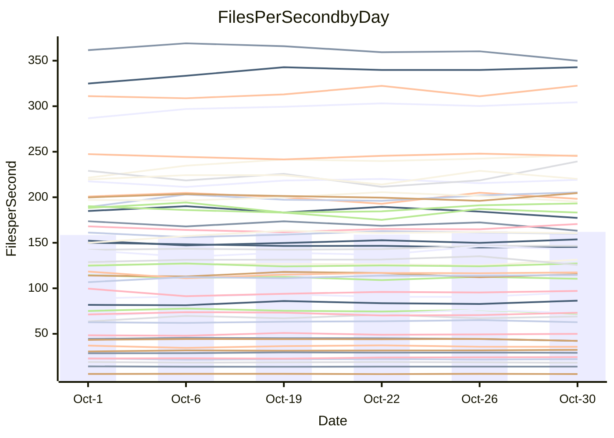

<!---
# This file is auto-generated. Do not edit.
# cspell:disable
--->
# Performance Report

## Daily Performance

## Time to Process Files

| Repository                                      | Elapsed | Min/Avg/Max           |   SD | SD Graph                |
| ----------------------------------------------- | ------: | :-------------------: | ---: | ----------------------- |
| AdaDoom3/AdaDoom3                    |    3.53 | 3.4 /   3.5 /   3.7   | 0.09 | `     ┣━┻━━●━━┻━┫     ` |
| alexiosc/megistos                    |    8.01 | 7.3 /   8.0 /   8.6   | 0.36 | `    ┣━━┻━━●━━┻━━┫    ` |
| apollographql/apollo-server          |    2.65 | 2.6 /   2.8 /   3.0   | 0.10 | `     ┣━●━━╋━━┻━┫     ` |
| aspnetboilerplate/aspnetboilerplate  |   10.43 | 10.3 /  10.6 /  10.9  | 0.22 | `    ┣━━┻●━╋━━┻━━┫    ` |
| aws-amplify/docs                     |   13.04 | 12.4 /  12.9 /  13.9  | 0.45 | `    ┣━━┻━━╋●━┻━━┫    ` |
| Azure/azure-rest-api-specs           |    9.68 | 9.6 /  10.0 /  10.7   | 0.28 | `    ┣━━●━━╋━━┻━━┫    ` |
| bitjson/typescript-starter           |    1.10 | 1.0 /   1.1 /   1.1   | 0.02 | `     ┣━━┻━╋━┻●━┫     ` |
| caddyserver/caddy                    |    4.00 | 3.7 /   3.8 /   3.9   | 0.08 | `     ┣━┻━━╋━━┻━┫ ●   ` |
| canada-ca/open-source-logiciel-libre |    1.21 | 1.1 /   1.2 /   1.3   | 0.04 | `     ┣━┻━━╋━●┻━┫     ` |
| chef/chef                            |    6.10 | 5.7 /   6.0 /   6.4   | 0.19 | `    ┣━━┻━━╋●━┻━━┫    ` |
| dart-lang/sdk                        |   66.69 | 63.7 /  67.0 /  73.2  | 2.71 | `  ┣━━━┻━━━●━━━┻━━━┫  ` |
| django/django                        |   15.70 | 14.9 /  15.6 /  16.5  | 0.52 | `    ┣━━┻━━╋●━┻━━┫    ` |
| eslint/eslint                        |   10.86 | 10.7 /  11.1 /  11.8  | 0.37 | `    ┣━━┻●━╋━━┻━━┫    ` |
| exonum/exonum                        |    3.65 | 3.5 /   3.7 /   3.8   | 0.09 | `     ┣━┻━●╋━━┻━┫     ` |
| flutter/samples                      |   16.37 | 16.2 /  16.7 /  17.2  | 0.31 | `    ┣━━●━━╋━━┻━━┫    ` |
| gitbucket/gitbucket                  |    3.74 | 3.5 /   3.7 /   3.8   | 0.09 | `     ┣━┻━━╋━●┻━┫     ` |
| googleapis/google-cloud-cpp          |  145.71 | 139.9 / 148.6 / 165.8 | 7.12 | `  ┣━━━┻━●━╋━━━┻━━━┫  ` |
| graphql/express-graphql              |    1.18 | 1.1 /   1.2 /   1.2   | 0.03 | `     ┣━┻━━●━━┻━┫     ` |
| graphql/graphql-js                   |    2.86 | 2.8 /   2.9 /   3.1   | 0.08 | `     ┣━┻●━╋━━┻━┫     ` |
| graphql/graphql-relay-js             |    1.15 | 1.1 /   1.2 /   1.3   | 0.04 | `     ┣━●━━╋━━┻━┫     ` |
| graphql/graphql-spec                 |    1.36 | 1.3 /   1.4 /   1.4   | 0.04 | `     ┣━┻━━●━━┻━┫     ` |
| iluwatar/java-design-patterns        |   12.96 | 12.8 /  13.3 /  13.8  | 0.27 | `    ┣━━●━━╋━━┻━━┫    ` |
| ktaranov/sqlserver-kit               |    6.68 | 6.6 /   6.8 /   7.1   | 0.18 | `    ┣━━┻●━╋━━┻━━┫    ` |
| liriliri/licia                       |    4.19 | 4.1 /   4.3 /   4.4   | 0.10 | `    ┣━━┻●━╋━━┻━━┫    ` |
| MartinThoma/LaTeX-examples           |    6.89 | 6.8 /   7.1 /   7.6   | 0.22 | `    ┣━━┻●━╋━━┻━━┫    ` |
| mdx-js/mdx                           |    2.04 | 2.0 /   2.1 /   2.3   | 0.11 | `     ┣━┻━●╋━━┻━┫     ` |
| microsoft/TypeScript-Website         |    6.05 | 5.6 /   5.8 /   6.0   | 0.14 | `    ┣━━┻━━╋━━┻━━●    ` |
| MicrosoftDocs/PowerShell-Docs        |   23.61 | 23.3 /  24.3 /  27.2  | 1.01 | `   ┣━━━┻●━╋━━┻━━━┫   ` |
| neovim/nvim-lspconfig                |    4.65 | 4.3 /   4.4 /   4.7   | 0.10 | `    ┣━━┻━━╋━━┻━━●    ` |
| pagekit/pagekit                      |    3.74 | 3.5 /   3.7 /   4.0   | 0.14 | `    ┣━━┻━━╋●━┻━━┫    ` |
| php/php-src                          |   26.49 | 26.3 /  27.6 /  30.2  | 1.16 | `   ┣━━━●━━╋━━┻━━━┫   ` |
| plasticrake/tplink-smarthome-api     |    1.47 | 1.3 /   1.4 /   1.5   | 0.03 | `     ┣━┻━━╋━━┻━┫ ●   ` |
| prettier/prettier                    |    7.36 | 7.2 /   7.5 /   7.8   | 0.16 | `    ┣━━●━━╋━━┻━━┫    ` |
| pycontribs/jira                      |    1.58 | 1.5 /   1.6 /   1.7   | 0.06 | `     ┣━┻━●╋━━┻━┫     ` |
| RustPython/RustPython                |    5.23 | 5.2 /   5.5 /   5.8   | 0.19 | `    ┣━━●━━╋━━┻━━┫    ` |
| shoelace-style/shoelace              |    3.02 | 2.9 /   3.0 /   3.1   | 0.05 | `     ┣━┻━━╋━●┻━┫     ` |
| slint-ui/slint                       |   14.34 | 13.1 /  13.6 /  14.4  | 0.38 | `    ┣━━┻━━╋━━┻━━●    ` |
| SoftwareBrothers/admin-bro           |    2.58 | 2.6 /   2.7 /   2.9   | 0.08 | `     ┣━●━━╋━━┻━┫     ` |
| sveltejs/svelte                      |   22.91 | 21.4 /  21.9 /  22.6  | 0.37 | `    ┣━━┻━━╋━━┻━━┫ ●  ` |
| TheAlgorithms/Python                 |    5.68 | 5.7 /   5.9 /   6.6   | 0.24 | `    ┣━━●━━╋━━┻━━┫    ` |
| twbs/bootstrap                       |    1.88 | 1.8 /   1.9 /   2.0   | 0.05 | `     ┣━┻━━╋●━┻━┫     ` |
| typescript-cheatsheets/react         |    1.48 | 1.4 /   1.5 /   1.6   | 0.06 | `     ┣━┻━━╋●━┻━┫     ` |
| typescript-eslint/typescript-eslint  |    4.22 | 4.2 /   4.3 /   4.5   | 0.09 | `     ┣━●━━╋━━┻━┫     ` |
| vitest-dev/vitest                    |    9.24 | 9.4 /  10.2 /  10.9   | 0.41 | `   ●┣━━┻━━╋━━┻━━┫    ` |
| w3c/aria-practices                   |    3.53 | 3.5 /   3.6 /   3.7   | 0.10 | `     ┣━┻●━╋━━┻━┫     ` |
| w3c/specberus                        |    2.03 | 2.0 /   2.1 /   2.3   | 0.07 | `     ┣━┻●━╋━━┻━┫     ` |
| webdeveric/webpack-assets-manifest   |    1.30 | 1.2 /   1.2 /   1.3   | 0.02 | `     ┣━━┻━╋━┻━━┫ ●   ` |
| webpack/webpack                      |    5.54 | 5.4 /   5.7 /   6.1   | 0.18 | `    ┣━━┻●━╋━━┻━━┫    ` |
| wireapp/wire-desktop                 |    1.42 | 1.4 /   1.4 /   1.5   | 0.04 | `     ┣━┻━●╋━━┻━┫     ` |
| wireapp/wire-webapp                  |   11.13 | 10.7 /  11.2 /  12.5  | 0.46 | `    ┣━━┻━●╋━━┻━━┫    ` |

Note:
- Elapsed time is in seconds.

## Files per Second over Time

| Repository                                      | Files |    Sec |    Fps |    Rel | Trend Fps       |    N |
| ----------------------------------------------- | ----: | -----: | -----: | -----: | --------------- | ---: |
| AdaDoom3/AdaDoom3                    |   103 |   3.53 |  29.14 | -0.24% | `▆▆█▅██▆█▆█▇▇▇` |   12 |
| alexiosc/megistos                    |   583 |   8.01 |  72.80 | -0.61% | `▄▃▆▆▅▇▃▄▅█▆▅▅` |   12 |
| apollographql/apollo-server          |   253 |   2.65 |  95.53 |  4.86% | `▇▄▇▅▇█▆▇▅▅▇▆█` |   12 |
| aspnetboilerplate/aspnetboilerplate  |  2286 |  10.43 | 219.14 |  1.17% | `█▆▅▆▆███▇▆▆█▇` |   12 |
| aws-amplify/docs                     |  2871 |  13.04 | 220.21 | -1.23% | `▅█▆▇▇▇▆▇▄█▇█▆` |   12 |
| Azure/azure-rest-api-specs           |  2376 |   9.68 | 245.41 |  0.06% | `▇▇▆▇▄▇▇▅█▇█▇▇` |   12 |
| bitjson/typescript-starter           |    20 |   1.10 |  18.25 | -2.56% | `▇█▆▆▅▇█▇█▇▇▅▅` |   12 |
| caddyserver/caddy                    |   288 |   4.00 |  72.03 | -4.91% | `▇▅██▇▅▇▆▆▇▆█▄` |   12 |
| canada-ca/open-source-logiciel-libre |     7 |   1.21 |   5.80 | -2.73% | `█▅█▇▇█▇▄▇██▇▆` |   12 |
| chef/chef                            |  1191 |   6.10 | 195.27 | -2.44% | `▅▆▇▄▇▆▇█▇▆█▆▅` |   12 |
| dart-lang/sdk                        | 10703 |  66.69 | 160.48 |  0.76% | `▆▃▇▅▇▇██▆█▇▆▇` |   12 |
| django/django                        |  2877 |  15.70 | 183.23 | -0.66% | `▇█▇▇▅▅█▄▅▇▆█▆` |   12 |
| eslint/eslint                        |  2098 |  10.86 | 193.23 |  2.72% | `█▅██▅▅▇▇▄▇▇▇█` |   12 |
| exonum/exonum                        |   421 |   3.65 | 115.50 |  0.58% | `▅▇▅▆██▇▆█▆▆▅▇` |   12 |
| flutter/samples                      |  2400 |  16.37 | 146.59 |  1.99% | `▆▆▇▆▆▆▇█▅█▇██` |   12 |
| gitbucket/gitbucket                  |   413 |   3.74 | 110.40 | -1.53% | `█▆▆▅▅▅█▅▅▇▆▅▅` |   12 |
| googleapis/google-cloud-cpp          | 20799 | 145.71 | 142.74 |  1.84% | `▆█▇▃▆▆▆▇▄▇██▇` |   12 |
| graphql/express-graphql              |    26 |   1.18 |  22.12 |  0.01% | `█▇▄▇▆▆▆█▅▄▆▇▆` |   12 |
| graphql/graphql-js                   |   364 |   2.86 | 127.28 |  1.88% | `▆▇█▇█▇▅▆█▆█▅█` |   12 |
| graphql/graphql-relay-js             |    28 |   1.15 |  24.43 |  4.43% | `▇▄▆▅▅▆▅█▅▇▇██` |   12 |
| graphql/graphql-spec                 |    19 |   1.36 |  13.97 | -0.01% | `▇▇▇▅▅▆▆▅▇▄█▆▆` |   12 |
| iluwatar/java-design-patterns        |  1992 |  12.96 | 153.73 |  2.28% | `▇▇▆▆▆▇▆█▇█▇▅█` |   12 |
| ktaranov/sqlserver-kit               |   489 |   6.68 |  73.22 |  1.95% | `▇▅█▇██▇▅▆▆▅▇▇` |   12 |
| liriliri/licia                       |  1437 |   4.19 | 342.79 |  1.71% | `▅▅▅▇█▇█▇▇█▆▇▇` |   12 |
| MartinThoma/LaTeX-examples           |  1409 |   6.89 | 204.60 |  2.38% | `▆█▇█▇█▆▇▆▄█▆█` |   12 |
| mdx-js/mdx                           |   141 |   2.04 |  69.09 |  2.25% | `▃▆▇▇▅▇▆█▇▅▇▆▇` |   12 |
| microsoft/TypeScript-Website         |   761 |   6.05 | 125.70 | -4.73% | `▅▆▅█▆▆▇▅▇▇██▄` |   12 |
| MicrosoftDocs/PowerShell-Docs        |  2708 |  23.61 | 114.69 |  2.66% | `█▃▇▇▇▆▆▇██▆██` |   12 |
| neovim/nvim-lspconfig                |   759 |   4.65 | 163.25 | -4.83% | `▇█▇▅██▆▅▇▇▇▇▅` |   12 |
| pagekit/pagekit                      |   741 |   3.74 | 198.27 | -1.34% | `▆▆█▆▇█▄▅▅▇█▇▆` |   12 |
| php/php-src                          |  2289 |  26.49 |  86.40 |  3.67% | `▅▇▄█▇███▅▇▆▆█` |   12 |
| plasticrake/tplink-smarthome-api     |    62 |   1.47 |  42.25 | -5.84% | `▇▆▇██▆█▆█▆▅█▄` |   12 |
| prettier/prettier                    |  2374 |   7.36 | 322.55 |  3.05% | `▆▆▅▆▆▆▆█▇▅▅██` |   12 |
| pycontribs/jira                      |    79 |   1.58 |  49.99 |  1.40% | `▅▅▆▄█▆▇▆▅▄▆█▆` |   12 |
| RustPython/RustPython                |   688 |   5.23 | 131.49 |  4.27% | `▅▇▆▆▅▇▆▄█▅▄██` |   12 |
| shoelace-style/shoelace              |   439 |   3.02 | 145.45 | -1.06% | `█▇▇▇▇▇▆▇▇▇▅▇▆` |   12 |
| slint-ui/slint                       |  2543 |  14.34 | 177.36 | -4.63% | `▇▆█▇▅▇▇█▇▅▇█▅` |   12 |
| SoftwareBrothers/admin-bro           |   441 |   2.58 | 170.61 |  3.70% | `▇██▅▇▇▄▇▆▇▇▆█` |   12 |
| sveltejs/svelte                      |  8016 |  22.91 | 349.95 | -3.66% | `▆▇▇█▇▇█▇▅▆▆▇▅` |   12 |
| TheAlgorithms/Python                 |  1399 |   5.68 | 246.20 |  3.90% | `▆▃▇▆▇▇█▇▇█▇██` |   12 |
| twbs/bootstrap                       |   118 |   1.88 |  62.75 | -1.17% | `▅▇▆▅▄▇█▇▆▇█▇▆` |   12 |
| typescript-cheatsheets/react         |    53 |   1.48 |  35.71 | -1.43% | `▇▇▃▇▇▇▇█▇█▄▆▆` |   12 |
| typescript-eslint/typescript-eslint  |  1285 |   4.22 | 304.34 |  2.23% | `▅▅▇▆▇▇▇█▇██▆█` |   12 |
| vitest-dev/vitest                    |  2212 |   9.24 | 239.32 |  8.34% | `█▅▄▆▅▇▆▅▄▄▅▆█` |   12 |
| w3c/aria-practices                   |   414 |   3.53 | 117.43 |  1.59% | `██▅▅▆▅██▆▇▆█▇` |   12 |
| w3c/specberus                        |   197 |   2.03 |  97.05 |  1.97% | `▇█▃▆▆▅▆▇▆▆▆▇▇` |   12 |
| webdeveric/webpack-assets-manifest   |    55 |   1.30 |  42.24 | -4.24% | `▅▅▆▇▅▇▆▇▅█▅▅▄` |   12 |
| webpack/webpack                      |  1137 |   5.54 | 205.39 |  3.79% | `▄▆▇█▆█▆▇▆█▇▇█` |   12 |
| wireapp/wire-desktop                 |    46 |   1.42 |  32.41 |  2.95% | `▄▅▅█▇▆▅▇▆▅█▇▇` |   12 |
| wireapp/wire-webapp                  |  1781 |  11.13 | 160.02 | -0.05% | `█▆▄█▇▆▇▇█▇█▆▇` |   12 |

## Data Throughput

| Repository                                      | Files |    Sec |     Kps |    Rel | Trend Kps       |    N |
| ----------------------------------------------- | ----: | -----: | ------: | -----: | --------------- | ---: |
| AdaDoom3/AdaDoom3                    |   103 |   3.53 |  619.32 | -0.24% | `▆▆█▅██▆█▆█▇▇▇` |   12 |
| alexiosc/megistos                    |   583 |   8.01 |  572.07 | -0.61% | `▄▃▆▆▅▇▃▄▅█▆▅▅` |   12 |
| apollographql/apollo-server          |   253 |   2.65 |  778.98 |  6.30% | `▇▄▇▅▇█▆▇▅▅▆▆█` |   12 |
| aspnetboilerplate/aspnetboilerplate  |  2286 |  10.43 |  533.17 |  1.17% | `█▆▅▆▆███▇▆▆█▇` |   12 |
| aws-amplify/docs                     |  2871 |  13.04 |  768.71 | -1.23% | `▅█▆▇▇▇▆▇▄█▇█▆` |   12 |
| Azure/azure-rest-api-specs           |  2376 |   9.68 |  666.30 |  1.90% | `▇▆▅▇▄▇▇▅█▇█▇▇` |   12 |
| bitjson/typescript-starter           |    20 |   1.10 |   72.98 | -2.56% | `▇█▆▆▅▇█▇█▇▇▅▅` |   12 |
| caddyserver/caddy                    |   288 |   4.00 |  624.55 | -4.20% | `▇▅█▇▆▅▇▆▆▇▇█▅` |   12 |
| canada-ca/open-source-logiciel-libre |     7 |   1.21 |   48.03 | -2.73% | `█▅█▇▇█▇▄▇██▇▆` |   12 |
| chef/chef                            |  1191 |   6.10 |  905.04 | -2.13% | `▅▆▇▄▇▆▆█▇▆█▆▆` |   12 |
| dart-lang/sdk                        | 10703 |  66.69 | 1092.86 |  0.49% | `▆▃▇▅▇▇██▆█▇▆▇` |   12 |
| django/django                        |  2877 |  15.70 | 1151.67 | -0.48% | `▇█▇▇▅▅█▄▅▇▆█▆` |   12 |
| eslint/eslint                        |  2098 |  10.86 | 1389.26 |  2.59% | `█▅██▅▅▇▇▄▇▇▇█` |   12 |
| exonum/exonum                        |   421 |   3.65 | 1104.79 |  0.58% | `▅▇▅▆██▇▆█▆▆▅▇` |   12 |
| flutter/samples                      |  2400 |  16.37 | 1308.15 |  1.99% | `▆▆▇▆▆▆▇█▅█▇██` |   12 |
| gitbucket/gitbucket                  |   413 |   3.74 |  501.73 | -1.56% | `█▆▆▅▅▅█▅▅▇▆▅▅` |   12 |
| googleapis/google-cloud-cpp          | 20799 | 145.71 | 1159.49 |  1.84% | `▆▇▇▃▆▆▆▇▄▇██▇` |   12 |
| graphql/express-graphql              |    26 |   1.18 |  101.26 |  0.01% | `█▇▄▇▆▆▆█▅▄▆▇▆` |   12 |
| graphql/graphql-js                   |   364 |   2.86 |  735.68 |  2.22% | `▆▇█▇▇▇▄▆█▆█▅█` |   12 |
| graphql/graphql-relay-js             |    28 |   1.15 |   95.96 |  4.43% | `▇▄▆▅▅▆▅█▅▇▇██` |   12 |
| graphql/graphql-spec                 |    19 |   1.36 |  466.28 | -0.01% | `▇▇▇▅▅▆▆▅▇▄█▆▆` |   12 |
| iluwatar/java-design-patterns        |  1992 |  12.96 |  475.16 |  2.28% | `▇▇▆▆▆▇▆█▇█▇▅█` |   12 |
| ktaranov/sqlserver-kit               |   489 |   6.68 | 1108.60 |  1.95% | `▇▅█▇██▇▅▆▆▅▇▇` |   12 |
| liriliri/licia                       |  1437 |   4.19 |  408.39 |  1.71% | `▅▅▅▇█▇█▇▇█▆▇▇` |   12 |
| MartinThoma/LaTeX-examples           |  1409 |   6.89 |  422.56 |  2.38% | `▆█▇█▇█▆▇▆▄█▆█` |   12 |
| mdx-js/mdx                           |   141 |   2.04 |  321.44 |  2.25% | `▃▆▇▇▅▇▆█▇▅▇▆▇` |   12 |
| microsoft/TypeScript-Website         |   761 |   6.05 |  869.50 | -4.71% | `▅▆▅█▆▆▇▅▇▇██▄` |   12 |
| MicrosoftDocs/PowerShell-Docs        |  2708 |  23.61 | 1180.39 |  2.68% | `▇▃▇▇▇▆▆▇██▆██` |   12 |
| neovim/nvim-lspconfig                |   759 |   4.65 |  272.74 | -4.59% | `▇█▇▅██▆▅▇▇▇▇▅` |   12 |
| pagekit/pagekit                      |   741 |   3.74 |  413.40 | -1.34% | `▆▆█▆▇█▄▅▅▇█▇▆` |   12 |
| php/php-src                          |  2289 |  26.49 | 1509.04 |  3.85% | `▅▇▄█▇███▅▇▆▆█` |   12 |
| plasticrake/tplink-smarthome-api     |    62 |   1.47 |  228.28 | -5.84% | `▇▆▇██▆█▆█▆▅█▄` |   12 |
| prettier/prettier                    |  2374 |   7.36 |  450.67 |  2.79% | `▆▆▆▆▆▆▆█▇▅▅██` |   12 |
| pycontribs/jira                      |    79 |   1.58 |  354.35 |  1.40% | `▅▅▆▄█▆▇▆▅▄▆█▆` |   12 |
| RustPython/RustPython                |   688 |   5.23 | 1048.71 |  5.15% | `▅▇▆▆▅▇▆▄█▅▄██` |   12 |
| shoelace-style/shoelace              |   439 |   3.02 |  702.73 | -1.06% | `█▇▇▇▇▇▆▇▇▇▅▇▆` |   12 |
| slint-ui/slint                       |  2543 |  14.34 | 1093.92 | -4.33% | `▇▇█▇▅▇▆█▇▅▇█▅` |   12 |
| SoftwareBrothers/admin-bro           |   441 |   2.58 |  376.04 |  3.70% | `▇██▅▇▇▄▇▆▇▇▆█` |   12 |
| sveltejs/svelte                      |  8016 |  22.91 |  233.21 | -3.85% | `▆▇▇█▇▇█▇▅▆▆▇▅` |   12 |
| TheAlgorithms/Python                 |  1399 |   5.68 |  626.14 |  3.93% | `▆▃▇▆▇▇█▇▇█▇██` |   12 |
| twbs/bootstrap                       |   118 |   1.88 |  514.77 | -1.17% | `▅▇▆▅▄▇█▇▆▇█▇▆` |   12 |
| typescript-cheatsheets/react         |    53 |   1.48 |  264.11 | -1.43% | `▇▇▃▇▇▇▇█▇█▄▆▆` |   12 |
| typescript-eslint/typescript-eslint  |  1285 |   4.22 | 1564.80 |  2.31% | `▅▅▇▆▇▇▇█▇██▆█` |   12 |
| vitest-dev/vitest                    |  2212 |   9.24 |  534.35 |  7.44% | `█▆▅▆▅▇▆▅▄▄▅▆█` |   12 |
| w3c/aria-practices                   |   414 |   3.53 | 1094.90 |  1.59% | `██▅▅▆▅██▆▇▆█▇` |   12 |
| w3c/specberus                        |   197 |   2.03 |  306.92 |  2.17% | `▇█▃▆▆▆▆▇▆▆▆▇▇` |   12 |
| webdeveric/webpack-assets-manifest   |    55 |   1.30 |   97.53 | -4.67% | `▆▆▇▇▅▇▆▇▅█▅▅▄` |   12 |
| webpack/webpack                      |  1137 |   5.54 |  929.03 |  3.00% | `▄▆▇█▆█▆▆▆█▇▇█` |   12 |
| wireapp/wire-desktop                 |    46 |   1.42 |  181.10 |  7.43% | `▂▃▂█▇▇▆▇▇▆█▇█` |   12 |
| wireapp/wire-webapp                  |  1781 |  11.13 |  590.76 |  0.69% | `▇▆▃█▇▆▇▇█▇█▇▇` |   12 |

