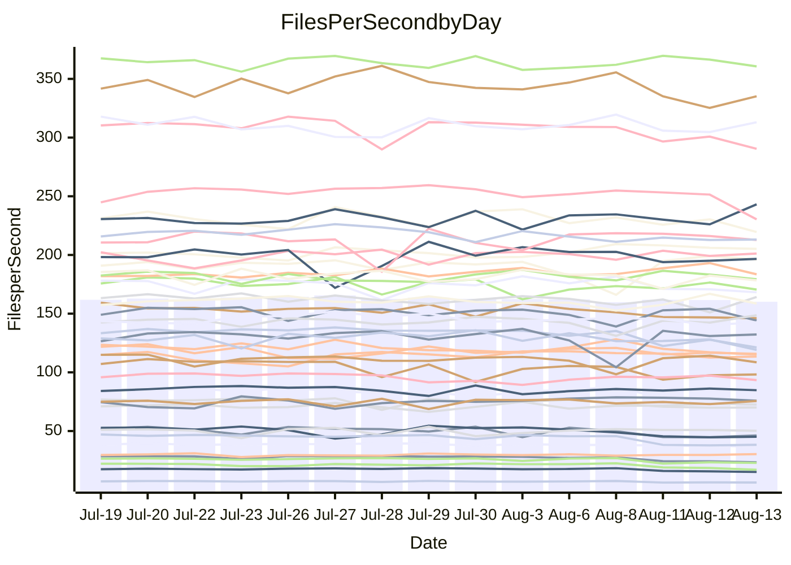

<!---
# This file is auto-generated. Do not edit.
# cspell:disable
--->
# Performance Report

## Daily Performance

## Time to Process Files

| Repository                                      | Elapsed | Min/Avg/Max           |   SD | SD Graph                |
| ----------------------------------------------- | ------: | :-------------------: | ---: | ----------------------- |
| AdaDoom3/AdaDoom3                    |    3.42 | 3.3 /   3.5 /   3.7   | 0.10 | `    ┣━━┻━●╋━━┻━━┫    ` |
| alexiosc/megistos                    |    7.63 | 7.4 /   7.8 /   8.5   | 0.27 | `    ┣━━┻●━╋━━┻━━┫    ` |
| apollographql/apollo-server          |    2.84 | 2.5 /   2.6 /   2.8   | 0.08 | `     ┣━┻━━╋━━┻━┫ ●   ` |
| aspnetboilerplate/aspnetboilerplate  |   11.15 | 10.1 /  10.7 /  12.2  | 0.40 | `    ┣━━┻━━╋━━┻●━┫    ` |
| aws-amplify/docs                     |   13.74 | 12.7 /  13.3 /  14.2  | 0.46 | `    ┣━━┻━━╋━━●━━┫    ` |
| Azure/azure-rest-api-specs           |   11.34 | 9.4 /   9.7 /  10.5   | 0.24 | `       ┣┻━╋━┻┫      ●` |
| bitjson/typescript-starter           |    1.26 | 0.9 /   1.0 /   1.1   | 0.08 | `     ┣━┻━━╋━━┻━┫    ●` |
| caddyserver/caddy                    |    3.74 | 3.6 /   3.8 /   4.1   | 0.16 | `    ┣━━┻━●╋━━┻━━┫    ` |
| canada-ca/open-source-logiciel-libre |    1.15 | 0.9 /   1.0 /   1.2   | 0.08 | `     ┣━┻━━╋━━┻●┫     ` |
| chef/chef                            |    6.10 | 5.9 /   6.3 /   7.7   | 0.37 | `    ┣━━┻●━╋━━┻━━┫    ` |
| dart-lang/sdk                        |   68.70 | 63.3 /  66.9 /  72.1  | 1.97 | `  ┣━━━┻━━━╋━━●┻━━━┫  ` |
| django/django                        |   16.36 | 14.8 /  15.6 /  16.2  | 0.32 | `    ┣━━┻━━╋━━┻━━┫ ●  ` |
| eslint/eslint                        |   11.56 | 10.6 /  11.2 /  12.7  | 0.40 | `    ┣━━┻━━╋━●┻━━┫    ` |
| exonum/exonum                        |    3.58 | 3.4 /   3.6 /   4.0   | 0.16 | `    ┣━━┻━━●━━┻━━┫    ` |
| flutter/samples                      |   16.45 | 16.5 /  17.1 /  18.7  | 0.51 | `   ┣━━●┻━━╋━━┻━━━┫   ` |
| gitbucket/gitbucket                  |    3.71 | 3.5 /   3.6 /   3.9   | 0.14 | `    ┣━━┻━━╋━●┻━━┫    ` |
| googleapis/google-cloud-cpp          |  141.99 | 135.4 / 142.7 / 153.9 | 4.74 | `  ┣━━━┻━━●╋━━━┻━━━┫  ` |
| graphql/express-graphql              |    1.16 | 1.0 /   1.0 /   1.2   | 0.07 | `     ┣━┻━━╋━━┻━●     ` |
| graphql/graphql-js                   |    3.17 | 2.6 /   2.8 /   3.1   | 0.11 | `    ┣━━┻━━╋━━┻━━┫   ●` |
| graphql/graphql-relay-js             |    1.18 | 0.9 /   1.0 /   1.2   | 0.08 | `     ┣━┻━━╋━━┻━●     ` |
| graphql/graphql-spec                 |    1.02 | 0.9 /   0.9 /   1.1   | 0.06 | `     ┣━┻━━╋━━●━┫     ` |
| iluwatar/java-design-patterns        |   13.91 | 12.6 /  13.2 /  14.6  | 0.53 | `    ┣━━┻━━╋━━┻●━┫    ` |
| ktaranov/sqlserver-kit               |    6.52 | 6.5 /   6.9 /   7.4   | 0.23 | `    ┣●━┻━━╋━━┻━━┫    ` |
| liriliri/licia                       |    4.24 | 4.0 /   4.2 /   4.6   | 0.14 | `    ┣━━┻━━●━━┻━━┫    ` |
| MartinThoma/LaTeX-examples           |    6.96 | 6.8 /   7.0 /   7.5   | 0.16 | `    ┣━━┻●━╋━━┻━━┫    ` |
| mdx-js/mdx                           |    1.97 | 1.8 /   1.9 /   2.2   | 0.09 | `     ┣━┻━━╋━●┻━┫     ` |
| microsoft/TypeScript-Website         |    5.57 | 5.5 /   5.9 /   7.3   | 0.34 | `    ┣━━●━━╋━━┻━━┫    ` |
| MicrosoftDocs/PowerShell-Docs        |   24.95 | 23.2 /  24.2 /  27.5  | 0.87 | `   ┣━━━┻━━╋━━●━━━┫   ` |
| neovim/nvim-lspconfig                |    4.42 | 4.1 /   4.3 /   4.7   | 0.14 | `    ┣━━┻━━╋━●┻━━┫    ` |
| pagekit/pagekit                      |    3.52 | 3.5 /   3.7 /   4.0   | 0.10 | `    ┣━●┻━━╋━━┻━━┫    ` |
| php/php-src                          |   26.30 | 25.6 /  26.9 /  29.7  | 1.05 | `   ┣━━━┻●━╋━━┻━━━┫   ` |
| plasticrake/tplink-smarthome-api     |    1.34 | 1.1 /   1.2 /   1.4   | 0.09 | `     ┣━┻━━╋━━●━┫     ` |
| prettier/prettier                    |    7.14 | 7.1 /   7.3 /   7.7   | 0.17 | `    ┣━●┻━━╋━━┻━━┫    ` |
| pycontribs/jira                      |    1.49 | 1.5 /   1.6 /   1.8   | 0.08 | `     ┣━●━━╋━━┻━┫     ` |
| RustPython/RustPython                |    5.81 | 5.0 /   5.3 /   5.7   | 0.19 | `    ┣━━┻━━╋━━┻━━┫ ●  ` |
| shoelace-style/shoelace              |    3.00 | 2.7 /   2.9 /   3.3   | 0.13 | `    ┣━━┻━━╋━━●━━┫    ` |
| slint-ui/slint                       |   12.32 | 11.4 /  12.2 /  14.7  | 0.58 | `    ┣━━┻━━╋●━┻━━┫    ` |
| SoftwareBrothers/admin-bro           |    2.59 | 2.4 /   2.5 /   2.7   | 0.08 | `     ┣━┻━━╋━●┻━┫     ` |
| sveltejs/svelte                      |   21.33 | 20.4 /  21.2 /  21.9  | 0.41 | `   ┣━━━┻━━╋●━┻━━━┫   ` |
| TheAlgorithms/Python                 |    5.75 | 5.6 /   6.0 /   6.9   | 0.27 | `    ┣━━●━━╋━━┻━━┫    ` |
| twbs/bootstrap                       |    1.53 | 1.3 /   1.4 /   1.6   | 0.08 | `     ┣━┻━━╋━━●━┫     ` |
| typescript-cheatsheets/react         |    1.43 | 1.3 /   1.4 /   1.5   | 0.05 | `     ┣━┻━━╋━●┻━┫     ` |
| typescript-eslint/typescript-eslint  |    4.27 | 4.0 /   4.2 /   4.5   | 0.13 | `    ┣━━┻━━╋━━●━━┫    ` |
| vitest-dev/vitest                    |   10.14 | 8.9 /   9.4 /  10.2   | 0.36 | `    ┣━━┻━━╋━━┻━━●    ` |
| w3c/aria-practices                   |    3.56 | 3.2 /   3.4 /   3.6   | 0.11 | `    ┣━━┻━━╋━━┻●━┫    ` |
| w3c/specberus                        |    2.08 | 1.8 /   2.0 /   2.6   | 0.17 | `    ┣━━┻━━╋━●┻━━┫    ` |
| webdeveric/webpack-assets-manifest   |    1.19 | 1.0 /   1.1 /   1.2   | 0.08 | `     ┣━┻━━╋━━●━┫     ` |
| webpack/webpack                      |    5.76 | 5.3 /   5.6 /   6.5   | 0.25 | `    ┣━━┻━━╋━●┻━━┫    ` |
| wireapp/wire-desktop                 |    1.17 | 0.9 /   1.0 /   1.3   | 0.10 | `     ┣━┻━━╋━━┻━●     ` |
| wireapp/wire-webapp                  |   10.93 | 10.8 /  11.3 /  13.3  | 0.50 | `    ┣━━┻●━╋━━┻━━┫    ` |

Note:
- Elapsed time is in seconds.

## Files per Second over Time

| Repository                                      | Files |    Sec |    Fps |     Rel | Trend Fps              |    N |
| ----------------------------------------------- | ----: | -----: | -----: | ------: | ---------------------- | ---: |
| AdaDoom3/AdaDoom3                    |   103 |   3.42 |  30.11 |   1.30% | `▆▇▆▆█▇▇▆▇▇▇▆▅▇█▇▅▇█▇` |   28 |
| alexiosc/megistos                    |   583 |   7.63 |  76.46 |   2.02% | `▇█▅█▄▆█▇█▇▇▆▆▅█▆▇▄▆▇` |   28 |
| apollographql/apollo-server          |   252 |   2.84 |  88.67 |  -7.61% | `███▇▅▅▆▄▇▅▆▇▇▇▆▇▇██▄` |   28 |
| aspnetboilerplate/aspnetboilerplate  |  2286 |  11.15 | 204.96 |  -3.97% | `▆▆▆▃█▆▆▅█▇▆▇▇█▆▇▆█▇▅` |   28 |
| aws-amplify/docs                     |  2871 |  13.74 | 208.88 |  -3.62% | `▇▇██▇▄▇▇█▇▄▆▇▅▆▇▆▄▇▅` |   28 |
| Azure/azure-rest-api-specs           |  2444 |  11.34 | 215.59 | -14.39% | `▇▇███▇█▇▇▇▇▇▇█▇▇▆█▆▂` |   28 |
| bitjson/typescript-starter           |    20 |   1.26 |  15.88 | -24.17% | `▇▄▇▇▆▇█▇▇▇▇█▅▃▄▅▂▄▃▁` |   28 |
| caddyserver/caddy                    |   285 |   3.74 |  76.24 |   0.97% | `▆▇▄▆▇▅▇▇██▆██▇██▇▇▆▇` |   28 |
| canada-ca/open-source-logiciel-libre |     7 |   1.15 |   6.10 | -11.67% | `▇██▅█▆▆▆▆▇▆█▄▃▂▄▄▄▃▃` |   28 |
| chef/chef                            |  1207 |   6.10 | 197.88 |   3.51% | `█▅▇▆▇▇▆▇▂▇▇▃▇▆▇▇█▇▇▇` |   28 |
| dart-lang/sdk                        | 10753 |  68.70 | 156.52 |  -2.40% | `▇▇▆▆▇▇▅▆▇▄▇▄▆▅▆█▇▇▆▅` |   28 |
| django/django                        |  2849 |  16.36 | 174.16 |  -4.66% | `▇▆▅▅▅▆▆▇▆▇▄▅▆▆█▆▆▆▆▄` |   28 |
| eslint/eslint                        |  2081 |  11.56 | 179.98 |  -2.81% | `▇▆▆▇▆▇▆▇▅▇▅▆▇▆▇▇██▇▅` |   28 |
| exonum/exonum                        |   421 |   3.58 | 117.71 |  -0.44% | `▃▇▅▆█▄█▆▇▆█▇▇▄▆▅▆▇▅▆` |   28 |
| flutter/samples                      |  2452 |  16.45 | 149.08 |   4.05% | `▇▇▇▆▇▇█▇▅▇█▄▇█▆▆▇▆██` |   28 |
| gitbucket/gitbucket                  |   413 |   3.71 | 111.42 |  -2.51% | `▄▄▇█▇▅▇████▇█▇▆▅▅█▇▆` |   28 |
| googleapis/google-cloud-cpp          | 20602 | 141.99 | 145.09 |   0.47% | `█▇█▇█▅▇▆▇▆▇▇▇▅█▆▆▄▅▆` |   28 |
| graphql/express-graphql              |    26 |   1.16 |  22.46 | -11.97% | `▇▇██▇▇█▆▇███▃▃▄▄▃▅▄▃` |   28 |
| graphql/graphql-js                   |   364 |   3.17 | 114.84 | -13.24% | `█▇█▇▇▇█▇▅▇▇▇▄▆▃▅▆▆▆▂` |   28 |
| graphql/graphql-relay-js             |    28 |   1.18 |  23.64 | -12.80% | `█▆▇▇▇▇▇▇▆▆▆▆▄▄▃▃▄▄▂▃` |   28 |
| graphql/graphql-spec                 |    16 |   1.02 |  15.75 |  -8.55% | `█▇█▇██▇▇▆▇▇█▅▅▅▃▅▅▃▄` |   28 |
| iluwatar/java-design-patterns        |  1992 |  13.91 | 143.18 |  -4.95% | `▇▃▇▇▆▇▇▇▇▇▄▄█▆▇▇█▇▅▅` |   28 |
| ktaranov/sqlserver-kit               |   489 |   6.52 |  75.05 |   5.48% | `▄▇█▆▄▅▇█▆▆▄▆▆▇▆██▆▆█` |   28 |
| liriliri/licia                       |  1437 |   4.24 | 339.12 |  -0.70% | `▅▆▇█▇█▅▆▆▇▇█▆▆▅▆▄▄▅▆` |   28 |
| MartinThoma/LaTeX-examples           |  1409 |   6.96 | 202.51 |   1.22% | `▇█▇█▅▇▇▇▇▇▇▆██▇█▇▅▇▇` |   28 |
| mdx-js/mdx                           |   141 |   1.97 |  71.70 |  -3.58% | `▇▇█▄█▆▇▇███▆▅▆▅▆▃▆▄▆` |   28 |
| microsoft/TypeScript-Website         |   761 |   5.57 | 136.55 |   5.20% | `▇▆▇█▇█▇█▇▆▆▂████▆█▇█` |   28 |
| MicrosoftDocs/PowerShell-Docs        |  2708 |  24.95 | 108.53 |  -3.02% | `▇▇▇▆▆▆█▇▆▆▇▃▇▇▇▇▇█▆▆` |   28 |
| neovim/nvim-lspconfig                |   752 |   4.42 | 170.03 |  -2.62% | `▇▇█▅▇██▄▇▄▇▇▅▇▆█▆▇▆▆` |   28 |
| pagekit/pagekit                      |   741 |   3.52 | 210.54 |   4.07% | `▆▄▇▇▆▆▅▆▇▅▇███▇▇▇▇▆█` |   28 |
| php/php-src                          |  2281 |  26.30 |  86.75 |   1.85% | `█▆▇▆▄▇█▅▃▇█▇▇▆▅▇▆█▆▇` |   28 |
| plasticrake/tplink-smarthome-api     |    62 |   1.34 |  46.40 |  -7.27% | `██▇▇▆██▃██▇▆▄▄▃▃▃▄▄▄` |   28 |
| prettier/prettier                    |  2285 |   7.14 | 319.99 |   3.11% | `█▅▅▅█▇▇▆▅█▇█▇▇▅▅▆▆▆█` |   28 |
| pycontribs/jira                      |    79 |   1.49 |  53.09 |   5.89% | `█▇█▄█▄▄▅▅█▆▇▆▇▇▇▆▇▅█` |   28 |
| RustPython/RustPython                |   683 |   5.81 | 117.66 |  -9.02% | `▇▇▆▇▆██▅█▆█▅▄▇▅▆▅▆▄▃` |   28 |
| shoelace-style/shoelace              |   439 |   3.00 | 146.30 |  -4.26% | `▆█▇▆██▃██▆▆▆▆▅▆▆▅▅▅▅` |   28 |
| slint-ui/slint                       |  2225 |  12.32 | 180.57 |  -0.61% | `▇▆██▇█▆███▇▇▇▃█▇▇█▆▇` |   28 |
| SoftwareBrothers/admin-bro           |   441 |   2.59 | 170.16 |  -2.63% | `▇█▇▄▇▇▆█▆▇██▆▅▆▆▅▆▅▆` |   28 |
| sveltejs/svelte                      |  7787 |  21.33 | 365.11 |   0.07% | `▇▇█▇▆▇█▆▆▇▆▆▇█▇█▆█▆▇` |   28 |
| TheAlgorithms/Python                 |  1390 |   5.75 | 241.75 |   4.65% | `▆▆▇▆▅█▆▅▆▆▇▇▇█▃▇▆▃█▇` |   28 |
| twbs/bootstrap                       |   118 |   1.53 |  77.18 |  -6.55% | `██▇▆▇▆▄▇█▅██▄▅▅▅▃▃▄▄` |   28 |
| typescript-cheatsheets/react         |    53 |   1.43 |  37.12 |  -3.02% | `▇▇▇██▄█▇▅█▇▇▆▇▅▇▇▅▅▆` |   28 |
| typescript-eslint/typescript-eslint  |  1276 |   4.27 | 298.75 |  -2.69% | `███▅▇█▇▇█▇▇▇▅▆▆▆▆▆▄▆` |   28 |
| vitest-dev/vitest                    |  2189 |  10.14 | 215.78 |  -6.25% | `▇▄█▇▆███▅▆▇▇▅▆▆▅▇▇▆▄` |   28 |
| w3c/aria-practices                   |   409 |   3.56 | 114.93 |  -4.91% | `▅▆█▆▅▄▇▅▆▆▆█▆▅▆▅▄▅▄▄` |   28 |
| w3c/specberus                        |   203 |   2.08 |  97.53 |  -5.36% | `███▆██▂▇██▇▇▆▅▅▆▆▆▆▆` |   28 |
| webdeveric/webpack-assets-manifest   |    54 |   1.19 |  45.35 |  -9.11% | `▅▇▃▄█▇▇▇▇▆▆▅▃▄▄▄▃▃▃▄` |   28 |
| webpack/webpack                      |  1110 |   5.76 | 192.77 |  -2.87% | `▇▇▃▅█▅██▇▆▇▇▆▅▆▆▆▆▇▆` |   28 |
| wireapp/wire-desktop                 |    43 |   1.17 |  36.69 | -16.57% | `▇▇▇▇█▄██▇█▇▇▃▄▆▅▅▂▅▄` |   28 |
| wireapp/wire-webapp                  |  1829 |  10.93 | 167.26 |   3.64% | `▇▆█▇▆▇▇▇█▇▆▆█▆▇▇▅▃▇█` |   28 |

## Data Throughput

| Repository                                      | Files |    Sec |     Kps |     Rel | Trend Kps              |    N |
| ----------------------------------------------- | ----: | -----: | ------: | ------: | ---------------------- | ---: |
| AdaDoom3/AdaDoom3                    |   103 |   3.42 |  640.01 |   1.30% | `▆▇▆▆█▇▇▆▇▇▇▆▅▇█▇▅▇█▇` |   28 |
| alexiosc/megistos                    |   583 |   7.63 |  600.78 |   2.02% | `▇█▅█▄▆█▇█▇▇▆▆▅█▆▇▄▆▇` |   28 |
| apollographql/apollo-server          |   252 |   2.84 |  713.26 |  -7.61% | `███▇▅▅▆▄▇▅▆▇▇▇▆▇▇██▄` |   28 |
| aspnetboilerplate/aspnetboilerplate  |  2286 |  11.15 |  498.58 |  -2.52% | `▆▆▆▃█▆▆▆█▇▇▇██▆▇▆██▆` |   28 |
| aws-amplify/docs                     |  2871 |  13.74 |  729.37 |  -3.49% | `▇▇██▇▄▇▇█▇▄▆▇▅▆▇▆▄▇▅` |   28 |
| Azure/azure-rest-api-specs           |  2444 |  11.34 |  573.12 | -15.27% | `▇▇███▇█▆▆▇▇▇▇▇▇▇▆█▆▁` |   28 |
| bitjson/typescript-starter           |    20 |   1.26 |   63.53 | -24.17% | `▇▄▇▇▆▇█▇▇▇▇█▅▃▄▅▂▄▃▁` |   28 |
| caddyserver/caddy                    |   285 |   3.74 |  649.48 |   1.16% | `▆▇▄▆▇▅▇▇██▆██▇██▇▇▇▇` |   28 |
| canada-ca/open-source-logiciel-libre |     7 |   1.15 |   50.57 | -11.67% | `▇██▅█▆▆▆▆▇▆█▄▃▂▄▄▄▃▃` |   28 |
| chef/chef                            |  1207 |   6.10 |  913.68 |   3.61% | `█▅▇▆▇▇▆▇▂▇▇▃▇▆▇▇█▇▇▇` |   28 |
| dart-lang/sdk                        | 10753 |  68.70 | 1058.09 |  -2.77% | `█▇▆▆▇▇▆▆▇▄▇▄▆▅▆█▇▇▆▅` |   28 |
| django/django                        |  2849 |  16.36 | 1090.19 |  -4.38% | `▆▆▅▅▅▆▆▇▆▇▄▅▆▆█▆▆▆▆▄` |   28 |
| eslint/eslint                        |  2081 |  11.56 | 1308.37 |  -2.56% | `▇▅▆▇▆▇▆▇▆▇▅▆▇▆▇▇██▇▆` |   28 |
| exonum/exonum                        |   421 |   3.58 | 1125.89 |  -0.44% | `▃▇▅▆█▄█▆▇▆█▇▇▄▆▅▆▇▅▆` |   28 |
| flutter/samples                      |  2452 |  16.45 | 1310.05 |   4.05% | `▇▇▇▆▇▇█▇▅▇█▄▇█▆▆▇▆██` |   28 |
| gitbucket/gitbucket                  |   413 |   3.71 |  506.36 |  -2.26% | `▄▄▇▇▇▅▇████▇█▇▆▅▅█▇▆` |   28 |
| googleapis/google-cloud-cpp          | 20602 | 141.99 | 1170.63 |   0.86% | `█▇█▇█▅▇▆▇▆▇▇▇▅█▆▆▄▅▇` |   28 |
| graphql/express-graphql              |    26 |   1.16 |  102.79 | -11.97% | `▇▇██▇▇█▆▇███▃▃▄▄▃▅▄▃` |   28 |
| graphql/graphql-js                   |   364 |   3.17 |  660.01 | -13.24% | `█▇█▇▇▇█▇▅▇▇▇▄▆▃▅▆▆▆▂` |   28 |
| graphql/graphql-relay-js             |    28 |   1.18 |   92.89 | -12.80% | `█▆▇▇▇▇▇▇▆▆▆▆▄▄▃▃▄▄▂▃` |   28 |
| graphql/graphql-spec                 |    16 |   1.02 |  570.91 |  -8.55% | `█▇█▇██▇▇▆▇▇█▅▅▅▃▅▅▃▄` |   28 |
| iluwatar/java-design-patterns        |  1992 |  13.91 |  442.56 |  -4.95% | `▇▃▇▇▆▇▇▇▇▇▄▄█▆▇▇█▇▅▅` |   28 |
| ktaranov/sqlserver-kit               |   489 |   6.52 | 1136.06 |   5.48% | `▄▇█▆▄▅▇█▆▆▄▆▆▇▆██▆▆█` |   28 |
| liriliri/licia                       |  1437 |   4.24 |  404.01 |  -0.70% | `▅▆▇█▇█▅▆▆▇▇█▆▆▅▆▄▄▅▆` |   28 |
| MartinThoma/LaTeX-examples           |  1409 |   6.96 |  418.25 |   1.22% | `▇█▇█▅▇▇▇▇▇▇▆██▇█▇▅▇▇` |   28 |
| mdx-js/mdx                           |   141 |   1.97 |  333.59 |  -3.46% | `▇▇█▄█▆▇▇███▆▅▆▅▆▃▆▄▆` |   28 |
| microsoft/TypeScript-Website         |   761 |   5.57 |  944.35 |   5.32% | `▇▆▇█▇█▇█▇▆▆▂████▆█▇█` |   28 |
| MicrosoftDocs/PowerShell-Docs        |  2708 |  24.95 | 1115.49 |  -3.00% | `▇▇▇▆▆▆█▇▆▆▇▃▇▇▇▇▇█▆▆` |   28 |
| neovim/nvim-lspconfig                |   752 |   4.42 |  274.04 |  -2.46% | `▇▇█▅▇██▄▇▄▇▇▅▇▆█▆▇▆▆` |   28 |
| pagekit/pagekit                      |   741 |   3.52 |  438.97 |   4.07% | `▆▄▇▇▆▆▅▆▇▅▇███▇▇▇▇▆█` |   28 |
| php/php-src                          |  2281 |  26.30 | 1509.28 |   2.03% | `█▆▇▆▄▇█▅▃▇█▇▇▇▆▇▆█▆▇` |   28 |
| plasticrake/tplink-smarthome-api     |    62 |   1.34 |  250.70 |  -7.27% | `██▇▇▆██▃██▇▆▄▄▃▃▃▄▄▄` |   28 |
| prettier/prettier                    |  2285 |   7.14 |  454.01 |   2.99% | `█▅▅▅█▇▇▆▅█▇█▇▇▅▅▆▆▆█` |   28 |
| pycontribs/jira                      |    79 |   1.49 |  376.36 |   5.66% | `█▇█▄█▄▄▅▅█▆▇▆▇▇▇▆▇▅█` |   28 |
| RustPython/RustPython                |   683 |   5.81 |  922.98 |  -8.86% | `▇▇▆▇▆██▅█▆█▅▄▇▅▆▆▆▄▃` |   28 |
| shoelace-style/shoelace              |   439 |   3.00 |  706.84 |  -4.26% | `▆█▇▆██▃██▆▆▆▆▅▆▆▅▅▅▅` |   28 |
| slint-ui/slint                       |  2225 |  12.32 | 1178.11 |  -0.19% | `▇▆██▇█▆███▇█▇▃█▇▇█▇▇` |   28 |
| SoftwareBrothers/admin-bro           |   441 |   2.59 |  375.04 |  -2.63% | `▇█▇▄▇▇▆█▆▇██▆▅▆▆▅▆▅▆` |   28 |
| sveltejs/svelte                      |  7787 |  21.33 |  244.47 |   0.25% | `▇▇█▇▆▇█▆▆▇▆▇▇█▇█▆█▆▇` |   28 |
| TheAlgorithms/Python                 |  1390 |   5.75 |  613.59 |   4.65% | `▆▆▇▆▅█▆▅▆▆▇▇▇█▃▇▆▃█▇` |   28 |
| twbs/bootstrap                       |   118 |   1.53 |  633.83 |  -6.55% | `██▇▆▇▆▄▇█▅██▄▅▅▅▃▃▄▄` |   28 |
| typescript-cheatsheets/react         |    53 |   1.43 |  271.04 |  -3.02% | `▇▇▇██▄█▇▅█▇▇▆▇▅▇▇▅▅▆` |   28 |
| typescript-eslint/typescript-eslint  |  1276 |   4.27 | 1525.13 |  -2.66% | `███▅▇█▇▇█▇▇▇▅▆▆▆▆▆▄▆` |   28 |
| vitest-dev/vitest                    |  2189 |  10.14 |  485.49 |  -4.43% | `▇▄█▇▆███▅▇██▆▇▇▆██▆▅` |   28 |
| w3c/aria-practices                   |   409 |   3.56 | 1069.25 |  -4.91% | `▅▆█▆▅▄▇▅▆▆▆█▆▅▆▅▄▅▄▄` |   28 |
| w3c/specberus                        |   203 |   2.08 |  303.65 |  -5.36% | `███▆██▂▇██▇▇▆▅▅▆▆▆▆▆` |   28 |
| webdeveric/webpack-assets-manifest   |    54 |   1.19 |  106.66 |  -8.66% | `▅▇▃▄█▇▇▇▇▆▆▅▄▄▄▄▃▃▄▄` |   28 |
| webpack/webpack                      |  1110 |   5.76 |  873.72 |  -2.59% | `▇▇▃▅█▅██▇▆▇▇▆▅▆▆▆▆▇▆` |   28 |
| wireapp/wire-desktop                 |    43 |   1.17 |  162.13 | -16.57% | `▇▇▇▇█▄██▇█▇▇▃▄▆▅▅▂▅▄` |   28 |
| wireapp/wire-webapp                  |  1829 |  10.93 |  597.36 |   3.85% | `▇▆█▇▆▇▇██▇▆▆█▆▇▇▅▃▇█` |   28 |

