<!---
# This file is auto-generated. Do not edit.
# cspell:disable
--->
# Performance Report

## Daily Performance

```mermaid
xychart-beta
    title Files Per Second by Day
    y-axis Files per Second
    x-axis Date [Jan-6, Jan-7, Jan-8, Jan-9, Jan-13, Jan-14, Jan-15, Jan-16, Jan-18, Jan-20, Jan-21, Jan-22, Jan-26, Jan-27, Jan-28, Jan-29, Feb-2, Feb-5]
    bar [171.06, 170.63, 170.60, 174.36, 167.48, 169.75, 163.88, 166.13, 174.50, 168.43, 169.86, 170.44, 173.21, 172.82, 168.69, 170.17, 172.76, 169.39]
    line [110.16, 104.65, 109.58, 115.11, 106.48, 111.07, 106.70, 105.83, 110.59, 105.90, 107.50, 104.30, 108.52, 110.13, 106.78, 107.20, 109.65, 110.63]
    line [90.27, 87.90, 87.06, 87.60, 85.54, 86.15, 85.12, 85.43, 82.51, 0.00, 87.43, 86.48, 87.49, 84.71, 86.94, 81.29, 88.85, 83.51]
    line [129.63, 129.57, 128.75, 125.98, 127.26, 126.67, 127.57, 126.01, 128.09, 123.93, 133.11, 122.76, 127.88, 128.69, 130.23, 128.77, 121.54, 127.82]
    line [146.19, 145.02, 146.18, 143.49, 142.76, 141.64, 141.15, 123.99, 143.49, 147.59, 143.59, 141.42, 143.21, 141.20, 143.98, 143.78, 140.14, 135.87]
    line [84.54, 80.98, 78.06, 84.72, 83.13, 74.36, 86.16, 86.38, 84.98, 80.87, 81.08, 81.74, 87.91, 80.34, 86.50, 86.84, 88.66, 83.22]
    line [194.45, 198.60, 185.12, 206.27, 196.30, 189.40, 186.97, 192.92, 206.92, 196.43, 199.84, 197.78, 203.69, 196.52, 194.52, 195.98, 201.87, 201.12]
    line [387.31, 386.47, 390.16, 393.74, 382.18, 391.17, 394.86, 389.55, 393.53, 0.00, 392.61, 391.87, 384.72, 385.87, 389.43, 389.76, 387.86, 381.95]
    line [160.02, 162.06, 161.10, 164.91, 160.36, 157.59, 157.97, 159.04, 161.40, 158.69, 156.26, 158.43, 164.60, 154.09, 155.59, 154.71, 166.16, 160.94]
    line [174.22, 171.75, 179.11, 181.04, 172.87, 181.24, 165.83, 179.67, 178.49, 0.00, 174.64, 178.29, 177.69, 180.46, 173.36, 171.47, 176.27, 176.08]
    line [116.53, 120.08, 121.77, 112.94, 114.87, 112.73, 121.37, 119.21, 111.41, 120.28, 114.69, 112.28, 117.78, 116.14, 114.78, 110.96, 118.96, 114.84]
    line [186.85, 193.93, 180.85, 201.04, 187.54, 191.28, 196.46, 192.64, 192.25, 187.45, 187.38, 192.87, 195.04, 191.69, 194.48, 178.97, 199.11, 192.32]
    line [97.96, 99.84, 98.62, 95.10, 93.83, 104.36, 95.41, 100.49, 100.17, 98.43, 101.26, 97.05, 98.45, 98.30, 100.11, 81.16, 97.62, 97.16]
    line [116.74, 115.06, 112.51, 118.83, 112.95, 112.89, 112.17, 115.75, 121.13, 117.45, 107.89, 115.63, 108.80, 113.98, 108.63, 112.03, 101.57, 107.21]
    line [144.14, 137.83, 150.50, 146.15, 145.30, 149.05, 140.78, 149.26, 147.65, 139.36, 140.95, 149.41, 138.21, 138.55, 146.90, 148.25, 146.04, 146.87]
    line [155.94, 161.49, 151.30, 157.09, 152.68, 160.69, 156.79, 156.81, 155.73, 146.52, 155.23, 146.60, 152.95, 153.44, 146.68, 148.04, 159.34, 150.93]
    line [186.99, 191.85, 197.16, 203.10, 201.84, 183.49, 193.18, 186.41, 206.76, 190.09, 194.48, 202.39, 197.93, 196.32, 205.82, 204.70, 203.85, 198.04]
    line [247.35, 241.85, 236.85, 250.47, 243.18, 235.07, 210.91, 252.26, 245.25, 247.79, 237.71, 245.48, 250.24, 239.03, 246.34, 215.04, 240.95, 243.60]
    line [242.84, 253.62, 250.11, 254.55, 243.64, 250.04, 233.42, 245.62, 241.64, 242.10, 243.52, 243.78, 252.46, 245.33, 245.88, 247.56, 250.17, 242.23]
    line [147.86, 145.38, 153.63, 152.37, 107.78, 110.93, 111.50, 98.69, 111.74, 0.00, 0.00, 0.00, 256.11, 255.68, 274.20, 237.51, 254.20, 253.57]
    line [48.16, 50.54, 46.59, 48.81, 48.15, 49.96, 48.86, 49.35, 49.61, 49.98, 48.14, 47.57, 46.02, 47.96, 48.80, 46.78, 47.79, 48.42]
    line [98.16, 86.10, 100.14, 105.08, 100.22, 103.42, 102.77, 104.55, 104.84, 96.90, 99.42, 91.88, 98.65, 96.11, 99.25, 100.66, 103.18, 98.24]
    line [160.97, 155.89, 159.83, 162.81, 156.59, 163.92, 156.50, 162.70, 162.52, 155.39, 161.05, 158.62, 159.47, 158.84, 149.03, 155.81, 162.82, 158.93]
    line [385.25, 387.67, 392.05, 384.01, 366.78, 394.48, 380.24, 387.08, 391.19, 385.76, 384.74, 382.99, 381.11, 378.87, 384.64, 371.32, 391.09, 379.53]
    line [162.35, 167.49, 161.75, 159.91, 160.33, 159.51, 160.62, 164.27, 165.83, 163.17, 162.82, 166.39, 165.48, 164.06, 162.34, 156.27, 166.07, 155.61]
    line [345.83, 335.66, 342.43, 349.42, 338.80, 330.51, 341.37, 332.29, 317.17, 344.00, 340.27, 346.07, 341.26, 330.59, 326.24, 336.05, 350.02, 336.18]
    line [356.35, 351.62, 349.11, 347.65, 339.94, 351.75, 349.84, 352.46, 347.95, 349.61, 348.67, 336.98, 334.45, 346.57, 346.60, 352.58, 347.78, 346.57]
    line [152.61, 153.69, 153.81, 158.28, 153.24, 158.05, 143.97, 146.11, 167.84, 138.47, 151.83, 152.31, 153.48, 154.19, 144.39, 154.19, 151.10, 150.58]
    line [154.41, 153.05, 151.33, 153.98, 146.13, 148.32, 143.55, 147.19, 151.83, 146.83, 148.17, 142.81, 152.72, 147.54, 147.09, 145.41, 148.70, 151.93]
    line [36.07, 36.65, 36.34, 36.49, 35.46, 35.24, 35.59, 35.58, 35.07, 0.00, 35.24, 34.68, 33.94, 35.92, 35.70, 34.97, 35.24, 35.24]
    line [133.47, 136.71, 138.45, 138.88, 133.26, 132.31, 127.23, 131.76, 132.93, 0.00, 127.27, 127.81, 130.32, 132.03, 125.54, 132.09, 121.09, 133.64]
    line [30.58, 30.44, 29.43, 30.82, 30.13, 29.74, 28.69, 30.19, 29.74, 0.00, 30.87, 30.00, 28.70, 30.12, 29.90, 29.99, 31.08, 29.80]
    line [17.89, 18.19, 17.48, 17.44, 18.04, 18.04, 18.22, 17.23, 17.55, 0.00, 17.39, 18.17, 18.55, 17.57, 16.82, 17.76, 17.39, 17.79]
    line [38.02, 37.20, 35.97, 38.77, 37.19, 37.15, 36.65, 38.13, 37.95, 0.00, 37.76, 37.89, 38.81, 37.93, 37.35, 37.58, 36.65, 37.87]
    line [9.12, 9.14, 8.90, 9.21, 9.09, 8.82, 8.93, 8.76, 8.99, 0.00, 9.21, 8.99, 8.69, 9.06, 9.17, 8.90, 9.14, 9.10]
    line [65.47, 64.47, 61.13, 63.67, 62.15, 63.63, 63.52, 64.93, 61.26, 0.00, 63.19, 63.24, 64.72, 62.00, 60.00, 63.28, 59.94, 63.60]
    line [79.03, 79.23, 79.24, 76.50, 72.97, 78.65, 78.72, 77.98, 76.03, 0.00, 77.82, 78.41, 77.74, 77.78, 73.82, 74.60, 78.73, 76.88]
    line [214.16, 216.11, 215.58, 216.92, 210.61, 215.07, 220.69, 214.26, 215.48, 0.00, 214.23, 216.83, 222.41, 215.81, 211.64, 216.10, 218.52, 215.06]
    line [234.01, 231.87, 229.00, 233.60, 225.53, 218.14, 222.73, 239.07, 237.86, 219.38, 227.33, 226.70, 233.87, 217.12, 216.93, 224.01, 224.86, 217.64]
    line [216.47, 222.63, 216.37, 202.60, 214.18, 220.74, 215.80, 207.87, 219.52, 0.00, 214.36, 216.75, 217.84, 220.87, 215.44, 214.77, 213.40, 220.70]
    line [33.41, 33.47, 33.19, 33.82, 33.01, 34.00, 33.70, 33.67, 33.62, 0.00, 32.53, 32.97, 33.70, 32.82, 33.62, 33.93, 33.23, 33.25]
    line [78.20, 79.53, 83.01, 81.62, 77.54, 79.76, 78.94, 80.05, 79.79, 0.00, 78.41, 81.03, 80.80, 79.69, 83.58, 77.01, 80.34, 79.32]
    line [69.77, 69.09, 69.36, 65.84, 66.66, 65.78, 67.40, 65.04, 63.23, 0.00, 67.48, 67.27, 65.41, 67.07, 67.22, 68.71, 67.83, 67.42]
    line [242.35, 236.52, 238.12, 241.19, 228.64, 236.61, 179.24, 231.58, 227.41, 232.25, 239.53, 241.09, 233.83, 229.73, 231.27, 235.75, 232.76, 227.56]
    line [220.18, 213.99, 200.90, 227.46, 218.81, 223.94, 217.59, 191.78, 206.70, 229.01, 219.68, 219.77, 209.49, 204.94, 198.04, 223.32, 227.45, 204.37]
    line [210.48, 200.08, 203.53, 188.73, 202.65, 212.27, 207.96, 201.68, 204.97, 200.41, 200.50, 201.35, 196.11, 202.03, 205.84, 210.33, 202.30, 198.84]
    line [121.36, 120.04, 119.36, 122.67, 118.82, 119.70, 120.72, 120.60, 119.83, 111.61, 121.49, 119.94, 120.57, 119.01, 117.99, 117.30, 120.43, 119.43]
    line [27.76, 28.93, 26.82, 27.98, 27.25, 28.25, 26.29, 26.94, 27.92, 0.00, 27.74, 27.10, 28.41, 27.77, 28.43, 27.26, 29.20, 28.78]
    line [221.68, 223.62, 226.04, 231.74, 214.77, 211.68, 227.93, 222.84, 225.57, 0.00, 229.76, 226.99, 229.64, 213.50, 236.23, 220.41, 211.45, 222.13]
    line [139.31, 137.59, 138.48, 140.31, 134.58, 123.64, 135.23, 140.79, 137.86, 0.00, 141.02, 138.02, 132.73, 140.24, 138.48, 133.03, 140.20, 137.55]
    line [44.97, 48.20, 48.28, 47.88, 45.48, 47.52, 48.15, 46.82, 48.44, 0.00, 45.59, 47.24, 46.87, 46.43, 46.80, 47.45, 47.29, 47.35]
```

## Time to Process Files

| Repository                                      | Elapsed | Min/Avg/Max           |   SD | SD Graph                |
| ----------------------------------------------- | ------: | :-------------------: | ---: | ----------------------- |
| AdaDoom3/AdaDoom3                    |    3.07 | 3.0 /   3.1 /   3.3   | 0.07 | `     ┣━┻━●╋━━┻━┫     ` |
| alexiosc/megistos                    |    7.22 | 6.8 /   7.3 /   8.0   | 0.21 | `    ┣━━┻━●╋━━┻━━┫    ` |
| apollographql/apollo-server          |    2.20 | 2.2 /   2.3 /   2.8   | 0.11 | `    ┣━━●━━╋━━┻━━┫    ` |
| aspnetboilerplate/aspnetboilerplate  |   10.00 | 9.4 /  10.0 /  11.3   | 0.41 | `    ┣━━┻━━●━━┻━━┫    ` |
| aws-amplify/docs                     |   12.11 | 11.8 /  12.4 /  16.0  | 0.77 | `   ┣━━━┻━●╋━━┻━━━┫   ` |
| Azure/azure-rest-api-specs           |   10.09 | 0.0 /  12.8 /  24.9   | 7.32 | `   ┣━━┻━━●╋━━━┻━━┫   ` |
| bitjson/typescript-starter           |    0.67 | 0.6 /   0.7 /   0.7   | 0.02 | `     ┣━━┻━╋●┻━━┫     ` |
| caddyserver/caddy                    |    3.28 | 3.1 /   3.4 /   3.8   | 0.17 | `    ┣━━┻●━╋━━┻━━┫    ` |
| canada-ca/open-source-logiciel-libre |    0.77 | 0.7 /   0.8 /   0.8   | 0.02 | `     ┣━━┻━●━┻━━┫     ` |
| chef/chef                            |    6.15 | 5.2 /   5.7 /   6.6   | 0.35 | `    ┣━━┻━━╋━━┻●━┫    ` |
| dart-lang/sdk                        |   66.82 | 58.7 /  62.1 /  67.6  | 1.95 | `  ┣━━━┻━━━╋━━━┻━━━┫● ` |
| django/django                        |   14.88 | 14.0 /  14.8 /  16.4  | 0.52 | `    ┣━━┻━━●━━┻━━┫    ` |
| eslint/eslint                        |   10.17 | 9.8 /  10.4 /  11.2   | 0.32 | `    ┣━━┻●━╋━━┻━━┫    ` |
| exonum/exonum                        |    3.13 | 3.0 /   3.2 /   3.5   | 0.13 | `    ┣━━┻━●╋━━┻━━┫    ` |
| flutter/samples                      |   18.15 | 16.2 /  17.5 /  19.5  | 0.74 | `   ┣━━━┻━━╋━━●━━━┫   ` |
| gitbucket/gitbucket                  |    3.19 | 3.0 /   3.2 /   3.6   | 0.10 | `    ┣━━┻━●╋━━┻━━┫    ` |
| googleapis/google-cloud-cpp          |  132.98 | 117.6 / 130.0 / 142.8 | 5.19 | `  ┣━━━┻━━━╋━●━┻━━━┫  ` |
| graphql/express-graphql              |    0.73 | 0.7 /   0.7 /   0.8   | 0.02 | `     ┣━━┻━●━┻━━┫     ` |
| graphql/graphql-js                   |    2.25 | 2.2 /   2.3 /   2.5   | 0.06 | `     ┣━┻━●╋━━┻━┫     ` |
| graphql/graphql-relay-js             |    0.73 | 0.7 /   0.7 /   0.8   | 0.02 | `     ┣━━●━╋━┻━━┫     ` |
| graphql/graphql-spec                 |    0.86 | 0.8 /   0.8 /   0.9   | 0.02 | `     ┣━━┻━╋━●━━┫     ` |
| iluwatar/java-design-patterns        |   11.61 | 11.1 /  11.8 /  13.0  | 0.42 | `    ┣━━┻●━╋━━┻━━┫    ` |
| ktaranov/sqlserver-kit               |    6.30 | 6.1 /   6.3 /   7.2   | 0.22 | `    ┣━━┻━●╋━━┻━━┫    ` |
| liriliri/licia                       |    3.84 | 3.6 /   3.7 /   3.9   | 0.07 | `    ┣━━┻━━╋━━┻━━●    ` |
| MartinThoma/LaTeX-examples           |    6.61 | 6.3 /   6.5 /   6.8   | 0.14 | `    ┣━━┻━━╋●━┻━━┫    ` |
| mdx-js/mdx                           |    1.57 | 1.6 /   1.6 /   1.9   | 0.06 | `     ┣●┻━━╋━━┻━┫     ` |
| microsoft/TypeScript-Website         |    5.76 | 5.0 /   5.3 /   6.1   | 0.22 | `    ┣━━┻━━╋━━┻━━●    ` |
| MicrosoftDocs/PowerShell-Docs        |   26.29 | 18.4 /  21.9 /  27.3  | 2.72 | `   ┣━━┻━━━╋━━━┻━●┫   ` |
| neovim/nvim-lspconfig                |    3.14 | 3.0 /   3.2 /   3.6   | 0.13 | `    ┣━━┻●━╋━━┻━━┫    ` |
| pagekit/pagekit                      |    3.36 | 3.2 /   3.4 /   3.7   | 0.11 | `    ┣━━┻●━╋━━┻━━┫    ` |
| php/php-src                          |   21.64 | 21.0 /  22.7 /  28.4  | 1.62 | `   ┣━━┻━●━╋━━━┻━━┫   ` |
| plasticrake/tplink-smarthome-api     |    0.94 | 0.9 /   0.9 /   1.0   | 0.02 | `     ┣━━┻━╋━●━━┫     ` |
| prettier/prettier                    |    6.57 | 6.3 /   6.5 /   7.1   | 0.17 | `    ┣━━┻━━╋●━┻━━┫    ` |
| pycontribs/jira                      |    1.28 | 1.2 /   1.3 /   1.4   | 0.04 | `     ┣━┻━━●━━┻━┫     ` |
| RustPython/RustPython                |    4.19 | 4.1 /   4.3 /   5.1   | 0.21 | `    ┣━━┻●━╋━━┻━━┫    ` |
| shoelace-style/shoelace              |    2.42 | 2.4 /   2.5 /   2.7   | 0.08 | `     ┣━●━━╋━━┻━┫     ` |
| slint-ui/slint                       |    9.81 | 9.5 /  10.1 /  11.8   | 0.55 | `    ┣━━┻●━╋━━┻━━┫    ` |
| SoftwareBrothers/admin-bro           |    2.18 | 2.1 /   2.2 /   2.3   | 0.08 | `     ┣━┻━━●━━┻━┫     ` |
| sveltejs/svelte                      |   19.72 | 18.0 /  18.7 /  22.2  | 0.70 | `   ┣━━━┻━━╋━━┻━●━┫   ` |
| TheAlgorithms/Python                 |    5.51 | 5.4 /   5.6 /   6.1   | 0.15 | `    ┣━━┻━●╋━━┻━━┫    ` |
| twbs/bootstrap                       |    1.36 | 1.1 /   1.2 /   1.5   | 0.06 | `     ┣━┻━━╋━━┻━┫●    ` |
| typescript-cheatsheets/react         |    1.16 | 1.1 /   1.1 /   1.3   | 0.05 | `     ┣━┻━━╋●━┻━┫     ` |
| typescript-eslint/typescript-eslint  |    3.68 | 3.5 /   3.7 /   3.8   | 0.07 | `    ┣━━┻━━●━━┻━━┫    ` |
| vitest-dev/vitest                    |    8.24 | 7.6 /   8.1 /   9.2   | 0.34 | `    ┣━━┻━━╋●━┻━━┫    ` |
| w3c/aria-practices                   |    2.94 | 2.9 /   3.0 /   3.3   | 0.09 | `    ┣━━┻━━●━━┻━━┫    ` |
| w3c/specberus                        |    1.71 | 1.6 /   1.7 /   1.8   | 0.04 | `     ┣━┻━━╋━━●━┫     ` |
| webdeveric/webpack-assets-manifest   |    0.67 | 0.6 /   0.7 /   0.8   | 0.03 | `     ┣━━●━╋━┻━━┫     ` |
| webpack/webpack                      |    4.85 | 4.6 /   4.9 /   5.4   | 0.20 | `    ┣━━┻━●╋━━┻━━┫    ` |
| wireapp/wire-desktop                 |    0.88 | 0.8 /   0.9 /   1.0   | 0.03 | `     ┣━━┻━●━┻━━┫     ` |
| wireapp/wire-webapp                  |    8.88 | 8.1 /   8.5 /   9.3   | 0.29 | `    ┣━━┻━━╋━━┻●━┫    ` |

Note:
- Elapsed time is in seconds.

## Files per Second over Time

| Repository                                      | Files |    Sec |    Fps |    Rel | Trend Fps              |    N |
| ----------------------------------------------- | ----: | -----: | -----: | -----: | ---------------------- | ---: |
| AdaDoom3/AdaDoom3                    |   103 |   3.07 |  33.59 |  0.88% | `▆█▇▇▇▇▅▇▅▇▆▇█▆█▇█▄▇▇` |   29 |
| alexiosc/megistos                    |   583 |   7.22 |  80.78 |  1.24% | `▆▆▅▆▆▆▅▆▆▆▆▆▆█▅▆▆▅▅▆` |   29 |
| apollographql/apollo-server          |   250 |   2.20 | 113.86 |  5.36% | `▆▆▇▆▇▇▅▆▇▇▇█▇▆▇▇▇▇▇█` |   33 |
| aspnetboilerplate/aspnetboilerplate  |  2246 |  10.00 | 224.53 | -0.56% | `▅▆██▆▇▆▆▇▇▅▆▆▅▆▆▅▇▃▆` |   30 |
| aws-amplify/docs                     |  2867 |  12.11 | 236.83 |  2.11% | `▂▇▇▇████▇▇▆█▆██▇▆▇▇█` |   32 |
| Azure/azure-rest-api-specs           |  2375 |  10.09 | 235.45 | 53.85% | `▄▃▄▁▁▁▁▁██▇███▇█▇██▇` |   33 |
| bitjson/typescript-starter           |    20 |   0.67 |  29.82 | -0.79% | `▇▆▅▇▆█▇█▅▅▇▇▇▆▇█▅▇▇▆` |   29 |
| caddyserver/caddy                    |   279 |   3.28 |  84.95 |  2.55% | `▇▇▇▅▅▆▆▅█▇▄▄█▇▇█▇▄▇▇` |   33 |
| canada-ca/open-source-logiciel-libre |     7 |   0.77 |   9.04 | -0.13% | `▇▅▆▅▆▆▇▅▆▄▆▇▆▇▅▆█▄▇▆` |   29 |
| chef/chef                            |  1204 |   6.15 | 195.64 | -8.31% | `▇▄▆█▇▇▇▇▆▆▅▄▆▃▇█▆▆▅▄` |   32 |
| dart-lang/sdk                        | 10083 |  66.82 | 150.90 | -7.14% | `▇▇█▇█▆████▆█▆█▆█▇▄▇▄` |   33 |
| django/django                        |  2826 |  14.88 | 189.92 | -0.40% | `█▇▇▆▆▆▇▇▇▆▇▇█▆▅█▇▇▇▆` |   33 |
| eslint/eslint                        |  2042 |  10.17 | 200.79 |  2.06% | `▄▆█▆▇▇▆▆▇▇▅▇▅▆▆▇█▆▆▇` |   33 |
| exonum/exonum                        |   421 |   3.13 | 134.33 |  1.82% | `▆▆▅▆▇▆▄▆▅▆▆▆▆▃▆▄█▆▅▇` |   29 |
| flutter/samples                      |  2707 |  18.15 | 149.12 | -2.97% | `██▇▅█▆▆▅▇▇▆█▇▃▆█▇▅▇▆` |   33 |
| gitbucket/gitbucket                  |   412 |   3.19 | 129.03 |  0.88% | `▆▆▆▅█▇▇▃▆▆▆▇▇▆▆▅▇▆▆▇` |   33 |
| googleapis/google-cloud-cpp          | 19819 | 132.98 | 149.04 | -2.10% | `▄▄█▃▆▅▅▆▆▆▆▆▄▃▆▅▆▆▃▅` |   33 |
| graphql/express-graphql              |    26 |   0.73 |  35.54 | -0.10% | `▅▆▆▆▆▇▅▄▇▅█▆▇▆▆▆▆▆▆▆` |   29 |
| graphql/graphql-js                   |   343 |   2.25 | 152.64 |  2.35% | `▇▆▇█▇█▆▇▄█▇▇▇▇▆▇██▇█` |   30 |
| graphql/graphql-relay-js             |    28 |   0.73 |  38.25 |  1.96% | `▇▆▆▇▇▇█▇██▇█▆▇▇▆▇▇▇█` |   29 |
| graphql/graphql-spec                 |    15 |   0.86 |  17.43 | -1.89% | `▇▇▇▅▆▆▆█▇█▆▆▅▄▆▆▇▇▇▆` |   29 |
| iluwatar/java-design-patterns        |  1902 |  11.61 | 163.89 |  2.76% | `▆▆▇▇▆▆▆▅██▇▄▆▅▆█▇▆▇█` |   32 |
| ktaranov/sqlserver-kit               |   489 |   6.30 |  77.59 |  0.56% | `▆██▇▇▇▇█▇▇▇▇▆▅▆█▇▇▆▇` |   29 |
| liriliri/licia                       |  1434 |   3.84 | 373.51 | -3.79% | `▇██▇██▇▇█▇▆█▇▇▇▇█▆▇▅` |   30 |
| MartinThoma/LaTeX-examples           |  1409 |   6.61 | 213.00 | -1.06% | `▅▇█▆▇▆▇▇▇█▆█▇▅▇▇▆▇▇▆` |   29 |
| mdx-js/mdx                           |   141 |   1.57 |  89.96 |  4.41% | `▇▇▆▇▆█▇▇▇▇▆▇█▇▅█▆▆▃█` |   30 |
| microsoft/TypeScript-Website         |   760 |   5.76 | 131.84 | -7.41% | `▇▃▇██▇█▆▇▇▆▇█▇▇▇▆▄█▅` |   33 |
| MicrosoftDocs/PowerShell-Docs        |  2708 |  26.29 | 103.02 | -8.73% | `▆▇█▇▇▃▆▇▅▇▅▇▅▅▆▃▆▅▄▄` |   33 |
| neovim/nvim-lspconfig                |   378 |   3.14 | 120.26 |  3.63% | `██▅██▅█▃▇█▇▅▇▆▅▇▆▆▆█` |   33 |
| pagekit/pagekit                      |   741 |   3.36 | 220.86 |  1.90% | `▅█▇▅█▇▆█▆▇███▅▇▆████` |   29 |
| php/php-src                          |  2213 |  21.64 | 102.24 |  4.32% | `███▆▇▆▇▃▇▄▇▇█▆▇█▅▇▇█` |   33 |
| plasticrake/tplink-smarthome-api     |    62 |   0.94 |  66.29 | -1.73% | `▇▆▇▆▅▇█▇▇▆▆█▇▇██▇█▇▇` |   29 |
| prettier/prettier                    |  2207 |   6.57 | 336.04 | -0.56% | `▇▆▄▇▇▇██▇▄▇▇▅▆▇█▆▇▆▇` |   33 |
| pycontribs/jira                      |    80 |   1.28 |  62.65 | -0.53% | `▆▇▇█▆▇▇▇▇█▆▇▇▃▇▅▇█▇▇` |   29 |
| RustPython/RustPython                |   620 |   4.19 | 147.80 |  2.41% | `▆██▆█▅██▆▇▆▅█▇█▇▇▇▇█` |   33 |
| shoelace-style/shoelace              |   438 |   2.42 | 180.74 |  3.01% | `▇█▅▇▇▇▆▇▇▇▇█▇▅▆▇▅█▆█` |   30 |
| slint-ui/slint                       |  2002 |   9.81 | 203.98 |  3.71% | `▆▅█▆▇▆█▇▇▄██▇██▇█▇▅▇` |   33 |
| SoftwareBrothers/admin-bro           |   441 |   2.18 | 202.73 |  0.14% | `█▇▆▇▆▆▇█▅▅▆▇█▆█▆█▄▄▆` |   30 |
| sveltejs/svelte                      |  7187 |  19.72 | 364.42 | -4.79% | `▇█████▇█▇▇█▇█▇▇████▆` |   33 |
| TheAlgorithms/Python                 |  1369 |   5.51 | 248.35 |  1.12% | `▅▇▆▇▇▇▆▇█▇▇▇█▆▇█▇█▄▇` |   33 |
| twbs/bootstrap                       |   120 |   1.36 |  88.23 | -9.96% | `▆▇▇▇▇▇▆▇▇▅▇▇▇▇▂▆█▇▆▄` |   32 |
| typescript-cheatsheets/react         |    53 |   1.16 |  45.84 | -2.40% | `█▇█▇█▇▅▇█▇▇▇▇▇▇▇█▇█▆` |   30 |
| typescript-eslint/typescript-eslint  |  1282 |   3.68 | 348.46 |  0.36% | `▇█▇▇▇█▆▅▅▇█▆▇▇█▇▆▆█▇` |   33 |
| vitest-dev/vitest                    |  1972 |   8.24 | 239.42 | -0.91% | `▃█▇█▆▇▇▇█▇▆▇▇█▄▇█▇▇▇` |   33 |
| w3c/aria-practices                   |   405 |   2.94 | 137.53 |  0.11% | `▆▄▆█▇██▇█▆██▇▇▆█▇▇█▇` |   29 |
| w3c/specberus                        |   200 |   1.71 | 116.86 | -2.29% | `███▅█████▇▇█▇▇▇███▇▆` |   32 |
| webdeveric/webpack-assets-manifest   |    19 |   0.67 |  28.54 |  2.34% | `█▇▅▅▇▇▆▆▅▇▆▇▇▇▆████▇` |   29 |
| webpack/webpack                      |  1095 |   4.85 | 225.77 |  1.23% | `▆▄▇▆▆▇▇▇▆▇▆▃██▆▄▅▆▆▆` |   29 |
| wireapp/wire-desktop                 |    43 |   0.88 |  48.67 |  0.49% | `█▇██▆▇▅▇▅▅▇▇▇█▆▆█▇▆▇` |   34 |
| wireapp/wire-webapp                  |  1401 |   8.88 | 157.78 | -0.45% | `▆██▆█▇▆█▇▅██▅▄▆█▇▇▇▇` |   33 |

## Data Throughput

| Repository                                      | Files |    Sec |     Kps |    Rel | Trend Kps              |    N |
| ----------------------------------------------- | ----: | -----: | ------: | -----: | ---------------------- | ---: |
| AdaDoom3/AdaDoom3                    |   103 |   3.07 |  713.81 |  0.88% | `▆█▇▇▇▇▅▇▅▇▆▇█▆█▇█▄▇▇` |   29 |
| alexiosc/megistos                    |   583 |   7.22 |  634.71 |  1.24% | `▆▆▅▆▆▆▅▆▆▆▆▆▆█▅▆▆▅▅▆` |   29 |
| apollographql/apollo-server          |   250 |   2.20 |  911.80 |  5.41% | `▆▆▇▆▇▇▅▆▇▇▇█▇▆▇▇▇▇▇█` |   33 |
| aspnetboilerplate/aspnetboilerplate  |  2246 |  10.00 |  528.33 | -0.55% | `▅▆██▆▇▆▆▇▇▅▆▆▅▆▆▅▇▃▆` |   30 |
| aws-amplify/docs                     |  2867 |  12.11 |  815.39 |  2.40% | `▂▇▇▇████▇▇▆█▆██▇▆▇▇█` |   32 |
| Azure/azure-rest-api-specs           |  2375 |  10.09 |  674.04 | 30.30% | `▂▂▁▁▂▂▁▂▇█▇███▇▇▇██▇` |   28 |
| bitjson/typescript-starter           |    20 |   0.67 |  119.30 | -0.79% | `▇▆▅▇▆█▇█▅▅▇▇▇▆▇█▅▇▇▆` |   29 |
| caddyserver/caddy                    |   279 |   3.28 |  709.17 |  2.67% | `▇▇▇▅▅▆▆▅█▇▄▄█▇▇█▇▄▇▇` |   33 |
| canada-ca/open-source-logiciel-libre |     7 |   0.77 |   74.87 | -0.13% | `▇▅▆▅▆▆▇▅▆▄▆▇▆▇▅▆█▄▇▆` |   29 |
| chef/chef                            |  1204 |   6.15 |  898.92 | -8.27% | `▇▄▆█▇▇▇▇▆▆▅▄▆▃▇█▆▆▅▄` |   32 |
| dart-lang/sdk                        | 10083 |  66.82 | 1059.51 | -8.43% | `▇▇█▇█▆████▆█▆█▆█▇▄▆▄` |   33 |
| django/django                        |  2826 |  14.88 | 1172.59 | -0.52% | `█▇▇▆▆▆▇▇▇▆▇▇█▆▅█▇▇▇▆` |   33 |
| eslint/eslint                        |  2042 |  10.17 | 1642.82 |  2.12% | `▄▆█▆▇▇▆▆▇▇▅▇▅▆▆▇█▆▆▇` |   33 |
| exonum/exonum                        |   421 |   3.13 | 1284.95 |  1.82% | `▆▆▅▆▇▆▄▆▅▆▆▆▆▃▆▄█▆▅▇` |   29 |
| flutter/samples                      |  2707 |  18.15 | 1206.02 | -3.19% | `▇▇▇▅█▆▆▅▇▇▆█▇▃▆█▇▄▇▆` |   33 |
| gitbucket/gitbucket                  |   412 |   3.19 |  583.47 |  0.85% | `▆▆▆▅█▇▇▃▆▆▆▇▇▆▆▅▇▆▆▇` |   33 |
| googleapis/google-cloud-cpp          | 19819 | 132.98 | 1167.43 | -1.89% | `▄▄█▃▆▅▅▆▆▆▆▆▅▄▆▅▆▆▃▅` |   33 |
| graphql/express-graphql              |    26 |   0.73 |  162.68 | -0.10% | `▅▆▆▆▆▇▅▄▇▅█▆▇▆▆▆▆▆▆▆` |   29 |
| graphql/graphql-js                   |   343 |   2.25 |  857.96 |  1.46% | `▇▆▇█▇█▆█▄█▇▇▇▇▆▇██▇█` |   30 |
| graphql/graphql-relay-js             |    28 |   0.73 |  150.27 |  1.96% | `▇▆▆▇▇▇█▇██▇█▆▇▇▆▇▇▇█` |   29 |
| graphql/graphql-spec                 |    15 |   0.86 |  641.43 | -1.89% | `▇▇▇▅▆▆▆█▇█▆▆▅▄▆▆▇▇▇▆` |   29 |
| iluwatar/java-design-patterns        |  1902 |  11.61 |  502.51 |  2.56% | `▆▆▇▇▆▆▆▅██▇▄▆▅▆█▇▆▇█` |   32 |
| ktaranov/sqlserver-kit               |   489 |   6.30 | 1173.88 |  0.56% | `▆██▇▇▇▇█▇▇▇▇▆▅▆█▇▇▆▇` |   29 |
| liriliri/licia                       |  1434 |   3.84 |  442.53 | -3.79% | `▇██▇██▇▇█▇▆█▇▇▇▇█▆▇▅` |   30 |
| MartinThoma/LaTeX-examples           |  1409 |   6.61 |  439.91 | -1.06% | `▅▇█▆▇▆▇▇▇█▆█▇▅▇▇▆▇▇▆` |   29 |
| mdx-js/mdx                           |   141 |   1.57 |  417.26 |  4.65% | `▇▇▆▇▆█▇▇▇▇▆▇█▇▅█▆▆▃█` |   30 |
| microsoft/TypeScript-Website         |   760 |   5.76 |  908.83 | -6.79% | `▇▃▇██▇█▆▇▇▆▇█▇▇▇▆▄█▅` |   33 |
| MicrosoftDocs/PowerShell-Docs        |  2708 |  26.29 | 1056.29 | -7.49% | `▆▇███▃▇█▆█▆▇▅▆▇▄▆▆▅▄` |   33 |
| neovim/nvim-lspconfig                |   378 |   3.14 |  315.29 |  3.80% | `██▅██▅█▃▇█▇▅▇▆▅█▆▆▆█` |   33 |
| pagekit/pagekit                      |   741 |   3.36 |  460.49 |  1.90% | `▅█▇▅█▇▆█▆▇███▅▇▆████` |   29 |
| php/php-src                          |  2213 |  21.64 | 1499.81 |  4.46% | `███▆▇▆▇▃▇▄▇▇█▆▇█▅▇▇█` |   33 |
| plasticrake/tplink-smarthome-api     |    62 |   0.94 |  358.16 | -1.73% | `▇▆▇▆▅▇█▇▇▆▆█▇▇██▇█▇▇` |   29 |
| prettier/prettier                    |  2207 |   6.57 |  473.99 | -0.65% | `▇▆▄▇▇▇██▇▄▇▇▅▆▇█▆▇▆▇` |   33 |
| pycontribs/jira                      |    80 |   1.28 |  431.53 | -0.53% | `▆▇▇█▆▇▇▇▇█▆▇▇▃▇▅▇█▇▇` |   29 |
| RustPython/RustPython                |   620 |   4.19 | 1095.88 |  2.62% | `▆██▆█▅██▆▇▆▅█▇█▇▇█▇█` |   33 |
| shoelace-style/shoelace              |   438 |   2.42 |  871.11 |  3.33% | `▇█▅▇▇▇▆▇▇▇▇█▇▅▆▇▅█▆█` |   30 |
| slint-ui/slint                       |  2002 |   9.81 | 1056.56 |  4.42% | `▆▅█▆▇▆█▇▇▄█████▇█▇▅█` |   33 |
| SoftwareBrothers/admin-bro           |   441 |   2.18 |  446.83 |  0.14% | `█▇▆▇▆▆▇█▅▅▆▇█▆█▆█▄▄▆` |   30 |
| sveltejs/svelte                      |  7187 |  19.72 |  241.81 | -4.54% | `▇█████▇█▇▇█▇█▇▇████▆` |   33 |
| TheAlgorithms/Python                 |  1369 |   5.51 |  630.94 |  1.10% | `▅▇▇▇▇▇▆▇█▇▇▇█▆▇█▇█▄▇` |   33 |
| twbs/bootstrap                       |   120 |   1.36 |  708.02 | -9.96% | `▆▇▇▇▇▇▆▇▇▅▇▇▇▇▂▆█▇▆▄` |   32 |
| typescript-cheatsheets/react         |    53 |   1.16 |  335.61 | -2.40% | `█▇█▇█▇▅▇█▇▇▇▇▇▇▇█▇█▆` |   30 |
| typescript-eslint/typescript-eslint  |  1282 |   3.68 | 1712.14 |  1.76% | `▇▇▇▇▇▇▆▅▅▇▇▆▇▆█▇▆▆█▇` |   33 |
| vitest-dev/vitest                    |  1972 |   8.24 |  500.08 | -0.27% | `▃█▇█▆▇█▇█▇▆▇▇█▄▇██▇▇` |   33 |
| w3c/aria-practices                   |   405 |   2.94 | 1277.15 |  0.11% | `▆▄▆█▇██▇█▆██▇▇▆█▇▇█▇` |   29 |
| w3c/specberus                        |   200 |   1.71 |  372.77 | -2.29% | `███▅█████▇▇█▇▇▇███▇▆` |   32 |
| webdeveric/webpack-assets-manifest   |    19 |   0.67 |  153.19 |  2.34% | `█▇▅▅▇▇▆▆▅▇▆▇▇▇▆████▇` |   29 |
| webpack/webpack                      |  1095 |   4.85 |  996.06 |  1.23% | `▆▄▇▆▆▇▇▇▆▇▆▃██▆▄▅▆▆▆` |   29 |
| wireapp/wire-desktop                 |    43 |   0.88 |  215.03 |  0.49% | `█▇██▆▇▅▇▅▅▇▇▇█▆▆█▇▆▇` |   34 |
| wireapp/wire-webapp                  |  1401 |   8.88 |  628.54 | -1.82% | `▆██▆█▇▆█▇▅██▅▄▆█▇▇▆▆` |   33 |

