<!---
# This file is auto-generated. Do not edit.
# cspell:disable
--->
# Performance Report

## Daily Performance

```mermaid
xychart-beta
    title Files Per Second by Day
    y-axis Files per Second
    x-axis Date [Jun-19, Jun-20, Jun-21, Jun-23, Jun-24, Jun-25, Jun-28, Jun-29, Jun-30, Jul-1, Jul-2, Jul-5, Jul-6, Jul-7, Jul-8, Jul-11, Jul-12, Jul-13, Jul-14, Jul-15, Jul-16, Jul-17, Jul-19]
    bar [54.73, 53.81, 54.79, 54.65, 53.68, 53.90, 53.25, 54.88, 55.38, 53.96, 53.38, 53.29, 54.69, 54.15, 52.68, 52.74, 53.48, 58.79, 58.57, 57.68, 58.00, 58.84, 59.42]
    line [6.91, 7.08, 7.24, 7.00, 7.25, 7.04, 7.25, 7.16, 6.89, 7.22, 7.04, 7.03, 6.91, 7.06, 0.00, 7.05, 6.73, 7.02, 7.16, 6.36, 6.65, 7.05, 6.56]
    line [29.85, 30.46, 29.32, 30.46, 25.95, 30.27, 29.25, 28.15, 31.49, 30.25, 28.83, 30.14, 31.39, 30.96, 0.00, 28.64, 28.73, 29.33, 23.74, 27.78, 29.18, 29.05, 29.41]
    line [40.45, 40.18, 40.38, 41.88, 37.99, 41.49, 40.33, 40.64, 41.17, 29.01, 40.13, 39.92, 40.46, 40.58, 0.00, 37.95, 39.51, 38.75, 40.71, 39.33, 38.91, 39.62, 37.62]
    line [28.13, 27.70, 27.54, 28.60, 27.82, 27.99, 27.26, 28.55, 28.75, 28.24, 27.65, 26.29, 28.70, 26.38, 0.00, 25.97, 25.27, 27.83, 26.89, 27.74, 26.93, 27.57, 26.85]
    line [25.00, 24.06, 25.33, 25.45, 24.29, 25.27, 24.54, 24.33, 25.24, 24.74, 24.93, 22.81, 25.11, 24.25, 0.00, 24.97, 24.54, 25.28, 25.22, 25.17, 25.73, 24.02, 24.78]
    line [30.05, 28.68, 30.36, 29.11, 28.16, 29.87, 28.95, 29.93, 30.09, 26.38, 27.87, 29.69, 29.23, 28.58, 0.00, 29.03, 28.85, 30.81, 32.04, 31.20, 31.37, 32.22, 30.85]
    line [68.84, 65.67, 68.82, 66.74, 67.96, 68.42, 66.90, 67.92, 66.32, 68.05, 67.42, 66.36, 68.11, 66.59, 66.07, 65.01, 66.37, 68.01, 66.96, 68.08, 66.51, 64.55, 68.44]
    line [31.68, 32.63, 33.23, 32.44, 32.70, 31.96, 31.81, 31.48, 31.69, 31.23, 31.21, 32.29, 33.10, 33.36, 32.59, 32.17, 32.28, 32.99, 33.06, 30.97, 32.56, 32.53, 33.20]
    line [36.03, 37.29, 36.01, 37.83, 36.95, 35.76, 36.83, 37.61, 37.38, 38.58, 36.99, 37.44, 37.75, 37.85, 37.02, 34.25, 36.67, 39.28, 40.59, 38.43, 40.23, 39.01, 39.43]
    line [22.91, 22.43, 23.52, 23.36, 23.17, 23.54, 18.25, 23.79, 20.94, 23.87, 23.33, 23.15, 23.48, 22.48, 0.00, 21.53, 21.55, 23.37, 23.45, 21.90, 22.54, 22.12, 20.36]
    line [31.74, 31.53, 30.20, 32.21, 31.68, 31.67, 30.23, 30.55, 31.97, 29.38, 31.00, 30.73, 31.84, 31.72, 29.65, 28.10, 30.62, 32.03, 32.73, 31.18, 31.42, 32.25, 30.78]
    line [8.15, 7.88, 8.03, 8.06, 7.77, 7.95, 7.37, 8.15, 8.08, 8.03, 7.91, 7.73, 7.95, 8.03, 0.00, 7.64, 7.43, 7.58, 8.03, 7.85, 7.73, 7.70, 7.84]
    line [90.88, 94.97, 95.41, 94.44, 93.28, 95.18, 96.78, 93.41, 95.43, 94.64, 92.95, 92.70, 93.91, 93.91, 97.14, 94.93, 90.72, 96.63, 98.76, 91.36, 94.37, 96.15, 91.70]
    line [36.45, 35.63, 37.02, 36.72, 36.62, 36.60, 37.20, 36.77, 36.10, 36.00, 35.56, 34.93, 36.70, 36.34, 0.00, 34.76, 36.63, 37.65, 38.19, 37.44, 36.08, 36.17, 37.02]
    line [62.00, 61.61, 59.94, 59.89, 59.44, 60.11, 61.36, 61.09, 62.22, 60.39, 56.87, 58.80, 61.52, 59.73, 59.67, 57.25, 59.76, 62.00, 61.78, 58.43, 59.29, 60.30, 61.57]
    line [23.36, 23.21, 23.29, 22.70, 22.41, 23.38, 22.06, 23.24, 23.90, 23.42, 23.19, 23.32, 23.79, 23.42, 21.93, 22.47, 23.35, 26.70, 27.10, 27.20, 27.07, 27.01, 26.50]
    line [34.57, 35.89, 36.46, 35.53, 32.32, 35.78, 35.63, 35.36, 36.33, 35.60, 35.86, 35.14, 36.26, 35.11, 0.00, 35.79, 35.44, 36.86, 37.32, 34.63, 36.12, 35.95, 35.30]
    line [100.84, 96.57, 95.40, 95.71, 96.24, 96.66, 98.87, 96.32, 94.31, 100.99, 95.12, 94.46, 101.33, 98.77, 0.00, 95.14, 96.41, 102.68, 104.85, 103.75, 103.88, 102.51, 103.71]
    line [185.92, 178.53, 183.48, 175.07, 178.76, 176.61, 184.19, 181.53, 174.14, 177.27, 171.99, 172.23, 173.32, 175.11, 173.39, 173.74, 172.96, 175.55, 176.84, 169.75, 180.30, 182.30, 170.63]
    line [189.42, 185.98, 174.53, 185.40, 177.45, 185.19, 175.70, 182.89, 195.56, 184.76, 182.13, 189.18, 176.80, 183.73, 190.06, 183.23, 187.99, 186.87, 191.51, 181.06, 186.29, 182.66, 179.45]
    line [22.09, 22.64, 22.03, 23.15, 22.70, 22.92, 22.73, 21.28, 23.51, 21.26, 23.21, 22.78, 22.74, 21.42, 0.00, 22.47, 21.85, 20.95, 22.33, 21.90, 22.17, 21.82, 23.25]
    line [158.49, 159.73, 163.19, 164.26, 158.19, 157.79, 159.21, 162.83, 162.04, 163.63, 163.52, 159.46, 166.05, 164.00, 156.23, 162.57, 160.66, 161.32, 166.06, 161.19, 163.81, 162.95, 167.24]
    line [61.04, 58.63, 56.24, 60.65, 57.96, 58.45, 59.90, 60.37, 58.56, 57.32, 58.13, 59.40, 62.05, 58.77, 60.69, 57.88, 57.69, 63.02, 53.69, 62.28, 61.82, 60.90, 61.15]
    line [87.27, 87.35, 88.00, 90.71, 85.96, 90.30, 89.95, 88.48, 91.12, 91.92, 89.67, 90.03, 85.50, 91.69, 0.00, 89.71, 88.17, 90.21, 89.66, 89.77, 90.19, 90.20, 90.44]
    line [38.17, 37.98, 37.01, 37.64, 35.45, 34.98, 38.21, 37.49, 37.44, 36.89, 37.54, 37.39, 37.96, 37.38, 36.33, 35.68, 36.85, 48.54, 50.30, 48.98, 50.50, 50.58, 49.96]
    line [97.58, 99.86, 101.16, 98.61, 100.63, 97.85, 98.44, 101.25, 102.07, 102.24, 102.81, 99.98, 103.89, 102.63, 0.00, 97.06, 99.82, 103.83, 102.51, 105.16, 106.13, 103.87, 107.79]
    line [60.82, 58.87, 59.30, 58.89, 58.05, 59.57, 59.87, 57.70, 61.16, 59.63, 57.22, 58.32, 59.51, 59.81, 0.00, 58.62, 57.98, 59.77, 57.87, 59.15, 59.68, 58.63, 58.27]
    line [8.34, 8.29, 8.43, 8.01, 8.19, 8.16, 8.42, 8.39, 8.40, 8.24, 8.28, 8.19, 8.63, 8.37, 0.00, 8.11, 8.54, 11.44, 11.22, 11.35, 11.98, 12.04, 12.13]
    line [21.25, 21.30, 20.86, 20.91, 20.57, 20.77, 20.27, 21.23, 21.32, 20.26, 20.95, 20.54, 21.71, 21.11, 20.98, 20.82, 21.02, 23.42, 23.84, 23.28, 22.90, 23.01, 23.49]
    line [42.62, 41.28, 41.33, 41.93, 40.81, 41.96, 42.91, 41.69, 43.04, 42.05, 41.34, 42.15, 42.53, 40.91, 0.00, 41.76, 42.26, 44.10, 43.14, 44.26, 44.36, 45.16, 45.17]
    line [54.30, 53.24, 54.86, 55.60, 54.23, 54.16, 54.66, 55.22, 54.68, 56.12, 54.84, 54.28, 55.54, 55.40, 55.26, 53.33, 55.62, 56.85, 55.92, 57.21, 57.55, 59.10, 58.30]
    line [40.85, 41.61, 40.17, 42.36, 39.51, 38.83, 39.73, 39.63, 39.23, 41.65, 40.80, 40.60, 42.25, 39.96, 40.88, 41.31, 41.23, 42.19, 40.16, 39.43, 41.25, 42.15, 42.41]
    line [79.08, 76.60, 77.73, 80.09, 73.97, 78.56, 80.87, 80.11, 80.39, 77.44, 78.37, 79.33, 78.73, 76.97, 77.95, 76.23, 77.21, 85.30, 84.52, 82.01, 82.40, 84.30, 84.20]
    line [40.57, 42.12, 43.62, 42.26, 41.31, 43.04, 41.97, 42.58, 42.67, 39.88, 42.39, 42.24, 42.47, 42.51, 42.43, 41.92, 43.23, 46.44, 46.62, 45.76, 46.73, 47.06, 48.04]
    line [62.51, 61.68, 60.69, 61.64, 60.33, 62.74, 59.90, 62.95, 63.02, 62.92, 60.05, 59.94, 61.97, 60.87, 60.86, 61.32, 60.29, 63.66, 62.24, 62.09, 63.02, 61.85, 62.12]
    line [109.03, 107.42, 111.79, 110.71, 109.09, 111.49, 107.90, 114.19, 115.16, 113.05, 112.31, 110.93, 115.67, 112.16, 0.00, 108.89, 113.41, 118.00, 119.52, 118.41, 117.73, 118.60, 118.28]
    line [54.06, 56.85, 56.62, 56.53, 54.80, 55.32, 56.90, 57.36, 56.70, 55.42, 56.02, 55.97, 59.70, 57.75, 58.20, 58.17, 58.70, 57.65, 57.74, 58.09, 58.17, 60.81, 57.95]
    line [19.47, 18.77, 18.39, 19.41, 18.86, 18.25, 18.72, 18.97, 19.39, 18.97, 18.75, 18.86, 19.03, 18.73, 0.00, 18.00, 18.67, 22.06, 22.60, 22.13, 22.43, 22.72, 22.80]
    line [51.71, 53.57, 56.32, 54.68, 53.08, 54.03, 55.26, 55.00, 53.08, 56.15, 54.34, 55.22, 55.54, 54.83, 44.51, 54.58, 53.10, 57.69, 58.02, 49.37, 56.34, 57.82, 56.60]
    line [176.66, 178.14, 181.41, 179.40, 182.07, 174.90, 180.00, 190.11, 183.04, 188.67, 178.03, 182.58, 173.26, 181.48, 195.68, 179.78, 183.27, 193.41, 195.82, 190.82, 192.59, 191.36, 193.21]
    line [71.22, 68.41, 76.29, 75.88, 77.29, 75.99, 76.37, 77.11, 78.01, 75.37, 77.05, 77.75, 78.86, 75.50, 75.57, 76.15, 76.16, 78.89, 77.81, 76.80, 76.60, 79.47, 78.73]
    line [74.87, 74.57, 73.44, 73.65, 74.67, 73.58, 69.13, 73.39, 75.25, 74.70, 74.82, 74.90, 72.90, 74.49, 74.41, 75.29, 74.73, 78.12, 57.67, 77.25, 78.86, 77.06, 78.90]
    line [53.08, 52.28, 52.50, 52.93, 52.43, 51.11, 53.36, 53.41, 52.73, 52.59, 53.15, 52.86, 54.00, 52.16, 53.40, 52.17, 53.18, 59.26, 59.79, 58.32, 59.70, 59.73, 57.18]
    line [30.21, 29.58, 30.68, 30.03, 28.83, 28.93, 30.09, 29.83, 30.85, 30.72, 29.91, 29.74, 30.26, 30.42, 30.03, 30.14, 29.24, 29.88, 30.92, 31.24, 29.92, 31.01, 31.12]
    line [18.85, 19.40, 18.81, 18.43, 18.29, 18.89, 18.14, 19.45, 19.44, 19.46, 19.02, 18.32, 19.11, 19.25, 17.58, 19.30, 19.39, 22.38, 22.18, 21.73, 22.40, 21.26, 21.93]
    line [49.60, 47.69, 49.10, 49.12, 46.65, 48.02, 46.13, 48.38, 49.21, 46.17, 45.76, 46.03, 47.73, 47.13, 46.28, 44.48, 45.95, 52.42, 53.07, 51.85, 50.60, 52.55, 53.94]
```

## Time to Process Files

| Repository                                      | Elapsed | Min/Avg/Max           |    SD | SD Graph                |
| ----------------------------------------------- | ------: | :-------------------: | ----: | ----------------------- |
| AdaDoom3/AdaDoom3                    |    8.57 | 8.4 /  11.3 /  13.8   |  1.76 | `    ┣●━┻━━╋━━┻━━┫    ` |
| alexiosc/megistos                    |   25.27 | 25.3 /  29.6 /  34.4  |  2.46 | `    ●━━┻━━╋━━┻━━┫    ` |
| apollographql/apollo-server          |    6.94 | 6.3 /   6.7 /   7.6   |  0.23 | `     ┣━┻━━╋━●┻━┫     ` |
| aspnetboilerplate/aspnetboilerplate  |   22.71 | 22.5 /  24.2 /  26.9  |  0.93 | `    ┣●━┻━━╋━━┻━━┫    ` |
| aws-amplify/docs                     |   35.40 | 35.4 /  37.3 /  61.0  |  3.42 | `   ┣━━━┻●━╋━━┻━━━┫   ` |
| Azure/azure-rest-api-specs           |   30.57 | 29.7 /  31.7 /  41.2  |  1.67 | `    ┣━━┻●━╋━━┻━━┫    ` |
| bitjson/typescript-starter           |    1.04 | 0.8 /   0.9 /   1.1   |  0.05 | `     ┣━━┻━╋━┻━━┫ ●   ` |
| caddyserver/caddy                    |    9.92 | 9.7 /  11.4 /  12.6   |  0.85 | `    ┣●━┻━━╋━━┻━━┫    ` |
| canada-ca/open-source-logiciel-libre |    1.17 | 1.0 /   1.0 /   1.2   |  0.05 | `     ┣━━┻━╋━┻━━┫  ●  ` |
| chef/chef                            |   20.26 | 18.9 /  20.6 /  22.2  |  0.69 | `    ┣━━┻━●╋━━┻━━┫    ` |
| django/django                        |   50.35 | 46.0 /  51.1 /  56.7  |  2.87 | `   ┣━━━┻━●╋━━┻━━━┫   ` |
| eslint/eslint                        |   31.17 | 30.0 /  31.5 /  34.4  |  0.95 | `    ┣━━┻━●╋━━┻━━┫    ` |
| exonum/exonum                        |   11.64 | 11.2 /  11.8 /  14.1  |  0.46 | `    ┣━━┻━●╋━━┻━━┫    ` |
| gitbucket/gitbucket                  |    6.84 | 6.4 /   6.9 /   7.7   |  0.30 | `     ┣━┻━●╋━━┻━┫     ` |
| googleapis/google-cloud-cpp          |  365.45 | 352.7 / 397.3 / 450.4 | 22.52 | `  ┣━●━┻━━━╋━━━┻━━━┫  ` |
| graphql/express-graphql              |    0.96 | 0.9 /   1.0 /   1.1   |  0.05 | `     ┣━━┻━●━┻━━┫     ` |
| graphql/graphql-js                   |    5.43 | 5.4 /   5.8 /   6.5   |  0.29 | `     ┣━●━━╋━━┻━┫     ` |
| graphql/graphql-relay-js             |    0.95 | 0.9 /   1.0 /   1.2   |  0.06 | `     ┣━━┻●╋━┻━━┫     ` |
| graphql/graphql-spec                 |    1.92 | 1.8 /   1.9 /   2.2   |  0.08 | `     ┣━━┻━●━┻━━┫     ` |
| iluwatar/java-design-patterns        |   33.36 | 31.1 /  33.7 /  49.2  |  2.72 | `    ┣━━┻━━●━━┻━━┫    ` |
| ktaranov/sqlserver-kit               |   20.46 | 20.5 /  22.7 /  24.5  |  1.20 | `    ●━━┻━━╋━━┻━━┫    ` |
| liriliri/licia                       |    8.71 | 7.5 /   8.0 /   8.8   |  0.25 | `     ┣━┻━━╋━━┻━┫ ●   ` |
| MartinThoma/LaTeX-examples           |   13.20 | 12.6 /  13.8 /  15.7  |  0.52 | `    ┣━●┻━━╋━━┻━━┫    ` |
| mdx-js/mdx                           |    3.72 | 3.5 /   3.8 /   5.0   |  0.22 | `     ┣━┻━●╋━━┻━┫     ` |
| microsoft/TypeScript-Website         |   16.73 | 16.3 /  17.7 /  19.5  |  0.70 | `    ┣━●┻━━╋━━┻━━┫    ` |
| MicrosoftDocs/PowerShell-Docs        |   87.88 | 84.1 /  89.5 / 108.8  |  4.09 | `   ┣━━━┻━●╋━━┻━━━┫   ` |
| neovim/nvim-lspconfig                |    6.85 | 6.6 /   8.6 /  10.6   |  1.15 | `    ┣━●┻━━╋━━┻━━┫    ` |
| pagekit/pagekit                      |    7.25 | 6.9 /   7.5 /   8.5   |  0.33 | `     ┣━┻●━╋━━┻━┫     ` |
| php/php-src                          |  104.61 | 96.6 / 110.7 / 125.2  |  8.01 | `   ┣━━┻●━━╋━━━┻━━┫   ` |
| plasticrake/tplink-smarthome-api     |    1.75 | 1.5 /   1.6 /   2.1   |  0.10 | `     ┣━━┻━╋━┻━●┫     ` |
| prettier/prettier                    |   12.74 | 13.0 /  13.5 /  14.2  |  0.28 | `   ●┣━━┻━━╋━━┻━━┫    ` |
| pycontribs/jira                      |    2.46 | 2.4 /   2.6 /   3.0   |  0.14 | `     ┣━●━━╋━━┻━┫     ` |
| RustPython/RustPython                |   12.81 | 12.7 /  14.1 /  15.3  |  0.69 | `    ┣●━┻━━╋━━┻━━┫    ` |
| shoelace-style/shoelace              |    7.73 | 6.9 /   7.4 /   8.1   |  0.25 | `     ┣━┻━━╋━━●━┫     ` |
| SoftwareBrothers/admin-bro           |    5.00 | 4.5 /   4.7 /   5.1   |  0.16 | `     ┣━┻━━╋━━┻━●     ` |
| sveltejs/svelte                      |   35.71 | 34.9 /  37.0 /  39.9  |  1.23 | `    ┣━━●━━╋━━┻━━┫    ` |
| TheAlgorithms/Python                 |   15.94 | 15.4 /  16.8 /  18.9  |  0.73 | `    ┣━●┻━━╋━━┻━━┫    ` |
| twbs/bootstrap                       |    3.64 | 3.4 /   3.7 /   4.0   |  0.12 | `     ┣━┻●━╋━━┻━┫     ` |
| typescript-cheatsheets/react         |    2.13 | 2.0 /   2.1 /   2.4   |  0.09 | `     ┣━━┻━●━┻━━┫     ` |
| typescript-eslint/typescript-eslint  |    6.79 | 6.3 /   6.8 /   7.5   |  0.22 | `     ┣━┻━━●━━┻━┫     ` |
| w3c/aria-practices                   |    9.64 | 9.1 /   9.7 /  10.8   |  0.31 | `     ┣━┻━●╋━━┻━┫     ` |
| w3c/specberus                        |    2.86 | 2.8 /   3.0 /   3.2   |  0.09 | `     ┣●━┻━╋━┻━━┫     ` |
| webdeveric/webpack-assets-manifest   |    0.86 | 0.8 /   0.9 /   1.0   |  0.05 | `     ┣━━┻━●━┻━━┫     ` |
| webpack/webpack                      |   12.06 | 11.7 /  12.2 /  12.9  |  0.29 | `    ┣━━┻━●╋━━┻━━┫    ` |
| wireapp/wire-desktop                 |    1.43 | 1.2 /   1.4 /   1.6   |  0.06 | `     ┣━━┻━╋━┻●━┫     ` |
| wireapp/wire-webapp                  |   20.12 | 19.6 /  21.1 /  22.9  |  0.74 | `    ┣━●┻━━╋━━┻━━┫    ` |

Note:
- Elapsed time is in seconds.

## Files per Second over Time

| Repository                                      | Files |    Sec |    Fps |     Rel | Trend Fps              |    N |
| ----------------------------------------------- | ----: | -----: | -----: | ------: | ---------------------- | ---: |
| AdaDoom3/AdaDoom3                    |   103 |   8.57 |  12.02 |  28.65% | `▂▂▂▅▇▇▇▇▇▇▇██▇▇██▇██` |   49 |
| alexiosc/megistos                    |   583 |  25.27 |  23.07 |  16.16% | `▃▃▄▅▇▇▇█▇█▇██▆█▇████` |   49 |
| apollographql/apollo-server          |   245 |   6.94 |  35.31 |  -2.91% | `▆▆▆▇▇▇█▇▇▆▇▇▅▆▅▇▇▅█▅` |   50 |
| aspnetboilerplate/aspnetboilerplate  |  2739 |  22.71 | 120.61 |   6.56% | `▆▆▆▆█▇▆█▇█▇▇▇█▇▇▇█▇█` |   50 |
| aws-amplify/docs                     |  2825 |  35.40 |  79.80 |   4.74% | `█▇▇████▇▇█▇█▇█▇█████` |   52 |
| Azure/azure-rest-api-specs           |  2380 |  30.57 |  77.85 |   3.66% | `▇▆▇▇██▂▇▇▇█▇████▇██▇` |   52 |
| bitjson/typescript-starter           |    20 |   1.04 |  19.16 | -15.18% | `▇▆▇▄████▆▇▇▆▇█▇▇▇▆▆▃` |   49 |
| caddyserver/caddy                    |   275 |   9.92 |  27.72 |  14.25% | `▃▂▆▇█▆▇▇▆██▇▇█▇▆▇▇▅█` |   52 |
| canada-ca/open-source-logiciel-libre |     7 |   1.17 |   5.96 | -14.37% | `▆▅▇█████▃▆▆█▇▅▅▆███▃` |   49 |
| chef/chef                            |  1179 |  20.26 |  58.18 |   1.60% | `▇▆▆▆▆▅▆▆▆▅▆▅▇▆▇▅▆█▆▆` |   52 |
| django/django                        |  2789 |  50.35 |  55.39 |   1.23% | `▅▄▅▇███▇▆▇▇████▇█▇▇▆` |   52 |
| eslint/eslint                        |  1943 |  31.17 |  62.34 |   1.19% | `▆▄▇█▇█▇▇▇▇▆▇▇▇▇█▆▇▇▇` |   52 |
| exonum/exonum                        |   421 |  11.64 |  36.16 |   1.63% | `▆▇▆█████▅▇▆█▇▆█▆▇▇▆▇` |   49 |
| gitbucket/gitbucket                  |   411 |   6.84 |  60.06 |   0.80% | `▅▄▄███▇▃▆██▇▇▇▇█▇▆▇▆` |   51 |
| googleapis/google-cloud-cpp          | 19360 | 365.45 |  52.98 |   9.35% | `▄▄▅▇▇▇▇▆▇▇▆▆▅▇▇▅█▆█▇` |   52 |
| graphql/express-graphql              |    26 |   0.96 |  26.98 |  -1.08% | `▅▅▃▇█▇▇▇█▇▇▆█▆▇▆▇▇▆▇` |   49 |
| graphql/graphql-js                   |   333 |   5.43 |  61.31 |   2.52% | `▇█▄█████▅▆▇█▆▅█▆▇▇██` |   51 |
| graphql/graphql-relay-js             |    28 |   0.95 |  29.62 |   1.62% | `▇▆███▆▃▄█▅▆▇█▇▇▇▇▇▇█` |   50 |
| graphql/graphql-spec                 |    15 |   1.92 |   7.82 |   0.15% | `▆█▆▃▄█▇█▇█▇▅▇▇██▆█▇▇` |   49 |
| iluwatar/java-design-patterns        |  1823 |  33.36 |  54.64 |   0.51% | `▆▇▇█▇███▂▆▆███▇▇███▇` |   52 |
| ktaranov/sqlserver-kit               |   489 |  20.46 |  23.90 |  10.43% | `▄▄▆▇████▆████▆▅▇▆█▇█` |   51 |
| liriliri/licia                       |  1415 |   8.71 | 162.39 |  -7.92% | `▅▆▆▆▇▅▆▆▃▆▅▆▇▇█▆█▆▇▄` |   51 |
| MartinThoma/LaTeX-examples           |  1407 |  13.20 | 106.62 |   4.80% | `▆▆▄▆▇▆▅▆▆▆▇▆█▇▆▇▇▆█▇` |   49 |
| mdx-js/mdx                           |   144 |   3.72 |  38.67 |   2.65% | `▆▅▇▇▇██▇▆▇▇████▇▇██▇` |   52 |
| microsoft/TypeScript-Website         |   754 |  16.73 |  45.07 |   5.88% | `▅▄▇▅█▇▆▆▇█▇▆▇▇█▇▇██▇` |   51 |
| MicrosoftDocs/PowerShell-Docs        |  2683 |  87.88 |  30.53 |   1.69% | `▆▇▇▇▆▇▇▇███▇██▂█▇██▇` |   52 |
| neovim/nvim-lspconfig                |   346 |   6.85 |  50.49 |  23.44% | `▃▂▅▇▇▇▇▇▇▇▇▇██▇▇█▇▇▇` |   52 |
| pagekit/pagekit                      |   741 |   7.25 | 102.26 |   3.66% | `▆▆▅▅▇▇▇▇▇▆█▇██▆▇▇▇█▇` |   49 |
| php/php-src                          |  2203 | 104.61 |  21.06 |   5.71% | `▄▄▆██▇▇▆▇█▇█▇███▆▇█▆` |   52 |
| plasticrake/tplink-smarthome-api     |    62 |   1.75 |  35.43 | -10.44% | `█▇▇▇▅███▇▇▇▆▇▇█▇█▇▇▅` |   49 |
| prettier/prettier                    |  2177 |  12.74 | 170.87 |   5.70% | `▅▆▆▅▆▆▇▆▆▆▆▇▆▆▇▆▆▆▆█` |   52 |
| pycontribs/jira                      |    78 |   2.46 |  31.73 |   6.86% | `▅▄▇▇▇▅█▇█▇▆▆▇▇▇███▆▇` |   50 |
| RustPython/RustPython                |   612 |  12.81 |  47.78 |   9.60% | `▅▄▆▇▇▇▇▆▆▇▇▆█▇▇▇▇▇██` |   52 |
| shoelace-style/shoelace              |   437 |   7.73 |  56.56 |  -3.94% | `▄▄██▆▆▅▄▇▆██▆▆▄▇▆▆▇▅` |   51 |
| SoftwareBrothers/admin-bro           |   440 |   5.00 |  87.98 |  -6.44% | `▆▄▆▇█▇██▃▆▆█▇█▅▆▇▇▇▄` |   51 |
| sveltejs/svelte                      |  6945 |  35.71 | 194.48 |   5.36% | `▅▇▇██▇█▆▇▇███▇▆█▇▇▇█` |   52 |
| TheAlgorithms/Python                 |  1337 |  15.94 |  83.87 |   5.48% | `▅▄▆██▇▇█▆▆▇▇▇▅▆██▇▇▇` |   52 |
| twbs/bootstrap                       |   120 |   3.64 |  32.99 |   2.31% | `▇▆▅▆▇█▇▆▄▆▄▆▇▇▇▆█▅█▇` |   51 |
| typescript-cheatsheets/react         |    53 |   2.13 |  24.86 |   0.48% | `▆▆▆▇▅█▆▆▆▆█▇▇▇█▇▃▇▆▆` |   51 |
| typescript-eslint/typescript-eslint  |  1248 |   6.79 | 183.84 |  -0.25% | `█▇▆▇▇██▇▇▅▆▇█▆█▆▇▆▅▇` |   52 |
| w3c/aria-practices                   |   397 |   9.64 |  41.18 |   0.70% | `▆▇▆▇▇▇▇▆▅▄▆▇▇▆▇▅▇▇█▆` |   50 |
| w3c/specberus                        |   200 |   2.86 |  69.87 |   4.43% | `▅▇▇▆▇▇▇▇▇▇█▅▇▇█▄▅▆▇█` |   51 |
| webdeveric/webpack-assets-manifest   |    19 |   0.86 |  22.04 |  -1.27% | `▄▆▆▆▅▃▆▆▆▂█▇▆▆▅▅▅▆█▆` |   49 |
| webpack/webpack                      |  1085 |  12.06 |  90.00 |   0.75% | `▇▆▄▆▇▇▇▆▇▇▇▆█▇█▆▇▇▇▇` |   51 |
| wireapp/wire-desktop                 |    43 |   1.43 |  29.98 |  -3.66% | `▆▇▇██▇██▇▇▆█▇▆█▇██▇▆` |   52 |
| wireapp/wire-webapp                  |  1166 |  20.12 |  57.96 |   4.41% | `▆▅▆▇▇▇▆█▆▆▇█▇▇▇▇███▇` |   52 |

## Data Throughput

| Repository                                      | Files |    Sec |    Kps |     Rel | Trend Kps              |    N |
| ----------------------------------------------- | ----: | -----: | -----: | ------: | ---------------------- | ---: |
| AdaDoom3/AdaDoom3                    |   103 |   8.57 | 255.45 |  10.37% | `▂▂▂▅▇▇▇▇▆▇▇██▇▇██▇██` |   20 |
| alexiosc/megistos                    |   583 |  25.27 | 181.25 |   7.59% | `▂▃▃▅▇▇▇█▆█▇██▆█▇▇███` |   20 |
| apollographql/apollo-server          |   245 |   6.94 | 284.05 |  -4.25% | `▆▆▆▇▇▇█▇▇▆▇▇▄▆▅▇▆▅█▅` |   21 |
| aspnetboilerplate/aspnetboilerplate  |  2739 |  22.71 | 286.05 |   3.38% | `▅▆▅▆█▇▅▇▇█▆▇▇█▆▆▇▇▆█` |   20 |
| aws-amplify/docs                     |  2825 |  35.40 | 263.44 |   3.26% | `▇▅▆█▇▇▇▆▆▇▆▇▆▇▄███▇█` |   21 |
| Azure/azure-rest-api-specs           |  2380 |  30.57 | 221.13 |   2.09% | `▇▆▇▇██▂▇▇▇█▇████▇██▇` |   21 |
| bitjson/typescript-starter           |    20 |   1.04 |  76.63 | -14.18% | `▇▅▇▃████▆▆▆▆▇█▆▇▇▆▆▂` |   20 |
| caddyserver/caddy                    |   275 |   9.92 | 223.34 |   6.46% | `▃▂▆▇█▆▇▇▆██▇▇█▇▆▇▇▅█` |   21 |
| canada-ca/open-source-logiciel-libre |     7 |   1.17 |  49.37 | -12.20% | `▆▅▇█████▃▆▆█▇▅▅▆███▃` |   20 |
| chef/chef                            |  1179 |  20.26 | 269.33 |  -0.39% | `▇▅▆▅▆▄▅▆▆▄▆▅▇▆▆▄▆█▅▅` |   21 |
| django/django                        |  2789 |  50.35 | 337.09 |  -3.92% | `▄▄▅▇█▇█▇▆▇▇████▇█▇▇▆` |   21 |
| eslint/eslint                        |  1943 |  31.17 | 512.56 |   0.35% | `▆▄▇█▇█▇▆▇▆▆▇▇▇▇█▆▇▇▇` |   21 |
| exonum/exonum                        |   421 |  11.64 | 345.88 |   0.98% | `▆▆▅▇▇▇▇█▄▇▅█▇▅█▅▇▆▅▇` |   20 |
| gitbucket/gitbucket                  |   411 |   6.84 | 271.35 |  -0.85% | `▅▄▄███▇▃▆██▇▇▇▇█▇▆▇▆` |   20 |
| googleapis/google-cloud-cpp          | 19360 | 365.45 | 376.12 |   4.93% | `▄▄▅▇▇█▇▆▇▇▆▆▅▇▇▅█▆█▇` |   21 |
| graphql/express-graphql              |    26 |   0.96 | 123.50 |   0.51% | `▅▅▃▇█▇▇▇█▇▇▆█▆▇▆▇▇▆▇` |   20 |
| graphql/graphql-js                   |   333 |   5.43 | 348.92 |   2.38% | `▇█▄█████▅▆▇█▆▅▇▆▇▇██` |   20 |
| graphql/graphql-relay-js             |    28 |   0.95 | 116.38 |   3.57% | `▇▆███▆▃▄█▅▆▇█▇▇▇▇▇▇█` |   21 |
| graphql/graphql-spec                 |    15 |   1.92 | 287.35 |   1.85% | `▆█▆▃▄█▇█▇█▇▅▇▇██▆█▇▇` |   20 |
| iluwatar/java-design-patterns        |  1823 |  33.36 | 168.05 |  -0.31% | `▆▇▇█▇███▂▆▆███▇▇███▇` |   21 |
| ktaranov/sqlserver-kit               |   489 |  20.46 | 361.50 |   5.68% | `▄▄▆▇████▆████▆▅▇▆█▇█` |   21 |
| liriliri/licia                       |  1415 |   8.71 | 191.42 |  -7.76% | `▅▆▆▆▇▅▆▆▃▆▅▆▇▇█▆█▆▇▄` |   20 |
| MartinThoma/LaTeX-examples           |  1407 |  13.20 | 220.37 |   2.75% | `▅▅▃▅▇▆▅▅▆▆▇▆█▇▅▇▇▅▇▇` |   20 |
| mdx-js/mdx                           |   144 |   3.72 | 176.16 |   0.76% | `▆▅▇▇▆██▇▆▇▇████▇▇██▇` |   21 |
| microsoft/TypeScript-Website         |   754 |  16.73 | 309.00 |   2.78% | `▅▃▇▅█▇▆▅▇█▇▆▇▇█▇▇█▇▇` |   21 |
| MicrosoftDocs/PowerShell-Docs        |  2683 |  87.88 | 311.50 |   0.80% | `▆▇▇▇▆▇▇▇███▇██▂█▇██▇` |   21 |
| neovim/nvim-lspconfig                |   346 |   6.85 | 132.50 |   8.39% | `▂▂▄▆▇▇▇▇▇▇▇▇██▇▇█▇▇▇` |   21 |
| pagekit/pagekit                      |   741 |   7.25 | 213.22 |   0.33% | `▅▅▄▄▇▆▆▇▇▆█▇██▆▆▇▆▇▆` |   20 |
| php/php-src                          |  2203 | 104.61 | 306.54 |  -1.57% | `▃▃▅█▇▇▇▆▇█▆█▇███▆▆█▆` |   21 |
| plasticrake/tplink-smarthome-api     |    62 |   1.75 | 191.43 |  -9.78% | `▇▆▇▇▃▇▇█▆▇▆▅▆▆█▇▇▆▇▃` |   20 |
| prettier/prettier                    |  2177 |  12.74 | 238.36 |   5.34% | `▅▆▅▅▆▆▇▆▅▅▅▇▆▅▆▆▆▆▆█` |   21 |
| pycontribs/jira                      |    78 |   2.46 | 221.71 |   3.30% | `▅▃▇▇▇▄█▇▇▇▆▆▇▆▇██▇▆▇` |   21 |
| RustPython/RustPython                |   612 |  12.81 | 354.82 |   4.50% | `▅▃▆▆▇▇▇▆▆▇▇▆▇▇▇▇▇▇██` |   21 |
| shoelace-style/shoelace              |   437 |   7.73 | 265.45 |  -4.34% | `▄▄██▆▅▅▄▇▆██▆▆▄▇▅▆▆▄` |   21 |
| SoftwareBrothers/admin-bro           |   440 |   5.00 | 193.95 |  -6.31% | `▆▄▆▇█▇██▄▆▆█▇█▅▆▇▇▇▄` |   21 |
| sveltejs/svelte                      |  6945 |  35.71 | 144.16 |   1.92% | `▅▇▇██▇█▆▇▇▇█▇▇▆█▇▇▇▇` |   21 |
| TheAlgorithms/Python                 |  1337 |  15.94 | 213.27 |   2.39% | `▅▄▆██▇▇█▅▆▇▇▇▅▆█▇▇▇▇` |   21 |
| twbs/bootstrap                       |   120 |   3.64 | 264.17 |   2.19% | `▇▆▅▆▇█▇▆▄▆▄▆▇▇▇▆█▅█▇` |   21 |
| typescript-cheatsheets/react         |    53 |   2.13 | 181.56 |  -0.72% | `▆▆▆▇▄█▆▆▆▆▇▇▇▇█▇▃▇▆▆` |   21 |
| typescript-eslint/typescript-eslint  |  1248 |   6.79 | 919.20 |  -0.66% | `█▇▆▆▆▇█▆▆▄▅▇█▅█▅▆▅▄▆` |   21 |
| w3c/aria-practices                   |   397 |   9.64 | 382.77 |  -0.29% | `▆▇▅▇▇▇▇▅▄▄▆▆▇▆▇▅▇▇█▆` |   20 |
| w3c/specberus                        |   200 |   2.86 | 222.89 |   4.57% | `▅▇▇▆▆▇▇▆▇▇█▅▇▇█▄▄▆▆█` |   20 |
| webdeveric/webpack-assets-manifest   |    19 |   0.86 | 118.31 |   0.28% | `▄▆▆▆▅▃▆▆▆▂█▇▆▆▅▅▅▆█▆` |   20 |
| webpack/webpack                      |  1085 |  12.06 | 383.96 |   0.43% | `▇▆▄▆▇▇▇▆▇▇▇▆█▇█▆▇▇▇▇` |   21 |
| wireapp/wire-desktop                 |    43 |   1.43 | 131.07 |  -4.65% | `▆▇▇██▇██▆▆▅▇▆▅▇▇▇▇▇▅` |   21 |
| wireapp/wire-webapp                  |  1166 |  20.12 | 249.92 |   1.74% | `▅▅▆▆▆▆▆█▆▆▆█▇▆▇▆███▇` |   21 |

