<!---
# This file is auto-generated. Do not edit.
# cspell:disable
--->
# Performance Report

## Daily Performance

```mermaid
xychart-beta
    title Files Per Second by Day
    y-axis Files per Second
    x-axis Date [Feb-8, Feb-9, Feb-10, Feb-11, Feb-12, Feb-16, Feb-17, Feb-18, Feb-19, Feb-22, Feb-23, Feb-24, Mar-1, Mar-2, Mar-3, Mar-4, Mar-5, Mar-9]
    bar [173.94, 176.68, 172.01, 170.80, 172.59, 172.20, 169.11, 168.97, 169.87, 173.10, 169.52, 187.14, 175.84, 172.73, 171.17, 172.84, 172.51, 174.80]
    line [8.87, 9.39, 9.10, 8.79, 9.11, 8.93, 8.64, 9.05, 8.51, 8.78, 8.98, 0.00, 8.08, 9.30, 9.23, 7.01, 8.99, 8.87]
    line [111.16, 110.94, 109.21, 107.83, 106.68, 110.60, 103.95, 102.58, 106.20, 108.99, 106.23, 104.62, 109.75, 110.24, 105.98, 105.75, 109.38, 111.95]
    line [85.59, 83.52, 82.54, 80.25, 85.24, 86.74, 82.84, 86.83, 81.45, 81.71, 81.96, 83.41, 83.27, 86.38, 83.49, 87.00, 81.33, 77.62]
    line [79.86, 81.63, 78.70, 79.41, 80.42, 80.99, 80.08, 80.78, 76.61, 79.69, 77.15, 0.00, 81.09, 79.76, 76.55, 78.66, 78.03, 82.51]
    line [33.77, 34.38, 31.28, 33.43, 33.24, 30.53, 33.31, 33.04, 33.28, 33.21, 33.17, 0.00, 33.83, 33.53, 33.62, 33.49, 33.14, 34.55]
    line [18.01, 16.74, 16.81, 17.17, 15.81, 18.35, 18.08, 17.18, 16.76, 17.88, 18.10, 0.00, 18.36, 17.88, 17.67, 18.26, 17.81, 17.76]
    line [151.71, 152.93, 151.27, 147.55, 140.92, 151.13, 151.76, 153.31, 151.18, 149.85, 150.69, 151.72, 152.23, 147.00, 150.12, 141.68, 146.96, 150.91]
    line [28.87, 23.26, 29.91, 29.82, 30.05, 30.35, 28.52, 29.28, 29.65, 29.97, 29.42, 0.00, 30.75, 30.31, 29.86, 29.01, 30.05, 29.91]
    line [124.27, 124.62, 123.31, 125.03, 120.42, 129.98, 129.47, 127.87, 128.69, 128.42, 128.71, 124.50, 130.30, 127.54, 126.59, 125.97, 127.42, 132.00]
    line [37.52, 36.62, 36.71, 35.21, 36.78, 37.62, 37.74, 36.57, 37.30, 38.24, 36.77, 0.00, 38.95, 36.53, 38.39, 38.51, 36.98, 36.56]
    line [233.33, 222.49, 222.54, 219.50, 226.16, 240.10, 228.96, 219.08, 223.33, 223.11, 227.19, 232.41, 236.43, 227.34, 214.20, 217.68, 225.52, 232.66]
    line [204.97, 199.43, 190.33, 187.01, 193.91, 197.53, 192.34, 207.35, 190.87, 203.05, 198.23, 203.08, 201.82, 199.42, 191.77, 205.08, 185.92, 186.21]
    line [225.14, 223.42, 222.08, 213.20, 215.50, 225.73, 187.50, 197.59, 213.32, 219.03, 225.40, 210.70, 230.59, 216.76, 206.01, 205.57, 226.86, 220.17]
    line [88.25, 87.06, 84.92, 87.81, 86.69, 87.24, 85.15, 85.90, 85.00, 87.17, 77.95, 85.83, 91.39, 87.06, 85.30, 90.77, 85.14, 87.75]
    line [235.60, 244.14, 228.71, 227.46, 228.82, 232.02, 224.80, 222.16, 236.53, 233.14, 236.87, 233.63, 236.34, 235.42, 223.75, 229.84, 238.57, 240.07]
    line [196.15, 196.80, 192.49, 195.28, 196.29, 194.83, 188.10, 194.84, 192.66, 195.15, 192.32, 198.30, 195.10, 193.76, 188.01, 197.96, 192.68, 191.58]
    line [222.08, 221.01, 216.87, 215.38, 220.23, 212.12, 219.37, 215.84, 210.18, 221.20, 215.57, 0.00, 213.93, 216.92, 221.14, 217.96, 220.33, 213.61]
    line [216.88, 216.99, 208.40, 212.31, 208.84, 217.81, 211.80, 185.28, 215.46, 218.06, 220.51, 0.00, 217.03, 216.54, 214.05, 215.67, 214.99, 215.36]
    line [64.50, 68.29, 67.95, 63.94, 63.10, 68.79, 65.40, 66.62, 66.45, 66.78, 68.09, 0.00, 66.08, 65.18, 64.75, 67.04, 66.56, 68.85]
    line [133.48, 121.84, 129.06, 122.93, 124.68, 125.50, 128.25, 133.90, 127.83, 131.88, 135.36, 0.00, 136.13, 127.67, 129.13, 115.21, 128.04, 131.58]
    line [158.41, 157.97, 156.56, 158.71, 155.41, 159.62, 150.02, 150.05, 151.55, 155.58, 158.55, 157.69, 158.64, 155.43, 153.65, 155.50, 156.87, 158.16]
    line [35.29, 34.51, 36.01, 35.10, 35.21, 35.98, 34.82, 36.43, 35.46, 35.84, 36.34, 0.00, 33.04, 35.60, 35.46, 35.33, 35.02, 34.67]
    line [142.86, 142.75, 143.10, 145.82, 143.11, 140.65, 144.98, 130.98, 140.65, 142.78, 139.39, 0.00, 143.34, 144.48, 139.23, 149.02, 142.27, 143.95]
    line [165.57, 174.04, 154.30, 162.65, 156.66, 162.87, 159.96, 155.64, 155.90, 161.77, 147.50, 158.41, 164.95, 162.21, 159.97, 150.74, 160.22, 165.06]
    line [114.56, 119.99, 116.03, 111.12, 110.27, 121.81, 115.35, 117.70, 117.45, 119.10, 115.72, 108.80, 112.87, 116.15, 114.50, 112.51, 113.94, 123.43]
    line [388.55, 388.50, 387.75, 391.57, 373.53, 385.59, 389.88, 390.09, 378.81, 388.65, 389.04, 0.00, 385.97, 393.17, 367.25, 390.49, 394.48, 365.75]
    line [342.95, 339.36, 335.43, 338.51, 330.30, 316.59, 330.53, 328.24, 334.55, 334.07, 337.95, 311.68, 337.70, 337.83, 327.94, 349.03, 342.19, 339.35]
    line [78.62, 77.47, 76.02, 78.07, 71.09, 77.64, 74.87, 74.07, 74.98, 76.63, 78.24, 0.00, 74.50, 78.01, 75.53, 75.91, 76.37, 76.08]
    line [64.06, 62.64, 63.65, 63.88, 60.68, 64.42, 62.12, 63.28, 58.66, 63.36, 62.75, 0.00, 62.13, 62.93, 61.84, 62.40, 65.57, 67.04]
    line [266.34, 269.39, 246.86, 267.66, 266.35, 265.66, 244.28, 246.16, 242.48, 247.66, 256.36, 258.77, 266.75, 265.54, 255.52, 253.64, 257.26, 250.16]
    line [144.71, 150.09, 144.64, 141.32, 141.68, 136.63, 142.32, 134.55, 145.82, 147.42, 139.34, 152.31, 150.56, 146.06, 142.81, 149.97, 143.38, 148.37]
    line [204.68, 214.35, 200.27, 199.54, 204.14, 192.69, 201.75, 206.87, 197.87, 196.25, 209.40, 0.00, 195.54, 202.38, 202.85, 191.42, 202.51, 199.47]
    line [115.59, 114.29, 115.98, 101.55, 113.56, 109.85, 113.73, 114.86, 110.85, 114.90, 116.94, 111.12, 118.08, 114.85, 110.74, 106.87, 118.34, 114.03]
    line [96.65, 104.96, 94.67, 90.15, 101.17, 99.92, 94.76, 95.38, 95.32, 97.68, 93.94, 94.07, 99.29, 97.25, 94.72, 101.26, 100.51, 100.52]
    line [207.86, 211.91, 205.36, 214.41, 205.57, 188.86, 196.47, 206.41, 197.46, 200.43, 203.43, 204.23, 205.42, 199.64, 182.37, 195.42, 194.44, 199.59]
    line [239.94, 251.24, 247.36, 235.88, 244.92, 253.98, 247.84, 251.30, 245.99, 243.93, 233.93, 249.19, 248.13, 243.87, 237.66, 247.42, 254.95, 239.13]
    line [347.57, 348.75, 351.19, 348.15, 346.62, 351.78, 343.88, 338.94, 349.19, 345.47, 339.39, 338.55, 349.45, 341.50, 347.71, 346.09, 326.09, 342.92]
    line [47.86, 48.05, 47.30, 43.46, 46.02, 48.76, 47.89, 47.85, 48.05, 47.61, 47.20, 0.00, 48.02, 48.37, 47.65, 47.63, 47.32, 48.32]
    line [139.32, 138.06, 134.03, 131.86, 138.50, 133.91, 133.44, 124.24, 137.70, 135.31, 139.52, 0.00, 136.77, 133.34, 134.11, 140.70, 133.62, 139.93]
    line [101.86, 100.35, 99.46, 93.91, 99.01, 106.34, 93.17, 91.86, 97.86, 99.22, 96.08, 99.35, 97.75, 100.18, 94.61, 96.31, 97.57, 96.66]
    line [118.96, 118.43, 117.39, 122.51, 116.51, 115.88, 120.25, 110.42, 115.69, 117.45, 119.97, 115.23, 122.06, 119.72, 118.69, 123.95, 122.72, 121.69]
    line [177.50, 180.37, 179.50, 169.53, 174.82, 178.71, 168.06, 176.19, 177.57, 176.95, 181.84, 0.00, 179.55, 179.86, 167.73, 180.24, 173.20, 169.80]
    line [47.97, 48.95, 44.92, 41.33, 48.11, 48.93, 47.91, 47.47, 47.85, 48.58, 49.42, 47.74, 45.18, 48.29, 48.28, 48.11, 46.21, 50.66]
    line [27.22, 28.25, 25.94, 28.04, 27.66, 26.73, 25.95, 28.09, 26.29, 27.51, 28.29, 0.00, 28.66, 28.18, 27.97, 29.10, 28.22, 28.90]
    line [224.72, 223.26, 221.76, 223.13, 220.88, 230.21, 215.32, 197.56, 224.48, 226.95, 226.51, 196.21, 223.62, 222.29, 220.81, 215.40, 214.83, 209.23]
    line [386.07, 370.43, 367.95, 383.26, 380.80, 385.48, 383.39, 382.12, 384.41, 388.46, 384.20, 384.25, 386.70, 385.21, 379.99, 390.36, 383.00, 384.45]
    line [242.70, 251.69, 234.31, 244.51, 240.78, 255.22, 243.34, 248.23, 244.44, 238.03, 255.33, 236.79, 251.67, 244.89, 236.28, 242.31, 243.53, 245.08]
    line [165.88, 167.89, 164.45, 156.78, 159.08, 161.56, 165.23, 166.55, 160.76, 166.40, 167.25, 165.44, 165.22, 163.69, 164.41, 162.40, 166.32, 170.11]
    line [164.06, 170.66, 167.78, 165.93, 167.97, 164.38, 154.74, 166.79, 161.65, 166.00, 156.64, 164.50, 165.52, 166.31, 161.74, 168.65, 162.47, 166.75]
    line [152.48, 156.02, 149.70, 153.17, 152.51, 149.58, 151.17, 145.28, 150.19, 152.37, 147.43, 0.00, 156.21, 150.30, 151.78, 153.13, 151.59, 156.12]
```

## Time to Process Files

| Repository                                      | Elapsed | Min/Avg/Max           |   SD | SD Graph                |
| ----------------------------------------------- | ------: | :-------------------: | ---: | ----------------------- |
| AdaDoom3/AdaDoom3                    |    2.98 | 3.0 /   3.1 /   3.4   | 0.08 | `    ┣━●┻━━╋━━┻━━┫    ` |
| alexiosc/megistos                    |    7.07 | 7.1 /   7.4 /   8.2   | 0.23 | `    ┣━●┻━━╋━━┻━━┫    ` |
| apollographql/apollo-server          |    2.23 | 2.2 /   2.3 /   2.5   | 0.07 | `     ┣━●━━╋━━┻━┫     ` |
| aspnetboilerplate/aspnetboilerplate  |    9.65 | 9.3 /  10.0 /  11.0   | 0.37 | `    ┣━━●━━╋━━┻━━┫    ` |
| aws-amplify/docs                     |   11.95 | 11.5 /  12.4 /  13.8  | 0.39 | `    ┣━━●━━╋━━┻━━┫    ` |
| Azure/azure-rest-api-specs           |    9.65 | 8.8 /   9.4 /  10.5   | 0.44 | `    ┣━━┻━━╋━●┻━━┫    ` |
| bitjson/typescript-starter           |    0.67 | 0.6 /   0.7 /   0.9   | 0.04 | `     ┣━┻━●╋━━┻━┫     ` |
| caddyserver/caddy                    |    3.59 | 3.1 /   3.4 /   3.8   | 0.15 | `    ┣━━┻━━╋━━┻━●┫    ` |
| canada-ca/open-source-logiciel-libre |    0.79 | 0.7 /   0.8 /   1.0   | 0.06 | `     ┣━┻━━●━━┻━┫     ` |
| chef/chef                            |    5.47 | 5.2 /   5.6 /   8.2   | 0.51 | `    ┣━━┻━●╋━━┻━━┫    ` |
| dart-lang/sdk                        |   61.18 | 59.1 /  61.8 /  68.9  | 1.97 | `  ┣━━━┻━━●╋━━━┻━━━┫  ` |
| django/django                        |   14.79 | 14.2 /  14.6 /  15.6  | 0.33 | `    ┣━━┻━━╋●━┻━━┫    ` |
| eslint/eslint                        |   11.02 | 9.8 /  10.5 /  11.9   | 0.42 | `    ┣━━┻━━╋━━┻●━┫    ` |
| exonum/exonum                        |    3.20 | 3.0 /   3.3 /   3.7   | 0.16 | `    ┣━━┻━●╋━━┻━━┫    ` |
| flutter/samples                      |   17.03 | 16.5 /  17.4 /  19.9  | 0.66 | `   ┣━━━┻●━╋━━┻━━━┫   ` |
| gitbucket/gitbucket                  |    3.12 | 3.1 /   3.2 /   3.5   | 0.10 | `    ┣━━●━━╋━━┻━━┫    ` |
| googleapis/google-cloud-cpp          |  126.94 | 125.1 / 131.2 / 145.3 | 3.86 | `  ┣━━●┻━━━╋━━━┻━━━┫  ` |
| graphql/express-graphql              |    0.75 | 0.7 /   0.7 /   0.8   | 0.02 | `     ┣━━┻━╋━●━━┫     ` |
| graphql/graphql-js                   |    2.28 | 2.2 /   2.3 /   2.5   | 0.07 | `     ┣━┻━●╋━━┻━┫     ` |
| graphql/graphql-relay-js             |    0.77 | 0.7 /   0.8 /   0.9   | 0.03 | `     ┣━┻━━╋●━┻━┫     ` |
| graphql/graphql-spec                 |    0.84 | 0.8 /   0.9 /   1.1   | 0.06 | `     ┣━┻━●╋━━┻━┫     ` |
| iluwatar/java-design-patterns        |   11.67 | 10.9 /  12.0 /  14.4  | 0.61 | `   ┣━━━┻●━╋━━┻━━━┫   ` |
| ktaranov/sqlserver-kit               |    6.43 | 6.1 /   6.4 /   7.0   | 0.24 | `    ┣━━┻━━●━━┻━━┫    ` |
| liriliri/licia                       |    3.92 | 3.5 /   3.7 /   3.9   | 0.10 | `    ┣━━┻━━╋━━┻━━●    ` |
| MartinThoma/LaTeX-examples           |    6.54 | 6.2 /   6.6 /   7.6   | 0.26 | `    ┣━━┻━━●━━┻━━┫    ` |
| mdx-js/mdx                           |    1.61 | 1.5 /   1.6 /   1.9   | 0.07 | `     ┣━┻━●╋━━┻━┫     ` |
| microsoft/TypeScript-Website         |    5.30 | 5.0 /   5.3 /   5.8   | 0.18 | `    ┣━━┻━●╋━━┻━━┫    ` |
| MicrosoftDocs/PowerShell-Docs        |   23.76 | 22.5 /  24.0 /  28.9  | 1.18 | `   ┣━━┻━━●╋━━━┻━━┫   ` |
| neovim/nvim-lspconfig                |    3.09 | 3.1 /   3.3 /   3.7   | 0.12 | `    ┣●━┻━━╋━━┻━━┫    ` |
| pagekit/pagekit                      |    3.47 | 3.3 /   3.4 /   3.7   | 0.10 | `    ┣━━┻━━╋━●┻━━┫    ` |
| php/php-src                          |   22.09 | 21.1 /  23.1 /  26.5  | 1.36 | `   ┣━━┻●━━╋━━━┻━━┫   ` |
| plasticrake/tplink-smarthome-api     |    0.90 | 0.9 /   0.9 /   1.1   | 0.04 | `     ┣━┻●━╋━━┻━┫     ` |
| prettier/prettier                    |    6.54 | 6.2 /   6.6 /   7.2   | 0.20 | `    ┣━━┻━●╋━━┻━━┫    ` |
| pycontribs/jira                      |    1.19 | 1.2 /   1.3 /   1.5   | 0.05 | `     ┣●┻━━╋━━┻━┫     ` |
| RustPython/RustPython                |    4.23 | 4.1 /   4.3 /   4.8   | 0.15 | `    ┣━━┻●━╋━━┻━━┫    ` |
| shoelace-style/shoelace              |    2.58 | 2.4 /   2.5 /   2.8   | 0.09 | `    ┣━━┻━━╋━━●━━┫    ` |
| slint-ui/slint                       |   10.42 | 9.2 /  10.3 /  13.1   | 0.70 | `   ┣━━━┻━━╋●━┻━━━┫   ` |
| SoftwareBrothers/admin-bro           |    2.21 | 2.1 /   2.2 /   2.4   | 0.07 | `     ┣━┻━━●━━┻━┫     ` |
| sveltejs/svelte                      |   18.84 | 18.4 /  18.8 /  20.1  | 0.34 | `   ┣━━━┻━━●━━┻━━━┫   ` |
| TheAlgorithms/Python                 |    5.73 | 5.3 /   5.6 /   6.2   | 0.20 | `    ┣━━┻━━╋━●┻━━┫    ` |
| twbs/bootstrap                       |    1.24 | 1.1 /   1.2 /   1.4   | 0.06 | `     ┣━┻━━╋●━┻━┫     ` |
| typescript-cheatsheets/react         |    1.10 | 1.1 /   1.1 /   1.3   | 0.04 | `     ┣━┻━●╋━━┻━┫     ` |
| typescript-eslint/typescript-eslint  |    3.71 | 3.6 /   3.7 /   4.1   | 0.09 | `    ┣━━┻━━●━━┻━━┫    ` |
| vitest-dev/vitest                    |    8.10 | 7.6 /   8.2 /   9.2   | 0.29 | `    ┣━━┻━●╋━━┻━━┫    ` |
| w3c/aria-practices                   |    2.89 | 2.9 /   3.0 /   3.3   | 0.10 | `    ┣━━●━━╋━━┻━━┫    ` |
| w3c/specberus                        |    1.68 | 1.6 /   1.7 /   1.9   | 0.06 | `     ┣━┻━●╋━━┻━┫     ` |
| webdeveric/webpack-assets-manifest   |    0.66 | 0.7 /   0.7 /   0.8   | 0.04 | `     ┣━┻●━╋━━┻━┫     ` |
| webpack/webpack                      |    5.24 | 4.6 /   5.0 /   5.6   | 0.21 | `    ┣━━┻━━╋━━┻●━┫    ` |
| wireapp/wire-desktop                 |    0.85 | 0.9 /   0.9 /   1.1   | 0.05 | `     ┣━●━━╋━━┻━┫     ` |
| wireapp/wire-webapp                  |    8.83 | 8.3 /   8.8 /  10.0   | 0.31 | `    ┣━━┻━━●━━┻━━┫    ` |

Note:
- Elapsed time is in seconds.

## Files per Second over Time

| Repository                                      | Files |    Sec |    Fps |    Rel | Trend Fps              |    N |
| ----------------------------------------------- | ----: | -----: | -----: | -----: | ---------------------- | ---: |
| AdaDoom3/AdaDoom3                    |   103 |   2.98 |  34.55 |  4.05% | `▇▇▆▇▆▇▆▇▇▇▇▇▇▇▆█▇▆▇█` |   38 |
| alexiosc/megistos                    |   583 |   7.07 |  82.51 |  4.39% | `▇▇▇▇▇▆▅▇██▆▇█▆▆▆▇▅▇█` |   38 |
| apollographql/apollo-server          |   250 |   2.23 | 111.95 |  3.84% | `▅▇▆▇▇▄▅▇▆▇▆█▆▄▆▆▅▇▆▇` |   41 |
| aspnetboilerplate/aspnetboilerplate  |  2246 |   9.65 | 232.66 |  3.42% | `▅▆▆▅▆███▆▅█▇█▆▄▅▅▆▇█` |   40 |
| aws-amplify/docs                     |  2868 |  11.95 | 240.07 |  3.36% | `▅▅▆▇█▅▆▇▆▇▇▇▆▆▆▃▆▇▇▇` |   41 |
| Azure/azure-rest-api-specs           |  2413 |   9.65 | 250.16 | -1.89% | `▆▄▃█▅█▇███▇██▆▇▆▆▇▆▆` |   41 |
| bitjson/typescript-starter           |    20 |   0.67 |  29.91 |  1.14% | `▆█▆▇▇▇▇▇█▇█▇▇██▆▆▇▇▇` |   38 |
| caddyserver/caddy                    |   279 |   3.59 |  77.62 | -6.81% | `▇█▅█▃▆▆▇▇████▇▇▇█▆▆▅` |   40 |
| canada-ca/open-source-logiciel-libre |     7 |   0.79 |   8.87 |  0.20% | `▅▇▇▆▇▇█▆▅█▇████▇▂▇▇▇` |   38 |
| chef/chef                            |  1204 |   5.47 | 220.17 |  2.46% | `█▇████▇█▇▇█▅▇▇▆▆▆██▇` |   40 |
| dart-lang/sdk                        | 10201 |  61.18 | 166.75 |  1.69% | `▇▇███▄▇▇▇▇███▆▇▇█▇▆█` |   41 |
| django/django                        |  2833 |  14.79 | 191.58 | -0.98% | `▇█▇▇▇▆█▇█▅██▇▇▅▅█▇▇▇` |   41 |
| eslint/eslint                        |  2052 |  11.02 | 186.21 | -5.13% | `████▇▇██▇█▇█▇▆▇▆█▅▆▅` |   41 |
| exonum/exonum                        |   421 |   3.20 | 131.58 |  2.22% | `█▇▅▇▆▇▇██▇▇▆▅▄▇▅▃▇▅▇` |   38 |
| flutter/samples                      |  2693 |  17.03 | 158.16 |  1.91% | `█▆█▄▇█▇▇▇▇▆▆▇▆█▆▇▇▇▇` |   40 |
| gitbucket/gitbucket                  |   412 |   3.12 | 132.00 |  3.98% | `██▇▇▆█▆▇▅▇▇▇▆▇▅▇▆▇▆█` |   41 |
| googleapis/google-cloud-cpp          | 19818 | 126.94 | 156.12 |  3.23% | `▆▇▆▇▇█▃█▇▆▆▅▇▇▇▆▇▆▇█` |   40 |
| graphql/express-graphql              |    26 |   0.75 |  34.67 | -2.18% | `█▇▇█▆▇█▇▄█▇▇▆▇▇▇▆▆▇▆` |   38 |
| graphql/graphql-js                   |   344 |   2.28 | 150.91 |  0.97% | `█▆▇▇█▇████▇▄▇▇█▇▅▆▇▇` |   40 |
| graphql/graphql-relay-js             |    28 |   0.77 |  36.56 | -1.95% | `▇▇████▆▇█▃█▇▇██▇█▆█▆` |   38 |
| graphql/graphql-spec                 |    15 |   0.84 |  17.76 |  1.35% | `▇▇█▇█████▇▇█▇▇▇▇█▆█▇` |   40 |
| iluwatar/java-design-patterns        |  1927 |  11.67 | 165.06 |  3.46% | `▇▇██▃█▇█▇██▇█▇█▇▆▇██` |   40 |
| ktaranov/sqlserver-kit               |   489 |   6.43 |  76.08 | -0.20% | `▇▇▇▇▇▃█▆▆▇█▇▇▆▆▆▆█▅▆` |   38 |
| liriliri/licia                       |  1434 |   3.92 | 365.75 | -5.36% | `▅█▇▇▇▇▆▇▇█▇█▇▇▅▅▇▇█▄` |   38 |
| MartinThoma/LaTeX-examples           |  1409 |   6.54 | 215.36 |  0.43% | `▇█▇▇█▅█▇▇██▇▇▅▇▆▇▇▇▇` |   38 |
| mdx-js/mdx                           |   141 |   1.61 |  87.75 |  1.90% | `█▇▇▇▅▃▆█▇▆▆▇▇▆▆▇█▅▇▇` |   40 |
| microsoft/TypeScript-Website         |   763 |   5.30 | 143.95 |  1.06% | `▄▇██▆▅▆▇▇▇█▇▇▇▅▅█▇▆▇` |   40 |
| MicrosoftDocs/PowerShell-Docs        |  2709 |  23.76 | 114.03 |  0.62% | `▇█▅██▇▆█▇▇▇▇▇▆▇▅▅██▇` |   41 |
| neovim/nvim-lspconfig                |   381 |   3.09 | 123.43 |  6.65% | `██▇▇▇▅▄▆▆▇▇▆▆▆▅▇▅▅▆█` |   41 |
| pagekit/pagekit                      |   741 |   3.47 | 213.61 | -1.79% | `█▇▇█▇▇▅█▆▅▆▇███▇▇█▇▆` |   38 |
| php/php-src                          |  2221 |  22.09 | 100.52 |  4.05% | `▄▇▇▇▄▇▆▇▄██▇▄▇▇▃▇▇▇▇` |   41 |
| plasticrake/tplink-smarthome-api     |    62 |   0.90 |  68.85 |  4.25% | `▇█▅██▇██▇█▅█▇▆▆▇▇▇▇█` |   38 |
| prettier/prettier                    |  2221 |   6.54 | 339.35 |  1.45% | `▆▇▇▆█▆▄▇▇▇▆▇▇▇▅▆█▇█▇` |   41 |
| pycontribs/jira                      |    80 |   1.19 |  67.04 |  7.30% | `▇▇▇▇▅▆▇▆▆▇▇▅▆▇▅▇▆█▇█` |   38 |
| RustPython/RustPython                |   628 |   4.23 | 148.37 |  2.61% | `▆▆█▇▅▅██▆▆█▆▇▆▆▆▇▅▇▇` |   41 |
| shoelace-style/shoelace              |   438 |   2.58 | 169.80 | -3.52% | `▇▇▇▇▆██▇███▇▇▇▅▄█▅█▆` |   39 |
| slint-ui/slint                       |  2080 |  10.42 | 199.59 | -0.26% | `▆▆▆██▇▇▇▇▇▇▇▆▅▅▄▆▆▇▇` |   41 |
| SoftwareBrothers/admin-bro           |   441 |   2.21 | 199.47 | -0.68% | `▄▄▆▆▇▆▇█▅▆▆▆▇▇▇▆▅▇▇▆` |   38 |
| sveltejs/svelte                      |  7245 |  18.84 | 384.45 |  0.35% | `▇███▇█▇▇▇██▆█▆▇▇█▇▇▇` |   41 |
| TheAlgorithms/Python                 |  1371 |   5.73 | 239.13 | -2.27% | `▅▇▇▆▇▃▇▇▅▇▇▇▆▄▆▆▇▇█▆` |   41 |
| twbs/bootstrap                       |   120 |   1.24 |  96.66 | -1.40% | `▇▇█▇▇▇▆▇▇▇██▇▇▅▇▆▇▇▆` |   40 |
| typescript-cheatsheets/react         |    53 |   1.10 |  48.32 |  1.71% | `▇▇▇▇▇▇█▆▇▆█▇██▆█▇█▆▇` |   38 |
| typescript-eslint/typescript-eslint  |  1271 |   3.71 | 342.92 | -0.59% | `▆█▇█▅█▇██▇▇▇▆█▇▇▇▇▄▇` |   41 |
| vitest-dev/vitest                    |  1986 |   8.10 | 245.08 |  0.92% | `▆▆▅▅▇█▆▇▆▇▆▆▇▅▅▇▆▆▇▆` |   41 |
| w3c/aria-practices                   |   405 |   2.89 | 139.93 |  3.39% | `▇▆▅█▅▇▇█▇▅▅█▆▆▅▇█▇▅█` |   38 |
| w3c/specberus                        |   204 |   1.68 | 121.69 |  2.70% | `▇▃▇█▇▇▆█▇▇▇▆█▇█▅████` |   41 |
| webdeveric/webpack-assets-manifest   |    19 |   0.66 |  28.90 |  5.33% | `▇▆▅▇▇▇▇▇██▇▇▇█▆██▇██` |   38 |
| webpack/webpack                      |  1097 |   5.24 | 209.23 | -5.48% | `█▆▅▇▇▆▃▆▆▅▅▇▇▆▆▅▅▆▅▄` |   41 |
| wireapp/wire-desktop                 |    43 |   0.85 |  50.66 |  6.63% | `▇█▇▇█▇▇▆▇▆██▇▇▇▇▇▆▆█` |   41 |
| wireapp/wire-webapp                  |  1502 |   8.83 | 170.11 |  3.75% | `█▇▇▆█▇▇▇▇▇▇▆▇█▇▅▆▇▇█` |   41 |

## Data Throughput

| Repository                                      | Files |    Sec |     Kps |    Rel | Trend Kps              |    N |
| ----------------------------------------------- | ----: | -----: | ------: | -----: | ---------------------- | ---: |
| AdaDoom3/AdaDoom3                    |   103 |   2.98 |  734.24 |  4.05% | `▇▇▆▇▆▇▆▇▇▇▇▇▇▇▆█▇▆▇█` |   38 |
| alexiosc/megistos                    |   583 |   7.07 |  648.34 |  4.39% | `▇▇▇▇▇▆▅▇██▆▇█▆▆▆▇▅▇█` |   38 |
| apollographql/apollo-server          |   250 |   2.23 |  896.50 |  3.84% | `▅▇▆▇▇▄▅▇▆▇▆█▆▄▆▆▅▇▆▇` |   41 |
| aspnetboilerplate/aspnetboilerplate  |  2246 |   9.65 |  547.56 |  3.44% | `▅▆▆▅▆███▆▅█▇█▆▄▅▅▆▇█` |   40 |
| aws-amplify/docs                     |  2868 |  11.95 |  828.62 |  3.47% | `▅▅▆▇█▅▆▇▆▇▇▇▆▆▆▃▆▇▇▇` |   41 |
| Azure/azure-rest-api-specs           |  2413 |   9.65 |  711.20 | -2.48% | `▆▄▃█▅█▆▇▇█▆▇▇▆▇▆▆▇▆▆` |   41 |
| bitjson/typescript-starter           |    20 |   0.67 |  119.64 |  1.14% | `▆█▆▇▇▇▇▇█▇█▇▇██▆▆▇▇▇` |   38 |
| caddyserver/caddy                    |   279 |   3.59 |  652.99 | -6.61% | `▇█▅█▃▆▆▇▇████▇▇▇█▆▆▅` |   40 |
| canada-ca/open-source-logiciel-libre |     7 |   0.79 |   73.47 |  0.20% | `▅▇▇▆▇▇█▆▅█▇████▇▂▇▇▇` |   38 |
| chef/chef                            |  1204 |   5.47 | 1011.80 |  2.48% | `█▇████▇█▇▇█▅▇▇▆▆▆██▇` |   40 |
| dart-lang/sdk                        | 10201 |  61.18 | 1165.15 |  1.27% | `█▇███▄▇▇▇▇███▆▇▇█▇▆█` |   41 |
| django/django                        |  2833 |  14.79 | 1181.78 | -0.98% | `▇█▇▇▇▆█▇█▅██▇▇▅▅█▇▇▇` |   41 |
| eslint/eslint                        |  2052 |  11.02 | 1525.54 | -4.70% | `████▇▇██▇█▆█▇▆▇▆█▅▆▅` |   41 |
| exonum/exonum                        |   421 |   3.20 | 1258.57 |  2.22% | `█▇▅▇▆▇▇██▇▇▆▅▄▇▅▃▇▅▇` |   38 |
| flutter/samples                      |  2693 |  17.03 | 1292.02 |  2.05% | `█▆█▄▇█▇▇▇▇▆▆▆▆█▆▇▇▇▇` |   40 |
| gitbucket/gitbucket                  |   412 |   3.12 |  596.87 |  3.98% | `██▇▇▆█▆▇▅▇▇▇▆▇▅▇▆▇▆█` |   41 |
| googleapis/google-cloud-cpp          | 19818 | 126.94 | 1225.14 |  3.29% | `▆▇▆▇▇█▃█▇▆▆▅▇▇▇▆▇▆▇█` |   40 |
| graphql/express-graphql              |    26 |   0.75 |  158.69 | -2.18% | `█▇▇█▆▇█▇▄█▇▇▆▇▇▇▆▆▇▆` |   38 |
| graphql/graphql-js                   |   344 |   2.28 |  849.72 |  1.10% | `█▆▇▇█▇████▇▄▇▇█▇▅▆▇█` |   40 |
| graphql/graphql-relay-js             |    28 |   0.77 |  143.62 | -1.95% | `▇▇████▆▇█▃█▇▇██▇█▆█▆` |   38 |
| graphql/graphql-spec                 |    15 |   0.84 |  654.65 |  1.37% | `▇▇█▇█████▇▇█▇▇▇▇█▆█▇` |   40 |
| iluwatar/java-design-patterns        |  1927 |  11.67 |  505.87 |  3.43% | `▇▇██▃█▇█▇██▇█▇█▇▆▇██` |   40 |
| ktaranov/sqlserver-kit               |   489 |   6.43 | 1150.93 | -0.20% | `▇▇▇▇▇▃█▆▆▇█▇▇▆▆▆▆█▅▆` |   38 |
| liriliri/licia                       |  1434 |   3.92 |  433.34 | -5.36% | `▅█▇▇▇▇▆▇▇█▇█▇▇▅▅▇▇█▄` |   38 |
| MartinThoma/LaTeX-examples           |  1409 |   6.54 |  444.78 |  0.43% | `▇█▇▇█▅█▇▇██▇▇▅▇▆▇▇▇▇` |   38 |
| mdx-js/mdx                           |   141 |   1.61 |  407.61 |  2.03% | `█▇▇▇▅▃▆█▇▆▆▇▇▆▆▇█▅▇▇` |   40 |
| microsoft/TypeScript-Website         |   763 |   5.30 |  992.59 |  1.08% | `▄▇██▆▅▆▇▇▇█▇▇▇▅▅█▇▆▇` |   40 |
| MicrosoftDocs/PowerShell-Docs        |  2709 |  23.76 | 1170.11 |  0.68% | `▇█▅██▇▆█▇▇▇▇▇▆▇▅▅██▇` |   41 |
| neovim/nvim-lspconfig                |   381 |   3.09 |  324.30 |  6.71% | `██▇▇▇▅▄▅▅▇▇▆▅▆▅▇▅▅▆█` |   41 |
| pagekit/pagekit                      |   741 |   3.47 |  445.38 | -1.79% | `█▇▇█▇▇▅█▆▅▆▇███▇▇█▇▆` |   38 |
| php/php-src                          |  2221 |  22.09 | 1483.56 |  4.30% | `▄▇▇▇▄▇▆▇▄██▇▅▇▇▃▇▇▇▇` |   41 |
| plasticrake/tplink-smarthome-api     |    62 |   0.90 |  372.00 |  4.25% | `▇█▅██▇██▇█▅█▇▆▆▇▇▇▇█` |   38 |
| prettier/prettier                    |  2221 |   6.54 |  478.69 |  0.96% | `▆▇▇▇█▇▄▇█▇▆█▇▇▄▆█▇█▇` |   41 |
| pycontribs/jira                      |    80 |   1.19 |  461.73 |  7.30% | `▇▇▇▇▅▆▇▆▆▇▇▅▆▇▅▇▆█▇█` |   38 |
| RustPython/RustPython                |   628 |   4.23 | 1099.77 |  2.65% | `▆▆█▇▅▅█▇▆▆█▆▇▆▆▆▇▅▇▇` |   41 |
| shoelace-style/shoelace              |   438 |   2.58 |  818.78 | -3.48% | `▇▇▇▇▆██▇███▇▇▇▅▄█▅█▆` |   39 |
| slint-ui/slint                       |  2080 |  10.42 | 1262.24 | 14.51% | `▄▄▄▅▅▄██████▇▆▆▆▇▇██` |   41 |
| SoftwareBrothers/admin-bro           |   441 |   2.21 |  439.64 | -0.68% | `▄▄▆▆▇▆▇█▅▆▆▆▇▇▇▆▅▇▇▆` |   38 |
| sveltejs/svelte                      |  7245 |  18.84 |  254.92 |  0.30% | `▇███▇█▇▇▇▇█▆█▆▇▇█▇▇▇` |   41 |
| TheAlgorithms/Python                 |  1371 |   5.73 |  607.69 | -2.25% | `▄▇▇▆▇▃▇▇▅▇▇▇▆▄▆▆▇▇█▆` |   41 |
| twbs/bootstrap                       |   120 |   1.24 |  775.73 | -1.40% | `▇▇█▇▇▇▆▇▇▇██▇▇▅▇▆▇▇▆` |   40 |
| typescript-cheatsheets/react         |    53 |   1.10 |  353.74 |  1.71% | `▇▇▇▇▇▇█▆▇▆█▇██▆█▇█▆▇` |   38 |
| typescript-eslint/typescript-eslint  |  1271 |   3.71 | 1729.72 |  1.35% | `▆▇▆█▅█▆██▇▇▇▅████▇▄▇` |   41 |
| vitest-dev/vitest                    |  1986 |   8.10 |  511.76 |  0.79% | `▆▆▅▅▇█▅▇▆▇▆▆▇▅▅▆▆▆▇▆` |   41 |
| w3c/aria-practices                   |   405 |   2.89 | 1299.44 |  3.39% | `▇▆▅█▅▇▇█▇▅▅█▆▆▅▇█▇▅█` |   38 |
| w3c/specberus                        |   204 |   1.68 |  381.76 |  1.46% | `█▃▇█▇▇▆▇▇▇▇▆▇▇▇▅█▇▇▇` |   41 |
| webdeveric/webpack-assets-manifest   |    19 |   0.66 |  155.17 |  5.33% | `▇▆▅▇▇▇▇▇██▇▇▇█▆██▇██` |   38 |
| webpack/webpack                      |  1097 |   5.24 |  922.95 | -5.47% | `█▆▅▇▇▆▃▆▆▅▅▇▇▆▆▅▅▆▅▄` |   41 |
| wireapp/wire-desktop                 |    43 |   0.85 |  223.84 |  6.63% | `▇█▇▇█▇▇▆▇▆██▇▇▇▇▇▆▆█` |   41 |
| wireapp/wire-webapp                  |  1502 |   8.83 |  654.63 |  1.88% | `█▇▇▆█▇▇▇▇▇▆▆▇▇▆▅▆▇▆▇` |   41 |

