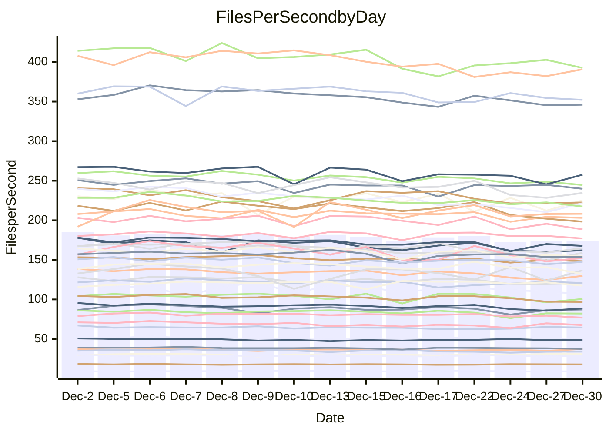

<!---
# This file is auto-generated. Do not edit.
# cspell:disable
--->
# Performance Report

## Daily Performance

## Time to Process Files

| Repository                                      | Elapsed | Min/Avg/Max           |   SD | SD Graph                |
| ----------------------------------------------- | ------: | :-------------------: | ---: | ----------------------- |
| AdaDoom3/AdaDoom3                    |    3.05 | 2.8 /   2.9 /   3.2   | 0.11 | `    ┣━━┻━━╋━━●━━┫    ` |
| alexiosc/megistos                    |    6.97 | 6.7 /   7.0 /   7.7   | 0.27 | `    ┣━━┻━━●━━┻━━┫    ` |
| apollographql/apollo-server          |    2.34 | 2.0 /   2.2 /   2.4   | 0.08 | `     ┣━┻━━╋━━┻━●     ` |
| aspnetboilerplate/aspnetboilerplate  |    9.63 | 8.8 /   9.2 /  10.0   | 0.32 | `    ┣━━┻━━╋━━┻●━┫    ` |
| aws-amplify/docs                     |   12.47 | 11.3 /  11.7 /  12.4  | 0.29 | `    ┣━━┻━━╋━━┻━━┫ ●  ` |
| Azure/azure-rest-api-specs           |   15.83 | 13.8 /  15.1 /  17.0  | 0.83 | `   ┣━━━┻━━╋━━●━━━┫   ` |
| bitjson/typescript-starter           |    0.65 | 0.6 /   0.7 /   0.7   | 0.02 | `     ┣━━●━╋━┻━━┫     ` |
| caddyserver/caddy                    |    3.18 | 2.9 /   3.2 /   3.7   | 0.16 | `    ┣━━┻━━●━━┻━━┫    ` |
| canada-ca/open-source-logiciel-libre |    0.76 | 0.7 /   0.8 /   0.8   | 0.02 | `     ┣━━┻━●━┻━━┫     ` |
| chef/chef                            |    5.34 | 5.0 /   5.3 /   5.8   | 0.21 | `    ┣━━┻━━●━━┻━━┫    ` |
| dart-lang/sdk                        |   59.31 | 55.5 /  58.3 /  62.8  | 1.84 | `  ┣━━━┻━━━╋━●━┻━━━┫  ` |
| django/django                        |   15.45 | 13.4 /  14.1 /  15.5  | 0.52 | `   ┣━━━┻━━╋━━┻━━━┫●  ` |
| eslint/eslint                        |    9.98 | 9.2 /   9.8 /  10.9   | 0.33 | `    ┣━━┻━━╋●━┻━━┫    ` |
| exonum/exonum                        |    3.12 | 2.9 /   3.1 /   3.7   | 0.20 | `    ┣━━┻━━●━━┻━━┫    ` |
| flutter/samples                      |   16.86 | 15.0 /  16.5 /  18.1  | 0.68 | `   ┣━━━┻━━╋━●┻━━━┫   ` |
| gitbucket/gitbucket                  |    3.29 | 2.9 /   3.1 /   3.3   | 0.10 | `    ┣━━┻━━╋━━┻━━●    ` |
| googleapis/google-cloud-cpp          |  126.57 | 117.0 / 124.2 / 133.5 | 4.55 | `  ┣━━━┻━━━╋━●━┻━━━┫  ` |
| graphql/express-graphql              |    0.69 | 0.7 /   0.7 /   0.8   | 0.02 | `     ┣━━●━╋━┻━━┫     ` |
| graphql/graphql-js                   |    2.26 | 2.1 /   2.2 /   2.4   | 0.07 | `     ┣━┻━━╋━━●━┫     ` |
| graphql/graphql-relay-js             |    0.77 | 0.7 /   0.7 /   0.8   | 0.02 | `     ┣━━┻━╋━┻━━●     ` |
| graphql/graphql-spec                 |    0.85 | 0.8 /   0.8 /   0.9   | 0.02 | `     ┣━━┻━╋●┻━━┫     ` |
| iluwatar/java-design-patterns        |   11.66 | 10.3 /  11.1 /  13.6  | 0.60 | `    ┣━━┻━━╋━━●━━┫    ` |
| ktaranov/sqlserver-kit               |    6.56 | 5.8 /   6.1 /   6.3   | 0.15 | `    ┣━━┻━━╋━━┻━━┫   ●` |
| liriliri/licia                       |    3.69 | 3.2 /   3.5 /   3.8   | 0.11 | `    ┣━━┻━━╋━━┻●━┫    ` |
| MartinThoma/LaTeX-examples           |    6.69 | 6.0 /   6.3 /   6.5   | 0.12 | `    ┣━━┻━━╋━━┻━━┫   ●` |
| mdx-js/mdx                           |    1.64 | 1.5 /   1.6 /   1.7   | 0.05 | `     ┣━┻━━╋━━┻●┫     ` |
| microsoft/TypeScript-Website         |    5.34 | 4.7 /   5.1 /   5.3   | 0.14 | `    ┣━━┻━━╋━━┻━●┫    ` |
| MicrosoftDocs/PowerShell-Docs        |   20.51 | 17.6 /  18.7 /  25.8  | 1.42 | `   ┣━━━┻━━╋━━┻●━━┫   ` |
| neovim/nvim-lspconfig                |    3.02 | 2.8 /   3.0 /   3.2   | 0.10 | `    ┣━━┻━━╋●━┻━━┫    ` |
| pagekit/pagekit                      |    3.42 | 3.0 /   3.3 /   3.8   | 0.17 | `    ┣━━┻━━╋━━●━━┫    ` |
| php/php-src                          |   21.46 | 19.9 /  21.4 /  24.9  | 1.11 | `   ┣━━━┻━━●━━┻━━━┫   ` |
| plasticrake/tplink-smarthome-api     |    0.90 | 0.8 /   0.9 /   1.0   | 0.04 | `     ┣━┻━●╋━━┻━┫     ` |
| prettier/prettier                    |    6.35 | 5.9 /   6.2 /   6.4   | 0.17 | `    ┣━━┻━━╋━━●━━┫    ` |
| pycontribs/jira                      |    1.22 | 1.2 /   1.2 /   1.3   | 0.03 | `     ┣━┻●━╋━━┻━┫     ` |
| RustPython/RustPython                |    4.16 | 3.9 /   4.1 /   4.4   | 0.12 | `    ┣━━┻━━╋●━┻━━┫    ` |
| shoelace-style/shoelace              |    2.53 | 2.3 /   2.4 /   2.5   | 0.06 | `     ┣━┻━━╋━━┻━●     ` |
| slint-ui/slint                       |   10.31 | 8.4 /   9.1 /  10.1   | 0.39 | `    ┣━━┻━━╋━━┻━━┫   ●` |
| SoftwareBrothers/admin-bro           |    2.23 | 2.0 /   2.1 /   2.3   | 0.09 | `     ┣━┻━━╋━━┻●┫     ` |
| sveltejs/svelte                      |   18.63 | 16.9 /  17.8 /  18.9  | 0.53 | `   ┣━━━┻━━╋━━┻━●━┫   ` |
| TheAlgorithms/Python                 |    5.47 | 4.9 /   5.2 /   5.7   | 0.19 | `    ┣━━┻━━╋━━┻●━┫    ` |
| twbs/bootstrap                       |    1.22 | 1.1 /   1.2 /   1.4   | 0.06 | `     ┣━┻━━╋━●┻━┫     ` |
| typescript-cheatsheets/react         |    1.09 | 1.0 /   1.1 /   1.1   | 0.03 | `     ┣━┻━━╋●━┻━┫     ` |
| typescript-eslint/typescript-eslint  |    3.61 | 3.4 /   3.5 /   3.7   | 0.08 | `    ┣━━┻━━╋━━●━━┫    ` |
| vitest-dev/vitest                    |    8.08 | 6.9 /   7.5 /   8.1   | 0.29 | `    ┣━━┻━━╋━━┻━━┫●   ` |
| w3c/aria-practices                   |    2.84 | 2.7 /   2.9 /   3.2   | 0.12 | `    ┣━━┻━●╋━━┻━━┫    ` |
| w3c/specberus                        |    1.68 | 1.6 /   1.6 /   1.7   | 0.04 | `     ┣━┻━━╋━━●━┫     ` |
| webdeveric/webpack-assets-manifest   |    0.69 | 0.6 /   0.7 /   0.7   | 0.01 | `     ┣━━┻━╋━┻━●┫     ` |
| webpack/webpack                      |    4.94 | 4.4 /   4.7 /   5.3   | 0.20 | `    ┣━━┻━━╋━━●━━┫    ` |
| wireapp/wire-desktop                 |    0.90 | 0.8 /   0.9 /   0.9   | 0.03 | `     ┣━┻━━╋━━┻●┫     ` |
| wireapp/wire-webapp                  |    8.16 | 7.3 /   7.9 /   8.4   | 0.32 | `    ┣━━┻━━╋━━●━━┫    ` |

Note:
- Elapsed time is in seconds.

## Files per Second over Time

| Repository                                      | Files |    Sec |    Fps |     Rel | Trend Fps              |    N |
| ----------------------------------------------- | ----: | -----: | -----: | ------: | ---------------------- | ---: |
| AdaDoom3/AdaDoom3                    |   103 |   3.05 |  33.72 |  -4.31% | `▇██▇▅▇▇▇▇▇█▆▅▄▄▆▅▆▆▅` |   28 |
| alexiosc/megistos                    |   583 |   6.97 |  83.69 |   0.35% | `█▄▇▇█▇█▆▇▇▆█▇▄▄▆▇▆▆▇` |   28 |
| apollographql/apollo-server          |   250 |   2.34 | 106.65 |  -6.03% | `▆█▄▇▆▆▆▇▅▄▅▆▆▅▅▅▄▄▄▄` |   30 |
| aspnetboilerplate/aspnetboilerplate  |  2246 |   9.63 | 233.28 |  -4.08% | `▇█▅▇██▇▆▇▇▆▆▇▆▄▅▄▆▅▅` |   28 |
| aws-amplify/docs                     |  2863 |  12.47 | 229.56 |  -6.22% | `██▅▇███▅█▆█▅▇▇▇▇██▇▅` |   30 |
| Azure/azure-rest-api-specs           |  2411 |  15.83 | 152.35 |  -5.16% | `▇█▆▅██▅▆▅▃▄▄▇▅▅▃▄▄▅▄` |   30 |
| bitjson/typescript-starter           |    20 |   0.65 |  31.00 |   2.38% | `█▆▄▇▅▆▆▇▇▆▇▆▇▇▆██▇██` |   28 |
| caddyserver/caddy                    |   279 |   3.18 |  87.87 |  -0.28% | `▇▅▇▇██▃▆█▆▅▇▇▅▄▆▆▆▆▇` |   30 |
| canada-ca/open-source-logiciel-libre |     7 |   0.76 |   9.19 |   0.15% | `▆▆▇▇▇▅▆▇▇▄▆▇█▄▅▆▅▅▅▆` |   28 |
| chef/chef                            |  1204 |   5.34 | 225.58 |  -0.71% | `█▇▃▇▆█▇▇▇▅▆▇▄▆▇▅▃▆▆▆` |   29 |
| dart-lang/sdk                        | 10026 |  59.31 | 169.05 |  -1.52% | `████▆▇▆██▆▆██▅▄▇▇▅▇▇` |   30 |
| django/django                        |  2817 |  15.45 | 182.33 |  -8.48% | `▇█▅███▇▇▇▆▇▆█▄▆▆▆▅▆▄` |   30 |
| eslint/eslint                        |  2038 |   9.98 | 204.17 |  -1.49% | `▄█▆███▆▇█▇▇▇█▆▅▇▆▇▆▇` |   30 |
| exonum/exonum                        |   421 |   3.12 | 134.86 |  -0.33% | `█▇▅▃▅▅██▇█▆▆▅▇█▄▅▆▇▆` |   28 |
| flutter/samples                      |  2690 |  16.86 | 159.58 |  -2.25% | `███▇▆█▆▇▄▆▇▆▆▆▆▄▄▆▅▆` |   30 |
| gitbucket/gitbucket                  |   412 |   3.29 | 125.28 |  -6.30% | `▆▇▇▇███▇▇▆▅▇▇▄▆▄▄▆▆▄` |   30 |
| googleapis/google-cloud-cpp          | 19742 | 126.57 | 155.98 |  -2.04% | `▇█▆▇▇█▄▇▅▄▄▆▇▅▅▆▅▆▄▅` |   30 |
| graphql/express-graphql              |    26 |   0.69 |  37.41 |   2.73% | `▇▇▆▇▇█▇█▆▇█▆▆▇█▇▄███` |   28 |
| graphql/graphql-js                   |   339 |   2.26 | 150.29 |  -3.86% | `▇▇▇██▆▆█▅▄▄▆▇▆▇▆▆▇▆▅` |   29 |
| graphql/graphql-relay-js             |    28 |   0.77 |  36.40 |  -5.36% | `█▆▇▇███▆▅▅▅█▇▇██▆▇▆▅` |   28 |
| graphql/graphql-spec                 |    15 |   0.85 |  17.72 |  -1.14% | `▅▄▇▇▆█▇█▇▇▇▆▆▇▇▆█▇▆▆` |   28 |
| iluwatar/java-design-patterns        |  1849 |  11.66 | 158.52 |  -5.12% | `████▆█▇▆▆▇▆▇█▇▆▆▆▆▇▆` |   30 |
| ktaranov/sqlserver-kit               |   489 |   6.56 |  74.53 |  -7.78% | `█▇▇▆█▇▇▆▅▇█▇▇▆▅▆▆▅▅▃` |   29 |
| liriliri/licia                       |  1434 |   3.69 | 388.53 |  -4.85% | `▆█▅▅▆▆▇▅▇▄▄▃▅▅▅▅▅▄▅▄` |   29 |
| MartinThoma/LaTeX-examples           |  1409 |   6.69 | 210.61 |  -6.57% | `▅▇▇███▆▇▆▆▆▆▇▆▅▆▆▆▆▄` |   28 |
| mdx-js/mdx                           |   142 |   1.64 |  86.38 |  -5.18% | `▇▇▇███▆▇█▇▆▇█▅▆▆▄▇▆▅` |   28 |
| microsoft/TypeScript-Website         |   757 |   5.34 | 141.85 |  -5.17% | `█▇█▆▅▇▆▇█▆▆▇▇█▆▅▆▇█▅` |   28 |
| MicrosoftDocs/PowerShell-Docs        |  2232 |  20.51 | 108.82 |  -9.01% | `█▇▇▇█▇▇▂██▇▇▇▇▇▇▇█▆▅` |   30 |
| neovim/nvim-lspconfig                |   372 |   3.02 | 123.30 |  -0.46% | `▇▇▆▆█▇▆▇▆▆▆▇▇▄▆▄▆▄▆▆` |   30 |
| pagekit/pagekit                      |   741 |   3.42 | 216.75 |  -5.12% | `▆█▇▇▆▅▆▇▇▇▆▅▅▅▄▆▃▇▄▅` |   28 |
| php/php-src                          |  2213 |  21.46 | 103.12 |  -0.34% | `██▇▆█▇▇█▆▃▄█▇▆▆▆▃▆▅▇` |   30 |
| plasticrake/tplink-smarthome-api     |    62 |   0.90 |  69.03 |   0.74% | `██▇█▆█▆▇▇▅▆▇▇▇▃▇█▆▇▇` |   28 |
| prettier/prettier                    |  2202 |   6.35 | 346.94 |  -2.35% | `███▇██▆▆▅▆▇▅▇▇▆▆▅▆▅▆` |   30 |
| pycontribs/jira                      |    80 |   1.22 |  65.65 |   1.92% | `█▅▇▆▇▄▇█▆▆▆▅▅▄▆▇▇▅▇▇` |   29 |
| RustPython/RustPython                |   621 |   4.16 | 149.28 |  -1.48% | `▇█▇▆█▄██▇▇▇▆▇▅▆▆▇▆▆▆` |   30 |
| shoelace-style/shoelace              |   438 |   2.53 | 172.84 |  -4.53% | `▅▇▆██▇▇▇▅▆▆██▆▇▇▆▅▇▅` |   30 |
| slint-ui/slint                       |  1954 |  10.31 | 189.51 | -11.40% | `█▇▆▇▇▅▆▇▄▇▆▆▇▅▅▅▃▅▃▃` |   30 |
| SoftwareBrothers/admin-bro           |   441 |   2.23 | 198.14 |  -5.83% | `▆▆▆▃██▆▅▇▄▆▆▇▆▄▅▆▇▆▄` |   28 |
| sveltejs/svelte                      |  7122 |  18.63 | 382.27 |  -4.30% | `███▇█▆▅▆▆▆▆▆▅▅▅▅▅▆▆▅` |   30 |
| TheAlgorithms/Python                 |  1361 |   5.47 | 248.92 |  -4.46% | `▆▇▄▇▇█▆▇▅▆▄▆▆▆▆▄▅▇▆▅` |   30 |
| twbs/bootstrap                       |   120 |   1.22 |  98.23 |  -3.51% | `▆▇▇▇█▅▇▇█▃▆▇▇█▅▅▅▅▅▆` |   29 |
| typescript-cheatsheets/react         |    53 |   1.09 |  48.44 |  -1.50% | `▆█▆▇▅█▆▅▇▅▆▇▇██▇▆█▇▆` |   28 |
| typescript-eslint/typescript-eslint  |  1273 |   3.61 | 352.61 |  -2.55% | `█▇████▆▆█▆▇▅▅▇▆▆▆▆▅▆` |   30 |
| vitest-dev/vitest                    |  1936 |   8.08 | 239.60 |  -5.99% | `██▆▇█▆▇▇▇▇▄▇▇▆▆▆▇▇▅▅` |   30 |
| w3c/aria-practices                   |   405 |   2.84 | 142.39 |   1.00% | `▇▇█▇█▇▆▆▆▅▇▆█▇▆▇▆▄▃▇` |   29 |
| w3c/specberus                        |   200 |   1.68 | 118.88 |  -2.75% | `█▇▆█▆▇▇▇▇▇▆▄▅▅▇▇▇▇▇▆` |   30 |
| webdeveric/webpack-assets-manifest   |    19 |   0.69 |  27.71 |  -3.47% | `▇▆▆▆▆▇▅▅▆▅▆▅█▆▇▆▅▇▇▅` |   28 |
| webpack/webpack                      |  1095 |   4.94 | 221.61 |  -4.29% | `█▅▄▆▇▇▇▇█▆▇▇▆▅▅▄▆▅▅▅` |   30 |
| wireapp/wire-desktop                 |    43 |   0.90 |  47.63 |  -5.07% | `▆▇▆▆█▅▇▅▅▅▅█▇▄▆▆▆▆▆▅` |   30 |
| wireapp/wire-webapp                  |  1337 |   8.16 | 163.93 |  -1.77% | `▇█▆▄▇█▅▆▆▆▅▇▅▅▅▅▅▆▆▆` |   30 |

## Data Throughput

| Repository                                      | Files |    Sec |     Kps |     Rel | Trend Kps              |    N |
| ----------------------------------------------- | ----: | -----: | ------: | ------: | ---------------------- | ---: |
| AdaDoom3/AdaDoom3                    |   103 |   3.05 |  716.71 |  -4.31% | `▇██▇▅▇▇▇▇▇█▆▅▄▄▆▅▆▆▅` |   28 |
| alexiosc/megistos                    |   583 |   6.97 |  657.59 |   0.35% | `█▄▇▇█▇█▆▇▇▆█▇▄▄▆▇▆▆▇` |   28 |
| apollographql/apollo-server          |   250 |   2.34 |  853.21 |  -5.84% | `▆█▄▇▆▆▆▇▅▄▅▆▆▅▅▅▄▄▅▄` |   30 |
| aspnetboilerplate/aspnetboilerplate  |  2246 |   9.63 |  548.83 |  -4.08% | `▇█▅▇██▇▆▇▇▆▆▇▆▄▅▄▆▅▅` |   28 |
| aws-amplify/docs                     |  2863 |  12.47 |  786.57 |  -5.87% | `██▅▇███▅█▆█▅▇▇▇▇██▇▅` |   30 |
| Azure/azure-rest-api-specs           |  2411 |  15.83 |  438.85 |  -5.10% | `▇█▆▅██▅▆▅▃▄▄▇▅▅▃▄▄▅▄` |   30 |
| bitjson/typescript-starter           |    20 |   0.65 |  123.98 |   2.38% | `█▆▄▇▅▆▆▇▇▆▇▆▇▇▆██▇██` |   28 |
| caddyserver/caddy                    |   279 |   3.18 |  731.58 |   0.01% | `▇▅▇▇██▃▆█▆▅▇▇▅▄▆▆▆▆▇` |   30 |
| canada-ca/open-source-logiciel-libre |     7 |   0.76 |   76.13 |   0.15% | `▆▆▇▇▇▅▆▇▇▄▆▇█▄▅▆▅▅▅▆` |   28 |
| chef/chef                            |  1204 |   5.34 | 1036.10 |  -0.70% | `█▇▃▇▆█▇▇▇▅▆▇▄▆▇▅▃▆▆▆` |   29 |
| dart-lang/sdk                        | 10026 |  59.31 | 1207.38 |  -1.47% | `████▆▇▆██▆▆██▅▄▇▇▅▇▇` |   30 |
| django/django                        |  2817 |  15.45 | 1127.02 |  -8.35% | `▇█▅███▇▇▇▆▇▆█▄▆▆▆▅▆▄` |   30 |
| eslint/eslint                        |  2038 |   9.98 | 1667.79 |  -1.32% | `▄█▆███▆▇█▇▇▇█▆▅▇▇▇▆▇` |   30 |
| exonum/exonum                        |   421 |   3.12 | 1289.98 |  -0.33% | `█▇▅▃▅▅██▇█▆▆▅▇█▄▅▆▇▆` |   28 |
| flutter/samples                      |  2690 |  16.86 | 1292.51 |  -2.26% | `███▇▆█▆▇▄▆▇▆▆▆▆▄▄▆▅▆` |   30 |
| gitbucket/gitbucket                  |   412 |   3.29 |  566.80 |  -6.26% | `▆▇▇▇███▇▇▆▄▇▇▄▆▄▄▆▆▄` |   30 |
| googleapis/google-cloud-cpp          | 19742 | 126.57 | 1218.95 |  -1.90% | `▇█▆▇▇█▄▇▅▄▄▆▇▅▅▆▅▆▄▅` |   30 |
| graphql/express-graphql              |    26 |   0.69 |  171.24 |   2.73% | `▇▇▆▇▇█▇█▆▇█▆▆▇█▇▄███` |   28 |
| graphql/graphql-js                   |   339 |   2.26 |  853.86 |  -3.86% | `▇▇▇██▆▆█▅▄▄▆▇▆▇▆▆▇▆▅` |   29 |
| graphql/graphql-relay-js             |    28 |   0.77 |  143.00 |  -5.36% | `█▆▇▇███▆▅▅▅█▇▇██▆▇▆▅` |   28 |
| graphql/graphql-spec                 |    15 |   0.85 |  652.23 |  -1.07% | `▅▄▇▇▇█▇█▇▇▇▆▆▇▇▆█▇▆▆` |   28 |
| iluwatar/java-design-patterns        |  1849 |  11.66 |  488.49 |  -5.10% | `████▆█▇▆▆▇▆▇█▇▆▆▆▆▇▆` |   30 |
| ktaranov/sqlserver-kit               |   489 |   6.56 | 1127.50 |  -7.79% | `█▇▇▆█▇▇▆▅▇█▇▇▆▅▆▆▅▅▃` |   29 |
| liriliri/licia                       |  1434 |   3.69 |  460.33 |  -4.85% | `▆█▅▅▆▆▇▅▇▄▄▃▅▅▅▅▅▄▅▄` |   29 |
| MartinThoma/LaTeX-examples           |  1409 |   6.69 |  434.97 |  -6.57% | `▅▇▇███▆▇▆▆▆▆▇▆▅▆▆▆▆▄` |   28 |
| mdx-js/mdx                           |   142 |   1.64 |  400.89 |  -5.18% | `▇▇▇███▆▇█▇▆▇█▅▆▆▄▇▆▅` |   28 |
| microsoft/TypeScript-Website         |   757 |   5.34 |  971.40 |  -5.17% | `█▇█▆▅▇▆▇█▆▆▇▇█▆▅▆▇█▅` |   28 |
| MicrosoftDocs/PowerShell-Docs        |  2232 |  20.51 | 1086.43 |  -8.93% | `▇▇▇▇█▇▇▂██▇▇▇▇▇▇▇█▆▅` |   30 |
| neovim/nvim-lspconfig                |   372 |   3.02 |  322.16 |   0.15% | `▇▇▆▆█▇▆▇▆▆▆▇▇▅▆▄▆▅▆▆` |   30 |
| pagekit/pagekit                      |   741 |   3.42 |  451.92 |  -5.12% | `▆█▇▇▆▅▆▇▇▇▆▅▅▅▄▆▃▇▄▅` |   28 |
| php/php-src                          |  2213 |  21.46 | 1509.58 |  -0.31% | `██▇▆█▇▇█▆▃▄█▇▆▆▆▃▆▅▇` |   30 |
| plasticrake/tplink-smarthome-api     |    62 |   0.90 |  373.00 |   0.74% | `██▇█▆█▆▇▇▅▆▇▇▇▃▇█▆▇▇` |   28 |
| prettier/prettier                    |  2202 |   6.35 |  489.52 |  -2.64% | `███▇██▆▆▅▇▇▅▇▇▆▆▅▆▅▆` |   30 |
| pycontribs/jira                      |    80 |   1.22 |  452.14 |   1.92% | `█▅▇▆▇▄▇█▆▆▆▅▅▄▆▇▇▅▇▇` |   29 |
| RustPython/RustPython                |   621 |   4.16 | 1101.92 |  -1.35% | `▇█▇▆█▄██▇▇▇▆▇▅▆▆▇▆▆▆` |   30 |
| shoelace-style/shoelace              |   438 |   2.53 |  829.86 |  -4.45% | `▅▇▆██▇▇▇▅▆▆██▆▇▇▆▅▇▅` |   30 |
| slint-ui/slint                       |  1954 |  10.31 |  972.66 | -11.08% | `█▆▆▇▇▅▆▇▅▇▆▆▇▅▅▆▃▅▄▃` |   30 |
| SoftwareBrothers/admin-bro           |   441 |   2.23 |  436.72 |  -5.83% | `▆▆▆▃██▆▅▇▄▆▆▇▆▄▅▆▇▆▄` |   28 |
| sveltejs/svelte                      |  7122 |  18.63 |  251.20 |  -5.04% | `███▇█▇▆▆▅▅▅▆▄▅▅▄▄▅▅▄` |   30 |
| TheAlgorithms/Python                 |  1361 |   5.47 |  631.72 |  -4.21% | `▆▇▄▇▇█▆▇▅▆▄▆▆▆▆▄▅▇▆▅` |   30 |
| twbs/bootstrap                       |   120 |   1.22 |  788.27 |  -3.51% | `▆▇▇▇█▅▇▇█▃▆▇▇█▅▅▅▅▅▆` |   29 |
| typescript-cheatsheets/react         |    53 |   1.09 |  354.63 |  -1.50% | `▆█▆▇▅█▆▅▇▅▆▇▇██▇▆█▇▆` |   28 |
| typescript-eslint/typescript-eslint  |  1273 |   3.61 | 1685.47 |  -1.96% | `█▇████▆▆█▆▇▅▆▇▇▇▆▆▆▆` |   30 |
| vitest-dev/vitest                    |  1936 |   8.08 |  494.17 |  -5.62% | `██▆▇█▆▇▇█▇▅█▇▇▆▆▇▇▆▅` |   30 |
| w3c/aria-practices                   |   405 |   2.84 | 1322.28 |   0.73% | `▇▇███▇▆▆▆▅▇▆█▇▆▇▆▄▃▇` |   29 |
| w3c/specberus                        |   200 |   1.68 |  379.24 |  -2.75% | `█▇▆█▆▇▇▇▇▇▆▄▅▅▇▇▇▇▇▆` |   30 |
| webdeveric/webpack-assets-manifest   |    19 |   0.69 |  148.78 |  -3.47% | `▇▆▆▆▆▇▅▅▆▅▆▅█▆▇▆▅▇▇▅` |   28 |
| webpack/webpack                      |  1095 |   4.94 |  977.70 |  -4.27% | `█▅▄▆▇▇▇▇▇▆▇▇▆▅▅▄▆▅▅▅` |   30 |
| wireapp/wire-desktop                 |    43 |   0.90 |  210.46 |  -4.87% | `▆▇▆▆█▅▇▅▅▅▅█▇▄▆▆▆▆▆▅` |   30 |
| wireapp/wire-webapp                  |  1337 |   8.16 |  663.32 |  -2.36% | `██▆▄▇█▅▆▆▆▅▇▅▅▅▄▄▆▆▅` |   30 |

