<!---
# This file is auto-generated. Do not edit.
# cspell:disable
--->
# Performance Report

## Daily Performance

```mermaid
xychart-beta
    title Files Per Second by Day
    y-axis Files per Second
    x-axis Date [Mar-29, Mar-30, Apr-1, Apr-2, Apr-4, Apr-7, Apr-8, Apr-9, Apr-10, Apr-11, Apr-14, Apr-15, Apr-16, Apr-17, Apr-18, Apr-19, Apr-20, Apr-21, Apr-22, Apr-23, Apr-26]
    bar [169.16, 165.19, 167.12, 170.37, 169.84, 169.20, 170.31, 166.27, 166.91, 170.48, 169.33, 169.62, 167.60, 169.74, 169.68, 169.99, 171.82, 172.90, 171.57, 166.24, 169.01]
    line [28.68, 29.57, 28.57, 29.71, 29.80, 29.09, 30.39, 28.82, 29.85, 30.29, 29.17, 29.16, 30.32, 29.23, 29.37, 29.90, 29.82, 0.00, 28.87, 28.89, 29.69]
    line [34.45, 35.12, 35.58, 36.26, 35.35, 33.46, 33.90, 35.56, 34.65, 35.25, 33.95, 35.11, 35.60, 35.68, 35.27, 35.45, 35.29, 0.00, 36.03, 35.32, 35.34]
    line [66.97, 59.95, 64.70, 68.07, 62.75, 56.53, 64.20, 68.55, 66.50, 63.84, 67.31, 66.50, 66.41, 65.32, 66.89, 68.61, 62.38, 0.00, 65.42, 64.86, 68.62]
    line [63.93, 62.91, 63.90, 62.22, 64.11, 62.38, 62.53, 61.32, 54.24, 63.37, 63.45, 60.45, 62.38, 64.57, 64.96, 64.20, 61.03, 61.27, 63.23, 62.50, 62.36]
    line [129.63, 124.04, 124.98, 128.23, 124.77, 127.89, 127.66, 125.67, 123.96, 126.62, 121.49, 124.08, 125.35, 129.58, 129.31, 126.67, 127.87, 0.00, 122.89, 120.53, 127.62]
    line [16.76, 17.72, 17.35, 17.65, 17.28, 17.60, 16.96, 17.77, 17.06, 17.46, 17.21, 17.42, 17.60, 17.08, 17.31, 17.56, 17.31, 17.48, 17.24, 16.92, 17.80]
    line [126.70, 118.28, 118.73, 131.77, 121.36, 115.15, 130.27, 129.70, 106.78, 126.97, 127.64, 125.44, 128.53, 127.62, 128.92, 120.98, 123.98, 0.00, 122.91, 125.27, 134.01]
    line [38.47, 34.67, 37.33, 36.38, 33.48, 34.77, 37.91, 37.41, 35.78, 36.99, 37.77, 37.41, 38.03, 37.53, 36.12, 37.89, 38.88, 0.00, 38.42, 35.42, 38.72]
    line [101.78, 96.16, 99.80, 97.07, 97.79, 98.91, 96.86, 98.48, 95.78, 98.82, 98.24, 97.95, 94.18, 94.73, 96.19, 101.04, 101.25, 21.60, 54.07, 86.67, 88.50]
    line [88.18, 89.80, 85.13, 86.10, 87.57, 86.19, 87.38, 86.67, 88.15, 82.83, 86.26, 85.93, 88.01, 87.47, 86.56, 87.65, 86.60, 0.00, 87.93, 86.07, 89.56]
    line [117.19, 121.84, 113.82, 117.71, 115.26, 119.06, 114.45, 115.00, 120.23, 118.00, 118.40, 118.37, 116.05, 123.88, 119.49, 121.74, 116.48, 120.61, 122.50, 116.03, 121.63]
    line [26.46, 28.25, 22.36, 22.51, 22.71, 22.07, 22.74, 22.43, 65.92, 62.39, 66.34, 66.55, 64.05, 68.35, 68.05, 68.62, 69.45, 64.83, 67.35, 68.84, 65.99]
    line [213.72, 203.24, 214.01, 219.35, 211.25, 222.14, 222.81, 213.62, 192.45, 214.69, 213.97, 220.18, 219.45, 220.27, 211.75, 215.92, 221.06, 0.00, 221.33, 209.32, 216.82]
    line [108.89, 108.97, 105.55, 109.02, 109.07, 108.93, 102.51, 106.98, 109.00, 108.35, 103.95, 107.46, 107.98, 108.91, 107.43, 108.61, 110.08, 0.00, 110.33, 106.34, 107.51]
    line [144.08, 145.60, 137.08, 138.21, 138.98, 136.61, 140.82, 136.34, 137.38, 144.66, 145.14, 143.84, 144.20, 144.52, 139.00, 143.78, 144.53, 136.95, 137.17, 141.60, 138.78]
    line [46.04, 47.27, 46.31, 47.51, 45.90, 45.44, 47.98, 45.98, 48.61, 46.63, 47.25, 46.53, 46.91, 46.99, 47.21, 43.97, 47.10, 0.00, 47.45, 46.18, 45.75]
    line [221.65, 200.22, 211.45, 214.10, 213.54, 214.82, 216.50, 216.97, 214.34, 223.50, 215.07, 208.81, 218.55, 206.19, 208.58, 221.30, 221.28, 195.47, 221.02, 208.16, 215.76]
    line [387.22, 383.71, 379.46, 361.04, 377.52, 372.77, 388.59, 381.59, 348.04, 380.94, 383.05, 379.79, 379.24, 389.97, 387.83, 386.24, 368.53, 0.00, 376.50, 377.40, 383.08]
    line [119.01, 118.83, 116.74, 109.55, 112.13, 116.38, 109.02, 116.94, 120.00, 115.72, 178.30, 177.73, 180.34, 180.24, 181.16, 179.47, 175.83, 182.94, 176.49, 173.56, 177.31]
    line [203.16, 199.89, 196.17, 195.60, 198.67, 195.49, 190.29, 196.88, 194.92, 202.96, 194.19, 200.03, 194.80, 200.11, 202.53, 198.27, 204.52, 0.00, 186.65, 199.52, 202.33]
    line [176.92, 156.03, 170.40, 177.72, 173.91, 177.92, 179.08, 173.27, 175.00, 170.86, 165.94, 173.69, 173.55, 174.13, 172.94, 170.54, 173.57, 0.00, 170.82, 166.93, 163.53]
    line [76.49, 79.15, 75.48, 79.12, 77.09, 74.93, 76.78, 77.18, 78.18, 76.70, 76.29, 76.45, 76.07, 75.42, 76.77, 77.79, 77.80, 0.00, 71.90, 73.58, 77.25]
    line [8.88, 8.98, 8.86, 9.02, 8.96, 9.04, 7.54, 9.19, 9.07, 9.09, 8.79, 8.86, 9.07, 9.04, 8.87, 8.76, 9.19, 0.00, 8.87, 8.91, 9.11]
    line [153.58, 150.94, 143.07, 143.33, 149.63, 148.24, 150.53, 145.81, 135.51, 153.54, 148.49, 150.16, 149.84, 151.62, 149.82, 147.39, 150.27, 0.00, 147.88, 143.90, 145.46]
    line [340.82, 328.95, 338.30, 340.61, 333.96, 339.43, 331.60, 337.56, 339.68, 342.67, 340.53, 332.27, 335.32, 337.55, 341.08, 333.28, 342.44, 335.31, 327.64, 337.12, 337.38]
    line [161.23, 161.25, 154.49, 160.21, 159.01, 159.81, 159.07, 154.86, 161.50, 157.82, 150.49, 156.51, 145.27, 158.44, 147.46, 154.06, 155.44, 160.39, 156.53, 154.14, 156.31]
    line [33.01, 32.72, 32.66, 33.55, 32.53, 32.45, 32.84, 31.03, 33.00, 32.16, 32.22, 32.66, 32.69, 33.19, 30.88, 31.77, 33.15, 0.00, 31.72, 32.35, 31.41]
    line [139.13, 137.14, 134.77, 129.03, 132.92, 133.01, 131.94, 136.24, 139.59, 139.80, 133.78, 134.61, 128.41, 137.96, 136.05, 137.57, 132.11, 0.00, 137.28, 136.15, 136.56]
    line [216.55, 215.27, 211.34, 210.95, 214.71, 213.10, 213.49, 213.15, 207.01, 217.98, 213.40, 214.15, 209.08, 210.92, 212.31, 202.24, 216.69, 0.00, 216.61, 209.72, 197.36]
    line [142.23, 143.51, 141.89, 144.85, 135.75, 140.12, 141.93, 144.71, 138.12, 136.03, 141.29, 138.52, 140.48, 140.76, 140.21, 141.88, 140.61, 142.82, 137.75, 137.71, 134.50]
    line [344.39, 323.05, 332.32, 329.96, 332.43, 330.30, 334.01, 330.67, 335.10, 339.21, 338.50, 333.53, 327.92, 339.69, 338.54, 337.09, 336.49, 339.90, 331.90, 326.60, 326.89]
    line [80.80, 84.33, 78.70, 84.38, 79.63, 81.82, 77.99, 81.50, 83.68, 82.24, 79.00, 81.10, 76.32, 82.35, 77.98, 81.12, 80.27, 85.76, 75.92, 80.78, 78.25]
    line [244.86, 246.31, 247.68, 259.43, 240.39, 235.37, 241.80, 223.67, 256.52, 244.43, 247.02, 250.63, 247.99, 249.17, 253.74, 253.49, 250.95, 246.49, 244.52, 245.72, 249.53]
    line [189.39, 193.26, 187.15, 184.74, 187.37, 186.23, 190.68, 147.53, 183.37, 189.36, 186.25, 190.23, 184.91, 191.69, 177.23, 189.25, 187.34, 190.75, 186.70, 182.89, 189.73]
    line [77.54, 81.64, 79.42, 77.99, 80.60, 77.45, 79.26, 78.59, 74.22, 77.47, 71.52, 79.38, 78.34, 80.66, 81.07, 81.90, 79.63, 0.00, 77.56, 76.15, 80.49]
    line [195.49, 178.54, 190.68, 196.99, 187.71, 198.59, 197.91, 153.08, 193.37, 186.31, 191.86, 190.39, 197.86, 198.53, 194.94, 194.83, 194.98, 181.85, 192.31, 196.87, 194.18]
    line [237.49, 223.66, 231.23, 235.01, 220.71, 230.14, 228.37, 226.53, 212.60, 230.01, 224.21, 229.57, 224.99, 233.81, 228.85, 235.57, 231.39, 223.58, 218.87, 214.06, 233.07]
    line [194.60, 197.36, 195.73, 192.93, 191.61, 192.83, 195.35, 194.59, 189.25, 194.14, 192.92, 186.07, 185.77, 196.44, 190.62, 188.38, 197.27, 191.85, 192.30, 188.84, 190.27]
    line [228.02, 226.94, 217.16, 217.42, 227.00, 219.19, 223.64, 221.83, 216.60, 219.13, 224.29, 221.03, 219.41, 211.61, 231.08, 224.48, 227.64, 0.00, 218.50, 218.17, 224.25]
    line [241.08, 234.18, 235.67, 236.41, 224.18, 237.10, 241.63, 230.62, 246.29, 232.09, 242.10, 239.18, 228.11, 235.38, 245.98, 246.76, 242.90, 234.99, 242.37, 239.31, 237.17]
    line [222.67, 213.80, 214.66, 227.86, 215.51, 213.60, 219.74, 229.98, 210.41, 211.03, 220.37, 222.63, 214.45, 219.40, 210.16, 226.83, 210.62, 211.00, 209.91, 211.94, 214.01]
    line [167.80, 151.35, 162.59, 164.62, 163.01, 168.55, 162.80, 164.30, 168.75, 168.13, 157.11, 162.19, 160.72, 162.22, 163.33, 167.29, 165.80, 161.26, 163.43, 155.81, 166.82]
    line [115.11, 113.41, 110.41, 110.44, 115.08, 114.00, 113.95, 110.13, 115.10, 114.20, 113.57, 114.05, 114.46, 113.36, 110.56, 109.84, 116.20, 117.60, 114.81, 115.13, 112.07]
    line [49.50, 48.70, 48.07, 49.72, 48.96, 48.45, 48.17, 47.87, 50.31, 48.30, 48.77, 47.68, 47.69, 48.50, 48.03, 49.42, 49.32, 46.59, 48.05, 47.43, 46.81]
    line [157.46, 155.25, 144.83, 152.27, 154.71, 148.18, 156.04, 147.10, 154.73, 147.03, 148.45, 154.18, 145.25, 151.93, 153.78, 155.38, 157.43, 155.84, 151.73, 150.49, 156.46]
    line [382.13, 383.17, 373.36, 381.11, 371.41, 375.01, 366.15, 382.62, 383.48, 384.04, 359.97, 375.35, 369.72, 368.89, 380.64, 373.25, 373.99, 373.98, 376.67, 368.51, 322.56]
    line [267.50, 272.96, 257.38, 260.99, 254.08, 252.77, 256.08, 266.31, 262.37, 261.47, 254.20, 253.24, 261.07, 260.83, 260.89, 253.32, 254.79, 261.54, 255.02, 257.43, 268.34]
    line [93.74, 88.41, 97.83, 99.26, 98.35, 94.04, 92.16, 96.89, 89.38, 97.60, 95.04, 95.17, 95.45, 95.51, 99.80, 94.01, 98.29, 95.98, 98.39, 97.61, 97.80]
    line [166.67, 150.69, 158.40, 157.33, 163.45, 164.03, 166.16, 160.66, 159.82, 162.39, 162.85, 163.21, 157.56, 158.15, 163.19, 164.04, 162.46, 157.73, 161.64, 158.56, 163.17]
    line [141.11, 141.56, 145.52, 151.04, 149.76, 147.19, 149.14, 146.94, 144.05, 149.94, 148.30, 147.19, 146.95, 147.95, 146.79, 147.09, 150.33, 149.26, 149.39, 142.38, 146.96]
```

## Time to Process Files

| Repository                                      | Elapsed | Min/Avg/Max           |   SD | SD Graph                |
| ----------------------------------------------- | ------: | :-------------------: | ---: | ----------------------- |
| AdaDoom3/AdaDoom3                    |    3.28 | 3.0 /   3.2 /   3.4   | 0.09 | `    ┣━━┻━━╋━━●━━┫    ` |
| alexiosc/megistos                    |    7.24 | 6.9 /   7.5 /  11.6   | 0.64 | `    ┣━━┻━●╋━━┻━━┫    ` |
| apollographql/apollo-server          |    2.36 | 2.2 /   2.4 /   2.6   | 0.08 | `     ┣━┻━━●━━┻━┫     ` |
| aspnetboilerplate/aspnetboilerplate  |   10.06 | 9.7 /  10.2 /  12.1   | 0.39 | `    ┣━━┻━●╋━━┻━━┫    ` |
| aws-amplify/docs                     |   12.31 | 11.9 /  12.7 /  14.7  | 0.53 | `    ┣━━┻●━╋━━┻━━┫    ` |
| Azure/azure-rest-api-specs           |    9.00 | 8.9 /   9.4 /  10.6   | 0.30 | `    ┣━●┻━━╋━━┻━━┫    ` |
| bitjson/typescript-starter           |    0.67 | 0.6 /   0.7 /   0.8   | 0.03 | `     ┣━━┻●╋━┻━━┫     ` |
| caddyserver/caddy                    |    3.62 | 3.3 /   3.6 /   4.3   | 0.21 | `    ┣━━┻━━╋●━┻━━┫    ` |
| canada-ca/open-source-logiciel-libre |    0.77 | 0.7 /   0.8 /   1.0   | 0.04 | `     ┣━┻━●╋━━┻━┫     ` |
| chef/chef                            |    5.58 | 5.0 /   5.6 /   6.4   | 0.24 | `    ┣━━┻━●╋━━┻━━┫    ` |
| dart-lang/sdk                        |   63.05 | 59.3 /  63.9 /  69.2  | 1.89 | `  ┣━━━┻━●━╋━━━┻━━━┫  ` |
| django/django                        |   14.95 | 14.4 /  15.2 /  19.2  | 0.70 | `   ┣━━━┻━●╋━━┻━━━┫   ` |
| eslint/eslint                        |   10.83 | 9.9 /  10.7 /  12.0   | 0.36 | `    ┣━━┻━━╋●━┻━━┫    ` |
| exonum/exonum                        |    3.14 | 3.1 /   3.4 /   3.9   | 0.20 | `    ┣━●┻━━╋━━┻━━┫    ` |
| flutter/samples                      |   17.25 | 17.1 /  18.0 /  21.7  | 0.98 | `   ┣━━━┻●━╋━━┻━━━┫   ` |
| gitbucket/gitbucket                  |    3.23 | 3.1 /   3.3 /   3.8   | 0.13 | `    ┣━━┻━●╋━━┻━━┫    ` |
| googleapis/google-cloud-cpp          |  136.13 | 127.7 / 135.6 / 150.4 | 4.21 | `  ┣━━━┻━━━╋●━━┻━━━┫  ` |
| graphql/express-graphql              |    0.74 | 0.7 /   0.7 /   0.9   | 0.03 | `     ┣━┻━━●━━┻━┫     ` |
| graphql/graphql-js                   |    2.36 | 2.2 /   2.3 /   2.6   | 0.07 | `     ┣━┻━━╋●━┻━┫     ` |
| graphql/graphql-relay-js             |    0.72 | 0.7 /   0.8 /   0.9   | 0.04 | `     ┣━┻●━╋━━┻━┫     ` |
| graphql/graphql-spec                 |    0.84 | 0.8 /   0.9 /   1.0   | 0.03 | `     ┣━┻●━╋━━┻━┫     ` |
| iluwatar/java-design-patterns        |   12.63 | 12.0 /  12.7 /  14.4  | 0.54 | `    ┣━━┻━━●━━┻━━┫    ` |
| ktaranov/sqlserver-kit               |    6.33 | 6.2 /   6.4 /   7.2   | 0.23 | `    ┣━━┻●━╋━━┻━━┫    ` |
| liriliri/licia                       |    3.75 | 3.7 /   3.8 /   4.1   | 0.10 | `    ┣━━┻━●╋━━┻━━┫    ` |
| MartinThoma/LaTeX-examples           |    7.14 | 6.4 /   6.6 /   7.4   | 0.20 | `    ┣━━┻━━╋━━┻━━┫●   ` |
| mdx-js/mdx                           |    1.57 | 1.5 /   1.6 /   1.8   | 0.05 | `     ┣━●━━╋━━┻━┫     ` |
| microsoft/TypeScript-Website         |    5.67 | 5.3 /   5.4 /   6.0   | 0.15 | `    ┣━━┻━━╋━━┻●━┫    ` |
| MicrosoftDocs/PowerShell-Docs        |   24.15 | 22.0 /  23.9 /  27.5  | 0.92 | `   ┣━━━┻━━╋●━┻━━━┫   ` |
| neovim/nvim-lspconfig                |    4.11 | 3.2 /   3.7 /   4.6   | 0.38 | `    ┣━━┻━━╋━━●━━┫    ` |
| pagekit/pagekit                      |    3.42 | 3.2 /   3.4 /   4.2   | 0.15 | `    ┣━━┻━━●━━┻━━┫    ` |
| php/php-src                          |   22.72 | 21.6 /  23.2 /  26.5  | 1.13 | `   ┣━━━┻━●╋━━┻━━━┫   ` |
| plasticrake/tplink-smarthome-api     |    0.90 | 0.9 /   1.0 /   1.1   | 0.06 | `     ┣━┻●━╋━━┻━┫     ` |
| prettier/prettier                    |    6.92 | 6.4 /   6.7 /   7.1   | 0.16 | `    ┣━━┻━━╋━━┻●━┫    ` |
| pycontribs/jira                      |    1.27 | 1.2 /   1.3 /   1.5   | 0.04 | `     ┣━┻━━●━━┻━┫     ` |
| RustPython/RustPython                |    4.83 | 4.5 /   4.8 /   5.3   | 0.16 | `    ┣━━┻━━╋●━┻━━┫    ` |
| shoelace-style/shoelace              |    2.68 | 2.4 /   2.6 /   2.9   | 0.11 | `    ┣━━┻━━╋━━●━━┫    ` |
| slint-ui/slint                       |   11.04 | 10.2 /  11.1 /  13.9  | 0.57 | `    ┣━━┻━━●━━┻━━┫    ` |
| SoftwareBrothers/admin-bro           |    2.18 | 2.2 /   2.2 /   2.5   | 0.07 | `     ┣━┻●━╋━━┻━┫     ` |
| sveltejs/svelte                      |   22.69 | 18.8 /  19.5 /  22.7  | 0.60 | `      ┣━┻━╋━┻━┫     ●` |
| TheAlgorithms/Python                 |    5.53 | 5.2 /   5.6 /   6.4   | 0.20 | `    ┣━━┻━●╋━━┻━━┫    ` |
| twbs/bootstrap                       |    1.33 | 0.4 /   1.2 /   1.4   | 0.20 | `    ┣━━┻━━╋━●┻━━┫    ` |
| typescript-cheatsheets/react         |    1.16 | 1.1 /   1.1 /   1.3   | 0.05 | `     ┣━┻━━╋●━┻━┫     ` |
| typescript-eslint/typescript-eslint  |    3.73 | 3.6 /   3.8 /   4.1   | 0.09 | `    ┣━━┻━●╋━━┻━━┫    ` |
| vitest-dev/vitest                    |    8.75 | 8.3 /   8.7 /  10.0   | 0.31 | `    ┣━━┻━━╋●━┻━━┫    ` |
| w3c/aria-practices                   |    2.97 | 2.9 /   3.0 /   3.8   | 0.13 | `    ┣━━┻━●╋━━┻━━┫    ` |
| w3c/specberus                        |    1.68 | 1.6 /   1.7 /   2.0   | 0.07 | `     ┣━┻●━╋━━┻━┫     ` |
| webdeveric/webpack-assets-manifest   |    0.80 | 0.6 /   0.7 /   0.9   | 0.09 | `     ┣━┻━━╋━━●━┫     ` |
| webpack/webpack                      |    5.14 | 4.8 /   5.1 /   5.7   | 0.19 | `    ┣━━┻━━╋●━┻━━┫    ` |
| wireapp/wire-desktop                 |    0.92 | 0.8 /   0.9 /   1.0   | 0.02 | `     ┣━┻━━╋━━●━┫     ` |
| wireapp/wire-webapp                  |    9.97 | 9.3 /  10.0 /  12.3   | 0.55 | `    ┣━━┻━━●━━┻━━┫    ` |

Note:
- Elapsed time is in seconds.

## Files per Second over Time

| Repository                                      | Files |    Sec |    Fps |     Rel | Trend Fps              |    N |
| ----------------------------------------------- | ----: | -----: | -----: | ------: | ---------------------- | ---: |
| AdaDoom3/AdaDoom3                    |   103 |   3.28 |  31.41 |  -3.23% | `▇▇▇▅█▇▆▄▆▆▇█▇▄▆▇▆▆▇▅` |   47 |
| alexiosc/megistos                    |   583 |   7.24 |  80.49 |   2.71% | `▇▇█▇██████▇█▆█▇▇▇▆▇█` |   47 |
| apollographql/apollo-server          |   254 |   2.36 | 107.51 |   0.08% | `█▇▅▇█▇▆▇█▇█▇▇▇█▇▆▆▆▇` |   48 |
| aspnetboilerplate/aspnetboilerplate  |  2255 |  10.06 | 224.25 |   1.35% | `▇▆▇▇▅▆███▇█▇▇▇▆▇▇▆▇▇` |   47 |
| aws-amplify/docs                     |  2870 |  12.31 | 233.07 |   2.83% | `▆███▇▇██▇█▆▇▄▇▅▅▃▇▆█` |   51 |
| Azure/azure-rest-api-specs           |  2416 |   9.00 | 268.34 |   4.20% | `▆█▇▇▆█▆▇▇▆▇▆▇▆▇▆▇▇██` |   51 |
| bitjson/typescript-starter           |    20 |   0.67 |  29.69 |   1.21% | `▆▇█▇▇▅▆▆▆▇▇▆▄▆▆▇▆▃▆▆` |   47 |
| caddyserver/caddy                    |   283 |   3.62 |  78.25 |  -1.98% | `▅▅▆█▇▅█▅█▅█▆▆▂▇▄▇▇█▆` |   50 |
| canada-ca/open-source-logiciel-libre |     7 |   0.77 |   9.11 |   2.54% | `▇█▇▇▇▇▇▆▅██▇█▅▇█▇▇▆▇` |   47 |
| chef/chef                            |  1204 |   5.58 | 215.76 |   0.92% | `▆▆▆▅▄▅▅▆▆▆▇▃█▆▅▅▃▅▆▆` |   50 |
| dart-lang/sdk                        | 10288 |  63.05 | 163.17 |   1.21% | `▆▆▅▇▆█▇█▆█▆▇█▇▅▇▆▆▆▇` |   51 |
| django/django                        |  2836 |  14.95 | 189.73 |   1.92% | `▆█▇██▆▇▇██▇██▆█▆▇▇▇█` |   50 |
| eslint/eslint                        |  2060 |  10.83 | 190.27 |  -0.88% | `▆▆█▇▆▇█▄▇█▇▇▇▇▆▅▆▆▇▆` |   51 |
| exonum/exonum                        |   421 |   3.14 | 134.01 |   8.20% | `▇▇▇▆▆█▇▇▆▅▅█▅▅▇▆█▄██` |   47 |
| flutter/samples                      |  2699 |  17.25 | 156.46 |   3.61% | `▇▃▇▇▇▇█▇████▆█▇▅█▇██` |   50 |
| gitbucket/gitbucket                  |   412 |   3.23 | 127.62 |   1.85% | `▇▆▆▇▇█▇██▆▇▇▅▇▆▆▃▆▇▇` |   49 |
| googleapis/google-cloud-cpp          | 20005 | 136.13 | 146.96 |  -0.01% | `▇▇▇▇▇▆▆█▇█▇▇▇██▆▅▆▆▇` |   51 |
| graphql/express-graphql              |    26 |   0.74 |  35.34 |   0.62% | `██▆▇▇▇█▆▇▇▇▇██▇▇█▇▇▇` |   47 |
| graphql/graphql-js                   |   344 |   2.36 | 145.46 |  -1.68% | `██▆▆▇██▇▆▇▇▇▇▇▆▅▆▆▆▆` |   49 |
| graphql/graphql-relay-js             |    28 |   0.72 |  38.72 |   4.85% | `▆██▇▇▇▅▇▇▇▇█▇█▇▆▅▄▇█` |   47 |
| graphql/graphql-spec                 |    15 |   0.84 |  17.80 |   2.80% | `▇█▇▆▇▇▇▇█▇▇▇▇▇▇▃█▇▇█` |   49 |
| iluwatar/java-design-patterns        |  1975 |  12.63 | 156.31 |   0.63% | `▅▇▇█▅▅▆▇▇▇█▇▆▇█▇▅▇▇▇` |   51 |
| ktaranov/sqlserver-kit               |   489 |   6.33 |  77.25 |   1.73% | `▅▇▇█▆▇█▆█▇█▇▄▅▅█▅▅▅▇` |   48 |
| liriliri/licia                       |  1437 |   3.75 | 383.08 |   1.01% | `▆▆▇▇█▇█▇█▇▆▆▆▇▆▇▇▇▅▇` |   47 |
| MartinThoma/LaTeX-examples           |  1409 |   7.14 | 197.36 |  -7.08% | `▆█▅█▆▇▇▇▇▄█████▇▇▇▇▅` |   47 |
| mdx-js/mdx                           |   141 |   1.57 |  89.56 |   3.30% | `▆▆█▇█▆▇▅▆▇▆▆▇█▆▆▅▇▆▇` |   49 |
| microsoft/TypeScript-Website         |   763 |   5.67 | 134.50 |  -4.03% | `▆█▇█▇▇▇██▇█▇▆▇▆▄▇▇█▆` |   51 |
| MicrosoftDocs/PowerShell-Docs        |  2706 |  24.15 | 112.07 |  -1.28% | `██▆▇▇▇▅▇▄███▇█▇▇▆██▇` |   50 |
| neovim/nvim-lspconfig                |   728 |   4.11 | 177.31 |  17.42% | `█████████▇████▇▆████` |   51 |
| pagekit/pagekit                      |   741 |   3.42 | 216.82 |   0.50% | `█▇█▇▇█▇▆▇▇███▇█▇▃██▇` |   47 |
| php/php-src                          |  2222 |  22.72 |  97.80 |   1.81% | `█▇▅██▇▆▆▇▇▇██▇▇▇█▇▆▇` |   51 |
| plasticrake/tplink-smarthome-api     |    62 |   0.90 |  68.62 |   5.71% | `█▇▇▆▇▆▇▇██▄█▇▇▆▆▆▇▇█` |   47 |
| prettier/prettier                    |  2263 |   6.92 | 326.89 |  -1.96% | `▇▆███████▇█▇▆█▇▇▅▆▆▆` |   51 |
| pycontribs/jira                      |    79 |   1.27 |  62.36 |  -0.62% | `▇▆▆▆█▇▇▆█▆▆▆▇▆▆▇▅▇▆▆` |   49 |
| RustPython/RustPython                |   670 |   4.83 | 138.78 |  -1.51% | `█▇██▆▇█▇██▆▇▇▅▆█▇▅█▇` |   51 |
| shoelace-style/shoelace              |   439 |   2.68 | 163.53 |  -5.02% | `▇█▆▇█▆█▆█▅▇▇▆█▆▇█▅▃▅` |   47 |
| slint-ui/slint                       |  2144 |  11.04 | 194.18 |   0.83% | `█▇▇▇▇▆█▅▆▇▅▇▆▇▅▇▇▇▆▆` |   51 |
| SoftwareBrothers/admin-bro           |   441 |   2.18 | 202.33 |   2.61% | `▇▆▅▆▇▇███▆██▅▄▆▇██▇█` |   47 |
| sveltejs/svelte                      |  7320 |  22.69 | 322.56 | -13.57% | `█▇▇▇███▇▇█▇█▇▇█▆▇▇▇▃` |   51 |
| TheAlgorithms/Python                 |  1379 |   5.53 | 249.53 |   1.34% | `█▇▇▇▆█▆█▇▇▆▆▆▆▇▆▇▆▆▇` |   51 |
| twbs/bootstrap                       |   118 |   1.33 |  88.50 |  -4.05% | `▇▇█▇█▇████▁▁▁▇▇▆▇▇▇▇` |   51 |
| typescript-cheatsheets/react         |    53 |   1.16 |  45.75 |  -1.76% | `▆▇▇▅▇▆▆▇▃▆▆▆█▅▆▆▅▆▆▆` |   47 |
| typescript-eslint/typescript-eslint  |  1259 |   3.73 | 337.38 |   0.27% | `▇██▇█▇▇▆█▇▇▇█▅▅█▅█▇▇` |   51 |
| vitest-dev/vitest                    |  2075 |   8.75 | 237.17 |  -0.21% | `▆▆▆▇█▇███▇▆█▇█▇▇▇▇▇▇` |   51 |
| w3c/aria-practices                   |   405 |   2.97 | 136.56 |   1.46% | `▂█▇▇█▇▇▇██▆████▇▇█▇▇` |   48 |
| w3c/specberus                        |   204 |   1.68 | 121.63 |   3.31% | `▆▃▇█▇▇▆▇▇▅▇▇█▇▆▅▆▆▅▇` |   49 |
| webdeveric/webpack-assets-manifest   |    53 |   0.80 |  65.99 |  34.56% | `▆█▇████████▇████▇██▇` |   49 |
| webpack/webpack                      |  1099 |   5.14 | 214.01 |  -1.04% | `▆▆▇▇▅▆██▆▅▆▇▃▇▅▅▇▇▄▆` |   51 |
| wireapp/wire-desktop                 |    43 |   0.92 |  46.81 |  -3.16% | `▆▇▄▇▅▆▆▇▇▆█▅▇▅▆▅▇▅▆▅` |   50 |
| wireapp/wire-webapp                  |  1664 |   9.97 | 166.82 |   2.60% | `▇█▇▇▇█▇██▇█▇█▇▇▇▃▇▇█` |   50 |

## Data Throughput

| Repository                                      | Files |    Sec |     Kps |     Rel | Trend Kps              |    N |
| ----------------------------------------------- | ----: | -----: | ------: | ------: | ---------------------- | ---: |
| AdaDoom3/AdaDoom3                    |   103 |   3.28 |  667.59 |  -3.23% | `▇▇▇▅█▇▆▄▆▆▇█▇▄▆▇▆▆▇▅` |   47 |
| alexiosc/megistos                    |   583 |   7.24 |  632.48 |   2.71% | `▇▇█▇██████▇█▆█▇▇▇▆▇█` |   47 |
| apollographql/apollo-server          |   254 |   2.36 |  852.02 |  -0.38% | `█▇▅▇█▇▆▇█▇█▇▇▇█▇▆▆▆▇` |   48 |
| aspnetboilerplate/aspnetboilerplate  |  2255 |  10.06 |  527.87 |   1.35% | `▇▆▇▇▅▆███▇█▇▇▇▆▇▇▆▇▇` |   47 |
| aws-amplify/docs                     |  2870 |  12.31 |  807.37 |   2.92% | `▆███▇▇██▇█▆▇▄▇▅▅▃▇▆█` |   51 |
| Azure/azure-rest-api-specs           |  2416 |   9.00 |  764.71 |   4.01% | `▆█▇▇▆█▆▇▇▆▇▆▇▆▇▆▇▇██` |   51 |
| bitjson/typescript-starter           |    20 |   0.67 |  118.76 |   1.21% | `▆▇█▇▇▅▆▆▆▇▇▆▄▆▆▇▆▃▆▆` |   47 |
| caddyserver/caddy                    |   283 |   3.62 |  666.13 |  -2.10% | `▅▅▆█▇▅█▅█▅█▆▆▂▇▄▇▇█▆` |   50 |
| canada-ca/open-source-logiciel-libre |     7 |   0.77 |   75.46 |   2.54% | `▇█▇▇▇▇▇▆▅██▇█▅▇█▇▇▆▇` |   47 |
| chef/chef                            |  1204 |   5.58 |  992.24 |   0.92% | `▆▆▆▅▄▅▅▆▆▆▇▃█▆▅▅▃▅▆▆` |   50 |
| dart-lang/sdk                        | 10288 |  63.05 | 1128.66 |   1.00% | `▆▆▅▇▆█▇█▆█▆▇█▇▅▇▆▆▆▇` |   51 |
| django/django                        |  2836 |  14.95 | 1175.24 |   1.90% | `▆█▇██▆▇▇██▇██▆▇▆▇▇▇█` |   50 |
| eslint/eslint                        |  2060 |  10.83 | 1358.04 |  -0.61% | `▆▆█▇▆▇█▄▇█▇▇▇▇▆▅▆▆▇▆` |   51 |
| exonum/exonum                        |   421 |   3.14 | 1281.81 |   8.20% | `▇▇▇▆▆█▇▇▆▅▅█▅▅▇▆█▄██` |   47 |
| flutter/samples                      |  2699 |  17.25 | 1276.05 |   3.78% | `▇▃▇▇▇▇█▇████▆█▇▅█▇██` |   50 |
| gitbucket/gitbucket                  |   412 |   3.23 |  577.08 |   1.85% | `▇▆▆▇▇█▇██▆▇▇▅▇▆▆▃▆▇▇` |   49 |
| googleapis/google-cloud-cpp          | 20005 | 136.13 | 1161.48 |  -0.08% | `▇▇▇▇▇▆▆█▇█▇▇▇██▆▅▆▆▇` |   51 |
| graphql/express-graphql              |    26 |   0.74 |  161.76 |   0.62% | `██▆▇▇▇█▆▇▇▇▇██▇▇█▇▇▇` |   47 |
| graphql/graphql-js                   |   344 |   2.36 |  821.57 |  -1.57% | `██▆▆▇██▇▆▇▇▇▇▇▆▅▆▆▆▆` |   49 |
| graphql/graphql-relay-js             |    28 |   0.72 |  152.11 |   4.85% | `▆██▇▇▇▅▇▇▇▇█▇█▇▆▅▄▇█` |   47 |
| graphql/graphql-spec                 |    15 |   0.84 |  662.24 |   3.42% | `▇█▇▆▇▆▇▇█▇▆▇▇▇▇▃█▇▇█` |   49 |
| iluwatar/java-design-patterns        |  1975 |  12.63 |  482.79 |   0.72% | `▅▇▇█▅▅▆▇▇▇█▇▆▇█▇▅▇▇▇` |   51 |
| ktaranov/sqlserver-kit               |   489 |   6.33 | 1169.08 |   1.74% | `▅▇▇█▆▇█▆█▇█▇▄▅▅█▅▅▅▇` |   48 |
| liriliri/licia                       |  1437 |   3.75 |  456.38 |   1.03% | `▆▆▇▇█▇█▇█▇▆▆▆▇▆▇▇▇▅▇` |   47 |
| MartinThoma/LaTeX-examples           |  1409 |   7.14 |  407.60 |  -7.08% | `▆█▅█▆▇▇▇▇▄█████▇▇▇▇▅` |   47 |
| mdx-js/mdx                           |   141 |   1.57 |  416.05 |   3.25% | `▆▆█▇█▆▇▅▆▇▆▆▇█▆▆▅▇▆▇` |   49 |
| microsoft/TypeScript-Website         |   763 |   5.67 |  927.39 |  -4.03% | `▆█▇█▇▇▇██▇█▇▆▇▆▄▇▇█▆` |   51 |
| MicrosoftDocs/PowerShell-Docs        |  2706 |  24.15 | 1151.37 |  -1.25% | `██▆▇▇▇▅▇▄███▇█▇▇▆██▇` |   50 |
| neovim/nvim-lspconfig                |   728 |   4.11 |  281.31 |  -2.33% | `▇▇▇▇▇▇▆▇█▅█▇▇█▆▄▇██▇` |   51 |
| pagekit/pagekit                      |   741 |   3.42 |  452.08 |   0.50% | `█▇█▇▇█▇▆▇▇███▇█▇▃██▇` |   47 |
| php/php-src                          |  2222 |  22.72 | 1446.01 |   1.86% | `█▇▅██▇▆▆▇▇▇██▇▇▇█▇▆▇` |   51 |
| plasticrake/tplink-smarthome-api     |    62 |   0.90 |  370.78 |   5.71% | `█▇▇▆▇▆▇▇██▄█▇▇▆▆▆▇▇█` |   47 |
| prettier/prettier                    |  2263 |   6.92 |  456.75 |  -2.58% | `▇▆███████▇█▇▆▇▆▇▅▆▆▆` |   51 |
| pycontribs/jira                      |    79 |   1.27 |  442.02 |   0.45% | `▇▆▆▆█▇▇▆█▆▆▆█▆▇▇▅▇▆▆` |   49 |
| RustPython/RustPython                |   670 |   4.83 | 1068.64 |  -0.87% | `█▇██▆▇█▇██▆▇▇▅▆█▇▅█▇` |   51 |
| shoelace-style/shoelace              |   439 |   2.68 |  790.08 |  -5.02% | `▇█▆▇█▆█▆█▅▇▇▆█▆▇█▅▃▅` |   47 |
| slint-ui/slint                       |  2144 |  11.04 | 1229.04 |   1.06% | `█▇▇▇▇▆█▅▆▇▅▇▆▇▅▇▇▇▆▆` |   51 |
| SoftwareBrothers/admin-bro           |   441 |   2.18 |  445.94 |   2.61% | `▇▆▅▆▇▇███▆██▅▄▆▇██▇█` |   47 |
| sveltejs/svelte                      |  7320 |  22.69 |  214.03 | -13.53% | `█▇▇▇███▇▇█▇█▇▇█▆▇▇▇▃` |   51 |
| TheAlgorithms/Python                 |  1379 |   5.53 |  632.23 |   1.10% | `█▇▇▇▆█▆█▇▇▆▅▆▆▇▆▆▆▆▇` |   51 |
| twbs/bootstrap                       |   118 |   1.33 |  722.99 |  -1.55% | `▇██▇█▇████▁▁▁▇▇▇▇▇▇▇` |   51 |
| typescript-cheatsheets/react         |    53 |   1.16 |  334.96 |  -1.76% | `▆▇▇▅▇▆▆▇▃▆▆▆█▅▆▆▅▆▆▆` |   47 |
| typescript-eslint/typescript-eslint  |  1259 |   3.73 | 1734.04 |   1.19% | `▇▇▇▆▇▇▇▆█▇▇▇█▅▅█▅█▇▇` |   51 |
| vitest-dev/vitest                    |  2075 |   8.75 |  508.85 |  -0.34% | `▆▆▆▇█▇███▇▆▇▇█▆▇▇▇▆▇` |   51 |
| w3c/aria-practices                   |   405 |   2.97 | 1268.15 |   1.46% | `▂█▇▇█▇▇▇██▆████▇▇█▇▇` |   48 |
| w3c/specberus                        |   204 |   1.68 |  382.17 |   3.31% | `▆▃▇█▇▇▆▇▇▅▇▇█▇▆▅▆▆▅▇` |   49 |
| webdeveric/webpack-assets-manifest   |    53 |   0.80 |  155.63 |  35.10% | `▆██████████▇█▇██▇██▇` |   49 |
| webpack/webpack                      |  1099 |   5.14 |  957.32 |  -0.56% | `▆▆▇▇▅▆██▆▅▆▇▃▇▅▅█▇▄▆` |   51 |
| wireapp/wire-desktop                 |    43 |   0.92 |  206.83 |  -3.16% | `▆▇▄▇▅▆▆▇▇▆█▅▇▅▆▅▇▅▆▅` |   50 |
| wireapp/wire-webapp                  |  1664 |   9.97 |  619.35 |   1.99% | `▇█▇▇▇█▇██▇█▇█▇▇▇▃▇▇█` |   50 |

