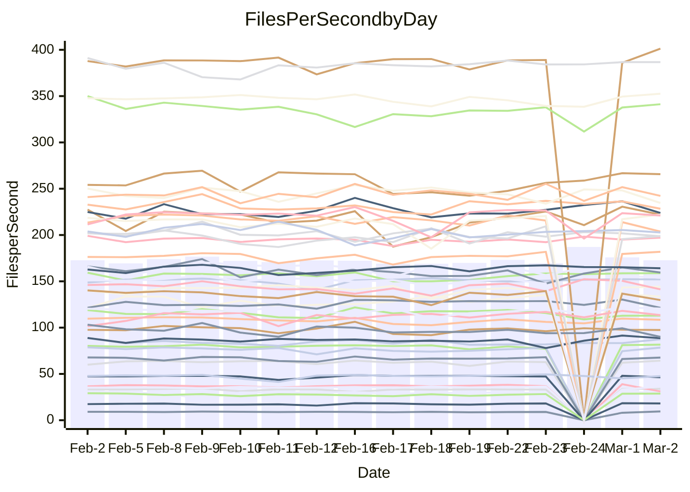

<!---
# This file is auto-generated. Do not edit.
# cspell:disable
--->
# Performance Report

## Daily Performance

## Time to Process Files

| Repository                                      | Elapsed | Min/Avg/Max           |   SD | SD Graph                |
| ----------------------------------------------- | ------: | :-------------------: | ---: | ----------------------- |
| AdaDoom3/AdaDoom3                    |    3.04 | 3.0 /   3.1 /   3.4   | 0.09 | `    ┣━━┻●━╋━━┻━━┫    ` |
| alexiosc/megistos                    |    7.15 | 7.1 /   7.4 /   8.2   | 0.22 | `    ┣━━●━━╋━━┻━━┫    ` |
| apollographql/apollo-server          |    2.30 | 2.2 /   2.3 /   2.5   | 0.07 | `     ┣━┻━━●━━┻━┫     ` |
| aspnetboilerplate/aspnetboilerplate  |   10.04 | 9.3 /  10.0 /  11.3   | 0.42 | `    ┣━━┻━━●━━┻━━┫    ` |
| aws-amplify/docs                     |   12.55 | 11.5 /  12.4 /  13.1  | 0.36 | `    ┣━━┻━━╋━●┻━━┫    ` |
| Azure/azure-rest-api-specs           |    9.10 | 8.8 /   9.4 /  10.5   | 0.50 | `    ┣━━┻●━╋━━┻━━┫    ` |
| bitjson/typescript-starter           |    0.68 | 0.6 /   0.7 /   0.9   | 0.04 | `     ┣━┻━━●━━┻━┫     ` |
| caddyserver/caddy                    |    3.19 | 3.1 /   3.4 /   3.8   | 0.16 | `    ┣━━●━━╋━━┻━━┫    ` |
| canada-ca/open-source-logiciel-libre |    0.74 | 0.7 /   0.8 /   1.0   | 0.05 | `     ┣━●━━╋━━┻━┫     ` |
| chef/chef                            |    5.42 | 5.2 /   5.7 /   8.2   | 0.53 | `    ┣━━┻━●╋━━┻━━┫    ` |
| dart-lang/sdk                        |   61.94 | 59.1 /  62.1 /  68.9  | 2.38 | `  ┣━━━┻━━━●━━━┻━━━┫  ` |
| django/django                        |   14.37 | 14.2 /  14.6 /  15.6  | 0.28 | `    ┣━━●━━╋━━┻━━┫    ` |
| eslint/eslint                        |   10.37 | 9.8 /  10.4 /  11.9   | 0.43 | `    ┣━━┻━━●━━┻━━┫    ` |
| exonum/exonum                        |    3.15 | 3.0 /   3.3 /   3.7   | 0.15 | `    ┣━━┻●━╋━━┻━━┫    ` |
| flutter/samples                      |   16.95 | 16.5 /  17.4 /  19.9  | 0.75 | `   ┣━━━┻●━╋━━┻━━━┫   ` |
| gitbucket/gitbucket                  |    3.40 | 3.1 /   3.3 /   3.5   | 0.11 | `    ┣━━┻━━╋━━┻●━┫    ` |
| googleapis/google-cloud-cpp          |  128.95 | 125.1 / 131.2 / 145.3 | 4.43 | `  ┣━━━┻━●━╋━━━┻━━━┫  ` |
| graphql/express-graphql              |    0.72 | 0.7 /   0.7 /   0.8   | 0.02 | `     ┣━●┻━╋━┻━━┫     ` |
| graphql/graphql-js                   |    2.26 | 2.2 /   2.3 /   2.5   | 0.06 | `     ┣━┻━●╋━━┻━┫     ` |
| graphql/graphql-relay-js             |    0.90 | 0.7 /   0.7 /   0.8   | 0.02 | `       ┣━┻╋┻━┫      ●` |
| graphql/graphql-spec                 |    0.83 | 0.8 /   0.9 /   1.1   | 0.06 | `     ┣━┻●━╋━━┻━┫     ` |
| iluwatar/java-design-patterns        |   12.08 | 10.9 /  12.0 /  14.4  | 0.65 | `   ┣━━━┻━━●━━┻━━━┫   ` |
| ktaranov/sqlserver-kit               |    6.24 | 6.1 /   6.4 /   7.0   | 0.25 | `    ┣━━┻●━╋━━┻━━┫    ` |
| liriliri/licia                       |    3.57 | 3.5 /   3.7 /   3.9   | 0.09 | `    ┣●━┻━━╋━━┻━━┫    ` |
| MartinThoma/LaTeX-examples           |    6.34 | 6.3 /   6.6 /   7.6   | 0.26 | `    ┣━━●━━╋━━┻━━┫    ` |
| mdx-js/mdx                           |    1.59 | 1.5 /   1.6 /   1.9   | 0.09 | `     ┣━┻●━╋━━┻━┫     ` |
| microsoft/TypeScript-Website         |    5.27 | 5.0 /   5.4 /   5.9   | 0.22 | `    ┣━━┻●━╋━━┻━━┫    ` |
| MicrosoftDocs/PowerShell-Docs        |   23.87 | 22.5 /  24.2 /  28.9  | 1.33 | `   ┣━━┻━━●╋━━━┻━━┫   ` |
| neovim/nvim-lspconfig                |    3.37 | 3.1 /   3.3 /   3.7   | 0.13 | `    ┣━━┻━━╋━●┻━━┫    ` |
| pagekit/pagekit                      |    3.64 | 3.3 /   3.4 /   3.7   | 0.10 | `    ┣━━┻━━╋━━┻━━●    ` |
| php/php-src                          |   24.69 | 21.1 /  23.0 /  26.5  | 1.30 | `   ┣━━┻━━━╋━━━┻●━┫   ` |
| plasticrake/tplink-smarthome-api     |    0.92 | 0.9 /   0.9 /   1.1   | 0.04 | `     ┣━┻━●╋━━┻━┫     ` |
| prettier/prettier                    |    6.44 | 6.2 /   6.6 /   7.2   | 0.20 | `    ┣━━┻●━╋━━┻━━┫    ` |
| pycontribs/jira                      |    1.24 | 1.2 /   1.3 /   1.5   | 0.06 | `     ┣━┻●━╋━━┻━┫     ` |
| RustPython/RustPython                |    4.44 | 4.1 /   4.3 /   4.8   | 0.15 | `    ┣━━┻━━╋━━●━━┫    ` |
| shoelace-style/shoelace              |    2.41 | 2.4 /   2.5 /   2.8   | 0.08 | `     ┣━●━━╋━━┻━┫     ` |
| slint-ui/slint                       |   10.16 | 9.2 /  10.1 /  13.1   | 0.68 | `    ┣━━┻━━●━━┻━━┫    ` |
| SoftwareBrothers/admin-bro           |    2.22 | 2.1 /   2.2 /   2.4   | 0.08 | `     ┣━┻━━╋●━┻━┫     ` |
| sveltejs/svelte                      |   18.70 | 18.4 /  18.8 /  20.1  | 0.38 | `    ┣━━┻━●╋━━┻━━┫    ` |
| TheAlgorithms/Python                 |    5.83 | 5.3 /   5.6 /   6.2   | 0.22 | `    ┣━━┻━━╋━━●━━┫    ` |
| twbs/bootstrap                       |    1.23 | 1.1 /   1.2 /   1.4   | 0.06 | `     ┣━┻━━●━━┻━┫     ` |
| typescript-cheatsheets/react         |    1.14 | 1.1 /   1.1 /   1.3   | 0.04 | `     ┣━┻━━╋●━┻━┫     ` |
| typescript-eslint/typescript-eslint  |    3.59 | 3.6 /   3.7 /   3.9   | 0.07 | `    ┣━●┻━━╋━━┻━━┫    ` |
| vitest-dev/vitest                    |    8.17 | 7.6 /   8.1 /   9.2   | 0.29 | `    ┣━━┻━━●━━┻━━┫    ` |
| w3c/aria-practices                   |    3.12 | 2.9 /   3.0 /   3.3   | 0.09 | `    ┣━━┻━━╋━━┻●━┫    ` |
| w3c/specberus                        |    1.68 | 1.6 /   1.7 /   1.9   | 0.06 | `     ┣━┻━●╋━━┻━┫     ` |
| webdeveric/webpack-assets-manifest   |    0.66 | 0.7 /   0.7 /   0.8   | 0.04 | `     ┣━┻●━╋━━┻━┫     ` |
| webpack/webpack                      |    4.96 | 4.6 /   5.0 /   5.6   | 0.21 | `    ┣━━┻━━●━━┻━━┫    ` |
| wireapp/wire-desktop                 |    0.90 | 0.9 /   0.9 /   1.1   | 0.06 | `     ┣━┻━━●━━┻━┫     ` |
| wireapp/wire-webapp                  |    8.90 | 8.3 /   8.8 /  10.0   | 0.29 | `    ┣━━┻━━╋━●┻━━┫    ` |

Note:
- Elapsed time is in seconds.

## Files per Second over Time

| Repository                                      | Files |    Sec |    Fps |     Rel | Trend Fps              |    N |
| ----------------------------------------------- | ----: | -----: | -----: | ------: | ---------------------- | ---: |
| AdaDoom3/AdaDoom3                    |   103 |   3.04 |  33.92 |   2.38% | `▄▇█▆▇▆▇▇████▆▇▆▇▇▇██` |   33 |
| alexiosc/megistos                    |   583 |   7.15 |  81.59 |   2.98% | `██▇██▇▇▆▄▇██▇█▇▆▅███` |   33 |
| apollographql/apollo-server          |   250 |   2.30 | 108.50 |   0.49% | `▄▆▆▅▅▅█▇▅▇▆▆█▆██▄▅▇▇` |   35 |
| aspnetboilerplate/aspnetboilerplate  |  2246 |  10.04 | 223.75 |  -0.50% | `▇▆▆▅▆▃▇▇▆█▆▅▅▅▅▆▇▇▇▆` |   34 |
| aws-amplify/docs                     |  2867 |  12.55 | 228.38 |  -1.45% | `▅▄▄▄▆▇▆▅▇▆▆▅▅▆▆█▅▆▆▅` |   35 |
| Azure/azure-rest-api-specs           |  2419 |   9.10 | 265.72 |   4.97% | `▅▅▅▅▄▅▅▅▅▅▇▆▄▃█▅█▇██` |   35 |
| bitjson/typescript-starter           |    20 |   0.68 |  29.62 |   0.38% | `▇▄▇▇▇▇▆▇▇▇▆█▆▇▇▇▇▇█▇` |   33 |
| caddyserver/caddy                    |   279 |   3.19 |  87.42 |   5.32% | `█▆▅█▅▇▇▄▇▆▇█▅█▃▆▆▇▇█` |   35 |
| canada-ca/open-source-logiciel-libre |     7 |   0.74 |   9.48 |   7.16% | `▇▅▆▆▇▇▇▄█▂▅▇▇▆▇▇█▆▅█` |   33 |
| chef/chef                            |  1204 |   5.42 | 222.00 |   3.69% | `▂▇▆▆▇█▅▆▇▆▆█▇████▇█▇` |   34 |
| dart-lang/sdk                        | 10158 |  61.94 | 163.99 |   0.67% | `▅▅▆█▆▆▇█▇█▇█▇███▄▇█▇` |   35 |
| django/django                        |  2833 |  14.37 | 197.20 |   1.73% | `▄▆▇▇▇▇█▆▇█▇▇█▇▇▇▆█▇█` |   35 |
| eslint/eslint                        |  2060 |  10.37 | 198.61 |   0.68% | `▆▆▆█▅▆▆▅▇█▇█▇█▇▇▇▇▇▇` |   35 |
| exonum/exonum                        |   421 |   3.15 | 133.51 |   2.96% | `▅▅▆▇▇▇▆▅▆▅█▇▅▇▆▇▇██▇` |   33 |
| flutter/samples                      |  2693 |  16.95 | 158.84 |   2.60% | `▅▅▇▆▇▅▇█▃█▇█▆█▄▇█▇▇▇` |   34 |
| gitbucket/gitbucket                  |   412 |   3.40 | 121.34 |  -4.34% | `▇▇▇▇▇▇▇▇▇▅▆██▇▇▆█▆▇▅` |   35 |
| googleapis/google-cloud-cpp          | 19818 | 128.95 | 153.68 |   1.67% | `▆▇▆▇▅▅▆▅███▆▇▆▇▇█▃█▇` |   34 |
| graphql/express-graphql              |    26 |   0.72 |  36.34 |   2.59% | `▇▅▆▇██▇▆▇▅█▇▇█▆▇█▇▄█` |   33 |
| graphql/graphql-js                   |   344 |   2.26 | 152.07 |   1.12% | `▆▇█▇█▇▆▇▇▇█▅▆▆▇▆▇▇▇▇` |   35 |
| graphql/graphql-relay-js             |    28 |   0.90 |  31.05 | -16.90% | `▇█▇▇▆▇▇█▆▆▇▇████▅▇█▁` |   33 |
| graphql/graphql-spec                 |    15 |   0.83 |  18.10 |   3.79% | `████▇█▇▄▄█▇▇▇█▇█████` |   34 |
| iluwatar/java-design-patterns        |  1927 |  12.08 | 159.54 |  -0.09% | `█▇▇▇▇██▇▄█▇▇▇██▃█▇█▇` |   34 |
| ktaranov/sqlserver-kit               |   489 |   6.24 |  78.39 |   2.93% | `▇▇▅▅▅▆▆▆▇▄▇▇▇█▇▄█▆▆▇` |   33 |
| liriliri/licia                       |  1434 |   3.57 | 401.27 |   4.08% | `▆█▄▆▆▅▅▆▄▅▅▇▆▆▆▆▆▆▆▇` |   33 |
| MartinThoma/LaTeX-examples           |  1409 |   6.34 | 222.18 |   3.70% | `▇▅▇▇▃▇▇▇▇▇▇█▇▇█▅█▇▇█` |   33 |
| mdx-js/mdx                           |   141 |   1.59 |  88.60 |   3.34% | `▇▅▇▆▆▇▆▇▄▄██▇▇▇▅▃▆█▇` |   34 |
| microsoft/TypeScript-Website         |   760 |   5.27 | 144.23 |   1.99% | `▆▅▇█▄▄▆▇▅▆▇▄▆▇▇▅▅▆▆▆` |   34 |
| MicrosoftDocs/PowerShell-Docs        |  2709 |  23.87 | 113.47 |   1.14% | `▇▆▇▇▇▇▇▆▄█▇▇█▅██▇▆█▇` |   35 |
| neovim/nvim-lspconfig                |   381 |   3.37 | 112.99 |  -2.57% | `▇▆▆▇▆▇▇█▇▆▇██▇▇▇▅▅▆▆` |   35 |
| pagekit/pagekit                      |   741 |   3.64 | 203.71 |  -6.32% | `▆▇█▇▇▄▇▅▇▆█▇▇█▇▇▅█▆▅` |   33 |
| php/php-src                          |  2221 |  24.69 |  89.96 |  -6.98% | `▆▆▄▆▃▇█▅▆█▆▄▇▆▇▄▇▅▇▄` |   35 |
| plasticrake/tplink-smarthome-api     |    62 |   0.92 |  67.64 |   1.84% | `█▆▇▇▇▆▇▇▇█▇█▅██▇██▇█` |   33 |
| prettier/prettier                    |  2197 |   6.44 | 341.22 |   2.05% | `▄██▆▇█▇▆▇█▆▆▇█▇█▇▄▇█` |   35 |
| pycontribs/jira                      |    80 |   1.24 |  64.28 |   3.14% | `██▆▆▇▆▃▆▇▃▇███▆▆█▆▇█` |   33 |
| RustPython/RustPython                |   628 |   4.44 | 141.29 |  -2.39% | `▇█▃▄▆▇▇▆▇▇▇▆▆█▇▅▅██▆` |   35 |
| shoelace-style/shoelace              |   438 |   2.41 | 181.85 |   3.19% | `▇▃▇▆▇▇█▆▇█▇▇▇▇▇▆████` |   33 |
| slint-ui/slint                       |  2060 |  10.16 | 202.71 |   0.34% | `▇▆▆▇▇▇▂▇█▇█▆▆▆██▇▇▇▇` |   35 |
| SoftwareBrothers/admin-bro           |   441 |   2.22 | 198.76 |  -0.85% | `▅▇▇▅▇▅▅▆▇▆▄▄▆▆▇▆▇█▅▆` |   33 |
| sveltejs/svelte                      |  7230 |  18.70 | 386.69 |   1.05% | `█▇▇▇▇█▇▇▇▇█▇███▇█▇▇▇` |   35 |
| TheAlgorithms/Python                 |  1369 |   5.83 | 234.63 |  -4.08% | `▆█▇▇▇█▅▇▇▇▇▅▇▇▆▇▃▇▇▅` |   35 |
| twbs/bootstrap                       |   120 |   1.23 |  97.47 |  -0.42% | `▆▆▅▅████▃█▇▇█▇▇▇▆▇▇▇` |   35 |
| typescript-cheatsheets/react         |    53 |   1.14 |  46.46 |  -1.89% | `█▇▇▇▇▇▇█▇▇▇▇▇▇▇██▆▇▆` |   33 |
| typescript-eslint/typescript-eslint  |  1267 |   3.59 | 352.53 |   1.73% | `▇▇▆▆█▇▇███▇▆█▆█▅█▆██` |   35 |
| vitest-dev/vitest                    |  1980 |   8.17 | 242.29 |  -0.34% | `▆▆▇▇▆▇▅▇▇▅▇▆▆▅▅▇█▆▇▆` |   35 |
| w3c/aria-practices                   |   405 |   3.12 | 129.78 |  -4.63% | `▆▄▆█▄█▇▇▇▇▇▆▅█▅▇▇█▇▅` |   33 |
| w3c/specberus                        |   203 |   1.68 | 120.55 |   2.11% | `▇▇█▅█▇▅▆▅▆▇█▃▇█▇▇▆█▇` |   35 |
| webdeveric/webpack-assets-manifest   |    19 |   0.66 |  28.72 |   4.78% | `▆▇▇▃▇▇▇▄▄▇▇▇▅█▇█████` |   33 |
| webpack/webpack                      |  1096 |   4.96 | 221.08 |  -0.24% | `▅▇▄▃▆▇▆▆▇▇▆█▆▅▇▇▆▃▆▆` |   35 |
| wireapp/wire-desktop                 |    43 |   0.90 |  47.57 |   0.14% | `▆█▇▇▆█▇▇███▇█▇▇██▇▆▇` |   35 |
| wireapp/wire-webapp                  |  1460 |   8.90 | 164.06 |   0.49% | `█▇▆▇▃▆▇█▆▇▇█▇▇▆█▇▇▇▇` |   35 |

## Data Throughput

| Repository                                      | Files |    Sec |     Kps |     Rel | Trend Kps              |    N |
| ----------------------------------------------- | ----: | -----: | ------: | ------: | ---------------------- | ---: |
| AdaDoom3/AdaDoom3                    |   103 |   3.04 |  720.87 |   2.38% | `▄▇█▆▇▆▇▇████▆▇▆▇▇▇██` |   33 |
| alexiosc/megistos                    |   583 |   7.15 |  641.10 |   2.98% | `██▇██▇▇▆▄▇██▇█▇▆▅███` |   33 |
| apollographql/apollo-server          |   250 |   2.30 |  868.83 |   0.49% | `▄▆▆▅▅▅█▇▅▇▆▆█▆██▄▅▇▇` |   35 |
| aspnetboilerplate/aspnetboilerplate  |  2246 |  10.04 |  526.59 |  -0.48% | `▇▆▆▅▆▃▇▇▆█▆▅▅▅▅▆▇▇▇▆` |   34 |
| aws-amplify/docs                     |  2867 |  12.55 |  787.75 |  -1.35% | `▅▄▄▄▆▇▆▅▇▆▆▅▅▆▆█▅▆▆▅` |   35 |
| Azure/azure-rest-api-specs           |  2419 |   9.10 |  753.12 |   3.75% | `▅▅▅▅▄▅▅▅▅▅▇▆▄▃█▅█▆▇▇` |   35 |
| bitjson/typescript-starter           |    20 |   0.68 |  118.46 |   0.38% | `▇▄▇▇▇▇▆▇▇▇▆█▆▇▇▇▇▇█▇` |   33 |
| caddyserver/caddy                    |   279 |   3.19 |  735.37 |   5.70% | `█▆▅█▅▇▇▄▇▆▇█▅█▃▆▆▇▇█` |   35 |
| canada-ca/open-source-logiciel-libre |     7 |   0.74 |   78.53 |   7.16% | `▇▅▆▆▇▇▇▄█▂▅▇▇▆▇▇█▆▅█` |   33 |
| chef/chef                            |  1204 |   5.42 | 1020.18 |   3.71% | `▂▇▆▆▇█▅▆▇▆▆█▇████▇█▇` |   34 |
| dart-lang/sdk                        | 10158 |  61.94 | 1148.16 |   0.26% | `▅▅▆█▆▆▇█▇█▇█▇███▄▇▇▇` |   35 |
| django/django                        |  2833 |  14.37 | 1216.24 |   1.70% | `▄▆▇▇▇▇█▆▇█▇▇█▇▇▇▆█▇█` |   35 |
| eslint/eslint                        |  2060 |  10.37 | 1620.70 |   0.77% | `▆▆▅█▅▆▆▅▇█▇█▇█▇▇▇█▇▇` |   35 |
| exonum/exonum                        |   421 |   3.15 | 1277.11 |   2.96% | `▅▅▆▇▇▇▆▅▆▅█▇▅▇▆▇▇██▇` |   33 |
| flutter/samples                      |  2693 |  16.95 | 1297.23 |   2.85% | `▅▅▇▆▇▅▇█▃█▇█▆█▄▇█▇▇▇` |   34 |
| gitbucket/gitbucket                  |   412 |   3.40 |  548.66 |  -4.34% | `▇▇▇▇▇▇▇▇▇▅▆██▇▇▆█▆▇▅` |   35 |
| googleapis/google-cloud-cpp          | 19818 | 128.95 | 1206.03 |   1.76% | `▆▇▆▇▅▅▆▅███▆▇▆▇▇█▃█▇` |   34 |
| graphql/express-graphql              |    26 |   0.72 |  166.31 |   2.59% | `▇▅▆▇██▇▆▇▅█▇▇█▆▇█▇▄█` |   33 |
| graphql/graphql-js                   |   344 |   2.26 |  856.27 |   1.24% | `▆▇█▇█▇▆▇▇▇█▅▆▆▇▆▇▇▇▇` |   35 |
| graphql/graphql-relay-js             |    28 |   0.90 |  121.98 | -16.90% | `▇█▇▇▆▇▇█▆▆▇▇████▅▇█▁` |   33 |
| graphql/graphql-spec                 |    15 |   0.83 |  667.41 |   3.83% | `████▇█▇▄▄█▇▇▇█▇█████` |   34 |
| iluwatar/java-design-patterns        |  1927 |  12.08 |  488.97 |  -0.13% | `█▇▇▇▇██▇▄█▇▇▇██▃█▇█▇` |   34 |
| ktaranov/sqlserver-kit               |   489 |   6.24 | 1185.97 |   2.93% | `▇▇▅▅▅▆▆▆▇▄▇▇▇█▇▄█▆▆▇` |   33 |
| liriliri/licia                       |  1434 |   3.57 |  475.42 |   4.08% | `▆█▄▆▆▅▅▆▄▅▅▇▆▆▆▆▆▆▆▇` |   33 |
| MartinThoma/LaTeX-examples           |  1409 |   6.34 |  458.88 |   3.70% | `▇▅▇▇▃▇▇▇▇▇▇█▇▇█▅█▇▇█` |   33 |
| mdx-js/mdx                           |   141 |   1.59 |  410.94 |   3.35% | `▇▅▇▆▆▇▆▇▄▄██▇▇▇▅▃▆█▇` |   34 |
| microsoft/TypeScript-Website         |   760 |   5.27 |  994.23 |   2.04% | `▆▅▇█▄▄▆▇▅▆▇▄▆▇▇▅▅▆▆▆` |   34 |
| MicrosoftDocs/PowerShell-Docs        |  2709 |  23.87 | 1164.02 |   1.18% | `▇▆▇▇▇▇▇▆▄█▇▇█▅██▇▆█▇` |   35 |
| neovim/nvim-lspconfig                |   381 |   3.37 |  295.96 |  -2.82% | `▇▆▆▇▆▇▇█▇▆▇██▇▇▇▅▄▆▆` |   35 |
| pagekit/pagekit                      |   741 |   3.64 |  424.73 |  -6.32% | `▆▇█▇▇▄▇▅▇▆█▇▇█▇▇▅█▆▅` |   33 |
| php/php-src                          |  2221 |  24.69 | 1327.07 |  -6.67% | `▆▆▄▆▄▇█▅▆█▆▄▇▆▇▄▇▅▇▄` |   35 |
| plasticrake/tplink-smarthome-api     |    62 |   0.92 |  365.45 |   1.84% | `█▆▇▇▇▆▇▇▇█▇█▅██▇██▇█` |   33 |
| prettier/prettier                    |  2197 |   6.44 |  484.41 |   2.21% | `▄██▆▇█▇▆▇█▆▆▇█▇█▇▅▇█` |   35 |
| pycontribs/jira                      |    80 |   1.24 |  442.73 |   3.14% | `██▆▆▇▆▃▆▇▃▇███▆▆█▆▇█` |   33 |
| RustPython/RustPython                |   628 |   4.44 | 1043.91 |  -2.72% | `▇█▃▄▆▇▇▆▇▇▇▆▆█▇▅▅█▇▆` |   35 |
| shoelace-style/shoelace              |   438 |   2.41 |  876.44 |   3.21% | `▇▃▇▆▇▇█▆▇█▇▇▇▇▇▆████` |   33 |
| slint-ui/slint                       |  2060 |  10.16 | 1282.78 |  21.74% | `▅▄▄▅▅▅▂▅▅▅▅▄▄▄▅▅▄███` |   35 |
| SoftwareBrothers/admin-bro           |   441 |   2.22 |  438.08 |  -0.85% | `▅▇▇▅▇▅▅▆▇▆▄▄▆▆▇▆▇█▅▆` |   33 |
| sveltejs/svelte                      |  7230 |  18.70 |  256.24 |   0.90% | `█▇▇▇▇█▇▇▇▇█▇███▇█▇▇▇` |   35 |
| TheAlgorithms/Python                 |  1369 |   5.83 |  596.26 |  -4.05% | `▆█▇▇▇█▅▇▇▇▇▅▇▇▆▇▃▇▇▅` |   35 |
| twbs/bootstrap                       |   120 |   1.23 |  782.23 |  -0.42% | `▆▆▅▅████▃█▇▇█▇▇▇▆▇▇▇` |   35 |
| typescript-cheatsheets/react         |    53 |   1.14 |  340.12 |  -1.89% | `█▇▇▇▇▇▇█▇▇▇▇▇▇▇██▆▇▆` |   33 |
| typescript-eslint/typescript-eslint  |  1267 |   3.59 | 1757.34 |   3.09% | `▇▇▆▆▇▇▇█▇█▆▆▇▆█▄█▆██` |   35 |
| vitest-dev/vitest                    |  1980 |   8.17 |  506.25 |  -0.44% | `▆▆▇▇▆▇▅▇▇▅▇▆▆▅▅▇█▅▇▆` |   35 |
| w3c/aria-practices                   |   405 |   3.12 | 1205.17 |  -4.63% | `▆▄▆█▄█▇▇▇▇▇▆▅█▅▇▇█▇▅` |   33 |
| w3c/specberus                        |   203 |   1.68 |  380.07 |   0.99% | `▇▇█▅█▇▅▆▅▆▇█▃▇█▇▇▆▇▇` |   35 |
| webdeveric/webpack-assets-manifest   |    19 |   0.66 |  154.21 |   4.78% | `▆▇▇▃▇▇▇▄▄▇▇▇▅█▇█████` |   33 |
| webpack/webpack                      |  1096 |   4.96 |  974.91 |  -0.27% | `▅▇▄▃▆▇▆▆▇▇▆█▆▅▇▇▆▃▆▆` |   35 |
| wireapp/wire-desktop                 |    43 |   0.90 |  210.18 |   0.14% | `▆█▇▇▆█▇▇███▇█▇▇██▇▆▇` |   35 |
| wireapp/wire-webapp                  |  1460 |   8.90 |  640.18 |  -0.62% | `█▇▆▇▃▆▇█▆▇▇█▇▇▆█▇▇▇▇` |   35 |

