<!---
# This file is auto-generated. Do not edit.
# cspell:disable
--->
# Performance Report

## Daily Performance

```mermaid
xychart-beta
    title Files Per Second by Day
    y-axis Files per Second
    x-axis Date [Jun-16, Jun-17, Jun-18, Jun-19, Jun-20, Jun-21, Jun-23, Jun-24, Jun-25, Jun-28, Jun-29, Jun-30, Jul-1, Jul-2, Jul-5, Jul-6, Jul-7, Jul-8, Jul-11, Jul-12, Jul-13, Jul-14, Jul-15, Jul-16]
    bar [54.55, 56.29, 53.60, 54.73, 53.81, 54.79, 54.65, 53.68, 53.90, 53.25, 54.88, 55.38, 53.96, 53.38, 53.29, 54.69, 54.15, 52.68, 52.74, 53.48, 58.79, 58.57, 57.68, 58.10]
    line [31.14, 0.00, 29.14, 29.85, 30.46, 29.32, 30.46, 25.95, 30.27, 29.25, 28.15, 31.49, 30.25, 28.83, 30.14, 31.39, 30.96, 0.00, 28.64, 28.73, 29.33, 23.74, 27.78, 29.33]
    line [7.74, 7.93, 7.76, 8.15, 7.88, 8.03, 8.06, 7.77, 7.95, 7.37, 8.15, 8.08, 8.03, 7.91, 7.73, 7.95, 8.03, 0.00, 7.64, 7.43, 7.58, 8.03, 7.85, 7.69]
    line [24.07, 0.00, 25.24, 25.00, 24.06, 25.33, 25.45, 24.29, 25.27, 24.54, 24.33, 25.24, 24.74, 24.93, 22.81, 25.11, 24.25, 0.00, 24.97, 24.54, 25.28, 25.22, 25.17, 25.79]
    line [69.19, 66.53, 67.29, 68.84, 65.67, 68.82, 66.74, 67.96, 68.42, 66.90, 67.92, 66.32, 68.05, 67.42, 66.36, 68.11, 66.59, 66.07, 65.01, 66.37, 68.01, 66.96, 68.08, 67.41]
    line [29.84, 0.00, 28.47, 30.05, 28.68, 30.36, 29.11, 28.16, 29.87, 28.95, 29.93, 30.09, 26.38, 27.87, 29.69, 29.23, 28.58, 0.00, 29.03, 28.85, 30.81, 32.04, 31.20, 31.04]
    line [28.46, 0.00, 28.03, 28.13, 27.70, 27.54, 28.60, 27.82, 27.99, 27.26, 28.55, 28.75, 28.24, 27.65, 26.29, 28.70, 26.38, 0.00, 25.97, 25.27, 27.83, 26.89, 27.74, 27.00]
    line [22.51, 0.00, 23.47, 22.91, 22.43, 23.52, 23.36, 23.17, 23.54, 18.25, 23.79, 20.94, 23.87, 23.33, 23.15, 23.48, 22.48, 0.00, 21.53, 21.55, 23.37, 23.45, 21.90, 22.53]
    line [33.62, 33.80, 31.53, 31.68, 32.63, 33.23, 32.44, 32.70, 31.96, 31.81, 31.48, 31.69, 31.23, 31.21, 32.29, 33.10, 33.36, 32.59, 32.17, 32.28, 32.99, 33.06, 30.97, 32.78]
    line [7.16, 0.00, 7.14, 6.91, 7.08, 7.24, 7.00, 7.25, 7.04, 7.25, 7.16, 6.89, 7.22, 7.04, 7.03, 6.91, 7.06, 0.00, 7.05, 6.73, 7.02, 7.16, 6.36, 6.68]
    line [95.51, 0.00, 92.68, 90.88, 94.97, 95.41, 94.44, 93.28, 95.18, 96.78, 93.41, 95.43, 94.64, 92.95, 92.70, 93.91, 93.91, 97.14, 94.93, 90.72, 96.63, 98.76, 91.36, 94.79]
    line [60.54, 55.30, 58.53, 61.04, 58.63, 56.24, 60.65, 57.96, 58.45, 59.90, 60.37, 58.56, 57.32, 58.13, 59.40, 62.05, 58.77, 60.69, 57.88, 57.69, 63.02, 53.69, 62.28, 61.30]
    line [36.70, 0.00, 39.92, 40.45, 40.18, 40.38, 41.88, 37.99, 41.49, 40.33, 40.64, 41.17, 29.01, 40.13, 39.92, 40.46, 40.58, 0.00, 37.95, 39.51, 38.75, 40.71, 39.33, 38.81]
    line [162.58, 176.51, 171.66, 185.92, 178.53, 183.48, 175.07, 178.76, 176.61, 184.19, 181.53, 174.14, 177.27, 171.99, 172.23, 173.32, 175.11, 173.39, 173.74, 172.96, 175.55, 176.84, 169.75, 182.10]
    line [60.79, 62.47, 62.13, 62.00, 61.61, 59.94, 59.89, 59.44, 60.11, 61.36, 61.09, 62.22, 60.39, 56.87, 58.80, 61.52, 59.73, 59.67, 57.25, 59.76, 62.00, 61.78, 58.43, 59.46]
    line [22.97, 23.21, 23.06, 23.36, 23.21, 23.29, 22.70, 22.41, 23.38, 22.06, 23.24, 23.90, 23.42, 23.19, 23.32, 23.79, 23.42, 21.93, 22.47, 23.35, 26.70, 27.10, 27.20, 27.32]
    line [183.43, 187.40, 188.68, 189.42, 185.98, 174.53, 185.40, 177.45, 185.19, 175.70, 182.89, 195.56, 184.76, 182.13, 189.18, 176.80, 183.73, 190.06, 183.23, 187.99, 186.87, 191.51, 181.06, 187.68]
    line [42.24, 0.00, 40.82, 40.85, 41.61, 40.17, 42.36, 39.51, 38.83, 39.73, 39.63, 39.23, 41.65, 40.80, 40.60, 42.25, 39.96, 40.88, 41.31, 41.23, 42.19, 40.16, 39.43, 41.70]
    line [37.63, 0.00, 37.70, 36.03, 37.29, 36.01, 37.83, 36.95, 35.76, 36.83, 37.61, 37.38, 38.58, 36.99, 37.44, 37.75, 37.85, 37.02, 34.25, 36.67, 39.28, 40.59, 38.43, 40.63]
    line [36.52, 0.00, 35.88, 36.45, 35.63, 37.02, 36.72, 36.62, 36.60, 37.20, 36.77, 36.10, 36.00, 35.56, 34.93, 36.70, 36.34, 0.00, 34.76, 36.63, 37.65, 38.19, 37.44, 35.77]
    line [99.03, 0.00, 96.47, 100.84, 96.57, 95.40, 95.71, 96.24, 96.66, 98.87, 96.32, 94.31, 100.99, 95.12, 94.46, 101.33, 98.77, 0.00, 95.14, 96.41, 102.68, 104.85, 103.75, 104.23]
    line [61.54, 59.34, 60.30, 60.82, 58.87, 59.30, 58.89, 58.05, 59.57, 59.87, 57.70, 61.16, 59.63, 57.22, 58.32, 59.51, 59.81, 0.00, 58.62, 57.98, 59.77, 57.87, 59.15, 59.28]
    line [8.39, 0.00, 8.29, 8.34, 8.29, 8.43, 8.01, 8.19, 8.16, 8.42, 8.39, 8.40, 8.24, 8.28, 8.19, 8.63, 8.37, 0.00, 8.11, 8.54, 11.44, 11.22, 11.35, 11.99]
    line [99.41, 0.00, 98.69, 97.58, 99.86, 101.16, 98.61, 100.63, 97.85, 98.44, 101.25, 102.07, 102.24, 102.81, 99.98, 103.89, 102.63, 0.00, 97.06, 99.82, 103.83, 102.51, 105.16, 106.15]
    line [37.09, 0.00, 36.40, 34.57, 35.89, 36.46, 35.53, 32.32, 35.78, 35.63, 35.36, 36.33, 35.60, 35.86, 35.14, 36.26, 35.11, 0.00, 35.79, 35.44, 36.86, 37.32, 34.63, 36.64]
    line [76.51, 78.16, 76.84, 79.08, 76.60, 77.73, 80.09, 73.97, 78.56, 80.87, 80.11, 80.39, 77.44, 78.37, 79.33, 78.73, 76.97, 77.95, 76.23, 77.21, 85.30, 84.52, 82.01, 81.72]
    line [41.12, 43.00, 42.10, 42.62, 41.28, 41.33, 41.93, 40.81, 41.96, 42.91, 41.69, 43.04, 42.05, 41.34, 42.15, 42.53, 40.91, 0.00, 41.76, 42.26, 44.10, 43.14, 44.26, 44.32]
    line [57.90, 57.08, 56.67, 54.06, 56.85, 56.62, 56.53, 54.80, 55.32, 56.90, 57.36, 56.70, 55.42, 56.02, 55.97, 59.70, 57.75, 58.20, 58.17, 58.70, 57.65, 57.74, 58.09, 58.77]
    line [164.15, 162.60, 161.18, 158.49, 159.73, 163.19, 164.26, 158.19, 157.79, 159.21, 162.83, 162.04, 163.63, 163.52, 159.46, 166.05, 164.00, 156.23, 162.57, 160.66, 161.32, 166.06, 161.19, 163.84]
    line [20.49, 0.00, 20.74, 21.25, 21.30, 20.86, 20.91, 20.57, 20.77, 20.27, 21.23, 21.32, 20.26, 20.95, 20.54, 21.71, 21.11, 20.98, 20.82, 21.02, 23.42, 23.84, 23.28, 22.80]
    line [111.18, 109.94, 109.97, 109.03, 107.42, 111.79, 110.71, 109.09, 111.49, 107.90, 114.19, 115.16, 113.05, 112.31, 110.93, 115.67, 112.16, 0.00, 108.89, 113.41, 118.00, 119.52, 118.41, 118.27]
    line [43.19, 41.05, 42.25, 40.57, 42.12, 43.62, 42.26, 41.31, 43.04, 41.97, 42.58, 42.67, 39.88, 42.39, 42.24, 42.47, 42.51, 42.43, 41.92, 43.23, 46.44, 46.62, 45.76, 46.71]
    line [19.30, 0.00, 18.42, 19.47, 18.77, 18.39, 19.41, 18.86, 18.25, 18.72, 18.97, 19.39, 18.97, 18.75, 18.86, 19.03, 18.73, 0.00, 18.00, 18.67, 22.06, 22.60, 22.13, 22.50]
    line [22.88, 0.00, 22.89, 22.09, 22.64, 22.03, 23.15, 22.70, 22.92, 22.73, 21.28, 23.51, 21.26, 23.21, 22.78, 22.74, 21.42, 0.00, 22.47, 21.85, 20.95, 22.33, 21.90, 22.30]
    line [36.78, 38.11, 37.93, 38.17, 37.98, 37.01, 37.64, 35.45, 34.98, 38.21, 37.49, 37.44, 36.89, 37.54, 37.39, 37.96, 37.38, 36.33, 35.68, 36.85, 48.54, 50.30, 48.98, 50.52]
    line [31.82, 30.40, 31.16, 31.74, 31.53, 30.20, 32.21, 31.68, 31.67, 30.23, 30.55, 31.97, 29.38, 31.00, 30.73, 31.84, 31.72, 29.65, 28.10, 30.62, 32.03, 32.73, 31.18, 31.40]
    line [91.19, 85.25, 88.25, 87.27, 87.35, 88.00, 90.71, 85.96, 90.30, 89.95, 88.48, 91.12, 91.92, 89.67, 90.03, 85.50, 91.69, 0.00, 89.71, 88.17, 90.21, 89.66, 89.77, 90.81]
    line [53.96, 53.91, 54.07, 51.71, 53.57, 56.32, 54.68, 53.08, 54.03, 55.26, 55.00, 53.08, 56.15, 54.34, 55.22, 55.54, 54.83, 44.51, 54.58, 53.10, 57.69, 58.02, 49.37, 56.32]
    line [60.45, 62.55, 59.44, 62.51, 61.68, 60.69, 61.64, 60.33, 62.74, 59.90, 62.95, 63.02, 62.92, 60.05, 59.94, 61.97, 60.87, 60.86, 61.32, 60.29, 63.66, 62.24, 62.09, 62.65]
    line [78.27, 76.75, 75.29, 71.22, 68.41, 76.29, 75.88, 77.29, 75.99, 76.37, 77.11, 78.01, 75.37, 77.05, 77.75, 78.86, 75.50, 75.57, 76.15, 76.16, 78.89, 77.81, 76.80, 75.95]
    line [173.27, 176.55, 176.55, 176.66, 178.14, 181.41, 179.40, 182.07, 174.90, 180.00, 190.11, 183.04, 188.67, 178.03, 182.58, 173.26, 181.48, 195.68, 179.78, 183.27, 193.41, 195.82, 190.82, 191.89]
    line [75.69, 72.01, 72.65, 74.87, 74.57, 73.44, 73.65, 74.67, 73.58, 69.13, 73.39, 75.25, 74.70, 74.82, 74.90, 72.90, 74.49, 74.41, 75.29, 74.73, 78.12, 57.67, 77.25, 78.87]
    line [53.38, 50.30, 52.09, 53.08, 52.28, 52.50, 52.93, 52.43, 51.11, 53.36, 53.41, 52.73, 52.59, 53.15, 52.86, 54.00, 52.16, 53.40, 52.17, 53.18, 59.26, 59.79, 58.32, 59.82]
    line [54.62, 56.27, 54.08, 54.30, 53.24, 54.86, 55.60, 54.23, 54.16, 54.66, 55.22, 54.68, 56.12, 54.84, 54.28, 55.54, 55.40, 55.26, 53.33, 55.62, 56.85, 55.92, 57.21, 57.74]
    line [31.27, 28.41, 30.00, 30.21, 29.58, 30.68, 30.03, 28.83, 28.93, 30.09, 29.83, 30.85, 30.72, 29.91, 29.74, 30.26, 30.42, 30.03, 30.14, 29.24, 29.88, 30.92, 31.24, 29.60]
    line [18.98, 18.28, 18.45, 18.85, 19.40, 18.81, 18.43, 18.29, 18.89, 18.14, 19.45, 19.44, 19.46, 19.02, 18.32, 19.11, 19.25, 17.58, 19.30, 19.39, 22.38, 22.18, 21.73, 22.38]
    line [47.98, 49.40, 47.24, 49.60, 47.69, 49.10, 49.12, 46.65, 48.02, 46.13, 48.38, 49.21, 46.17, 45.76, 46.03, 47.73, 47.13, 46.28, 44.48, 45.95, 52.42, 53.07, 51.85, 50.98]
```

## Time to Process Files

| Repository                                      | Elapsed | Min/Avg/Max           |    SD | SD Graph                |
| ----------------------------------------------- | ------: | :-------------------: | ----: | ----------------------- |
| AdaDoom3/AdaDoom3                    |    8.93 | 8.4 /  11.7 /  13.8   |  1.52 | `    ┣●━┻━━╋━━┻━━┫    ` |
| alexiosc/megistos                    |   25.88 | 25.3 /  30.1 /  34.4  |  2.17 | `    ●━━┻━━╋━━┻━━┫    ` |
| apollographql/apollo-server          |    6.96 | 6.4 /   6.8 /   7.6   |  0.22 | `     ┣━┻━━╋━━●━┫     ` |
| aspnetboilerplate/aspnetboilerplate  |   23.45 | 22.5 /  24.4 /  26.9  |  0.91 | `    ┣━━●━━╋━━┻━━┫    ` |
| aws-amplify/docs                     |   38.69 | 35.6 /  37.4 /  61.0  |  3.37 | `   ┣━━━┻━━╋●━┻━━━┫   ` |
| Azure/azure-rest-api-specs           |   30.35 | 29.7 /  31.9 /  41.2  |  1.62 | `    ┣━━●━━╋━━┻━━┫    ` |
| bitjson/typescript-starter           |    0.90 | 0.8 /   0.9 /   1.1   |  0.06 | `     ┣━━┻━╋●┻━━┫     ` |
| caddyserver/caddy                    |   10.23 | 9.7 /  11.5 /  12.6   |  0.79 | `    ┣●━┻━━╋━━┻━━┫    ` |
| canada-ca/open-source-logiciel-libre |    1.08 | 0.9 /   1.0 /   1.2   |  0.05 | `     ┣━━┻━╋━┻━●┫     ` |
| chef/chef                            |   19.88 | 19.6 /  20.7 /  22.2  |  0.64 | `    ┣━●┻━━╋━━┻━━┫    ` |
| django/django                        |   46.78 | 46.3 /  51.8 /  56.7  |  2.61 | `   ┣●━━┻━━╋━━┻━━━┫   ` |
| eslint/eslint                        |   31.03 | 30.0 /  31.7 /  34.4  |  0.98 | `    ┣━━┻●━╋━━┻━━┫    ` |
| exonum/exonum                        |   11.27 | 11.2 /  11.8 /  14.1  |  0.46 | `    ┣━━●━━╋━━┻━━┫    ` |
| gitbucket/gitbucket                  |    6.76 | 6.4 /   7.0 /   7.7   |  0.29 | `     ┣━┻●━╋━━┻━┫     ` |
| googleapis/google-cloud-cpp          |  367.46 | 357.6 / 400.2 / 450.4 | 20.21 | `  ┣●━━┻━━━╋━━━┻━━━┫  ` |
| graphql/express-graphql              |    0.96 | 0.9 /   1.0 /   1.1   |  0.05 | `     ┣━━┻━●━┻━━┫     ` |
| graphql/graphql-js                   |    5.45 | 5.4 /   5.8 /   6.5   |  0.28 | `     ┣━●━━╋━━┻━┫     ` |
| graphql/graphql-relay-js             |    0.97 | 0.9 /   1.0 /   1.2   |  0.06 | `     ┣━━┻━●━┻━━┫     ` |
| graphql/graphql-spec                 |    1.89 | 1.8 /   1.9 /   2.2   |  0.08 | `     ┣━━┻●╋━┻━━┫     ` |
| iluwatar/java-design-patterns        |   33.53 | 31.1 /  33.9 /  49.2  |  2.65 | `    ┣━━┻━━●━━┻━━┫    ` |
| ktaranov/sqlserver-kit               |   22.37 | 20.5 /  22.9 /  24.7  |  1.15 | `    ┣━━┻━●╋━━┻━━┫    ` |
| liriliri/licia                       |    7.56 | 7.6 /   8.1 /   8.8   |  0.26 | `     ●━┻━━╋━━┻━┫     ` |
| MartinThoma/LaTeX-examples           |   13.79 | 12.6 /  13.9 /  15.7  |  0.50 | `    ┣━━┻━●╋━━┻━━┫    ` |
| mdx-js/mdx                           |    3.55 | 3.5 /   3.9 /   5.0   |  0.21 | `     ┣●┻━━╋━━┻━┫     ` |
| microsoft/TypeScript-Website         |   16.57 | 16.3 /  17.8 /  19.5  |  0.62 | `    ●━━┻━━╋━━┻━━┫    ` |
| MicrosoftDocs/PowerShell-Docs        |  108.81 | 84.1 /  89.5 / 100.8  |  3.06 | `       ┣┻━╋━┻┫      ●` |
| neovim/nvim-lspconfig                |    6.94 | 6.6 /   8.8 /  10.6   |  1.00 | `    ┣●━┻━━╋━━┻━━┫    ` |
| pagekit/pagekit                      |    7.36 | 6.9 /   7.6 /   8.5   |  0.32 | `     ┣━┻●━╋━━┻━┫     ` |
| php/php-src                          |   98.49 | 96.6 / 112.4 / 125.2  |  7.33 | `   ●━━┻━━━╋━━━┻━━┫   ` |
| plasticrake/tplink-smarthome-api     |    1.50 | 1.5 /   1.6 /   2.1   |  0.10 | `     ┣━━●━╋━┻━━┫     ` |
| prettier/prettier                    |   13.24 | 13.0 /  13.5 /  14.2  |  0.28 | `    ┣━━┻●━╋━━┻━━┫    ` |
| pycontribs/jira                      |    2.47 | 2.4 /   2.7 /   3.1   |  0.13 | `     ┣●┻━━╋━━┻━┫     ` |
| RustPython/RustPython                |   13.02 | 12.9 /  14.2 /  15.3  |  0.60 | `    ●━━┻━━╋━━┻━━┫    ` |
| shoelace-style/shoelace              |    7.84 | 6.9 /   7.4 /   8.1   |  0.25 | `     ┣━┻━━╋━━┻━●     ` |
| SoftwareBrothers/admin-bro           |    4.93 | 4.5 /   4.7 /   5.1   |  0.16 | `     ┣━┻━━╋━━┻●┫     ` |
| sveltejs/svelte                      |   37.21 | 34.9 /  37.2 /  39.9  |  1.25 | `    ┣━━┻━━●━━┻━━┫    ` |
| TheAlgorithms/Python                 |   16.51 | 15.4 /  17.0 /  18.9  |  0.69 | `    ┣━━┻●━╋━━┻━━┫    ` |
| twbs/bootstrap                       |    3.66 | 3.4 /   3.7 /   4.0   |  0.12 | `     ┣━┻●━╋━━┻━┫     ` |
| typescript-cheatsheets/react         |    2.00 | 2.0 /   2.1 /   2.4   |  0.08 | `     ┣●━┻━╋━┻━━┫     ` |
| typescript-eslint/typescript-eslint  |    6.53 | 6.3 /   6.7 /   7.5   |  0.22 | `     ┣━┻●━╋━━┻━┫     ` |
| w3c/aria-practices                   |    9.42 | 9.3 /   9.7 /  10.8   |  0.29 | `     ┣━●━━╋━━┻━┫     ` |
| w3c/specberus                        |    2.89 | 2.8 /   3.0 /   3.2   |  0.08 | `     ┣━●┻━╋━┻━━┫     ` |
| webdeveric/webpack-assets-manifest   |    0.89 | 0.8 /   0.9 /   1.0   |  0.05 | `     ┣━━┻━╋━●━━┫     ` |
| webpack/webpack                      |   11.74 | 11.7 /  12.2 /  12.9  |  0.31 | `    ┣━●┻━━╋━━┻━━┫    ` |
| wireapp/wire-desktop                 |    1.34 | 1.2 /   1.4 /   1.6   |  0.06 | `     ┣━━┻●╋━┻━━┫     ` |
| wireapp/wire-webapp                  |   20.17 | 19.8 /  21.3 /  22.9  |  0.64 | `    ┣●━┻━━╋━━┻━━┫    ` |

Note:
- Elapsed time is in seconds.

## Files per Second over Time

| Repository                                      | Files |    Sec |    Fps |     Rel | Trend Fps              |    N |
| ----------------------------------------------- | ----: | -----: | -----: | ------: | ---------------------- | ---: |
| AdaDoom3/AdaDoom3                    |   103 |   8.93 |  11.54 |  28.60% | `▃▃▃▂▂▂▂▂▅▇▇▇▇▇▇▇██▇▇` |   49 |
| alexiosc/megistos                    |   583 |  25.88 |  22.53 |  15.80% | `▄▄▃▂▄▃▃▄▅▇▇▇█▇█▇██▆█` |   49 |
| apollographql/apollo-server          |   245 |   6.96 |  35.18 |  -3.07% | `▇▄▆▆█▆▇▆██████▇█▇▅▆▆` |   50 |
| aspnetboilerplate/aspnetboilerplate  |  2739 |  23.45 | 116.79 |   3.86% | `▆▅▄▅▅▆▆▆▆█▇▆█▇█▇▇▇█▇` |   51 |
| aws-amplify/docs                     |  2825 |  38.69 |  73.02 |  -3.95% | `▇█▇███▇▇███████████▇` |   53 |
| Azure/azure-rest-api-specs           |  2380 |  30.35 |  78.43 |   5.18% | `▇▇▇▆▇▇▆▇▇██▂▇▇▇█▇███` |   53 |
| bitjson/typescript-starter           |    20 |   0.90 |  22.19 |  -2.25% | `▆█▄▇▇▇▆▇▄████▆▇▇▆▇█▇` |   49 |
| caddyserver/caddy                    |   275 |  10.23 |  26.89 |  12.44% | `▃▃▃▃▄▃▂▆▇█▆▇▇▆██▇▇█▇` |   53 |
| canada-ca/open-source-logiciel-libre |     7 |   1.08 |   6.46 |  -7.59% | `█▇█▇▇▆▅▇█▇▇▇█▃▆▆█▇▄▅` |   49 |
| chef/chef                            |  1179 |  19.88 |  59.32 |   3.92% | `▇█▆▇▇█▇▇▇▇▆▇▇▇▅▇▆█▇█` |   53 |
| django/django                        |  2789 |  46.78 |  59.62 |  10.47% | `▅▄▅▃▄▅▅▅▇███▇▇▇▇████` |   53 |
| eslint/eslint                        |  1943 |  31.03 |  62.62 |   2.08% | `▆▆▆▆▆▆▄▇█▇█▇▇▇▇▆▇▇▇▇` |   53 |
| exonum/exonum                        |   421 |  11.27 |  37.35 |   4.69% | `▆▆▇▆▇▆▇▆█████▅▇▆█▇▆█` |   49 |
| gitbucket/gitbucket                  |   411 |   6.76 |  60.81 |   2.68% | `▆▆▆▄▅▅▄▄███▇▃▆██▇▇▇▇` |   52 |
| googleapis/google-cloud-cpp          | 19360 | 367.46 |  52.69 |   9.77% | `▅▄▄▃▃▅▄▆▇▇██▇██▇▇▆▇█` |   53 |
| graphql/express-graphql              |    26 |   0.96 |  27.09 |  -1.05% | `█▄▅▇▆▅▅▃▇█▇▇▇█▇▇▆█▆▇` |   49 |
| graphql/graphql-js                   |   333 |   5.45 |  61.09 |   1.82% | `█▇▅▆▅▇█▄█████▅▆▇█▆▅█` |   52 |
| graphql/graphql-relay-js             |    28 |   0.97 |  29.00 |  -0.70% | `█▆▆█▇▇▆███▆▃▄█▅▆▇█▇▇` |   50 |
| graphql/graphql-spec                 |    15 |   1.89 |   7.93 |   1.51% | `█▇▆▆▆▆█▅▃▄█▇█▇█▆▅▇▇▇` |   50 |
| iluwatar/java-design-patterns        |  1823 |  33.53 |  54.36 |   0.53% | `▄▇▇▇▆▆▇▇█▇███▂▆▆███▇` |   53 |
| ktaranov/sqlserver-kit               |   489 |  22.37 |  21.86 |   1.99% | `▄▅▄▃▄▄▄▆▇████▆████▆▆` |   51 |
| liriliri/licia                       |  1415 |   7.56 | 187.27 |   6.82% | `▅▆▆▆▅▅▆▆▆▇▅▆▆▃▆▅▆▇▇█` |   52 |
| MartinThoma/LaTeX-examples           |  1407 |  13.79 | 102.02 |   0.90% | `▆▆▆▃▅▆▆▄▆▇▆▅▆▆▆▇▆█▇▆` |   49 |
| mdx-js/mdx                           |   144 |   3.55 |  40.61 |   8.31% | `▆▇▆▂▆▆▅▇▇▇██▇▆▇▇████` |   52 |
| microsoft/TypeScript-Website         |   754 |  16.57 |  45.50 |   7.65% | `▅▅▅▅▆▅▄▇▅█▇▆▆▇█▇▆▇▇█` |   52 |
| MicrosoftDocs/PowerShell-Docs        |  2683 | 108.81 |  24.66 | -17.88% | `▆▇▆▇▃▅▇▇▆▅▇▇▇▇██▇▇█▁` |   53 |
| neovim/nvim-lspconfig                |   346 |   6.94 |  49.88 |  25.72% | `▃▃▂▃▂▃▂▅▇▇▇▇▇▇▇▇▇██▇` |   53 |
| pagekit/pagekit                      |   741 |   7.36 | 100.61 |   2.59% | `▆▆▄▅▆▆▆▅▅▇▇▇▇▇▆█▇██▆` |   49 |
| php/php-src                          |  2203 |  98.49 |  22.37 |  14.33% | `▂▅▄▄▄▄▄▆██▇▇▆▇█▇█▇██` |   53 |
| plasticrake/tplink-smarthome-api     |    62 |   1.50 |  41.29 |   4.54% | `██▆▇▇█▇▇▇▅███▇▇▇▆▇▇█` |   49 |
| prettier/prettier                    |  2177 |  13.24 | 164.37 |   1.77% | `▅▇▇▇▇▆▇▆▆▇▇█▇▆▆▆█▇▆▇` |   53 |
| pycontribs/jira                      |    78 |   2.47 |  31.59 |   7.47% | `▆▆▅▆▅▆▄▇██▆███▇▇▇▇▇█` |   50 |
| RustPython/RustPython                |   612 |  13.02 |  47.00 |   9.07% | `▅▄▄▅▅▅▄▇▇▇██▇▆█▇▇███` |   53 |
| shoelace-style/shoelace              |   437 |   7.84 |  55.76 |  -5.58% | `▆▅▆▇▆▄▄██▆▆▅▄▇▆██▆▆▄` |   52 |
| SoftwareBrothers/admin-bro           |   440 |   4.93 |  89.33 |  -4.93% | `█▇▆▇▅▆▄▆▇█▇██▃▆▆█▇█▅` |   51 |
| sveltejs/svelte                      |  6945 |  37.21 | 186.66 |   2.01% | `█▆▅▄▄▅▇▇██▇█▆▇▇███▇▆` |   53 |
| TheAlgorithms/Python                 |  1337 |  16.51 |  81.00 |   2.77% | `▅▄▅▅▄▅▄▆██▇▇█▆▆▇▇▇▅▆` |   53 |
| twbs/bootstrap                       |   120 |   3.66 |  32.82 |   1.90% | `▇▅█▆▇▇▆▆▇██▇▆▄▆▄▆▇█▇` |   52 |
| typescript-cheatsheets/react         |    53 |   2.00 |  26.44 |   6.81% | `▆▆▆▆▅▆▆▆▇▅█▆▆▆▆█▇▇▇█` |   51 |
| typescript-eslint/typescript-eslint  |  1248 |   6.53 | 190.99 |   3.32% | `█▆▆▇▇█▇▆▇▇██▇▇▅▆▇█▆█` |   53 |
| w3c/aria-practices                   |   397 |   9.42 |  42.16 |   3.29% | `▆▇▇▇█▇█▇████▆▆▅▇██▇█` |   50 |
| w3c/specberus                        |   200 |   2.89 |  69.26 |   3.22% | `▆▆▆▄▇▅▇▇▆▇██▇▇▇█▅███` |   52 |
| webdeveric/webpack-assets-manifest   |    19 |   0.89 |  21.33 |  -4.72% | `▃▇▇▆▆▄▆▆▆▅▃▆▆▆▂█▇▆▆▅` |   49 |
| webpack/webpack                      |  1085 |  11.74 |  92.45 |   3.75% | `█▆█▆▇▇▆▄▆▇▇▇▆▇▇▇▆█▇█` |   52 |
| wireapp/wire-desktop                 |    43 |   1.34 |  32.16 |   3.59% | `▅▆▃▃▆▆▇▇██▇██▇▇▆█▇▆█` |   53 |
| wireapp/wire-webapp                  |  1166 |  20.17 |  57.82 |   4.86% | `▆▃▆▅▆▆▅▆▇▇▇▆█▆▆▇█▇▇▇` |   53 |

## Data Throughput

| Repository                                      | Files |    Sec |    Kps |     Rel | Trend Kps           |    N |
| ----------------------------------------------- | ----: | -----: | -----: | ------: | ------------------- | ---: |
| AdaDoom3/AdaDoom3                    |   103 |   8.93 | 245.18 |   9.52% | `▂▂▂▂▅▇▇▇▇▆▇▇██▇▇`  |   15 |
| alexiosc/megistos                    |   583 |  25.88 | 177.04 |   6.90% | `▄▂▃▃▅▇▇▇█▆█▇██▆█`  |   15 |
| apollographql/apollo-server          |   245 |   6.96 | 283.02 |  -4.73% | `▅▇▆▆▆▇█████▆█▇▄▆▅` |   16 |
| aspnetboilerplate/aspnetboilerplate  |  2739 |  23.45 | 276.98 |   0.22% | `▄▅▆▅▆█▇▅▇▇█▆▇▇█▆`  |   15 |
| aws-amplify/docs                     |  2825 |  38.69 | 241.06 |  -5.33% | `▇▇▇▅▆███▇▇▆▇▇▇▇▇▄` |   16 |
| Azure/azure-rest-api-specs           |  2380 |  30.35 | 222.77 |   3.70% | `▆▇▇▆▇▇██▂▇▇▇█▇███` |   16 |
| bitjson/typescript-starter           |    20 |   0.90 |  88.77 |  -0.88% | `▇▇▅▇▃████▆▆▆▆▇█▆`  |   15 |
| caddyserver/caddy                    |   275 |  10.23 | 216.70 |   3.82% | `▃▄▃▂▆▇█▆▇▇▆██▇▇█▇` |   16 |
| canada-ca/open-source-logiciel-libre |     7 |   1.08 |  53.51 |  -4.51% | `▇▆▅▇█████▃▆▆█▇▅▅`  |   15 |
| chef/chef                            |  1179 |  19.88 | 274.60 |   1.82% | `▇▇█▆▇▆▇▅▆▇▇▅▇▅█▇▇` |   16 |
| django/django                        |  2789 |  46.78 | 362.80 |   4.43% | `▃▄▄▄▅▇███▇▇▇▇████` |   16 |
| eslint/eslint                        |  1943 |  31.03 | 514.91 |   1.03% | `▆▆▆▄▇█▇█▇▆▇▆▆▇▇▇▇` |   16 |
| exonum/exonum                        |   421 |  11.27 | 357.29 |   4.06% | `▆▆▆▅▇▇▇▇█▄▇▅█▇▅█`  |   15 |
| gitbucket/gitbucket                  |   411 |   6.76 | 274.75 |   1.06% | `▅▅▄▄███▇▃▆██▇▇▇▇`  |   15 |
| googleapis/google-cloud-cpp          | 19360 | 367.46 | 374.06 |   5.57% | `▃▃▅▄▆▇▇██▇██▇▇▅▇█` |   16 |
| graphql/express-graphql              |    26 |   0.96 | 124.00 |   1.26% | `▆▅▅▃▇█▇▇▇█▇▇▆█▆▇`  |   15 |
| graphql/graphql-js                   |   333 |   5.45 | 347.62 |   2.31% | `▅▇█▄█████▅▆▇█▆▅▇`  |   15 |
| graphql/graphql-relay-js             |    28 |   0.97 | 113.95 |   1.82% | `█▇▇▆███▆▃▄█▅▆▇█▇▇` |   16 |
| graphql/graphql-spec                 |    15 |   1.89 | 291.13 |   3.80% | `▇▆█▆▃▄█▇█▇█▇▅▇▇█`  |   15 |
| iluwatar/java-design-patterns        |  1823 |  33.53 | 167.20 |   0.44% | `▇▆▆▇▇█▇███▂▆▆███▇` |   16 |
| ktaranov/sqlserver-kit               |   489 |  22.37 | 330.61 |  -3.04% | `▃▄▄▄▆▇████▆████▆▆` |   16 |
| liriliri/licia                       |  1415 |   7.56 | 220.75 |   7.33% | `▅▅▆▆▆▇▅▆▆▃▆▅▆▇▇█`  |   15 |
| MartinThoma/LaTeX-examples           |  1407 |  13.79 | 210.86 |  -1.30% | `▄▅▅▃▅▇▆▅▅▆▆▇▆█▇▅`  |   15 |
| mdx-js/mdx                           |   144 |   3.55 | 185.02 |   6.79% | `▂▆▆▅▇▇▆██▇▆▇▇████` |   16 |
| microsoft/TypeScript-Website         |   754 |  16.57 | 311.93 |   4.70% | `▅▆▅▃▇▅█▇▆▅▇█▇▆▇▇█` |   16 |
| MicrosoftDocs/PowerShell-Docs        |  2683 | 108.81 | 251.56 | -18.90% | `▇▃▅▇▇▆▅▇▇▇▇██▇▇█▁` |   16 |
| neovim/nvim-lspconfig                |   346 |   6.94 | 130.89 |   9.72% | `▂▂▂▂▄▆▇▇▇▇▇▇▇▇██▇` |   16 |
| pagekit/pagekit                      |   741 |   7.36 | 209.78 |  -1.05% | `▅▅▅▄▄▇▆▆▇▇▆█▇██▆`  |   15 |
| php/php-src                          |  2203 |  98.49 | 325.58 |   5.53% | `▃▄▃▃▅█▇▇▇▆▇█▆█▇██` |   16 |
| plasticrake/tplink-smarthome-api     |    62 |   1.50 | 223.08 |   5.73% | `▆▇▆▇▇▃▇▇█▆▇▆▅▆▆█`  |   15 |
| prettier/prettier                    |  2177 |  13.24 | 229.30 |   1.59% | `▆▇▅▆▆▆▇▆█▇▆▆▆█▇▆▇` |   16 |
| pycontribs/jira                      |    78 |   2.47 | 220.71 |   3.91% | `▅▄▅▃▇██▅███▇▆▇▇▇█` |   16 |
| RustPython/RustPython                |   612 |  13.02 | 349.04 |   3.88% | `▄▅▅▄▆▇▇██▇▆█▇▇███` |   16 |
| shoelace-style/shoelace              |   437 |   7.84 | 261.70 |  -5.82% | `▇▆▄▄██▆▅▅▄▇▆██▆▆▄` |   16 |
| SoftwareBrothers/admin-bro           |   440 |   4.93 | 196.94 |  -4.85% | `▇▅▆▄▆▇█▇██▄▆▆█▇█▅` |   16 |
| sveltejs/svelte                      |  6945 |  37.21 | 138.37 |  -2.10% | `▄▄▅▇▇██▇█▆▇▇▇█▇▇▆` |   16 |
| TheAlgorithms/Python                 |  1337 |  16.51 | 205.98 |  -0.37% | `▅▃▅▄▆██▇▇█▅▆▇▇▇▅▆` |   16 |
| twbs/bootstrap                       |   120 |   3.66 | 262.84 |   1.99% | `▆█▇▆▆▇███▆▄▆▄▆██▇` |   16 |
| typescript-cheatsheets/react         |    53 |   2.00 | 193.05 |   5.42% | `▅▄▅▆▆▇▄█▆▆▆▅▇▇▆▇█` |   16 |
| typescript-eslint/typescript-eslint  |  1248 |   6.53 | 954.97 |   2.74% | `▇▇█▇▆▆▆▇█▆▆▄▅▇█▅█` |   16 |
| w3c/aria-practices                   |   397 |   9.42 | 391.86 |   2.58% | `█▇█▆████▆▅▄▇▇█▇█`  |   15 |
| w3c/specberus                        |   200 |   2.89 | 220.93 |   3.05% | `▇▅▇▇▆▇██▇▇▇█▅▇▇█`  |   15 |
| webdeveric/webpack-assets-manifest   |    19 |   0.89 | 114.52 |  -2.59% | `▆▄▆▆▆▅▃▆▆▆▂█▇▆▆▅`  |   15 |
| webpack/webpack                      |  1085 |  11.74 | 394.41 |   3.41% | `▆▇▇▆▄▆▇▇▇▆▇▇▇▆█▇█` |   16 |
| wireapp/wire-desktop                 |    43 |   1.34 | 140.60 |   2.79% | `▃▆▆▇▇██▇██▆▆▅▇▆▅▇` |   16 |
| wireapp/wire-webapp                  |  1166 |  20.17 | 249.32 |   2.23% | `▄▆▅▅▆▇▆▆▆█▆▆▆█▇▆▇` |   16 |

