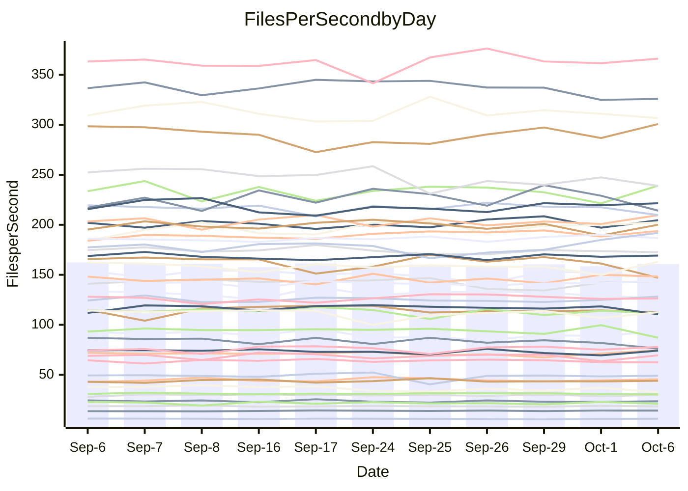

<!---
# This file is auto-generated. Do not edit.
# cspell:disable
--->
# Performance Report

## Daily Performance

## Time to Process Files

| Repository                                      | Elapsed | Min/Avg/Max           |   SD | SD Graph                |
| ----------------------------------------------- | ------: | :-------------------: | ---: | ----------------------- |
| AdaDoom3/AdaDoom3                    |    3.46 | 3.4 /   3.5 /   4.5   | 0.27 | `    ┣━━┻━●╋━━┻━━┫    ` |
| alexiosc/megistos                    |    7.86 | 7.5 /   7.9 /   8.6   | 0.26 | `    ┣━━┻━●╋━━┻━━┫    ` |
| apollographql/apollo-server          |    2.70 | 2.6 /   2.8 /   3.0   | 0.12 | `    ┣━━┻●━╋━━┻━━┫    ` |
| aspnetboilerplate/aspnetboilerplate  |   10.90 | 10.2 /  10.5 /  11.0  | 0.19 | `    ┣━━┻━━╋━━┻━━┫●   ` |
| aws-amplify/docs                     |   12.96 | 12.5 /  13.2 /  14.2  | 0.47 | `    ┣━━┻●━╋━━┻━━┫    ` |
| Azure/azure-rest-api-specs           |   10.22 | 9.5 /   9.8 /  10.6   | 0.31 | `    ┣━━┻━━╋━━┻●━┫    ` |
| bitjson/typescript-starter           |    1.09 | 1.0 /   1.1 /   1.1   | 0.02 | `     ┣━━┻━╋━●━━┫     ` |
| caddyserver/caddy                    |    3.67 | 3.6 /   3.8 /   4.0   | 0.13 | `    ┣━━┻●━╋━━┻━━┫    ` |
| canada-ca/open-source-logiciel-libre |    1.16 | 1.1 /   1.2 /   1.3   | 0.06 | `     ┣━┻━●╋━━┻━┫     ` |
| chef/chef                            |    5.90 | 5.8 /   6.0 /   6.3   | 0.14 | `    ┣━━┻●━╋━━┻━━┫    ` |
| dart-lang/sdk                        |   64.79 | 65.6 /  67.9 /  73.2  | 2.15 | `  ┣━●━┻━━━╋━━━┻━━━┫  ` |
| django/django                        |   15.41 | 15.0 /  15.4 /  16.1  | 0.30 | `    ┣━━┻━━●━━┻━━┫    ` |
| eslint/eslint                        |   10.80 | 10.8 /  11.1 /  11.8  | 0.28 | `    ┣━━●━━╋━━┻━━┫    ` |
| exonum/exonum                        |    3.77 | 3.6 /   3.7 /   4.0   | 0.10 | `    ┣━━┻━━╋━●┻━━┫    ` |
| flutter/samples                      |   16.71 | 16.3 /  17.0 /  18.6  | 0.56 | `    ┣━━┻━●╋━━┻━━┫    ` |
| gitbucket/gitbucket                  |    3.68 | 3.5 /   3.6 /   4.0   | 0.16 | `    ┣━━┻━━╋●━┻━━┫    ` |
| googleapis/google-cloud-cpp          |  144.24 | 139.0 / 146.6 / 163.3 | 5.37 | `  ┣━━━┻━●━╋━━━┻━━━┫  ` |
| graphql/express-graphql              |    1.23 | 1.1 /   1.2 /   1.4   | 0.06 | `     ┣━┻━━╋━●┻━┫     ` |
| graphql/graphql-js                   |    2.84 | 2.7 /   2.9 /   3.1   | 0.09 | `     ┣━●━━╋━━┻━┫     ` |
| graphql/graphql-relay-js             |    1.19 | 1.1 /   1.2 /   1.3   | 0.06 | `     ┣━┻━━●━━┻━┫     ` |
| graphql/graphql-spec                 |    1.34 | 1.3 /   1.3 /   1.4   | 0.04 | `     ┣━┻━●╋━━┻━┫     ` |
| iluwatar/java-design-patterns        |   13.58 | 12.8 /  13.2 /  14.9  | 0.50 | `    ┣━━┻━━╋━●┻━━┫    ` |
| ktaranov/sqlserver-kit               |    6.57 | 6.6 /   6.9 /   7.3   | 0.17 | `    ┣●━┻━━╋━━┻━━┫    ` |
| liriliri/licia                       |    4.41 | 4.1 /   4.3 /   4.4   | 0.09 | `    ┣━━┻━━╋━━┻●━┫    ` |
| MartinThoma/LaTeX-examples           |    6.96 | 6.9 /   7.3 /   7.8   | 0.26 | `    ┣━━●━━╋━━┻━━┫    ` |
| mdx-js/mdx                           |    2.03 | 1.9 /   2.1 /   2.3   | 0.10 | `     ┣━┻━●╋━━┻━┫     ` |
| microsoft/TypeScript-Website         |    6.01 | 5.5 /   5.8 /   6.5   | 0.22 | `    ┣━━┻━━╋━━●━━┫    ` |
| MicrosoftDocs/PowerShell-Docs        |   24.06 | 23.3 /  24.3 /  27.2  | 1.14 | `   ┣━━━┻━●╋━━┻━━━┫   ` |
| neovim/nvim-lspconfig                |    4.41 | 4.2 /   4.4 /   4.5   | 0.08 | `    ┣━━┻━━╋━●┻━━┫    ` |
| pagekit/pagekit                      |    3.53 | 3.5 /   3.7 /   3.8   | 0.07 | `     ┣●┻━━╋━━┻━┫     ` |
| php/php-src                          |   30.19 | 25.7 /  27.3 /  29.3  | 1.06 | `   ┣━━━┻━━╋━━┻━━━┫ ● ` |
| plasticrake/tplink-smarthome-api     |    1.36 | 1.3 /   1.4 /   1.6   | 0.07 | `     ┣━┻━●╋━━┻━┫     ` |
| prettier/prettier                    |    7.61 | 7.0 /   7.4 /   7.9   | 0.26 | `    ┣━━┻━━╋━━●━━┫    ` |
| pycontribs/jira                      |    1.61 | 1.5 /   1.6 /   2.0   | 0.10 | `     ┣━┻━━●━━┻━┫     ` |
| RustPython/RustPython                |    5.44 | 5.2 /   5.4 /   5.7   | 0.14 | `    ┣━━┻━━╋●━┻━━┫    ` |
| shoelace-style/shoelace              |    2.96 | 2.9 /   3.0 /   3.1   | 0.07 | `     ┣━┻●━╋━━┻━┫     ` |
| slint-ui/slint                       |   13.11 | 12.2 /  12.9 /  14.4  | 0.59 | `    ┣━━┻━━╋●━┻━━┫    ` |
| SoftwareBrothers/admin-bro           |    2.61 | 2.5 /   2.6 /   2.7   | 0.06 | `     ┣━┻━●╋━━┻━┫     ` |
| sveltejs/svelte                      |   21.67 | 20.8 /  21.7 /  23.2  | 0.53 | `   ┣━━━┻━━●━━┻━━━┫   ` |
| TheAlgorithms/Python                 |    5.84 | 5.7 /   6.0 /   6.6   | 0.23 | `    ┣━━┻●━╋━━┻━━┫    ` |
| twbs/bootstrap                       |    1.89 | 1.8 /   1.8 /   2.0   | 0.05 | `     ┣━┻━━╋━●┻━┫     ` |
| typescript-cheatsheets/react         |    1.62 | 1.3 /   1.4 /   1.6   | 0.07 | `     ┣━┻━━╋━━┻━┫ ●   ` |
| typescript-eslint/typescript-eslint  |    4.25 | 4.3 /   4.4 /   4.7   | 0.13 | `    ┣━━●━━╋━━┻━━┫    ` |
| vitest-dev/vitest                    |   10.37 | 9.2 /   9.8 /  12.0   | 0.74 | `    ┣━━┻━━╋━●┻━━┫    ` |
| w3c/aria-practices                   |    3.74 | 3.4 /   3.5 /   3.8   | 0.10 | `    ┣━━┻━━╋━━┻━━●    ` |
| w3c/specberus                        |    2.27 | 2.0 /   2.1 /   2.2   | 0.05 | `     ┣━┻━━╋━━┻━┫   ● ` |
| webdeveric/webpack-assets-manifest   |    1.23 | 1.2 /   1.2 /   1.3   | 0.04 | `     ┣━┻━●╋━━┻━┫     ` |
| webpack/webpack                      |    5.56 | 5.3 /   5.7 /   6.1   | 0.18 | `    ┣━━┻●━╋━━┻━━┫    ` |
| wireapp/wire-desktop                 |    1.41 | 1.3 /   1.4 /   1.4   | 0.03 | `     ┣━┻━━╋━●┻━┫     ` |
| wireapp/wire-webapp                  |   12.49 | 10.8 /  11.2 /  12.1  | 0.36 | `    ┣━━┻━━╋━━┻━━┫   ●` |

Note:
- Elapsed time is in seconds.

## Files per Second over Time

| Repository                                      | Files |    Sec |    Fps |     Rel | Trend Fps           |    N |
| ----------------------------------------------- | ----: | -----: | -----: | ------: | ------------------- | ---: |
| AdaDoom3/AdaDoom3                    |   103 |   3.46 |  29.77 |   1.51% | `█▂███▇███▇▇▆██▆▇▇` |   16 |
| alexiosc/megistos                    |   583 |   7.86 |  74.19 |   0.95% | `▇▆▇▇▇▇█▆▆▆▅█▇▆▅▄▇` |   16 |
| apollographql/apollo-server          |   252 |   2.70 |  93.35 |   3.73% | `▇▇▆▅█▇▅▆█▅▅▅▃▆▇▄▇` |   16 |
| aspnetboilerplate/aspnetboilerplate  |  2286 |  10.90 | 209.70 |  -3.81% | `▇▇█▆▇▆▆█▅▇▆▇█▇▇▆▅` |   16 |
| aws-amplify/docs                     |  2871 |  12.96 | 221.52 |   1.92% | `▇▄▇▇██▅▆▅▆▆▆▄▇▅█▇` |   16 |
| Azure/azure-rest-api-specs           |  2442 |  10.22 | 238.97 |  -4.03% | `▇█▇████▆▇█▄▅▆▅▇▆▅` |   16 |
| bitjson/typescript-starter           |    20 |   1.09 |  18.31 |  -1.49% | `▇▆▇▇▆█▄▆▆▇▆▆▆▅▇█▆` |   16 |
| caddyserver/caddy                    |   286 |   3.67 |  77.94 |   3.00% | `▅▆▇▅█▄███▇▄█▇█▇▆█` |   16 |
| canada-ca/open-source-logiciel-libre |     7 |   1.16 |   6.04 |   1.39% | `████▇▇█▃█▇▇▄▆▃▇▅▇` |   16 |
| chef/chef                            |  1207 |   5.90 | 204.63 |   1.91% | `▇▆▆▇▄▇▇▆▆▆▆█▇█▅▆▇` |   16 |
| dart-lang/sdk                        | 10563 |  64.79 | 163.03 |   3.34% | `█▇█▇█▇▆▄▇▆▇▇▇▇▆▄█` |   16 |
| django/django                        |  2876 |  15.41 | 186.67 |   0.44% | `▅▇██▆▆▆▆▇▇▇▅▇▇▇█▇` |   16 |
| eslint/eslint                        |  2093 |  10.80 | 193.85 |   2.67% | `▄▆▇▇▇▇▆▇▆▇██▇██▅█` |   16 |
| exonum/exonum                        |   421 |   3.77 | 111.76 |  -1.70% | `▇▇▇▇▆▇▇▆█▇▄█▇▅▆▇▆` |   16 |
| flutter/samples                      |  2400 |  16.71 | 143.59 |   1.34% | `▆█▆▇██▇▇▇██▄▇▅▇▇▇` |   16 |
| gitbucket/gitbucket                  |   413 |   3.68 | 112.36 |  -1.49% | `█▅█▄▄▇█▇██▆▇▆▆▇▆▆` |   16 |
| googleapis/google-cloud-cpp          | 20771 | 144.24 | 144.00 |   1.63% | `█▆█▇▆▇▃▇▇▆▆▆▆▆▆▇▇` |   16 |
| graphql/express-graphql              |    26 |   1.23 |  21.07 |  -4.48% | `▇▇▇▆▇▃▆█▅▇▅▅▆▄▇▇▅` |   16 |
| graphql/graphql-js                   |   364 |   2.84 | 128.27 |   2.72% | `▄▆▇█▆▅▅▆▇▆▆▅▇▅▆▆▇` |   16 |
| graphql/graphql-relay-js             |    28 |   1.19 |  23.51 |  -0.36% | `▇▆█▆▅▇▃▆█▅▄▇▆▅▆▄▆` |   16 |
| graphql/graphql-spec                 |    19 |   1.34 |  14.20 |   2.34% | `▄▇▇▆▆▅█▅█▇▇██▆███` |   16 |
| iluwatar/java-design-patterns        |  1992 |  13.58 | 146.67 |  -2.61% | `▇██▅▇███▇▇▇▇▃█▇▇▆` |   16 |
| ktaranov/sqlserver-kit               |   489 |   6.57 |  74.42 |   4.81% | `▆▇█▇▅▆▆▇▆▇▅▅▇▄▇▆█` |   16 |
| liriliri/licia                       |  1437 |   4.41 | 325.88 |  -3.28% | `▇▇▆▇█▆▅████▇▆▇▅▅▅` |   16 |
| MartinThoma/LaTeX-examples           |  1409 |   6.96 | 202.40 |   4.23% | `▄▄▅▆▇█▆▅▅██▆▅▇▆██` |   16 |
| mdx-js/mdx                           |   141 |   2.03 |  69.47 |   1.17% | `▆▆▆▆▇▅▆█▇▅▆▇▆▇▃▅▆` |   16 |
| microsoft/TypeScript-Website         |   761 |   6.01 | 126.60 |  -3.67% | `█▇▇▇▇▆▇▃█▆▇▆█▇▆▆▆` |   16 |
| MicrosoftDocs/PowerShell-Docs        |  2708 |  24.06 | 112.56 |   0.91% | `▇██▇█▇█▇▇▃▆▇▇▇█▃▇` |   16 |
| neovim/nvim-lspconfig                |   761 |   4.41 | 172.60 |  -0.94% | `▇▆█▇█▆▇▇█▇▆▅▆▇▆▇▆` |   16 |
| pagekit/pagekit                      |   741 |   3.53 | 209.63 |   3.29% | `▆█▆█▇▅█▇█▆▇▅▆▇▆▆█` |   16 |
| php/php-src                          |  2299 |  30.19 |  76.16 |  -9.51% | `▇▇█▇▆▇▆▄▇▅▇▆▄▆▄▆▃` |   16 |
| plasticrake/tplink-smarthome-api     |    62 |   1.36 |  45.44 |   2.38% | `▃▆▆▆▆██▄▅█▇▇▅▅▆▆▇` |   16 |
| prettier/prettier                    |  2334 |   7.61 | 306.67 |  -1.91% | `▆▄█▆██▆▆▅▅█▄█▇▆▆▆` |   16 |
| pycontribs/jira                      |    79 |   1.61 |  49.05 |   0.66% | `▇█▆▆█▆▆▆██▂▆▇▇▆▆▇` |   16 |
| RustPython/RustPython                |   687 |   5.44 | 126.36 |  -0.38% | `▇▇▇▇▆▄▅▆▅▆▇█▆▇▅▇▆` |   16 |
| shoelace-style/shoelace              |   439 |   2.96 | 148.20 |   1.44% | `█▆█▇▅▆▇▇▅█▅▆▇▅█▇▇` |   16 |
| slint-ui/slint                       |  2517 |  13.11 | 191.93 |   8.03% | `▆▆▅▆▆▅▆▇▆▆▄▅▄▅▇▇█` |   16 |
| SoftwareBrothers/admin-bro           |   441 |   2.61 | 169.27 |   0.65% | `▇▇▆▇█▆▅▇▆▆▇▅▇▇▆▇▇` |   16 |
| sveltejs/svelte                      |  7932 |  21.67 | 366.09 |   0.81% | `▇▆▆▆▇▆▆▅▆▄▇█▇▆▆▆▇` |   16 |
| TheAlgorithms/Python                 |  1396 |   5.84 | 239.10 |   2.49% | `▆█▆██▅▇▇▅▇▇▇▇▆▆▃▇` |   16 |
| twbs/bootstrap                       |   118 |   1.89 |  62.43 |  -2.27% | `▆█▇▇▄▇▆▇█▆▇▇█▇▅▇▆` |   16 |
| typescript-cheatsheets/react         |    53 |   1.62 |  32.63 | -11.58% | `▇▇▇█▆█▇▆▇▄▃▅▆▄▆▆▃` |   16 |
| typescript-eslint/typescript-eslint  |  1279 |   4.25 | 300.74 |   3.45% | `█████▇▅█▄▆▅▅██▆▆█` |   16 |
| vitest-dev/vitest                    |  2221 |  10.37 | 214.17 |  -5.16% | `▇▂█▆█▅▇█▆█▇▄███▆▅` |   16 |
| w3c/aria-practices                   |   414 |   3.74 | 110.55 |  -5.14% | `▄▇▅▇█▇▆▆██▇█▆▇▇▇▅` |   16 |
| w3c/specberus                        |   198 |   2.27 |  87.11 |  -8.29% | `▅▅▄▆▆▆▆▆▆▆▆▄▆▄▇█▃` |   16 |
| webdeveric/webpack-assets-manifest   |    54 |   1.23 |  43.95 |   0.87% | `▇▅▄▄▄▇▇▇▅▆█▅▅▆▆▅▆` |   16 |
| webpack/webpack                      |  1113 |   5.56 | 200.12 |   1.23% | `▇▅▆▆█▆▆▆▇▇▇▅▇▇▄▆▆` |   16 |
| wireapp/wire-desktop                 |    43 |   1.41 |  30.55 |  -1.95% | `▆▄▇▆█▆▅▆▆▅▇▆▇▇▅▆▅` |   16 |
| wireapp/wire-webapp                  |  1835 |  12.49 | 146.94 | -10.38% | `▇▇▇▇█▇▇▇▄▅██▅█▇▅▃` |   16 |

## Data Throughput

| Repository                                      | Files |    Sec |     Kps |     Rel | Trend Kps           |    N |
| ----------------------------------------------- | ----: | -----: | ------: | ------: | ------------------- | ---: |
| AdaDoom3/AdaDoom3                    |   103 |   3.46 |  632.70 |   1.51% | `█▂███▇███▇▇▆██▆▇▇` |   16 |
| alexiosc/megistos                    |   583 |   7.86 |  582.96 |   0.95% | `▇▆▇▇▇▇█▆▆▆▅█▇▆▅▄▇` |   16 |
| apollographql/apollo-server          |   252 |   2.70 |  750.88 |   3.73% | `▇▇▆▅█▇▅▆█▅▅▅▃▆▇▄▇` |   16 |
| aspnetboilerplate/aspnetboilerplate  |  2286 |  10.90 |  510.22 |  -3.81% | `▇▇█▆▇▆▆█▅▇▆▇█▇▇▆▅` |   16 |
| aws-amplify/docs                     |  2871 |  12.96 |  773.50 |   1.92% | `▇▄▇▇██▅▆▅▆▆▆▄▇▅█▇` |   16 |
| Azure/azure-rest-api-specs           |  2442 |  10.22 |  631.67 |  -3.98% | `▇█▇████▅▇█▄▅▆▅▇▆▅` |   16 |
| bitjson/typescript-starter           |    20 |   1.09 |   73.23 |  -1.49% | `▇▆▇▇▆█▄▆▆▇▆▆▆▅▇█▆` |   16 |
| caddyserver/caddy                    |   286 |   3.67 |  666.83 |   3.17% | `▅▆▇▅█▄███▇▄█▇█▇▆█` |   16 |
| canada-ca/open-source-logiciel-libre |     7 |   1.16 |   50.07 |   1.39% | `████▇▇█▃█▇▇▄▆▃▇▅▇` |   16 |
| chef/chef                            |  1207 |   5.90 |  944.00 |   1.82% | `█▆▆▇▄▇▇▆▆▆▆█▇█▅▆▇` |   16 |
| dart-lang/sdk                        | 10563 |  64.79 | 1118.74 |   3.90% | `█▇█▇█▇▆▄▇▇▇▇▇▇▆▄█` |   16 |
| django/django                        |  2876 |  15.41 | 1169.82 |   0.40% | `▅▇██▆▆▆▆▇▇▇▅▇▇▇█▇` |   16 |
| eslint/eslint                        |  2093 |  10.80 | 1396.95 |   2.48% | `▅▆▇█▇▇▅▇▆▇██▇██▅█` |   16 |
| exonum/exonum                        |   421 |   3.77 | 1069.04 |  -1.70% | `▇▇▇▇▆▇▇▆█▇▄█▇▅▆▇▆` |   16 |
| flutter/samples                      |  2400 |  16.71 | 1281.38 |   1.34% | `▆█▆▇██▇▇▇██▄▇▅▇▇▇` |   16 |
| gitbucket/gitbucket                  |   413 |   3.68 |  510.94 |  -1.45% | `█▅█▄▄▇█▇██▆▇▆▆▇▆▆` |   16 |
| googleapis/google-cloud-cpp          | 20771 | 144.24 | 1168.46 |   1.80% | `█▆█▇▆▇▃█▇▇▆▆▆▆▆█▇` |   16 |
| graphql/express-graphql              |    26 |   1.23 |   96.46 |  -4.48% | `▇▇▇▆▇▃▆█▅▇▅▅▆▄▇▇▅` |   16 |
| graphql/graphql-js                   |   364 |   2.84 |  737.22 |   2.72% | `▄▆▇█▆▅▅▆▇▆▆▅▇▅▆▆▇` |   16 |
| graphql/graphql-relay-js             |    28 |   1.19 |   92.37 |  -0.36% | `▇▆█▆▅▇▃▆█▅▄▇▆▅▆▄▆` |   16 |
| graphql/graphql-spec                 |    19 |   1.34 |  473.68 |   3.00% | `▄▇▆▆▅▆█▅█▇▇██▇███` |   16 |
| iluwatar/java-design-patterns        |  1992 |  13.58 |  453.34 |  -2.61% | `▇██▅▇███▇▇▇▇▃█▇▇▆` |   16 |
| ktaranov/sqlserver-kit               |   489 |   6.57 | 1126.84 |   4.81% | `▆▇█▇▅▆▆▇▆▇▅▅▇▄▇▆█` |   16 |
| liriliri/licia                       |  1437 |   4.41 |  388.24 |  -3.28% | `▇▇▆▇█▆▅████▇▆▇▅▅▅` |   16 |
| MartinThoma/LaTeX-examples           |  1409 |   6.96 |  418.01 |   4.23% | `▄▄▅▆▇█▆▅▅██▆▅▇▆██` |   16 |
| mdx-js/mdx                           |   141 |   2.03 |  323.19 |   1.17% | `▆▆▆▆▇▅▆█▇▅▆▇▆▇▃▅▆` |   16 |
| microsoft/TypeScript-Website         |   761 |   6.01 |  875.57 |  -3.67% | `█▇▇▇▇▆▇▃█▆▇▆█▇▆▆▆` |   16 |
| MicrosoftDocs/PowerShell-Docs        |  2708 |  24.06 | 1157.89 |   0.93% | `▇██▇█▇█▇▇▃▆▇▇▇█▃▇` |   16 |
| neovim/nvim-lspconfig                |   761 |   4.41 |  286.45 |  -0.47% | `▇▅▇▇█▆▇▇█▇▆▅▆▇▆█▆` |   16 |
| pagekit/pagekit                      |   741 |   3.53 |  437.08 |   3.29% | `▆█▆█▇▅█▇█▆▇▅▆▇▆▆█` |   16 |
| php/php-src                          |  2299 |  30.19 | 1323.07 |  -9.59% | `▇▇█▇▆▇▆▄▇▅▇▆▄▆▄▆▃` |   16 |
| plasticrake/tplink-smarthome-api     |    62 |   1.36 |  245.50 |   2.38% | `▃▆▆▆▆██▄▅█▇▇▅▅▆▆▇` |   16 |
| prettier/prettier                    |  2334 |   7.61 |  430.32 |  -2.63% | `▆▄█▆██▆▆▅▅█▄▇▆▆▆▅` |   16 |
| pycontribs/jira                      |    79 |   1.61 |  347.68 |   0.66% | `▇█▆▆█▆▆▆██▂▆▇▇▆▆▇` |   16 |
| RustPython/RustPython                |   687 |   5.44 |  998.02 |  -0.18% | `▆▆▇▇▆▄▅▆▅▆▇█▆▇▅▇▆` |   16 |
| shoelace-style/shoelace              |   439 |   2.96 |  716.04 |   1.44% | `█▆█▇▅▆▇▇▅█▅▆▇▅█▇▇` |   16 |
| slint-ui/slint                       |  2517 |  13.11 | 1181.27 |   2.89% | `█▇▆▇█▆▇██▇▄▆▅▄▆▆█` |   16 |
| SoftwareBrothers/admin-bro           |   441 |   2.61 |  373.09 |   0.65% | `▇▇▆▇█▆▅▇▆▆▇▅▇▇▆▇▇` |   16 |
| sveltejs/svelte                      |  7932 |  21.67 |  244.84 |   0.79% | `▇▆▆▆▇▆▆▅▆▄▇█▇▆▆▆▇` |   16 |
| TheAlgorithms/Python                 |  1396 |   5.84 |  607.86 |   2.54% | `▆█▆██▅▇▇▅▇▇█▇▆▆▃▇` |   16 |
| twbs/bootstrap                       |   118 |   1.89 |  512.16 |  -2.27% | `▆█▇▇▄▇▆▇█▆▇▇█▇▅▇▆` |   16 |
| typescript-cheatsheets/react         |    53 |   1.62 |  241.33 | -11.58% | `▇▇▇█▆█▇▆▇▄▃▅▆▄▆▆▃` |   16 |
| typescript-eslint/typescript-eslint  |  1279 |   4.25 | 1540.14 |   3.62% | `███▇█▇▅█▄▆▅▅██▆▆█` |   16 |
| vitest-dev/vitest                    |  2221 |  10.37 |  485.32 |  -4.50% | `▇▂█▆█▅▇█▆█▇▄███▆▆` |   16 |
| w3c/aria-practices                   |   414 |   3.74 | 1030.75 |  -5.03% | `▄▇▅▇█▇▆▆▇█▇█▆▇▇█▅` |   16 |
| w3c/specberus                        |   198 |   2.27 |  273.66 |  -8.29% | `▅▅▄▆▆▆▆▆▆▆▆▄▆▄▇█▃` |   16 |
| webdeveric/webpack-assets-manifest   |    54 |   1.23 |  103.36 |   0.87% | `▇▅▄▄▄▇▇▇▅▆█▅▅▆▆▅▆` |   16 |
| webpack/webpack                      |  1113 |   5.56 |  913.05 |   1.71% | `▆▅▆▆█▆▆▆▇▇▇▅▆▇▄▆▇` |   16 |
| wireapp/wire-desktop                 |    43 |   1.41 |  141.39 |   0.61% | `▅▄▆▅▇▅▄▅▅▆█▇█▇▆▇▆` |   16 |
| wireapp/wire-webapp                  |  1835 |  12.49 |  528.12 | -10.10% | `▇▇▇▇▇▇▇▇▄▅██▅█▇▆▃` |   16 |

