<!---
# This file is auto-generated. Do not edit.
# cspell:disable
--->
# Performance Report

```mermaid
xychart-beta
    title Files Per Second by Day
    y-axis Files per Second
    x-axis Date [Jan-4, Jan-5, Jan-6, Jan-7, Jan-8, Jan-9, Jan-10, Jan-11, Jan-13, Jan-16, Jan-17, Jan-18, Jan-20, Jan-22, Jan-24, Jan-26, Jan-27, Jan-31, Feb-1, Feb-2]
    bar [170.72, 165.99, 165.55, 169.22, 174.07, 185.19, 187.45, 188.92, 191.86, 190.29, 191.94, 196.32, 194.86, 191.82, 190.32, 191.51, 190.41, 192.01, 191.89, 187.06]
    line [30.98, 28.44, 27.47, 29.34, 33.19, 34.45, 32.48, 34.06, 34.46, 35.93, 33.32, 35.23, 35.39, 34.93, 34.02, 34.09, 33.87, 34.29, 34.92, 35.23]
    line [23.84, 21.71, 20.06, 22.54, 25.57, 25.37, 26.38, 26.59, 26.51, 25.26, 25.41, 25.96, 26.49, 25.80, 26.06, 26.20, 24.97, 23.09, 24.19, 23.96]
    line [48.82, 46.25, 44.36, 47.22, 53.09, 55.75, 56.48, 57.02, 56.66, 55.93, 59.24, 56.01, 55.67, 55.20, 55.10, 53.59, 53.02, 57.11, 52.81, 55.52]
    line [65.17, 62.63, 59.94, 62.94, 68.03, 71.19, 73.13, 70.56, 71.46, 69.64, 73.60, 68.98, 70.36, 68.71, 69.89, 68.59, 68.16, 64.96, 64.42, 73.00]
    line [14.46, 13.75, 12.60, 13.58, 14.59, 15.66, 15.79, 15.64, 15.80, 15.80, 16.00, 15.45, 15.24, 15.02, 15.03, 15.29, 14.84, 15.62, 14.38, 15.86]
    line [210.39, 198.78, 192.42, 197.28, 209.87, 213.91, 219.61, 218.24, 213.27, 217.66, 218.45, 221.48, 225.59, 221.54, 226.67, 217.21, 209.84, 210.58, 224.80, 222.31]
    line [91.62, 91.70, 90.24, 93.64, 97.75, 101.99, 101.23, 103.65, 103.42, 102.46, 106.20, 105.37, 102.12, 105.87, 102.16, 102.14, 102.53, 103.49, 99.40, 105.16]
    line [37.44, 35.32, 32.27, 37.29, 39.53, 40.03, 40.97, 40.73, 40.14, 39.37, 40.16, 40.57, 39.99, 39.45, 39.56, 40.89, 38.42, 41.91, 40.21, 40.48]
    line [6.13, 5.79, 5.41, 5.66, 6.15, 6.86, 6.90, 6.81, 6.66, 6.97, 6.64, 6.91, 6.72, 6.67, 6.94, 6.67, 6.54, 6.62, 6.41, 6.70]
    line [113.28, 107.29, 110.98, 110.70, 119.74, 122.80, 129.73, 128.79, 126.07, 129.88, 128.08, 130.23, 129.79, 127.22, 125.81, 130.48, 125.23, 130.52, 121.85, 126.90]
    line [97.41, 93.11, 86.98, 96.48, 99.80, 107.59, 107.79, 102.30, 102.07, 100.69, 106.54, 108.37, 107.20, 104.26, 106.72, 105.14, 103.83, 105.85, 104.82, 108.35]
    line [297.11, 291.75, 279.45, 292.30, 315.14, 325.37, 329.28, 331.31, 322.95, 325.07, 320.94, 337.71, 314.28, 338.34, 330.62, 332.64, 332.86, 330.58, 325.66, 333.23]
    line [332.44, 321.99, 323.13, 336.38, 352.94, 374.70, 389.29, 376.57, 388.49, 375.32, 366.20, 389.54, 377.40, 385.33, 384.07, 389.49, 375.11, 344.39, 377.92, 377.83]
    line [44.61, 40.41, 39.77, 41.67, 47.14, 50.43, 48.76, 50.39, 48.56, 48.63, 49.92, 47.96, 48.91, 48.82, 49.53, 48.99, 48.58, 48.96, 48.60, 51.04]
    line [208.87, 204.66, 200.55, 205.66, 217.93, 227.16, 232.86, 230.33, 232.89, 233.09, 238.38, 239.45, 235.23, 231.97, 232.80, 236.05, 231.31, 219.07, 234.91, 233.42]
    line [120.91, 116.77, 113.59, 115.36, 119.01, 126.14, 130.00, 129.60, 128.50, 127.21, 130.68, 134.03, 132.53, 130.75, 129.59, 130.75, 126.15, 128.28, 128.07, 122.52]
    line [78.06, 78.74, 77.69, 75.81, 82.18, 88.38, 87.15, 87.31, 87.18, 90.31, 92.11, 92.40, 91.04, 90.36, 90.73, 88.98, 87.79, 92.24, 85.84, 92.52]
    line [125.36, 119.96, 121.55, 126.54, 132.92, 138.94, 136.24, 140.09, 141.04, 141.83, 138.27, 139.82, 139.77, 142.05, 138.61, 141.46, 138.59, 143.14, 142.73, 146.24]
    line [203.06, 195.28, 197.18, 199.76, 210.90, 223.95, 228.77, 221.68, 228.59, 230.59, 232.51, 236.40, 229.96, 235.68, 233.44, 228.13, 220.74, 229.98, 223.23, 220.43]
    line [172.30, 168.35, 166.48, 160.20, 176.21, 192.32, 196.53, 187.68, 194.19, 197.24, 195.66, 200.40, 198.68, 192.03, 202.65, 197.73, 197.86, 185.13, 193.14, 199.16]
    line [18.69, 15.82, 15.37, 16.82, 19.06, 19.36, 19.05, 20.04, 19.27, 20.18, 19.35, 20.14, 20.01, 18.93, 20.01, 19.80, 18.94, 17.77, 19.48, 19.81]
    line [43.92, 40.38, 37.83, 41.50, 45.72, 48.43, 43.80, 48.21, 48.57, 48.55, 50.09, 48.39, 47.34, 47.51, 47.53, 47.48, 45.26, 47.60, 46.28, 49.41]
    line [241.43, 227.89, 226.93, 235.13, 241.29, 256.22, 256.06, 239.94, 250.86, 255.23, 249.00, 265.06, 266.25, 265.39, 261.87, 267.56, 251.76, 251.39, 257.09, 257.56]
    line [22.76, 19.93, 19.65, 21.35, 23.88, 24.29, 22.74, 25.52, 24.84, 24.50, 25.34, 23.52, 24.93, 24.42, 24.29, 23.65, 23.65, 21.57, 23.77, 25.03]
    line [75.96, 77.04, 75.98, 75.37, 79.34, 80.97, 83.22, 85.10, 84.24, 85.04, 88.54, 87.62, 86.00, 85.64, 83.63, 82.99, 83.39, 81.99, 83.50, 85.43]
    line [321.37, 318.36, 304.42, 303.41, 319.39, 327.56, 357.94, 329.89, 337.22, 342.27, 345.00, 356.14, 349.54, 352.62, 353.32, 354.47, 340.16, 355.36, 343.22, 353.99]
    line [152.12, 144.06, 141.46, 148.01, 153.69, 163.45, 163.04, 162.47, 164.23, 164.63, 167.70, 160.91, 159.45, 163.50, 167.30, 165.36, 160.46, 164.87, 161.06, 153.94]
    line [70.55, 65.48, 65.68, 67.02, 74.90, 75.80, 79.70, 78.59, 81.33, 81.33, 81.07, 83.41, 80.33, 81.35, 82.74, 85.67, 76.62, 69.80, 79.78, 84.05]
    line [207.91, 185.17, 183.38, 197.81, 213.96, 231.09, 232.21, 230.83, 222.60, 231.13, 231.51, 240.11, 237.40, 232.15, 240.84, 231.74, 230.60, 238.25, 234.41, 231.14]
    line [160.87, 163.97, 157.39, 159.96, 176.03, 182.37, 173.15, 184.83, 185.84, 185.90, 183.93, 185.28, 191.50, 191.17, 193.91, 185.17, 181.80, 175.63, 188.19, 183.66]
    line [31.87, 30.32, 30.13, 30.52, 32.45, 34.68, 36.83, 37.61, 37.83, 37.29, 37.79, 38.08, 37.68, 37.40, 37.80, 38.01, 36.89, 36.96, 37.04, 36.06]
    line [107.26, 104.85, 102.99, 109.30, 116.77, 127.71, 114.20, 134.12, 122.32, 127.81, 135.76, 135.82, 124.24, 127.06, 126.29, 124.09, 118.58, 122.01, 124.68, 125.17]
    line [120.59, 115.93, 111.61, 116.47, 122.24, 129.36, 128.91, 133.62, 132.89, 135.43, 131.64, 136.76, 137.40, 132.80, 128.54, 132.65, 129.67, 126.00, 129.13, 134.75]
    line [139.78, 129.55, 131.60, 134.11, 136.19, 147.37, 149.33, 150.95, 149.18, 146.30, 139.07, 151.18, 153.74, 153.12, 150.15, 146.49, 146.96, 143.93, 149.76, 152.74]
    line [240.41, 245.35, 243.40, 249.06, 252.82, 269.41, 273.80, 263.96, 272.92, 261.41, 256.94, 266.46, 233.73, 255.35, 238.38, 229.34, 231.07, 215.86, 227.49, 244.47]
    line [178.99, 168.22, 166.87, 176.13, 175.56, 186.67, 196.90, 196.60, 194.03, 194.99, 192.23, 197.19, 192.71, 195.01, 195.95, 192.00, 189.33, 196.17, 191.05, 185.29]
    line [239.84, 237.65, 227.69, 241.17, 242.31, 251.84, 257.31, 259.03, 255.67, 262.65, 261.59, 266.80, 267.02, 266.61, 269.34, 261.80, 260.28, 260.12, 259.24, 269.35]
    line [188.67, 194.33, 177.58, 179.97, 187.56, 204.85, 175.41, 212.66, 215.89, 200.52, 199.18, 198.97, 206.74, 209.26, 204.49, 217.13, 213.62, 216.87, 219.73, 219.66]
    line [201.68, 196.07, 191.44, 191.98, 208.77, 213.46, 218.16, 220.17, 217.65, 213.84, 219.82, 216.50, 223.77, 218.30, 218.17, 216.51, 216.11, 223.69, 217.62, 222.38]
    line [145.79, 146.47, 145.32, 149.61, 152.47, 167.66, 162.55, 150.60, 169.56, 173.92, 177.33, 173.32, 178.23, 175.77, 178.27, 178.37, 173.24, 175.53, 174.36, 170.63]
    line [72.13, 67.68, 66.21, 71.65, 76.02, 80.93, 84.19, 83.66, 81.75, 85.70, 86.11, 85.86, 86.06, 84.27, 86.06, 83.34, 81.63, 80.82, 83.46, 83.48]
    line [161.27, 156.23, 155.16, 163.04, 163.18, 170.50, 178.84, 176.33, 177.89, 180.64, 176.54, 181.96, 178.88, 180.40, 174.86, 177.54, 174.66, 177.76, 179.20, 182.03]
    line [194.72, 192.90, 184.51, 177.92, 195.10, 212.88, 219.97, 208.62, 218.28, 221.67, 222.50, 222.49, 221.50, 215.62, 221.41, 212.75, 215.81, 222.32, 209.91, 224.12]
    line [222.11, 226.42, 218.19, 221.48, 227.88, 240.46, 239.34, 239.80, 239.93, 238.57, 236.32, 249.26, 244.81, 244.90, 244.81, 248.38, 241.40, 249.14, 241.45, 243.67]
    line [116.74, 114.96, 116.34, 117.08, 121.26, 127.78, 131.45, 132.46, 133.58, 134.83, 138.33, 137.42, 133.67, 135.32, 136.02, 132.00, 133.67, 130.01, 133.77, 129.61]
    line [375.72, 366.42, 366.13, 364.89, 378.25, 407.03, 408.32, 400.13, 413.71, 402.27, 405.88, 422.55, 417.95, 422.87, 425.03, 422.04, 415.46, 422.79, 413.85, 415.98]
    line [89.72, 82.57, 85.29, 87.34, 86.74, 95.27, 97.94, 97.30, 98.25, 99.69, 99.56, 100.21, 102.10, 97.82, 100.22, 98.35, 98.09, 97.24, 99.79, 97.73]
    line [238.37, 234.19, 223.75, 225.18, 243.31, 257.18, 256.97, 252.12, 251.26, 250.15, 255.66, 262.96, 271.72, 264.80, 259.27, 265.80, 263.72, 257.16, 251.63, 245.21]
    line [181.21, 173.75, 179.71, 177.60, 181.52, 194.07, 204.27, 201.52, 203.28, 190.39, 203.06, 207.16, 206.41, 203.60, 205.03, 203.50, 200.03, 203.99, 203.12, 218.48]
    line [152.67, 150.17, 151.88, 156.83, 157.18, 166.03, 166.95, 174.59, 178.01, 176.93, 175.50, 183.23, 181.65, 172.80, 167.02, 174.50, 177.97, 180.67, 179.91, 155.43]
```

Daily Performance

Time to Process Files

| Repository                                      | Elapsed | Min/Avg/Max           |   SD | SD Graph                |
| ----------------------------------------------- | ------: | :-------------------: | ---: | ----------------------- |
| AdaDoom3/AdaDoom3                    |    2.86 | 2.6 /   2.9 /   3.5   | 0.27 | `    ┣━━┻━●╋━━┻━━┫    ` |
| alexiosc/megistos                    |    6.98 | 6.6 /   7.4 /   9.9   | 0.72 | `    ┣━━┻●━╋━━┻━━┫    ` |
| apollographql/apollo-server          |    2.42 | 2.3 /   2.5 /   3.1   | 0.16 | `    ┣━━┻●━╋━━┻━━┫    ` |
| aspnetboilerplate/aspnetboilerplate  |    8.49 | 8.4 /   9.0 /  10.6   | 0.51 | `    ┣━━●━━╋━━┻━━┫    ` |
| aws-amplify/docs                     |   11.79 | 11.3 /  12.1 /  13.4  | 0.56 | `    ┣━━┻●━╋━━┻━━┫    ` |
| Azure/azure-rest-api-specs           |    9.97 | 8.6 /   9.7 /  11.7   | 0.72 | `    ┣━━┻━━╋●━┻━━┫    ` |
| bitjson/typescript-starter           |    1.01 | 1.0 /   1.1 /   1.4   | 0.11 | `     ┣━┻●━╋━━┻━┫     ` |
| caddyserver/caddy                    |    3.15 | 3.1 /   3.4 /   4.0   | 0.23 | `    ┣━━●━━╋━━┻━━┫    ` |
| canada-ca/open-source-logiciel-libre |    1.04 | 1.0 /   1.1 /   1.4   | 0.10 | `     ┣━┻━●╋━━┻━┫     ` |
| chef/chef                            |    5.44 | 5.0 /   5.5 /   6.2   | 0.38 | `    ┣━━┻━━●━━┻━━┫    ` |
| dart-lang/sdk                        |   50.25 | 51.7 /  56.0 /  66.4  | 3.37 | `  ┣━●━┻━━━╋━━━┻━━━┫  ` |
| django/django                        |   12.90 | 12.6 /  13.9 /  17.0  | 1.05 | `   ┣━━━●━━╋━━┻━━━┫   ` |
| eslint/eslint                        |    9.26 | 9.0 /   9.7 /  11.3   | 0.54 | `    ┣━━●━━╋━━┻━━┫    ` |
| exonum/exonum                        |    3.32 | 3.2 /   3.4 /   4.1   | 0.24 | `    ┣━━┻━●╋━━┻━━┫    ` |
| flutter/samples                      |   14.50 | 13.4 /  14.9 /  22.6  | 1.60 | `   ┣━━━┻━●╋━━┻━━━┫   ` |
| gitbucket/gitbucket                  |    3.07 | 3.0 /   3.2 /   4.0   | 0.23 | `    ┣━━┻●━╋━━┻━━┫    ` |
| googleapis/google-cloud-cpp          |  135.26 | 113.8 / 124.2 / 145.3 | 8.90 | `  ┣━━━┻━━━╋━━━┻●━━┫  ` |
| graphql/express-graphql              |    1.04 | 1.0 /   1.1 /   1.4   | 0.10 | `     ┣━┻●━╋━━┻━┫     ` |
| graphql/graphql-js                   |    2.52 | 2.5 /   2.7 /   3.2   | 0.18 | `    ┣━━●━━╋━━┻━━┫    ` |
| graphql/graphql-relay-js             |    1.17 | 1.0 /   1.1 /   1.5   | 0.11 | `     ┣━┻━━╋●━┻━┫     ` |
| graphql/graphql-spec                 |    1.20 | 1.2 /   1.3 /   1.6   | 0.10 | `     ┣━┻●━╋━━┻━┫     ` |
| iluwatar/java-design-patterns        |   10.94 | 10.8 /  11.6 /  13.0  | 0.66 | `    ┣━━●━━╋━━┻━━┫    ` |
| ktaranov/sqlserver-kit               |    5.74 | 5.5 /   6.0 /   6.6   | 0.32 | `    ┣━━┻●━╋━━┻━━┫    ` |
| liriliri/licia                       |    3.80 | 3.6 /   3.9 /   4.7   | 0.29 | `    ┣━━┻━●╋━━┻━━┫    ` |
| MartinThoma/LaTeX-examples           |    6.10 | 5.8 /   6.4 /   8.5   | 0.64 | `    ┣━━┻━●╋━━┻━━┫    ` |
| mdx-js/mdx                           |    1.68 | 1.4 /   1.9 /   2.2   | 0.18 | `     ┣━●━━╋━━┻━┫     ` |
| microsoft/TypeScript-Website         |    4.98 | 4.9 /   5.3 /   6.2   | 0.32 | `    ┣━━●━━╋━━┻━━┫    ` |
| MicrosoftDocs/PowerShell-Docs        |   20.42 | 19.1 /  20.6 /  24.0  | 1.33 | `   ┣━━━┻━━●━━┻━━━┫   ` |
| neovim/nvim-lspconfig                |    3.86 | 3.8 /   4.1 /   4.9   | 0.31 | `    ┣━━┻●━╋━━┻━━┫    ` |
| pagekit/pagekit                      |    3.33 | 3.2 /   3.5 /   4.0   | 0.20 | `    ┣━━┻●━╋━━┻━━┫    ` |
| php/php-src                          |   23.20 | 21.7 /  23.9 /  30.2  | 1.72 | `   ┣━━━┻━●╋━━┻━━━┫   ` |
| plasticrake/tplink-smarthome-api     |    1.21 | 1.2 /   1.3 /   1.7   | 0.12 | `     ┣━┻●━╋━━┻━┫     ` |
| prettier/prettier                    |    7.49 | 7.0 /   7.6 /   8.5   | 0.40 | `    ┣━━┻━●╋━━┻━━┫    ` |
| pycontribs/jira                      |    1.42 | 1.3 /   1.5 /   1.9   | 0.14 | `     ┣━┻━●╋━━┻━┫     ` |
| RustPython/RustPython                |    5.96 | 5.2 /   6.1 /   7.4   | 0.55 | `    ┣━━┻━●╋━━┻━━┫    ` |
| shoelace-style/shoelace              |    2.85 | 2.6 /   2.8 /   3.3   | 0.16 | `    ┣━━┻━━╋●━┻━━┫    ` |
| slint-ui/slint                       |   12.40 | 11.8 /  13.2 /  15.4  | 0.90 | `    ┣━━●━━╋━━┻━━┫    ` |
| SoftwareBrothers/admin-bro           |    2.40 | 2.3 /   2.5 /   2.9   | 0.18 | `    ┣━━┻━●╋━━┻━━┫    ` |
| sveltejs/svelte                      |   20.11 | 19.3 /  20.6 /  23.9  | 1.15 | `   ┣━━━┻━●╋━━┻━━━┫   ` |
| TheAlgorithms/Python                 |    5.44 | 5.2 /   5.6 /   6.7   | 0.35 | `    ┣━━┻━●╋━━┻━━┫    ` |
| twbs/bootstrap                       |    1.62 | 1.6 /   1.8 /   2.1   | 0.12 | `     ┣━●━━╋━━┻━┫     ` |
| typescript-cheatsheets/react         |    1.31 | 1.3 /   1.4 /   1.9   | 0.12 | `     ┣━┻●━╋━━┻━┫     ` |
| typescript-eslint/typescript-eslint  |    3.92 | 3.8 /   4.1 /   5.0   | 0.29 | `    ┣━━┻●━╋━━┻━━┫    ` |
| vitest-dev/vitest                    |   10.22 | 8.5 /  10.0 /  11.7   | 0.76 | `    ┣━━┻━━╋●━┻━━┫    ` |
| w3c/aria-practices                   |    3.38 | 3.0 /   3.3 /   3.8   | 0.20 | `    ┣━━┻━━╋●━┻━━┫    ` |
| w3c/specberus                        |    1.82 | 1.8 /   1.9 /   2.6   | 0.15 | `     ┣━┻●━╋━━┻━┫     ` |
| webdeveric/webpack-assets-manifest   |    1.11 | 1.0 /   1.2 /   1.6   | 0.12 | `     ┣━┻●━╋━━┻━┫     ` |
| webpack/webpack                      |    4.88 | 4.7 /   5.1 /   5.9   | 0.33 | `    ┣━━┻●━╋━━┻━━┫    ` |
| wireapp/wire-desktop                 |    1.25 | 1.2 /   1.3 /   1.7   | 0.12 | `     ┣━┻●━╋━━┻━┫     ` |
| wireapp/wire-webapp                  |   11.18 | 9.1 /  10.5 /  11.8   | 0.56 | `    ┣━━┻━━╋━━┻●━┫    ` |

Note:
- Elapsed time is in seconds.

Files per Second over Time

| Repository                                      | Files |    Sec |    Fps |    Rel | Trend Fps              |    N |
| ----------------------------------------------- | ----: | -----: | -----: | -----: | ---------------------- | ---: |
| AdaDoom3/AdaDoom3                    |   103 |   2.86 |  36.06 |  1.44% | `▇██████▇▆█▇▇██▆▇▇▇▇▇` |   60 |
| alexiosc/megistos                    |   583 |   6.98 |  83.48 |  4.40% | `███▇██▆▇▇▇▇▇▆▇█▇█▇▇▇` |   60 |
| apollographql/apollo-server          |   254 |   2.42 | 105.16 |  5.10% | `██▆▆▇█▆▅▇▇█▆█▇█▇▅▇▇█` |   60 |
| aspnetboilerplate/aspnetboilerplate  |  2286 |   8.49 | 269.35 |  5.84% | `██████▆▇█▆█▆▇▇▇▇▇▆▇█` |   60 |
| aws-amplify/docs                     |  2874 |  11.79 | 243.67 |  2.66% | `▇▇▇███▇▇█▆▇▇▆▆▆█▇▇▇▇` |   60 |
| Azure/azure-rest-api-specs           |  2444 |   9.97 | 245.21 | -2.91% | `▆▇▆█▆▇▇▇▅▅▆██▇█▆▃▆█▅` |   60 |
| bitjson/typescript-starter           |    20 |   1.01 |  19.81 |  5.28% | `██▇▇█▇█▆█▅█▇▆▆▆▅██▆▇` |   60 |
| caddyserver/caddy                    |   291 |   3.15 |  92.52 |  7.25% | `██▇█▇█▆▆▇▇▆▇█▇▆█▇▅▇█` |   60 |
| canada-ca/open-source-logiciel-libre |     7 |   1.04 |   6.70 |  3.71% | `▇█▇▇█▇▅▆▇▇▇▇▅▆▆▇▆▅▇▇` |   60 |
| chef/chef                            |  1199 |   5.44 | 220.43 |  0.00% | `▇█▇▇▇▇▆▆█▇▆▆▇▅▄▇▆▇▆▆` |   60 |
| dart-lang/sdk                        | 10978 |  50.25 | 218.48 | 11.66% | `▆▇▇▇▆▇▇▇▆▄▇▇▆▇▆▇▇▆▆█` |   60 |
| django/django                        |  2890 |  12.90 | 224.12 |  7.13% | `█▇█▆█▇▆▇▇▇██▇▇▆█▆▇▇█` |   60 |
| eslint/eslint                        |  2060 |   9.26 | 222.38 |  4.78% | `██▆▇▇▇▆▇█▇▆▇▆▇██▇▇██` |   60 |
| exonum/exonum                        |   421 |   3.32 | 126.90 |  2.93% | `▆▇▇████▇▇▇█▇█▅▇█▆▅▇▇` |   60 |
| flutter/samples                      |  2474 |  14.50 | 170.63 |  2.95% | `███████▇▇▇█▇▇▇██▇█▇▇` |   60 |
| gitbucket/gitbucket                  |   414 |   3.07 | 134.75 |  5.26% | `▇▇▆█▇█▇▆▆█▆▇█▆█▆▆█▆█` |   60 |
| googleapis/google-cloud-cpp          | 21024 | 135.26 | 155.43 | -8.59% | `▆▆▆█▇█▆▇█▇▇████████▄` |   60 |
| graphql/express-graphql              |    26 |   1.04 |  25.03 |  6.96% | `▇█▇▆█▇▇██▇██▆▄▇▅█▇▆█` |   60 |
| graphql/graphql-js                   |   368 |   2.52 | 146.24 |  7.48% | `▇▇▆█▇█▆▇█▇▆▅▇▇▇█▇█▇█` |   60 |
| graphql/graphql-relay-js             |    28 |   1.17 |  23.96 | -3.24% | `█▇███▇███▇▄▅▅██▅▇▆▅▆` |   60 |
| graphql/graphql-spec                 |    19 |   1.20 |  15.86 |  6.94% | `▆█▆▇██▇▇▇▇▆▆█▆▇█▆▇▆█` |   60 |
| iluwatar/java-design-patterns        |  1992 |  10.94 | 182.03 |  5.64% | `██▅█▇▇▆▇▅█▅▅▇▇█▇▇█▇█` |   60 |
| ktaranov/sqlserver-kit               |   490 |   5.74 |  85.43 |  3.89% | `█▆█▇██▅▇█▆▇▆▆██▇█▆▇█` |   60 |
| liriliri/licia                       |  1437 |   3.80 | 377.83 |  3.03% | `▇▇▇▇▇██▇▇▇▆▇▆▆▆▅█▇▆▇` |   60 |
| MartinThoma/LaTeX-examples           |  1409 |   6.10 | 231.14 |  3.71% | `████▆█▇█▇█▇▆▇▇▇███▆▇` |   60 |
| mdx-js/mdx                           |   141 |   1.68 |  84.05 |  9.41% | `▅▅▅▄▄▅█▄▄▂▅▃▅▄▅▃▄▅▅▅` |   60 |
| microsoft/TypeScript-Website         |   761 |   4.98 | 152.74 |  5.36% | `▇▆█▅█▇▆▇▇▇▆█▆█▅▆▇▇▇█` |   60 |
| MicrosoftDocs/PowerShell-Docs        |  2647 |  20.42 | 129.61 |  0.38% | `███▇▇▇▇█▇▇██▇██▇██▇▇` |   60 |
| neovim/nvim-lspconfig                |   769 |   3.86 | 199.16 |  5.61% | `▅████▇▇▇▇█▇██▇▇▆▇█▆█` |   60 |
| pagekit/pagekit                      |   741 |   3.33 | 222.31 |  4.28% | `▇██▆██▆▄▆▄██▅▆▆▆▇██▇` |   60 |
| php/php-src                          |  2267 |  23.20 |  97.73 |  2.42% | `▇████▇▇██▇█▇▇█▆▇███▇` |   60 |
| plasticrake/tplink-smarthome-api     |    62 |   1.21 |  51.04 |  8.04% | `█▇█▇▇▇▇█▇▇▆▇▇▇▇▇▇▇▇█` |   60 |
| prettier/prettier                    |  2653 |   7.49 | 353.99 |  5.47% | `▇▇███▇█▇▆▆▇▇▆▇▇██▇▅█` |   60 |
| pycontribs/jira                      |    79 |   1.42 |  55.52 |  4.67% | `▇█▆█▇▇▄█▆▇▄▇▇▅▆█▆▅▇▇` |   60 |
| RustPython/RustPython                |   746 |   5.96 | 125.17 |  3.80% | `██████▇▇▇▅▄▇▇█▇▇▇█▇█` |   60 |
| shoelace-style/shoelace              |   439 |   2.85 | 153.94 | -2.85% | `█████▇██▅▅█▇▇█▇█▇▆▇▆` |   60 |
| slint-ui/slint                       |  2724 |  12.40 | 219.66 |  8.52% | `▆▆▆▇██▆▇▇▇▇█▆▇▇▇█▇██` |   60 |
| SoftwareBrothers/admin-bro           |   441 |   2.40 | 183.66 |  2.32% | `████▇▇▅█▇█▅▅▄█▇▆▇█▇▇` |   60 |
| sveltejs/svelte                      |  8367 |  20.11 | 415.98 |  3.29% | `███████▇▇██▇█▇██▇▇█▇` |   60 |
| TheAlgorithms/Python                 |  1401 |   5.44 | 257.56 |  2.63% | `██▇████▇▇▆▇▇▅▆▆▆█▇▆▇` |   60 |
| twbs/bootstrap                       |   118 |   1.62 |  73.00 |  7.90% | `▆▇▇▇▇▇▅▆▇▇▅▆▆▇▇▅▇▅▃█` |   60 |
| typescript-cheatsheets/react         |    53 |   1.31 |  40.48 |  4.48% | `▆▇▇██▇█▆▇█▅▇▆▇▇██▇▇▇` |   60 |
| typescript-eslint/typescript-eslint  |  1307 |   3.92 | 333.23 |  4.50% | `█▇▇▆██▇█▇█▆█▇▇█▇█▆▇▇` |   60 |
| vitest-dev/vitest                    |  2498 |  10.22 | 244.47 | -0.94% | `█▆▆▄▆▇▃▄▇▅▆▇▄▃▅▃▅▅▄▇` |   60 |
| w3c/aria-practices                   |   414 |   3.38 | 122.52 | -2.60% | `▇▇▇█▆█▇▇▇▄█▅██▄▇▆▇▇▆` |   60 |
| w3c/specberus                        |   197 |   1.82 | 108.35 |  6.37% | `█████▇▇▆▇█▇▇▇█▇███▇█` |   60 |
| webdeveric/webpack-assets-manifest   |    55 |   1.11 |  49.41 |  8.15% | `▆▇▆▄▆██▇▆▅▇▆▆▃▄▆▆▆▅▇` |   60 |
| webpack/webpack                      |  1139 |   4.88 | 233.42 |  3.38% | `▇▇▇▇█▇████▇▇▅█▇▆▇██▇` |   60 |
| wireapp/wire-desktop                 |    44 |   1.25 |  35.23 |  6.12% | `█▇▇█▇█▅▆▆█▇█▆▅█▇▇█▇█` |   60 |
| wireapp/wire-webapp                  |  2071 |  11.18 | 185.29 | -1.00% | `█▇█▇█▇▆▆▅▇██▆▇███▆▇▆` |   60 |

Data Throughput

| Repository                                      | Files |    Sec |     Kps |    Rel | Trend Kps              |    N |
| ----------------------------------------------- | ----: | -----: | ------: | -----: | ---------------------- | ---: |
| AdaDoom3/AdaDoom3                    |   103 |   2.86 |  766.29 |  1.44% | `▇██████▇▆█▇▇██▆▇▇▇▇▇` |   60 |
| alexiosc/megistos                    |   583 |   6.98 |  655.99 |  4.40% | `███▇██▆▇▇▇▇▇▆▇█▇█▇▇▇` |   60 |
| apollographql/apollo-server          |   254 |   2.42 |  860.73 |  5.13% | `██▆▆▇█▆▅▇▇█▆█▇█▇▅▇▇█` |   60 |
| aspnetboilerplate/aspnetboilerplate  |  2286 |   8.49 |  655.34 |  5.84% | `██████▆▇█▆█▆▇▇▇▇▇▆▇█` |   60 |
| aws-amplify/docs                     |  2874 |  11.79 |  851.65 |  2.66% | `▇▇▇███▇▇█▆▇▇▆▆▆█▇▇▇▇` |   60 |
| Azure/azure-rest-api-specs           |  2444 |   9.97 |  642.21 | -3.67% | `▆▇▆█▆▇▇▇▅▅▆██▇█▆▃▆█▅` |   60 |
| bitjson/typescript-starter           |    20 |   1.01 |   79.26 |  5.28% | `██▇▇█▇█▆█▅█▇▆▆▆▅██▆▇` |   60 |
| caddyserver/caddy                    |   291 |   3.15 |  810.73 |  7.17% | `██▇█▇█▆▆▇▇▆▇█▇▆█▇▅▇█` |   60 |
| canada-ca/open-source-logiciel-libre |     7 |   1.04 |   55.51 |  3.71% | `▇█▇▇█▇▅▆▇▇▇▇▅▆▆▇▆▅▇▇` |   60 |
| chef/chef                            |  1199 |   5.44 | 1033.95 |  0.74% | `▇█▇███▆▇█▇▆▇▇▅▄█▆█▆▆` |   60 |
| dart-lang/sdk                        | 10978 |  50.25 | 1483.44 | 11.77% | `▆▇▇▇▆▇▇▇▆▄▇▇▆▇▆▇▇▆▆█` |   60 |
| django/django                        |  2890 |  12.90 | 1414.02 |  7.24% | `█▇█▆█▇▆▇▇▇██▇▇▆█▆▇▇█` |   60 |
| eslint/eslint                        |  2060 |   9.26 | 1541.66 |  5.08% | `██▆▇▇▇▆▇█▇▆▇▆▇██▇▇██` |   60 |
| exonum/exonum                        |   421 |   3.32 | 1213.79 |  2.93% | `▆▇▇████▇▇▇█▇█▅▇█▆▅▇▇` |   60 |
| flutter/samples                      |  2474 |  14.50 | 1483.21 |  1.85% | `███████▇▇▇█▇▇▇██▇█▇▇` |   60 |
| gitbucket/gitbucket                  |   414 |   3.07 |  613.86 |  5.28% | `▇▇▆█▇█▇▆▆█▆▇█▆█▆▆█▆█` |   60 |
| googleapis/google-cloud-cpp          | 21024 | 135.26 | 1266.06 | -8.57% | `▆▆▆█▇█▆▇█▇▇████████▄` |   60 |
| graphql/express-graphql              |    26 |   1.04 |  114.55 |  6.96% | `▇█▇▆█▇▇██▇██▆▄▇▅█▇▆█` |   60 |
| graphql/graphql-js                   |   368 |   2.52 |  851.21 |  7.65% | `▇▇▆█▇█▆▇█▇▆▅▇▇▇█▇█▇█` |   60 |
| graphql/graphql-relay-js             |    28 |   1.17 |   94.11 | -3.24% | `█▇███▇███▇▄▅▅██▅▇▆▅▆` |   60 |
| graphql/graphql-spec                 |    19 |   1.20 |  529.30 |  6.94% | `▆█▆▇██▇▇▇▇▆▆█▆▇█▆▇▆█` |   60 |
| iluwatar/java-design-patterns        |  1992 |  10.94 |  562.64 |  5.64% | `██▅█▇▇▆▇▅█▅▅▇▇█▇▇█▇█` |   60 |
| ktaranov/sqlserver-kit               |   490 |   5.74 | 1291.43 |  3.71% | `█▆█▇██▅▇█▆▇▆▆██▇█▆▇█` |   60 |
| liriliri/licia                       |  1437 |   3.80 |  450.14 |  3.03% | `▇▇▇▇▇██▇▇▇▆▇▆▆▆▅█▇▆▇` |   60 |
| MartinThoma/LaTeX-examples           |  1409 |   6.10 |  477.36 |  3.71% | `████▆█▇█▇█▇▆▇▇▇███▆▇` |   60 |
| mdx-js/mdx                           |   141 |   1.68 |  390.46 |  9.41% | `▅▅▅▄▄▅█▄▄▂▅▃▅▄▅▃▄▅▅▅` |   60 |
| microsoft/TypeScript-Website         |   761 |   4.98 | 1056.56 |  5.36% | `▇▆█▅█▇▆▇▇▇▆█▆█▅▆▇▇▇█` |   60 |
| MicrosoftDocs/PowerShell-Docs        |  2647 |  20.42 | 1355.22 |  0.48% | `███▇▇▇▇█▇▇██▇██▇██▇▇` |   60 |
| neovim/nvim-lspconfig                |   769 |   3.86 |  374.24 |  6.51% | `▅████▇▇▇▇█▇██▇▇▆▇█▆█` |   60 |
| pagekit/pagekit                      |   741 |   3.33 |  463.53 |  4.28% | `▇██▆██▆▄▆▄██▅▆▆▆▇██▇` |   60 |
| php/php-src                          |  2267 |  23.20 | 1705.39 |  2.20% | `▇████▇▇██▇█▇▇█▆▇███▇` |   60 |
| plasticrake/tplink-smarthome-api     |    62 |   1.21 |  275.79 |  8.04% | `█▇█▇▇▇▇█▇▇▆▇▇▇▇▇▇▇▇█` |   60 |
| prettier/prettier                    |  2653 |   7.49 |  487.82 |  2.45% | `▇▇█▇▇▇█▇▅▆▆▇▅▆▆▇█▇▅▇` |   60 |
| pycontribs/jira                      |    79 |   1.42 |  393.58 |  4.67% | `▇█▆█▇▇▄█▆▇▄▇▇▅▆█▆▅▇▇` |   60 |
| RustPython/RustPython                |   746 |   5.96 | 1670.47 | 13.05% | `██████▇▇▇▆▅▇▇█▇▇▇█▇█` |   60 |
| shoelace-style/shoelace              |   439 |   2.85 |  743.77 | -2.85% | `█████▇██▅▅█▇▇█▇█▇▆▇▆` |   60 |
| slint-ui/slint                       |  2724 |  12.40 | 1373.14 |  9.54% | `▆▆▆▇██▆▇█▇▇█▆▇▇▇█▇██` |   60 |
| SoftwareBrothers/admin-bro           |   441 |   2.40 |  404.80 |  2.32% | `████▇▇▅█▇█▅▅▄█▇▆▇█▇▇` |   60 |
| sveltejs/svelte                      |  8367 |  20.11 |  280.15 |  3.57% | `███████▇▇██▇█▇██▇▇█▇` |   60 |
| TheAlgorithms/Python                 |  1401 |   5.44 |  655.75 |  2.62% | `██▇████▇▇▆▇▇▅▆▆▆█▇▆▇` |   60 |
| twbs/bootstrap                       |   118 |   1.62 |  599.51 |  7.90% | `▆▇▇▇▇▇▅▆▇▇▅▆▆▇▇▅▇▅▃█` |   60 |
| typescript-cheatsheets/react         |    53 |   1.31 |  299.37 |  4.48% | `▆▇▇██▇█▆▇█▅▇▆▇▇██▇▇▇` |   60 |
| typescript-eslint/typescript-eslint  |  1307 |   3.92 | 1754.11 |  5.57% | `█▇▇▆██▇█▇█▆█▇██▇█▆▇▇` |   60 |
| vitest-dev/vitest                    |  2498 |  10.22 |  720.67 | 17.62% | `█▇▇▆▇▇▅▆█▆▇█▆▅▆▅▆▇▆█` |   60 |
| w3c/aria-practices                   |   414 |   3.38 | 1144.36 | -2.48% | `▇▇▇█▆█▇▇▇▄█▅██▄▇▆▇▇▆` |   60 |
| w3c/specberus                        |   197 |   1.82 |  342.65 |  6.37% | `█████▇▇▆▇█▇▇▇█▇███▇█` |   60 |
| webdeveric/webpack-assets-manifest   |    55 |   1.11 |  113.19 |  8.15% | `▆▇▆▄▆██▇▆▅▇▆▆▃▄▆▆▆▅▇` |   60 |
| webpack/webpack                      |  1139 |   4.88 | 1085.76 |  3.78% | `▇▇▇▇█▇████▇▇▅█▇▆▇██▇` |   60 |
| wireapp/wire-desktop                 |    44 |   1.25 |  156.92 |  6.12% | `█▇▇█▇█▅▆▆█▇█▆▅█▇▇█▇█` |   60 |
| wireapp/wire-webapp                  |  2071 |  11.18 |  719.33 |  0.18% | `▇▇████▆▆▅▇██▇▇███▆▇▆` |   60 |

