<!---
# This file is auto-generated. Do not edit.
# cspell:disable
--->
# Performance Report

## Daily Performance

```mermaid
xychart-beta
    title Files Per Second by Day
    y-axis Files per Second
    x-axis Date [Nov-10, Nov-12, Nov-17, Nov-19, Nov-22, Nov-23, Nov-25, Nov-26, Nov-27, Nov-28, Dec-2, Dec-5, Dec-6, Dec-7, Dec-8, Dec-9, Dec-10]
    bar [182.11, 183.02, 179.67, 181.22, 181.55, 184.70, 192.57, 183.27, 184.75, 182.79, 184.99, 180.86, 182.42, 182.83, 180.95, 182.95, 179.19]
    line [19.12, 18.64, 18.32, 18.95, 18.34, 18.44, 18.84, 18.37, 18.41, 18.93, 18.48, 17.91, 18.52, 17.91, 17.46, 17.89, 18.13]
    line [36.70, 37.54, 37.45, 37.05, 37.59, 38.10, 0.00, 36.55, 37.13, 38.36, 37.28, 36.55, 36.94, 38.11, 36.16, 34.90, 36.59]
    line [132.61, 142.45, 144.07, 134.61, 146.19, 141.96, 0.00, 142.52, 141.79, 143.85, 132.83, 138.36, 145.16, 141.72, 138.92, 129.58, 113.42]
    line [116.49, 116.48, 117.45, 112.12, 117.70, 117.75, 118.80, 116.72, 112.25, 111.37, 118.51, 115.50, 115.87, 105.20, 115.20, 122.48, 107.06]
    line [436.61, 418.89, 419.72, 418.60, 416.16, 419.91, 420.14, 425.45, 413.25, 414.49, 414.13, 417.32, 417.87, 401.19, 424.05, 404.78, 406.35]
    line [39.54, 38.73, 39.95, 40.00, 37.29, 39.41, 0.00, 39.61, 38.93, 39.59, 39.21, 38.95, 39.16, 39.98, 38.54, 38.36, 38.36]
    line [93.85, 94.70, 94.62, 92.44, 90.51, 94.24, 0.00, 91.28, 92.74, 93.28, 95.50, 92.21, 94.67, 92.84, 90.85, 91.43, 92.60]
    line [216.82, 232.75, 231.73, 227.11, 220.77, 232.83, 0.00, 226.61, 230.78, 225.94, 228.40, 228.42, 235.98, 231.28, 223.81, 224.38, 230.73]
    line [218.08, 206.42, 211.56, 214.70, 201.32, 208.63, 216.56, 211.21, 211.52, 202.80, 207.87, 211.25, 214.29, 205.55, 202.50, 213.14, 203.97]
    line [30.57, 31.13, 30.89, 30.94, 31.34, 30.76, 0.00, 30.81, 30.58, 31.64, 29.90, 30.63, 31.36, 30.89, 30.17, 27.90, 30.55]
    line [131.65, 134.94, 137.19, 136.33, 132.82, 127.42, 141.81, 137.38, 133.61, 136.04, 138.47, 135.71, 138.36, 137.92, 134.36, 132.66, 134.27]
    line [251.54, 252.31, 250.79, 249.89, 259.20, 257.89, 248.21, 247.03, 244.22, 263.12, 252.89, 247.30, 238.91, 249.28, 247.23, 234.36, 244.44]
    line [214.93, 208.44, 206.40, 204.90, 203.63, 207.69, 210.97, 200.63, 206.29, 201.28, 203.16, 197.69, 205.56, 198.75, 201.98, 205.78, 192.58]
    line [8.92, 9.14, 9.18, 8.84, 9.32, 9.24, 0.00, 9.27, 9.05, 9.13, 9.38, 8.86, 9.19, 9.24, 9.33, 9.47, 9.61]
    line [84.78, 87.41, 87.06, 86.68, 84.68, 84.66, 0.00, 86.16, 86.09, 86.12, 86.10, 84.45, 86.85, 83.80, 82.54, 84.79, 85.17]
    line [155.75, 175.08, 172.86, 174.82, 173.87, 168.75, 0.00, 168.42, 172.41, 165.34, 178.00, 170.24, 174.62, 172.41, 159.51, 174.62, 171.51]
    line [93.46, 93.94, 91.73, 87.45, 91.05, 94.79, 93.97, 94.67, 91.62, 92.04, 86.62, 91.97, 93.82, 91.60, 89.44, 82.46, 88.30]
    line [156.47, 154.38, 143.43, 149.38, 154.11, 161.15, 140.96, 153.09, 157.58, 151.62, 150.61, 153.46, 148.08, 152.95, 150.14, 153.13, 145.78]
    line [35.87, 36.08, 37.20, 36.20, 36.44, 36.12, 0.00, 36.09, 35.82, 35.94, 35.10, 36.40, 35.75, 36.91, 35.78, 36.33, 35.41]
    line [82.79, 84.08, 81.67, 82.81, 81.19, 83.62, 0.00, 81.43, 78.64, 84.26, 78.88, 82.13, 83.39, 79.45, 81.95, 82.06, 81.96]
    line [153.25, 158.83, 162.50, 155.26, 161.99, 161.00, 160.02, 155.33, 155.60, 159.85, 157.03, 158.70, 160.32, 157.97, 158.53, 156.72, 159.18]
    line [231.54, 235.20, 225.87, 229.42, 231.39, 232.22, 233.95, 231.55, 229.52, 231.73, 230.37, 226.75, 238.77, 230.39, 234.25, 206.87, 229.87]
    line [246.50, 250.04, 248.32, 248.40, 243.10, 246.46, 253.84, 244.86, 252.77, 242.22, 250.75, 244.77, 249.57, 253.00, 246.33, 249.46, 234.43]
    line [124.62, 120.74, 122.33, 123.30, 126.42, 130.12, 126.69, 118.47, 125.05, 124.39, 115.88, 118.39, 119.81, 122.77, 121.45, 120.76, 121.79]
    line [169.54, 170.69, 168.51, 170.43, 152.49, 164.76, 169.85, 169.02, 158.91, 164.95, 167.24, 171.12, 163.98, 170.66, 165.03, 168.12, 167.40]
    line [166.86, 160.67, 171.35, 173.67, 163.99, 174.13, 171.44, 171.10, 169.17, 169.92, 156.42, 166.33, 173.70, 167.47, 165.08, 171.54, 164.38]
    line [191.91, 183.56, 186.00, 187.01, 192.19, 191.67, 0.00, 182.52, 184.50, 184.37, 180.13, 182.27, 185.97, 183.39, 179.18, 183.86, 177.29]
    line [48.94, 50.11, 50.42, 50.32, 51.47, 51.26, 50.21, 50.12, 50.94, 45.60, 50.75, 50.03, 49.80, 49.98, 49.59, 47.97, 48.84]
    line [68.69, 67.71, 70.32, 71.50, 69.84, 71.46, 0.00, 68.63, 69.18, 70.98, 71.07, 70.27, 72.65, 71.06, 69.32, 68.69, 70.43]
    line [176.80, 173.86, 176.80, 174.52, 178.44, 183.84, 176.75, 178.41, 176.49, 178.04, 178.10, 172.07, 178.26, 177.85, 176.41, 173.41, 174.24]
    line [67.56, 66.97, 68.98, 66.79, 63.49, 65.54, 67.63, 65.16, 64.17, 67.20, 67.10, 64.34, 65.01, 64.46, 64.51, 66.15, 63.18]
    line [128.50, 126.86, 127.39, 128.53, 129.02, 122.85, 124.15, 127.61, 128.38, 128.27, 127.96, 123.07, 128.36, 127.97, 126.37, 128.11, 121.50]
    line [214.23, 209.04, 218.60, 212.59, 214.66, 226.79, 0.00, 213.37, 216.21, 222.03, 191.91, 211.40, 225.62, 216.82, 210.15, 212.06, 191.55]
    line [227.77, 231.99, 238.91, 233.06, 237.44, 231.81, 0.00, 229.54, 227.35, 233.78, 239.72, 236.67, 242.41, 240.69, 229.87, 234.86, 230.17]
    line [367.87, 367.07, 371.79, 359.89, 353.22, 368.32, 374.93, 365.77, 365.67, 369.95, 352.91, 358.41, 370.56, 364.48, 362.78, 364.44, 360.18]
    line [152.28, 150.06, 152.05, 158.28, 146.52, 158.85, 0.00, 155.81, 155.95, 156.73, 153.23, 152.74, 150.88, 153.33, 154.58, 156.25, 152.15]
    line [139.03, 143.66, 147.67, 143.64, 145.07, 148.78, 145.20, 139.52, 142.17, 141.34, 138.40, 144.20, 144.71, 145.14, 140.38, 143.82, 145.78]
    line [104.85, 104.85, 102.15, 102.24, 108.41, 107.84, 102.72, 107.24, 107.62, 105.35, 104.37, 103.06, 105.64, 106.80, 101.95, 102.69, 105.10]
    line [364.43, 360.15, 365.05, 367.22, 354.80, 363.64, 373.17, 364.09, 364.55, 368.33, 360.08, 369.35, 368.90, 344.39, 369.08, 363.46, 366.29]
    line [125.03, 125.24, 123.48, 121.57, 127.94, 124.68, 128.18, 123.81, 124.58, 126.05, 121.44, 124.27, 122.27, 126.51, 124.16, 122.14, 120.17]
    line [108.53, 107.61, 103.87, 104.59, 104.39, 110.58, 106.99, 105.01, 108.35, 107.81, 104.02, 106.94, 104.99, 103.46, 105.91, 107.21, 104.66]
    line [250.02, 272.22, 269.63, 262.78, 266.27, 264.63, 265.39, 262.12, 264.70, 259.96, 267.12, 267.54, 261.60, 259.75, 265.50, 267.60, 245.47]
    line [28.56, 28.81, 27.61, 29.00, 27.12, 28.69, 0.00, 29.62, 29.42, 28.97, 30.07, 28.83, 29.04, 29.09, 29.10, 28.75, 28.65]
    line [267.34, 258.77, 260.78, 261.46, 264.14, 258.29, 259.88, 261.65, 261.27, 259.85, 259.59, 261.91, 256.38, 255.24, 262.31, 257.60, 250.13]
    line [238.15, 238.92, 243.36, 234.75, 243.01, 243.28, 229.25, 233.06, 241.24, 236.91, 240.36, 239.27, 231.52, 238.08, 229.24, 224.19, 214.79]
    line [398.88, 404.51, 401.52, 385.51, 402.83, 398.10, 400.47, 401.59, 405.72, 393.85, 407.78, 396.11, 412.42, 405.98, 414.20, 410.80, 414.80]
    line [48.84, 50.71, 51.87, 51.27, 48.95, 50.74, 51.36, 50.08, 50.94, 50.51, 51.36, 50.85, 53.51, 50.97, 49.51, 50.73, 49.15]
    line [171.14, 167.37, 166.50, 171.04, 166.81, 168.79, 172.43, 172.30, 165.40, 170.85, 167.09, 169.78, 169.21, 170.29, 172.44, 172.82, 167.78]
    line [162.10, 163.95, 153.46, 157.33, 159.29, 160.15, 167.27, 163.00, 166.53, 160.28, 164.60, 161.29, 159.50, 164.08, 160.40, 166.00, 159.37]
    line [0.00, 0.00, 216.65, 210.39, 209.57, 206.62, 225.23, 216.74, 223.01, 218.30, 218.24, 211.89, 221.99, 212.41, 223.76, 218.34, 214.11]
```

## Time to Process Files

| Repository                                      | Elapsed | Min/Avg/Max           |   SD | SD Graph                |
| ----------------------------------------------- | ------: | :-------------------: | ---: | ----------------------- |
| AdaDoom3/AdaDoom3                    |    2.91 | 2.6 /   2.8 /   3.1   | 0.07 | `     ┣━┻━━╋━●┻━┫     ` |
| alexiosc/megistos                    |    6.85 | 6.4 /   6.8 /   7.5   | 0.23 | `    ┣━━┻━━●━━┻━━┫    ` |
| apollographql/apollo-server          |    2.34 | 2.0 /   2.2 /   2.5   | 0.08 | `     ┣━┻━━╋━━┻━┫●    ` |
| aspnetboilerplate/aspnetboilerplate  |    9.19 | 8.5 /   9.0 /   9.8   | 0.28 | `    ┣━━┻━━╋━●┻━━┫    ` |
| aws-amplify/docs                     |   12.21 | 11.0 /  11.5 /  12.3  | 0.26 | `    ┣━━┻━━╋━━┻━━┫ ●  ` |
| Azure/azure-rest-api-specs           |   14.66 | 13.9 /  14.5 /  16.5  | 0.53 | `    ┣━━┻━━╋●━┻━━┫    ` |
| bitjson/typescript-starter           |    0.65 | 0.6 /   0.7 /   0.7   | 0.02 | `     ┣━━┻━●━┻━━┫     ` |
| caddyserver/caddy                    |    3.16 | 2.9 /   3.1 /   3.4   | 0.12 | `    ┣━━┻━━╋━●┻━━┫    ` |
| canada-ca/open-source-logiciel-libre |    0.73 | 0.7 /   0.8 /   0.9   | 0.03 | `     ┣●━┻━╋━┻━━┫     ` |
| chef/chef                            |    5.24 | 5.0 /   5.2 /   5.8   | 0.17 | `    ┣━━┻━━●━━┻━━┫    ` |
| dart-lang/sdk                        |   57.47 | 53.8 /  56.3 /  59.4  | 1.31 | `   ┣━━┻━━━╋━━●┻━━┫   ` |
| django/django                        |   14.61 | 13.0 /  13.8 /  15.5  | 0.52 | `    ┣━━┻━━╋━━┻━●┫    ` |
| eslint/eslint                        |    9.99 | 8.9 /   9.7 /  10.9   | 0.39 | `    ┣━━┻━━╋━●┻━━┫    ` |
| exonum/exonum                        |    3.71 | 2.9 /   3.0 /   3.4   | 0.13 | `      ┣━┻━╋━┻━┫     ●` |
| flutter/samples                      |   16.07 | 15.0 /  16.3 /  19.1  | 0.72 | `   ┣━━━┻━●╋━━┻━━━┫   ` |
| gitbucket/gitbucket                  |    3.06 | 2.9 /   3.0 /   3.2   | 0.08 | `     ┣━┻━━╋●━┻━┫     ` |
| googleapis/google-cloud-cpp          |  123.90 | 117.0 / 122.7 / 160.5 | 7.02 | `  ┣━━━┻━━━╋●━━┻━━━┫  ` |
| graphql/express-graphql              |    0.71 | 0.7 /   0.7 /   0.7   | 0.02 | `     ┣━━┻━╋●┻━━┫     ` |
| graphql/graphql-js                   |    2.13 | 2.1 /   2.1 /   2.3   | 0.07 | `     ┣━┻━●╋━━┻━┫     ` |
| graphql/graphql-relay-js             |    0.73 | 0.7 /   0.7 /   0.8   | 0.02 | `     ┣━━┻━╋━●━━┫     ` |
| graphql/graphql-spec                 |    0.83 | 0.8 /   0.8 /   0.9   | 0.03 | `     ┣━━┻━╋●┻━━┫     ` |
| iluwatar/java-design-patterns        |   10.78 | 10.3 /  10.9 /  13.6  | 0.58 | `    ┣━━┻━━●━━┻━━┫    ` |
| ktaranov/sqlserver-kit               |    5.97 | 5.7 /   6.0 /   6.5   | 0.18 | `    ┣━━┻━━●━━┻━━┫    ` |
| liriliri/licia                       |    3.53 | 3.2 /   3.4 /   3.6   | 0.09 | `     ┣━┻━━╋━━●━┫     ` |
| MartinThoma/LaTeX-examples           |    6.11 | 6.0 /   6.2 /   6.5   | 0.15 | `    ┣━━┻━●╋━━┻━━┫    ` |
| mdx-js/mdx                           |    1.53 | 1.5 /   1.5 /   1.6   | 0.04 | `     ┣━┻━━●━━┻━┫     ` |
| microsoft/TypeScript-Website         |    5.19 | 4.7 /   5.0 /   6.4   | 0.27 | `    ┣━━┻━━╋━●┻━━┫    ` |
| MicrosoftDocs/PowerShell-Docs        |   18.30 | 17.1 /  18.5 /  21.6  | 0.83 | `   ┣━━━┻━●╋━━┻━━━┫   ` |
| neovim/nvim-lspconfig                |    3.05 | 2.8 /   2.9 /   3.2   | 0.07 | `     ┣━┻━━╋━━┻━●     ` |
| pagekit/pagekit                      |    3.22 | 2.9 /   3.2 /   3.6   | 0.13 | `    ┣━━┻━━╋●━┻━━┫    ` |
| php/php-src                          |   21.14 | 19.9 /  20.9 /  23.1  | 0.68 | `   ┣━━━┻━━╋●━┻━━━┫   ` |
| plasticrake/tplink-smarthome-api     |    0.88 | 0.8 /   0.9 /   0.9   | 0.02 | `     ┣━━┻●╋━┻━━┫     ` |
| prettier/prettier                    |    6.06 | 5.9 /   6.0 /   6.4   | 0.14 | `    ┣━━┻━━●━━┻━━┫    ` |
| pycontribs/jira                      |    1.27 | 1.1 /   1.2 /   1.4   | 0.05 | `     ┣━┻━━╋━━●━┫     ` |
| RustPython/RustPython                |    4.08 | 3.9 /   4.0 /   4.4   | 0.12 | `    ┣━━┻━━╋●━┻━━┫    ` |
| shoelace-style/shoelace              |    2.47 | 2.3 /   2.4 /   2.5   | 0.07 | `     ┣━┻━━╋━━┻●┫     ` |
| slint-ui/slint                       |    9.07 | 8.4 /   8.9 /   9.9   | 0.36 | `    ┣━━┻━━╋●━┻━━┫    ` |
| SoftwareBrothers/admin-bro           |    2.30 | 1.9 /   2.1 /   2.3   | 0.09 | `     ┣━┻━━╋━━┻━┫ ●   ` |
| sveltejs/svelte                      |   17.21 | 16.9 /  18.6 /  20.9  | 0.95 | `   ┣━●━┻━━╋━━┻━━━┫   ` |
| TheAlgorithms/Python                 |    5.54 | 4.9 /   5.1 /   5.5   | 0.14 | `    ┣━━┻━━╋━━┻━━┫ ●  ` |
| twbs/bootstrap                       |    1.14 | 1.1 /   1.2 /   1.3   | 0.05 | `     ┣━┻━━●━━┻━┫     ` |
| typescript-cheatsheets/react         |    1.09 | 1.0 /   1.1 /   1.2   | 0.04 | `     ┣━┻━━╋●━┻━┫     ` |
| typescript-eslint/typescript-eslint  |    3.47 | 3.4 /   3.5 /   3.7   | 0.07 | `     ┣━┻━━●━━┻━┫     ` |
| vitest-dev/vitest                    |    7.55 | 6.9 /   7.2 /   7.7   | 0.18 | `    ┣━━┻━━╋━━┻━━●    ` |
| w3c/aria-practices                   |    2.76 | 2.7 /   2.8 /   3.2   | 0.09 | `     ┣━┻●━╋━━┻━┫     ` |
| w3c/specberus                        |    1.66 | 1.6 /   1.6 /   1.8   | 0.04 | `     ┣━┻━━╋━━●━┫     ` |
| webdeveric/webpack-assets-manifest   |    0.66 | 0.6 /   0.7 /   0.7   | 0.02 | `     ┣━━┻━╋●┻━━┫     ` |
| webpack/webpack                      |    5.10 | 4.4 /   4.6 /   5.3   | 0.16 | `    ┣━━┻━━╋━━┻━━┫  ● ` |
| wireapp/wire-desktop                 |    0.87 | 0.8 /   0.8 /   1.0   | 0.03 | `     ┣━━┻━╋━●━━┫     ` |
| wireapp/wire-webapp                  |    7.82 | 7.3 /   7.6 /   8.2   | 0.20 | `    ┣━━┻━━╋━━●━━┫    ` |

Note:
- Elapsed time is in seconds.

## Files per Second over Time

| Repository                                      | Files |    Sec |    Fps |     Rel | Trend Fps              |    N |
| ----------------------------------------------- | ----: | -----: | -----: | ------: | ---------------------- | ---: |
| AdaDoom3/AdaDoom3                    |   103 |   2.91 |  35.41 |  -2.20% | `█▇▆▆█▆█▆███▄█▆█▇▆▇▇▆` |   36 |
| alexiosc/megistos                    |   583 |   6.85 |  85.17 |  -0.58% | `▇▅█▆▇▇▇▇▇▇▇▆▄▇▆▆▇▄▇▇` |   36 |
| apollographql/apollo-server          |   251 |   2.34 | 107.06 |  -7.23% | `▇▅▇▅▅▆▇▇▇▆▆▇▆▇▄▆▇▆█▄` |   38 |
| aspnetboilerplate/aspnetboilerplate  |  2246 |   9.19 | 244.44 |  -1.95% | `▅▆▇▆▃▇█▆▆▇▄▆▆▅▆▅▅▆▄▅` |   37 |
| aws-amplify/docs                     |  2863 |  12.21 | 234.43 |  -5.33% | `▇█▇█▄█▇██▅▆▆▇▇█▇▆▇▇▅` |   38 |
| Azure/azure-rest-api-specs           |  2410 |  14.66 | 164.38 |  -2.31% | `██▇▆▇█▅▅█▇▆▆▇█▇▆▆▇█▆` |   38 |
| bitjson/typescript-starter           |    20 |   0.65 |  30.55 |  -0.57% | `▇▆▆▅█▇█▆▇▆▅▆▇▇▇▅▇▅▃▆` |   36 |
| caddyserver/caddy                    |   279 |   3.16 |  88.30 |  -3.39% | `██▆▇▇▆▅▄▆▇▇▆█▇▇▆▅▆▃▅` |   38 |
| canada-ca/open-source-logiciel-libre |     7 |   0.73 |   9.61 |   5.39% | `▇▇▆▇▇▆▇▇▆▅▅▇▅▇▇▇▇▇██` |   36 |
| chef/chef                            |  1204 |   5.24 | 229.87 |  -0.04% | `▇▇▅▇▆█▆▇▇▆▆▅▇█▇▇█▇▃▇` |   38 |
| dart-lang/sdk                        | 10013 |  57.47 | 174.24 |  -1.11% | `▇▅█▇▇▇█▇▅▅▇▇▅▇▇▇▇▆▆▆` |   38 |
| django/django                        |  2813 |  14.61 | 192.58 |  -5.49% | `▄▇██▆▇▆█▇▇▃▆▇▇▆█▆▇█▅` |   38 |
| eslint/eslint                        |  2038 |   9.99 | 203.97 |  -2.84% | `▇▆▇▇▆▅▅▇█▆▇▇▆▇▆▇▆▃▇▆` |   38 |
| exonum/exonum                        |   421 |   3.71 | 113.42 | -19.09% | `██▆██▇█▅█▇▅█▅█▇▅█▇▅▁` |   36 |
| flutter/samples                      |  2690 |  16.07 | 167.40 |  -0.05% | `▆▇▃▆▅▇▇▆█▆▇▇▇▆▇▆▅▇▇▆` |   38 |
| gitbucket/gitbucket                  |   411 |   3.06 | 134.27 |  -1.12% | `▅▇▇▅█▆█▇█▇▆▆▇███▆▆▆▆` |   38 |
| googleapis/google-cloud-cpp          | 19746 | 123.90 | 159.37 |  -1.13% | `████▇▇█▇█▇▇▇▆▇█▆▇▇█▇` |   38 |
| graphql/express-graphql              |    26 |   0.71 |  36.59 |  -1.14% | `█▄▆█▆██▇▆▅▄█▆▆█▅▆▆▄▆` |   36 |
| graphql/graphql-js                   |   339 |   2.13 | 159.18 |   0.71% | `█▇▆█▄▇▇▆█▅█▇▆▇▇▆▇▇▆▇` |   37 |
| graphql/graphql-relay-js             |    28 |   0.73 |  38.36 |  -2.30% | `▇█▇▇▆█▇▇█▅██▇▇█▇▇▅▆▆` |   36 |
| graphql/graphql-spec                 |    15 |   0.83 |  18.13 |  -1.26% | `▇▇▆█▇██▇▆▆▅▆▇▇▆▇▅▄▆▆` |   37 |
| iluwatar/java-design-patterns        |  1849 |  10.78 | 171.51 |   0.54% | `█▇▇▇▅▇██▇▇▇▆██▇▇▂▇█▇` |   37 |
| ktaranov/sqlserver-kit               |   489 |   5.97 |  81.96 |   0.04% | `█▄▇▅▄▇█▅▆▇▆█▇▇▆▆▇▇▇▇` |   36 |
| liriliri/licia                       |  1434 |   3.53 | 406.35 |  -2.94% | `█▄▆▆▆▅▆▄▆▆▅▆▄▅▄▅▅█▄▄` |   38 |
| MartinThoma/LaTeX-examples           |  1409 |   6.11 | 230.73 |   1.11% | `▆█▇▆█▅█▇▇▇▆▇▇█▇▇▅▆▆▇` |   36 |
| mdx-js/mdx                           |   142 |   1.53 |  92.60 |  -0.19% | `▆▇▇█▆▇▇██▄▆▇██▇▆▆▇▆▇` |   36 |
| microsoft/TypeScript-Website         |   757 |   5.19 | 145.78 |  -3.87% | `▇▇▇▇█▇▆▆▇█▆▇▅▆▇▆▇▆▇▆` |   37 |
| MicrosoftDocs/PowerShell-Docs        |  2229 |  18.30 | 121.79 |   0.17% | `▅███▇█▄▆▇█▄▅▅▆▇▆▇▇▇▇` |   38 |
| neovim/nvim-lspconfig                |   370 |   3.05 | 121.50 |  -4.28% | `▇▇▇██▇▇▇▆▇▄▆▆▇▇▆▇▇▇▅` |   38 |
| pagekit/pagekit                      |   741 |   3.22 | 230.17 |  -1.46% | `▇▅▆▄▆▅▇▇▆▅▇█▇▇▇▅▅█▆▆` |   36 |
| php/php-src                          |  2212 |  21.14 | 104.66 |  -1.29% | `█▇▇▇▇▇▆▆▇▆▆▆█▆▆▆▆▇▇▆` |   38 |
| plasticrake/tplink-smarthome-api     |    62 |   0.88 |  70.43 |   0.78% | `▅▅▆▅▆▆▇▆█▅▆▅▅▇▆▅▆▅▅▆` |   36 |
| prettier/prettier                    |  2184 |   6.06 | 360.18 |  -1.13% | `▇▇▇▇██▅▇██▇▄▅█▇▇▇▇▇▇` |   38 |
| pycontribs/jira                      |    80 |   1.27 |  63.18 |  -4.19% | `▆▅▃█▇▇▇▆▆▆▆▄▆▆▆▅▇▅▆▅` |   38 |
| RustPython/RustPython                |   621 |   4.08 | 152.15 |  -1.30% | `▆▇▆█▇█▆▇█▇▇▄▆▆▇█▆▆▇▆` |   37 |
| shoelace-style/shoelace              |   438 |   2.47 | 177.29 |  -3.76% | `▇▆▇▇▇▆▆▅▅█▇▇▄▇▇▇▆▅▇▅` |   37 |
| slint-ui/slint                       |  1941 |   9.07 | 214.11 |  -1.07% | `▄▆▇▇▅█▅▇▄▅▅▇▇▇▆▆▇█▆▆` |   33 |
| SoftwareBrothers/admin-bro           |   441 |   2.30 | 191.55 | -10.45% | `█▆█▇▅▇█▃▇▆▆▅▅█▇▆▆▆▆▃` |   36 |
| sveltejs/svelte                      |  7139 |  17.21 | 414.80 |   3.41% | `▇▇▇▇▆▆█▆▇▆▆▇▄█▇███▇█` |   38 |
| TheAlgorithms/Python                 |  1361 |   5.54 | 245.47 |  -7.41% | `█▇▇▆▅▇█▆▇▇▇▆█▆▆▆█▆▇▄` |   38 |
| twbs/bootstrap                       |   120 |   1.14 | 105.10 |   0.58% | `█▇█▇█▇▆▇▇▅▅█▇▇▇▅▇▆▆▇` |   37 |
| typescript-cheatsheets/react         |    53 |   1.09 |  48.84 |  -2.19% | `▇▇▇██▆▃▇█▆▇▆▇▇▇▇▅▇▆▆` |   37 |
| typescript-eslint/typescript-eslint  |  1271 |   3.47 | 366.29 |   0.37% | `█▇▇▇▇█▆▇▇█████▅█▇█▇▇` |   38 |
| vitest-dev/vitest                    |  1888 |   7.55 | 250.13 |  -4.10% | `▅▆▆▇▅▇▅▇██▄▆▆▆▅▇▇▆▆▅` |   38 |
| w3c/aria-practices                   |   403 |   2.76 | 145.78 |   1.86% | `▇▇▇▇▆▆▇▆▇▇▇█▇▇▇▅▇▇▇▇` |   37 |
| w3c/specberus                        |   200 |   1.66 | 120.17 |  -3.14% | `▇█▇▆█▆█▄▆█▆▇▇▆▇▇▆▇▆▆` |   38 |
| webdeveric/webpack-assets-manifest   |    19 |   0.66 |  28.65 |  -0.82% | `█▇▇▇█▇▇█▇▇▆▆▇▇▇▇▇▇▇▇` |   36 |
| webpack/webpack                      |  1095 |   5.10 | 214.79 |  -9.35% | `▅▇█▇▇▇▆█▇▆▇▇▇▆▇▃▆█▅▄` |   38 |
| wireapp/wire-desktop                 |    43 |   0.87 |  49.15 |  -3.21% | `▇▅▇█▆▆▇▇▅▇▇▇▇█▇▇▄▆▆▆` |   38 |
| wireapp/wire-webapp                  |  1312 |   7.82 | 167.78 |  -1.05% | `█▆▇▄▆▇▄█▆▇▆▆█▆▇▇█▇▇▆` |   38 |

## Data Throughput

| Repository                                      | Files |    Sec |     Kps |     Rel | Trend Kps              |    N |
| ----------------------------------------------- | ----: | -----: | ------: | ------: | ---------------------- | ---: |
| AdaDoom3/AdaDoom3                    |   103 |   2.91 |  752.53 |  -2.20% | `█▇▆▆█▆█▆███▄█▆█▇▆▇▇▆` |   36 |
| alexiosc/megistos                    |   583 |   6.85 |  669.23 |  -0.58% | `▇▅█▆▇▇▇▇▇▇▇▆▄▇▆▆▇▄▇▇` |   36 |
| apollographql/apollo-server          |   251 |   2.34 |  853.88 |  -7.22% | `▇▅▇▅▅▆▇▇▇▆▆▇▆▇▄▆▇▆█▄` |   38 |
| aspnetboilerplate/aspnetboilerplate  |  2246 |   9.19 |  575.08 |  -1.95% | `▅▆▇▆▃▇█▆▆▇▄▆▆▅▆▅▅▆▄▅` |   37 |
| aws-amplify/docs                     |  2863 |  12.21 |  801.87 |  -4.35% | `▇█▇█▄█▇██▆▆▆▇▇█▇▆▇█▅` |   38 |
| Azure/azure-rest-api-specs           |  2410 |  14.66 |  473.42 |  -1.82% | `██▇▆▇█▅▅█▇▆▆▇█▇▆▆▇█▆` |   38 |
| bitjson/typescript-starter           |    20 |   0.65 |  122.20 |  -0.57% | `▇▆▆▅█▇█▆▇▆▅▆▇▇▇▅▇▅▃▆` |   36 |
| caddyserver/caddy                    |   279 |   3.16 |  733.32 |  -3.31% | `██▆▇▇▆▅▄▆▇▇▆█▇▇▆▅▆▃▆` |   38 |
| canada-ca/open-source-logiciel-libre |     7 |   0.73 |   79.63 |   5.39% | `▇▇▆▇▇▆▇▇▆▅▅▇▅▇▇▇▇▇██` |   36 |
| chef/chef                            |  1204 |   5.24 | 1055.82 |  -0.04% | `▇▇▅▇▆█▆▇▇▆▆▅▇█▇▇█▇▃▇` |   38 |
| dart-lang/sdk                        | 10013 |  57.47 | 1240.80 |  -1.76% | `▇▅█▇▇▇▇▇▅▅▇▇▅▇▇▇▇▆▆▆` |   38 |
| django/django                        |  2813 |  14.61 | 1189.19 |  -5.20% | `▃▇██▆▇▆█▇▇▃▆▇▇▆█▆▇█▅` |   38 |
| eslint/eslint                        |  2038 |   9.99 | 1658.49 |  -3.15% | `▇▆▇▇▆▅▅▇█▆▇▇▆▇▆▇▆▃▇▆` |   38 |
| exonum/exonum                        |   421 |   3.71 | 1084.87 | -19.09% | `██▆██▇█▅█▇▅█▅█▇▅█▇▅▁` |   36 |
| flutter/samples                      |  2690 |  16.07 | 1355.93 |   0.91% | `▆▇▃▆▅▇▇▆█▆▇▇▇▆▇▆▅▇▇▆` |   38 |
| gitbucket/gitbucket                  |   411 |   3.06 |  607.96 |  -0.93% | `▅▇▇▄█▆█▇█▇▆▆▇███▆▆▆▇` |   38 |
| googleapis/google-cloud-cpp          | 19746 | 123.90 | 1244.91 |  -0.92% | `████▇▇█▇█▇▇▇▆▇█▆▇▇█▇` |   38 |
| graphql/express-graphql              |    26 |   0.71 |  167.46 |  -1.14% | `█▄▆█▆██▇▆▅▄█▆▆█▅▆▆▄▆` |   36 |
| graphql/graphql-js                   |   339 |   2.13 |  904.37 |   0.61% | `█▇▆█▄▇▇▆█▅█▇▆▇▇▆▇▇▆▇` |   37 |
| graphql/graphql-relay-js             |    28 |   0.73 |  150.69 |  -2.30% | `▇█▇▇▆█▇▇█▅██▇▇█▇▇▅▆▆` |   36 |
| graphql/graphql-spec                 |    15 |   0.83 |  667.21 |  -1.08% | `▇▇▆█▇██▇▆▆▅▆▇▇▆▇▅▄▆▆` |   37 |
| iluwatar/java-design-patterns        |  1849 |  10.78 |  528.44 |   0.57% | `█▇▇▇▅▇██▇▇▇▆██▇▇▂▇█▇` |   37 |
| ktaranov/sqlserver-kit               |   489 |   5.97 | 1240.18 |   0.04% | `█▄▇▅▄▇█▅▆▇▆█▇▇▆▆▇▇▇▇` |   36 |
| liriliri/licia                       |  1434 |   3.53 |  481.44 |  -2.77% | `█▄▆▆▆▅▆▄▆▆▅▆▄▅▄▅▅█▄▄` |   38 |
| MartinThoma/LaTeX-examples           |  1409 |   6.11 |  476.52 |   1.11% | `▆█▇▆█▅█▇▇▇▆▇▇█▇▇▅▆▆▇` |   36 |
| mdx-js/mdx                           |   142 |   1.53 |  429.76 |  -0.19% | `▆▇▇█▆▇▇██▄▆▇██▇▆▆▇▆▇` |   36 |
| microsoft/TypeScript-Website         |   757 |   5.19 |  998.30 |  -3.86% | `▇▇▇▇█▇▆▆▇█▆▇▅▆▇▆▇▆▇▆` |   37 |
| MicrosoftDocs/PowerShell-Docs        |  2229 |  18.30 | 1214.48 |   0.13% | `▅███▇█▄▆▇█▄▅▅▆▇▆▇▇▇▇` |   38 |
| neovim/nvim-lspconfig                |   370 |   3.05 |  315.24 |  -4.27% | `▇▇▇██▇▇▇▆▇▃▆▆▇▇▆▇▇▇▅` |   38 |
| pagekit/pagekit                      |   741 |   3.22 |  479.91 |  -1.46% | `▇▅▆▄▆▅▇▇▆▅▇█▇▇▇▅▅█▆▆` |   36 |
| php/php-src                          |  2212 |  21.14 | 1531.42 |  -1.32% | `█▇▇▇▇▇▆▆▇▆▆▆█▆▆▆▆▇▇▆` |   38 |
| plasticrake/tplink-smarthome-api     |    62 |   0.88 |  380.57 |   0.78% | `▅▅▆▅▆▆▇▆█▅▆▅▅▇▆▅▆▅▅▆` |   36 |
| prettier/prettier                    |  2184 |   6.06 |  510.58 |  -0.02% | `▇▇▆▇▇▇▅▇██▇▄▅█▇▇▇▇▇▇` |   38 |
| pycontribs/jira                      |    80 |   1.27 |  435.15 |  -4.19% | `▆▅▃█▇▇▇▆▆▆▆▄▆▆▆▅▇▅▆▅` |   38 |
| RustPython/RustPython                |   621 |   4.08 | 1122.86 |  -1.05% | `▆▇▆█▇█▆▇█▇▇▄▆▆▇█▆▆▇▆` |   37 |
| shoelace-style/shoelace              |   438 |   2.47 |  851.22 |  -3.57% | `▇▆▇▇▇▆▆▅▅█▇▇▄▇▇▇▆▅▇▅` |   37 |
| slint-ui/slint                       |  1941 |   9.07 | 1091.51 |  -0.49% | `▅▆▇▇▅█▆█▄▆▅▇▇▇▆▇▇█▇▆` |   33 |
| SoftwareBrothers/admin-bro           |   441 |   2.30 |  422.20 | -10.45% | `█▆█▇▅▇█▃▇▆▆▅▅█▇▆▆▆▆▃` |   36 |
| sveltejs/svelte                      |  7139 |  17.21 |  277.96 |  -0.24% | `████▇▇▇▅▆▅▅▆▃▆▆▆▆▇▇▇` |   38 |
| TheAlgorithms/Python                 |  1361 |   5.54 |  621.70 |  -7.36% | `█▇▇▆▅▇█▆▇▇▇▆█▆▆▆█▆▇▄` |   38 |
| twbs/bootstrap                       |   120 |   1.14 |  843.43 |   0.62% | `█▇█▇█▇▆▇▇▅▅█▇▇▇▅▇▆▆▇` |   37 |
| typescript-cheatsheets/react         |    53 |   1.09 |  357.51 |  -2.19% | `▇▇▇██▆▃▇█▆▇▆▇▇▇▇▅▇▆▆` |   37 |
| typescript-eslint/typescript-eslint  |  1271 |   3.47 | 1739.22 |   0.45% | `█▇▇▇▇▇▆▇▇█████▅█▇█▇▇` |   38 |
| vitest-dev/vitest                    |  1888 |   7.55 |  512.04 |  -3.76% | `▆▆▆▇▅▇▅▇██▄▆▆▆▅▇▇▆▆▅` |   38 |
| w3c/aria-practices                   |   403 |   2.76 | 1359.44 |   1.87% | `▇▇▇▇▆▆▇▆▇▇▇█▇▇▇▅▇▇▇▇` |   37 |
| w3c/specberus                        |   200 |   1.66 |  383.33 |  -3.14% | `▇█▇▆█▆█▄▆█▆▇▇▆▇▇▆▇▆▆` |   38 |
| webdeveric/webpack-assets-manifest   |    19 |   0.66 |  153.80 |  -0.82% | `█▇▇▇█▇▇█▇▇▆▆▇▇▇▇▇▇▇▇` |   36 |
| webpack/webpack                      |  1095 |   5.10 |  947.24 |  -9.38% | `▅▇█▇▇▇▆█▇▆▇▇▇▆▇▃▆█▅▄` |   38 |
| wireapp/wire-desktop                 |    43 |   0.87 |  217.17 |  -2.71% | `▇▅▇█▆▆▇▇▅▇▇▇▇█▇▇▄▆▇▆` |   38 |
| wireapp/wire-webapp                  |  1312 |   7.82 |  684.17 |  -1.59% | `█▆▇▄▇▇▄█▆▇▆▆█▆▇▇█▇▇▆` |   38 |

