<!---
# This file is auto-generated. Do not edit.
# cspell:disable
--->
# Performance Report

```mermaid
xychart-beta
    title Files Per Second by Day
    y-axis Files per Second
    x-axis Date [Dec-27, Dec-28, Dec-29, Dec-30, Jan-1, Jan-4, Jan-5, Jan-6, Jan-7, Jan-8, Jan-9, Jan-10, Jan-11, Jan-13, Jan-16, Jan-17, Jan-18, Jan-20, Jan-22, Jan-24]
    bar [170.88, 173.10, 172.87, 170.63, 172.55, 170.72, 165.99, 165.55, 169.22, 174.07, 185.19, 187.45, 188.92, 191.86, 190.29, 191.94, 196.32, 194.86, 191.82, 191.37]
    line [121.25, 119.32, 118.60, 119.88, 120.18, 120.91, 116.77, 113.59, 115.36, 119.01, 126.14, 130.00, 129.60, 128.50, 127.21, 130.68, 134.03, 132.53, 130.75, 128.02]
    line [49.64, 48.60, 49.52, 48.09, 50.03, 48.82, 46.25, 44.36, 47.22, 53.09, 55.75, 56.48, 57.02, 56.66, 55.93, 59.24, 56.01, 55.67, 55.20, 57.34]
    line [18.61, 19.20, 19.16, 18.64, 18.56, 18.69, 15.82, 15.37, 16.82, 19.06, 19.36, 19.05, 20.04, 19.27, 20.18, 19.35, 20.14, 20.01, 18.93, 20.51]
    line [95.55, 97.07, 96.22, 92.57, 92.92, 91.62, 91.70, 90.24, 93.64, 97.75, 101.99, 101.23, 103.65, 103.42, 102.46, 106.20, 105.37, 102.12, 105.87, 105.71]
    line [39.13, 37.99, 37.43, 37.30, 38.53, 37.44, 35.32, 32.27, 37.29, 39.53, 40.03, 40.97, 40.73, 40.14, 39.37, 40.16, 40.57, 39.99, 39.45, 40.31]
    line [72.22, 72.29, 71.63, 70.43, 69.31, 70.55, 65.48, 65.68, 67.02, 74.90, 75.80, 79.70, 78.59, 81.33, 81.33, 81.07, 83.41, 80.33, 81.35, 84.49]
    line [171.67, 165.07, 170.82, 168.89, 168.46, 160.87, 163.97, 157.39, 159.96, 176.03, 182.37, 173.15, 184.83, 185.84, 185.90, 183.93, 185.28, 191.50, 191.17, 195.08]
    line [129.73, 130.21, 126.25, 125.32, 128.46, 125.36, 119.96, 121.55, 126.54, 132.92, 138.94, 136.24, 140.09, 141.04, 141.83, 138.27, 139.82, 139.77, 142.05, 141.40]
    line [118.71, 118.58, 117.32, 112.42, 116.77, 113.28, 107.29, 110.98, 110.70, 119.74, 122.80, 129.73, 128.79, 126.07, 129.88, 128.08, 130.23, 129.79, 127.22, 124.55]
    line [173.51, 166.13, 173.69, 176.28, 174.86, 172.30, 168.35, 166.48, 160.20, 176.21, 192.32, 196.53, 187.68, 194.19, 197.24, 195.66, 200.40, 198.68, 192.03, 202.59]
    line [48.03, 44.47, 43.53, 43.39, 44.67, 43.92, 40.38, 37.83, 41.50, 45.72, 48.43, 43.80, 48.21, 48.57, 48.55, 50.09, 48.39, 47.34, 47.51, 48.00]
    line [78.19, 78.53, 81.17, 72.47, 80.44, 78.06, 78.74, 77.69, 75.81, 82.18, 88.38, 87.15, 87.31, 87.18, 90.31, 92.11, 92.40, 91.04, 90.36, 91.62]
    line [135.57, 135.50, 134.25, 129.01, 139.25, 139.78, 129.55, 131.60, 134.11, 136.19, 147.37, 149.33, 150.95, 149.18, 146.30, 139.07, 151.18, 153.74, 153.12, 144.29]
    line [200.78, 205.77, 199.55, 199.57, 206.34, 210.39, 198.78, 192.42, 197.28, 209.87, 213.91, 219.61, 218.24, 213.27, 217.66, 218.45, 221.48, 225.59, 221.54, 227.20]
    line [33.00, 31.56, 31.04, 31.19, 31.58, 30.98, 28.44, 27.47, 29.34, 33.19, 34.45, 32.48, 34.06, 34.46, 35.93, 33.32, 35.23, 35.39, 34.93, 33.49]
    line [76.28, 80.16, 75.45, 77.29, 76.83, 75.96, 77.04, 75.98, 75.37, 79.34, 80.97, 83.22, 85.10, 84.24, 85.04, 88.54, 87.62, 86.00, 85.64, 81.48]
    line [245.15, 245.04, 246.20, 235.52, 245.54, 241.43, 227.89, 226.93, 235.13, 241.29, 256.22, 256.06, 239.94, 250.86, 255.23, 249.00, 265.06, 266.25, 265.39, 266.26]
    line [190.28, 203.79, 203.98, 206.16, 191.99, 203.06, 195.28, 197.18, 199.76, 210.90, 223.95, 228.77, 221.68, 228.59, 230.59, 232.51, 236.40, 229.96, 235.68, 237.70]
    line [120.86, 116.04, 115.61, 111.25, 114.64, 107.26, 104.85, 102.99, 109.30, 116.77, 127.71, 114.20, 134.12, 122.32, 127.81, 135.76, 135.82, 124.24, 127.06, 124.78]
    line [24.07, 23.90, 24.05, 23.79, 23.47, 23.84, 21.71, 20.06, 22.54, 25.57, 25.37, 26.38, 26.59, 26.51, 25.26, 25.41, 25.96, 26.49, 25.80, 25.59]
    line [45.88, 45.34, 46.09, 44.04, 43.96, 44.61, 40.41, 39.77, 41.67, 47.14, 50.43, 48.76, 50.39, 48.56, 48.63, 49.92, 47.96, 48.91, 48.82, 49.03]
    line [73.83, 75.96, 75.41, 73.52, 70.94, 72.13, 67.68, 66.21, 71.65, 76.02, 80.93, 84.19, 83.66, 81.75, 85.70, 86.11, 85.86, 86.06, 84.27, 85.68]
    line [14.51, 13.39, 13.58, 14.12, 14.33, 14.46, 13.75, 12.60, 13.58, 14.59, 15.66, 15.79, 15.64, 15.80, 15.80, 16.00, 15.45, 15.24, 15.02, 15.81]
    line [289.77, 295.71, 297.33, 290.64, 293.31, 297.11, 291.75, 279.45, 292.30, 315.14, 325.37, 329.28, 331.31, 322.95, 325.07, 320.94, 337.71, 314.28, 338.34, 326.99]
    line [22.59, 22.93, 22.71, 21.96, 22.43, 22.76, 19.93, 19.65, 21.35, 23.88, 24.29, 22.74, 25.52, 24.84, 24.50, 25.34, 23.52, 24.93, 24.42, 24.55]
    line [149.41, 147.54, 148.32, 148.24, 148.81, 152.12, 144.06, 141.46, 148.01, 153.69, 163.45, 163.04, 162.47, 164.23, 164.63, 167.70, 160.91, 159.45, 163.50, 166.64]
    line [65.76, 63.97, 65.18, 60.36, 63.48, 65.17, 62.63, 59.94, 62.94, 68.03, 71.19, 73.13, 70.56, 71.46, 69.64, 73.60, 68.98, 70.36, 68.71, 69.31]
    line [209.47, 208.55, 206.80, 208.32, 210.94, 208.87, 204.66, 200.55, 205.66, 217.93, 227.16, 232.86, 230.33, 232.89, 233.09, 238.38, 239.45, 235.23, 231.97, 231.47]
    line [249.85, 237.45, 249.30, 236.26, 250.59, 240.41, 245.35, 243.40, 249.06, 252.82, 269.41, 273.80, 263.96, 272.92, 261.41, 256.94, 266.46, 233.73, 255.35, 236.22]
    line [317.56, 317.24, 315.38, 325.99, 315.10, 321.37, 318.36, 304.42, 303.41, 319.39, 327.56, 357.94, 329.89, 337.22, 342.27, 345.00, 356.14, 349.54, 352.62, 345.95]
    line [201.04, 202.44, 203.10, 195.80, 206.74, 207.91, 185.17, 183.38, 197.81, 213.96, 231.09, 232.21, 230.83, 222.60, 231.13, 231.51, 240.11, 237.40, 232.15, 242.38]
    line [198.90, 201.82, 194.83, 201.20, 199.08, 201.68, 196.07, 191.44, 191.98, 208.77, 213.46, 218.16, 220.17, 217.65, 213.84, 219.82, 216.50, 223.77, 218.30, 222.96]
    line [94.73, 94.34, 95.29, 95.11, 98.41, 97.41, 93.11, 86.98, 96.48, 99.80, 107.59, 107.79, 102.30, 102.07, 100.69, 106.54, 108.37, 107.20, 104.26, 106.04]
    line [342.97, 326.49, 346.96, 341.41, 349.59, 332.44, 321.99, 323.13, 336.38, 352.94, 374.70, 389.29, 376.57, 388.49, 375.32, 366.20, 389.54, 377.40, 385.33, 381.33]
    line [172.82, 176.92, 167.34, 176.43, 176.94, 178.99, 168.22, 166.87, 176.13, 175.56, 186.67, 196.90, 196.60, 194.03, 194.99, 192.23, 197.19, 192.71, 195.01, 192.52]
    line [32.96, 33.38, 32.90, 31.64, 32.05, 31.87, 30.32, 30.13, 30.52, 32.45, 34.68, 36.83, 37.61, 37.83, 37.29, 37.79, 38.08, 37.68, 37.40, 37.90]
    line [150.72, 154.90, 153.82, 147.24, 149.99, 145.79, 146.47, 145.32, 149.61, 152.47, 167.66, 162.55, 150.60, 169.56, 173.92, 177.33, 173.32, 178.23, 175.77, 176.42]
    line [220.54, 207.84, 221.69, 222.09, 227.69, 222.11, 226.42, 218.19, 221.48, 227.88, 240.46, 239.34, 239.80, 239.93, 238.57, 236.32, 249.26, 244.81, 244.90, 245.81]
    line [116.56, 110.18, 116.43, 113.57, 116.81, 116.74, 114.96, 116.34, 117.08, 121.26, 127.78, 131.45, 132.46, 133.58, 134.83, 138.33, 137.42, 133.67, 135.32, 136.14]
    line [154.76, 157.76, 156.45, 156.97, 156.48, 161.27, 156.23, 155.16, 163.04, 163.18, 170.50, 178.84, 176.33, 177.89, 180.64, 176.54, 181.96, 178.88, 180.40, 183.99]
    line [189.53, 183.55, 193.13, 194.30, 182.73, 194.72, 192.90, 184.51, 177.92, 195.10, 212.88, 219.97, 208.62, 218.28, 221.67, 222.50, 222.49, 221.50, 215.62, 217.82]
    line [177.07, 192.83, 190.79, 182.79, 190.84, 188.67, 194.33, 177.58, 179.97, 187.56, 204.85, 175.41, 212.66, 215.89, 200.52, 199.18, 198.97, 206.74, 209.26, 207.04]
    line [86.07, 86.04, 90.94, 91.20, 88.38, 89.72, 82.57, 85.29, 87.34, 86.74, 95.27, 97.94, 97.30, 98.25, 99.69, 99.56, 100.21, 102.10, 97.82, 99.99]
    line [349.58, 358.00, 357.09, 358.22, 365.46, 375.72, 366.42, 366.13, 364.89, 378.25, 407.03, 408.32, 400.13, 413.71, 402.27, 405.88, 422.55, 417.95, 422.87, 425.72]
    line [235.97, 234.05, 235.94, 244.60, 237.90, 238.37, 234.19, 223.75, 225.18, 243.31, 257.18, 256.97, 252.12, 251.26, 250.15, 255.66, 262.96, 271.72, 264.80, 268.59]
    line [119.36, 122.21, 121.33, 118.71, 119.46, 120.59, 115.93, 111.61, 116.47, 122.24, 129.36, 128.91, 133.62, 132.89, 135.43, 131.64, 136.76, 137.40, 132.80, 133.43]
    line [5.80, 6.19, 6.04, 6.09, 6.29, 6.13, 5.79, 5.41, 5.66, 6.15, 6.86, 6.90, 6.81, 6.66, 6.97, 6.64, 6.91, 6.72, 6.67, 7.12]
    line [235.71, 228.72, 232.65, 236.79, 238.66, 239.84, 237.65, 227.69, 241.17, 242.31, 251.84, 257.31, 259.03, 255.67, 262.65, 261.59, 266.80, 267.02, 266.61, 267.43]
    line [173.87, 177.24, 172.99, 166.08, 180.17, 181.21, 173.75, 179.71, 177.60, 181.52, 194.07, 204.27, 201.52, 203.28, 190.39, 203.06, 207.16, 206.41, 203.60, 204.13]
    line [160.55, 167.52, 164.35, 162.61, 160.21, 152.67, 150.17, 151.88, 156.83, 157.18, 166.03, 166.95, 174.59, 178.01, 176.93, 175.50, 183.23, 181.65, 172.80, 169.87]
```

Daily Performance

Time to Process Files

| Repository                                      | Elapsed | Min/Avg/Max           |   SD | SD Graph                |
| ----------------------------------------------- | ------: | :-------------------: | ---: | ----------------------- |
| AdaDoom3/AdaDoom3                    |    2.72 | 2.6 /   3.0 /   3.5   | 0.27 | `    ┣━━●━━╋━━┻━━┫    ` |
| alexiosc/megistos                    |    6.80 | 6.6 /   7.6 /   9.9   | 0.75 | `    ┣━━●━━╋━━┻━━┫    ` |
| apollographql/apollo-server          |    2.39 | 2.3 /   2.6 /   3.1   | 0.17 | `    ┣━━●━━╋━━┻━━┫    ` |
| aspnetboilerplate/aspnetboilerplate  |    8.55 | 8.4 /   9.3 /  10.6   | 0.55 | `    ┣━●┻━━╋━━┻━━┫    ` |
| aws-amplify/docs                     |   11.69 | 11.3 /  12.4 /  13.8  | 0.62 | `    ┣━●┻━━╋━━┻━━┫    ` |
| Azure/azure-rest-api-specs           |    9.12 | 8.6 /  10.0 /  11.7   | 0.68 | `    ┣━●┻━━╋━━┻━━┫    ` |
| bitjson/typescript-starter           |    0.98 | 1.0 /   1.1 /   1.4   | 0.11 | `     ┣━●━━╋━━┻━┫     ` |
| caddyserver/caddy                    |    3.18 | 3.1 /   3.5 /   4.3   | 0.27 | `    ┣━━●━━╋━━┻━━┫    ` |
| canada-ca/open-source-logiciel-libre |    0.98 | 1.0 /   1.1 /   1.4   | 0.10 | `     ┣━●━━╋━━┻━┫     ` |
| chef/chef                            |    5.04 | 5.0 /   5.6 /   6.8   | 0.47 | `    ┣━●┻━━╋━━┻━━┫    ` |
| dart-lang/sdk                        |   53.54 | 51.7 /  58.1 /  68.3  | 4.22 | `  ┣━━━●━━━╋━━━┻━━━┫  ` |
| django/django                        |   13.26 | 12.6 /  14.4 /  17.0  | 1.18 | `   ┣━━━●━━╋━━┻━━━┫   ` |
| eslint/eslint                        |    9.25 | 9.0 /  10.0 /  11.3   | 0.59 | `    ┣━●┻━━╋━━┻━━┫    ` |
| exonum/exonum                        |    3.38 | 3.2 /   3.5 /   4.1   | 0.24 | `    ┣━━┻━●╋━━┻━━┫    ` |
| flutter/samples                      |   13.84 | 13.4 /  15.5 /  22.6  | 1.60 | `   ┣━━━●━━╋━━┻━━━┫   ` |
| gitbucket/gitbucket                  |    3.10 | 3.0 /   3.3 /   4.0   | 0.24 | `    ┣━━┻●━╋━━┻━━┫    ` |
| googleapis/google-cloud-cpp          |  123.72 | 113.8 / 127.0 / 145.3 | 8.74 | `  ┣━━━┻━●━╋━━━┻━━━┫  ` |
| graphql/express-graphql              |    1.06 | 1.0 /   1.1 /   1.4   | 0.11 | `     ┣━┻●━╋━━┻━┫     ` |
| graphql/graphql-js                   |    2.60 | 2.5 /   2.8 /   3.2   | 0.18 | `    ┣━━●━━╋━━┻━━┫    ` |
| graphql/graphql-relay-js             |    1.09 | 1.0 /   1.2 /   1.5   | 0.11 | `     ┣━┻━●╋━━┻━┫     ` |
| graphql/graphql-spec                 |    1.20 | 1.2 /   1.3 /   1.6   | 0.11 | `     ┣━┻●━╋━━┻━┫     ` |
| iluwatar/java-design-patterns        |   10.83 | 10.9 /  11.9 /  13.3  | 0.77 | `    ┣●━┻━━╋━━┻━━┫    ` |
| ktaranov/sqlserver-kit               |    6.00 | 5.5 /   6.1 /   6.8   | 0.36 | `    ┣━━┻━●╋━━┻━━┫    ` |
| liriliri/licia                       |    3.77 | 3.6 /   4.0 /   4.7   | 0.30 | `    ┣━━●━━╋━━┻━━┫    ` |
| MartinThoma/LaTeX-examples           |    5.81 | 5.8 /   6.6 /   8.5   | 0.66 | `    ┣━●┻━━╋━━┻━━┫    ` |
| mdx-js/mdx                           |    1.67 | 1.7 /   1.9 /   2.2   | 0.17 | `     ┣●┻━━╋━━┻━┫     ` |
| microsoft/TypeScript-Website         |    5.27 | 4.9 /   5.4 /   6.2   | 0.35 | `    ┣━━┻━●╋━━┻━━┫    ` |
| MicrosoftDocs/PowerShell-Docs        |   19.44 | 19.1 /  21.3 /  24.0  | 1.58 | `   ┣━━●┻━━╋━━┻━━━┫   ` |
| neovim/nvim-lspconfig                |    3.79 | 3.8 /   4.2 /   4.9   | 0.32 | `    ┣━●┻━━╋━━┻━━┫    ` |
| pagekit/pagekit                      |    3.26 | 3.2 /   3.5 /   4.0   | 0.20 | `    ┣━●┻━━╋━━┻━━┫    ` |
| php/php-src                          |   22.65 | 21.7 /  24.5 /  30.2  | 1.80 | `   ┣━━●┻━━╋━━┻━━━┫   ` |
| plasticrake/tplink-smarthome-api     |    1.26 | 1.2 /   1.4 /   1.7   | 0.12 | `     ┣━┻●━╋━━┻━┫     ` |
| prettier/prettier                    |    7.37 | 7.0 /   7.7 /   8.5   | 0.40 | `    ┣━━┻●━╋━━┻━━┫    ` |
| pycontribs/jira                      |    1.38 | 1.3 /   1.5 /   1.9   | 0.15 | `     ┣━●━━╋━━┻━┫     ` |
| RustPython/RustPython                |    5.79 | 5.2 /   6.1 /   7.4   | 0.56 | `    ┣━━┻●━╋━━┻━━┫    ` |
| shoelace-style/shoelace              |    2.63 | 2.6 /   2.8 /   3.3   | 0.16 | `    ┣━●┻━━╋━━┻━━┫    ` |
| slint-ui/slint                       |   12.98 | 11.8 /  13.6 /  15.8  | 0.92 | `    ┣━━┻●━╋━━┻━━┫    ` |
| SoftwareBrothers/admin-bro           |    2.26 | 2.3 /   2.5 /   2.9   | 0.18 | `    ┣━●┻━━╋━━┻━━┫    ` |
| sveltejs/svelte                      |   19.50 | 19.3 /  21.4 /  24.7  | 1.45 | `   ┣━━●┻━━╋━━┻━━━┫   ` |
| TheAlgorithms/Python                 |    5.26 | 5.2 /   5.7 /   6.7   | 0.34 | `    ┣━●┻━━╋━━┻━━┫    ` |
| twbs/bootstrap                       |    1.70 | 1.6 /   1.8 /   2.1   | 0.13 | `     ┣━┻●━╋━━┻━┫     ` |
| typescript-cheatsheets/react         |    1.31 | 1.3 /   1.4 /   1.9   | 0.12 | `     ┣━┻●━╋━━┻━┫     ` |
| typescript-eslint/typescript-eslint  |    3.98 | 3.8 /   4.2 /   5.0   | 0.30 | `    ┣━━┻●━╋━━┻━━┫    ` |
| vitest-dev/vitest                    |   10.24 | 8.5 /   9.7 /  10.7   | 0.50 | `    ┣━━┻━━╋━━┻●━┫    ` |
| w3c/aria-practices                   |    3.23 | 3.0 /   3.4 /   3.8   | 0.20 | `    ┣━━┻●━╋━━┻━━┫    ` |
| w3c/specberus                        |    1.86 | 1.8 /   2.0 /   2.6   | 0.16 | `     ┣━┻●━╋━━┻━┫     ` |
| webdeveric/webpack-assets-manifest   |    1.15 | 1.1 /   1.2 /   1.6   | 0.12 | `     ┣━┻●━╋━━┻━┫     ` |
| webpack/webpack                      |    4.92 | 4.7 /   5.2 /   5.9   | 0.35 | `    ┣━━┻●━╋━━┻━━┫    ` |
| wireapp/wire-desktop                 |    1.31 | 1.2 /   1.4 /   1.7   | 0.12 | `     ┣━┻━●╋━━┻━┫     ` |
| wireapp/wire-webapp                  |   10.68 | 9.1 /  10.4 /  11.7   | 0.54 | `    ┣━━┻━━╋━●┻━━┫    ` |

Note:
- Elapsed time is in seconds.

Files per Second over Time

| Repository                                      | Files |    Sec |    Fps |    Rel | Trend Fps              |    N |
| ----------------------------------------------- | ----: | -----: | -----: | -----: | ---------------------- | ---: |
| AdaDoom3/AdaDoom3                    |   103 |   2.72 |  37.90 | 10.50% | `▇▇▇█▇▇▇▇▇▇█▇▇██▇▇▇▇▇` |   54 |
| alexiosc/megistos                    |   583 |   6.80 |  85.68 | 10.37% | `▇▆▇▇▇█▇██▇███▇▇█▇▇█▇` |   54 |
| apollographql/apollo-server          |   253 |   2.39 | 105.71 |  7.61% | `██▇▆▇▅████▆▆█▇▆▇▇███` |   54 |
| aspnetboilerplate/aspnetboilerplate  |  2286 |   8.55 | 267.43 |  7.87% | `▇█▆▇█▇▇▇████▇█▇█████` |   54 |
| aws-amplify/docs                     |  2874 |  11.69 | 245.81 |  6.06% | `▇▇▇▆▇▇▆▆██▇▇▆█▆█▇█▇▇` |   54 |
| Azure/azure-rest-api-specs           |  2449 |   9.12 | 268.59 |  9.03% | `▅▅▇▅▅▆▆▆▅█▇▇██▆▇▇▇▆▇` |   54 |
| bitjson/typescript-starter           |    20 |   0.98 |  20.51 |  9.87% | `▇▆▇▇█▇█▇▇███▇▇█▇█▃▇█` |   54 |
| caddyserver/caddy                    |   291 |   3.18 |  91.62 |  9.23% | `▇▇▆▇▇▇▇█▇███▇▇▇█▇▇██` |   54 |
| canada-ca/open-source-logiciel-libre |     7 |   0.98 |   7.12 | 12.59% | `▇▇▆▇█▇█▇▇█▇▆▇▇▇▇▆▇▇█` |   54 |
| chef/chef                            |  1197 |   5.04 | 237.70 | 11.08% | `▆▇█▇██▇█████▆██▆██▇█` |   54 |
| dart-lang/sdk                        | 10930 |  53.54 | 204.13 |  8.14% | `▇▇▇▇▆▅▆▇▇███▇▇██▇█▇▇` |   54 |
| django/django                        |  2889 |  13.26 | 217.82 |  7.44% | `▅▆▇▇▇▇▇▇▇█▇▇▇▇██▇▇▇▇` |   54 |
| eslint/eslint                        |  2062 |   9.25 | 222.96 |  7.41% | `▇▆▇▇▆▇▆▇█▇▅▇██▇▇▆▇█▇` |   54 |
| exonum/exonum                        |   421 |   3.38 | 124.55 |  3.04% | `▇▆▇▇█▇█▇██▇████▇██▆▇` |   54 |
| flutter/samples                      |  2441 |  13.84 | 176.42 | 10.74% | `▁▇▆▇█▇▇██▇▇█▇████▇██` |   54 |
| gitbucket/gitbucket                  |   413 |   3.10 | 133.43 |  6.23% | `▇▇▇▇▇▇█▇▇███▇███▇▇▇▇` |   54 |
| googleapis/google-cloud-cpp          | 21017 | 123.72 | 169.87 |  2.21% | `▆▇▇▇▇▇▇▇████▇███▇▇▅▆` |   54 |
| graphql/express-graphql              |    26 |   1.06 |  24.55 |  6.19% | `█▇▇▇▇▇▇▇▅█▅▇█▇▇▇▆▇▇▇` |   54 |
| graphql/graphql-js                   |   368 |   2.60 | 141.40 |  6.42% | `▇█▆▇▇▇█▇█▇▆▆█▇▇█▇▇▇▇` |   54 |
| graphql/graphql-relay-js             |    28 |   1.09 |  25.59 |  4.74% | `███▇▇█▆▇█▇▇▇████▇▇█▇` |   54 |
| graphql/graphql-spec                 |    19 |   1.20 |  15.81 |  8.05% | `█▇█▇██▇█▆█▇▇██▅▇▇▇▆█` |   54 |
| iluwatar/java-design-patterns        |  1992 |  10.83 | 183.99 |  9.89% | `▇▇▇▇██▇▇███▇▇█▇▇▇███` |   54 |
| ktaranov/sqlserver-kit               |   489 |   6.00 |  81.48 |  1.02% | `▆▇▆▇▇█▅███▇▇█▇▇▇▇▇▇▆` |   54 |
| liriliri/licia                       |  1437 |   3.77 | 381.33 |  6.55% | `▇█▆█▇▆▇▆█▇██▄▇███▇▇▇` |   54 |
| MartinThoma/LaTeX-examples           |  1409 |   5.81 | 242.38 | 12.79% | `▇▇▆▇▇▇▇▇█████▇██▇▇██` |   54 |
| mdx-js/mdx                           |   141 |   1.67 |  84.49 | 13.17% | `▇█▇██▇▇▇███▇█▆▇▇▇▇██` |   54 |
| microsoft/TypeScript-Website         |   761 |   5.27 | 144.29 |  1.66% | `▇▇▆██▆▆▅▆████▇████▇▆` |   54 |
| MicrosoftDocs/PowerShell-Docs        |  2646 |  19.44 | 136.14 |  9.18% | `▇█▇▇▇█████████▅██▇▇█` |   54 |
| neovim/nvim-lspconfig                |   768 |   3.79 | 202.59 | 11.00% | `▇█▆▇▇█▇▇██▇██▇▇█▇█▅█` |   54 |
| pagekit/pagekit                      |   741 |   3.26 | 227.20 |  8.28% | `▆▇▆▅▆▇▇▇█▇▇▇█████▇▆█` |   54 |
| php/php-src                          |  2265 |  22.65 |  99.99 |  7.68% | `▇▇▇▆▇█▇▇▇█▆▇██▇█▇▇▇▇` |   54 |
| plasticrake/tplink-smarthome-api     |    62 |   1.26 |  49.03 |  6.02% | `█▆█▇▇▇▇█▇▆▇▇▇▆▇█▇▆█▇` |   54 |
| prettier/prettier                    |  2549 |   7.37 | 345.95 |  5.42% | `▅▆▆▅▆▆▇▇█▇████▇▄▇█▇▇` |   54 |
| pycontribs/jira                      |    79 |   1.38 |  57.34 | 10.16% | `██▇▇▆▇▇█▇▆█▇▆█▇▆▆█▆▇` |   54 |
| RustPython/RustPython                |   723 |   5.79 | 124.78 |  4.73% | `█▆▆▆▇▅▇████▆▆▆▅▇▇▇▆▆` |   54 |
| shoelace-style/shoelace              |   439 |   2.63 | 166.64 |  7.60% | `▇▇▇██▇███▆▆▇▆▆▅█▆▇██` |   54 |
| slint-ui/slint                       |  2688 |  12.98 | 207.04 |  6.31% | `███▆▆▅▆▆▅▆▅▆▆▆▇▆▆█▆▆` |   54 |
| SoftwareBrothers/admin-bro           |   441 |   2.26 | 195.08 | 11.10% | `▇▆▇▇▇▇▇▇▇▇▆██▇██▇███` |   54 |
| sveltejs/svelte                      |  8300 |  19.50 | 425.72 |  9.84% | `▅▇▇▇▇▆▆▇██▇████▇████` |   54 |
| TheAlgorithms/Python                 |  1400 |   5.26 | 266.26 |  7.68% | `▇▇▆▆▆▇▇▆██▇█▇██▇████` |   54 |
| twbs/bootstrap                       |   118 |   1.70 |  69.31 |  3.69% | `▆█▇▇█▄██▆▆▇▇▇▇▇▇▆▇▆▇` |   54 |
| typescript-cheatsheets/react         |    53 |   1.31 |  40.31 |  5.18% | `█▇▇▇▇▇▇▇▇███▆█▇▇█▇▆▇` |   54 |
| typescript-eslint/typescript-eslint  |  1303 |   3.98 | 326.99 |  5.80% | `▇▇▆▆▆▇▇▆▇██▂▇▇▆▇█▇█▇` |   54 |
| vitest-dev/vitest                    |  2418 |  10.24 | 236.22 | -6.38% | `▇▆█▇▆▅▆▅▆▆▆▃▃▃▄▄▅▅▅▄` |   54 |
| w3c/aria-practices                   |   414 |   3.23 | 128.02 |  3.45% | `▆█▅▇▆▇▆▇▇███▇█▇▇▇█▇▇` |   54 |
| w3c/specberus                        |   197 |   1.86 | 106.04 |  6.51% | `▇▇▆▇▇▇▅▇█▇▇▇█▇█▇▇▆▇▇` |   54 |
| webdeveric/webpack-assets-manifest   |    55 |   1.15 |  48.00 |  5.90% | `▆▇▆█▇▇▇███▅▇▇▇▆▆▇▇▆▇` |   54 |
| webpack/webpack                      |  1139 |   4.92 | 231.47 |  5.30% | `▇▇▇▇▇▇██████▇▇█▇▇▇▇▇` |   54 |
| wireapp/wire-desktop                 |    44 |   1.31 |  33.49 |  2.88% | `▇▇▆▇█▇█▆▇█▇▇▇█▇█▇▇▇▆` |   54 |
| wireapp/wire-webapp                  |  2057 |  10.68 | 192.52 |  5.36% | `█▇▇█▇▇█▇▇██▇▅████▇█▇` |   54 |

Data Throughput

| Repository                                      | Files |    Sec |     Kps |    Rel | Trend Kps              |    N |
| ----------------------------------------------- | ----: | -----: | ------: | -----: | ---------------------- | ---: |
| AdaDoom3/AdaDoom3                    |   103 |   2.72 |  805.47 | 10.50% | `▇▇▇█▇▇▇▇▇▇█▇▇██▇▇▇▇▇` |   54 |
| alexiosc/megistos                    |   583 |   6.80 |  673.25 | 10.37% | `▇▆▇▇▇█▇██▇███▇▇█▇▇█▇` |   54 |
| apollographql/apollo-server          |   253 |   2.39 |  864.90 |  7.61% | `██▇▆▇▅████▆▆█▇▆▇▇███` |   54 |
| aspnetboilerplate/aspnetboilerplate  |  2286 |   8.55 |  650.67 |  7.87% | `▇█▆▇█▇▇▇████▇█▇█████` |   54 |
| aws-amplify/docs                     |  2874 |  11.69 |  859.14 |  6.06% | `▇▇▇▆▇▇▆▆██▇▇▆█▆█▇█▇▇` |   54 |
| Azure/azure-rest-api-specs           |  2449 |   9.12 |  706.61 |  8.64% | `▅▅▇▅▅▆▆▆▅█▇▇██▆▇▇▇▅▇` |   54 |
| bitjson/typescript-starter           |    20 |   0.98 |   82.02 |  9.87% | `▇▆▇▇█▇█▇▇███▇▇█▇█▃▇█` |   54 |
| caddyserver/caddy                    |   291 |   3.18 |  802.53 |  9.11% | `▇▇▆▇▇▇▇█▇███▇▇▇█▇▇█▇` |   54 |
| canada-ca/open-source-logiciel-libre |     7 |   0.98 |   59.02 | 12.59% | `▇▇▆▇█▇█▇▇█▇▆▇▇▇▇▆▇▇█` |   54 |
| chef/chef                            |  1197 |   5.04 | 1103.11 | 11.02% | `▆▇█▇██▇█████▆██▆██▇█` |   54 |
| dart-lang/sdk                        | 10930 |  53.54 | 1385.16 |  8.21% | `▇▇▇▇▆▅▆▇▇███▇▇██▇█▇▇` |   54 |
| django/django                        |  2889 |  13.26 | 1372.86 |  7.47% | `▅▆▇▇▇▇▇▇▇█▇▇▇▇██▇▇▇▇` |   54 |
| eslint/eslint                        |  2062 |   9.25 | 1542.01 |  7.59% | `▇▆▇▇▆▇▆▇█▇▅▇██▇▇▆▇█▇` |   54 |
| exonum/exonum                        |   421 |   3.38 | 1191.32 |  3.04% | `▇▆▇▇█▇█▇██▇████▇██▆▇` |   54 |
| flutter/samples                      |  2441 |  13.84 | 1550.09 | 10.74% | `▁▇▆▇█▇▇██▇▇█▇████▇██` |   54 |
| gitbucket/gitbucket                  |   413 |   3.10 |  608.36 |  6.38% | `▇▇▇▇▇▇█▇▇███▇███▇▇▇▇` |   54 |
| googleapis/google-cloud-cpp          | 21017 | 123.72 | 1383.82 |  2.27% | `▆▇▇▇▇▇▇▇████▇███▇▇▅▆` |   54 |
| graphql/express-graphql              |    26 |   1.06 |  112.38 |  6.19% | `█▇▇▇▇▇▇▇▅█▅▇█▇▇▇▆▇▇▇` |   54 |
| graphql/graphql-js                   |   368 |   2.60 |  822.68 |  6.63% | `▇█▆▇▇▇█▇█▇▆▆█▇▇█▇▇█▇` |   54 |
| graphql/graphql-relay-js             |    28 |   1.09 |  100.55 |  4.74% | `███▇▇█▆▇█▇▇▇████▇▇█▇` |   54 |
| graphql/graphql-spec                 |    19 |   1.20 |  527.52 |  8.05% | `█▇█▇██▇█▆█▇▇██▅▇▇▇▆█` |   54 |
| iluwatar/java-design-patterns        |  1992 |  10.83 |  568.68 |  9.89% | `▇▇▇▇██▇▇███▇▇█▇▇▇███` |   54 |
| ktaranov/sqlserver-kit               |   489 |   6.00 | 1233.86 |  1.02% | `▆▇▆▇▇█▅███▇▇█▇▇▇▇▇▇▆` |   54 |
| liriliri/licia                       |  1437 |   3.77 |  454.30 |  6.55% | `▇█▆█▇▆▇▆█▇██▄▇███▇▇▇` |   54 |
| MartinThoma/LaTeX-examples           |  1409 |   5.81 |  500.59 | 12.79% | `▇▇▆▇▇▇▇▇█████▇██▇▇██` |   54 |
| mdx-js/mdx                           |   141 |   1.67 |  392.50 | 13.17% | `▇█▇██▇▇▇███▇█▆▇▇▇▇██` |   54 |
| microsoft/TypeScript-Website         |   761 |   5.27 |  998.11 |  1.66% | `▇▇▆██▆▆▅▆████▇████▇▆` |   54 |
| MicrosoftDocs/PowerShell-Docs        |  2646 |  19.44 | 1423.04 |  9.32% | `▇█▇▇▇█████████▅██▇▇█` |   54 |
| neovim/nvim-lspconfig                |   768 |   3.79 |  377.48 | 10.97% | `▇█▆▇▇█▇▇██▇██▇▇█▇█▅█` |   54 |
| pagekit/pagekit                      |   741 |   3.26 |  473.72 |  8.28% | `▆▇▆▅▆▇▇▇█▇▇▇█████▇▆█` |   54 |
| php/php-src                          |  2265 |  22.65 | 1745.56 |  7.39% | `▇▇▇▆▇█▇▇▇█▆▇█▇▇█▇▇▇▇` |   54 |
| plasticrake/tplink-smarthome-api     |    62 |   1.26 |  264.91 |  6.02% | `█▆█▇▇▇▇█▇▆▇▇▇▆▇█▇▆█▇` |   54 |
| prettier/prettier                    |  2549 |   7.37 |  489.41 |  4.60% | `▅▇▆▆▇▆▇▇██████▇▄▇█▇▇` |   54 |
| pycontribs/jira                      |    79 |   1.38 |  406.47 | 10.16% | `██▇▇▆▇▇█▇▆█▇▆█▇▆▆█▆▇` |   54 |
| RustPython/RustPython                |   723 |   5.79 | 1621.81 | 15.49% | `▇▅▅▅▇▅▇▇▇▇▇█▇▇▇███▇▇` |   54 |
| shoelace-style/shoelace              |   439 |   2.63 |  805.10 |  7.60% | `▇▇▇██▇███▆▆▇▆▆▅█▆▇██` |   54 |
| slint-ui/slint                       |  2688 |  12.98 | 1285.36 |  6.80% | `███▆▆▅▆▅▅▆▅▆▆▆▇▆▆█▆▆` |   54 |
| SoftwareBrothers/admin-bro           |   441 |   2.26 |  429.98 | 11.10% | `▇▆▇▇▇▇▇▇▇▇▆██▇██▇███` |   54 |
| sveltejs/svelte                      |  8300 |  19.50 |  286.56 | 10.13% | `▅▇▇▇▇▆▆▇██▇████▇████` |   54 |
| TheAlgorithms/Python                 |  1400 |   5.26 |  678.01 |  7.69% | `▇▇▆▆▆▇▇▆██▇█▇██▇████` |   54 |
| twbs/bootstrap                       |   118 |   1.70 |  569.17 |  3.69% | `▆█▇▇█▄██▆▆▇▇▇▇▇▇▆▇▆▇` |   54 |
| typescript-cheatsheets/react         |    53 |   1.31 |  298.16 |  5.18% | `█▇▇▇▇▇▇▇▇███▆█▇▇█▇▆▇` |   54 |
| typescript-eslint/typescript-eslint  |  1303 |   3.98 | 1713.26 |  6.86% | `▇▇▆▆▆▇▇▆▇█▇▂▇▇▆▇█▇█▇` |   54 |
| vitest-dev/vitest                    |  2418 |  10.24 |  682.97 | 18.83% | `▄▄▅▄▄▃▄▃▄▄▄▆▆▆▇▇███▇` |   54 |
| w3c/aria-practices                   |   414 |   3.23 | 1193.62 |  3.45% | `▆█▅▇▆▇▆▇▇███▇█▇▇▇█▇▇` |   54 |
| w3c/specberus                        |   197 |   1.86 |  335.34 |  6.51% | `▇▇▆▇▇▇▅▇█▇▇▇█▇█▇▇▆▇▇` |   54 |
| webdeveric/webpack-assets-manifest   |    55 |   1.15 |  109.96 |  5.90% | `▆▇▆█▇▇▇███▅▇▇▇▆▆▇▇▆▇` |   54 |
| webpack/webpack                      |  1139 |   4.92 | 1076.04 |  5.86% | `▇▇▇▇▇▇▇█████▇▇█▇▇▇▇▇` |   54 |
| wireapp/wire-desktop                 |    44 |   1.31 |  149.20 |  2.88% | `▇▇▆▇█▇█▆▇█▇▇▇█▇█▇▇▇▆` |   54 |
| wireapp/wire-webapp                  |  2057 |  10.68 |  744.06 |  7.40% | `▇▇▇█▇▇█▇▇██▇▅████▇█▇` |   54 |

