<!---
# This file is auto-generated. Do not edit.
# cspell:disable
--->
# Performance Report

## Daily Performance

```mermaid
xychart-beta
    title Files Per Second by Day
    y-axis Files per Second
    x-axis Date [Feb-23, Feb-24, Mar-1, Mar-2, Mar-3, Mar-4, Mar-5, Mar-9, Mar-10, Mar-11, Mar-12, Mar-14, Mar-16, Mar-17, Mar-18, Mar-19, Mar-20, Mar-23, Mar-24, Mar-25]
    bar [169.52, 187.14, 175.84, 172.73, 171.17, 172.84, 172.51, 173.87, 166.90, 170.28, 167.96, 170.77, 172.49, 163.12, 168.74, 165.10, 169.90, 170.54, 170.15, 169.27]
    line [29.42, 0.00, 30.75, 30.31, 29.86, 29.01, 30.05, 30.13, 30.67, 29.03, 29.26, 28.24, 29.28, 0.00, 30.17, 28.97, 29.71, 29.66, 30.27, 30.80]
    line [106.23, 104.62, 109.75, 110.24, 105.98, 105.75, 109.38, 110.31, 100.38, 105.62, 108.06, 108.63, 109.77, 0.00, 109.48, 106.75, 103.62, 105.75, 102.75, 108.26]
    line [36.34, 0.00, 33.04, 35.60, 35.46, 35.33, 35.02, 35.68, 36.33, 35.73, 35.13, 35.70, 35.19, 0.00, 33.61, 34.93, 33.86, 35.93, 34.39, 35.09]
    line [18.10, 0.00, 18.36, 17.88, 17.67, 18.26, 17.81, 17.74, 17.16, 17.19, 17.39, 17.59, 17.80, 0.00, 18.15, 17.78, 17.85, 17.67, 18.65, 17.60]
    line [135.36, 0.00, 136.13, 127.67, 129.13, 115.21, 128.04, 132.28, 131.12, 129.21, 133.16, 123.46, 118.56, 0.00, 113.21, 123.62, 133.59, 125.56, 130.85, 118.39]
    line [128.71, 124.50, 130.30, 127.54, 126.59, 125.97, 127.42, 130.71, 121.58, 127.36, 124.48, 124.29, 128.83, 0.00, 127.06, 126.56, 126.58, 127.48, 128.55, 118.41]
    line [150.69, 151.72, 152.23, 147.00, 150.12, 141.68, 146.96, 150.72, 155.73, 147.60, 143.40, 150.52, 151.12, 0.00, 145.52, 146.20, 143.76, 151.81, 155.42, 146.46]
    line [8.98, 0.00, 8.08, 9.30, 9.23, 7.01, 8.99, 8.93, 9.19, 8.82, 8.78, 8.85, 9.10, 0.00, 9.23, 9.18, 9.17, 9.01, 9.07, 9.36]
    line [225.40, 210.70, 230.59, 216.76, 206.01, 205.57, 226.86, 221.73, 221.35, 212.75, 199.22, 215.68, 216.63, 0.00, 210.43, 194.84, 215.80, 209.89, 198.80, 195.83]
    line [36.77, 0.00, 38.95, 36.53, 38.39, 38.51, 36.98, 37.01, 37.24, 37.69, 35.74, 37.96, 37.35, 0.00, 35.28, 37.21, 37.12, 36.04, 37.43, 37.98]
    line [81.96, 83.41, 83.27, 86.38, 83.49, 87.00, 81.33, 81.73, 85.99, 80.85, 82.96, 80.12, 83.75, 0.00, 84.19, 77.00, 76.28, 80.89, 84.46, 82.88]
    line [198.23, 203.08, 201.82, 199.42, 191.77, 205.08, 185.92, 189.34, 196.04, 194.47, 189.79, 190.73, 198.77, 0.00, 192.18, 194.92, 190.41, 196.34, 187.06, 199.15]
    line [236.87, 233.63, 236.34, 235.42, 223.75, 229.84, 238.57, 233.78, 235.19, 230.19, 227.52, 236.26, 231.32, 0.00, 238.26, 229.07, 224.09, 230.48, 205.55, 237.68]
    line [227.19, 232.41, 236.43, 227.34, 214.20, 217.68, 225.52, 228.25, 225.18, 226.33, 225.86, 218.26, 223.17, 0.00, 221.50, 222.32, 220.99, 231.13, 215.37, 222.15]
    line [192.32, 198.30, 195.10, 193.76, 188.01, 197.96, 192.68, 193.75, 175.32, 190.22, 185.25, 190.86, 181.70, 189.94, 188.37, 178.85, 193.91, 191.22, 186.88, 192.24]
    line [33.17, 0.00, 33.83, 33.53, 33.62, 33.49, 33.14, 33.95, 33.62, 33.19, 33.27, 32.31, 33.08, 0.00, 32.27, 31.92, 32.59, 32.86, 32.52, 33.29]
    line [158.55, 157.69, 158.64, 155.43, 153.65, 155.50, 156.87, 155.88, 143.12, 148.41, 142.99, 157.82, 153.98, 0.00, 153.38, 140.65, 152.55, 155.16, 153.53, 151.35]
    line [77.15, 0.00, 81.09, 79.76, 76.55, 78.66, 78.03, 82.22, 76.26, 77.15, 71.76, 77.49, 80.92, 0.00, 79.48, 76.04, 73.72, 80.38, 80.74, 79.21]
    line [389.04, 0.00, 385.97, 393.17, 367.25, 390.49, 394.48, 381.72, 394.91, 378.59, 380.73, 378.04, 384.33, 0.00, 389.20, 373.57, 386.80, 387.88, 376.31, 378.52]
    line [78.24, 0.00, 74.50, 78.01, 75.53, 75.91, 76.37, 76.74, 78.07, 77.77, 75.81, 76.50, 76.10, 0.00, 75.83, 75.87, 78.58, 77.74, 71.68, 74.95]
    line [77.95, 85.83, 91.39, 87.06, 85.30, 90.77, 85.14, 86.59, 87.51, 84.24, 87.90, 85.86, 89.44, 0.00, 85.10, 86.52, 88.59, 87.54, 88.99, 86.06]
    line [220.51, 0.00, 217.03, 216.54, 214.05, 215.67, 214.99, 210.27, 209.48, 205.50, 209.94, 197.73, 195.52, 0.00, 213.68, 211.47, 210.97, 213.69, 202.35, 210.59]
    line [147.50, 158.41, 164.95, 162.21, 159.97, 150.74, 160.22, 161.10, 161.51, 151.54, 150.87, 163.76, 156.32, 0.00, 160.16, 156.51, 161.04, 158.05, 161.01, 160.38]
    line [139.39, 0.00, 143.34, 144.48, 139.23, 149.02, 142.27, 141.04, 131.48, 140.53, 137.19, 141.47, 140.41, 0.00, 148.35, 141.37, 142.88, 143.59, 140.02, 139.95]
    line [256.36, 258.77, 266.75, 265.54, 255.52, 253.64, 257.26, 252.72, 268.99, 255.45, 256.91, 258.23, 279.40, 263.00, 252.47, 255.67, 256.43, 250.90, 249.83, 254.63]
    line [68.09, 0.00, 66.08, 65.18, 64.75, 67.04, 66.56, 68.95, 64.38, 66.76, 65.74, 67.01, 67.20, 0.00, 65.95, 67.09, 69.51, 67.29, 67.85, 64.92]
    line [209.40, 0.00, 195.54, 202.38, 202.85, 191.42, 202.51, 196.24, 197.11, 203.57, 201.55, 197.62, 197.66, 0.00, 200.62, 197.25, 196.16, 202.64, 191.91, 207.24]
    line [215.57, 0.00, 213.93, 216.92, 221.14, 217.96, 220.33, 218.26, 203.06, 214.04, 216.20, 208.89, 219.08, 0.00, 221.58, 220.59, 220.21, 221.85, 221.92, 198.27]
    line [62.75, 0.00, 62.13, 62.93, 61.84, 62.40, 65.57, 65.33, 60.32, 62.74, 61.81, 62.24, 64.17, 0.00, 63.86, 59.37, 61.48, 63.14, 64.40, 63.38]
    line [116.94, 111.12, 118.08, 114.85, 110.74, 106.87, 118.34, 115.35, 117.85, 111.69, 113.35, 117.08, 116.33, 113.67, 102.23, 107.14, 116.81, 113.12, 111.02, 112.50]
    line [337.95, 311.68, 337.70, 337.83, 327.94, 349.03, 342.19, 347.05, 332.14, 332.99, 332.76, 338.71, 338.07, 0.00, 322.72, 334.31, 360.31, 338.88, 336.90, 335.72]
    line [339.39, 338.55, 349.45, 341.50, 347.71, 346.09, 326.09, 344.65, 341.47, 324.21, 336.76, 329.86, 335.24, 0.00, 334.53, 329.89, 320.96, 338.59, 333.75, 324.44]
    line [119.97, 115.23, 122.06, 119.72, 118.69, 123.95, 122.72, 121.57, 124.24, 119.01, 120.80, 119.53, 126.22, 0.00, 107.61, 116.83, 113.55, 119.52, 121.31, 122.58]
    line [181.84, 0.00, 179.55, 179.86, 167.73, 180.24, 173.20, 171.32, 173.38, 172.10, 172.10, 157.32, 178.31, 0.00, 177.48, 172.38, 174.63, 177.02, 167.95, 175.64]
    line [47.20, 0.00, 48.02, 48.37, 47.65, 47.63, 47.32, 48.85, 48.14, 46.80, 45.64, 45.75, 45.73, 0.00, 48.37, 46.89, 48.64, 46.98, 46.43, 44.79]
    line [139.34, 152.31, 150.56, 146.06, 142.81, 149.97, 143.38, 146.63, 143.67, 144.98, 145.39, 136.20, 146.18, 0.00, 130.60, 143.42, 144.65, 147.15, 147.33, 148.30]
    line [139.52, 0.00, 136.77, 133.34, 134.11, 140.70, 133.62, 137.61, 136.83, 137.71, 137.11, 128.08, 140.27, 0.00, 133.28, 137.53, 135.54, 135.53, 138.70, 132.94]
    line [96.08, 99.35, 97.75, 100.18, 94.61, 96.31, 97.57, 101.86, 95.28, 99.47, 100.53, 102.92, 100.79, 0.00, 95.35, 97.73, 102.58, 98.57, 96.12, 101.84]
    line [28.29, 0.00, 28.66, 28.18, 27.97, 29.10, 28.22, 28.58, 28.15, 27.59, 27.57, 27.33, 27.63, 0.00, 28.59, 27.43, 25.96, 27.86, 27.78, 27.93]
    line [255.33, 236.79, 251.67, 244.89, 236.28, 242.31, 243.53, 245.07, 230.76, 233.02, 245.37, 247.15, 244.31, 242.54, 248.89, 238.89, 256.76, 241.27, 245.83, 242.18]
    line [233.93, 249.19, 248.13, 243.87, 237.66, 247.42, 254.95, 243.47, 243.03, 240.56, 233.05, 248.73, 246.58, 0.00, 248.89, 244.31, 235.38, 249.28, 243.38, 237.92]
    line [203.43, 204.23, 205.42, 199.64, 182.37, 195.42, 194.44, 203.49, 183.39, 190.63, 194.30, 197.18, 199.38, 0.00, 185.28, 185.85, 193.63, 189.34, 190.88, 195.61]
    line [49.42, 47.74, 45.18, 48.29, 48.28, 48.11, 46.21, 49.59, 50.01, 45.26, 45.18, 46.06, 49.62, 0.00, 50.27, 48.83, 48.45, 48.40, 48.37, 48.94]
    line [167.25, 165.44, 165.22, 163.69, 164.41, 162.40, 166.32, 168.11, 161.38, 162.34, 157.75, 166.14, 167.79, 164.95, 163.61, 159.90, 164.93, 161.22, 158.27, 171.72]
    line [226.51, 196.21, 223.62, 222.29, 220.81, 215.40, 214.83, 187.31, 220.97, 216.10, 215.46, 210.23, 227.83, 0.00, 208.12, 204.21, 216.18, 225.66, 213.93, 219.28]
    line [384.20, 384.25, 386.70, 385.21, 379.99, 390.36, 383.00, 366.11, 371.77, 375.43, 375.30, 373.84, 387.17, 380.46, 388.00, 377.16, 375.23, 378.95, 373.61, 384.32]
    line [156.64, 164.50, 165.52, 166.31, 161.74, 168.65, 162.47, 167.00, 157.06, 163.43, 155.76, 162.12, 164.69, 146.57, 161.90, 162.39, 165.69, 157.58, 159.05, 167.04]
    line [93.94, 94.07, 99.29, 97.25, 94.72, 101.26, 100.51, 101.14, 99.01, 98.81, 93.34, 95.04, 100.22, 91.09, 98.60, 95.36, 93.78, 99.68, 85.33, 94.44]
    line [115.72, 108.80, 112.87, 116.15, 114.50, 112.51, 113.94, 120.60, 113.49, 117.14, 111.13, 113.02, 119.58, 0.00, 119.14, 108.97, 119.41, 115.10, 113.74, 110.85]
    line [147.43, 0.00, 156.21, 150.30, 151.78, 153.13, 151.59, 154.93, 153.68, 151.29, 150.86, 151.00, 150.98, 147.76, 147.05, 142.11, 146.32, 150.21, 153.16, 144.53]
```

## Time to Process Files

| Repository                                      | Elapsed | Min/Avg/Max           |   SD | SD Graph                |
| ----------------------------------------------- | ------: | :-------------------: | ---: | ----------------------- |
| AdaDoom3/AdaDoom3                    |    3.09 | 3.0 /   3.1 /   3.4   | 0.07 | `     ┣━┻━●╋━━┻━┫     ` |
| alexiosc/megistos                    |    7.36 | 7.1 /   7.5 /   8.4   | 0.32 | `    ┣━━┻━●╋━━┻━━┫    ` |
| apollographql/apollo-server          |    2.31 | 2.2 /   2.3 /   2.6   | 0.09 | `     ┣━┻━●╋━━┻━┫     ` |
| aspnetboilerplate/aspnetboilerplate  |   10.15 | 9.5 /  10.0 /  11.3   | 0.35 | `    ┣━━┻━━╋●━┻━━┫    ` |
| aws-amplify/docs                     |   12.07 | 11.5 /  12.5 /  14.1  | 0.53 | `    ┣━━┻●━╋━━┻━━┫    ` |
| Azure/azure-rest-api-specs           |    9.50 | 8.7 /   9.4 /  10.2   | 0.32 | `    ┣━━┻━━╋●━┻━━┫    ` |
| bitjson/typescript-starter           |    0.65 | 0.6 /   0.7 /   0.7   | 0.02 | `     ┣━●┻━╋━┻━━┫     ` |
| caddyserver/caddy                    |    3.41 | 3.2 /   3.4 /   4.1   | 0.20 | `    ┣━━┻━━●━━┻━━┫    ` |
| canada-ca/open-source-logiciel-libre |    0.75 | 0.7 /   0.8 /   1.0   | 0.05 | `     ┣━┻●━╋━━┻━┫     ` |
| chef/chef                            |    6.15 | 5.2 /   5.7 /   6.7   | 0.36 | `    ┣━━┻━━╋━━┻●━┫    ` |
| dart-lang/sdk                        |   61.49 | 60.2 /  63.1 /  69.7  | 2.39 | `  ┣━━━┻●━━╋━━━┻━━━┫  ` |
| django/django                        |   14.74 | 14.3 /  15.0 /  16.8  | 0.53 | `    ┣━━┻━●╋━━┻━━┫    ` |
| eslint/eslint                        |   10.32 | 10.0 /  10.6 /  11.7  | 0.38 | `    ┣━━┻●━╋━━┻━━┫    ` |
| exonum/exonum                        |    3.56 | 3.0 /   3.3 /   3.7   | 0.19 | `    ┣━━┻━━╋━━┻●━┫    ` |
| flutter/samples                      |   17.94 | 16.5 /  17.8 /  20.6  | 0.87 | `   ┣━━━┻━━╋●━┻━━━┫   ` |
| gitbucket/gitbucket                  |    3.48 | 3.1 /   3.2 /   3.4   | 0.07 | `     ┣━┻━━╋━━┻━┫   ● ` |
| googleapis/google-cloud-cpp          |  137.09 | 125.1 / 132.1 / 162.7 | 6.11 | `  ┣━━━┻━━━╋━━●┻━━━┫  ` |
| graphql/express-graphql              |    0.74 | 0.7 /   0.7 /   0.8   | 0.02 | `     ┣━━┻━╋●┻━━┫     ` |
| graphql/graphql-js                   |    2.35 | 2.2 /   2.3 /   2.5   | 0.07 | `     ┣━┻━━╋●━┻━┫     ` |
| graphql/graphql-relay-js             |    0.74 | 0.7 /   0.8 /   0.9   | 0.04 | `     ┣━━┻●╋━┻━━┫     ` |
| graphql/graphql-spec                 |    0.85 | 0.8 /   0.8 /   0.9   | 0.02 | `     ┣━━┻━╋●┻━━┫     ` |
| iluwatar/java-design-patterns        |   12.07 | 11.7 /  12.2 /  14.4  | 0.52 | `    ┣━━┻━●╋━━┻━━┫    ` |
| ktaranov/sqlserver-kit               |    6.52 | 6.1 /   6.4 /   6.8   | 0.18 | `    ┣━━┻━━╋━●┻━━┫    ` |
| liriliri/licia                       |    3.80 | 3.6 /   3.7 /   3.9   | 0.10 | `    ┣━━┻━━╋━●┻━━┫    ` |
| MartinThoma/LaTeX-examples           |    6.69 | 6.2 /   6.7 /   7.4   | 0.26 | `    ┣━━┻━━●━━┻━━┫    ` |
| mdx-js/mdx                           |    1.64 | 1.5 /   1.6 /   1.9   | 0.07 | `     ┣━┻━━●━━┻━┫     ` |
| microsoft/TypeScript-Website         |    5.45 | 5.1 /   5.4 /   5.8   | 0.15 | `    ┣━━┻━━╋●━┻━━┫    ` |
| MicrosoftDocs/PowerShell-Docs        |   24.06 | 22.8 /  24.0 /  29.0  | 1.20 | `   ┣━━━┻━━●━━┻━━━┫   ` |
| neovim/nvim-lspconfig                |    3.45 | 3.1 /   3.3 /   3.7   | 0.13 | `    ┣━━┻━━╋━━●━━┫    ` |
| pagekit/pagekit                      |    3.74 | 3.3 /   3.4 /   3.6   | 0.10 | `    ┣━━┻━━╋━━┻━━┫  ● ` |
| php/php-src                          |   23.52 | 21.3 /  23.1 /  26.3  | 1.31 | `   ┣━━━┻━━╋●━┻━━━┫   ` |
| plasticrake/tplink-smarthome-api     |    0.96 | 0.9 /   0.9 /   1.0   | 0.03 | `     ┣━━┻━╋━●━━┫     ` |
| prettier/prettier                    |    6.65 | 6.2 /   6.6 /   7.0   | 0.19 | `    ┣━━┻━━╋●━┻━━┫    ` |
| pycontribs/jira                      |    1.26 | 1.2 /   1.3 /   1.4   | 0.05 | `     ┣━┻━●╋━━┻━┫     ` |
| RustPython/RustPython                |    4.42 | 4.1 /   4.4 /   4.8   | 0.14 | `    ┣━━┻━━╋●━┻━━┫    ` |
| shoelace-style/shoelace              |    2.50 | 2.4 /   2.5 /   3.2   | 0.14 | `    ┣━━┻━●╋━━┻━━┫    ` |
| slint-ui/slint                       |   10.83 | 9.9 /  10.8 /  12.7   | 0.61 | `    ┣━━┻━━●━━┻━━┫    ` |
| SoftwareBrothers/admin-bro           |    2.13 | 2.1 /   2.2 /   2.4   | 0.06 | `     ┣━●━━╋━━┻━┫     ` |
| sveltejs/svelte                      |   18.94 | 18.5 /  19.1 /  20.8  | 0.44 | `    ┣━━┻━●╋━━┻━━┫    ` |
| TheAlgorithms/Python                 |    5.77 | 5.3 /   5.6 /   6.2   | 0.19 | `    ┣━━┻━━╋━●┻━━┫    ` |
| twbs/bootstrap                       |    1.18 | 1.1 /   1.2 /   1.3   | 0.04 | `     ┣━┻●━╋━━┻━┫     ` |
| typescript-cheatsheets/react         |    1.18 | 1.1 /   1.1 /   1.2   | 0.03 | `     ┣━┻━━╋━━┻━●     ` |
| typescript-eslint/typescript-eslint  |    3.91 | 3.6 /   3.8 /   4.7   | 0.19 | `    ┣━━┻━━╋━●┻━━┫    ` |
| vitest-dev/vitest                    |    8.31 | 7.6 /   8.2 /   9.1   | 0.28 | `    ┣━━┻━━╋●━┻━━┫    ` |
| w3c/aria-practices                   |    3.05 | 2.9 /   3.0 /   3.2   | 0.08 | `     ┣━┻━━╋━●┻━┫     ` |
| w3c/specberus                        |    1.66 | 1.6 /   1.7 /   1.9   | 0.06 | `     ┣━┻●━╋━━┻━┫     ` |
| webdeveric/webpack-assets-manifest   |    0.68 | 0.7 /   0.7 /   0.7   | 0.02 | `     ┣━━┻━●━┻━━┫     ` |
| webpack/webpack                      |    5.02 | 4.7 /   5.1 /   6.6   | 0.32 | `    ┣━━┻━●╋━━┻━━┫    ` |
| wireapp/wire-desktop                 |    0.88 | 0.8 /   0.9 /   1.1   | 0.04 | `     ┣━┻━●╋━━┻━┫     ` |
| wireapp/wire-webapp                  |    9.20 | 8.5 /   9.2 /  10.0   | 0.38 | `    ┣━━┻━━●━━┻━━┫    ` |

Note:
- Elapsed time is in seconds.

## Files per Second over Time

| Repository                                      | Files |    Sec |    Fps |    Rel | Trend Fps              |    N |
| ----------------------------------------------- | ----: | -----: | -----: | -----: | ---------------------- | ---: |
| AdaDoom3/AdaDoom3                    |   103 |   3.09 |  33.29 |  0.71% | `██▇███▇▆█▇▄█▆▇▇▇▇█▇█` |   35 |
| alexiosc/megistos                    |   583 |   7.36 |  79.21 |  1.55% | `█▆▆▅▅▃█▅█▇▄▇▆▇▅█▇██▇` |   35 |
| apollographql/apollo-server          |   250 |   2.31 | 108.26 |  1.08% | `▅▇██▇█▇██▇▇▇▅▆█▅▇▃█▇` |   38 |
| aspnetboilerplate/aspnetboilerplate  |  2255 |  10.15 | 222.15 | -0.98% | `▇▇█▆█▇▅▇▇▇▆▇▇▆████▃▇` |   38 |
| aws-amplify/docs                     |  2869 |  12.07 | 237.68 |  3.07% | `▇▆█▆▇▇█▇█▇▅█▇▆▇█▆▄▃█` |   38 |
| Azure/azure-rest-api-specs           |  2418 |   9.50 | 254.63 | -1.22% | `▅▆▇▄▇▅█▆▅▅▆▆▅▅▅▅▅▆▃▅` |   39 |
| bitjson/typescript-starter           |    20 |   0.65 |  30.80 |  4.02% | `▇▆▅▆▆▇▆▄▆▇▆▇▅▆▇▇▇▆▇█` |   35 |
| caddyserver/caddy                    |   283 |   3.41 |  82.88 |  0.81% | `▅▇█▇▇▇▅▇▇▇█▃▄▅▅▇▇▇█▇` |   37 |
| canada-ca/open-source-logiciel-libre |     7 |   0.75 |   9.36 |  4.39% | `▆█▆▇▆▇▇▆▇█▇▇████▇▇▇█` |   35 |
| chef/chef                            |  1204 |   6.15 | 195.83 | -7.54% | `▆▇▇▆▄█▆▇▆▄▅▇▃▇▅▆▇▄▆▅` |   38 |
| dart-lang/sdk                        | 10271 |  61.49 | 167.04 |  3.18% | `▇█▇▄▇▆▇▄▇▇▇█▅█▇▄▇▇▆█` |   39 |
| django/django                        |  2833 |  14.74 | 192.24 |  1.50% | `█▇▆▇▇█▆▇▇▆▆▅▃███▇▆▇█` |   39 |
| eslint/eslint                        |  2056 |  10.32 | 199.15 |  2.43% | `▄███▄▆▆█▆▆█▇▇▆█▇▆▆▅█` |   38 |
| exonum/exonum                        |   421 |   3.56 | 118.39 | -7.26% | `▇▆▇▇▇█▅▆▄▃▄▄▇▇█▇▇▄▇▄` |   35 |
| flutter/samples                      |  2716 |  17.94 | 151.35 | -0.60% | `▆▅▇▄▆██▇▇▆▃▆▄▇▇▇█▇▇▇` |   38 |
| gitbucket/gitbucket                  |   412 |   3.48 | 118.41 | -6.82% | `▇██▆▆▆▅▇▇▅▇▇▇▇▆▇█▇█▄` |   38 |
| googleapis/google-cloud-cpp          | 19814 | 137.09 | 144.53 | -3.78% | `▇▇▇▇▇▇▇▇▇▇▇▂▇▆█▇▆█▇▆` |   39 |
| graphql/express-graphql              |    26 |   0.74 |  35.09 | -0.69% | `▇▆▆█▆▆▆▇▆▄▆▆▅▇▅▇▇▇▅▆` |   35 |
| graphql/graphql-js                   |   344 |   2.35 | 146.46 | -1.40% | `▇▇▆▆▅▆▇▇▇▆▆▇▆▅▆▇▇██▆` |   36 |
| graphql/graphql-relay-js             |    28 |   0.74 |  37.98 |  2.41% | `█▇▇█▆▆▇█▇▆▆█▇█▇█▇▄▇█` |   35 |
| graphql/graphql-spec                 |    15 |   0.85 |  17.60 | -0.79% | `▄▆▅▅▆▅▆▅▆▇▅▇▇▆▆▆▅▇█▆` |   36 |
| iluwatar/java-design-patterns        |  1935 |  12.07 | 160.38 |  1.58% | `▇▅▆▅▇██▇▇▇▆▇▇█▇▇▇▇█▇` |   38 |
| ktaranov/sqlserver-kit               |   489 |   6.52 |  74.95 | -2.37% | `█▇█▆▇▅▇▆▆▆▇▇▄▆▇▇▇▇▄▆` |   35 |
| liriliri/licia                       |  1437 |   3.80 | 378.52 | -1.34% | `█▇▆▅▇▇▇▆▇█▇▆▆▅██▇█▆▇` |   35 |
| MartinThoma/LaTeX-examples           |  1409 |   6.69 | 210.59 | -0.28% | `█▅▆▅▆█▆▄▅▇▆▇▇▇▇▇▇█▆▇` |   35 |
| mdx-js/mdx                           |   141 |   1.64 |  86.06 | -0.22% | `▆█▅▇█▇▇▆█▆▇▇▇▇█▆███▇` |   37 |
| microsoft/TypeScript-Website         |   763 |   5.45 | 139.95 | -1.12% | `▇▆▅▇▄▆▆▆█▅▆▇▇▇▇▇▇▆▆▆` |   37 |
| MicrosoftDocs/PowerShell-Docs        |  2707 |  24.06 | 112.50 | -0.47% | `▆▇▇▇███▇▅▇▇▇▃█▆▇██▆▇` |   39 |
| neovim/nvim-lspconfig                |   382 |   3.45 | 110.85 | -3.30% | `▆█▆▅▆▇▅██▅▃▆▆█▆▇▇▇▅▅` |   38 |
| pagekit/pagekit                      |   741 |   3.74 | 198.27 | -8.78% | `▇▅▅▆▇▆▅▅▇▇▇█▆▇▇▆▇█▇▃` |   35 |
| php/php-src                          |  2221 |  23.52 |  94.44 | -2.10% | `▆▇▄▆▆▅▇▅▇▅▆▇▅▅▇▅█▃▃▅` |   39 |
| plasticrake/tplink-smarthome-api     |    62 |   0.96 |  64.92 | -2.63% | `▇▆▅█▅▇▇▆▇▆▇▇▇▆█▆▇▇▇▆` |   35 |
| prettier/prettier                    |  2234 |   6.65 | 335.72 | -0.19% | `▄▆▆▆▅▇▅▆▅▆▅▆▆█▆▆▆▆▅▆` |   38 |
| pycontribs/jira                      |    80 |   1.26 |  63.38 |  1.20% | `█▆▆▆▆▆▇▇▇▃▇▆▅▆▅▇█▇▇▇` |   36 |
| RustPython/RustPython                |   656 |   4.42 | 148.30 |  2.68% | `▆▇▇█▇▅▅▇▄▆▇▆▇▇▇▇██▇█` |   38 |
| shoelace-style/shoelace              |   439 |   2.50 | 175.64 |  1.10% | `▆█▇█▇██▂██▇█▇▆▇██▇▇█` |   36 |
| slint-ui/slint                       |  2119 |  10.83 | 195.61 |  1.08% | `▇▆▅▇▇█▇█▆▆▃▆█▇▇▅▇█▅▇` |   38 |
| SoftwareBrothers/admin-bro           |   441 |   2.13 | 207.24 |  3.42% | `█▆█▇▇▇▆▆▆▇▇▇▄▇▆██▇▅█` |   35 |
| sveltejs/svelte                      |  7278 |  18.94 | 384.32 |  1.35% | `▆▇▆▇▇▇█▇█▇▇▇█▇▇█▇▇▆█` |   39 |
| TheAlgorithms/Python                 |  1372 |   5.77 | 237.92 | -2.30% | `▇▄█▆▅██▇█▇█▇▇▆█▇█▇▇▆` |   38 |
| twbs/bootstrap                       |   120 |   1.18 | 101.84 |  3.18% | `▆▆█▆███▇▅▄█▅▇█▇▆▅▆▅█` |   37 |
| typescript-cheatsheets/react         |    53 |   1.18 |  44.79 | -5.29% | `▇▇▄█▆▅▆▅▆█▇█▆▆█▇▇▇▆▅` |   35 |
| typescript-eslint/typescript-eslint  |  1269 |   3.91 | 324.44 | -3.46% | `██▇▇█▇▇▇▇▇█▆▆▆▇▇█▇▇▆` |   38 |
| vitest-dev/vitest                    |  2012 |   8.31 | 242.18 | -0.19% | `▆▆▆▇▇▆▇▆▇▆▅▇▄█▇▆▆▇▆▆` |   39 |
| w3c/aria-practices                   |   405 |   3.05 | 132.94 | -2.23% | `▇█▇▇█▄▅█▆█▆█▇▇█▅▇▇█▆` |   36 |
| w3c/specberus                        |   204 |   1.66 | 122.58 |  2.57% | `▆▇▅▇▇▇▆█▃▇▄▇▅▅▆▇▇▇▇▇` |   38 |
| webdeveric/webpack-assets-manifest   |    19 |   0.68 |  27.93 |  0.13% | `▇▅▇█▆█▇▆▇██▄▆▇▄▆▇█▇▇` |   35 |
| webpack/webpack                      |  1100 |   5.02 | 219.28 |  1.90% | `▇▇▆▇▇▆▆█▆▆▆▆▆▇███▇▆▇` |   38 |
| wireapp/wire-desktop                 |    43 |   0.88 |  48.94 |  2.36% | `▇▂▅▅▆▆▅██▇▇▇█▇█▇▆▇▇▇` |   38 |
| wireapp/wire-webapp                  |  1580 |   9.20 | 171.72 |  5.17% | `▆▄▅▅▇▇▇▇▆▇▄▆▄▇▇▆▄▅▅█` |   39 |

## Data Throughput

| Repository                                      | Files |    Sec |     Kps |     Rel | Trend Kps              |    N |
| ----------------------------------------------- | ----: | -----: | ------: | ------: | ---------------------- | ---: |
| AdaDoom3/AdaDoom3                    |   103 |   3.09 |  707.52 |   0.71% | `██▇███▇▆█▇▄█▆▇▇▇▇█▇█` |   35 |
| alexiosc/megistos                    |   583 |   7.36 |  622.41 |   1.55% | `█▆▆▅▅▃█▅█▇▄▇▆▇▅█▇██▇` |   35 |
| apollographql/apollo-server          |   250 |   2.31 |  866.93 |   1.08% | `▅▇██▇█▇██▇▇▇▅▆█▅▇▃█▇` |   38 |
| aspnetboilerplate/aspnetboilerplate  |  2255 |  10.15 |  522.92 |  -0.97% | `▇▇█▆█▇▅▇▇▇▆▇▇▆████▃▇` |   38 |
| aws-amplify/docs                     |  2869 |  12.07 |  821.74 |   3.21% | `▇▆█▆▇▇█▇█▇▅█▇▆▇█▆▄▃█` |   38 |
| Azure/azure-rest-api-specs           |  2418 |   9.50 |  726.92 |  -0.86% | `▅▆▇▄▇▅█▆▅▅▆▆▅▆▅▅▅▆▃▅` |   39 |
| bitjson/typescript-starter           |    20 |   0.65 |  123.20 |   4.02% | `▇▆▅▆▆▇▆▄▆▇▆▇▅▆▇▇▇▆▇█` |   35 |
| caddyserver/caddy                    |   283 |   3.41 |  705.81 |   1.37% | `▅▇█▇▇▇▅▇█▇█▃▄▅▅▇▇▇█▇` |   37 |
| canada-ca/open-source-logiciel-libre |     7 |   0.75 |   77.57 |   4.39% | `▆█▆▇▆▇▇▆▇█▇▇████▇▇▇█` |   35 |
| chef/chef                            |  1204 |   6.15 |  900.57 |  -7.49% | `▆▇▇▆▄█▆▇▆▄▅▇▃▇▅▆▇▄▆▅` |   38 |
| dart-lang/sdk                        | 10271 |  61.49 | 1162.89 |   2.72% | `▇█▇▄▇▆▇▄▇▇▇█▅▇▇▄▇▇▆█` |   39 |
| django/django                        |  2833 |  14.74 | 1190.02 |   1.75% | `█▇▆▇▇█▆▇▇▆▆▅▃███▇▆▇█` |   39 |
| eslint/eslint                        |  2056 |  10.32 | 1409.27 | -10.78% | `▅███▅▇▇█▇▇██▇▇█▇▇▃▃▄` |   38 |
| exonum/exonum                        |   421 |   3.56 | 1132.44 |  -7.26% | `▇▆▇▇▇█▅▆▄▃▄▄▇▇█▇▇▄▇▄` |   35 |
| flutter/samples                      |  2716 |  17.94 | 1228.09 |  -0.92% | `▆▅▇▄▆██▇▇▆▃▆▄▇▇▇█▇▇▇` |   38 |
| gitbucket/gitbucket                  |   412 |   3.48 |  535.44 |  -6.82% | `▇██▆▆▆▅▇▇▅▇▇▇▇▆▇█▇█▄` |   38 |
| googleapis/google-cloud-cpp          | 19814 | 137.09 | 1143.80 |  -3.23% | `▇▇▇▇▇▇▇▇▆▇▇▂▇▆█▇▆█▇▆` |   39 |
| graphql/express-graphql              |    26 |   0.74 |  160.63 |  -0.69% | `▇▆▆█▆▆▆▇▆▄▆▆▅▇▅▇▇▇▅▆` |   35 |
| graphql/graphql-js                   |   344 |   2.35 |  824.70 |  -1.39% | `▇▇▆▆▅▆▇▇▇▆▆▇▆▅▆▇▇██▆` |   36 |
| graphql/graphql-relay-js             |    28 |   0.74 |  149.20 |   2.41% | `█▇▇█▆▆▇█▇▆▆█▇█▇█▇▄▇█` |   35 |
| graphql/graphql-spec                 |    15 |   0.85 |  650.16 |  -0.71% | `▄▆▅▅▆▅▆▅▆▇▅▇▇▆▆▆▅▇█▆` |   36 |
| iluwatar/java-design-patterns        |  1935 |  12.07 |  493.81 |   2.02% | `▇▅▆▅▇██▇▇▇▆▇▇█▇▇▇▇██` |   38 |
| ktaranov/sqlserver-kit               |   489 |   6.52 | 1133.84 |  -2.37% | `█▇█▆▇▅▇▆▆▆▇▇▄▆▇▇▇▇▄▆` |   35 |
| liriliri/licia                       |  1437 |   3.80 |  449.64 |  -1.16% | `█▇▆▅▇▇▇▆▇█▇▆▆▅██▇█▆▇` |   35 |
| MartinThoma/LaTeX-examples           |  1409 |   6.69 |  434.92 |  -0.28% | `█▅▆▅▆█▆▄▅▇▆▇▇▇▇▇▇█▆▇` |   35 |
| mdx-js/mdx                           |   141 |   1.64 |  400.40 |  -0.12% | `▆█▅▇█▇▇▆█▆▇▇▇▇█▆███▇` |   37 |
| microsoft/TypeScript-Website         |   763 |   5.45 |  964.98 |  -1.11% | `▇▆▅▇▄▆▆▆█▅▆▇▇▇▇▇▇▆▆▆` |   37 |
| MicrosoftDocs/PowerShell-Docs        |  2707 |  24.06 | 1155.09 |  -0.44% | `▆▇▇▇███▇▅▇▇▇▃█▆▇██▆▇` |   39 |
| neovim/nvim-lspconfig                |   382 |   3.45 |  291.05 |  -3.31% | `▆█▆▅▆▇▅██▅▃▆▆█▆▇▇▇▅▅` |   38 |
| pagekit/pagekit                      |   741 |   3.74 |  413.40 |  -8.78% | `▇▅▅▆▇▆▅▅▇▇▇█▆▇▇▆▇█▇▃` |   35 |
| php/php-src                          |  2221 |  23.52 | 1394.61 |  -2.04% | `▆▇▄▆▆▅▇▅▇▅▆▇▅▅▇▅█▃▃▅` |   39 |
| plasticrake/tplink-smarthome-api     |    62 |   0.96 |  350.76 |  -2.63% | `▇▆▅█▅▇▇▆▇▆▇▇▇▆█▆▇▇▇▆` |   35 |
| prettier/prettier                    |  2234 |   6.65 |  472.62 |  -0.47% | `▄▆▆▆▅▇▅▆▄▆▅▆▆█▆▆▆▆▅▆` |   38 |
| pycontribs/jira                      |    80 |   1.26 |  436.55 |   1.20% | `█▆▆▆▆▆▇▇▇▃▇▆▅▆▅▇█▇▇▇` |   36 |
| RustPython/RustPython                |   656 |   4.42 | 1103.68 |   3.01% | `▆▇▇█▆▅▅▇▄▆▇▆▇▇▇▇██▇█` |   38 |
| shoelace-style/shoelace              |   439 |   2.50 |  848.61 |   1.25% | `▆█▇█▇▇█▂██▇█▇▆▇██▇▇█` |   36 |
| slint-ui/slint                       |  2119 |  10.83 | 1235.39 |   1.99% | `▇▆▅▇▇█▇█▆▆▃▆█▇▇▅▇█▅▇` |   38 |
| SoftwareBrothers/admin-bro           |   441 |   2.13 |  456.78 |   3.42% | `█▆█▇▇▇▆▆▆▇▇▇▄▇▆██▇▅█` |   35 |
| sveltejs/svelte                      |  7278 |  18.94 |  255.27 |   1.46% | `▆▇▆▇▇▇█▇█▇▇▇█▇▇█▇▇▆█` |   39 |
| TheAlgorithms/Python                 |  1372 |   5.77 |  604.50 |  -2.29% | `▇▄█▆▅██▇█▇█▇▇▆█▇█▇▇▆` |   38 |
| twbs/bootstrap                       |   120 |   1.18 |  818.13 |   3.22% | `▆▇█▆███▇▅▄█▆▇█▇▆▅▆▅█` |   37 |
| typescript-cheatsheets/react         |    53 |   1.18 |  327.91 |  -5.29% | `▇▇▄█▆▅▆▅▆█▇█▆▆█▇▇▇▆▅` |   35 |
| typescript-eslint/typescript-eslint  |  1269 |   3.91 | 1641.90 |  -2.93% | `██▇▇█▇▇▇▇▇█▆▆▆▇▇█▇▇▆` |   38 |
| vitest-dev/vitest                    |  2012 |   8.31 |  505.06 |  -0.15% | `▆▆▆▇▇▆▇▆▇▆▅▇▄█▇▆▆▇▇▆` |   39 |
| w3c/aria-practices                   |   405 |   3.05 | 1234.54 |  -2.23% | `▇█▇▇█▄▅█▆█▆█▇▇█▅▇▇█▆` |   36 |
| w3c/specberus                        |   204 |   1.66 |  385.16 |   2.54% | `▆▇▅▇▇▇▆█▃▇▄▇▅▅▆▇▇▇▇▇` |   38 |
| webdeveric/webpack-assets-manifest   |    19 |   0.68 |  149.95 |   0.13% | `▇▅▇█▆█▇▆▇██▄▆▇▄▆▇█▇▇` |   35 |
| webpack/webpack                      |  1100 |   5.02 |  971.62 |   2.18% | `▇▇▆▇▇▆▆█▆▆▆▆▆▇███▇▆▇` |   38 |
| wireapp/wire-desktop                 |    43 |   0.88 |  216.25 |   2.36% | `▇▂▅▅▆▆▅██▇▇▇█▇█▇▆▇▇▇` |   38 |
| wireapp/wire-webapp                  |  1580 |   9.20 |  645.70 |   2.82% | `▇▅▆▆███▇▇▇▅▇▄▇▇▆▅▅▅█` |   39 |

