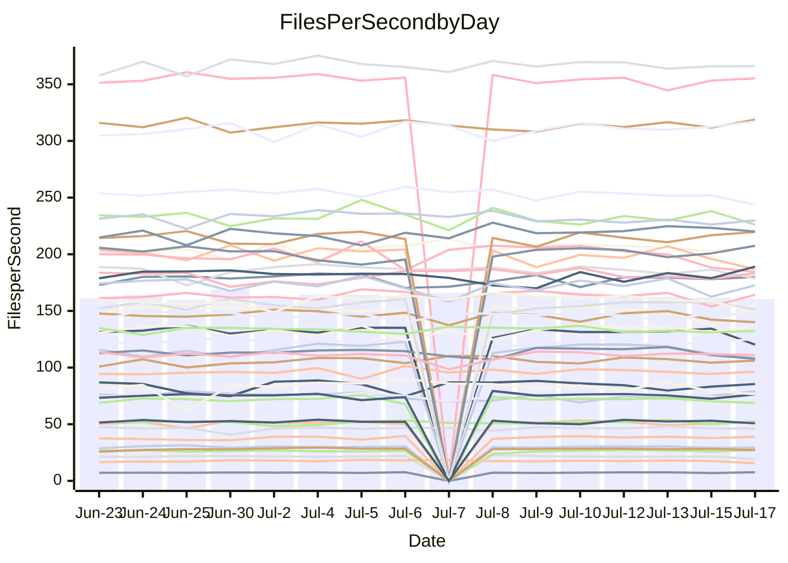

<!---
# This file is auto-generated. Do not edit.
# cspell:disable
--->
# Performance Report

## Daily Performance

## Time to Process Files

| Repository                                      | Elapsed | Min/Avg/Max           |   SD | SD Graph                |
| ----------------------------------------------- | ------: | :-------------------: | ---: | ----------------------- |
| AdaDoom3/AdaDoom3                    |    3.50 | 3.3 /   3.4 /   3.7   | 0.09 | `    ┣━━┻━━╋━●┻━━┫    ` |
| alexiosc/megistos                    |    7.64 | 7.3 /   7.8 /   8.6   | 0.27 | `    ┣━━┻━●╋━━┻━━┫    ` |
| apollographql/apollo-server          |    2.62 | 2.5 /   2.6 /   3.0   | 0.11 | `    ┣━━┻━●╋━━┻━━┫    ` |
| aspnetboilerplate/aspnetboilerplate  |   10.29 | 10.2 /  10.6 /  11.1  | 0.28 | `    ┣━━●━━╋━━┻━━┫    ` |
| aws-amplify/docs                     |   13.04 | 12.6 /  13.1 /  13.9  | 0.33 | `    ┣━━┻━●╋━━┻━━┫    ` |
| Azure/azure-rest-api-specs           |    9.89 | 9.1 /   9.5 /  10.0   | 0.21 | `    ┣━━┻━━╋━━┻━━●    ` |
| bitjson/typescript-starter           |    1.03 | 0.9 /   0.9 /   1.0   | 0.04 | `     ┣━┻━━╋━━┻━┫ ●   ` |
| caddyserver/caddy                    |    3.60 | 3.5 /   3.8 /   4.5   | 0.21 | `    ┣━━●━━╋━━┻━━┫    ` |
| canada-ca/open-source-logiciel-libre |    0.92 | 0.9 /   1.0 /   1.1   | 0.04 | `     ┣━●━━╋━━┻━┫     ` |
| chef/chef                            |    6.54 | 5.6 /   6.0 /   6.6   | 0.23 | `    ┣━━┻━━╋━━┻━━●    ` |
| dart-lang/sdk                        |   71.98 | 61.1 /  67.0 /  77.1  | 2.79 | `  ┣━━━┻━━━╋━━━┻━━●┫  ` |
| django/django                        |   15.54 | 15.2 /  15.8 /  17.8  | 0.63 | `   ┣━━━┻━●╋━━┻━━━┫   ` |
| eslint/eslint                        |   11.65 | 10.9 /  11.2 /  12.0  | 0.24 | `    ┣━━┻━━╋━━┻━━●    ` |
| exonum/exonum                        |    3.89 | 3.4 /   3.6 /   4.5   | 0.26 | `    ┣━━┻━━╋━━●━━┫    ` |
| flutter/samples                      |   17.51 | 17.1 /  18.0 /  19.3  | 0.53 | `   ┣━━━●━━╋━━┻━━━┫   ` |
| gitbucket/gitbucket                  |    3.82 | 3.3 /   3.6 /   3.9   | 0.11 | `    ┣━━┻━━╋━━┻━━●    ` |
| googleapis/google-cloud-cpp          |  140.11 | 134.4 / 140.6 / 152.7 | 4.26 | `  ┣━━━┻━━●╋━━━┻━━━┫  ` |
| graphql/express-graphql              |    0.96 | 0.9 /   1.0 /   1.1   | 0.03 | `     ┣━┻●━╋━━┻━┫     ` |
| graphql/graphql-js                   |    2.65 | 2.6 /   2.7 /   3.0   | 0.10 | `    ┣━━●━━╋━━┻━━┫    ` |
| graphql/graphql-relay-js             |    1.03 | 0.9 /   1.0 /   1.1   | 0.05 | `     ┣━┻━━╋●━┻━┫     ` |
| graphql/graphql-spec                 |    1.03 | 0.9 /   0.9 /   1.0   | 0.03 | `     ┣━━┻━╋━┻━━┫    ●` |
| iluwatar/java-design-patterns        |   12.83 | 12.8 /  13.3 /  16.5  | 0.68 | `   ┣━━━┻●━╋━━┻━━━┫   ` |
| ktaranov/sqlserver-kit               |    7.11 | 6.5 /   6.8 /   7.7   | 0.24 | `    ┣━━┻━━╋━━●━━┫    ` |
| liriliri/licia                       |    4.05 | 3.9 /   4.1 /   4.4   | 0.10 | `    ┣━━┻━●╋━━┻━━┫    ` |
| MartinThoma/LaTeX-examples           |    7.54 | 6.6 /   7.0 /   7.5   | 0.24 | `    ┣━━┻━━╋━━┻━━●    ` |
| mdx-js/mdx                           |    2.02 | 1.8 /   1.9 /   2.0   | 0.06 | `     ┣━┻━━╋━━┻━┫ ●   ` |
| microsoft/TypeScript-Website         |    6.32 | 5.6 /   5.7 /   6.0   | 0.13 | `     ┣━━┻━╋━┻━━┫    ●` |
| MicrosoftDocs/PowerShell-Docs        |   24.40 | 22.9 /  24.4 /  27.5  | 0.85 | `   ┣━━━┻━━●━━┻━━━┫   ` |
| neovim/nvim-lspconfig                |    4.35 | 4.1 /   4.3 /   4.9   | 0.18 | `    ┣━━┻━━●━━┻━━┫    ` |
| pagekit/pagekit                      |    3.57 | 3.6 /   3.7 /   3.9   | 0.09 | `    ┣━●┻━━╋━━┻━━┫    ` |
| php/php-src                          |   29.83 | 25.3 /  27.7 /  36.8  | 2.36 | `   ┣━━┻━━━╋━━●┻━━┫   ` |
| plasticrake/tplink-smarthome-api     |    1.22 | 1.1 /   1.2 /   1.3   | 0.03 | `     ┣━┻━━╋━━●━┫     ` |
| prettier/prettier                    |    7.13 | 7.1 /   7.3 /   7.7   | 0.16 | `    ┣━━┻●━╋━━┻━━┫    ` |
| pycontribs/jira                      |    1.53 | 1.5 /   1.5 /   1.7   | 0.06 | `     ┣━┻━●╋━━┻━┫     ` |
| RustPython/RustPython                |    5.15 | 4.9 /   5.1 /   5.5   | 0.13 | `    ┣━━┻━━╋●━┻━━┫    ` |
| shoelace-style/shoelace              |    2.90 | 2.7 /   2.8 /   3.0   | 0.09 | `    ┣━━┻━━╋━●┻━━┫    ` |
| slint-ui/slint                       |   11.66 | 11.4 /  12.1 /  13.5  | 0.49 | `    ┣━━●━━╋━━┻━━┫    ` |
| SoftwareBrothers/admin-bro           |    2.45 | 2.4 /   2.5 /   2.7   | 0.07 | `     ┣━┻━●╋━━┻━┫     ` |
| sveltejs/svelte                      |   20.76 | 19.5 /  20.6 /  21.7  | 0.51 | `   ┣━━━┻━━╋●━┻━━━┫   ` |
| TheAlgorithms/Python                 |    6.15 | 5.6 /   6.0 /   6.3   | 0.18 | `    ┣━━┻━━╋━━●━━┫    ` |
| twbs/bootstrap                       |    1.38 | 1.3 /   1.4 /   1.7   | 0.09 | `     ┣━┻━●╋━━┻━┫     ` |
| typescript-cheatsheets/react         |    1.36 | 1.3 /   1.4 /   1.6   | 0.05 | `     ┣━┻●━╋━━┻━┫     ` |
| typescript-eslint/typescript-eslint  |    4.01 | 4.0 /   4.1 /   4.3   | 0.10 | `    ┣━━●━━╋━━┻━━┫    ` |
| vitest-dev/vitest                    |    9.31 | 8.8 /   9.2 /  10.0   | 0.30 | `    ┣━━┻━━╋●━┻━━┫    ` |
| w3c/aria-practices                   |    3.27 | 3.1 /   3.3 /   3.8   | 0.13 | `    ┣━━┻━●╋━━┻━━┫    ` |
| w3c/specberus                        |    1.91 | 1.8 /   1.9 /   2.1   | 0.06 | `     ┣━┻━●╋━━┻━┫     ` |
| webdeveric/webpack-assets-manifest   |    1.03 | 1.0 /   1.1 /   1.2   | 0.04 | `     ┣━┻━●╋━━┻━┫     ` |
| webpack/webpack                      |    5.36 | 5.1 /   5.4 /   6.0   | 0.18 | `    ┣━━┻━━●━━┻━━┫    ` |
| wireapp/wire-desktop                 |    0.93 | 0.9 /   0.9 /   1.1   | 0.04 | `     ┣━┻━━●━━┻━┫     ` |
| wireapp/wire-webapp                  |   11.03 | 10.5 /  11.1 /  12.2  | 0.35 | `    ┣━━┻━●╋━━┻━━┫    ` |

Note:
- Elapsed time is in seconds.

## Files per Second over Time

| Repository                                      | Files |    Sec |    Fps |     Rel | Trend Fps              |    N |
| ----------------------------------------------- | ----: | -----: | -----: | ------: | ---------------------- | ---: |
| AdaDoom3/AdaDoom3                    |   103 |   3.50 |  29.44 |  -1.80% | `▇▇▆▇▇▆▇▅▇▇█▇▇▇██▇▇▅▆` |   28 |
| alexiosc/megistos                    |   583 |   7.64 |  76.30 |   1.39% | `█▇▇▅▆█▇▆▆█▇▇▆▇▇▆▇▅▅▇` |   28 |
| apollographql/apollo-server          |   252 |   2.62 |  96.29 |   0.23% | `█▇▅█▆▇▇▅▇▇▇▇▇▇▅▇▇▆▅▇` |   30 |
| aspnetboilerplate/aspnetboilerplate  |  2259 |  10.29 | 219.61 |   2.60% | `▅█▆█▆▇▆▅▇█▆▆█▆▆▄▇█▇█` |   29 |
| aws-amplify/docs                     |  2871 |  13.04 | 220.10 |   0.42% | `▅▇▄▇▆██▅▇▇▇█▆▇█▇█▇▇▇` |   30 |
| Azure/azure-rest-api-specs           |  2411 |   9.89 | 243.74 |  -3.87% | `▇▆▇▇▇▄▆▅█▆▅▇█▅▇▆▆▆▇▅` |   31 |
| bitjson/typescript-starter           |    20 |   1.03 |  19.34 |  -9.98% | `▆▇▄▆▇█▆█▆▇▆▄▇▆█▄▇▆▆▃` |   28 |
| caddyserver/caddy                    |   285 |   3.60 |  79.08 |   5.85% | `█▆▇▆▅▅▇▆▃▆█▆▆▄▅█▅█▅█` |   30 |
| canada-ca/open-source-logiciel-libre |     7 |   0.92 |   7.64 |   5.19% | `▅▆▅▄▆▅▅▄▅▅▅█▆▅▆▅▆▅▃▆` |   28 |
| chef/chef                            |  1206 |   6.54 | 184.46 |  -7.85% | `▅▄█▄▇▇▇▆▆█▇▇▄▇▅▅▇▃▅▃` |   30 |
| dart-lang/sdk                        | 10708 |  71.98 | 148.77 |  -6.90% | `▆▆▆▆▇▇▆▅▇█▆▆▅▆▅▅▆▆▅▄` |   31 |
| django/django                        |  2847 |  15.54 | 183.15 |   1.45% | `▇▇████▆██▇▇▇▆█▆▇▇▆▆▇` |   31 |
| eslint/eslint                        |  2080 |  11.65 | 178.55 |  -4.16% | `███▇▇█▆▇▇█▇▇▇▇▇▇▅▇▇▅` |   30 |
| exonum/exonum                        |   421 |   3.89 | 108.27 |  -7.16% | `▆▇█▇█▆█▆▇█▇█▆███▆▄█▅` |   28 |
| flutter/samples                      |  2452 |  17.51 | 140.07 |  -4.36% | `█▆▇▄▇▆█▅▆▆██▇▇██▆▅▆▅` |   30 |
| gitbucket/gitbucket                  |   412 |   3.82 | 107.79 |  -5.81% | `▆▅▆▅▄▃▆▆▆▇▆▅▇▆█▆▅▄▅▄` |   30 |
| googleapis/google-cloud-cpp          | 20560 | 140.11 | 146.74 |   0.62% | `▆▇▅▇▇▇▇▇██▆█▆▆▇▅▇██▇` |   30 |
| graphql/express-graphql              |    26 |   0.96 |  26.96 |   1.93% | `▇▇▅▆▇▃▆▅▆▇▆█▇▇▆▇▇▆▅▇` |   28 |
| graphql/graphql-js                   |   364 |   2.65 | 137.24 |   3.17% | `▄▇█▄▇▄▇▇██▇█▇▇▇█▇▅▇█` |   29 |
| graphql/graphql-relay-js             |    28 |   1.03 |  27.29 |  -2.45% | `▇██▇▇▆▇▆▆▇▅▇▇▇█▅▇█▆▆` |   28 |
| graphql/graphql-spec                 |    16 |   1.03 |  15.56 | -11.26% | `▆▅█▇█▆▅▆▆▇▆█▆▅▆█▇▅▇▃` |   30 |
| iluwatar/java-design-patterns        |  1992 |  12.83 | 155.24 |   3.32% | `█▇█▇▇██▇█▇█▇▇▇▆█▇█▂█` |   28 |
| ktaranov/sqlserver-kit               |   489 |   7.11 |  68.79 |  -4.07% | `▇▇▇█▅▇▇▆▇▇▇▅▇▇▇▆▇▆▆▅` |   29 |
| liriliri/licia                       |  1437 |   4.05 | 355.21 |   0.45% | `▇█▇▇▇▇▅█▆██▇█▆▄▇▇▇▇▇` |   29 |
| MartinThoma/LaTeX-examples           |  1409 |   7.54 | 186.88 |  -6.61% | `▆▇▇▆▇▆▄▄▅▇▅▄▆▆▇▆█▄▇▄` |   28 |
| mdx-js/mdx                           |   141 |   2.02 |  69.83 |  -6.92% | `▆▅▇▆▄▆▆█▇▄▆▇▆▇▆▇▅▆▅▄` |   29 |
| microsoft/TypeScript-Website         |   760 |   6.32 | 120.26 |  -9.09% | `▇▅███▅▇▇▆▇▇▇█▅▆▇▇█▇▃` |   28 |
| MicrosoftDocs/PowerShell-Docs        |  2708 |  24.40 | 110.97 |  -0.13% | `▆▆▆▃▅█▆▇▇▆▇▆▆▇▆▇▇▆▆▆` |   31 |
| neovim/nvim-lspconfig                |   750 |   4.35 | 172.50 |  -0.16% | `▅██▆▄▇▅▇█▇▇▆▇▅█▇▇▆▃▆` |   30 |
| pagekit/pagekit                      |   741 |   3.57 | 207.51 |   3.04% | `█▅▆▅▆▆▇█████▇▇▆▅▇▇▆█` |   28 |
| php/php-src                          |  2281 |  29.83 |  76.46 |  -7.62% | `▇▇█▇▇▅█▇▇▇▅▅▆▇█▇▄▇▆▅` |   31 |
| plasticrake/tplink-smarthome-api     |    62 |   1.22 |  50.80 |  -3.14% | `▆██▇▇▇▆▅▄▆██▇█▇▇▇▇█▆` |   28 |
| prettier/prettier                    |  2274 |   7.13 | 318.83 |   1.72% | `█▇▇█▇▇▇▆▇██▆▆█▇▇█▇▇█` |   30 |
| pycontribs/jira                      |    79 |   1.53 |  51.56 |   0.94% | `▆▇▆▇▆▇▇▆███▇▇▇▅▆▅▇▆▇` |   28 |
| RustPython/RustPython                |   682 |   5.15 | 132.39 |  -0.50% | `▇▇▆▆▇▇▇▇█▇▆▇▅▇▇▆▆▇▅▆` |   30 |
| shoelace-style/shoelace              |   439 |   2.90 | 151.37 |  -2.60% | `▆▅▆▇▇▄▄▇▅█▆▇█▆▇▅█▇▇▅` |   28 |
| slint-ui/slint                       |  2204 |  11.66 | 189.05 |   4.79% | `▆▇▇▇▆▅▄▅█▇▃▅█▆▅█▇▅▇█` |   30 |
| SoftwareBrothers/admin-bro           |   441 |   2.45 | 179.91 |   1.06% | `███▅▆▇▇█▆▆▇▇▇█▇▇█▇▇▇` |   29 |
| sveltejs/svelte                      |  7597 |  20.76 | 365.99 |  -0.23% | `█▆▆▅▆▅▆█▅█▆▅▆▇▆▄▆▆▅▆` |   31 |
| TheAlgorithms/Python                 |  1390 |   6.15 | 226.04 |  -2.82% | `▆▅█▆▄▇▆▅▄▅▇▅▆▆▅▅▆▆█▅` |   29 |
| twbs/bootstrap                       |   118 |   1.38 |  85.46 |   1.68% | `█▇▇▄▇▇█▇▇▇▆▆▇▇▅█▄█▅▇` |   30 |
| typescript-cheatsheets/react         |    53 |   1.36 |  38.98 |   2.34% | `▇▇█▅█▆█▇██▆▇█▆█▆█▆▇▇` |   28 |
| typescript-eslint/typescript-eslint  |  1272 |   4.01 | 317.13 |   2.48% | `█▇▆█▇▆▇▆██▅▇███▇▆█▇█` |   30 |
| vitest-dev/vitest                    |  2140 |   9.31 | 229.89 |  -0.78% | `█▇▇▇█▅▇▅█▅▅▇▇▅▇▆█▄▅▆` |   31 |
| w3c/aria-practices                   |   409 |   3.27 | 124.96 |   2.28% | `█▅▇▇▆▆▅▇▇▅▆▇██▃▇▆▇▇▇` |   29 |
| w3c/specberus                        |   203 |   1.91 | 106.11 |   0.28% | `█▇▇▆██▇▅▆▅█▇███▇▆▆▆▇` |   30 |
| webdeveric/webpack-assets-manifest   |    54 |   1.03 |  52.60 |   2.29% | `▃▇▇▆▆▆▆▇▇▆▇▅███▇▆▆▄▇` |   30 |
| webpack/webpack                      |  1109 |   5.36 | 206.72 |   1.00% | `▆▇▇█▆▇▇▆█▇█▇▇▆▇▇▆▇▆▇` |   31 |
| wireapp/wire-desktop                 |    43 |   0.93 |  46.11 |  -0.41% | `▇▇▇▇▇▆█▇▇▆▆▆▇▇▇██▇▇▇` |   30 |
| wireapp/wire-webapp                  |  1811 |  11.03 | 164.22 |   0.81% | `▄▇▇▇▆▇▇▇▆▇▆▆▇▆▆▆█▃▆▆` |   30 |

## Data Throughput

| Repository                                      | Files |    Sec |     Kps |     Rel | Trend Kps              |    N |
| ----------------------------------------------- | ----: | -----: | ------: | ------: | ---------------------- | ---: |
| AdaDoom3/AdaDoom3                    |   103 |   3.50 |  625.58 |  -1.80% | `▇▇▆▇▇▆▇▅▇▇█▇▇▇██▇▇▅▆` |   28 |
| alexiosc/megistos                    |   583 |   7.64 |  599.55 |   1.39% | `█▇▇▅▆█▇▆▆█▇▇▆▇▇▆▇▅▅▇` |   28 |
| apollographql/apollo-server          |   252 |   2.62 |  774.52 |   1.22% | `█▇▅█▇█▇▆█▇█▇▇▇▆▇▇▇▆▇` |   30 |
| aspnetboilerplate/aspnetboilerplate  |  2259 |  10.29 |  516.81 |   2.61% | `▅█▆█▆▇▆▅▇█▆▆█▆▆▄▇█▇█` |   29 |
| aws-amplify/docs                     |  2871 |  13.04 |  766.42 |   0.45% | `▅▇▅▇▆██▅▇▇▇█▆▇█▇█▇▇▇` |   30 |
| Azure/azure-rest-api-specs           |  2411 |   9.89 |  670.56 |  -3.64% | `▇▆▇▇▇▄▆▅█▆▅▇█▅▇▆▆▆▇▅` |   31 |
| bitjson/typescript-starter           |    20 |   1.03 |   77.35 |  -9.98% | `▆▇▄▆▇█▆█▆▇▆▄▇▆█▄▇▆▆▃` |   28 |
| caddyserver/caddy                    |   285 |   3.60 |  671.22 |   5.89% | `█▆▇▆▅▅▇▆▃▆█▆▆▄▅█▅█▅█` |   30 |
| canada-ca/open-source-logiciel-libre |     7 |   0.92 |   63.33 |   5.19% | `▅▆▅▄▆▅▅▄▅▅▅█▆▅▆▅▆▅▃▆` |   28 |
| chef/chef                            |  1206 |   6.54 |  849.36 |  -7.74% | `▅▄█▄▇▇▇▆▆█▇▇▄▇▅▅▇▃▅▄` |   30 |
| dart-lang/sdk                        | 10708 |  71.98 | 1011.96 |  -6.98% | `▆▆▆▆▇▇▆▅▇█▆▆▅▆▅▅▆▆▅▄` |   31 |
| django/django                        |  2847 |  15.54 | 1139.02 |   1.47% | `▇▇████▆██▇▇▇▆█▆▇▇▆▆▇` |   31 |
| eslint/eslint                        |  2080 |  11.65 | 1291.13 |  -4.20% | `███▇▇█▆▇▇█▇▇▇▇▇▇▅▇▇▅` |   30 |
| exonum/exonum                        |   421 |   3.89 | 1035.65 |  -7.16% | `▆▇█▇█▆█▆▇█▇█▆███▆▄█▅` |   28 |
| flutter/samples                      |  2452 |  17.51 | 1230.90 |   1.26% | `█▆▇▄▇▆▇▄▅▆██▆▇███▇█▇` |   30 |
| gitbucket/gitbucket                  |   412 |   3.82 |  487.69 |  -5.79% | `▆▅▆▅▄▃▆▆▆▇▆▅▇▆█▆▅▄▅▄` |   30 |
| googleapis/google-cloud-cpp          | 20560 | 140.11 | 1176.37 |   1.10% | `▆▇▅▇▇▇▇▇██▆█▆▅▇▅▇██▇` |   30 |
| graphql/express-graphql              |    26 |   0.96 |  123.42 |   1.93% | `▇▇▅▆▇▃▆▅▆▇▆█▇▇▆▇▇▆▅▇` |   28 |
| graphql/graphql-js                   |   364 |   2.65 |  788.73 |   3.12% | `▄▇█▄▇▄▇▇██▇█▇▇▇█▇▅▇█` |   29 |
| graphql/graphql-relay-js             |    28 |   1.03 |  107.21 |  -2.45% | `▇██▇▇▆▇▆▆▇▅▇▇▇█▅▇█▆▆` |   28 |
| graphql/graphql-spec                 |    16 |   1.03 |  564.14 | -11.56% | `▆▄█▆█▆▄▆▆▇▆█▅▄▆▇▇▅▇▂` |   30 |
| iluwatar/java-design-patterns        |  1992 |  12.83 |  479.84 |   3.32% | `█▇█▇▇██▇█▇█▇▇▇▆█▇█▂█` |   28 |
| ktaranov/sqlserver-kit               |   489 |   7.11 | 1041.25 |  -4.07% | `▇▇▇█▅▇▇▆▇▇▇▅▇▇▇▆▇▆▆▅` |   29 |
| liriliri/licia                       |  1437 |   4.05 |  423.19 |   0.45% | `▇█▇▇▇▇▅█▆██▇█▆▄▇▇▇▇▇` |   29 |
| MartinThoma/LaTeX-examples           |  1409 |   7.54 |  385.96 |  -6.61% | `▆▇▇▆▇▆▄▄▅▇▅▄▆▆▇▆█▄▇▄` |   28 |
| mdx-js/mdx                           |   141 |   2.02 |  324.39 |  -6.92% | `▆▅▇▆▄▆▆█▇▄▆▇▆▇▆▇▅▆▅▄` |   29 |
| microsoft/TypeScript-Website         |   760 |   6.32 |  830.58 |  -9.09% | `▇▅███▅▇▇▆▇▇▇█▅▆▇▇█▇▃` |   28 |
| MicrosoftDocs/PowerShell-Docs        |  2708 |  24.40 | 1140.02 |  -0.16% | `▆▆▆▃▅█▆▇▇▆▇▆▆▇▆▇▇▆▆▆` |   31 |
| neovim/nvim-lspconfig                |   750 |   4.35 |  276.92 |  -0.12% | `▅██▆▄▇▅▇█▇▇▆▇▅█▇▇▆▃▆` |   30 |
| pagekit/pagekit                      |   741 |   3.57 |  432.65 |   3.04% | `█▅▆▅▆▆▇█████▇▇▆▅▇▇▆█` |   28 |
| php/php-src                          |  2281 |  29.83 | 1330.37 |  -7.58% | `▇▇█▇▇▅█▇▇▇▅▅▆▇█▇▄▇▆▅` |   31 |
| plasticrake/tplink-smarthome-api     |    62 |   1.22 |  274.51 |  -3.14% | `▆██▇▇▇▆▅▄▆██▇█▇▇▇▇█▆` |   28 |
| prettier/prettier                    |  2274 |   7.13 |  453.43 |   1.73% | `█▇▇█▇▇▇▆▇██▆▆█▇▇█▇▇█` |   30 |
| pycontribs/jira                      |    79 |   1.53 |  366.82 |   0.94% | `▆▇▆▇▆▇▇▆███▇▇▇▅▆▅▇▆▇` |   28 |
| RustPython/RustPython                |   682 |   5.15 | 1030.95 |  -0.04% | `▇▇▆▆▇▇▇▇█▇▆▇▅▇▇▆▆█▅▇` |   30 |
| shoelace-style/shoelace              |   439 |   2.90 |  731.32 |  -2.60% | `▆▅▆▇▇▄▄▇▅█▆▇█▆▇▅█▇▇▅` |   28 |
| slint-ui/slint                       |  2204 |  11.66 | 1223.88 |   4.61% | `▆▇▇▇▆▅▄▅█▇▃▅█▆▅█▇▅▇█` |   30 |
| SoftwareBrothers/admin-bro           |   441 |   2.45 |  396.54 |   1.06% | `███▅▆▇▇█▆▆▇▇▇█▇▇█▇▇▇` |   29 |
| sveltejs/svelte                      |  7597 |  20.76 |  243.14 |  -0.21% | `█▆▆▅▆▅▆█▅█▆▅▆▇▆▄▆▆▅▆` |   31 |
| TheAlgorithms/Python                 |  1390 |   6.15 |  573.73 |  -2.84% | `▆▅█▆▄▇▆▅▄▅▇▅▆▆▅▅▆▆█▅` |   29 |
| twbs/bootstrap                       |   118 |   1.38 |  701.77 |   1.68% | `█▇▇▄▇▇█▇▇▇▆▆▇▇▅█▄█▅▇` |   30 |
| typescript-cheatsheets/react         |    53 |   1.36 |  284.59 |   2.34% | `▇▇█▅█▆█▇██▆▇█▆█▆█▆▇▇` |   28 |
| typescript-eslint/typescript-eslint  |  1272 |   4.01 | 1620.28 |   2.82% | `█▇▆█▇▆▇▆██▅▇███▇▆█▇█` |   30 |
| vitest-dev/vitest                    |  2140 |   9.31 |  500.49 |  -1.05% | `█▇▇▇█▅▇▅█▅▅▇▇▅▇▆█▄▅▆` |   31 |
| w3c/aria-practices                   |   409 |   3.27 | 1162.57 |   2.42% | `█▅▇▇▆▆▅▇▇▅▆▇██▃▇▆▇▇▇` |   29 |
| w3c/specberus                        |   203 |   1.91 |  330.35 |  -0.26% | `█▇█▆██▇▅▆▅█▇███▇▆▆▆▆` |   30 |
| webdeveric/webpack-assets-manifest   |    54 |   1.03 |  122.73 |   2.29% | `▃▇▇▆▆▆▆▇▇▆▇▅███▇▆▆▄▇` |   30 |
| webpack/webpack                      |  1109 |   5.36 |  930.88 |   0.70% | `▆▇▇█▇▇▇▆█▇█▇▇▇▇▇▆▇▆▇` |   31 |
| wireapp/wire-desktop                 |    43 |   0.93 |  203.75 |  -0.41% | `▇▇▇▇▇▆█▇▇▆▆▆▇▇▇██▇▇▇` |   30 |
| wireapp/wire-webapp                  |  1811 |  11.03 |  584.96 |   0.70% | `▄▇▇▇▆▇▇▇▆▇▆▆▇▆▆▆█▃▆▆` |   30 |

