<!---
# This file is auto-generated. Do not edit.
# cspell:disable
--->
# Performance Report

## Daily Performance

```mermaid
xychart-beta
    title Files Per Second by Day
    y-axis Files per Second
    x-axis Date [Jul-12, Jul-13, Jul-15, Jul-17, Jul-18, Jul-19, Jul-20, Jul-22, Jul-23, Jul-26, Jul-27, Jul-28, Jul-29, Jul-30, Aug-3, Aug-6, Aug-8, Aug-11]
    bar [163.19, 162.43, 162.24, 160.81, 162.11, 161.80, 162.84, 161.83, 163.82, 164.32, 165.56, 162.55, 163.67, 162.66, 162.42, 162.15, 159.78, 161.15]
    line [109.02, 107.38, 104.33, 107.04, 105.42, 107.07, 111.31, 108.98, 109.47, 108.84, 109.00, 95.94, 106.70, 91.83, 102.88, 105.40, 104.69, 94.58]
    line [46.27, 47.99, 46.18, 45.89, 46.88, 47.09, 45.82, 46.71, 46.24, 45.49, 45.13, 45.94, 46.54, 43.06, 46.57, 45.56, 45.66, 36.53]
    line [7.49, 7.49, 6.93, 7.35, 7.41, 7.13, 7.42, 7.37, 6.94, 7.34, 7.37, 6.62, 7.52, 6.92, 6.91, 7.06, 7.47, 6.21]
    line [38.35, 38.90, 37.77, 38.11, 36.22, 38.46, 39.54, 38.13, 38.75, 38.94, 38.82, 39.51, 39.23, 37.37, 39.03, 38.14, 38.18, 38.34]
    line [84.39, 79.74, 83.17, 86.61, 84.55, 85.67, 84.70, 86.32, 83.67, 87.12, 83.64, 82.58, 83.71, 79.08, 83.62, 84.88, 87.82, 77.03]
    line [121.97, 119.76, 124.17, 123.39, 123.52, 123.46, 121.92, 119.72, 124.69, 119.65, 127.83, 120.71, 118.86, 118.39, 116.67, 121.26, 128.17, 120.29]
    line [51.79, 53.82, 49.25, 50.85, 53.53, 52.69, 53.02, 51.19, 53.86, 50.78, 43.58, 47.06, 54.57, 52.43, 53.03, 51.13, 48.90, 45.53]
    line [51.98, 49.24, 50.53, 52.10, 52.76, 51.07, 51.44, 50.43, 43.97, 51.67, 52.73, 46.52, 53.63, 45.66, 48.27, 50.39, 51.68, 50.60]
    line [355.82, 344.62, 353.27, 340.52, 356.06, 341.72, 349.11, 334.55, 350.21, 337.72, 352.09, 361.09, 347.33, 342.33, 341.03, 346.90, 355.56, 336.94]
    line [203.61, 197.40, 200.74, 200.72, 202.94, 201.36, 202.08, 200.55, 197.73, 195.25, 206.51, 204.03, 201.53, 197.81, 198.32, 202.22, 209.23, 210.52]
    line [75.98, 75.26, 74.39, 74.57, 72.87, 76.84, 75.79, 76.25, 77.55, 75.81, 77.91, 68.05, 77.31, 74.56, 75.13, 76.66, 73.32, 71.05]
    line [135.26, 135.39, 131.25, 137.83, 130.35, 133.37, 136.93, 134.10, 136.61, 135.79, 138.26, 135.57, 135.43, 135.66, 135.43, 131.19, 135.23, 124.44]
    line [17.48, 17.96, 17.52, 15.60, 17.77, 17.44, 17.98, 17.51, 17.20, 17.96, 18.17, 17.67, 18.43, 18.02, 17.45, 17.65, 18.37, 16.03]
    line [74.66, 73.66, 75.08, 77.97, 77.53, 74.65, 70.42, 69.35, 79.56, 76.05, 68.90, 73.77, 75.65, 74.99, 75.71, 77.66, 78.66, 78.02]
    line [97.78, 96.17, 94.33, 97.04, 97.24, 95.75, 98.78, 99.06, 97.00, 99.07, 98.61, 97.42, 91.49, 92.79, 89.32, 93.72, 96.32, 96.60]
    line [310.85, 309.84, 312.53, 315.03, 314.69, 310.30, 312.46, 311.42, 307.91, 317.83, 314.26, 289.97, 313.11, 312.72, 310.96, 309.18, 308.97, 293.32]
    line [21.20, 21.36, 21.51, 20.58, 21.30, 22.19, 22.10, 21.88, 20.15, 20.04, 21.91, 21.31, 20.80, 22.35, 21.72, 21.80, 22.54, 18.94]
    line [28.38, 28.02, 28.20, 27.23, 28.58, 28.56, 28.51, 28.41, 26.08, 28.71, 28.53, 28.56, 28.21, 28.32, 27.98, 27.09, 27.59, 24.59]
    line [53.83, 52.41, 53.08, 52.40, 51.77, 52.01, 53.58, 51.27, 46.96, 53.48, 52.00, 51.65, 49.61, 53.65, 44.73, 52.88, 49.80, 45.59]
    line [27.13, 26.83, 25.90, 26.40, 26.69, 26.50, 26.68, 26.34, 25.46, 26.08, 26.71, 26.98, 26.19, 26.72, 24.58, 26.54, 27.00, 21.84]
    line [131.34, 131.95, 134.40, 126.35, 129.62, 126.47, 133.10, 134.27, 132.41, 128.75, 133.45, 135.04, 127.98, 132.62, 137.05, 127.16, 104.34, 135.85]
    line [312.26, 316.54, 311.74, 310.63, 315.98, 317.85, 311.01, 317.69, 306.96, 309.97, 300.54, 300.28, 316.56, 309.78, 307.09, 310.74, 319.60, 310.44]
    line [72.08, 72.80, 70.30, 71.38, 70.52, 71.04, 71.91, 72.70, 69.86, 70.37, 73.91, 70.30, 66.36, 70.57, 74.92, 69.05, 71.64, 71.74]
    line [120.41, 118.48, 111.84, 112.66, 103.82, 121.72, 123.96, 116.30, 121.57, 112.16, 111.54, 116.14, 122.06, 116.65, 117.60, 120.09, 120.85, 114.07]
    line [76.63, 75.41, 72.48, 75.77, 73.22, 74.96, 75.84, 73.04, 75.74, 77.07, 71.05, 77.49, 68.74, 76.65, 76.34, 76.92, 73.53, 73.38]
    line [30.35, 30.53, 29.15, 29.59, 30.29, 29.57, 30.13, 31.01, 27.77, 29.48, 29.26, 29.06, 30.88, 29.94, 29.48, 30.19, 29.03, 29.20]
    line [202.66, 199.84, 188.27, 193.42, 194.63, 190.82, 194.01, 187.89, 193.41, 192.42, 195.47, 187.19, 193.79, 191.90, 194.07, 182.58, 166.07, 195.75]
    line [233.66, 229.73, 238.10, 228.16, 232.72, 230.57, 231.48, 227.16, 226.70, 229.01, 239.01, 232.02, 223.69, 237.66, 221.63, 233.74, 234.59, 243.71]
    line [207.20, 205.62, 202.48, 205.11, 209.83, 198.16, 198.05, 204.69, 200.38, 204.18, 172.00, 190.59, 211.20, 199.37, 206.67, 202.54, 202.61, 191.45]
    line [227.85, 230.59, 218.19, 235.84, 238.63, 231.13, 236.94, 230.60, 225.84, 222.04, 240.74, 232.71, 223.95, 236.98, 238.93, 227.08, 231.94, 224.31]
    line [157.55, 157.57, 157.54, 152.05, 156.89, 159.37, 154.51, 154.84, 151.75, 154.10, 154.75, 150.75, 157.93, 147.43, 158.79, 154.00, 151.10, 146.03]
    line [172.02, 178.72, 162.59, 171.56, 160.94, 175.73, 180.87, 179.86, 173.49, 175.22, 181.17, 166.29, 176.78, 179.24, 162.30, 170.51, 173.47, 172.06]
    line [214.62, 210.58, 216.81, 214.69, 207.39, 210.58, 210.83, 219.91, 218.25, 211.67, 213.25, 185.65, 222.45, 210.28, 204.15, 217.44, 218.55, 222.74]
    line [163.07, 165.84, 153.93, 161.48, 163.65, 163.25, 166.55, 162.82, 167.25, 160.14, 165.42, 161.19, 158.31, 161.70, 164.91, 162.58, 157.48, 160.80]
    line [186.31, 182.67, 186.39, 179.31, 182.07, 181.92, 182.11, 183.75, 180.78, 184.81, 182.65, 188.37, 181.75, 185.70, 188.91, 182.68, 183.70, 188.54]
    line [116.21, 118.14, 111.02, 114.16, 117.75, 114.86, 117.38, 110.16, 107.68, 105.10, 115.28, 117.30, 115.27, 112.83, 117.78, 117.94, 116.33, 117.15]
    line [150.91, 149.71, 136.98, 153.14, 154.96, 149.05, 154.95, 153.94, 155.48, 143.79, 152.94, 153.75, 148.60, 152.63, 153.39, 148.93, 139.04, 152.32]
    line [179.72, 179.37, 178.07, 178.35, 166.36, 178.14, 177.77, 166.91, 179.23, 177.92, 175.97, 161.59, 176.09, 174.17, 181.77, 175.87, 181.75, 170.66]
    line [196.87, 207.15, 195.83, 198.09, 197.68, 202.31, 195.34, 188.56, 195.30, 203.49, 200.63, 204.54, 191.76, 201.55, 202.60, 200.71, 195.89, 205.52]
    line [369.35, 363.79, 365.39, 364.51, 354.54, 367.49, 364.21, 365.97, 356.16, 367.24, 369.57, 363.41, 359.37, 369.40, 357.63, 359.56, 362.02, 369.92]
    line [179.82, 180.43, 176.01, 174.98, 183.26, 182.49, 185.76, 184.64, 175.39, 183.80, 178.20, 177.82, 176.95, 183.37, 187.31, 181.39, 178.30, 183.56]
    line [175.71, 183.39, 178.90, 178.60, 191.51, 185.47, 186.89, 174.56, 188.32, 179.58, 184.08, 186.53, 177.20, 179.37, 187.46, 183.38, 182.66, 164.22]
    line [131.27, 132.43, 131.04, 131.83, 130.19, 128.92, 127.23, 131.88, 120.40, 132.81, 129.34, 133.97, 130.74, 135.91, 126.83, 133.33, 126.61, 126.65]
    line [110.15, 112.38, 110.43, 112.10, 103.78, 114.93, 115.08, 104.93, 111.58, 112.75, 113.47, 109.84, 109.80, 112.55, 113.19, 109.88, 98.38, 111.82]
    line [147.84, 149.86, 141.85, 143.07, 141.02, 142.51, 144.87, 145.54, 138.82, 146.01, 144.90, 140.82, 142.51, 147.27, 145.58, 142.12, 131.06, 146.69]
    line [220.42, 224.78, 223.29, 222.43, 207.49, 215.75, 219.62, 220.62, 217.24, 221.48, 226.19, 223.44, 219.34, 210.97, 220.37, 215.62, 211.22, 214.11]
    line [79.99, 86.85, 82.81, 78.74, 86.89, 84.13, 85.63, 87.55, 88.29, 86.90, 87.47, 84.26, 79.87, 88.81, 81.39, 83.97, 85.77, 85.44]
    line [253.55, 251.59, 253.64, 246.87, 251.37, 244.82, 253.83, 256.85, 255.68, 251.95, 256.48, 257.08, 259.44, 255.93, 249.24, 251.79, 254.83, 254.04]
    line [163.50, 159.47, 157.31, 155.54, 162.49, 157.44, 160.47, 161.66, 162.86, 164.94, 160.13, 159.49, 164.72, 159.99, 159.02, 159.32, 152.64, 157.15]
    line [145.81, 141.78, 149.87, 144.29, 144.20, 143.50, 142.28, 141.37, 147.86, 147.77, 151.94, 147.31, 150.10, 142.92, 143.82, 144.85, 146.35, 142.92]
```

## Time to Process Files

| Repository                                      | Elapsed | Min/Avg/Max           |   SD | SD Graph                |
| ----------------------------------------------- | ------: | :-------------------: | ---: | ----------------------- |
| AdaDoom3/AdaDoom3                    |    3.43 | 3.3 /   3.5 /   3.7   | 0.10 | `    ┣━━┻━●╋━━┻━━┫    ` |
| alexiosc/megistos                    |    8.04 | 7.4 /   7.8 /   8.5   | 0.25 | `    ┣━━┻━━╋━━●━━┫    ` |
| apollographql/apollo-server          |    2.62 | 2.5 /   2.6 /   2.8   | 0.08 | `     ┣━┻━━●━━┻━┫     ` |
| aspnetboilerplate/aspnetboilerplate  |   10.18 | 10.1 /  10.7 /  12.2  | 0.38 | `    ┣━●┻━━╋━━┻━━┫    ` |
| aws-amplify/docs                     |   13.73 | 12.7 /  13.1 /  14.2  | 0.43 | `    ┣━━┻━━╋━━┻━●┫    ` |
| Azure/azure-rest-api-specs           |    9.56 | 9.2 /   9.6 /  10.5   | 0.26 | `    ┣━━┻━●╋━━┻━━┫    ` |
| bitjson/typescript-starter           |    1.09 | 0.9 /   0.9 /   1.1   | 0.04 | `     ┣━┻━━╋━━┻━┫   ● ` |
| caddyserver/caddy                    |    3.69 | 3.5 /   3.8 /   4.1   | 0.19 | `    ┣━━┻●━╋━━┻━━┫    ` |
| canada-ca/open-source-logiciel-libre |    1.14 | 0.9 /   1.0 /   1.1   | 0.05 | `     ┣━┻━━╋━━┻━┫  ●  ` |
| chef/chef                            |    6.30 | 5.8 /   6.3 /   7.7   | 0.37 | `    ┣━━┻━━●━━┻━━┫    ` |
| dart-lang/sdk                        |   70.16 | 61.1 /  67.1 /  72.1  | 2.20 | `  ┣━━━┻━━━╋━━━┻●━━┫  ` |
| django/django                        |   15.61 | 15.2 /  15.8 /  17.7  | 0.47 | `    ┣━━┻━●╋━━┻━━┫    ` |
| eslint/eslint                        |   11.22 | 10.9 /  11.3 /  12.7  | 0.34 | `    ┣━━┻━●╋━━┻━━┫    ` |
| exonum/exonum                        |    3.88 | 3.4 /   3.6 /   4.2   | 0.21 | `    ┣━━┻━━╋━━┻●━┫    ` |
| flutter/samples                      |   16.52 | 16.5 /  17.3 /  18.7  | 0.54 | `   ┣━●━┻━━╋━━┻━━━┫   ` |
| gitbucket/gitbucket                  |    3.59 | 3.3 /   3.6 /   3.9   | 0.14 | `    ┣━━┻━━●━━┻━━┫    ` |
| googleapis/google-cloud-cpp          |  149.31 | 135.4 / 141.7 / 150.8 | 4.24 | `  ┣━━━┻━━━╋━━━┻━━━●  ` |
| graphql/express-graphql              |    1.19 | 0.9 /   1.0 /   1.2   | 0.04 | `      ┣━┻━╋━┻━┫     ●` |
| graphql/graphql-js                   |    2.83 | 2.6 /   2.7 /   3.0   | 0.08 | `     ┣━┻━━╋━━┻●┫     ` |
| graphql/graphql-relay-js             |    1.14 | 0.9 /   1.0 /   1.1   | 0.04 | `     ┣━┻━━╋━━┻━┫   ● ` |
| graphql/graphql-spec                 |    1.00 | 0.9 /   0.9 /   1.0   | 0.04 | `     ┣━┻━━╋━━┻━●     ` |
| iluwatar/java-design-patterns        |   13.56 | 12.6 /  13.3 /  16.5  | 0.73 | `   ┣━━━┻━━╋●━┻━━━┫   ` |
| ktaranov/sqlserver-kit               |    6.80 | 6.5 /   6.9 /   7.4   | 0.23 | `    ┣━━┻━●╋━━┻━━┫    ` |
| liriliri/licia                       |    4.24 | 4.0 /   4.2 /   4.6   | 0.14 | `    ┣━━┻━━╋━●┻━━┫    ` |
| MartinThoma/LaTeX-examples           |    6.83 | 6.6 /   7.1 /   7.5   | 0.21 | `    ┣━━●━━╋━━┻━━┫    ` |
| mdx-js/mdx                           |    1.98 | 1.8 /   1.9 /   2.1   | 0.06 | `     ┣━┻━━╋━━┻━●     ` |
| microsoft/TypeScript-Website         |    5.60 | 5.5 /   5.9 /   7.3   | 0.31 | `    ┣━━●━━╋━━┻━━┫    ` |
| MicrosoftDocs/PowerShell-Docs        |   24.47 | 23.2 /  24.3 /  27.5  | 0.84 | `   ┣━━━┻━━╋●━┻━━━┫   ` |
| neovim/nvim-lspconfig                |    4.25 | 4.1 /   4.3 /   4.9   | 0.18 | `    ┣━━┻━●╋━━┻━━┫    ` |
| pagekit/pagekit                      |    3.49 | 3.5 /   3.7 /   4.0   | 0.10 | `    ●━━┻━━╋━━┻━━┫    ` |
| php/php-src                          |   26.77 | 25.6 /  27.2 /  30.2  | 1.34 | `   ┣━━┻━━●╋━━━┻━━┫   ` |
| plasticrake/tplink-smarthome-api     |    1.36 | 1.1 /   1.2 /   1.4   | 0.06 | `     ┣━┻━━╋━━┻━┫ ●   ` |
| prettier/prettier                    |    7.38 | 7.1 /   7.3 /   7.6   | 0.15 | `    ┣━━┻━━╋━●┻━━┫    ` |
| pycontribs/jira                      |    1.54 | 1.5 /   1.6 /   1.8   | 0.08 | `     ┣━┻━●╋━━┻━┫     ` |
| RustPython/RustPython                |    5.14 | 5.0 /   5.2 /   5.7   | 0.17 | `    ┣━━┻━●╋━━┻━━┫    ` |
| shoelace-style/shoelace              |    3.07 | 2.7 /   2.8 /   3.3   | 0.11 | `    ┣━━┻━━╋━━┻━━●    ` |
| slint-ui/slint                       |   14.72 | 11.4 /  12.1 /  13.5  | 0.46 | `      ┣━┻━╋━┻━┫     ●` |
| SoftwareBrothers/admin-bro           |    2.61 | 2.4 /   2.5 /   2.7   | 0.07 | `     ┣━┻━━╋━━┻●┫     ` |
| sveltejs/svelte                      |   20.97 | 19.5 /  21.0 /  21.8  | 0.50 | `   ┣━━━┻━━●━━┻━━━┫   ` |
| TheAlgorithms/Python                 |    5.61 | 5.7 /   6.0 /   6.3   | 0.16 | `   ●┣━━┻━━╋━━┻━━┫    ` |
| twbs/bootstrap                       |    1.51 | 1.3 /   1.4 /   1.6   | 0.07 | `     ┣━┻━━╋━━┻●┫     ` |
| typescript-cheatsheets/react         |    1.36 | 1.3 /   1.4 /   1.5   | 0.04 | `     ┣━┻━●╋━━┻━┫     ` |
| typescript-eslint/typescript-eslint  |    4.28 | 4.0 /   4.1 /   4.4   | 0.11 | `    ┣━━┻━━╋━━┻━●┫    ` |
| vitest-dev/vitest                    |    9.64 | 8.9 /   9.3 /  10.2   | 0.37 | `    ┣━━┻━━╋━━●━━┫    ` |
| w3c/aria-practices                   |    3.43 | 3.1 /   3.4 /   3.8   | 0.13 | `    ┣━━┻━━╋━●┻━━┫    ` |
| w3c/specberus                        |    2.24 | 1.8 /   1.9 /   2.6   | 0.14 | `    ┣━━┻━━╋━━┻━━●    ` |
| webdeveric/webpack-assets-manifest   |    1.18 | 1.0 /   1.1 /   1.2   | 0.06 | `     ┣━┻━━╋━━┻━●     ` |
| webpack/webpack                      |    5.97 | 5.2 /   5.5 /   6.5   | 0.24 | `    ┣━━┻━━╋━━┻━━●    ` |
| wireapp/wire-desktop                 |    1.13 | 0.9 /   0.9 /   1.2   | 0.06 | `     ┣━┻━━╋━━┻━┫  ●  ` |
| wireapp/wire-webapp                  |   11.82 | 10.5 /  11.2 /  12.2  | 0.31 | `    ┣━━┻━━╋━━┻━━┫●   ` |

Note:
- Elapsed time is in seconds.

## Files per Second over Time

| Repository                                      | Files |    Sec |    Fps |     Rel | Trend Fps              |    N |
| ----------------------------------------------- | ----: | -----: | -----: | ------: | ---------------------- | ---: |
| AdaDoom3/AdaDoom3                    |   103 |   3.43 |  30.03 |   0.80% | `▇▅█▆█▄▅▇▆▆█▇▇▆▇▇▇▆▅▇` |   35 |
| alexiosc/megistos                    |   583 |   8.04 |  72.52 |  -3.60% | `▇▆▇▇▆▇▇█▅█▄▆█▇█▇▇▆▆▅` |   35 |
| apollographql/apollo-server          |   252 |   2.62 |  96.07 |  -0.05% | `▅▇███▇███▇▅▅▆▄▇▅▆▇▇▇` |   35 |
| aspnetboilerplate/aspnetboilerplate  |  2286 |  10.18 | 224.47 |   5.46% | `▅▇▆▆▇▇▆▆▆▃█▆▆▅█▇▆▇▇█` |   35 |
| aws-amplify/docs                     |  2871 |  13.73 | 209.09 |  -4.52% | `██▆█▇▇▇▇██▇▄▇▇█▇▄▆▇▅` |   35 |
| Azure/azure-rest-api-specs           |  2444 |   9.56 | 255.57 |   1.49% | `██▇███▇▇███▇█▇▇▇▇▇▇█` |   35 |
| bitjson/typescript-starter           |    20 |   1.09 |  18.37 | -14.28% | `██▇█▇▅▆▃▇▆▆▇█▇▇▇▇█▄▂` |   35 |
| caddyserver/caddy                    |   285 |   3.69 |  77.29 |   2.82% | `▆▆▄▄▄█▆▇▃▆▆▅▇▆██▆██▇` |   35 |
| canada-ca/open-source-logiciel-libre |     7 |   1.14 |   6.12 | -15.18% | `█▃▇▇▇▆▇▇▇▄█▆▅▅▆▆▆█▃▃` |   35 |
| chef/chef                            |  1207 |   6.30 | 191.49 |  -0.53% | `▇▇▆▇▆▇█▅▇▆▇▇▆▇▂▇▇▃▇▆` |   35 |
| dart-lang/sdk                        | 10753 |  70.16 | 153.26 |  -4.10% | `▇▇▇▆▇▇█▇▇▆█▇▆▆▇▅▇▅▇▅` |   35 |
| django/django                        |  2849 |  15.61 | 182.52 |   0.97% | `▇▇███▆█▇▆▆▆▇██▇█▆▇█▇` |   35 |
| eslint/eslint                        |  2081 |  11.22 | 185.47 |   0.95% | `█▇▇▆▇▆█▆▇█▆▇▇█▆█▆▇█▇` |   35 |
| exonum/exonum                        |   421 |   3.88 | 108.55 |  -7.84% | `▇███▆▇▄▇▅▆▇▅█▆▇▆█▇▇▄` |   35 |
| flutter/samples                      |  2452 |  16.52 | 148.41 |   2.98% | `▅▇▇▇▇▆█▇▇▆▇██▇▅▇█▄▇█` |   35 |
| gitbucket/gitbucket                  |   413 |   3.59 | 115.00 |   0.14% | `▆▆▇█▅▅▄▄▇█▇▅▇████▇█▇` |   35 |
| googleapis/google-cloud-cpp          | 20602 | 149.31 | 137.98 |  -4.94% | `▇▅▄▇▅▇█▆█▇█▅▇▆▇▅▆▇▇▄` |   35 |
| graphql/express-graphql              |    26 |   1.19 |  21.84 | -17.18% | `█▇██▇▆▇▇██▇▇█▆▇███▃▃` |   35 |
| graphql/graphql-js                   |   364 |   2.83 | 128.56 |  -4.30% | `▆▇██▇██▇█▇▇▇█▇▅▇▇▇▄▆` |   35 |
| graphql/graphql-relay-js             |    28 |   1.14 |  24.51 | -12.42% | `▇▇▇▇▇▄█▆▇▇▇▇▆▆▅▅▆▆▃▃` |   35 |
| graphql/graphql-spec                 |    16 |   1.00 |  16.03 |  -8.35% | `▅▇▇▇▇▆█▇█▇██▇▆▆▇▇█▄▄` |   35 |
| iluwatar/java-design-patterns        |  1992 |  13.56 | 146.92 |  -2.07% | `▇▇████▇▅▇▇▇▇▇▇██▅▅█▆` |   35 |
| ktaranov/sqlserver-kit               |   489 |   6.80 |  71.94 |   1.07% | `▆▄▇▇▇▆▄▇█▆▄▅▇█▆▆▄▆▆▇` |   35 |
| liriliri/licia                       |  1437 |   4.24 | 339.07 |  -2.13% | `▇▆█▆▅▇▅▆▇█▇█▅▆▆▇▇█▆▆` |   35 |
| MartinThoma/LaTeX-examples           |  1409 |   6.83 | 206.16 |   3.21% | `█▇▆▆▄▆▇▇▇▇▅▇▇▇▆▇▇▆▇█` |   35 |
| mdx-js/mdx                           |   141 |   1.98 |  71.29 |  -5.42% | `███▇▇█▇▇█▄█▆▇▇▇█▇▆▅▅` |   35 |
| microsoft/TypeScript-Website         |   761 |   5.60 | 135.98 |   4.79% | `▆█▇██▇▇▆▇█▇█▇█▇▆▆▂██` |   35 |
| MicrosoftDocs/PowerShell-Docs        |  2708 |  24.47 | 110.67 |  -0.63% | `█▇██▅▇▇█▇▆▆▆█▇▇▆▇▃▇▇` |   35 |
| neovim/nvim-lspconfig                |   752 |   4.25 | 176.83 |   2.02% | `▇▇███▇▇▇█▅▇██▅▇▄▇▇▅▇` |   35 |
| pagekit/pagekit                      |   741 |   3.49 | 212.28 |   5.48% | `▇▆▇▆▆▆▆▄▇▇▆▆▅▆▇▅▇███` |   35 |
| php/php-src                          |  2281 |  26.77 |  85.20 |   1.27% | `▇▆█▆▇██▆▇▆▅▇█▅▄▇█▇▇▇` |   35 |
| plasticrake/tplink-smarthome-api     |    62 |   1.36 |  45.72 | -12.05% | `▆██▇▆▄▇█▇▇▆██▃██▇▆▃▃` |   35 |
| prettier/prettier                    |  2285 |   7.38 | 309.63 |  -0.88% | `█▇▆▇█▆█▅▅▅█▇▆▆▅█▇█▇▇` |   35 |
| pycontribs/jira                      |    79 |   1.54 |  51.42 |   1.85% | `▇▇▇▇▆▃█▇█▄█▄▄▅▅█▆▇▆▇` |   35 |
| RustPython/RustPython                |   683 |   5.14 | 132.78 |   1.76% | `▅▆▆▅▇▄▇▇▆▇▆██▅█▆█▅▄▇` |   35 |
| shoelace-style/shoelace              |   439 |   3.07 | 142.97 |  -7.86% | `▇██▅▇▆▆▇▇▆▇█▃██▆▆▆▆▅` |   35 |
| slint-ui/slint                       |  2225 |  14.72 | 151.13 | -16.90% | `▆██▇▅█▇▆▇▇▆▇▅█▇▇▆▇▆▁` |   35 |
| SoftwareBrothers/admin-bro           |   441 |   2.61 | 169.20 |  -4.30% | `▇▇▇█▅█▇█▇▄▇▇▆█▆▇██▆▅` |   35 |
| sveltejs/svelte                      |  7787 |  20.97 | 371.42 |   1.81% | `▆▇▇▇▇▆▇▇█▇▆▇█▆▆▇▆▇▇█` |   35 |
| TheAlgorithms/Python                 |  1390 |   5.61 | 247.82 |   6.92% | `▅▆▆▆▅▅▅▆▇▆▄▇▆▄▅▆▇▆▇█` |   35 |
| twbs/bootstrap                       |   118 |   1.51 |  78.24 |  -6.84% | `▇█▆▇▇▆█▇▆▆▆▅▄▆█▅██▄▅` |   35 |
| typescript-cheatsheets/react         |    53 |   1.36 |  38.95 |   1.42% | `▇▇█▆▆▇▇▇▇▇▇▃▇▇▅▇▇▆▆▇` |   35 |
| typescript-eslint/typescript-eslint  |  1276 |   4.28 | 298.10 |  -4.00% | `▇██▆▇▇███▄▇▇▇▇▇▆▇▇▄▅` |   35 |
| vitest-dev/vitest                    |  2189 |   9.64 | 226.96 |  -1.45% | `▇▇█▇▇▆▇▄█▇▆███▅▆▇▇▅▆` |   35 |
| w3c/aria-practices                   |   409 |   3.43 | 119.07 |  -2.36% | `▅█▇▆▆▇▆▆█▆▆▅▇▅▆▆▇█▇▆` |   35 |
| w3c/specberus                        |   203 |   2.24 |  90.82 | -14.21% | `█████████▅▇▇▂▆▇▇▆▇▆▄` |   35 |
| webdeveric/webpack-assets-manifest   |    54 |   1.18 |  45.94 | -10.66% | `▇▇▇█▆█▅▇▃▄█▇▇▇▇▆▆▅▃▄` |   35 |
| webpack/webpack                      |  1110 |   5.97 | 186.01 |  -7.82% | `▄█▆▆▇▇▇▇▃▅█▅██▇▆▇▇▆▅` |   35 |
| wireapp/wire-desktop                 |    43 |   1.13 |  38.06 | -16.98% | `██▇███▇▇▇▇█▄██▇▇▇▇▂▄` |   35 |
| wireapp/wire-webapp                  |  1829 |  11.82 | 154.68 |  -4.87% | `█▆██▇█▇▆▇▆▆▆▇▇█▇▅▆█▅` |   35 |

## Data Throughput

| Repository                                      | Files |    Sec |     Kps |     Rel | Trend Kps              |    N |
| ----------------------------------------------- | ----: | -----: | ------: | ------: | ---------------------- | ---: |
| AdaDoom3/AdaDoom3                    |   103 |   3.43 |  638.25 |   0.80% | `▇▅█▆█▄▅▇▆▆█▇▇▆▇▇▇▆▅▇` |   35 |
| alexiosc/megistos                    |   583 |   8.04 |  569.83 |  -3.60% | `▇▆▇▇▆▇▇█▅█▄▆█▇█▇▇▆▆▅` |   35 |
| apollographql/apollo-server          |   252 |   2.62 |  772.75 |   0.02% | `▅▇███▇███▇▅▅▆▄▇▅▆▇▇▇` |   35 |
| aspnetboilerplate/aspnetboilerplate  |  2286 |  10.18 |  546.04 |   8.07% | `▄▆▅▆▇▆▆▆▆▃█▆▆▆█▇▇▇██` |   35 |
| aws-amplify/docs                     |  2871 |  13.73 |  730.11 |  -4.32% | `██▆█▇▇▇▇██▇▄▇▇█▇▄▆▇▅` |   35 |
| Azure/azure-rest-api-specs           |  2444 |   9.56 |  679.39 |  -0.58% | `██▇█▇▇▆▆▇▇▇▇▇▆▆▆▆▇▆▇` |   35 |
| bitjson/typescript-starter           |    20 |   1.09 |   73.48 | -14.28% | `██▇█▇▅▆▃▇▆▆▇█▇▇▇▇█▄▂` |   35 |
| caddyserver/caddy                    |   285 |   3.69 |  658.42 |   3.13% | `▆▆▄▄▄█▆▇▃▆▆▅▇▆██▆██▇` |   35 |
| canada-ca/open-source-logiciel-libre |     7 |   1.14 |   50.70 | -15.18% | `█▃▇▇▇▆▇▇▇▄█▆▅▅▆▆▆█▃▃` |   35 |
| chef/chef                            |  1207 |   6.30 |  884.17 |  -0.32% | `▇▇▆▇▆▇█▅▇▆▇▇▆▇▂▇▇▃▇▆` |   35 |
| dart-lang/sdk                        | 10753 |  70.16 | 1036.02 |  -4.61% | `▇▇▇▆▇▇█▇▇▆█▇▆▆▇▅▇▅▇▅` |   35 |
| django/django                        |  2849 |  15.61 | 1142.50 |   1.45% | `▇▇███▆█▇▆▆▆▇██▇█▆▇█▇` |   35 |
| eslint/eslint                        |  2081 |  11.22 | 1348.31 |   1.36% | `█▇▇▆▇▆█▆▇▇▆▇▇█▆█▆▇█▇` |   35 |
| exonum/exonum                        |   421 |   3.88 | 1038.34 |  -7.84% | `▇███▆▇▄▇▅▆▇▅█▆▇▆█▇▇▄` |   35 |
| flutter/samples                      |  2452 |  16.52 | 1304.15 |   4.29% | `▅▇▇▇▇▆█▇▇▆▇██▇▅▇█▄▇█` |   35 |
| gitbucket/gitbucket                  |   413 |   3.59 |  522.63 |   0.51% | `▆▆▇█▅▄▄▄▇▇▇▅▇████▇█▇` |   35 |
| googleapis/google-cloud-cpp          | 20602 | 149.31 | 1113.22 |  -4.31% | `▇▅▄▇▅▇█▆█▇█▅▇▆▇▆▇▇▇▅` |   35 |
| graphql/express-graphql              |    26 |   1.19 |   99.95 | -17.18% | `█▇██▇▆▇▇██▇▇█▆▇███▃▃` |   35 |
| graphql/graphql-js                   |   364 |   2.83 |  738.85 |  -4.31% | `▆▇██▇██▇█▇▇▇█▇▅▇▇▇▄▆` |   35 |
| graphql/graphql-relay-js             |    28 |   1.14 |   96.28 | -12.42% | `▇▇▇▇▇▄█▆▇▇▇▇▆▆▅▅▆▆▃▃` |   35 |
| graphql/graphql-spec                 |    16 |   1.00 |  581.21 |  -8.35% | `▅▇▇▇▇▆█▇█▇██▇▆▆▇▇█▄▄` |   35 |
| iluwatar/java-design-patterns        |  1992 |  13.56 |  454.10 |  -2.07% | `▇▇████▇▅▇▇▇▇▇▇██▅▅█▆` |   35 |
| ktaranov/sqlserver-kit               |   489 |   6.80 | 1089.01 |   1.07% | `▆▄▇▇▇▆▄▇█▆▄▅▇█▆▆▄▆▆▇` |   35 |
| liriliri/licia                       |  1437 |   4.24 |  403.96 |  -2.13% | `▇▆█▆▅▇▅▆▇█▇█▅▆▆▇▇█▆▆` |   35 |
| MartinThoma/LaTeX-examples           |  1409 |   6.83 |  425.77 |   3.21% | `█▇▆▆▄▆▇▇▇▇▅▇▇▇▆▇▇▆▇█` |   35 |
| mdx-js/mdx                           |   141 |   1.98 |  331.66 |  -5.27% | `███▇▇█▇▇█▄█▆▇▇▇█▇▆▅▅` |   35 |
| microsoft/TypeScript-Website         |   761 |   5.60 |  940.44 |   4.93% | `▆█▇██▇▇▆▇█▇█▇█▇▆▆▂██` |   35 |
| MicrosoftDocs/PowerShell-Docs        |  2708 |  24.47 | 1137.49 |  -0.60% | `█▇██▅▇▇█▇▆▆▆█▇▇▆▇▃▇▇` |   35 |
| neovim/nvim-lspconfig                |   752 |   4.25 |  285.00 |   2.30% | `▇▇███▇▇▇█▅▇██▅▇▄▇▇▆▇` |   35 |
| pagekit/pagekit                      |   741 |   3.49 |  442.60 |   5.48% | `▇▆▇▆▆▆▆▄▇▇▆▆▅▆▇▅▇███` |   35 |
| php/php-src                          |  2281 |  26.77 | 1482.43 |   1.42% | `▇▆█▆▇██▇▇▆▅▇█▅▄▇█▇▇▇` |   35 |
| plasticrake/tplink-smarthome-api     |    62 |   1.36 |  247.02 | -12.05% | `▆██▇▆▄▇█▇▇▆██▃██▇▆▃▃` |   35 |
| prettier/prettier                    |  2285 |   7.38 |  439.31 |  -1.06% | `█▇▇▇█▆█▅▅▅█▇▇▆▅█▇█▇▇` |   35 |
| pycontribs/jira                      |    79 |   1.54 |  364.46 |   1.54% | `▇▇▇▇▆▃█▇█▄█▄▄▅▅█▆▇▆▇` |   35 |
| RustPython/RustPython                |   683 |   5.14 | 1041.65 |   2.36% | `▅▆▆▅▇▄▇▇▆▇▆██▅█▆█▅▄▇` |   35 |
| shoelace-style/shoelace              |   439 |   3.07 |  690.76 |  -7.86% | `▇██▅▇▆▆▇▇▆▇█▃██▆▆▆▆▅` |   35 |
| slint-ui/slint                       |  2225 |  14.72 |  986.04 | -16.43% | `▆██▇▅█▇▆▇█▆▇▆█▇█▆▇▆▁` |   35 |
| SoftwareBrothers/admin-bro           |   441 |   2.61 |  372.94 |  -4.30% | `▇▇▇█▅█▇█▇▄▇▇▆█▆▇██▆▅` |   35 |
| sveltejs/svelte                      |  7787 |  20.97 |  248.69 |   2.26% | `▆▇▇▆▇▆▇██▇▆▇█▆▆▇▆▇▇█` |   35 |
| TheAlgorithms/Python                 |  1390 |   5.61 |  629.00 |   6.92% | `▅▆▆▆▅▅▅▆▇▆▄▇▆▄▅▆▇▆▇█` |   35 |
| twbs/bootstrap                       |   118 |   1.51 |  642.50 |  -6.84% | `▇█▆▇▇▆█▇▆▆▆▅▄▆█▅██▄▅` |   35 |
| typescript-cheatsheets/react         |    53 |   1.36 |  284.38 |   1.42% | `▇▇█▆▆▇▇▇▇▇▇▃▇▇▅▇▇▆▆▇` |   35 |
| typescript-eslint/typescript-eslint  |  1276 |   4.28 | 1521.81 |  -3.96% | `▇██▇▇▇██▇▄▇▇▇▇▇▆▇▇▄▅` |   35 |
| vitest-dev/vitest                    |  2189 |   9.64 |  510.64 |   1.27% | `▇▇█▇▆▆▇▄█▇▆███▅▇██▆▇` |   35 |
| w3c/aria-practices                   |   409 |   3.43 | 1107.74 |  -2.33% | `▅█▇▆▆▇▆▆█▆▆▅▇▅▆▆▇█▇▆` |   35 |
| w3c/specberus                        |   203 |   2.24 |  282.74 | -14.21% | `█████████▅▇▇▂▆▇▇▆▇▆▄` |   35 |
| webdeveric/webpack-assets-manifest   |    54 |   1.18 |  108.05 | -10.04% | `▇▇▇█▆█▅▇▃▄█▇▇▇▇▆▆▅▄▄` |   35 |
| webpack/webpack                      |  1110 |   5.97 |  843.08 |  -7.52% | `▄█▆▆▇▇▇▇▃▅█▅██▇▆▇▇▆▅` |   35 |
| wireapp/wire-desktop                 |    43 |   1.13 |  168.17 | -16.98% | `██▇███▇▇▇▇█▄██▇▇▇▇▂▄` |   35 |
| wireapp/wire-webapp                  |  1829 |  11.82 |  552.43 |  -4.63% | `█▆██▇█▇▆▇▆▆▆▇▇█▇▅▆█▅` |   35 |

