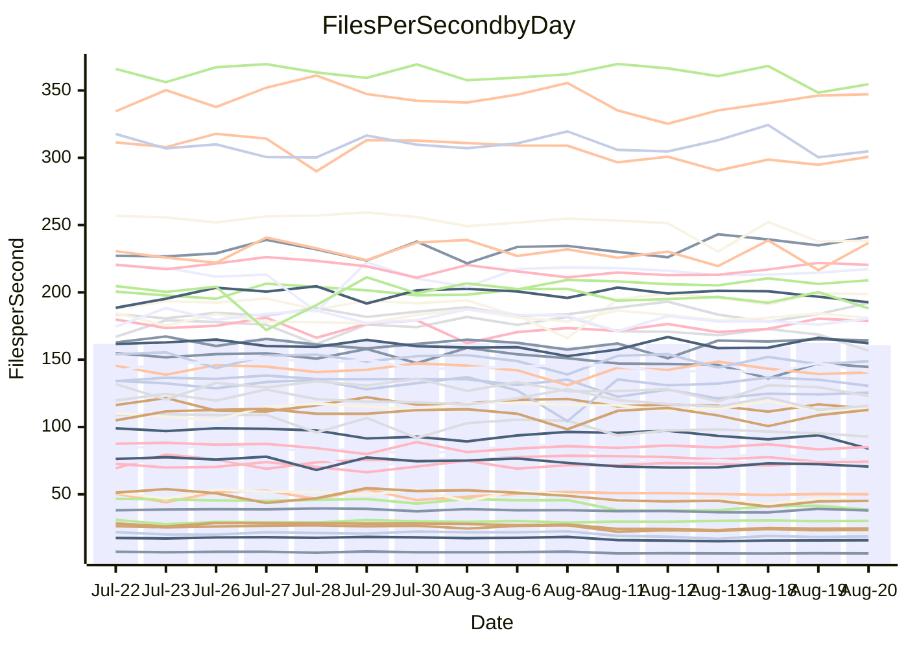

<!---
# This file is auto-generated. Do not edit.
# cspell:disable
--->
# Performance Report

## Daily Performance

## Time to Process Files

| Repository                                      | Elapsed | Min/Avg/Max           |   SD | SD Graph                |
| ----------------------------------------------- | ------: | :-------------------: | ---: | ----------------------- |
| AdaDoom3/AdaDoom3                    |    3.40 | 3.3 /   3.5 /   3.7   | 0.09 | `    ┣━━┻●━╋━━┻━━┫    ` |
| alexiosc/megistos                    |    7.59 | 7.4 /   7.8 /   8.5   | 0.27 | `    ┣━━┻●━╋━━┻━━┫    ` |
| apollographql/apollo-server          |    2.74 | 2.5 /   2.7 /   3.3   | 0.16 | `    ┣━━┻━━╋●━┻━━┫    ` |
| aspnetboilerplate/aspnetboilerplate  |   10.35 | 10.1 /  10.7 /  12.2  | 0.41 | `    ┣━━┻●━╋━━┻━━┫    ` |
| aws-amplify/docs                     |   13.28 | 12.7 /  13.2 /  14.2  | 0.42 | `    ┣━━┻━━●━━┻━━┫    ` |
| Azure/azure-rest-api-specs           |   10.37 | 9.4 /   9.8 /  11.3   | 0.44 | `    ┣━━┻━━╋━━┻●━┫    ` |
| bitjson/typescript-starter           |    1.03 | 0.9 /   1.0 /   1.3   | 0.10 | `     ┣━┻━━╋●━┻━┫     ` |
| caddyserver/caddy                    |    3.75 | 3.6 /   3.8 /   4.1   | 0.15 | `    ┣━━┻━━●━━┻━━┫    ` |
| canada-ca/open-source-logiciel-libre |    1.16 | 0.9 /   1.1 /   1.2   | 0.08 | `     ┣━┻━━╋━━●━┫     ` |
| chef/chef                            |    6.06 | 5.9 /   6.3 /   7.7   | 0.38 | `    ┣━━┻●━╋━━┻━━┫    ` |
| dart-lang/sdk                        |   66.05 | 63.3 /  66.7 /  70.4  | 1.84 | `  ┣━━━┻━━●╋━━━┻━━━┫  ` |
| django/django                        |   15.66 | 14.8 /  15.7 /  16.4  | 0.38 | `    ┣━━┻━━●━━┻━━┫    ` |
| eslint/eslint                        |   11.00 | 10.6 /  11.2 /  12.0  | 0.35 | `    ┣━━┻●━╋━━┻━━┫    ` |
| exonum/exonum                        |    3.61 | 3.4 /   3.6 /   4.0   | 0.15 | `    ┣━━┻━━●━━┻━━┫    ` |
| flutter/samples                      |   17.08 | 16.4 /  17.1 /  18.7  | 0.54 | `   ┣━━━┻━━●━━┻━━━┫   ` |
| gitbucket/gitbucket                  |    3.79 | 3.5 /   3.6 /   3.9   | 0.14 | `    ┣━━┻━━╋━━●━━┫    ` |
| googleapis/google-cloud-cpp          |  137.56 | 135.4 / 142.8 / 155.3 | 4.99 | `  ┣━━━●━━━╋━━━┻━━━┫  ` |
| graphql/express-graphql              |    1.08 | 1.0 /   1.1 /   1.2   | 0.08 | `     ┣━┻━━╋●━┻━┫     ` |
| graphql/graphql-js                   |    2.90 | 2.6 /   2.8 /   3.2   | 0.14 | `    ┣━━┻━━╋━●┻━━┫    ` |
| graphql/graphql-relay-js             |    1.11 | 0.9 /   1.1 /   1.2   | 0.08 | `     ┣━┻━━╋●━┻━┫     ` |
| graphql/graphql-spec                 |    1.00 | 0.9 /   1.0 /   1.1   | 0.07 | `     ┣━┻━━╋━●┻━┫     ` |
| iluwatar/java-design-patterns        |   13.26 | 12.6 /  13.3 /  14.6  | 0.54 | `    ┣━━┻━━●━━┻━━┫    ` |
| ktaranov/sqlserver-kit               |    6.58 | 6.5 /   6.8 /   7.4   | 0.25 | `    ┣━━●━━╋━━┻━━┫    ` |
| liriliri/licia                       |    4.09 | 4.0 /   4.2 /   4.6   | 0.14 | `    ┣━━●━━╋━━┻━━┫    ` |
| MartinThoma/LaTeX-examples           |    7.48 | 6.8 /   7.1 /   7.5   | 0.16 | `    ┣━━┻━━╋━━┻━━┫ ●  ` |
| mdx-js/mdx                           |    1.91 | 1.8 /   1.9 /   2.2   | 0.10 | `     ┣━┻━●╋━━┻━┫     ` |
| microsoft/TypeScript-Website         |    5.55 | 5.5 /   5.8 /   7.3   | 0.35 | `    ┣━━┻●━╋━━┻━━┫    ` |
| MicrosoftDocs/PowerShell-Docs        |   23.57 | 23.3 /  24.6 /  27.5  | 0.95 | `   ┣━━●┻━━╋━━┻━━━┫   ` |
| neovim/nvim-lspconfig                |    4.16 | 4.1 /   4.3 /   4.7   | 0.14 | `    ┣━━●━━╋━━┻━━┫    ` |
| pagekit/pagekit                      |    3.53 | 3.5 /   3.6 /   4.0   | 0.11 | `    ┣━━●━━╋━━┻━━┫    ` |
| php/php-src                          |   27.46 | 25.6 /  26.8 /  29.7  | 1.06 | `   ┣━━━┻━━╋━●┻━━━┫   ` |
| plasticrake/tplink-smarthome-api     |    1.36 | 1.1 /   1.3 /   1.4   | 0.10 | `     ┣━┻━━╋━●┻━┫     ` |
| prettier/prettier                    |    7.43 | 7.0 /   7.4 /   8.1   | 0.22 | `    ┣━━┻━━●━━┻━━┫    ` |
| pycontribs/jira                      |    1.58 | 1.5 /   1.6 /   1.8   | 0.08 | `     ┣━┻━━●━━┻━┫     ` |
| RustPython/RustPython                |    5.42 | 5.0 /   5.3 /   5.8   | 0.22 | `    ┣━━┻━━╋●━┻━━┫    ` |
| shoelace-style/shoelace              |    3.08 | 2.7 /   2.9 /   3.3   | 0.13 | `    ┣━━┻━━╋━━●━━┫    ` |
| slint-ui/slint                       |   12.41 | 11.7 /  12.4 /  14.7  | 0.57 | `    ┣━━┻━━●━━┻━━┫    ` |
| SoftwareBrothers/admin-bro           |    2.62 | 2.4 /   2.6 /   3.0   | 0.12 | `    ┣━━┻━━╋●━┻━━┫    ` |
| sveltejs/svelte                      |   21.70 | 20.8 /  21.4 /  23.0  | 0.48 | `   ┣━━━┻━━╋━●┻━━━┫   ` |
| TheAlgorithms/Python                 |    5.71 | 5.6 /   6.0 /   6.9   | 0.29 | `    ┣━━●━━╋━━┻━━┫    ` |
| twbs/bootstrap                       |    1.51 | 1.3 /   1.5 /   1.6   | 0.08 | `     ┣━┻━━╋●━┻━┫     ` |
| typescript-cheatsheets/react         |    1.38 | 1.3 /   1.4 /   1.5   | 0.05 | `     ┣━┻━●╋━━┻━┫     ` |
| typescript-eslint/typescript-eslint  |    4.22 | 4.0 /   4.2 /   4.5   | 0.13 | `    ┣━━┻━━●━━┻━━┫    ` |
| vitest-dev/vitest                    |    9.24 | 8.9 /   9.5 /  11.1   | 0.47 | `    ┣━━┻●━╋━━┻━━┫    ` |
| w3c/aria-practices                   |    3.42 | 3.2 /   3.4 /   3.8   | 0.13 | `    ┣━━┻━━●━━┻━━┫    ` |
| w3c/specberus                        |    2.22 | 1.9 /   2.0 /   2.6   | 0.16 | `    ┣━━┻━━╋━━●━━┫    ` |
| webdeveric/webpack-assets-manifest   |    1.19 | 1.0 /   1.1 /   1.3   | 0.09 | `     ┣━┻━━╋━●┻━┫     ` |
| webpack/webpack                      |    6.24 | 5.3 /   5.6 /   6.5   | 0.24 | `    ┣━━┻━━╋━━┻━━┫ ●  ` |
| wireapp/wire-desktop                 |    1.18 | 0.9 /   1.0 /   1.3   | 0.10 | `     ┣━┻━━╋━━┻●┫     ` |
| wireapp/wire-webapp                  |   11.20 | 10.8 /  11.3 /  13.3  | 0.50 | `    ┣━━┻━●╋━━┻━━┫    ` |

Note:
- Elapsed time is in seconds.

## Files per Second over Time

| Repository                                      | Files |    Sec |    Fps |     Rel | Trend Fps              |    N |
| ----------------------------------------------- | ----: | -----: | -----: | ------: | ---------------------- | ---: |
| AdaDoom3/AdaDoom3                    |   103 |   3.40 |  30.28 |   1.53% | `▇▇▇█▇█▆▅▇█▇▅██▇██▇██` |   26 |
| alexiosc/megistos                    |   583 |   7.59 |  76.83 |   2.71% | `▆█▇█▇▇▆▆▅█▆▇▄▆▇▅▇▆▇▇` |   26 |
| apollographql/apollo-server          |   252 |   2.74 |  92.04 |  -2.49% | `▆▇▆▇▇▇███▇████▆▆▇▇▂▇` |   26 |
| aspnetboilerplate/aspnetboilerplate  |  2286 |  10.35 | 220.77 |   3.19% | `▆▆▅█▇▆▇▇█▆▇▆█▇▅▆▇▇▇▇` |   26 |
| aws-amplify/docs                     |  2871 |  13.28 | 216.22 |  -0.41% | `▄▇▇█▇▄▆▇▅▇▇▆▄▇▅▇███▇` |   26 |
| Azure/azure-rest-api-specs           |  2443 |  10.37 | 235.49 |  -5.87% | `██▇▇█▇█▇█▇▇▇█▇▃▇█▄▆▅` |   26 |
| bitjson/typescript-starter           |    20 |   1.03 |  19.37 |  -3.31% | `▇█▇▇▇▇█▅▄▅▅▃▄▄▂▅▃▅▄▅` |   26 |
| caddyserver/caddy                    |   285 |   3.75 |  75.93 |  -0.21% | `▅▇▇██▆██▇██▇▇▆▇▇▄█▇▇` |   26 |
| canada-ca/open-source-logiciel-libre |     7 |   1.16 |   6.06 |  -9.26% | `▇▆▆▆▇▇█▄▃▃▄▄▄▄▃▃▃▄▃▃` |   26 |
| chef/chef                            |  1207 |   6.06 | 199.27 |   3.68% | `▇▆▇▂▇▇▃▇▆▇▇█▇▇▇▆▇█▇▇` |   26 |
| dart-lang/sdk                        | 10790 |  66.05 | 163.35 |   1.32% | `▆▅▆▆▄▆▄▆▄▅█▇▇▆▅▆█▇▆▇` |   26 |
| django/django                        |  2852 |  15.66 | 182.09 |  -0.01% | `▆▆▇▆▇▅▅▆▆█▆▆▆▆▄▆▅█▅▆` |   26 |
| eslint/eslint                        |  2090 |  11.00 | 190.00 |   2.25% | `▆▆▇▅▇▅▆▇▆▇▆██▆▅▅▄██▇` |   26 |
| exonum/exonum                        |   421 |   3.61 | 116.72 |   0.25% | `▄█▆▇▆█▇▇▄▆▅▆▇▅▆▅▇▆▅▆` |   26 |
| flutter/samples                      |  2438 |  17.08 | 142.76 |  -0.19% | `▇█▇▅▇█▄▇█▆▆▇▆██▇▆▆▅▇` |   26 |
| gitbucket/gitbucket                  |   413 |   3.79 | 109.11 |  -4.30% | `▅▇████▇█▇▆▅▅█▇▆█▅▆█▅` |   26 |
| googleapis/google-cloud-cpp          | 20603 | 137.56 | 149.78 |   3.72% | `▅▇▇▇▆▇▇█▅█▆▇▄▆▇▆█▇▄█` |   26 |
| graphql/express-graphql              |    26 |   1.08 |  23.97 |  -3.37% | `▇█▆▇███▃▃▄▄▃▅▄▃▅▄▄▄▅` |   26 |
| graphql/graphql-js                   |   364 |   2.90 | 125.38 |  -3.52% | `███▆█▇█▄▆▄▆▆▆▆▃▅▅▅▆▆` |   26 |
| graphql/graphql-relay-js             |    28 |   1.11 |  25.27 |  -3.54% | `███▆▇▇▇▄▄▃▃▄▄▃▃▅▄▄▄▅` |   26 |
| graphql/graphql-spec                 |    16 |   1.00 |  15.97 |  -5.14% | `██▇▆▇██▅▅▅▃▅▅▃▄▄▄▄▄▅` |   26 |
| iluwatar/java-design-patterns        |  1992 |  13.26 | 150.24 |   0.19% | `▇▇▇▇▇▄▄█▆▇▇█▇▅▅▇▆▅▆▆` |   26 |
| ktaranov/sqlserver-kit               |   489 |   6.58 |  74.27 |   3.73% | `▅▇█▆▆▄▆▆▇▆██▆▆█▆▇███` |   26 |
| liriliri/licia                       |  1437 |   4.09 | 351.39 |   3.00% | `█▅▇▆███▆▆▆▆▄▅▆▆▆█▆▇█` |   26 |
| MartinThoma/LaTeX-examples           |  1409 |   7.48 | 188.30 |  -5.74% | `▇▇▇▇▇▇▆██▇█▇▅▇▇▇▇▅▆▄` |   26 |
| mdx-js/mdx                           |   141 |   1.91 |  73.85 |   0.88% | `▇█▇███▇▆▆▅▆▃▆▅▆▇▆▇▄▇` |   26 |
| microsoft/TypeScript-Website         |   761 |   5.55 | 137.22 |   4.84% | `▇▇█▇▆▆▂████▆█▆███▇▆█` |   26 |
| MicrosoftDocs/PowerShell-Docs        |  2708 |  23.57 | 114.88 |   4.22% | `▆█▇▆▆▇▃▇▇▇▇▇█▆▆▄▅▇▇█` |   26 |
| neovim/nvim-lspconfig                |   752 |   4.16 | 180.78 |   3.77% | `██▄▇▄▇▇▅▇▆█▆▇▆▆▆██▇█` |   26 |
| pagekit/pagekit                      |   741 |   3.53 | 209.80 |   3.02% | `▆▅▆▇▅▇███▇▇▇▇▆██▆█▇█` |   26 |
| php/php-src                          |  2281 |  27.46 |  83.07 |  -2.75% | `▇█▅▃▇█▇▇▆▅▇▆█▆▇▇▄▇▇▆` |   26 |
| plasticrake/tplink-smarthome-api     |    62 |   1.36 |  45.71 |  -5.76% | `██▄██▇▆▄▄▃▃▄▄▄▄▃▄▅▃▄` |   26 |
| prettier/prettier                    |  2286 |   7.43 | 307.73 |  -0.30% | `▇▆▆▆▇▇█▇▆▅▆▆▆▆██▄▇▆▆` |   26 |
| pycontribs/jira                      |    79 |   1.58 |  50.08 |   0.25% | `▄▄▅▅█▆▇▆▇▇▇▆█▅█▆▇▆▆▆` |   26 |
| RustPython/RustPython                |   683 |   5.42 | 126.05 |  -2.16% | `██▆█▆█▆▄▇▆▆▆▆▄▃▇▆▇▄▅` |   26 |
| shoelace-style/shoelace              |   439 |   3.08 | 142.46 |  -4.94% | `█▃██▆▆▆▆▅▆▆▅▅▅▅▃▆▆▅▅` |   26 |
| slint-ui/slint                       |  2230 |  12.41 | 179.69 |  -0.14% | `█▆███▇▇▇▃█▇▇█▆▇▇▅█▇▇` |   26 |
| SoftwareBrothers/admin-bro           |   441 |   2.62 | 168.11 |  -2.27% | `▇▇█▆▇██▇▆▇▇▆▇▆▆▇▆▆▃▆` |   26 |
| sveltejs/svelte                      |  7799 |  21.70 | 359.36 |  -0.92% | `▇█▆▆▇▆▇████▆█▆▇█▆▄▅▇` |   26 |
| TheAlgorithms/Python                 |  1390 |   5.71 | 243.35 |   4.71% | `█▆▅▆▆▇▇▇█▃▇▆▃█▇▇▆▇▇█` |   26 |
| twbs/bootstrap                       |   118 |   1.51 |  78.19 |  -3.19% | `▆▄▇█▅██▄▅▅▅▃▃▄▄▆▄▄▃▅` |   26 |
| typescript-cheatsheets/react         |    53 |   1.38 |  38.52 |   1.16% | `▄█▇▅█▇▇▆▇▅▇▇▅▅▆▅██▆▇` |   26 |
| typescript-eslint/typescript-eslint  |  1279 |   4.22 | 303.39 |  -0.21% | `████▇▇▇▅▆▇▇▆▆▄▆▆▇▅▆▇` |   26 |
| vitest-dev/vitest                    |  2193 |   9.24 | 237.45 |   3.95% | `███▅▇█▇▆▇▇▆██▆▅█▃███` |   26 |
| w3c/aria-practices                   |   409 |   3.42 | 119.62 |   0.41% | `▄▇▅▆▆▇█▆▆▆▅▅▆▅▅▇▃▅▄▆` |   26 |
| w3c/specberus                        |   198 |   2.22 |  89.21 | -11.10% | `█▂▇██▇█▆▅▅▆▆▆▆▆▆▅▆▆▄` |   26 |
| webdeveric/webpack-assets-manifest   |    54 |   1.19 |  45.38 |  -5.46% | `████▇▇▆▄▅▅▅▄▄▄▅▂▅▄▄▅` |   26 |
| webpack/webpack                      |  1111 |   6.24 | 178.01 | -10.20% | `▆███▆█▇▇▅▇▇▆▆▇▆▆▇▇▇▄` |   26 |
| wireapp/wire-desktop                 |    43 |   1.18 |  36.36 | -14.52% | `▄██▇█▇▇▃▄▆▅▅▂▅▄▅▆▆▅▃` |   26 |
| wireapp/wire-webapp                  |  1828 |  11.20 | 163.26 |   1.17% | `▇▇▇█▇▆▆█▆▇▇▅▃▇█▇█▇█▇` |   26 |

## Data Throughput

| Repository                                      | Files |    Sec |     Kps |     Rel | Trend Kps              |    N |
| ----------------------------------------------- | ----: | -----: | ------: | ------: | ---------------------- | ---: |
| AdaDoom3/AdaDoom3                    |   103 |   3.40 |  643.58 |   1.53% | `▇▇▇█▇█▆▅▇█▇▅██▇██▇██` |   26 |
| alexiosc/megistos                    |   583 |   7.59 |  603.67 |   2.71% | `▆█▇█▇▇▆▆▅█▆▇▄▆▇▅▇▆▇▇` |   26 |
| apollographql/apollo-server          |   252 |   2.74 |  740.31 |  -2.49% | `▆▇▆▇▇▇███▇████▆▆▇▇▂▇` |   26 |
| aspnetboilerplate/aspnetboilerplate  |  2286 |  10.35 |  537.06 |   3.95% | `▆▆▆█▇▇▇██▆▇▆██▆▇▇▇▇█` |   26 |
| aws-amplify/docs                     |  2871 |  13.28 |  754.99 |  -0.34% | `▄▇▇█▇▄▆▇▅▇▇▆▄▇▅▇███▇` |   26 |
| Azure/azure-rest-api-specs           |  2443 |  10.37 |  626.46 |  -5.99% | `██▇▇▇▇█▇█▇▇▇█▆▃▇█▄▆▅` |   26 |
| bitjson/typescript-starter           |    20 |   1.03 |   77.50 |  -3.31% | `▇█▇▇▇▇█▅▄▅▅▃▄▄▂▅▃▅▄▅` |   26 |
| caddyserver/caddy                    |   285 |   3.75 |  647.44 |  -0.03% | `▅▇▇██▆██▇██▇▇▇▇▇▄█▇▇` |   26 |
| canada-ca/open-source-logiciel-libre |     7 |   1.16 |   50.21 |  -9.26% | `▇▆▆▆▇▇█▄▃▃▄▄▄▄▃▃▃▄▃▃` |   26 |
| chef/chef                            |  1207 |   6.06 |  920.22 |   3.73% | `▇▆▇▂▇▇▃▇▆▇▇█▇▇▇▆▇█▇▇` |   26 |
| dart-lang/sdk                        | 10790 |  66.05 | 1101.71 |   0.88% | `▇▅▆▆▄▇▄▆▄▅█▇▇▆▅▅█▇▆▆` |   26 |
| django/django                        |  2852 |  15.66 | 1141.87 |   0.27% | `▆▆▇▆▇▅▅▆▆█▆▆▆▆▄▆▅█▆▆` |   26 |
| eslint/eslint                        |  2090 |  11.00 | 1380.47 |   2.34% | `▆▆▇▅▇▅▆▇▆▇▆██▆▅▅▄██▇` |   26 |
| exonum/exonum                        |   421 |   3.61 | 1116.43 |   0.25% | `▄█▆▇▆█▇▇▄▆▅▆▇▅▆▅▇▆▅▆` |   26 |
| flutter/samples                      |  2438 |  17.08 | 1262.09 |   0.32% | `▇█▇▅▇█▄▇█▆▆▇▆██▇▆▆▆▇` |   26 |
| gitbucket/gitbucket                  |   413 |   3.79 |  495.90 |  -4.15% | `▅▇████▇█▇▆▅▅█▇▆█▅▆█▅` |   26 |
| googleapis/google-cloud-cpp          | 20603 | 137.56 | 1208.83 |   4.01% | `▅▇▆▇▆▇▇█▅█▆▇▄▆▇▆█▇▄█` |   26 |
| graphql/express-graphql              |    26 |   1.08 |  109.70 |  -3.37% | `▇█▆▇███▃▃▄▄▃▅▄▃▅▄▄▄▅` |   26 |
| graphql/graphql-js                   |   364 |   2.90 |  720.62 |  -3.52% | `███▆█▇█▄▆▄▆▆▆▆▃▅▅▅▆▆` |   26 |
| graphql/graphql-relay-js             |    28 |   1.11 |   99.27 |  -3.54% | `███▆▇▇▇▄▄▃▃▄▄▃▃▅▄▄▄▅` |   26 |
| graphql/graphql-spec                 |    16 |   1.00 |  578.94 |  -5.14% | `██▇▆▇██▅▅▅▃▅▅▃▄▄▄▄▄▅` |   26 |
| iluwatar/java-design-patterns        |  1992 |  13.26 |  464.37 |   0.19% | `▇▇▇▇▇▄▄█▆▇▇█▇▅▅▇▆▅▆▆` |   26 |
| ktaranov/sqlserver-kit               |   489 |   6.58 | 1124.23 |   3.73% | `▅▇█▆▆▄▆▆▇▆██▆▆█▆▇███` |   26 |
| liriliri/licia                       |  1437 |   4.09 |  418.63 |   3.00% | `█▅▇▆███▆▆▆▆▄▅▆▆▆█▆▇█` |   26 |
| MartinThoma/LaTeX-examples           |  1409 |   7.48 |  388.89 |  -5.74% | `▇▇▇▇▇▇▆██▇█▇▅▇▇▇▇▅▆▄` |   26 |
| mdx-js/mdx                           |   141 |   1.91 |  343.57 |   0.97% | `▇█▇███▇▆▆▅▆▃▆▅▆▇▆▇▄▇` |   26 |
| microsoft/TypeScript-Website         |   761 |   5.55 |  949.03 |   4.92% | `▇▇█▇▆▆▂████▆█▆███▇▆█` |   26 |
| MicrosoftDocs/PowerShell-Docs        |  2708 |  23.57 | 1180.78 |   4.23% | `▆█▇▆▆▇▃▇▇▇▇▇█▆▆▄▅▇▇█` |   26 |
| neovim/nvim-lspconfig                |   752 |   4.16 |  294.24 |   4.70% | `▇▇▄▇▄▇▆▅▇▆█▆▇▆▆▆██▇█` |   26 |
| pagekit/pagekit                      |   741 |   3.53 |  437.44 |   3.02% | `▆▅▆▇▅▇███▇▇▇▇▆██▆█▇█` |   26 |
| php/php-src                          |  2281 |  27.46 | 1446.08 |  -2.52% | `▇█▅▃▇█▇▇▇▆▇▆█▆▇▇▄█▇▆` |   26 |
| plasticrake/tplink-smarthome-api     |    62 |   1.36 |  246.97 |  -5.76% | `██▄██▇▆▄▄▃▃▄▄▄▄▃▄▅▃▄` |   26 |
| prettier/prettier                    |  2286 |   7.43 |  436.56 |  -0.38% | `▇▆▆▆▇▇█▇▆▅▆▆▆▆██▄▇▆▆` |   26 |
| pycontribs/jira                      |    79 |   1.58 |  355.03 |   0.12% | `▄▄▅▅█▆▇▆▇▇▇▆█▅█▆▇▆▆▆` |   26 |
| RustPython/RustPython                |   683 |   5.42 |  988.87 |  -2.17% | `██▆█▆█▆▄▇▆▆▆▆▄▃▇▆▇▄▅` |   26 |
| shoelace-style/shoelace              |   439 |   3.08 |  688.28 |  -4.94% | `█▃██▆▆▆▆▅▆▆▅▅▅▅▃▆▆▅▅` |   26 |
| slint-ui/slint                       |  2230 |  12.41 | 1169.98 |  -0.07% | `█▆███▇█▇▃█▇▇█▇▇▇▅█▇▇` |   26 |
| SoftwareBrothers/admin-bro           |   441 |   2.62 |  370.53 |  -2.27% | `▇▇█▆▇██▇▆▇▇▆▇▆▆▇▆▆▃▆` |   26 |
| sveltejs/svelte                      |  7799 |  21.70 |  240.57 |  -0.95% | `▇█▆▆▇▆▇████▆█▆▇█▆▄▅▇` |   26 |
| TheAlgorithms/Python                 |  1390 |   5.71 |  617.65 |   4.71% | `█▆▅▆▆▇▇▇█▃▇▆▃█▇▇▆▇▇█` |   26 |
| twbs/bootstrap                       |   118 |   1.51 |  642.08 |  -3.19% | `▆▄▇█▅██▄▅▅▅▃▃▄▄▆▄▄▃▅` |   26 |
| typescript-cheatsheets/react         |    53 |   1.38 |  281.29 |   1.16% | `▄█▇▅█▇▇▆▇▅▇▇▅▅▆▅██▆▇` |   26 |
| typescript-eslint/typescript-eslint  |  1279 |   4.22 | 1545.17 |  -0.36% | `████▇▇▇▅▆▇▇▆▆▄▆▆▆▅▆▇` |   26 |
| vitest-dev/vitest                    |  2193 |   9.24 |  533.47 |   5.07% | `▇▇█▅▇█▇▆▇▇▆██▆▅█▃███` |   26 |
| w3c/aria-practices                   |   409 |   3.42 | 1113.16 |   0.44% | `▄▇▅▆▆▇█▆▆▆▅▅▆▅▅▇▃▅▄▆` |   26 |
| w3c/specberus                        |   198 |   2.22 |  280.26 | -10.41% | `█▂▇██▇█▆▅▅▆▆▆▆▆▆▅▇▆▅` |   26 |
| webdeveric/webpack-assets-manifest   |    54 |   1.19 |  106.73 |  -5.16% | `████▇▇▆▄▅▅▅▄▄▄▅▂▅▄▄▅` |   26 |
| webpack/webpack                      |  1111 |   6.24 |  807.55 | -10.01% | `▆███▆█▇▇▅▇▇▆▆▇▆▆▇▇▇▄` |   26 |
| wireapp/wire-desktop                 |    43 |   1.18 |  160.67 | -14.52% | `▄██▇█▇▇▃▄▆▅▅▂▅▄▅▆▆▅▃` |   26 |
| wireapp/wire-webapp                  |  1828 |  11.20 |  583.57 |   1.38% | `▇▇██▇▆▆█▆▇▇▅▃▇█▇█▇█▇` |   26 |

