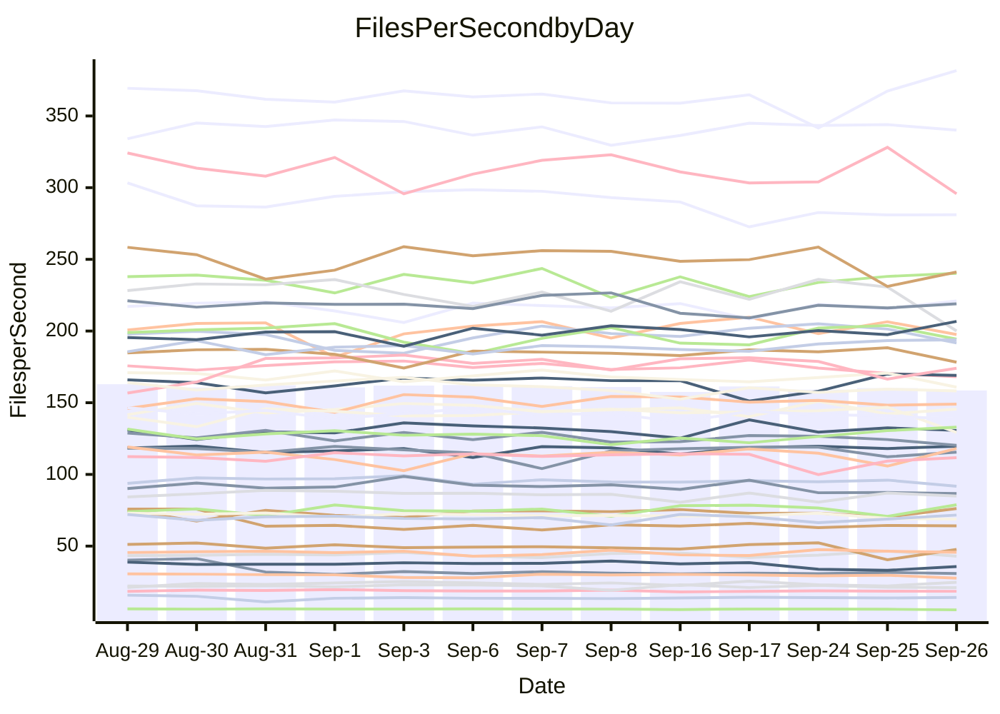

<!---
# This file is auto-generated. Do not edit.
# cspell:disable
--->
# Performance Report

## Daily Performance

## Time to Process Files

| Repository                                      | Elapsed | Min/Avg/Max           |   SD | SD Graph                |
| ----------------------------------------------- | ------: | :-------------------: | ---: | ----------------------- |
| AdaDoom3/AdaDoom3                    |    3.73 | 3.4 /   3.5 /   4.5   | 0.25 | `    ┣━━┻━━╋━━●━━┫    ` |
| alexiosc/megistos                    |    7.65 | 7.5 /   8.0 /   9.4   | 0.46 | `    ┣━━●━━╋━━┻━━┫    ` |
| apollographql/apollo-server          |    2.91 | 2.6 /   2.7 /   2.9   | 0.11 | `    ┣━━┻━━╋━━┻●━┫    ` |
| aspnetboilerplate/aspnetboilerplate  |   10.34 | 10.2 /  10.5 /  11.1  | 0.22 | `    ┣━━●━━╋━━┻━━┫    ` |
| aws-amplify/docs                     |   13.11 | 12.5 /  13.2 /  14.2  | 0.42 | `    ┣━━┻━●╋━━┻━━┫    ` |
| Azure/azure-rest-api-specs           |   10.20 | 9.4 /   9.8 /  10.6   | 0.35 | `    ┣━━┻━━╋━━┻●━┫    ` |
| bitjson/typescript-starter           |    1.08 | 1.0 /   1.1 /   1.1   | 0.03 | `     ┣━━┻━╋━●━━┫     ` |
| caddyserver/caddy                    |    3.63 | 3.6 /   3.8 /   4.3   | 0.17 | `    ┣━━●━━╋━━┻━━┫    ` |
| canada-ca/open-source-logiciel-libre |    1.26 | 1.1 /   1.2 /   1.3   | 0.04 | `     ┣━┻━━╋━━┻━┫ ●   ` |
| chef/chef                            |    5.84 | 5.9 /   6.1 /   6.6   | 0.18 | `    ┣━●┻━━╋━━┻━━┫    ` |
| dart-lang/sdk                        |   66.75 | 64.5 /  67.3 /  73.0  | 1.93 | `  ┣━━━┻━━●╋━━━┻━━━┫  ` |
| django/django                        |   16.12 | 14.9 /  15.4 /  16.4  | 0.33 | `    ┣━━┻━━╋━━┻━━●    ` |
| eslint/eslint                        |   10.80 | 10.7 /  11.1 /  11.9  | 0.30 | `    ┣━━●━━╋━━┻━━┫    ` |
| exonum/exonum                        |    3.57 | 3.5 /   3.7 /   4.1   | 0.14 | `    ┣━━●━━╋━━┻━━┫    ` |
| flutter/samples                      |   18.56 | 16.3 /  17.0 /  19.7  | 0.72 | `   ┣━━━┻━━╋━━┻━━━●   ` |
| gitbucket/gitbucket                  |    3.57 | 3.5 /   3.6 /   4.0   | 0.16 | `    ┣━━┻━━●━━┻━━┫    ` |
| googleapis/google-cloud-cpp          |  150.01 | 139.0 / 145.5 / 163.3 | 5.26 | `  ┣━━━┻━━━╋━━━●━━━┫  ` |
| graphql/express-graphql              |    1.24 | 1.1 /   1.2 /   1.4   | 0.06 | `     ┣━┻━━╋━━●━┫     ` |
| graphql/graphql-js                   |    3.03 | 2.7 /   2.9 /   3.1   | 0.09 | `     ┣━┻━━╋━━┻●┫     ` |
| graphql/graphql-relay-js             |    1.13 | 1.1 /   1.2 /   1.3   | 0.07 | `     ┣━┻●━╋━━┻━┫     ` |
| graphql/graphql-spec                 |    1.34 | 1.0 /   1.3 /   1.5   | 0.14 | `     ┣━┻━━╋●━┻━┫     ` |
| iluwatar/java-design-patterns        |   13.37 | 12.8 /  13.2 /  13.9  | 0.34 | `    ┣━━┻━━╋━●┻━━┫    ` |
| ktaranov/sqlserver-kit               |    7.11 | 6.6 /   6.8 /   7.1   | 0.16 | `    ┣━━┻━━╋━━┻━●┫    ` |
| liriliri/licia                       |    4.23 | 4.1 /   4.2 /   4.4   | 0.08 | `    ┣━━┻━━●━━┻━━┫    ` |
| MartinThoma/LaTeX-examples           |    7.25 | 6.9 /   7.2 /   7.8   | 0.27 | `    ┣━━┻━━╋●━┻━━┫    ` |
| mdx-js/mdx                           |    1.97 | 1.9 /   2.0 /   2.2   | 0.07 | `     ┣━●━━╋━━┻━┫     ` |
| microsoft/TypeScript-Website         |    5.82 | 5.5 /   5.9 /   6.5   | 0.29 | `    ┣━━┻━━●━━┻━━┫    ` |
| MicrosoftDocs/PowerShell-Docs        |   24.25 | 23.3 /  24.2 /  27.1  | 0.85 | `   ┣━━━┻━━●━━┻━━━┫   ` |
| neovim/nvim-lspconfig                |    4.52 | 4.2 /   4.3 /   4.5   | 0.08 | `    ┣━━┻━━╋━━┻━━┫●   ` |
| pagekit/pagekit                      |    3.75 | 3.5 /   3.7 /   4.1   | 0.13 | `    ┣━━┻━━╋━●┻━━┫    ` |
| php/php-src                          |   27.05 | 25.3 /  26.7 /  29.3  | 0.98 | `   ┣━━━┻━━╋●━┻━━━┫   ` |
| plasticrake/tplink-smarthome-api     |    1.36 | 1.3 /   1.4 /   1.6   | 0.07 | `     ┣━┻━●╋━━┻━┫     ` |
| prettier/prettier                    |    7.79 | 7.0 /   7.3 /   7.9   | 0.25 | `    ┣━━┻━━╋━━┻━●┫    ` |
| pycontribs/jira                      |    1.66 | 1.5 /   1.6 /   2.0   | 0.11 | `     ┣━┻━━╋●━┻━┫     ` |
| RustPython/RustPython                |    5.17 | 5.2 /   5.4 /   5.7   | 0.15 | `    ┣●━┻━━╋━━┻━━┫    ` |
| shoelace-style/shoelace              |    3.02 | 2.9 /   3.0 /   3.1   | 0.07 | `     ┣━┻━━●━━┻━┫     ` |
| slint-ui/slint                       |   13.00 | 12.2 /  12.9 /  15.5  | 0.80 | `   ┣━━━┻━━╋●━┻━━━┫   ` |
| SoftwareBrothers/admin-bro           |    2.74 | 2.5 /   2.6 /   2.8   | 0.06 | `     ┣━┻━━╋━━┻━┫●    ` |
| sveltejs/svelte                      |   20.75 | 20.2 /  21.6 /  23.2  | 0.56 | `   ┣━●━┻━━╋━━┻━━━┫   ` |
| TheAlgorithms/Python                 |    5.81 | 5.7 /   5.9 /   6.3   | 0.19 | `    ┣━━┻●━╋━━┻━━┫    ` |
| twbs/bootstrap                       |    1.84 | 1.5 /   1.8 /   2.0   | 0.14 | `     ┣━┻━━╋●━┻━┫     ` |
| typescript-cheatsheets/react         |    1.48 | 1.3 /   1.4 /   1.6   | 0.07 | `     ┣━┻━━╋━●┻━┫     ` |
| typescript-eslint/typescript-eslint  |    4.55 | 4.2 /   4.4 /   4.7   | 0.15 | `    ┣━━┻━━╋━━●━━┫    ` |
| vitest-dev/vitest                    |   11.07 | 9.2 /   9.7 /  12.0   | 0.62 | `    ┣━━┻━━╋━━┻━━┫●   ` |
| w3c/aria-practices                   |    3.46 | 3.4 /   3.5 /   3.8   | 0.10 | `    ┣━━┻━●╋━━┻━━┫    ` |
| w3c/specberus                        |    2.16 | 2.0 /   2.1 /   2.2   | 0.04 | `     ┣━┻━━╋━━┻━●     ` |
| webdeveric/webpack-assets-manifest   |    1.26 | 1.2 /   1.2 /   1.3   | 0.04 | `     ┣━┻━━╋●━┻━┫     ` |
| webpack/webpack                      |    5.84 | 5.3 /   5.6 /   6.1   | 0.17 | `    ┣━━┻━━╋━━●━━┫    ` |
| wireapp/wire-desktop                 |    1.39 | 1.0 /   1.3 /   1.4   | 0.14 | `     ┣━┻━━╋━●┻━┫     ` |
| wireapp/wire-webapp                  |   10.85 | 10.8 /  11.2 /  12.1  | 0.37 | `    ┣━━●━━╋━━┻━━┫    ` |

Note:
- Elapsed time is in seconds.

## Files per Second over Time

| Repository                                      | Files |    Sec |    Fps |     Rel | Trend Fps              |    N |
| ----------------------------------------------- | ----: | -----: | -----: | ------: | ---------------------- | ---: |
| AdaDoom3/AdaDoom3                    |   103 |   3.73 |  27.61 |  -6.98% | `███████▆█▂███▇███▇▇▆` |   19 |
| alexiosc/megistos                    |   583 |   7.65 |  76.23 |   4.80% | `▇█▃▃▇█▆▆▇▇▇▇▇▇█▇▇▇▆█` |   19 |
| apollographql/apollo-server          |   252 |   2.91 |  86.71 |  -5.63% | `▅▇▄█▆▅▅█▆▆▅▄▇▆▄▅▇▄▄▄` |   19 |
| aspnetboilerplate/aspnetboilerplate  |  2286 |  10.34 | 221.05 |   1.76% | `▇▇▇█▇▇▆▅▇▇█▇▇▆▆█▅▇▆▇` |   19 |
| aws-amplify/docs                     |  2871 |  13.11 | 219.02 |   0.54% | `▇▆▆▇▅█▆▆▇▄▇▇▇█▅▆▅▆▆▆` |   19 |
| Azure/azure-rest-api-specs           |  2459 |  10.20 | 241.17 |  -3.61% | `█▇█▇▅▄▆█▇▇▇████▆▇█▄▅` |   19 |
| bitjson/typescript-starter           |    20 |   1.08 |  18.50 |  -1.69% | `▆█▇▇▇▇█▆▆▆▆▆▆▇▄▆▆▆▆▆` |   19 |
| caddyserver/caddy                    |   286 |   3.63 |  78.83 |   5.08% | `▆█▆▆▇▃█▆▆▆▇▆█▅███▇▅█` |   19 |
| canada-ca/open-source-logiciel-libre |     7 |   1.26 |   5.55 |  -8.76% | `█▇▇▆█▇▇▇█▇██▇▇▇▃▇▇▆▄` |   19 |
| chef/chef                            |  1208 |   5.84 | 206.75 |   4.35% | `▆▇▇▄▆▇▇▅█▇▇█▅█▇▇▆▇▆█` |   19 |
| dart-lang/sdk                        | 10560 |  66.75 | 158.19 |  -1.40% | `▇▇▅▇▇▇██▇▆█▆▇▆▆▄▇▆▆▆` |   19 |
| django/django                        |  2874 |  16.12 | 178.27 |  -3.71% | `▇▇▇█▇▇▆▄▆▇██▆▇▆▆▇▇▇▅` |   19 |
| eslint/eslint                        |  2093 |  10.80 | 193.85 |   2.99% | `▆▇▇█▄▇▇▇▄▆▇▇▆▇▅▇▆▇██` |   19 |
| exonum/exonum                        |   421 |   3.57 | 118.06 |   4.14% | `█▇▅▇▇█▆▃▇▆▇▇▆▇▇▆█▇▄█` |   19 |
| flutter/samples                      |  2400 |  18.56 | 129.29 |  -8.78% | `▇▆▃▇███▇▆█▇▇██▇█▇██▄` |   19 |
| gitbucket/gitbucket                  |   413 |   3.57 | 115.57 |   0.03% | `████▇▇█▇█▅█▄▄▇█▇██▆▇` |   19 |
| googleapis/google-cloud-cpp          | 20764 | 150.01 | 138.42 |  -2.87% | `██▅▇▇▇▆▇█▆█▇▆▇▃▇▇▆▆▆` |   19 |
| graphql/express-graphql              |    26 |   1.24 |  21.03 |  -5.10% | `▆▇▄▆▆▇▆▇▇▇▇▆▇▃▆█▅▇▅▅` |   19 |
| graphql/graphql-js                   |   364 |   3.03 | 120.24 |  -4.71% | `▇▅▆▇█▆▅▇▄▆▇█▆▅▅▅▆▆▆▅` |   19 |
| graphql/graphql-relay-js             |    28 |   1.13 |  24.76 |   4.75% | `▃▆▆▇▃█▇█▇▆█▆▅▇▃▆█▅▄▇` |   19 |
| graphql/graphql-spec                 |    19 |   1.34 |  14.19 |   2.89% | `█▅██▂▂▅▆▄▆▆▅▅▅▆▅▆▆▆▆` |   19 |
| iluwatar/java-design-patterns        |  1992 |  13.37 | 149.00 |  -1.50% | `▅▇█▇█▆▅█▇██▅▇█▇█▇▇▆▆` |   19 |
| ktaranov/sqlserver-kit               |   489 |   7.11 |  68.79 |  -4.15% | `▇█▅▇█▆▅▇▅▇█▇▅▆▆▆▆▇▅▅` |   19 |
| liriliri/licia                       |  1437 |   4.23 | 340.10 |  -0.24% | `▆██▇█▇██▇▇▆▇█▆▅██▇█▇` |   19 |
| MartinThoma/LaTeX-examples           |  1409 |   7.25 | 194.31 |  -0.94% | `▇██▆▇██▆▄▄▅▆▇█▆▅▅██▆` |   19 |
| mdx-js/mdx                           |   141 |   1.97 |  71.66 |   3.26% | `▇▅▆▄█▅▆▆▆▆▅▆▆▄▆█▆▄▆▇` |   19 |
| microsoft/TypeScript-Website         |   761 |   5.82 | 130.66 |   0.30% | `▆▇▅▃▇▅▆██▇▇▇▇▆▇▃█▆▇▆` |   19 |
| MicrosoftDocs/PowerShell-Docs        |  2708 |  24.25 | 111.69 |  -0.29% | `▇▆▇▇▅▇█▇▇██▆█▇█▇▇▃▆▇` |   19 |
| neovim/nvim-lspconfig                |   760 |   4.52 | 168.21 |  -3.97% | `▇▇▆▅▆███▇▅█▇█▆▇▇█▇▆▅` |   19 |
| pagekit/pagekit                      |   741 |   3.75 | 197.56 |  -2.54% | `▇█▆██▇▃▆▇█▇█▇▆█▇█▆▇▆` |   19 |
| php/php-src                          |  2296 |  27.05 |  84.89 |  -1.10% | `▆█▆▆█▇▇▇▇▆█▇▆▇▅▄▇▄▇▆` |   19 |
| plasticrake/tplink-smarthome-api     |    62 |   1.36 |  45.71 |   1.26% | `▇▇█▇▇▇▇▇▃▆▆▆▆██▄▅█▇▇` |   19 |
| prettier/prettier                    |  2305 |   7.79 | 295.79 |  -5.46% | `█▆█▆▇▅▇▄▆▄█▆██▆▆▅▅█▄` |   19 |
| pycontribs/jira                      |    79 |   1.66 |  47.66 |  -3.73% | `▇██▇▇▅▇▆▇▇▅▅█▆▆▆▇█▂▆` |   19 |
| RustPython/RustPython                |   687 |   5.17 | 133.00 |   4.89% | `█▄▇▆▆▇▇▆▇▇▇▇▆▄▅▇▅▆▇█` |   19 |
| shoelace-style/shoelace              |   439 |   3.02 | 145.53 |  -0.32% | `▅██▇▆▅▆██▆█▇▅▆▇▇▅█▅▆` |   19 |
| slint-ui/slint                       |  2263 |  13.00 | 174.08 |  -0.67% | `▄▆▇▃█████▇▇▇█▇▇██▇▆▇` |   19 |
| SoftwareBrothers/admin-bro           |   441 |   2.74 | 160.85 |  -4.67% | `▇▇█▇▇▅█▆▇▇▇▇█▇▅▇▆▆▇▅` |   19 |
| sveltejs/svelte                      |  7920 |  20.75 | 381.65 |   5.19% | `▇█▆▅▆▅▆▆▇▆▅▆▆▆▆▅▆▄▆█` |   19 |
| TheAlgorithms/Python                 |  1396 |   5.81 | 240.23 |   1.99% | `▇▇█▆▅█▅▇▅█▅██▄▇▇▄▆▇▇` |   19 |
| twbs/bootstrap                       |   118 |   1.84 |  64.12 |  -3.24% | `▇██▅▃▄▄▃▃▄▄▄▂▄▃▄▄▃▄▄` |   19 |
| typescript-cheatsheets/react         |    53 |   1.48 |  35.78 |  -4.34% | `▇▇▅▇▇▅▆▇▇▇▇█▆█▇▆▇▄▃▅` |   19 |
| typescript-eslint/typescript-eslint  |  1279 |   4.55 | 281.08 |  -3.41% | `█▆▅▇▄█▇▇▇█▇▇▇▇▅▇▄▅▅▅` |   19 |
| vitest-dev/vitest                    |  2215 |  11.07 | 200.06 | -12.21% | `▇██▇▇██▇▇▂█▆█▅▇█▆█▇▄` |   19 |
| w3c/aria-practices                   |   414 |   3.46 | 119.66 |   2.39% | `▇▇██▅▇▆▇▄▆▄▇█▇▅▆▇▇▇▇` |   19 |
| w3c/specberus                        |   198 |   2.16 |  91.77 |  -4.14% | `▅▇▆█▆▇▇█▆▆▄▆▇▆▆▆▆▆▆▅` |   19 |
| webdeveric/webpack-assets-manifest   |    54 |   1.26 |  42.98 |  -1.94% | `▆▇▅▄▇▆▆▇▇▅▄▄▄▇▇▇▅▆█▅` |   19 |
| webpack/webpack                      |  1119 |   5.84 | 191.68 |  -3.02% | `▆▇▆▆▇▅▄▄▆▅▆▆█▆▆▅▇▇▇▅` |   19 |
| wireapp/wire-desktop                 |    43 |   1.39 |  30.87 |  -7.36% | `▇██▇▃▃▂▃▂▂▃▃▃▃▂▂▃▂▃▂` |   19 |
| wireapp/wire-webapp                  |  1835 |  10.85 | 169.06 |   3.35% | `▇██▅▅▅▆▇▇▇▇▇█▇▇▇▄▅██` |   19 |

## Data Throughput

| Repository                                      | Files |    Sec |     Kps |     Rel | Trend Kps              |    N |
| ----------------------------------------------- | ----: | -----: | ------: | ------: | ---------------------- | ---: |
| AdaDoom3/AdaDoom3                    |   103 |   3.73 |  586.83 |  -6.98% | `███████▆█▂███▇███▇▇▆` |   19 |
| alexiosc/megistos                    |   583 |   7.65 |  598.99 |   4.80% | `▇█▃▃▇█▆▆▇▇▇▇▇▇█▇▇▇▆█` |   19 |
| apollographql/apollo-server          |   252 |   2.91 |  697.49 |  -5.63% | `▅▇▄█▆▅▅█▆▆▅▄▇▆▄▅▇▄▄▄` |   19 |
| aspnetboilerplate/aspnetboilerplate  |  2286 |  10.34 |  537.82 |   1.76% | `▇▇▇█▇▇▆▅▇▇█▇▇▆▆█▅▇▆▇` |   19 |
| aws-amplify/docs                     |  2871 |  13.11 |  764.79 |   0.54% | `▇▆▆▇▅█▆▆▇▄▇▇▇█▅▆▅▆▆▆` |   19 |
| Azure/azure-rest-api-specs           |  2459 |  10.20 |  635.84 |  -3.96% | `█▇█▇▅▄▆█▇█▇██▇▇▅▆█▄▅` |   19 |
| bitjson/typescript-starter           |    20 |   1.08 |   73.99 |  -1.69% | `▆█▇▇▇▇█▆▆▆▆▆▆▇▄▆▆▆▆▆` |   19 |
| caddyserver/caddy                    |   286 |   3.63 |  672.80 |   5.03% | `▆█▆▆▇▃█▆▆▆▇▆█▅███▇▅█` |   19 |
| canada-ca/open-source-logiciel-libre |     7 |   1.26 |   46.02 |  -8.76% | `█▇▇▆█▇▇▇█▇██▇▇▇▃▇▇▆▄` |   19 |
| chef/chef                            |  1208 |   5.84 |  954.87 |   4.33% | `▆▇▇▄▆▇▇▅█▇▇█▅█▇▇▆▇▆█` |   19 |
| dart-lang/sdk                        | 10560 |  66.75 | 1086.46 |  -0.31% | `▇▇▅▆▇▇██▇▆█▆▇▆▆▄▇▆▇▆` |   19 |
| django/django                        |  2874 |  16.12 | 1116.64 |  -3.81% | `▇▇▇█▇▇▆▄▆▇██▆▇▇▆▇▇▇▅` |   19 |
| eslint/eslint                        |  2093 |  10.80 | 1392.69 |   2.13% | `▆▇▇█▄▇▇▇▄▆▇▇▆▇▅▇▆▇▇▇` |   19 |
| exonum/exonum                        |   421 |   3.57 | 1129.33 |   4.14% | `█▇▅▇▇█▆▃▇▆▇▇▆▇▇▆█▇▄█` |   19 |
| flutter/samples                      |  2400 |  18.56 | 1153.79 |  -8.78% | `▇▆▃▇███▇▆█▇▇██▇█▇██▄` |   19 |
| gitbucket/gitbucket                  |   413 |   3.57 |  525.26 |   0.03% | `████▇▇█▇█▅█▄▄▇█▇██▆▇` |   19 |
| googleapis/google-cloud-cpp          | 20764 | 150.01 | 1122.83 |  -2.61% | `██▅▇▇▇▆▇█▆█▇▆▇▃█▇▇▆▆` |   19 |
| graphql/express-graphql              |    26 |   1.24 |   96.24 |  -5.10% | `▆▇▄▆▆▇▆▇▇▇▇▆▇▃▆█▅▇▅▅` |   19 |
| graphql/graphql-js                   |   364 |   3.03 |  691.07 |  -4.71% | `▇▅▆▇█▆▅▇▄▆▇█▆▅▅▅▆▆▆▅` |   19 |
| graphql/graphql-relay-js             |    28 |   1.13 |   97.28 |   4.75% | `▃▆▆▇▃█▇█▇▆█▆▅▇▃▆█▅▄▇` |   19 |
| graphql/graphql-spec                 |    19 |   1.34 |  473.38 |   0.91% | `█▅██▂▂▄▄▃▄▄▄▃▄▅▄▅▄▄▅` |   19 |
| iluwatar/java-design-patterns        |  1992 |  13.37 |  460.52 |  -1.50% | `▅▇█▇█▆▅█▇██▅▇█▇█▇▇▆▆` |   19 |
| ktaranov/sqlserver-kit               |   489 |   7.11 | 1041.60 |  -4.14% | `▇█▅▇█▆▅▇▅▇█▇▅▆▆▆▆▇▅▅` |   19 |
| liriliri/licia                       |  1437 |   4.23 |  405.19 |  -0.24% | `▆██▇█▇██▇▇▆▇█▆▅██▇█▇` |   19 |
| MartinThoma/LaTeX-examples           |  1409 |   7.25 |  401.30 |  -0.94% | `▇██▆▇██▆▄▄▅▆▇█▆▅▅██▆` |   19 |
| mdx-js/mdx                           |   141 |   1.97 |  333.40 |   3.26% | `▇▅▆▄█▅▆▆▆▆▅▆▆▄▆█▆▄▆▇` |   19 |
| microsoft/TypeScript-Website         |   761 |   5.82 |  903.62 |   0.30% | `▆▇▅▃▇▅▆██▇▇▇▇▆▇▃█▆▇▆` |   19 |
| MicrosoftDocs/PowerShell-Docs        |  2708 |  24.25 | 1148.80 |  -0.27% | `▇▆▇▇▅▇█▇▇██▆█▇█▇▇▃▆▇` |   19 |
| neovim/nvim-lspconfig                |   760 |   4.52 |  278.66 |  -3.43% | `▇▇▆▅▆███▇▅▇▇█▆▇▇█▇▆▅` |   19 |
| pagekit/pagekit                      |   741 |   3.75 |  411.92 |  -2.54% | `▇█▆██▇▃▆▇█▇█▇▆█▇█▆▇▆` |   19 |
| php/php-src                          |  2296 |  27.05 | 1475.66 |  -1.22% | `▆█▆▆█▇▇▇▇▆█▇▆▆▅▃▇▄▇▆` |   19 |
| plasticrake/tplink-smarthome-api     |    62 |   1.36 |  246.96 |   1.26% | `▇▇█▇▇▇▇▇▃▆▆▆▆██▄▅█▇▇` |   19 |
| prettier/prettier                    |  2305 |   7.79 |  418.08 |  -5.72% | `█▆█▆▇▅▇▄▆▄█▆██▆▆▅▅█▄` |   19 |
| pycontribs/jira                      |    79 |   1.66 |  337.85 |  -3.73% | `▇██▇▇▅▇▆▇▇▅▅█▆▆▆▇█▂▆` |   19 |
| RustPython/RustPython                |   687 |   5.17 | 1050.44 |   5.29% | `█▄▇▆▆▇▇▆▇▇▇▇▆▄▅▆▅▆▇█` |   19 |
| shoelace-style/shoelace              |   439 |   3.02 |  703.13 |  -0.32% | `▅██▇▆▅▆██▆█▇▅▆▇▇▅█▅▆` |   19 |
| slint-ui/slint                       |  2263 |  13.00 | 1138.19 |  -0.55% | `▄▆▇▃█████▇▇▇█▇▇██▇▆▇` |   19 |
| SoftwareBrothers/admin-bro           |   441 |   2.74 |  354.52 |  -4.67% | `▇▇█▇▇▅█▆▇▇▇▇█▇▅▇▆▆▇▅` |   19 |
| sveltejs/svelte                      |  7920 |  20.75 |  255.35 |   5.17% | `▇█▆▅▆▅▆▆▇▆▅▆▆▆▆▅▆▄▆█` |   19 |
| TheAlgorithms/Python                 |  1396 |   5.81 |  610.56 |   2.06% | `▇▇█▆▅█▅▇▅█▅██▄▇▇▄▆▇▇` |   19 |
| twbs/bootstrap                       |   118 |   1.84 |  525.98 |  -3.28% | `▇██▅▄▄▄▃▃▄▄▄▂▄▃▄▄▃▄▄` |   19 |
| typescript-cheatsheets/react         |    53 |   1.48 |  264.66 |  -4.34% | `▇▇▅▇▇▅▆▇▇▇▇█▆█▇▆▇▄▃▅` |   19 |
| typescript-eslint/typescript-eslint  |  1279 |   4.55 | 1438.81 |  -3.19% | `█▆▅▇▄█▇▇▇█▇▇▇▇▅█▄▅▅▅` |   19 |
| vitest-dev/vitest                    |  2215 |  11.07 |  451.61 | -11.71% | `▇██▇▇██▇▇▂█▆█▅▇█▆█▇▄` |   19 |
| w3c/aria-practices                   |   414 |   3.46 | 1115.70 |   2.58% | `▇▇██▅▇▆▇▄▆▄▇█▇▅▆▇█▇█` |   19 |
| w3c/specberus                        |   198 |   2.16 |  288.30 |  -4.14% | `▅▇▆█▆▇▇█▆▆▄▆▇▆▆▆▆▆▆▅` |   19 |
| webdeveric/webpack-assets-manifest   |    54 |   1.26 |  101.08 |  -1.94% | `▆▇▅▄▇▆▆▇▇▅▄▄▄▇▇▇▅▆█▅` |   19 |
| webpack/webpack                      |  1119 |   5.84 |  868.80 |  -3.15% | `▆▇▆▆▇▅▄▄▆▅▆▆█▆▆▅▇▇▇▅` |   19 |
| wireapp/wire-desktop                 |    43 |   1.39 |  142.87 |  -3.42% | `▇██▇▃▃▂▃▂▂▃▃▃▃▂▂▃▃▄▃` |   19 |
| wireapp/wire-webapp                  |  1835 |  10.85 |  606.96 |   3.78% | `▇██▅▅▅▆▇▇▇▇▇▇▇▇▇▄▅██` |   19 |

