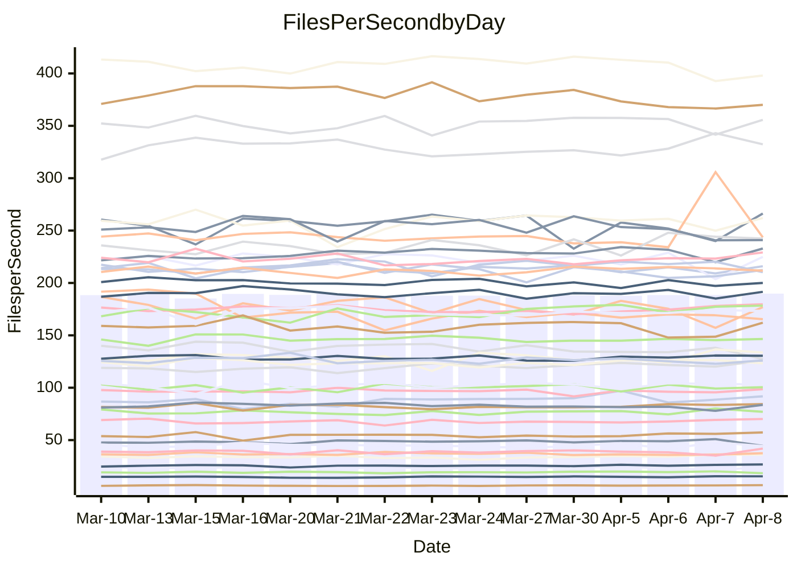

<!---
# This file is auto-generated. Do not edit.
# cspell:disable
--->
# Performance Report

Daily Performance

```mermaid
xychart-beta
    title Files Per Second by Day
    y-axis Files per Second
    x-axis Date [Mar-10, Mar-13, Mar-15, Mar-16, Mar-20, Mar-21, Mar-22, Mar-23, Mar-24, Mar-27, Mar-30, Apr-5, Apr-6, Apr-7, Apr-8]
    bar [188.38, 189.98, 185.21, 189.57, 188.63, 189.87, 187.45, 187.93, 187.93, 186.35, 188.30, 187.81, 188.42, 188.59, 189.84]
    line [47.70, 47.47, 48.64, 47.90, 46.22, 49.72, 49.15, 48.47, 48.92, 49.74, 47.82, 49.22, 48.87, 50.93, 44.38]
    line [186.65, 179.06, 166.05, 180.55, 173.75, 182.92, 186.30, 171.18, 184.68, 174.16, 169.88, 182.89, 175.34, 157.18, 176.94]
    line [140.01, 135.63, 143.93, 142.95, 134.36, 139.82, 141.15, 141.79, 134.53, 140.55, 134.62, 134.19, 133.87, 138.14, 127.32]
    line [146.06, 140.05, 150.95, 150.81, 144.94, 146.39, 146.52, 149.65, 147.78, 143.68, 144.97, 144.90, 146.68, 145.47, 146.56]
    line [53.77, 52.96, 57.64, 49.40, 55.01, 55.07, 55.14, 54.97, 52.69, 54.36, 53.37, 53.82, 56.32, 55.94, 57.36]
    line [86.73, 86.09, 89.20, 79.46, 84.64, 82.02, 89.37, 88.80, 89.20, 89.35, 90.00, 97.23, 85.82, 88.62, 91.77]
    line [69.18, 70.51, 65.83, 66.30, 67.73, 68.98, 63.91, 69.35, 66.34, 67.66, 67.35, 66.87, 67.74, 69.26, 70.15]
    line [14.93, 14.92, 15.23, 14.84, 14.06, 13.99, 14.45, 15.39, 15.15, 14.76, 15.30, 14.95, 14.57, 15.50, 15.41]
    line [127.81, 125.76, 132.01, 131.14, 128.67, 125.67, 130.11, 116.06, 133.46, 130.91, 126.44, 128.14, 123.76, 136.62, 133.64]
    line [24.56, 23.16, 23.57, 24.07, 23.83, 22.72, 24.07, 23.01, 23.19, 23.80, 24.02, 24.56, 23.07, 21.40, 24.14]
    line [260.43, 254.55, 236.73, 261.47, 259.22, 254.59, 258.80, 265.17, 259.19, 264.34, 232.73, 257.73, 251.87, 240.02, 266.31]
    line [191.68, 193.62, 189.84, 166.89, 171.60, 172.56, 154.71, 166.00, 173.35, 167.42, 171.49, 166.95, 170.01, 169.14, 165.39]
    line [352.21, 348.39, 359.59, 349.81, 342.75, 347.71, 359.34, 340.76, 354.09, 354.69, 357.70, 357.50, 356.42, 341.55, 355.72]
    line [79.36, 75.39, 75.58, 78.40, 76.58, 74.92, 73.83, 77.77, 74.02, 77.10, 77.41, 77.73, 74.56, 80.16, 77.02]
    line [81.66, 80.93, 85.41, 78.19, 83.51, 83.81, 81.43, 79.47, 81.70, 81.36, 81.35, 81.81, 84.38, 83.54, 84.32]
    line [214.22, 219.20, 204.44, 213.42, 215.32, 218.95, 211.96, 209.30, 215.41, 213.73, 216.98, 210.20, 214.91, 209.11, 216.00]
    line [176.56, 173.19, 174.63, 177.66, 175.92, 178.79, 174.01, 172.30, 172.16, 173.35, 170.18, 172.81, 174.46, 178.10, 179.62]
    line [186.81, 190.52, 190.26, 197.02, 193.75, 189.15, 186.42, 190.28, 193.49, 184.99, 190.27, 189.55, 193.41, 185.15, 191.53]
    line [259.39, 256.02, 269.97, 254.79, 259.65, 234.19, 251.38, 263.45, 259.03, 264.42, 262.82, 259.51, 261.27, 249.89, 261.98]
    line [222.38, 225.56, 216.60, 228.18, 224.68, 217.69, 227.52, 226.28, 219.14, 221.19, 226.02, 217.73, 228.96, 203.68, 224.92]
    line [81.02, 82.11, 85.90, 84.63, 82.99, 84.87, 85.57, 82.40, 83.84, 81.84, 82.00, 81.46, 81.94, 77.93, 83.70]
    line [244.22, 247.23, 240.74, 246.80, 248.37, 243.77, 240.29, 242.61, 244.28, 244.79, 237.77, 238.81, 234.08, 305.83, 243.57]
    line [235.85, 231.18, 227.46, 239.47, 235.22, 227.41, 228.79, 241.01, 235.98, 226.38, 241.62, 226.17, 248.01, 244.17, 242.46]
    line [168.17, 175.84, 172.23, 167.20, 162.09, 175.73, 167.53, 169.26, 167.37, 175.14, 177.59, 179.11, 171.90, 177.30, 178.37]
    line [6.32, 6.79, 7.12, 6.59, 6.35, 6.19, 6.26, 6.60, 6.25, 6.74, 6.77, 6.57, 6.61, 6.73, 7.00]
    line [217.40, 210.64, 213.63, 210.38, 215.44, 220.20, 209.66, 217.73, 213.19, 200.65, 215.04, 210.95, 204.79, 206.43, 212.35]
    line [97.82, 96.22, 96.21, 96.60, 95.61, 100.00, 97.34, 96.90, 96.73, 98.18, 91.72, 97.44, 96.14, 95.65, 98.60]
    line [127.60, 130.54, 131.20, 126.76, 126.98, 130.36, 127.52, 127.75, 130.81, 125.94, 125.76, 129.75, 128.69, 130.72, 130.46]
    line [34.36, 33.03, 34.53, 33.80, 33.49, 35.23, 32.80, 33.41, 31.17, 33.44, 33.97, 34.80, 34.26, 36.10, 36.17]
    line [45.79, 43.00, 44.30, 47.55, 45.42, 45.55, 44.76, 44.94, 43.55, 42.67, 44.21, 47.13, 41.53, 47.88, 44.28]
    line [221.56, 225.82, 223.33, 223.62, 225.78, 230.86, 229.00, 232.44, 230.81, 228.49, 228.09, 234.26, 231.70, 219.86, 232.88]
    line [36.38, 35.91, 38.37, 36.25, 36.61, 35.87, 38.67, 37.37, 36.99, 37.97, 35.69, 36.40, 35.82, 36.18, 37.44]
    line [118.95, 118.40, 114.99, 118.14, 119.47, 113.95, 118.70, 123.16, 121.00, 118.77, 121.60, 123.74, 121.73, 120.16, 125.96]
    line [103.33, 98.05, 102.55, 95.32, 100.34, 95.68, 103.94, 100.49, 100.37, 101.61, 103.43, 96.40, 102.92, 99.21, 100.52]
    line [159.01, 157.48, 159.10, 169.05, 154.54, 158.47, 152.54, 153.40, 160.13, 161.83, 162.72, 161.59, 147.84, 148.71, 162.06]
    line [213.30, 213.00, 209.05, 214.75, 216.78, 222.67, 220.47, 206.28, 217.42, 221.24, 216.32, 220.41, 218.02, 220.27, 210.30]
    line [38.99, 38.46, 40.13, 39.77, 36.42, 40.38, 36.50, 39.38, 38.08, 39.48, 40.18, 38.93, 38.36, 35.23, 41.88]
    line [24.74, 25.60, 26.18, 25.98, 23.83, 25.61, 25.64, 25.22, 25.67, 25.63, 25.15, 26.46, 25.57, 26.37, 26.75]
    line [124.38, 120.45, 128.40, 126.26, 121.85, 123.29, 123.31, 123.57, 119.37, 123.63, 121.70, 126.05, 126.20, 126.46, 123.33]
    line [104.19, 100.36, 94.07, 106.95, 99.82, 102.15, 104.63, 100.11, 102.26, 104.28, 103.40, 98.55, 104.22, 103.59, 103.12]
    line [250.97, 253.10, 248.68, 263.99, 260.91, 239.46, 259.16, 256.10, 260.18, 248.06, 263.68, 253.34, 251.40, 240.71, 240.89]
    line [210.46, 215.67, 209.05, 214.60, 209.59, 204.82, 212.94, 211.50, 207.03, 210.21, 215.65, 213.52, 215.27, 213.92, 211.68]
    line [317.67, 331.44, 338.69, 332.97, 333.24, 336.87, 327.34, 320.84, 322.94, 325.27, 326.73, 321.72, 328.23, 343.02, 332.37]
    line [19.22, 18.67, 19.78, 18.71, 19.79, 19.47, 18.35, 19.30, 19.37, 19.08, 19.88, 20.02, 19.41, 20.18, 18.41]
    line [370.91, 378.91, 387.90, 387.80, 386.06, 387.41, 376.59, 391.51, 373.44, 379.72, 384.27, 373.30, 367.91, 366.55, 370.00]
    line [125.61, 123.50, 128.64, 128.22, 133.34, 123.28, 125.66, 126.65, 122.93, 128.82, 126.34, 127.91, 125.16, 122.83, 125.98]
    line [224.11, 219.75, 232.68, 220.52, 223.12, 228.15, 216.79, 218.07, 220.91, 223.03, 217.84, 221.62, 223.63, 223.28, 229.16]
    line [200.86, 205.50, 202.63, 202.69, 199.56, 199.40, 197.96, 202.91, 203.92, 196.82, 200.56, 195.13, 202.74, 197.17, 200.02]
    line [413.29, 411.20, 402.18, 405.65, 399.88, 410.92, 409.10, 416.42, 413.72, 409.38, 416.05, 413.02, 410.36, 392.72, 397.99]
    line [172.27, 176.52, 160.55, 175.49, 175.91, 178.24, 172.29, 170.07, 169.37, 169.09, 172.70, 171.27, 171.33, 174.25, 173.31]
```

Time to Process Files

| Repository                                      | Elapsed | Min/Avg/Max           |   SD | SD Graph                |
| ----------------------------------------------- | ------: | :-------------------: | ---: | ----------------------- |
| AdaDoom3/AdaDoom3                    |    2.75 | 2.6 /   2.8 /   3.0   | 0.09 | `    ┣━━┻●━╋━━┻━━┫    ` |
| alexiosc/megistos                    |    6.91 | 6.8 /   7.1 /   8.1   | 0.30 | `    ┣━━┻●━╋━━┻━━┫    ` |
| apollographql/apollo-server          |    2.53 | 2.4 /   2.5 /   2.9   | 0.12 | `    ┣━━┻━━●━━┻━━┫    ` |
| aspnetboilerplate/aspnetboilerplate  |    8.73 | 8.4 /   8.8 /   9.8   | 0.26 | `    ┣━━┻━●╋━━┻━━┫    ` |
| aws-amplify/docs                     |   12.03 | 9.6 /  11.8 /  12.9   | 0.52 | `   ┣━━━┻━━╋●━┻━━━┫   ` |
| Azure/azure-rest-api-specs           |   10.33 | 8.9 /   9.8 /  11.2   | 0.50 | `   ┣━━━┻━━╋━━┻●━━┫   ` |
| bitjson/typescript-starter           |    1.09 | 0.9 /   1.0 /   1.2   | 0.05 | `     ┣━┻━━╋━━●━┫     ` |
| caddyserver/caddy                    |    3.29 | 2.6 /   3.4 /   4.1   | 0.21 | `    ┣━━┻●━╋━━┻━━┫    ` |
| canada-ca/open-source-logiciel-libre |    1.00 | 1.0 /   1.1 /   1.2   | 0.05 | `     ┣●┻━━╋━━┻━┫     ` |
| chef/chef                            |    5.24 | 5.2 /   5.4 /   5.8   | 0.15 | `    ┣━━●━━╋━━┻━━┫    ` |
| dart-lang/sdk                        |   55.86 | 52.6 /  55.6 /  61.5  | 1.74 | `  ┣━━━┻━━━●━━━┻━━━┫  ` |
| django/django                        |   13.64 | 13.0 /  13.7 /  16.7  | 0.66 | `   ┣━━━┻━━●━━┻━━━┫   ` |
| eslint/eslint                        |    9.53 | 9.1 /   9.6 /  10.2   | 0.24 | `    ┣━━┻━●╋━━┻━━┫    ` |
| exonum/exonum                        |    3.41 | 3.2 /   3.4 /   3.8   | 0.10 | `    ┣━━┻━━●━━┻━━┫    ` |
| flutter/samples                      |   13.98 | 13.7 /  14.7 /  17.3  | 0.82 | `   ┣━━━●━━╋━━┻━━━┫   ` |
| gitbucket/gitbucket                  |    3.11 | 3.0 /   3.3 /   4.3   | 0.23 | `    ┣━━┻●━╋━━┻━━┫    ` |
| googleapis/google-cloud-cpp          |  120.01 | 116.7 / 121.0 / 131.2 | 3.24 | `  ┣━━━┻━━●╋━━━┻━━━┫  ` |
| graphql/express-graphql              |    1.08 | 1.0 /   1.1 /   1.3   | 0.06 | `     ┣━┻━●╋━━┻━┫     ` |
| graphql/graphql-js                   |    2.91 | 2.6 /   2.7 /   2.9   | 0.09 | `    ┣━━┻━━╋━━┻━━┫●   ` |
| graphql/graphql-relay-js             |    1.05 | 1.0 /   1.1 /   1.3   | 0.06 | `     ┣━●━━╋━━┻━┫     ` |
| graphql/graphql-spec                 |    1.23 | 1.2 /   1.3 /   1.6   | 0.08 | `     ┣━┻●━╋━━┻━┫     ` |
| iluwatar/java-design-patterns        |   11.47 | 11.3 /  11.8 /  12.7  | 0.30 | `    ┣━●┻━━╋━━┻━━┫    ` |
| ktaranov/sqlserver-kit               |    5.85 | 5.6 /   6.0 /   6.5   | 0.22 | `    ┣━━┻━●╋━━┻━━┫    ` |
| liriliri/licia                       |    3.88 | 3.6 /   3.8 /   4.1   | 0.12 | `    ┣━━┻━━╋━●┻━━┫    ` |
| MartinThoma/LaTeX-examples           |    6.05 | 5.7 /   6.2 /   7.0   | 0.21 | `    ┣━━┻●━╋━━┻━━┫    ` |
| mdx-js/mdx                           |    1.82 | 1.7 /   1.8 /   2.0   | 0.08 | `     ┣━┻━━●━━┻━┫     ` |
| microsoft/TypeScript-Website         |    5.16 | 4.9 /   5.2 /   5.7   | 0.20 | `    ┣━━┻━━●━━┻━━┫    ` |
| MicrosoftDocs/PowerShell-Docs        |   20.33 | 19.6 /  20.7 /  26.2  | 1.14 | `   ┣━━┻━━●╋━━━┻━━┫   ` |
| neovim/nvim-lspconfig                |    5.07 | 3.8 /   4.7 /   5.6   | 0.46 | `    ┣━━┻━━╋━●┻━━┫    ` |
| pagekit/pagekit                      |    3.52 | 3.3 /   3.4 /   3.8   | 0.11 | `    ┣━━┻━━╋━●┻━━┫    ` |
| php/php-src                          |   23.07 | 22.7 /  23.5 /  26.4  | 0.62 | `   ┣━━━┻●━╋━━┻━━━┫   ` |
| plasticrake/tplink-smarthome-api     |    1.40 | 1.1 /   1.3 /   1.4   | 0.06 | `     ┣━┻━━╋━━┻━●     ` |
| prettier/prettier                    |    7.49 | 7.3 /   7.6 /   8.3   | 0.21 | `    ┣━━┻━●╋━━┻━━┫    ` |
| pycontribs/jira                      |    1.38 | 1.4 /   1.5 /   1.7   | 0.08 | `     ┣━●━━╋━━┻━┫     ` |
| RustPython/RustPython                |    6.07 | 6.0 /   6.4 /   7.0   | 0.21 | `    ┣━●┻━━╋━━┻━━┫    ` |
| shoelace-style/shoelace              |    2.72 | 2.5 /   2.8 /   3.2   | 0.14 | `    ┣━━┻━●╋━━┻━━┫    ` |
| slint-ui/slint                       |   13.55 | 12.8 /  13.3 /  14.1  | 0.29 | `    ┣━━┻━━╋━●┻━━┫    ` |
| SoftwareBrothers/admin-bro           |    2.49 | 2.2 /   2.5 /   3.0   | 0.17 | `    ┣━━┻━━●━━┻━━┫    ` |
| sveltejs/svelte                      |   21.80 | 20.1 /  21.0 /  23.3  | 0.73 | `   ┣━━━┻━━╋━━┻●━━┫   ` |
| TheAlgorithms/Python                 |    5.28 | 5.2 /   5.5 /   6.6   | 0.26 | `    ┣━━┻●━╋━━┻━━┫    ` |
| twbs/bootstrap                       |    1.68 | 1.7 /   1.7 /   2.0   | 0.07 | `     ┣━┻●━╋━━┻━┫     ` |
| typescript-cheatsheets/react         |    1.27 | 1.3 /   1.4 /   1.6   | 0.07 | `     ┣●┻━━╋━━┻━┫     ` |
| typescript-eslint/typescript-eslint  |    3.98 | 3.8 /   4.0 /   4.5   | 0.14 | `    ┣━━┻━●╋━━┻━━┫    ` |
| vitest-dev/vitest                    |   10.71 | 10.2 /  11.0 /  13.3  | 0.59 | `   ┣━━━┻●━╋━━┻━━━┫   ` |
| w3c/aria-practices                   |    3.29 | 3.1 /   3.3 /   3.7   | 0.15 | `    ┣━━┻━━●━━┻━━┫    ` |
| w3c/specberus                        |    1.91 | 1.8 /   1.9 /   2.2   | 0.09 | `    ┣━━┻━●╋━━┻━━┫    ` |
| webdeveric/webpack-assets-manifest   |    1.24 | 1.1 /   1.2 /   1.4   | 0.08 | `     ┣━┻━━●━━┻━┫     ` |
| webpack/webpack                      |    5.11 | 4.9 /   5.2 /   5.6   | 0.19 | `    ┣━━┻━●╋━━┻━━┫    ` |
| wireapp/wire-desktop                 |    1.24 | 1.2 /   1.3 /   1.6   | 0.08 | `     ┣━●━━╋━━┻━┫     ` |
| wireapp/wire-webapp                  |   11.47 | 10.6 /  11.2 /  12.6  | 0.38 | `    ┣━━┻━━╋━●┻━━┫    ` |

Note:
- Elapsed time is in seconds.

Files per Second over Time

| Repository                                      | Files |    Sec |    Fps |    Rel | Trend Fps              |    N |
| ----------------------------------------------- | ----: | -----: | -----: | -----: | ---------------------- | ---: |
| AdaDoom3/AdaDoom3                    |   103 |   2.75 |  37.44 |  1.78% | `▆▇▇▅▇▆██▇▇▄▆▆▇▅▅▆▄▆▇` |   38 |
| alexiosc/megistos                    |   583 |   6.91 |  84.32 |  3.22% | `▆▄█▆▆▅██▆▆▇▆▆▆▇▇▇█▇█` |   38 |
| apollographql/apollo-server          |   254 |   2.53 | 100.52 | -0.01% | `▇▇▇▇▆███▃▇▇▇▇▄▃▇▆█▆▆` |   38 |
| aspnetboilerplate/aspnetboilerplate  |  2286 |   8.73 | 261.98 |  1.11% | `█▆▆▇▇▇▇▇▇█▇▇▆▇▇▇▇▇▅▇` |   38 |
| aws-amplify/docs                     |  2931 |  12.03 | 243.57 | -0.48% | `▂▄▄▃▄▄▄▄▃▄▃▃▃▃▃▃▂▃█▃` |   38 |
| Azure/azure-rest-api-specs           |  2489 |  10.33 | 240.89 | -5.20% | `█▄█▆█▃█▇▄▇█▇▆▆▆█▆▆▅▅` |   38 |
| bitjson/typescript-starter           |    20 |   1.09 |  18.41 | -4.74% | `▅▆▆▅▆▆▇▆▄▄▇▆█▆▆▆▆▅▇▅` |   38 |
| caddyserver/caddy                    |   302 |   3.29 |  91.77 |  4.06% | `▄▄▄▄▄▄▄▄▄▄▄▄▄█▄▄▄▃▄▄` |   38 |
| canada-ca/open-source-logiciel-libre |     7 |   1.00 |   7.00 |  7.16% | `▆▆▆▄▃█▆▄▆▅▆▆▆▆▄▅▅▆▆▇` |   38 |
| chef/chef                            |  1201 |   5.24 | 229.16 |  3.26% | `▅▆▇▆▆▇▆▅▇▇▅▇▆▇▆▇▅█▇█` |   38 |
| dart-lang/sdk                        | 11173 |  55.86 | 200.02 | -0.15% | `█▇█▇▇▇▇▄▇▅█▆▆▇▇▄▇▇▆▇` |   38 |
| django/django                        |  2897 |  13.64 | 212.35 |  0.34% | `██▇▇▇██▅▅▃▇█▇▆▇▇▇▆▆▇` |   38 |
| eslint/eslint                        |  2058 |   9.53 | 216.00 |  1.09% | `▆▆▆▆█▆▇▇▆▅█▆▇▄▆▆▇▇▆▇` |   38 |
| exonum/exonum                        |   421 |   3.41 | 123.33 | -0.23% | `▆█▆▄█▇▇▇▇▆▆▇▇█▇█▇██▇` |   38 |
| flutter/samples                      |  2494 |  13.98 | 178.37 |  3.98% | `▇▄▅█▅▇▇▇█▇█▇█▇██▆▇▇█` |   38 |
| gitbucket/gitbucket                  |   415 |   3.11 | 133.64 |  4.43% | `▂▅██▇▇▆██▇▆▇▇▆▇▇▅███` |   38 |
| googleapis/google-cloud-cpp          | 20800 | 120.01 | 173.31 |  0.76% | `▇▇▄██▆▆▇█▆▇█▇▇▇▇█▆██` |   38 |
| graphql/express-graphql              |    26 |   1.08 |  24.14 |  1.65% | `▃▆▆▆▄▇▇▆▄▇▆▆▇▇█▆▂█▄▆` |   38 |
| graphql/graphql-js                   |   371 |   2.91 | 127.32 | -7.77% | `██▅▆▆█▇▆█▇▅▇▄▇▅▆▅▇▇▄` |   38 |
| graphql/graphql-relay-js             |    28 |   1.05 |  26.75 |  5.19% | `▇▅▅▇▇▇▇▃█▆▆▆▆▇██▆▆▇▇` |   38 |
| graphql/graphql-spec                 |    19 |   1.23 |  15.41 |  3.66% | `▇█▇▇▆▄█▇▇▆▇█▇▇█▅▆▇█▇` |   38 |
| iluwatar/java-design-patterns        |  2060 |  11.47 | 179.62 |  3.07% | `▆▆█▅▆██▇▇▄▆▆▆▇▇▆▇▇██` |   38 |
| ktaranov/sqlserver-kit               |   490 |   5.85 |  83.70 |  1.55% | `▇▆█▅▇▇▅█▆▆▇▅▆█▄▆▆▆▅▇` |   38 |
| liriliri/licia                       |  1437 |   3.88 | 370.00 | -2.24% | `▇█▆█▆█▆▆█▇▇▇▇▇▅▆▆▆▆▆` |   38 |
| MartinThoma/LaTeX-examples           |  1409 |   6.05 | 232.88 |  2.28% | `▇▇▆▇▆▅▆▆▇▇▆▆▆█▇▇▆▇▅▇` |   38 |
| mdx-js/mdx                           |   140 |   1.82 |  77.02 |  0.12% | `▇▆▄▅▅▅█▄▄█▇▅▇▆▃█▆▄▇▆` |   38 |
| microsoft/TypeScript-Website         |   757 |   5.16 | 146.56 |  0.49% | `███▇▇█▆█▅▄▇▆█▄▆█▇▇▇▇` |   38 |
| MicrosoftDocs/PowerShell-Docs        |  2652 |  20.33 | 130.46 |  1.75% | `▆█▆███▇█▂██▅███▆▇▇▇▇` |   38 |
| neovim/nvim-lspconfig                |   838 |   5.07 | 165.39 | -5.15% | `█▇▇█▇▇▆▆▆▆▇▇▇▇▅▆▆▇▇▆` |   38 |
| pagekit/pagekit                      |   741 |   3.52 | 210.30 | -2.77% | `▇▃▆█▇██▆██▇▇█▇▇█▇▇▇▆` |   38 |
| php/php-src                          |  2275 |  23.07 |  98.60 |  1.84% | `██▇▇▇█▇█▇▇▃▇▇▇▇█▇▆▇█` |   38 |
| plasticrake/tplink-smarthome-api     |    62 |   1.40 |  44.38 | -8.42% | `▄▇▄▆▆█▅▃█▅▅▅▆▆▅▅▄▇▆▃` |   38 |
| prettier/prettier                    |  2666 |   7.49 | 355.72 |  1.10% | `▅▇▇▇█▇██▆▇▇███▇▇▇█▆▇` |   38 |
| pycontribs/jira                      |    79 |   1.38 |  57.36 |  6.13% | `██▇▄▆▇█▃▇█▆▆█▅▆▇█▇▇█` |   38 |
| RustPython/RustPython                |   764 |   6.07 | 125.96 |  5.01% | `▇██▆▆█▆▃▆▇▆██▇█▇▇▇▆█` |   38 |
| shoelace-style/shoelace              |   440 |   2.72 | 162.06 |  2.35% | `▆▇█▆▇█▇▇▇▆▇▇▇▆█▇▅▄▅▇` |   38 |
| slint-ui/slint                       |  2869 |  13.55 | 211.68 |  0.00% | `▇▇█▄▆▆▆▇▆▇█▇▇█▇▇█▇▇▇` |   38 |
| SoftwareBrothers/admin-bro           |   441 |   2.49 | 176.94 | -0.81% | `▇▆▇▇▇▅▂█▆▇▄▆▇█▆▆▆▆▄▆` |   38 |
| sveltejs/svelte                      |  8677 |  21.80 | 397.99 | -2.99% | `██▇████▄▇██▇▇█▇██▆▆▆` |   38 |
| TheAlgorithms/Python                 |  1407 |   5.28 | 266.31 |  3.57% | `█▇█▇▆▇████▃▆▇▇▆▇▆▇▅█` |   38 |
| twbs/bootstrap                       |   118 |   1.68 |  70.15 |  3.43% | `█▇▅▆▇▆▇█▄█▇▅▆▄█▆▇▆▇█` |   38 |
| typescript-cheatsheets/react         |    53 |   1.27 |  41.88 |  8.30% | `▇▇▅▆▅▇▇▇▇▅▇▇▇▆▇▄▆▅▄█` |   38 |
| typescript-eslint/typescript-eslint  |  1322 |   3.98 | 332.37 |  1.91% | `█▄▆▆▆▅▆▆▇▆▇▆▅▆▆▇▇▆█▇` |   38 |
| vitest-dev/vitest                    |  2597 |  10.71 | 242.46 |  3.56% | `███▆▆▅▄▅█▅▇▇▇▆▆▂▇█▇▇` |   38 |
| w3c/aria-practices                   |   414 |   3.29 | 125.98 | -0.56% | `▆█▇▇▄█▆▇█▇▅███▅█▇▆▆▇` |   38 |
| w3c/specberus                        |   197 |   1.91 | 103.12 |  0.83% | `▆▅▅▇▆█▃▇▆█▆▆▇▅▄▄▆▇▆▆` |   38 |
| webdeveric/webpack-assets-manifest   |    55 |   1.24 |  44.28 | -1.10% | `▆▅▅▇▂▃▃▄█▄▆▄▇▇▆▇▄▄▇▅` |   38 |
| webpack/webpack                      |  1149 |   5.11 | 224.92 |  1.06% | `▇█▄▇▅▆▅▇▆▆▆▇▄▇▇▅▇█▄▇` |   38 |
| wireapp/wire-desktop                 |    45 |   1.24 |  36.17 |  7.26% | `▄█▅▂▇▇▇▆▄██▆▇▇▇█▆▇██` |   38 |
| wireapp/wire-webapp                  |  2196 |  11.47 | 191.53 |  0.99% | `▇▆█▇▇▃▇▇█▆▇▇██▅█▇█▆▇` |   38 |

Data Throughput

| Repository                                      | Files |    Sec |     Kps |    Rel | Trend Kps              |    N |
| ----------------------------------------------- | ----: | -----: | ------: | -----: | ---------------------- | ---: |
| AdaDoom3/AdaDoom3                    |   103 |   2.75 |  795.62 |  1.78% | `▆▇▇▅▇▆██▇▇▄▆▆▇▅▅▆▄▆▇` |   38 |
| alexiosc/megistos                    |   583 |   6.91 |  662.58 |  3.22% | `▆▄█▆▆▅██▆▆▇▆▆▆▇▇▇█▇█` |   38 |
| apollographql/apollo-server          |   254 |   2.53 |  829.48 |  0.32% | `▇▇▇▇▆███▃▇▇▇▇▄▃▇▆█▆▇` |   38 |
| aspnetboilerplate/aspnetboilerplate  |  2286 |   8.73 |  637.41 |  1.11% | `█▆▆▇▇▇▇▇▇█▇▇▆▇▇▇▇▇▅▇` |   38 |
| aws-amplify/docs                     |  2931 |  12.03 |  856.60 | -0.03% | `▂▄▃▃▄▄▄▄▃▄▃▃▃▃▃▃▂▃█▃` |   38 |
| Azure/azure-rest-api-specs           |  2489 |  10.33 |  710.37 | -4.75% | `█▄█▆█▃█▇▄▇█▇▆▆▆█▇▆▅▅` |   38 |
| bitjson/typescript-starter           |    20 |   1.09 |   73.62 | -4.74% | `▅▆▆▅▆▆▇▆▄▄▇▆█▆▆▆▆▅▇▅` |   38 |
| caddyserver/caddy                    |   302 |   3.29 |  820.49 |  4.58% | `▄▄▄▄▄▄▄▄▄▄▄▄▄█▄▄▄▃▄▄` |   38 |
| canada-ca/open-source-logiciel-libre |     7 |   1.00 |   58.03 |  7.16% | `▆▆▆▄▃█▆▄▆▅▆▆▆▆▄▅▅▆▆▇` |   38 |
| chef/chef                            |  1201 |   5.24 | 1075.97 |  3.27% | `▅▆▇▆▆▇▆▅▇▇▅▇▆▇▆▇▅█▇█` |   38 |
| dart-lang/sdk                        | 11173 |  55.86 | 1352.43 | -0.21% | `█▇█▇▇▇▇▄▇▅█▆▆█▇▄▇▇▆▇` |   38 |
| django/django                        |  2897 |  13.64 | 1346.03 |  0.43% | `██▇▇▇██▅▅▃▇█▇▆▇▇▇▆▆▇` |   38 |
| eslint/eslint                        |  2058 |   9.53 | 1500.15 |  1.10% | `▆▆▆▆█▆▇▇▆▅█▆▇▄▆▆▇▇▆▇` |   38 |
| exonum/exonum                        |   421 |   3.41 | 1179.67 | -0.23% | `▆█▆▄█▇▇▇▇▆▆▇▇█▇█▇██▇` |   38 |
| flutter/samples                      |  2494 |  13.98 | 1537.88 |  4.55% | `▇▄▅█▅▇▇▇█▇█▇████▆▇▇█` |   38 |
| gitbucket/gitbucket                  |   415 |   3.11 |  619.25 |  4.73% | `▂▅██▇▇▆█▇▇▆▇▇▆▇▇▅███` |   38 |
| googleapis/google-cloud-cpp          | 20800 | 120.01 | 1466.64 |  0.78% | `▇▇▄██▆▆▇█▆▇█▇▇▇▇█▆██` |   38 |
| graphql/express-graphql              |    26 |   1.08 |  110.48 |  1.65% | `▃▆▆▆▄▇▇▆▄▇▆▆▇▇█▆▂█▄▆` |   38 |
| graphql/graphql-js                   |   371 |   2.91 |  746.09 | -7.79% | `██▅▆▆█▇▆█▇▅▆▄▇▅▆▅▇▇▄` |   38 |
| graphql/graphql-relay-js             |    28 |   1.05 |  105.08 |  5.19% | `▇▅▅▇▇▇▇▃█▆▆▆▆▇██▆▆▇▇` |   38 |
| graphql/graphql-spec                 |    19 |   1.23 |  514.11 |  3.66% | `▇█▇▇▆▄█▇▇▆▇█▇▇█▅▆▇█▇` |   38 |
| iluwatar/java-design-patterns        |  2060 |  11.47 |  553.58 |  3.07% | `▆▆█▅▆██▇▇▄▆▆▆▇▇▆▇▇██` |   38 |
| ktaranov/sqlserver-kit               |   490 |   5.85 | 1267.98 |  1.61% | `▇▆█▅▇▇▅█▆▆▇▅▆█▄▆▆▆▅▇` |   38 |
| liriliri/licia                       |  1437 |   3.88 |  440.81 | -2.24% | `▇█▆█▆█▆▆█▇▇▇▇▇▅▆▆▆▆▆` |   38 |
| MartinThoma/LaTeX-examples           |  1409 |   6.05 |  480.96 |  2.28% | `▇▇▆▇▆▅▆▆▇▇▆▆▆█▇▇▆▇▅▇` |   38 |
| mdx-js/mdx                           |   140 |   1.82 |  360.32 |  0.31% | `▇▆▄▅▅▅█▄▄█▇▅▇▆▃█▆▄▇▆` |   38 |
| microsoft/TypeScript-Website         |   757 |   5.16 | 1018.20 |  1.04% | `███▇▇█▆█▅▄▇▆█▄▆█▇▇▇▇` |   38 |
| MicrosoftDocs/PowerShell-Docs        |  2652 |  20.33 | 1368.20 |  2.01% | `▆█▆███▇█▂██▅███▆▇▇▇▇` |   38 |
| neovim/nvim-lspconfig                |   838 |   5.07 |  445.85 |  3.81% | `█▇▇███▇▇▇▇█▇▇▇▆▇▇█▇▇` |   38 |
| pagekit/pagekit                      |   741 |   3.52 |  438.49 | -2.77% | `▇▃▆█▇██▆██▇▇█▇▇█▇▇▇▆` |   38 |
| php/php-src                          |  2275 |  23.07 | 1721.45 |  1.95% | `██▇▇▇█▇█▇▇▃▇▇▇▇█▇▆▇█` |   38 |
| plasticrake/tplink-smarthome-api     |    62 |   1.40 |  239.82 | -8.42% | `▄▇▄▆▆█▅▃█▅▅▅▆▆▅▅▄▇▆▃` |   38 |
| prettier/prettier                    |  2666 |   7.49 |  489.01 |  1.08% | `▅▇▇▇█▇██▆▇▇███▇▇▇█▆▇` |   38 |
| pycontribs/jira                      |    79 |   1.38 |  406.58 |  6.13% | `██▇▄▆▇█▃▇█▆▆█▅▆▇█▇▇█` |   38 |
| RustPython/RustPython                |   764 |   6.07 | 1982.37 |  6.40% | `▇██▆▆█▆▃▆▇▆██▇█▇▇▇▇█` |   38 |
| shoelace-style/shoelace              |   440 |   2.72 |  782.31 |  2.39% | `▆▇█▆▇█▇▇▇▆█▇▇▆█▇▅▄▅▇` |   38 |
| slint-ui/slint                       |  2869 |  13.55 | 1324.56 | -0.10% | `███▅▆▆▇█▆▇█▇▇█▇▆█▇▇▇` |   38 |
| SoftwareBrothers/admin-bro           |   441 |   2.49 |  389.98 | -0.81% | `▇▆▇▇▇▅▂█▆▇▄▆▇█▆▆▆▆▄▆` |   38 |
| sveltejs/svelte                      |  8677 |  21.80 |  270.25 | -2.74% | `██▇████▄▇██▇▇█▇██▆▆▆` |   38 |
| TheAlgorithms/Python                 |  1407 |   5.28 |  680.06 |  3.57% | `█▇█▇▆▇████▃▆▇▇▆▇▆▇▅█` |   38 |
| twbs/bootstrap                       |   118 |   1.68 |  576.09 |  3.43% | `█▇▅▆▇▆▇█▄█▇▅▆▄█▆▇▆▇█` |   38 |
| typescript-cheatsheets/react         |    53 |   1.27 |  310.54 |  8.30% | `▇▇▅▆▅▇▇▇▇▅▇▇▇▆▇▄▆▅▄█` |   38 |
| typescript-eslint/typescript-eslint  |  1322 |   3.98 | 1748.60 |  1.51% | `█▄▆▆▆▅▆▆▇▆▇▆▅▆▆▇▆▆█▇` |   38 |
| vitest-dev/vitest                    |  2597 |  10.71 |  743.34 |  4.12% | `███▆▆▅▄▅█▅▇▇▇▆▆▂▇█▇▇` |   38 |
| w3c/aria-practices                   |   414 |   3.29 | 1176.70 | -0.56% | `▆█▇▇▄█▆▇█▇▅███▅█▇▆▆▇` |   38 |
| w3c/specberus                        |   197 |   1.91 |  339.73 |  0.22% | `▆▅▅▇▆█▃▇▆█▆▆▆▅▄▄▆▇▆▆` |   38 |
| webdeveric/webpack-assets-manifest   |    55 |   1.24 |  101.43 | -1.61% | `▆▅▅▇▃▃▃▄█▄▆▄▆▇▅▇▃▄▇▅` |   38 |
| webpack/webpack                      |  1149 |   5.11 | 1057.44 |  1.21% | `▇█▄▇▅▆▅▇▆▆▆▇▄▇▇▅▇█▄▇` |   38 |
| wireapp/wire-desktop                 |    45 |   1.24 |  159.14 |  6.26% | `▄█▅▂▇▇▇▆▄██▆▆▇▇█▆▇██` |   38 |
| wireapp/wire-webapp                  |  2196 |  11.47 |  781.48 |  4.16% | `▆▅▇▆▇▃▆▆▇▅▆▆▇▇▄▇▆█▆▇` |   38 |

