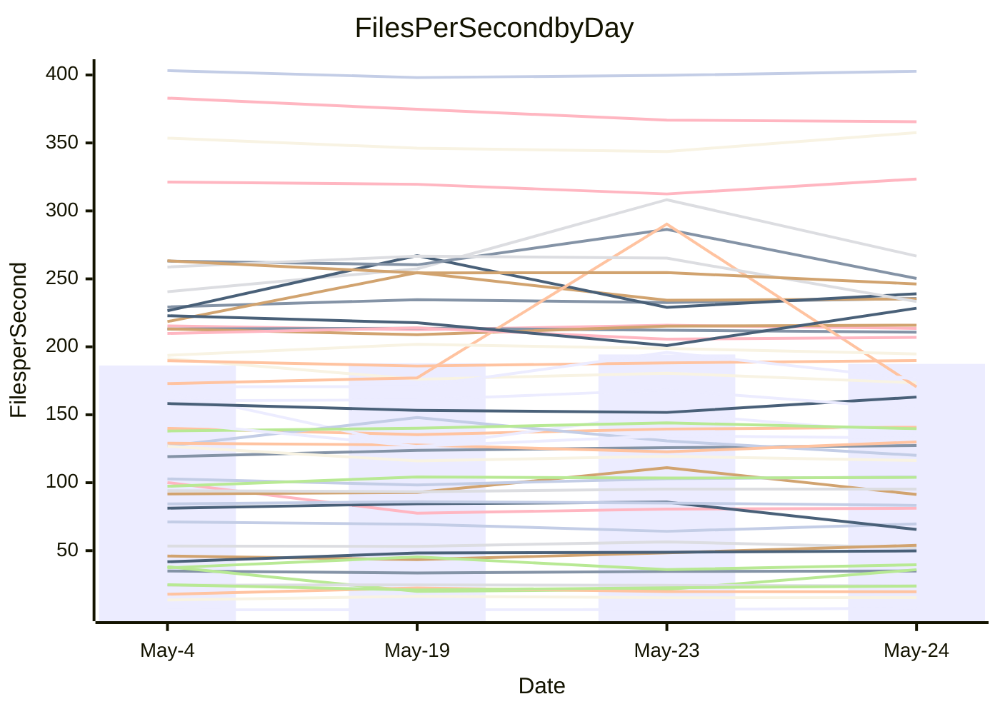

<!---
# This file is auto-generated. Do not edit.
# cspell:disable
--->
# Performance Report

Daily Performance

```mermaid
xychart-beta
    title Files Per Second by Day
    y-axis Files per Second
    x-axis Date [May-4, May-19, May-23, May-24]
    bar [186.25, 187.94, 194.38, 187.43]
    line [35.07, 33.61, 34.69, 35.07]
    line [140.01, 135.42, 139.50, 140.81]
    line [53.38, 53.17, 56.48, 52.17]
    line [38.18, 20.00, 21.53, 36.00]
    line [46.04, 43.44, 48.37, 53.95]
    line [71.11, 69.47, 64.25, 69.68]
    line [100.08, 77.54, 80.59, 81.19]
    line [81.26, 84.52, 85.73, 65.58]
    line [191.37, 176.15, 180.59, 173.51]
    line [166.55, 126.61, 150.87, 136.09]
    line [119.17, 123.77, 125.73, 127.32]
    line [17.95, 22.53, 19.87, 19.75]
    line [24.56, 24.84, 24.48, 24.06]
    line [24.93, 21.05, 22.73, 23.96]
    line [91.75, 92.82, 111.10, 91.35]
    line [102.79, 98.35, 102.96, 104.18]
    line [382.99, 374.77, 366.83, 365.63]
    line [158.32, 153.28, 151.73, 163.01]
    line [13.72, 16.48, 15.39, 15.43]
    line [6.46, 6.48, 6.70, 7.63]
    line [229.32, 234.71, 232.57, 235.54]
    line [189.78, 185.86, 188.16, 189.92]
    line [240.52, 257.39, 308.24, 266.81]
    line [37.38, 45.35, 36.07, 39.62]
    line [218.55, 254.57, 234.26, 235.25]
    line [127.00, 147.92, 130.77, 120.14]
    line [215.39, 212.55, 215.84, 213.57]
    line [226.51, 267.13, 229.05, 239.01]
    line [353.58, 346.15, 343.69, 357.62]
    line [160.29, 160.94, 168.26, 154.40]
    line [213.17, 213.72, 212.23, 210.77]
    line [129.13, 127.71, 122.71, 130.01]
    line [94.12, 93.35, 95.34, 95.31]
    line [138.03, 140.07, 144.01, 139.76]
    line [213.15, 208.87, 215.23, 215.92]
    line [84.38, 85.95, 85.08, 83.30]
    line [321.24, 319.57, 312.48, 323.46]
    line [41.81, 48.29, 48.86, 49.82]
    line [126.81, 116.06, 119.43, 116.29]
    line [144.52, 126.78, 134.48, 132.87]
    line [263.11, 260.36, 286.42, 250.28]
    line [172.93, 177.15, 290.28, 170.47]
    line [258.73, 266.74, 265.26, 233.36]
    line [97.37, 104.19, 103.43, 103.91]
    line [263.28, 254.35, 254.61, 246.24]
    line [403.25, 398.12, 399.78, 402.71]
    line [209.84, 213.89, 205.67, 206.90]
    line [222.86, 217.73, 200.96, 228.42]
    line [193.68, 201.86, 198.76, 194.78]
    line [170.59, 170.67, 195.94, 176.19]
```

Time to Process Files

| Repository                                      | Elapsed | Min/Avg/Max          |    SD | SD Graph                |
| ----------------------------------------------- | ------: | :------------------: | ----: | ----------------------- |
| AdaDoom3/AdaDoom3                    |    2.60 | 2.2 /   2.6 /   2.9  |  0.27 | `    ┣━━┻━━●━━┻━━┫    ` |
| alexiosc/megistos                    |    7.00 | 6.7 /   6.8 /   7.0  |  0.13 | `    ┣━━┻━━╋━━●━━┫    ` |
| apollographql/apollo-server          |    2.45 | 2.5 /   2.5 /   2.6  |  0.06 | `     ┣━●━━╋━━┻━┫     ` |
| aspnetboilerplate/aspnetboilerplate  |    9.28 | 8.7 /   8.9 /   9.2  |  0.17 | `    ┣━━┻━━╋━━┻━━●    ` |
| aws-amplify/docs                     |   12.38 | 10.1 /  12.3 /  13.4 |  1.16 | `    ┣━━┻━━●━━┻━━┫    ` |
| Azure/azure-rest-api-specs           |   10.70 | 9.3 /   9.4 /   9.6  |  0.13 | `        ┣┻╋┻┫       ●` |
| bitjson/typescript-starter           |    1.01 | 0.8 /   1.0 /   1.1  |  0.10 | `     ┣━┻━━╋●━┻━┫     ` |
| caddyserver/caddy                    |    3.43 | 2.7 /   3.2 /   3.4  |  0.29 | `    ┣━━┻━━╋━━●━━┫    ` |
| canada-ca/open-source-logiciel-libre |    0.92 | 1.0 /   1.1 /   1.1  |  0.05 | `  ●  ┣━┻━━╋━━┻━┫     ` |
| chef/chef                            |    4.78 | 4.7 /   4.9 /   4.9  |  0.09 | `     ┣━●━━╋━━┻━┫     ` |
| dart-lang/sdk                        |   58.51 | 55.7 /  57.3 /  58.7 |  1.08 | `   ┣━━━┻━━╋━━┻●━━┫   ` |
| django/django                        |   14.07 | 13.4 /  13.9 /  14.2 |  0.28 | `    ┣━━┻━━╋━●┻━━┫    ` |
| eslint/eslint                        |    9.83 | 9.5 /   9.7 /   9.9  |  0.13 | `    ┣━━┻━━╋━●┻━━┫    ` |
| exonum/exonum                        |    3.31 | 3.3 /   3.4 /   3.5  |  0.08 | `     ┣━●━━╋━━┻━┫     ` |
| flutter/samples                      |   12.76 | 11.7 /  12.7 /  13.6 |  0.64 | `    ┣━━┻━━●━━┻━━┫    ` |
| gitbucket/gitbucket                  |    3.06 | 2.5 /   2.9 /   3.4  |  0.40 | `    ┣━━┻━━╋●━┻━━┫    ` |
| googleapis/google-cloud-cpp          |  118.77 | 95.0 / 117.0 / 123.3 | 10.98 | `  ┣━━━┻━━━╋●━━┻━━━┫  ` |
| graphql/express-graphql              |    1.09 | 1.0 /   1.2 /   1.3  |  0.08 | `     ┣━┻●━╋━━┻━┫     ` |
| graphql/graphql-js                   |    2.63 | 2.6 /   2.7 /   2.9  |  0.08 | `     ┣━┻●━╋━━┻━┫     ` |
| graphql/graphql-relay-js             |    1.16 | 1.1 /   1.1 /   1.2  |  0.02 | `     ┣━━┻━╋━┻●━┫     ` |
| graphql/graphql-spec                 |    1.23 | 1.0 /   1.2 /   1.4  |  0.13 | `     ┣━┻━━●━━┻━┫     ` |
| iluwatar/java-design-patterns        |   12.09 | 7.1 /  10.6 /  11.9  |  2.01 | `   ┣━━━┻━━╋━●┻━━━┫   ` |
| ktaranov/sqlserver-kit               |    7.47 | 5.7 /   5.8 /   6.0  |  0.13 | `        ┣┻╋┻┫       ●` |
| liriliri/licia                       |    3.93 | 3.7 /   3.9 /   4.1  |  0.14 | `    ┣━━┻━━╋●━┻━━┫    ` |
| MartinThoma/LaTeX-examples           |    5.98 | 5.9 /   6.1 /   6.1  |  0.10 | `    ┣━━┻●━╋━━┻━━┫    ` |
| mdx-js/mdx                           |    1.72 | 1.4 /   1.7 /   1.9  |  0.17 | `     ┣━┻━━●━━┻━┫     ` |
| microsoft/TypeScript-Website         |    5.47 | 5.2 /   5.4 /   5.6  |  0.13 | `    ┣━━┻━━╋●━┻━━┫    ` |
| MicrosoftDocs/PowerShell-Docs        |   24.04 | 24.0 /  24.8 /  25.7 |  0.65 | `   ┣━━●┻━━╋━━┻━━━┫   ` |
| neovim/nvim-lspconfig                |    5.55 | 5.1 /   5.2 /   5.4  |  0.12 | `    ┣━━┻━━╋━━┻━━┫●   ` |
| pagekit/pagekit                      |    3.47 | 3.4 /   3.5 /   3.6  |  0.07 | `     ┣━┻━━●━━┻━┫     ` |
| php/php-src                          |   24.03 | 23.6 /  24.3 /  25.6 |  0.71 | `   ┣━━━┻━●╋━━┻━━━┫   ` |
| plasticrake/tplink-smarthome-api     |    1.24 | 1.3 /   1.3 /   1.5  |  0.08 | `     ┣━┻●━╋━━┻━┫     ` |
| prettier/prettier                    |    7.48 | 7.6 /   7.7 /   7.9  |  0.12 | `    ●━━┻━━╋━━┻━━┫    ` |
| pycontribs/jira                      |    1.53 | 1.4 /   1.5 /   1.6  |  0.07 | `     ┣━┻━━╋━●┻━┫     ` |
| RustPython/RustPython                |    6.70 | 6.2 /   6.5 /   6.7  |  0.21 | `    ┣━━┻━━╋━●┻━━┫    ` |
| shoelace-style/shoelace              |    2.70 | 2.8 /   2.9 /   3.0  |  0.11 | `     ┣●┻━━╋━━┻━┫     ` |
| slint-ui/slint                       |   13.45 | 11.3 /  13.1 /  13.8 |  0.93 | `    ┣━━┻━━╋●━┻━━┫    ` |
| SoftwareBrothers/admin-bro           |    2.54 | 2.3 /   2.4 /   2.6  |  0.10 | `     ┣━┻━━╋━━●━┫     ` |
| sveltejs/svelte                      |   21.81 | 21.6 /  22.0 /  22.5 |  0.37 | `    ┣━━┻━●╋━━┻━━┫    ` |
| TheAlgorithms/Python                 |    5.62 | 4.3 /   5.2 /   5.7  |  0.47 | `    ┣━━┻━━╋━●┻━━┫    ` |
| twbs/bootstrap                       |    1.69 | 1.7 /   1.7 /   1.9  |  0.10 | `     ┣━┻━●╋━━┻━┫     ` |
| typescript-cheatsheets/react         |    0.67 | 1.1 /   1.2 /   1.4  |  0.11 | `●     ┣━┻━╋━┻━┫      ` |
| typescript-eslint/typescript-eslint  |    4.09 | 3.9 /   4.2 /   4.6  |  0.24 | `    ┣━━┻━●╋━━┻━━┫    ` |
| vitest-dev/vitest                    |   10.06 | 7.7 /   9.9 /  11.1  |  1.18 | `    ┣━━┻━━●━━┻━━┫    ` |
| w3c/aria-practices                   |    3.45 | 2.5 /   3.1 /   3.3  |  0.29 | `    ┣━━┻━━╋━━┻●━┫    ` |
| w3c/specberus                        |    1.89 | 1.8 /   1.9 /   2.0  |  0.09 | `     ┣━┻━●╋━━┻━┫     ` |
| webdeveric/webpack-assets-manifest   |    1.02 | 1.1 /   1.2 /   1.4  |  0.09 | `    ●┣━┻━━╋━━┻━┫     ` |
| webpack/webpack                      |    5.12 | 5.2 /   5.4 /   5.8  |  0.23 | `    ┣━●┻━━╋━━┻━━┫    ` |
| wireapp/wire-desktop                 |    1.28 | 1.3 /   1.3 /   1.4  |  0.06 | `     ┣━┻━●╋━━┻━┫     ` |
| wireapp/wire-webapp                  |   11.77 | 11.7 /  11.9 /  12.2 |  0.15 | `    ┣━━●━━╋━━┻━━┫    ` |

Note:
- Elapsed time is in seconds.

Files per Second over Time

| Repository                                      | Files |    Sec |    Fps |     Rel | Trend Fps |    N |
| ----------------------------------------------- | ----: | -----: | -----: | ------: | --------- | ---: |
| AdaDoom3/AdaDoom3                    |   103 |   2.60 |  39.62 |  -1.07% | `▃▇█▃▂▄`  |    5 |
| alexiosc/megistos                    |   583 |   7.00 |  83.30 |  -2.33% | `▆█▇█▅▆`  |    5 |
| apollographql/apollo-server          |   255 |   2.45 | 104.18 |   3.06% | `▇▆▅█▇█`  |    5 |
| aspnetboilerplate/aspnetboilerplate  |  2286 |   9.28 | 246.24 |  -3.90% | `█▅▇▆▇▅`  |    5 |
| aws-amplify/docs                     |  2959 |  12.38 | 239.01 |  -1.96% | `▃▄█▄▂▄`  |    5 |
| Azure/azure-rest-api-specs           |  2497 |  10.70 | 233.36 | -11.79% | `▆█▇▇█▁`  |    5 |
| bitjson/typescript-starter           |    20 |   1.01 |  19.75 |  -3.89% | `▂█▄▄▄▄`  |    5 |
| caddyserver/caddy                    |   313 |   3.43 |  91.35 |  -8.58% | `▂▃▃▅█▂`  |    5 |
| canada-ca/open-source-logiciel-libre |     7 |   0.92 |   7.63 |  16.18% | `▄▃▅▆▄█`  |    5 |
| chef/chef                            |  1032 |   4.78 | 215.92 |   1.72% | `▇▆▆█▆▇`  |    5 |
| dart-lang/sdk                        | 11396 |  58.51 | 194.78 |  -2.11% | `▅▇█▇▆▆`  |    5 |
| django/django                        |  2912 |  14.07 | 206.90 |  -1.38% | `▆█▇▅▆▆`  |    5 |
| eslint/eslint                        |  2072 |   9.83 | 210.77 |  -1.06% | `▇█▆▇▇▆`  |    5 |
| exonum/exonum                        |   421 |   3.31 | 127.32 |   2.98% | `▅▆█▇██`  |    5 |
| flutter/samples                      |  1695 |  12.76 | 132.87 |  -0.41% | `█▄▃▆▅▅`  |    5 |
| gitbucket/gitbucket                  |   417 |   3.06 | 136.09 |  -5.69% | `█▃▂█▃▄`  |    5 |
| googleapis/google-cloud-cpp          | 20926 | 118.77 | 176.19 |  -2.53% | `▃▂▃█▃▃`  |    5 |
| graphql/express-graphql              |    26 |   1.09 |  23.96 |   6.50% | `█▅▃▅▆▇`  |    5 |
| graphql/graphql-js                   |   371 |   2.63 | 140.81 |   2.06% | `██▅▇██`  |    5 |
| graphql/graphql-relay-js             |    28 |   1.16 |  24.06 |  -2.37% | `▆▆█▅▇▆`  |    5 |
| graphql/graphql-spec                 |    19 |   1.23 |  15.43 |  -0.39% | `▂▃█▅▄▄`  |    5 |
| iluwatar/java-design-patterns        |  2061 |  12.09 | 170.47 | -16.59% | `▁▂▂█▁`   |    4 |
| ktaranov/sqlserver-kit               |   490 |   7.47 |  65.58 | -22.25% | `▅█▆██ `  |    5 |
| liriliri/licia                       |  1438 |   3.93 | 365.63 |  -2.04% | `█▆█▄█▆`  |    5 |
| MartinThoma/LaTeX-examples           |  1409 |   5.98 | 235.54 |   1.19% | `▆▆█▆▇▇`  |    5 |
| mdx-js/mdx                           |   140 |   1.72 |  81.19 |  -2.50% | `█▂▄▃▄▄`  |    5 |
| microsoft/TypeScript-Website         |   765 |   5.47 | 139.76 |  -1.05% | `▅▇▅▇█▆`  |    5 |
| MicrosoftDocs/PowerShell-Docs        |  3126 |  24.04 | 130.01 |   3.19% | `█▆█▅▆█`  |    5 |
| neovim/nvim-lspconfig                |   857 |   5.55 | 154.40 |  -5.70% | `▆▅▆██▄`  |    5 |
| pagekit/pagekit                      |   741 |   3.47 | 213.57 |  -0.40% | `▇▅▇▆█▇`  |    5 |
| php/php-src                          |  2290 |  24.03 |  95.31 |   1.07% | `▇▅██▇▇`  |    5 |
| plasticrake/tplink-smarthome-api     |    62 |   1.24 |  49.82 |   5.49% | `▃▇▇█▇█`  |    5 |
| prettier/prettier                    |  2674 |   7.48 | 357.62 |   3.16% | `█▆▇▅▇█`  |    5 |
| pycontribs/jira                      |    80 |   1.53 |  52.17 |  -4.35% | `▆▄███▅`  |    5 |
| RustPython/RustPython                |   779 |   6.70 | 116.29 |  -2.73% | `█▄▅▇▅▅`  |    5 |
| shoelace-style/shoelace              |   440 |   2.70 | 163.01 |   6.08% | `▇▇▄▄▇█`  |    5 |
| slint-ui/slint                       |  3164 |  13.45 | 235.25 |  -1.67% | `▂█▃▄▄▄`  |    5 |
| SoftwareBrothers/admin-bro           |   441 |   2.54 | 173.51 |  -4.12% | `█▆▄▇▅▄`  |    5 |
| sveltejs/svelte                      |  8784 |  21.81 | 402.71 |   0.73% | `██▆▆██`  |    5 |
| TheAlgorithms/Python                 |  1407 |   5.62 | 250.28 |  -7.76% | `▃▄▃▂█▃`  |    5 |
| twbs/bootstrap                       |   118 |   1.69 |  69.68 |   2.90% | `██▇▃▆▇`  |    5 |
| typescript-cheatsheets/react         |    24 |   0.67 |  36.00 |  48.46% | `█▂▁▂▂▇`  |    5 |
| typescript-eslint/typescript-eslint  |  1322 |   4.09 | 323.46 |   2.02% | `▇▅█▃█▇`  |    5 |
| vitest-dev/vitest                    |  2685 |  10.06 | 266.81 |  -2.75% | `▂▃▃▃█▃`  |    5 |
| w3c/aria-practices                   |   414 |   3.45 | 120.14 | -12.22% | `▂▃█▃▃▁`  |    5 |
| w3c/specberus                        |   196 |   1.89 | 103.91 |   1.35% | `▄█▅▅█▇`  |    5 |
| webdeveric/webpack-assets-manifest   |    55 |   1.02 |  53.95 |  17.44% | `▅▅▂▅▆█`  |    5 |
| webpack/webpack                      |  1169 |   5.12 | 228.42 |   6.33% | `▇▆▇▄█`   |    4 |
| wireapp/wire-desktop                 |    45 |   1.28 |  35.07 |   2.13% | `██▄▆██`  |    5 |
| wireapp/wire-webapp                  |  2236 |  11.77 | 189.92 |   1.26% | `██▆▇██`  |    5 |

Data Throughput

| Repository                                      | Files |    Sec |     Kps |     Rel | Trend Kps |    N |
| ----------------------------------------------- | ----: | -----: | ------: | ------: | --------- | ---: |
| AdaDoom3/AdaDoom3                    |   103 |   2.60 |  841.93 |  -1.07% | `▃▇█▃▂▄`  |    5 |
| alexiosc/megistos                    |   583 |   7.00 |  654.55 |  -2.33% | `▆█▇█▅▆`  |    5 |
| apollographql/apollo-server          |   255 |   2.45 |  860.78 |   3.07% | `▇▆▅█▇█`  |    5 |
| aspnetboilerplate/aspnetboilerplate  |  2286 |   9.28 |  599.13 |  -3.90% | `█▅▇▆▇▅`  |    5 |
| aws-amplify/docs                     |  2959 |  12.38 |  864.27 |  -1.93% | `▃▄█▄▂▄`  |    5 |
| Azure/azure-rest-api-specs           |  2497 |  10.70 |  698.67 | -11.75% | `▆█▇▇█▁`  |    5 |
| bitjson/typescript-starter           |    20 |   1.01 |   79.00 |  -3.89% | `▂█▄▄▄▄`  |    5 |
| caddyserver/caddy                    |   313 |   3.43 |  816.61 |  -8.60% | `▂▃▃▅█▂`  |    5 |
| canada-ca/open-source-logiciel-libre |     7 |   0.92 |   63.20 |  16.18% | `▄▃▅▆▄█`  |    5 |
| chef/chef                            |  1032 |   4.78 | 1057.20 |   1.77% | `▆▆▆█▆▇`  |    5 |
| dart-lang/sdk                        | 11396 |  58.51 | 1331.35 |  -2.10% | `▅▇█▇▆▆`  |    5 |
| django/django                        |  2912 |  14.07 | 1326.81 |  -1.24% | `▆█▇▅▆▆`  |    5 |
| eslint/eslint                        |  2072 |   9.83 | 1466.22 |  -1.05% | `▇█▆▇▇▆`  |    5 |
| exonum/exonum                        |   421 |   3.31 | 1217.86 |   2.98% | `▅▆█▇██`  |    5 |
| flutter/samples                      |  1695 |  12.76 |  795.23 |  -0.41% | `█▄▃▆▅▅`  |    5 |
| gitbucket/gitbucket                  |   417 |   3.06 |  648.81 |  -5.10% | `▇▃▂█▃▄`  |    5 |
| googleapis/google-cloud-cpp          | 20926 | 118.77 | 1503.72 |  -2.53% | `▃▂▃█▃▃`  |    5 |
| graphql/express-graphql              |    26 |   1.09 |  109.67 |   6.50% | `█▅▃▅▆▇`  |    5 |
| graphql/graphql-js                   |   371 |   2.63 |  834.26 |   2.06% | `██▅▇██`  |    5 |
| graphql/graphql-relay-js             |    28 |   1.16 |   94.51 |  -2.37% | `▆▆█▅▇▆`  |    5 |
| graphql/graphql-spec                 |    19 |   1.23 |  514.94 |  -0.39% | `▂▃█▅▄▄`  |    5 |
| iluwatar/java-design-patterns        |  2061 |  12.09 |  525.47 | -16.59% | `▁▂▂█▁`   |    4 |
| ktaranov/sqlserver-kit               |   490 |   7.47 |  993.52 | -22.25% | `▅█▆██ `  |    5 |
| liriliri/licia                       |  1438 |   3.93 |  436.32 |  -2.00% | `█▆█▄█▆`  |    5 |
| MartinThoma/LaTeX-examples           |  1409 |   5.98 |  486.46 |   1.19% | `▆▆█▆▇▇`  |    5 |
| mdx-js/mdx                           |   140 |   1.72 |  379.84 |  -2.53% | `█▂▄▃▄▄`  |    5 |
| microsoft/TypeScript-Website         |   765 |   5.47 |  962.59 |  -1.05% | `▅▇▅▇█▆`  |    5 |
| MicrosoftDocs/PowerShell-Docs        |  3126 |  24.04 | 1385.38 |   3.17% | `█▆█▅▆█`  |    5 |
| neovim/nvim-lspconfig                |   857 |   5.55 |  452.56 |  -5.62% | `▅▅▆██▄`  |    5 |
| pagekit/pagekit                      |   741 |   3.47 |  445.29 |  -0.40% | `▇▅▇▆█▇`  |    5 |
| php/php-src                          |  2290 |  24.03 | 1676.29 |   1.08% | `▇▅██▇▇`  |    5 |
| plasticrake/tplink-smarthome-api     |    62 |   1.24 |  269.17 |   5.49% | `▃▇▇█▇█`  |    5 |
| prettier/prettier                    |  2674 |   7.48 |  491.09 |   3.16% | `█▆▇▅▇█`  |    5 |
| pycontribs/jira                      |    80 |   1.53 |  368.43 |  -4.35% | `▆▄███▅`  |    5 |
| RustPython/RustPython                |   779 |   6.70 | 1980.88 |  -1.41% | `▇▅▆█▆▆`  |    5 |
| shoelace-style/shoelace              |   440 |   2.70 |  787.26 |   6.09% | `▇▇▄▄▇█`  |    5 |
| slint-ui/slint                       |  3164 |  13.45 | 1228.74 |  -5.04% | `▆█▃▃▄▃`  |    5 |
| SoftwareBrothers/admin-bro           |   441 |   2.54 |  382.44 |  -4.12% | `█▆▄▇▅▄`  |    5 |
| sveltejs/svelte                      |  8784 |  21.81 |  273.24 |   0.72% | `██▆▆██`  |    5 |
| TheAlgorithms/Python                 |  1407 |   5.62 |  639.12 |  -7.76% | `▃▄▃▂█▃`  |    5 |
| twbs/bootstrap                       |   118 |   1.69 |  572.16 |   2.90% | `██▇▃▆▇`  |    5 |
| typescript-cheatsheets/react         |    24 |   0.67 |  323.96 |  57.17% | `▆▂▁▂▂█`  |    5 |
| typescript-eslint/typescript-eslint  |  1322 |   4.09 | 1750.92 |   2.04% | `▇▅█▃█▇`  |    5 |
| vitest-dev/vitest                    |  2685 |  10.06 |  690.13 |  -6.38% | `▅▂▂▃█▃`  |    5 |
| w3c/aria-practices                   |   414 |   3.45 | 1122.51 | -12.22% | `▂▃█▃▃▁`  |    5 |
| w3c/specberus                        |   196 |   1.89 |  338.76 |   1.27% | `▄█▅▅█▆`  |    5 |
| webdeveric/webpack-assets-manifest   |    55 |   1.02 |  123.58 |  17.44% | `▅▅▂▅▆█`  |    5 |
| webpack/webpack                      |  1169 |   5.12 | 1149.55 |   7.22% | `▆▆▇▄█`   |    4 |
| wireapp/wire-desktop                 |    45 |   1.28 |  154.31 |   2.13% | `██▄▆██`  |    5 |
| wireapp/wire-webapp                  |  2236 |  11.77 |  793.50 |   1.55% | `▇█▆▇██`  |    5 |

