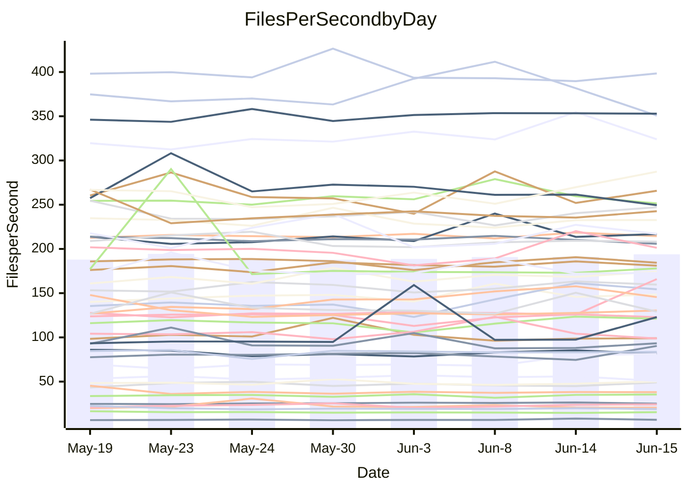

<!---
# This file is auto-generated. Do not edit.
# cspell:disable
--->
# Performance Report

Daily Performance

```mermaid
xychart-beta
    title Files Per Second by Day
    y-axis Files per Second
    x-axis Date [May-19, May-23, May-24, May-30, Jun-3, Jun-8, Jun-14, Jun-15]
    bar [187.94, 194.38, 187.53, 187.84, 188.70, 190.81, 191.12, 193.90]
    line [24.84, 24.48, 25.27, 25.51, 26.21, 25.84, 26.48, 25.01]
    line [20.00, 21.53, 30.85, 21.86, 21.33, 23.44, 20.77, 20.56]
    line [43.44, 48.37, 49.79, 45.03, 47.69, 45.74, 44.93, 49.08]
    line [16.48, 15.39, 15.58, 14.86, 15.18, 15.02, 14.65, 15.42]
    line [98.35, 102.96, 100.96, 122.12, 102.88, 96.25, 98.55, 99.04]
    line [374.77, 366.83, 370.08, 363.31, 392.45, 411.63, 381.64, 350.78]
    line [123.77, 125.73, 125.94, 125.35, 112.95, 122.50, 126.17, 122.75]
    line [85.95, 85.08, 78.77, 81.14, 78.40, 83.02, 85.34, 81.59]
    line [140.07, 144.01, 147.15, 148.03, 140.54, 160.74, 145.81, 148.34]
    line [69.47, 64.25, 69.53, 68.78, 69.37, 67.74, 79.92, 81.44]
    line [77.54, 80.59, 80.29, 81.53, 82.29, 78.36, 74.53, 90.33]
    line [212.55, 215.84, 214.38, 213.29, 217.13, 211.77, 218.65, 214.39]
    line [153.28, 151.73, 162.52, 159.30, 150.77, 155.04, 163.34, 159.60]
    line [254.35, 254.61, 250.00, 259.58, 256.09, 278.90, 259.60, 251.39]
    line [260.36, 286.42, 258.60, 257.18, 239.81, 287.65, 251.95, 265.72]
    line [135.42, 139.50, 135.65, 137.15, 123.09, 142.96, 161.35, 154.33]
    line [21.05, 22.73, 23.64, 25.47, 20.39, 21.85, 23.82, 24.25]
    line [213.89, 205.67, 207.63, 214.21, 208.82, 240.01, 213.64, 216.83]
    line [160.94, 168.26, 160.60, 178.51, 162.97, 170.78, 168.46, 174.35]
    line [319.57, 312.48, 324.31, 321.30, 332.58, 323.78, 354.69, 323.95]
    line [213.72, 212.23, 208.69, 211.05, 210.52, 214.78, 210.20, 205.78]
    line [45.35, 36.07, 38.42, 36.32, 38.54, 37.33, 38.26, 38.06]
    line [254.57, 234.26, 233.79, 236.78, 241.94, 226.60, 240.44, 247.10]
    line [33.61, 34.69, 34.94, 32.78, 35.79, 31.73, 34.98, 35.43]
    line [185.86, 188.16, 188.58, 186.13, 176.02, 184.92, 190.66, 184.43]
    line [22.53, 19.87, 18.72, 19.42, 19.15, 19.01, 19.91, 18.97]
    line [127.71, 122.71, 127.15, 126.61, 128.67, 127.50, 125.76, 165.92]
    line [257.39, 308.24, 265.00, 272.73, 270.27, 261.13, 261.42, 249.50]
    line [48.29, 48.86, 46.46, 52.80, 47.62, 46.28, 47.54, 50.24]
    line [53.17, 56.48, 52.20, 54.24, 57.32, 54.91, 55.98, 50.73]
    line [6.48, 6.70, 7.10, 6.34, 6.74, 6.70, 8.24, 6.81]
    line [147.92, 130.77, 123.22, 125.33, 127.25, 125.89, 127.61, 130.38]
    line [208.87, 215.23, 219.43, 203.27, 201.99, 207.37, 209.33, 208.22]
    line [116.06, 119.43, 116.84, 115.92, 105.51, 115.54, 123.50, 121.07]
    line [176.15, 180.59, 173.73, 184.72, 181.71, 179.92, 185.95, 181.08]
    line [84.52, 85.73, 75.59, 84.88, 83.99, 83.05, 83.17, 83.60]
    line [104.19, 103.43, 105.92, 97.87, 106.45, 123.34, 104.15, 98.74]
    line [346.15, 343.69, 358.26, 344.65, 351.41, 353.54, 353.38, 352.89]
    line [234.71, 232.57, 226.13, 246.49, 228.60, 224.05, 232.54, 232.69]
    line [217.73, 200.96, 223.84, 239.63, 201.75, 205.74, 227.27, 217.03]
    line [92.82, 111.10, 90.94, 90.56, 104.84, 87.60, 88.07, 93.31]
    line [126.78, 134.48, 131.99, 142.83, 143.00, 151.99, 157.77, 145.55]
    line [126.61, 150.87, 133.44, 130.84, 130.22, 126.80, 150.40, 129.14]
    line [177.15, 290.28, 171.42, 175.26, 173.98, 173.63, 173.03, 177.99]
    line [267.13, 229.05, 234.58, 238.79, 242.50, 237.41, 235.41, 242.68]
    line [398.12, 399.78, 393.93, 426.44, 393.52, 392.96, 389.62, 398.36]
    line [201.86, 198.76, 200.08, 195.61, 181.39, 189.21, 220.12, 201.30]
    line [93.35, 95.34, 95.32, 94.79, 159.13, 97.18, 97.48, 122.92]
    line [266.74, 265.26, 247.18, 250.86, 263.73, 251.08, 269.77, 287.34]
    line [170.67, 195.94, 175.36, 171.10, 172.66, 188.61, 172.10, 172.90]
```

Time to Process Files

| Repository                                      | Elapsed | Min/Avg/Max          |   SD | SD Graph                |
| ----------------------------------------------- | ------: | :------------------: | ---: | ----------------------- |
| AdaDoom3/AdaDoom3                    |    2.71 | 2.2 /   2.7 /   2.9  | 0.18 | `    ┣━━┻━━●━━┻━━┫    ` |
| alexiosc/megistos                    |    7.15 | 6.7 /   7.1 /   7.9  | 0.32 | `    ┣━━┻━━╋●━┻━━┫    ` |
| apollographql/apollo-server          |    2.57 | 1.4 /   2.5 /   2.8  | 0.28 | `    ┣━━┻━━╋●━┻━━┫    ` |
| aspnetboilerplate/aspnetboilerplate  |    9.09 | 7.3 /   8.8 /   9.3  | 0.43 | `    ┣━━┻━━╋━●┻━━┫    ` |
| aws-amplify/docs                     |   12.19 | 10.1 /  12.4 /  13.4 | 0.64 | `    ┣━━┻━●╋━━┻━━┫    ` |
| Azure/azure-rest-api-specs           |    8.64 | 7.6 /   9.7 /  10.8  | 0.76 | `    ┣●━┻━━╋━━┻━━┫    ` |
| bitjson/typescript-starter           |    1.05 | 0.8 /   1.0 /   1.1  | 0.07 | `     ┣━┻━━╋●━┻━┫     ` |
| caddyserver/caddy                    |    3.37 | 2.7 /   3.4 /   3.7  | 0.27 | `    ┣━━┻━━●━━┻━━┫    ` |
| canada-ca/open-source-logiciel-libre |    1.03 | 0.6 /   1.0 /   1.2  | 0.12 | `     ┣━┻━━●━━┻━┫     ` |
| chef/chef                            |    4.96 | 4.6 /   4.9 /   5.3  | 0.19 | `    ┣━━┻━━●━━┻━━┫    ` |
| dart-lang/sdk                        |   56.99 | 44.7 /  57.6 /  70.0 | 4.65 | `  ┣━━━┻━━━●━━━┻━━━┫  ` |
| django/django                        |   13.48 | 10.4 /  13.5 /  14.2 | 0.84 | `    ┣━━┻━━●━━┻━━┫    ` |
| eslint/eslint                        |   10.11 | 9.5 /   9.8 /  10.3  | 0.22 | `    ┣━━┻━━╋━━┻●━┫    ` |
| exonum/exonum                        |    3.43 | 3.3 /   3.4 /   3.7  | 0.11 | `     ┣━┻━━╋●━┻━┫     ` |
| flutter/samples                      |   11.65 | 9.0 /  12.0 /  13.6  | 1.08 | `    ┣━━┻━●╋━━┻━━┫    ` |
| gitbucket/gitbucket                  |    3.23 | 2.5 /   3.1 /   3.4  | 0.29 | `    ┣━━┻━━╋●━┻━━┫    ` |
| googleapis/google-cloud-cpp          |  123.00 | 95.0 / 118.9 / 126.5 | 8.91 | `  ┣━━━┻━━━╋━●━┻━━━┫  ` |
| graphql/express-graphql              |    1.07 | 0.9 /   1.1 /   1.3  | 0.10 | `     ┣━┻━●╋━━┻━┫     ` |
| graphql/graphql-js                   |    3.54 | 2.6 /   2.9 /   3.8  | 0.36 | `    ┣━━┻━━╋━━┻━●┫    ` |
| graphql/graphql-relay-js             |    1.12 | 1.0 /   1.1 /   1.2  | 0.04 | `     ┣━┻━━╋●━┻━┫     ` |
| graphql/graphql-spec                 |    1.23 | 1.0 /   1.3 /   1.4  | 0.07 | `     ┣━┻━●╋━━┻━┫     ` |
| iluwatar/java-design-patterns        |   11.74 | 7.1 /  11.6 /  12.3  | 1.18 | `   ┣━━━┻━━●━━┻━━━┫   ` |
| ktaranov/sqlserver-kit               |    5.86 | 5.5 /   5.9 /   7.5  | 0.43 | `    ┣━━┻━━●━━┻━━┫    ` |
| liriliri/licia                       |    4.10 | 3.0 /   3.8 /   4.1  | 0.25 | `    ┣━━┻━━╋━━●━━┫    ` |
| MartinThoma/LaTeX-examples           |    6.06 | 4.7 /   6.1 /   6.5  | 0.37 | `    ┣━━┻━━●━━┻━━┫    ` |
| mdx-js/mdx                           |    1.54 | 1.7 /   1.8 /   1.9  | 0.07 | ` ●   ┣━┻━━╋━━┻━┫     ` |
| microsoft/TypeScript-Website         |    5.16 | 4.1 /   5.2 /   5.6  | 0.33 | `    ┣━━┻━━●━━┻━━┫    ` |
| MicrosoftDocs/PowerShell-Docs        |   18.84 | 23.0 /  24.7 /  26.4 | 0.84 | `●      ┣━┻╋┻━┫       ` |
| neovim/nvim-lspconfig                |    4.94 | 4.0 /   5.1 /   5.6  | 0.32 | `    ┣━━┻━●╋━━┻━━┫    ` |
| pagekit/pagekit                      |    3.46 | 3.3 /   3.5 /   3.6  | 0.08 | `     ┣━┻━━●━━┻━┫     ` |
| php/php-src                          |   18.67 | 14.4 /  23.4 /  25.6 | 2.34 | `   ●━━┻━━━╋━━━┻━━┫   ` |
| plasticrake/tplink-smarthome-api     |    1.23 | 1.0 /   1.3 /   1.4  | 0.09 | `     ┣━┻━●╋━━┻━┫     ` |
| prettier/prettier                    |    7.69 | 7.3 /   7.7 /   8.3  | 0.23 | `    ┣━━┻━━●━━┻━━┫    ` |
| pycontribs/jira                      |    1.58 | 1.4 /   1.5 /   1.6  | 0.08 | `     ┣━┻━━╋━━┻●┫     ` |
| RustPython/RustPython                |    6.69 | 6.4 /   6.7 /   7.4  | 0.25 | `    ┣━━┻━━●━━┻━━┫    ` |
| shoelace-style/shoelace              |    2.76 | 2.7 /   2.8 /   3.0  | 0.10 | `     ┣━┻━●╋━━┻━┫     ` |
| slint-ui/slint                       |   13.43 | 11.3 /  13.5 /  14.5 | 0.68 | `    ┣━━┻━━●━━┻━━┫    ` |
| SoftwareBrothers/admin-bro           |    2.44 | 2.3 /   2.4 /   2.6  | 0.10 | `     ┣━┻━━●━━┻━┫     ` |
| sveltejs/svelte                      |   22.32 | 17.1 /  22.0 /  23.2 | 1.32 | `   ┣━━━┻━━╋●━┻━━━┫   ` |
| TheAlgorithms/Python                 |    5.31 | 4.1 /   5.4 /   5.9  | 0.45 | `    ┣━━┻━━●━━┻━━┫    ` |
| twbs/bootstrap                       |    1.45 | 1.3 /   1.7 /   1.9  | 0.13 | `     ●━┻━━╋━━┻━┫     ` |
| typescript-cheatsheets/react         |    1.17 | 0.7 /   1.1 /   1.3  | 0.13 | `     ┣━┻━━╋━●┻━┫     ` |
| typescript-eslint/typescript-eslint  |    4.08 | 3.1 /   4.1 /   4.6  | 0.29 | `    ┣━━┻━━●━━┻━━┫    ` |
| vitest-dev/vitest                    |   10.85 | 7.7 /  10.0 /  10.7  | 0.65 | `    ┣━━┻━━╋━━┻●━┫    ` |
| w3c/aria-practices                   |    3.18 | 2.5 /   3.2 /   3.4  | 0.20 | `    ┣━━┻━●╋━━┻━━┫    ` |
| w3c/specberus                        |    1.99 | 1.2 /   1.9 /   2.2  | 0.21 | `     ┣━┻━━╋●━┻━┫     ` |
| webdeveric/webpack-assets-manifest   |    1.12 | 1.0 /   1.2 /   1.4  | 0.07 | `     ┣━●━━╋━━┻━┫     ` |
| webpack/webpack                      |    5.52 | 4.2 /   5.4 /   5.9  | 0.46 | `    ┣━━┻━━╋●━┻━━┫    ` |
| wireapp/wire-desktop                 |    1.24 | 1.2 /   1.3 /   1.6  | 0.09 | `     ┣━●━━╋━━┻━┫     ` |
| wireapp/wire-webapp                  |   12.15 | 11.5 /  12.0 /  12.7 | 0.27 | `    ┣━━┻━━╋━●┻━━┫    ` |

Note:
- Elapsed time is in seconds.

Files per Second over Time

| Repository                                      | Files |    Sec |    Fps |    Rel | Trend Fps            |    N |
| ----------------------------------------------- | ----: | -----: | -----: | -----: | -------------------- | ---: |
| AdaDoom3/AdaDoom3                    |   103 |   2.71 |  38.06 | -0.51% | `▇█▃▃▅▃▃▂▃▃▄▃▄▃▄▄▃▄` |   17 |
| alexiosc/megistos                    |   583 |   7.15 |  81.59 | -1.47% | `█▇█▆▇▃▆▇▄▆▅▆▇▇█▇▇▆` |   17 |
| apollographql/apollo-server          |   255 |   2.57 |  99.04 | -5.43% | `▂▂▂▂▂▂▂█▂▂▂▁▂▂▂▂▂▂` |   17 |
| aspnetboilerplate/aspnetboilerplate  |  2286 |   9.09 | 251.39 | -3.48% | `▃▄▃▃▃▃▃▄▄▄▃▄█▄▄▃▄▃` |   17 |
| aws-amplify/docs                     |  2959 |  12.19 | 242.68 |  1.18% | `▄█▄▂▄▃▄▄▃▄▄▄▃▄▃▄▄▄` |   17 |
| Azure/azure-rest-api-specs           |  2482 |   8.64 | 287.34 | 11.32% | `▄▄▄▄▂▄▂▅▃▃▄▂▃▄▂█▃▆` |   17 |
| bitjson/typescript-starter           |    20 |   1.05 |  18.97 | -3.97% | `█▄▄▄▄▂▄▃▄▃▃▂▃▄▃▅▄▃` |   17 |
| caddyserver/caddy                    |   314 |   3.37 |  93.31 |  0.15% | `▄▄▆█▃▃▃▄▂▃▆▃▃▃▂▃▃▄` |   17 |
| canada-ca/open-source-logiciel-libre |     7 |   1.03 |   6.81 | -1.44% | `▂▃▃▂▄▂▁▂▂▃▂▂▂▃▃▂█▃` |   17 |
| chef/chef                            |  1032 |   4.96 | 208.22 | -0.35% | `▆▆█▆▇█▅▄▄▇▅▇▅▅▅█▅▆` |   17 |
| dart-lang/sdk                        | 11472 |  56.99 | 201.30 |  0.85% | `▄▅▄▄▄▅▄▄▄▄▃▄▂▄▄▄█▄` |   17 |
| django/django                        |  2922 |  13.48 | 216.83 |  0.14% | `▃▃▂▂▂▂▃▂▃▃▂▃▃█▃▃▂▃` |   17 |
| eslint/eslint                        |  2080 |  10.11 | 205.78 | -2.80% | `█▆▇▇▇▆█▇▅▇▇█▇█▅▆█▆` |   17 |
| exonum/exonum                        |   421 |   3.43 | 122.75 | -1.16% | `▆▇▇▇█▇▇█▆▆▄▇▇▅▇▇█▆` |   17 |
| flutter/samples                      |  1695 |  11.65 | 145.55 |  1.82% | `▂▂▃▂▃▂▄▃▄▂▄▄▄▅█▃▄▄` |   17 |
| gitbucket/gitbucket                  |   417 |   3.23 | 129.14 | -4.84% | `▃▂█▃▄▃▃▃▃▄▃▃▃▂▂▇█▃` |   17 |
| googleapis/google-cloud-cpp          | 21266 | 123.00 | 172.90 | -2.78% | `▃▃█▃▃▃▂▃▂▃▃▂▃█▃▂▃▃` |   17 |
| graphql/express-graphql              |    26 |   1.07 |  24.25 |  4.62% | `▃▂▃▄▄▄▄█▄▅▂▂▂▅▄▅▄▄` |   17 |
| graphql/graphql-js                   |   547 |   3.54 | 154.33 |  9.06% | `▃▂▃▃▃▂▂▃▃▃▂▃▂▅▄█▄▅` |   17 |
| graphql/graphql-relay-js             |    28 |   1.12 |  25.01 | -2.10% | `▄▅▄▅▄▇▅▆▆▅▆▆▄█▆▆█▅` |   17 |
| graphql/graphql-spec                 |    19 |   1.23 |  15.42 |  1.39% | `▃█▄▄▄▄▃▂▄▄▄▄▃▄▃▃▂▄` |   17 |
| iluwatar/java-design-patterns        |  2089 |  11.74 | 177.99 | -1.88% | `▂▂█▁▂▂▂▂▂▂▂▂▁▁▁▂▂`  |   16 |
| ktaranov/sqlserver-kit               |   490 |   5.86 |  83.60 |  0.52% | `▇▇▇▇▂▇▅███▇▆▆▇▇▆▇▇` |   17 |
| liriliri/licia                       |  1438 |   4.10 | 350.78 | -7.53% | `▃▄▂▄▃▃▃▂▃▄▄█▃▄▃▄▃▂` |   17 |
| MartinThoma/LaTeX-examples           |  1409 |   6.06 | 232.69 | -0.39% | `▃▄▃▃▃▂█▃▃▃▃▂▂▃▃▃▃▃` |   17 |
| mdx-js/mdx                           |   139 |   1.54 |  90.33 | 14.26% | `▃▆▄▆▅▅▆▅▆▅▆▅▄▄▄▃▃█` |   17 |
| microsoft/TypeScript-Website         |   765 |   5.16 | 148.34 |  0.28% | `▃▂▃▃▂▄▃▃▃▄▃▄█▃▄▃▂▃` |   17 |
| MicrosoftDocs/PowerShell-Docs        |  3126 |  18.84 | 165.92 | 31.19% | `▃▄▂▃▄▃▂▃▄▃▃▄▃▂▃▃▃█` |   17 |
| neovim/nvim-lspconfig                |   861 |   4.94 | 174.35 |  3.12% | `▃▃▃▃▂▃▃█▄▃▃▄▄▃▄▄▃▄` |   17 |
| pagekit/pagekit                      |   741 |   3.46 | 214.39 | -0.07% | `▅▇▆█▆▆▅▅█▆▇▇▅▅▆██▆` |   17 |
| php/php-src                          |  2295 |  18.67 | 122.92 | 23.62% | `▁▂▂▂▂▂▂▂▂▂█▂▂▂▂▃▂▅` |   17 |
| plasticrake/tplink-smarthome-api     |    62 |   1.23 |  50.24 |  3.21% | `▄▄▄▄▄▂█▅▅▄▄▃▄▂▃▄▄▅` |   17 |
| prettier/prettier                    |  2712 |   7.69 | 352.89 |  0.88% | `▆▆▅▆▇▇█▅▇▄▇▆█▆▇▆▇▇` |   17 |
| pycontribs/jira                      |    80 |   1.58 |  50.73 | -7.33% | `▄▇▇▇▅▅▇▅█▃█▄█▇█▇▇▄` |   17 |
| RustPython/RustPython                |   810 |   6.69 | 121.07 |  3.37% | `▆▆█▆▆▆▅▆▅▇▃▄▅███▇▇` |   17 |
| shoelace-style/shoelace              |   440 |   2.76 | 159.60 |  1.31% | `▇▄▄▆█▇▇▇▇▆▅▇▅▆██▇▇` |   17 |
| slint-ui/slint                       |  3318 |  13.43 | 247.10 |  4.09% | `█▃▃▄▄▄▃▄▄▅▅▃▃▃▄▄▅▅` |   17 |
| SoftwareBrothers/admin-bro           |   441 |   2.44 | 181.08 | -0.03% | `▆▄▇▅▅▅▇█▇▄▆▆▆▅▇▇▇▆` |   17 |
| sveltejs/svelte                      |  8893 |  22.32 | 398.36 | -0.86% | `▃▃▃▃▃▂▃█▃▃▃▃▂▃▃▂▃▃` |   17 |
| TheAlgorithms/Python                 |  1411 |   5.31 | 265.72 |  0.43% | `▄▃▂▇▃▄▃▃▃▃▂█▃▃▃▃▂▃` |   17 |
| twbs/bootstrap                       |   118 |   1.45 |  81.44 | 15.95% | `▄▄▂▃▄▄▄▄▄▃▄▄▃▃▃█▆▆` |   17 |
| typescript-cheatsheets/react         |    24 |   1.17 |  20.56 | -9.46% | `▂▁▂▂█▄▃▂▂▂▂▂▂▅▂▂▂▂` |   17 |
| typescript-eslint/typescript-eslint  |  1321 |   4.08 | 323.95 | -1.06% | `▃▄▂▄▃▄▃▄▄▃▄▃▃▄▃█▄▄` |   17 |
| vitest-dev/vitest                    |  2708 |  10.85 | 249.50 | -7.59% | `▂▂▃█▃▃▄▄▃▃▃▃▃▂▃▂▃▂` |   17 |
| w3c/aria-practices                   |   414 |   3.18 | 130.38 |  1.08% | `▃█▃▃▂▃▃▂▃▂▃▃▃▃▃▃▃▃` |   17 |
| w3c/specberus                        |   196 |   1.99 |  98.74 | -7.14% | `▃▂▂▃▃▃▃▂▁▂▃█▂▃▃▂▃▂` |   17 |
| webdeveric/webpack-assets-manifest   |    55 |   1.12 |  49.08 |  6.57% | `▅▂▅▆█▅▅▄▄▄▅▅▅▄▃▅▅▆` |   17 |
| webpack/webpack                      |  1199 |   5.52 | 217.03 | -2.00% | `▃▄▂▄▄▄█▄▄▂▂▃▃▇▃▃▃`  |   16 |
| wireapp/wire-desktop                 |    44 |   1.24 |  35.43 |  5.03% | `█▅▇██▇█▆▇▃█▆▃▆██▇█` |   17 |
| wireapp/wire-webapp                  |  2241 |  12.15 | 184.43 | -1.17% | `▇▆▆▇▇▆▆▆▆▆▄▅▇▆▇█▆▆` |   17 |

Data Throughput

| Repository                                      | Files |    Sec |     Kps |    Rel | Trend Kps            |    N |
| ----------------------------------------------- | ----: | -----: | ------: | -----: | -------------------- | ---: |
| AdaDoom3/AdaDoom3                    |   103 |   2.71 |  808.79 | -0.51% | `▇█▃▃▅▃▃▂▃▃▄▃▄▃▄▄▃▄` |   17 |
| alexiosc/megistos                    |   583 |   7.15 |  641.07 | -1.47% | `█▇█▆▇▃▆▇▄▆▅▆▇▇█▇▇▆` |   17 |
| apollographql/apollo-server          |   255 |   2.57 |  818.34 | -5.43% | `▂▂▂▂▂▂▂█▂▂▂▁▂▂▂▂▂▂` |   17 |
| aspnetboilerplate/aspnetboilerplate  |  2286 |   9.09 |  611.64 | -3.48% | `▃▄▃▃▃▃▃▄▄▄▃▄█▄▄▃▄▃` |   17 |
| aws-amplify/docs                     |  2959 |  12.19 |  877.56 |  1.18% | `▄█▄▂▄▃▄▄▃▄▄▄▃▄▃▄▄▄` |   17 |
| Azure/azure-rest-api-specs           |  2482 |   8.64 |  874.87 | 12.74% | `▄▄▄▄▂▄▂▅▃▃▄▂▃▄▃█▃▆` |   17 |
| bitjson/typescript-starter           |    20 |   1.05 |   75.87 | -3.97% | `█▄▄▄▄▂▄▃▄▃▃▂▃▄▃▅▄▃` |   17 |
| caddyserver/caddy                    |   314 |   3.37 |  843.95 |  1.07% | `▄▄▆█▃▃▃▄▂▃▆▃▃▃▂▄▃▄` |   17 |
| canada-ca/open-source-logiciel-libre |     7 |   1.03 |   56.43 | -1.44% | `▂▃▃▂▄▂▁▂▂▃▂▂▂▃▃▂█▃` |   17 |
| chef/chef                            |  1032 |   4.96 | 1021.33 | -0.21% | `▆▆█▆▇█▅▄▄▇▅▇▅▅▅█▅▆` |   17 |
| dart-lang/sdk                        | 11472 |  56.99 | 1373.84 |  0.74% | `▄▅▄▄▄▅▄▄▄▄▃▄▂▄▄▄█▄` |   17 |
| django/django                        |  2922 |  13.48 | 1390.65 |  0.15% | `▃▃▂▂▂▂▃▂▃▃▂▃▃█▃▃▂▃` |   17 |
| eslint/eslint                        |  2080 |  10.11 | 1431.88 | -2.78% | `█▆▇▇▇▆█▇▅▇▇█▇█▅▆█▆` |   17 |
| exonum/exonum                        |   421 |   3.43 | 1174.16 | -1.16% | `▆▇▇▇█▇▇█▆▆▄▇▇▅▇▇█▆` |   17 |
| flutter/samples                      |  1695 |  11.65 |  871.17 |  1.82% | `▂▂▃▂▃▂▄▃▄▂▄▄▄▅█▃▄▄` |   17 |
| gitbucket/gitbucket                  |   417 |   3.23 |  615.96 | -4.81% | `▃▂█▃▄▃▃▃▃▄▃▃▃▂▂▇█▃` |   17 |
| googleapis/google-cloud-cpp          | 21266 | 123.00 | 1489.76 | -2.07% | `▂▃█▃▃▃▂▃▂▃▃▂▃█▃▂▃▃` |   17 |
| graphql/express-graphql              |    26 |   1.07 |  111.01 |  4.62% | `▃▂▃▄▄▄▄█▄▅▂▂▂▅▄▅▄▄` |   17 |
| graphql/graphql-js                   |   547 |   3.54 | 1140.16 | 27.59% | `▂▂▂▂▂▂▂▂▂▂▁▂▂▆▅█▅▅` |   17 |
| graphql/graphql-relay-js             |    28 |   1.12 |   98.27 | -2.10% | `▄▅▄▅▄▇▅▆▆▅▆▆▄█▆▆█▅` |   17 |
| graphql/graphql-spec                 |    19 |   1.23 |  516.12 |  1.64% | `▃█▄▄▄▄▃▂▄▄▄▄▃▄▃▄▂▄` |   17 |
| iluwatar/java-design-patterns        |  2089 |  11.74 |  548.36 | -1.92% | `▂▂█▂▂▂▂▂▂▂▂▂▁▁▁▂▂`  |   16 |
| ktaranov/sqlserver-kit               |   490 |   5.86 | 1266.49 |  0.52% | `▇▇▇▇▂▇▅███▇▆▆▇▇▆▇▇` |   17 |
| liriliri/licia                       |  1438 |   4.10 |  418.60 | -7.53% | `▃▄▂▄▃▃▃▂▃▄▄█▃▄▃▄▃▂` |   17 |
| MartinThoma/LaTeX-examples           |  1409 |   6.06 |  480.58 | -0.39% | `▃▄▃▃▃▂█▃▃▃▃▂▂▃▃▃▃▃` |   17 |
| mdx-js/mdx                           |   139 |   1.54 |  422.39 | 14.21% | `▃▆▄▆▅▅▆▅▆▅▆▅▄▄▄▃▃█` |   17 |
| microsoft/TypeScript-Website         |   765 |   5.16 | 1021.68 |  0.28% | `▃▂▃▃▂▄▃▃▃▄▃▄█▃▄▃▂▃` |   17 |
| MicrosoftDocs/PowerShell-Docs        |  3126 |  18.84 | 1768.48 | 31.22% | `▃▄▂▃▄▃▂▃▄▃▃▄▃▂▃▃▃█` |   17 |
| neovim/nvim-lspconfig                |   861 |   4.94 |  511.11 |  3.13% | `▃▃▃▃▂▃▃█▄▃▃▄▄▃▄▄▃▄` |   17 |
| pagekit/pagekit                      |   741 |   3.46 |  447.01 | -0.07% | `▅▇▆█▆▆▅▅█▆▇▇▅▅▆██▆` |   17 |
| php/php-src                          |  2295 |  18.67 | 2163.63 | 23.70% | `▁▂▂▂▂▂▂▂▂▂█▂▂▂▂▃▂▅` |   17 |
| plasticrake/tplink-smarthome-api     |    62 |   1.23 |  271.45 |  3.21% | `▄▄▄▄▄▂█▅▅▄▄▃▄▂▃▄▄▅` |   17 |
| prettier/prettier                    |  2712 |   7.69 |  481.98 |  0.46% | `▆▆▅▆▇▇█▅▇▄▇▆█▆▇▆▇▇` |   17 |
| pycontribs/jira                      |    80 |   1.58 |  358.31 | -7.33% | `▄▇▇▇▅▅▇▅█▃█▄█▇█▇▇▄` |   17 |
| RustPython/RustPython                |   810 |   6.69 | 1959.53 | -0.54% | `▆▆█▆▆▇▆▆▅█▃▄▆▇▇▇▆▆` |   17 |
| shoelace-style/shoelace              |   440 |   2.76 |  770.80 |  1.31% | `▇▄▄▆█▇▇▇▇▆▅▇▅▆██▇▇` |   17 |
| slint-ui/slint                       |  3318 |  13.43 | 1300.94 |  4.73% | `█▃▃▄▄▄▃▄▄▅▅▃▃▃▄▄▅▅` |   17 |
| SoftwareBrothers/admin-bro           |   441 |   2.44 |  399.11 | -0.03% | `▆▄▇▅▅▅▇█▇▄▆▆▆▅▇▇▇▆` |   17 |
| sveltejs/svelte                      |  8893 |  22.32 |  272.00 | -0.38% | `▃▃▃▃▃▂▃█▃▃▃▃▂▃▃▃▃▃` |   17 |
| TheAlgorithms/Python                 |  1411 |   5.31 |  679.27 |  0.51% | `▄▃▂▇▃▄▃▃▃▃▂█▃▄▃▃▂▃` |   17 |
| twbs/bootstrap                       |   118 |   1.45 |  668.05 | 15.86% | `▄▄▂▃▄▄▄▄▄▃▄▄▃▃▃█▆▆` |   17 |
| typescript-cheatsheets/react         |    24 |   1.17 |  185.94 | -9.14% | `▂▁▂▂█▄▃▂▂▂▂▂▂▅▂▂▂▂` |   17 |
| typescript-eslint/typescript-eslint  |  1321 |   4.08 | 1766.63 | -0.50% | `▃▄▂▄▃▄▃▄▄▃▄▃▃▄▃█▄▄` |   17 |
| vitest-dev/vitest                    |  2708 |  10.85 |  659.03 | -6.09% | `▂▂▃█▃▃▃▄▃▃▃▃▃▂▃▃▃▂` |   17 |
| w3c/aria-practices                   |   414 |   3.18 | 1218.16 |  1.08% | `▃█▃▃▂▃▃▂▃▂▃▃▃▃▃▃▃▃` |   17 |
| w3c/specberus                        |   196 |   1.99 |  321.90 | -7.14% | `▃▂▂▃▃▃▃▂▁▂▃█▂▃▃▂▃▂` |   17 |
| webdeveric/webpack-assets-manifest   |    55 |   1.12 |  112.45 |  6.57% | `▅▂▅▆█▅▅▄▄▄▅▅▅▄▃▅▅▆` |   17 |
| webpack/webpack                      |  1199 |   5.52 | 1156.99 |  2.28% | `▃▄▂▄▄▄█▄▄▂▂▃▄█▄▄▄`  |   16 |
| wireapp/wire-desktop                 |    44 |   1.24 |  159.46 |  6.83% | `█▅▆█▇▇▇▆▆▃█▆▃▇██▇█` |   17 |
| wireapp/wire-webapp                  |  2241 |  12.15 |  765.31 | -1.68% | `▇▆▇▇▇▇▆▇▇▇▄▅▇▆▇█▆▆` |   17 |

