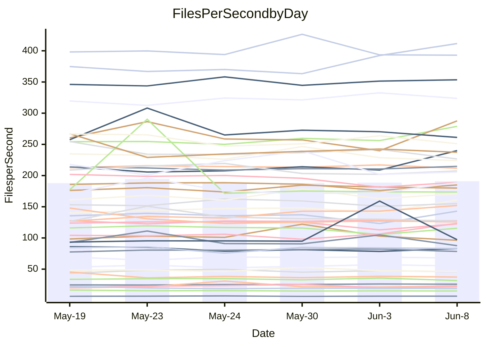

<!---
# This file is auto-generated. Do not edit.
# cspell:disable
--->
# Performance Report

Daily Performance

```mermaid
xychart-beta
    title Files Per Second by Day
    y-axis Files per Second
    x-axis Date [May-19, May-23, May-24, May-30, Jun-3, Jun-8]
    bar [187.94, 194.38, 187.53, 187.84, 188.70, 190.81]
    line [24.84, 24.48, 25.27, 25.51, 26.21, 25.84]
    line [20.00, 21.53, 30.85, 21.86, 21.33, 23.44]
    line [43.44, 48.37, 49.79, 45.03, 47.69, 45.74]
    line [16.48, 15.39, 15.58, 14.86, 15.18, 15.02]
    line [98.35, 102.96, 100.96, 122.12, 102.88, 96.25]
    line [374.77, 366.83, 370.08, 363.31, 392.45, 411.63]
    line [123.77, 125.73, 125.94, 125.35, 112.95, 122.50]
    line [85.95, 85.08, 78.77, 81.14, 78.40, 83.02]
    line [140.07, 144.01, 147.15, 148.03, 140.54, 160.74]
    line [69.47, 64.25, 69.53, 68.78, 69.37, 67.74]
    line [77.54, 80.59, 80.29, 81.53, 82.29, 78.36]
    line [212.55, 215.84, 214.38, 213.29, 217.13, 211.77]
    line [153.28, 151.73, 162.52, 159.30, 150.77, 155.04]
    line [254.35, 254.61, 250.00, 259.58, 256.09, 278.90]
    line [260.36, 286.42, 258.60, 257.18, 239.81, 287.65]
    line [135.42, 139.50, 135.65, 137.15, 123.09, 142.96]
    line [21.05, 22.73, 23.64, 25.47, 20.39, 21.85]
    line [213.89, 205.67, 207.63, 214.21, 208.82, 240.01]
    line [160.94, 168.26, 160.60, 178.51, 162.97, 170.78]
    line [319.57, 312.48, 324.31, 321.30, 332.58, 323.78]
    line [213.72, 212.23, 208.69, 211.05, 210.52, 214.78]
    line [45.35, 36.07, 38.42, 36.32, 38.54, 37.33]
    line [254.57, 234.26, 233.79, 236.78, 241.94, 226.60]
    line [33.61, 34.69, 34.94, 32.78, 35.79, 31.73]
    line [185.86, 188.16, 188.58, 186.13, 176.02, 184.92]
    line [22.53, 19.87, 18.72, 19.42, 19.15, 19.01]
    line [127.71, 122.71, 127.15, 126.61, 128.67, 127.50]
    line [257.39, 308.24, 265.00, 272.73, 270.27, 261.13]
    line [48.29, 48.86, 46.46, 52.80, 47.62, 46.28]
    line [53.17, 56.48, 52.20, 54.24, 57.32, 54.91]
    line [6.48, 6.70, 7.10, 6.34, 6.74, 6.70]
    line [147.92, 130.77, 123.22, 125.33, 127.25, 125.89]
    line [208.87, 215.23, 219.43, 203.27, 201.99, 207.37]
    line [116.06, 119.43, 116.84, 115.92, 105.51, 115.54]
    line [176.15, 180.59, 173.73, 184.72, 181.71, 179.92]
    line [84.52, 85.73, 75.59, 84.88, 83.99, 83.05]
    line [104.19, 103.43, 105.92, 97.87, 106.45, 123.34]
    line [346.15, 343.69, 358.26, 344.65, 351.41, 353.54]
    line [234.71, 232.57, 226.13, 246.49, 228.60, 224.05]
    line [217.73, 200.96, 223.84, 239.63, 201.75, 205.74]
    line [92.82, 111.10, 90.94, 90.56, 104.84, 87.60]
    line [126.78, 134.48, 131.99, 142.83, 143.00, 151.99]
    line [126.61, 150.87, 133.44, 130.84, 130.22, 126.80]
    line [177.15, 290.28, 171.42, 175.26, 173.98, 173.63]
    line [267.13, 229.05, 234.58, 238.79, 242.50, 237.41]
    line [398.12, 399.78, 393.93, 426.44, 393.52, 392.96]
    line [201.86, 198.76, 200.08, 195.61, 181.39, 189.21]
    line [93.35, 95.34, 95.32, 94.79, 159.13, 97.18]
    line [266.74, 265.26, 247.18, 250.86, 263.73, 251.08]
    line [170.67, 195.94, 175.36, 171.10, 172.66, 188.61]
```

Time to Process Files

| Repository                                      | Elapsed | Min/Avg/Max          |   SD | SD Graph                |
| ----------------------------------------------- | ------: | :------------------: | ---: | ----------------------- |
| AdaDoom3/AdaDoom3                    |    2.79 | 2.2 /   2.7 /   2.9  | 0.20 | `    ┣━━┻━━╋●━┻━━┫    ` |
| alexiosc/megistos                    |    7.00 | 6.7 /   7.1 /   7.9  | 0.35 | `    ┣━━┻━●╋━━┻━━┫    ` |
| apollographql/apollo-server          |    2.56 | 1.4 /   2.5 /   2.8  | 0.31 | `    ┣━━┻━━╋●━┻━━┫    ` |
| aspnetboilerplate/aspnetboilerplate  |    8.62 | 7.3 /   8.8 /   9.3  | 0.46 | `    ┣━━┻━●╋━━┻━━┫    ` |
| aws-amplify/docs                     |   12.46 | 10.1 /  12.3 /  13.4 | 0.72 | `    ┣━━┻━━╋●━┻━━┫    ` |
| Azure/azure-rest-api-specs           |    9.25 | 9.1 /   9.8 /  10.8  | 0.56 | `    ┣━━●━━╋━━┻━━┫    ` |
| bitjson/typescript-starter           |    1.01 | 0.8 /   1.0 /   1.1  | 0.08 | `     ┣━┻━●╋━━┻━┫     ` |
| caddyserver/caddy                    |    3.57 | 2.7 /   3.3 /   3.7  | 0.28 | `    ┣━━┻━━╋━●┻━━┫    ` |
| canada-ca/open-source-logiciel-libre |    1.02 | 0.9 /   1.1 /   1.2  | 0.07 | `     ┣━┻━●╋━━┻━┫     ` |
| chef/chef                            |    5.01 | 4.6 /   4.9 /   5.3  | 0.20 | `    ┣━━┻━━╋●━┻━━┫    ` |
| dart-lang/sdk                        |   56.41 | 55.5 /  58.8 /  70.0 | 3.71 | `  ┣━━━┻━●━╋━━━┻━━━┫  ` |
| django/django                        |   10.40 | 13.1 /  13.7 /  14.2 | 0.34 | `●       ┣┻╋┻┫        ` |
| eslint/eslint                        |    9.58 | 9.5 /   9.8 /  10.3  | 0.21 | `    ┣━━●━━╋━━┻━━┫    ` |
| exonum/exonum                        |    3.58 | 3.3 /   3.4 /   3.7  | 0.11 | `    ┣━━┻━━╋━━┻━●┫    ` |
| flutter/samples                      |   11.01 | 11.1 /  12.3 /  13.6 | 0.80 | `    ┣●━┻━━╋━━┻━━┫    ` |
| gitbucket/gitbucket                  |    3.37 | 2.5 /   3.1 /   3.4  | 0.22 | `    ┣━━┻━━╋━━●━━┫    ` |
| googleapis/google-cloud-cpp          |   95.33 | 95.0 / 119.7 / 125.2 | 7.37 | `●   ┣━━┻━━╋━━┻━━┫    ` |
| graphql/express-graphql              |    1.05 | 0.9 /   1.1 /   1.3  | 0.11 | `     ┣━┻●━╋━━┻━┫     ` |
| graphql/graphql-js                   |    3.48 | 2.6 /   2.7 /   3.0  | 0.13 | `      ┣━┻━╋━┻━┫     ●` |
| graphql/graphql-relay-js             |    1.02 | 1.1 /   1.1 /   1.2  | 0.04 | `   ● ┣━┻━━╋━━┻━┫     ` |
| graphql/graphql-spec                 |    1.23 | 1.0 /   1.2 /   1.4  | 0.08 | `     ┣━┻━━●━━┻━┫     ` |
| iluwatar/java-design-patterns        |   12.27 | 7.1 /  11.4 /  12.1  | 1.31 | `   ┣━━━┻━━╋━●┻━━━┫   ` |
| ktaranov/sqlserver-kit               |    5.78 | 5.5 /   5.9 /   7.5  | 0.49 | `    ┣━━┻━●╋━━┻━━┫    ` |
| liriliri/licia                       |    3.77 | 3.0 /   3.8 /   4.1  | 0.28 | `    ┣━━┻━━●━━┻━━┫    ` |
| MartinThoma/LaTeX-examples           |    6.08 | 4.7 /   6.1 /   6.5  | 0.43 | `    ┣━━┻━━●━━┻━━┫    ` |
| mdx-js/mdx                           |    1.79 | 1.7 /   1.7 /   1.9  | 0.06 | `     ┣━┻━━╋━●┻━┫     ` |
| microsoft/TypeScript-Website         |    5.27 | 4.1 /   5.2 /   5.6  | 0.36 | `    ┣━━┻━━╋●━┻━━┫    ` |
| MicrosoftDocs/PowerShell-Docs        |   26.41 | 23.0 /  24.6 /  25.8 | 0.79 | `   ┣━━━┻━━╋━━┻━━━┫●  ` |
| neovim/nvim-lspconfig                |    5.21 | 4.0 /   5.1 /   5.6  | 0.36 | `    ┣━━┻━━╋●━┻━━┫    ` |
| pagekit/pagekit                      |    3.52 | 3.3 /   3.5 /   3.6  | 0.08 | `     ┣━┻━━╋━●┻━┫     ` |
| php/php-src                          |   23.91 | 14.4 /  23.3 /  25.6 | 2.64 | `   ┣━━┻━━━╋●━━┻━━┫   ` |
| plasticrake/tplink-smarthome-api     |    1.40 | 1.0 /   1.3 /   1.4  | 0.09 | `     ┣━┻━━╋━━┻●┫     ` |
| prettier/prettier                    |    7.82 | 7.3 /   7.7 /   8.3  | 0.25 | `    ┣━━┻━━╋━●┻━━┫    ` |
| pycontribs/jira                      |    1.42 | 1.4 /   1.5 /   1.6  | 0.08 | `     ┣━┻●━╋━━┻━┫     ` |
| RustPython/RustPython                |    6.55 | 6.4 /   6.8 /   7.4  | 0.26 | `    ┣━━●━━╋━━┻━━┫    ` |
| shoelace-style/shoelace              |    2.85 | 2.7 /   2.8 /   3.0  | 0.10 | `     ┣━┻━━╋●━┻━┫     ` |
| slint-ui/slint                       |   14.51 | 11.3 /  13.4 /  14.3 | 0.69 | `    ┣━━┻━━╋━━┻━●┫    ` |
| SoftwareBrothers/admin-bro           |    2.53 | 2.3 /   2.4 /   2.6  | 0.10 | `     ┣━┻━━╋━●┻━┫     ` |
| sveltejs/svelte                      |   21.96 | 17.1 /  21.8 /  23.2 | 1.44 | `   ┣━━━┻━━●━━┻━━━┫   ` |
| TheAlgorithms/Python                 |    5.31 | 4.1 /   5.3 /   5.9  | 0.50 | `    ┣━━┻━━●━━┻━━┫    ` |
| twbs/bootstrap                       |    1.76 | 1.7 /   1.7 /   1.9  | 0.07 | `     ┣━┻━━╋●━┻━┫     ` |
| typescript-cheatsheets/react         |    0.87 | 0.7 /   1.1 /   1.3  | 0.14 | `     ┣●┻━━╋━━┻━┫     ` |
| typescript-eslint/typescript-eslint  |    4.02 | 3.9 /   4.1 /   4.6  | 0.17 | `    ┣━━┻●━╋━━┻━━┫    ` |
| vitest-dev/vitest                    |   10.70 | 7.7 /   9.9 /  10.5  | 0.68 | `    ┣━━┻━━╋━━┻●━┫    ` |
| w3c/aria-practices                   |    3.31 | 2.5 /   3.2 /   3.4  | 0.23 | `    ┣━━┻━━╋●━┻━━┫    ` |
| w3c/specberus                        |    1.89 | 1.2 /   1.9 /   2.2  | 0.23 | `    ┣━━┻━━●━━┻━━┫    ` |
| webdeveric/webpack-assets-manifest   |    1.25 | 1.0 /   1.2 /   1.4  | 0.07 | `     ┣━┻━━╋━●┻━┫     ` |
| webpack/webpack                      |    5.64 | 4.2 /   5.3 /   5.9  | 0.45 | `    ┣━━┻━━╋━●┻━━┫    ` |
| wireapp/wire-desktop                 |    1.32 | 1.3 /   1.4 /   1.6  | 0.10 | `     ┣━┻━●╋━━┻━┫     ` |
| wireapp/wire-webapp                  |   12.22 | 11.8 /  12.0 /  12.7 | 0.25 | `    ┣━━┻━━╋━●┻━━┫    ` |

Note:
- Elapsed time is in seconds.

Files per Second over Time

| Repository                                      | Files |   Sec |    Fps |     Rel | Trend Fps        |    N |
| ----------------------------------------------- | ----: | ----: | -----: | ------: | ---------------- | ---: |
| AdaDoom3/AdaDoom3                    |   103 |  2.79 |  36.94 |  -3.68% | `▇█▃▃▅▃▃▂▃▃▄▃▄▃` |   13 |
| alexiosc/megistos                    |   583 |  7.00 |  83.25 |   1.30% | `█▇█▆▇▃▆▇▄▆▅▆▇▇` |   13 |
| apollographql/apollo-server          |   255 |  2.56 |  99.50 |  -6.61% | `▂▂▂▂▂▂▂█▂▂▂▁▂▂` |   13 |
| aspnetboilerplate/aspnetboilerplate  |  2286 |  8.62 | 265.32 |   1.94% | `▃▄▃▃▃▃▃▄▄▄▃▄█▄` |   13 |
| aws-amplify/docs                     |  2959 | 12.46 | 237.53 |  -1.47% | `▄█▄▂▄▃▄▄▃▄▄▄▃▄` |   13 |
| Azure/azure-rest-api-specs           |  2482 |  9.25 | 268.33 |   5.37% | `▇▇▇█▃▇▃█▆▅▇▃▅▇` |   13 |
| bitjson/typescript-starter           |    20 |  1.01 |  19.89 |   0.91% | `█▄▄▄▄▂▄▃▄▃▃▂▃▄` |   13 |
| caddyserver/caddy                    |   314 |  3.57 |  88.07 |  -7.04% | `▄▄▆█▃▃▃▄▂▃▆▃▃▃` |   13 |
| canada-ca/open-source-logiciel-libre |     7 |  1.02 |   6.84 |   3.53% | `▃▆▆▄█▅▂▅▃▆▅▅▅▆` |   13 |
| chef/chef                            |  1032 |  5.01 | 206.11 |  -1.42% | `▆▆█▆▇█▅▄▄▇▅▇▅▅` |   13 |
| dart-lang/sdk                        | 11472 | 56.41 | 203.38 |   4.53% | `▇██▇▇█▇▆▇▇▅█▃█` |   13 |
| django/django                        |  2922 | 10.40 | 281.06 |  32.43% | `▃▃▂▂▂▂▃▂▃▃▂▃▃█` |   13 |
| eslint/eslint                        |  2080 |  9.58 | 217.12 |   2.59% | `█▆▇▇▇▆█▇▅▇▇█▇█` |   13 |
| exonum/exonum                        |   421 |  3.58 | 117.53 |  -5.40% | `▆▇▇▇█▇▇█▇▇▄▇▇▅` |   13 |
| flutter/samples                      |  1695 | 11.01 | 153.89 |  10.96% | `▃▃▅▄▄▄▇▆▇▄▆█▇█` |   13 |
| gitbucket/gitbucket                  |   417 |  3.37 | 123.67 |  -7.18% | `▃▂█▃▄▃▃▃▃▄▃▃▃▂` |   13 |
| googleapis/google-cloud-cpp          | 21266 | 95.33 | 223.07 |  26.98% | `▃▃█▃▃▃▂▃▂▃▃▂▃█` |   13 |
| graphql/express-graphql              |    26 |  1.05 |  24.72 |   7.86% | `▃▂▃▄▄▄▄█▄▅▂▂▂▅` |   13 |
| graphql/graphql-js                   |   547 |  3.48 | 157.40 |  15.98% | `▅▄▅▅▅▄▃▅▅▅▃▅▄█` |   13 |
| graphql/graphql-relay-js             |    28 |  1.02 |  27.54 |   9.35% | `▄▅▄▅▄▇▅▆▆▅▆▆▄█` |   13 |
| graphql/graphql-spec                 |    19 |  1.23 |  15.42 |   0.68% | `▃█▄▄▄▄▃▂▄▄▄▄▃▄` |   13 |
| iluwatar/java-design-patterns        |  2089 | 12.27 | 170.20 |  -7.71% | `▂▂█▁▂▂▂▂▂▂▂▂▁`  |   12 |
| ktaranov/sqlserver-kit               |   490 |  5.78 |  84.71 |   2.00% | `▇▇▇▇▂▇▅███▇▆▆▇` |   13 |
| liriliri/licia                       |  1438 |  3.77 | 380.97 |   0.60% | `▃▄▂▄▃▃▃▂▃▄▄█▃▄` |   13 |
| MartinThoma/LaTeX-examples           |  1409 |  6.08 | 231.56 |  -1.04% | `▃▄▃▃▃▂█▃▃▃▃▂▂▃` |   13 |
| mdx-js/mdx                           |   139 |  1.79 |  77.77 |  -3.03% | `▄█▆█▇▇█▇█▇█▆▆▆` |   13 |
| microsoft/TypeScript-Website         |   765 |  5.27 | 145.20 |  -2.30% | `▃▂▃▃▂▄▃▃▃▄▃▄█▃` |   13 |
| MicrosoftDocs/PowerShell-Docs        |  3126 | 26.41 | 118.36 |  -6.99% | `▅▇▄▅▆▅▄▆▇▅▆█▆▃` |   13 |
| neovim/nvim-lspconfig                |   861 |  5.21 | 165.35 |  -2.45% | `▃▃▃▃▂▃▃█▄▃▃▄▄▃` |   13 |
| pagekit/pagekit                      |   741 |  3.52 | 210.47 |  -1.60% | `▅▇▆█▆▆▅▅█▆▇▇▅▅` |   13 |
| php/php-src                          |  2295 | 23.91 |  96.00 |  -4.14% | `▁▂▂▂▂▂▂▂▂▂█▂▂▂` |   13 |
| plasticrake/tplink-smarthome-api     |    62 |  1.40 |  44.16 | -10.40% | `▄▄▄▄▄▂█▅▅▄▄▃▄▂` |   13 |
| prettier/prettier                    |  2712 |  7.82 | 346.70 |  -0.73% | `▆▆▅▆▇▇█▅▇▄▇▆█▆` |   13 |
| pycontribs/jira                      |    80 |  1.42 |  56.38 |   3.77% | `▄▇▇▇▅▅▇▅█▃█▄█▇` |   13 |
| RustPython/RustPython                |   810 |  6.55 | 123.65 |   7.39% | `▆▆█▆▆▆▆▆▅█▃▄▆█` |   13 |
| shoelace-style/shoelace              |   440 |  2.85 | 154.42 |  -1.29% | `▇▄▄▇██▇██▇▅▇▅▆` |   13 |
| slint-ui/slint                       |  3318 | 14.51 | 228.73 |  -3.63% | `█▃▃▄▄▄▃▄▄▅▅▃▃▃` |   13 |
| SoftwareBrothers/admin-bro           |   441 |  2.53 | 174.49 |  -3.34% | `▆▄▇▅▅▅▇█▇▄▆▆▆▅` |   13 |
| sveltejs/svelte                      |  8893 | 21.96 | 404.93 |   0.14% | `▃▃▃▃▃▂▃█▃▃▃▃▂▃` |   13 |
| TheAlgorithms/Python                 |  1411 |  5.31 | 265.88 |  -0.57% | `▄▃▂▇▃▄▃▃▃▃▂█▃▃` |   13 |
| twbs/bootstrap                       |   118 |  1.76 |  67.12 |  -1.63% | `█▇▃▇█▇▇█▇▆▇█▅▆` |   13 |
| typescript-cheatsheets/react         |    24 |  0.87 |  27.53 |  20.78% | `▂▁▂▂█▄▃▂▂▂▂▂▂▅` |   13 |
| typescript-eslint/typescript-eslint  |  1321 |  4.02 | 328.67 |   2.39% | `▅█▃█▇▇▆▇▇▅█▇▆▇` |   13 |
| vitest-dev/vitest                    |  2708 | 10.70 | 253.19 |  -7.35% | `▂▂▃█▃▃▃▄▃▃▃▃▃▂` |   13 |
| w3c/aria-practices                   |   414 |  3.31 | 125.26 |  -3.35% | `▃█▃▃▂▃▃▂▃▂▃▃▃▃` |   13 |
| w3c/specberus                        |   196 |  1.89 | 103.73 |  -3.08% | `▃▂▂▃▃▃▃▂▁▂▃█▂▃` |   13 |
| webdeveric/webpack-assets-manifest   |    55 |  1.25 |  44.17 |  -4.95% | `▅▂▅▆█▅▅▄▄▄▅▅▅▄` |   13 |
| webpack/webpack                      |  1199 |  5.64 | 212.51 |  -3.74% | `▃▄▂▄▄▄█▄▄▂▂▃▃`  |   12 |
| wireapp/wire-desktop                 |    44 |  1.32 |  33.32 |  -0.48% | `█▅▇██▇█▆▇▃█▆▃▆` |   13 |
| wireapp/wire-webapp                  |  2241 | 12.22 | 183.43 |  -1.34% | `█▇███▇▇▇▇▇▅▆█▇` |   13 |

Data Throughput

| Repository                                      | Files |   Sec |     Kps |     Rel | Trend Kps        |    N |
| ----------------------------------------------- | ----: | ----: | ------: | ------: | ---------------- | ---: |
| AdaDoom3/AdaDoom3                    |   103 |  2.79 |  785.02 |  -3.68% | `▇█▃▃▅▃▃▂▃▃▄▃▄▃` |   13 |
| alexiosc/megistos                    |   583 |  7.00 |  654.18 |   1.30% | `█▇█▆▇▃▆▇▄▆▅▆▇▇` |   13 |
| apollographql/apollo-server          |   255 |  2.56 |  822.17 |  -6.61% | `▂▂▂▂▂▂▂█▂▂▂▁▂▂` |   13 |
| aspnetboilerplate/aspnetboilerplate  |  2286 |  8.62 |  645.54 |   1.94% | `▃▄▃▃▃▃▃▄▄▄▃▄█▄` |   13 |
| aws-amplify/docs                     |  2959 | 12.46 |  858.92 |  -1.47% | `▄█▄▂▄▃▄▄▃▄▄▄▃▄` |   13 |
| Azure/azure-rest-api-specs           |  2482 |  9.25 |  817.00 |   7.16% | `▇▇▇█▃▇▃█▆▅▇▃▅█` |   13 |
| bitjson/typescript-starter           |    20 |  1.01 |   79.54 |   0.91% | `█▄▄▄▄▂▄▃▄▃▃▂▃▄` |   13 |
| caddyserver/caddy                    |   314 |  3.57 |  796.56 |  -5.94% | `▄▄▆█▃▃▃▄▂▃▆▃▃▃` |   13 |
| canada-ca/open-source-logiciel-libre |     7 |  1.02 |   56.69 |   3.53% | `▃▆▆▄█▅▂▅▃▆▅▅▅▆` |   13 |
| chef/chef                            |  1032 |  5.01 | 1010.96 |  -1.25% | `▆▆█▆▇█▅▄▄▇▅▇▅▅` |   13 |
| dart-lang/sdk                        | 11472 | 56.41 | 1388.09 |   4.37% | `▇██▇▇█▇▆▇▇▅█▃█` |   13 |
| django/django                        |  2922 | 10.40 | 1802.55 |  32.44% | `▃▃▂▂▂▂▃▂▃▃▂▃▃█` |   13 |
| eslint/eslint                        |  2080 |  9.58 | 1510.74 |   2.61% | `█▆▇▇▇▆█▇▅▇▇█▇█` |   13 |
| exonum/exonum                        |   421 |  3.58 | 1124.24 |  -5.40% | `▆▇▇▇█▇▇█▇▇▄▇▇▅` |   13 |
| flutter/samples                      |  1695 | 11.01 |  921.04 |  10.96% | `▃▃▅▄▄▄▇▆▇▄▆█▇█` |   13 |
| gitbucket/gitbucket                  |   417 |  3.37 |  589.89 |  -7.14% | `▃▂█▃▄▃▃▃▃▄▃▃▃▂` |   13 |
| googleapis/google-cloud-cpp          | 21266 | 95.33 | 1922.12 |  28.20% | `▂▃█▃▃▃▂▃▂▃▃▂▃█` |   13 |
| graphql/express-graphql              |    26 |  1.05 |  113.13 |   7.86% | `▃▂▃▄▄▄▄█▄▅▂▂▂▅` |   13 |
| graphql/graphql-js                   |   547 |  3.48 | 1162.78 |  44.61% | `▃▂▃▃▃▂▂▃▃▃▂▃▂█` |   13 |
| graphql/graphql-relay-js             |    28 |  1.02 |  108.19 |   9.35% | `▄▅▄▅▄▇▅▆▆▅▆▆▄█` |   13 |
| graphql/graphql-spec                 |    19 |  1.23 |  516.23 |   0.99% | `▃█▄▄▄▄▃▂▄▄▄▄▃▄` |   13 |
| iluwatar/java-design-patterns        |  2089 | 12.27 |  524.38 |  -7.76% | `▂▂█▁▂▂▂▂▂▂▂▂▁`  |   12 |
| ktaranov/sqlserver-kit               |   490 |  5.78 | 1283.23 |   2.00% | `▇▇▇▇▂▇▅███▇▆▆▇` |   13 |
| liriliri/licia                       |  1438 |  3.77 |  454.62 |   0.60% | `▃▄▂▄▃▃▃▂▃▄▄█▃▄` |   13 |
| MartinThoma/LaTeX-examples           |  1409 |  6.08 |  478.23 |  -1.04% | `▃▄▃▃▃▂█▃▃▃▃▂▂▃` |   13 |
| mdx-js/mdx                           |   139 |  1.79 |  363.66 |  -3.08% | `▄█▆█▇▇█▇█▇█▆▆▆` |   13 |
| microsoft/TypeScript-Website         |   765 |  5.27 | 1000.09 |  -2.30% | `▃▂▃▃▂▄▃▃▃▄▃▄█▃` |   13 |
| MicrosoftDocs/PowerShell-Docs        |  3126 | 26.41 | 1261.54 |  -6.97% | `▅▇▄▅▆▅▄▆▇▅▆█▆▃` |   13 |
| neovim/nvim-lspconfig                |   861 |  5.21 |  484.73 |  -2.44% | `▃▃▃▃▂▃▃█▄▃▃▄▄▃` |   13 |
| pagekit/pagekit                      |   741 |  3.52 |  438.84 |  -1.60% | `▅▇▆█▆▆▅▅█▆▇▇▅▅` |   13 |
| php/php-src                          |  2295 | 23.91 | 1689.75 |  -4.06% | `▁▂▂▂▂▂▂▂▂▂█▂▂▂` |   13 |
| plasticrake/tplink-smarthome-api     |    62 |  1.40 |  238.61 | -10.40% | `▄▄▄▄▄▂█▅▅▄▄▃▄▂` |   13 |
| prettier/prettier                    |  2712 |  7.82 |  473.52 |  -1.26% | `▆▆▅▆▇▇█▅▇▄▇▆█▆` |   13 |
| pycontribs/jira                      |    80 |  1.42 |  398.19 |   3.77% | `▄▇▇▇▅▅▇▅█▃█▄█▇` |   13 |
| RustPython/RustPython                |   810 |  6.55 | 2001.37 |   2.05% | `▆▆█▆▆▇▆▆▅█▃▄▆▇` |   13 |
| shoelace-style/shoelace              |   440 |  2.85 |  745.76 |  -1.29% | `▇▄▄▇██▇██▇▅▇▅▆` |   13 |
| slint-ui/slint                       |  3318 | 14.51 | 1204.24 |  -2.85% | `█▃▃▄▄▄▃▄▄▅▅▃▃▃` |   13 |
| SoftwareBrothers/admin-bro           |   441 |  2.53 |  384.59 |  -3.34% | `▆▄▇▅▅▅▇█▇▄▆▆▆▅` |   13 |
| sveltejs/svelte                      |  8893 | 21.96 |  276.48 |   0.77% | `▃▃▃▃▃▂▃█▃▃▃▃▂▃` |   13 |
| TheAlgorithms/Python                 |  1411 |  5.31 |  679.69 |  -0.47% | `▄▃▂▇▃▄▃▃▃▃▂█▃▄` |   13 |
| twbs/bootstrap                       |   118 |  1.76 |  550.64 |  -1.73% | `█▇▃▇█▇▇█▇▆▇█▅▆` |   13 |
| typescript-cheatsheets/react         |    24 |  0.87 |  248.91 |  21.33% | `▂▁▂▂█▄▃▂▂▂▂▂▂▅` |   13 |
| typescript-eslint/typescript-eslint  |  1321 |  4.02 | 1792.40 |   3.15% | `▅█▃█▇▇▆▇▇▅█▇▆█` |   13 |
| vitest-dev/vitest                    |  2708 | 10.70 |  668.79 |  -5.39% | `▂▂▃█▃▃▃▄▃▃▃▃▃▂` |   13 |
| w3c/aria-practices                   |   414 |  3.31 | 1170.31 |  -3.35% | `▃█▃▃▂▃▃▂▃▂▃▃▃▃` |   13 |
| w3c/specberus                        |   196 |  1.89 |  338.18 |  -3.08% | `▃▂▂▃▃▃▃▂▁▂▃█▂▃` |   13 |
| webdeveric/webpack-assets-manifest   |    55 |  1.25 |  101.19 |  -4.95% | `▅▂▅▆█▅▅▄▄▄▅▅▅▄` |   13 |
| webpack/webpack                      |  1199 |  5.64 | 1132.93 |   1.98% | `▃▄▂▄▄▄█▄▄▂▂▃▄`  |   12 |
| wireapp/wire-desktop                 |    44 |  1.32 |  149.94 |   1.78% | `█▅▇██▇█▆▇▃█▆▃▇` |   13 |
| wireapp/wire-webapp                  |  2241 | 12.22 |  761.14 |  -2.02% | `█▇███▇▇▇▇▇▅▆█▆` |   13 |

