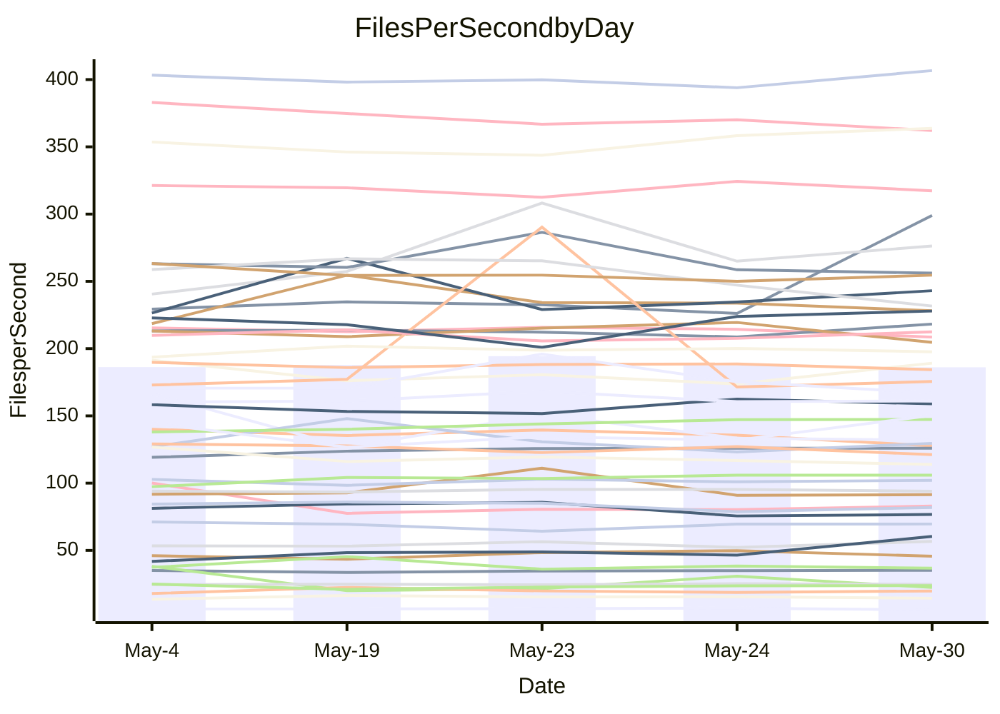

<!---
# This file is auto-generated. Do not edit.
# cspell:disable
--->
# Performance Report

Daily Performance

```mermaid
xychart-beta
    title Files Per Second by Day
    y-axis Files per Second
    x-axis Date [May-4, May-19, May-23, May-24, May-30]
    bar [186.25, 187.94, 194.38, 187.53, 186.14]
    line [35.07, 33.61, 34.69, 34.94, 35.19]
    line [140.01, 135.42, 139.50, 135.65, 127.69]
    line [53.38, 53.17, 56.48, 52.20, 56.68]
    line [38.18, 20.00, 21.53, 30.85, 22.48]
    line [46.04, 43.44, 48.37, 49.79, 45.66]
    line [71.11, 69.47, 64.25, 69.53, 69.63]
    line [100.08, 77.54, 80.59, 80.29, 82.96]
    line [81.26, 84.52, 85.73, 75.59, 76.69]
    line [191.37, 176.15, 180.59, 173.73, 189.18]
    line [166.55, 126.61, 150.87, 133.44, 132.01]
    line [119.17, 123.77, 125.73, 125.94, 125.99]
    line [17.95, 22.53, 19.87, 18.72, 19.82]
    line [24.56, 24.84, 24.48, 25.27, 24.77]
    line [24.93, 21.05, 22.73, 23.64, 23.81]
    line [91.75, 92.82, 111.10, 90.94, 91.41]
    line [102.79, 98.35, 102.96, 100.96, 102.08]
    line [382.99, 374.77, 366.83, 370.08, 362.12]
    line [158.32, 153.28, 151.73, 162.52, 158.93]
    line [13.72, 16.48, 15.39, 15.58, 14.44]
    line [6.46, 6.48, 6.70, 7.10, 5.81]
    line [229.32, 234.71, 232.57, 226.13, 298.95]
    line [189.78, 185.86, 188.16, 188.58, 184.35]
    line [240.52, 257.39, 308.24, 265.00, 276.25]
    line [37.38, 45.35, 36.07, 38.42, 36.78]
    line [218.55, 254.57, 234.26, 233.79, 228.16]
    line [127.00, 147.92, 130.77, 123.22, 129.60]
    line [215.39, 212.55, 215.84, 214.38, 208.55]
    line [226.51, 267.13, 229.05, 234.58, 243.05]
    line [353.58, 346.15, 343.69, 358.26, 363.76]
    line [160.29, 160.94, 168.26, 160.60, 161.09]
    line [213.17, 213.72, 212.23, 208.69, 218.24]
    line [129.13, 127.71, 122.71, 127.15, 121.20]
    line [94.12, 93.35, 95.34, 95.32, 94.04]
    line [138.03, 140.07, 144.01, 147.15, 147.35]
    line [213.15, 208.87, 215.23, 219.43, 204.61]
    line [84.38, 85.95, 85.08, 78.77, 81.88]
    line [321.24, 319.57, 312.48, 324.31, 317.33]
    line [41.81, 48.29, 48.86, 46.46, 60.40]
    line [126.81, 116.06, 119.43, 116.84, 113.93]
    line [144.52, 126.78, 134.48, 131.99, 150.35]
    line [263.11, 260.36, 286.42, 258.60, 256.12]
    line [172.93, 177.15, 290.28, 171.42, 175.58]
    line [258.73, 266.74, 265.26, 247.18, 231.63]
    line [97.37, 104.19, 103.43, 105.92, 105.90]
    line [263.28, 254.35, 254.61, 250.00, 254.61]
    line [403.25, 398.12, 399.78, 393.93, 406.67]
    line [209.84, 213.89, 205.67, 207.63, 212.42]
    line [222.86, 217.73, 200.96, 223.84, 227.93]
    line [193.68, 201.86, 198.76, 200.08, 197.65]
    line [170.59, 170.67, 195.94, 175.36, 167.12]
```

Time to Process Files

| Repository                                      | Elapsed | Min/Avg/Max          |   SD | SD Graph                |
| ----------------------------------------------- | ------: | :------------------: | ---: | ----------------------- |
| AdaDoom3/AdaDoom3                    |    2.80 | 2.2 /   2.6 /   2.9  | 0.24 | `    ┣━━┻━━╋━●┻━━┫    ` |
| alexiosc/megistos                    |    7.12 | 6.7 /   7.0 /   7.9  | 0.37 | `    ┣━━┻━━╋●━┻━━┫    ` |
| apollographql/apollo-server          |    2.50 | 2.4 /   2.5 /   2.6  | 0.07 | `     ┣━┻━●╋━━┻━┫     ` |
| aspnetboilerplate/aspnetboilerplate  |    8.98 | 8.7 /   9.0 /   9.3  | 0.19 | `    ┣━━┻━━●━━┻━━┫    ` |
| aws-amplify/docs                     |   12.17 | 10.1 /  12.4 /  13.4 | 1.00 | `    ┣━━┻━●╋━━┻━━┫    ` |
| Azure/azure-rest-api-specs           |   10.78 | 9.3 /   9.6 /  10.7  | 0.45 | `    ┣━━┻━━╋━━┻━━┫ ●  ` |
| bitjson/typescript-starter           |    1.01 | 0.8 /   1.0 /   1.1  | 0.10 | `     ┣━┻━━●━━┻━┫     ` |
| caddyserver/caddy                    |    3.42 | 2.7 /   3.2 /   3.5  | 0.28 | `    ┣━━┻━━╋━●┻━━┫    ` |
| canada-ca/open-source-logiciel-libre |    1.20 | 0.9 /   1.0 /   1.1  | 0.07 | `     ┣━┻━━╋━━┻━┫●    ` |
| chef/chef                            |    5.04 | 4.6 /   4.8 /   4.9  | 0.11 | `    ┣━━┻━━╋━━┻━━●    ` |
| dart-lang/sdk                        |   57.66 | 55.5 /  57.2 /  58.7 | 1.22 | `   ┣━━┻━━━╋●━━┻━━┫   ` |
| django/django                        |   13.71 | 13.4 /  13.9 /  14.2 | 0.25 | `    ┣━━●━━╋━━┻━━┫    ` |
| eslint/eslint                        |    9.49 | 9.5 /   9.8 /  10.0  | 0.16 | `    ┣●━┻━━╋━━┻━━┫    ` |
| exonum/exonum                        |    3.34 | 3.3 /   3.4 /   3.5  | 0.07 | `     ┣━┻●━╋━━┻━┫     ` |
| flutter/samples                      |   11.27 | 11.7 /  12.8 /  13.6 | 0.55 | ` ●  ┣━━┻━━╋━━┻━━┫    ` |
| gitbucket/gitbucket                  |    3.16 | 2.5 /   3.0 /   3.4  | 0.35 | `    ┣━━┻━━╋●━┻━━┫    ` |
| googleapis/google-cloud-cpp          |  125.22 | 95.0 / 117.6 / 123.3 | 9.35 | `  ┣━━━┻━━━╋━━●┻━━━┫  ` |
| graphql/express-graphql              |    1.09 | 1.0 /   1.1 /   1.3  | 0.07 | `     ┣━┻●━╋━━┻━┫     ` |
| graphql/graphql-js                   |    2.91 | 2.6 /   2.7 /   2.9  | 0.09 | `     ┣━┻━━╋━━┻━┫●    ` |
| graphql/graphql-relay-js             |    1.13 | 1.1 /   1.1 /   1.2  | 0.04 | `     ┣━┻━━●━━┻━┫     ` |
| graphql/graphql-spec                 |    1.32 | 1.0 /   1.2 /   1.4  | 0.11 | `     ┣━┻━━╋━●┻━┫     ` |
| iluwatar/java-design-patterns        |   11.74 | 7.1 /  11.1 /  12.1  | 1.78 | `   ┣━━━┻━━╋●━┻━━━┫   ` |
| ktaranov/sqlserver-kit               |    6.39 | 5.7 /   6.0 /   7.5  | 0.60 | `    ┣━━┻━━╋━●┻━━┫    ` |
| liriliri/licia                       |    3.97 | 3.7 /   3.9 /   4.1  | 0.12 | `    ┣━━┻━━╋━●┻━━┫    ` |
| MartinThoma/LaTeX-examples           |    4.71 | 5.9 /   6.1 /   6.5  | 0.18 | `●      ┣━┻╋┻━┫       ` |
| mdx-js/mdx                           |    1.69 | 1.4 /   1.7 /   1.9  | 0.15 | `     ┣━┻━━●━━┻━┫     ` |
| microsoft/TypeScript-Website         |    5.19 | 5.0 /   5.4 /   5.6  | 0.20 | `    ┣━━┻●━╋━━┻━━┫    ` |
| MicrosoftDocs/PowerShell-Docs        |   25.79 | 24.0 /  24.8 /  25.7 | 0.63 | `   ┣━━━┻━━╋━━┻━●━┫   ` |
| neovim/nvim-lspconfig                |    5.32 | 5.1 /   5.3 /   5.6  | 0.16 | `    ┣━━┻━━╋●━┻━━┫    ` |
| pagekit/pagekit                      |    3.55 | 3.4 /   3.5 /   3.6  | 0.06 | `     ┣━┻━━╋━━┻●┫     ` |
| php/php-src                          |   24.35 | 23.6 /  24.2 /  25.6 | 0.61 | `   ┣━━━┻━━╋●━┻━━━┫   ` |
| plasticrake/tplink-smarthome-api     |    1.03 | 1.2 /   1.3 /   1.5  | 0.09 | ` ●   ┣━┻━━╋━━┻━┫     ` |
| prettier/prettier                    |    7.35 | 7.5 /   7.6 /   7.9  | 0.15 | `    ●━━┻━━╋━━┻━━┫    ` |
| pycontribs/jira                      |    1.41 | 1.4 /   1.5 /   1.6  | 0.07 | `     ┣━●━━╋━━┻━┫     ` |
| RustPython/RustPython                |    6.84 | 6.2 /   6.6 /   6.7  | 0.19 | `    ┣━━┻━━╋━━┻●━┫    ` |
| shoelace-style/shoelace              |    2.77 | 2.7 /   2.8 /   3.0  | 0.12 | `     ┣━┻━●╋━━┻━┫     ` |
| slint-ui/slint                       |   13.87 | 11.3 /  13.2 /  13.8 | 0.81 | `    ┣━━┻━━╋━●┻━━┫    ` |
| SoftwareBrothers/admin-bro           |    2.33 | 2.3 /   2.5 /   2.6  | 0.10 | `     ┣●┻━━╋━━┻━┫     ` |
| sveltejs/svelte                      |   21.60 | 21.6 /  22.1 /  22.8 | 0.44 | `    ┣━━●━━╋━━┻━━┫    ` |
| TheAlgorithms/Python                 |    5.49 | 4.3 /   5.3 /   5.7  | 0.42 | `    ┣━━┻━━╋●━┻━━┫    ` |
| twbs/bootstrap                       |    1.69 | 1.7 /   1.7 /   1.9  | 0.09 | `     ┣━┻━●╋━━┻━┫     ` |
| typescript-cheatsheets/react         |    1.07 | 0.7 /   1.1 /   1.4  | 0.22 | `     ┣━┻━━●━━┻━┫     ` |
| typescript-eslint/typescript-eslint  |    4.17 | 3.9 /   4.2 /   4.6  | 0.21 | `    ┣━━┻━━●━━┻━━┫    ` |
| vitest-dev/vitest                    |    9.72 | 7.7 /  10.0 /  11.1  | 1.00 | `    ┣━━┻━●╋━━┻━━┫    ` |
| w3c/aria-practices                   |    3.19 | 2.5 /   3.1 /   3.4  | 0.29 | `    ┣━━┻━━●━━┻━━┫    ` |
| w3c/specberus                        |    1.85 | 1.8 /   1.9 /   2.0  | 0.08 | `     ┣━┻●━╋━━┻━┫     ` |
| webdeveric/webpack-assets-manifest   |    1.20 | 1.0 /   1.2 /   1.4  | 0.10 | `     ┣━┻━━╋●━┻━┫     ` |
| webpack/webpack                      |    5.13 | 5.1 /   5.4 /   5.8  | 0.22 | `    ┣━━●━━╋━━┻━━┫    ` |
| wireapp/wire-desktop                 |    1.28 | 1.3 /   1.3 /   1.4  | 0.05 | `     ┣━┻━●╋━━┻━┫     ` |
| wireapp/wire-webapp                  |   12.13 | 11.7 /  11.9 /  12.2 | 0.14 | `    ┣━━┻━━╋━━┻━●┫    ` |

Note:
- Elapsed time is in seconds.

Files per Second over Time

| Repository                                      | Files |    Sec |    Fps |     Rel | Trend Fps  |    N |
| ----------------------------------------------- | ----: | -----: | -----: | ------: | ---------- | ---: |
| AdaDoom3/AdaDoom3                    |   103 |   2.80 |  36.78 |  -7.07% | `▃▇█▃▂▄▃▃` |    7 |
| alexiosc/megistos                    |   583 |   7.12 |  81.88 |  -1.85% | `▇█▇█▆▇▃▆` |    7 |
| apollographql/apollo-server          |   255 |   2.50 | 102.08 |   1.03% | `▇▆▅█▇█▅▇` |    7 |
| aspnetboilerplate/aspnetboilerplate  |  2286 |   8.98 | 254.61 |   0.06% | `█▆▇▆▇▅▆▇` |    7 |
| aws-amplify/docs                     |  2959 |  12.17 | 243.05 |   0.79% | `▃▄█▄▂▄▃▄` |    7 |
| Azure/azure-rest-api-specs           |  2497 |  10.78 | 231.63 | -10.77% | `▇██▇█▄▇▃` |    7 |
| bitjson/typescript-starter           |    20 |   1.01 |  19.82 |  -1.03% | `▂█▄▄▄▄▂▄` |    7 |
| caddyserver/caddy                    |   313 |   3.42 |  91.41 |  -6.11% | `▃▃▃▅█▃▂▃` |    7 |
| canada-ca/open-source-logiciel-libre |     7 |   1.20 |   5.81 | -13.44% | `▄▃▅▆▄█▄▂` |    7 |
| chef/chef                            |  1032 |   5.04 | 204.61 |  -4.53% | `▆▅▅▇▆▇█▄` |    7 |
| dart-lang/sdk                        | 11396 |  57.66 | 197.65 |  -0.83% | `▅▇█▇▆▆█▆` |    7 |
| django/django                        |  2912 |  13.71 | 212.42 |   1.55% | `▆█▇▅▆▆▆▇` |    7 |
| eslint/eslint                        |  2072 |   9.49 | 218.24 |   3.05% | `▇█▆▇▇▆▅█` |    7 |
| exonum/exonum                        |   421 |   3.34 | 125.99 |   1.36% | `▅▆█▇██▇█` |    7 |
| flutter/samples                      |  1695 |  11.27 | 150.35 |  13.05% | `▇▄▃▆▄▅▄█` |    7 |
| gitbucket/gitbucket                  |   417 |   3.16 | 132.01 |  -6.51% | `█▃▂█▃▄▃▃` |    7 |
| googleapis/google-cloud-cpp          | 20926 | 125.22 | 167.12 |  -6.75% | `▃▂▃█▃▃▃▂` |    7 |
| graphql/express-graphql              |    26 |   1.09 |  23.81 |   4.33% | `█▅▃▅▆▇▆▇` |    7 |
| graphql/graphql-js                   |   371 |   2.91 | 127.69 |  -7.01% | `██▅▇██▅▄` |    7 |
| graphql/graphql-relay-js             |    28 |   1.13 |  24.77 |  -0.21% | `▅▅▆▄▆▄█▅` |    7 |
| graphql/graphql-spec                 |    19 |   1.32 |  14.44 |  -6.92% | `▂▃█▅▄▄▅▃` |    7 |
| iluwatar/java-design-patterns        |  2061 |  11.74 | 175.58 |  -9.21% | `▂▂▂█▁▂▂`  |    6 |
| ktaranov/sqlserver-kit               |   490 |   6.39 |  76.69 |  -6.30% | `▇█▇██▂█▆` |    7 |
| liriliri/licia                       |  1438 |   3.97 | 362.12 |  -2.74% | `█▆█▄█▆▇▆` |    7 |
| MartinThoma/LaTeX-examples           |  1409 |   4.71 | 298.95 |  29.49% | `▃▃▄▃▃▃▂█` |    7 |
| mdx-js/mdx                           |   140 |   1.69 |  82.96 |   0.66% | `█▂▄▃▄▄▄▄` |    7 |
| microsoft/TypeScript-Website         |   765 |   5.19 | 147.35 |   3.10% | `▄▅▄▅▆▅█▆` |    7 |
| MicrosoftDocs/PowerShell-Docs        |  3126 |  25.79 | 121.20 |  -4.05% | `█▆█▅▆█▆▅` |    7 |
| neovim/nvim-lspconfig                |   857 |   5.32 | 161.09 |  -1.07% | `▆▆▇██▄█▆` |    7 |
| pagekit/pagekit                      |   741 |   3.55 | 208.55 |  -2.74% | `▇▅▇▆█▇▇▅` |    7 |
| php/php-src                          |  2290 |  24.35 |  94.04 |  -0.58% | `▇▅██▇▇▇▇` |    7 |
| plasticrake/tplink-smarthome-api     |    62 |   1.03 |  60.40 |  28.50% | `▂▄▄▄▄▅▂█` |    7 |
| prettier/prettier                    |  2674 |   7.35 | 363.76 |   3.94% | `▇▆▆▅▆▇██` |    7 |
| pycontribs/jira                      |    80 |   1.41 |  56.68 |   5.21% | `▆▄███▅▅█` |    7 |
| RustPython/RustPython                |   779 |   6.84 | 113.93 |  -4.08% | `█▄▅▇▅▅▅▄` |    7 |
| shoelace-style/shoelace              |   440 |   2.77 | 158.93 |   1.75% | `▇▇▄▄▇██▇` |    7 |
| slint-ui/slint                       |  3164 |  13.87 | 228.16 |  -4.01% | `▂█▃▄▄▄▄▃` |    7 |
| SoftwareBrothers/admin-bro           |   441 |   2.33 | 189.18 |   5.74% | `█▆▄▇▅▄▅█` |    7 |
| sveltejs/svelte                      |  8784 |  21.60 | 406.67 |   2.15% | `██▆▆██▅█` |    7 |
| TheAlgorithms/Python                 |  1407 |   5.49 | 256.12 |  -4.32% | `▃▄▃▂█▃▄▃` |    7 |
| twbs/bootstrap                       |   118 |   1.69 |  69.63 |   2.04% | `██▇▃▆▇▇▇` |    7 |
| typescript-cheatsheets/react         |    24 |   1.07 |  22.48 | -14.00% | `█▂▁▂▂▇▄▂` |    7 |
| typescript-eslint/typescript-eslint  |  1322 |   4.17 | 317.33 |  -0.57% | `▇▅█▃█▇▇▆` |    7 |
| vitest-dev/vitest                    |  2685 |   9.72 | 276.25 |   1.68% | `▂▃▃▃█▃▃▄` |    7 |
| w3c/aria-practices                   |   414 |   3.19 | 129.60 |  -2.54% | `▃▃█▃▃▂▃▃` |    7 |
| w3c/specberus                        |   196 |   1.85 | 105.90 |   2.33% | `▄█▅▅█▇█▇` |    7 |
| webdeveric/webpack-assets-manifest   |    55 |   1.20 |  45.66 |  -2.93% | `▅▅▂▅▆█▅▅` |    7 |
| webpack/webpack                      |  1169 |   5.13 | 227.93 |   4.64% | `▇▆▇▄█▇█`  |    6 |
| wireapp/wire-desktop                 |    45 |   1.28 |  35.19 |   1.98% | `██▄▆██▇█` |    7 |
| wireapp/wire-webapp                  |  2236 |  12.13 | 184.35 |  -1.87% | `██▆▇██▇▆` |    7 |

Data Throughput

| Repository                                      | Files |    Sec |     Kps |     Rel | Trend Kps  |    N |
| ----------------------------------------------- | ----: | -----: | ------: | ------: | ---------- | ---: |
| AdaDoom3/AdaDoom3                    |   103 |   2.80 |  781.71 |  -7.07% | `▃▇█▃▂▄▃▃` |    7 |
| alexiosc/megistos                    |   583 |   7.12 |  643.40 |  -1.85% | `▇█▇█▆▇▃▆` |    7 |
| apollographql/apollo-server          |   255 |   2.50 |  843.50 |   1.03% | `▇▆▅█▇█▅▇` |    7 |
| aspnetboilerplate/aspnetboilerplate  |  2286 |   8.98 |  619.48 |   0.06% | `█▆▇▆▇▅▆▇` |    7 |
| aws-amplify/docs                     |  2959 |  12.17 |  878.87 |   0.80% | `▃▄█▄▂▄▃▄` |    7 |
| Azure/azure-rest-api-specs           |  2497 |  10.78 |  693.51 | -10.74% | `▇██▇█▄▇▃` |    7 |
| bitjson/typescript-starter           |    20 |   1.01 |   79.28 |  -1.03% | `▂█▄▄▄▄▂▄` |    7 |
| caddyserver/caddy                    |   313 |   3.42 |  817.10 |  -6.13% | `▃▃▃▅█▃▂▃` |    7 |
| canada-ca/open-source-logiciel-libre |     7 |   1.20 |   48.17 | -13.44% | `▄▃▅▆▄█▄▂` |    7 |
| chef/chef                            |  1032 |   5.04 | 1001.82 |  -4.49% | `▆▅▅▇▆▇█▄` |    7 |
| dart-lang/sdk                        | 11396 |  57.66 | 1350.96 |  -0.82% | `▅▇█▇▆▆█▆` |    7 |
| django/django                        |  2912 |  13.71 | 1362.21 |   1.65% | `▆█▇▅▆▆▆▇` |    7 |
| eslint/eslint                        |  2072 |   9.49 | 1518.17 |   3.05% | `▇█▆▇▇▆▅█` |    7 |
| exonum/exonum                        |   421 |   3.34 | 1205.11 |   1.36% | `▅▆█▇██▇█` |    7 |
| flutter/samples                      |  1695 |  11.27 |  899.90 |  13.05% | `▇▄▃▆▄▅▄█` |    7 |
| gitbucket/gitbucket                  |   417 |   3.16 |  629.35 |  -6.08% | `▇▃▂█▃▄▃▃` |    7 |
| googleapis/google-cloud-cpp          | 20926 | 125.22 | 1426.31 |  -6.75% | `▃▂▃█▃▃▃▂` |    7 |
| graphql/express-graphql              |    26 |   1.09 |  108.99 |   4.33% | `█▅▃▅▆▇▆▇` |    7 |
| graphql/graphql-js                   |   371 |   2.91 |  756.48 |  -7.01% | `██▅▇██▅▄` |    7 |
| graphql/graphql-relay-js             |    28 |   1.13 |   97.30 |  -0.21% | `▅▅▆▄▆▄█▅` |    7 |
| graphql/graphql-spec                 |    19 |   1.32 |  481.99 |  -6.92% | `▂▃█▅▄▄▅▃` |    7 |
| iluwatar/java-design-patterns        |  2061 |  11.74 |  541.21 |  -9.21% | `▂▂▂█▁▂▂`  |    6 |
| ktaranov/sqlserver-kit               |   490 |   6.39 | 1161.83 |  -6.30% | `▇█▇██▂█▆` |    7 |
| liriliri/licia                       |  1438 |   3.97 |  432.13 |  -2.72% | `█▆█▄█▆▇▆` |    7 |
| MartinThoma/LaTeX-examples           |  1409 |   4.71 |  617.43 |  29.49% | `▃▃▄▃▃▃▂█` |    7 |
| mdx-js/mdx                           |   140 |   1.69 |  388.13 |   0.63% | `█▂▄▃▄▄▄▄` |    7 |
| microsoft/TypeScript-Website         |   765 |   5.19 | 1014.89 |   3.10% | `▄▅▄▅▆▅█▆` |    7 |
| MicrosoftDocs/PowerShell-Docs        |  3126 |  25.79 | 1291.49 |  -4.07% | `█▆█▅▆█▆▅` |    7 |
| neovim/nvim-lspconfig                |   857 |   5.32 |  472.19 |  -1.01% | `▆▆▇██▄█▆` |    7 |
| pagekit/pagekit                      |   741 |   3.55 |  434.83 |  -2.74% | `▇▅▇▆█▇▇▅` |    7 |
| php/php-src                          |  2290 |  24.35 | 1654.00 |  -0.57% | `▇▅██▇▇▇▇` |    7 |
| plasticrake/tplink-smarthome-api     |    62 |   1.03 |  326.37 |  28.50% | `▂▄▄▄▄▅▂█` |    7 |
| prettier/prettier                    |  2674 |   7.35 |  499.52 |   3.94% | `▇▆▆▅▆▇██` |    7 |
| pycontribs/jira                      |    80 |   1.41 |  400.28 |   5.21% | `▆▄███▅▅█` |    7 |
| RustPython/RustPython                |   779 |   6.84 | 1940.66 |  -3.15% | `▇▅▆█▆▆▆▅` |    7 |
| shoelace-style/shoelace              |   440 |   2.77 |  767.57 |   1.76% | `▇▇▄▄▇██▇` |    7 |
| slint-ui/slint                       |  3164 |  13.87 | 1191.69 |  -6.40% | `▆█▃▃▄▃▃▃` |    7 |
| SoftwareBrothers/admin-bro           |   441 |   2.33 |  416.96 |   5.74% | `█▆▄▇▅▄▅█` |    7 |
| sveltejs/svelte                      |  8784 |  21.60 |  275.93 |   2.14% | `██▆▆██▅█` |    7 |
| TheAlgorithms/Python                 |  1407 |   5.49 |  654.05 |  -4.32% | `▃▄▃▂█▃▄▃` |    7 |
| twbs/bootstrap                       |   118 |   1.69 |  571.76 |   2.04% | `██▇▃▆▇▇▇` |    7 |
| typescript-cheatsheets/react         |    24 |   1.07 |  202.28 | -10.72% | `▆▂▁▂▂█▄▃` |    7 |
| typescript-eslint/typescript-eslint  |  1322 |   4.17 | 1717.73 |  -0.55% | `▇▅█▃█▇▇▆` |    7 |
| vitest-dev/vitest                    |  2685 |   9.72 |  714.54 |  -1.08% | `▅▂▂▃█▃▃▃` |    7 |
| w3c/aria-practices                   |   414 |   3.19 | 1210.84 |  -2.54% | `▃▃█▃▃▂▃▃` |    7 |
| w3c/specberus                        |   196 |   1.85 |  345.27 |   2.27% | `▄█▅▅█▆█▇` |    7 |
| webdeveric/webpack-assets-manifest   |    55 |   1.20 |  104.60 |  -2.93% | `▅▅▂▅▆█▅▅` |    7 |
| webpack/webpack                      |  1169 |   5.13 | 1147.05 |   5.21% | `▆▆▇▄█▇█`  |    6 |
| wireapp/wire-desktop                 |    45 |   1.28 |  154.85 |   1.98% | `██▄▆██▇█` |    7 |
| wireapp/wire-webapp                  |  2236 |  12.13 |  770.21 |  -1.66% | `▇█▆▇██▇▆` |    7 |

