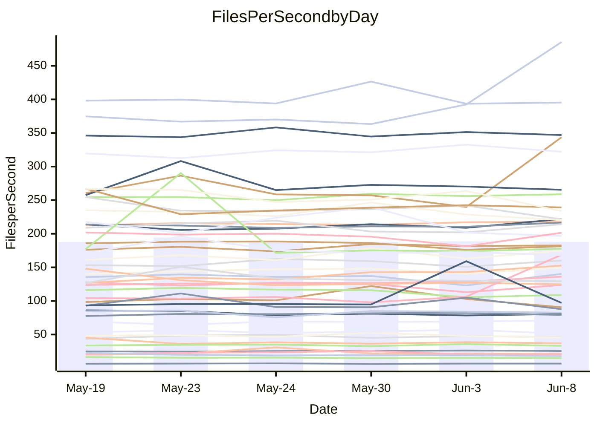

<!---
# This file is auto-generated. Do not edit.
# cspell:disable
--->
# Performance Report

Daily Performance

```mermaid
xychart-beta
    title Files Per Second by Day
    y-axis Files per Second
    x-axis Date [May-19, May-23, May-24, May-30, Jun-3, Jun-8]
    bar [187.94, 194.38, 187.53, 187.84, 188.70, 188.00]
    line [24.84, 24.48, 25.27, 25.51, 26.21, 25.47]
    line [20.00, 21.53, 30.85, 21.86, 21.33, 21.33]
    line [43.44, 48.37, 49.79, 45.03, 47.69, 46.03]
    line [16.48, 15.39, 15.58, 14.86, 15.18, 15.03]
    line [98.35, 102.96, 100.96, 122.12, 102.88, 90.57]
    line [374.77, 366.83, 370.08, 363.31, 392.45, 485.26]
    line [123.77, 125.73, 125.94, 125.35, 112.95, 123.69]
    line [85.95, 85.08, 78.77, 81.14, 78.40, 80.54]
    line [140.07, 144.01, 147.15, 148.03, 140.54, 149.18]
    line [69.47, 64.25, 69.53, 68.78, 69.37, 70.98]
    line [77.54, 80.59, 80.29, 81.53, 82.29, 79.09]
    line [212.55, 215.84, 214.38, 213.29, 217.13, 217.94]
    line [153.28, 151.73, 162.52, 159.30, 150.77, 160.22]
    line [254.35, 254.61, 250.00, 259.58, 256.09, 258.81]
    line [260.36, 286.42, 258.60, 257.18, 239.81, 343.59]
    line [135.42, 139.50, 135.65, 137.15, 123.09, 140.24]
    line [21.05, 22.73, 23.64, 25.47, 20.39, 20.46]
    line [213.89, 205.67, 207.63, 214.21, 208.82, 221.86]
    line [160.94, 168.26, 160.60, 178.51, 162.97, 174.81]
    line [319.57, 312.48, 324.31, 321.30, 332.58, 322.13]
    line [213.72, 212.23, 208.69, 211.05, 210.52, 216.55]
    line [45.35, 36.07, 38.42, 36.32, 38.54, 36.92]
    line [254.57, 234.26, 233.79, 236.78, 241.94, 221.57]
    line [33.61, 34.69, 34.94, 32.78, 35.79, 33.20]
    line [185.86, 188.16, 188.58, 186.13, 176.02, 181.41]
    line [22.53, 19.87, 18.72, 19.42, 19.15, 17.91]
    line [127.71, 122.71, 127.15, 126.61, 128.67, 136.04]
    line [257.39, 308.24, 265.00, 272.73, 270.27, 265.46]
    line [48.29, 48.86, 46.46, 52.80, 47.62, 45.75]
    line [53.17, 56.48, 52.20, 54.24, 57.32, 50.91]
    line [6.48, 6.70, 7.10, 6.34, 6.74, 6.72]
    line [147.92, 130.77, 123.22, 125.33, 127.25, 124.71]
    line [208.87, 215.23, 219.43, 203.27, 201.99, 214.27]
    line [116.06, 119.43, 116.84, 115.92, 105.51, 108.88]
    line [176.15, 180.59, 173.73, 184.72, 181.71, 182.56]
    line [84.52, 85.73, 75.59, 84.88, 83.99, 82.60]
    line [104.19, 103.43, 105.92, 97.87, 106.45, 168.66]
    line [346.15, 343.69, 358.26, 344.65, 351.41, 346.93]
    line [234.71, 232.57, 226.13, 246.49, 228.60, 220.37]
    line [217.73, 200.96, 223.84, 239.63, 201.75, 196.68]
    line [92.82, 111.10, 90.94, 90.56, 104.84, 87.77]
    line [126.78, 134.48, 131.99, 142.83, 143.00, 152.67]
    line [126.61, 150.87, 133.44, 130.84, 130.22, 129.23]
    line [177.15, 290.28, 171.42, 175.26, 173.98, 177.63]
    line [267.13, 229.05, 234.58, 238.79, 242.50, 239.20]
    line [398.12, 399.78, 393.93, 426.44, 393.52, 395.27]
    line [201.86, 198.76, 200.08, 195.61, 181.39, 201.44]
    line [93.35, 95.34, 95.32, 94.79, 159.13, 97.06]
    line [266.74, 265.26, 247.18, 250.86, 263.73, 233.63]
    line [170.67, 195.94, 175.36, 171.10, 172.66, 168.33]
```

Time to Process Files

| Repository                                      | Elapsed | Min/Avg/Max          |   SD | SD Graph                |
| ----------------------------------------------- | ------: | :------------------: | ---: | ----------------------- |
| AdaDoom3/AdaDoom3                    |    2.79 | 2.2 /   2.7 /   2.9  | 0.22 | `    ┣━━┻━━╋●━┻━━┫    ` |
| alexiosc/megistos                    |    7.24 | 6.7 /   7.1 /   7.9  | 0.37 | `    ┣━━┻━━╋●━┻━━┫    ` |
| apollographql/apollo-server          |    2.82 | 1.4 /   2.4 /   2.6  | 0.32 | `    ┣━━┻━━╋━━┻●━┫    ` |
| aspnetboilerplate/aspnetboilerplate  |    8.83 | 8.7 /   8.9 /   9.3  | 0.17 | `    ┣━━┻●━╋━━┻━━┫    ` |
| aws-amplify/docs                     |   12.37 | 10.1 /  12.3 /  13.4 | 0.77 | `    ┣━━┻━━●━━┻━━┫    ` |
| Azure/azure-rest-api-specs           |   10.69 | 9.1 /   9.8 /  10.8  | 0.55 | `    ┣━━┻━━╋━━┻━●┫    ` |
| bitjson/typescript-starter           |    1.12 | 0.8 /   1.0 /   1.1  | 0.08 | `     ┣━┻━━╋━━┻●┫     ` |
| caddyserver/caddy                    |    3.57 | 2.7 /   3.3 /   3.7  | 0.28 | `    ┣━━┻━━╋━━●━━┫    ` |
| canada-ca/open-source-logiciel-libre |    1.04 | 0.9 /   1.1 /   1.2  | 0.08 | `     ┣━┻━●╋━━┻━┫     ` |
| chef/chef                            |    4.82 | 4.6 /   4.9 /   5.3  | 0.20 | `    ┣━━┻●━╋━━┻━━┫    ` |
| dart-lang/sdk                        |   56.57 | 55.5 /  58.0 /  62.8 | 1.93 | `   ┣━━┻●━━╋━━━┻━━┫   ` |
| django/django                        |   13.13 | 13.3 /  13.8 /  14.2 | 0.29 | `   ●┣━━┻━━╋━━┻━━┫    ` |
| eslint/eslint                        |    9.57 | 9.5 /   9.8 /  10.3  | 0.21 | `    ┣━━●━━╋━━┻━━┫    ` |
| exonum/exonum                        |    3.40 | 3.3 /   3.4 /   3.7  | 0.12 | `    ┣━━┻━━●━━┻━━┫    ` |
| flutter/samples                      |   11.10 | 11.3 /  12.5 /  13.6 | 0.72 | `    ●━━┻━━╋━━┻━━┫    ` |
| gitbucket/gitbucket                  |    3.23 | 2.5 /   3.1 /   3.4  | 0.23 | `    ┣━━┻━━╋●━┻━━┫    ` |
| googleapis/google-cloud-cpp          |  124.31 | 95.0 / 119.2 / 125.2 | 7.87 | `  ┣━━━┻━━━╋━━●┻━━━┫  ` |
| graphql/express-graphql              |    1.27 | 0.9 /   1.1 /   1.3  | 0.11 | `     ┣━┻━━╋━━┻●┫     ` |
| graphql/graphql-js                   |    2.65 | 2.6 /   2.7 /   3.0  | 0.13 | `    ┣━━┻●━╋━━┻━━┫    ` |
| graphql/graphql-relay-js             |    1.10 | 1.1 /   1.1 /   1.2  | 0.04 | `     ┣━┻━●╋━━┻━┫     ` |
| graphql/graphql-spec                 |    1.26 | 1.0 /   1.2 /   1.4  | 0.08 | `     ┣━┻━━╋●━┻━┫     ` |
| iluwatar/java-design-patterns        |   11.60 | 7.1 /  11.3 /  12.1  | 1.42 | `   ┣━━━┻━━╋●━┻━━━┫   ` |
| ktaranov/sqlserver-kit               |    5.93 | 5.5 /   5.9 /   7.5  | 0.53 | `    ┣━━┻━━●━━┻━━┫    ` |
| liriliri/licia                       |    2.96 | 3.7 /   3.9 /   4.1  | 0.14 | `●      ┣┻━╋━┻┫       ` |
| MartinThoma/LaTeX-examples           |    6.39 | 4.7 /   6.0 /   6.5  | 0.44 | `    ┣━━┻━━╋━━●━━┫    ` |
| mdx-js/mdx                           |    1.77 | 1.7 /   1.7 /   1.9  | 0.06 | `     ┣━┻━━╋●━┻━┫     ` |
| microsoft/TypeScript-Website         |    5.13 | 5.0 /   5.3 /   5.6  | 0.18 | `    ┣━━┻●━╋━━┻━━┫    ` |
| MicrosoftDocs/PowerShell-Docs        |   22.98 | 23.6 /  24.8 /  25.8 | 0.69 | ` ● ┣━━━┻━━╋━━┻━━━┫   ` |
| neovim/nvim-lspconfig                |    4.90 | 4.0 /   5.1 /   5.6  | 0.39 | `    ┣━━┻●━╋━━┻━━┫    ` |
| pagekit/pagekit                      |    3.40 | 3.3 /   3.5 /   3.6  | 0.08 | `     ┣━┻●━╋━━┻━┫     ` |
| php/php-src                          |   23.59 | 14.4 /  23.3 /  25.6 | 2.87 | `   ┣━━┻━━━●━━━┻━━┫   ` |
| plasticrake/tplink-smarthome-api     |    1.36 | 1.0 /   1.3 /   1.4  | 0.09 | `     ┣━┻━━╋━━●━┫     ` |
| prettier/prettier                    |    7.71 | 7.4 /   7.7 /   8.3  | 0.25 | `    ┣━━┻━━●━━┻━━┫    ` |
| pycontribs/jira                      |    1.57 | 1.4 /   1.5 /   1.6  | 0.08 | `     ┣━┻━━╋━━●━┫     ` |
| RustPython/RustPython                |    7.15 | 6.4 /   6.7 /   7.4  | 0.26 | `    ┣━━┻━━╋━━┻━●┫    ` |
| shoelace-style/shoelace              |    2.75 | 2.7 /   2.8 /   3.0  | 0.10 | `     ┣━┻●━╋━━┻━┫     ` |
| slint-ui/slint                       |   14.28 | 11.3 /  13.3 /  13.9 | 0.67 | `    ┣━━┻━━╋━━┻━●┫    ` |
| SoftwareBrothers/admin-bro           |    2.42 | 2.3 /   2.5 /   2.6  | 0.11 | `     ┣━┻━●╋━━┻━┫     ` |
| sveltejs/svelte                      |   22.22 | 17.1 /  21.7 /  22.8 | 1.50 | `   ┣━━━┻━━╋●━┻━━━┫   ` |
| TheAlgorithms/Python                 |    4.10 | 4.3 /   5.4 /   5.9  | 0.38 | `●   ┣━━┻━━╋━━┻━━┫    ` |
| twbs/bootstrap                       |    1.66 | 1.7 /   1.7 /   1.9  | 0.07 | `     ┣━●━━╋━━┻━┫     ` |
| typescript-cheatsheets/react         |    1.13 | 0.7 /   1.1 /   1.3  | 0.15 | `     ┣━┻━━╋●━┻━┫     ` |
| typescript-eslint/typescript-eslint  |    4.10 | 3.9 /   4.1 /   4.6  | 0.19 | `    ┣━━┻━━●━━┻━━┫    ` |
| vitest-dev/vitest                    |   10.11 | 7.7 /   9.8 /  10.5  | 0.73 | `    ┣━━┻━━╋●━┻━━┫    ` |
| w3c/aria-practices                   |    3.32 | 2.5 /   3.2 /   3.4  | 0.25 | `    ┣━━┻━━╋●━┻━━┫    ` |
| w3c/specberus                        |    1.16 | 1.8 /   1.9 /   2.2  | 0.12 | `●      ┣┻━╋━┻┫       ` |
| webdeveric/webpack-assets-manifest   |    1.19 | 1.0 /   1.2 /   1.4  | 0.08 | `     ┣━┻━━●━━┻━┫     ` |
| webpack/webpack                      |    5.94 | 4.2 /   5.2 /   5.8  | 0.43 | `    ┣━━┻━━╋━━┻━●┫    ` |
| wireapp/wire-desktop                 |    1.36 | 1.3 /   1.3 /   1.5  | 0.08 | `     ┣━┻━━╋●━┻━┫     ` |
| wireapp/wire-webapp                  |   12.33 | 11.8 /  12.0 /  12.7 | 0.24 | `    ┣━━┻━━╋━━┻●━┫    ` |

Note:
- Elapsed time is in seconds.

Files per Second over Time

| Repository                                      | Files |    Sec |    Fps |     Rel | Trend Fps      |    N |
| ----------------------------------------------- | ----: | -----: | -----: | ------: | -------------- | ---: |
| AdaDoom3/AdaDoom3                    |   103 |   2.79 |  36.92 |  -4.09% | `▇█▃▃▅▃▃▂▃▃▄▃` |   11 |
| alexiosc/megistos                    |   583 |   7.24 |  80.54 |  -1.85% | `█▇█▆▇▃▆▇▄▆▅▆` |   11 |
| apollographql/apollo-server          |   255 |   2.82 |  90.57 | -16.69% | `▁▁▂▂▂▁▂█▂▂▂▁` |   11 |
| aspnetboilerplate/aspnetboilerplate  |  2286 |   8.83 | 258.81 |   1.23% | `▅▇▆▇▅▆▆▇█▇▇▇` |   11 |
| aws-amplify/docs                     |  2959 |  12.37 | 239.20 |  -1.05% | `▄█▄▂▄▃▄▄▃▄▄▄` |   11 |
| Azure/azure-rest-api-specs           |  2497 |  10.69 | 233.63 |  -9.05% | `▇▇▇█▃▇▃█▆▅▇▃` |   11 |
| bitjson/typescript-starter           |    20 |   1.12 |  17.91 | -10.06% | `█▄▄▄▄▂▄▃▄▃▃▂` |   11 |
| caddyserver/caddy                    |   313 |   3.57 |  87.77 |  -8.65% | `▄▄▆█▃▃▃▄▂▃▆▃` |   11 |
| canada-ca/open-source-logiciel-libre |     7 |   1.04 |   6.72 |   1.72% | `▃▆▆▄█▅▂▅▃▆▅▅` |   11 |
| chef/chef                            |  1032 |   4.82 | 214.27 |   2.38% | `▆▆█▆▇█▅▄▄▇▅▇` |   11 |
| dart-lang/sdk                        | 11396 |  56.57 | 201.44 |   2.34% | `▇█▇▆▆█▇▆▆▇▄▇` |   11 |
| django/django                        |  2912 |  13.13 | 221.86 |   5.19% | `▇▆▅▅▅▅▆▆▇█▅█` |   11 |
| eslint/eslint                        |  2072 |   9.57 | 216.55 |   2.50% | `█▆▇▇▇▆█▇▅▇▇█` |   11 |
| exonum/exonum                        |   421 |   3.40 | 123.69 |  -0.34% | `▆▇▇▇█▇▇█▇▇▄▇` |   11 |
| flutter/samples                      |  1695 |  11.10 | 152.67 |  11.90% | `▄▃▅▄▄▄█▆▇▄▆█` |   11 |
| gitbucket/gitbucket                  |   417 |   3.23 | 129.23 |  -3.66% | `▃▂█▃▄▃▃▃▃▄▃▃` |   11 |
| googleapis/google-cloud-cpp          | 20926 | 124.31 | 168.33 |  -4.60% | `▃▃█▃▃▃▂▃▃▃▃▂` |   11 |
| graphql/express-graphql              |    26 |   1.27 |  20.46 | -12.46% | `▃▂▃▄▄▄▄█▄▅▂▂` |   11 |
| graphql/graphql-js                   |   371 |   2.65 | 140.24 |   3.34% | `█▅▇██▅▅███▄█` |   11 |
| graphql/graphql-relay-js             |    28 |   1.10 |  25.47 |   1.00% | `▅▆▄▆▄█▅▇▇▆█▇` |   11 |
| graphql/graphql-spec                 |    19 |   1.26 |  15.03 |  -2.48% | `▃█▄▄▄▄▃▂▄▄▄▄` |   11 |
| iluwatar/java-design-patterns        |  2061 |  11.60 | 177.63 |  -4.63% | `▂▂█▁▂▂▂▂▂▂▂`  |   10 |
| ktaranov/sqlserver-kit               |   490 |   5.93 |  82.60 |  -0.72% | `▇▇▇▇▂▇▅███▇▆` |   11 |
| liriliri/licia                       |  1438 |   2.96 | 485.26 |  31.18% | `▃▄▂▄▃▃▃▂▃▄▄█` |   11 |
| MartinThoma/LaTeX-examples           |  1409 |   6.39 | 220.37 |  -6.81% | `▃▄▃▃▃▂█▃▃▃▃▂` |   11 |
| mdx-js/mdx                           |   140 |   1.77 |  79.09 |  -1.73% | `▄█▆█▇▇█▇█▇█▆` |   11 |
| microsoft/TypeScript-Website         |   765 |   5.13 | 149.18 |   2.88% | `▅▄▅▆▅█▆▆▇▇▅▇` |   11 |
| MicrosoftDocs/PowerShell-Docs        |  3126 |  22.98 | 136.04 |   7.64% | `▅▇▄▅▆▅▄▆▇▅▆█` |   11 |
| neovim/nvim-lspconfig                |   857 |   4.90 | 174.81 |   3.57% | `▃▃▃▃▂▃▃█▄▃▃▄` |   11 |
| pagekit/pagekit                      |   741 |   3.40 | 217.94 |   1.76% | `▅▇▆█▆▆▅▅█▆▇▇` |   11 |
| php/php-src                          |  2290 |  23.59 |  97.06 |  -3.49% | `▁▂▂▂▂▂▂▂▂▂█▂` |   11 |
| plasticrake/tplink-smarthome-api     |    62 |   1.36 |  45.75 |  -7.84% | `▄▄▄▄▄▂█▅▅▄▄▃` |   11 |
| prettier/prettier                    |  2674 |   7.71 | 346.93 |  -0.26% | `▆▆▅▇▇██▅▇▄▇▆` |   11 |
| pycontribs/jira                      |    80 |   1.57 |  50.91 |  -6.36% | `▄▇▇▇▅▅▇▅█▃█▄` |   11 |
| RustPython/RustPython                |   779 |   7.15 | 108.88 |  -5.98% | `▆▆█▆▆▇▆▆▅█▃▄` |   11 |
| shoelace-style/shoelace              |   440 |   2.75 | 160.22 |   2.29% | `▇▄▄▇██▇██▇▅▇` |   11 |
| slint-ui/slint                       |  3164 |  14.28 | 221.57 |  -7.48% | `█▃▃▄▄▃▃▄▄▄▄▂` |   11 |
| SoftwareBrothers/admin-bro           |   441 |   2.42 | 182.56 |   1.34% | `▆▄▇▅▅▅▇█▇▄▆▆` |   11 |
| sveltejs/svelte                      |  8784 |  22.22 | 395.27 |  -3.01% | `▃▂▃▃▃▂▃█▃▂▃▃` |   11 |
| TheAlgorithms/Python                 |  1407 |   4.10 | 343.59 |  31.26% | `▄▃▂▇▃▄▃▃▃▃▂█` |   11 |
| twbs/bootstrap                       |   118 |   1.66 |  70.98 |   3.97% | `█▇▃▇█▇▇█▇▆▇█` |   11 |
| typescript-cheatsheets/react         |    24 |   1.13 |  21.33 |  -7.47% | `▂▁▂▂█▄▃▂▂▂▂▂` |   11 |
| typescript-eslint/typescript-eslint  |  1322 |   4.10 | 322.13 |   0.37% | `▅█▃█▇▇▆▇▇▅█▇` |   11 |
| vitest-dev/vitest                    |  2685 |  10.11 | 265.46 |  -3.39% | `▂▂▃█▃▃▃▄▃▃▃▃` |   11 |
| w3c/aria-practices                   |   414 |   3.32 | 124.71 |  -4.23% | `▃█▃▃▂▃▃▂▃▂▃▃` |   11 |
| w3c/specberus                        |   196 |   1.16 | 168.66 |  64.91% | `▃▂▂▃▃▃▃▂▁▂▃█` |   11 |
| webdeveric/webpack-assets-manifest   |    55 |   1.19 |  46.03 |  -0.92% | `▅▂▅▆█▅▅▄▄▄▅▅` |   11 |
| webpack/webpack                      |  1169 |   5.94 | 196.68 | -12.37% | `▃▃▂▄▃▄█▄▄▂▂`  |   10 |
| wireapp/wire-desktop                 |    45 |   1.36 |  33.20 |  -2.20% | `█▅▆██▇█▆▇▃█▆` |   11 |
| wireapp/wire-webapp                  |  2236 |  12.33 | 181.41 |  -2.45% | `█▇███▇▇▇▇▇▅▆` |   11 |

Data Throughput

| Repository                                      | Files |    Sec |     Kps |     Rel | Trend Kps      |    N |
| ----------------------------------------------- | ----: | -----: | ------: | ------: | -------------- | ---: |
| AdaDoom3/AdaDoom3                    |   103 |   2.79 |  784.75 |  -4.09% | `▇█▃▃▅▃▃▂▃▃▄▃` |   11 |
| alexiosc/megistos                    |   583 |   7.24 |  632.83 |  -1.85% | `█▇█▆▇▃▆▇▄▆▅▆` |   11 |
| apollographql/apollo-server          |   255 |   2.82 |  748.39 | -16.69% | `▁▁▂▂▂▁▂█▂▂▂▁` |   11 |
| aspnetboilerplate/aspnetboilerplate  |  2286 |   8.83 |  629.70 |   1.23% | `▅▇▆▇▅▆▆▇█▇▇▇` |   11 |
| aws-amplify/docs                     |  2959 |  12.37 |  864.96 |  -1.05% | `▄█▄▂▄▃▄▄▃▄▄▄` |   11 |
| Azure/azure-rest-api-specs           |  2497 |  10.69 |  699.48 |  -9.05% | `▇▇▇█▃▇▃█▆▅▇▃` |   11 |
| bitjson/typescript-starter           |    20 |   1.12 |   71.64 | -10.06% | `█▄▄▄▄▂▄▃▄▃▃▂` |   11 |
| caddyserver/caddy                    |   313 |   3.57 |  784.58 |  -8.65% | `▄▄▆█▃▃▃▄▂▃▆▃` |   11 |
| canada-ca/open-source-logiciel-libre |     7 |   1.04 |   55.67 |   1.72% | `▃▆▆▄█▅▂▅▃▆▅▅` |   11 |
| chef/chef                            |  1032 |   4.82 | 1049.14 |   2.38% | `▆▆█▆▇█▅▄▄▇▅▇` |   11 |
| dart-lang/sdk                        | 11396 |  56.57 | 1376.91 |   2.34% | `▇█▇▆▆█▇▆▆▇▄▇` |   11 |
| django/django                        |  2912 |  13.13 | 1422.75 |   5.19% | `▇▆▅▅▅▅▆▆▇█▅█` |   11 |
| eslint/eslint                        |  2072 |   9.57 | 1506.44 |   2.50% | `█▆▇▇▇▆█▇▅▇▇█` |   11 |
| exonum/exonum                        |   421 |   3.40 | 1183.11 |  -0.34% | `▆▇▇▇█▇▇█▇▇▄▇` |   11 |
| flutter/samples                      |  1695 |  11.10 |  913.76 |  11.90% | `▄▃▅▄▄▄█▆▇▄▆█` |   11 |
| gitbucket/gitbucket                  |   417 |   3.23 |  616.08 |  -3.66% | `▃▂█▃▄▃▃▃▃▄▃▃` |   11 |
| googleapis/google-cloud-cpp          | 20926 | 124.31 | 1436.66 |  -4.60% | `▃▃█▃▃▃▂▃▃▃▃▂` |   11 |
| graphql/express-graphql              |    26 |   1.27 |   93.65 | -12.46% | `▃▂▃▄▄▄▄█▄▅▂▂` |   11 |
| graphql/graphql-js                   |   371 |   2.65 |  830.87 |   3.34% | `█▅▇██▅▅███▄█` |   11 |
| graphql/graphql-relay-js             |    28 |   1.10 |  100.08 |   1.00% | `▅▆▄▆▄█▅▇▇▆█▇` |   11 |
| graphql/graphql-spec                 |    19 |   1.26 |  501.45 |  -2.48% | `▃█▄▄▄▄▃▂▄▄▄▄` |   11 |
| iluwatar/java-design-patterns        |  2061 |  11.60 |  547.55 |  -4.63% | `▂▂█▁▂▂▂▂▂▂▂`  |   10 |
| ktaranov/sqlserver-kit               |   490 |   5.93 | 1251.27 |  -0.72% | `▇▇▇▇▂▇▅███▇▆` |   11 |
| liriliri/licia                       |  1438 |   2.96 |  579.07 |  31.18% | `▃▄▂▄▃▃▃▂▃▄▄█` |   11 |
| MartinThoma/LaTeX-examples           |  1409 |   6.39 |  455.14 |  -6.81% | `▃▄▃▃▃▂█▃▃▃▃▂` |   11 |
| mdx-js/mdx                           |   140 |   1.77 |  370.02 |  -1.73% | `▄█▆█▇▇█▇█▇█▆` |   11 |
| microsoft/TypeScript-Website         |   765 |   5.13 | 1027.48 |   2.88% | `▅▄▅▆▅█▆▆▇▇▅▇` |   11 |
| MicrosoftDocs/PowerShell-Docs        |  3126 |  22.98 | 1449.62 |   7.64% | `▅▇▄▅▆▅▄▆▇▅▆█` |   11 |
| neovim/nvim-lspconfig                |   857 |   4.90 |  512.40 |   3.57% | `▃▃▃▃▂▃▃█▄▃▃▄` |   11 |
| pagekit/pagekit                      |   741 |   3.40 |  454.41 |   1.76% | `▅▇▆█▆▆▅▅█▆▇▇` |   11 |
| php/php-src                          |  2290 |  23.59 | 1707.14 |  -3.49% | `▁▂▂▂▂▂▂▂▂▂█▂` |   11 |
| plasticrake/tplink-smarthome-api     |    62 |   1.36 |  247.19 |  -7.84% | `▄▄▄▄▄▂█▅▅▄▄▃` |   11 |
| prettier/prettier                    |  2674 |   7.71 |  476.41 |  -0.26% | `▆▆▅▇▇██▅▇▄▇▆` |   11 |
| pycontribs/jira                      |    80 |   1.57 |  359.54 |  -6.36% | `▄▇▇▇▅▅▇▅█▃█▄` |   11 |
| RustPython/RustPython                |   779 |   7.15 | 1854.64 |  -5.98% | `▆▆█▆▆▇▆▆▅█▃▄` |   11 |
| shoelace-style/shoelace              |   440 |   2.75 |  773.79 |   2.29% | `▇▄▄▇██▇██▇▅▇` |   11 |
| slint-ui/slint                       |  3164 |  14.28 | 1157.27 |  -7.48% | `█▃▃▄▄▃▃▄▄▄▄▂` |   11 |
| SoftwareBrothers/admin-bro           |   441 |   2.42 |  402.37 |   1.34% | `▆▄▇▅▅▅▇█▇▄▆▆` |   11 |
| sveltejs/svelte                      |  8784 |  22.22 |  268.19 |  -3.01% | `▃▂▃▃▃▂▃█▃▂▃▃` |   11 |
| TheAlgorithms/Python                 |  1407 |   4.10 |  877.40 |  31.26% | `▄▃▂▇▃▄▃▃▃▃▂█` |   11 |
| twbs/bootstrap                       |   118 |   1.66 |  582.90 |   3.97% | `█▇▃▇█▇▇█▇▆▇█` |   11 |
| typescript-cheatsheets/react         |    24 |   1.13 |  191.94 |  -7.47% | `▂▁▂▂█▄▃▂▂▂▂▂` |   11 |
| typescript-eslint/typescript-eslint  |  1322 |   4.10 | 1743.72 |   0.37% | `▅█▃█▇▇▆▇▇▅█▇` |   11 |
| vitest-dev/vitest                    |  2685 |  10.11 |  686.62 |  -3.39% | `▂▂▃█▃▃▃▄▃▃▃▃` |   11 |
| w3c/aria-practices                   |   414 |   3.32 | 1165.15 |  -4.23% | `▃█▃▃▂▃▃▂▃▂▃▃` |   11 |
| w3c/specberus                        |   196 |   1.16 |  549.88 |  64.91% | `▃▂▂▃▃▃▃▂▁▂▃█` |   11 |
| webdeveric/webpack-assets-manifest   |    55 |   1.19 |  105.45 |  -0.92% | `▅▂▅▆█▅▅▄▄▄▅▅` |   11 |
| webpack/webpack                      |  1169 |   5.94 |  989.81 | -12.37% | `▃▃▂▄▃▄█▄▄▂▂`  |   10 |
| wireapp/wire-desktop                 |    45 |   1.36 |  146.07 |  -2.20% | `█▅▆██▇█▆▇▃█▆` |   11 |
| wireapp/wire-webapp                  |  2236 |  12.33 |  757.94 |  -2.45% | `█▇███▇▇▇▇▇▅▆` |   11 |

