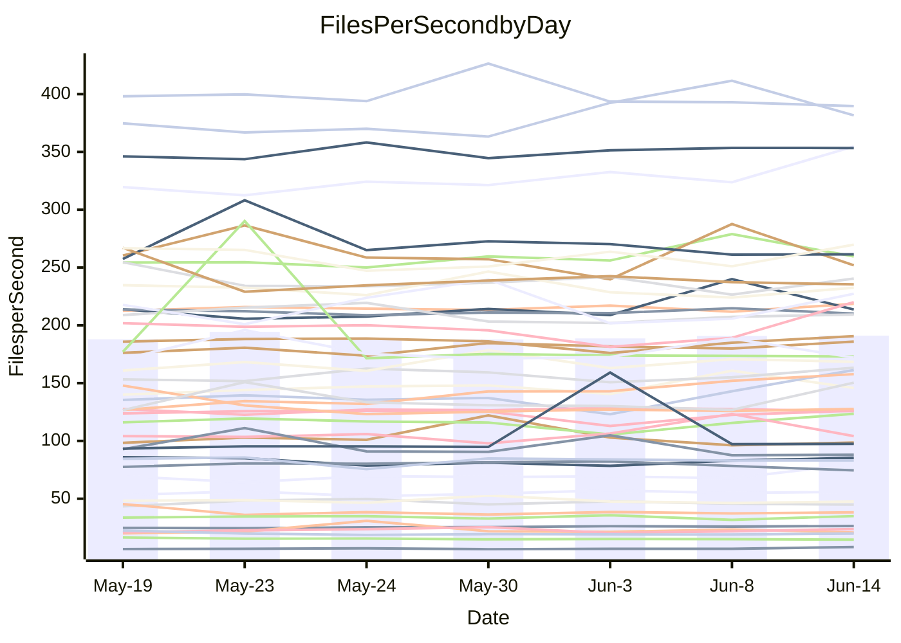

<!---
# This file is auto-generated. Do not edit.
# cspell:disable
--->
# Performance Report

Daily Performance

```mermaid
xychart-beta
    title Files Per Second by Day
    y-axis Files per Second
    x-axis Date [May-19, May-23, May-24, May-30, Jun-3, Jun-8, Jun-14]
    bar [187.94, 194.38, 187.53, 187.84, 188.70, 190.81, 191.12]
    line [24.84, 24.48, 25.27, 25.51, 26.21, 25.84, 26.48]
    line [20.00, 21.53, 30.85, 21.86, 21.33, 23.44, 20.77]
    line [43.44, 48.37, 49.79, 45.03, 47.69, 45.74, 44.93]
    line [16.48, 15.39, 15.58, 14.86, 15.18, 15.02, 14.65]
    line [98.35, 102.96, 100.96, 122.12, 102.88, 96.25, 98.55]
    line [374.77, 366.83, 370.08, 363.31, 392.45, 411.63, 381.64]
    line [123.77, 125.73, 125.94, 125.35, 112.95, 122.50, 126.17]
    line [85.95, 85.08, 78.77, 81.14, 78.40, 83.02, 85.34]
    line [140.07, 144.01, 147.15, 148.03, 140.54, 160.74, 145.81]
    line [69.47, 64.25, 69.53, 68.78, 69.37, 67.74, 79.92]
    line [77.54, 80.59, 80.29, 81.53, 82.29, 78.36, 74.53]
    line [212.55, 215.84, 214.38, 213.29, 217.13, 211.77, 218.65]
    line [153.28, 151.73, 162.52, 159.30, 150.77, 155.04, 163.34]
    line [254.35, 254.61, 250.00, 259.58, 256.09, 278.90, 259.60]
    line [260.36, 286.42, 258.60, 257.18, 239.81, 287.65, 251.95]
    line [135.42, 139.50, 135.65, 137.15, 123.09, 142.96, 161.35]
    line [21.05, 22.73, 23.64, 25.47, 20.39, 21.85, 23.82]
    line [213.89, 205.67, 207.63, 214.21, 208.82, 240.01, 213.64]
    line [160.94, 168.26, 160.60, 178.51, 162.97, 170.78, 168.46]
    line [319.57, 312.48, 324.31, 321.30, 332.58, 323.78, 354.69]
    line [213.72, 212.23, 208.69, 211.05, 210.52, 214.78, 210.20]
    line [45.35, 36.07, 38.42, 36.32, 38.54, 37.33, 38.26]
    line [254.57, 234.26, 233.79, 236.78, 241.94, 226.60, 240.44]
    line [33.61, 34.69, 34.94, 32.78, 35.79, 31.73, 34.98]
    line [185.86, 188.16, 188.58, 186.13, 176.02, 184.92, 190.66]
    line [22.53, 19.87, 18.72, 19.42, 19.15, 19.01, 19.91]
    line [127.71, 122.71, 127.15, 126.61, 128.67, 127.50, 125.76]
    line [257.39, 308.24, 265.00, 272.73, 270.27, 261.13, 261.42]
    line [48.29, 48.86, 46.46, 52.80, 47.62, 46.28, 47.54]
    line [53.17, 56.48, 52.20, 54.24, 57.32, 54.91, 55.98]
    line [6.48, 6.70, 7.10, 6.34, 6.74, 6.70, 8.24]
    line [147.92, 130.77, 123.22, 125.33, 127.25, 125.89, 127.61]
    line [208.87, 215.23, 219.43, 203.27, 201.99, 207.37, 209.33]
    line [116.06, 119.43, 116.84, 115.92, 105.51, 115.54, 123.50]
    line [176.15, 180.59, 173.73, 184.72, 181.71, 179.92, 185.95]
    line [84.52, 85.73, 75.59, 84.88, 83.99, 83.05, 83.17]
    line [104.19, 103.43, 105.92, 97.87, 106.45, 123.34, 104.15]
    line [346.15, 343.69, 358.26, 344.65, 351.41, 353.54, 353.38]
    line [234.71, 232.57, 226.13, 246.49, 228.60, 224.05, 232.54]
    line [217.73, 200.96, 223.84, 239.63, 201.75, 205.74, 227.27]
    line [92.82, 111.10, 90.94, 90.56, 104.84, 87.60, 88.07]
    line [126.78, 134.48, 131.99, 142.83, 143.00, 151.99, 157.77]
    line [126.61, 150.87, 133.44, 130.84, 130.22, 126.80, 150.40]
    line [177.15, 290.28, 171.42, 175.26, 173.98, 173.63, 173.03]
    line [267.13, 229.05, 234.58, 238.79, 242.50, 237.41, 235.41]
    line [398.12, 399.78, 393.93, 426.44, 393.52, 392.96, 389.62]
    line [201.86, 198.76, 200.08, 195.61, 181.39, 189.21, 220.12]
    line [93.35, 95.34, 95.32, 94.79, 159.13, 97.18, 97.48]
    line [266.74, 265.26, 247.18, 250.86, 263.73, 251.08, 269.77]
    line [170.67, 195.94, 175.36, 171.10, 172.66, 188.61, 172.10]
```

Time to Process Files

| Repository                                      | Elapsed | Min/Avg/Max          |   SD | SD Graph                |
| ----------------------------------------------- | ------: | :------------------: | ---: | ----------------------- |
| AdaDoom3/AdaDoom3                    |    2.77 | 2.2 /   2.7 /   2.9  | 0.19 | `    ┣━━┻━━╋●━┻━━┫    ` |
| alexiosc/megistos                    |    6.85 | 6.7 /   7.1 /   7.9  | 0.33 | `    ┣━━┻●━╋━━┻━━┫    ` |
| apollographql/apollo-server          |    2.61 | 1.4 /   2.5 /   2.8  | 0.29 | `    ┣━━┻━━╋●━┻━━┫    ` |
| aspnetboilerplate/aspnetboilerplate  |    8.70 | 7.3 /   8.8 /   9.3  | 0.44 | `    ┣━━┻━●╋━━┻━━┫    ` |
| aws-amplify/docs                     |   12.36 | 10.1 /  12.4 /  13.4 | 0.66 | `    ┣━━┻━━●━━┻━━┫    ` |
| Azure/azure-rest-api-specs           |   10.11 | 7.6 /   9.7 /  10.8  | 0.77 | `    ┣━━┻━━╋━●┻━━┫    ` |
| bitjson/typescript-starter           |    1.00 | 0.8 /   1.0 /   1.1  | 0.07 | `     ┣━┻━●╋━━┻━┫     ` |
| caddyserver/caddy                    |    3.59 | 2.7 /   3.4 /   3.7  | 0.27 | `    ┣━━┻━━╋━●┻━━┫    ` |
| canada-ca/open-source-logiciel-libre |    0.63 | 0.9 /   1.1 /   1.2  | 0.07 | `●      ┣┻━╋━┻┫       ` |
| chef/chef                            |    5.10 | 4.6 /   4.9 /   5.3  | 0.19 | `    ┣━━┻━━╋━●┻━━┫    ` |
| dart-lang/sdk                        |   44.68 | 55.5 /  58.4 /  70.0 | 3.45 | `●    ┣━┻━━╋━━┻━┫     ` |
| django/django                        |   13.95 | 10.4 /  13.5 /  14.2 | 0.86 | `    ┣━━┻━━╋━●┻━━┫    ` |
| eslint/eslint                        |    9.59 | 9.5 /   9.8 /  10.3  | 0.22 | `    ┣━━●━━╋━━┻━━┫    ` |
| exonum/exonum                        |    3.25 | 3.3 /   3.4 /   3.7  | 0.11 | `     ┣●┻━━╋━━┻━┫     ` |
| flutter/samples                      |   11.47 | 9.0 /  12.0 /  13.6  | 1.11 | `    ┣━━┻●━╋━━┻━━┫    ` |
| gitbucket/gitbucket                  |    2.49 | 2.5 /   3.1 /   3.4  | 0.26 | `   ●┣━━┻━━╋━━┻━━┫    ` |
| googleapis/google-cloud-cpp          |  122.87 | 95.0 / 118.7 / 126.5 | 9.13 | `  ┣━━━┻━━━╋━●━┻━━━┫  ` |
| graphql/express-graphql              |    1.10 | 0.9 /   1.1 /   1.3  | 0.11 | `     ┣━┻━●╋━━┻━┫     ` |
| graphql/graphql-js                   |    3.79 | 2.6 /   2.9 /   3.6  | 0.29 | `    ┣━━┻━━╋━━┻━━┫  ● ` |
| graphql/graphql-relay-js             |    1.02 | 1.0 /   1.1 /   1.2  | 0.04 | `     ●━┻━━╋━━┻━┫     ` |
| graphql/graphql-spec                 |    1.35 | 1.0 /   1.2 /   1.4  | 0.07 | `     ┣━┻━━╋━━┻●┫     ` |
| iluwatar/java-design-patterns        |   11.62 | 7.1 /  11.6 /  12.3  | 1.22 | `   ┣━━━┻━━●━━┻━━━┫   ` |
| ktaranov/sqlserver-kit               |    5.89 | 5.5 /   5.9 /   7.5  | 0.44 | `    ┣━━┻━━●━━┻━━┫    ` |
| liriliri/licia                       |    3.84 | 3.0 /   3.8 /   4.1  | 0.26 | `    ┣━━┻━━●━━┻━━┫    ` |
| MartinThoma/LaTeX-examples           |    6.05 | 4.7 /   6.1 /   6.5  | 0.38 | `    ┣━━┻━━●━━┻━━┫    ` |
| mdx-js/mdx                           |    1.89 | 1.7 /   1.8 /   1.9  | 0.06 | `     ┣━┻━━╋━━┻━●     ` |
| microsoft/TypeScript-Website         |    5.60 | 4.1 /   5.2 /   5.6  | 0.33 | `    ┣━━┻━━╋━━┻●━┫    ` |
| MicrosoftDocs/PowerShell-Docs        |   24.87 | 23.0 /  24.7 /  26.4 | 0.86 | `   ┣━━━┻━━╋●━┻━━━┫   ` |
| neovim/nvim-lspconfig                |    5.26 | 4.0 /   5.1 /   5.6  | 0.33 | `    ┣━━┻━━╋━●┻━━┫    ` |
| pagekit/pagekit                      |    3.34 | 3.3 /   3.5 /   3.6  | 0.08 | `     ┣●┻━━╋━━┻━┫     ` |
| php/php-src                          |   24.51 | 14.4 /  23.3 /  25.6 | 2.40 | `   ┣━━┻━━━╋━●━┻━━┫   ` |
| plasticrake/tplink-smarthome-api     |    1.28 | 1.0 /   1.3 /   1.4  | 0.09 | `     ┣━┻━━●━━┻━┫     ` |
| prettier/prettier                    |    7.61 | 7.3 /   7.7 /   8.3  | 0.23 | `    ┣━━┻━●╋━━┻━━┫    ` |
| pycontribs/jira                      |    1.45 | 1.4 /   1.5 /   1.6  | 0.08 | `     ┣━┻━●╋━━┻━┫     ` |
| RustPython/RustPython                |    6.64 | 6.4 /   6.7 /   7.4  | 0.26 | `    ┣━━┻━●╋━━┻━━┫    ` |
| shoelace-style/shoelace              |    2.76 | 2.7 /   2.8 /   3.0  | 0.11 | `     ┣━┻━●╋━━┻━┫     ` |
| slint-ui/slint                       |   13.39 | 11.3 /  13.5 /  14.5 | 0.70 | `    ┣━━┻━●╋━━┻━━┫    ` |
| SoftwareBrothers/admin-bro           |    2.36 | 2.3 /   2.4 /   2.6  | 0.10 | `     ┣━┻●━╋━━┻━┫     ` |
| sveltejs/svelte                      |   22.61 | 17.1 /  22.0 /  23.2 | 1.35 | `   ┣━━━┻━━╋━●┻━━━┫   ` |
| TheAlgorithms/Python                 |    5.68 | 4.1 /   5.3 /   5.9  | 0.46 | `    ┣━━┻━━╋━●┻━━┫    ` |
| twbs/bootstrap                       |    1.45 | 1.3 /   1.7 /   1.9  | 0.12 | `    ●┣━┻━━╋━━┻━┫     ` |
| typescript-cheatsheets/react         |    1.18 | 0.7 /   1.1 /   1.3  | 0.14 | `     ┣━┻━━╋━●┻━┫     ` |
| typescript-eslint/typescript-eslint  |    3.97 | 3.1 /   4.1 /   4.6  | 0.29 | `    ┣━━┻━●╋━━┻━━┫    ` |
| vitest-dev/vitest                    |   10.29 | 7.7 /  10.0 /  10.7  | 0.66 | `    ┣━━┻━━╋●━┻━━┫    ` |
| w3c/aria-practices                   |    3.24 | 2.5 /   3.2 /   3.4  | 0.21 | `    ┣━━┻━━●━━┻━━┫    ` |
| w3c/specberus                        |    1.90 | 1.2 /   1.9 /   2.2  | 0.21 | `     ┣━┻━━●━━┻━┫     ` |
| webdeveric/webpack-assets-manifest   |    1.17 | 1.0 /   1.2 /   1.4  | 0.08 | `     ┣━┻━●╋━━┻━┫     ` |
| webpack/webpack                      |    5.82 | 4.2 /   5.3 /   5.9  | 0.46 | `    ┣━━┻━━╋━━●━━┫    ` |
| wireapp/wire-desktop                 |    1.28 | 1.2 /   1.3 /   1.6  | 0.09 | `     ┣━┻●━╋━━┻━┫     ` |
| wireapp/wire-webapp                  |   12.14 | 11.5 /  12.0 /  12.7 | 0.28 | `    ┣━━┻━━╋━●┻━━┫    ` |

Note:
- Elapsed time is in seconds.

Files per Second over Time

| Repository                                      | Files |    Sec |    Fps |     Rel | Trend Fps           |    N |
| ----------------------------------------------- | ----: | -----: | -----: | ------: | ------------------- | ---: |
| AdaDoom3/AdaDoom3                    |   103 |   2.77 |  37.22 |  -2.86% | `▇█▃▃▅▃▃▂▃▃▄▃▄▃▄▄▃` |   16 |
| alexiosc/megistos                    |   583 |   6.85 |  85.10 |   2.95% | `█▇█▆▇▃▆▇▄▆▅▆▇▇█▇▇` |   16 |
| apollographql/apollo-server          |   255 |   2.61 |  97.80 |  -7.00% | `▂▂▂▂▂▂▂█▂▂▂▁▂▂▂▂▂` |   16 |
| aspnetboilerplate/aspnetboilerplate  |  2286 |   8.70 | 262.86 |   0.98% | `▃▄▃▃▃▃▃▄▄▄▃▄█▄▄▃▄` |   16 |
| aws-amplify/docs                     |  2959 |  12.36 | 239.42 |  -0.19% | `▄█▄▂▄▃▄▄▃▄▄▄▃▄▃▄▄` |   16 |
| Azure/azure-rest-api-specs           |  2482 |  10.11 | 245.45 |  -5.20% | `▄▄▄▄▂▄▂▅▃▃▄▂▃▄▂█▃` |   16 |
| bitjson/typescript-starter           |    20 |   1.00 |  20.02 |   1.42% | `█▄▄▄▄▂▄▃▄▃▃▂▃▄▃▅▄` |   16 |
| caddyserver/caddy                    |   314 |   3.59 |  87.45 |  -6.50% | `▄▄▆█▃▃▃▄▂▃▆▃▃▃▂▃▃` |   16 |
| canada-ca/open-source-logiciel-libre |     7 |   0.63 |  11.18 |  68.29% | `▂▃▃▂▄▂▁▂▂▃▂▂▂▃▃▂█` |   16 |
| chef/chef                            |  1032 |   5.10 | 202.36 |  -3.34% | `▆▆█▆▇█▅▄▄▇▅▇▅▅▅█▅` |   16 |
| dart-lang/sdk                        | 11472 |  44.68 | 256.76 |  30.98% | `▄▅▄▄▄▅▄▄▄▄▃▄▂▄▄▄█` |   16 |
| django/django                        |  2922 |  13.95 | 209.49 |  -3.45% | `▃▃▂▂▂▂▃▂▃▃▂▃▃█▃▃▂` |   16 |
| eslint/eslint                        |  2080 |   9.59 | 216.81 |   2.57% | `█▆▇▇▇▆█▇▅▇▇█▇█▅▆█` |   16 |
| exonum/exonum                        |   421 |   3.25 | 129.53 |   4.58% | `▆▇▇▇█▇▇█▆▆▄▇▇▅▇▇█` |   16 |
| flutter/samples                      |  1695 |  11.47 | 147.84 |   3.64% | `▂▂▃▂▃▂▄▃▄▂▄▄▄▅█▃▄` |   16 |
| gitbucket/gitbucket                  |   417 |   2.49 | 167.75 |  25.46% | `▃▂█▃▄▃▃▃▃▄▃▃▃▂▂▇█` |   16 |
| googleapis/google-cloud-cpp          | 21266 | 122.87 | 173.08 |  -2.83% | `▃▃█▃▃▃▂▃▂▃▃▂▃█▃▂▃` |   16 |
| graphql/express-graphql              |    26 |   1.10 |  23.74 |   2.54% | `▃▂▃▄▄▄▄█▄▅▂▂▂▅▄▅▄` |   16 |
| graphql/graphql-js                   |   547 |   3.79 | 144.47 |   2.22% | `▃▂▃▃▃▂▂▃▃▃▂▃▂▅▄█▄` |   16 |
| graphql/graphql-relay-js             |    28 |   1.02 |  27.49 |   8.11% | `▄▅▄▅▄▇▅▆▆▅▆▆▄█▆▆█` |   16 |
| graphql/graphql-spec                 |    19 |   1.35 |  14.09 |  -7.75% | `▃█▄▄▄▄▃▂▄▄▄▄▃▄▃▃▂` |   16 |
| iluwatar/java-design-patterns        |  2089 |  11.62 | 179.77 |  -0.96% | `▂▂█▁▂▂▂▂▂▂▂▂▁▁▁▂`  |   15 |
| ktaranov/sqlserver-kit               |   490 |   5.89 |  83.18 |   0.02% | `▇▇▇▇▂▇▅███▇▆▆▇▇▆▇` |   16 |
| liriliri/licia                       |  1438 |   3.84 | 374.26 |  -1.42% | `▃▄▂▄▃▃▃▂▃▄▄█▃▄▃▄▃` |   16 |
| MartinThoma/LaTeX-examples           |  1409 |   6.05 | 232.74 |  -0.39% | `▃▄▃▃▃▂█▃▃▃▃▂▂▃▃▃▃` |   16 |
| mdx-js/mdx                           |   139 |   1.89 |  73.40 |  -7.57% | `▄█▆█▇▇█▇█▇█▆▆▆▅▄▄` |   16 |
| microsoft/TypeScript-Website         |   765 |   5.60 | 136.64 |  -8.07% | `▃▂▃▃▂▄▃▃▃▄▃▄█▃▄▃▂` |   16 |
| MicrosoftDocs/PowerShell-Docs        |  3126 |  24.87 | 125.70 |  -0.65% | `▅▇▄▅▇▅▄▆▇▅▆█▆▄▅▆▅` |   16 |
| neovim/nvim-lspconfig                |   861 |   5.26 | 163.58 |  -3.45% | `▃▃▃▃▂▃▃█▄▃▃▄▄▃▄▄▃` |   16 |
| pagekit/pagekit                      |   741 |   3.34 | 222.02 |   3.72% | `▅▇▆█▆▆▅▅█▆▇▇▅▅▆██` |   16 |
| php/php-src                          |  2295 |  24.51 |  93.63 |  -6.17% | `▁▂▂▂▂▂▂▂▂▂█▂▂▂▂▃▂` |   16 |
| plasticrake/tplink-smarthome-api     |    62 |   1.28 |  48.55 |  -0.27% | `▄▄▄▄▄▂█▅▅▄▄▃▄▂▃▄▄` |   16 |
| prettier/prettier                    |  2712 |   7.61 | 356.60 |   2.06% | `▆▆▅▆▇▇█▅▇▄▇▆█▆▇▆▇` |   16 |
| pycontribs/jira                      |    80 |   1.45 |  55.25 |   0.97% | `▄▇▇▇▅▅▇▅█▃█▄█▇█▇▇` |   16 |
| RustPython/RustPython                |   810 |   6.64 | 121.97 |   4.42% | `▆▆█▆▆▆▅▆▅▇▃▄▅███▇` |   16 |
| shoelace-style/shoelace              |   440 |   2.76 | 159.26 |   1.16% | `▇▄▄▆█▇▇▇▇▆▅▇▅▆██▇` |   16 |
| slint-ui/slint                       |  3318 |  13.39 | 247.74 |   4.65% | `█▃▃▄▄▄▃▄▄▅▅▃▃▃▄▄▅` |   16 |
| SoftwareBrothers/admin-bro           |   441 |   2.36 | 187.05 |   3.48% | `▆▄▇▅▅▅▇█▇▄▆▆▆▅▇▇▇` |   16 |
| sveltejs/svelte                      |  8893 |  22.61 | 393.38 |  -2.22% | `▃▃▃▃▃▂▃█▃▃▃▃▂▃▃▂▃` |   16 |
| TheAlgorithms/Python                 |  1411 |   5.68 | 248.38 |  -6.49% | `▄▃▂▇▃▄▃▃▃▃▂█▃▃▃▃▂` |   16 |
| twbs/bootstrap                       |   118 |   1.45 |  81.57 |  17.32% | `▄▄▂▃▄▄▄▄▄▃▄▄▃▃▃█▆` |   16 |
| typescript-cheatsheets/react         |    24 |   1.18 |  20.30 | -11.23% | `▂▁▂▂█▄▃▂▂▂▂▂▂▅▂▂▂` |   16 |
| typescript-eslint/typescript-eslint  |  1321 |   3.97 | 333.03 |   1.83% | `▃▄▂▄▃▄▃▄▄▃▄▃▃▄▃█▄` |   16 |
| vitest-dev/vitest                    |  2708 |  10.29 | 263.25 |  -2.65% | `▂▂▃█▃▃▄▄▃▃▃▃▃▂▃▂▃` |   16 |
| w3c/aria-practices                   |   414 |   3.24 | 127.70 |  -1.06% | `▃█▃▃▂▃▃▂▃▂▃▃▃▃▃▃▃` |   16 |
| w3c/specberus                        |   196 |   1.90 | 103.27 |  -3.05% | `▃▂▂▃▃▃▃▂▁▂▃█▂▃▃▂▃` |   16 |
| webdeveric/webpack-assets-manifest   |    55 |   1.17 |  47.09 |   2.38% | `▅▂▅▆█▅▅▄▄▄▅▅▅▄▃▅▅` |   16 |
| webpack/webpack                      |  1199 |   5.82 | 205.91 |  -7.46% | `▃▄▂▄▄▄█▄▄▂▂▃▃▇▃▃`  |   15 |
| wireapp/wire-desktop                 |    44 |   1.28 |  34.44 |   2.23% | `█▅▇██▇█▆▇▃█▆▃▆██▇` |   16 |
| wireapp/wire-webapp                  |  2241 |  12.14 | 184.64 |  -1.12% | `▇▆▆▇▇▆▆▆▆▆▄▅▇▆▇█▆` |   16 |

Data Throughput

| Repository                                      | Files |    Sec |     Kps |     Rel | Trend Kps           |    N |
| ----------------------------------------------- | ----: | -----: | ------: | ------: | ------------------- | ---: |
| AdaDoom3/AdaDoom3                    |   103 |   2.77 |  790.96 |  -2.86% | `▇█▃▃▅▃▃▂▃▃▄▃▄▃▄▄▃` |   16 |
| alexiosc/megistos                    |   583 |   6.85 |  668.68 |   2.95% | `█▇█▆▇▃▆▇▄▆▅▆▇▇█▇▇` |   16 |
| apollographql/apollo-server          |   255 |   2.61 |  808.09 |  -7.00% | `▂▂▂▂▂▂▂█▂▂▂▁▂▂▂▂▂` |   16 |
| aspnetboilerplate/aspnetboilerplate  |  2286 |   8.70 |  639.56 |   0.98% | `▃▄▃▃▃▃▃▄▄▄▃▄█▄▄▃▄` |   16 |
| aws-amplify/docs                     |  2959 |  12.36 |  865.78 |  -0.19% | `▄█▄▂▄▃▄▄▃▄▄▄▃▄▃▄▄` |   16 |
| Azure/azure-rest-api-specs           |  2482 |  10.11 |  747.32 |  -3.92% | `▄▄▄▄▂▄▂▅▃▃▄▂▃▄▃█▃` |   16 |
| bitjson/typescript-starter           |    20 |   1.00 |   80.06 |   1.42% | `█▄▄▄▄▂▄▃▄▃▃▂▃▄▃▅▄` |   16 |
| caddyserver/caddy                    |   314 |   3.59 |  790.92 |  -5.60% | `▄▄▆█▃▃▃▄▂▃▆▃▃▃▂▄▃` |   16 |
| canada-ca/open-source-logiciel-libre |     7 |   0.63 |   92.63 |  68.29% | `▂▃▃▂▄▂▁▂▂▃▂▂▂▃▃▂█` |   16 |
| chef/chef                            |  1032 |   5.10 |  992.61 |  -3.20% | `▆▆█▆▇█▅▄▄▇▅▇▅▅▅█▅` |   16 |
| dart-lang/sdk                        | 11472 |  44.68 | 1752.35 |  30.82% | `▄▅▄▄▄▅▄▄▄▄▃▄▂▄▄▄█` |   16 |
| django/django                        |  2922 |  13.95 | 1343.54 |  -3.44% | `▃▃▂▂▂▂▃▂▃▃▂▃▃█▃▃▂` |   16 |
| eslint/eslint                        |  2080 |   9.59 | 1508.58 |   2.59% | `█▆▇▇▇▆█▇▅▇▇█▇█▅▆█` |   16 |
| exonum/exonum                        |   421 |   3.25 | 1239.00 |   4.58% | `▆▇▇▇█▇▇█▆▆▄▇▇▅▇▇█` |   16 |
| flutter/samples                      |  1695 |  11.47 |  884.84 |   3.64% | `▂▂▃▂▃▂▄▃▄▂▄▄▄▅█▃▄` |   16 |
| gitbucket/gitbucket                  |   417 |   2.49 |  800.14 |  25.51% | `▃▂█▃▄▃▃▃▃▄▃▃▃▂▂▇█` |   16 |
| googleapis/google-cloud-cpp          | 21266 | 122.87 | 1491.35 |  -2.09% | `▂▃█▃▃▃▂▃▂▃▃▂▃█▃▂▃` |   16 |
| graphql/express-graphql              |    26 |   1.10 |  108.64 |   2.54% | `▃▂▃▄▄▄▄█▄▅▂▂▂▅▄▅▄` |   16 |
| graphql/graphql-js                   |   547 |   3.79 | 1067.29 |  20.90% | `▂▂▂▂▂▂▂▂▂▂▁▂▂▆▅█▅` |   16 |
| graphql/graphql-relay-js             |    28 |   1.02 |  108.01 |   8.11% | `▄▅▄▅▄▇▅▆▆▅▆▆▄█▆▆█` |   16 |
| graphql/graphql-spec                 |    19 |   1.35 |  471.73 |  -7.51% | `▃█▄▄▄▄▃▂▄▄▄▄▃▄▃▄▂` |   16 |
| iluwatar/java-design-patterns        |  2089 |  11.62 |  553.86 |  -1.00% | `▂▂█▂▂▂▂▂▂▂▂▂▁▁▁▂`  |   15 |
| ktaranov/sqlserver-kit               |   490 |   5.89 | 1260.11 |   0.02% | `▇▇▇▇▂▇▅███▇▆▆▇▇▆▇` |   16 |
| liriliri/licia                       |  1438 |   3.84 |  446.62 |  -1.42% | `▃▄▂▄▃▃▃▂▃▄▄█▃▄▃▄▃` |   16 |
| MartinThoma/LaTeX-examples           |  1409 |   6.05 |  480.67 |  -0.39% | `▃▄▃▃▃▂█▃▃▃▃▂▂▃▃▃▃` |   16 |
| mdx-js/mdx                           |   139 |   1.89 |  343.22 |  -7.61% | `▄█▆█▇▇█▇█▇█▆▆▆▅▄▄` |   16 |
| microsoft/TypeScript-Website         |   765 |   5.60 |  941.09 |  -8.07% | `▃▂▃▃▂▄▃▃▃▄▃▄█▃▄▃▂` |   16 |
| MicrosoftDocs/PowerShell-Docs        |  3126 |  24.87 | 1339.73 |  -0.63% | `▅▇▄▅▇▅▄▆▇▅▆█▆▄▅▆▅` |   16 |
| neovim/nvim-lspconfig                |   861 |   5.26 |  479.52 |  -3.44% | `▃▃▃▃▂▃▃█▄▃▃▄▄▃▄▄▃` |   16 |
| pagekit/pagekit                      |   741 |   3.34 |  462.92 |   3.72% | `▅▇▆█▆▆▅▅█▆▇▇▅▅▆██` |   16 |
| php/php-src                          |  2295 |  24.51 | 1648.11 |  -6.11% | `▁▂▂▂▂▂▂▂▂▂█▂▂▂▂▃▂` |   16 |
| plasticrake/tplink-smarthome-api     |    62 |   1.28 |  262.35 |  -0.27% | `▄▄▄▄▄▂█▅▅▄▄▃▄▂▃▄▄` |   16 |
| prettier/prettier                    |  2712 |   7.61 |  487.04 |   1.61% | `▆▆▅▆▇▇█▅▇▄▇▆█▆▇▆▇` |   16 |
| pycontribs/jira                      |    80 |   1.45 |  390.19 |   0.97% | `▄▇▇▇▅▅▇▅█▃█▄█▇█▇▇` |   16 |
| RustPython/RustPython                |   810 |   6.64 | 1974.18 |   0.21% | `▆▆█▆▆▇▆▆▅█▃▄▆▇▇▇▆` |   16 |
| shoelace-style/shoelace              |   440 |   2.76 |  769.16 |   1.16% | `▇▄▄▆█▇▇▇▇▆▅▇▅▆██▇` |   16 |
| slint-ui/slint                       |  3318 |  13.39 | 1304.33 |   5.33% | `█▃▃▄▄▄▃▄▄▅▅▃▃▃▄▄▅` |   16 |
| SoftwareBrothers/admin-bro           |   441 |   2.36 |  412.28 |   3.48% | `▆▄▇▅▅▅▇█▇▄▆▆▆▅▇▇▇` |   16 |
| sveltejs/svelte                      |  8893 |  22.61 |  268.59 |  -1.72% | `▃▃▃▃▃▂▃█▃▃▃▃▂▃▃▃▃` |   16 |
| TheAlgorithms/Python                 |  1411 |   5.68 |  634.94 |  -6.41% | `▄▃▂▇▃▄▃▃▃▃▂█▃▄▃▃▂` |   16 |
| twbs/bootstrap                       |   118 |   1.45 |  669.14 |  17.23% | `▄▄▂▃▄▄▄▄▄▃▄▄▃▃▃█▆` |   16 |
| typescript-cheatsheets/react         |    24 |   1.18 |  183.53 | -10.90% | `▂▁▂▂█▄▃▂▂▂▂▂▂▅▂▂▂` |   16 |
| typescript-eslint/typescript-eslint  |  1321 |   3.97 | 1816.16 |   2.43% | `▃▄▂▄▃▄▃▄▄▃▄▃▃▄▃█▄` |   16 |
| vitest-dev/vitest                    |  2708 |  10.29 |  695.37 |  -0.96% | `▂▂▃█▃▃▃▄▃▃▃▃▃▂▃▃▃` |   16 |
| w3c/aria-practices                   |   414 |   3.24 | 1193.13 |  -1.06% | `▃█▃▃▂▃▃▂▃▂▃▃▃▃▃▃▃` |   16 |
| w3c/specberus                        |   196 |   1.90 |  336.68 |  -3.05% | `▃▂▂▃▃▃▃▂▁▂▃█▂▃▃▂▃` |   16 |
| webdeveric/webpack-assets-manifest   |    55 |   1.17 |  107.88 |   2.38% | `▅▂▅▆█▅▅▄▄▄▅▅▅▄▃▅▅` |   16 |
| webpack/webpack                      |  1199 |   5.82 | 1097.70 |  -3.15% | `▃▄▂▄▄▄█▄▄▂▂▃▄█▄▄`  |   15 |
| wireapp/wire-desktop                 |    44 |   1.28 |  154.99 |   4.10% | `█▅▆█▇▇▇▆▆▃█▆▃▇██▇` |   16 |
| wireapp/wire-webapp                  |  2241 |  12.14 |  766.16 |  -1.67% | `▇▆▇▇▇▇▆▇▇▇▄▅▇▆▇█▆` |   16 |

