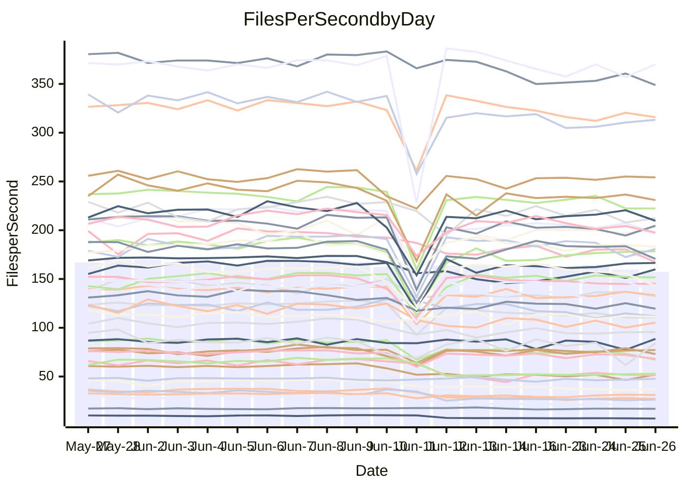

<!---
# This file is auto-generated. Do not edit.
# cspell:disable
--->
# Performance Report

## Daily Performance

```mermaid
xychart-beta
    title Files Per Second by Day
    y-axis Files per Second
    x-axis Date [May-27, May-28, Jun-2, Jun-3, Jun-4, Jun-5, Jun-6, Jun-7, Jun-8, Jun-9, Jun-10, Jun-11, Jun-12, Jun-13, Jun-14, Jun-16, Jun-23, Jun-24, Jun-25, Jun-26]
    bar [166.96, 169.46, 169.96, 167.33, 166.18, 163.49, 167.64, 166.67, 170.13, 167.55, 162.35, 108.94, 163.62, 164.52, 162.91, 165.65, 161.06, 164.28, 159.75, 157.38]
    line [17.18, 17.51, 16.57, 17.42, 16.78, 16.53, 16.44, 17.51, 17.66, 17.41, 17.50, 17.71, 17.68, 18.34, 17.12, 16.25, 16.59, 17.11, 17.00, 16.96]
    line [36.71, 34.78, 33.91, 36.69, 37.31, 37.44, 37.24, 35.30, 34.77, 36.25, 37.82, 33.71, 28.61, 28.16, 28.05, 28.76, 25.82, 27.29, 28.03, 27.16]
    line [137.65, 149.96, 147.05, 148.67, 143.16, 145.94, 143.30, 134.96, 144.03, 143.02, 149.83, 130.69, 133.43, 133.31, 131.91, 133.18, 130.59, 136.24, 136.67, 132.10]
    line [86.22, 87.00, 88.85, 85.35, 85.47, 89.21, 83.88, 87.59, 84.94, 85.33, 87.27, 67.23, 77.70, 76.81, 78.39, 74.00, 74.26, 76.13, 73.45, 67.27]
    line [60.71, 60.16, 61.03, 59.59, 60.87, 59.62, 60.76, 62.31, 62.61, 63.50, 58.41, 51.82, 52.68, 49.85, 52.20, 51.85, 50.23, 51.87, 46.40, 52.11]
    line [35.47, 33.75, 35.37, 34.22, 32.93, 35.76, 34.34, 33.08, 34.79, 30.45, 36.74, 34.61, 25.22, 27.49, 26.99, 26.84, 26.60, 26.95, 25.71, 26.31]
    line [199.24, 175.34, 196.23, 196.86, 189.06, 201.96, 198.84, 198.16, 197.09, 193.40, 192.55, 186.93, 176.04, 174.92, 181.06, 184.11, 172.84, 180.05, 180.38, 167.35]
    line [86.86, 88.34, 85.50, 84.47, 88.02, 88.72, 85.27, 89.11, 82.67, 88.45, 84.36, 84.11, 87.88, 85.81, 88.09, 78.16, 86.88, 85.49, 77.34, 88.55]
    line [46.05, 45.56, 40.22, 45.53, 45.18, 46.69, 45.37, 46.01, 47.36, 45.48, 45.06, 39.72, 39.47, 40.00, 39.07, 39.70, 37.48, 36.99, 36.10, 37.19]
    line [29.97, 29.26, 26.66, 29.18, 29.82, 30.31, 29.19, 29.49, 29.31, 30.11, 30.11, 28.55, 21.08, 22.04, 22.18, 21.66, 21.30, 21.15, 22.00, 21.42]
    line [380.47, 381.86, 371.54, 374.06, 373.98, 371.38, 376.26, 368.01, 380.10, 379.55, 383.29, 365.99, 374.63, 372.72, 362.93, 349.94, 351.35, 353.13, 360.69, 348.86]
    line [139.81, 139.15, 143.14, 140.08, 138.53, 141.10, 136.12, 141.18, 140.04, 142.05, 141.88, 103.59, 133.58, 131.67, 139.76, 130.35, 131.39, 132.60, 136.92, 133.30]
    line [123.56, 125.85, 123.16, 123.10, 122.32, 125.12, 124.06, 124.88, 126.90, 127.99, 124.73, 92.95, 120.36, 118.07, 115.35, 114.38, 112.71, 115.12, 110.67, 110.56]
    line [187.29, 189.95, 184.53, 188.39, 185.43, 180.94, 188.95, 192.45, 187.05, 185.74, 177.64, 118.63, 166.53, 181.43, 168.60, 169.42, 174.24, 176.57, 177.80, 178.38]
    line [75.89, 77.47, 73.86, 74.85, 71.14, 76.14, 78.15, 82.81, 79.64, 79.01, 70.82, 61.30, 76.37, 77.13, 76.03, 78.06, 76.22, 74.88, 79.14, 73.10]
    line [122.44, 116.90, 125.01, 123.38, 123.79, 117.07, 125.94, 118.40, 118.39, 121.53, 129.30, 127.90, 119.77, 124.29, 124.35, 117.01, 116.01, 109.65, 114.81, 111.67]
    line [65.92, 61.45, 66.55, 63.66, 66.39, 61.22, 66.87, 62.38, 67.14, 67.89, 65.57, 63.26, 51.25, 48.63, 44.36, 52.41, 51.44, 53.68, 51.84, 51.40]
    line [169.00, 171.65, 172.08, 171.12, 171.41, 171.98, 173.13, 171.37, 173.71, 173.55, 167.26, 155.87, 157.93, 149.82, 145.84, 147.63, 152.29, 157.67, 151.07, 159.95]
    line [213.28, 212.12, 220.46, 209.25, 209.34, 207.30, 195.72, 199.83, 209.95, 194.96, 213.85, 159.52, 202.89, 195.38, 189.84, 200.33, 200.19, 199.73, 196.39, 203.53]
    line [212.39, 203.78, 212.56, 214.03, 221.77, 221.19, 224.37, 218.89, 220.13, 221.21, 219.70, 143.90, 199.78, 201.47, 205.17, 207.22, 205.60, 202.43, 207.02, 197.68]
    line [211.01, 213.71, 214.38, 214.29, 209.74, 209.84, 206.76, 201.57, 215.78, 212.77, 213.18, 139.00, 202.99, 196.51, 209.12, 202.60, 203.46, 201.26, 194.60, 204.60]
    line [32.77, 31.93, 31.50, 31.70, 32.51, 32.67, 32.05, 32.77, 33.08, 31.95, 32.91, 27.58, 30.74, 29.76, 30.63, 29.07, 28.80, 30.64, 31.41, 31.05]
    line [104.19, 109.94, 104.58, 100.60, 104.91, 105.40, 103.85, 106.22, 109.49, 108.40, 100.17, 93.09, 97.72, 89.92, 95.33, 99.63, 94.35, 94.02, 95.44, 95.58]
    line [236.94, 237.65, 241.45, 240.17, 238.54, 237.31, 234.14, 229.58, 244.42, 243.79, 239.33, 159.65, 230.81, 234.11, 231.13, 227.87, 231.36, 235.26, 222.40, 222.30]
    line [78.87, 79.08, 78.31, 73.00, 75.74, 76.85, 75.23, 78.81, 80.33, 77.10, 77.48, 64.05, 77.39, 75.61, 71.46, 77.16, 73.34, 75.14, 76.59, 77.15]
    line [178.94, 172.60, 191.14, 184.47, 180.81, 182.21, 194.17, 193.46, 193.48, 195.01, 190.90, 131.77, 192.67, 189.08, 189.64, 183.39, 188.80, 187.17, 172.53, 180.74]
    line [76.23, 75.12, 76.51, 74.07, 73.11, 74.81, 76.32, 76.71, 76.80, 73.74, 74.27, 59.93, 73.62, 72.46, 71.40, 73.58, 68.82, 72.77, 72.13, 68.08]
    line [10.09, 9.91, 9.92, 9.53, 9.28, 10.06, 10.19, 9.49, 10.16, 10.41, 10.23, 10.15, 7.58, 7.35, 7.42, 7.28, 7.12, 7.22, 7.17, 6.95]
    line [177.15, 178.96, 184.54, 184.81, 185.74, 189.51, 188.80, 197.42, 184.56, 185.39, 175.70, 156.70, 187.10, 192.94, 186.79, 186.02, 178.80, 184.67, 184.84, 183.12]
    line [138.23, 142.50, 144.46, 138.26, 141.73, 144.23, 142.34, 139.73, 144.07, 140.57, 144.39, 117.16, 134.67, 135.55, 132.71, 138.18, 135.01, 128.78, 135.00, 130.53]
    line [187.98, 187.78, 177.77, 184.03, 180.33, 185.60, 181.36, 181.92, 188.23, 188.91, 180.00, 125.49, 173.22, 170.75, 180.24, 189.10, 183.71, 182.95, 183.62, 170.57]
    line [326.59, 328.18, 330.50, 324.04, 333.26, 322.71, 333.34, 330.40, 327.16, 331.90, 323.14, 261.07, 338.35, 332.69, 326.37, 322.64, 316.02, 312.10, 320.45, 315.81]
    line [229.07, 218.04, 228.28, 213.28, 208.94, 221.41, 223.40, 228.84, 234.29, 227.02, 228.77, 219.57, 195.02, 221.53, 214.60, 224.77, 214.79, 220.92, 207.92, 212.33]
    line [142.71, 139.43, 150.16, 152.90, 156.03, 151.19, 149.91, 156.27, 156.23, 153.60, 155.11, 113.07, 141.70, 154.36, 151.21, 153.33, 147.83, 153.51, 152.15, 151.60]
    line [234.97, 257.03, 246.00, 240.49, 248.05, 241.53, 240.02, 250.72, 249.07, 243.35, 230.21, 168.52, 236.78, 215.01, 237.87, 232.93, 234.34, 233.01, 236.58, 230.91]
    line [339.29, 320.69, 338.05, 333.16, 341.58, 330.05, 336.69, 331.37, 341.98, 331.53, 337.68, 257.72, 315.29, 320.05, 316.70, 318.97, 304.83, 306.07, 310.41, 313.20]
    line [152.29, 152.18, 146.83, 146.85, 149.33, 152.93, 149.35, 153.74, 153.91, 150.81, 139.91, 110.07, 150.95, 153.45, 149.19, 147.76, 147.78, 145.47, 144.87, 145.12]
    line [213.01, 224.63, 217.35, 221.03, 221.25, 213.65, 229.70, 223.48, 219.68, 227.92, 202.72, 153.79, 213.73, 212.23, 220.18, 211.27, 214.37, 216.02, 220.47, 209.65]
    line [117.54, 113.89, 113.32, 110.93, 114.82, 116.20, 110.99, 111.90, 113.82, 109.84, 106.42, 108.66, 112.63, 116.73, 103.14, 113.74, 113.71, 108.86, 112.34, 111.30]
    line [371.49, 369.90, 373.28, 367.80, 363.68, 370.07, 366.52, 374.25, 374.25, 369.07, 378.68, 227.98, 386.38, 382.81, 374.09, 365.35, 357.60, 370.08, 357.07, 369.96]
    line [130.99, 133.32, 137.46, 133.16, 131.72, 138.89, 137.60, 137.33, 133.44, 128.55, 130.54, 117.59, 120.60, 119.36, 126.68, 124.68, 124.29, 119.55, 125.16, 119.52]
    line [123.80, 115.09, 129.03, 122.28, 116.92, 123.22, 114.34, 124.65, 123.68, 119.64, 124.80, 107.83, 101.96, 100.16, 109.91, 108.33, 100.84, 107.27, 100.09, 105.35]
    line [94.80, 98.23, 84.40, 87.80, 85.09, 84.81, 89.37, 83.72, 89.94, 85.93, 72.73, 68.90, 82.72, 88.26, 76.41, 88.08, 81.29, 84.76, 61.88, 84.18]
    line [61.90, 67.30, 66.98, 65.52, 63.49, 66.01, 65.37, 69.17, 67.00, 68.40, 68.60, 63.88, 50.72, 51.41, 51.47, 52.39, 51.73, 51.82, 52.39, 52.99]
    line [255.79, 260.96, 252.34, 260.36, 252.30, 249.54, 253.41, 262.59, 260.07, 261.63, 234.80, 222.16, 255.69, 252.37, 242.53, 253.26, 253.77, 251.67, 255.05, 254.23]
    line [48.11, 48.53, 45.73, 48.27, 48.30, 47.93, 47.89, 48.02, 48.77, 46.64, 45.94, 46.92, 47.88, 49.42, 46.70, 44.72, 47.61, 46.18, 46.86, 47.75]
    line [206.60, 213.74, 210.83, 203.35, 203.68, 215.12, 220.07, 216.34, 222.20, 218.63, 215.45, 173.74, 197.78, 209.33, 207.61, 214.45, 207.28, 201.26, 204.34, 197.45]
    line [155.11, 163.74, 161.68, 166.56, 168.03, 163.74, 168.68, 168.50, 167.45, 164.46, 166.51, 117.60, 170.47, 156.38, 164.16, 163.15, 161.29, 162.24, 165.87, 166.45]
    line [161.02, 168.94, 162.90, 166.32, 157.04, 157.22, 160.62, 160.99, 161.40, 162.90, 146.98, 118.64, 159.81, 164.92, 162.77, 165.48, 159.81, 157.56, 155.70, 142.93]
    line [145.21, 148.86, 148.30, 147.22, 148.06, 137.39, 147.79, 143.52, 149.79, 142.40, 146.80, 105.67, 145.87, 143.36, 146.61, 147.23, 141.81, 150.65, 147.20, 137.42]
```

## Time to Process Files

| Repository                                      | Elapsed | Min/Avg/Max           |    SD | SD Graph                |
| ----------------------------------------------- | ------: | :-------------------: | ----: | ----------------------- |
| AdaDoom3/AdaDoom3                    |    3.32 | 3.1 /   3.3 /   4.1   |  0.21 | `     ┣━┻━━●━━┻━┫     ` |
| alexiosc/megistos                    |    7.56 | 7.2 /   7.8 /  12.1   |  0.82 | `    ┣━━┻━●╋━━┻━━┫    ` |
| apollographql/apollo-server          |    2.67 | 2.3 /   2.5 /   3.0   |  0.20 | `     ┣━┻━━╋━●┻━┫     ` |
| aspnetboilerplate/aspnetboilerplate  |   10.78 | 9.8 /  10.9 /  27.9   |  2.98 | `    ┣━━┻━━●━━┻━━┫    ` |
| aws-amplify/docs                     |   13.52 | 12.1 /  13.0 /  15.7  |  0.74 | `    ┣━━┻━━╋━●┻━━┫    ` |
| Azure/azure-rest-api-specs           |    9.42 | 8.7 /   9.5 /  13.0   |  0.69 | `    ┣━━┻━━●━━┻━━┫    ` |
| bitjson/typescript-starter           |    0.93 | 0.6 /   0.8 /   1.0   |  0.12 | `     ┣━━┻━╋━┻●━┫     ` |
| caddyserver/caddy                    |    3.90 | 3.3 /   3.8 /   5.9   |  0.41 | `    ┣━━┻━━╋●━┻━━┫    ` |
| canada-ca/open-source-logiciel-libre |    1.01 | 0.7 /   0.8 /   1.1   |  0.13 | `     ┣━━┻━╋━┻━●┫     ` |
| chef/chef                            |    5.93 | 5.4 /   6.0 /   9.9   |  0.70 | `    ┣━━┻━━●━━┻━━┫    ` |
| dart-lang/sdk                        |   74.70 | 62.0 /  68.5 / 148.3  | 13.69 | `  ┣━━━┻━━━╋━●━┻━━━┫  ` |
| django/django                        |   16.67 | 14.5 /  16.2 /  41.3  |  4.26 | `   ┣━━━┻━━●━━┻━━━┫   ` |
| eslint/eslint                        |   11.47 | 10.3 /  11.6 /  28.4  |  2.88 | `    ┣━━┻━━●━━┻━━┫    ` |
| exonum/exonum                        |    3.77 | 3.1 /   3.5 /   4.5   |  0.25 | `     ┣━┻━━╋━━●━┫     ` |
| flutter/samples                      |   18.31 | 16.9 /  18.4 /  38.8  |  3.53 | `   ┣━━━┻━━●━━┻━━━┫   ` |
| gitbucket/gitbucket                  |    3.73 | 3.2 /   3.5 /   6.7   |  0.56 | `    ┣━━┻━━╋●━┻━━┫    ` |
| googleapis/google-cloud-cpp          |  149.07 | 134.4 / 144.8 / 295.9 | 25.96 | `  ┣━━━┻━━━╋●━━┻━━━┫  ` |
| graphql/express-graphql              |    0.99 | 0.7 /   0.8 /   1.0   |  0.11 | `     ┣━━┻━╋━┻━●┫     ` |
| graphql/graphql-js                   |    2.76 | 2.3 /   2.6 /   3.1   |  0.17 | `     ┣━┻━━╋━━●━┫     ` |
| graphql/graphql-relay-js             |    1.03 | 0.7 /   0.9 /   1.1   |  0.13 | `     ┣━━┻━╋━┻●━┫     ` |
| graphql/graphql-spec                 |    0.88 | 0.8 /   0.9 /   1.0   |  0.03 | `     ┣━━┻━╋●┻━━┫     ` |
| iluwatar/java-design-patterns        |   13.14 | 12.5 /  13.7 /  28.2  |  2.60 | `    ┣━━┻━●╋━━┻━━┫    ` |
| ktaranov/sqlserver-kit               |    7.18 | 6.3 /   6.7 /  10.6   |  0.72 | `    ┣━━┻━━╋━●┻━━┫    ` |
| liriliri/licia                       |    4.12 | 3.7 /   3.9 /   4.2   |  0.13 | `     ┣━┻━━╋━━┻●┫     ` |
| MartinThoma/LaTeX-examples           |    6.89 | 6.4 /   7.2 /  20.0   |  2.25 | `    ┣━━┻━━●━━┻━━┫    ` |
| mdx-js/mdx                           |    2.10 | 1.6 /   1.7 /   2.9   |  0.24 | `     ┣━┻━━╋━━┻●┫     ` |
| microsoft/TypeScript-Website         |    5.70 | 5.2 /   5.7 /  11.4   |  1.00 | `    ┣━━┻━━●━━┻━━┫    ` |
| MicrosoftDocs/PowerShell-Docs        |   24.32 | 22.7 /  24.1 /  26.3  |  0.87 | `    ┣━━┻━━╋●━┻━━┫    ` |
| neovim/nvim-lspconfig                |    4.19 | 3.9 /   4.3 /  10.5   |  1.06 | `    ┣━━┻━━●━━┻━━┫    ` |
| pagekit/pagekit                      |    3.75 | 3.3 /   3.7 /  10.0   |  1.10 | `    ┣━━┻━━●━━┻━━┫    ` |
| php/php-src                          |   27.05 | 22.7 /  27.2 /  45.4  |  4.07 | `   ┣━━━┻━━●━━┻━━━┫   ` |
| plasticrake/tplink-smarthome-api     |    1.21 | 0.9 /   1.0 /   1.4   |  0.13 | `     ┣━━┻━╋━┻●━┫     ` |
| prettier/prettier                    |    7.20 | 6.8 /   7.2 /  11.9   |  0.82 | `    ┣━━┻━━●━━┻━━┫    ` |
| pycontribs/jira                      |    1.52 | 1.2 /   1.4 /   2.0   |  0.17 | `     ┣━┻━━╋━●┻━┫     ` |
| RustPython/RustPython                |    5.16 | 4.6 /   4.9 /   7.5   |  0.47 | `    ┣━━┻━━╋●━┻━━┫    ` |
| shoelace-style/shoelace              |    2.74 | 2.5 /   2.7 /   3.1   |  0.18 | `     ┣━┻━━╋●━┻━┫     ` |
| slint-ui/slint                       |   11.88 | 10.7 /  11.9 /  16.2  |  0.90 | `    ┣━━┻━━●━━┻━━┫    ` |
| SoftwareBrothers/admin-bro           |    2.64 | 2.1 /   2.3 /   2.7   |  0.14 | `     ┣━┻━━╋━━┻━●     ` |
| sveltejs/svelte                      |   20.33 | 18.8 /  21.9 /  80.1  |  9.85 | `   ┣━━┻━━●╋━━━┻━━┫   ` |
| TheAlgorithms/Python                 |    6.02 | 5.4 /   6.1 /  17.4   |  1.93 | `    ┣━━┻━━●━━┻━━┫    ` |
| twbs/bootstrap                       |    1.33 | 1.3 /   1.4 /   1.5   |  0.06 | `     ┣━━●━╋━┻━━┫     ` |
| typescript-cheatsheets/react         |    1.43 | 1.1 /   1.3 /   1.6   |  0.14 | `     ┣━┻━━╋━━●━┫     ` |
| typescript-eslint/typescript-eslint  |    4.06 | 3.7 /   4.0 /   7.1   |  0.55 | `    ┣━━┻━━●━━┻━━┫    ` |
| vitest-dev/vitest                    |    9.55 | 8.6 /   9.4 /  25.9   |  2.79 | `    ┣━━┻━━●━━┻━━┫    ` |
| w3c/aria-practices                   |    3.39 | 2.9 /   3.1 /   3.9   |  0.20 | `     ┣━┻━━╋━━●━┫     ` |
| w3c/specberus                        |    1.94 | 1.6 /   1.8 /   2.3   |  0.17 | `     ┣━┻━━╋━●┻━┫     ` |
| webdeveric/webpack-assets-manifest   |    1.02 | 0.8 /   0.9 /   1.1   |  0.11 | `     ┣━━┻━╋━┻●━┫     ` |
| webpack/webpack                      |    5.56 | 4.9 /   5.3 /   8.3   |  0.56 | `    ┣━━┻━━╋●━┻━━┫    ` |
| wireapp/wire-desktop                 |    0.90 | 0.9 /   0.9 /   1.0   |  0.03 | `     ┣━━┻●╋━┻━━┫     ` |
| wireapp/wire-webapp                  |   10.75 | 10.0 /  11.1 /  25.1  |  2.41 | `    ┣━━┻━━●━━┻━━┫    ` |

Note:
- Elapsed time is in seconds.

## Files per Second over Time

| Repository                                      | Files |    Sec |    Fps |     Rel | Trend Fps              |    N |
| ----------------------------------------------- | ----: | -----: | -----: | ------: | ---------------------- | ---: |
| AdaDoom3/AdaDoom3                    |   103 |   3.32 |  31.05 |  -1.00% | `██▇█▇█▂▆▆▆▆▅▅▄▅▆▆▆▇▆` |   34 |
| alexiosc/megistos                    |   583 |   7.56 |  77.15 |   1.87% | `████▇▇▁█▇▇▆▇▅▇▇▆█▇▇▇` |   34 |
| apollographql/apollo-server          |   255 |   2.67 |  95.58 |  -5.59% | `█████▆▂▆▅▄▅▆▅▆▃▃▅▆▅▅` |   35 |
| aspnetboilerplate/aspnetboilerplate  |  2259 |  10.78 | 209.65 |  -2.09% | `█████▇▁█▇▇█▇██▇██▇█▇` |   34 |
| aws-amplify/docs                     |  2871 |  13.52 | 212.33 |  -3.89% | `▇██▇▇▇▅█▄▆▆▇▅▆▆▆▇▆▅▆` |   36 |
| Azure/azure-rest-api-specs           |  2396 |   9.42 | 254.23 |   0.62% | `█▇██▇▆▂█▇▇▆▇▇▇█▇▇▇▇▇` |   36 |
| bitjson/typescript-starter           |    20 |   0.93 |  21.42 | -20.29% | `██▇███▇▇▃▃▃▃▂▃▃▂▃▃▃▃` |   34 |
| caddyserver/caddy                    |   285 |   3.90 |  73.10 |  -3.13% | `█▆██▆▆▁▆▇▇▆▇▇▆▇▆▆▆▇▆` |   36 |
| canada-ca/open-source-logiciel-libre |     7 |   1.01 |   6.95 | -23.15% | `▆▇██████▃▃▃▃▃▃▂▃▃▃▃▂` |   34 |
| chef/chef                            |  1206 |   5.93 | 203.53 |   0.57% | `▇█▇▇▆█▁▆▇▆▆▇▆▇▇▇▇▆▆▇` |   36 |
| dart-lang/sdk                        | 10676 |  74.70 | 142.93 |  -9.63% | `▇▇██▇▇▁█▇█████▇█▇▇▇▆` |   36 |
| django/django                        |  2843 |  16.67 | 170.57 |  -5.30% | `█████▇▁▇▇▇▇█▇██▇███▇` |   36 |
| eslint/eslint                        |  2073 |  11.47 | 180.74 |  -1.54% | `███▇██▁██▇▇▇█▇▇▇▇▇▇▇` |   36 |
| exonum/exonum                        |   421 |   3.77 | 111.67 |  -7.24% | `▆▆▇▆▇███▇▇▇▆▇▄▇▆▇▂▆▅` |   34 |
| flutter/samples                      |  2657 |  18.31 | 145.12 |  -1.51% | `████▇▇▁████▇▇▇█▇█▇▇▇` |   35 |
| gitbucket/gitbucket                  |   412 |   3.73 | 110.56 |  -7.66% | `██████▁█▇▇▇▇▆▆▇▇▇▇▆▆` |   36 |
| googleapis/google-cloud-cpp          | 20485 | 149.07 | 137.42 |  -4.36% | `▇███▇█▁▇█▇██▇▇█████▇` |   36 |
| graphql/express-graphql              |    26 |   0.99 |  26.31 | -17.45% | `▅▇▇█▅█▆█▂▃▃▃▃▂▃▃▃▂▂▂` |   34 |
| graphql/graphql-js                   |   364 |   2.76 | 132.10 |  -5.28% | `▇▄▇▇▇█▂▇▅▅▅▅▃▅▆▆▆▆▆▅` |   35 |
| graphql/graphql-relay-js             |    28 |   1.03 |  27.16 | -18.47% | `█▅█▅▇█▄█▄▃▃▄▂▃▂▄▃▂▃▃` |   34 |
| graphql/graphql-spec                 |    15 |   0.88 |  16.96 |  -0.97% | `▇▆▇▇▆▇▆█▇█▆▄▅▄▆▆▆▅▆▆` |   35 |
| iluwatar/java-design-patterns        |  1992 |  13.14 | 151.60 |   2.00% | `██████▁█▇█▇█▇█▇█████` |   34 |
| ktaranov/sqlserver-kit               |   489 |   7.18 |  68.08 |  -7.00% | `████▇▇▁▇▇▇▇▇▅▇▇▇▇▇▇▆` |   34 |
| liriliri/licia                       |  1437 |   4.12 | 348.86 |  -5.61% | `█▆████▅█▇▇▆▅▆▅▄▆▄▅▆▅` |   34 |
| MartinThoma/LaTeX-examples           |  1409 |   6.89 | 204.60 |   0.50% | `█▇████▁█▇▇█▇█▇▇▇▇▇▇▇` |   34 |
| mdx-js/mdx                           |   141 |   2.10 |  67.27 | -17.66% | `██▇███▁█▆▆▆▆▆▆▆▆▆▆▆▅` |   34 |
| microsoft/TypeScript-Website         |   760 |   5.70 | 133.30 |  -1.84% | `██▇███▁█▇▇█▇▇▇▇▇▇▇█▇` |   35 |
| MicrosoftDocs/PowerShell-Docs        |  2707 |  24.32 | 111.30 |  -1.13% | `▇█▇▅▇▅▆▅▇█▄▇▇▇▇▇▄▆▇▆` |   36 |
| neovim/nvim-lspconfig                |   748 |   4.19 | 178.38 |  -0.32% | `█▇█▇█▇▁▆▇▇▇▇▇▇▇▇▇▇▇▇` |   36 |
| pagekit/pagekit                      |   741 |   3.75 | 197.68 |  -5.36% | `██████▁█▇▇▇▇▇▇▇▇▇▇▇▇` |   34 |
| php/php-src                          |  2277 |  27.05 |  84.18 |  -0.66% | `▆██▇█▅▁█▇█▆██▇▅▇▇▇▃▇` |   36 |
| plasticrake/tplink-smarthome-api     |    62 |   1.21 |  51.40 | -15.05% | `▆▇███▇▆█▄▃▂▄▄▃▄▄▄▄▄▄` |   34 |
| prettier/prettier                    |  2273 |   7.20 | 315.81 |  -2.03% | `██▇██▇▁████▇▇▇▇▆▇▇▇▇` |   36 |
| pycontribs/jira                      |    79 |   1.52 |  52.11 |  -8.73% | `█▇█▇█▆▂█▅▄▅▅▅▅▃▅▅▅▃▅` |   34 |
| RustPython/RustPython                |   674 |   5.16 | 130.53 |  -5.01% | `▇███▇█▂█▇▇▇▇▇▇▇▇▆▅▇▆` |   35 |
| shoelace-style/shoelace              |   439 |   2.74 | 159.95 |  -2.74% | `▆████▇▃▇▅▄▃▄▄▄▅▅▅▅▄▆` |   34 |
| slint-ui/slint                       |  2176 |  11.88 | 183.12 |   0.00% | `█▆▇█▆▆▂▆▇▇▇▇▆▆▇▇▇▆▇▆` |   36 |
| SoftwareBrothers/admin-bro           |   441 |   2.64 | 167.35 | -11.60% | `██▇█▇▇▅█▅▅▅▆▃▅▅▅▅▅▅▄` |   34 |
| sveltejs/svelte                      |  7523 |  20.33 | 369.96 |   2.29% | `██████▁██████▇▇███▇█` |   36 |
| TheAlgorithms/Python                 |  1389 |   6.02 | 230.91 |  -2.11% | `█▇███▇▁█▇▆▇▇▇▇▇▇▇█▇▇` |   36 |
| twbs/bootstrap                       |   118 |   1.33 |  88.55 |   2.99% | `█▄▇██▆▄█▇▇▇▄▆▇▇▇▇▅▃█` |   36 |
| typescript-cheatsheets/react         |    53 |   1.43 |  37.19 | -13.10% | `█▇██▇▇▂█▅▅▄▅▄▄▄▄▄▂▃▄` |   34 |
| typescript-eslint/typescript-eslint  |  1271 |   4.06 | 313.20 |  -3.26% | `▇███▇█▁█▇▇▇▇▆▇▆▆▇▆▇▇` |   36 |
| vitest-dev/vitest                    |  2123 |   9.55 | 222.30 |  -4.13% | `██████▁█▇█▇▇█▇▇▇▇█▇▇` |   36 |
| w3c/aria-practices                   |   405 |   3.39 | 119.52 |  -7.48% | `█▇▇▇▆▇▂▇▅▅▆▆▆▆▅▅▅▅▆▅` |   35 |
| w3c/specberus                        |   204 |   1.94 | 105.35 |  -8.53% | `███▇▇█▂█▄▄▅▅▄▄▄▅▅▅▄▅` |   35 |
| webdeveric/webpack-assets-manifest   |    54 |   1.02 |  52.99 | -13.59% | `█▇▇█▇█▆▆▂▂▂▃▂▃▂▂▃▂▃▃` |   36 |
| webpack/webpack                      |  1098 |   5.56 | 197.45 |  -5.05% | `██████▁█▆▇▇█▇▇▇▆▆▇▇▆` |   36 |
| wireapp/wire-desktop                 |    43 |   0.90 |  47.75 |   0.59% | `█▇█▆▆▅▄█▇█▆▄▇▇▇▇▅▅▆▇` |   36 |
| wireapp/wire-webapp                  |  1790 |  10.75 | 166.45 |   3.26% | `████▇█▁██▇███▇▇██▇██` |   36 |

## Data Throughput

| Repository                                      | Files |    Sec |     Kps |     Rel | Trend Kps              |    N |
| ----------------------------------------------- | ----: | -----: | ------: | ------: | ---------------------- | ---: |
| AdaDoom3/AdaDoom3                    |   103 |   3.32 |  659.97 |  -1.00% | `██▇█▇█▂▆▆▆▆▅▅▄▅▆▆▆▇▆` |   34 |
| alexiosc/megistos                    |   583 |   7.56 |  606.20 |   1.87% | `████▇▇▁█▇▇▆▇▅▇▇▆█▇▇▇` |   34 |
| apollographql/apollo-server          |   255 |   2.67 |  756.02 |  -5.75% | `█████▆▂▆▅▄▅▆▅▆▃▃▅▅▅▅` |   35 |
| aspnetboilerplate/aspnetboilerplate  |  2259 |  10.78 |  493.27 |  -2.09% | `█████▇▁█▇▇█▇██▇██▇█▇` |   34 |
| aws-amplify/docs                     |  2871 |  13.52 |  738.40 |  -3.88% | `▇██▇▇▇▅█▄▆▆▇▅▆▆▆▇▆▅▆` |   36 |
| Azure/azure-rest-api-specs           |  2396 |   9.42 |  696.79 |   0.36% | `█▇██▇▆▂█▇▇▆▇▇▇█▇▇▇▇▇` |   36 |
| bitjson/typescript-starter           |    20 |   0.93 |   85.70 | -20.29% | `██▇███▇▇▃▃▃▃▂▃▃▂▃▃▃▃` |   34 |
| caddyserver/caddy                    |   285 |   3.90 |  619.96 |  -3.23% | `█▆██▆▆▁▆▇▇▆▇▇▆▇▆▆▆▇▆` |   36 |
| canada-ca/open-source-logiciel-libre |     7 |   1.01 |   57.62 | -23.15% | `▆▇██████▃▃▃▃▃▃▂▃▃▃▃▂` |   34 |
| chef/chef                            |  1206 |   5.93 |  935.78 |   0.54% | `▇█▇▇▆█▁▆▇▆▆▇▆▇▇▇▇▆▆▇` |   36 |
| dart-lang/sdk                        | 10676 |  74.70 |  975.00 |  -9.65% | `▇▇██▇▇▁█▇█████▇█▇▇▇▆` |   36 |
| django/django                        |  2843 |  16.67 | 1059.93 |  -5.12% | `█████▇▁▇▇▇▇█▇██▇███▇` |   36 |
| eslint/eslint                        |  2073 |  11.47 | 1309.83 |  -1.26% | `███▇██▁██▇▇▇█▇▇▇▇▇▇▇` |   36 |
| exonum/exonum                        |   421 |   3.77 | 1068.13 |  -7.24% | `▆▆▇▆▇███▇▇▇▆▇▄▇▆▇▂▆▅` |   34 |
| flutter/samples                      |  2657 |  18.31 | 1196.94 |  -1.51% | `████▇▇▁████▇▇▇█▇█▇▇▇` |   35 |
| gitbucket/gitbucket                  |   412 |   3.73 |  499.95 |  -7.66% | `██████▁█▇▇▇▇▆▆▇▇▇▇▆▆` |   36 |
| googleapis/google-cloud-cpp          | 20485 | 149.07 | 1095.90 |  -4.28% | `▇███▇█▁▇█▇██▇▇█████▇` |   36 |
| graphql/express-graphql              |    26 |   0.99 |  120.40 | -17.45% | `▅▇▇█▅█▆█▂▃▃▃▃▂▃▃▃▂▂▂` |   34 |
| graphql/graphql-js                   |   364 |   2.76 |  759.57 |  -5.29% | `▇▄▇▇▇█▂▇▅▅▅▅▃▅▆▆▆▆▆▅` |   35 |
| graphql/graphql-relay-js             |    28 |   1.03 |  106.71 | -18.47% | `█▅█▅▇█▄█▄▃▃▄▂▃▂▄▃▂▃▃` |   34 |
| graphql/graphql-spec                 |    15 |   0.88 |  634.43 |  -0.68% | `▇▆▇▇▆▇▆█▇█▆▄▅▄▆▆▆▅▆▆` |   35 |
| iluwatar/java-design-patterns        |  1992 |  13.14 |  468.56 |   2.00% | `██████▁█▇█▇█▇█▇█████` |   34 |
| ktaranov/sqlserver-kit               |   489 |   7.18 | 1030.54 |  -7.00% | `████▇▇▁▇▇▇▇▇▅▇▇▇▇▇▇▆` |   34 |
| liriliri/licia                       |  1437 |   4.12 |  415.62 |  -5.61% | `█▆████▅█▇▇▆▅▆▅▄▆▄▅▆▅` |   34 |
| MartinThoma/LaTeX-examples           |  1409 |   6.89 |  422.55 |   0.50% | `█▇████▁█▇▇█▇█▇▇▇▇▇▇▇` |   34 |
| mdx-js/mdx                           |   141 |   2.10 |  312.48 | -17.66% | `██▇███▁█▆▆▆▆▆▆▆▆▆▆▆▅` |   34 |
| microsoft/TypeScript-Website         |   760 |   5.70 |  920.63 |  -1.84% | `██▇███▁█▇▇█▇▇▇▇▇▇▇█▇` |   35 |
| MicrosoftDocs/PowerShell-Docs        |  2707 |  24.32 | 1143.77 |  -1.11% | `▇█▇▅▇▅▆▅▇█▄▇▇▇▇▇▄▆▇▆` |   36 |
| neovim/nvim-lspconfig                |   748 |   4.19 |  285.93 |  -0.05% | `█▇█▇█▇▁▆▇▇▇▇▇▇▇▇▇▇▇▇` |   36 |
| pagekit/pagekit                      |   741 |   3.75 |  412.17 |  -5.36% | `██████▁█▇▇▇▇▇▇▇▇▇▇▇▇` |   34 |
| php/php-src                          |  2277 |  27.05 | 1462.63 |   1.79% | `▆██▇█▅▁█▇█▆██▇▅▇▇▇▃▇` |   36 |
| plasticrake/tplink-smarthome-api     |    62 |   1.21 |  277.73 | -15.05% | `▆▇███▇▆█▄▃▂▄▄▃▄▄▄▄▄▄` |   34 |
| prettier/prettier                    |  2273 |   7.20 |  449.05 |  -0.59% | `██▇██▇▁███▇▇█▇▇▇▇▇█▇` |   36 |
| pycontribs/jira                      |    79 |   1.52 |  370.70 |  -8.73% | `█▇█▇█▆▂█▅▄▅▅▅▅▃▅▅▅▃▅` |   34 |
| RustPython/RustPython                |   674 |   5.16 | 1010.74 |  -4.71% | `▇█████▂█▇▇▇▇▇▇▇▇▇▆▇▆` |   35 |
| shoelace-style/shoelace              |   439 |   2.74 |  772.77 |  -2.74% | `▆████▇▃▇▅▄▃▄▄▄▅▅▅▅▄▆` |   34 |
| slint-ui/slint                       |  2176 |  11.88 | 1185.12 |   0.53% | `█▆▇█▆▆▂▆▇▇▇▇▆▆▇▇▇▆▇▇` |   36 |
| SoftwareBrothers/admin-bro           |   441 |   2.64 |  368.86 | -11.60% | `██▇█▇▇▅█▅▅▅▆▃▅▅▅▅▅▅▄` |   34 |
| sveltejs/svelte                      |  7523 |  20.33 |  246.03 |   2.22% | `██████▁██████▇▇███▇█` |   36 |
| TheAlgorithms/Python                 |  1389 |   6.02 |  586.34 |  -2.10% | `█▇███▇▁█▇▆▇▇▇▇▇▇▇█▇▇` |   36 |
| twbs/bootstrap                       |   118 |   1.33 |  727.16 |   3.09% | `█▄▇█▇▆▄█▇▇▇▄▆▇▇▇▇▅▃█` |   36 |
| typescript-cheatsheets/react         |    53 |   1.43 |  271.56 | -13.10% | `█▇██▇▇▂█▅▅▄▅▄▄▄▄▄▂▃▄` |   34 |
| typescript-eslint/typescript-eslint  |  1271 |   4.06 | 1589.41 |  -3.03% | `▇███▇█▁█▇▇▇▇▆▇▆▆▇▆▇▇` |   36 |
| vitest-dev/vitest                    |  2123 |   9.55 |  487.42 |  -4.16% | `██████▁█▇█▇▇▇▇▇▇▇█▇▇` |   36 |
| w3c/aria-practices                   |   405 |   3.39 | 1110.22 |  -7.48% | `█▇▇▇▆▇▂▇▅▅▆▆▆▆▅▅▅▅▆▅` |   35 |
| w3c/specberus                        |   204 |   1.94 |  331.54 |  -8.41% | `███▇▇█▂█▄▄▅▅▄▄▄▅▅▅▄▅` |   35 |
| webdeveric/webpack-assets-manifest   |    54 |   1.02 |  123.64 | -14.14% | `█▇▇█▇▇▆▆▂▂▂▃▂▂▂▂▃▂▃▃` |   36 |
| webpack/webpack                      |  1098 |   5.56 |  888.50 |  -5.06% | `██████▁█▆▇▇█▇▇▇▆▆▇▇▆` |   36 |
| wireapp/wire-desktop                 |    43 |   0.90 |  211.01 |   0.59% | `█▇█▆▆▅▄█▇█▆▄▇▇▇▇▅▅▆▇` |   36 |
| wireapp/wire-webapp                  |  1790 |  10.75 |  595.02 |   2.41% | `████▇█▁██▇███▇▇█▇▇██` |   36 |

