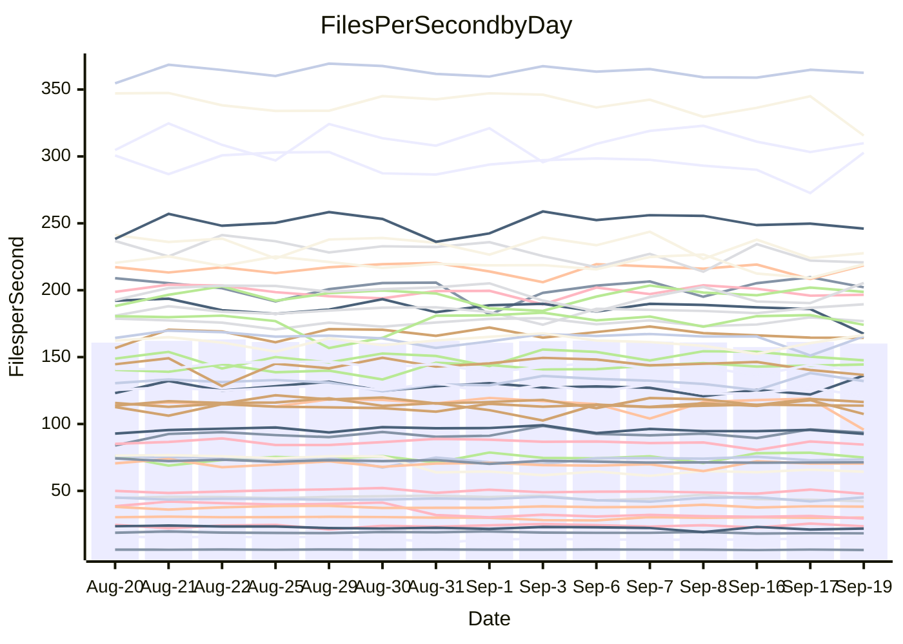

<!---
# This file is auto-generated. Do not edit.
# cspell:disable
--->
# Performance Report

## Daily Performance

```mermaid
xychart-beta
    title Files Per Second by Day
    y-axis Files per Second
    x-axis Date [Aug-20, Aug-21, Aug-22, Aug-25, Aug-29, Aug-30, Aug-31, Sep-1, Sep-3, Sep-6, Sep-7, Sep-8, Sep-16, Sep-17, Sep-19]
    bar [160.82, 162.11, 163.20, 161.31, 162.91, 160.67, 162.16, 160.72, 161.93, 162.34, 161.56, 160.97, 157.55, 161.35, 160.15]
    line [6.09, 6.02, 6.19, 6.02, 6.20, 6.04, 6.23, 6.06, 6.09, 6.20, 6.14, 6.11, 5.78, 6.14, 5.83]
    line [114.00, 116.17, 114.97, 113.11, 118.41, 118.01, 115.40, 119.50, 117.17, 114.93, 104.04, 116.42, 117.89, 118.96, 95.74]
    line [44.69, 45.57, 45.49, 44.61, 45.50, 46.05, 46.44, 45.45, 46.41, 42.91, 44.10, 47.18, 43.88, 43.41, 42.32]
    line [76.09, 68.93, 73.13, 75.35, 74.03, 75.97, 71.20, 78.69, 74.68, 74.33, 75.84, 70.78, 78.20, 78.52, 74.90]
    line [113.71, 117.01, 115.75, 116.08, 119.18, 113.59, 115.52, 110.36, 102.65, 114.46, 112.83, 115.47, 113.56, 117.79, 107.45]
    line [76.20, 74.98, 75.32, 73.98, 74.92, 67.44, 74.93, 71.42, 69.97, 74.43, 74.58, 74.02, 75.50, 72.83, 73.48]
    line [24.64, 22.11, 24.14, 24.67, 21.16, 23.95, 23.30, 24.27, 25.24, 24.42, 23.30, 24.35, 22.54, 25.54, 23.58]
    line [123.08, 132.18, 124.93, 128.24, 131.60, 124.76, 128.19, 130.51, 127.29, 128.13, 127.03, 120.72, 125.41, 122.07, 136.18]
    line [76.41, 76.73, 75.85, 74.38, 75.85, 75.82, 63.83, 64.49, 61.65, 64.50, 61.26, 64.86, 63.96, 65.83, 64.34]
    line [304.78, 324.68, 308.60, 296.98, 324.16, 313.60, 308.04, 321.08, 295.70, 309.43, 319.09, 322.91, 311.02, 303.26, 309.86]
    line [208.96, 205.28, 201.48, 191.68, 200.76, 205.32, 205.73, 181.85, 198.01, 203.39, 206.55, 195.11, 205.27, 209.68, 202.18]
    line [217.28, 213.25, 217.17, 212.77, 217.16, 219.42, 220.41, 214.04, 205.97, 219.44, 217.73, 216.08, 219.15, 208.36, 218.58]
    line [236.75, 225.24, 241.21, 236.60, 228.23, 232.86, 232.26, 235.92, 225.53, 217.15, 227.16, 213.82, 234.37, 222.15, 220.79]
    line [148.87, 153.90, 141.45, 150.06, 146.03, 152.71, 150.80, 143.28, 155.69, 153.87, 147.46, 154.39, 153.96, 150.40, 147.55]
    line [156.73, 170.52, 169.10, 161.12, 170.94, 170.42, 165.85, 172.14, 164.57, 168.71, 172.84, 167.97, 166.22, 164.57, 164.41]
    line [130.52, 133.31, 131.34, 132.85, 130.95, 124.42, 129.63, 128.97, 135.94, 133.80, 132.37, 129.87, 125.28, 138.07, 132.09]
    line [198.71, 204.15, 203.44, 198.55, 195.50, 193.96, 199.31, 199.53, 189.39, 201.97, 197.12, 203.70, 201.07, 195.90, 196.60]
    line [192.12, 193.67, 185.05, 182.38, 185.55, 193.26, 183.54, 188.75, 189.86, 184.03, 189.81, 189.01, 187.14, 185.91, 167.48]
    line [220.45, 225.30, 218.11, 225.16, 221.13, 216.69, 219.64, 218.57, 218.78, 215.63, 224.82, 226.65, 212.42, 209.15, 219.32]
    line [15.86, 15.35, 15.70, 15.41, 15.75, 15.00, 11.10, 13.64, 14.09, 13.63, 13.57, 13.40, 13.81, 14.35, 14.56]
    line [83.91, 92.53, 93.93, 91.70, 90.17, 94.03, 90.40, 91.22, 98.55, 92.55, 91.52, 92.79, 89.51, 95.95, 93.57]
    line [30.32, 30.71, 30.33, 30.41, 30.59, 30.45, 30.07, 29.95, 28.16, 27.92, 30.43, 29.89, 30.21, 29.92, 30.06]
    line [180.99, 187.99, 183.89, 182.41, 184.77, 186.94, 187.25, 183.77, 174.20, 186.05, 185.31, 184.47, 182.86, 186.84, 189.51]
    line [140.53, 139.04, 144.69, 138.65, 139.89, 133.31, 145.80, 144.08, 140.79, 141.02, 143.66, 145.59, 142.94, 143.60, 144.45]
    line [112.72, 106.20, 114.85, 112.98, 112.47, 111.83, 109.19, 115.12, 112.97, 114.35, 112.51, 113.70, 114.44, 114.03, 113.72]
    line [354.65, 368.47, 364.63, 360.14, 369.32, 367.60, 361.65, 359.68, 367.46, 363.32, 365.30, 359.11, 358.89, 364.75, 362.48]
    line [38.59, 41.99, 40.85, 39.81, 40.28, 41.27, 31.95, 30.26, 32.20, 30.88, 32.09, 31.08, 30.60, 31.19, 29.44]
    line [92.84, 95.49, 96.50, 97.40, 93.72, 97.65, 96.80, 96.99, 99.11, 93.19, 96.28, 94.70, 94.66, 95.59, 92.61]
    line [347.14, 347.41, 338.20, 333.97, 334.12, 345.07, 342.66, 347.17, 346.14, 336.60, 342.41, 329.55, 336.36, 345.01, 315.57]
    line [125.47, 127.40, 124.91, 126.98, 128.83, 125.51, 130.73, 123.39, 129.29, 124.27, 129.39, 122.55, 122.88, 127.08, 120.74]
    line [18.74, 19.65, 18.80, 18.62, 18.45, 19.29, 19.08, 19.71, 18.88, 18.65, 18.65, 19.33, 18.07, 18.42, 18.29]
    line [70.62, 73.83, 67.67, 69.68, 72.12, 68.00, 70.47, 70.89, 69.29, 68.94, 69.89, 64.77, 72.12, 70.50, 70.49]
    line [178.78, 177.41, 175.76, 170.70, 175.74, 172.74, 175.87, 178.56, 179.08, 174.59, 177.44, 173.15, 174.36, 179.74, 176.90]
    line [188.13, 196.57, 202.87, 192.16, 197.82, 199.85, 197.57, 186.50, 184.53, 195.23, 203.47, 198.25, 196.22, 201.98, 198.73]
    line [144.63, 149.12, 128.33, 145.05, 141.62, 149.48, 142.85, 145.28, 149.46, 148.18, 143.83, 145.01, 146.41, 140.36, 136.70]
    line [45.09, 43.47, 44.07, 43.94, 43.35, 43.55, 44.33, 43.81, 45.60, 43.01, 41.97, 44.80, 45.26, 42.13, 45.22]
    line [50.03, 48.40, 49.47, 50.47, 51.15, 52.21, 48.60, 50.89, 48.97, 49.35, 49.58, 48.85, 47.97, 51.02, 47.86]
    line [23.59, 24.08, 23.43, 23.40, 22.23, 21.90, 22.46, 21.60, 23.03, 22.85, 22.27, 19.18, 23.11, 21.10, 21.89]
    line [241.23, 236.06, 238.56, 223.75, 237.91, 239.06, 235.45, 226.56, 239.54, 233.61, 243.66, 223.35, 237.82, 223.98, 227.62]
    line [300.68, 286.71, 300.74, 302.95, 303.29, 287.37, 286.48, 293.90, 297.13, 298.52, 297.48, 293.09, 290.03, 272.63, 302.73]
    line [74.27, 72.25, 73.30, 71.82, 72.99, 72.24, 73.05, 70.19, 72.55, 71.94, 71.15, 71.34, 71.01, 71.23, 71.35]
    line [38.04, 36.06, 37.72, 38.63, 38.79, 37.24, 37.32, 37.33, 38.42, 37.82, 37.98, 39.62, 37.64, 38.51, 38.18]
    line [192.62, 201.64, 203.42, 203.18, 198.91, 200.77, 202.09, 205.14, 192.22, 184.22, 194.88, 202.40, 191.56, 190.37, 205.41]
    line [180.57, 179.89, 180.99, 176.89, 156.76, 164.43, 180.88, 181.23, 183.21, 177.43, 180.28, 172.77, 180.61, 181.38, 174.10]
    line [115.76, 112.80, 115.24, 121.46, 118.37, 119.80, 115.33, 116.38, 118.04, 111.85, 119.40, 118.51, 114.20, 118.71, 116.39]
    line [164.35, 169.78, 168.65, 165.26, 166.00, 163.99, 156.90, 161.76, 167.23, 165.73, 167.27, 165.39, 165.37, 151.18, 165.51]
    line [85.16, 86.61, 89.19, 84.30, 84.25, 86.47, 88.91, 88.27, 86.74, 86.90, 85.78, 86.18, 80.59, 86.98, 84.59]
    line [238.36, 257.03, 248.15, 250.39, 258.39, 253.25, 236.21, 242.44, 258.87, 252.44, 256.07, 255.58, 248.63, 249.79, 246.02]
    line [162.23, 164.91, 160.87, 154.07, 164.02, 158.84, 162.35, 165.15, 167.75, 162.42, 161.26, 158.45, 152.45, 160.47, 166.52]
    line [141.21, 140.96, 145.89, 146.30, 146.55, 142.25, 144.70, 138.76, 142.53, 146.03, 141.67, 142.57, 136.52, 144.05, 139.45]
```

## Time to Process Files

| Repository                                      | Elapsed | Min/Avg/Max           |   SD | SD Graph                |
| ----------------------------------------------- | ------: | :-------------------: | ---: | ----------------------- |
| AdaDoom3/AdaDoom3                    |    3.43 | 3.3 /   3.5 /   4.5   | 0.23 | `    ┣━━┻━━●━━┻━━┫    ` |
| alexiosc/megistos                    |    7.93 | 7.5 /   7.9 /   9.4   | 0.43 | `    ┣━━┻━━●━━┻━━┫    ` |
| apollographql/apollo-server          |    2.69 | 2.6 /   2.8 /   3.3   | 0.15 | `    ┣━━┻━●╋━━┻━━┫    ` |
| aspnetboilerplate/aspnetboilerplate  |   10.46 | 10.2 /  10.6 /  11.1  | 0.22 | `    ┣━━┻━●╋━━┻━━┫    ` |
| aws-amplify/docs                     |   13.09 | 12.5 /  13.1 /  14.2  | 0.40 | `    ┣━━┻━━●━━┻━━┫    ` |
| Azure/azure-rest-api-specs           |    9.99 | 9.4 /   9.8 /  10.5   | 0.29 | `    ┣━━┻━━╋━●┻━━┫    ` |
| bitjson/typescript-starter           |    1.09 | 1.0 /   1.1 /   1.1   | 0.03 | `     ┣━━┻━╋━┻●━┫     ` |
| caddyserver/caddy                    |    3.82 | 3.6 /   3.8 /   4.3   | 0.16 | `    ┣━━┻━━●━━┻━━┫    ` |
| canada-ca/open-source-logiciel-libre |    1.20 | 1.1 /   1.1 /   1.3   | 0.03 | `     ┣━┻━━╋━━┻●┫     ` |
| chef/chef                            |    6.14 | 5.8 /   6.1 /   6.6   | 0.18 | `    ┣━━┻━━╋●━┻━━┫    ` |
| dart-lang/sdk                        |   65.01 | 64.5 /  67.4 /  73.0  | 1.97 | `   ┣━●┻━━━╋━━━┻━━┫   ` |
| django/django                        |   15.08 | 14.9 /  15.5 /  16.4  | 0.32 | `    ┣━●┻━━╋━━┻━━┫    ` |
| eslint/eslint                        |   12.50 | 10.7 /  11.1 /  12.1  | 0.35 | `     ┣━┻━━╋━━┻━┫    ●` |
| exonum/exonum                        |    3.92 | 3.5 /   3.7 /   4.1   | 0.12 | `    ┣━━┻━━╋━━┻━●┫    ` |
| flutter/samples                      |   16.61 | 16.3 /  17.1 /  19.7  | 0.65 | `   ┣━━━┻●━╋━━┻━━━┫   ` |
| gitbucket/gitbucket                  |    4.31 | 3.4 /   3.6 /   4.0   | 0.16 | `     ┣━━┻━╋━┻━━┫    ●` |
| googleapis/google-cloud-cpp          |  148.86 | 136.7 / 144.8 / 163.3 | 5.73 | `  ┣━━━┻━━━╋━━●┻━━━┫  ` |
| graphql/express-graphql              |    1.19 | 1.1 /   1.2 /   1.4   | 0.06 | `     ┣━┻━━╋●━┻━┫     ` |
| graphql/graphql-js                   |    3.01 | 2.7 /   2.9 /   3.1   | 0.08 | `     ┣━┻━━╋━━┻●┫     ` |
| graphql/graphql-relay-js             |    1.19 | 1.1 /   1.2 /   1.3   | 0.07 | `     ┣━┻━━●━━┻━┫     ` |
| graphql/graphql-spec                 |    1.30 | 1.0 /   1.2 /   1.5   | 0.17 | `     ┣━┻━━╋━●┻━┫     ` |
| iluwatar/java-design-patterns        |   13.50 | 12.8 /  13.3 /  15.2  | 0.50 | `    ┣━━┻━━╋●━┻━━┫    ` |
| ktaranov/sqlserver-kit               |    6.85 | 6.6 /   6.8 /   7.1   | 0.16 | `    ┣━━┻━━╋●━┻━━┫    ` |
| liriliri/licia                       |    4.55 | 4.1 /   4.2 /   4.4   | 0.08 | `     ┣━┻━━╋━━┻━┫    ●` |
| MartinThoma/LaTeX-examples           |    6.86 | 6.7 /   7.2 /   7.8   | 0.27 | `    ┣━━●━━╋━━┻━━┫    ` |
| mdx-js/mdx                           |    2.00 | 1.9 /   2.0 /   2.2   | 0.07 | `     ┣━┻━●╋━━┻━┫     ` |
| microsoft/TypeScript-Website         |    5.76 | 5.5 /   5.8 /   6.5   | 0.27 | `    ┣━━┻━●╋━━┻━━┫    ` |
| MicrosoftDocs/PowerShell-Docs        |   23.81 | 23.2 /  24.0 /  25.5  | 0.58 | `   ┣━━━┻━●╋━━┻━━━┫   ` |
| neovim/nvim-lspconfig                |    4.29 | 4.2 /   4.3 /   4.5   | 0.09 | `    ┣━━┻━━●━━┻━━┫    ` |
| pagekit/pagekit                      |    3.67 | 3.5 /   3.7 /   4.1   | 0.14 | `    ┣━━┻━━●━━┻━━┫    ` |
| php/php-src                          |   27.14 | 25.3 /  26.5 /  29.3  | 0.87 | `   ┣━━━┻━━╋━●┻━━━┫   ` |
| plasticrake/tplink-smarthome-api     |    1.47 | 1.3 /   1.4 /   1.6   | 0.06 | `     ┣━┻━━╋━━┻●┫     ` |
| prettier/prettier                    |    7.43 | 7.0 /   7.4 /   7.9   | 0.25 | `    ┣━━┻━━╋●━┻━━┫    ` |
| pycontribs/jira                      |    1.65 | 1.5 /   1.6 /   1.7   | 0.06 | `     ┣━┻━━╋━━●━┫     ` |
| RustPython/RustPython                |    5.04 | 5.2 /   5.4 /   5.7   | 0.17 | `    ●━━┻━━╋━━┻━━┫    ` |
| shoelace-style/shoelace              |    3.21 | 2.9 /   3.0 /   3.7   | 0.16 | `    ┣━━┻━━╋━━●━━┫    ` |
| slint-ui/slint                       |   12.90 | 12.1 /  12.7 /  15.5  | 0.73 | `    ┣━━┻━━╋●━┻━━┫    ` |
| SoftwareBrothers/admin-bro           |    2.68 | 2.5 /   2.6 /   3.0   | 0.10 | `     ┣━┻━━╋●━┻━┫     ` |
| sveltejs/svelte                      |   21.65 | 20.2 /  21.5 /  22.3  | 0.42 | `    ┣━━┻━━╋●━┻━━┫    ` |
| TheAlgorithms/Python                 |    6.13 | 5.7 /   5.9 /   6.7   | 0.24 | `    ┣━━┻━━╋━━●━━┫    ` |
| twbs/bootstrap                       |    1.83 | 1.5 /   1.7 /   2.0   | 0.16 | `     ┣━┻━━╋━●┻━┫     ` |
| typescript-cheatsheets/react         |    1.39 | 1.3 /   1.4 /   1.5   | 0.04 | `     ┣━┻━●╋━━┻━┫     ` |
| typescript-eslint/typescript-eslint  |    4.22 | 4.2 /   4.3 /   4.7   | 0.14 | `    ┣━━●━━╋━━┻━━┫    ` |
| vitest-dev/vitest                    |   10.02 | 9.1 /   9.6 /  12.0   | 0.59 | `    ┣━━┻━━╋━●┻━━┫    ` |
| w3c/aria-practices                   |    3.52 | 3.3 /   3.5 /   3.8   | 0.11 | `    ┣━━┻━━●━━┻━━┫    ` |
| w3c/specberus                        |    2.14 | 2.0 /   2.1 /   2.2   | 0.05 | `     ┣━┻━━╋━━┻●┫     ` |
| webdeveric/webpack-assets-manifest   |    1.19 | 1.2 /   1.2 /   1.3   | 0.04 | `     ┣━●━━╋━━┻━┫     ` |
| webpack/webpack                      |    5.63 | 5.3 /   5.7 /   6.2   | 0.20 | `    ┣━━┻━●╋━━┻━━┫    ` |
| wireapp/wire-desktop                 |    1.46 | 1.0 /   1.2 /   1.4   | 0.16 | `     ┣━┻━━╋━━┻●┫     ` |
| wireapp/wire-webapp                  |   11.09 | 10.8 /  11.1 /  12.1  | 0.34 | `    ┣━━┻━●╋━━┻━━┫    ` |

Note:
- Elapsed time is in seconds.

## Files per Second over Time

| Repository                                      | Files |    Sec |    Fps |     Rel | Trend Fps              |    N |
| ----------------------------------------------- | ----: | -----: | -----: | ------: | ---------------------- | ---: |
| AdaDoom3/AdaDoom3                    |   103 |   3.43 |  30.06 |   0.50% | `█▇█████▇▇▆█▂███▇██▇█` |   24 |
| alexiosc/megistos                    |   583 |   7.93 |  73.48 |  -0.08% | `▆█▇█▃▃▇█▆▆▇▇▇▇▇▇█▇▇▇` |   24 |
| apollographql/apollo-server          |   252 |   2.69 |  93.57 |   1.94% | `▆▇▆█▅█▆▆▆█▇▇▆▅█▇▅▆▇▇` |   24 |
| aspnetboilerplate/aspnetboilerplate  |  2286 |  10.46 | 218.58 |   0.88% | `▆▅▇▇▇█▇▇▆▅▇▇█▇▇▆▆█▅▇` |   24 |
| aws-amplify/docs                     |  2871 |  13.09 | 219.32 |   0.11% | `▇▇▇▆▆▇▅█▆▆▇▄▇▇▇█▅▆▅▆` |   24 |
| Azure/azure-rest-api-specs           |  2458 |   9.99 | 246.02 |  -1.51% | `▇▇█▇█▇▅▄▆█▇▇▇████▅▇▆` |   24 |
| bitjson/typescript-starter           |    20 |   1.09 |  18.29 |  -2.91% | `▇▅▆█▇▇▇▇█▆▆▆▆▆▆▇▄▆▆▅` |   24 |
| caddyserver/caddy                    |   286 |   3.82 |  74.90 |   0.08% | `█▅▆█▆▆▇▃█▆▆▆▇▆█▅███▆` |   24 |
| canada-ca/open-source-logiciel-libre |     7 |   1.20 |   5.83 |  -4.34% | `▇▇█▇▇▆█▇▇▇█▇██▇▇▇▃▇▆` |   24 |
| chef/chef                            |  1208 |   6.14 | 196.60 |  -1.13% | `▆█▆▇▇▄▆█▇▅█▇▇█▅█▇▇▆▆` |   24 |
| dart-lang/sdk                        | 10825 |  65.01 | 166.52 |   3.78% | `▅▅▇▇▅▇▇▇██▇▆█▆▇▆▆▄▇█` |   24 |
| django/django                        |  2857 |  15.08 | 189.51 |   2.75% | `▆▇▇▇▇█▇▇▆▄▆▇██▆▇▆▆▇█` |   24 |
| eslint/eslint                        |  2093 |  12.50 | 167.48 | -10.77% | `▇▄▆▇▇█▄▇▇▇▅▆▇▇▇▇▆▇▆▃` |   24 |
| exonum/exonum                        |   421 |   3.92 | 107.45 |  -5.93% | `▇██▇▅▇▇█▆▃▇▆▇▇▆▇▇▆█▅` |   24 |
| flutter/samples                      |  2400 |  16.61 | 144.45 |   2.31% | `▆▆▇▆▃▇███▇▆█▇▇██▇█▇█` |   24 |
| gitbucket/gitbucket                  |   413 |   4.31 |  95.74 | -16.88% | `▄██▇█▇▇▇█▇█▅█▃▄▇█▇█▁` |   24 |
| googleapis/google-cloud-cpp          | 20758 | 148.86 | 139.45 |  -2.51% | `▇███▅▇▇▇▆▇█▆█▇▆▇▃▇▇▆` |   24 |
| graphql/express-graphql              |    26 |   1.19 |  21.89 |  -3.06% | `█▇▆▇▄▆▆▇▆▇▇▇▇▆▇▃▆█▅▆` |   24 |
| graphql/graphql-js                   |   364 |   3.01 | 120.74 |  -4.32% | `▆▇▇▅▆▇█▆▅▇▄▆▇█▆▅▅▅▆▅` |   24 |
| graphql/graphql-relay-js             |    28 |   1.19 |  23.58 |  -1.23% | `▇▇▃▆▆▇▃█▇█▇▆█▆▅▇▃▆█▆` |   24 |
| graphql/graphql-spec                 |    19 |   1.30 |  14.56 |   1.78% | `███▅██▂▂▅▆▄▆▆▅▅▅▆▅▆▇` |   24 |
| iluwatar/java-design-patterns        |  1992 |  13.50 | 147.55 |  -1.87% | `▇▇▆▇█▇█▆▆█▇██▆▇███▇▆` |   24 |
| ktaranov/sqlserver-kit               |   489 |   6.85 |  71.35 |  -1.15% | `▅█▇█▅▇█▆▅▇▅▇█▇▅▆▆▆▆▆` |   24 |
| liriliri/licia                       |  1437 |   4.55 | 315.57 |  -7.36% | `▇▆▆██▇█▇██▇▇▆▇█▆▅██▄` |   24 |
| MartinThoma/LaTeX-examples           |  1409 |   6.86 | 205.41 |   4.42% | `█▆▆▇▇▆▇▇▇▅▄▃▅▅▆▇▅▅▅▇` |   24 |
| mdx-js/mdx                           |   141 |   2.00 |  70.49 |   1.12% | `▅▆▇▅▆▄█▅▆▆▆▆▅▆▆▄▆█▆▆` |   24 |
| microsoft/TypeScript-Website         |   761 |   5.76 | 132.09 |   1.10% | `▇▇▆▇▅▃▇▅▆██▇▇▇▇▆▇▃█▇` |   24 |
| MicrosoftDocs/PowerShell-Docs        |  2708 |  23.81 | 113.72 |   0.85% | `█▆▇▅▇▇▅▆█▇▇█▇▆▇▇█▇▇▇` |   24 |
| neovim/nvim-lspconfig                |   759 |   4.29 | 176.90 |   0.81% | `▇▅▇▇▆▅▆███▇▆█▇█▆▇▇█▇` |   24 |
| pagekit/pagekit                      |   741 |   3.67 | 202.18 |  -0.08% | `▇▄▇█▆██▇▃▆▇█▇█▇▆█▇█▇` |   24 |
| php/php-src                          |  2296 |  27.14 |  84.59 |  -1.78% | `▆▆▆█▆▆█▇▇▇▇▆█▇▆▇▅▄▇▆` |   24 |
| plasticrake/tplink-smarthome-api     |    62 |   1.47 |  42.32 |  -5.86% | `▇▆▇▇█▇▇▇▇▇▃▆▆▆▆██▄▅▅` |   24 |
| prettier/prettier                    |  2301 |   7.43 | 309.86 |  -0.29% | `▄▅█▆█▆▇▅▇▄▆▄█▆██▆▆▅▆` |   24 |
| pycontribs/jira                      |    79 |   1.65 |  47.86 |  -3.98% | `▆▇▇█▇▇▇▃▇▅▆▇▄▄█▅▅▅▇▅` |   24 |
| RustPython/RustPython                |   687 |   5.04 | 136.18 |   7.62% | `▅▇▇▄▇▅▆▆▇▆▆▆▆▆▅▄▅▆▄█` |   24 |
| shoelace-style/shoelace              |   439 |   3.21 | 136.70 |  -5.35% | `▆█▇███▇▆▇██▇█▇▆▇▇▇▆▆` |   24 |
| slint-ui/slint                       |  2245 |  12.90 | 174.10 |  -1.49% | `▇▇▄▆▇▃█████▇▇▇█▇▇██▇` |   24 |
| SoftwareBrothers/admin-bro           |   441 |   2.68 | 164.41 |  -1.65% | `▅▆█▇█▇█▆█▆▇▇▇██▇▆▇▆▆` |   24 |
| sveltejs/svelte                      |  7846 |  21.65 | 362.48 |  -0.14% | `▆▅▆█▅▅▆▅▅▆▇▅▅▆▆▅▆▅▆▆` |   24 |
| TheAlgorithms/Python                 |  1396 |   6.13 | 227.62 |  -3.25% | `▇▃▇▇█▇▆█▆▇▆█▆██▅▇▇▅▆` |   24 |
| twbs/bootstrap                       |   118 |   1.83 |  64.34 |  -7.07% | `█▅▇██▅▃▄▄▃▃▄▄▄▂▄▃▄▄▄` |   24 |
| typescript-cheatsheets/react         |    53 |   1.39 |  38.18 |   0.85% | `█▆▇▆▄▇▇▄▆▇▆▆▆█▅█▇▆▇▇` |   24 |
| typescript-eslint/typescript-eslint  |  1278 |   4.22 | 302.73 |   2.89% | `███▆▅▇▄▇▇▇▇▇▇▇▇▇▅▇▄█` |   24 |
| vitest-dev/vitest                    |  2212 |  10.02 | 220.79 |  -3.96% | `█▇▇██▇▇██▇▇▂█▆█▅▇█▆▆` |   24 |
| w3c/aria-practices                   |   410 |   3.52 | 116.39 |  -0.25% | `▇█▇▇█▇▅▆▆▇▄▆▄▇▇▇▅▆▇▆` |   24 |
| w3c/specberus                        |   198 |   2.14 |  92.61 |  -3.24% | `▇▇▆▇▆█▇▇▇█▆▆▅▆▇▆▆▆▆▅` |   24 |
| webdeveric/webpack-assets-manifest   |    54 |   1.19 |  45.22 |   3.14% | `▇▆▆█▆▅▇▇▇█▇▆▄▅▅▇▇█▅█` |   24 |
| webpack/webpack                      |  1118 |   5.63 | 198.73 |   1.22% | `▆▅▆▇▆▇▇▆▅▄▇▅▆▆█▆▆▆▇▆` |   24 |
| wireapp/wire-desktop                 |    43 |   1.46 |  29.44 | -17.01% | `█▆▇██▇▃▃▂▃▂▂▃▃▃▃▂▂▃▂` |   24 |
| wireapp/wire-webapp                  |  1835 |  11.09 | 165.51 |   0.66% | `▇▇▇██▅▆▅▆█▇▇███▇█▇▄▇` |   24 |

## Data Throughput

| Repository                                      | Files |    Sec |     Kps |     Rel | Trend Kps              |    N |
| ----------------------------------------------- | ----: | -----: | ------: | ------: | ---------------------- | ---: |
| AdaDoom3/AdaDoom3                    |   103 |   3.43 |  638.87 |   0.50% | `█▇█████▇▇▆█▂███▇██▇█` |   24 |
| alexiosc/megistos                    |   583 |   7.93 |  577.34 |  -0.08% | `▆█▇█▃▃▇█▆▆▇▇▇▇▇▇█▇▇▇` |   24 |
| apollographql/apollo-server          |   252 |   2.69 |  752.61 |   1.94% | `▆▇▆█▅█▆▆▆█▇▇▆▅█▇▅▆▇▇` |   24 |
| aspnetboilerplate/aspnetboilerplate  |  2286 |  10.46 |  531.83 |   0.88% | `▆▅▇▇▇█▇▇▆▅▇▇█▇▇▆▆█▅▇` |   24 |
| aws-amplify/docs                     |  2871 |  13.09 |  765.84 |   0.11% | `▇▇▇▆▆▇▅█▆▆▇▄▇▇▇█▅▆▅▆` |   24 |
| Azure/azure-rest-api-specs           |  2458 |   9.99 |  646.89 |  -2.28% | `▆▇█▇█▇▅▄▆█▇▇▇██▇▇▅▆▆` |   24 |
| bitjson/typescript-starter           |    20 |   1.09 |   73.17 |  -2.91% | `▇▅▆█▇▇▇▇█▆▆▆▆▆▆▇▄▆▆▅` |   24 |
| caddyserver/caddy                    |   286 |   3.82 |  639.02 |   0.02% | `█▅▆█▆▆▇▃█▆▆▆▇▆█▅███▆` |   24 |
| canada-ca/open-source-logiciel-libre |     7 |   1.20 |   48.29 |  -4.34% | `▇▇█▇▇▆█▇▇▇█▇██▇▇▇▃▇▆` |   24 |
| chef/chef                            |  1208 |   6.14 |  907.99 |  -1.14% | `▆█▆▇▇▄▆█▇▅█▇▇█▅█▇▇▆▆` |   24 |
| dart-lang/sdk                        | 10825 |  65.01 | 1133.80 |   4.30% | `▅▅▇▇▅▆▇▇██▇▆█▆▇▆▆▄▇█` |   24 |
| django/django                        |  2857 |  15.08 | 1189.55 |   2.85% | `▆▇▇▇▇█▇▇▆▄▆▇██▆▇▇▆▇█` |   24 |
| eslint/eslint                        |  2093 |  12.50 | 1202.95 | -11.68% | `▇▄▆▇▇█▄▇▇▇▅▆▇▇▇▇▅▇▆▂` |   24 |
| exonum/exonum                        |   421 |   3.92 | 1027.84 |  -5.93% | `▇██▇▅▇▇█▆▃▇▆▇▇▆▇▇▆█▅` |   24 |
| flutter/samples                      |  2400 |  16.61 | 1289.04 |   2.51% | `▆▆▇▆▃▇███▇▆█▇▇██▇█▇█` |   24 |
| gitbucket/gitbucket                  |   413 |   4.31 |  435.11 | -16.88% | `▄██▇█▇▇▇█▇█▅█▃▄▇█▇█▁` |   24 |
| googleapis/google-cloud-cpp          | 20758 | 148.86 | 1131.17 |  -2.18% | `▇███▅▇▇▇▆▇█▆█▇▆▇▃█▇▆` |   24 |
| graphql/express-graphql              |    26 |   1.19 |  100.19 |  -3.06% | `█▇▆▇▄▆▆▇▆▇▇▇▇▆▇▃▆█▅▆` |   24 |
| graphql/graphql-js                   |   364 |   3.01 |  693.93 |  -4.32% | `▆▇▇▅▆▇█▆▅▇▄▆▇█▆▅▅▅▆▅` |   24 |
| graphql/graphql-relay-js             |    28 |   1.19 |   92.64 |  -1.23% | `▇▇▃▆▆▇▃█▇█▇▆█▆▅▇▃▆█▆` |   24 |
| graphql/graphql-spec                 |    19 |   1.30 |  485.93 |  -2.36% | `███▅██▂▂▄▄▃▄▄▄▃▄▅▄▅▅` |   24 |
| iluwatar/java-design-patterns        |  1992 |  13.50 |  456.05 |  -1.87% | `▇▇▆▇█▇█▆▆█▇██▆▇███▇▆` |   24 |
| ktaranov/sqlserver-kit               |   489 |   6.85 | 1080.31 |  -1.13% | `▅█▇█▅▇█▆▅▇▅▇█▇▅▆▆▆▆▆` |   24 |
| liriliri/licia                       |  1437 |   4.55 |  375.97 |  -7.36% | `▇▆▆██▇█▇██▇▇▆▇█▆▅██▄` |   24 |
| MartinThoma/LaTeX-examples           |  1409 |   6.86 |  424.24 |   4.42% | `█▆▆▇▇▆▇▇▇▅▄▃▅▅▆▇▅▅▅▇` |   24 |
| mdx-js/mdx                           |   141 |   2.00 |  327.97 |   1.12% | `▅▆▇▅▆▄█▅▆▆▆▆▅▆▆▄▆█▆▆` |   24 |
| microsoft/TypeScript-Website         |   761 |   5.76 |  913.52 |   1.10% | `▇▇▆▇▅▃▇▅▆██▇▇▇▇▆▇▃█▇` |   24 |
| MicrosoftDocs/PowerShell-Docs        |  2708 |  23.81 | 1169.51 |   0.86% | `█▆▇▅▇▇▅▆█▇▇█▇▆▇▇█▇▇▇` |   24 |
| neovim/nvim-lspconfig                |   759 |   4.29 |  291.56 |   1.18% | `▆▅▇▇▆▅▆███▇▆▇▇█▆▇▇█▇` |   24 |
| pagekit/pagekit                      |   741 |   3.67 |  421.55 |  -0.08% | `▇▄▇█▆██▇▃▆▇█▇█▇▆█▇█▇` |   24 |
| php/php-src                          |  2296 |  27.14 | 1469.51 |  -1.99% | `▆▆▆█▆▆█▇▇▇▇▆█▇▆▆▅▃▇▆` |   24 |
| plasticrake/tplink-smarthome-api     |    62 |   1.47 |  228.66 |  -5.86% | `▇▆▇▇█▇▇▇▇▇▃▆▆▆▆██▄▅▅` |   24 |
| prettier/prettier                    |  2301 |   7.43 |  438.19 |  -0.56% | `▄▅█▆█▆▇▅▇▄▆▄█▆██▆▆▅▆` |   24 |
| pycontribs/jira                      |    79 |   1.65 |  339.24 |  -3.98% | `▆▇▇█▇▇▇▃▇▅▆▇▄▄█▅▅▅▇▅` |   24 |
| RustPython/RustPython                |   687 |   5.04 | 1070.81 |   7.67% | `▅▇▇▄▇▅▆▆▇▆▆▆▆▆▅▄▅▆▄█` |   24 |
| shoelace-style/shoelace              |   439 |   3.21 |  660.45 |  -5.35% | `▆█▇███▇▆▇██▇█▇▆▇▇▇▆▆` |   24 |
| slint-ui/slint                       |  2245 |  12.90 | 1139.18 |  -1.22% | `▇▇▄▆▇▃█████▇▇▇█▇▇██▇` |   24 |
| SoftwareBrothers/admin-bro           |   441 |   2.68 |  362.37 |  -1.65% | `▅▆█▇█▇█▆█▆▇▇▇██▇▆▇▆▆` |   24 |
| sveltejs/svelte                      |  7846 |  21.65 |  242.46 |  -0.20% | `▆▅▆█▅▅▆▅▅▆▇▅▅▆▆▅▆▅▆▆` |   24 |
| TheAlgorithms/Python                 |  1396 |   6.13 |  578.35 |  -3.19% | `▇▃▇▇█▇▆█▆▇▆█▆██▅▇▇▅▆` |   24 |
| twbs/bootstrap                       |   118 |   1.83 |  527.82 |  -7.13% | `█▅▇██▅▄▄▄▃▃▄▄▄▂▄▃▄▄▄` |   24 |
| typescript-cheatsheets/react         |    53 |   1.39 |  282.39 |   1.12% | `█▇▇▆▄▇▇▄▆▇▆▆▆█▅█▇▆▇▇` |   24 |
| typescript-eslint/typescript-eslint  |  1278 |   4.22 | 1547.03 |   3.04% | `███▆▄▇▄▇▇▇▇▇▇▇▇▇▅▇▄█` |   24 |
| vitest-dev/vitest                    |  2212 |  10.02 |  496.57 |  -3.75% | `█▇▇██▇▇██▇▇▂█▆█▅▇█▆▆` |   24 |
| w3c/aria-practices                   |   410 |   3.52 | 1082.74 |  -0.28% | `▇█▇▇█▇▅▆▆▇▄▆▄▇▇▇▅▆▇▆` |   24 |
| w3c/specberus                        |   198 |   2.14 |  290.94 |  -3.24% | `▇▇▆▇▆█▇▇▇█▆▆▅▆▇▆▆▆▆▅` |   24 |
| webdeveric/webpack-assets-manifest   |    54 |   1.19 |  106.35 |   3.14% | `▇▆▆█▆▅▇▇▇█▇▆▄▅▅▇▇█▅█` |   24 |
| webpack/webpack                      |  1118 |   5.63 |  900.85 |   1.09% | `▆▅▆▇▆▇▇▆▅▄▇▅▆▆█▆▆▆▇▆` |   24 |
| wireapp/wire-desktop                 |    43 |   1.46 |  130.07 | -17.01% | `█▆▇██▇▃▃▂▃▂▂▃▃▃▃▂▂▃▂` |   24 |
| wireapp/wire-webapp                  |  1835 |  11.09 |  592.86 |   0.89% | `▇▇▇██▅▆▅▆█▇▇███▇█▇▄▇` |   24 |

