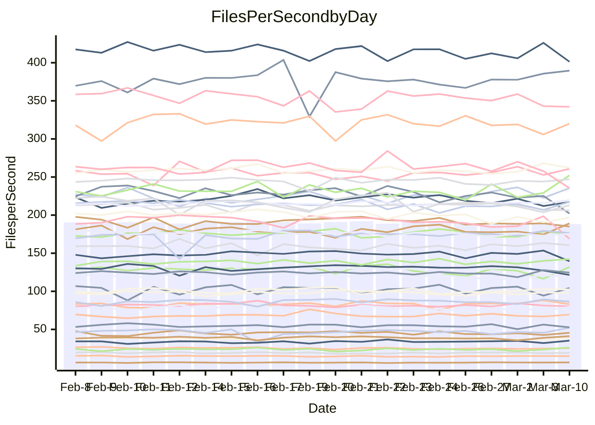

<!---
# This file is auto-generated. Do not edit.
# cspell:disable
--->
# Performance Report

Daily Performance

```mermaid
xychart-beta
    title Files Per Second by Day
    y-axis Files per Second
    x-axis Date [Feb-8, Feb-9, Feb-10, Feb-11, Feb-12, Feb-14, Feb-15, Feb-16, Feb-17, Feb-19, Feb-20, Feb-21, Feb-22, Feb-23, Feb-24, Feb-26, Feb-27, Mar-2, Mar-3, Mar-10]
    bar [190.44, 190.91, 190.55, 190.54, 188.86, 190.65, 191.15, 192.54, 190.97, 189.21, 190.95, 191.93, 188.84, 190.95, 190.14, 188.86, 187.47, 189.15, 187.99, 188.19]
    line [106.78, 104.49, 88.12, 105.95, 95.68, 105.24, 108.38, 96.07, 105.42, 104.57, 104.52, 96.66, 102.79, 103.56, 108.60, 97.11, 104.32, 106.04, 94.30, 104.41]
    line [26.53, 27.12, 25.19, 24.73, 26.32, 25.72, 25.93, 26.65, 24.45, 25.52, 23.53, 25.65, 25.87, 24.49, 24.03, 24.62, 25.06, 24.45, 24.76, 25.30]
    line [159.10, 159.22, 159.55, 156.17, 168.86, 156.43, 163.15, 147.05, 161.97, 157.72, 155.61, 153.59, 162.30, 157.06, 159.96, 153.79, 161.66, 159.28, 163.36, 160.44]
    line [129.27, 131.48, 127.09, 130.68, 129.17, 127.78, 130.44, 128.86, 131.22, 132.26, 123.16, 133.27, 135.57, 126.55, 124.20, 119.96, 129.35, 126.96, 116.50, 131.87]
    line [6.54, 6.62, 5.96, 6.86, 6.86, 6.52, 6.16, 6.48, 6.78, 6.24, 6.45, 6.67, 5.92, 6.38, 6.30, 6.44, 6.78, 6.62, 6.55, 6.65]
    line [227.18, 223.96, 236.18, 221.89, 211.43, 221.91, 216.06, 220.67, 225.17, 231.02, 220.24, 226.17, 215.58, 226.36, 225.70, 222.46, 230.96, 236.51, 222.64, 235.44]
    line [258.24, 253.80, 254.33, 238.72, 270.54, 256.71, 261.76, 251.74, 255.44, 255.70, 246.95, 250.90, 244.70, 255.35, 256.03, 252.54, 255.82, 263.63, 252.65, 260.77]
    line [223.28, 209.50, 215.15, 218.83, 217.74, 220.20, 225.26, 234.21, 221.97, 226.10, 219.20, 223.30, 227.37, 223.02, 226.36, 218.81, 215.75, 221.50, 212.02, 217.15]
    line [99.99, 97.22, 103.26, 104.26, 101.58, 98.06, 97.55, 103.52, 102.20, 104.64, 105.41, 96.15, 100.38, 103.85, 96.33, 99.09, 99.19, 100.48, 103.18, 102.33]
    line [133.83, 127.77, 122.88, 128.37, 135.10, 130.41, 132.90, 121.26, 129.83, 131.86, 128.62, 131.04, 130.26, 129.44, 123.58, 128.31, 129.87, 130.27, 130.71, 111.28]
    line [369.70, 375.89, 360.98, 379.16, 371.95, 380.17, 380.03, 383.65, 403.62, 329.33, 387.65, 379.15, 375.70, 377.89, 371.33, 366.95, 377.92, 377.66, 385.69, 389.63]
    line [83.38, 84.02, 78.63, 78.33, 84.47, 83.13, 83.66, 80.84, 83.02, 84.44, 80.37, 87.47, 84.08, 83.91, 75.76, 83.59, 84.08, 83.89, 88.30, 83.07]
    line [19.66, 20.05, 18.72, 19.96, 20.29, 18.59, 19.07, 20.25, 18.95, 19.76, 18.01, 18.46, 18.38, 19.68, 18.34, 19.60, 19.60, 19.63, 18.78, 19.21]
    line [172.64, 171.28, 176.43, 175.80, 180.86, 176.28, 173.64, 175.63, 176.43, 178.51, 182.28, 170.09, 171.99, 177.77, 181.65, 177.93, 171.71, 171.61, 178.31, 175.55]
    line [47.74, 41.63, 41.21, 45.64, 48.81, 44.68, 43.13, 46.03, 46.35, 45.95, 47.66, 45.50, 46.89, 43.13, 47.48, 43.86, 43.58, 44.95, 42.68, 45.59]
    line [46.37, 48.10, 48.71, 50.07, 49.29, 45.43, 50.01, 33.04, 44.04, 44.67, 46.36, 48.18, 49.05, 48.06, 46.41, 47.91, 43.77, 46.60, 45.68, 52.19]
    line [80.30, 81.36, 82.63, 82.18, 80.51, 83.91, 83.57, 87.71, 81.51, 80.83, 78.91, 82.42, 80.37, 81.15, 79.72, 81.93, 80.10, 84.29, 81.35, 80.24]
    line [147.89, 143.35, 146.05, 148.59, 146.97, 147.88, 152.57, 150.80, 149.13, 152.26, 152.78, 149.55, 148.15, 148.90, 152.11, 143.30, 150.41, 149.07, 153.47, 139.54]
    line [255.12, 259.81, 256.65, 259.10, 261.07, 258.76, 261.47, 267.24, 254.70, 257.67, 260.94, 258.83, 263.71, 255.40, 259.16, 257.65, 254.22, 257.02, 267.92, 262.05]
    line [76.33, 81.76, 73.03, 78.44, 82.16, 76.45, 81.35, 81.75, 78.06, 74.92, 73.32, 81.29, 78.95, 76.37, 76.80, 73.75, 75.77, 77.40, 74.68, 79.65]
    line [224.57, 237.26, 238.90, 231.61, 222.35, 235.22, 226.17, 229.70, 226.87, 232.74, 235.31, 224.47, 238.32, 230.44, 216.76, 225.02, 229.69, 222.82, 225.14, 202.11]
    line [318.09, 297.24, 321.28, 332.16, 332.97, 319.43, 324.88, 322.69, 320.99, 329.84, 297.30, 325.03, 331.76, 320.00, 316.72, 330.45, 317.84, 319.02, 305.87, 320.11]
    line [212.93, 213.99, 216.37, 207.17, 209.51, 213.52, 203.34, 215.88, 213.12, 205.73, 212.95, 211.55, 213.31, 213.15, 214.61, 215.98, 216.39, 213.20, 207.00, 206.17]
    line [230.84, 225.21, 232.83, 240.89, 231.65, 231.34, 231.21, 244.19, 223.55, 239.70, 229.90, 235.21, 223.87, 231.37, 229.84, 219.75, 240.64, 223.28, 229.19, 252.14]
    line [197.74, 194.04, 183.39, 196.97, 181.19, 192.15, 188.44, 188.43, 193.17, 194.32, 195.93, 197.80, 193.32, 192.22, 196.28, 187.50, 189.10, 188.54, 189.19, 184.98]
    line [215.63, 217.27, 218.63, 215.55, 219.85, 215.87, 211.04, 214.14, 215.28, 213.09, 213.97, 220.46, 207.58, 214.51, 202.85, 211.79, 211.44, 214.66, 206.78, 217.36]
    line [358.57, 359.43, 367.04, 357.06, 346.78, 363.25, 359.22, 355.34, 343.44, 363.00, 335.36, 339.22, 362.80, 356.26, 358.85, 353.61, 350.32, 358.90, 343.06, 342.14]
    line [130.24, 129.37, 135.96, 133.33, 120.48, 131.69, 126.77, 128.95, 131.05, 132.77, 134.30, 133.46, 131.83, 132.27, 131.01, 131.00, 133.00, 131.45, 127.22, 121.49]
    line [37.00, 38.62, 38.34, 38.10, 37.49, 36.82, 37.56, 36.77, 36.33, 37.40, 36.62, 38.51, 36.10, 37.37, 36.52, 37.66, 35.60, 37.02, 36.08, 38.01]
    line [213.93, 215.54, 211.99, 212.34, 214.45, 216.77, 218.28, 216.31, 214.05, 214.67, 213.49, 218.19, 216.61, 212.54, 214.33, 212.86, 215.99, 216.40, 215.81, 219.66]
    line [53.25, 56.05, 58.16, 56.27, 53.18, 53.98, 54.67, 55.62, 52.95, 56.33, 56.16, 52.87, 55.45, 55.44, 54.09, 53.55, 56.91, 50.34, 56.33, 52.67]
    line [15.38, 15.78, 13.95, 14.61, 15.64, 15.09, 14.85, 15.30, 15.16, 14.06, 14.46, 15.41, 14.08, 14.28, 13.96, 14.98, 14.69, 15.09, 15.05, 14.92]
    line [243.56, 245.16, 248.01, 245.77, 245.71, 246.33, 249.20, 246.02, 244.24, 231.62, 249.13, 242.45, 246.48, 246.10, 248.98, 240.98, 239.52, 244.96, 243.99, 247.10]
    line [24.34, 21.29, 24.41, 23.32, 24.52, 23.95, 23.93, 26.14, 23.05, 24.64, 20.92, 22.32, 25.16, 23.04, 24.66, 23.19, 24.07, 21.50, 23.56, 26.16]
    line [181.32, 186.40, 168.60, 184.20, 174.99, 182.26, 184.13, 178.63, 177.91, 178.13, 170.26, 181.98, 177.56, 185.31, 187.50, 177.93, 177.54, 178.41, 174.58, 189.16]
    line [85.83, 80.71, 86.83, 85.89, 88.80, 88.35, 86.20, 79.88, 88.50, 88.86, 89.95, 85.47, 89.64, 87.93, 87.72, 85.68, 85.69, 83.26, 89.40, 86.40]
    line [188.37, 189.97, 197.93, 196.64, 199.99, 198.18, 196.78, 191.66, 183.24, 198.97, 195.69, 196.29, 194.82, 190.50, 191.36, 189.34, 184.31, 185.47, 198.42, 169.03]
    line [34.28, 34.27, 30.99, 32.76, 34.39, 34.12, 31.87, 32.51, 34.43, 31.35, 34.71, 33.66, 36.75, 33.50, 33.75, 33.98, 34.43, 34.99, 32.10, 35.27]
    line [96.90, 95.85, 100.02, 98.95, 99.68, 93.47, 96.18, 99.12, 97.35, 97.51, 101.87, 100.27, 99.76, 98.90, 95.69, 94.30, 98.50, 95.82, 98.55, 97.64]
    line [121.83, 120.56, 119.51, 117.66, 126.41, 120.64, 118.92, 126.15, 122.12, 122.32, 119.71, 119.61, 127.43, 118.55, 121.57, 118.53, 115.70, 116.93, 121.24, 118.83]
    line [123.91, 126.45, 124.46, 122.70, 126.21, 125.01, 121.92, 124.63, 126.05, 123.51, 125.30, 123.36, 124.67, 122.06, 125.40, 123.31, 123.27, 118.58, 127.90, 124.57]
    line [69.54, 66.78, 64.72, 66.96, 67.81, 67.54, 69.24, 69.14, 67.84, 76.41, 70.89, 67.31, 66.82, 66.94, 70.88, 67.89, 70.56, 67.78, 66.98, 69.51]
    line [222.45, 224.30, 218.74, 221.76, 200.54, 218.78, 219.30, 216.79, 209.78, 203.99, 220.72, 225.56, 229.20, 204.56, 214.62, 214.22, 215.21, 211.23, 203.79, 213.03]
    line [133.55, 139.08, 139.48, 135.67, 138.79, 139.27, 140.69, 136.31, 141.26, 136.95, 140.26, 134.61, 141.79, 137.76, 142.75, 135.42, 139.26, 136.06, 139.99, 142.30]
    line [38.14, 39.24, 39.45, 39.06, 40.44, 38.93, 40.19, 35.66, 39.21, 40.89, 39.79, 40.82, 39.75, 38.29, 38.55, 38.02, 38.35, 35.65, 38.90, 41.16]
    line [169.57, 174.00, 174.69, 174.76, 142.58, 173.78, 169.32, 168.80, 179.63, 179.91, 171.61, 176.10, 175.03, 175.02, 172.48, 176.50, 175.06, 173.05, 179.29, 176.58]
    line [263.52, 260.14, 262.60, 262.38, 253.84, 256.03, 271.88, 272.11, 262.81, 268.41, 258.56, 256.27, 284.25, 260.54, 263.62, 267.57, 257.62, 270.01, 257.62, 235.46]
    line [417.49, 413.10, 427.18, 415.79, 423.61, 413.93, 415.75, 423.97, 415.82, 402.21, 417.90, 421.85, 402.15, 417.55, 417.69, 405.05, 412.32, 405.86, 426.09, 401.29]
    line [202.06, 200.13, 204.90, 199.89, 202.61, 200.63, 203.97, 207.62, 204.11, 196.35, 204.19, 205.00, 194.87, 203.28, 199.45, 200.84, 188.59, 197.81, 190.62, 196.78]
    line [177.53, 181.20, 174.17, 176.92, 176.20, 178.74, 179.75, 180.11, 177.55, 173.68, 176.25, 178.32, 171.39, 176.96, 177.51, 175.27, 171.69, 175.82, 173.02, 175.40]
```

Time to Process Files

| Repository                                      | Elapsed | Min/Avg/Max           |   SD | SD Graph                |
| ----------------------------------------------- | ------: | :-------------------: | ---: | ----------------------- |
| AdaDoom3/AdaDoom3                    |    2.71 | 2.7 /   2.8 /   3.0   | 0.08 | `    ┣━━┻●━╋━━┻━━┫    ` |
| alexiosc/megistos                    |    7.27 | 6.6 /   7.1 /   7.9   | 0.29 | `    ┣━━┻━━╋●━┻━━┫    ` |
| apollographql/apollo-server          |    2.48 | 2.4 /   2.5 /   2.9   | 0.12 | `    ┣━━┻━●╋━━┻━━┫    ` |
| aspnetboilerplate/aspnetboilerplate  |    8.72 | 8.5 /   8.9 /   9.9   | 0.24 | `    ┣━━┻●━╋━━┻━━┫    ` |
| aws-amplify/docs                     |   11.63 | 11.4 /  11.7 /  12.4  | 0.20 | `    ┣━━┻●━╋━━┻━━┫    ` |
| Azure/azure-rest-api-specs           |   10.37 | 8.6 /   9.3 /  10.1   | 0.38 | `    ┣━━┻━━╋━━┻━━┫  ● ` |
| bitjson/typescript-starter           |    1.04 | 0.9 /   1.0 /   1.2   | 0.06 | `     ┣━┻━━●━━┻━┫     ` |
| caddyserver/caddy                    |    3.48 | 3.2 /   3.4 /   3.7   | 0.13 | `    ┣━━┻━━╋━●┻━━┫    ` |
| canada-ca/open-source-logiciel-libre |    1.05 | 1.0 /   1.1 /   1.2   | 0.06 | `     ┣━┻━●╋━━┻━┫     ` |
| chef/chef                            |    5.53 | 5.1 /   5.4 /   5.8   | 0.17 | `    ┣━━┻━━╋━●┻━━┫    ` |
| dart-lang/sdk                        |   56.33 | 52.9 /  54.8 /  60.9  | 1.43 | `  ┣━━━┻━━━╋━━━●━━━┫  ` |
| django/django                        |   13.19 | 12.9 /  13.5 /  14.7  | 0.37 | `   ┣━━━●━━╋━━┻━━━┫   ` |
| eslint/eslint                        |    9.43 | 9.2 /   9.6 /  10.4   | 0.26 | `    ┣━━┻●━╋━━┻━━┫    ` |
| exonum/exonum                        |    3.38 | 3.3 /   3.4 /   3.7   | 0.11 | `    ┣━━┻━●╋━━┻━━┫    ` |
| flutter/samples                      |   14.51 | 13.9 /  14.6 /  17.4  | 0.53 | `   ┣━━━┻━━●━━┻━━━┫   ` |
| gitbucket/gitbucket                  |    3.73 | 3.0 /   3.2 /   3.6   | 0.12 | `     ┣━━┻━╋━┻━━┫    ●` |
| googleapis/google-cloud-cpp          |  118.55 | 112.8 / 117.7 / 123.5 | 2.58 | `  ┣━━━┻━━━╋●━━┻━━━┫  ` |
| graphql/express-graphql              |    0.99 | 1.0 /   1.1 /   1.3   | 0.06 | `     ●━┻━━╋━━┻━┫     ` |
| graphql/graphql-js                   |    2.61 | 2.5 /   2.7 /   2.9   | 0.09 | `    ┣━━┻●━╋━━┻━━┫    ` |
| graphql/graphql-relay-js             |    1.11 | 1.0 /   1.1 /   1.3   | 0.07 | `     ┣━┻━━●━━┻━┫     ` |
| graphql/graphql-spec                 |    1.27 | 1.2 /   1.3 /   1.5   | 0.06 | `     ┣━┻━━●━━┻━┫     ` |
| iluwatar/java-design-patterns        |   11.73 | 10.9 /  11.6 /  12.3  | 0.31 | `    ┣━━┻━━╋●━┻━━┫    ` |
| ktaranov/sqlserver-kit               |    5.90 | 5.5 /   5.9 /   6.9   | 0.27 | `    ┣━━┻━━●━━┻━━┫    ` |
| liriliri/licia                       |    3.69 | 3.4 /   3.8 /   4.4   | 0.15 | `    ┣━━●━━╋━━┻━━┫    ` |
| MartinThoma/LaTeX-examples           |    6.97 | 5.8 /   6.2 /   6.7   | 0.21 | `     ┣━┻━━╋━━┻━┫    ●` |
| mdx-js/mdx                           |    1.77 | 1.7 /   1.8 /   2.1   | 0.11 | `    ┣━━┻●━╋━━┻━━┫    ` |
| microsoft/TypeScript-Website         |    5.42 | 4.9 /   5.1 /   5.6   | 0.17 | `    ┣━━┻━━╋━━┻━●┫    ` |
| MicrosoftDocs/PowerShell-Docs        |   21.80 | 19.5 /  20.2 /  22.0  | 0.57 | `   ┣━━━┻━━╋━━┻━━━┫  ●` |
| neovim/nvim-lspconfig                |    4.57 | 3.8 /   4.0 /   4.4   | 0.14 | `     ┣━┻━━╋━━┻━┫    ●` |
| pagekit/pagekit                      |    3.48 | 3.2 /   3.5 /   4.7   | 0.24 | `    ┣━━┻━━●━━┻━━┫    ` |
| php/php-src                          |   23.29 | 22.3 /  23.4 /  28.7  | 1.02 | `   ┣━━┻━━━●━━━┻━━┫   ` |
| plasticrake/tplink-smarthome-api     |    1.19 | 1.2 /   1.3 /   1.9   | 0.11 | `    ┣━●┻━━╋━━┻━━┫    ` |
| prettier/prettier                    |    7.79 | 7.2 /   7.5 /   8.1   | 0.21 | `    ┣━━┻━━╋━━┻●━┫    ` |
| pycontribs/jira                      |    1.50 | 1.3 /   1.5 /   1.7   | 0.08 | `    ┣━━┻━━╋━●┻━━┫    ` |
| RustPython/RustPython                |    6.41 | 5.8 /   6.3 /   6.9   | 0.22 | `    ┣━━┻━━╋━●┻━━┫    ` |
| shoelace-style/shoelace              |    2.74 | 2.6 /   2.8 /   3.1   | 0.11 | `    ┣━━┻━●╋━━┻━━┫    ` |
| slint-ui/slint                       |   13.64 | 12.5 /  13.1 /  14.1  | 0.36 | `   ┣━━━┻━━╋━━┻━●━┫   ` |
| SoftwareBrothers/admin-bro           |    2.33 | 2.3 /   2.4 /   2.6   | 0.09 | `    ┣━━●━━╋━━┻━━┫    ` |
| sveltejs/svelte                      |   21.32 | 19.7 /  20.4 /  21.6  | 0.47 | `   ┣━━━┻━━╋━━┻━━━●   ` |
| TheAlgorithms/Python                 |    5.39 | 5.2 /   5.5 /   6.4   | 0.23 | `    ┣━━┻●━╋━━┻━━┫    ` |
| twbs/bootstrap                       |    1.70 | 1.5 /   1.7 /   2.0   | 0.08 | `    ┣━━┻━●╋━━┻━━┫    ` |
| typescript-cheatsheets/react         |    1.29 | 1.2 /   1.4 /   1.6   | 0.08 | `     ┣━●━━╋━━┻━┫     ` |
| typescript-eslint/typescript-eslint  |    4.08 | 3.8 /   4.1 /   4.5   | 0.17 | `    ┣━━┻━━●━━┻━━┫    ` |
| vitest-dev/vitest                    |   10.17 | 9.9 /  10.9 /  11.8   | 0.40 | `   ┣●━━┻━━╋━━┻━━━┫   ` |
| w3c/aria-practices                   |    3.14 | 3.1 /   3.2 /   4.1   | 0.17 | `    ┣━━┻●━╋━━┻━━┫    ` |
| w3c/specberus                        |    1.89 | 1.8 /   1.9 /   2.3   | 0.11 | `    ┣━━┻━●╋━━┻━━┫    ` |
| webdeveric/webpack-assets-manifest   |    1.21 | 1.1 /   1.2 /   1.4   | 0.08 | `     ┣━┻━●╋━━┻━┫     ` |
| webpack/webpack                      |    4.86 | 4.8 /   5.1 /   5.6   | 0.19 | `    ┣━●┻━━╋━━┻━━┫    ` |
| wireapp/wire-desktop                 |    1.25 | 1.2 /   1.3 /   1.5   | 0.06 | `     ┣━●━━╋━━┻━┫     ` |
| wireapp/wire-webapp                  |   11.42 | 10.5 /  10.8 /  12.1  | 0.36 | `   ┣━━━┻━━╋━━┻━●━┫   ` |

Note:
- Elapsed time is in seconds.

Files per Second over Time

| Repository                                      | Files |    Sec |    Fps |     Rel | Trend Fps              |    N |
| ----------------------------------------------- | ----: | -----: | -----: | ------: | ---------------------- | ---: |
| AdaDoom3/AdaDoom3                    |   103 |   2.71 |  38.01 |   2.09% | `▇█▇▆▄▇██▆▆▆██▇▇▄▆▇▆█` |   44 |
| alexiosc/megistos                    |   583 |   7.27 |  80.24 |  -1.90% | `▃▅██▇▅▆▅▄▇▆▇█▅▅▆█▆▆▆` |   44 |
| apollographql/apollo-server          |   254 |   2.48 | 102.33 |   1.58% | `█████▇▇▇█▃▆█▆▆▅▇▇▆▇▇` |   44 |
| aspnetboilerplate/aspnetboilerplate  |  2286 |   8.72 | 262.05 |   1.57% | `▇▆▇▆▇▆▇▇▇▇█▆▆▇▆▆▇▇█▇` |   44 |
| aws-amplify/docs                     |  2874 |  11.63 | 247.10 |   0.96% | `██▇▇██▆███▆▇▆▇▇▅▇█▇▇` |   44 |
| Azure/azure-rest-api-specs           |  2441 |  10.37 | 235.46 | -10.39% | `▃█▅▅▆▇▆▅▆▇▆▆▇▇▄▇▇▇▅▃` |   44 |
| bitjson/typescript-starter           |    20 |   1.04 |  19.21 |  -0.69% | `█▃▅▄▅▆▇▆▅▄▅▅▇▆▅▆▆▆▅▅` |   44 |
| caddyserver/caddy                    |   301 |   3.48 |  86.40 |  -0.20% | `▇▆▆▇▆▇██▆█▇▇▅▅▅▇▆▅▇▆` |   44 |
| canada-ca/open-source-logiciel-libre |     7 |   1.05 |   6.65 |   2.41% | `▇▇▄▅▅▄█▇▃█▄▇▇███▇█▇▇` |   44 |
| chef/chef                            |  1200 |   5.53 | 217.15 |  -1.79% | `▅▆▄▅▇▇▆█▇▆▅▆▆▄▄▆▇▄▄▅` |   44 |
| dart-lang/sdk                        | 11085 |  56.33 | 196.78 |  -2.05% | `███▇▇█▇▇▇▇▇▇█▇▄▆▇▆▅▆` |   44 |
| django/django                        |  2897 |  13.19 | 219.66 |   2.38% | `▇██▆▄▇▇▇▆▇▆▇▆█▇█▇█▇█` |   44 |
| eslint/eslint                        |  2049 |   9.43 | 217.36 |   1.57% | `▇▅▇█▇▇▇▇▄▆▆▅▇▇▆▆█▆▅▇` |   44 |
| exonum/exonum                        |   421 |   3.38 | 124.57 |   0.75% | `██▆▇▇▇▄▅█▇▅█▇▇▇▆▆▄█▇` |   44 |
| flutter/samples                      |  2562 |  14.51 | 176.58 |   1.76% | `▆▇▇█▇▇██▆▇██▇▇█▇▇▇█▇` |   44 |
| gitbucket/gitbucket                  |   415 |   3.73 | 111.28 | -14.13% | `▇▆▇█▄█▆▇▄▆▇█▃▇▆▇▇▆▇▂` |   44 |
| googleapis/google-cloud-cpp          | 20794 | 118.55 | 175.40 |  -0.82% | `██▇▇▇▇███▇▆▆▇█▆▆█▆▆▇` |   44 |
| graphql/express-graphql              |    26 |   0.99 |  26.16 |  11.61% | `▅▄▆▆▆▄▆▅▇▇▆▆▄▅▆▇▄▃▆█` |   44 |
| graphql/graphql-js                   |   371 |   2.61 | 142.30 |   3.27% | `█▆▇▆██▅▇███▄▇▆█▆▅▇▇█` |   44 |
| graphql/graphql-relay-js             |    28 |   1.11 |  25.30 |   0.41% | `▄▅▇▇▅▇▇▅█▃▇▇▆▄▆▇▆▅▆▇` |   44 |
| graphql/graphql-spec                 |    19 |   1.27 |  14.92 |   0.61% | `█▇▆▃▅▅▅▆▅▅▇▇▇▇▆▇▆█▇▇` |   44 |
| iluwatar/java-design-patterns        |  2060 |  11.73 | 175.55 |  -0.13% | `▆▆▇▄▇▇▅▆▅█▇▆▅▅▅▅▅▄▆▅` |   44 |
| ktaranov/sqlserver-kit               |   490 |   5.90 |  83.07 |   0.10% | `▇▆▄▇▇▇▇█▄▅▇▇▆▆▇▆▇▆█▆` |   44 |
| liriliri/licia                       |  1437 |   3.69 | 389.63 |   3.56% | `▇▅█▇▅▆█▇▆▆▅▇▆▆▆▇▇▇▇█` |   44 |
| MartinThoma/LaTeX-examples           |  1409 |   6.97 | 202.11 | -11.68% | `▆██▅██▆▆▆▄▆▆▇▄▆▇▅▆▆▂` |   44 |
| mdx-js/mdx                           |   141 |   1.77 |  79.65 |   3.20% | `▇▄█▆█▃▅██▅▅▄▇▆▇▅▆▇▆▇` |   44 |
| microsoft/TypeScript-Website         |   756 |   5.42 | 139.54 |  -6.06% | `▆█▇█▄▆▇██▇▆▄▄█▆█▇▇█▅` |   44 |
| MicrosoftDocs/PowerShell-Docs        |  2648 |  21.80 | 121.49 |  -7.41% | `█▆▆▇██▇▇▇▇▇█▇▆█▇█▆▆▄` |   44 |
| neovim/nvim-lspconfig                |   772 |   4.57 | 169.03 | -11.98% | `▇▇▆▅█▅▇▆▆▇▇▇▇▄▆▄▄▇█▂` |   44 |
| pagekit/pagekit                      |   741 |   3.48 | 213.03 |  -0.89% | `▆▇▂▆█▇▅██▆▇▇█▆▇▇▆▇▆▇` |   44 |
| php/php-src                          |  2274 |  23.29 |  97.64 |   0.32% | `████████▇▇▆█▆▇██▆██▇` |   44 |
| plasticrake/tplink-smarthome-api     |    62 |   1.19 |  52.19 |  11.22% | `▇▆▆▇▇▇▇▇▇▆▆▇▇▆▅▆▅█▆█` |   44 |
| prettier/prettier                    |  2665 |   7.79 | 342.14 |  -3.72% | `▆▇▆▇▇▆█▇▆▇▆▆▇▇▅▇▇▆▅▅` |   44 |
| pycontribs/jira                      |    79 |   1.50 |  52.67 |  -3.54% | `▆█▄██▇▇█▆▇▇▅▆▇▇█▃▇▇▆` |   44 |
| RustPython/RustPython                |   762 |   6.41 | 118.83 |  -0.96% | `▅█▆▅▆▅█▅▇▆█▄▇▆▄▆▅▆▇▆` |   44 |
| shoelace-style/shoelace              |   440 |   2.74 | 160.44 |   1.51% | `▇▅█▆▆▅▅▅▇▆▄▆▇▄▇▇▇▅▇▆` |   44 |
| slint-ui/slint                       |  2813 |  13.64 | 206.17 |  -2.98% | `▇▆▇█▇▆▆▇▇▇▇▆██▇▇▇▆▆▆` |   44 |
| SoftwareBrothers/admin-bro           |   441 |   2.33 | 189.16 |   4.41% | `▄▇▆▇█▇▆▆▆█▄▄▆▆▅▆▄▆▅▇` |   44 |
| sveltejs/svelte                      |  8554 |  21.32 | 401.29 |  -3.31% | `▄▇▇▇▇▇██▇▆▆▄▆▇▅▇▅▇█▅` |   44 |
| TheAlgorithms/Python                 |  1406 |   5.39 | 260.77 |   2.44% | `▅█▆▇█▇▆▆▆█▇▇▆▅▆▇█▇▆▇` |   44 |
| twbs/bootstrap                       |   118 |   1.70 |  69.51 |   1.95% | `▆▇▇▆▅▃▆▇█▇▅▆▆▇▇▇▆▆▆▇` |   44 |
| typescript-cheatsheets/react         |    53 |   1.29 |  41.16 |   6.37% | `▆▅█▆█▆▂▅▅▇▄▆▅▇▇▅▅▄▆▇` |   44 |
| typescript-eslint/typescript-eslint  |  1307 |   4.08 | 320.11 |  -0.20% | `▄▆▆▆▇▆▇▇▅▇▇▆█▇▆▆▅▇▅▆` |   44 |
| vitest-dev/vitest                    |  2564 |  10.17 | 252.14 |   9.30% | `▄▄▆▅▅▆▆▇▆▅▅▄▃▄▆█▅▄▅█` |   44 |
| w3c/aria-practices                   |   414 |   3.14 | 131.87 |   3.26% | `▇▆▅██▇▇█▇▆▇█▇▂▇█▇▇▅█` |   44 |
| w3c/specberus                        |   197 |   1.89 | 104.41 |   1.26% | `▇▇█▆▅▆▇███▇▆▂▅▆▇▆█▅▇` |   44 |
| webdeveric/webpack-assets-manifest   |    55 |   1.21 |  45.59 |   1.75% | `▇▆▆▄▃▆▆▃█▇▆▇▆▃▅▅▆▆▅▆` |   44 |
| webpack/webpack                      |  1145 |   4.86 | 235.44 |   4.75% | `▆▇▆▅██▆▇▇▆▅▇▇▅▇▇██▆█` |   44 |
| wireapp/wire-desktop                 |    44 |   1.25 |  35.27 |   4.63% | `█▆▆▅▅▆▅▅▆█▃▅▆▆▆▆▅█▄▇` |   43 |
| wireapp/wire-webapp                  |  2112 |  11.42 | 184.98 |  -3.78% | `▄▇█▇█▇█▇▇█▇▇▇▃▆▇▇▅▆▆` |   44 |

Data Throughput

| Repository                                      | Files |    Sec |     Kps |     Rel | Trend Kps              |    N |
| ----------------------------------------------- | ----: | -----: | ------: | ------: | ---------------------- | ---: |
| AdaDoom3/AdaDoom3                    |   103 |   2.71 |  807.84 |   2.09% | `▇█▇▆▄▇██▆▆▆██▇▇▄▆▇▆█` |   44 |
| alexiosc/megistos                    |   583 |   7.27 |  630.47 |  -1.90% | `▃▅██▇▅▆▅▄▇▆▇█▅▅▆█▆▆▆` |   44 |
| apollographql/apollo-server          |   254 |   2.48 |  840.80 |   1.62% | `█████▇▇▇█▃▆█▆▆▅▇▇▆▇▇` |   44 |
| aspnetboilerplate/aspnetboilerplate  |  2286 |   8.72 |  637.59 |   1.57% | `▇▆▇▆▇▆▇▇▇▇█▆▆▇▆▆▇▇█▇` |   44 |
| aws-amplify/docs                     |  2874 |  11.63 |  863.99 |   0.96% | `██▇▇██▆███▆▇▆▇▇▅▇█▇▇` |   44 |
| Azure/azure-rest-api-specs           |  2441 |  10.37 |  688.92 |  -0.42% | `▃█▅▅▆▇▆▅▆▇▆▆▇▇▄▇▇▇▅▆` |   44 |
| bitjson/typescript-starter           |    20 |   1.04 |   76.84 |  -0.69% | `█▃▅▄▅▆▇▆▅▄▅▅▇▆▅▆▆▆▅▅` |   44 |
| caddyserver/caddy                    |   301 |   3.48 |  768.98 |   1.34% | `▇▆▆▇▆▇██▆█▇▇▅▅▅▇▆▅▇▇` |   44 |
| canada-ca/open-source-logiciel-libre |     7 |   1.05 |   55.14 |   2.41% | `▇▇▄▅▅▄█▇▃█▄▇▇███▇█▇▇` |   44 |
| chef/chef                            |  1200 |   5.53 | 1019.33 |  -1.76% | `▅▆▄▅▇▇▆█▇▆▅▆▆▄▄▆▇▄▄▅` |   44 |
| dart-lang/sdk                        | 11085 |  56.33 | 1333.53 |  -2.43% | `███▇▇█▇▇▇▇▇▇█▇▄▆▇▆▅▆` |   44 |
| django/django                        |  2897 |  13.19 | 1389.81 |   2.54% | `▇██▆▄▇▇▇▆▇▆▇▆█▇█▇█▇█` |   44 |
| eslint/eslint                        |  2049 |   9.43 | 1509.75 |   1.66% | `▇▅▇█▇▇▇▇▄▆▆▅▇▇▆▆█▆▅▇` |   44 |
| exonum/exonum                        |   421 |   3.38 | 1191.57 |   0.75% | `██▆▇▇▇▄▅█▇▅█▇▇▇▆▆▄█▇` |   44 |
| flutter/samples                      |  2562 |  14.51 | 1490.98 |   0.62% | `▆▇▇█▇▇▇█▆▇██▇▇█▇▇▇█▇` |   44 |
| gitbucket/gitbucket                  |   415 |   3.73 |  514.04 | -13.19% | `▇▆▇█▄█▆▇▄▆▇█▃▇▆▇▇▆▇▃` |   44 |
| googleapis/google-cloud-cpp          | 20794 | 118.55 | 1483.71 |   1.97% | `▆█▇▇▇▇█▇█▇▆▆▇█▆▆█▇▇▇` |   44 |
| graphql/express-graphql              |    26 |   0.99 |  119.72 |  11.61% | `▅▄▆▆▆▄▆▅▇▇▆▆▄▅▆▇▄▃▆█` |   44 |
| graphql/graphql-js                   |   371 |   2.61 |  833.87 |   4.02% | `█▆▇▆██▅▇███▄▇▆█▆▅▇▇█` |   44 |
| graphql/graphql-relay-js             |    28 |   1.11 |   99.41 |   0.41% | `▄▅▇▇▅▇▇▅█▃▇▇▆▄▆▇▆▅▆▇` |   44 |
| graphql/graphql-spec                 |    19 |   1.27 |  497.70 |   0.61% | `█▇▆▃▅▅▅▆▅▅▇▇▇▇▆▇▆█▇▇` |   44 |
| iluwatar/java-design-patterns        |  2060 |  11.73 |  541.04 |  -0.34% | `▆▆▇▄▇▇▅▆▅█▇▆▅▅▅▅▅▄▆▅` |   44 |
| ktaranov/sqlserver-kit               |   490 |   5.90 | 1255.78 |   0.10% | `▇▆▄▇▇▇▇█▄▅▇▇▆▆▇▆▇▆█▆` |   44 |
| liriliri/licia                       |  1437 |   3.69 |  464.19 |   3.56% | `▇▅█▇▅▆█▇▆▆▅▇▆▆▆▇▇▇▇█` |   44 |
| MartinThoma/LaTeX-examples           |  1409 |   6.97 |  417.41 | -11.68% | `▆██▅██▆▆▆▄▆▆▇▄▆▇▅▆▆▂` |   44 |
| mdx-js/mdx                           |   141 |   1.77 |  370.00 |   3.20% | `▇▄█▆█▃▅██▅▅▄▇▆▇▅▆▇▆▇` |   44 |
| microsoft/TypeScript-Website         |   756 |   5.42 |  963.87 |  -6.49% | `▆█▇█▄▆▇██▇▆▄▄█▆█▇▇█▄` |   44 |
| MicrosoftDocs/PowerShell-Docs        |  2648 |  21.80 | 1270.55 |  -7.39% | `█▆▆▇██▇▇▇▇▇█▇▆█▇█▆▆▄` |   44 |
| neovim/nvim-lspconfig                |   772 |   4.57 |  322.30 | -11.46% | `▇▇▆▅█▅▇▆▆▇▇▇▇▄▆▄▄▇█▂` |   44 |
| pagekit/pagekit                      |   741 |   3.48 |  444.18 |  -0.89% | `▆▇▂▆█▇▅██▆▇▇█▆▇▇▆▇▆▇` |   44 |
| php/php-src                          |  2274 |  23.29 | 1702.53 |   0.47% | `████████▇▇▆█▆▇██▆███` |   44 |
| plasticrake/tplink-smarthome-api     |    62 |   1.19 |  281.97 |  11.22% | `▇▆▆▇▇▇▇▇▇▆▆▇▇▆▅▆▅█▆█` |   44 |
| prettier/prettier                    |  2665 |   7.79 |  470.53 |  -3.76% | `▆▇▆▇▇▆█▇▆▇▆▆▇▇▅▇▇▆▅▅` |   44 |
| pycontribs/jira                      |    79 |   1.50 |  373.33 |  -3.54% | `▆█▄██▇▇█▆▇▇▅▆▇▇█▃▇▇▆` |   44 |
| RustPython/RustPython                |   762 |   6.41 | 1830.89 |   5.38% | `▅█▆▅▆▆█▅█▆█▄▇▆▅▆▆▇██` |   44 |
| shoelace-style/shoelace              |   440 |   2.74 |  774.10 |   1.42% | `▇▅█▆▆▅▅▅▇▆▄▆▇▄▇▇▇▅▇▆` |   44 |
| slint-ui/slint                       |  2813 |  13.64 | 1287.27 |  -2.61% | `▇▆▇█▇▆▆▇▇▇▇▆██▇▇▇▇▆▆` |   44 |
| SoftwareBrothers/admin-bro           |   441 |   2.33 |  416.93 |   4.41% | `▄▇▆▇█▇▆▆▆█▄▄▆▆▅▆▄▆▅▇` |   44 |
| sveltejs/svelte                      |  8554 |  21.32 |  271.72 |  -2.86% | `▄▇▇▇▇▇██▇▆▆▅▆▇▅▇▅▇█▅` |   44 |
| TheAlgorithms/Python                 |  1406 |   5.39 |  666.02 |   2.76% | `▅█▆▇█▇▆▆▆█▇▇▆▅▆▇█▇▆▇` |   44 |
| twbs/bootstrap                       |   118 |   1.70 |  570.79 |   1.95% | `▆▇▇▆▅▃▆▇█▇▅▆▆▇▇▇▆▆▆▇` |   44 |
| typescript-cheatsheets/react         |    53 |   1.29 |  305.22 |   6.47% | `▆▅█▆█▆▂▅▅▇▄▆▅▇▇▅▅▄▆▇` |   44 |
| typescript-eslint/typescript-eslint  |  1307 |   4.08 | 1691.16 |  -0.02% | `▄▆▆▆▇▆▇▇▅▇▇▆█▇▆▆▅▇▅▆` |   44 |
| vitest-dev/vitest                    |  2564 |  10.17 |  766.35 |  10.27% | `▄▄▆▅▅▆▆▇▆▅▅▄▃▄▆█▅▄▅█` |   44 |
| w3c/aria-practices                   |   414 |   3.14 | 1231.72 |   3.26% | `▇▆▅██▇▇█▇▆▇█▇▂▇█▇▇▅█` |   44 |
| w3c/specberus                        |   197 |   1.89 |  346.08 |   4.54% | `▇▇█▆▅▆▇███▇▆▂▅▆▇▆█▅▇` |   44 |
| webdeveric/webpack-assets-manifest   |    55 |   1.21 |  104.44 |   1.75% | `▇▆▆▄▃▆▆▃█▇▆▇▆▃▅▅▆▆▅▆` |   44 |
| webpack/webpack                      |  1145 |   4.86 | 1104.00 |   5.24% | `▆▇▆▅██▆▇▇▆▅▇▇▅▇▇██▆█` |   44 |
| wireapp/wire-desktop                 |    44 |   1.25 |  157.10 |   4.63% | `█▆▆▅▅▆▅▅▆█▃▅▆▆▆▆▅█▄▇` |   43 |
| wireapp/wire-webapp                  |  2112 |  11.42 |  726.16 |  -3.06% | `▄▇█▇█▇█▇▇█▇▇▇▃▆▇▇▅▆▆` |   44 |

