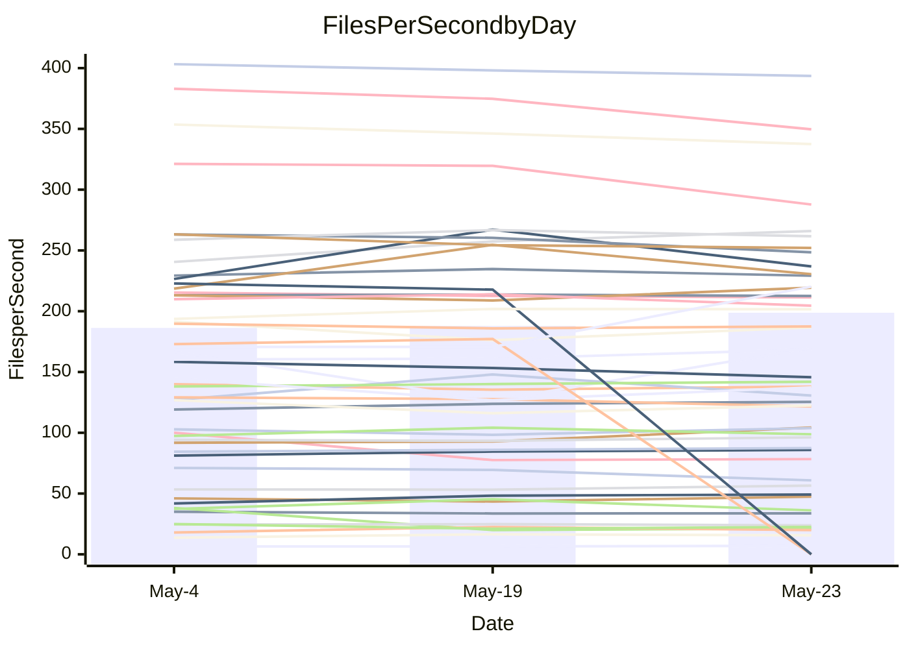

<!---
# This file is auto-generated. Do not edit.
# cspell:disable
--->
# Performance Report

Daily Performance

```mermaid
xychart-beta
    title Files Per Second by Day
    y-axis Files per Second
    x-axis Date [May-4, May-19, May-23]
    bar [186.25, 187.94, 198.75]
    line [35.07, 33.61, 33.75]
    line [140.01, 135.42, 138.02]
    line [53.38, 53.17, 56.58]
    line [38.18, 20.00, 21.13]
    line [46.04, 43.44, 47.40]
    line [71.11, 69.47, 60.87]
    line [100.08, 77.54, 78.35]
    line [81.26, 84.52, 85.94]
    line [191.37, 176.15, 186.65]
    line [166.55, 126.61, 169.58]
    line [119.17, 123.77, 125.38]
    line [17.95, 22.53, 19.96]
    line [24.56, 24.84, 23.90]
    line [24.93, 21.05, 22.49]
    line [91.75, 92.82, 104.26]
    line [102.79, 98.35, 103.84]
    line [382.99, 374.77, 349.66]
    line [158.32, 153.28, 145.68]
    line [13.72, 16.48, 15.69]
    line [6.46, 6.48, 6.95]
    line [229.32, 234.71, 229.18]
    line [189.78, 185.86, 187.45]
    line [240.52, 257.39, 265.97]
    line [37.38, 45.35, 36.16]
    line [218.55, 254.57, 230.53]
    line [127.00, 147.92, 130.56]
    line [215.39, 212.55, 211.37]
    line [226.51, 267.13, 236.87]
    line [353.58, 346.15, 337.55]
    line [160.29, 160.94, 168.53]
    line [213.17, 213.72, 212.53]
    line [129.13, 127.71, 121.65]
    line [94.12, 93.35, 96.24]
    line [138.03, 140.07, 141.93]
    line [213.15, 208.87, 219.33]
    line [84.38, 85.95, 87.42]
    line [321.24, 319.57, 287.77]
    line [41.81, 48.29, 49.17]
    line [126.81, 116.06, 122.50]
    line [144.52, 126.78, 137.36]
    line [263.11, 260.36, 248.44]
    line [172.93, 177.15, 0.00]
    line [258.73, 266.74, 261.73]
    line [97.37, 104.19, 98.76]
    line [263.28, 254.35, 252.09]
    line [403.25, 398.12, 393.59]
    line [209.84, 213.89, 204.52]
    line [222.86, 217.73, 0.00]
    line [193.68, 201.86, 201.64]
    line [170.59, 170.67, 220.21]
```

Time to Process Files

| Repository                                      | Elapsed | Min/Avg/Max           |   SD | SD Graph                |
| ----------------------------------------------- | ------: | :-------------------: | ---: | ----------------------- |
| AdaDoom3/AdaDoom3                    |    2.85 | 2.2 /   2.4 /   2.8   | 0.23 | `    ┣━━┻━━╋━━┻━━●    ` |
| alexiosc/megistos                    |    6.67 | 6.7 /   6.8 /   6.9   | 0.07 | `  ● ┣━━┻━━╋━━┻━━┫    ` |
| apollographql/apollo-server          |    2.46 | 2.5 /   2.6 /   2.6   | 0.06 | `    ┣●━┻━━╋━━┻━━┫    ` |
| aspnetboilerplate/aspnetboilerplate  |    9.07 | 8.7 /   8.9 /   9.2   | 0.20 | `   ┣━━━┻━━╋━━●━━━┫   ` |
| aws-amplify/docs                     |   12.49 | 10.1 /  11.8 /  13.1  | 1.27 | `  ┣━━━┻━━━╋━●━┻━━━┫  ` |
| Azure/azure-rest-api-specs           |    9.54 | 9.3 /   9.5 /   9.6   | 0.13 | `   ┣━━━┻━━╋━●┻━━━┫   ` |
| bitjson/typescript-starter           |    1.00 | 0.8 /   1.0 /   1.1   | 0.13 | `    ┣━━┻━━╋●━┻━━┫    ` |
| caddyserver/caddy                    |    3.00 | 3.4 /   3.4 /   3.4   | 0.02 | `●        ┣┻┫         ` |
| canada-ca/open-source-logiciel-libre |    1.01 | 1.0 /   1.1 /   1.1   | 0.05 | `    ┣━●┻━━╋━━┻━━┫    ` |
| chef/chef                            |    4.71 | 4.8 /   4.9 /   4.9   | 0.05 | `●    ┣━┻━━╋━━┻━┫     ` |
| dart-lang/sdk                        |   56.52 | 55.7 /  57.2 /  58.7  | 1.21 | `  ┣━━━┻━●━╋━━━┻━━━┫  ` |
| django/django                        |   14.24 | 13.4 /  13.7 /  13.8  | 0.21 | `   ┣━━━┻━━╋━━┻━━━┫ ● ` |
| eslint/eslint                        |    9.75 | 9.5 /   9.7 /   9.9   | 0.17 | `   ┣━━━┻━━╋●━┻━━━┫   ` |
| exonum/exonum                        |    3.36 | 3.3 /   3.4 /   3.5   | 0.08 | `    ┣━━●━━╋━━┻━━┫    ` |
| flutter/samples                      |   12.34 | 11.7 /  12.8 /  13.6  | 0.79 | `   ┣━━┻━●━╋━━━┻━━┫   ` |
| gitbucket/gitbucket                  |    2.46 | 2.5 /   3.0 /   3.4   | 0.40 | `   ┣━●━┻━━╋━━┻━━━┫   ` |
| googleapis/google-cloud-cpp          |   95.03 | 121.9 / 122.6 / 123.3 | 0.56 | `●         ┫          ` |
| graphql/express-graphql              |    1.16 | 1.0 /   1.2 /   1.3   | 0.10 | `    ┣━━┻━━●━━┻━━┫    ` |
| graphql/graphql-js                   |    2.69 | 2.6 /   2.7 /   2.9   | 0.10 | `    ┣━━┻━●╋━━┻━━┫    ` |
| graphql/graphql-relay-js             |    1.17 | 1.1 /   1.1 /   1.2   | 0.02 | `     ┣━┻━━╋━━┻━●     ` |
| graphql/graphql-spec                 |    1.21 | 1.0 /   1.2 /   1.4   | 0.16 | `    ┣━━┻━●╋━━┻━━┫    ` |
| iluwatar/java-design-patterns        |   11.54 | 11.7 /  11.8 /  11.9  | 0.09 | `●  ┣━━━┻━━╋━━┻━━━┫   ` |
| ktaranov/sqlserver-kit               |    5.70 | 5.7 /   5.9 /   6.0   | 0.13 | `    ┣━●┻━━╋━━┻━━┫    ` |
| liriliri/licia                       |    4.11 | 3.8 /   3.8 /   3.9   | 0.07 | `     ┣━━┻━╋━┻━━┫    ●` |
| MartinThoma/LaTeX-examples           |    6.15 | 5.9 /   6.1 /   6.1   | 0.11 | `    ┣━━┻━━╋━━●━━┫    ` |
| mdx-js/mdx                           |    1.79 | 1.4 /   1.7 /   1.9   | 0.21 | `    ┣━━┻━━╋━●┻━━┫    ` |
| microsoft/TypeScript-Website         |    5.39 | 5.3 /   5.5 /   5.6   | 0.11 | `    ┣━━●━━╋━━┻━━┫    ` |
| MicrosoftDocs/PowerShell-Docs        |   25.70 | 24.0 /  24.4 /  25.0  | 0.44 | `   ┣━━┻━━━╋━━━┻━━┫  ●` |
| neovim/nvim-lspconfig                |    5.09 | 5.3 /   5.3 /   5.4   | 0.05 | `●    ┣━━┻━╋━┻━━┫     ` |
| pagekit/pagekit                      |    3.51 | 3.4 /   3.5 /   3.6   | 0.07 | `    ┣━━┻━━╋●━┻━━┫    ` |
| php/php-src                          |   23.79 | 23.6 /  24.5 /  25.6  | 0.84 | `  ┣━━━┻●━━╋━━━┻━━━┫  ` |
| plasticrake/tplink-smarthome-api     |    1.26 | 1.3 /   1.4 /   1.5   | 0.09 | `    ┣━━●━━╋━━┻━━┫    ` |
| prettier/prettier                    |    7.92 | 7.6 /   7.7 /   7.7   | 0.08 | `    ┣━━┻━━╋━━┻━━┫   ●` |
| pycontribs/jira                      |    1.41 | 1.4 /   1.5 /   1.6   | 0.07 | `    ┣━●┻━━╋━━┻━━┫    ` |
| RustPython/RustPython                |    6.36 | 6.2 /   6.5 /   6.7   | 0.24 | `   ┣━━━●━━╋━━┻━━━┫   ` |
| shoelace-style/shoelace              |    3.02 | 2.8 /   2.8 /   3.0   | 0.10 | `    ┣━━┻━━╋━━┻━━●    ` |
| slint-ui/slint                       |   13.73 | 11.3 /  12.9 /  13.8  | 1.12 | `  ┣━━━┻━━━╋━━●┻━━━┫  ` |
| SoftwareBrothers/admin-bro           |    2.36 | 2.3 /   2.4 /   2.6   | 0.11 | `    ┣━━┻●━╋━━┻━━┫    ` |
| sveltejs/svelte                      |   22.32 | 21.6 /  21.9 /  22.5  | 0.40 | `   ┣━━┻━━━╋━━━●━━┫   ` |
| TheAlgorithms/Python                 |    5.66 | 5.2 /   5.4 /   5.6   | 0.15 | `    ┣━━┻━━╋━━┻━━●    ` |
| twbs/bootstrap                       |    1.94 | 1.7 /   1.7 /   1.7   | 0.02 | `        ┣┻╋┻┫       ●` |
| typescript-cheatsheets/react         |    1.14 | 1.1 /   1.3 /   1.4   | 0.10 | `    ┣━●┻━━╋━━┻━━┫    ` |
| typescript-eslint/typescript-eslint  |    4.59 | 4.0 /   4.1 /   4.3   | 0.13 | `    ┣━━┻━━╋━━┻━━┫   ●` |
| vitest-dev/vitest                    |   10.10 | 10.4 /  10.6 /  11.1  | 0.30 | `   ┣●━━┻━━╋━━┻━━━┫   ` |
| w3c/aria-practices                   |    3.17 | 2.5 /   3.0 /   3.3   | 0.36 | `   ┣━━━┻━━╋━●┻━━━┫   ` |
| w3c/specberus                        |    1.98 | 1.8 /   1.9 /   2.0   | 0.09 | `    ┣━━┻━━╋━●┻━━┫    ` |
| webdeveric/webpack-assets-manifest   |    1.16 | 1.2 /   1.2 /   1.4   | 0.08 | `    ┣━━●━━╋━━┻━━┫    ` |
| webpack/webpack                      |    5.35 | 5.2 /   5.3 /   5.4   | 0.10 | `    ┣━━┻━━╋━●┻━━┫    ` |
| wireapp/wire-desktop                 |    1.33 | 1.3 /   1.3 /   1.4   | 0.07 | `    ┣━━┻━━●━━┻━━┫    ` |
| wireapp/wire-webapp                  |   11.93 | 11.7 /  11.9 /  12.2  | 0.19 | `   ┣━━━┻━━●━━┻━━━┫   ` |

Note:
- Elapsed time is in seconds.

Files per Second over Time

| Repository                                      | Files |   Sec |    Fps |     Rel | Trend Fps |    N |
| ----------------------------------------------- | ----: | ----: | -----: | ------: | --------- | ---: |
| AdaDoom3/AdaDoom3                    |   103 |  2.85 |  36.16 | -15.30% | `▃▇█▂`    |    3 |
| alexiosc/megistos                    |   583 |  6.67 |  87.42 |   2.34% | `▆▇▇█`    |    3 |
| apollographql/apollo-server          |   255 |  2.46 | 103.84 |   4.01% | `█▆▅█`    |    3 |
| aspnetboilerplate/aspnetboilerplate  |  2286 |  9.07 | 252.09 |  -2.03% | `█▅▇▆`    |    3 |
| aws-amplify/docs                     |  2959 | 12.49 | 236.87 |  -6.59% | `▂▄█▃`    |    3 |
| Azure/azure-rest-api-specs           |  2497 |  9.54 | 261.73 |  -0.89% | `▆██▇`    |    3 |
| bitjson/typescript-starter           |    20 |  1.00 |  19.96 |  -4.98% | `▂█▄▄`    |    3 |
| caddyserver/caddy                    |   313 |  3.00 | 104.26 |  12.76% | `▄▄▄█`    |    3 |
| canada-ca/open-source-logiciel-libre |     7 |  1.01 |   6.95 |   7.30% | `▆▄██`    |    3 |
| chef/chef                            |  1032 |  4.71 | 219.33 |   4.30% | `▇▆▆█`    |    3 |
| dart-lang/sdk                        | 11396 | 56.52 | 201.64 |   1.26% | `▅▇█▇`    |    3 |
| django/django                        |  2912 | 14.24 | 204.52 |  -3.77% | `▆█▆▅`    |    3 |
| eslint/eslint                        |  2072 |  9.75 | 212.53 |  -0.48% | `▇█▆▇`    |    3 |
| exonum/exonum                        |   421 |  3.36 | 125.38 |   2.57% | `▅▆██`    |    3 |
| flutter/samples                      |  1695 | 12.34 | 137.36 |   3.52% | `█▄▃▆`    |    3 |
| gitbucket/gitbucket                  |   417 |  2.46 | 169.58 |  21.19% | `█▃▂█`    |    3 |
| googleapis/google-cloud-cpp          | 20926 | 95.03 | 220.21 |  29.05% | `▃▂▃█`    |    3 |
| graphql/express-graphql              |    26 |  1.16 |  22.49 |   0.69% | `█▅▃▅`    |    3 |
| graphql/graphql-js                   |   371 |  2.69 | 138.02 |   0.78% | `██▅▇`    |    3 |
| graphql/graphql-relay-js             |    28 |  1.17 |  23.90 |  -3.43% | `▆▆█▅`    |    3 |
| graphql/graphql-spec                 |    19 |  1.21 |  15.69 |   0.87% | `▂▃█▅`    |    3 |
| iluwatar/java-design-patterns        |  2061 | 11.54 | 178.59 |   2.45% | `▆▇█`     |    2 |
| ktaranov/sqlserver-kit               |   490 |  5.70 |  85.94 |   3.01% | `▅█▆█`    |    3 |
| liriliri/licia                       |  1438 |  4.11 | 349.66 |  -7.38% | `█▆█▃`    |    3 |
| MartinThoma/LaTeX-examples           |  1409 |  6.15 | 229.18 |  -1.60% | `▆▆█▆`    |    3 |
| mdx-js/mdx                           |   140 |  1.79 |  78.35 |  -7.87% | `█▂▄▃`    |    3 |
| microsoft/TypeScript-Website         |   765 |  5.39 | 141.93 |   1.83% | `▆█▆█`    |    3 |
| MicrosoftDocs/PowerShell-Docs        |  3126 | 25.70 | 121.65 |  -5.10% | `█▆█▄`    |    3 |
| neovim/nvim-lspconfig                |   857 |  5.09 | 168.53 |   4.86% | `▆▅▆█`    |    3 |
| pagekit/pagekit                      |   741 |  3.51 | 211.37 |  -0.99% | `█▆█▇`    |    3 |
| php/php-src                          |  2290 | 23.79 |  96.24 |   2.82% | `▇▅██`    |    3 |
| plasticrake/tplink-smarthome-api     |    62 |  1.26 |  49.17 |   6.60% | `▃▇██`    |    3 |
| prettier/prettier                    |  2674 |  7.92 | 337.55 |  -3.18% | `█▇▇▅`    |    3 |
| pycontribs/jira                      |    80 |  1.41 |  56.58 |   6.27% | `▆▄██`    |    3 |
| RustPython/RustPython                |   779 |  6.36 | 122.50 |   2.39% | `█▄▅▇`    |    3 |
| shoelace-style/shoelace              |   440 |  3.02 | 145.68 |  -5.99% | `██▅▄`    |    3 |
| slint-ui/slint                       |  3164 | 13.73 | 230.53 |  -4.96% | `▂█▃▄`    |    3 |
| SoftwareBrothers/admin-bro           |   441 |  2.36 | 186.65 |   3.00% | `█▆▄▇`    |    3 |
| sveltejs/svelte                      |  8784 | 22.32 | 393.59 |  -1.56% | `██▆▆`    |    3 |
| TheAlgorithms/Python                 |  1407 |  5.66 | 248.44 |  -4.91% | `▇█▅▄`    |    3 |
| twbs/bootstrap                       |   118 |  1.94 |  60.87 | -13.07% | `█▇▆ `    |    3 |
| typescript-cheatsheets/react         |    24 |  1.14 |  21.13 | -18.92% | `█▂▁▂`    |    3 |
| typescript-eslint/typescript-eslint  |  1322 |  4.59 | 287.77 | -10.11% | `▇▅█▂`    |    3 |
| vitest-dev/vitest                    |  2685 | 10.10 | 265.97 |   5.64% | `▄▆▇█`    |    3 |
| w3c/aria-practices                   |   414 |  3.17 | 130.56 |  -7.37% | `▂▃█▃`    |    3 |
| w3c/specberus                        |   196 |  1.98 |  98.76 |  -3.10% | `▄█▅▅`    |    3 |
| webdeveric/webpack-assets-manifest   |    55 |  1.16 |  47.40 |   6.97% | `▇█▃█`    |    3 |
| webpack/webpack                      |  1169 |  5.35 | 218.54 |  -0.61% | `█▆▇`     |    2 |
| wireapp/wire-desktop                 |    45 |  1.33 |  33.75 |  -1.02% | `██▄▆`    |    3 |
| wireapp/wire-webapp                  |  2236 | 11.93 | 187.45 |   0.15% | `██▆▇`    |    3 |

Data Throughput

| Repository                                      | Files |   Sec |     Kps |     Rel | Trend Kps |    N |
| ----------------------------------------------- | ----: | ----: | ------: | ------: | --------- | ---: |
| AdaDoom3/AdaDoom3                    |   103 |  2.85 |  768.58 | -15.30% | `▃▇█▂`    |    3 |
| alexiosc/megistos                    |   583 |  6.67 |  686.95 |   2.34% | `▆▇▇█`    |    3 |
| apollographql/apollo-server          |   255 |  2.46 |  858.00 |   4.03% | `█▆▅█`    |    3 |
| aspnetboilerplate/aspnetboilerplate  |  2286 |  9.07 |  613.36 |  -2.03% | `█▅▇▆`    |    3 |
| aws-amplify/docs                     |  2959 | 12.49 |  856.56 |  -6.56% | `▂▄█▃`    |    3 |
| Azure/azure-rest-api-specs           |  2497 |  9.54 |  783.62 |  -0.80% | `▆██▇`    |    3 |
| bitjson/typescript-starter           |    20 |  1.00 |   79.82 |  -4.98% | `▂█▄▄`    |    3 |
| caddyserver/caddy                    |   313 |  3.00 |  931.98 |  12.70% | `▄▄▄█`    |    3 |
| canada-ca/open-source-logiciel-libre |     7 |  1.01 |   57.58 |   7.30% | `▆▄██`    |    3 |
| chef/chef                            |  1032 |  4.71 | 1073.92 |   4.39% | `▆▆▆█`    |    3 |
| dart-lang/sdk                        | 11396 | 56.52 | 1378.27 |   1.29% | `▅▇█▇`    |    3 |
| django/django                        |  2912 | 14.24 | 1311.54 |  -3.55% | `▆█▆▅`    |    3 |
| eslint/eslint                        |  2072 |  9.75 | 1478.45 |  -0.47% | `▇█▆▇`    |    3 |
| exonum/exonum                        |   421 |  3.36 | 1199.32 |   2.57% | `▅▆██`    |    3 |
| flutter/samples                      |  1695 | 12.34 |  822.12 |   3.52% | `█▄▃▆`    |    3 |
| gitbucket/gitbucket                  |   417 |  2.46 |  808.45 |  22.51% | `▇▃▂█`    |    3 |
| googleapis/google-cloud-cpp          | 20926 | 95.03 | 1879.44 |  29.05% | `▃▂▃█`    |    3 |
| graphql/express-graphql              |    26 |  1.16 |  102.96 |   0.69% | `█▅▃▅`    |    3 |
| graphql/graphql-js                   |   371 |  2.69 |  817.69 |   0.78% | `██▅▇`    |    3 |
| graphql/graphql-relay-js             |    28 |  1.17 |   93.90 |  -3.43% | `▆▆█▅`    |    3 |
| graphql/graphql-spec                 |    19 |  1.21 |  523.63 |   0.87% | `▂▃█▅`    |    3 |
| iluwatar/java-design-patterns        |  2061 | 11.54 |  550.50 |   2.45% | `▆▇█`     |    2 |
| ktaranov/sqlserver-kit               |   490 |  5.70 | 1301.95 |   3.01% | `▅█▆█`    |    3 |
| liriliri/licia                       |  1438 |  4.11 |  417.25 |  -7.33% | `█▆█▃`    |    3 |
| MartinThoma/LaTeX-examples           |  1409 |  6.15 |  473.32 |  -1.60% | `▆▆█▆`    |    3 |
| mdx-js/mdx                           |   140 |  1.79 |  366.59 |  -7.93% | `█▂▄▃`    |    3 |
| microsoft/TypeScript-Website         |   765 |  5.39 |  977.58 |   1.83% | `▆█▆█`    |    3 |
| MicrosoftDocs/PowerShell-Docs        |  3126 | 25.70 | 1296.25 |  -5.13% | `█▆█▄`    |    3 |
| neovim/nvim-lspconfig                |   857 |  5.09 |  493.98 |   5.02% | `▅▅▆█`    |    3 |
| pagekit/pagekit                      |   741 |  3.51 |  440.72 |  -0.99% | `█▆█▇`    |    3 |
| php/php-src                          |  2290 | 23.79 | 1692.67 |   2.84% | `▇▅██`    |    3 |
| plasticrake/tplink-smarthome-api     |    62 |  1.26 |  265.69 |   6.60% | `▃▇██`    |    3 |
| prettier/prettier                    |  2674 |  7.92 |  463.53 |  -3.18% | `█▇▇▅`    |    3 |
| pycontribs/jira                      |    80 |  1.41 |  399.62 |   6.27% | `▆▄██`    |    3 |
| RustPython/RustPython                |   779 |  6.36 | 2086.65 |   4.73% | `▇▅▆█`    |    3 |
| shoelace-style/shoelace              |   440 |  3.02 |  703.54 |  -5.97% | `██▅▄`    |    3 |
| slint-ui/slint                       |  3164 | 13.73 | 1204.06 | -10.20% | `▆█▃▃`    |    3 |
| SoftwareBrothers/admin-bro           |   441 |  2.36 |  411.40 |   3.00% | `█▆▄▇`    |    3 |
| sveltejs/svelte                      |  8784 | 22.32 |  267.05 |  -1.56% | `██▆▆`    |    3 |
| TheAlgorithms/Python                 |  1407 |  5.66 |  634.42 |  -4.91% | `▇█▅▄`    |    3 |
| twbs/bootstrap                       |   118 |  1.94 |  499.86 | -13.07% | `█▇▆ `    |    3 |
| typescript-cheatsheets/react         |    24 |  1.14 |  190.16 | -11.29% | `█▃▂▃`    |    3 |
| typescript-eslint/typescript-eslint  |  1322 |  4.59 | 1557.70 | -10.08% | `▇▅█▂`    |    3 |
| vitest-dev/vitest                    |  2685 | 10.10 |  687.95 |  -1.31% | `█▄▄▅`    |    3 |
| w3c/aria-practices                   |   414 |  3.17 | 1219.78 |  -7.37% | `▂▃█▃`    |    3 |
| w3c/specberus                        |   196 |  1.98 |  321.97 |  -3.23% | `▄█▅▅`    |    3 |
| webdeveric/webpack-assets-manifest   |    55 |  1.16 |  108.58 |   6.97% | `▇█▃█`    |    3 |
| webpack/webpack                      |  1169 |  5.35 | 1099.79 |   1.02% | `▇██`     |    2 |
| wireapp/wire-desktop                 |    45 |  1.33 |  148.50 |  -1.02% | `██▄▆`    |    3 |
| wireapp/wire-webapp                  |  2236 | 11.93 |  783.18 |   0.64% | `██▇█`    |    3 |

