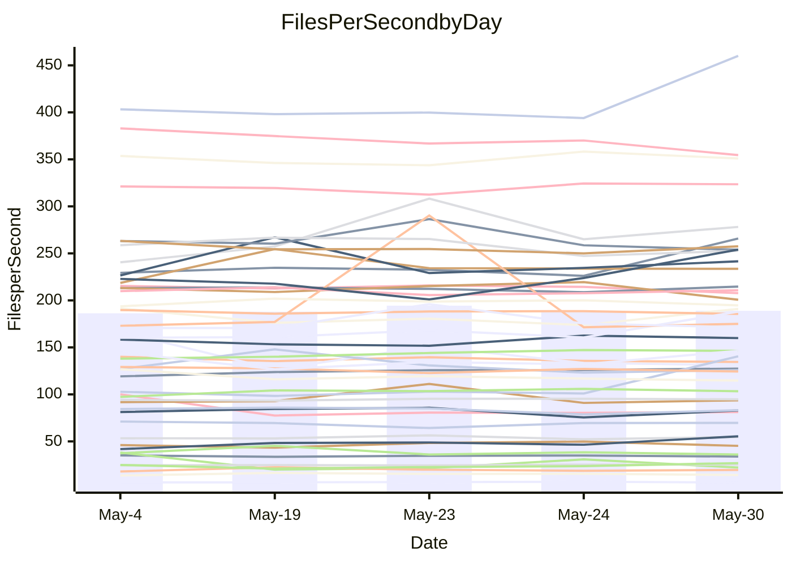

<!---
# This file is auto-generated. Do not edit.
# cspell:disable
--->
# Performance Report

Daily Performance

```mermaid
xychart-beta
    title Files Per Second by Day
    y-axis Files per Second
    x-axis Date [May-4, May-19, May-23, May-24, May-30]
    bar [186.25, 187.94, 194.38, 187.53, 188.92]
    line [35.07, 33.61, 34.69, 34.94, 33.95]
    line [140.01, 135.42, 139.50, 135.65, 134.52]
    line [53.38, 53.17, 56.48, 52.20, 54.66]
    line [38.18, 20.00, 21.53, 30.85, 22.15]
    line [46.04, 43.44, 48.37, 49.79, 45.25]
    line [71.11, 69.47, 64.25, 69.53, 69.68]
    line [100.08, 77.54, 80.59, 80.29, 81.23]
    line [81.26, 84.52, 85.73, 75.59, 82.90]
    line [191.37, 176.15, 180.59, 173.73, 190.94]
    line [166.55, 126.61, 150.87, 133.44, 131.20]
    line [119.17, 123.77, 125.73, 125.94, 127.43]
    line [17.95, 22.53, 19.87, 18.72, 19.65]
    line [24.56, 24.84, 24.48, 25.27, 25.42]
    line [24.93, 21.05, 22.73, 23.64, 26.94]
    line [91.75, 92.82, 111.10, 90.94, 93.75]
    line [102.79, 98.35, 102.96, 100.96, 140.55]
    line [382.99, 374.77, 366.83, 370.08, 354.54]
    line [158.32, 153.28, 151.73, 162.52, 159.90]
    line [13.72, 16.48, 15.39, 15.58, 14.26]
    line [6.46, 6.48, 6.70, 7.10, 6.20]
    line [229.32, 234.71, 232.57, 226.13, 265.79]
    line [189.78, 185.86, 188.16, 188.58, 185.60]
    line [240.52, 257.39, 308.24, 265.00, 278.15]
    line [37.38, 45.35, 36.07, 38.42, 36.05]
    line [218.55, 254.57, 234.26, 233.79, 233.59]
    line [127.00, 147.92, 130.77, 123.22, 125.73]
    line [215.39, 212.55, 215.84, 214.38, 207.68]
    line [226.51, 267.13, 229.05, 234.58, 241.52]
    line [353.58, 346.15, 343.69, 358.26, 350.88]
    line [160.29, 160.94, 168.26, 160.60, 188.11]
    line [213.17, 213.72, 212.23, 208.69, 214.71]
    line [129.13, 127.71, 122.71, 127.15, 124.34]
    line [94.12, 93.35, 95.34, 95.32, 94.75]
    line [138.03, 140.07, 144.01, 147.15, 146.35]
    line [213.15, 208.87, 215.23, 219.43, 200.71]
    line [84.38, 85.95, 85.08, 78.77, 83.17]
    line [321.24, 319.57, 312.48, 324.31, 323.51]
    line [41.81, 48.29, 48.86, 46.46, 55.44]
    line [126.81, 116.06, 119.43, 116.84, 114.69]
    line [144.52, 126.78, 134.48, 131.99, 146.37]
    line [263.11, 260.36, 286.42, 258.60, 253.82]
    line [172.93, 177.15, 290.28, 171.42, 175.04]
    line [258.73, 266.74, 265.26, 247.18, 252.79]
    line [97.37, 104.19, 103.43, 105.92, 103.38]
    line [263.28, 254.35, 254.61, 250.00, 257.52]
    line [403.25, 398.12, 399.78, 393.93, 460.10]
    line [209.84, 213.89, 205.67, 207.63, 210.79]
    line [222.86, 217.73, 200.96, 223.84, 254.05]
    line [193.68, 201.86, 198.76, 200.08, 194.69]
    line [170.59, 170.67, 195.94, 175.36, 171.48]
```

Time to Process Files

| Repository                                      | Elapsed | Min/Avg/Max          |   SD | SD Graph                |
| ----------------------------------------------- | ------: | :------------------: | ---: | ----------------------- |
| AdaDoom3/AdaDoom3                    |    2.92 | 2.2 /   2.6 /   2.9  | 0.23 | `    ┣━━┻━━╋━━●━━┫    ` |
| alexiosc/megistos                    |    6.90 | 6.7 /   7.0 /   7.9  | 0.35 | `    ┣━━┻━●╋━━┻━━┫    ` |
| apollographql/apollo-server          |    1.42 | 2.4 /   2.5 /   2.6  | 0.06 | `●        ┣╋┫         ` |
| aspnetboilerplate/aspnetboilerplate  |    8.78 | 8.7 /   9.0 /   9.3  | 0.18 | `    ┣━━●━━╋━━┻━━┫    ` |
| aws-amplify/docs                     |   12.33 | 10.1 /  12.3 /  13.4 | 0.94 | `    ┣━━┻━━●━━┻━━┫    ` |
| Azure/azure-rest-api-specs           |    9.11 | 9.3 /   9.8 /  10.8  | 0.57 | `    ┣━●┻━━╋━━┻━━┫    ` |
| bitjson/typescript-starter           |    1.03 | 0.8 /   1.0 /   1.1  | 0.09 | `     ┣━┻━━●━━┻━┫     ` |
| caddyserver/caddy                    |    3.26 | 2.7 /   3.3 /   3.5  | 0.27 | `    ┣━━┻━━●━━┻━━┫    ` |
| canada-ca/open-source-logiciel-libre |    1.06 | 0.9 /   1.1 /   1.2  | 0.08 | `     ┣━┻━━●━━┻━┫     ` |
| chef/chef                            |    5.24 | 4.6 /   4.8 /   5.0  | 0.13 | `    ┣━━┻━━╋━━┻━━┫  ● ` |
| dart-lang/sdk                        |   59.44 | 55.5 /  57.2 /  58.7 | 1.16 | `   ┣━━┻━━━╋━━━┻━━●   ` |
| django/django                        |   13.92 | 13.4 /  13.9 /  14.2 | 0.24 | `    ┣━━┻━━●━━┻━━┫    ` |
| eslint/eslint                        |    9.81 | 9.5 /   9.7 /  10.0  | 0.17 | `    ┣━━┻━━╋●━┻━━┫    ` |
| exonum/exonum                        |    3.27 | 3.3 /   3.4 /   3.5  | 0.07 | `     ┣●┻━━╋━━┻━┫     ` |
| flutter/samples                      |   11.90 | 11.3 /  12.6 /  13.6 | 0.71 | `    ┣━━●━━╋━━┻━━┫    ` |
| gitbucket/gitbucket                  |    3.20 | 2.5 /   3.0 /   3.4  | 0.33 | `    ┣━━┻━━╋━●┻━━┫    ` |
| googleapis/google-cloud-cpp          |  119.01 | 95.0 / 118.6 / 125.2 | 9.10 | `  ┣━━━┻━━━●━━━┻━━━┫  ` |
| graphql/express-graphql              |    0.86 | 1.0 /   1.1 /   1.3  | 0.07 | `●    ┣━┻━━╋━━┻━┫     ` |
| graphql/graphql-js                   |    2.62 | 2.6 /   2.7 /   2.9  | 0.11 | `     ┣━●━━╋━━┻━┫     ` |
| graphql/graphql-relay-js             |    1.07 | 1.1 /   1.1 /   1.2  | 0.03 | `     ┣●━┻━╋━┻━━┫     ` |
| graphql/graphql-spec                 |    1.35 | 1.0 /   1.2 /   1.4  | 0.10 | `     ┣━┻━━╋━━●━┫     ` |
| iluwatar/java-design-patterns        |   11.81 | 7.1 /  11.2 /  12.1  | 1.66 | `   ┣━━━┻━━╋●━┻━━━┫   ` |
| ktaranov/sqlserver-kit               |    5.50 | 5.7 /   6.1 /   7.5  | 0.57 | `    ┣━━●━━╋━━┻━━┫    ` |
| liriliri/licia                       |    4.14 | 3.7 /   3.9 /   4.1  | 0.12 | `    ┣━━┻━━╋━━┻━━●    ` |
| MartinThoma/LaTeX-examples           |    6.06 | 4.7 /   5.9 /   6.5  | 0.49 | `    ┣━━┻━━╋●━┻━━┫    ` |
| mdx-js/mdx                           |    1.76 | 1.4 /   1.7 /   1.9  | 0.14 | `     ┣━┻━━╋●━┻━┫     ` |
| microsoft/TypeScript-Website         |    5.26 | 5.0 /   5.3 /   5.6  | 0.20 | `    ┣━━┻━●╋━━┻━━┫    ` |
| MicrosoftDocs/PowerShell-Docs        |   24.52 | 24.0 /  24.9 /  25.8 | 0.68 | `   ┣━━━┻●━╋━━┻━━━┫   ` |
| neovim/nvim-lspconfig                |    3.98 | 5.1 /   5.3 /   5.6  | 0.15 | `●       ┣┻╋┻┫        ` |
| pagekit/pagekit                      |    3.58 | 3.4 /   3.5 /   3.6  | 0.07 | `     ┣━┻━━╋━━┻━●     ` |
| php/php-src                          |   23.99 | 23.6 /  24.2 /  25.6 | 0.57 | `   ┣━━━┻━●╋━━┻━━━┫   ` |
| plasticrake/tplink-smarthome-api     |    1.23 | 1.0 /   1.3 /   1.5  | 0.13 | `     ┣━┻━●╋━━┻━┫     ` |
| prettier/prettier                    |    7.91 | 7.4 /   7.6 /   7.9  | 0.17 | `    ┣━━┻━━╋━━┻━●┫    ` |
| pycontribs/jira                      |    1.52 | 1.4 /   1.5 /   1.6  | 0.07 | `     ┣━┻━━╋━●┻━┫     ` |
| RustPython/RustPython                |    6.75 | 6.2 /   6.6 /   6.8  | 0.20 | `    ┣━━┻━━╋━●┻━━┫    ` |
| shoelace-style/shoelace              |    2.74 | 2.7 /   2.8 /   3.0  | 0.11 | `     ┣━┻●━╋━━┻━┫     ` |
| slint-ui/slint                       |   13.24 | 11.3 /  13.3 /  13.9 | 0.79 | `    ┣━━┻━━●━━┻━━┫    ` |
| SoftwareBrothers/admin-bro           |    2.29 | 2.3 /   2.5 /   2.6  | 0.10 | `     ┣●┻━━╋━━┻━┫     ` |
| sveltejs/svelte                      |   17.11 | 21.6 /  22.0 /  22.8 | 0.44 | `●       ┣┻╋┻┫        ` |
| TheAlgorithms/Python                 |    5.59 | 4.3 /   5.3 /   5.7  | 0.40 | `    ┣━━┻━━╋━●┻━━┫    ` |
| twbs/bootstrap                       |    1.69 | 1.7 /   1.7 /   1.9  | 0.08 | `     ┣━┻━●╋━━┻━┫     ` |
| typescript-cheatsheets/react         |    1.10 | 0.7 /   1.1 /   1.4  | 0.20 | `     ┣━┻━━●━━┻━┫     ` |
| typescript-eslint/typescript-eslint  |    4.01 | 3.9 /   4.2 /   4.6  | 0.20 | `    ┣━━┻●━╋━━┻━━┫    ` |
| vitest-dev/vitest                    |    9.59 | 7.7 /  10.0 /  11.1  | 0.94 | `    ┣━━┻━●╋━━┻━━┫    ` |
| w3c/aria-practices                   |    3.40 | 2.5 /   3.2 /   3.4  | 0.27 | `    ┣━━┻━━╋━━●━━┫    ` |
| w3c/specberus                        |    1.94 | 1.8 /   1.9 /   2.0  | 0.08 | `     ┣━┻━━╋━●┻━┫     ` |
| webdeveric/webpack-assets-manifest   |    1.23 | 1.0 /   1.2 /   1.4  | 0.09 | `     ┣━┻━━╋●━┻━┫     ` |
| webpack/webpack                      |    4.17 | 5.1 /   5.3 /   5.8  | 0.22 | `●     ┣━┻━╋━┻━┫      ` |
| wireapp/wire-desktop                 |    1.38 | 1.3 /   1.3 /   1.4  | 0.05 | `     ┣━┻━━╋━━┻●┫     ` |
| wireapp/wire-webapp                  |   11.97 | 11.7 /  11.9 /  12.2 | 0.15 | `    ┣━━┻━━╋●━┻━━┫    ` |

Note:
- Elapsed time is in seconds.

Files per Second over Time

| Repository                                      | Files |    Sec |    Fps |     Rel | Trend Fps   |    N |
| ----------------------------------------------- | ----: | -----: | -----: | ------: | ----------- | ---: |
| AdaDoom3/AdaDoom3                    |   103 |   2.92 |  35.31 |  -9.98% | `▃▇█▃▂▄▃▃▂` |    8 |
| alexiosc/megistos                    |   583 |   6.90 |  84.46 |   1.47% | `▇█▇█▆▇▃▆▇` |    8 |
| apollographql/apollo-server          |   255 |   1.42 | 179.01 |  76.92% | `▂▁▁▂▂▂▁▂█` |    8 |
| aspnetboilerplate/aspnetboilerplate  |  2286 |   8.78 | 260.43 |   2.34% | `█▆▇▆▇▅▆▇█` |    8 |
| aws-amplify/docs                     |  2959 |  12.33 | 239.99 |  -0.58% | `▃▄█▄▂▄▃▄▄` |    8 |
| Azure/azure-rest-api-specs           |  2497 |   9.11 | 273.95 |   6.97% | `▆▇▇▇█▃▇▃█` |    8 |
| bitjson/typescript-starter           |    20 |   1.03 |  19.47 |  -2.64% | `▂█▄▄▄▄▂▄▃` |    8 |
| caddyserver/caddy                    |   313 |   3.26 |  96.10 |  -0.52% | `▃▃▃▅█▃▂▃▄` |    8 |
| canada-ca/open-source-logiciel-libre |     7 |   1.06 |   6.58 |  -0.36% | `▄▃▆▆▄█▅▂▅` |    8 |
| chef/chef                            |  1032 |   5.24 | 196.81 |  -7.64% | `▆▅▅▇▆▇█▅▃` |    8 |
| dart-lang/sdk                        | 11396 |  59.44 | 191.72 |  -3.70% | `▅▇█▇▆▆█▆▅` |    8 |
| django/django                        |  2912 |  13.92 | 209.16 |  -0.20% | `▆█▇▅▆▆▆▇▆` |    8 |
| eslint/eslint                        |  2072 |   9.81 | 211.18 |  -0.66% | `▇█▆▇▇▆▅█▆` |    8 |
| exonum/exonum                        |   421 |   3.27 | 128.88 |   3.51% | `▅▆▇▇▇█▇▇█` |    8 |
| flutter/samples                      |  1695 |  11.90 | 142.38 |   5.34% | `▇▄▃▆▄▅▄█▇` |    8 |
| gitbucket/gitbucket                  |   417 |   3.20 | 130.38 |  -6.90% | `█▃▂█▃▄▃▃▃` |    8 |
| googleapis/google-cloud-cpp          | 20926 | 119.01 | 175.84 |  -1.05% | `▃▃▃█▃▃▃▂▃` |    8 |
| graphql/express-graphql              |    26 |   0.86 |  30.07 |  31.05% | `▅▃▂▃▄▄▄▄█` |    8 |
| graphql/graphql-js                   |   371 |   2.62 | 141.36 |   3.86% | `██▅▇██▅▄█` |    8 |
| graphql/graphql-relay-js             |    28 |   1.07 |  26.08 |   5.09% | `▅▅▆▄▆▄█▅▇` |    8 |
| graphql/graphql-spec                 |    19 |   1.35 |  14.07 |  -8.57% | `▂▃█▅▄▄▅▃▃` |    8 |
| iluwatar/java-design-patterns        |  2061 |  11.81 | 174.51 |  -8.56% | `▂▂▂█▁▂▂▂`  |    7 |
| ktaranov/sqlserver-kit               |   490 |   5.50 |  89.12 |   9.74% | `▆▇▇▇▇▂▇▅█` |    8 |
| liriliri/licia                       |  1438 |   4.14 | 346.97 |  -6.49% | `█▆█▄█▆▇▆▄` |    8 |
| MartinThoma/LaTeX-examples           |  1409 |   6.06 | 232.63 |  -2.82% | `▃▃▄▃▃▃▂█▃` |    8 |
| mdx-js/mdx                           |   140 |   1.76 |  79.51 |  -3.61% | `█▂▄▃▄▄▄▄▄` |    8 |
| microsoft/TypeScript-Website         |   765 |   5.26 | 145.35 |   1.30% | `▄▅▄▅▆▅█▆▆` |    8 |
| MicrosoftDocs/PowerShell-Docs        |  3126 |  24.52 | 127.49 |   1.44% | `█▆█▅▆█▆▅▇` |    8 |
| neovim/nvim-lspconfig                |   857 |   3.98 | 215.13 |  32.29% | `▃▃▃▃▃▂▃▃█` |    8 |
| pagekit/pagekit                      |   741 |   3.58 | 206.80 |  -3.22% | `▇▅▇▆█▇▇▅▅` |    8 |
| php/php-src                          |  2290 |  23.99 |  95.46 |   0.99% | `▇▅██▇▇▇▇▇` |    8 |
| plasticrake/tplink-smarthome-api     |    62 |   1.23 |  50.48 |   3.70% | `▂▄▄▄▄▅▂█▅` |    8 |
| prettier/prettier                    |  2674 |   7.91 | 338.00 |  -3.89% | `▇▆▆▅▆▇██▅` |    8 |
| pycontribs/jira                      |    80 |   1.52 |  52.64 |  -2.91% | `▆▄███▅▅█▅` |    8 |
| RustPython/RustPython                |   779 |   6.75 | 115.45 |  -2.30% | `█▅▅▇▅▅▅▄▅` |    8 |
| shoelace-style/shoelace              |   440 |   2.74 | 160.87 |   2.77% | `▇▇▄▄▇██▇█` |    8 |
| slint-ui/slint                       |  3164 |  13.24 | 239.03 |   1.07% | `▂█▃▄▄▄▄▃▄` |    8 |
| SoftwareBrothers/admin-bro           |   441 |   2.29 | 192.70 |   6.94% | `█▆▄▇▅▄▄▇█` |    8 |
| sveltejs/svelte                      |  8784 |  17.11 | 513.53 |  28.64% | `▃▃▂▃▃▃▂▃█` |    8 |
| TheAlgorithms/Python                 |  1407 |   5.59 | 251.51 |  -5.54% | `▃▄▃▂█▃▄▃▃` |    8 |
| twbs/bootstrap                       |   118 |   1.69 |  69.73 |   1.94% | `██▇▃▆▇▇▇▇` |    8 |
| typescript-cheatsheets/react         |    24 |   1.10 |  21.83 | -14.99% | `█▂▁▂▂▇▄▂▂` |    8 |
| typescript-eslint/typescript-eslint  |  1322 |   4.01 | 329.68 |   3.38% | `▇▅█▃█▇▇▆▇` |    8 |
| vitest-dev/vitest                    |  2685 |   9.59 | 280.05 |   2.86% | `▂▃▃▃█▃▃▄▄` |    8 |
| w3c/aria-practices                   |   414 |   3.40 | 121.86 |  -8.07% | `▃▃█▃▃▂▃▃▂` |    8 |
| w3c/specberus                        |   196 |   1.94 | 100.86 |  -2.83% | `▄█▅▅█▇█▇▅` |    8 |
| webdeveric/webpack-assets-manifest   |    55 |   1.23 |  44.85 |  -4.30% | `▅▅▂▅▆█▅▅▄` |    8 |
| webpack/webpack                      |  1169 |   4.17 | 280.17 |  27.78% | `▄▃▃▂▄▃▄█`  |    7 |
| wireapp/wire-desktop                 |    45 |   1.38 |  32.72 |  -5.43% | `██▄▆██▇█▅` |    8 |
| wireapp/wire-webapp                  |  2236 |  11.97 | 186.85 |  -0.30% | `██▆▇██▇▆▇` |    8 |

Data Throughput

| Repository                                      | Files |    Sec |     Kps |     Rel | Trend Kps   |    N |
| ----------------------------------------------- | ----: | -----: | ------: | ------: | ----------- | ---: |
| AdaDoom3/AdaDoom3                    |   103 |   2.92 |  750.52 |  -9.98% | `▃▇█▃▂▄▃▃▂` |    8 |
| alexiosc/megistos                    |   583 |   6.90 |  663.66 |   1.47% | `▇█▇█▆▇▃▆▇` |    8 |
| apollographql/apollo-server          |   255 |   1.42 | 1479.08 |  76.93% | `▂▁▁▂▂▂▁▂█` |    8 |
| aspnetboilerplate/aspnetboilerplate  |  2286 |   8.78 |  633.64 |   2.34% | `█▆▇▆▇▅▆▇█` |    8 |
| aws-amplify/docs                     |  2959 |  12.33 |  867.84 |  -0.56% | `▃▄█▄▂▄▃▄▄` |    8 |
| Azure/azure-rest-api-specs           |  2497 |   9.11 |  820.20 |   7.01% | `▆▇▇▇█▃▇▃█` |    8 |
| bitjson/typescript-starter           |    20 |   1.03 |   77.88 |  -2.64% | `▂█▄▄▄▄▂▄▃` |    8 |
| caddyserver/caddy                    |   313 |   3.26 |  859.11 |  -0.54% | `▃▃▃▅█▃▂▃▄` |    8 |
| canada-ca/open-source-logiciel-libre |     7 |   1.06 |   54.53 |  -0.36% | `▄▃▆▆▄█▅▂▅` |    8 |
| chef/chef                            |  1032 |   5.24 |  963.66 |  -7.61% | `▆▅▅▇▆▇█▅▃` |    8 |
| dart-lang/sdk                        | 11396 |  59.44 | 1310.48 |  -3.69% | `▅▇█▇▆▆█▆▅` |    8 |
| django/django                        |  2912 |  13.92 | 1341.31 |  -0.11% | `▆█▇▅▆▆▆▇▆` |    8 |
| eslint/eslint                        |  2072 |   9.81 | 1469.08 |  -0.66% | `▇█▆▇▇▆▅█▆` |    8 |
| exonum/exonum                        |   421 |   3.27 | 1232.77 |   3.51% | `▅▆▇▇▇█▇▇█` |    8 |
| flutter/samples                      |  1695 |  11.90 |  852.19 |   5.34% | `▇▄▃▆▄▅▄█▇` |    8 |
| gitbucket/gitbucket                  |   417 |   3.20 |  621.58 |  -6.53% | `▇▃▂█▃▄▃▃▃` |    8 |
| googleapis/google-cloud-cpp          | 20926 | 119.01 | 1500.73 |  -1.05% | `▃▃▃█▃▃▃▂▃` |    8 |
| graphql/express-graphql              |    26 |   0.86 |  137.64 |  31.05% | `▅▃▂▃▄▄▄▄█` |    8 |
| graphql/graphql-js                   |   371 |   2.62 |  837.51 |   3.86% | `██▅▇██▅▄█` |    8 |
| graphql/graphql-relay-js             |    28 |   1.07 |  102.44 |   5.09% | `▅▅▆▄▆▄█▅▇` |    8 |
| graphql/graphql-spec                 |    19 |   1.35 |  469.37 |  -8.57% | `▂▃█▅▄▄▅▃▃` |    8 |
| iluwatar/java-design-patterns        |  2061 |  11.81 |  537.93 |  -8.56% | `▂▂▂█▁▂▂▂`  |    7 |
| ktaranov/sqlserver-kit               |   490 |   5.50 | 1350.02 |   9.74% | `▆▇▇▇▇▂▇▅█` |    8 |
| liriliri/licia                       |  1438 |   4.14 |  414.04 |  -6.47% | `█▆█▄█▆▇▆▄` |    8 |
| MartinThoma/LaTeX-examples           |  1409 |   6.06 |  480.46 |  -2.82% | `▃▃▄▃▃▃▂█▃` |    8 |
| mdx-js/mdx                           |   140 |   1.76 |  371.97 |  -3.63% | `█▂▄▃▄▄▄▄▄` |    8 |
| microsoft/TypeScript-Website         |   765 |   5.26 | 1001.10 |   1.30% | `▄▅▄▅▆▅█▆▆` |    8 |
| MicrosoftDocs/PowerShell-Docs        |  3126 |  24.52 | 1358.49 |   1.42% | `█▆█▅▆█▆▅▇` |    8 |
| neovim/nvim-lspconfig                |   857 |   3.98 |  630.57 |  32.36% | `▃▃▃▃▃▂▃▃█` |    8 |
| pagekit/pagekit                      |   741 |   3.58 |  431.19 |  -3.22% | `▇▅▇▆█▇▇▅▅` |    8 |
| php/php-src                          |  2290 |  23.99 | 1678.88 |   1.00% | `▇▅██▇▇▇▇▇` |    8 |
| plasticrake/tplink-smarthome-api     |    62 |   1.23 |  272.76 |   3.70% | `▂▄▄▄▄▅▂█▅` |    8 |
| prettier/prettier                    |  2674 |   7.91 |  464.15 |  -3.89% | `▇▆▆▅▆▇██▅` |    8 |
| pycontribs/jira                      |    80 |   1.52 |  371.80 |  -2.91% | `▆▄███▅▅█▅` |    8 |
| RustPython/RustPython                |   779 |   6.75 | 1966.56 |  -1.47% | `▇▅▆█▆▆▆▅▅` |    8 |
| shoelace-style/shoelace              |   440 |   2.74 |  776.92 |   2.77% | `▇▇▄▄▇██▇█` |    8 |
| slint-ui/slint                       |  3164 |  13.24 | 1248.50 |  -1.14% | `▆█▃▃▄▄▃▃▄` |    8 |
| SoftwareBrothers/admin-bro           |   441 |   2.29 |  424.72 |   6.94% | `█▆▄▇▅▄▄▇█` |    8 |
| sveltejs/svelte                      |  8784 |  17.11 |  348.43 |  28.64% | `▃▃▂▃▃▃▂▃█` |    8 |
| TheAlgorithms/Python                 |  1407 |   5.59 |  642.28 |  -5.54% | `▃▄▃▂█▃▄▃▃` |    8 |
| twbs/bootstrap                       |   118 |   1.69 |  572.61 |   1.94% | `██▇▃▆▇▇▇▇` |    8 |
| typescript-cheatsheets/react         |    24 |   1.10 |  196.45 | -12.11% | `▆▂▁▂▂█▄▃▂` |    8 |
| typescript-eslint/typescript-eslint  |  1322 |   4.01 | 1784.55 |   3.39% | `▇▅█▃█▇▇▆▇` |    8 |
| vitest-dev/vitest                    |  2685 |   9.59 |  724.37 |   0.41% | `▅▂▂▃█▃▃▃▄` |    8 |
| w3c/aria-practices                   |   414 |   3.40 | 1138.52 |  -8.07% | `▃▃█▃▃▂▃▃▂` |    8 |
| w3c/specberus                        |   196 |   1.94 |  328.82 |  -2.88% | `▄█▅▅█▆█▇▅` |    8 |
| webdeveric/webpack-assets-manifest   |    55 |   1.23 |  102.74 |  -4.30% | `▅▅▂▅▆█▅▅▄` |    8 |
| webpack/webpack                      |  1169 |   4.17 | 1409.97 |  28.37% | `▃▃▃▂▄▃▄█`  |    7 |
| wireapp/wire-desktop                 |    45 |   1.38 |  143.95 |  -5.43% | `██▄▆██▇█▅` |    8 |
| wireapp/wire-webapp                  |  2236 |  11.97 |  780.64 |  -0.12% | `▇█▆▇██▇▆▇` |    8 |

