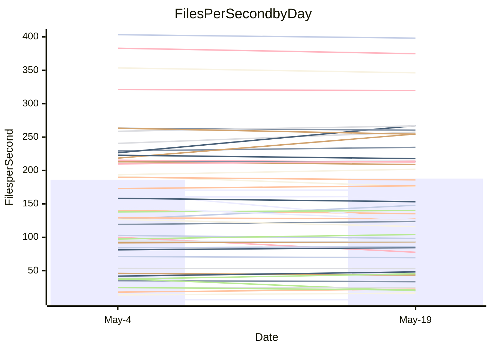

<!---
# This file is auto-generated. Do not edit.
# cspell:disable
--->
# Performance Report

Daily Performance

```mermaid
xychart-beta
    title Files Per Second by Day
    y-axis Files per Second
    x-axis Date [May-4, May-19]
    bar [186.25, 187.94]
    line [35.07, 33.61]
    line [140.01, 135.42]
    line [53.38, 53.17]
    line [38.18, 20.00]
    line [46.04, 43.44]
    line [71.11, 69.47]
    line [100.08, 77.54]
    line [81.26, 84.52]
    line [191.37, 176.15]
    line [166.55, 126.61]
    line [119.17, 123.77]
    line [17.95, 22.53]
    line [24.56, 24.84]
    line [24.93, 21.05]
    line [91.75, 92.82]
    line [102.79, 98.35]
    line [382.99, 374.77]
    line [158.32, 153.28]
    line [13.72, 16.48]
    line [6.46, 6.48]
    line [229.32, 234.71]
    line [189.78, 185.86]
    line [240.52, 257.39]
    line [37.38, 45.35]
    line [218.55, 254.57]
    line [127.00, 147.92]
    line [215.39, 212.55]
    line [226.51, 267.13]
    line [353.58, 346.15]
    line [160.29, 160.94]
    line [213.17, 213.72]
    line [129.13, 127.71]
    line [94.12, 93.35]
    line [138.03, 140.07]
    line [213.15, 208.87]
    line [84.38, 85.95]
    line [321.24, 319.57]
    line [41.81, 48.29]
    line [126.81, 116.06]
    line [144.52, 126.78]
    line [263.11, 260.36]
    line [172.93, 177.15]
    line [258.73, 266.74]
    line [97.37, 104.19]
    line [263.28, 254.35]
    line [403.25, 398.12]
    line [209.84, 213.89]
    line [222.86, 217.73]
    line [193.68, 201.86]
    line [170.59, 170.67]
```

Time to Process Files

| Repository                                      | Elapsed | Min/Avg/Max           |   SD | SD Graph                |
| ----------------------------------------------- | ------: | :-------------------: | ---: | ----------------------- |
| AdaDoom3/AdaDoom3                    |    2.22 | 2.3 /   2.5 /   2.8   | 0.22 | `   ┣━●━┻━━╋━━┻━━━┫   ` |
| alexiosc/megistos                    |    6.82 | 6.7 /   6.8 /   6.9   | 0.08 | `   ┣━━━┻━●╋━━┻━━━┫   ` |
| apollographql/apollo-server          |    2.62 | 2.5 /   2.5 /   2.6   | 0.04 | `    ┣━━┻━━╋━━┻━━┫●   ` |
| aspnetboilerplate/aspnetboilerplate  |    8.82 | 8.7 /   8.9 /   9.2   | 0.24 | `   ┣━━┻━●━╋━━━┻━━┫   ` |
| aws-amplify/docs                     |   10.07 | 12.3 /  12.7 /  13.1  | 0.38 | `●      ┣┻━╋━┻┫       ` |
| Azure/azure-rest-api-specs           |    9.40 | 9.3 /   9.5 /   9.6   | 0.16 | `   ┣━━━┻●━╋━━┻━━━┫   ` |
| bitjson/typescript-starter           |    1.00 | 0.8 /   1.0 /   1.1   | 0.16 | `    ┣━━┻━━╋●━┻━━┫    ` |
| caddyserver/caddy                    |    3.35 | 3.4 /   3.4 /   3.4   | 0.00 | `●         ┫          ` |
| canada-ca/open-source-logiciel-libre |    1.02 | 1.1 /   1.1 /   1.1   | 0.03 | ` ●  ┣━━┻━━╋━━┻━━┫    ` |
| chef/chef                            |    4.94 | 4.8 /   4.9 /   4.9   | 0.06 | `    ┣━━┻━━╋━━●━━┫    ` |
| dart-lang/sdk                        |   55.72 | 57.2 /  58.0 /  58.7  | 0.74 | `●  ┣━━━┻━━╋━━┻━━━┫   ` |
| django/django                        |   13.84 | 13.4 /  13.6 /  13.8  | 0.23 | `   ┣━━┻━━━╋━━●┻━━┫   ` |
| eslint/eslint                        |    9.90 | 9.5 /   9.6 /   9.7   | 0.10 | `   ┣━━━┻━━╋━━┻━━━┫  ●` |
| exonum/exonum                        |    3.34 | 3.5 /   3.5 /   3.5   | 0.03 | `●    ┣━━┻━╋━┻━━┫     ` |
| flutter/samples                      |   13.56 | 11.7 /  12.5 /  13.2  | 0.73 | `  ┣━━━┻━━━╋━━━┻━●━┫  ` |
| gitbucket/gitbucket                  |    3.45 | 2.5 /   2.8 /   3.2   | 0.33 | `   ┣━━━┻━━╋━━┻━━●┫   ` |
| googleapis/google-cloud-cpp          |  121.93 | 122.7 / 123.0 / 123.3 | 0.32 | `●   ┣━━┻━━╋━━┻━━┫    ` |
| graphql/express-graphql              |    1.29 | 1.0 /   1.1 /   1.2   | 0.07 | `    ┣━━┻━━╋━━┻━━┫●   ` |
| graphql/graphql-js                   |    2.86 | 2.6 /   2.6 /   2.6   | 0.01 | `         ┣┻┫        ●` |
| graphql/graphql-relay-js             |    1.10 | 1.1 /   1.1 /   1.2   | 0.01 | `●      ┣━┻╋┻━┫       ` |
| graphql/graphql-spec                 |    1.02 | 1.3 /   1.4 /   1.4   | 0.03 | `●       ┣┻╋┻┫        ` |
| iluwatar/java-design-patterns        |   11.54 | 11.7 /  11.8 /  11.9  | 0.09 | `●  ┣━━━┻━━╋━━┻━━━┫   ` |
| ktaranov/sqlserver-kit               |    5.90 | 5.7 /   5.9 /   6.0   | 0.16 | `   ┣━━━┻━━╋●━┻━━━┫   ` |
| liriliri/licia                       |    3.77 | 3.8 /   3.8 /   3.9   | 0.08 | `    ┣━━┻●━╋━━┻━━┫    ` |
| MartinThoma/LaTeX-examples           |    5.89 | 6.1 /   6.1 /   6.1   | 0.01 | `●        ┣╋┫         ` |
| mdx-js/mdx                           |    1.71 | 1.4 /   1.7 /   1.9   | 0.26 | `    ┣━━┻━━╋●━┻━━┫    ` |
| microsoft/TypeScript-Website         |    5.60 | 5.3 /   5.4 /   5.5   | 0.10 | `   ┣━━━┻━━╋━━┻━●━┫   ` |
| MicrosoftDocs/PowerShell-Docs        |   23.97 | 24.2 /  24.6 /  25.0  | 0.40 | `  ┣━●━┻━━━╋━━━┻━━━┫  ` |
| neovim/nvim-lspconfig                |    5.26 | 5.3 /   5.4 /   5.4   | 0.03 | ` ●  ┣━━┻━━╋━━┻━━┫    ` |
| pagekit/pagekit                      |    3.41 | 3.4 /   3.5 /   3.6   | 0.06 | `    ┣●━┻━━╋━━┻━━┫    ` |
| php/php-src                          |   23.55 | 24.3 /  25.0 /  25.6  | 0.63 | ` ●┣━━━┻━━━╋━━━┻━━━┫  ` |
| plasticrake/tplink-smarthome-api     |    1.28 | 1.3 /   1.4 /   1.5   | 0.10 | `    ┣━●┻━━╋━━┻━━┫    ` |
| prettier/prettier                    |    7.72 | 7.6 /   7.6 /   7.7   | 0.08 | `   ┣━━━┻━━╋━━●━━━┫   ` |
| pycontribs/jira                      |    1.42 | 1.5 /   1.5 /   1.6   | 0.05 | `  ● ┣━━┻━━╋━━┻━━┫    ` |
| RustPython/RustPython                |    6.68 | 6.2 /   6.5 /   6.7   | 0.26 | `   ┣━━━┻━━╋━━●━━━┫   ` |
| shoelace-style/shoelace              |    2.98 | 2.8 /   2.8 /   2.8   | 0.01 | `         ┣┻┫        ●` |
| slint-ui/slint                       |   13.81 | 11.3 /  12.4 /  13.5  | 1.12 | `  ┣━━━┻━━━╋━━━┻●━━┫  ` |
| SoftwareBrothers/admin-bro           |    2.57 | 2.3 /   2.4 /   2.4   | 0.07 | `    ┣━━┻━━╋━━┻━━┫  ● ` |
| sveltejs/svelte                      |   22.50 | 21.6 /  21.7 /  21.7  | 0.02 | `          ┫         ●` |
| TheAlgorithms/Python                 |    5.59 | 5.2 /   5.3 /   5.3   | 0.06 | `      ┣━┻━╋━┻━┫     ●` |
| twbs/bootstrap                       |    1.71 | 1.7 /   1.7 /   1.7   | 0.01 | `    ┣━━┻━━╋━━┻━━●    ` |
| typescript-cheatsheets/react         |    1.27 | 1.1 /   1.3 /   1.4   | 0.12 | `    ┣━━┻━━●━━┻━━┫    ` |
| typescript-eslint/typescript-eslint  |    3.98 | 4.1 /   4.2 /   4.3   | 0.09 | `  ● ┣━━┻━━╋━━┻━━┫    ` |
| vitest-dev/vitest                    |   10.35 | 10.5 /  10.8 /  11.1  | 0.28 | `   ┣●━┻━━━╋━━━┻━━┫   ` |
| w3c/aria-practices                   |    2.48 | 3.2 /   3.2 /   3.3   | 0.02 | `●        ┣┻┫         ` |
| w3c/specberus                        |    1.96 | 1.8 /   1.9 /   2.0   | 0.11 | `    ┣━━┻━━╋●━┻━━┫    ` |
| webdeveric/webpack-assets-manifest   |    1.37 | 1.2 /   1.2 /   1.2   | 0.01 | `         ┣┻┫        ●` |
| webpack/webpack                      |    5.35 | 5.2 /   5.3 /   5.4   | 0.10 | `    ┣━━┻━━╋━●┻━━┫    ` |
| wireapp/wire-desktop                 |    1.42 | 1.3 /   1.3 /   1.3   | 0.01 | `         ┣╋┫        ●` |
| wireapp/wire-webapp                  |   12.18 | 11.7 /  11.8 /  11.9  | 0.08 | `      ┣━┻━╋━┻━┫     ●` |

Note:
- Elapsed time is in seconds.

Files per Second over Time

| Repository                                      | Files |    Sec |    Fps |     Rel | Trend Fps |    N |
| ----------------------------------------------- | ----: | -----: | -----: | ------: | --------- | ---: |
| AdaDoom3/AdaDoom3                    |   103 |   2.22 |  46.34 |  13.36% | `▃▇█`     |    2 |
| alexiosc/megistos                    |   583 |   6.82 |  85.53 |   0.18% | `▇██`     |    2 |
| apollographql/apollo-server          |   255 |   2.62 |  97.29 |  -3.78% | `█▆▅`     |    2 |
| aspnetboilerplate/aspnetboilerplate  |  2286 |   8.82 | 259.21 |   1.10% | `█▅▇`     |    2 |
| aws-amplify/docs                     |  2959 |  10.07 | 293.74 |  25.79% | `▂▄█`     |    2 |
| Azure/azure-rest-api-specs           |  2497 |   9.40 | 265.63 |   0.89% | `▆██`     |    2 |
| bitjson/typescript-starter           |    20 |   1.00 |  19.93 |  -7.46% | `▂█▄`     |    2 |
| caddyserver/caddy                    |   313 |   3.35 |  93.30 |   1.36% | `▇▇█`     |    2 |
| canada-ca/open-source-logiciel-libre |     7 |   1.02 |   6.85 |   8.96% | `▆▄█`     |    2 |
| chef/chef                            |  1032 |   4.94 | 208.93 |  -0.97% | `█▇▇`     |    2 |
| dart-lang/sdk                        | 11396 |  55.72 | 204.54 |   4.13% | `▅▇█`     |    2 |
| django/django                        |  2912 |  13.84 | 210.42 |  -1.49% | `▆█▆`     |    2 |
| eslint/eslint                        |  2072 |   9.90 | 209.21 |  -3.01% | `▇█▆`     |    2 |
| exonum/exonum                        |   421 |   3.34 | 126.03 |   4.73% | `▅▆█`     |    2 |
| flutter/samples                      |  1695 |  13.56 | 124.99 |  -8.47% | `█▄▃`     |    2 |
| gitbucket/gitbucket                  |   417 |   3.45 | 121.00 | -19.00% | `█▃▁`     |    2 |
| googleapis/google-cloud-cpp          | 20926 | 121.93 | 171.62 |   0.86% | `█▇█`     |    2 |
| graphql/express-graphql              |    26 |   1.29 |  20.19 | -13.81% | `█▄▁`     |    2 |
| graphql/graphql-js                   |   371 |   2.86 | 129.90 |  -7.53% | `██▂`     |    2 |
| graphql/graphql-relay-js             |    28 |   1.10 |  25.39 |   3.92% | `▆▆█`     |    2 |
| graphql/graphql-spec                 |    19 |   1.02 |  18.65 |  33.07% | `▂▃█`     |    2 |
| iluwatar/java-design-patterns        |  2061 |  11.54 | 178.59 |   2.45% | `▆▇█`     |    2 |
| ktaranov/sqlserver-kit               |   490 |   5.90 |  83.11 |  -0.59% | `▅█▆`     |    2 |
| liriliri/licia                       |  1438 |   3.77 | 381.55 |   1.61% | `█▆█`     |    2 |
| MartinThoma/LaTeX-examples           |  1409 |   5.89 | 239.07 |   4.02% | `▆▆█`     |    2 |
| mdx-js/mdx                           |   140 |   1.71 |  81.93 |  -5.41% | `█▂▄`     |    2 |
| microsoft/TypeScript-Website         |   765 |   5.60 | 136.69 |  -2.87% | `▆█▅`     |    2 |
| MicrosoftDocs/PowerShell-Docs        |  3126 |  23.97 | 130.39 |   2.61% | `█▆█`     |    2 |
| neovim/nvim-lspconfig                |   857 |   5.26 | 162.91 |   2.06% | `▇▇█`     |    2 |
| pagekit/pagekit                      |   741 |   3.41 | 217.55 |   2.88% | `█▆█`     |    2 |
| php/php-src                          |  2290 |  23.55 |  97.23 |   5.92% | `▇▅█`     |    2 |
| plasticrake/tplink-smarthome-api     |    62 |   1.28 |  48.60 |   8.27% | `▃██`     |    2 |
| prettier/prettier                    |  2674 |   7.72 | 346.25 |  -1.02% | `█▇▇`     |    2 |
| pycontribs/jira                      |    80 |   1.42 |  56.16 |   8.43% | `▆▄█`     |    2 |
| RustPython/RustPython                |   779 |   6.68 | 116.55 |  -3.83% | `█▄▅`     |    2 |
| shoelace-style/shoelace              |   440 |   2.98 | 147.60 |  -6.95% | `██▃`     |    2 |
| slint-ui/slint                       |  3164 |  13.81 | 229.10 |  -8.10% | `▂█▃`     |    2 |
| SoftwareBrothers/admin-bro           |   441 |   2.57 | 171.31 |  -7.98% | `█▅▃`     |    2 |
| sveltejs/svelte                      |  8784 |  22.50 | 390.40 |  -3.50% | `██▅`     |    2 |
| TheAlgorithms/Python                 |  1407 |   5.59 | 251.75 |  -5.37% | `▇█▄`     |    2 |
| twbs/bootstrap                       |   118 |   1.71 |  69.08 |  -2.00% | `█▇▆`     |    2 |
| typescript-cheatsheets/react         |    24 |   1.27 |  18.97 | -35.94% | `█▁▁`     |    2 |
| typescript-eslint/typescript-eslint  |  1322 |   3.98 | 332.08 |   5.70% | `▇▅█`     |    2 |
| vitest-dev/vitest                    |  2685 |  10.35 | 259.36 |   4.59% | `▅▇█`     |    2 |
| w3c/aria-practices                   |   414 |   2.48 | 167.17 |  30.77% | `▂▃█`     |    2 |
| w3c/specberus                        |   196 |   1.96 | 100.15 |  -2.59% | `▄█▅`     |    2 |
| webdeveric/webpack-assets-manifest   |    55 |   1.37 |  40.29 | -13.01% | `▇█ `     |    2 |
| webpack/webpack                      |  1169 |   5.35 | 218.54 |  -0.61% | `█▆▇`     |    2 |
| wireapp/wire-desktop                 |    45 |   1.42 |  31.78 |  -9.88% | `▇█▁`     |    2 |
| wireapp/wire-webapp                  |  2236 |  12.18 | 183.58 |  -2.85% | `██▆`     |    2 |

Data Throughput

| Repository                                      | Files |    Sec |     Kps |     Rel | Trend Kps |    N |
| ----------------------------------------------- | ----: | -----: | ------: | ------: | --------- | ---: |
| AdaDoom3/AdaDoom3                    |   103 |   2.22 |  984.80 |  13.36% | `▃▇█`     |    2 |
| alexiosc/megistos                    |   583 |   6.82 |  672.07 |   0.18% | `▇██`     |    2 |
| apollographql/apollo-server          |   255 |   2.62 |  803.85 |  -3.76% | `█▆▅`     |    2 |
| aspnetboilerplate/aspnetboilerplate  |  2286 |   8.82 |  630.67 |   1.10% | `█▅▇`     |    2 |
| aws-amplify/docs                     |  2959 |  10.07 | 1062.19 |  25.87% | `▂▄█`     |    2 |
| Azure/azure-rest-api-specs           |  2497 |   9.40 |  795.30 |   1.02% | `▆██`     |    2 |
| bitjson/typescript-starter           |    20 |   1.00 |   79.72 |  -7.46% | `▂█▄`     |    2 |
| caddyserver/caddy                    |   313 |   3.35 |  834.02 |   1.29% | `▇▇█`     |    2 |
| canada-ca/open-source-logiciel-libre |     7 |   1.02 |   56.77 |   8.96% | `▆▄█`     |    2 |
| chef/chef                            |  1032 |   4.94 | 1022.99 |  -0.84% | `█▇▇`     |    2 |
| dart-lang/sdk                        | 11396 |  55.72 | 1398.05 |   4.17% | `▅▇█`     |    2 |
| django/django                        |  2912 |  13.84 | 1349.38 |  -1.15% | `▆█▆`     |    2 |
| eslint/eslint                        |  2072 |   9.90 | 1455.37 |  -3.00% | `▇█▆`     |    2 |
| exonum/exonum                        |   421 |   3.34 | 1205.55 |   4.73% | `▅▆█`     |    2 |
| flutter/samples                      |  1695 |  13.56 |  748.08 |  -8.47% | `█▄▃`     |    2 |
| gitbucket/gitbucket                  |   417 |   3.45 |  576.84 | -17.77% | `█▃▁`     |    2 |
| googleapis/google-cloud-cpp          | 20926 | 121.93 | 1464.70 |   0.86% | `█▇█`     |    2 |
| graphql/express-graphql              |    26 |   1.29 |   92.39 | -13.81% | `█▄▁`     |    2 |
| graphql/graphql-js                   |   371 |   2.86 |  769.61 |  -7.53% | `██▂`     |    2 |
| graphql/graphql-relay-js             |    28 |   1.10 |   99.74 |   3.92% | `▆▆█`     |    2 |
| graphql/graphql-spec                 |    19 |   1.02 |  622.23 |  33.07% | `▂▃█`     |    2 |
| iluwatar/java-design-patterns        |  2061 |  11.54 |  550.50 |   2.45% | `▆▇█`     |    2 |
| ktaranov/sqlserver-kit               |   490 |   5.90 | 1258.97 |  -0.59% | `▅█▆`     |    2 |
| liriliri/licia                       |  1438 |   3.77 |  455.31 |   1.70% | `█▆█`     |    2 |
| MartinThoma/LaTeX-examples           |  1409 |   5.89 |  493.76 |   4.02% | `▆▆█`     |    2 |
| mdx-js/mdx                           |   140 |   1.71 |  383.31 |  -5.49% | `█▂▄`     |    2 |
| microsoft/TypeScript-Website         |   765 |   5.60 |  941.48 |  -2.87% | `▆█▅`     |    2 |
| MicrosoftDocs/PowerShell-Docs        |  3126 |  23.97 | 1389.41 |   2.55% | `█▆█`     |    2 |
| neovim/nvim-lspconfig                |   857 |   5.26 |  477.51 |   2.29% | `▇▇█`     |    2 |
| pagekit/pagekit                      |   741 |   3.41 |  453.59 |   2.88% | `█▆█`     |    2 |
| php/php-src                          |  2290 |  23.55 | 1710.05 |   5.96% | `▇▅█`     |    2 |
| plasticrake/tplink-smarthome-api     |    62 |   1.28 |  262.62 |   8.27% | `▃██`     |    2 |
| prettier/prettier                    |  2674 |   7.72 |  475.48 |  -1.02% | `█▇▇`     |    2 |
| pycontribs/jira                      |    80 |   1.42 |  396.60 |   8.43% | `▆▄█`     |    2 |
| RustPython/RustPython                |   779 |   6.68 | 1985.22 |  -0.54% | `█▆▇`     |    2 |
| shoelace-style/shoelace              |   440 |   2.98 |  712.86 |  -6.93% | `██▃`     |    2 |
| slint-ui/slint                       |  3164 |  13.81 | 1196.61 | -15.31% | `▅█ `     |    2 |
| SoftwareBrothers/admin-bro           |   441 |   2.57 |  377.59 |  -7.98% | `█▅▃`     |    2 |
| sveltejs/svelte                      |  8784 |  22.50 |  264.89 |  -3.50% | `██▅`     |    2 |
| TheAlgorithms/Python                 |  1407 |   5.59 |  642.87 |  -5.37% | `▇█▄`     |    2 |
| twbs/bootstrap                       |   118 |   1.71 |  567.26 |  -2.00% | `█▇▆`     |    2 |
| typescript-cheatsheets/react         |    24 |   1.27 |  170.70 | -27.73% | `█▂▁`     |    2 |
| typescript-eslint/typescript-eslint  |  1322 |   3.98 | 1797.53 |   5.75% | `▇▅█`     |    2 |
| vitest-dev/vitest                    |  2685 |  10.35 |  670.86 |  -5.53% | `█▄▄`     |    2 |
| w3c/aria-practices                   |   414 |   2.48 | 1561.86 |  30.77% | `▂▃█`     |    2 |
| w3c/specberus                        |   196 |   1.96 |  326.49 |  -2.78% | `▄█▅`     |    2 |
| webdeveric/webpack-assets-manifest   |    55 |   1.37 |   92.31 | -13.01% | `▇█ `     |    2 |
| webpack/webpack                      |  1169 |   5.35 | 1099.79 |   1.02% | `▇██`     |    2 |
| wireapp/wire-desktop                 |    45 |   1.42 |  139.81 |  -9.88% | `▇█▁`     |    2 |
| wireapp/wire-webapp                  |  2236 |  12.18 |  766.99 |  -2.15% | `██▆`     |    2 |

