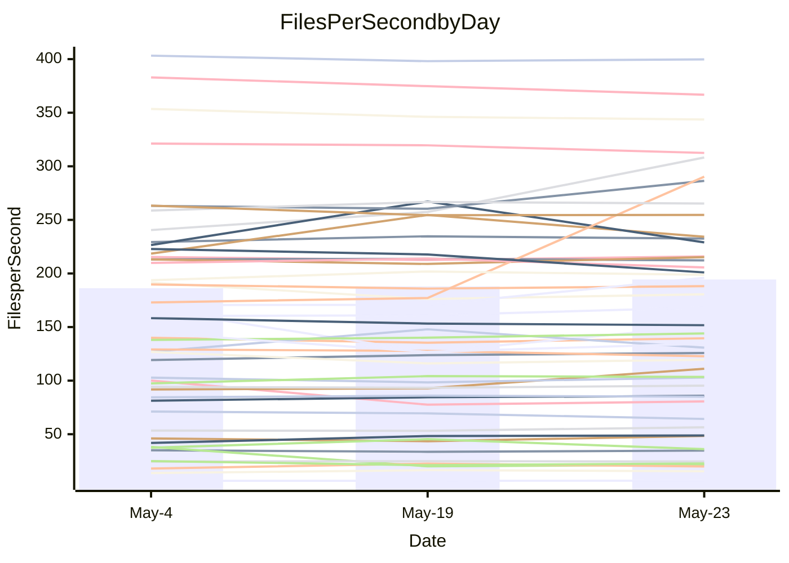

<!---
# This file is auto-generated. Do not edit.
# cspell:disable
--->
# Performance Report

Daily Performance

```mermaid
xychart-beta
    title Files Per Second by Day
    y-axis Files per Second
    x-axis Date [May-4, May-19, May-23]
    bar [186.25, 187.94, 194.38]
    line [35.07, 33.61, 34.69]
    line [140.01, 135.42, 139.50]
    line [53.38, 53.17, 56.48]
    line [38.18, 20.00, 21.53]
    line [46.04, 43.44, 48.37]
    line [71.11, 69.47, 64.25]
    line [100.08, 77.54, 80.59]
    line [81.26, 84.52, 85.73]
    line [191.37, 176.15, 180.59]
    line [166.55, 126.61, 150.87]
    line [119.17, 123.77, 125.73]
    line [17.95, 22.53, 19.87]
    line [24.56, 24.84, 24.48]
    line [24.93, 21.05, 22.73]
    line [91.75, 92.82, 111.10]
    line [102.79, 98.35, 102.96]
    line [382.99, 374.77, 366.83]
    line [158.32, 153.28, 151.73]
    line [13.72, 16.48, 15.39]
    line [6.46, 6.48, 6.70]
    line [229.32, 234.71, 232.57]
    line [189.78, 185.86, 188.16]
    line [240.52, 257.39, 308.24]
    line [37.38, 45.35, 36.07]
    line [218.55, 254.57, 234.26]
    line [127.00, 147.92, 130.77]
    line [215.39, 212.55, 215.84]
    line [226.51, 267.13, 229.05]
    line [353.58, 346.15, 343.69]
    line [160.29, 160.94, 168.26]
    line [213.17, 213.72, 212.23]
    line [129.13, 127.71, 122.71]
    line [94.12, 93.35, 95.34]
    line [138.03, 140.07, 144.01]
    line [213.15, 208.87, 215.23]
    line [84.38, 85.95, 85.08]
    line [321.24, 319.57, 312.48]
    line [41.81, 48.29, 48.86]
    line [126.81, 116.06, 119.43]
    line [144.52, 126.78, 134.48]
    line [263.11, 260.36, 286.42]
    line [172.93, 177.15, 290.28]
    line [258.73, 266.74, 265.26]
    line [97.37, 104.19, 103.43]
    line [263.28, 254.35, 254.61]
    line [403.25, 398.12, 399.78]
    line [209.84, 213.89, 205.67]
    line [222.86, 217.73, 200.96]
    line [193.68, 201.86, 198.76]
    line [170.59, 170.67, 195.94]
```

Time to Process Files

| Repository                                      | Elapsed | Min/Avg/Max          |    SD | SD Graph                |
| ----------------------------------------------- | ------: | :------------------: | ----: | ----------------------- |
| AdaDoom3/AdaDoom3                    |    2.86 | 2.2 /   2.5 /   2.8  |  0.27 | `    ┣━━┻━━╋━━●━━┫    ` |
| alexiosc/megistos                    |    7.05 | 6.7 /   6.8 /   6.9  |  0.09 | `    ┣━━┻━━╋━━┻━━┫ ●  ` |
| apollographql/apollo-server          |    2.50 | 2.5 /   2.5 /   2.6  |  0.07 | `     ┣━┻━●╋━━┻━┫     ` |
| aspnetboilerplate/aspnetboilerplate  |    8.89 | 8.7 /   8.9 /   9.2  |  0.19 | `    ┣━━┻━●╋━━┻━━┫    ` |
| aws-amplify/docs                     |   13.38 | 10.1 /  12.0 /  13.1 |  1.14 | `    ┣━━┻━━╋━━┻●━┫    ` |
| Azure/azure-rest-api-specs           |    9.29 | 9.3 /   9.5 /   9.6  |  0.12 | `    ┣━●┻━━╋━━┻━━┫    ` |
| bitjson/typescript-starter           |    1.01 | 0.8 /   1.0 /   1.1  |  0.11 | `     ┣━┻━━╋●━┻━┫     ` |
| caddyserver/caddy                    |    2.65 | 3.0 /   3.3 /   3.4  |  0.16 | `●    ┣━┻━━╋━━┻━┫     ` |
| canada-ca/open-source-logiciel-libre |    1.08 | 1.0 /   1.1 /   1.1  |  0.05 | `     ┣━┻━━╋●━┻━┫     ` |
| chef/chef                            |    4.89 | 4.7 /   4.9 /   4.9  |  0.10 | `     ┣━┻━━╋●━┻━┫     ` |
| dart-lang/sdk                        |   58.18 | 55.7 /  57.0 /  58.7 |  1.09 | `   ┣━━━┻━━╋━━┻●━━┫   ` |
| django/django                        |   14.08 | 13.4 /  13.8 /  14.2 |  0.30 | `    ┣━━┻━━╋━━●━━┫    ` |
| eslint/eslint                        |    9.78 | 9.5 /   9.7 /   9.9  |  0.15 | `    ┣━━┻━━╋●━┻━━┫    ` |
| exonum/exonum                        |    3.34 | 3.3 /   3.4 /   3.5  |  0.08 | `     ┣━●━━╋━━┻━┫     ` |
| flutter/samples                      |   12.88 | 11.7 /  12.7 /  13.6 |  0.72 | `    ┣━━┻━━╋●━┻━━┫    ` |
| gitbucket/gitbucket                  |    3.16 | 2.5 /   2.9 /   3.4  |  0.43 | `    ┣━━┻━━╋━●┻━━┫    ` |
| googleapis/google-cloud-cpp          |  121.90 | 95.0 / 115.7 / 123.3 | 11.96 | `  ┣━━━┻━━━╋━●━┻━━━┫  ` |
| graphql/express-graphql              |    1.13 | 1.0 /   1.2 /   1.3  |  0.09 | `     ┣━┻━●╋━━┻━┫     ` |
| graphql/graphql-js                   |    2.63 | 2.6 /   2.7 /   2.9  |  0.09 | `     ┣━┻●━╋━━┻━┫     ` |
| graphql/graphql-relay-js             |    1.12 | 1.1 /   1.1 /   1.2  |  0.03 | `     ┣━━●━╋━┻━━┫     ` |
| graphql/graphql-spec                 |    1.26 | 1.0 /   1.2 /   1.4  |  0.14 | `     ┣━┻━━●━━┻━┫     ` |
| iluwatar/java-design-patterns        |    7.10 | 11.5 /  11.7 /  11.9 |  0.15 | `●        ┣┻┫         ` |
| ktaranov/sqlserver-kit               |    5.73 | 5.7 /   5.8 /   6.0  |  0.14 | `    ┣━━┻●━╋━━┻━━┫    ` |
| liriliri/licia                       |    3.74 | 3.8 /   3.9 /   4.1  |  0.14 | `    ┣━━●━━╋━━┻━━┫    ` |
| MartinThoma/LaTeX-examples           |    5.97 | 5.9 /   6.1 /   6.1  |  0.11 | `    ┣━━●━━╋━━┻━━┫    ` |
| mdx-js/mdx                           |    1.69 | 1.4 /   1.7 /   1.9  |  0.19 | `     ┣━┻━━●━━┻━┫     ` |
| microsoft/TypeScript-Website         |    5.24 | 5.3 /   5.5 /   5.6  |  0.11 | `    ●━━┻━━╋━━┻━━┫    ` |
| MicrosoftDocs/PowerShell-Docs        |   25.26 | 24.0 /  24.7 /  25.7 |  0.68 | `    ┣━━┻━━╋━━●━━┫    ` |
| neovim/nvim-lspconfig                |    5.10 | 5.1 /   5.3 /   5.4  |  0.11 | `    ┣━●┻━━╋━━┻━━┫    ` |
| pagekit/pagekit                      |    3.36 | 3.4 /   3.5 /   3.6  |  0.06 | `     ●━┻━━╋━━┻━┫     ` |
| php/php-src                          |   24.25 | 23.6 /  24.3 /  25.6 |  0.79 | `   ┣━━━┻━━●━━┻━━━┫   ` |
| plasticrake/tplink-smarthome-api     |    1.28 | 1.3 /   1.3 /   1.5  |  0.09 | `     ┣━┻━●╋━━┻━┫     ` |
| prettier/prettier                    |    7.64 | 7.6 /   7.7 /   7.9  |  0.13 | `    ┣━━┻●━╋━━┻━━┫    ` |
| pycontribs/jira                      |    1.42 | 1.4 /   1.5 /   1.6  |  0.07 | `     ┣━┻●━╋━━┻━┫     ` |
| RustPython/RustPython                |    6.69 | 6.2 /   6.5 /   6.7  |  0.22 | `    ┣━━┻━━╋━━●━━┫    ` |
| shoelace-style/shoelace              |    2.79 | 2.8 /   2.9 /   3.0  |  0.11 | `     ┣━┻●━╋━━┻━┫     ` |
| slint-ui/slint                       |   13.29 | 11.3 /  13.1 /  13.8 |  1.04 | `    ┣━━┻━━╋●━┻━━┫    ` |
| SoftwareBrothers/admin-bro           |    2.53 | 2.3 /   2.4 /   2.6  |  0.10 | `     ┣━┻━━╋━━●━┫     ` |
| sveltejs/svelte                      |   21.64 | 21.6 /  22.0 /  22.5 |  0.38 | `    ┣━━●━━╋━━┻━━┫    ` |
| TheAlgorithms/Python                 |    4.34 | 5.2 /   5.5 /   5.7  |  0.18 | `●      ┣┻━╋━┻┫       ` |
| twbs/bootstrap                       |    1.74 | 1.7 /   1.7 /   1.9  |  0.11 | `     ┣━┻━━●━━┻━┫     ` |
| typescript-cheatsheets/react         |    1.09 | 1.1 /   1.2 /   1.4  |  0.10 | `     ┣━●━━╋━━┻━┫     ` |
| typescript-eslint/typescript-eslint  |    3.92 | 4.0 /   4.2 /   4.6  |  0.23 | `    ┣━●┻━━╋━━┻━━┫    ` |
| vitest-dev/vitest                    |    7.66 | 10.1 /  10.5 /  11.1 |  0.35 | `●      ┣━┻╋┻━┫       ` |
| w3c/aria-practices                   |    3.16 | 2.5 /   3.0 /   3.3  |  0.32 | `    ┣━━┻━━╋●━┻━━┫    ` |
| w3c/specberus                        |    1.81 | 1.8 /   1.9 /   2.0  |  0.08 | `     ┣●┻━━╋━━┻━┫     ` |
| webdeveric/webpack-assets-manifest   |    1.11 | 1.2 /   1.2 /   1.4  |  0.08 | `     ┣━●━━╋━━┻━┫     ` |
| webpack/webpack                      |    5.82 | 5.2 /   5.3 /   5.4  |  0.08 | `       ┣┻━╋━┻┫      ●` |
| wireapp/wire-desktop                 |    1.26 | 1.3 /   1.3 /   1.4  |  0.06 | `     ┣━●━━╋━━┻━┫     ` |
| wireapp/wire-webapp                  |   11.84 | 11.7 /  11.9 /  12.2 |  0.16 | `    ┣━━┻●━╋━━┻━━┫    ` |

Note:
- Elapsed time is in seconds.

Files per Second over Time

| Repository                                      | Files |    Sec |    Fps |     Rel | Trend Fps |    N |
| ----------------------------------------------- | ----: | -----: | -----: | ------: | --------- | ---: |
| AdaDoom3/AdaDoom3                    |   103 |   2.86 |  35.97 | -12.41% | `▃▇█▂▂`   |    4 |
| alexiosc/megistos                    |   583 |   7.05 |  82.73 |  -3.72% | `▆▇▇█▅`   |    4 |
| apollographql/apollo-server          |   255 |   2.50 | 102.09 |   1.24% | `█▆▅█▇`   |    4 |
| aspnetboilerplate/aspnetboilerplate  |  2286 |   8.89 | 257.12 |   0.43% | `█▅▇▆▇`   |    4 |
| aws-amplify/docs                     |  2959 |  13.38 | 221.22 | -11.31% | `▂▄█▃▂`   |    4 |
| Azure/azure-rest-api-specs           |  2497 |   9.29 | 268.80 |   2.01% | `▆█▇▇█`   |    4 |
| bitjson/typescript-starter           |    20 |   1.01 |  19.79 |  -4.59% | `▂█▄▄▄`   |    4 |
| caddyserver/caddy                    |   313 |   2.65 | 117.95 |  23.62% | `▂▃▃▅█`   |    4 |
| canada-ca/open-source-logiciel-libre |     7 |   1.08 |   6.45 |  -2.16% | `▆▄██▆`   |    4 |
| chef/chef                            |  1032 |   4.89 | 211.12 |  -0.68% | `▇▆▆█▆`   |    4 |
| dart-lang/sdk                        | 11396 |  58.18 | 195.87 |  -1.95% | `▅▇█▇▆`   |    4 |
| django/django                        |  2912 |  14.08 | 206.83 |  -1.76% | `▆█▇▅▆`   |    4 |
| eslint/eslint                        |  2072 |   9.78 | 211.94 |  -0.63% | `▇█▆▇▇`   |    4 |
| exonum/exonum                        |   421 |   3.34 | 126.08 |   2.49% | `▅▆███`   |    4 |
| flutter/samples                      |  1695 |  12.88 | 131.60 |  -1.69% | `█▄▃▆▅`   |    4 |
| gitbucket/gitbucket                  |   417 |   3.16 | 132.17 | -10.30% | `█▃▂█▃`   |    4 |
| googleapis/google-cloud-cpp          | 20926 | 121.90 | 171.67 |  -6.21% | `▃▂▃█▃`   |    4 |
| graphql/express-graphql              |    26 |   1.13 |  22.97 |   2.66% | `█▅▃▅▆`   |    4 |
| graphql/graphql-js                   |   371 |   2.63 | 140.98 |   2.74% | `██▅▇█`   |    4 |
| graphql/graphql-relay-js             |    28 |   1.12 |  25.05 |   2.09% | `▆▆█▅▇`   |    4 |
| graphql/graphql-spec                 |    19 |   1.26 |  15.10 |  -3.18% | `▂▃█▅▄`   |    4 |
| iluwatar/java-design-patterns        |  2061 |   7.10 | 290.28 |  65.17% | `▁▂▂█`    |    3 |
| ktaranov/sqlserver-kit               |   490 |   5.73 |  85.51 |   1.73% | `▅█▆██`   |    4 |
| liriliri/licia                       |  1438 |   3.74 | 384.00 |   3.63% | `█▆█▄█`   |    4 |
| MartinThoma/LaTeX-examples           |  1409 |   5.97 | 235.95 |   1.71% | `▆▆█▆▇`   |    4 |
| mdx-js/mdx                           |   140 |   1.69 |  82.84 |  -0.65% | `█▂▄▃▄`   |    4 |
| microsoft/TypeScript-Website         |   765 |   5.24 | 146.08 |   4.32% | `▅▇▅▇█`   |    4 |
| MicrosoftDocs/PowerShell-Docs        |  3126 |  25.26 | 123.77 |  -2.19% | `█▆█▅▆`   |    4 |
| neovim/nvim-lspconfig                |   857 |   5.10 | 168.00 |   3.28% | `▆▅▆██`   |    4 |
| pagekit/pagekit                      |   741 |   3.36 | 220.31 |   3.45% | `▇▅▇▆█`   |    4 |
| php/php-src                          |  2290 |  24.25 |  94.44 |   0.19% | `▇▅██▇`   |    4 |
| plasticrake/tplink-smarthome-api     |    62 |   1.28 |  48.55 |   3.54% | `▃▇███`   |    4 |
| prettier/prettier                    |  2674 |   7.64 | 349.82 |   1.15% | `█▇▇▆█`   |    4 |
| pycontribs/jira                      |    80 |   1.42 |  56.39 |   4.27% | `▆▄███`   |    4 |
| RustPython/RustPython                |   779 |   6.69 | 116.36 |  -3.32% | `█▄▅▇▅`   |    4 |
| shoelace-style/shoelace              |   440 |   2.79 | 157.78 |   3.37% | `██▅▄█`   |    4 |
| slint-ui/slint                       |  3164 |  13.29 | 237.99 |  -0.65% | `▂█▃▄▄`   |    4 |
| SoftwareBrothers/admin-bro           |   441 |   2.53 | 174.52 |  -4.41% | `█▆▄▇▅`   |    4 |
| sveltejs/svelte                      |  8784 |  21.64 | 405.97 |   1.93% | `██▆▆█`   |    4 |
| TheAlgorithms/Python                 |  1407 |   4.34 | 324.41 |  25.71% | `▃▄▃▂█`   |    4 |
| twbs/bootstrap                       |   118 |   1.74 |  67.64 |  -0.14% | `██▇▃▆`   |    4 |
| typescript-cheatsheets/react         |    24 |   1.09 |  21.93 | -11.68% | `█▂▁▂▂`   |    4 |
| typescript-eslint/typescript-eslint  |  1322 |   3.92 | 337.20 |   8.06% | `▇▅█▃█`   |    4 |
| vitest-dev/vitest                    |  2685 |   7.66 | 350.52 |  37.29% | `▂▃▃▃█`   |    4 |
| w3c/aria-practices                   |   414 |   3.16 | 130.98 |  -5.33% | `▂▃█▃▃`   |    4 |
| w3c/specberus                        |   196 |   1.81 | 108.11 |   6.90% | `▄█▅▅█`   |    4 |
| webdeveric/webpack-assets-manifest   |    55 |   1.11 |  49.35 |   9.46% | `▆▇▃▇█`   |    4 |
| webpack/webpack                      |  1169 |   5.82 | 200.96 |  -8.42% | `█▆▇▂`    |    3 |
| wireapp/wire-desktop                 |    45 |   1.26 |  35.64 |   4.78% | `██▄▆█`   |    4 |
| wireapp/wire-webapp                  |  2236 |  11.84 | 188.87 |   0.87% | `██▆▇█`   |    4 |

Data Throughput

| Repository                                      | Files |    Sec |     Kps |     Rel | Trend Kps |    N |
| ----------------------------------------------- | ----: | -----: | ------: | ------: | --------- | ---: |
| AdaDoom3/AdaDoom3                    |   103 |   2.86 |  764.40 | -12.41% | `▃▇█▂▂`   |    4 |
| alexiosc/megistos                    |   583 |   7.05 |  650.10 |  -3.72% | `▆▇▇█▅`   |    4 |
| apollographql/apollo-server          |   255 |   2.50 |  843.53 |   1.26% | `█▆▅█▇`   |    4 |
| aspnetboilerplate/aspnetboilerplate  |  2286 |   8.89 |  625.58 |   0.43% | `█▅▇▆▇`   |    4 |
| aws-amplify/docs                     |  2959 |  13.38 |  799.94 | -11.28% | `▂▄█▃▂`   |    4 |
| Azure/azure-rest-api-specs           |  2497 |   9.29 |  804.77 |   2.08% | `▆█▇▇█`   |    4 |
| bitjson/typescript-starter           |    20 |   1.01 |   79.15 |  -4.59% | `▂█▄▄▄`   |    4 |
| caddyserver/caddy                    |   313 |   2.65 | 1054.38 |  23.58% | `▂▃▃▅█`   |    4 |
| canada-ca/open-source-logiciel-libre |     7 |   1.08 |   53.46 |  -2.16% | `▆▄██▆`   |    4 |
| chef/chef                            |  1032 |   4.89 | 1033.71 |  -0.61% | `▆▆▆█▆`   |    4 |
| dart-lang/sdk                        | 11396 |  58.18 | 1338.82 |  -1.93% | `▅▇█▇▆`   |    4 |
| django/django                        |  2912 |  14.08 | 1326.35 |  -1.59% | `▆█▇▅▆`   |    4 |
| eslint/eslint                        |  2072 |   9.78 | 1474.38 |  -0.63% | `▇█▆▇▇`   |    4 |
| exonum/exonum                        |   421 |   3.34 | 1206.03 |   2.49% | `▅▆███`   |    4 |
| flutter/samples                      |  1695 |  12.88 |  787.63 |  -1.69% | `█▄▃▆▅`   |    4 |
| gitbucket/gitbucket                  |   417 |   3.16 |  630.09 |  -9.61% | `▇▃▂█▃`   |    4 |
| googleapis/google-cloud-cpp          | 20926 | 121.90 | 1465.14 |  -6.21% | `▃▂▃█▃`   |    4 |
| graphql/express-graphql              |    26 |   1.13 |  105.15 |   2.66% | `█▅▃▅▆`   |    4 |
| graphql/graphql-js                   |   371 |   2.63 |  835.25 |   2.74% | `██▅▇█`   |    4 |
| graphql/graphql-relay-js             |    28 |   1.12 |   98.41 |   2.09% | `▆▆█▅▇`   |    4 |
| graphql/graphql-spec                 |    19 |   1.26 |  503.73 |  -3.18% | `▂▃█▅▄`   |    4 |
| iluwatar/java-design-patterns        |  2061 |   7.10 |  894.79 |  65.17% | `▁▂▂█`    |    3 |
| ktaranov/sqlserver-kit               |   490 |   5.73 | 1295.43 |   1.73% | `▅█▆██`   |    4 |
| liriliri/licia                       |  1438 |   3.74 |  458.23 |   3.67% | `█▆█▄█`   |    4 |
| MartinThoma/LaTeX-examples           |  1409 |   5.97 |  487.31 |   1.71% | `▆▆█▆▇`   |    4 |
| mdx-js/mdx                           |   140 |   1.69 |  387.55 |  -0.69% | `█▂▄▃▄`   |    4 |
| microsoft/TypeScript-Website         |   765 |   5.24 | 1006.13 |   4.32% | `▅▇▅▇█`   |    4 |
| MicrosoftDocs/PowerShell-Docs        |  3126 |  25.26 | 1318.89 |  -2.22% | `█▆█▅▆`   |    4 |
| neovim/nvim-lspconfig                |   857 |   5.10 |  492.44 |   3.39% | `▅▅▆██`   |    4 |
| pagekit/pagekit                      |   741 |   3.36 |  459.35 |   3.45% | `▇▅▇▆█`   |    4 |
| php/php-src                          |  2290 |  24.25 | 1661.04 |   0.21% | `▇▅██▇`   |    4 |
| plasticrake/tplink-smarthome-api     |    62 |   1.28 |  262.34 |   3.54% | `▃▇███`   |    4 |
| prettier/prettier                    |  2674 |   7.64 |  480.39 |   1.15% | `█▇▇▆█`   |    4 |
| pycontribs/jira                      |    80 |   1.42 |  398.22 |   4.27% | `▆▄███`   |    4 |
| RustPython/RustPython                |   779 |   6.69 | 1981.98 |  -1.69% | `▇▅▆█▆`   |    4 |
| shoelace-style/shoelace              |   440 |   2.79 |  762.02 |   3.39% | `██▅▄█`   |    4 |
| slint-ui/slint                       |  3164 |  13.29 | 1243.05 |  -4.87% | `▆█▃▃▄`   |    4 |
| SoftwareBrothers/admin-bro           |   441 |   2.53 |  384.66 |  -4.41% | `█▆▄▇▅`   |    4 |
| sveltejs/svelte                      |  8784 |  21.64 |  275.45 |   1.93% | `██▆▆█`   |    4 |
| TheAlgorithms/Python                 |  1407 |   4.34 |  828.44 |  25.71% | `▃▄▃▂█`   |    4 |
| twbs/bootstrap                       |   118 |   1.74 |  555.43 |  -0.14% | `██▇▃▆`   |    4 |
| typescript-cheatsheets/react         |    24 |   1.09 |  197.34 |  -5.27% | `█▃▂▃▃`   |    4 |
| typescript-eslint/typescript-eslint  |  1322 |   3.92 | 1825.25 |   8.09% | `▇▅█▃█`   |    4 |
| vitest-dev/vitest                    |  2685 |   7.66 |  906.65 |  30.50% | `▅▂▂▃█`   |    4 |
| w3c/aria-practices                   |   414 |   3.16 | 1223.76 |  -5.33% | `▂▃█▃▃`   |    4 |
| w3c/specberus                        |   196 |   1.81 |  352.45 |   6.79% | `▄█▅▅█`   |    4 |
| webdeveric/webpack-assets-manifest   |    55 |   1.11 |  113.05 |   9.46% | `▆▇▃▇█`   |    4 |
| webpack/webpack                      |  1169 |   5.82 | 1011.35 |  -7.42% | `▇██▃`    |    3 |
| wireapp/wire-desktop                 |    45 |   1.26 |  156.80 |   4.78% | `██▄▆█`   |    4 |
| wireapp/wire-webapp                  |  2236 |  11.84 |  789.10 |   1.24% | `██▆██`   |    4 |

