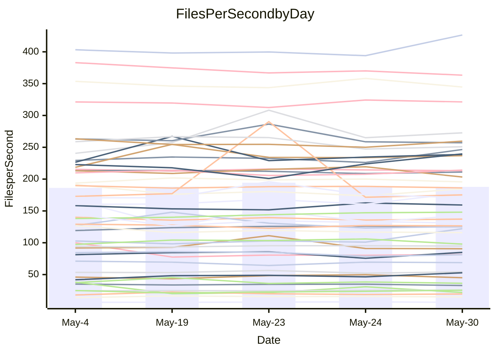

<!---
# This file is auto-generated. Do not edit.
# cspell:disable
--->
# Performance Report

Daily Performance

```mermaid
xychart-beta
    title Files Per Second by Day
    y-axis Files per Second
    x-axis Date [May-4, May-19, May-23, May-24, May-30]
    bar [186.25, 187.94, 194.38, 187.53, 187.84]
    line [35.07, 33.61, 34.69, 34.94, 32.78]
    line [140.01, 135.42, 139.50, 135.65, 137.15]
    line [53.38, 53.17, 56.48, 52.20, 54.24]
    line [38.18, 20.00, 21.53, 30.85, 21.86]
    line [46.04, 43.44, 48.37, 49.79, 45.03]
    line [71.11, 69.47, 64.25, 69.53, 68.78]
    line [100.08, 77.54, 80.59, 80.29, 81.53]
    line [81.26, 84.52, 85.73, 75.59, 84.88]
    line [191.37, 176.15, 180.59, 173.73, 184.72]
    line [166.55, 126.61, 150.87, 133.44, 130.84]
    line [119.17, 123.77, 125.73, 125.94, 125.35]
    line [17.95, 22.53, 19.87, 18.72, 19.42]
    line [24.56, 24.84, 24.48, 25.27, 25.51]
    line [24.93, 21.05, 22.73, 23.64, 25.47]
    line [91.75, 92.82, 111.10, 90.94, 90.56]
    line [102.79, 98.35, 102.96, 100.96, 122.12]
    line [382.99, 374.77, 366.83, 370.08, 363.31]
    line [158.32, 153.28, 151.73, 162.52, 159.30]
    line [13.72, 16.48, 15.39, 15.58, 14.86]
    line [6.46, 6.48, 6.70, 7.10, 6.34]
    line [229.32, 234.71, 232.57, 226.13, 246.49]
    line [189.78, 185.86, 188.16, 188.58, 186.13]
    line [240.52, 257.39, 308.24, 265.00, 272.73]
    line [37.38, 45.35, 36.07, 38.42, 36.32]
    line [218.55, 254.57, 234.26, 233.79, 236.78]
    line [127.00, 147.92, 130.77, 123.22, 125.33]
    line [215.39, 212.55, 215.84, 214.38, 213.29]
    line [226.51, 267.13, 229.05, 234.58, 238.79]
    line [353.58, 346.15, 343.69, 358.26, 344.65]
    line [160.29, 160.94, 168.26, 160.60, 178.51]
    line [213.17, 213.72, 212.23, 208.69, 211.05]
    line [129.13, 127.71, 122.71, 127.15, 126.61]
    line [94.12, 93.35, 95.34, 95.32, 94.79]
    line [138.03, 140.07, 144.01, 147.15, 148.03]
    line [213.15, 208.87, 215.23, 219.43, 203.27]
    line [84.38, 85.95, 85.08, 78.77, 81.14]
    line [321.24, 319.57, 312.48, 324.31, 321.30]
    line [41.81, 48.29, 48.86, 46.46, 52.80]
    line [126.81, 116.06, 119.43, 116.84, 115.92]
    line [144.52, 126.78, 134.48, 131.99, 142.83]
    line [263.11, 260.36, 286.42, 258.60, 257.18]
    line [172.93, 177.15, 290.28, 171.42, 175.26]
    line [258.73, 266.74, 265.26, 247.18, 250.86]
    line [97.37, 104.19, 103.43, 105.92, 97.87]
    line [263.28, 254.35, 254.61, 250.00, 259.58]
    line [403.25, 398.12, 399.78, 393.93, 426.44]
    line [209.84, 213.89, 205.67, 207.63, 214.21]
    line [222.86, 217.73, 200.96, 223.84, 239.63]
    line [193.68, 201.86, 198.76, 200.08, 195.61]
    line [170.59, 170.67, 195.94, 175.36, 171.10]
```

Time to Process Files

| Repository                                      | Elapsed | Min/Avg/Max          |   SD | SD Graph                |
| ----------------------------------------------- | ------: | :------------------: | ---: | ----------------------- |
| AdaDoom3/AdaDoom3                    |    2.88 | 2.2 /   2.7 /   2.9  | 0.22 | `    ┣━━┻━━╋━●┻━━┫    ` |
| alexiosc/megistos                    |    7.06 | 6.7 /   7.1 /   7.9  | 0.37 | `    ┣━━┻━━●━━┻━━┫    ` |
| apollographql/apollo-server          |    2.42 | 1.4 /   2.4 /   2.6  | 0.33 | `    ┣━━┻━━●━━┻━━┫    ` |
| aspnetboilerplate/aspnetboilerplate  |    8.82 | 8.7 /   8.9 /   9.3  | 0.20 | `    ┣━━┻●━╋━━┻━━┫    ` |
| aws-amplify/docs                     |   12.50 | 10.1 /  12.4 /  13.4 | 0.84 | `    ┣━━┻━━╋●━┻━━┫    ` |
| Azure/azure-rest-api-specs           |   10.22 | 9.1 /   9.7 /  10.8  | 0.55 | `    ┣━━┻━━╋━━●━━┫    ` |
| bitjson/typescript-starter           |    1.07 | 0.8 /   1.0 /   1.1  | 0.08 | `     ┣━┻━━╋━●┻━┫     ` |
| caddyserver/caddy                    |    3.44 | 2.7 /   3.3 /   3.7  | 0.28 | `    ┣━━┻━━╋●━┻━━┫    ` |
| canada-ca/open-source-logiciel-libre |    1.01 | 0.9 /   1.1 /   1.2  | 0.08 | `     ┣━┻●━╋━━┻━┫     ` |
| chef/chef                            |    4.77 | 4.6 /   4.9 /   5.3  | 0.20 | `    ┣━━┻●━╋━━┻━━┫    ` |
| dart-lang/sdk                        |   57.38 | 55.5 /  57.6 /  59.4 | 1.27 | `   ┣━━┻━━●╋━━━┻━━┫   ` |
| django/django                        |   13.28 | 13.4 /  13.9 /  14.2 | 0.25 | `   ●┣━━┻━━╋━━┻━━┫    ` |
| eslint/eslint                        |    9.71 | 9.5 /   9.8 /  10.3  | 0.22 | `    ┣━━┻━●╋━━┻━━┫    ` |
| exonum/exonum                        |    3.41 | 3.3 /   3.4 /   3.5  | 0.07 | `     ┣━┻━━╋●━┻━┫     ` |
| flutter/samples                      |   13.00 | 11.3 /  12.4 /  13.6 | 0.74 | `    ┣━━┻━━╋━━●━━┫    ` |
| gitbucket/gitbucket                  |    3.10 | 2.5 /   3.1 /   3.4  | 0.31 | `    ┣━━┻━━●━━┻━━┫    ` |
| googleapis/google-cloud-cpp          |  121.46 | 95.0 / 119.1 / 125.2 | 8.28 | `  ┣━━━┻━━━╋●━━┻━━━┫  ` |
| graphql/express-graphql              |    1.04 | 0.9 /   1.1 /   1.3  | 0.10 | `     ┣━┻●━╋━━┻━┫     ` |
| graphql/graphql-js                   |    2.67 | 2.6 /   2.7 /   2.9  | 0.11 | `     ┣━┻━●╋━━┻━┫     ` |
| graphql/graphql-relay-js             |    1.11 | 1.1 /   1.1 /   1.2  | 0.04 | `     ┣━┻━●╋━━┻━┫     ` |
| graphql/graphql-spec                 |    1.22 | 1.0 /   1.3 /   1.4  | 0.10 | `     ┣━┻━●╋━━┻━┫     ` |
| iluwatar/java-design-patterns        |   11.59 | 7.1 /  11.3 /  12.1  | 1.50 | `   ┣━━━┻━━╋●━┻━━━┫   ` |
| ktaranov/sqlserver-kit               |    5.64 | 5.5 /   6.0 /   7.5  | 0.55 | `    ┣━━┻●━╋━━┻━━┫    ` |
| liriliri/licia                       |    3.77 | 3.7 /   3.9 /   4.1  | 0.13 | `    ┣━━●━━╋━━┻━━┫    ` |
| MartinThoma/LaTeX-examples           |    6.10 | 4.7 /   6.0 /   6.5  | 0.46 | `    ┣━━┻━━╋●━┻━━┫    ` |
| mdx-js/mdx                           |    1.72 | 1.4 /   1.7 /   1.9  | 0.12 | `     ┣━┻━━●━━┻━┫     ` |
| microsoft/TypeScript-Website         |    5.06 | 5.0 /   5.3 /   5.6  | 0.19 | `    ┣━●┻━━╋━━┻━━┫    ` |
| MicrosoftDocs/PowerShell-Docs        |   24.94 | 23.6 /  24.7 /  25.8 | 0.72 | `   ┣━━━┻━━╋●━┻━━━┫   ` |
| neovim/nvim-lspconfig                |    5.21 | 4.0 /   5.1 /   5.6  | 0.41 | `    ┣━━┻━━╋●━┻━━┫    ` |
| pagekit/pagekit                      |    3.45 | 3.3 /   3.5 /   3.6  | 0.08 | `     ┣━┻━━●━━┻━┫     ` |
| php/php-src                          |   24.67 | 23.6 /  24.2 /  25.6 | 0.54 | `   ┣━━━┻━━╋━━●━━━┫   ` |
| plasticrake/tplink-smarthome-api     |    1.26 | 1.0 /   1.3 /   1.5  | 0.12 | `     ┣━┻━━●━━┻━┫     ` |
| prettier/prettier                    |    8.26 | 7.4 /   7.6 /   7.9  | 0.18 | `    ┣━━┻━━╋━━┻━━┫   ●` |
| pycontribs/jira                      |    1.61 | 1.4 /   1.5 /   1.6  | 0.07 | `     ┣━┻━━╋━━┻━●     ` |
| RustPython/RustPython                |    6.40 | 6.2 /   6.7 /   6.9  | 0.20 | `    ┣━●┻━━╋━━┻━━┫    ` |
| shoelace-style/shoelace              |    2.81 | 2.7 /   2.8 /   3.0  | 0.10 | `     ┣━┻━━●━━┻━┫     ` |
| slint-ui/slint                       |   13.07 | 11.3 /  13.3 /  13.9 | 0.70 | `    ┣━━┻━●╋━━┻━━┫    ` |
| SoftwareBrothers/admin-bro           |    2.62 | 2.3 /   2.4 /   2.6  | 0.11 | `     ┣━┻━━╋━━┻━●     ` |
| sveltejs/svelte                      |   22.69 | 17.1 /  21.5 /  22.8 | 1.52 | `   ┣━━━┻━━╋━━●━━━┫   ` |
| TheAlgorithms/Python                 |    5.46 | 4.3 /   5.3 /   5.7  | 0.37 | `    ┣━━┻━━╋●━┻━━┫    ` |
| twbs/bootstrap                       |    1.77 | 1.7 /   1.7 /   1.9  | 0.07 | `     ┣━┻━━╋━●┻━┫     ` |
| typescript-cheatsheets/react         |    1.13 | 0.7 /   1.1 /   1.4  | 0.18 | `     ┣━┻━━╋●━┻━┫     ` |
| typescript-eslint/typescript-eslint  |    4.29 | 3.9 /   4.1 /   4.6  | 0.19 | `    ┣━━┻━━╋━●┻━━┫    ` |
| vitest-dev/vitest                    |   10.07 | 7.7 /   9.9 /  11.1  | 0.85 | `    ┣━━┻━━╋●━┻━━┫    ` |
| w3c/aria-practices                   |    3.38 | 2.5 /   3.2 /   3.4  | 0.25 | `    ┣━━┻━━╋━●┻━━┫    ` |
| w3c/specberus                        |    2.02 | 1.8 /   1.9 /   2.2  | 0.12 | `     ┣━┻━━╋━●┻━┫     ` |
| webdeveric/webpack-assets-manifest   |    1.22 | 1.0 /   1.2 /   1.4  | 0.08 | `     ┣━┻━━╋●━┻━┫     ` |
| webpack/webpack                      |    5.16 | 4.2 /   5.2 /   5.8  | 0.41 | `    ┣━━┻━━●━━┻━━┫    ` |
| wireapp/wire-desktop                 |    1.53 | 1.3 /   1.3 /   1.4  | 0.05 | `     ┣━━┻━╋━┻━━┫    ●` |
| wireapp/wire-webapp                  |   11.99 | 11.7 /  11.9 /  12.2 | 0.13 | `    ┣━━┻━━╋●━┻━━┫    ` |

Note:
- Elapsed time is in seconds.

Files per Second over Time

| Repository                                      | Files |    Sec |    Fps |     Rel | Trend Fps     |    N |
| ----------------------------------------------- | ----: | -----: | -----: | ------: | ------------- | ---: |
| AdaDoom3/AdaDoom3                    |   103 |   2.88 |  35.74 |  -7.55% | `▃▇█▃▃▅▃▃▂▃▃` |   10 |
| alexiosc/megistos                    |   583 |   7.06 |  82.57 |  -0.04% | `▇█▇█▆▇▃▆▇▄▆` |   10 |
| apollographql/apollo-server          |   255 |   2.42 | 105.25 |  -3.49% | `▂▁▁▂▂▂▁▂█▂▂` |   10 |
| aspnetboilerplate/aspnetboilerplate  |  2286 |   8.82 | 259.07 |   1.18% | `█▅▇▆▇▅▆▆▇█▇` |   10 |
| aws-amplify/docs                     |  2959 |  12.50 | 236.63 |  -1.67% | `▃▄█▄▂▄▃▄▄▃▄` |   10 |
| Azure/azure-rest-api-specs           |  2497 |  10.22 | 244.33 |  -5.16% | `▆▇▇▇█▃▇▃█▆▅` |   10 |
| bitjson/typescript-starter           |    20 |   1.07 |  18.62 |  -6.53% | `▂█▄▄▄▄▂▄▃▄▃` |   10 |
| caddyserver/caddy                    |   313 |   3.44 |  90.95 |  -4.54% | `▃▄▄▆█▃▃▃▄▂▃` |   10 |
| canada-ca/open-source-logiciel-libre |     7 |   1.01 |   6.92 |   5.72% | `▄▃▆▆▄█▅▂▅▃▆` |   10 |
| chef/chef                            |  1032 |   4.77 | 216.37 |   3.19% | `▇▆▆█▆▇█▅▄▄▇` |   10 |
| dart-lang/sdk                        | 11396 |  57.38 | 198.60 |   0.36% | `▅▇█▇▆▆█▆▅▆▇` |   10 |
| django/django                        |  2912 |  13.28 | 219.21 |   4.29% | `▆█▆▅▅▅▆▇▆▇█` |   10 |
| eslint/eslint                        |  2072 |   9.71 | 213.29 |   0.92% | `▇█▆▇▇▇▆█▇▅▇` |   10 |
| exonum/exonum                        |   421 |   3.41 | 123.35 |  -1.17% | `▅▆▇▇▇█▇▇█▆▆` |   10 |
| flutter/samples                      |  1695 |  13.00 | 130.38 |  -4.96% | `▇▄▃▆▄▅▄█▇█▄` |   10 |
| gitbucket/gitbucket                  |   417 |   3.10 | 134.55 |  -2.31% | `█▃▂█▃▄▃▃▃▃▄` |   10 |
| googleapis/google-cloud-cpp          | 20926 | 121.46 | 172.29 |  -2.47% | `▃▃▃█▃▃▃▂▃▃▃` |   10 |
| graphql/express-graphql              |    26 |   1.04 |  24.98 |   5.53% | `▅▃▂▃▄▄▄▄█▄▅` |   10 |
| graphql/graphql-js                   |   371 |   2.67 | 139.17 |   1.54% | `██▅▇██▅▄██▇` |   10 |
| graphql/graphql-relay-js             |    28 |   1.11 |  25.31 |   1.07% | `▅▅▆▄▆▄█▅▇▇▆` |   10 |
| graphql/graphql-spec                 |    19 |   1.22 |  15.63 |   2.51% | `▂▃█▅▄▄▅▃▃▄▄` |   10 |
| iluwatar/java-design-patterns        |  2061 |  11.59 | 177.87 |  -4.91% | `▂▂▂█▁▂▂▂▂▂`  |    9 |
| ktaranov/sqlserver-kit               |   490 |   5.64 |  86.81 |   5.15% | `▆▇▇▇▇▂▇▅███` |   10 |
| liriliri/licia                       |  1438 |   3.77 | 380.93 |   3.55% | `█▆█▄█▆▇▆▄▆█` |   10 |
| MartinThoma/LaTeX-examples           |  1409 |   6.10 | 231.10 |  -2.53% | `▃▃▄▃▃▃▂█▃▃▃` |   10 |
| mdx-js/mdx                           |   140 |   1.72 |  81.28 |  -1.09% | `█▂▄▃▄▄▄▄▄▄▄` |   10 |
| microsoft/TypeScript-Website         |   765 |   5.06 | 151.17 |   4.87% | `▄▅▄▅▆▅█▆▆▇▇` |   10 |
| MicrosoftDocs/PowerShell-Docs        |  3126 |  24.94 | 125.34 |  -0.95% | `▇▆▇▅▅▇▅▄▇█▆` |   10 |
| neovim/nvim-lspconfig                |   857 |   5.21 | 164.45 |  -2.66% | `▃▃▃▃▃▂▃▃█▄▃` |   10 |
| pagekit/pagekit                      |   741 |   3.45 | 214.51 |   0.26% | `▆▅▇▆█▆▆▅▅█▆` |   10 |
| php/php-src                          |  2290 |  24.67 |  92.84 |  -2.11% | `▇▅██▇▇▇▇▇█▆` |   10 |
| plasticrake/tplink-smarthome-api     |    62 |   1.26 |  49.36 |   0.55% | `▂▄▄▄▄▅▂█▅▅▄` |   10 |
| prettier/prettier                    |  2674 |   8.26 | 323.65 |  -7.65% | `▇▆▆▅▆▇██▅▇▃` |   10 |
| pycontribs/jira                      |    80 |   1.61 |  49.56 |  -8.99% | `▅▃▇▇▇▅▅▇▅█▃` |   10 |
| RustPython/RustPython                |   779 |   6.40 | 121.76 |   3.76% | `█▅▅▇▅▅▅▄▅▄▇` |   10 |
| shoelace-style/shoelace              |   440 |   2.81 | 156.70 |  -0.44% | `▇▇▄▄▇██▇██▇` |   10 |
| slint-ui/slint                       |  3164 |  13.07 | 242.06 |   2.19% | `▂█▃▄▄▄▄▃▄▄▅` |   10 |
| SoftwareBrothers/admin-bro           |   441 |   2.62 | 168.10 |  -7.80% | `█▆▄▇▅▄▄▇█▇▃` |   10 |
| sveltejs/svelte                      |  8784 |  22.69 | 387.06 |  -5.72% | `▃▃▂▃▃▃▂▃█▃▂` |   10 |
| TheAlgorithms/Python                 |  1407 |   5.46 | 257.82 |  -2.52% | `▃▄▃▂█▃▄▃▃▃▃` |   10 |
| twbs/bootstrap                       |   118 |   1.77 |  66.61 |  -2.92% | `██▇▃▆▇▇▇▇▇▆` |   10 |
| typescript-cheatsheets/react         |    24 |   1.13 |  21.21 | -14.89% | `█▂▁▂▂▇▄▂▂▂▂` |   10 |
| typescript-eslint/typescript-eslint  |  1322 |   4.29 | 308.33 |  -3.97% | `▇▅█▃█▇▇▆▇▇▅` |   10 |
| vitest-dev/vitest                    |  2685 |  10.07 | 266.64 |  -2.19% | `▂▃▃▃█▃▃▄▄▃▃` |   10 |
| w3c/aria-practices                   |   414 |   3.38 | 122.50 |  -6.46% | `▃▃█▃▃▂▃▃▂▃▂` |   10 |
| w3c/specberus                        |   196 |   2.02 |  97.00 |  -4.80% | `▅█▆▆█▇██▆▃▅` |   10 |
| webdeveric/webpack-assets-manifest   |    55 |   1.22 |  45.25 |  -2.50% | `▅▅▂▅▆█▅▅▄▄▄` |   10 |
| webpack/webpack                      |  1169 |   5.16 | 226.63 |   0.04% | `▄▃▃▂▄▃▄█▄▄`  |    9 |
| wireapp/wire-desktop                 |    45 |   1.53 |  29.35 | -14.50% | `██▄▆██▇█▅▆▁` |   10 |
| wireapp/wire-webapp                  |  2236 |  11.99 | 186.53 |  -0.41% | `██▆▇██▇▆▇▇▇` |   10 |

Data Throughput

| Repository                                      | Files |    Sec |     Kps |     Rel | Trend Kps     |    N |
| ----------------------------------------------- | ----: | -----: | ------: | ------: | ------------- | ---: |
| AdaDoom3/AdaDoom3                    |   103 |   2.88 |  759.54 |  -7.55% | `▃▇█▃▃▅▃▃▂▃▃` |   10 |
| alexiosc/megistos                    |   583 |   7.06 |  648.79 |  -0.04% | `▇█▇█▆▇▃▆▇▄▆` |   10 |
| apollographql/apollo-server          |   255 |   2.42 |  869.65 |  -3.48% | `▂▁▁▂▂▂▁▂█▂▂` |   10 |
| aspnetboilerplate/aspnetboilerplate  |  2286 |   8.82 |  630.34 |   1.18% | `█▅▇▆▇▅▆▆▇█▇` |   10 |
| aws-amplify/docs                     |  2959 |  12.50 |  855.69 |  -1.66% | `▃▄█▄▂▄▃▄▄▃▄` |   10 |
| Azure/azure-rest-api-specs           |  2497 |  10.22 |  731.52 |  -5.13% | `▆▇▇▇█▃▇▃█▆▅` |   10 |
| bitjson/typescript-starter           |    20 |   1.07 |   74.49 |  -6.53% | `▂█▄▄▄▄▂▄▃▄▃` |   10 |
| caddyserver/caddy                    |   313 |   3.44 |  813.05 |  -4.55% | `▃▄▄▆█▃▃▃▄▂▃` |   10 |
| canada-ca/open-source-logiciel-libre |     7 |   1.01 |   57.34 |   5.72% | `▄▃▆▆▄█▅▂▅▃▆` |   10 |
| chef/chef                            |  1032 |   4.77 | 1059.42 |   3.21% | `▆▆▆█▆▇█▅▄▄▇` |   10 |
| dart-lang/sdk                        | 11396 |  57.38 | 1357.45 |   0.36% | `▅▇█▇▆▆█▆▅▆▇` |   10 |
| django/django                        |  2912 |  13.28 | 1405.72 |   4.36% | `▆█▆▅▅▅▆▇▆▇█` |   10 |
| eslint/eslint                        |  2072 |   9.71 | 1483.73 |   0.92% | `▇█▆▇▇▇▆█▇▅▇` |   10 |
| exonum/exonum                        |   421 |   3.41 | 1179.86 |  -1.17% | `▅▆▇▇▇█▇▇█▆▆` |   10 |
| flutter/samples                      |  1695 |  13.00 |  780.38 |  -4.96% | `▇▄▃▆▄▅▄█▇█▄` |   10 |
| gitbucket/gitbucket                  |   417 |   3.10 |  641.44 |  -1.99% | `▇▃▂█▃▄▃▃▃▃▄` |   10 |
| googleapis/google-cloud-cpp          | 20926 | 121.46 | 1470.47 |  -2.47% | `▃▃▃█▃▃▃▂▃▃▃` |   10 |
| graphql/express-graphql              |    26 |   1.04 |  114.31 |   5.53% | `▅▃▂▃▄▄▄▄█▄▅` |   10 |
| graphql/graphql-js                   |   371 |   2.67 |  824.51 |   1.54% | `██▅▇██▅▄██▇` |   10 |
| graphql/graphql-relay-js             |    28 |   1.11 |   99.45 |   1.07% | `▅▅▆▄▆▄█▅▇▇▆` |   10 |
| graphql/graphql-spec                 |    19 |   1.22 |  521.38 |   2.51% | `▂▃█▅▄▄▅▃▃▄▄` |   10 |
| iluwatar/java-design-patterns        |  2061 |  11.59 |  548.27 |  -4.91% | `▂▂▂█▁▂▂▂▂▂`  |    9 |
| ktaranov/sqlserver-kit               |   490 |   5.64 | 1315.15 |   5.15% | `▆▇▇▇▇▂▇▅███` |   10 |
| liriliri/licia                       |  1438 |   3.77 |  454.58 |   3.57% | `█▆█▄█▆▇▆▄▆█` |   10 |
| MartinThoma/LaTeX-examples           |  1409 |   6.10 |  477.30 |  -2.53% | `▃▃▄▃▃▃▂█▃▃▃` |   10 |
| mdx-js/mdx                           |   140 |   1.72 |  380.28 |  -1.11% | `█▂▄▃▄▄▄▄▄▄▄` |   10 |
| microsoft/TypeScript-Website         |   765 |   5.06 | 1041.16 |   4.87% | `▄▅▄▅▆▅█▆▆▇▇` |   10 |
| MicrosoftDocs/PowerShell-Docs        |  3126 |  24.94 | 1335.57 |  -0.96% | `▇▆▇▅▅▇▅▄▇█▆` |   10 |
| neovim/nvim-lspconfig                |   857 |   5.21 |  482.03 |  -2.62% | `▃▃▃▃▃▂▃▃█▄▃` |   10 |
| pagekit/pagekit                      |   741 |   3.45 |  447.26 |   0.26% | `▆▅▇▆█▆▆▅▅█▆` |   10 |
| php/php-src                          |  2290 |  24.67 | 1632.90 |  -2.11% | `▇▅██▇▇▇▇▇█▆` |   10 |
| plasticrake/tplink-smarthome-api     |    62 |   1.26 |  266.69 |   0.55% | `▂▄▄▄▄▅▂█▅▅▄` |   10 |
| prettier/prettier                    |  2674 |   8.26 |  444.45 |  -7.65% | `▇▆▆▅▆▇██▅▇▃` |   10 |
| pycontribs/jira                      |    80 |   1.61 |  349.99 |  -8.99% | `▅▃▇▇▇▅▅▇▅█▃` |   10 |
| RustPython/RustPython                |   779 |   6.40 | 2073.90 |   4.48% | `▇▆▆█▆▆▆▅▆▅█` |   10 |
| shoelace-style/shoelace              |   440 |   2.81 |  756.79 |  -0.43% | `▇▇▄▄▇██▇██▇` |   10 |
| slint-ui/slint                       |  3164 |  13.07 | 1264.33 |   0.39% | `▆█▃▃▄▄▃▃▄▄▄` |   10 |
| SoftwareBrothers/admin-bro           |   441 |   2.62 |  370.50 |  -7.80% | `█▆▄▇▅▄▄▇█▇▃` |   10 |
| sveltejs/svelte                      |  8784 |  22.69 |  262.62 |  -5.73% | `▃▃▂▃▃▃▂▃█▃▂` |   10 |
| TheAlgorithms/Python                 |  1407 |   5.46 |  658.40 |  -2.52% | `▃▄▃▂█▃▄▃▃▃▃` |   10 |
| twbs/bootstrap                       |   118 |   1.77 |  546.97 |  -2.92% | `██▇▃▆▇▇▇▇▇▆` |   10 |
| typescript-cheatsheets/react         |    24 |   1.13 |  190.86 | -12.53% | `▆▂▁▂▂█▄▃▂▂▂` |   10 |
| typescript-eslint/typescript-eslint  |  1322 |   4.29 | 1669.00 |  -3.96% | `▇▅█▃█▇▇▆▇▇▅` |   10 |
| vitest-dev/vitest                    |  2685 |  10.07 |  689.69 |  -4.06% | `▅▂▂▃█▃▃▃▄▃▃` |   10 |
| w3c/aria-practices                   |   414 |   3.38 | 1144.54 |  -6.46% | `▃▃█▃▃▂▃▃▂▃▂` |   10 |
| w3c/specberus                        |   196 |   2.02 |  316.25 |  -4.84% | `▅█▆▆█▇██▆▃▅` |   10 |
| webdeveric/webpack-assets-manifest   |    55 |   1.22 |  103.67 |  -2.50% | `▅▅▂▅▆█▅▅▄▄▄` |   10 |
| webpack/webpack                      |  1169 |   5.16 | 1140.49 |   0.39% | `▃▃▃▂▄▃▄█▄▄`  |    9 |
| wireapp/wire-desktop                 |    45 |   1.53 |  129.16 | -14.50% | `██▄▆██▇█▅▆▁` |   10 |
| wireapp/wire-webapp                  |  2236 |  11.99 |  779.31 |  -0.27% | `▇█▆▇██▇▆▇▇▇` |   10 |

