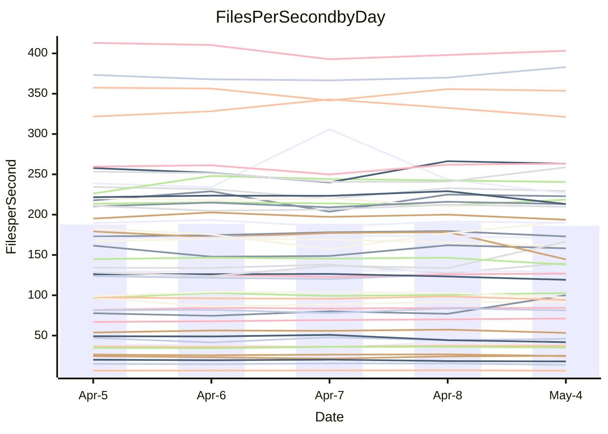

<!---
# This file is auto-generated. Do not edit.
# cspell:disable
--->
# Performance Report

Daily Performance

```mermaid
xychart-beta
    title Files Per Second by Day
    y-axis Files per Second
    x-axis Date [Apr-5, Apr-6, Apr-7, Apr-8, May-4]
    bar [187.81, 188.42, 188.59, 189.84, 186.25]
    line [161.59, 147.84, 148.71, 162.06, 158.32]
    line [6.57, 6.61, 6.73, 7.00, 6.46]
    line [234.26, 231.70, 219.86, 232.88, 229.32]
    line [96.40, 102.92, 99.21, 100.52, 102.79]
    line [24.56, 23.07, 21.40, 24.14, 24.93]
    line [123.74, 121.73, 120.16, 125.96, 126.81]
    line [81.81, 84.38, 83.54, 84.32, 84.38]
    line [20.02, 19.41, 20.18, 18.41, 17.95]
    line [97.23, 85.82, 88.62, 91.77, 91.75]
    line [238.81, 234.08, 305.83, 243.57, 226.51]
    line [77.73, 74.56, 80.16, 77.02, 100.08]
    line [97.44, 96.14, 95.65, 98.60, 94.12]
    line [134.19, 133.87, 138.14, 127.32, 140.01]
    line [226.17, 248.01, 244.17, 242.46, 240.52]
    line [53.82, 56.32, 55.94, 57.36, 53.38]
    line [14.95, 14.57, 15.50, 15.41, 13.72]
    line [127.91, 125.16, 122.83, 125.98, 127.00]
    line [257.73, 251.87, 240.02, 266.31, 263.11]
    line [166.95, 170.01, 169.14, 165.39, 160.29]
    line [38.93, 38.36, 35.23, 41.88, 38.18]
    line [217.73, 228.96, 203.68, 224.92, 222.86]
    line [36.40, 35.82, 36.18, 37.44, 37.38]
    line [253.34, 251.40, 240.71, 240.89, 258.73]
    line [213.52, 215.27, 213.92, 211.68, 218.55]
    line [26.46, 25.57, 26.37, 26.75, 24.56]
    line [47.13, 41.53, 47.88, 44.28, 46.04]
    line [66.87, 67.74, 69.26, 70.15, 71.11]
    line [126.05, 126.20, 126.46, 123.33, 119.17]
    line [220.41, 218.02, 220.27, 210.30, 215.39]
    line [129.75, 128.69, 130.72, 130.46, 129.13]
    line [172.81, 174.46, 178.10, 179.62, 172.93]
    line [357.50, 356.42, 341.55, 355.72, 353.58]
    line [128.14, 123.76, 136.62, 133.64, 166.55]
    line [34.80, 34.26, 36.10, 36.17, 35.07]
    line [179.11, 171.90, 177.30, 178.37, 144.52]
    line [81.46, 81.94, 77.93, 83.70, 81.26]
    line [259.51, 261.27, 249.89, 261.98, 263.28]
    line [49.22, 48.87, 50.93, 44.38, 41.81]
    line [182.89, 175.34, 157.18, 176.94, 191.37]
    line [171.27, 171.33, 174.25, 173.31, 170.59]
    line [210.20, 214.91, 209.11, 216.00, 213.17]
    line [321.72, 328.23, 343.02, 332.37, 321.24]
    line [210.95, 204.79, 206.43, 212.35, 209.84]
    line [144.90, 146.68, 145.47, 146.56, 138.03]
    line [195.13, 202.74, 197.17, 200.02, 193.68]
    line [373.30, 367.91, 366.55, 370.00, 382.99]
    line [413.02, 410.36, 392.72, 397.99, 403.25]
    line [221.62, 223.63, 223.28, 229.16, 213.15]
    line [98.55, 104.22, 103.59, 103.12, 97.37]
    line [189.55, 193.41, 185.15, 191.53, 189.78]
```

Time to Process Files

| Repository                                      | Elapsed | Min/Avg/Max           |   SD | SD Graph                |
| ----------------------------------------------- | ------: | :-------------------: | ---: | ----------------------- |
| AdaDoom3/AdaDoom3                    |    2.76 | 2.8 /   2.8 /   3.0   | 0.06 | `    ┣━●┻━━╋━━┻━━┫    ` |
| alexiosc/megistos                    |    6.91 | 6.8 /   7.0 /   7.3   | 0.16 | `    ┣━━┻●━╋━━┻━━┫    ` |
| apollographql/apollo-server          |    2.48 | 2.4 /   2.6 /   2.9   | 0.14 | `    ┣━━┻●━╋━━┻━━┫    ` |
| aspnetboilerplate/aspnetboilerplate  |    8.68 | 8.7 /   8.8 /   9.1   | 0.17 | `    ┣━━●━━╋━━┻━━┫    ` |
| aws-amplify/docs                     |   13.06 | 9.6 /  12.0 /  12.9   | 0.95 | `   ┣━━┻━━━╋━━━●━━┫   ` |
| Azure/azure-rest-api-specs           |    9.64 | 9.4 /  10.0 /  10.3   | 0.30 | `   ┣━━●┻━━╋━━┻━━━┫   ` |
| bitjson/typescript-starter           |    1.11 | 0.9 /   1.0 /   1.1   | 0.04 | `     ┣━┻━━╋━━┻━┫●    ` |
| caddyserver/caddy                    |    3.39 | 2.6 /   3.3 /   3.7   | 0.29 | `    ┣━━┻━━╋●━┻━━┫    ` |
| canada-ca/open-source-logiciel-libre |    1.08 | 1.0 /   1.1 /   1.1   | 0.04 | `     ┣━┻━━╋━●┻━┫     ` |
| chef/chef                            |    4.83 | 5.2 /   5.4 /   5.6   | 0.14 | `●    ┣━┻━━╋━━┻━┫     ` |
| dart-lang/sdk                        |   58.69 | 54.7 /  56.5 /  61.5  | 2.04 | `  ┣━━━┻━━━╋━━━●━━━┫  ` |
| django/django                        |   13.85 | 13.4 /  13.9 /  14.5  | 0.33 | `   ┣━━━┻━━●━━┻━━━┫   ` |
| eslint/eslint                        |    9.70 | 9.5 /   9.7 /  10.2   | 0.23 | `    ┣━━┻━━●━━┻━━┫    ` |
| exonum/exonum                        |    3.53 | 3.3 /   3.3 /   3.4   | 0.04 | `      ┣━┻━╋━┻━┫     ●` |
| flutter/samples                      |   11.73 | 13.7 /  14.1 /  14.7  | 0.28 | `●       ┣┻╋┻┫        ` |
| gitbucket/gitbucket                  |    2.49 | 3.0 /   3.2 /   3.6   | 0.18 | `●    ┣━┻━━╋━━┻━┫     ` |
| googleapis/google-cloud-cpp          |  122.67 | 119.1 / 121.0 / 123.8 | 1.49 | `  ┣━━━┻━━━╋━━━┻●━━┫  ` |
| graphql/express-graphql              |    1.04 | 1.0 /   1.1 /   1.3   | 0.09 | `    ┣━━┻●━╋━━┻━━┫    ` |
| graphql/graphql-js                   |    2.65 | 2.7 /   2.8 /   2.9   | 0.09 | `    ┣━●┻━━╋━━┻━━┫    ` |
| graphql/graphql-relay-js             |    1.14 | 1.0 /   1.1 /   1.1   | 0.03 | `     ┣━┻━━╋━━┻━┫ ●   ` |
| graphql/graphql-spec                 |    1.38 | 1.2 /   1.3 /   1.4   | 0.06 | `    ┣━━┻━━╋━━┻━●┫    ` |
| iluwatar/java-design-patterns        |   11.92 | 11.5 /  11.8 /  12.2  | 0.25 | `   ┣━━━┻━━╋━●┻━━━┫   ` |
| ktaranov/sqlserver-kit               |    6.03 | 5.6 /   6.0 /   6.4   | 0.23 | `    ┣━━┻━━●━━┻━━┫    ` |
| liriliri/licia                       |    3.75 | 3.8 /   3.9 /   4.0   | 0.07 | `    ┣●━┻━━╋━━┻━━┫    ` |
| MartinThoma/LaTeX-examples           |    6.14 | 5.7 /   6.1 /   6.4   | 0.19 | `    ┣━━┻━━╋●━┻━━┫    ` |
| mdx-js/mdx                           |    1.40 | 1.7 /   1.8 /   2.0   | 0.09 | `●     ┣━┻━╋━┻━┫      ` |
| microsoft/TypeScript-Website         |    5.54 | 5.0 /   5.2 /   5.6   | 0.16 | `    ┣━━┻━━╋━━┻━━┫●   ` |
| MicrosoftDocs/PowerShell-Docs        |   24.20 | 19.9 /  20.4 /  21.6  | 0.52 | `       ┣━┻╋┻━┫      ●` |
| neovim/nvim-lspconfig                |    5.32 | 4.9 /   5.0 /   5.2   | 0.11 | `    ┣━━┻━━╋━━┻━━┫  ● ` |
| pagekit/pagekit                      |    3.44 | 3.3 /   3.4 /   3.5   | 0.06 | `    ┣━━┻━━╋━●┻━━┫    ` |
| php/php-src                          |   24.33 | 23.0 /  23.5 /  24.0  | 0.34 | `   ┣━━━┻━━╋━━┻━━━┫ ● ` |
| plasticrake/tplink-smarthome-api     |    1.48 | 1.2 /   1.3 /   1.4   | 0.06 | `    ┣━━┻━━╋━━┻━━┫   ●` |
| prettier/prettier                    |    7.56 | 7.4 /   7.5 /   7.8   | 0.13 | `    ┣━━┻━━╋●━┻━━┫    ` |
| pycontribs/jira                      |    1.50 | 1.4 /   1.4 /   1.6   | 0.06 | `    ┣━━┻━━╋━━●━━┫    ` |
| RustPython/RustPython                |    6.21 | 6.1 /   6.2 /   6.4   | 0.09 | `    ┣━━┻━━●━━┻━━┫    ` |
| shoelace-style/shoelace              |    2.78 | 2.6 /   2.8 /   3.1   | 0.13 | `    ┣━━┻━●╋━━┻━━┫    ` |
| slint-ui/slint                       |   13.53 | 13.0 /  13.4 /  13.6  | 0.19 | `   ┣━━━┻━━╋━●┻━━━┫   ` |
| SoftwareBrothers/admin-bro           |    2.30 | 2.3 /   2.5 /   2.8   | 0.13 | `    ┣━●┻━━╋━━┻━━┫    ` |
| sveltejs/svelte                      |   21.68 | 20.6 /  21.3 /  22.1  | 0.52 | `   ┣━━┻━━━╋━━●┻━━┫   ` |
| TheAlgorithms/Python                 |    5.35 | 5.3 /   5.5 /   5.9   | 0.19 | `    ┣━━●━━╋━━┻━━┫    ` |
| twbs/bootstrap                       |    1.66 | 1.7 /   1.7 /   1.9   | 0.07 | `    ┣━━●━━╋━━┻━━┫    ` |
| typescript-cheatsheets/react         |    1.39 | 1.3 /   1.4 /   1.5   | 0.08 | `    ┣━━┻━━●━━┻━━┫    ` |
| typescript-eslint/typescript-eslint  |    4.12 | 3.9 /   4.0 /   4.2   | 0.11 | `    ┣━━┻━━╋━●┻━━┫    ` |
| vitest-dev/vitest                    |   11.06 | 10.3 /  11.1 /  13.3  | 0.87 | `   ┣━━┻━━━●━━━┻━━┫   ` |
| w3c/aria-practices                   |    3.26 | 3.1 /   3.3 /   3.5   | 0.11 | `    ┣━━┻━●╋━━┻━━┫    ` |
| w3c/specberus                        |    2.02 | 1.8 /   2.0 /   2.1   | 0.08 | `    ┣━━┻━━╋━━●━━┫    ` |
| webdeveric/webpack-assets-manifest   |    1.19 | 1.1 /   1.2 /   1.3   | 0.07 | `    ┣━━┻━●╋━━┻━━┫    ` |
| webpack/webpack                      |    5.20 | 5.0 /   5.2 /   5.6   | 0.25 | `    ┣━━┻━●╋━━┻━━┫    ` |
| wireapp/wire-desktop                 |    1.28 | 1.2 /   1.3 /   1.3   | 0.04 | `     ┣━┻━━●━━┻━┫     ` |
| wireapp/wire-webapp                  |   11.73 | 11.0 /  11.3 /  12.1  | 0.40 | `   ┣━━━┻━━╋━━●━━━┫   ` |

Note:
- Elapsed time is in seconds.

Files per Second over Time

| Repository                                      | Files |    Sec |    Fps |     Rel | Trend Fps   |    N |
| ----------------------------------------------- | ----: | -----: | -----: | ------: | ----------- | ---: |
| AdaDoom3/AdaDoom3                    |   103 |   2.76 |  37.38 |   2.82% | `▇█▆▆▇▅▇██` |    8 |
| alexiosc/megistos                    |   583 |   6.91 |  84.38 |   1.68% | `▅▅▇▇▇█▇▇▇` |    8 |
| apollographql/apollo-server          |   255 |   2.48 | 102.79 |   3.94% | `▇▄▃▇▆█▆▇▇` |    8 |
| aspnetboilerplate/aspnetboilerplate  |  2286 |   8.68 | 263.28 |   1.63% | `▆█████▅██` |    8 |
| aws-amplify/docs                     |  2959 |  13.06 | 226.51 |  -8.15% | `▃▃▃▃▂▃█▃▂` |    8 |
| Azure/azure-rest-api-specs           |  2493 |   9.64 | 258.73 |   3.61% | `▅▆▆█▇▅▄▄▇` |    8 |
| bitjson/typescript-starter           |    20 |   1.11 |  17.95 |  -8.81% | `█▆▅▅▆▄▆▃▃` |    8 |
| caddyserver/caddy                    |   311 |   3.39 |  91.75 |  -0.94% | `▄█▄▃▃▂▃▄▄` |    8 |
| canada-ca/open-source-logiciel-libre |     7 |   1.08 |   6.46 |  -2.87% | `▇▇▄▆▆▆▇█▅` |    8 |
| chef/chef                            |  1030 |   4.83 | 213.15 |  -4.53% | `▅▇▅▇▅█▆█▄` |    8 |
| dart-lang/sdk                        | 11367 |  58.69 | 193.68 |  -2.14% | `▆█▇▄██▇▇▆` |    8 |
| django/django                        |  2906 |  13.85 | 209.84 |   0.39% | `▇▆██▇▅▆▇▇` |    8 |
| eslint/eslint                        |  2068 |   9.70 | 213.17 |   0.57% | `█▅▇▇██▆█▇` |    8 |
| exonum/exonum                        |   421 |   3.53 | 119.17 |  -5.27% | `▇█▇█▇██▆▄` |    8 |
| flutter/samples                      |  1695 |  11.73 | 144.52 | -18.35% | `▇▇▇█▅▆▇▇ ` |    8 |
| gitbucket/gitbucket                  |   415 |   2.49 | 166.55 |  29.32% | `▃▃▄▄▂▄▅▄█` |    8 |
| googleapis/google-cloud-cpp          | 20926 | 122.67 | 170.59 |  -0.77% | `▇▇▇██▆██▇` |    8 |
| graphql/express-graphql              |    26 |   1.04 |  24.93 |   4.99% | `▇▇█▆▂█▄▆▇` |    8 |
| graphql/graphql-js                   |   371 |   2.65 | 140.01 |   4.68% | `▅█▅▇▅▇█▄█` |    8 |
| graphql/graphql-relay-js             |    28 |   1.14 |  24.56 |  -6.47% | `▅▇██▆▅▇▇▄` |    8 |
| graphql/graphql-spec                 |    19 |   1.38 |  13.72 |  -8.42% | `▆▇█▃▅▆▇▇▄` |    8 |
| iluwatar/java-design-patterns        |  2061 |  11.92 | 172.93 |  -1.03% | `▅▇▇▆▇▇██▆` |    8 |
| ktaranov/sqlserver-kit               |   490 |   6.03 |  81.26 |  -0.20% | `▆█▄▆▆▆▄▇▆` |    8 |
| liriliri/licia                       |  1437 |   3.75 | 382.99 |   3.32% | `██▅▇▆▆▆▆█` |    8 |
| MartinThoma/LaTeX-examples           |  1409 |   6.14 | 229.32 |  -1.00% | `▅█▆▇▆▆▄▆▆` |    8 |
| mdx-js/mdx                           |   140 |   1.40 | 100.08 |  29.72% | `▄▄▂▄▃▂▄▃█` |    8 |
| microsoft/TypeScript-Website         |   765 |   5.54 | 138.03 |  -5.22% | `█▄▆██▇▇▇▅` |    8 |
| MicrosoftDocs/PowerShell-Docs        |  3125 |  24.20 | 129.13 |  -0.44% | `███▅▇▆▇▇▇` |    8 |
| neovim/nvim-lspconfig                |   853 |   5.32 | 160.29 |  -4.47% | `▇▇▅▇▇█▇▆▅` |    8 |
| pagekit/pagekit                      |   741 |   3.44 | 215.39 |  -1.44% | `█▇▇█▇▇▇▅▆` |    8 |
| php/php-src                          |  2290 |  24.33 |  94.12 |  -3.01% | `█▇▇█▇▆▆█▅` |    8 |
| plasticrake/tplink-smarthome-api     |    62 |   1.48 |  41.81 | -14.21% | `█▇▇▆▅██▄▂` |    8 |
| prettier/prettier                    |  2674 |   7.56 | 353.58 |  -0.40% | `██▇▇▇█▅▇▇` |    8 |
| pycontribs/jira                      |    80 |   1.50 |  53.38 |  -3.20% | `█▄▅▆▇▇▇█▆` |    8 |
| RustPython/RustPython                |   788 |   6.21 | 126.81 |   3.04% | `▇▆▇▇▆▆▅██` |    8 |
| shoelace-style/shoelace              |   440 |   2.78 | 158.32 |   1.10% | `▇▆█▇▅▃▅▇▇` |    8 |
| slint-ui/slint                       |  2957 |  13.53 | 218.55 |   2.23% | `▆█▆▆█▆▇▆█` |    8 |
| SoftwareBrothers/admin-bro           |   441 |   2.30 | 191.37 |   8.09% | `▇█▆▆▆▅▃▆█` |    8 |
| sveltejs/svelte                      |  8742 |  21.68 | 403.25 |  -1.15% | `▆█▇██▆▅▆▆` |    8 |
| TheAlgorithms/Python                 |  1407 |   5.35 | 263.11 |   3.13% | `▇█▅▇▅▇▄██` |    8 |
| twbs/bootstrap                       |   118 |   1.66 |  71.11 |   4.89% | `▆▄█▆▇▆▇██` |    8 |
| typescript-cheatsheets/react         |    53 |   1.39 |  38.18 |  -1.33% | `▇▆▇▄▆▅▃█▅` |    8 |
| typescript-eslint/typescript-eslint  |  1323 |   4.12 | 321.24 |  -1.86% | `▄▅▅▇▆▆█▇▅` |    8 |
| vitest-dev/vitest                    |  2661 |  11.06 | 240.52 |   1.95% | `▇▆▆▂▇█▇▇▇` |    8 |
| w3c/aria-practices                   |   414 |   3.26 | 127.00 |   0.51% | `██▄█▇▅▅▆▇` |    8 |
| w3c/specberus                        |   197 |   2.02 |  97.37 |  -3.75% | `▇▆▄▄▆█▇▇▅` |    8 |
| webdeveric/webpack-assets-manifest   |    55 |   1.19 |  46.04 |   1.26% | `▇█▆█▃▄█▅▇` |    8 |
| webpack/webpack                      |  1158 |   5.20 | 222.86 |   1.45% | `▄▇█▅▇█▄▇▇` |    8 |
| wireapp/wire-desktop                 |    45 |   1.28 |  35.07 |   0.20% | `▅▇▆▇▅▇██▇` |    8 |
| wireapp/wire-webapp                  |  2226 |  11.73 | 189.78 |  -0.23% | `▇▇▄█▇█▆▇▇` |    8 |

Data Throughput

| Repository                                      | Files |    Sec |     Kps |     Rel | Trend Kps   |    N |
| ----------------------------------------------- | ----: | -----: | ------: | ------: | ----------- | ---: |
| AdaDoom3/AdaDoom3                    |   103 |   2.76 |  794.47 |   2.82% | `▇█▆▆▇▅▇██` |    8 |
| alexiosc/megistos                    |   583 |   6.91 |  663.02 |   1.68% | `▅▅▇▇▇█▇▇▇` |    8 |
| apollographql/apollo-server          |   255 |   2.48 |  848.96 |   4.03% | `▇▄▃▇▆█▆▇▇` |    8 |
| aspnetboilerplate/aspnetboilerplate  |  2286 |   8.68 |  640.57 |   1.63% | `▆█████▅██` |    8 |
| aws-amplify/docs                     |  2959 |  13.06 |  818.00 |  -5.67% | `▃▃▃▃▂▃█▃▃` |    8 |
| Azure/azure-rest-api-specs           |  2493 |   9.64 |  772.66 |   5.01% | `▅▆▅█▇▅▄▄█` |    8 |
| bitjson/typescript-starter           |    20 |   1.11 |   71.80 |  -8.81% | `█▆▅▅▆▄▆▃▃` |    8 |
| caddyserver/caddy                    |   311 |   3.39 |  821.31 |  -0.48% | `▄█▄▃▃▂▃▄▄` |    8 |
| canada-ca/open-source-logiciel-libre |     7 |   1.08 |   53.54 |  -2.87% | `▇▇▄▆▆▆▇█▅` |    8 |
| chef/chef                            |  1030 |   4.83 | 1040.94 |  -0.66% | `▅▇▅▇▅█▆█▆` |    8 |
| dart-lang/sdk                        | 11367 |  58.69 | 1322.74 |  -1.14% | `▆█▇▄██▇▇▇` |    8 |
| django/django                        |  2906 |  13.85 | 1336.31 |   0.89% | `▇▆██▇▅▆▇▇` |    8 |
| eslint/eslint                        |  2068 |   9.70 | 1482.62 |   0.71% | `█▅▇▇██▆█▇` |    8 |
| exonum/exonum                        |   421 |   3.53 | 1139.91 |  -5.27% | `▇█▇█▇██▆▄` |    8 |
| flutter/samples                      |  1695 |  11.73 |  864.99 | -43.32% | `▇▇▇█▅▆▇▇ ` |    8 |
| gitbucket/gitbucket                  |   415 |   2.49 |  772.56 |  29.70% | `▃▃▄▄▂▄▅▄█` |    8 |
| googleapis/google-cloud-cpp          | 20926 | 122.67 | 1455.90 |   0.08% | `▇▇▇██▆██▇` |    8 |
| graphql/express-graphql              |    26 |   1.04 |  114.08 |   4.99% | `▇▇█▆▂█▄▆▇` |    8 |
| graphql/graphql-js                   |   371 |   2.65 |  829.48 |   5.84% | `▅█▅▇▅▇▇▄█` |    8 |
| graphql/graphql-relay-js             |    28 |   1.14 |   96.49 |  -6.47% | `▅▇██▆▅▇▇▄` |    8 |
| graphql/graphql-spec                 |    19 |   1.38 |  457.77 |  -8.42% | `▆▇█▃▅▆▇▇▄` |    8 |
| iluwatar/java-design-patterns        |  2061 |  11.92 |  533.06 |  -1.02% | `▅▇▇▆▇▇██▆` |    8 |
| ktaranov/sqlserver-kit               |   490 |   6.03 | 1230.98 |  -0.20% | `▆█▄▆▆▆▄▇▆` |    8 |
| liriliri/licia                       |  1437 |   3.75 |  456.28 |   3.32% | `██▅▇▆▆▆▆█` |    8 |
| MartinThoma/LaTeX-examples           |  1409 |   6.14 |  473.61 |  -1.00% | `▅█▆▇▆▆▄▆▆` |    8 |
| mdx-js/mdx                           |   140 |   1.40 |  468.95 |  29.92% | `▄▄▂▄▃▂▄▃█` |    8 |
| microsoft/TypeScript-Website         |   765 |   5.54 |  950.68 |  -5.67% | `█▄▆██▇▇▇▅` |    8 |
| MicrosoftDocs/PowerShell-Docs        |  3125 |  24.20 | 1377.53 |   1.42% | `███▅▇▆▇▇█` |    8 |
| neovim/nvim-lspconfig                |   853 |   5.32 |  467.71 |   3.43% | `▇▇▅▆▆█▇▆█` |    8 |
| pagekit/pagekit                      |   741 |   3.44 |  449.08 |  -1.44% | `█▇▇█▇▇▇▅▆` |    8 |
| php/php-src                          |  2290 |  24.33 | 1654.30 |  -2.31% | `█▇▇█▇▆▆█▆` |    8 |
| plasticrake/tplink-smarthome-api     |    62 |   1.48 |  225.93 | -14.21% | `█▇▇▆▅██▄▂` |    8 |
| prettier/prettier                    |  2674 |   7.56 |  485.55 |  -0.51% | `██▇▇▇█▅▇▇` |    8 |
| pycontribs/jira                      |    80 |   1.50 |  377.02 |  -3.56% | `█▄▅▆▇▇▇█▅` |    8 |
| RustPython/RustPython                |   788 |   6.21 | 2023.65 |   4.72% | `▆▆▇▆▆▅▅▇█` |    8 |
| shoelace-style/shoelace              |   440 |   2.78 |  764.23 |   1.10% | `▇▆█▇▅▃▅▇▇` |    8 |
| slint-ui/slint                       |  2957 |  13.53 | 1363.33 |   2.13% | `▆█▆▆█▆▇▆█` |    8 |
| SoftwareBrothers/admin-bro           |   441 |   2.30 |  421.79 |   8.09% | `▇█▆▆▆▅▃▆█` |    8 |
| sveltejs/svelte                      |  8742 |  21.68 |  273.63 |  -1.10% | `▆█▇██▆▅▆▆` |    8 |
| TheAlgorithms/Python                 |  1407 |   5.35 |  671.90 |   3.13% | `▇█▅▇▅▇▄██` |    8 |
| twbs/bootstrap                       |   118 |   1.66 |  583.96 |   4.89% | `▆▄█▆▇▆▇██` |    8 |
| typescript-cheatsheets/react         |    53 |   1.39 |  283.12 |  -1.33% | `▇▆▇▄▆▅▃█▅` |    8 |
| typescript-eslint/typescript-eslint  |  1323 |   4.12 | 1737.30 |   0.82% | `▅▅▅▇▆▆█▇▆` |    8 |
| vitest-dev/vitest                    |  2661 |  11.06 |  759.62 |   5.39% | `▇▆▆▂▇█▇▇█` |    8 |
| w3c/aria-practices                   |   414 |   3.26 | 1186.52 |   0.54% | `██▄█▇▅▅▆▇` |    8 |
| w3c/specberus                        |   197 |   2.02 |  318.81 |  -4.34% | `▇▆▄▄▆█▇▇▅` |    8 |
| webdeveric/webpack-assets-manifest   |    55 |   1.19 |  105.47 |   1.26% | `▇█▆█▃▄█▅▇` |    8 |
| webpack/webpack                      |  1158 |   5.20 | 1085.81 |   5.15% | `▄▇▇▅▇█▄▇█` |    8 |
| wireapp/wire-desktop                 |    45 |   1.28 |  154.31 |   0.20% | `▅▇▆▇▅▇██▇` |    8 |
| wireapp/wire-webapp                  |  2226 |  11.73 |  781.62 |   2.57% | `▇▇▄▇▆█▆▇▇` |    8 |

