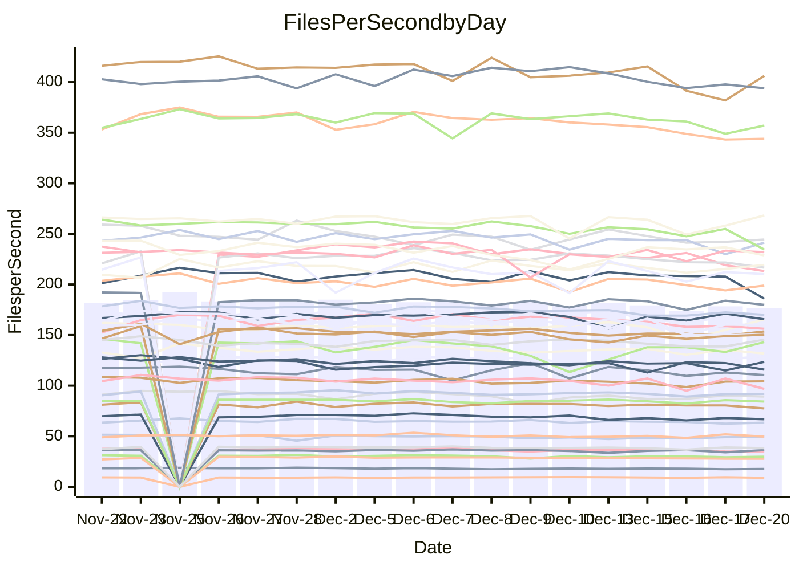

<!---
# This file is auto-generated. Do not edit.
# cspell:disable
--->
# Performance Report

## Daily Performance

```mermaid
xychart-beta
    title Files Per Second by Day
    y-axis Files per Second
    x-axis Date [Nov-22, Nov-23, Nov-25, Nov-26, Nov-27, Nov-28, Dec-2, Dec-5, Dec-6, Dec-7, Dec-8, Dec-9, Dec-10, Dec-13, Dec-15, Dec-16, Dec-17, Dec-20]
    bar [181.55, 184.70, 192.57, 183.27, 184.75, 182.79, 184.99, 180.86, 182.42, 182.83, 180.95, 182.95, 179.19, 181.65, 179.36, 173.64, 178.43, 176.50]
    line [18.34, 18.44, 18.84, 18.37, 18.41, 18.93, 18.48, 17.91, 18.52, 17.91, 17.46, 17.89, 18.13, 17.78, 18.13, 17.93, 17.37, 17.62]
    line [9.32, 9.24, 0.00, 9.27, 9.05, 9.13, 9.38, 8.86, 9.19, 9.24, 9.33, 9.47, 9.61, 9.47, 9.27, 8.94, 9.45, 8.97]
    line [91.05, 94.79, 93.97, 94.67, 91.62, 92.04, 86.62, 91.97, 93.82, 91.60, 89.44, 82.46, 88.30, 90.18, 86.83, 87.07, 90.37, 89.22]
    line [31.34, 30.76, 0.00, 30.81, 30.58, 31.64, 29.90, 30.63, 31.36, 30.89, 30.17, 27.90, 30.55, 29.22, 30.21, 30.10, 29.27, 29.86]
    line [416.16, 419.91, 420.14, 425.45, 413.25, 414.49, 414.13, 417.32, 417.87, 401.19, 424.05, 404.78, 406.35, 409.54, 415.50, 391.53, 381.89, 406.19]
    line [63.49, 65.54, 67.63, 65.16, 64.17, 67.20, 67.10, 64.34, 65.01, 64.46, 64.51, 66.15, 63.18, 64.91, 64.35, 64.10, 62.51, 63.43]
    line [37.59, 38.10, 0.00, 36.55, 37.13, 38.36, 37.28, 36.55, 36.94, 38.11, 36.16, 34.90, 36.59, 36.61, 36.51, 36.62, 35.07, 34.75]
    line [69.84, 71.46, 0.00, 68.63, 69.18, 70.98, 71.07, 70.27, 72.65, 71.06, 69.32, 68.69, 70.43, 66.11, 67.91, 65.71, 68.06, 66.78]
    line [132.82, 127.42, 141.81, 137.38, 133.61, 136.04, 138.47, 135.71, 138.36, 137.92, 134.36, 132.66, 134.27, 135.78, 136.38, 130.55, 135.39, 131.72]
    line [129.02, 122.85, 124.15, 127.61, 128.38, 128.27, 127.96, 123.07, 128.36, 127.97, 126.37, 128.11, 121.50, 122.96, 125.85, 122.14, 126.07, 129.10]
    line [36.44, 36.12, 0.00, 36.09, 35.82, 35.94, 35.10, 36.40, 35.75, 36.91, 35.78, 36.33, 35.41, 33.56, 35.56, 36.21, 34.19, 36.22]
    line [353.22, 368.32, 374.93, 365.77, 365.67, 369.95, 352.91, 358.41, 370.56, 364.48, 362.78, 364.44, 360.18, 358.05, 355.49, 348.84, 343.31, 343.94]
    line [259.20, 257.89, 248.21, 247.03, 244.22, 263.12, 252.89, 247.30, 238.91, 249.28, 247.23, 234.36, 244.44, 254.37, 247.88, 241.35, 242.19, 244.43]
    line [146.19, 141.96, 0.00, 142.52, 141.79, 143.85, 132.83, 138.36, 145.16, 141.72, 138.92, 129.58, 113.42, 125.88, 138.00, 137.98, 133.31, 143.10]
    line [81.19, 83.62, 0.00, 81.43, 78.64, 84.26, 78.88, 82.13, 83.39, 79.45, 81.95, 82.06, 81.96, 79.96, 81.37, 80.53, 80.51, 77.53]
    line [90.51, 94.24, 0.00, 91.28, 92.74, 93.28, 95.50, 92.21, 94.67, 92.84, 90.85, 91.43, 92.60, 93.37, 91.85, 89.18, 91.59, 91.86]
    line [237.44, 231.81, 0.00, 229.54, 227.35, 233.78, 239.72, 236.67, 242.41, 240.69, 229.87, 234.86, 230.17, 228.31, 226.27, 231.21, 219.13, 213.31]
    line [201.32, 208.63, 216.56, 211.21, 211.52, 202.80, 207.87, 211.25, 214.29, 205.55, 202.50, 213.14, 203.97, 212.22, 208.88, 208.37, 207.77, 186.04]
    line [161.99, 161.00, 160.02, 155.33, 155.60, 159.85, 157.03, 158.70, 160.32, 157.97, 158.53, 156.72, 159.18, 162.67, 157.64, 145.39, 155.01, 165.46]
    line [173.87, 168.75, 0.00, 168.42, 172.41, 165.34, 178.00, 170.24, 174.62, 172.41, 159.51, 174.62, 171.51, 173.65, 165.49, 162.20, 168.07, 167.80]
    line [117.70, 117.75, 118.80, 116.72, 112.25, 111.37, 118.51, 115.50, 115.87, 105.20, 115.20, 122.48, 107.06, 118.54, 115.18, 109.59, 113.00, 110.49]
    line [203.63, 207.69, 210.97, 200.63, 206.29, 201.28, 203.16, 197.69, 205.56, 198.75, 201.98, 205.78, 192.58, 205.45, 204.82, 199.34, 194.10, 198.94]
    line [220.77, 232.83, 0.00, 226.61, 230.78, 225.94, 228.40, 228.42, 235.98, 231.28, 223.81, 224.38, 230.73, 228.56, 225.00, 222.02, 221.71, 216.63]
    line [84.68, 84.66, 0.00, 86.16, 86.09, 86.12, 86.10, 84.45, 86.85, 83.80, 82.54, 84.79, 85.17, 86.33, 84.51, 82.32, 85.67, 84.29]
    line [146.52, 158.85, 0.00, 155.81, 155.95, 156.73, 153.23, 152.74, 150.88, 153.33, 154.58, 156.25, 152.15, 149.54, 151.43, 151.38, 149.35, 153.58]
    line [243.10, 246.46, 253.84, 244.86, 252.77, 242.22, 250.75, 244.77, 249.57, 253.00, 246.33, 249.46, 234.43, 245.12, 243.88, 243.97, 230.01, 241.32]
    line [152.49, 164.76, 169.85, 169.02, 158.91, 164.95, 167.24, 171.12, 163.98, 170.66, 165.03, 168.12, 167.40, 165.15, 163.12, 158.04, 158.90, 156.25]
    line [126.42, 130.12, 126.69, 118.47, 125.05, 124.39, 115.88, 118.39, 119.81, 122.77, 121.45, 120.76, 121.79, 122.20, 112.97, 123.23, 122.39, 115.85]
    line [209.57, 206.62, 225.23, 216.74, 223.01, 218.30, 218.24, 211.89, 221.99, 212.41, 223.76, 218.34, 214.11, 221.23, 216.34, 211.66, 215.40, 219.40]
    line [214.66, 226.79, 0.00, 213.37, 216.21, 222.03, 191.91, 211.40, 225.62, 216.82, 210.15, 212.06, 191.55, 223.01, 213.39, 202.82, 212.32, 210.25]
    line [192.19, 191.67, 0.00, 182.52, 184.50, 184.37, 180.13, 182.27, 185.97, 183.39, 179.18, 183.86, 177.29, 185.44, 183.45, 174.84, 184.02, 179.88]
    line [27.12, 28.69, 0.00, 29.62, 29.42, 28.97, 30.07, 28.83, 29.04, 29.09, 29.10, 28.75, 28.65, 28.35, 28.26, 28.09, 27.81, 27.74]
    line [145.07, 148.78, 145.20, 139.52, 142.17, 141.34, 138.40, 144.20, 144.71, 145.14, 140.38, 143.82, 145.78, 144.45, 141.51, 138.80, 138.75, 145.50]
    line [354.80, 363.64, 373.17, 364.09, 364.55, 368.33, 360.08, 369.35, 368.90, 344.39, 369.08, 363.46, 366.29, 369.00, 363.03, 361.09, 348.96, 357.09]
    line [108.41, 107.84, 102.72, 107.24, 107.62, 105.35, 104.37, 103.06, 105.64, 106.80, 101.95, 102.69, 105.10, 103.83, 102.19, 98.64, 104.01, 104.33]
    line [51.47, 51.26, 50.21, 50.12, 50.94, 45.60, 50.75, 50.03, 49.80, 49.98, 49.59, 47.97, 48.84, 47.30, 48.59, 47.94, 49.07, 49.57]
    line [231.39, 232.22, 233.95, 231.55, 229.52, 231.73, 230.37, 226.75, 238.77, 230.39, 234.25, 206.87, 229.87, 227.19, 234.07, 222.96, 233.49, 231.99]
    line [166.81, 168.79, 172.43, 172.30, 165.40, 170.85, 167.09, 169.78, 169.21, 170.29, 172.44, 172.82, 167.78, 156.48, 168.20, 164.35, 171.17, 165.60]
    line [243.01, 243.28, 229.25, 233.06, 241.24, 236.91, 240.36, 239.27, 231.52, 238.08, 229.24, 224.19, 214.79, 225.36, 236.86, 234.70, 236.77, 228.77]
    line [163.99, 174.13, 171.44, 171.10, 169.17, 169.92, 156.42, 166.33, 173.70, 167.47, 165.08, 171.54, 164.38, 156.51, 166.27, 150.03, 149.99, 150.79]
    line [402.83, 398.10, 400.47, 401.59, 405.72, 393.85, 407.78, 396.11, 412.42, 405.98, 414.20, 410.80, 414.80, 408.65, 400.36, 394.11, 397.72, 393.98]
    line [48.95, 50.74, 51.36, 50.08, 50.94, 50.51, 51.36, 50.85, 53.51, 50.97, 49.51, 50.73, 49.15, 49.54, 50.29, 48.39, 51.90, 49.63]
    line [37.29, 39.41, 0.00, 39.61, 38.93, 39.59, 39.21, 38.95, 39.16, 39.98, 38.54, 38.36, 38.36, 38.81, 38.12, 36.63, 38.97, 38.26]
    line [264.14, 258.29, 259.88, 261.65, 261.27, 259.85, 259.59, 261.91, 256.38, 255.24, 262.31, 257.60, 250.13, 256.58, 254.55, 247.67, 254.88, 234.51]
    line [154.11, 161.15, 140.96, 153.09, 157.58, 151.62, 150.61, 153.46, 148.08, 152.95, 150.14, 153.13, 145.78, 142.78, 149.53, 146.32, 148.93, 150.31]
    line [178.44, 183.84, 176.75, 178.41, 176.49, 178.04, 178.10, 172.07, 178.26, 177.85, 176.41, 173.41, 174.24, 174.74, 169.36, 169.15, 172.44, 170.06]
    line [104.39, 110.58, 106.99, 105.01, 108.35, 107.81, 104.02, 106.94, 104.99, 103.46, 105.91, 107.21, 104.66, 100.11, 107.13, 94.87, 107.05, 96.83]
    line [127.94, 124.68, 128.18, 123.81, 124.58, 126.05, 121.44, 124.27, 122.27, 126.51, 124.16, 122.14, 120.17, 124.20, 121.82, 122.30, 114.99, 123.51]
    line [266.27, 264.63, 265.39, 262.12, 264.70, 259.96, 267.12, 267.54, 261.60, 259.75, 265.50, 267.60, 245.47, 266.55, 263.96, 249.42, 258.13, 268.19]
    line [159.29, 160.15, 167.27, 163.00, 166.53, 160.28, 164.60, 161.29, 159.50, 164.08, 160.40, 166.00, 159.37, 165.42, 161.29, 150.68, 160.30, 160.17]
```

## Time to Process Files

| Repository                                      | Elapsed | Min/Avg/Max           |   SD | SD Graph                |
| ----------------------------------------------- | ------: | :-------------------: | ---: | ----------------------- |
| AdaDoom3/AdaDoom3                    |    2.84 | 2.8 /   2.9 /   3.1   | 0.08 | `    ┣━━┻━●╋━━┻━━┫    ` |
| alexiosc/megistos                    |    6.92 | 6.5 /   6.9 /   7.5   | 0.22 | `    ┣━━┻━━╋●━┻━━┫    ` |
| apollographql/apollo-server          |    2.26 | 2.0 /   2.2 /   2.4   | 0.07 | `     ┣━┻━━╋━━●━┫     ` |
| aspnetboilerplate/aspnetboilerplate  |    9.19 | 8.5 /   9.1 /   9.8   | 0.29 | `    ┣━━┻━━╋●━┻━━┫    ` |
| aws-amplify/docs                     |   11.86 | 11.2 /  11.6 /  12.4  | 0.33 | `    ┣━━┻━━╋━●┻━━┫    ` |
| Azure/azure-rest-api-specs           |   15.99 | 13.8 /  14.6 /  17.0  | 0.73 | `   ┣━━━┻━━╋━━┻━━●┫   ` |
| bitjson/typescript-starter           |    0.67 | 0.6 /   0.7 /   0.7   | 0.02 | `     ┣━━┻━╋━●━━┫     ` |
| caddyserver/caddy                    |    3.13 | 2.9 /   3.1 /   3.7   | 0.15 | `    ┣━━┻━━╋●━┻━━┫    ` |
| canada-ca/open-source-logiciel-libre |    0.78 | 0.7 /   0.8 /   0.8   | 0.02 | `     ┣━━┻━╋━●━━┫     ` |
| chef/chef                            |    5.19 | 5.0 /   5.2 /   5.8   | 0.16 | `    ┣━━┻━●╋━━┻━━┫    ` |
| dart-lang/sdk                        |   58.90 | 53.8 /  57.0 /  60.4  | 1.68 | `  ┣━━━┻━━━╋━━━●━━━┫  ` |
| django/django                        |   14.15 | 13.3 /  13.9 /  15.5  | 0.50 | `   ┣━━━┻━━╋●━┻━━━┫   ` |
| eslint/eslint                        |   10.95 | 9.2 /   9.7 /  10.9   | 0.32 | `     ┣━┻━━╋━━┻━┫    ●` |
| exonum/exonum                        |    2.94 | 2.9 /   3.0 /   3.7   | 0.18 | `    ┣━━┻●━╋━━┻━━┫    ` |
| flutter/samples                      |   17.22 | 15.0 /  16.3 /  19.1  | 0.77 | `   ┣━━━┻━━╋━━┻●━━┫   ` |
| gitbucket/gitbucket                  |    3.13 | 2.9 /   3.0 /   3.3   | 0.09 | `    ┣━━┻━━╋━━●━━┫    ` |
| googleapis/google-cloud-cpp          |  123.26 | 117.0 / 122.5 / 133.5 | 4.38 | `  ┣━━━┻━━━╋●━━┻━━━┫  ` |
| graphql/express-graphql              |    0.75 | 0.7 /   0.7 /   0.7   | 0.02 | `     ┣━━┻━╋━┻━━●     ` |
| graphql/graphql-js                   |    2.05 | 2.1 /   2.2 /   2.4   | 0.08 | `     ┣●┻━━╋━━┻━┫     ` |
| graphql/graphql-relay-js             |    0.73 | 0.7 /   0.7 /   0.8   | 0.02 | `     ┣━━┻━╋●┻━━┫     ` |
| graphql/graphql-spec                 |    0.85 | 0.8 /   0.8 /   0.9   | 0.02 | `     ┣━━┻━╋━┻●━┫     ` |
| iluwatar/java-design-patterns        |   11.02 | 10.3 /  11.0 /  13.6  | 0.58 | `    ┣━━┻━━●━━┻━━┫    ` |
| ktaranov/sqlserver-kit               |    6.31 | 5.7 /   6.0 /   6.5   | 0.18 | `    ┣━━┻━━╋━━┻━●┫    ` |
| liriliri/licia                       |    3.53 | 3.2 /   3.5 /   3.8   | 0.11 | `    ┣━━┻━━╋━●┻━━┫    ` |
| MartinThoma/LaTeX-examples           |    6.50 | 6.0 /   6.2 /   6.5   | 0.14 | `    ┣━━┻━━╋━━┻━━●    ` |
| mdx-js/mdx                           |    1.55 | 1.5 /   1.5 /   1.6   | 0.04 | `     ┣━┻━━●━━┻━┫     ` |
| microsoft/TypeScript-Website         |    5.04 | 4.7 /   5.0 /   5.4   | 0.17 | `    ┣━━┻━━╋●━┻━━┫    ` |
| MicrosoftDocs/PowerShell-Docs        |   19.27 | 17.1 /  18.6 /  25.8  | 1.38 | `   ┣━━━┻━━╋━●┻━━━┫   ` |
| neovim/nvim-lspconfig                |    2.87 | 2.8 /   2.9 /   3.2   | 0.08 | `    ┣━━┻●━╋━━┻━━┫    ` |
| pagekit/pagekit                      |    3.47 | 3.0 /   3.2 /   3.6   | 0.13 | `    ┣━━┻━━╋━━┻━━●    ` |
| php/php-src                          |   22.86 | 19.9 /  21.1 /  24.9  | 0.98 | `   ┣━━━┻━━╋━━┻━━●┫   ` |
| plasticrake/tplink-smarthome-api     |    0.93 | 0.8 /   0.9 /   1.0   | 0.02 | `     ┣━┻━━╋━━●━┫     ` |
| prettier/prettier                    |    6.35 | 5.9 /   6.1 /   6.4   | 0.15 | `    ┣━━┻━━╋━━┻━●┫    ` |
| pycontribs/jira                      |    1.26 | 1.1 /   1.2 /   1.4   | 0.04 | `     ┣━┻━━╋━●┻━┫     ` |
| RustPython/RustPython                |    4.04 | 3.9 /   4.1 /   4.4   | 0.12 | `    ┣━━┻━━●━━┻━━┫    ` |
| shoelace-style/shoelace              |    2.43 | 2.3 /   2.4 /   2.5   | 0.07 | `     ┣━┻━━╋━●┻━┫     ` |
| slint-ui/slint                       |    8.87 | 8.4 /   9.0 /   9.6   | 0.32 | `    ┣━━┻━●╋━━┻━━┫    ` |
| SoftwareBrothers/admin-bro           |    2.10 | 1.9 /   2.1 /   2.3   | 0.10 | `    ┣━━┻━━╋●━┻━━┫    ` |
| sveltejs/svelte                      |   18.03 | 16.9 /  18.2 /  19.8  | 0.84 | `   ┣━━━┻━●╋━━┻━━━┫   ` |
| TheAlgorithms/Python                 |    5.07 | 4.9 /   5.2 /   5.7   | 0.16 | `    ┣━━┻●━╋━━┻━━┫    ` |
| twbs/bootstrap                       |    1.15 | 1.1 /   1.2 /   1.4   | 0.05 | `     ┣━┻━━●━━┻━┫     ` |
| typescript-cheatsheets/react         |    1.07 | 1.0 /   1.1 /   1.2   | 0.04 | `     ┣━┻━━●━━┻━┫     ` |
| typescript-eslint/typescript-eslint  |    3.56 | 3.4 /   3.5 /   3.7   | 0.07 | `    ┣━━┻━━╋━━●━━┫    ` |
| vitest-dev/vitest                    |    8.15 | 6.9 /   7.3 /   8.1   | 0.24 | `    ┣━━┻━━╋━━┻━━┫   ●` |
| w3c/aria-practices                   |    2.78 | 2.7 /   2.8 /   3.2   | 0.09 | `    ┣━━┻●━╋━━┻━━┫    ` |
| w3c/specberus                        |    1.62 | 1.6 /   1.6 /   1.7   | 0.04 | `     ┣━┻━━●━━┻━┫     ` |
| webdeveric/webpack-assets-manifest   |    0.68 | 0.6 /   0.7 /   0.7   | 0.02 | `     ┣━━┻━╋━┻━●┫     ` |
| webpack/webpack                      |    4.79 | 4.4 /   4.7 /   5.3   | 0.17 | `    ┣━━┻━━╋━●┻━━┫    ` |
| wireapp/wire-desktop                 |    0.87 | 0.8 /   0.9 /   1.0   | 0.03 | `     ┣━┻━━╋●━┻━┫     ` |
| wireapp/wire-webapp                  |    8.03 | 7.3 /   7.7 /   8.4   | 0.26 | `    ┣━━┻━━╋━━┻●━┫    ` |

Note:
- Elapsed time is in seconds.

## Files per Second over Time

| Repository                                      | Files |    Sec |    Fps |     Rel | Trend Fps              |    N |
| ----------------------------------------------- | ----: | -----: | -----: | ------: | ---------------------- | ---: |
| AdaDoom3/AdaDoom3                    |   103 |   2.84 |  36.22 |   0.98% | `██▄█▆█▇▆▇▇▆▄▇▇▆▆▇▇▅▇` |   33 |
| alexiosc/megistos                    |   583 |   6.92 |  84.29 |  -0.73% | `██▇▄█▇▆█▄▇▇█▇█▆▇▆▆▇▇` |   33 |
| apollographql/apollo-server          |   250 |   2.26 | 110.49 |  -3.67% | `▅▇▆▆▃▆▇▆█▄▇▆▆▆▇▅▄▅▆▅` |   36 |
| aspnetboilerplate/aspnetboilerplate  |  2246 |   9.19 | 244.43 |  -1.40% | `█▅▇▇▆▇▇▆█▅▇██▇▆▇▇▅▆▇` |   34 |
| aws-amplify/docs                     |  2863 |  11.86 | 241.32 |  -1.77% | `▆▆▇██▇▆██▅▇█▇▇▅▇▆▇▄▆` |   36 |
| Azure/azure-rest-api-specs           |  2411 |  15.99 | 150.79 |  -8.78% | `▆▆▇█▇▆▇▇█▆▅██▅▆▅▃▄▄▄` |   36 |
| bitjson/typescript-starter           |    20 |   0.67 |  29.86 |  -1.96% | `▇▆▇██▇▆█▆▄▇▅▆▆▇▇▆▇▅▆` |   33 |
| caddyserver/caddy                    |   279 |   3.13 |  89.22 |  -1.44% | `▇▇██▇▇▆▆▄▆▇█▇▃▅▇▆▅▇▆` |   36 |
| canada-ca/open-source-logiciel-libre |     7 |   0.78 |   8.97 |  -2.48% | `▅▅▇▄▆▇▇▇▇███▆▆▇▇▅▆▇▅` |   33 |
| chef/chef                            |  1204 |   5.19 | 231.99 |   0.82% | `▆▆▅▇█▇▇█▇▃▇▆█▇▇▇▅▆▇▇` |   35 |
| dart-lang/sdk                        | 10017 |  58.90 | 170.06 |  -2.80% | `█▇▆████▇▇▇▇▅▆▅▇▇▅▅▇▆` |   36 |
| django/django                        |  2815 |  14.15 | 198.94 |  -1.45% | `▄▇▇█▇█▆▇█▅███▇▇▇▆▇▆▇` |   36 |
| eslint/eslint                        |  2038 |  10.95 | 186.04 | -10.94% | `██▇█▇█▇▄█▆███▆▇█▇▇▇▄` |   36 |
| exonum/exonum                        |   421 |   2.94 | 143.10 |   3.28% | `▇▅█▆██▆█▇▅▃▅▅██▇█▆▆█` |   33 |
| flutter/samples                      |  2690 |  17.22 | 156.25 |  -5.38% | `███▇█▇▆█▇▇▇▆▇▆▇▅▆▇▆▅` |   36 |
| gitbucket/gitbucket                  |   412 |   3.13 | 131.72 |  -2.67% | `▆▆▇███▆▆▆▇▇▇██▆▇▆▄▇▆` |   36 |
| googleapis/google-cloud-cpp          | 19742 | 123.26 | 160.17 |  -0.77% | `▇▇▅▆▇▅▇▇█▆▇▇█▄▇▅▄▄▆▆` |   36 |
| graphql/express-graphql              |    26 |   0.75 |  34.75 |  -5.42% | `▅▄█▆▆█▅▆▆▄▆▆▇▆▆▅▆▇▄▄` |   33 |
| graphql/graphql-js                   |   339 |   2.05 | 165.46 |   5.47% | `█▇▆▇▇▆▇▇▆▇█▇▆▆▇▅▄▃▆█` |   35 |
| graphql/graphql-relay-js             |    28 |   0.73 |  38.26 |  -1.33% | `▅██▇▇█▇▇▅▆▆▇▇▇▆▅▄▅▇▆` |   33 |
| graphql/graphql-spec                 |    15 |   0.85 |  17.62 |  -2.91% | `▆▅▇██▇█▅▄▇▇▆█▆█▇▇▇▆▆` |   34 |
| iluwatar/java-design-patterns        |  1849 |  11.02 | 167.80 |  -0.49% | `█▆███▇▂████▆█▆▆▆▇▆▇▇` |   35 |
| ktaranov/sqlserver-kit               |   489 |   6.31 |  77.53 |  -4.70% | `▇█▇█▆▆██▇▇▆█▇▇▆▅▇▇▆▅` |   34 |
| liriliri/licia                       |  1434 |   3.53 | 406.19 |  -1.99% | `▆▆▇▅▆▅▆▆█▅▅▆▆▇▅▇▄▄▃▅` |   35 |
| MartinThoma/LaTeX-examples           |  1409 |   6.50 | 216.63 |  -4.55% | `▇▆▇▇█▇▇▅▆▆▇▇▇▆▆▆▅▆▅▄` |   33 |
| mdx-js/mdx                           |   142 |   1.55 |  91.86 |  -0.20% | `▄▇███▇▆▆▇▇▇█▇▅▇█▆▅▇▇` |   33 |
| microsoft/TypeScript-Website         |   757 |   5.04 | 150.31 |  -0.73% | `█▆▇▄▅▆▆▆▅▆▅▄▅▅▅▆▅▅▅▆` |   34 |
| MicrosoftDocs/PowerShell-Docs        |  2232 |  19.27 | 115.85 |  -3.88% | `▆▇▇▇█▇▇█▇███▇▇▂████▇` |   36 |
| neovim/nvim-lspconfig                |   370 |   2.87 | 129.10 |   2.58% | `▄▇▇█▇▇▇▇▇▆▆█▇▆▇▆▆▆▇█` |   36 |
| pagekit/pagekit                      |   741 |   3.47 | 213.31 |  -7.89% | `▅▇█▇▇▇▅▅█▆▆▆▄▅▆▆▆▆▄▄` |   33 |
| php/php-src                          |  2213 |  22.86 |  96.83 |  -8.00% | `▇▇█▇▆▇▇▇▇▇▅▇▇▇█▆▃▄▇▅` |   36 |
| plasticrake/tplink-smarthome-api     |    62 |   0.93 |  66.78 |  -3.53% | `▆▇▆▆█▇▆▇▆▆▇▅▆▅▆▆▄▅▆▅` |   33 |
| prettier/prettier                    |  2184 |   6.35 | 343.94 |  -4.59% | `▇▄▅█▇▇▇▇▇▇▇▇▇▅▆▅▆▆▅▅` |   36 |
| pycontribs/jira                      |    80 |   1.26 |  63.43 |  -2.23% | `▇▇▅▇▇▇▆█▆▇▆▇▅▇█▆▇▆▆▆` |   35 |
| RustPython/RustPython                |   621 |   4.04 | 153.58 |   0.08% | `▇▄▆▆▇█▆▆▇▆▆▇▄▇▇▆▆▆▆▇` |   35 |
| shoelace-style/shoelace              |   438 |   2.43 | 179.88 |  -1.41% | `██▅█▇▇▇▅▇▆██▇▇▇▅▆▆█▇` |   35 |
| slint-ui/slint                       |  1946 |   8.87 | 219.40 |   1.24% | `▄▇▆▇▅▆▇█▆▆▇▇▅▅▇▄▆▆▆▆` |   36 |
| SoftwareBrothers/admin-bro           |   441 |   2.10 | 210.25 |  -1.18% | `▆▆▅▅█▇▆▆▆▆▃██▆▅▆▄▆▆▆` |   33 |
| sveltejs/svelte                      |  7105 |  18.03 | 393.98 |  -2.10% | `▆▇▄█▇█████▇█▆▅▆▆▆▆▆▆` |   36 |
| TheAlgorithms/Python                 |  1361 |   5.07 | 268.19 |   2.14% | `▇▆█▆▆▆█▆▇▄▇▇█▆▆▅▆▄▆▇` |   36 |
| twbs/bootstrap                       |   120 |   1.15 | 104.33 |   0.12% | `▅█▇▇█▆▇▆▆▇▇█▅▆▆▇▃▆▇▇` |   35 |
| typescript-cheatsheets/react         |    53 |   1.07 |  49.57 |   0.29% | `▇█▆█▇▇█▆█▆▇▆▇▇▆▇▆▇▇▇` |   34 |
| typescript-eslint/typescript-eslint  |  1273 |   3.56 | 357.09 |  -1.96% | `████▅█▇█▇▇██▇▆▆▇▆▇▅▆` |   36 |
| vitest-dev/vitest                    |  1911 |   8.15 | 234.51 |  -9.24% | `▅▇▇▇▇██▇▇▆▇█▆▆▇▇▆▄▇▄` |   36 |
| w3c/aria-practices                   |   405 |   2.78 | 145.50 |   2.43% | `▇█▇▇▇▅▇▇▇▇▇█▇▆▆▆▅▇▆▇` |   35 |
| w3c/specberus                        |   200 |   1.62 | 123.51 |  -0.01% | `▇▇▇▇█▇▇█▇▆▇▆▇▇▇▇▇▆▄▇` |   36 |
| webdeveric/webpack-assets-manifest   |    19 |   0.68 |  27.74 |  -3.88% | `█▇▇█████▇▇▇▇█▆▅▆▆▆▆▆` |   33 |
| webpack/webpack                      |  1095 |   4.79 | 228.77 |  -2.72% | `▇██▆▇▃▇█▅▄▆▇▇▇▇█▆▇▇▆` |   36 |
| wireapp/wire-desktop                 |    43 |   0.87 |  49.63 |  -1.44% | `▇▇▇█▇▇▄▆▆▆▆█▅▇▅▅▅▅▇▆` |   36 |
| wireapp/wire-webapp                  |  1329 |   8.03 | 165.60 |  -1.97% | `▆▆█▇▇▇█▇▇▆▄▇█▅▅▆▆▅▇▆` |   36 |

## Data Throughput

| Repository                                      | Files |    Sec |     Kps |     Rel | Trend Kps              |    N |
| ----------------------------------------------- | ----: | -----: | ------: | ------: | ---------------------- | ---: |
| AdaDoom3/AdaDoom3                    |   103 |   2.84 |  769.71 |   0.98% | `██▄█▆█▇▆▇▇▆▄▇▇▆▆▇▇▅▇` |   33 |
| alexiosc/megistos                    |   583 |   6.92 |  662.29 |  -0.73% | `██▇▄█▇▆█▄▇▇█▇█▆▇▆▆▇▇` |   33 |
| apollographql/apollo-server          |   250 |   2.26 |  883.49 |  -3.45% | `▅▇▆▆▃▆▇▆█▄▇▆▆▆▇▅▄▅▆▅` |   36 |
| aspnetboilerplate/aspnetboilerplate  |  2246 |   9.19 |  575.05 |  -1.40% | `█▅▇▇▆▇▇▆█▅▇██▇▆▇▇▅▆▇` |   34 |
| aws-amplify/docs                     |  2863 |  11.86 |  826.79 |  -1.04% | `▆▆▇██▇▆██▅▇█▇█▅▇▆█▅▆` |   36 |
| Azure/azure-rest-api-specs           |  2411 |  15.99 |  434.17 |  -8.66% | `▆▆▇█▇▆▇▇█▆▅██▅▆▅▃▄▄▄` |   36 |
| bitjson/typescript-starter           |    20 |   0.67 |  119.42 |  -1.96% | `▇▆▇██▇▆█▆▄▇▅▆▆▇▇▆▇▅▆` |   33 |
| caddyserver/caddy                    |   279 |   3.13 |  741.27 |  -1.28% | `▇▇██▇▇▆▆▅▆▇█▇▃▆▇▆▅▇▆` |   36 |
| canada-ca/open-source-logiciel-libre |     7 |   0.78 |   74.29 |  -2.48% | `▅▅▇▄▆▇▇▇▇███▆▆▇▇▅▆▇▅` |   33 |
| chef/chef                            |  1204 |   5.19 | 1065.54 |   0.83% | `▆▆▅▇█▇▇█▇▃▇▆█▇▇▇▅▆▇▇` |   35 |
| dart-lang/sdk                        | 10017 |  58.90 | 1214.15 |  -2.94% | `█▇▆████▇▇▇▇▅▆▅▇▇▅▅▆▆` |   36 |
| django/django                        |  2815 |  14.15 | 1228.34 |  -1.30% | `▄▆▇█▆█▆▇█▅███▇▇▇▆▇▆▇` |   36 |
| eslint/eslint                        |  2038 |  10.95 | 1519.25 | -10.79% | `██▇█▇█▇▄█▆███▆▇█▇▇▇▄` |   36 |
| exonum/exonum                        |   421 |   2.94 | 1368.81 |   3.28% | `▇▅█▆██▆█▇▅▃▅▅██▇█▆▆█` |   33 |
| flutter/samples                      |  2690 |  17.22 | 1265.54 |  -5.25% | `███▇█▇▆█▇▇▇▆▇▆▇▅▆▇▆▅` |   36 |
| gitbucket/gitbucket                  |   412 |   3.13 |  595.29 |  -2.71% | `▆▆▇███▆▆▆▇▇▇██▇▇▆▄▇▆` |   36 |
| googleapis/google-cloud-cpp          | 19742 | 123.26 | 1251.22 |  -0.57% | `▇▇▅▆▇▅▇▇█▆▇▇█▄▇▅▄▄▆▆` |   36 |
| graphql/express-graphql              |    26 |   0.75 |  159.05 |  -5.42% | `▅▄█▆▆█▅▆▆▄▆▆▇▆▆▅▆▇▄▄` |   33 |
| graphql/graphql-js                   |   339 |   2.05 |  940.03 |   5.45% | `█▇▆▇▇▆▇▇▆▇█▇▆▆▇▅▄▃▆█` |   35 |
| graphql/graphql-relay-js             |    28 |   0.73 |  150.32 |  -1.33% | `▅██▇▇█▇▇▅▆▆▇▇▇▆▅▄▅▇▆` |   33 |
| graphql/graphql-spec                 |    15 |   0.85 |  648.32 |  -2.78% | `▆▅▇██▇█▅▄▇▇▇█▇█▇▇▇▆▆` |   34 |
| iluwatar/java-design-patterns        |  1849 |  11.02 |  517.09 |  -0.46% | `█▆███▇▂████▆█▆▆▆▇▆▇▇` |   35 |
| ktaranov/sqlserver-kit               |   489 |   6.31 | 1173.17 |  -4.70% | `▇█▇█▆▆██▇▇▆█▇▇▆▅▇▇▆▅` |   34 |
| liriliri/licia                       |  1434 |   3.53 |  481.25 |  -1.99% | `▆▆▇▅▆▅▆▆█▅▅▆▆▇▅▇▄▄▃▅` |   35 |
| MartinThoma/LaTeX-examples           |  1409 |   6.50 |  447.40 |  -4.55% | `▇▆▇▇█▇▇▅▆▆▇▇▇▆▆▆▅▆▅▄` |   33 |
| mdx-js/mdx                           |   142 |   1.55 |  426.29 |  -0.20% | `▄▇███▇▆▆▇▇▇█▇▅▇█▆▅▇▇` |   33 |
| microsoft/TypeScript-Website         |   757 |   5.04 | 1029.35 |  -0.73% | `█▆▇▄▅▆▆▆▅▆▅▄▅▅▅▆▅▅▅▆` |   34 |
| MicrosoftDocs/PowerShell-Docs        |  2232 |  19.27 | 1156.57 |  -3.76% | `▆▇▇▇█▇▇█▇███▇▇▂████▇` |   36 |
| neovim/nvim-lspconfig                |   370 |   2.87 |  336.72 |   3.17% | `▄▇▇▇▇▇▇▇▇▆▆█▇▆▇▆▆▆▇█` |   36 |
| pagekit/pagekit                      |   741 |   3.47 |  444.75 |  -7.89% | `▅▇█▇▇▇▅▅█▆▆▆▄▅▆▆▆▆▄▄` |   33 |
| php/php-src                          |  2213 |  22.86 | 1416.62 |  -8.03% | `▇▇█▇▆▇▇▇▇▆▅▇▇▇█▆▃▄▇▅` |   36 |
| plasticrake/tplink-smarthome-api     |    62 |   0.93 |  360.83 |  -3.53% | `▆▇▆▆█▇▆▇▆▆▇▅▆▅▆▆▄▅▆▅` |   33 |
| prettier/prettier                    |  2184 |   6.35 |  487.56 |  -3.97% | `▇▄▅█▇▇▇▇▇▇▇▇▇▅▆▅▆▆▅▅` |   36 |
| pycontribs/jira                      |    80 |   1.26 |  436.85 |  -2.23% | `▇▇▅▇▇▇▆█▆▇▆▇▅▇█▆▇▆▆▆` |   35 |
| RustPython/RustPython                |   621 |   4.04 | 1133.45 |   0.26% | `▇▄▆▆▇█▆▆▇▆▆▇▄▇▇▆▆▇▆▇` |   35 |
| shoelace-style/shoelace              |   438 |   2.43 |  863.68 |  -1.28% | `█▇▅█▇▇▆▅▇▆██▇▇▇▅▆▆█▇` |   35 |
| slint-ui/slint                       |  1946 |   8.87 | 1127.22 |   2.24% | `▄▇▆▇▅▆▇█▆▆▇▇▅▅▇▄▇▆▆▇` |   36 |
| SoftwareBrothers/admin-bro           |   441 |   2.10 |  463.40 |  -1.18% | `▆▆▅▅█▇▆▆▆▆▃██▆▅▆▄▆▆▆` |   33 |
| sveltejs/svelte                      |  7105 |  18.03 |  257.74 |  -5.89% | `▆▇▄▇▇▇████▇█▇▆▆▅▅▅▆▅` |   36 |
| TheAlgorithms/Python                 |  1361 |   5.07 |  679.25 |   2.20% | `▇▆█▆▆▆█▆▇▄▇▇█▆▆▅▆▄▆▇` |   36 |
| twbs/bootstrap                       |   120 |   1.15 |  837.22 |   0.13% | `▅█▇▇█▆▇▆▆▇▇█▅▆▆▇▃▆▇▇` |   35 |
| typescript-cheatsheets/react         |    53 |   1.07 |  362.88 |   0.29% | `▇█▆█▇▇█▆█▆▇▆▇▇▆▇▆▇▇▇` |   34 |
| typescript-eslint/typescript-eslint  |  1273 |   3.56 | 1698.22 |  -1.73% | `████▅█▇█▇▇██▇▆▆▇▆▇▅▆` |   36 |
| vitest-dev/vitest                    |  1911 |   8.15 |  484.36 |  -8.46% | `▅▇▇▇▇██▇▇▆▇█▆▆▇▇▆▄▇▄` |   36 |
| w3c/aria-practices                   |   405 |   2.78 | 1351.17 |   2.06% | `▇█▇▇▇▅▇▇▇▇▇█▇▆▆▅▅▇▆▇` |   35 |
| w3c/specberus                        |   200 |   1.62 |  394.01 |  -0.01% | `▇▇▇▇█▇▇█▇▆▇▆▇▇▇▇▇▆▄▇` |   36 |
| webdeveric/webpack-assets-manifest   |    19 |   0.68 |  148.94 |  -3.88% | `█▇▇█████▇▇▇▇█▆▅▆▆▆▆▆` |   33 |
| webpack/webpack                      |  1095 |   4.79 | 1008.87 |  -2.69% | `▇██▆▇▃▇█▅▄▆▇▇▇▇▇▆▇▇▆` |   36 |
| wireapp/wire-desktop                 |    43 |   0.87 |  219.31 |  -1.08% | `▇▇▇█▇▇▄▆▇▆▆█▅▇▆▅▆▅▇▆` |   36 |
| wireapp/wire-webapp                  |  1329 |   8.03 |  671.36 |  -2.70% | `▆▆█▇▇▇█▇▇▆▄▇█▅▅▅▆▅▇▆` |   36 |

