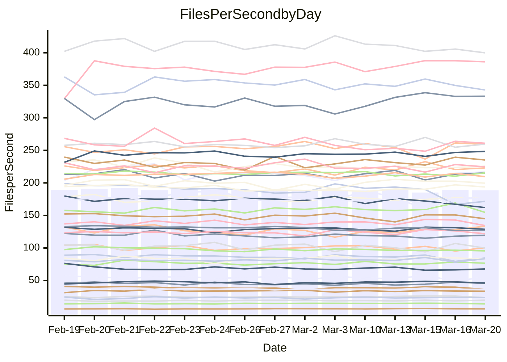

<!---
# This file is auto-generated. Do not edit.
# cspell:disable
--->
# Performance Report

Daily Performance

```mermaid
xychart-beta
    title Files Per Second by Day
    y-axis Files per Second
    x-axis Date [Feb-19, Feb-20, Feb-21, Feb-22, Feb-23, Feb-24, Feb-26, Feb-27, Mar-2, Mar-3, Mar-10, Mar-13, Mar-15, Mar-16, Mar-20]
    bar [189.21, 190.95, 191.93, 188.84, 190.95, 190.14, 188.86, 187.47, 189.15, 187.99, 188.38, 189.98, 185.21, 189.57, 188.63]
    line [45.95, 47.66, 45.50, 46.89, 43.13, 47.48, 43.86, 43.58, 44.95, 42.68, 45.79, 43.00, 44.30, 47.55, 45.42]
    line [132.26, 123.16, 133.27, 135.57, 126.55, 124.20, 119.96, 129.35, 126.96, 116.50, 125.61, 123.50, 128.64, 128.22, 133.34]
    line [19.76, 18.01, 18.46, 18.38, 19.68, 18.34, 19.60, 19.60, 19.63, 18.78, 19.22, 18.67, 19.78, 18.71, 19.79]
    line [74.92, 73.32, 81.29, 78.95, 76.37, 76.80, 73.75, 75.77, 77.40, 74.68, 79.36, 75.39, 75.58, 78.40, 76.58]
    line [6.24, 6.45, 6.67, 5.92, 6.38, 6.30, 6.44, 6.78, 6.62, 6.55, 6.32, 6.79, 7.12, 6.59, 6.35]
    line [88.86, 89.95, 85.47, 89.64, 87.93, 87.72, 85.68, 85.69, 83.26, 89.40, 86.73, 86.09, 89.20, 79.46, 84.64]
    line [136.95, 140.26, 134.61, 141.79, 137.76, 142.75, 135.42, 139.26, 136.06, 139.99, 140.01, 135.63, 143.93, 142.95, 134.36]
    line [131.86, 128.62, 131.04, 130.26, 129.44, 123.58, 128.31, 129.87, 130.27, 130.71, 127.81, 125.76, 132.01, 131.14, 128.67]
    line [84.44, 80.37, 87.47, 84.08, 83.91, 75.76, 83.59, 84.08, 83.89, 88.30, 81.02, 82.11, 85.90, 84.63, 82.99]
    line [203.99, 220.72, 225.56, 229.20, 204.56, 214.62, 214.22, 215.21, 211.23, 203.79, 213.30, 213.00, 209.05, 214.75, 216.78]
    line [122.32, 119.71, 119.61, 127.43, 118.55, 121.57, 118.53, 115.70, 116.93, 121.24, 118.95, 118.40, 114.99, 118.14, 119.47]
    line [226.10, 219.20, 223.30, 227.37, 223.02, 226.36, 218.81, 215.75, 221.50, 212.02, 224.11, 219.75, 232.68, 220.52, 223.12]
    line [25.52, 23.53, 25.65, 25.87, 24.49, 24.03, 24.62, 25.06, 24.45, 24.76, 24.74, 25.60, 26.18, 25.98, 23.83]
    line [157.72, 155.61, 153.59, 162.30, 157.06, 159.96, 153.79, 161.66, 159.28, 163.36, 159.01, 157.48, 159.10, 169.05, 154.54]
    line [40.89, 39.79, 40.82, 39.75, 38.29, 38.55, 38.02, 38.35, 35.65, 38.90, 38.99, 38.46, 40.13, 39.77, 36.42]
    line [363.00, 335.36, 339.22, 362.80, 356.26, 358.85, 353.61, 350.32, 358.90, 343.06, 352.21, 348.39, 359.59, 349.81, 342.75]
    line [329.33, 387.65, 379.15, 375.70, 377.89, 371.33, 366.95, 377.92, 377.66, 385.69, 370.91, 378.91, 387.90, 387.80, 386.06]
    line [76.41, 70.89, 67.31, 66.82, 66.94, 70.88, 67.89, 70.56, 67.78, 66.98, 69.18, 70.51, 65.83, 66.30, 67.73]
    line [232.74, 235.31, 224.47, 238.32, 230.44, 216.76, 225.02, 229.69, 222.82, 225.14, 221.56, 225.82, 223.33, 223.62, 225.78]
    line [56.33, 56.16, 52.87, 55.45, 55.44, 54.09, 53.55, 56.91, 50.34, 56.33, 53.77, 52.96, 57.64, 49.40, 55.01]
    line [329.84, 297.30, 325.03, 331.76, 320.00, 316.72, 330.45, 317.84, 319.02, 305.87, 317.67, 331.44, 338.69, 332.97, 333.24]
    line [255.70, 246.95, 250.90, 244.70, 255.35, 256.03, 252.54, 255.82, 263.63, 252.65, 260.43, 254.55, 236.73, 261.47, 259.22]
    line [257.67, 260.94, 258.83, 263.71, 255.40, 259.16, 257.65, 254.22, 257.02, 267.92, 259.39, 256.02, 269.97, 254.79, 259.65]
    line [14.06, 14.46, 15.41, 14.08, 14.28, 13.96, 14.98, 14.69, 15.09, 15.05, 14.93, 14.92, 15.23, 14.84, 14.06]
    line [31.35, 34.71, 33.66, 36.75, 33.50, 33.75, 33.98, 34.43, 34.99, 32.10, 34.36, 33.03, 34.53, 33.80, 33.49]
    line [80.83, 78.91, 82.42, 80.37, 81.15, 79.72, 81.93, 80.10, 84.29, 81.35, 81.66, 80.93, 85.41, 78.19, 83.51]
    line [123.51, 125.30, 123.36, 124.67, 122.06, 125.40, 123.31, 123.27, 118.58, 127.90, 124.38, 120.45, 128.40, 126.26, 121.85]
    line [44.67, 46.36, 48.18, 49.05, 48.06, 46.41, 47.91, 43.77, 46.60, 45.68, 47.70, 47.47, 48.64, 47.90, 46.22]
    line [178.51, 182.28, 170.09, 171.99, 177.77, 181.65, 177.93, 171.71, 171.61, 178.31, 176.56, 173.19, 174.63, 177.66, 175.92]
    line [178.13, 170.26, 181.98, 177.56, 185.31, 187.50, 177.93, 177.54, 178.41, 174.58, 186.65, 179.06, 166.05, 180.55, 173.75]
    line [213.09, 213.97, 220.46, 207.58, 214.51, 202.85, 211.79, 211.44, 214.66, 206.78, 214.22, 219.20, 204.44, 213.42, 215.32]
    line [104.64, 105.41, 96.15, 100.38, 103.85, 96.33, 99.09, 99.19, 100.48, 103.18, 103.33, 98.05, 102.55, 95.32, 100.34]
    line [104.57, 104.52, 96.66, 102.79, 103.56, 108.60, 97.11, 104.32, 106.04, 94.30, 104.19, 100.36, 94.07, 106.95, 99.82]
    line [214.67, 213.49, 218.19, 216.61, 212.54, 214.33, 212.86, 215.99, 216.40, 215.81, 217.40, 210.64, 213.63, 210.38, 215.44]
    line [239.70, 229.90, 235.21, 223.87, 231.37, 229.84, 219.75, 240.64, 223.28, 229.19, 235.85, 231.18, 227.46, 239.47, 235.22]
    line [198.97, 195.69, 196.29, 194.82, 190.50, 191.36, 189.34, 184.31, 185.47, 198.42, 191.68, 193.62, 189.84, 166.89, 171.60]
    line [231.02, 220.24, 226.17, 215.58, 226.36, 225.70, 222.46, 230.96, 236.51, 222.64, 222.38, 225.56, 216.60, 228.18, 224.68]
    line [179.91, 171.61, 176.10, 175.03, 175.02, 172.48, 176.50, 175.06, 173.05, 179.29, 168.17, 175.84, 172.23, 167.20, 162.09]
    line [194.32, 195.93, 197.80, 193.32, 192.22, 196.28, 187.50, 189.10, 188.54, 189.19, 186.81, 190.52, 190.26, 197.02, 193.75]
    line [37.40, 36.62, 38.51, 36.10, 37.37, 36.52, 37.66, 35.60, 37.02, 36.08, 36.38, 35.91, 38.37, 36.25, 36.61]
    line [132.77, 134.30, 133.46, 131.83, 132.27, 131.01, 131.00, 133.00, 131.45, 127.22, 127.60, 130.54, 131.20, 126.76, 126.98]
    line [205.73, 212.95, 211.55, 213.31, 213.15, 214.61, 215.98, 216.39, 213.20, 207.00, 210.46, 215.67, 209.05, 214.60, 209.59]
    line [402.21, 417.90, 421.85, 402.15, 417.55, 417.69, 405.05, 412.32, 405.86, 426.09, 413.29, 411.20, 402.18, 405.65, 399.88]
    line [97.51, 101.87, 100.27, 99.76, 98.90, 95.69, 94.30, 98.50, 95.82, 98.55, 97.82, 96.22, 96.21, 96.60, 95.61]
    line [152.26, 152.78, 149.55, 148.15, 148.90, 152.11, 143.30, 150.41, 149.07, 153.47, 146.06, 140.05, 150.95, 150.81, 144.94]
    line [24.64, 20.92, 22.32, 25.16, 23.04, 24.66, 23.19, 24.07, 21.50, 23.56, 24.56, 23.16, 23.57, 24.07, 23.83]
    line [268.41, 258.56, 256.27, 284.25, 260.54, 263.62, 267.57, 257.62, 270.01, 257.62, 250.97, 253.10, 248.68, 263.99, 260.91]
    line [231.62, 249.13, 242.45, 246.48, 246.10, 248.98, 240.98, 239.52, 244.96, 243.99, 244.22, 247.23, 240.74, 246.80, 248.37]
    line [196.35, 204.19, 205.00, 194.87, 203.28, 199.45, 200.84, 188.59, 197.81, 190.62, 200.86, 205.50, 202.63, 202.69, 199.56]
    line [173.68, 176.25, 178.32, 171.39, 176.96, 177.51, 175.27, 171.69, 175.82, 173.02, 172.27, 176.52, 160.55, 175.49, 175.91]
```

Time to Process Files

| Repository                                      | Elapsed | Min/Avg/Max           |   SD | SD Graph                |
| ----------------------------------------------- | ------: | :-------------------: | ---: | ----------------------- |
| AdaDoom3/AdaDoom3                    |    2.96 | 2.7 /   2.8 /   3.0   | 0.09 | `    ┣━━┻━━╋━━┻━●┫    ` |
| alexiosc/megistos                    |    7.09 | 6.7 /   7.2 /   8.1   | 0.33 | `    ┣━━┻━●╋━━┻━━┫    ` |
| apollographql/apollo-server          |    2.61 | 2.4 /   2.5 /   2.9   | 0.12 | `    ┣━━┻━━╋━●┻━━┫    ` |
| aspnetboilerplate/aspnetboilerplate  |    8.69 | 8.5 /   8.9 /   9.3   | 0.21 | `    ┣━━●━━╋━━┻━━┫    ` |
| aws-amplify/docs                     |   11.52 | 11.5 /  11.8 /  12.4  | 0.23 | `    ┣━━●━━╋━━┻━━┫    ` |
| Azure/azure-rest-api-specs           |    9.57 | 8.6 /   9.4 /  10.4   | 0.43 | `    ┣━━┻━━╋●━┻━━┫    ` |
| bitjson/typescript-starter           |    0.97 | 0.9 /   1.0 /   1.2   | 0.05 | `     ┣●┻━━╋━━┻━┫     ` |
| caddyserver/caddy                    |    3.56 | 3.2 /   3.4 /   4.1   | 0.16 | `    ┣━━┻━━╋━●┻━━┫    ` |
| canada-ca/open-source-logiciel-libre |    1.09 | 1.0 /   1.1 /   1.2   | 0.06 | `     ┣━┻━━●━━┻━┫     ` |
| chef/chef                            |    5.31 | 5.1 /   5.4 /   5.8   | 0.17 | `    ┣━━┻●━╋━━┻━━┫    ` |
| dart-lang/sdk                        |   56.50 | 52.6 /  55.1 /  60.9  | 1.45 | `  ┣━━━┻━━━╋━━━●━━━┫  ` |
| django/django                        |   13.61 | 13.0 /  13.5 /  14.8  | 0.37 | `    ┣━━┻━━╋●━┻━━┫    ` |
| eslint/eslint                        |    9.56 | 9.1 /   9.6 /  10.4   | 0.26 | `    ┣━━┻━●╋━━┻━━┫    ` |
| exonum/exonum                        |    3.38 | 3.2 /   3.4 /   3.7   | 0.11 | `    ┣━━┻━●╋━━┻━━┫    ` |
| flutter/samples                      |   14.32 | 14.1 /  14.8 /  17.3  | 0.64 | `   ┣━━━●━━╋━━┻━━━┫   ` |
| gitbucket/gitbucket                  |    3.18 | 3.0 /   3.2 /   3.7   | 0.15 | `    ┣━━┻━●╋━━┻━━┫    ` |
| googleapis/google-cloud-cpp          |  119.66 | 112.8 / 118.1 / 129.5 | 3.46 | `  ┣━━━┻━━━╋━●━┻━━━┫  ` |
| graphql/express-graphql              |    1.13 | 1.0 /   1.1 /   1.2   | 0.06 | `     ┣━┻━━╋●━┻━┫     ` |
| graphql/graphql-js                   |    2.67 | 2.6 /   2.7 /   2.9   | 0.10 | `    ┣━━┻━━●━━┻━━┫    ` |
| graphql/graphql-relay-js             |    1.29 | 1.0 /   1.1 /   1.3   | 0.06 | `     ┣━┻━━╋━━┻━┫ ●   ` |
| graphql/graphql-spec                 |    1.62 | 1.2 /   1.3 /   1.5   | 0.06 | `      ┣━┻━╋━┻━┫     ●` |
| iluwatar/java-design-patterns        |   11.69 | 10.9 /  11.7 /  12.3  | 0.33 | `    ┣━━┻━━●━━┻━━┫    ` |
| ktaranov/sqlserver-kit               |    5.78 | 5.5 /   5.9 /   6.6   | 0.26 | `    ┣━━┻●━╋━━┻━━┫    ` |
| liriliri/licia                       |    3.73 | 3.6 /   3.8 /   4.4   | 0.15 | `    ┣━━┻●━╋━━┻━━┫    ` |
| MartinThoma/LaTeX-examples           |    6.31 | 5.9 /   6.2 /   7.0   | 0.24 | `    ┣━━┻━━╋●━┻━━┫    ` |
| mdx-js/mdx                           |    1.80 | 1.7 /   1.8 /   2.1   | 0.10 | `    ┣━━┻━●╋━━┻━━┫    ` |
| microsoft/TypeScript-Website         |    5.40 | 4.9 /   5.1 /   5.7   | 0.22 | `    ┣━━┻━━╋━━┻●━┫    ` |
| MicrosoftDocs/PowerShell-Docs        |   20.73 | 19.6 /  20.3 /  22.4  | 0.61 | `   ┣━━━┻━━╋━●┻━━━┫   ` |
| neovim/nvim-lspconfig                |    4.88 | 3.8 /   4.1 /   5.1   | 0.32 | `    ┣━━┻━━╋━━┻━━┫●   ` |
| pagekit/pagekit                      |    3.40 | 3.2 /   3.5 /   4.7   | 0.24 | `    ┣━━┻━●╋━━┻━━┫    ` |
| php/php-src                          |   24.12 | 22.3 /  23.3 /  25.1  | 0.61 | `   ┣━━━┻━━╋━━┻●━━┫   ` |
| plasticrake/tplink-smarthome-api     |    1.37 | 1.2 /   1.3 /   1.5   | 0.06 | `     ┣━┻━━╋━━●━┫     ` |
| prettier/prettier                    |    8.27 | 7.2 /   7.6 /   8.1   | 0.21 | `    ┣━━┻━━╋━━┻━━┫   ●` |
| pycontribs/jira                      |    1.49 | 1.3 /   1.5 /   1.7   | 0.09 | `     ┣━┻━━╋●━┻━┫     ` |
| RustPython/RustPython                |    6.33 | 5.9 /   6.4 /   6.9   | 0.22 | `    ┣━━┻━●╋━━┻━━┫    ` |
| shoelace-style/shoelace              |    3.03 | 2.5 /   2.8 /   3.1   | 0.12 | `    ┣━━┻━━╋━━┻━━●    ` |
| slint-ui/slint                       |   13.44 | 12.7 /  13.2 /  13.9  | 0.30 | `    ┣━━┻━━╋━━●━━┫    ` |
| SoftwareBrothers/admin-bro           |    2.83 | 2.3 /   2.4 /   2.7   | 0.09 | `     ┣━┻━━╋━━┻━┫    ●` |
| sveltejs/svelte                      |   22.89 | 19.8 /  20.7 /  22.1  | 0.57 | `     ┣━┻━━╋━━┻━┫    ●` |
| TheAlgorithms/Python                 |    5.27 | 5.2 /   5.5 /   5.9   | 0.18 | `    ┣━●┻━━╋━━┻━━┫    ` |
| twbs/bootstrap                       |    1.69 | 1.5 /   1.7 /   2.0   | 0.08 | `     ┣━┻━●╋━━┻━┫     ` |
| typescript-cheatsheets/react         |    1.43 | 1.2 /   1.4 /   1.6   | 0.08 | `     ┣━┻━━╋━●┻━┫     ` |
| typescript-eslint/typescript-eslint  |    3.93 | 3.8 /   4.1 /   4.5   | 0.16 | `    ┣━━┻●━╋━━┻━━┫    ` |
| vitest-dev/vitest                    |   11.24 | 10.2 /  11.0 /  11.8  | 0.43 | `    ┣━━┻━━╋━●┻━━┫    ` |
| w3c/aria-practices                   |    3.07 | 3.1 /   3.3 /   4.1   | 0.20 | `    ┣━━●━━╋━━┻━━┫    ` |
| w3c/specberus                        |    1.86 | 1.8 /   1.9 /   2.3   | 0.11 | `    ┣━━┻●━╋━━┻━━┫    ` |
| webdeveric/webpack-assets-manifest   |    1.19 | 1.1 /   1.2 /   1.4   | 0.08 | `     ┣━┻━●╋━━┻━┫     ` |
| webpack/webpack                      |    4.88 | 4.8 /   5.1 /   5.5   | 0.18 | `    ┣━●┻━━╋━━┻━━┫    ` |
| wireapp/wire-desktop                 |    1.35 | 1.2 /   1.3 /   1.4   | 0.06 | `     ┣━┻━━╋━●┻━┫     ` |
| wireapp/wire-webapp                  |   11.03 | 10.5 /  11.0 /  12.1  | 0.35 | `    ┣━━┻━━●━━┻━━┫    ` |

Note:
- Elapsed time is in seconds.

Files per Second over Time

| Repository                                      | Files |    Sec |    Fps |     Rel | Trend Fps              |    N |
| ----------------------------------------------- | ----: | -----: | -----: | ------: | ---------------------- | ---: |
| AdaDoom3/AdaDoom3                    |   103 |   2.96 |  34.81 |  -5.72% | `▇▄▇▇▆█▆▆▆▆▅▅▇▅█▇▅▇█▅` |   38 |
| alexiosc/megistos                    |   583 |   7.09 |  82.17 |   0.91% | `▅▇█▆▆▆█▇▇▇▃▅▆▇█▅▅█▇▇` |   38 |
| apollographql/apollo-server          |   254 |   2.61 |  97.42 |  -3.49% | `▆██▆███████▇▆▆█▄▇█▇▆` |   38 |
| aspnetboilerplate/aspnetboilerplate  |  2286 |   8.69 | 262.99 |   1.95% | `▆▆▆▆█▇▅█▆▆▇▆▇▅█▇▅█▄▇` |   38 |
| aws-amplify/docs                     |  2874 |  11.52 | 249.56 |   2.05% | `▇▅▇▇▇▇██▅▆▇█▇▇▆▇█▇██` |   38 |
| Azure/azure-rest-api-specs           |  2478 |   9.57 | 259.07 |  -0.40% | `▅███▆▃▆█▅▄▅▄█▄▅▇▇▇▆▆` |   38 |
| bitjson/typescript-starter           |    20 |   0.97 |  20.67 |   7.60% | `▆▇▇▇▆▆█▄▆▆▇▇▇▃▇▅▆▆▆█` |   38 |
| caddyserver/caddy                    |   301 |   3.56 |  84.48 |  -2.27% | `▆█▇▅█▇▇██▇▆█▆▇█▇▃▇▆▆` |   38 |
| canada-ca/open-source-logiciel-libre |     7 |   1.09 |   6.43 |  -0.68% | `▇▇▆▇▆▆▅▄▃▆▅▇▆▇█▇▅▆▄▅` |   38 |
| chef/chef                            |  1200 |   5.31 | 226.07 |   1.80% | `▅▆█▅▅▆▆▇▇▇█▇▇▄█▇▆▆▇▇` |   38 |
| dart-lang/sdk                        | 11126 |  56.50 | 196.92 |  -1.91% | `▃▆▇▆▅▆▇▇▆▇▇██▆▇▇▇▇▆▆` |   38 |
| django/django                        |  2897 |  13.61 | 212.87 |  -0.70% | `▆▇▇▇▇█▇█▇▇▇█▄▆▇▆▆▇█▆` |   38 |
| eslint/eslint                        |  2050 |   9.56 | 214.53 |   0.53% | `▆▆▇▆▅▇▅▆▇▆██▇▆▅▇▅▇▇▇` |   38 |
| exonum/exonum                        |   421 |   3.38 | 124.71 |   1.22% | `▇▆▆▄█▇▇▇▆▆▇▆▅▆██▆▅▆▇` |   38 |
| flutter/samples                      |  2494 |  14.32 | 174.12 |   0.85% | `█▇▇▇██▄█▃█▇▇██▇▇▅▄▅▇` |   38 |
| gitbucket/gitbucket                  |   415 |   3.18 | 130.71 |   1.50% | `▇██▇▇▃▇██▇▇▅▆▇█▇█▆█▇` |   38 |
| googleapis/google-cloud-cpp          | 20796 | 119.66 | 173.79 |  -0.64% | `▇▇█▇▇▇▇▆▇▇▆██▇▄▇███▇` |   38 |
| graphql/express-graphql              |    26 |   1.13 |  23.06 |  -1.91% | `▅▇▄▃▅█▆▇▆▅▆▆▆▃▅▆▆▆▆▅` |   38 |
| graphql/graphql-js                   |   371 |   2.67 | 139.20 |   0.78% | `▇▆▅▇▇▇▇▆▇█▆█▅▅███▄▆▇` |   38 |
| graphql/graphql-relay-js             |    28 |   1.29 |  21.71 | -12.77% | `▆▇▇▆▇▇▅▇▅██▇█▇█▇█▆▇▃` |   38 |
| graphql/graphql-spec                 |    19 |   1.62 |  11.73 | -20.37% | `▆▆▆▇▇▆▆▆▇▆▇█▅▆▇▇▅█▆▁` |   38 |
| iluwatar/java-design-patterns        |  2060 |  11.69 | 176.29 |   0.05% | `▆▆▆▅▇▇█▅█▇▆▆▅▇▆▇▇▆▇▇` |   38 |
| ktaranov/sqlserver-kit               |   490 |   5.78 |  84.77 |   2.04% | `▇▆▇▆█▆▃▆▄▇▆▇▅▅▇█▆▆▆▇` |   38 |
| liriliri/licia                       |  1437 |   3.73 | 384.97 |   2.44% | `▇█▇▇██▅▇▇▅█▇▇▇██████` |   38 |
| MartinThoma/LaTeX-examples           |  1409 |   6.31 | 223.14 |  -1.34% | `▇█▆▇▇▃▅▆██▆▆▇█▆▇▆▇▇▆` |   38 |
| mdx-js/mdx                           |   140 |   1.80 |  77.62 |   1.11% | `▇▅▆█▆██▇▇█▇▄█▆▆▇▇▇▆▇` |   38 |
| microsoft/TypeScript-Website         |   756 |   5.40 | 140.12 |  -5.21% | `▆█▇▇█▅▆██▃▇▃▆▅▇▇▇▆▇▅` |   38 |
| MicrosoftDocs/PowerShell-Docs        |  2648 |  20.73 | 127.74 |  -2.16% | `███▇▆▅▆▇▇▇▅█▆▇▇▇▅▄█▆` |   38 |
| neovim/nvim-lspconfig                |   837 |   4.88 | 171.63 |  -9.19% | `▆▅▅▇▇▃▆▇▇▇▇▆▆█▆▃▄▄▃▄` |   38 |
| pagekit/pagekit                      |   741 |   3.40 | 218.14 |   2.67% | `▇▇▆▇▆▇▆█▇▇▆▇▇▇▆▇▇▇█▇` |   38 |
| php/php-src                          |  2274 |  24.12 |  94.26 |  -3.30% | `██▅██▇▇▇██▇▇▇▆▇█▆▆█▆` |   38 |
| plasticrake/tplink-smarthome-api     |    62 |   1.37 |  45.10 |  -4.70% | `▃▄▃█▅█▄▆▆▆▅▅▅▇▆▆▆▅▆▄` |   38 |
| prettier/prettier                    |  2665 |   8.27 | 322.35 |  -8.64% | `▆██▇▆▆▇▆▇█▇▆▅██▇▆█▆▄` |   38 |
| pycontribs/jira                      |    79 |   1.49 |  53.10 |  -2.07% | `▇█▃▇▇▆▅▇▇▅█▇▅▆█▄▅█▇▆` |   38 |
| RustPython/RustPython                |   764 |   6.33 | 120.69 |   1.49% | `▅▇▅▇▇▆▆█▇▇▅▆▆▇▅█▅█▅▇` |   38 |
| shoelace-style/shoelace              |   440 |   3.03 | 145.26 |  -8.33% | `▆▆▇▅▆▆▅▆▅▄▇▆▄▆▆█▇▆▅▃` |   38 |
| slint-ui/slint                       |  2808 |  13.44 | 208.96 |  -1.82% | `▇█▇▆▆▅█▆▆▅██▇▇▆▇▇▅▇▆` |   38 |
| SoftwareBrothers/admin-bro           |   441 |   2.83 | 156.10 | -13.97% | `▅▆▄▇▅███▇▇▆▄▆▇▃▅▇▇▆▂` |   38 |
| sveltejs/svelte                      |  8589 |  22.89 | 375.27 |  -9.03% | `▆█▅▇█▆▇▄███▅▇█▆▇▆▇▇▃` |   38 |
| TheAlgorithms/Python                 |  1407 |   5.27 | 266.77 |   4.48% | `▆▇█▇▆▇▇▇█▇▆▆▅█▄▇▇█▅█` |   38 |
| twbs/bootstrap                       |   118 |   1.69 |  69.65 |   1.81% | `██▇▇▆▇▇██▆▇▇██▆█▅▅█▇` |   38 |
| typescript-cheatsheets/react         |    53 |   1.43 |  37.18 |  -3.60% | `█▅▅▄▇█▇▅▇▇▇▇▅█▇▇▇▅▅▆` |   38 |
| typescript-eslint/typescript-eslint  |  1308 |   3.93 | 332.71 |   2.99% | `▆▆▅▇▅▆▄▇▇▃▇▇▇▇██▇▇█▇` |   38 |
| vitest-dev/vitest                    |  2566 |  11.24 | 228.30 |  -1.45% | `▆█▅▄▅██▅▅▅▆▆▆▄▅▅█▅▇▅` |   38 |
| w3c/aria-practices                   |   414 |   3.07 | 134.80 |   6.68% | `▇▇▇▇▅█▆▇▄██▇▅▆▇█▆█▇█` |   38 |
| w3c/specberus                        |   197 |   1.86 | 106.08 |   3.85% | `▆▇▆█▅▇▅▇▇█▇▅▇▆▄█▇▅▆▇` |   38 |
| webdeveric/webpack-assets-manifest   |    55 |   1.19 |  46.15 |   3.15% | `▅▅▆▅▄▆▃█▆▆▆▆▄▄▅▆▇▆▅▆` |   38 |
| webpack/webpack                      |  1148 |   4.88 | 235.19 |   4.51% | `▇▇██▆█▅▇▇▄▄▆▆▇▅▆▇▆▅█` |   38 |
| wireapp/wire-desktop                 |    44 |   1.35 |  32.56 |  -3.90% | `▆▆▅█▄▇▃▇▆▆▆▄▆▅▆▇▄▅▆▅` |   37 |
| wireapp/wire-webapp                  |  2123 |  11.03 | 192.54 |   0.65% | `▆▇▇▅▆▆▆▅▇▅▆▇▇▆▆▇█▇▇▇` |   38 |

Data Throughput

| Repository                                      | Files |    Sec |     Kps |     Rel | Trend Kps              |    N |
| ----------------------------------------------- | ----: | -----: | ------: | ------: | ---------------------- | ---: |
| AdaDoom3/AdaDoom3                    |   103 |   2.96 |  739.79 |  -5.72% | `▇▄▇▇▆█▆▆▆▆▅▅▇▅█▇▅▇█▅` |   38 |
| alexiosc/megistos                    |   583 |   7.09 |  645.70 |   0.91% | `▅▇█▆▆▆█▇▇▇▃▅▆▇█▅▅█▇▇` |   38 |
| apollographql/apollo-server          |   254 |   2.61 |  800.48 |  -3.49% | `▆██▆███████▇▆▆█▄▇█▇▆` |   38 |
| aspnetboilerplate/aspnetboilerplate  |  2286 |   8.69 |  639.87 |   1.95% | `▆▆▆▆█▇▅█▆▆▇▆▇▅█▇▅█▄▇` |   38 |
| aws-amplify/docs                     |  2874 |  11.52 |  872.60 |   2.05% | `▇▅▇▇▇▇██▅▆▇█▇▇▆▇█▇██` |   38 |
| Azure/azure-rest-api-specs           |  2478 |   9.57 |  760.37 |   6.77% | `▃▅▅▅▄▄▆█▆▅▆▅█▅▆▇▇█▆▇` |   38 |
| bitjson/typescript-starter           |    20 |   0.97 |   82.68 |   7.60% | `▆▇▇▇▆▆█▄▆▆▇▇▇▃▇▅▆▆▆█` |   38 |
| caddyserver/caddy                    |   301 |   3.56 |  752.14 |  -1.32% | `▅▇▆▅█▇▇██▇▆█▆▇█▇▃▇▆▆` |   38 |
| canada-ca/open-source-logiciel-libre |     7 |   1.09 |   53.26 |  -0.68% | `▇▇▆▇▆▆▅▄▃▆▅▇▆▇█▇▅▆▄▅` |   38 |
| chef/chef                            |  1200 |   5.31 | 1061.57 |   1.83% | `▅▆█▅▅▆▆▇▇▇█▇▇▄█▇▆▆▇▇` |   38 |
| dart-lang/sdk                        | 11126 |  56.50 | 1332.29 |  -2.21% | `▃▆▇▆▅▆▇▇▆▇▇██▆▇▆▇▇▆▆` |   38 |
| django/django                        |  2897 |  13.61 | 1347.85 |  -0.56% | `▆▇▇▇▇█▇█▇▇▇█▄▆▇▆▆▇█▆` |   38 |
| eslint/eslint                        |  2050 |   9.56 | 1489.90 |   0.54% | `▆▆▇▆▅▇▅▆▇▆██▇▆▅▇▅▇▇▇` |   38 |
| exonum/exonum                        |   421 |   3.38 | 1192.85 |   1.22% | `▇▆▆▄█▇▇▇▆▆▇▆▅▆██▆▅▆▇` |   38 |
| flutter/samples                      |  2494 |  14.32 | 1501.22 |   2.75% | `█▇▇▇██▄█▃█▇▇██▇▇▆▅▅█` |   38 |
| gitbucket/gitbucket                  |   415 |   3.18 |  603.77 |   2.16% | `▆▇▇▇▇▃▇██▇▇▅▆▇█▇█▆█▇` |   38 |
| googleapis/google-cloud-cpp          | 20796 | 119.66 | 1470.26 |   0.49% | `▆▆█▇▇▇▇▆▇▇▆██▇▄▇███▇` |   38 |
| graphql/express-graphql              |    26 |   1.13 |  105.55 |  -1.91% | `▅▇▄▃▅█▆▇▆▅▆▆▆▃▅▆▆▆▆▅` |   38 |
| graphql/graphql-js                   |   371 |   2.67 |  816.07 |   1.22% | `▇▆▅▇▇▇▇▆▇█▆█▅▅███▄▆▇` |   38 |
| graphql/graphql-relay-js             |    28 |   1.29 |   85.28 | -12.77% | `▆▇▇▆▇▇▅▇▅██▇█▇█▇█▆▇▃` |   38 |
| graphql/graphql-spec                 |    19 |   1.62 |  391.51 | -20.37% | `▆▆▆▇▇▆▆▆▇▆▇█▅▆▇▇▅█▆▁` |   38 |
| iluwatar/java-design-patterns        |  2060 |  11.69 |  543.32 |  -0.01% | `▅▆▆▅▇▆█▅█▇▆▆▅▇▆▇▇▆▇▇` |   38 |
| ktaranov/sqlserver-kit               |   490 |   5.78 | 1284.23 |   2.24% | `▇▆▇▆█▆▃▆▄▇▆▇▅▅▇█▆▆▆▇` |   38 |
| liriliri/licia                       |  1437 |   3.73 |  458.64 |   2.44% | `▇█▇▇██▅▇▇▅█▇▇▇██████` |   38 |
| MartinThoma/LaTeX-examples           |  1409 |   6.31 |  460.85 |  -1.34% | `▇█▆▇▇▃▅▆██▆▆▇█▆▇▆▇▇▆` |   38 |
| mdx-js/mdx                           |   140 |   1.80 |  363.16 |   1.76% | `▇▅▆█▆██▇▇█▇▄█▆▆▇█▇▆▇` |   38 |
| microsoft/TypeScript-Website         |   756 |   5.40 |  967.84 |  -5.64% | `▆█▇▇█▅▆█▇▃▇▃▆▅▇▇▇▆▇▅` |   38 |
| MicrosoftDocs/PowerShell-Docs        |  2648 |  20.73 | 1335.98 |  -2.14% | `█▇█▇▆▅▆▇▇▇▅█▆▇▇▇▅▄█▆` |   38 |
| neovim/nvim-lspconfig                |   837 |   4.88 |  460.95 |  23.27% | `▃▃▃▄▄▂▄▄▄▄▄▄▃▅▃▇██▇█` |   38 |
| pagekit/pagekit                      |   741 |   3.40 |  454.83 |   2.67% | `▇▇▆▇▆▇▆█▇▇▆▇▇▇▆▇▇▇█▇` |   38 |
| php/php-src                          |  2274 |  24.12 | 1643.51 |  -3.21% | `██▅███▇▇██▇▇▇▆▇█▆▆█▆` |   38 |
| plasticrake/tplink-smarthome-api     |    62 |   1.37 |  243.69 |  -4.70% | `▃▄▃█▅█▄▆▆▆▅▅▅▇▆▆▆▅▆▄` |   38 |
| prettier/prettier                    |  2665 |   8.27 |  443.30 |  -8.66% | `▆██▇▆▆▇▆▇█▇▆▅██▇▆█▆▄` |   38 |
| pycontribs/jira                      |    79 |   1.49 |  376.39 |  -2.07% | `▇█▃▇▇▆▅▇▇▅█▇▅▆█▄▅█▇▆` |   38 |
| RustPython/RustPython                |   764 |   6.33 | 1865.26 |   4.79% | `▄▅▅▆▇▇▆█▇▇▆▆▆█▆█▆█▆▇` |   38 |
| shoelace-style/shoelace              |   440 |   3.03 |  700.89 |  -8.35% | `▆▆▇▅▆▆▅▆▅▄▇▆▄▆▆█▇▆▅▃` |   38 |
| slint-ui/slint                       |  2808 |  13.44 | 1306.59 |  -1.47% | `▇██▆▆▅█▆▆▅██▇▇▆▇▇▅▇▆` |   38 |
| SoftwareBrothers/admin-bro           |   441 |   2.83 |  344.07 | -13.97% | `▅▆▄▇▅███▇▇▆▄▆▇▃▅▇▇▆▂` |   38 |
| sveltejs/svelte                      |  8589 |  22.89 |  253.98 |  -8.92% | `▆█▅▇█▆▇▄███▅▇█▆▇▆▇▇▃` |   38 |
| TheAlgorithms/Python                 |  1407 |   5.27 |  681.23 |   4.67% | `▆▇█▇▆▇▇▇█▇▆▆▅█▄▇▇█▅█` |   38 |
| twbs/bootstrap                       |   118 |   1.69 |  571.99 |   1.81% | `██▇▇▆▇▇██▆▇▇██▆█▅▅█▇` |   38 |
| typescript-cheatsheets/react         |    53 |   1.43 |  275.68 |  -3.60% | `█▅▅▄▇█▇▅▇▇▇▇▅█▇▇▇▅▅▆` |   38 |
| typescript-eslint/typescript-eslint  |  1308 |   3.93 | 1756.91 |   3.04% | `▆▆▅▇▅▆▄▇█▃▇▇▇▇██▇▇█▇` |   38 |
| vitest-dev/vitest                    |  2566 |  11.24 |  697.70 |  -0.72% | `▆█▅▄▅██▅▅▅▆▆▆▄▅▆█▆█▅` |   38 |
| w3c/aria-practices                   |   414 |   3.07 | 1259.15 |   6.68% | `▇▇▇▇▅█▆▇▄██▇▅▆▇█▆█▇█` |   38 |
| w3c/specberus                        |   197 |   1.86 |  351.64 |   5.25% | `▆▇▆█▅▇▆▇██▇▅▇▆▅██▅▆█` |   38 |
| webdeveric/webpack-assets-manifest   |    55 |   1.19 |  105.72 |   3.15% | `▅▅▆▅▄▆▃█▆▆▆▆▄▄▅▆▇▆▅▆` |   38 |
| webpack/webpack                      |  1148 |   4.88 | 1103.65 |   4.85% | `▇▇██▆█▅▇▇▄▄▆▆▇▅▇▇▆▅█` |   38 |
| wireapp/wire-desktop                 |    44 |   1.35 |  145.06 |  -3.90% | `▆▆▅█▄▇▃▇▆▆▆▄▆▅▆▇▄▅▆▅` |   37 |
| wireapp/wire-webapp                  |  2123 |  11.03 |  761.80 |   1.66% | `▅▇▇▅▆▅▆▅▇▅▆▆▆▆▆▇██▇▇` |   38 |

