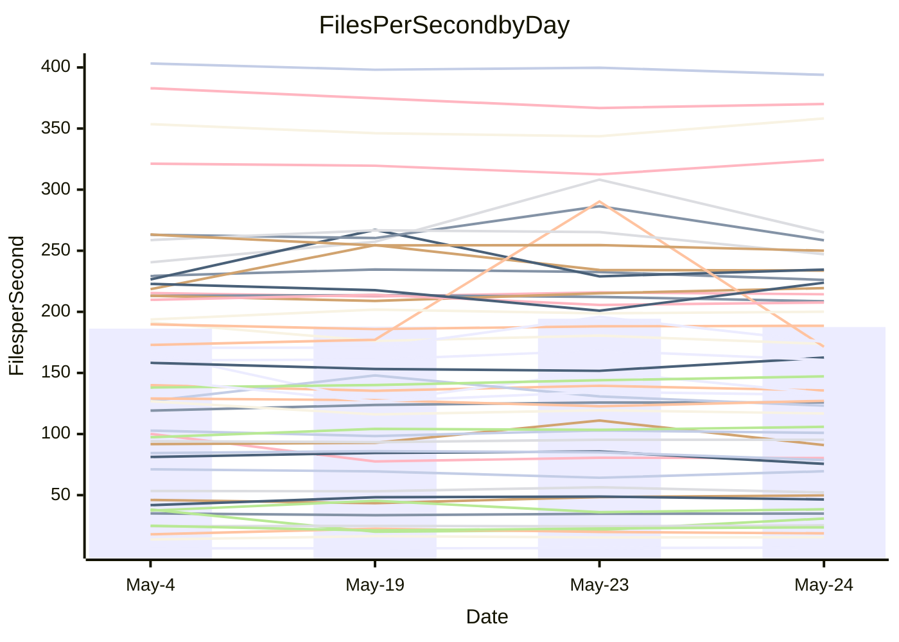

<!---
# This file is auto-generated. Do not edit.
# cspell:disable
--->
# Performance Report

Daily Performance

```mermaid
xychart-beta
    title Files Per Second by Day
    y-axis Files per Second
    x-axis Date [May-4, May-19, May-23, May-24]
    bar [186.25, 187.94, 194.38, 187.53]
    line [35.07, 33.61, 34.69, 34.94]
    line [140.01, 135.42, 139.50, 135.65]
    line [53.38, 53.17, 56.48, 52.20]
    line [38.18, 20.00, 21.53, 30.85]
    line [46.04, 43.44, 48.37, 49.79]
    line [71.11, 69.47, 64.25, 69.53]
    line [100.08, 77.54, 80.59, 80.29]
    line [81.26, 84.52, 85.73, 75.59]
    line [191.37, 176.15, 180.59, 173.73]
    line [166.55, 126.61, 150.87, 133.44]
    line [119.17, 123.77, 125.73, 125.94]
    line [17.95, 22.53, 19.87, 18.72]
    line [24.56, 24.84, 24.48, 25.27]
    line [24.93, 21.05, 22.73, 23.64]
    line [91.75, 92.82, 111.10, 90.94]
    line [102.79, 98.35, 102.96, 100.96]
    line [382.99, 374.77, 366.83, 370.08]
    line [158.32, 153.28, 151.73, 162.52]
    line [13.72, 16.48, 15.39, 15.58]
    line [6.46, 6.48, 6.70, 7.10]
    line [229.32, 234.71, 232.57, 226.13]
    line [189.78, 185.86, 188.16, 188.58]
    line [240.52, 257.39, 308.24, 265.00]
    line [37.38, 45.35, 36.07, 38.42]
    line [218.55, 254.57, 234.26, 233.79]
    line [127.00, 147.92, 130.77, 123.22]
    line [215.39, 212.55, 215.84, 214.38]
    line [226.51, 267.13, 229.05, 234.58]
    line [353.58, 346.15, 343.69, 358.26]
    line [160.29, 160.94, 168.26, 160.60]
    line [213.17, 213.72, 212.23, 208.69]
    line [129.13, 127.71, 122.71, 127.15]
    line [94.12, 93.35, 95.34, 95.32]
    line [138.03, 140.07, 144.01, 147.15]
    line [213.15, 208.87, 215.23, 219.43]
    line [84.38, 85.95, 85.08, 78.77]
    line [321.24, 319.57, 312.48, 324.31]
    line [41.81, 48.29, 48.86, 46.46]
    line [126.81, 116.06, 119.43, 116.84]
    line [144.52, 126.78, 134.48, 131.99]
    line [263.11, 260.36, 286.42, 258.60]
    line [172.93, 177.15, 290.28, 171.42]
    line [258.73, 266.74, 265.26, 247.18]
    line [97.37, 104.19, 103.43, 105.92]
    line [263.28, 254.35, 254.61, 250.00]
    line [403.25, 398.12, 399.78, 393.93]
    line [209.84, 213.89, 205.67, 207.63]
    line [222.86, 217.73, 200.96, 223.84]
    line [193.68, 201.86, 198.76, 200.08]
    line [170.59, 170.67, 195.94, 175.36]
```

Time to Process Files

| Repository                                      | Elapsed | Min/Avg/Max          |    SD | SD Graph                |
| ----------------------------------------------- | ------: | :------------------: | ----: | ----------------------- |
| AdaDoom3/AdaDoom3                    |    2.77 | 2.2 /   2.6 /   2.9  |  0.25 | `    ┣━━┻━━╋━●┻━━┫    ` |
| alexiosc/megistos                    |    7.85 | 6.7 /   6.9 /   7.0  |  0.13 | `       ┣━┻╋┻━┫      ●` |
| apollographql/apollo-server          |    2.61 | 2.4 /   2.5 /   2.6  |  0.06 | `     ┣━┻━━╋━━┻●┫     ` |
| aspnetboilerplate/aspnetboilerplate  |    9.01 | 8.7 /   9.0 /   9.3  |  0.21 | `    ┣━━┻━━●━━┻━━┫    ` |
| aws-amplify/docs                     |   12.86 | 10.1 /  12.3 /  13.4 |  1.06 | `    ┣━━┻━━╋━●┻━━┫    ` |
| Azure/azure-rest-api-specs           |    9.57 | 9.3 /   9.6 /  10.7  |  0.49 | `    ┣━━┻━●╋━━┻━━┫    ` |
| bitjson/typescript-starter           |    1.13 | 0.8 /   1.0 /   1.1  |  0.10 | `     ┣━┻━━╋━━┻●┫     ` |
| caddyserver/caddy                    |    3.46 | 2.7 /   3.2 /   3.4  |  0.28 | `    ┣━━┻━━╋━━●━━┫    ` |
| canada-ca/open-source-logiciel-libre |    1.07 | 0.9 /   1.0 /   1.1  |  0.07 | `     ┣━┻━━╋●━┻━┫     ` |
| chef/chef                            |    4.63 | 4.7 /   4.8 /   4.9  |  0.09 | `   ● ┣━┻━━╋━━┻━┫     ` |
| dart-lang/sdk                        |   55.49 | 55.7 /  57.5 /  58.7 |  1.09 | `   ┣●━┻━━━╋━━━┻━━┫   ` |
| django/django                        |   13.98 | 13.4 /  13.9 /  14.2 |  0.27 | `    ┣━━┻━━╋●━┻━━┫    ` |
| eslint/eslint                        |   10.03 | 9.5 /   9.7 /   9.9  |  0.13 | `    ┣━━┻━━╋━━┻━━●    ` |
| exonum/exonum                        |    3.38 | 3.3 /   3.4 /   3.5  |  0.08 | `     ┣━┻━━●━━┻━┫     ` |
| flutter/samples                      |   12.93 | 11.7 /  12.7 /  13.6 |  0.59 | `    ┣━━┻━━╋●━┻━━┫    ` |
| gitbucket/gitbucket                  |    3.19 | 2.5 /   3.0 /   3.4  |  0.36 | `    ┣━━┻━━╋━●┻━━┫    ` |
| googleapis/google-cloud-cpp          |  119.90 | 95.0 / 117.3 / 123.3 | 10.05 | `  ┣━━━┻━━━╋●━━┻━━━┫  ` |
| graphql/express-graphql              |    1.12 | 1.0 /   1.1 /   1.3  |  0.08 | `     ┣━┻━●╋━━┻━┫     ` |
| graphql/graphql-js                   |    2.84 | 2.6 /   2.7 /   2.9  |  0.08 | `     ┣━┻━━╋━━┻━●     ` |
| graphql/graphql-relay-js             |    1.06 | 1.1 /   1.1 /   1.2  |  0.02 | `  ●  ┣━━┻━╋━┻━━┫     ` |
| graphql/graphql-spec                 |    1.21 | 1.0 /   1.2 /   1.4  |  0.11 | `     ┣━┻━●╋━━┻━┫     ` |
| iluwatar/java-design-patterns        |   11.96 | 7.1 /  10.9 /  12.1  |  1.90 | `   ┣━━━┻━━╋━●┻━━━┫   ` |
| ktaranov/sqlserver-kit               |    5.72 | 5.7 /   6.1 /   7.5  |  0.63 | `    ┣━━┻●━╋━━┻━━┫    ` |
| liriliri/licia                       |    3.84 | 3.7 /   3.9 /   4.1  |  0.13 | `    ┣━━┻━●╋━━┻━━┫    ` |
| MartinThoma/LaTeX-examples           |    6.50 | 5.9 /   6.0 /   6.1  |  0.10 | `      ┣━┻━╋━┻━┫     ●` |
| mdx-js/mdx                           |    1.76 | 1.4 /   1.7 /   1.9  |  0.16 | `     ┣━┻━━╋●━┻━┫     ` |
| microsoft/TypeScript-Website         |    4.95 | 5.2 /   5.4 /   5.6  |  0.12 | `●    ┣━┻━━╋━━┻━┫     ` |
| MicrosoftDocs/PowerShell-Docs        |   25.15 | 24.0 /  24.7 /  25.7 |  0.66 | `   ┣━━━┻━━╋━●┻━━━┫   ` |
| neovim/nvim-lspconfig                |    5.14 | 5.1 /   5.3 /   5.6  |  0.16 | `    ┣━━●━━╋━━┻━━┫    ` |
| pagekit/pagekit                      |    3.44 | 3.4 /   3.5 /   3.6  |  0.07 | `     ┣━┻━●╋━━┻━┫     ` |
| php/php-src                          |   24.02 | 23.6 /  24.3 /  25.6 |  0.65 | `   ┣━━━┻━●╋━━┻━━━┫   ` |
| plasticrake/tplink-smarthome-api     |    1.44 | 1.2 /   1.3 /   1.5  |  0.08 | `     ┣━┻━━╋━━┻●┫     ` |
| prettier/prettier                    |    7.45 | 7.5 /   7.7 /   7.9  |  0.14 | `    ┣●━┻━━╋━━┻━━┫    ` |
| pycontribs/jira                      |    1.53 | 1.4 /   1.5 /   1.6  |  0.07 | `     ┣━┻━━╋━●┻━┫     ` |
| RustPython/RustPython                |    6.64 | 6.2 /   6.6 /   6.7  |  0.20 | `    ┣━━┻━━╋●━┻━━┫    ` |
| shoelace-style/shoelace              |    2.72 | 2.7 /   2.8 /   3.0  |  0.12 | `     ┣━●━━╋━━┻━┫     ` |
| slint-ui/slint                       |   13.62 | 11.3 /  13.2 /  13.8 |  0.86 | `    ┣━━┻━━╋━●┻━━┫    ` |
| SoftwareBrothers/admin-bro           |    2.54 | 2.3 /   2.5 /   2.6  |  0.10 | `     ┣━┻━━╋━●┻━┫     ` |
| sveltejs/svelte                      |   22.81 | 21.6 /  21.9 /  22.5 |  0.35 | `    ┣━━┻━━╋━━┻━━┫ ●  ` |
| TheAlgorithms/Python                 |    5.27 | 4.3 /   5.3 /   5.7  |  0.46 | `    ┣━━┻━━●━━┻━━┫    ` |
| twbs/bootstrap                       |    1.70 | 1.7 /   1.7 /   1.9  |  0.09 | `     ┣━┻━●╋━━┻━┫     ` |
| typescript-cheatsheets/react         |    0.93 | 0.7 /   1.1 /   1.4  |  0.22 | `     ┣━┻●━╋━━┻━┫     ` |
| typescript-eslint/typescript-eslint  |    4.07 | 3.9 /   4.2 /   4.6  |  0.23 | `    ┣━━┻━●╋━━┻━━┫    ` |
| vitest-dev/vitest                    |   10.20 | 7.7 /  10.0 /  11.1  |  1.08 | `    ┣━━┻━━╋●━┻━━┫    ` |
| w3c/aria-practices                   |    3.28 | 2.5 /   3.1 /   3.4  |  0.30 | `    ┣━━┻━━╋●━┻━━┫    ` |
| w3c/specberus                        |    1.82 | 1.8 /   1.9 /   2.0  |  0.08 | `     ┣━●━━╋━━┻━┫     ` |
| webdeveric/webpack-assets-manifest   |    1.21 | 1.0 /   1.2 /   1.4  |  0.10 | `     ┣━┻━━╋●━┻━┫     ` |
| webpack/webpack                      |    5.33 | 5.1 /   5.4 /   5.8  |  0.24 | `    ┣━━┻━●╋━━┻━━┫    ` |
| wireapp/wire-desktop                 |    1.29 | 1.3 /   1.3 /   1.4  |  0.05 | `     ┣━┻━●╋━━┻━┫     ` |
| wireapp/wire-webapp                  |   11.94 | 11.7 /  11.9 /  12.2 |  0.15 | `    ┣━━┻━━╋●━┻━━┫    ` |

Note:
- Elapsed time is in seconds.

Files per Second over Time

| Repository                                      | Files |    Sec |    Fps |     Rel | Trend Fps |    N |
| ----------------------------------------------- | ----: | -----: | -----: | ------: | --------- | ---: |
| AdaDoom3/AdaDoom3                    |   103 |   2.77 |  37.23 |  -6.87% | `▃▇█▃▂▄▃` |    6 |
| alexiosc/megistos                    |   583 |   7.85 |  74.25 | -12.61% | `▆█▇█▅▆ ` |    6 |
| apollographql/apollo-server          |   255 |   2.61 |  97.74 |  -3.80% | `▇▆▅█▇█▅` |    6 |
| aspnetboilerplate/aspnetboilerplate  |  2286 |   9.01 | 253.76 |  -0.32% | `█▆▇▆▇▅▆` |    6 |
| aws-amplify/docs                     |  2959 |  12.86 | 230.16 |  -5.28% | `▃▄█▄▂▄▃` |    6 |
| Azure/azure-rest-api-specs           |  2497 |   9.57 | 261.00 |   0.64% | `▇██▇█▄▇` |    6 |
| bitjson/typescript-starter           |    20 |   1.13 |  17.68 | -13.40% | `▂█▄▄▄▄▂` |    6 |
| caddyserver/caddy                    |   313 |   3.46 |  90.54 |  -8.08% | `▃▃▃▅█▂▂` |    6 |
| canada-ca/open-source-logiciel-libre |     7 |   1.07 |   6.56 |  -2.65% | `▄▃▅▆▄█▄` |    6 |
| chef/chef                            |  1032 |   4.63 | 222.94 |   4.73% | `▆▅▅▇▆▇█` |    6 |
| dart-lang/sdk                        | 11396 |  55.49 | 205.38 |   3.58% | `▅▇█▇▆▆█` |    6 |
| django/django                        |  2912 |  13.98 | 208.35 |  -0.46% | `▆█▇▅▆▆▆` |    6 |
| eslint/eslint                        |  2072 |  10.03 | 206.61 |  -2.84% | `▇█▆▇▇▆▅` |    6 |
| exonum/exonum                        |   421 |   3.38 | 124.55 |   0.24% | `▅▆█▇██▇` |    6 |
| flutter/samples                      |  1695 |  12.93 | 131.11 |  -1.66% | `█▄▃▆▅▅▅` |    6 |
| gitbucket/gitbucket                  |   417 |   3.19 | 130.79 |  -8.50% | `█▃▂█▃▄▃` |    6 |
| googleapis/google-cloud-cpp          | 20926 | 119.90 | 174.52 |  -3.04% | `▃▂▃█▃▃▃` |    6 |
| graphql/express-graphql              |    26 |   1.12 |  23.31 |   2.49% | `█▅▃▅▆▇▆` |    6 |
| graphql/graphql-js                   |   371 |   2.84 | 130.49 |  -5.75% | `██▅▇██▅` |    6 |
| graphql/graphql-relay-js             |    28 |   1.06 |  26.49 |   7.92% | `▅▅▆▄▆▄█` |    6 |
| graphql/graphql-spec                 |    19 |   1.21 |  15.73 |   1.62% | `▂▃█▅▄▄▅` |    6 |
| iluwatar/java-design-patterns        |  2061 |  11.96 | 172.37 | -12.77% | `▂▂▂█▁▂`  |    5 |
| ktaranov/sqlserver-kit               |   490 |   5.72 |  85.59 |   5.38% | `▇█▇██▂█` |    6 |
| liriliri/licia                       |  1438 |   3.84 | 374.52 |   0.69% | `█▆█▄█▆▇` |    6 |
| MartinThoma/LaTeX-examples           |  1409 |   6.50 | 216.72 |  -7.08% | `▆▆█▆▇▇▃` |    6 |
| mdx-js/mdx                           |   140 |   1.76 |  79.39 |  -4.26% | `█▂▄▃▄▄▄` |    6 |
| microsoft/TypeScript-Website         |   765 |   4.95 | 154.53 |   9.61% | `▄▅▄▅▆▅█` |    6 |
| MicrosoftDocs/PowerShell-Docs        |  3126 |  25.15 | 124.29 |  -1.87% | `█▆█▅▆█▆` |    6 |
| neovim/nvim-lspconfig                |   857 |   5.14 | 166.80 |   2.85% | `▆▆▇██▄█` |    6 |
| pagekit/pagekit                      |   741 |   3.44 | 215.19 |   0.42% | `▇▅▇▆█▇▇` |    6 |
| php/php-src                          |  2290 |  24.02 |  95.33 |   0.91% | `▇▅██▇▇▇` |    6 |
| plasticrake/tplink-smarthome-api     |    62 |   1.44 |  43.11 |  -9.54% | `▃▇▇█▇█▄` |    6 |
| prettier/prettier                    |  2674 |   7.45 | 358.89 |   2.99% | `▇▆▆▅▇██` |    6 |
| pycontribs/jira                      |    80 |   1.53 |  52.23 |  -3.54% | `▆▄███▅▅` |    6 |
| RustPython/RustPython                |   779 |   6.64 | 117.39 |  -1.37% | `█▄▅▇▅▅▅` |    6 |
| shoelace-style/shoelace              |   440 |   2.72 | 162.02 |   4.38% | `▇▇▄▄▇██` |    6 |
| slint-ui/slint                       |  3164 |  13.62 | 232.32 |  -2.62% | `▂█▃▄▄▄▄` |    6 |
| SoftwareBrothers/admin-bro           |   441 |   2.54 | 173.96 |  -3.21% | `█▆▄▇▅▄▅` |    6 |
| sveltejs/svelte                      |  8784 |  22.81 | 385.16 |  -3.78% | `██▆▆██▅` |    6 |
| TheAlgorithms/Python                 |  1407 |   5.27 | 266.93 |  -0.34% | `▃▄▃▂█▃▄` |    6 |
| twbs/bootstrap                       |   118 |   1.70 |  69.38 |   1.96% | `██▇▃▆▇▇` |    6 |
| typescript-cheatsheets/react         |    24 |   0.93 |  25.71 |  -1.89% | `█▂▁▂▂▇▄` |    6 |
| typescript-eslint/typescript-eslint  |  1322 |   4.07 | 325.16 |   2.21% | `▇▅█▃█▇▇` |    6 |
| vitest-dev/vitest                    |  2685 |  10.20 | 263.19 |  -3.63% | `▂▃▃▃█▃▃` |    6 |
| w3c/aria-practices                   |   414 |   3.28 | 126.29 |  -5.82% | `▃▃█▃▃▂▃` |    6 |
| w3c/specberus                        |   196 |   1.82 | 107.94 |   5.05% | `▄█▅▅█▇█` |    6 |
| webdeveric/webpack-assets-manifest   |    55 |   1.21 |  45.63 |  -3.47% | `▅▅▂▅▆█▅` |    6 |
| webpack/webpack                      |  1169 |   5.33 | 219.26 |   0.79% | `▇▆▇▄█▇`  |    5 |
| wireapp/wire-desktop                 |    45 |   1.29 |  34.81 |   1.01% | `██▄▆██▇` |    6 |
| wireapp/wire-webapp                  |  2236 |  11.94 | 187.23 |  -0.39% | `██▆▇██▇` |    6 |

Data Throughput

| Repository                                      | Files |    Sec |     Kps |     Rel | Trend Kps |    N |
| ----------------------------------------------- | ----: | -----: | ------: | ------: | --------- | ---: |
| AdaDoom3/AdaDoom3                    |   103 |   2.77 |  791.19 |  -6.87% | `▃▇█▃▂▄▃` |    6 |
| alexiosc/megistos                    |   583 |   7.85 |  583.41 | -12.61% | `▆█▇█▅▆ ` |    6 |
| apollographql/apollo-server          |   255 |   2.61 |  807.56 |  -3.80% | `▇▆▅█▇█▅` |    6 |
| aspnetboilerplate/aspnetboilerplate  |  2286 |   9.01 |  617.41 |  -0.32% | `█▆▇▆▇▅▆` |    6 |
| aws-amplify/docs                     |  2959 |  12.86 |  832.27 |  -5.26% | `▃▄█▄▂▄▃` |    6 |
| Azure/azure-rest-api-specs           |  2497 |   9.57 |  781.42 |   0.68% | `▇██▇█▄▇` |    6 |
| bitjson/typescript-starter           |    20 |   1.13 |   70.72 | -13.40% | `▂█▄▄▄▄▂` |    6 |
| caddyserver/caddy                    |   313 |   3.46 |  809.32 |  -8.10% | `▃▃▃▅█▂▂` |    6 |
| canada-ca/open-source-logiciel-libre |     7 |   1.07 |   54.39 |  -2.65% | `▄▃▅▆▄█▄` |    6 |
| chef/chef                            |  1032 |   4.63 | 1091.57 |   4.77% | `▆▅▅▇▆▇█` |    6 |
| dart-lang/sdk                        | 11396 |  55.49 | 1403.81 |   3.59% | `▅▇█▇▆▆█` |    6 |
| django/django                        |  2912 |  13.98 | 1336.11 |  -0.34% | `▆█▇▅▆▆▆` |    6 |
| eslint/eslint                        |  2072 |  10.03 | 1437.27 |  -2.84% | `▇█▆▇▇▆▅` |    6 |
| exonum/exonum                        |   421 |   3.38 | 1191.36 |   0.24% | `▅▆█▇██▇` |    6 |
| flutter/samples                      |  1695 |  12.93 |  784.71 |  -1.66% | `█▄▃▆▅▅▅` |    6 |
| gitbucket/gitbucket                  |   417 |   3.19 |  623.53 |  -8.01% | `▇▃▂█▃▄▃` |    6 |
| googleapis/google-cloud-cpp          | 20926 | 119.90 | 1489.50 |  -3.04% | `▃▂▃█▃▃▃` |    6 |
| graphql/express-graphql              |    26 |   1.12 |  106.68 |   2.49% | `█▅▃▅▆▇▆` |    6 |
| graphql/graphql-js                   |   371 |   2.84 |  773.06 |  -5.75% | `██▅▇██▅` |    6 |
| graphql/graphql-relay-js             |    28 |   1.06 |  104.05 |   7.92% | `▅▅▆▄▆▄█` |    6 |
| graphql/graphql-spec                 |    19 |   1.21 |  524.99 |   1.62% | `▂▃█▅▄▄▅` |    6 |
| iluwatar/java-design-patterns        |  2061 |  11.96 |  531.34 | -12.77% | `▂▂▂█▁▂`  |    5 |
| ktaranov/sqlserver-kit               |   490 |   5.72 | 1296.61 |   5.38% | `▇█▇██▂█` |    6 |
| liriliri/licia                       |  1438 |   3.84 |  446.92 |   0.71% | `█▆█▄█▆▇` |    6 |
| MartinThoma/LaTeX-examples           |  1409 |   6.50 |  447.58 |  -7.08% | `▆▆█▆▇▇▃` |    6 |
| mdx-js/mdx                           |   140 |   1.76 |  371.44 |  -4.29% | `█▂▄▃▄▄▄` |    6 |
| microsoft/TypeScript-Website         |   765 |   4.95 | 1064.36 |   9.61% | `▄▅▄▅▆▅█` |    6 |
| MicrosoftDocs/PowerShell-Docs        |  3126 |  25.15 | 1324.38 |  -1.89% | `█▆█▅▆█▆` |    6 |
| neovim/nvim-lspconfig                |   857 |   5.14 |  488.91 |   2.92% | `▆▆▇██▄█` |    6 |
| pagekit/pagekit                      |   741 |   3.44 |  448.68 |   0.42% | `▇▅▇▆█▇▇` |    6 |
| php/php-src                          |  2290 |  24.02 | 1676.64 |   0.92% | `▇▅██▇▇▇` |    6 |
| plasticrake/tplink-smarthome-api     |    62 |   1.44 |  232.92 |  -9.54% | `▃▇▇█▇█▄` |    6 |
| prettier/prettier                    |  2674 |   7.45 |  492.84 |   2.99% | `▇▆▆▅▇██` |    6 |
| pycontribs/jira                      |    80 |   1.53 |  368.87 |  -3.54% | `▆▄███▅▅` |    6 |
| RustPython/RustPython                |   779 |   6.64 | 1999.50 |  -0.25% | `▇▅▆█▆▆▆` |    6 |
| shoelace-style/shoelace              |   440 |   2.72 |  782.50 |   4.39% | `▇▇▄▄▇██` |    6 |
| slint-ui/slint                       |  3164 |  13.62 | 1213.44 |  -5.43% | `▆█▃▃▄▃▃` |    6 |
| SoftwareBrothers/admin-bro           |   441 |   2.54 |  383.41 |  -3.21% | `█▆▄▇▅▄▅` |    6 |
| sveltejs/svelte                      |  8784 |  22.81 |  261.33 |  -3.78% | `██▆▆██▅` |    6 |
| TheAlgorithms/Python                 |  1407 |   5.27 |  681.64 |  -0.34% | `▃▄▃▂█▃▄` |    6 |
| twbs/bootstrap                       |   118 |   1.70 |  569.70 |   1.96% | `██▇▃▆▇▇` |    6 |
| typescript-cheatsheets/react         |    24 |   0.93 |  231.39 |   2.49% | `▆▂▁▂▂█▄` |    6 |
| typescript-eslint/typescript-eslint  |  1322 |   4.07 | 1760.11 |   2.22% | `▇▅█▃█▇▇` |    6 |
| vitest-dev/vitest                    |  2685 |  10.20 |  680.76 |  -6.66% | `▅▂▂▃█▃▃` |    6 |
| w3c/aria-practices                   |   414 |   3.28 | 1179.89 |  -5.82% | `▃▃█▃▃▂▃` |    6 |
| w3c/specberus                        |   196 |   1.82 |  351.90 |   4.98% | `▄█▅▅█▆█` |    6 |
| webdeveric/webpack-assets-manifest   |    55 |   1.21 |  104.54 |  -3.47% | `▅▅▂▅▆█▅` |    6 |
| webpack/webpack                      |  1169 |   5.33 | 1103.45 |   1.45% | `▆▆▇▄█▇`  |    5 |
| wireapp/wire-desktop                 |    45 |   1.29 |  153.16 |   1.01% | `██▄▆██▇` |    6 |
| wireapp/wire-webapp                  |  2236 |  11.94 |  782.23 |  -0.15% | `▇█▆▇██▇` |    6 |

