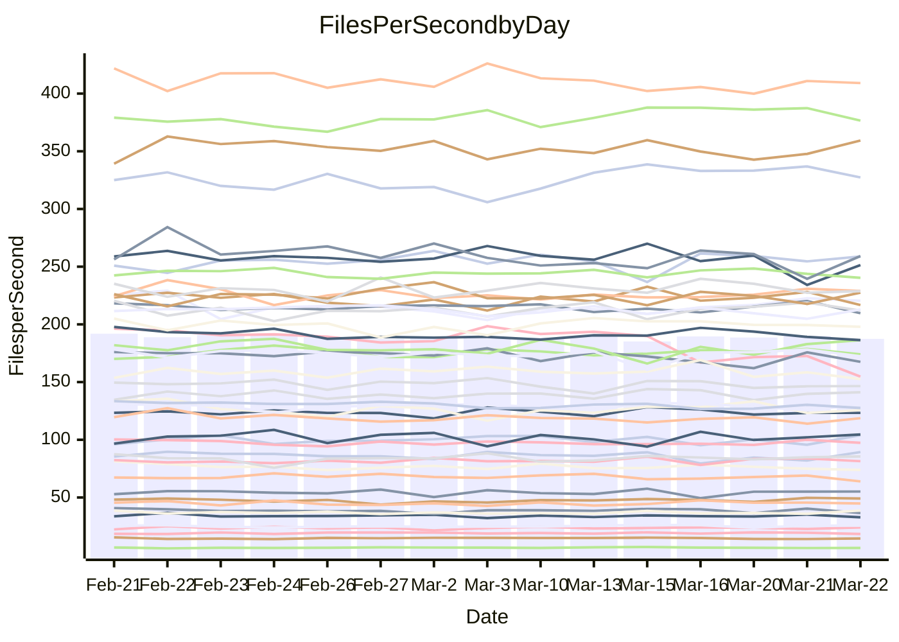

<!---
# This file is auto-generated. Do not edit.
# cspell:disable
--->
# Performance Report

Daily Performance

```mermaid
xychart-beta
    title Files Per Second by Day
    y-axis Files per Second
    x-axis Date [Feb-21, Feb-22, Feb-23, Feb-24, Feb-26, Feb-27, Mar-2, Mar-3, Mar-10, Mar-13, Mar-15, Mar-16, Mar-20, Mar-21, Mar-22]
    bar [191.93, 188.84, 190.95, 190.14, 188.86, 187.47, 189.15, 187.99, 188.38, 189.98, 185.21, 189.57, 188.63, 189.87, 187.45]
    line [52.87, 55.45, 55.44, 54.09, 53.55, 56.91, 50.34, 56.33, 53.77, 52.96, 57.64, 49.40, 55.01, 55.07, 55.14]
    line [67.31, 66.82, 66.94, 70.88, 67.89, 70.56, 67.78, 66.98, 69.18, 70.51, 65.83, 66.30, 67.73, 68.98, 63.91]
    line [134.61, 141.79, 137.76, 142.75, 135.42, 139.26, 136.06, 139.99, 140.01, 135.63, 143.93, 142.95, 134.36, 139.82, 141.15]
    line [379.15, 375.70, 377.89, 371.33, 366.95, 377.92, 377.66, 385.69, 370.91, 378.91, 387.90, 387.80, 386.06, 387.41, 376.59]
    line [48.18, 49.05, 48.06, 46.41, 47.91, 43.77, 46.60, 45.68, 47.70, 47.47, 48.64, 47.90, 46.22, 49.72, 49.15]
    line [96.15, 100.38, 103.85, 96.33, 99.09, 99.19, 100.48, 103.18, 103.33, 98.05, 102.55, 95.32, 100.34, 95.68, 103.94]
    line [22.32, 25.16, 23.04, 24.66, 23.19, 24.07, 21.50, 23.56, 24.56, 23.16, 23.57, 24.07, 23.83, 22.72, 24.07]
    line [33.66, 36.75, 33.50, 33.75, 33.98, 34.43, 34.99, 32.10, 34.36, 33.03, 34.53, 33.80, 33.49, 35.23, 32.80]
    line [81.29, 78.95, 76.37, 76.80, 73.75, 75.77, 77.40, 74.68, 79.36, 75.39, 75.58, 78.40, 76.58, 74.92, 73.83]
    line [225.56, 229.20, 204.56, 214.62, 214.22, 215.21, 211.23, 203.79, 213.30, 213.00, 209.05, 214.75, 216.78, 222.67, 220.47]
    line [40.82, 39.75, 38.29, 38.55, 38.02, 38.35, 35.65, 38.90, 38.99, 38.46, 40.13, 39.77, 36.42, 40.38, 36.50]
    line [45.50, 46.89, 43.13, 47.48, 43.86, 43.58, 44.95, 42.68, 45.79, 43.00, 44.30, 47.55, 45.42, 45.55, 44.76]
    line [149.55, 148.15, 148.90, 152.11, 143.30, 150.41, 149.07, 153.47, 146.06, 140.05, 150.95, 150.81, 144.94, 146.39, 146.52]
    line [6.67, 5.92, 6.38, 6.30, 6.44, 6.78, 6.62, 6.55, 6.32, 6.79, 7.12, 6.59, 6.35, 6.19, 6.26]
    line [223.30, 227.37, 223.02, 226.36, 218.81, 215.75, 221.50, 212.02, 224.11, 219.75, 232.68, 220.52, 223.12, 228.15, 216.79]
    line [85.47, 89.64, 87.93, 87.72, 85.68, 85.69, 83.26, 89.40, 86.73, 86.09, 89.20, 79.46, 84.64, 82.02, 89.37]
    line [196.29, 194.82, 190.50, 191.36, 189.34, 184.31, 185.47, 198.42, 191.68, 193.62, 189.84, 166.89, 171.60, 172.56, 154.71]
    line [123.36, 124.67, 122.06, 125.40, 123.31, 123.27, 118.58, 127.90, 124.38, 120.45, 128.40, 126.26, 121.85, 123.29, 123.31]
    line [133.27, 135.57, 126.55, 124.20, 119.96, 129.35, 126.96, 116.50, 125.61, 123.50, 128.64, 128.22, 133.34, 123.28, 125.66]
    line [131.04, 130.26, 129.44, 123.58, 128.31, 129.87, 130.27, 130.71, 127.81, 125.76, 132.01, 131.14, 128.67, 125.67, 130.11]
    line [218.19, 216.61, 212.54, 214.33, 212.86, 215.99, 216.40, 215.81, 217.40, 210.64, 213.63, 210.38, 215.44, 220.20, 209.66]
    line [224.47, 238.32, 230.44, 216.76, 225.02, 229.69, 222.82, 225.14, 221.56, 225.82, 223.33, 223.62, 225.78, 230.86, 229.00]
    line [220.46, 207.58, 214.51, 202.85, 211.79, 211.44, 214.66, 206.78, 214.22, 219.20, 204.44, 213.42, 215.32, 218.95, 211.96]
    line [170.09, 171.99, 177.77, 181.65, 177.93, 171.71, 171.61, 178.31, 176.56, 173.19, 174.63, 177.66, 175.92, 178.79, 174.01]
    line [226.17, 215.58, 226.36, 225.70, 222.46, 230.96, 236.51, 222.64, 222.38, 225.56, 216.60, 228.18, 224.68, 217.69, 227.52]
    line [250.90, 244.70, 255.35, 256.03, 252.54, 255.82, 263.63, 252.65, 260.43, 254.55, 236.73, 261.47, 259.22, 254.59, 258.80]
    line [82.42, 80.37, 81.15, 79.72, 81.93, 80.10, 84.29, 81.35, 81.66, 80.93, 85.41, 78.19, 83.51, 83.81, 81.43]
    line [258.83, 263.71, 255.40, 259.16, 257.65, 254.22, 257.02, 267.92, 259.39, 256.02, 269.97, 254.79, 259.65, 234.19, 251.38]
    line [38.51, 36.10, 37.37, 36.52, 37.66, 35.60, 37.02, 36.08, 36.38, 35.91, 38.37, 36.25, 36.61, 35.87, 38.67]
    line [211.55, 213.31, 213.15, 214.61, 215.98, 216.39, 213.20, 207.00, 210.46, 215.67, 209.05, 214.60, 209.59, 204.82, 212.94]
    line [176.10, 175.03, 175.02, 172.48, 176.50, 175.06, 173.05, 179.29, 168.17, 175.84, 172.23, 167.20, 162.09, 175.73, 167.53]
    line [421.85, 402.15, 417.55, 417.69, 405.05, 412.32, 405.86, 426.09, 413.29, 411.20, 402.18, 405.65, 399.88, 410.92, 409.10]
    line [235.21, 223.87, 231.37, 229.84, 219.75, 240.64, 223.28, 229.19, 235.85, 231.18, 227.46, 239.47, 235.22, 227.41, 228.79]
    line [242.45, 246.48, 246.10, 248.98, 240.98, 239.52, 244.96, 243.99, 244.22, 247.23, 240.74, 246.80, 248.37, 243.77, 240.29]
    line [15.41, 14.08, 14.28, 13.96, 14.98, 14.69, 15.09, 15.05, 14.93, 14.92, 15.23, 14.84, 14.06, 13.99, 14.45]
    line [133.46, 131.83, 132.27, 131.01, 131.00, 133.00, 131.45, 127.22, 127.60, 130.54, 131.20, 126.76, 126.98, 130.36, 127.52]
    line [100.27, 99.76, 98.90, 95.69, 94.30, 98.50, 95.82, 98.55, 97.82, 96.22, 96.21, 96.60, 95.61, 100.00, 97.34]
    line [96.66, 102.79, 103.56, 108.60, 97.11, 104.32, 106.04, 94.30, 104.19, 100.36, 94.07, 106.95, 99.82, 102.15, 104.63]
    line [153.59, 162.30, 157.06, 159.96, 153.79, 161.66, 159.28, 163.36, 159.01, 157.48, 159.10, 169.05, 154.54, 158.47, 152.54]
    line [25.65, 25.87, 24.49, 24.03, 24.62, 25.06, 24.45, 24.76, 24.74, 25.60, 26.18, 25.98, 23.83, 25.61, 25.64]
    line [256.27, 284.25, 260.54, 263.62, 267.57, 257.62, 270.01, 257.62, 250.97, 253.10, 248.68, 263.99, 260.91, 239.46, 259.16]
    line [119.61, 127.43, 118.55, 121.57, 118.53, 115.70, 116.93, 121.24, 118.95, 118.40, 114.99, 118.14, 119.47, 113.95, 118.70]
    line [87.47, 84.08, 83.91, 75.76, 83.59, 84.08, 83.89, 88.30, 81.02, 82.11, 85.90, 84.63, 82.99, 84.87, 85.57]
    line [181.98, 177.56, 185.31, 187.50, 177.93, 177.54, 178.41, 174.58, 186.65, 179.06, 166.05, 180.55, 173.75, 182.92, 186.30]
    line [339.22, 362.80, 356.26, 358.85, 353.61, 350.32, 358.90, 343.06, 352.21, 348.39, 359.59, 349.81, 342.75, 347.71, 359.34]
    line [325.03, 331.76, 320.00, 316.72, 330.45, 317.84, 319.02, 305.87, 317.67, 331.44, 338.69, 332.97, 333.24, 336.87, 327.34]
    line [18.46, 18.38, 19.68, 18.34, 19.60, 19.60, 19.63, 18.78, 19.22, 18.67, 19.78, 18.71, 19.79, 19.47, 18.35]
    line [197.80, 193.32, 192.22, 196.28, 187.50, 189.10, 188.54, 189.19, 186.81, 190.52, 190.26, 197.02, 193.75, 189.15, 186.42]
    line [205.00, 194.87, 203.28, 199.45, 200.84, 188.59, 197.81, 190.62, 200.86, 205.50, 202.63, 202.69, 199.56, 199.40, 197.96]
    line [178.32, 171.39, 176.96, 177.51, 175.27, 171.69, 175.82, 173.02, 172.27, 176.52, 160.55, 175.49, 175.91, 178.24, 172.29]
```

Time to Process Files

| Repository                                      | Elapsed | Min/Avg/Max           |   SD | SD Graph                |
| ----------------------------------------------- | ------: | :-------------------: | ---: | ----------------------- |
| AdaDoom3/AdaDoom3                    |    2.64 | 2.7 /   2.8 /   3.0   | 0.09 | `    ┣●━┻━━╋━━┻━━┫    ` |
| alexiosc/megistos                    |    7.57 | 6.7 /   7.1 /   8.1   | 0.33 | `    ┣━━┻━━╋━━┻●━┫    ` |
| apollographql/apollo-server          |    2.42 | 2.4 /   2.5 /   2.9   | 0.11 | `    ┣━━●━━╋━━┻━━┫    ` |
| aspnetboilerplate/aspnetboilerplate  |    9.19 | 8.5 /   8.9 /   9.8   | 0.26 | `    ┣━━┻━━╋━━┻●━┫    ` |
| aws-amplify/docs                     |   11.48 | 11.5 /  11.8 /  12.5  | 0.23 | `    ┣━●┻━━╋━━┻━━┫    ` |
| Azure/azure-rest-api-specs           |    9.31 | 8.6 /   9.5 /  10.4   | 0.45 | `    ┣━━┻━●╋━━┻━━┫    ` |
| bitjson/typescript-starter           |    1.04 | 0.9 /   1.0 /   1.2   | 0.06 | `     ┣━┻━━●━━┻━┫     ` |
| caddyserver/caddy                    |    3.37 | 3.2 /   3.5 /   4.1   | 0.16 | `    ┣━━┻●━╋━━┻━━┫    ` |
| canada-ca/open-source-logiciel-libre |    1.10 | 1.0 /   1.1 /   1.2   | 0.06 | `     ┣━┻━━╋●━┻━┫     ` |
| chef/chef                            |    5.41 | 5.1 /   5.4 /   5.8   | 0.18 | `    ┣━━┻━━●━━┻━━┫    ` |
| dart-lang/sdk                        |   56.75 | 52.6 /  55.1 /  60.9  | 1.44 | `  ┣━━━┻━━━╋━━━●━━━┫  ` |
| django/django                        |   13.38 | 13.0 /  13.5 /  14.8  | 0.39 | `   ┣━━━┻━●╋━━┻━━━┫   ` |
| eslint/eslint                        |    9.51 | 9.1 /   9.6 /  10.4   | 0.26 | `    ┣━━┻━●╋━━┻━━┫    ` |
| exonum/exonum                        |    3.37 | 3.2 /   3.4 /   3.7   | 0.10 | `    ┣━━┻●━╋━━┻━━┫    ` |
| flutter/samples                      |   15.69 | 14.1 /  14.8 /  17.3  | 0.65 | `   ┣━━━┻━━╋━━┻━●━┫   ` |
| gitbucket/gitbucket                  |    3.18 | 3.0 /   3.2 /   3.7   | 0.14 | `    ┣━━┻━●╋━━┻━━┫    ` |
| googleapis/google-cloud-cpp          |  122.26 | 112.8 / 118.0 / 129.5 | 3.37 | `  ┣━━━┻━━━╋━━━┻●━━┫  ` |
| graphql/express-graphql              |    1.09 | 1.0 /   1.1 /   1.2   | 0.05 | `     ┣━┻━●╋━━┻━┫     ` |
| graphql/graphql-js                   |    2.69 | 2.6 /   2.7 /   2.9   | 0.10 | `    ┣━━┻━━╋●━┻━━┫    ` |
| graphql/graphql-relay-js             |    1.09 | 1.0 /   1.1 /   1.3   | 0.07 | `     ┣━┻━●╋━━┻━┫     ` |
| graphql/graphql-spec                 |    1.25 | 1.2 /   1.3 /   1.6   | 0.08 | `     ┣━┻●━╋━━┻━┫     ` |
| iluwatar/java-design-patterns        |   11.58 | 10.9 /  11.7 /  12.3  | 0.32 | `    ┣━━┻━●╋━━┻━━┫    ` |
| ktaranov/sqlserver-kit               |    5.75 | 5.5 /   5.9 /   6.6   | 0.26 | `    ┣━━┻●━╋━━┻━━┫    ` |
| liriliri/licia                       |    3.74 | 3.6 /   3.8 /   4.1   | 0.12 | `    ┣━━┻●━╋━━┻━━┫    ` |
| MartinThoma/LaTeX-examples           |    6.11 | 5.9 /   6.2 /   7.0   | 0.23 | `    ┣━━┻●━╋━━┻━━┫    ` |
| mdx-js/mdx                           |    1.98 | 1.7 /   1.8 /   2.1   | 0.10 | `    ┣━━┻━━╋━━┻●━┫    ` |
| microsoft/TypeScript-Website         |    5.27 | 4.9 /   5.2 /   5.7   | 0.22 | `    ┣━━┻━━╋━●┻━━┫    ` |
| MicrosoftDocs/PowerShell-Docs        |   20.29 | 19.6 /  20.4 /  22.4  | 0.62 | `   ┣━━━┻━━●━━┻━━━┫   ` |
| neovim/nvim-lspconfig                |    5.57 | 3.8 /   4.2 /   5.3   | 0.39 | `    ┣━━┻━━╋━━┻━━┫   ●` |
| pagekit/pagekit                      |    3.37 | 3.2 /   3.5 /   4.7   | 0.23 | `    ┣━━┻●━╋━━┻━━┫    ` |
| php/php-src                          |   23.48 | 22.6 /  23.4 /  25.1  | 0.60 | `   ┣━━━┻━━╋●━┻━━━┫   ` |
| plasticrake/tplink-smarthome-api     |    1.24 | 1.2 /   1.3 /   1.5   | 0.06 | `     ┣━●━━╋━━┻━┫     ` |
| prettier/prettier                    |    7.38 | 7.2 /   7.6 /   8.3   | 0.23 | `    ┣━━●━━╋━━┻━━┫    ` |
| pycontribs/jira                      |    1.45 | 1.3 /   1.5 /   1.7   | 0.09 | `     ┣━┻━━●━━┻━┫     ` |
| RustPython/RustPython                |    6.46 | 5.9 /   6.4 /   6.9   | 0.22 | `    ┣━━┻━━╋●━┻━━┫    ` |
| shoelace-style/shoelace              |    3.00 | 2.5 /   2.8 /   3.1   | 0.12 | `    ┣━━┻━━╋━━┻━●┫    ` |
| slint-ui/slint                       |   13.02 | 12.7 /  13.2 /  13.9  | 0.31 | `    ┣━━┻●━╋━━┻━━┫    ` |
| SoftwareBrothers/admin-bro           |    2.50 | 2.2 /   2.4 /   2.8   | 0.11 | `    ┣━━┻━━╋━●┻━━┫    ` |
| sveltejs/svelte                      |   21.84 | 19.8 /  20.7 /  22.9  | 0.67 | `   ┣━━━┻━━╋━━┻━━●┫   ` |
| TheAlgorithms/Python                 |    5.51 | 5.2 /   5.5 /   5.9   | 0.18 | `    ┣━━┻━━●━━┻━━┫    ` |
| twbs/bootstrap                       |    1.75 | 1.6 /   1.7 /   2.0   | 0.08 | `     ┣━┻━━●━━┻━┫     ` |
| typescript-cheatsheets/react         |    1.57 | 1.2 /   1.4 /   1.6   | 0.08 | `     ┣━┻━━╋━━┻━┫●    ` |
| typescript-eslint/typescript-eslint  |    4.01 | 3.8 /   4.0 /   4.5   | 0.15 | `    ┣━━┻━●╋━━┻━━┫    ` |
| vitest-dev/vitest                    |   11.49 | 10.2 /  11.0 /  11.8  | 0.42 | `    ┣━━┻━━╋━━┻●━┫    ` |
| w3c/aria-practices                   |    3.18 | 3.1 /   3.3 /   4.1   | 0.20 | `    ┣━━┻●━╋━━┻━━┫    ` |
| w3c/specberus                        |    1.90 | 1.8 /   1.9 /   2.3   | 0.11 | `    ┣━━┻━●╋━━┻━━┫    ` |
| webdeveric/webpack-assets-manifest   |    1.23 | 1.1 /   1.2 /   1.4   | 0.08 | `     ┣━┻━━●━━┻━┫     ` |
| webpack/webpack                      |    5.17 | 4.8 /   5.1 /   5.5   | 0.18 | `    ┣━━┻━━╋●━┻━━┫    ` |
| wireapp/wire-desktop                 |    1.36 | 1.2 /   1.3 /   1.4   | 0.06 | `     ┣━┻━━╋━━●━┫     ` |
| wireapp/wire-webapp                  |   11.68 | 10.5 /  11.0 /  12.1  | 0.34 | `    ┣━━┻━━╋━━┻━━●    ` |

Note:
- Elapsed time is in seconds.

Files per Second over Time

| Repository                                      | Files |    Sec |    Fps |     Rel | Trend Fps              |    N |
| ----------------------------------------------- | ----: | -----: | -----: | ------: | ---------------------- | ---: |
| AdaDoom3/AdaDoom3                    |   103 |   2.64 |  38.98 |   5.70% | `▆▅▇▆▆▅▅▅▅▆▅█▇▅▆▇▄▅██` |   39 |
| alexiosc/megistos                    |   583 |   7.57 |  77.00 |  -5.76% | `▇▆▆██▇▇▃▆▆▇█▅▆█▇▇▇█▅` |   39 |
| apollographql/apollo-server          |   254 |   2.42 | 104.93 |   4.34% | `▆█▇█▇███▇▆▆▇▄▇█▇▆▆██` |   39 |
| aspnetboilerplate/aspnetboilerplate  |  2286 |   9.19 | 248.63 |  -3.37% | `▆█▇▆█▆▇▇▇▇▆█▇▅█▅▇▄▆▅` |   39 |
| aws-amplify/docs                     |  2874 |  11.48 | 250.34 |   2.39% | `▇▇▇██▆▆▇█▇▇▆▇█▇██▇▅█` |   39 |
| Azure/azure-rest-api-specs           |  2478 |   9.31 | 266.19 |   2.71% | `█▆▃▆█▅▄▅▄█▄▅▇▇▇▆▆▄▅▇` |   39 |
| bitjson/typescript-starter           |    20 |   1.04 |  19.18 |  -0.25% | `▇▆▆█▄▆▆▇▇▇▃▇▅▆▆▆█▆▄▆` |   39 |
| caddyserver/caddy                    |   301 |   3.37 |  89.32 |   3.63% | `▅█▇▇██▇▆█▆▇█▇▃▇▆▆▆██` |   39 |
| canada-ca/open-source-logiciel-libre |     7 |   1.10 |   6.36 |  -1.58% | `▇▆▆▅▄▃▆▅▇▆▇█▇▅▆▄▅▄▄▅` |   39 |
| chef/chef                            |  1200 |   5.41 | 221.92 |  -0.05% | `▅▅▆▆▇▇▇█▇▇▄█▇▆▆▇▇▇▅▆` |   39 |
| dart-lang/sdk                        | 11126 |  56.75 | 196.05 |  -2.28% | `▆▅▆▇▇▆▇▇██▆▇▇▇▇▆▆▆▆▆` |   39 |
| django/django                        |  2897 |  13.38 | 216.53 |   1.09% | `▇▇█▇█▇▇▇█▄▆▇▆▆▇█▆█▅▇` |   39 |
| eslint/eslint                        |  2050 |   9.51 | 215.57 |   1.00% | `▆▅▇▅▆▇▆██▇▆▅▇▅▇▇▇▇▅▇` |   39 |
| exonum/exonum                        |   421 |   3.37 | 125.05 |   1.55% | `▄█▇▇▇▆▆▇▆▅▆██▆▅▆▇▆▆▇` |   39 |
| flutter/samples                      |  2494 |  15.69 | 158.91 |  -7.98% | `▇██▄█▃█▇▇██▇▇▅▄▅▇██▅` |   39 |
| gitbucket/gitbucket                  |   415 |   3.18 | 130.58 |   1.47% | `▇▇▃▇██▇▇▅▆▇█▇█▆█▇▆▇▇` |   39 |
| googleapis/google-cloud-cpp          | 20796 | 122.26 | 170.10 |  -2.77% | `▇▇▇▇▆▇▇▆██▇▄▇███▇█▇▆` |   39 |
| graphql/express-graphql              |    26 |   1.09 |  23.94 |   1.74% | `▃▅█▆▇▆▅▆▆▆▃▅▆▆▆▆▅▅▆▆` |   39 |
| graphql/graphql-js                   |   371 |   2.69 | 137.79 |  -0.40% | `▇▇▇▇▆▇█▆█▅▅███▄▆▇▇█▆` |   39 |
| graphql/graphql-relay-js             |    28 |   1.09 |  25.61 |   3.01% | `▆▇▇▅▇▅██▇█▇█▇█▆▇▃▇▇▇` |   39 |
| graphql/graphql-spec                 |    19 |   1.25 |  15.16 |   3.60% | `█▇▇▆▇▇▆▇█▆▇▇▇▆█▆▂▅▅▇` |   39 |
| iluwatar/java-design-patterns        |  2060 |  11.58 | 177.92 |   1.16% | `▅▇▇█▅█▇▆▆▅▇▆▇▇▆▇▇▇▅▇` |   39 |
| ktaranov/sqlserver-kit               |   490 |   5.75 |  85.18 |   2.29% | `▆█▆▃▆▄▇▆▇▅▅▇█▆▆▆▇▇▇▇` |   39 |
| liriliri/licia                       |  1437 |   3.74 | 384.19 |   1.90% | `▇██▄▇▇▄█▇▇▇███████▆█` |   39 |
| MartinThoma/LaTeX-examples           |  1409 |   6.11 | 230.46 |   2.05% | `▇▇▃▅▆██▆▆▇█▆▇▆▇▇▆▇▇▇` |   39 |
| mdx-js/mdx                           |   140 |   1.98 |  70.60 |  -8.18% | `█▆██▇▇█▇▄█▆▆▇▇▇▆▇▆▇▄` |   39 |
| microsoft/TypeScript-Website         |   756 |   5.27 | 143.59 |  -2.58% | `▇█▅▆██▃▇▃▆▅▇▇▇▆▇▅▆▇▆` |   39 |
| MicrosoftDocs/PowerShell-Docs        |  2648 |  20.29 | 130.53 |   0.27% | `▇▆▅▆▇▇▇▅█▆▇▇▇▅▄█▆▇▅▇` |   39 |
| neovim/nvim-lspconfig                |   837 |   5.57 | 150.29 | -19.60% | `▇▇▄▇▇▇▇▇▇▆█▆▃▄▅▄▄▄▃▁` |   39 |
| pagekit/pagekit                      |   741 |   3.37 | 220.18 |   3.32% | `▇▆▇▆█▇▇▆▇▇▇▆▇▇▇█▇██▇` |   39 |
| php/php-src                          |  2274 |  23.48 |  96.84 |  -0.53% | `██▇▇▇██▇▇▇▆▇▇▆▅█▆█▇▇` |   39 |
| plasticrake/tplink-smarthome-api     |    62 |   1.24 |  49.94 |   5.24% | `█▅█▄▆▆▆▅▅▅▇▆▆▆▅▆▄▇▆▇` |   39 |
| prettier/prettier                    |  2665 |   7.38 | 361.25 |   2.57% | `▇▆▆▇▆▇█▇▆▅██▇▆█▆▄▆▇█` |   39 |
| pycontribs/jira                      |    79 |   1.45 |  54.51 |   0.67% | `▇█▆▅▇▇▅█▇▅▆█▄▅█▇▆▇▇▇` |   39 |
| RustPython/RustPython                |   764 |   6.46 | 118.31 |  -0.35% | `▇▇▆▆█▇▇▅▆▆▇▅█▅█▅▇▅▇▆` |   39 |
| shoelace-style/shoelace              |   440 |   3.00 | 146.59 |  -7.35% | `▅▆▆▅▆▅▄▇▆▄▆▆█▇▆▅▃▆▆▄` |   39 |
| slint-ui/slint                       |  2808 |  13.02 | 215.67 |   1.43% | `▆▆▅█▆▆▅██▇▇▆▇▇▅▇▆▅▆▇` |   39 |
| SoftwareBrothers/admin-bro           |   441 |   2.50 | 176.40 |  -2.86% | `▇▅▇▇█▆▇▆▅▆▇▄▅▇▇▆▃▆█▅` |   39 |
| sveltejs/svelte                      |  8589 |  21.84 | 393.27 |  -4.54% | `▇█▆▇▅███▅▇█▆▇▆▇▇▄▇█▅` |   39 |
| TheAlgorithms/Python                 |  1407 |   5.51 | 255.46 |  -0.20% | `▇▆▇▇▇█▇▆▆▅█▄▇▇█▅█▆▇▆` |   39 |
| twbs/bootstrap                       |   118 |   1.75 |  67.42 |  -0.83% | `▇▆▇▇██▆▇▇██▆█▅▅█▇▇▄▇` |   39 |
| typescript-cheatsheets/react         |    53 |   1.57 |  33.67 | -12.56% | `▄▇█▇▅▇▇▇▇▅█▇▇▇▅▅▆█▇▃` |   39 |
| typescript-eslint/typescript-eslint  |  1308 |   4.01 | 326.53 |   0.70% | `▇▅▆▄▇▇▃▇▇▇▇██▇▇█▇█▇▇` |   39 |
| vitest-dev/vitest                    |  2566 |  11.49 | 223.32 |  -3.48% | `▄▅██▅▅▅▆▆▆▄▅▅█▅▇▅▅▆▄` |   39 |
| w3c/aria-practices                   |   414 |   3.18 | 130.25 |   3.13% | `▇▅█▆▇▄██▇▅▆▇█▆█▇█▆▆▇` |   39 |
| w3c/specberus                        |   197 |   1.90 | 103.66 |   1.41% | `█▅▇▅▇▇█▇▅▇▆▄█▇▅▆▇▆▇▇` |   39 |
| webdeveric/webpack-assets-manifest   |    55 |   1.23 |  44.86 |   0.40% | `▅▄▆▃█▆▆▆▆▄▄▅▆▇▆▅▆▆▅▅` |   39 |
| webpack/webpack                      |  1148 |   5.17 | 222.05 |  -1.44% | `█▆█▅▇▇▄▄▆▆▇▅▆▇▆▅█▅▇▆` |   39 |
| wireapp/wire-desktop                 |    44 |   1.36 |  32.29 |  -4.81% | `█▄▇▃▇▆▆▆▄▆▅▆▇▄▅▆▅▇▅▄` |   38 |
| wireapp/wire-webapp                  |  2123 |  11.68 | 181.71 |  -4.90% | `▅▆▆▆▅▇▅▆▇▇▆▆▇█▇▇▇▆▇▅` |   39 |

Data Throughput

| Repository                                      | Files |    Sec |     Kps |     Rel | Trend Kps              |    N |
| ----------------------------------------------- | ----: | -----: | ------: | ------: | ---------------------- | ---: |
| AdaDoom3/AdaDoom3                    |   103 |   2.64 |  828.32 |   5.70% | `▆▅▇▆▆▅▅▅▅▆▅█▇▅▆▇▄▅██` |   39 |
| alexiosc/megistos                    |   583 |   7.57 |  605.02 |  -5.76% | `▇▆▆██▇▇▃▆▆▇█▅▆█▇▇▇█▅` |   39 |
| apollographql/apollo-server          |   254 |   2.42 |  862.15 |   4.34% | `▆█▇█▇███▇▆▆▇▄▇█▇▆▆██` |   39 |
| aspnetboilerplate/aspnetboilerplate  |  2286 |   9.19 |  604.93 |  -3.37% | `▆█▇▆█▆▇▇▇▇▆█▇▅█▅▇▄▆▅` |   39 |
| aws-amplify/docs                     |  2874 |  11.48 |  875.32 |   2.39% | `▇▇▇██▆▆▇█▇▇▆▇█▇██▇▅█` |   39 |
| Azure/azure-rest-api-specs           |  2478 |   9.31 |  781.27 |   9.28% | `▅▄▄▆█▆▅▆▅█▅▆▇▇█▆▇▅▆▇` |   39 |
| bitjson/typescript-starter           |    20 |   1.04 |   76.72 |  -0.25% | `▇▆▆█▄▆▆▇▇▇▃▇▅▆▆▆█▆▄▆` |   39 |
| caddyserver/caddy                    |   301 |   3.37 |  795.31 |   4.51% | `▅█▇▇██▇▆█▆▇█▇▃▇▆▆▆██` |   39 |
| canada-ca/open-source-logiciel-libre |     7 |   1.10 |   52.69 |  -1.58% | `▇▆▆▅▄▃▆▅▇▆▇█▇▅▆▄▅▄▄▅` |   39 |
| chef/chef                            |  1200 |   5.41 | 1042.12 |  -0.02% | `▅▅▆▆▇▇▇█▇▇▄█▇▆▆▇▇▇▅▆` |   39 |
| dart-lang/sdk                        | 11126 |  56.75 | 1326.43 |  -2.54% | `▆▅▆▇▇▆▇▇██▆▇▆▇▇▆▆▆▆▆` |   39 |
| django/django                        |  2897 |  13.38 | 1371.03 |   1.21% | `▇▇█▇█▇▇▇█▄▆▇▆▆▇█▆█▅▇` |   39 |
| eslint/eslint                        |  2050 |   9.51 | 1497.07 |   1.01% | `▆▅▇▅▆▇▆██▇▆▅▇▅▇▇▇▇▅▇` |   39 |
| exonum/exonum                        |   421 |   3.37 | 1196.12 |   1.55% | `▄█▇▇▇▆▆▇▆▅▆██▆▅▆▇▆▆▇` |   39 |
| flutter/samples                      |  2494 |  15.69 | 1370.12 |  -6.40% | `▇██▄█▃█▇▇██▇▇▆▄▅███▅` |   39 |
| gitbucket/gitbucket                  |   415 |   3.18 |  603.18 |   2.05% | `▇▇▃▇██▇▇▅▆▇█▇█▆█▇▆▇▇` |   39 |
| googleapis/google-cloud-cpp          | 20796 | 122.26 | 1439.04 |  -1.90% | `▇▇▇▇▆▇▇▆██▇▄▇███▇█▇▆` |   39 |
| graphql/express-graphql              |    26 |   1.09 |  109.59 |   1.74% | `▃▅█▆▇▆▅▆▆▆▃▅▆▆▆▆▅▅▆▆` |   39 |
| graphql/graphql-js                   |   371 |   2.69 |  807.79 |  -0.01% | `▇▇▇▇▆▇█▆█▅▅███▄▆▇▇█▆` |   39 |
| graphql/graphql-relay-js             |    28 |   1.09 |  100.61 |   3.01% | `▆▇▇▅▇▅██▇█▇█▇█▆▇▃▇▇▇` |   39 |
| graphql/graphql-spec                 |    19 |   1.25 |  505.95 |   3.60% | `█▇▇▆▇▇▆▇█▆▇▇▇▆█▆▂▅▅▇` |   39 |
| iluwatar/java-design-patterns        |  2060 |  11.58 |  548.37 |   1.12% | `▅▇▆█▅█▇▆▆▅▇▆▇▇▆▇▇▇▅▇` |   39 |
| ktaranov/sqlserver-kit               |   490 |   5.75 | 1290.38 |   2.47% | `▆█▆▃▆▄▇▆▇▅▅▇█▆▆▆▇▇▇▇` |   39 |
| liriliri/licia                       |  1437 |   3.74 |  457.72 |   1.90% | `▇██▄▇▇▄█▇▇▇███████▆█` |   39 |
| MartinThoma/LaTeX-examples           |  1409 |   6.11 |  475.97 |   2.05% | `▇▇▃▅▆██▆▆▇█▆▇▆▇▇▆▇▇▇` |   39 |
| mdx-js/mdx                           |   140 |   1.98 |  330.28 |  -7.64% | `█▆██▇▇█▇▄█▆▆▇█▇▆▇▆▇▅` |   39 |
| microsoft/TypeScript-Website         |   756 |   5.27 |  991.82 |  -3.01% | `▇█▅▆██▃▇▃▆▅▇▇▇▆▇▅▆▇▆` |   39 |
| MicrosoftDocs/PowerShell-Docs        |  2648 |  20.29 | 1365.22 |   0.29% | `▇▆▅▆▇▇▇▅█▆▇▇▇▅▄█▆▇▅▇` |   39 |
| neovim/nvim-lspconfig                |   837 |   5.57 |  403.65 |   6.29% | `▄▄▂▄▄▄▄▄▄▃▅▃▇██▇██▆▅` |   39 |
| pagekit/pagekit                      |   741 |   3.37 |  459.07 |   3.32% | `▇▆▇▆█▇▇▆▇▇▇▆▇▇▇█▇██▇` |   39 |
| php/php-src                          |  2274 |  23.48 | 1688.47 |  -0.45% | `██▇▇▇██▇▇▇▆▇▇▆▅█▆█▇▇` |   39 |
| plasticrake/tplink-smarthome-api     |    62 |   1.24 |  269.81 |   5.24% | `█▅█▄▆▆▆▅▅▅▇▆▆▆▅▆▄▇▆▇` |   39 |
| prettier/prettier                    |  2665 |   7.38 |  496.80 |   2.55% | `▇▆▆▇▆▇█▇▆▅██▇▆█▆▄▆▇█` |   39 |
| pycontribs/jira                      |    79 |   1.45 |  386.40 |   0.67% | `▇█▆▅▇▇▅█▇▅▆█▄▅█▇▆▇▇▇` |   39 |
| RustPython/RustPython                |   764 |   6.46 | 1828.50 |   2.49% | `▆▇▇▆█▇▇▆▆▆█▆█▆█▆▇▆▇▇` |   39 |
| shoelace-style/shoelace              |   440 |   3.00 |  707.29 |  -7.37% | `▅▆▆▅▆▅▄▇▆▄▆▆█▇▆▅▃▆▆▄` |   39 |
| slint-ui/slint                       |  2808 |  13.02 | 1348.54 |   1.74% | `▆▆▅█▆▆▅██▇▇▆▇▇▅▇▆▅▆█` |   39 |
| SoftwareBrothers/admin-bro           |   441 |   2.50 |  388.80 |  -2.86% | `▇▅▇▇█▆▇▆▅▆▇▄▅▇▇▆▃▆█▅` |   39 |
| sveltejs/svelte                      |  8589 |  21.84 |  266.16 |  -4.45% | `▇█▆▇▅███▅▇█▆▇▆▇▇▄▇█▅` |   39 |
| TheAlgorithms/Python                 |  1407 |   5.51 |  652.35 |  -0.04% | `▇▆▇▇▇█▇▆▆▅█▄▇▇█▅█▆▇▆` |   39 |
| twbs/bootstrap                       |   118 |   1.75 |  553.68 |  -0.83% | `▇▆▇▇██▆▇▇██▆█▅▅█▇▇▄▇` |   39 |
| typescript-cheatsheets/react         |    53 |   1.57 |  249.65 | -12.56% | `▄▇█▇▅▇▇▇▇▅█▇▇▇▅▅▆█▇▃` |   39 |
| typescript-eslint/typescript-eslint  |  1308 |   4.01 | 1724.25 |   0.74% | `▇▅▆▄▇█▃▇▇▇▇██▇▇█▇█▇▇` |   39 |
| vitest-dev/vitest                    |  2566 |  11.49 |  682.49 |  -2.87% | `▄▅██▅▅▅▆▆▆▄▅▆█▆█▅▅▆▅` |   39 |
| w3c/aria-practices                   |   414 |   3.18 | 1216.60 |   3.13% | `▇▅█▆▇▄██▇▅▆▇█▆█▇█▆▆▇` |   39 |
| w3c/specberus                        |   197 |   1.90 |  343.61 |   2.51% | `█▅▇▆▇██▇▅▇▆▅██▅▆█▇▇▇` |   39 |
| webdeveric/webpack-assets-manifest   |    55 |   1.23 |  102.78 |   0.40% | `▅▄▆▃█▆▆▆▆▄▄▅▆▇▆▅▆▆▅▅` |   39 |
| webpack/webpack                      |  1148 |   5.17 | 1041.95 |  -1.15% | `█▆█▅▇▇▄▄▆▆▇▅▇▇▆▅█▅█▆` |   39 |
| wireapp/wire-desktop                 |    44 |   1.36 |  143.82 |  -4.81% | `█▄▇▃▇▆▆▆▄▆▅▆▇▄▅▆▅▇▅▄` |   38 |
| wireapp/wire-webapp                  |  2123 |  11.68 |  718.98 |  -4.05% | `▅▆▅▆▅▇▅▆▆▆▆▆▇██▇▇▆▇▅` |   39 |

