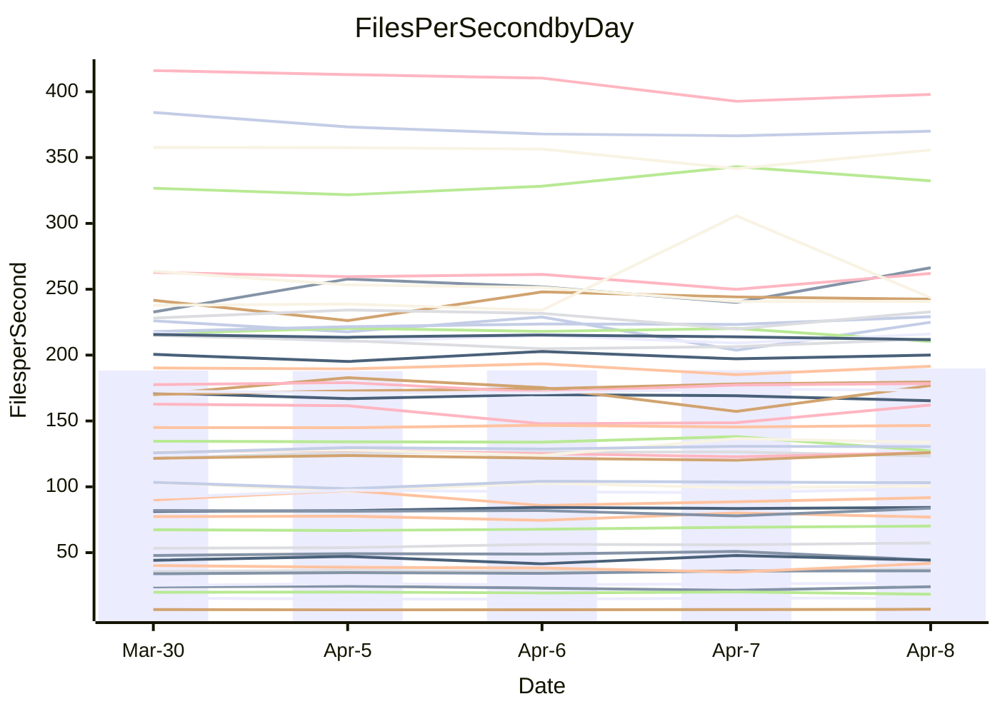

<!---
# This file is auto-generated. Do not edit.
# cspell:disable
--->
# Performance Report

Daily Performance

```mermaid
xychart-beta
    title Files Per Second by Day
    y-axis Files per Second
    x-axis Date [Mar-30, Apr-5, Apr-6, Apr-7, Apr-8]
    bar [188.30, 187.81, 188.42, 188.59, 189.84]
    line [24.02, 24.56, 23.07, 21.40, 24.14]
    line [77.41, 77.73, 74.56, 80.16, 77.02]
    line [53.37, 53.82, 56.32, 55.94, 57.36]
    line [134.62, 134.19, 133.87, 138.14, 127.32]
    line [6.77, 6.57, 6.61, 6.73, 7.00]
    line [384.27, 373.30, 367.91, 366.55, 370.00]
    line [162.72, 161.59, 147.84, 148.71, 162.06]
    line [171.49, 166.95, 170.01, 169.14, 165.39]
    line [103.43, 96.40, 102.92, 99.21, 100.52]
    line [15.30, 14.95, 14.57, 15.50, 15.41]
    line [47.82, 49.22, 48.87, 50.93, 44.38]
    line [144.97, 144.90, 146.68, 145.47, 146.56]
    line [121.70, 126.05, 126.20, 126.46, 123.33]
    line [326.73, 321.72, 328.23, 343.02, 332.37]
    line [169.88, 182.89, 175.34, 157.18, 176.94]
    line [226.02, 217.73, 228.96, 203.68, 224.92]
    line [126.34, 127.91, 125.16, 122.83, 125.98]
    line [44.21, 47.13, 41.53, 47.88, 44.28]
    line [357.70, 357.50, 356.42, 341.55, 355.72]
    line [25.15, 26.46, 25.57, 26.37, 26.75]
    line [232.73, 257.73, 251.87, 240.02, 266.31]
    line [90.00, 97.23, 85.82, 88.62, 91.77]
    line [35.69, 36.40, 35.82, 36.18, 37.44]
    line [216.32, 220.41, 218.02, 220.27, 210.30]
    line [241.62, 226.17, 248.01, 244.17, 242.46]
    line [217.84, 221.62, 223.63, 223.28, 229.16]
    line [262.82, 259.51, 261.27, 249.89, 261.98]
    line [81.35, 81.81, 84.38, 83.54, 84.32]
    line [126.44, 128.14, 123.76, 136.62, 133.64]
    line [216.98, 210.20, 214.91, 209.11, 216.00]
    line [82.00, 81.46, 81.94, 77.93, 83.70]
    line [190.27, 189.55, 193.41, 185.15, 191.53]
    line [215.04, 210.95, 204.79, 206.43, 212.35]
    line [19.88, 20.02, 19.41, 20.18, 18.41]
    line [170.18, 172.81, 174.46, 178.10, 179.62]
    line [103.40, 98.55, 104.22, 103.59, 103.12]
    line [177.59, 179.11, 171.90, 177.30, 178.37]
    line [215.65, 213.52, 215.27, 213.92, 211.68]
    line [237.77, 238.81, 234.08, 305.83, 243.57]
    line [91.72, 97.44, 96.14, 95.65, 98.60]
    line [33.97, 34.80, 34.26, 36.10, 36.17]
    line [40.18, 38.93, 38.36, 35.23, 41.88]
    line [228.09, 234.26, 231.70, 219.86, 232.88]
    line [67.35, 66.87, 67.74, 69.26, 70.15]
    line [121.60, 123.74, 121.73, 120.16, 125.96]
    line [125.76, 129.75, 128.69, 130.72, 130.46]
    line [416.05, 413.02, 410.36, 392.72, 397.99]
    line [200.56, 195.13, 202.74, 197.17, 200.02]
    line [263.68, 253.34, 251.40, 240.71, 240.89]
    line [172.70, 171.27, 171.33, 174.25, 173.31]
```

Time to Process Files

| Repository                                      | Elapsed | Min/Avg/Max           |   SD | SD Graph                |
| ----------------------------------------------- | ------: | :-------------------: | ---: | ----------------------- |
| AdaDoom3/AdaDoom3                    |    2.75 | 2.8 /   2.9 /   3.0   | 0.08 | `    ┣━●┻━━╋━━┻━━┫    ` |
| alexiosc/megistos                    |    6.91 | 6.8 /   7.1 /   7.4   | 0.18 | `    ┣━━●━━╋━━┻━━┫    ` |
| apollographql/apollo-server          |    2.53 | 2.4 /   2.6 /   2.9   | 0.15 | `    ┣━━┻━●╋━━┻━━┫    ` |
| aspnetboilerplate/aspnetboilerplate  |    8.73 | 8.7 /   8.8 /   9.1   | 0.17 | `    ┣━━┻●━╋━━┻━━┫    ` |
| aws-amplify/docs                     |   12.03 | 9.6 /  12.0 /  12.9   | 0.91 | `   ┣━━┻━━━●━━━┻━━┫   ` |
| Azure/azure-rest-api-specs           |   10.33 | 9.3 /   9.8 /  10.3   | 0.33 | `   ┣━━━┻━━╋━━┻━●━┫   ` |
| bitjson/typescript-starter           |    1.09 | 0.9 /   1.0 /   1.1   | 0.03 | `     ┣━┻━━╋━━┻━┫ ●   ` |
| caddyserver/caddy                    |    3.29 | 2.6 /   3.3 /   3.7   | 0.28 | `    ┣━━┻━━●━━┻━━┫    ` |
| canada-ca/open-source-logiciel-libre |    1.00 | 1.0 /   1.1 /   1.1   | 0.03 | `     ●━┻━━╋━━┻━┫     ` |
| chef/chef                            |    5.24 | 5.2 /   5.4 /   5.7   | 0.15 | `    ┣━●┻━━╋━━┻━━┫    ` |
| dart-lang/sdk                        |   55.86 | 53.9 /  56.4 /  61.5  | 2.14 | `  ┣━━━┻━━●╋━━━┻━━━┫  ` |
| django/django                        |   13.64 | 13.3 /  13.8 /  14.5  | 0.36 | `   ┣━━━┻●━╋━━┻━━━┫   ` |
| eslint/eslint                        |    9.53 | 9.3 /   9.7 /  10.2   | 0.25 | `    ┣━━┻●━╋━━┻━━┫    ` |
| exonum/exonum                        |    3.41 | 3.3 /   3.4 /   3.5   | 0.06 | `    ┣━━┻━━╋━●┻━━┫    ` |
| flutter/samples                      |   13.98 | 13.7 /  14.1 /  14.7  | 0.26 | `   ┣━━━┻━●╋━━┻━━━┫   ` |
| gitbucket/gitbucket                  |    3.11 | 3.0 /   3.3 /   3.6   | 0.17 | `    ┣━━●━━╋━━┻━━┫    ` |
| googleapis/google-cloud-cpp          |  120.01 | 118.4 / 121.0 / 123.8 | 1.71 | `  ┣━━━┻━●━╋━━━┻━━━┫  ` |
| graphql/express-graphql              |    1.08 | 1.0 /   1.1 /   1.3   | 0.09 | `    ┣━━┻━●╋━━┻━━┫    ` |
| graphql/graphql-js                   |    2.91 | 2.7 /   2.8 /   2.9   | 0.08 | `    ┣━━┻━━╋━━┻━━●    ` |
| graphql/graphql-relay-js             |    1.05 | 1.0 /   1.1 /   1.1   | 0.03 | `     ┣━●━━╋━━┻━┫     ` |
| graphql/graphql-spec                 |    1.23 | 1.2 /   1.3 /   1.4   | 0.06 | `    ┣━━┻●━╋━━┻━━┫    ` |
| iluwatar/java-design-patterns        |   11.47 | 11.6 /  11.9 /  12.2  | 0.24 | `   ┣●━━┻━━╋━━┻━━━┫   ` |
| ktaranov/sqlserver-kit               |    5.85 | 5.6 /   6.0 /   6.4   | 0.22 | `    ┣━━●━━╋━━┻━━┫    ` |
| liriliri/licia                       |    3.88 | 3.7 /   3.8 /   4.0   | 0.09 | `    ┣━━┻━━╋●━┻━━┫    ` |
| MartinThoma/LaTeX-examples           |    6.05 | 5.7 /   6.1 /   6.4   | 0.18 | `    ┣━━┻━●╋━━┻━━┫    ` |
| mdx-js/mdx                           |    1.82 | 1.7 /   1.8 /   2.0   | 0.09 | `    ┣━━┻━━●━━┻━━┫    ` |
| microsoft/TypeScript-Website         |    5.16 | 5.0 /   5.2 /   5.6   | 0.15 | `    ┣━━┻━●╋━━┻━━┫    ` |
| MicrosoftDocs/PowerShell-Docs        |   20.33 | 19.9 /  20.6 /  22.1  | 0.74 | `   ┣━━┻━━●╋━━━┻━━┫   ` |
| neovim/nvim-lspconfig                |    5.07 | 4.9 /   5.0 /   5.2   | 0.11 | `    ┣━━┻━━╋━━●━━┫    ` |
| pagekit/pagekit                      |    3.52 | 3.3 /   3.4 /   3.4   | 0.04 | `    ┣━━┻━━╋━━┻━━┫   ●` |
| php/php-src                          |   23.07 | 23.0 /  23.8 /  26.4  | 0.97 | `   ┣━━┻●━━╋━━━┻━━┫   ` |
| plasticrake/tplink-smarthome-api     |    1.40 | 1.2 /   1.3 /   1.3   | 0.04 | `     ┣━┻━━╋━━┻━┫   ● ` |
| prettier/prettier                    |    7.49 | 7.4 /   7.5 /   7.8   | 0.13 | `    ┣━━┻━━●━━┻━━┫    ` |
| pycontribs/jira                      |    1.38 | 1.4 /   1.5 /   1.6   | 0.06 | `    ┣━●┻━━╋━━┻━━┫    ` |
| RustPython/RustPython                |    6.07 | 6.1 /   6.2 /   6.4   | 0.10 | `    ┣●━┻━━╋━━┻━━┫    ` |
| shoelace-style/shoelace              |    2.72 | 2.6 /   2.8 /   3.1   | 0.13 | `    ┣━━┻●━╋━━┻━━┫    ` |
| slint-ui/slint                       |   13.55 | 13.0 /  13.3 /  13.6  | 0.20 | `   ┣━━━┻━━╋━━●━━━┫   ` |
| SoftwareBrothers/admin-bro           |    2.49 | 2.3 /   2.5 /   2.8   | 0.14 | `    ┣━━┻━●╋━━┻━━┫    ` |
| sveltejs/svelte                      |   21.80 | 20.6 /  21.1 /  22.1  | 0.48 | `   ┣━━━┻━━╋━━┻━●━┫   ` |
| TheAlgorithms/Python                 |    5.28 | 5.4 /   5.7 /   6.6   | 0.36 | `    ┣━━●━━╋━━┻━━┫    ` |
| twbs/bootstrap                       |    1.68 | 1.7 /   1.8 /   1.9   | 0.07 | `    ┣━━●━━╋━━┻━━┫    ` |
| typescript-cheatsheets/react         |    1.27 | 1.3 /   1.4 /   1.5   | 0.07 | `    ┣━●┻━━╋━━┻━━┫    ` |
| typescript-eslint/typescript-eslint  |    3.98 | 3.9 /   4.0 /   4.2   | 0.10 | `    ┣━━┻●━╋━━┻━━┫    ` |
| vitest-dev/vitest                    |   10.71 | 10.3 /  11.0 /  13.3  | 0.83 | `   ┣━━━┻━●╋━━┻━━━┫   ` |
| w3c/aria-practices                   |    3.29 | 3.1 /   3.3 /   3.5   | 0.13 | `    ┣━━┻━━●━━┻━━┫    ` |
| w3c/specberus                        |    1.91 | 1.8 /   1.9 /   2.1   | 0.08 | `    ┣━━┻━●╋━━┻━━┫    ` |
| webdeveric/webpack-assets-manifest   |    1.24 | 1.1 /   1.2 /   1.3   | 0.08 | `    ┣━━┻━━╋●━┻━━┫    ` |
| webpack/webpack                      |    5.11 | 5.0 /   5.2 /   5.6   | 0.24 | `    ┣━━┻━●╋━━┻━━┫    ` |
| wireapp/wire-desktop                 |    1.24 | 1.2 /   1.3 /   1.4   | 0.04 | `     ┣●┻━━╋━━┻━┫     ` |
| wireapp/wire-webapp                  |   11.47 | 11.0 /  11.3 /  12.1  | 0.38 | `   ┣━━━┻━━╋━●┻━━━┫   ` |

Note:
- Elapsed time is in seconds.

Files per Second over Time

| Repository                                      | Files |    Sec |    Fps |    Rel | Trend Fps    |    N |
| ----------------------------------------------- | ----: | -----: | -----: | -----: | ------------ | ---: |
| AdaDoom3/AdaDoom3                    |   103 |   2.75 |  37.44 |  3.74% | `▄█▇█▆▆▇▅▇█` |    9 |
| alexiosc/megistos                    |   583 |   6.91 |  84.32 |  2.24% | `▇▅▅▅▇▇▇█▇▇` |    9 |
| apollographql/apollo-server          |   254 |   2.53 | 100.52 |  0.80% | `▇▇▇▄▃▇▆█▆▇` |    9 |
| aspnetboilerplate/aspnetboilerplate  |  2286 |   8.73 | 261.98 |  0.93% | `██▆█████▅█` |    9 |
| aws-amplify/docs                     |  2931 |  12.03 | 243.57 | -0.58% | `▃▃▃▃▃▃▂▃█▃` |    9 |
| Azure/azure-rest-api-specs           |  2489 |  10.33 | 240.89 | -5.09% | `█▇▅▆▅█▆▅▄▄` |    9 |
| bitjson/typescript-starter           |    20 |   1.09 |  18.41 | -7.37% | `▆▅█▆▅▅▆▄▆▃` |    9 |
| caddyserver/caddy                    |   302 |   3.29 |  91.77 | -0.39% | `▃▄▄█▄▃▃▂▃▄` |    9 |
| canada-ca/open-source-logiciel-libre |     7 |   1.00 |   7.00 |  5.48% | `▇▇▇▇▄▆▆▆▇█` |    9 |
| chef/chef                            |  1201 |   5.24 | 229.16 |  3.50% | `▄▇▆▇▅▇▅█▇█` |    9 |
| dart-lang/sdk                        | 11173 |  55.86 | 200.02 |  0.89% | `█▆▆█▇▄▇▇▆▇` |    9 |
| django/django                        |  2897 |  13.64 | 212.35 |  1.13% | `▇█▆▆█▇▇▄▆▇` |    9 |
| eslint/eslint                        |  2058 |   9.53 | 216.00 |  1.58% | `█▆▇▄▆▇▇▇▆▇` |    9 |
| exonum/exonum                        |   421 |   3.41 | 123.33 | -1.47% | `▅▇▇█▇█▇██▆` |    9 |
| flutter/samples                      |  2494 |  13.98 | 178.37 |  0.79% | `▇▇▇▇▇█▅▆▇▇` |    9 |
| gitbucket/gitbucket                  |   415 |   3.11 | 133.64 |  4.62% | `▅▆▆▅▇▇▃▇█▇` |    9 |
| googleapis/google-cloud-cpp          | 20800 | 120.01 | 173.31 |  0.80% | `▆█▇▇▆▇█▆█▇` |    9 |
| graphql/express-graphql              |    26 |   1.08 |  24.14 |  1.60% | `▆▆▇▇█▆▂█▄▆` |    9 |
| graphql/graphql-js                   |   371 |   2.91 | 127.32 | -5.45% | `▆▇▅█▅▇▅▇█▄` |    9 |
| graphql/graphql-relay-js             |    28 |   1.05 |  26.75 |  3.03% | `▅▄▅▇██▆▅▇▇` |    9 |
| graphql/graphql-spec                 |    19 |   1.23 |  15.41 |  2.69% | `▆▇▆▇█▃▅▆▇▇` |    9 |
| iluwatar/java-design-patterns        |  2060 |  11.47 | 179.62 |  3.72% | `▅▆▅▇▇▆▇▇██` |    9 |
| ktaranov/sqlserver-kit               |   490 |   5.85 |  83.70 |  2.96% | `▇▅▆█▄▆▆▆▄▇` |    9 |
| liriliri/licia                       |  1437 |   3.88 | 370.00 | -1.01% | `████▅▆▆▆▆▆` |    9 |
| MartinThoma/LaTeX-examples           |  1409 |   6.05 | 232.88 |  0.94% | `▅▆▅█▆▇▆▆▄▆` |    9 |
| mdx-js/mdx                           |   140 |   1.82 |  77.02 | -0.27% | `▇▅█▇▄█▆▄▇▆` |    9 |
| microsoft/TypeScript-Website         |   757 |   5.16 | 146.56 |  0.82% | `▇▆█▄▆██▇▇▇` |    9 |
| MicrosoftDocs/PowerShell-Docs        |  2652 |  20.33 | 130.46 |  1.34% | `█▄███▅▇▆▇▇` |    9 |
| neovim/nvim-lspconfig                |   838 |   5.07 | 165.39 | -2.06% | `██▇▇▅▇▇█▇▆` |    9 |
| pagekit/pagekit                      |   741 |   3.52 | 210.30 | -3.95% | `▇▆█▇▇█▇▇▇▅` |    9 |
| php/php-src                          |  2275 |  23.07 |  98.60 |  3.06% | `▄██▇▇██▇▇█` |    9 |
| plasticrake/tplink-smarthome-api     |    62 |   1.40 |  44.38 | -9.45% | `▅▅█▇▆▅▄██▃` |    9 |
| prettier/prettier                    |  2666 |   7.49 | 355.72 |  0.05% | `▇███▇▇▇█▅▇` |    9 |
| pycontribs/jira                      |    79 |   1.38 |  57.36 |  5.22% | `▆▅█▄▅▆▇▇▇█` |    9 |
| RustPython/RustPython                |   764 |   6.07 | 125.96 |  2.89% | `▅█▇▇█▇▇▆▆█` |    9 |
| shoelace-style/shoelace              |   440 |   2.72 | 162.06 |  2.99% | `█▇▇▆█▇▅▃▅▇` |    9 |
| slint-ui/slint                       |  2869 |  13.55 | 211.68 | -1.28% | `█▆▆█▆▆█▆▇▆` |    9 |
| SoftwareBrothers/admin-bro           |   441 |   2.49 | 176.94 |  0.84% | `▄▆██▆▇▆▆▃▆` |    9 |
| sveltejs/svelte                      |  8677 |  21.80 | 397.99 | -3.13% | `█▇▆█▇██▆▅▆` |    9 |
| TheAlgorithms/Python                 |  1407 |   5.28 | 266.31 |  6.99% | `▃▇▇█▆█▆▇▅█` |    9 |
| twbs/bootstrap                       |   118 |   1.68 |  70.15 |  4.03% | `▇▅▆▄█▆▇▆▇█` |    9 |
| typescript-cheatsheets/react         |    53 |   1.27 |  41.88 |  8.29% | `▇▇▇▆▇▄▆▅▃█` |    9 |
| typescript-eslint/typescript-eslint  |  1322 |   3.98 | 332.37 |  1.75% | `▇▅▄▅▅▇▆▆█▇` |    9 |
| vitest-dev/vitest                    |  2597 |  10.71 | 242.46 |  2.54% | `▇▇▇▆▆▂▇█▇▇` |    9 |
| w3c/aria-practices                   |   414 |   3.29 | 125.98 | -0.32% | `▄███▄▇▇▅▅▆` |    9 |
| w3c/specberus                        |   197 |   1.91 | 103.12 |  1.65% | `▇▇▇▆▄▄▆█▇▇` |    9 |
| webdeveric/webpack-assets-manifest   |    55 |   1.24 |  44.28 | -2.30% | `▇▄▇█▆█▃▄█▅` |    9 |
| webpack/webpack                      |  1149 |   5.11 | 224.92 |  2.00% | `▇█▄▇█▅▇█▄▇` |    9 |
| wireapp/wire-desktop                 |    45 |   1.24 |  36.17 |  4.41% | `▇▄▅▇▇▇▅▇██` |    9 |
| wireapp/wire-webapp                  |  2196 |  11.47 | 191.53 |  0.77% | `▇▇▇▇▄█▇█▆▇` |    9 |

Data Throughput

| Repository                                      | Files |    Sec |     Kps |    Rel | Trend Kps    |    N |
| ----------------------------------------------- | ----: | -----: | ------: | -----: | ------------ | ---: |
| AdaDoom3/AdaDoom3                    |   103 |   2.75 |  795.62 |  3.74% | `▄█▇█▆▆▇▅▇█` |    9 |
| alexiosc/megistos                    |   583 |   6.91 |  662.58 |  2.24% | `▇▅▅▅▇▇▇█▇▇` |    9 |
| apollographql/apollo-server          |   254 |   2.53 |  829.48 |  0.80% | `▇▇▇▄▃▇▆█▆▇` |    9 |
| aspnetboilerplate/aspnetboilerplate  |  2286 |   8.73 |  637.41 |  0.93% | `██▆█████▅█` |    9 |
| aws-amplify/docs                     |  2931 |  12.03 |  856.60 | -0.56% | `▃▃▃▃▃▃▂▃█▃` |    9 |
| Azure/azure-rest-api-specs           |  2489 |  10.33 |  710.37 | -4.99% | `█▇▅▆▅█▆▅▄▄` |    9 |
| bitjson/typescript-starter           |    20 |   1.09 |   73.62 | -7.37% | `▆▅█▆▅▅▆▄▆▃` |    9 |
| caddyserver/caddy                    |   302 |   3.29 |  820.49 |  0.02% | `▃▄▄█▄▃▃▂▃▄` |    9 |
| canada-ca/open-source-logiciel-libre |     7 |   1.00 |   58.03 |  5.48% | `▇▇▇▇▄▆▆▆▇█` |    9 |
| chef/chef                            |  1201 |   5.24 | 1075.97 |  3.56% | `▄▇▆▇▅▇▅█▇█` |    9 |
| dart-lang/sdk                        | 11173 |  55.86 | 1352.43 |  0.90% | `█▆▆█▇▄▇▇▆▇` |    9 |
| django/django                        |  2897 |  13.64 | 1346.03 |  1.16% | `▇█▆▆█▇▇▅▆▇` |    9 |
| eslint/eslint                        |  2058 |   9.53 | 1500.15 |  1.58% | `█▆▇▄▆▇▇▇▆▇` |    9 |
| exonum/exonum                        |   421 |   3.41 | 1179.67 | -1.47% | `▅▇▇█▇█▇██▆` |    9 |
| flutter/samples                      |  2494 |  13.98 | 1537.88 |  0.79% | `▇▇▇▇▇█▅▆▇▇` |    9 |
| gitbucket/gitbucket                  |   415 |   3.11 |  619.25 |  4.87% | `▅▆▆▅▇▇▃▇█▇` |    9 |
| googleapis/google-cloud-cpp          | 20800 | 120.01 | 1466.64 |  0.81% | `▆█▇▇▆▇█▆█▇` |    9 |
| graphql/express-graphql              |    26 |   1.08 |  110.48 |  1.60% | `▆▆▇▇█▆▂█▄▆` |    9 |
| graphql/graphql-js                   |   371 |   2.91 |  746.09 | -5.45% | `▆▇▅█▅▇▅▇█▄` |    9 |
| graphql/graphql-relay-js             |    28 |   1.05 |  105.08 |  3.03% | `▅▄▅▇██▆▅▇▇` |    9 |
| graphql/graphql-spec                 |    19 |   1.23 |  514.11 |  2.69% | `▆▇▆▇█▃▅▆▇▇` |    9 |
| iluwatar/java-design-patterns        |  2060 |  11.47 |  553.58 |  3.72% | `▅▆▅▇▇▆▇▇██` |    9 |
| ktaranov/sqlserver-kit               |   490 |   5.85 | 1267.98 |  2.96% | `▇▅▆█▄▆▆▆▄▇` |    9 |
| liriliri/licia                       |  1437 |   3.88 |  440.81 | -1.01% | `████▅▆▆▆▆▆` |    9 |
| MartinThoma/LaTeX-examples           |  1409 |   6.05 |  480.96 |  0.94% | `▅▆▅█▆▇▆▆▄▆` |    9 |
| mdx-js/mdx                           |   140 |   1.82 |  360.32 | -0.27% | `▇▅█▇▄█▆▄▇▆` |    9 |
| microsoft/TypeScript-Website         |   757 |   5.16 | 1018.20 |  1.30% | `▇▆█▄▆██▇▇▇` |    9 |
| MicrosoftDocs/PowerShell-Docs        |  2652 |  20.33 | 1368.20 |  1.52% | `█▄███▅▇▆▇▇` |    9 |
| neovim/nvim-lspconfig                |   838 |   5.07 |  445.85 | -2.03% | `██▇▇▅▇▇█▇▆` |    9 |
| pagekit/pagekit                      |   741 |   3.52 |  438.49 | -3.95% | `▇▆█▇▇█▇▇▇▅` |    9 |
| php/php-src                          |  2275 |  23.07 | 1721.45 |  3.10% | `▄██▇▇██▇▇█` |    9 |
| plasticrake/tplink-smarthome-api     |    62 |   1.40 |  239.82 | -9.45% | `▅▅█▇▆▅▄██▃` |    9 |
| prettier/prettier                    |  2666 |   7.49 |  489.01 |  0.05% | `▇███▇▇▇█▅▇` |    9 |
| pycontribs/jira                      |    79 |   1.38 |  406.58 |  5.22% | `▆▅█▄▅▆▇▇▇█` |    9 |
| RustPython/RustPython                |   764 |   6.07 | 1982.37 |  3.18% | `▅▇▇▇█▇▇▆▆█` |    9 |
| shoelace-style/shoelace              |   440 |   2.72 |  782.31 |  2.99% | `█▇▇▆█▇▅▃▅▇` |    9 |
| slint-ui/slint                       |  2869 |  13.55 | 1324.56 | -1.03% | `█▆▆█▆▆█▆▇▆` |    9 |
| SoftwareBrothers/admin-bro           |   441 |   2.49 |  389.98 |  0.84% | `▄▆██▆▇▆▆▃▆` |    9 |
| sveltejs/svelte                      |  8677 |  21.80 |  270.25 | -2.98% | `█▇▆█▇██▆▅▆` |    9 |
| TheAlgorithms/Python                 |  1407 |   5.28 |  680.06 |  6.99% | `▃▇▇█▆█▆▇▅█` |    9 |
| twbs/bootstrap                       |   118 |   1.68 |  576.09 |  4.03% | `▇▅▆▄█▆▇▆▇█` |    9 |
| typescript-cheatsheets/react         |    53 |   1.27 |  310.54 |  8.29% | `▇▇▇▆▇▄▆▅▃█` |    9 |
| typescript-eslint/typescript-eslint  |  1322 |   3.98 | 1748.60 |  1.67% | `▇▅▅▅▅▇▆▆█▇` |    9 |
| vitest-dev/vitest                    |  2597 |  10.71 |  743.34 |  2.98% | `▇▇▇▆▆▂▇█▇▇` |    9 |
| w3c/aria-practices                   |   414 |   3.29 | 1176.70 | -0.32% | `▄███▄▇▇▅▅▆` |    9 |
| w3c/specberus                        |   197 |   1.91 |  339.73 |  1.65% | `▇▇▇▆▄▄▆█▇▇` |    9 |
| webdeveric/webpack-assets-manifest   |    55 |   1.24 |  101.43 | -2.30% | `▇▄▇█▆█▃▄█▅` |    9 |
| webpack/webpack                      |  1149 |   5.11 | 1057.44 |  2.02% | `▇█▄▇▇▅▇█▄▇` |    9 |
| wireapp/wire-desktop                 |    45 |   1.24 |  159.14 |  4.41% | `▇▄▅▇▇▇▅▇██` |    9 |
| wireapp/wire-webapp                  |  2196 |  11.47 |  781.48 |  3.09% | `▆▆▇▇▄▇▆█▆▇` |    9 |

