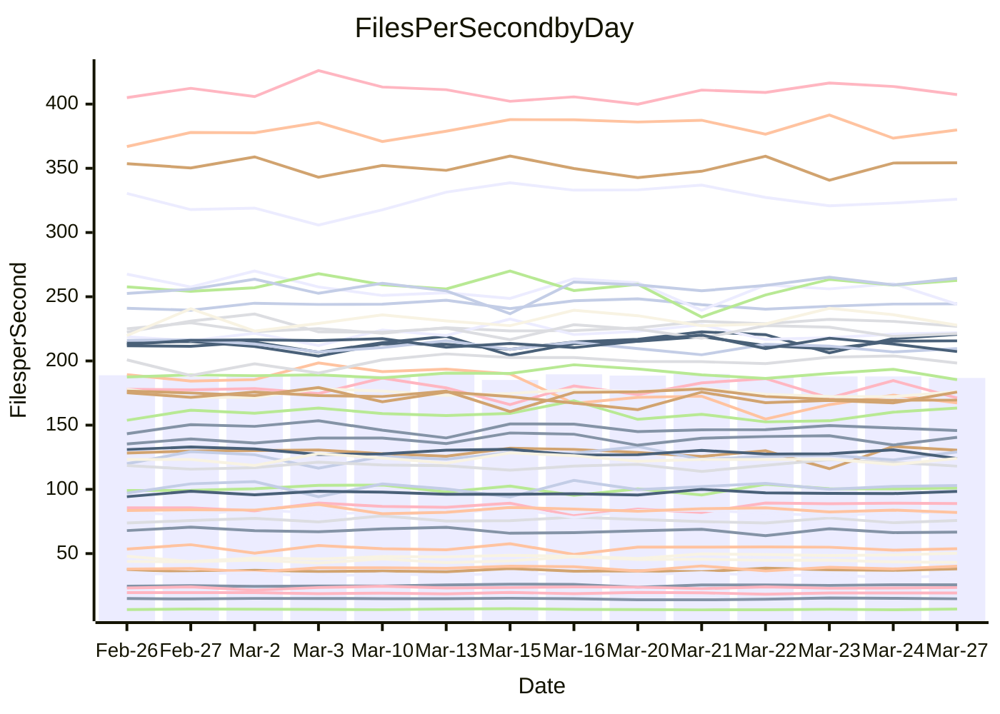

<!---
# This file is auto-generated. Do not edit.
# cspell:disable
--->
# Performance Report

Daily Performance

```mermaid
xychart-beta
    title Files Per Second by Day
    y-axis Files per Second
    x-axis Date [Feb-26, Feb-27, Mar-2, Mar-3, Mar-10, Mar-13, Mar-15, Mar-16, Mar-20, Mar-21, Mar-22, Mar-23, Mar-24, Mar-27]
    bar [188.86, 187.47, 189.15, 187.99, 188.38, 189.98, 185.21, 189.57, 188.63, 189.87, 187.45, 187.93, 187.93, 186.72]
    line [14.98, 14.69, 15.09, 15.05, 14.93, 14.92, 15.23, 14.84, 14.06, 13.99, 14.45, 15.39, 15.15, 14.80]
    line [366.95, 377.92, 377.66, 385.69, 370.91, 378.91, 387.90, 387.80, 386.06, 387.41, 376.59, 391.51, 373.44, 379.86]
    line [73.75, 75.77, 77.40, 74.68, 79.36, 75.39, 75.58, 78.40, 76.58, 74.92, 73.83, 77.77, 74.02, 75.76]
    line [99.09, 99.19, 100.48, 103.18, 103.33, 98.05, 102.55, 95.32, 100.34, 95.68, 103.94, 100.49, 100.37, 101.02]
    line [128.31, 129.87, 130.27, 130.71, 127.81, 125.76, 132.01, 131.14, 128.67, 125.67, 130.11, 116.06, 133.46, 130.56]
    line [119.96, 129.35, 126.96, 116.50, 125.61, 123.50, 128.64, 128.22, 133.34, 123.28, 125.66, 126.65, 122.93, 129.14]
    line [85.68, 85.69, 83.26, 89.40, 86.73, 86.09, 89.20, 79.46, 84.64, 82.02, 89.37, 88.80, 89.20, 88.94]
    line [214.22, 215.21, 211.23, 203.79, 213.30, 213.00, 209.05, 214.75, 216.78, 222.67, 220.47, 206.28, 217.42, 220.69]
    line [43.86, 43.58, 44.95, 42.68, 45.79, 43.00, 44.30, 47.55, 45.42, 45.55, 44.76, 44.94, 43.55, 43.08]
    line [81.93, 80.10, 84.29, 81.35, 81.66, 80.93, 85.41, 78.19, 83.51, 83.81, 81.43, 79.47, 81.70, 82.00]
    line [24.62, 25.06, 24.45, 24.76, 24.74, 25.60, 26.18, 25.98, 23.83, 25.61, 25.64, 25.22, 25.67, 25.67]
    line [189.34, 184.31, 185.47, 198.42, 191.68, 193.62, 189.84, 166.89, 171.60, 172.56, 154.71, 166.00, 173.35, 167.37]
    line [225.02, 229.69, 222.82, 225.14, 221.56, 225.82, 223.33, 223.62, 225.78, 230.86, 229.00, 232.44, 230.81, 227.00]
    line [6.44, 6.78, 6.62, 6.55, 6.32, 6.79, 7.12, 6.59, 6.35, 6.19, 6.26, 6.60, 6.25, 6.78]
    line [37.66, 35.60, 37.02, 36.08, 36.38, 35.91, 38.37, 36.25, 36.61, 35.87, 38.67, 37.37, 36.99, 38.01]
    line [97.11, 104.32, 106.04, 94.30, 104.19, 100.36, 94.07, 106.95, 99.82, 102.15, 104.63, 100.11, 102.26, 102.97]
    line [177.93, 177.54, 178.41, 174.58, 186.65, 179.06, 166.05, 180.55, 173.75, 182.92, 186.30, 171.18, 184.68, 171.15]
    line [211.79, 211.44, 214.66, 206.78, 214.22, 219.20, 204.44, 213.42, 215.32, 218.95, 211.96, 209.30, 215.41, 215.65]
    line [177.93, 171.71, 171.61, 178.31, 176.56, 173.19, 174.63, 177.66, 175.92, 178.79, 174.01, 172.30, 172.16, 176.05]
    line [218.81, 215.75, 221.50, 212.02, 224.11, 219.75, 232.68, 220.52, 223.12, 228.15, 216.79, 218.07, 220.91, 222.03]
    line [143.30, 150.41, 149.07, 153.47, 146.06, 140.05, 150.95, 150.81, 144.94, 146.39, 146.52, 149.65, 147.78, 145.81]
    line [83.59, 84.08, 83.89, 88.30, 81.02, 82.11, 85.90, 84.63, 82.99, 84.87, 85.57, 82.40, 83.84, 82.03]
    line [222.46, 230.96, 236.51, 222.64, 222.38, 225.56, 216.60, 228.18, 224.68, 217.69, 227.52, 226.28, 219.14, 221.27]
    line [187.50, 189.10, 188.54, 189.19, 186.81, 190.52, 190.26, 197.02, 193.75, 189.15, 186.42, 190.28, 193.49, 185.45]
    line [353.61, 350.32, 358.90, 343.06, 352.21, 348.39, 359.59, 349.81, 342.75, 347.71, 359.34, 340.76, 354.09, 354.28]
    line [240.98, 239.52, 244.96, 243.99, 244.22, 247.23, 240.74, 246.80, 248.37, 243.77, 240.29, 242.61, 244.28, 244.43]
    line [23.19, 24.07, 21.50, 23.56, 24.56, 23.16, 23.57, 24.07, 23.83, 22.72, 24.07, 23.01, 23.19, 23.57]
    line [94.30, 98.50, 95.82, 98.55, 97.82, 96.22, 96.21, 96.60, 95.61, 100.00, 97.34, 96.90, 96.73, 98.40]
    line [219.75, 240.64, 223.28, 229.19, 235.85, 231.18, 227.46, 239.47, 235.22, 227.41, 228.79, 241.01, 235.98, 227.80]
    line [330.45, 317.84, 319.02, 305.87, 317.67, 331.44, 338.69, 332.97, 333.24, 336.87, 327.34, 320.84, 322.94, 325.93]
    line [135.42, 139.26, 136.06, 139.99, 140.01, 135.63, 143.93, 142.95, 134.36, 139.82, 141.15, 141.79, 134.53, 140.52]
    line [38.02, 38.35, 35.65, 38.90, 38.99, 38.46, 40.13, 39.77, 36.42, 40.38, 36.50, 39.38, 38.08, 40.16]
    line [118.53, 115.70, 116.93, 121.24, 118.95, 118.40, 114.99, 118.14, 119.47, 113.95, 118.70, 123.16, 121.00, 118.08]
    line [153.79, 161.66, 159.28, 163.36, 159.01, 157.48, 159.10, 169.05, 154.54, 158.47, 152.54, 153.40, 160.13, 163.33]
    line [176.50, 175.06, 173.05, 179.29, 168.17, 175.84, 172.23, 167.20, 162.09, 175.73, 167.53, 169.26, 167.37, 175.77]
    line [215.98, 216.39, 213.20, 207.00, 210.46, 215.67, 209.05, 214.60, 209.59, 204.82, 212.94, 211.50, 207.03, 209.63]
    line [405.05, 412.32, 405.86, 426.09, 413.29, 411.20, 402.18, 405.65, 399.88, 410.92, 409.10, 416.42, 413.72, 407.35]
    line [131.00, 133.00, 131.45, 127.22, 127.60, 130.54, 131.20, 126.76, 126.98, 130.36, 127.52, 127.75, 130.81, 124.05]
    line [123.31, 123.27, 118.58, 127.90, 124.38, 120.45, 128.40, 126.26, 121.85, 123.29, 123.31, 123.57, 119.37, 124.08]
    line [267.57, 257.62, 270.01, 257.62, 250.97, 253.10, 248.68, 263.99, 260.91, 239.46, 259.16, 256.10, 260.18, 244.13]
    line [67.89, 70.56, 67.78, 66.98, 69.18, 70.51, 65.83, 66.30, 67.73, 68.98, 63.91, 69.35, 66.34, 66.74]
    line [53.55, 56.91, 50.34, 56.33, 53.77, 52.96, 57.64, 49.40, 55.01, 55.07, 55.14, 54.97, 52.69, 53.77]
    line [200.84, 188.59, 197.81, 190.62, 200.86, 205.50, 202.63, 202.69, 199.56, 199.40, 197.96, 202.91, 203.92, 198.39]
    line [257.65, 254.22, 257.02, 267.92, 259.39, 256.02, 269.97, 254.79, 259.65, 234.19, 251.38, 263.45, 259.03, 262.71]
    line [175.27, 171.69, 175.82, 173.02, 172.27, 176.52, 160.55, 175.49, 175.91, 178.24, 172.29, 170.07, 169.37, 169.51]
    line [252.54, 255.82, 263.63, 252.65, 260.43, 254.55, 236.73, 261.47, 259.22, 254.59, 258.80, 265.17, 259.19, 264.33]
    line [19.60, 19.60, 19.63, 18.78, 19.22, 18.67, 19.78, 18.71, 19.79, 19.47, 18.35, 19.30, 19.37, 19.35]
    line [212.86, 215.99, 216.40, 215.81, 217.40, 210.64, 213.63, 210.38, 215.44, 220.20, 209.66, 217.73, 213.19, 207.32]
    line [47.91, 43.77, 46.60, 45.68, 47.70, 47.47, 48.64, 47.90, 46.22, 49.72, 49.15, 48.47, 48.92, 50.36]
    line [33.98, 34.43, 34.99, 32.10, 34.36, 33.03, 34.53, 33.80, 33.49, 35.23, 32.80, 33.41, 31.17, 32.88]
```

Time to Process Files

| Repository                                      | Elapsed | Min/Avg/Max           |   SD | SD Graph                |
| ----------------------------------------------- | ------: | :-------------------: | ---: | ----------------------- |
| AdaDoom3/AdaDoom3                    |    2.72 | 2.6 /   2.8 /   3.0   | 0.09 | `    ┣━━┻●━╋━━┻━━┫    ` |
| alexiosc/megistos                    |    7.27 | 6.7 /   7.2 /   8.1   | 0.32 | `    ┣━━┻━━╋●━┻━━┫    ` |
| apollographql/apollo-server          |    2.93 | 2.4 /   2.5 /   2.8   | 0.09 | `     ┣━━┻━╋━┻━━┫    ●` |
| aspnetboilerplate/aspnetboilerplate  |    8.71 | 8.5 /   8.9 /   9.8   | 0.27 | `    ┣━━┻●━╋━━┻━━┫    ` |
| aws-amplify/docs                     |   12.22 | 11.4 /  11.8 /  12.5  | 0.27 | `    ┣━━┻━━╋━━┻━●┫    ` |
| Azure/azure-rest-api-specs           |   10.78 | 8.9 /   9.6 /  11.2   | 0.52 | `    ┣━━┻━━╋━━┻━━┫●   ` |
| bitjson/typescript-starter           |    1.09 | 1.0 /   1.0 /   1.2   | 0.04 | `     ┣━┻━━╋━━●━┫     ` |
| caddyserver/caddy                    |    3.44 | 3.3 /   3.5 /   4.1   | 0.15 | `    ┣━━┻━●╋━━┻━━┫    ` |
| canada-ca/open-source-logiciel-libre |    1.05 | 1.0 /   1.1 /   1.2   | 0.06 | `     ┣━┻━●╋━━┻━┫     ` |
| chef/chef                            |    5.28 | 5.2 /   5.4 /   5.8   | 0.16 | `    ┣━━●━━╋━━┻━━┫    ` |
| dart-lang/sdk                        |   54.73 | 52.6 /  55.5 /  60.9  | 1.64 | `  ┣━━━┻━●━╋━━━┻━━━┫  ` |
| django/django                        |   14.67 | 13.0 /  13.5 /  14.8  | 0.38 | `    ┣━━┻━━╋━━┻━━┫   ●` |
| eslint/eslint                        |    9.59 | 9.1 /   9.6 /  10.0   | 0.23 | `    ┣━━┻━━●━━┻━━┫    ` |
| exonum/exonum                        |    3.41 | 3.2 /   3.4 /   3.8   | 0.11 | `    ┣━━┻━━●━━┻━━┫    ` |
| flutter/samples                      |   13.71 | 14.0 /  14.8 /  17.3  | 0.76 | `   ┣━●━┻━━╋━━┻━━━┫   ` |
| gitbucket/gitbucket                  |    3.13 | 3.0 /   3.3 /   4.3   | 0.24 | `    ┣━━┻━●╋━━┻━━┫    ` |
| googleapis/google-cloud-cpp          |  119.47 | 112.8 / 120.0 / 131.2 | 3.71 | `  ┣━━━┻━━●╋━━━┻━━━┫  ` |
| graphql/express-graphql              |    1.19 | 1.0 /   1.1 /   1.2   | 0.05 | `     ┣━┻━━╋━━┻●┫     ` |
| graphql/graphql-js                   |    2.58 | 2.6 /   2.7 /   2.9   | 0.09 | `    ┣━━●━━╋━━┻━━┫    ` |
| graphql/graphql-relay-js             |    1.02 | 1.0 /   1.1 /   1.3   | 0.06 | `     ┣●┻━━╋━━┻━┫     ` |
| graphql/graphql-spec                 |    1.23 | 1.2 /   1.3 /   1.6   | 0.07 | `     ┣━┻●━╋━━┻━┫     ` |
| iluwatar/java-design-patterns        |   11.91 | 11.3 /  11.8 /  12.4  | 0.28 | `    ┣━━┻━━╋━●┻━━┫    ` |
| ktaranov/sqlserver-kit               |    6.08 | 5.5 /   5.9 /   6.5   | 0.21 | `    ┣━━┻━━╋━━●━━┫    ` |
| liriliri/licia                       |    3.70 | 3.6 /   3.8 /   4.1   | 0.12 | `    ┣━━●━━╋━━┻━━┫    ` |
| MartinThoma/LaTeX-examples           |    6.06 | 6.0 /   6.2 /   7.0   | 0.20 | `    ┣━━●━━╋━━┻━━┫    ` |
| mdx-js/mdx                           |    1.92 | 1.7 /   1.8 /   2.0   | 0.08 | `     ┣━┻━━╋━━●━┫     ` |
| microsoft/TypeScript-Website         |    5.41 | 4.9 /   5.2 /   5.7   | 0.21 | `    ┣━━┻━━╋━━┻●━┫    ` |
| MicrosoftDocs/PowerShell-Docs        |   26.19 | 19.6 /  20.5 /  22.4  | 0.65 | `        ┣┻╋┻┫       ●` |
| neovim/nvim-lspconfig                |    5.01 | 3.8 /   4.5 /   5.6   | 0.51 | `    ┣━━┻━━╋━━●━━┫    ` |
| pagekit/pagekit                      |    3.32 | 3.3 /   3.5 /   3.8   | 0.12 | `    ┣━━●━━╋━━┻━━┫    ` |
| php/php-src                          |   23.25 | 22.7 /  23.5 /  25.1  | 0.57 | `   ┣━━━┻━●╋━━┻━━━┫   ` |
| plasticrake/tplink-smarthome-api     |    1.15 | 1.2 /   1.3 /   1.5   | 0.07 | `    ●┣━┻━━╋━━┻━┫     ` |
| prettier/prettier                    |    7.79 | 7.3 /   7.6 /   8.3   | 0.22 | `    ┣━━┻━━╋━━●━━┫    ` |
| pycontribs/jira                      |    1.42 | 1.4 /   1.5 /   1.7   | 0.09 | `     ┣━┻●━╋━━┻━┫     ` |
| RustPython/RustPython                |    6.43 | 6.0 /   6.4 /   7.0   | 0.23 | `    ┣━━┻━━●━━┻━━┫    ` |
| shoelace-style/shoelace              |    2.73 | 2.5 /   2.8 /   3.2   | 0.14 | `    ┣━━┻━●╋━━┻━━┫    ` |
| slint-ui/slint                       |   13.55 | 12.7 /  13.3 /  14.1  | 0.33 | `    ┣━━┻━━╋━━●━━┫    ` |
| SoftwareBrothers/admin-bro           |    2.46 | 2.2 /   2.5 /   3.0   | 0.16 | `    ┣━━┻━━●━━┻━━┫    ` |
| sveltejs/svelte                      |   20.85 | 20.0 /  20.9 /  23.3  | 0.75 | `   ┣━━━┻━━●━━┻━━━┫   ` |
| TheAlgorithms/Python                 |    5.30 | 5.2 /   5.4 /   5.9   | 0.17 | `    ┣━━┻●━╋━━┻━━┫    ` |
| twbs/bootstrap                       |    1.89 | 1.7 /   1.7 /   2.0   | 0.07 | `     ┣━┻━━╋━━┻━┫●    ` |
| typescript-cheatsheets/react         |    1.33 | 1.3 /   1.4 /   1.6   | 0.07 | `     ┣━┻●━╋━━┻━┫     ` |
| typescript-eslint/typescript-eslint  |    3.88 | 3.8 /   4.0 /   4.5   | 0.15 | `    ┣━━●━━╋━━┻━━┫    ` |
| vitest-dev/vitest                    |   10.28 | 10.2 /  11.1 /  12.1  | 0.48 | `    ┣●━┻━━╋━━┻━━┫    ` |
| w3c/aria-practices                   |    3.15 | 3.1 /   3.3 /   4.1   | 0.20 | `    ┣━━┻●━╋━━┻━━┫    ` |
| w3c/specberus                        |    1.90 | 1.8 /   1.9 /   2.3   | 0.11 | `    ┣━━┻━●╋━━┻━━┫    ` |
| webdeveric/webpack-assets-manifest   |    1.08 | 1.1 /   1.2 /   1.4   | 0.08 | `     ●━┻━━╋━━┻━┫     ` |
| webpack/webpack                      |    5.16 | 4.8 /   5.1 /   5.5   | 0.19 | `    ┣━━┻━━╋●━┻━━┫    ` |
| wireapp/wire-desktop                 |    1.44 | 1.2 /   1.3 /   1.6   | 0.08 | `     ┣━┻━━╋━━┻●┫     ` |
| wireapp/wire-webapp                  |   10.88 | 10.6 /  11.2 /  12.6  | 0.38 | `    ┣━━●━━╋━━┻━━┫    ` |

Note:
- Elapsed time is in seconds.

Files per Second over Time

| Repository                                      | Files |    Sec |    Fps |     Rel | Trend Fps              |    N |
| ----------------------------------------------- | ----: | -----: | -----: | ------: | ---------------------- | ---: |
| AdaDoom3/AdaDoom3                    |   103 |   2.72 |  37.92 |   2.70% | `▅█▇▅▆▇▄▅██▇▆▇▇▅▇▆██▇` |   36 |
| alexiosc/megistos                    |   583 |   7.27 |  80.16 |  -1.87% | `▇█▅▆█▇▇▇█▅█▆▄▇▆▆▅██▆` |   36 |
| apollographql/apollo-server          |   254 |   2.93 |  86.79 | -13.94% | `▆▇▃▆▇▆▅▅▇█▆▆▇▇▆▅███▂` |   36 |
| aspnetboilerplate/aspnetboilerplate  |  2286 |   8.71 | 262.35 |   1.59% | `▆█▇▅█▅▇▄▆▅██▆▆▇▇▇▇▇▇` |   36 |
| aws-amplify/docs                     |  2874 |  12.22 | 235.25 |  -3.66% | `▇▆▇▇▇██▇▄██▄▇▇▆▇▇█▇▅` |   36 |
| Azure/azure-rest-api-specs           |  2486 |  10.78 | 230.51 | -10.39% | `▅▆█▇█▇▇▅▆███▄█▆█▃█▇▄` |   36 |
| bitjson/typescript-starter           |    20 |   1.09 |  18.27 |  -5.36% | `▃▇▅▆▆▆█▆▄▆▇▅▆▇▆▇▇▇▆▅` |   36 |
| caddyserver/caddy                    |   302 |   3.44 |  87.72 |   1.43% | `▇▇▆▃▇▅▆▅▇▇▇█▇▇█▇█▇▇▇` |   36 |
| canada-ca/open-source-logiciel-libre |     7 |   1.05 |   6.69 |   2.73% | `▆▇▆▅▅▃▅▄▄▅▅▆▆▆▄▃█▆▄▆` |   36 |
| chef/chef                            |  1200 |   5.28 | 227.10 |   2.86% | `▄█▇▆▆▇▇▇▅▆▆▅▆▇▆▆▇▆▅▇` |   36 |
| dart-lang/sdk                        | 11160 |  54.73 | 203.90 |   1.94% | `▆▇▇█▇▇▆▇▇▆▇█▇█▇▇▇▇▄▇` |   36 |
| django/django                        |  2897 |  14.67 | 197.51 |  -7.82% | `▇▇▆▆▇█▇█▅▇▇▇█▆▇▆▇▇▄▄` |   36 |
| eslint/eslint                        |  2053 |   9.59 | 214.02 |   0.17% | `▆▄▇▅▆▇▆▇▅▇▅▆▅▆▆█▆▇▇▆` |   36 |
| exonum/exonum                        |   421 |   3.41 | 123.52 |   0.37% | `▆██▆▅▆▇▆▆▇▆▆█▆▃▇▇▆▇▆` |   36 |
| flutter/samples                      |  2494 |  13.71 | 181.87 |   6.41% | `▇▇▇▅▄▄▇▇▇▅█▇▄▅█▅▇▇▇█` |   36 |
| gitbucket/gitbucket                  |   415 |   3.13 | 132.52 |   3.42% | `▇█▇█▆█▇▇▇▇█▂▆██▇█▇██` |   36 |
| googleapis/google-cloud-cpp          | 20799 | 119.47 | 174.10 |   0.82% | `▇▄▇███▇█▇▆▆▆▇▄▇█▆▅▆▇` |   36 |
| graphql/express-graphql              |    26 |   1.19 |  21.88 |  -7.24% | `▄▇█▇█▇▆▆█▇█▃▇▇▇▅██▇▅` |   36 |
| graphql/graphql-js                   |   371 |   2.58 | 143.58 |   3.76% | `▅███▄▆▇▇█▆▇▇█▅▅▆▇▇▆█` |   36 |
| graphql/graphql-relay-js             |    28 |   1.02 |  27.42 |   9.44% | `▆▇▆▇▅▆▃▆▆▆▆▇▅▅▇▇▇▇▃█` |   36 |
| graphql/graphql-spec                 |    19 |   1.23 |  15.47 |   4.24% | `▇▇▇▆█▆▂▅▅▇▇▇█▇▇▆▄█▇▇` |   36 |
| iluwatar/java-design-patterns        |  2060 |  11.91 | 172.94 |  -1.25% | `█▇██▇█▇█▆██▆▆█▅▆███▇` |   36 |
| ktaranov/sqlserver-kit               |   490 |   6.08 |  80.64 |  -3.15% | `▆██▆▇▆▇▇█▇▆▇▆█▅▇▇▅█▆` |   36 |
| liriliri/licia                       |  1437 |   3.70 | 388.74 |   2.79% | `▆▇▇▇▇▇▇▇▆▇█▇█▅▇▅█▆▅▇` |   36 |
| MartinThoma/LaTeX-examples           |  1409 |   6.06 | 232.44 |   2.81% | `█▇▇▆▇▇▇█▇██████▇▆▇██` |   36 |
| mdx-js/mdx                           |   140 |   1.92 |  72.90 |  -4.51% | `▆▆▇▇▇▅▆▅▆▄▇▇▆▅▆▅▆█▅▅` |   36 |
| microsoft/TypeScript-Website         |   756 |   5.41 | 139.74 |  -4.81% | `▆███▆█▅▇█▆▇███▇▇█▆█▅` |   36 |
| MicrosoftDocs/PowerShell-Docs        |  2648 |  26.19 | 101.09 | -21.89% | `▇▇▇▅▄█▆▇▅▇▆▅▇▅██▇▆█ ` |   36 |
| neovim/nvim-lspconfig                |   837 |   5.01 | 166.93 |  -7.08% | `█▇▄▄▅▄▅▅▃▂▃▅▄▄▅▅▅▄▄▄` |   36 |
| pagekit/pagekit                      |   741 |   3.32 | 223.02 |   4.06% | `▇▆▇▆▆█▇██▇▅▇▃▆█▇██▆█` |   36 |
| php/php-src                          |  2274 |  23.25 |  97.80 |   0.95% | `▆▇▇▆▅█▆█▇▇▅▇█▇▇▇█▇▇▇` |   36 |
| plasticrake/tplink-smarthome-api     |    62 |   1.15 |  54.13 |  13.47% | `▆▆▅▅▄▅▄▆▅▆▅▅▇▅▇▆█▆▄█` |   36 |
| prettier/prettier                    |  2666 |   7.79 | 342.29 |  -2.57% | `██▇▆█▆▄▆▇█▆▅▆▆▇█▇██▆` |   36 |
| pycontribs/jira                      |    79 |   1.42 |  55.66 |   3.50% | `▆█▄▅█▇▆▇▇▇▅██▇▅▆▇▇▃▇` |   36 |
| RustPython/RustPython                |   764 |   6.43 | 118.85 |   0.05% | `▇▅▇▅▇▅▇▅▆▆▇▇██▆▆█▆▃▆` |   36 |
| shoelace-style/shoelace              |   440 |   2.73 | 161.40 |   1.87% | `▆▆█▇▆▅▄▆▆▄▃▆▇▇▅▆▇▇▆▆` |   36 |
| slint-ui/slint                       |  2805 |  13.55 | 206.95 |  -2.29% | `█▇██▆█▇▆▇█▆███▅▆▆▇█▆` |   36 |
| SoftwareBrothers/admin-bro           |   441 |   2.46 | 179.50 |   0.47% | `▇▄▆▇▇▆▃▇█▆▄▆▅▇▇▆▄▂█▆` |   36 |
| sveltejs/svelte                      |  8615 |  20.85 | 413.19 |   0.88% | `█▆▇▆▇▇▄▇█▅▇██▆█▇██▄▇` |   36 |
| TheAlgorithms/Python                 |  1407 |   5.30 | 265.39 |   2.70% | `█▄▇▇█▅█▆▇▆██▇█▇▆▇███` |   36 |
| twbs/bootstrap                       |   118 |   1.89 |  62.42 |  -8.35% | `█▆█▄▅█▇▇▃▆▇█▇▅▆▇▆▇█▄` |   36 |
| typescript-cheatsheets/react         |    53 |   1.33 |  39.75 |   3.41% | `██▇█▄▅▆█▇▃▆█▇▆▇▆█▇█▇` |   36 |
| typescript-eslint/typescript-eslint  |  1310 |   3.88 | 337.99 |   4.04% | `▇▇█▆▆█▇▇▇▆▅█▄▆▆▆▅▆▆▇` |   36 |
| vitest-dev/vitest                    |  2575 |  10.28 | 250.54 |   8.23% | `▄▅▆█▅█▅▅▆▅▅███▅▅▅▃▅█` |   36 |
| w3c/aria-practices                   |   414 |   3.15 | 131.45 |   4.54% | `▆▇█▆█▇█▆▆▇▆▆█▇▇▄█▆▇█` |   36 |
| w3c/specberus                        |   197 |   1.90 | 103.73 |   1.92% | `▆▄▇▇▄▅▇▆▇▆▆▆▅▅▇▆█▃▇▆` |   36 |
| webdeveric/webpack-assets-manifest   |    54 |   1.08 |  50.01 |  12.71% | `▄▅▇▇▆▅▆▆▅▆▅▆▅▅▇▃▃▃▄█` |   36 |
| webpack/webpack                      |  1148 |   5.16 | 222.69 |  -0.74% | `▇▅▇▇▆▅█▅█▆▆▆█▄▇▅▅▅▇▆` |   36 |
| wireapp/wire-desktop                 |    44 |   1.44 |  30.64 |  -8.82% | `▆▇█▅▆▇▆█▆▆▇▄█▅▂▇▇▇▆▄` |   35 |
| wireapp/wire-webapp                  |  2133 |  10.88 | 196.04 |   3.61% | `▆▇▇██▇▇▆▇▅█▇▅▇▇▇▃▆▆▇` |   36 |

Data Throughput

| Repository                                      | Files |    Sec |     Kps |     Rel | Trend Kps              |    N |
| ----------------------------------------------- | ----: | -----: | ------: | ------: | ---------------------- | ---: |
| AdaDoom3/AdaDoom3                    |   103 |   2.72 |  805.86 |   2.70% | `▅█▇▅▆▇▄▅██▇▆▇▇▅▇▆██▇` |   36 |
| alexiosc/megistos                    |   583 |   7.27 |  629.90 |  -1.87% | `▇█▅▆█▇▇▇█▅█▆▄▇▆▆▅██▆` |   36 |
| apollographql/apollo-server          |   254 |   2.93 |  713.11 | -13.94% | `▆▇▃▆▇▆▅▅▇█▆▆▇▇▆▅███▂` |   36 |
| aspnetboilerplate/aspnetboilerplate  |  2286 |   8.71 |  638.32 |   1.59% | `▆█▇▅█▅▇▄▆▅██▆▆▇▇▇▇▇▇` |   36 |
| aws-amplify/docs                     |  2874 |  12.22 |  822.56 |  -3.66% | `▇▆▇▇▇██▇▄██▄▇▇▆▇▇█▇▅` |   36 |
| Azure/azure-rest-api-specs           |  2486 |  10.78 |  676.42 |  -7.89% | `▅▆█▇█▇▇▅▆███▄█▆█▃█▇▄` |   36 |
| bitjson/typescript-starter           |    20 |   1.09 |   73.06 |  -5.36% | `▃▇▅▆▆▆█▆▄▆▇▅▆▇▆▇▇▇▆▅` |   36 |
| caddyserver/caddy                    |   302 |   3.44 |  779.04 |   1.58% | `▇▇▆▃▇▅▆▅▇▇▇█▇▇█▇█▇▇▇` |   36 |
| canada-ca/open-source-logiciel-libre |     7 |   1.05 |   55.44 |   2.73% | `▆▇▆▅▅▃▅▄▄▅▅▆▆▆▄▃█▆▄▆` |   36 |
| chef/chef                            |  1200 |   5.28 | 1066.43 |   2.87% | `▄█▇▆▆▇▇▇▅▆▆▅▆▇▆▆▇▆▅▇` |   36 |
| dart-lang/sdk                        | 11160 |  54.73 | 1377.94 |   1.71% | `▇▇▇█▇▇▆▇▇▆▇█▇█▇▇▇▇▄▇` |   36 |
| django/django                        |  2897 |  14.67 | 1251.25 |  -7.72% | `▇▇▆▆▇█▇█▅▇▇▇█▆▇▆▇▇▄▄` |   36 |
| eslint/eslint                        |  2053 |   9.59 | 1485.92 |   0.14% | `▆▄▇▅▆▇▆▇▅▇▅▆▅▆▆█▆▇▇▆` |   36 |
| exonum/exonum                        |   421 |   3.41 | 1181.50 |   0.37% | `▆██▆▅▆▇▆▆▇▆▆█▆▃▇▇▆▇▆` |   36 |
| flutter/samples                      |  2494 |  13.71 | 1568.09 |   7.60% | `▇▆▇▅▄▅▇▇▇▅█▇▄▅█▅▇▇▇█` |   36 |
| gitbucket/gitbucket                  |   415 |   3.13 |  612.13 |   3.68% | `▇█▇█▆█▇▇▇▇█▂▆██▇█▇██` |   36 |
| googleapis/google-cloud-cpp          | 20799 | 119.47 | 1473.16 |   1.05% | `▇▄▇███▇█▇▆▆▆▇▄▇█▆▅▆▇` |   36 |
| graphql/express-graphql              |    26 |   1.19 |  100.16 |  -7.24% | `▄▇█▇█▇▆▆█▇█▃▇▇▇▅██▇▅` |   36 |
| graphql/graphql-js                   |   371 |   2.58 |  841.75 |   3.94% | `▅███▄▆▇▇█▇▇██▅▆▆▇▇▆█` |   36 |
| graphql/graphql-relay-js             |    28 |   1.02 |  107.72 |   9.44% | `▆▇▆▇▅▆▃▆▆▆▆▇▅▅▇▇▇▇▃█` |   36 |
| graphql/graphql-spec                 |    19 |   1.23 |  516.23 |   4.24% | `▇▇▇▆█▆▂▅▅▇▇▇█▇▇▆▄█▇▇` |   36 |
| iluwatar/java-design-patterns        |  2060 |  11.91 |  533.00 |  -1.25% | `█▇██▇█▇█▆██▆▆█▅▆███▇` |   36 |
| ktaranov/sqlserver-kit               |   490 |   6.08 | 1221.55 |  -3.04% | `▆██▆▇▆▇▇█▇▆▇▆█▅▇▇▅█▆` |   36 |
| liriliri/licia                       |  1437 |   3.70 |  463.13 |   2.79% | `▆▇▇▇▇▇▇▇▆▇█▇█▅▇▅█▆▅▇` |   36 |
| MartinThoma/LaTeX-examples           |  1409 |   6.06 |  480.06 |   2.81% | `█▇▇▆▇▇▇█▇██████▇▆▇██` |   36 |
| mdx-js/mdx                           |   140 |   1.92 |  341.09 |  -4.15% | `▅▆▇▇▇▅▇▅▆▄▇▇▆▅▆▅▆█▅▅` |   36 |
| microsoft/TypeScript-Website         |   756 |   5.41 |  965.23 |  -5.03% | `▆███▆█▅▇█▆▇███▇▇█▆█▅` |   36 |
| MicrosoftDocs/PowerShell-Docs        |  2648 |  26.19 | 1057.28 | -21.88% | `▇▇▇▅▄█▆▇▅▇▆▅▇▅██▇▆█ ` |   36 |
| neovim/nvim-lspconfig                |   837 |   5.01 |  448.94 |  11.04% | `▅▃▇▇█▇██▆▅▆█▇▇███▇▇▇` |   36 |
| pagekit/pagekit                      |   741 |   3.32 |  465.00 |   4.06% | `▇▆▇▆▆█▇██▇▅▇▃▆█▇██▆█` |   36 |
| php/php-src                          |  2274 |  23.25 | 1705.15 |   0.98% | `▆▇▇▆▅█▆█▇▇▅▇█▇▇▇█▇▇▇` |   36 |
| plasticrake/tplink-smarthome-api     |    62 |   1.15 |  292.45 |  13.47% | `▆▆▅▅▄▅▄▆▅▆▅▅▇▅▇▆█▆▄█` |   36 |
| prettier/prettier                    |  2666 |   7.79 |  470.56 |  -2.61% | `██▇▆█▆▄▆▇█▆▅▆▆▇█▇██▆` |   36 |
| pycontribs/jira                      |    79 |   1.42 |  394.52 |   3.50% | `▆█▄▅█▇▆▇▇▇▅██▇▅▆▇▇▃▇` |   36 |
| RustPython/RustPython                |   764 |   6.43 | 1849.95 |   1.73% | `▇▅▇▅▇▅▇▅▆▆▇▇██▇▆█▆▄▆` |   36 |
| shoelace-style/shoelace              |   440 |   2.73 |  778.76 |   1.87% | `▆▆█▇▆▅▄▆▆▄▃▆▇▇▅▆▇▇▆▆` |   36 |
| slint-ui/slint                       |  2805 |  13.55 | 1305.62 |  -1.51% | `▇▆▇█▅▇▆▅▇█▆███▅▆▆▇█▆` |   36 |
| SoftwareBrothers/admin-bro           |   441 |   2.46 |  395.62 |   0.47% | `▇▄▆▇▇▆▃▇█▆▄▆▅▇▇▆▄▂█▆` |   36 |
| sveltejs/svelte                      |  8615 |  20.85 |  279.76 |   0.93% | `█▆▇▆▇▇▄▇█▅▇██▆█▇██▄▇` |   36 |
| TheAlgorithms/Python                 |  1407 |   5.30 |  677.70 |   2.77% | `█▄▇▇█▅█▆▇▆██▇█▇▆▇███` |   36 |
| twbs/bootstrap                       |   118 |   1.89 |  512.60 |  -8.35% | `█▆█▄▅█▇▇▃▆▇█▇▅▆▇▆▇█▄` |   36 |
| typescript-cheatsheets/react         |    53 |   1.33 |  294.75 |   3.41% | `██▇█▄▅▆█▇▃▆█▇▆▇▆█▇█▇` |   36 |
| typescript-eslint/typescript-eslint  |  1310 |   3.88 | 1789.26 |   4.25% | `▇▇▇▆▆█▇▇▆▆▅█▄▆▆▆▅▆▆▇` |   36 |
| vitest-dev/vitest                    |  2575 |  10.28 |  764.36 |   8.45% | `▄▅▆█▆█▅▅▆▅▅███▅▅▅▃▅█` |   36 |
| w3c/aria-practices                   |   414 |   3.15 | 1227.86 |   4.54% | `▆▇█▆█▇█▆▆▇▆▆█▇▇▄█▆▇█` |   36 |
| w3c/specberus                        |   197 |   1.90 |  345.40 |   2.62% | `▆▄▇▇▄▅▇▆▇▆▆▆▆▆▇▆█▃▇▇` |   36 |
| webdeveric/webpack-assets-manifest   |    54 |   1.08 |  116.69 |  14.28% | `▄▅▆▇▆▅▆▆▅▅▅▆▆▅▇▃▃▄▄█` |   36 |
| webpack/webpack                      |  1148 |   5.16 | 1045.57 |  -0.56% | `▇▅▇▇▆▅█▅█▆▆▆█▄▇▅▅▅▇▆` |   36 |
| wireapp/wire-desktop                 |    44 |   1.44 |  136.50 |  -8.82% | `▆▇█▅▆▇▆█▆▆▇▄█▅▂▇▇▇▆▄` |   35 |
| wireapp/wire-webapp                  |  2133 |  10.88 |  775.72 |   4.14% | `▆▆▇██▇▇▆▇▅█▇▅▇▇▇▃▆▆▇` |   36 |

