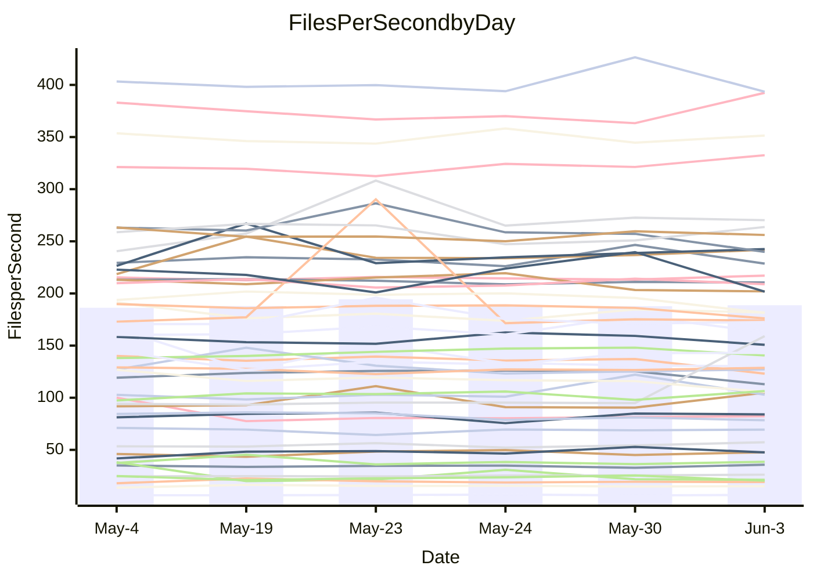

<!---
# This file is auto-generated. Do not edit.
# cspell:disable
--->
# Performance Report

Daily Performance

```mermaid
xychart-beta
    title Files Per Second by Day
    y-axis Files per Second
    x-axis Date [May-4, May-19, May-23, May-24, May-30, Jun-3]
    bar [186.25, 187.94, 194.38, 187.53, 187.84, 188.70]
    line [35.07, 33.61, 34.69, 34.94, 32.78, 35.79]
    line [140.01, 135.42, 139.50, 135.65, 137.15, 123.09]
    line [53.38, 53.17, 56.48, 52.20, 54.24, 57.32]
    line [38.18, 20.00, 21.53, 30.85, 21.86, 21.33]
    line [46.04, 43.44, 48.37, 49.79, 45.03, 47.69]
    line [71.11, 69.47, 64.25, 69.53, 68.78, 69.37]
    line [100.08, 77.54, 80.59, 80.29, 81.53, 82.29]
    line [81.26, 84.52, 85.73, 75.59, 84.88, 83.99]
    line [191.37, 176.15, 180.59, 173.73, 184.72, 181.71]
    line [166.55, 126.61, 150.87, 133.44, 130.84, 130.22]
    line [119.17, 123.77, 125.73, 125.94, 125.35, 112.95]
    line [17.95, 22.53, 19.87, 18.72, 19.42, 19.15]
    line [24.56, 24.84, 24.48, 25.27, 25.51, 26.21]
    line [24.93, 21.05, 22.73, 23.64, 25.47, 20.39]
    line [91.75, 92.82, 111.10, 90.94, 90.56, 104.84]
    line [102.79, 98.35, 102.96, 100.96, 122.12, 102.88]
    line [382.99, 374.77, 366.83, 370.08, 363.31, 392.45]
    line [158.32, 153.28, 151.73, 162.52, 159.30, 150.77]
    line [13.72, 16.48, 15.39, 15.58, 14.86, 15.18]
    line [6.46, 6.48, 6.70, 7.10, 6.34, 6.74]
    line [229.32, 234.71, 232.57, 226.13, 246.49, 228.60]
    line [189.78, 185.86, 188.16, 188.58, 186.13, 176.02]
    line [240.52, 257.39, 308.24, 265.00, 272.73, 270.27]
    line [37.38, 45.35, 36.07, 38.42, 36.32, 38.54]
    line [218.55, 254.57, 234.26, 233.79, 236.78, 241.94]
    line [127.00, 147.92, 130.77, 123.22, 125.33, 127.25]
    line [215.39, 212.55, 215.84, 214.38, 213.29, 217.13]
    line [226.51, 267.13, 229.05, 234.58, 238.79, 242.50]
    line [353.58, 346.15, 343.69, 358.26, 344.65, 351.41]
    line [160.29, 160.94, 168.26, 160.60, 178.51, 162.97]
    line [213.17, 213.72, 212.23, 208.69, 211.05, 210.52]
    line [129.13, 127.71, 122.71, 127.15, 126.61, 128.67]
    line [94.12, 93.35, 95.34, 95.32, 94.79, 159.13]
    line [138.03, 140.07, 144.01, 147.15, 148.03, 140.54]
    line [213.15, 208.87, 215.23, 219.43, 203.27, 201.99]
    line [84.38, 85.95, 85.08, 78.77, 81.14, 78.40]
    line [321.24, 319.57, 312.48, 324.31, 321.30, 332.58]
    line [41.81, 48.29, 48.86, 46.46, 52.80, 47.62]
    line [126.81, 116.06, 119.43, 116.84, 115.92, 105.51]
    line [144.52, 126.78, 134.48, 131.99, 142.83, 143.00]
    line [263.11, 260.36, 286.42, 258.60, 257.18, 239.81]
    line [172.93, 177.15, 290.28, 171.42, 175.26, 173.98]
    line [258.73, 266.74, 265.26, 247.18, 250.86, 263.73]
    line [97.37, 104.19, 103.43, 105.92, 97.87, 106.45]
    line [263.28, 254.35, 254.61, 250.00, 259.58, 256.09]
    line [403.25, 398.12, 399.78, 393.93, 426.44, 393.52]
    line [209.84, 213.89, 205.67, 207.63, 214.21, 208.82]
    line [222.86, 217.73, 200.96, 223.84, 239.63, 201.75]
    line [193.68, 201.86, 198.76, 200.08, 195.61, 181.39]
    line [170.59, 170.67, 195.94, 175.36, 171.10, 172.66]
```

Time to Process Files

| Repository                                      | Elapsed | Min/Avg/Max          |   SD | SD Graph                |
| ----------------------------------------------- | ------: | :------------------: | ---: | ----------------------- |
| AdaDoom3/AdaDoom3                    |    2.67 | 2.2 /   2.7 /   2.9  | 0.22 | `    ┣━━┻━━●━━┻━━┫    ` |
| alexiosc/megistos                    |    7.44 | 6.7 /   7.1 /   7.9  | 0.36 | `    ┣━━┻━━╋━━●━━┫    ` |
| apollographql/apollo-server          |    2.48 | 1.4 /   2.4 /   2.6  | 0.32 | `    ┣━━┻━━╋●━┻━━┫    ` |
| aspnetboilerplate/aspnetboilerplate  |    8.93 | 8.7 /   8.9 /   9.3  | 0.19 | `    ┣━━┻━━●━━┻━━┫    ` |
| aws-amplify/docs                     |   12.20 | 10.1 /  12.4 /  13.4 | 0.80 | `    ┣━━┻━●╋━━┻━━┫    ` |
| Azure/azure-rest-api-specs           |    9.47 | 9.1 /   9.8 /  10.8  | 0.54 | `    ┣━━┻●━╋━━┻━━┫    ` |
| bitjson/typescript-starter           |    1.04 | 0.8 /   1.0 /   1.1  | 0.08 | `     ┣━┻━━╋●━┻━┫     ` |
| caddyserver/caddy                    |    2.99 | 2.7 /   3.3 /   3.7  | 0.27 | `    ┣━●┻━━╋━━┻━━┫    ` |
| canada-ca/open-source-logiciel-libre |    1.04 | 0.9 /   1.1 /   1.2  | 0.08 | `     ┣━┻━●╋━━┻━┫     ` |
| chef/chef                            |    5.11 | 4.6 /   4.9 /   5.3  | 0.20 | `    ┣━━┻━━╋━━●━━┫    ` |
| dart-lang/sdk                        |   62.83 | 55.5 /  57.6 /  59.4 | 1.21 | `     ┣━━┻━╋━┻━━┫    ●` |
| django/django                        |   13.94 | 13.3 /  13.8 /  14.2 | 0.29 | `    ┣━━┻━━╋●━┻━━┫    ` |
| eslint/eslint                        |    9.84 | 9.5 /   9.8 /  10.3  | 0.21 | `    ┣━━┻━━╋●━┻━━┫    ` |
| exonum/exonum                        |    3.73 | 3.3 /   3.4 /   3.5  | 0.07 | `      ┣━┻━╋━┻━┫     ●` |
| flutter/samples                      |   11.85 | 11.3 /  12.5 /  13.6 | 0.73 | `    ┣━━●━━╋━━┻━━┫    ` |
| gitbucket/gitbucket                  |    3.20 | 2.5 /   3.1 /   3.4  | 0.29 | `    ┣━━┻━━╋●━┻━━┫    ` |
| googleapis/google-cloud-cpp          |  121.20 | 95.0 / 119.4 / 125.2 | 7.92 | `  ┣━━━┻━━━╋●━━┻━━━┫  ` |
| graphql/express-graphql              |    1.28 | 0.9 /   1.1 /   1.3  | 0.10 | `     ┣━┻━━╋━━┻━●     ` |
| graphql/graphql-js                   |    3.01 | 2.6 /   2.7 /   2.9  | 0.10 | `     ┣━┻━━╋━━┻━┫  ●  ` |
| graphql/graphql-relay-js             |    1.07 | 1.1 /   1.1 /   1.2  | 0.04 | `     ┣━●━━╋━━┻━┫     ` |
| graphql/graphql-spec                 |    1.25 | 1.0 /   1.3 /   1.4  | 0.09 | `     ┣━┻━━●━━┻━┫     ` |
| iluwatar/java-design-patterns        |   11.85 | 7.1 /  11.3 /  12.1  | 1.42 | `   ┣━━━┻━━╋●━┻━━━┫   ` |
| ktaranov/sqlserver-kit               |    5.83 | 5.5 /   5.9 /   7.5  | 0.53 | `    ┣━━┻━●╋━━┻━━┫    ` |
| liriliri/licia                       |    3.66 | 3.7 /   3.9 /   4.1  | 0.13 | `    ┣●━┻━━╋━━┻━━┫    ` |
| MartinThoma/LaTeX-examples           |    6.16 | 4.7 /   6.0 /   6.5  | 0.44 | `    ┣━━┻━━╋●━┻━━┫    ` |
| mdx-js/mdx                           |    1.70 | 1.4 /   1.7 /   1.9  | 0.12 | `     ┣━┻━━●━━┻━┫     ` |
| microsoft/TypeScript-Website         |    5.44 | 5.0 /   5.3 /   5.6  | 0.19 | `    ┣━━┻━━╋━●┻━━┫    ` |
| MicrosoftDocs/PowerShell-Docs        |   24.30 | 23.6 /  24.7 /  25.8 | 0.69 | `   ┣━━━┻●━╋━━┻━━━┫   ` |
| neovim/nvim-lspconfig                |    5.26 | 4.0 /   5.1 /   5.6  | 0.39 | `    ┣━━┻━━╋●━┻━━┫    ` |
| pagekit/pagekit                      |    3.41 | 3.3 /   3.5 /   3.6  | 0.08 | `     ┣━┻●━╋━━┻━┫     ` |
| php/php-src                          |   14.39 | 23.6 /  24.2 /  25.6 | 0.54 | `●        ┣╋┫         ` |
| plasticrake/tplink-smarthome-api     |    1.30 | 1.0 /   1.3 /   1.5  | 0.11 | `     ┣━┻━━╋●━┻━┫     ` |
| prettier/prettier                    |    7.61 | 7.4 /   7.7 /   8.3  | 0.25 | `    ┣━━┻━●╋━━┻━━┫    ` |
| pycontribs/jira                      |    1.40 | 1.4 /   1.5 /   1.6  | 0.08 | `     ┣━●━━╋━━┻━┫     ` |
| RustPython/RustPython                |    7.38 | 6.2 /   6.6 /   6.9  | 0.21 | `    ┣━━┻━━╋━━┻━━┫   ●` |
| shoelace-style/shoelace              |    2.92 | 2.7 /   2.8 /   3.0  | 0.10 | `     ┣━┻━━╋━━●━┫     ` |
| slint-ui/slint                       |   13.08 | 11.3 /  13.3 /  13.9 | 0.67 | `    ┣━━┻━●╋━━┻━━┫    ` |
| SoftwareBrothers/admin-bro           |    2.43 | 2.3 /   2.4 /   2.6  | 0.12 | `     ┣━┻━━●━━┻━┫     ` |
| sveltejs/svelte                      |   22.32 | 17.1 /  21.6 /  22.8 | 1.49 | `   ┣━━━┻━━╋━●┻━━━┫   ` |
| TheAlgorithms/Python                 |    5.87 | 4.3 /   5.4 /   5.7  | 0.35 | `    ┣━━┻━━╋━━┻●━┫    ` |
| twbs/bootstrap                       |    1.70 | 1.7 /   1.7 /   1.9  | 0.07 | `     ┣━┻━●╋━━┻━┫     ` |
| typescript-cheatsheets/react         |    1.13 | 0.7 /   1.1 /   1.4  | 0.17 | `     ┣━┻━━╋●━┻━┫     ` |
| typescript-eslint/typescript-eslint  |    3.97 | 3.9 /   4.1 /   4.6  | 0.18 | `    ┣━━●━━╋━━┻━━┫    ` |
| vitest-dev/vitest                    |    9.93 | 7.7 /   9.9 /  11.1  | 0.81 | `    ┣━━┻━━●━━┻━━┫    ` |
| w3c/aria-practices                   |    3.25 | 2.5 /   3.2 /   3.4  | 0.25 | `    ┣━━┻━━╋●━┻━━┫    ` |
| w3c/specberus                        |    1.84 | 1.8 /   1.9 /   2.2  | 0.12 | `     ┣━┻●━╋━━┻━┫     ` |
| webdeveric/webpack-assets-manifest   |    1.15 | 1.0 /   1.2 /   1.4  | 0.08 | `     ┣━┻━●╋━━┻━┫     ` |
| webpack/webpack                      |    5.79 | 4.2 /   5.2 /   5.8  | 0.39 | `    ┣━━┻━━╋━━┻━●┫    ` |
| wireapp/wire-desktop                 |    1.26 | 1.3 /   1.3 /   1.5  | 0.08 | `     ┣━●━━╋━━┻━┫     ` |
| wireapp/wire-webapp                  |   12.70 | 11.7 /  11.9 /  12.2 | 0.13 | `      ┣━┻━╋━┻━┫     ●` |

Note:
- Elapsed time is in seconds.

Files per Second over Time

| Repository                                      | Files |    Sec |    Fps |     Rel | Trend Fps      |    N |
| ----------------------------------------------- | ----: | -----: | -----: | ------: | -------------- | ---: |
| AdaDoom3/AdaDoom3                    |   103 |   2.67 |  38.54 |   0.39% | `▃▇█▃▃▅▃▃▂▃▃▄` |   11 |
| alexiosc/megistos                    |   583 |   7.44 |  78.40 |  -5.09% | `▇█▇█▆▇▃▆▇▄▆▅` |   11 |
| apollographql/apollo-server          |   255 |   2.48 | 102.88 |  -5.36% | `▂▁▁▂▂▂▁▂█▂▂▂` |   11 |
| aspnetboilerplate/aspnetboilerplate  |  2286 |   8.93 | 256.09 |  -0.09% | `█▅▇▆▇▅▆▆▇█▇▇` |   11 |
| aws-amplify/docs                     |  2959 |  12.20 | 242.50 |   0.92% | `▃▄█▄▂▄▃▄▄▃▄▄` |   11 |
| Azure/azure-rest-api-specs           |  2497 |   9.47 | 263.73 |   2.85% | `▆▇▇▇█▃▇▃█▆▅▇` |   11 |
| bitjson/typescript-starter           |    20 |   1.04 |  19.15 |  -3.30% | `▂█▄▄▄▄▂▄▃▄▃▃` |   11 |
| caddyserver/caddy                    |   313 |   2.99 | 104.84 |  10.50% | `▃▄▄▆█▃▃▃▄▂▃▆` |   11 |
| canada-ca/open-source-logiciel-libre |     7 |   1.04 |   6.74 |   2.42% | `▄▃▆▆▄█▅▂▅▃▆▅` |   11 |
| chef/chef                            |  1032 |   5.11 | 201.99 |  -3.95% | `▇▆▆█▆▇█▅▄▄▇▅` |   11 |
| dart-lang/sdk                        | 11396 |  62.83 | 181.39 |  -8.37% | `▅▇█▇▆▆█▆▅▆▇▃` |   11 |
| django/django                        |  2912 |  13.94 | 208.82 |  -1.03% | `▆█▆▅▅▅▆▇▆▇█▆` |   11 |
| eslint/eslint                        |  2072 |   9.84 | 210.52 |  -0.47% | `▇█▆▇▇▇▆█▇▅▇▇` |   11 |
| exonum/exonum                        |   421 |   3.73 | 112.95 |  -9.40% | `▅▆▇▇▇█▇▇█▆▆▃` |   11 |
| flutter/samples                      |  1695 |  11.85 | 143.00 |   4.71% | `▇▄▃▆▄▅▄█▇█▄▇` |   11 |
| gitbucket/gitbucket                  |   417 |   3.20 | 130.22 |  -5.25% | `█▃▂█▃▄▃▃▃▃▄▃` |   11 |
| googleapis/google-cloud-cpp          | 20926 | 121.20 | 172.66 |  -2.05% | `▃▃▃█▃▃▃▂▃▃▃▃` |   11 |
| graphql/express-graphql              |    26 |   1.28 |  20.39 | -14.29% | `▅▃▂▃▄▄▄▄█▄▅▂` |   11 |
| graphql/graphql-js                   |   371 |   3.01 | 123.09 | -10.32% | `██▅▇██▅▄██▇▃` |   11 |
| graphql/graphql-relay-js             |    28 |   1.07 |  26.21 |   4.55% | `▅▅▆▄▆▄█▅▇▇▆█` |   11 |
| graphql/graphql-spec                 |    19 |   1.25 |  15.18 |  -0.66% | `▂▃█▅▄▄▅▃▃▄▄▄` |   11 |
| iluwatar/java-design-patterns        |  2061 |  11.85 | 173.98 |  -6.53% | `▂▂▂█▁▂▂▂▂▂▂`  |   10 |
| ktaranov/sqlserver-kit               |   490 |   5.83 |  83.99 |   1.25% | `▆▇▇▇▇▂▇▅███▇` |   11 |
| liriliri/licia                       |  1438 |   3.66 | 392.45 |   6.34% | `▇▆▇▄▇▆▆▅▄▅▇█` |   11 |
| MartinThoma/LaTeX-examples           |  1409 |   6.16 | 228.60 |  -3.36% | `▃▃▄▃▃▃▂█▃▃▃▃` |   11 |
| mdx-js/mdx                           |   140 |   1.70 |  82.29 |   0.23% | `█▂▄▃▄▄▄▄▄▄▄▄` |   11 |
| microsoft/TypeScript-Website         |   765 |   5.44 | 140.54 |  -2.93% | `▄▅▄▅▆▅█▆▆▇▇▅` |   11 |
| MicrosoftDocs/PowerShell-Docs        |  3126 |  24.30 | 128.67 |   1.77% | `▇▆▇▅▅▇▅▄▇█▆▇` |   11 |
| neovim/nvim-lspconfig                |   857 |   5.26 | 162.97 |  -3.31% | `▃▃▃▃▃▂▃▃█▄▃▃` |   11 |
| pagekit/pagekit                      |   741 |   3.41 | 217.13 |   1.46% | `▆▅▇▆█▆▆▅▅█▆▇` |   11 |
| php/php-src                          |  2290 |  14.39 | 159.13 |  68.10% | `▂▁▂▂▂▂▂▂▂▂▂█` |   11 |
| plasticrake/tplink-smarthome-api     |    62 |   1.30 |  47.62 |  -3.03% | `▂▄▄▄▄▅▂█▅▅▄▄` |   11 |
| prettier/prettier                    |  2674 |   7.61 | 351.41 |   0.97% | `▇▆▆▅▇▇██▅▇▄▇` |   11 |
| pycontribs/jira                      |    80 |   1.40 |  57.32 |   6.14% | `▅▄▇▇▇▅▅▇▅█▃█` |   11 |
| RustPython/RustPython                |   779 |   7.38 | 105.51 | -10.39% | `█▅▅▇▅▅▅▄▅▄▇▂` |   11 |
| shoelace-style/shoelace              |   440 |   2.92 | 150.77 |  -4.17% | `▇▇▄▄▇██▇██▇▅` |   11 |
| slint-ui/slint                       |  3164 |  13.08 | 241.94 |   1.93% | `▂█▃▄▄▄▄▃▄▄▅▅` |   11 |
| SoftwareBrothers/admin-bro           |   441 |   2.43 | 181.71 |   0.39% | `█▆▄▇▅▅▅▇█▇▄▆` |   11 |
| sveltejs/svelte                      |  8784 |  22.32 | 393.52 |  -3.65% | `▃▃▂▃▃▃▂▃█▃▂▃` |   11 |
| TheAlgorithms/Python                 |  1407 |   5.87 | 239.81 |  -9.12% | `▃▄▃▂█▃▄▃▃▃▃▂` |   11 |
| twbs/bootstrap                       |   118 |   1.70 |  69.37 |   1.37% | `██▇▃▆▇▇▇▇▇▆▇` |   11 |
| typescript-cheatsheets/react         |    24 |   1.13 |  21.33 | -13.24% | `█▂▁▂▂▇▄▂▂▂▂▂` |   11 |
| typescript-eslint/typescript-eslint  |  1322 |   3.97 | 332.58 |   3.96% | `▇▅█▃█▇▇▆▇▇▅█` |   11 |
| vitest-dev/vitest                    |  2685 |   9.93 | 270.27 |  -0.66% | `▂▃▃▃█▃▃▄▄▃▃▄` |   11 |
| w3c/aria-practices                   |   414 |   3.25 | 127.25 |  -2.26% | `▃▃█▃▃▂▃▃▂▃▂▃` |   11 |
| w3c/specberus                        |   196 |   1.84 | 106.45 |   4.93% | `▅█▆▆█▇██▆▃▅█` |   11 |
| webdeveric/webpack-assets-manifest   |    55 |   1.15 |  47.69 |   3.00% | `▅▅▂▅▆█▅▅▄▄▄▅` |   11 |
| webpack/webpack                      |  1169 |   5.79 | 201.75 | -10.95% | `▄▃▃▂▄▃▄█▄▄▂`  |   10 |
| wireapp/wire-desktop                 |    45 |   1.26 |  35.79 |   5.63% | `██▅▆██▇█▆▇▃█` |   11 |
| wireapp/wire-webapp                  |  2236 |  12.70 | 176.02 |  -5.99% | `██▆▇██▇▆▇▇▇▄` |   11 |

Data Throughput

| Repository                                      | Files |    Sec |     Kps |     Rel | Trend Kps      |    N |
| ----------------------------------------------- | ----: | -----: | ------: | ------: | -------------- | ---: |
| AdaDoom3/AdaDoom3                    |   103 |   2.67 |  819.15 |   0.39% | `▃▇█▃▃▅▃▃▂▃▃▄` |   11 |
| alexiosc/megistos                    |   583 |   7.44 |  616.01 |  -5.09% | `▇█▇█▆▇▃▆▇▄▆▅` |   11 |
| apollographql/apollo-server          |   255 |   2.48 |  850.10 |  -5.35% | `▂▁▁▂▂▂▁▂█▂▂▂` |   11 |
| aspnetboilerplate/aspnetboilerplate  |  2286 |   8.93 |  623.09 |  -0.09% | `█▅▇▆▇▅▆▆▇█▇▇` |   11 |
| aws-amplify/docs                     |  2959 |  12.20 |  876.91 |   0.93% | `▃▄█▄▂▄▃▄▄▃▄▄` |   11 |
| Azure/azure-rest-api-specs           |  2497 |   9.47 |  789.59 |   2.88% | `▆▇▇▇█▃▇▃█▆▅▇` |   11 |
| bitjson/typescript-starter           |    20 |   1.04 |   76.60 |  -3.30% | `▂█▄▄▄▄▂▄▃▄▃▃` |   11 |
| caddyserver/caddy                    |   313 |   2.99 |  937.22 |  10.48% | `▃▄▄▆█▃▃▃▄▂▃▆` |   11 |
| canada-ca/open-source-logiciel-libre |     7 |   1.04 |   55.84 |   2.42% | `▄▃▆▆▄█▅▂▅▃▆▅` |   11 |
| chef/chef                            |  1032 |   5.11 |  988.98 |  -3.93% | `▆▆▆█▆▇█▅▄▄▇▅` |   11 |
| dart-lang/sdk                        | 11396 |  62.83 | 1239.83 |  -8.36% | `▅▇█▇▆▆█▆▅▆▇▃` |   11 |
| django/django                        |  2912 |  13.94 | 1339.14 |  -0.97% | `▆█▆▅▅▅▆▇▆▇█▆` |   11 |
| eslint/eslint                        |  2072 |   9.84 | 1464.52 |  -0.47% | `▇█▆▇▇▇▆█▇▅▇▇` |   11 |
| exonum/exonum                        |   421 |   3.73 | 1080.44 |  -9.40% | `▅▆▇▇▇█▇▇█▆▆▃` |   11 |
| flutter/samples                      |  1695 |  11.85 |  855.89 |   4.71% | `▇▄▃▆▄▅▄█▇█▄▇` |   11 |
| gitbucket/gitbucket                  |   417 |   3.20 |  620.82 |  -4.97% | `▇▃▂█▃▄▃▃▃▃▄▃` |   11 |
| googleapis/google-cloud-cpp          | 20926 | 121.20 | 1473.58 |  -2.05% | `▃▃▃█▃▃▃▂▃▃▃▃` |   11 |
| graphql/express-graphql              |    26 |   1.28 |   93.31 | -14.29% | `▅▃▂▃▄▄▄▄█▄▅▂` |   11 |
| graphql/graphql-js                   |   371 |   3.01 |  729.25 | -10.32% | `██▅▇██▅▄██▇▃` |   11 |
| graphql/graphql-relay-js             |    28 |   1.07 |  102.98 |   4.55% | `▅▅▆▄▆▄█▅▇▇▆█` |   11 |
| graphql/graphql-spec                 |    19 |   1.25 |  506.41 |  -0.66% | `▂▃█▅▄▄▅▃▃▄▄▄` |   11 |
| iluwatar/java-design-patterns        |  2061 |  11.85 |  536.29 |  -6.53% | `▂▂▂█▁▂▂▂▂▂▂`  |   10 |
| ktaranov/sqlserver-kit               |   490 |   5.83 | 1272.37 |   1.25% | `▆▇▇▇▇▂▇▅███▇` |   11 |
| liriliri/licia                       |  1438 |   3.66 |  468.32 |   6.36% | `▇▆▇▄▇▆▆▅▄▅▇█` |   11 |
| MartinThoma/LaTeX-examples           |  1409 |   6.16 |  472.13 |  -3.36% | `▃▃▄▃▃▃▂█▃▃▃▃` |   11 |
| mdx-js/mdx                           |   140 |   1.70 |  384.98 |   0.21% | `█▂▄▃▄▄▄▄▄▄▄▄` |   11 |
| microsoft/TypeScript-Website         |   765 |   5.44 |  967.99 |  -2.93% | `▄▅▄▅▆▅█▆▆▇▇▅` |   11 |
| MicrosoftDocs/PowerShell-Docs        |  3126 |  24.30 | 1371.03 |   1.76% | `▇▆▇▅▅▇▅▄▇█▆▇` |   11 |
| neovim/nvim-lspconfig                |   857 |   5.26 |  477.68 |  -3.27% | `▃▃▃▃▃▂▃▃█▄▃▃` |   11 |
| pagekit/pagekit                      |   741 |   3.41 |  452.73 |   1.46% | `▆▅▇▆█▆▆▅▅█▆▇` |   11 |
| php/php-src                          |  2290 |  14.39 | 2798.78 |  68.11% | `▂▁▂▂▂▂▂▂▂▂▂█` |   11 |
| plasticrake/tplink-smarthome-api     |    62 |   1.30 |  257.32 |  -3.03% | `▂▄▄▄▄▅▂█▅▅▄▄` |   11 |
| prettier/prettier                    |  2674 |   7.61 |  482.57 |   0.97% | `▇▆▆▅▇▇██▅▇▄▇` |   11 |
| pycontribs/jira                      |    80 |   1.40 |  404.84 |   6.14% | `▅▄▇▇▇▅▅▇▅█▃█` |   11 |
| RustPython/RustPython                |   779 |   7.38 | 1797.15 |  -9.83% | `▇▆▆█▆▆▆▅▆▅█▂` |   11 |
| shoelace-style/shoelace              |   440 |   2.92 |  728.14 |  -4.16% | `▇▇▄▄▇██▇██▇▅` |   11 |
| slint-ui/slint                       |  3164 |  13.08 | 1263.67 |   0.30% | `▆█▃▃▄▄▃▃▄▄▄▄` |   11 |
| SoftwareBrothers/admin-bro           |   441 |   2.43 |  400.51 |   0.39% | `█▆▄▇▅▅▅▇█▇▄▆` |   11 |
| sveltejs/svelte                      |  8784 |  22.32 |  267.01 |  -3.65% | `▃▃▂▃▃▃▂▃█▃▂▃` |   11 |
| TheAlgorithms/Python                 |  1407 |   5.87 |  612.39 |  -9.12% | `▃▄▃▂█▃▄▃▃▃▃▂` |   11 |
| twbs/bootstrap                       |   118 |   1.70 |  569.65 |   1.37% | `██▇▃▆▇▇▇▇▇▆▇` |   11 |
| typescript-cheatsheets/react         |    24 |   1.13 |  191.94 | -11.02% | `▆▂▁▂▂█▄▃▂▂▂▂` |   11 |
| typescript-eslint/typescript-eslint  |  1322 |   3.97 | 1800.28 |   3.97% | `▇▅█▃█▇▇▆▇▇▅█` |   11 |
| vitest-dev/vitest                    |  2685 |   9.93 |  699.09 |  -2.39% | `▅▂▂▃█▃▃▃▄▃▃▃` |   11 |
| w3c/aria-practices                   |   414 |   3.25 | 1188.89 |  -2.26% | `▃▃█▃▃▂▃▃▂▃▂▃` |   11 |
| w3c/specberus                        |   196 |   1.84 |  347.05 |   4.89% | `▅█▆▆█▇██▆▃▅█` |   11 |
| webdeveric/webpack-assets-manifest   |    55 |   1.15 |  109.26 |   3.00% | `▅▅▂▅▆█▅▅▄▄▄▅` |   11 |
| webpack/webpack                      |  1169 |   5.79 | 1015.32 | -10.67% | `▃▃▃▂▄▃▄█▄▄▂`  |   10 |
| wireapp/wire-desktop                 |    45 |   1.26 |  157.46 |   5.63% | `██▅▆██▇█▆▇▃█` |   11 |
| wireapp/wire-webapp                  |  2236 |  12.70 |  735.39 |  -5.86% | `▇█▆▇██▇▆▇▇▇▄` |   11 |

