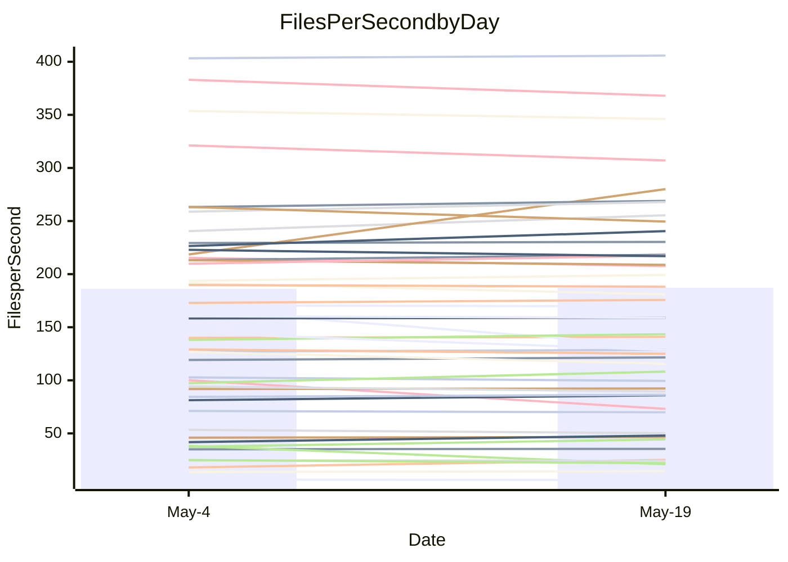

<!---
# This file is auto-generated. Do not edit.
# cspell:disable
--->
# Performance Report

Daily Performance

```mermaid
xychart-beta
    title Files Per Second by Day
    y-axis Files per Second
    x-axis Date [May-4, May-19]
    bar [186.25, 187.14]
    line [35.07, 35.45]
    line [140.01, 140.94]
    line [53.38, 50.19]
    line [38.18, 21.03]
    line [46.04, 46.60]
    line [71.11, 69.87]
    line [100.08, 73.14]
    line [81.26, 85.94]
    line [191.37, 180.98]
    line [166.55, 132.23]
    line [119.17, 121.51]
    line [17.95, 25.12]
    line [24.56, 24.30]
    line [24.93, 21.91]
    line [91.75, 92.34]
    line [102.79, 99.42]
    line [382.99, 368.00]
    line [158.32, 158.95]
    line [13.72, 14.31]
    line [6.46, 6.11]
    line [229.32, 230.35]
    line [189.78, 188.15]
    line [240.52, 255.42]
    line [37.38, 44.37]
    line [218.55, 280.04]
    line [127.00, 128.68]
    line [215.39, 207.55]
    line [226.51, 240.53]
    line [353.58, 346.05]
    line [160.29, 158.96]
    line [213.17, 218.24]
    line [129.13, 125.02]
    line [94.12, 89.47]
    line [138.03, 143.44]
    line [213.15, 208.80]
    line [84.38, 86.38]
    line [321.24, 307.07]
    line [41.81, 47.97]
    line [126.81, 115.57]
    line [144.52, 128.57]
    line [263.11, 268.97]
    line [172.93, 175.72]
    line [258.73, 267.85]
    line [97.37, 108.23]
    line [263.28, 249.50]
    line [403.25, 405.84]
    line [209.84, 217.36]
    line [222.86, 216.91]
    line [193.68, 199.18]
    line [170.59, 169.71]
```

Time to Process Files

| Repository                                      | Elapsed | Min/Avg/Max           |   SD | SD Graph |
| ----------------------------------------------- | ------: | :-------------------: | ---: | -------- |
| AdaDoom3/AdaDoom3                    |    2.32 | 2.8 /   2.8 /   2.8   | 0.00 | ``       |
| alexiosc/megistos                    |    6.75 | 6.9 /   6.9 /   6.9   | 0.00 | ``       |
| apollographql/apollo-server          |    2.56 | 2.5 /   2.5 /   2.5   | 0.00 | ``       |
| aspnetboilerplate/aspnetboilerplate  |    9.16 | 8.7 /   8.7 /   8.7   | 0.00 | ``       |
| aws-amplify/docs                     |   12.30 | 13.1 /  13.1 /  13.1  | 0.00 | ``       |
| Azure/azure-rest-api-specs           |    9.32 | 9.6 /   9.6 /   9.6   | 0.00 | ``       |
| bitjson/typescript-starter           |    0.80 | 1.1 /   1.1 /   1.1   | 0.00 | ``       |
| caddyserver/caddy                    |    3.39 | 3.4 /   3.4 /   3.4   | 0.00 | ``       |
| canada-ca/open-source-logiciel-libre |    1.14 | 1.1 /   1.1 /   1.1   | 0.00 | ``       |
| chef/chef                            |    4.94 | 4.8 /   4.8 /   4.8   | 0.00 | ``       |
| dart-lang/sdk                        |   57.22 | 58.7 /  58.7 /  58.7  | 0.00 | ``       |
| django/django                        |   13.40 | 13.8 /  13.8 /  13.8  | 0.00 | ``       |
| eslint/eslint                        |    9.49 | 9.7 /   9.7 /   9.7   | 0.00 | ``       |
| exonum/exonum                        |    3.46 | 3.5 /   3.5 /   3.5   | 0.00 | ``       |
| flutter/samples                      |   13.18 | 11.7 /  11.7 /  11.7  | 0.00 | ``       |
| gitbucket/gitbucket                  |    3.15 | 2.5 /   2.5 /   2.5   | 0.00 | ``       |
| googleapis/google-cloud-cpp          |  123.30 | 122.7 / 122.7 / 122.7 | 0.00 | ``       |
| graphql/express-graphql              |    1.19 | 1.0 /   1.0 /   1.0   | 0.00 | ``       |
| graphql/graphql-js                   |    2.63 | 2.6 /   2.6 /   2.6   | 0.00 | ``       |
| graphql/graphql-relay-js             |    1.15 | 1.1 /   1.1 /   1.1   | 0.00 | ``       |
| graphql/graphql-spec                 |    1.33 | 1.4 /   1.4 /   1.4   | 0.00 | ``       |
| iluwatar/java-design-patterns        |   11.73 | 11.9 /  11.9 /  11.9  | 0.00 | ``       |
| ktaranov/sqlserver-kit               |    5.70 | 6.0 /   6.0 /   6.0   | 0.00 | ``       |
| liriliri/licia                       |    3.91 | 3.8 /   3.8 /   3.8   | 0.00 | ``       |
| MartinThoma/LaTeX-examples           |    6.12 | 6.1 /   6.1 /   6.1   | 0.00 | ``       |
| mdx-js/mdx                           |    1.91 | 1.4 /   1.4 /   1.4   | 0.00 | ``       |
| microsoft/TypeScript-Website         |    5.33 | 5.5 /   5.5 /   5.5   | 0.00 | ``       |
| MicrosoftDocs/PowerShell-Docs        |   25.00 | 24.2 /  24.2 /  24.2  | 0.00 | ``       |
| neovim/nvim-lspconfig                |    5.39 | 5.3 /   5.3 /   5.3   | 0.00 | ``       |
| pagekit/pagekit                      |    3.57 | 3.4 /   3.4 /   3.4   | 0.00 | ``       |
| php/php-src                          |   25.60 | 24.3 /  24.3 /  24.3  | 0.00 | ``       |
| plasticrake/tplink-smarthome-api     |    1.29 | 1.5 /   1.5 /   1.5   | 0.00 | ``       |
| prettier/prettier                    |    7.73 | 7.6 /   7.6 /   7.6   | 0.00 | ``       |
| pycontribs/jira                      |    1.59 | 1.5 /   1.5 /   1.5   | 0.00 | ``       |
| RustPython/RustPython                |    6.74 | 6.2 /   6.2 /   6.2   | 0.00 | ``       |
| shoelace-style/shoelace              |    2.77 | 2.8 /   2.8 /   2.8   | 0.00 | ``       |
| slint-ui/slint                       |   11.30 | 13.5 /  13.5 /  13.5  | 0.00 | ``       |
| SoftwareBrothers/admin-bro           |    2.44 | 2.3 /   2.3 /   2.3   | 0.00 | ``       |
| sveltejs/svelte                      |   21.64 | 21.7 /  21.7 /  21.7  | 0.00 | ``       |
| TheAlgorithms/Python                 |    5.23 | 5.3 /   5.3 /   5.3   | 0.00 | ``       |
| twbs/bootstrap                       |    1.69 | 1.7 /   1.7 /   1.7   | 0.00 | ``       |
| typescript-cheatsheets/react         |    1.14 | 1.4 /   1.4 /   1.4   | 0.00 | ``       |
| typescript-eslint/typescript-eslint  |    4.31 | 4.1 /   4.1 /   4.1   | 0.00 | ``       |
| vitest-dev/vitest                    |   10.51 | 11.1 /  11.1 /  11.1  | 0.00 | ``       |
| w3c/aria-practices                   |    3.22 | 3.3 /   3.3 /   3.3   | 0.00 | ``       |
| w3c/specberus                        |    1.81 | 2.0 /   2.0 /   2.0   | 0.00 | ``       |
| webdeveric/webpack-assets-manifest   |    1.18 | 1.2 /   1.2 /   1.2   | 0.00 | ``       |
| webpack/webpack                      |    5.39 | 5.2 /   5.2 /   5.2   | 0.00 | ``       |
| wireapp/wire-desktop                 |    1.27 | 1.3 /   1.3 /   1.3   | 0.00 | ``       |
| wireapp/wire-webapp                  |   11.88 | 11.7 /  11.7 /  11.7  | 0.00 | ``       |

Note:
- Elapsed time is in seconds.

Files per Second over Time

| Repository                                      | Files |    Sec |    Fps |     Rel | Trend Fps |    N |
| ----------------------------------------------- | ----: | -----: | -----: | ------: | --------- | ---: |
| AdaDoom3/AdaDoom3                    |   103 |   2.32 |  44.37 |  18.69% | `▃█`      |    1 |
| alexiosc/megistos                    |   583 |   6.75 |  86.38 |   2.37% | `▇█`      |    1 |
| apollographql/apollo-server          |   255 |   2.56 |  99.42 |  -3.28% | `█▆`      |    1 |
| aspnetboilerplate/aspnetboilerplate  |  2286 |   9.16 | 249.50 |  -5.23% | `█▄`      |    1 |
| aws-amplify/docs                     |  2959 |  12.30 | 240.53 |   6.19% | `▅█`      |    1 |
| Azure/azure-rest-api-specs           |  2497 |   9.32 | 267.85 |   3.53% | `▆█`      |    1 |
| bitjson/typescript-starter           |    20 |   0.80 |  25.12 |  39.96% | `▂█`      |    1 |
| caddyserver/caddy                    |   313 |   3.39 |  92.34 |   0.65% | `██`      |    1 |
| canada-ca/open-source-logiciel-libre |     7 |   1.14 |   6.11 |  -5.38% | `█▄`      |    1 |
| chef/chef                            |  1032 |   4.94 | 208.80 |  -2.04% | `█▇`      |    1 |
| dart-lang/sdk                        | 11396 |  57.22 | 199.18 |   2.84% | `▆█`      |    1 |
| django/django                        |  2912 |  13.40 | 217.36 |   3.58% | `▆█`      |    1 |
| eslint/eslint                        |  2072 |   9.49 | 218.24 |   2.38% | `▇█`      |    1 |
| exonum/exonum                        |   421 |   3.46 | 121.51 |   1.97% | `▇█`      |    1 |
| flutter/samples                      |  1695 |  13.18 | 128.57 | -11.04% | `█ `      |    1 |
| gitbucket/gitbucket                  |   417 |   3.15 | 132.23 | -20.61% | `█ `      |    1 |
| googleapis/google-cloud-cpp          | 20926 | 123.30 | 169.71 |  -0.51% | `██`      |    1 |
| graphql/express-graphql              |    26 |   1.19 |  21.91 | -12.09% | `█ `      |    1 |
| graphql/graphql-js                   |   371 |   2.63 | 140.94 |   0.66% | `██`      |    1 |
| graphql/graphql-relay-js             |    28 |   1.15 |  24.30 |  -1.06% | `█▇`      |    1 |
| graphql/graphql-spec                 |    19 |   1.33 |  14.31 |   4.29% | `▆█`      |    1 |
| iluwatar/java-design-patterns        |  2061 |  11.73 | 175.72 |   1.61% | `▇█`      |    1 |
| ktaranov/sqlserver-kit               |   490 |   5.70 |  85.94 |   5.76% | `▅█`      |    1 |
| liriliri/licia                       |  1438 |   3.91 | 368.00 |  -3.91% | `█▅`      |    1 |
| MartinThoma/LaTeX-examples           |  1409 |   6.12 | 230.35 |   0.45% | `██`      |    1 |
| mdx-js/mdx                           |   140 |   1.91 |  73.14 | -26.92% | `█ `      |    1 |
| microsoft/TypeScript-Website         |   765 |   5.33 | 143.44 |   3.92% | `▆█`      |    1 |
| MicrosoftDocs/PowerShell-Docs        |  3126 |  25.00 | 125.02 |  -3.18% | `█▆`      |    1 |
| neovim/nvim-lspconfig                |   857 |   5.39 | 158.96 |  -0.83% | `█▇`      |    1 |
| pagekit/pagekit                      |   741 |   3.57 | 207.55 |  -3.64% | `█▅`      |    1 |
| php/php-src                          |  2290 |  25.60 |  89.47 |  -4.94% | `█▄`      |    1 |
| plasticrake/tplink-smarthome-api     |    62 |   1.29 |  47.97 |  14.73% | `▄█`      |    1 |
| prettier/prettier                    |  2674 |   7.73 | 346.05 |  -2.13% | `█▆`      |    1 |
| pycontribs/jira                      |    80 |   1.59 |  50.19 |  -5.97% | `█▄`      |    1 |
| RustPython/RustPython                |   779 |   6.74 | 115.57 |  -8.87% | `█▁`      |    1 |
| shoelace-style/shoelace              |   440 |   2.77 | 158.95 |   0.40% | `██`      |    1 |
| slint-ui/slint                       |  3164 |  11.30 | 280.04 |  28.14% | `▂█`      |    1 |
| SoftwareBrothers/admin-bro           |   441 |   2.44 | 180.98 |  -5.43% | `█▄`      |    1 |
| sveltejs/svelte                      |  8784 |  21.64 | 405.84 |   0.64% | `██`      |    1 |
| TheAlgorithms/Python                 |  1407 |   5.23 | 268.97 |   2.23% | `▇█`      |    1 |
| twbs/bootstrap                       |   118 |   1.69 |  69.87 |  -1.75% | `█▇`      |    1 |
| typescript-cheatsheets/react         |    24 |   1.14 |  21.03 | -44.92% | `█ `      |    1 |
| typescript-eslint/typescript-eslint  |  1322 |   4.31 | 307.07 |  -4.41% | `█▅`      |    1 |
| vitest-dev/vitest                    |  2685 |  10.51 | 255.42 |   6.20% | `▅█`      |    1 |
| w3c/aria-practices                   |   414 |   3.22 | 128.68 |   1.32% | `▇█`      |    1 |
| w3c/specberus                        |   196 |   1.81 | 108.23 |  11.16% | `▄█`      |    1 |
| webdeveric/webpack-assets-manifest   |    55 |   1.18 |  46.60 |   1.21% | `▇█`      |    1 |
| webpack/webpack                      |  1169 |   5.39 | 216.91 |  -2.67% | `█▆`      |    1 |
| wireapp/wire-desktop                 |    45 |   1.27 |  35.45 |   1.09% | `▇█`      |    1 |
| wireapp/wire-webapp                  |  2236 |  11.88 | 188.15 |  -0.86% | `█▇`      |    1 |

Data Throughput

| Repository                                      | Files |    Sec |     Kps |     Rel | Trend Kps |    N |
| ----------------------------------------------- | ----: | -----: | ------: | ------: | --------- | ---: |
| AdaDoom3/AdaDoom3                    |   103 |   2.32 |  942.97 |  18.69% | `▃█`      |    1 |
| alexiosc/megistos                    |   583 |   6.75 |  678.71 |   2.37% | `▇█`      |    1 |
| apollographql/apollo-server          |   255 |   2.56 |  821.47 |  -3.24% | `█▆`      |    1 |
| aspnetboilerplate/aspnetboilerplate  |  2286 |   9.16 |  607.04 |  -5.23% | `█▄`      |    1 |
| aws-amplify/docs                     |  2959 |  12.30 |  869.77 |   6.33% | `▅█`      |    1 |
| Azure/azure-rest-api-specs           |  2497 |   9.32 |  801.95 |   3.79% | `▆█`      |    1 |
| bitjson/typescript-starter           |    20 |   0.80 |  100.49 |  39.96% | `▂█`      |    1 |
| caddyserver/caddy                    |   313 |   3.39 |  825.46 |   0.51% | `██`      |    1 |
| canada-ca/open-source-logiciel-libre |     7 |   1.14 |   50.66 |  -5.38% | `█▄`      |    1 |
| chef/chef                            |  1032 |   4.94 | 1022.35 |  -1.79% | `█▇`      |    1 |
| dart-lang/sdk                        | 11396 |  57.22 | 1361.42 |   2.92% | `▆█`      |    1 |
| django/django                        |  2912 |  13.40 | 1393.85 |   4.31% | `▆█`      |    1 |
| eslint/eslint                        |  2072 |   9.49 | 1518.21 |   2.40% | `▇█`      |    1 |
| exonum/exonum                        |   421 |   3.46 | 1162.32 |   1.97% | `▇█`      |    1 |
| flutter/samples                      |  1695 |  13.18 |  769.53 | -11.04% | `█ `      |    1 |
| gitbucket/gitbucket                  |   417 |   3.15 |  630.37 | -18.40% | `█ `      |    1 |
| googleapis/google-cloud-cpp          | 20926 | 123.30 | 1448.46 |  -0.51% | `██`      |    1 |
| graphql/express-graphql              |    26 |   1.19 |  100.30 | -12.09% | `█ `      |    1 |
| graphql/graphql-js                   |   371 |   2.63 |  834.99 |   0.66% | `██`      |    1 |
| graphql/graphql-relay-js             |    28 |   1.15 |   95.46 |  -1.06% | `█▇`      |    1 |
| graphql/graphql-spec                 |    19 |   1.33 |  477.40 |   4.29% | `▆█`      |    1 |
| iluwatar/java-design-patterns        |  2061 |  11.73 |  541.65 |   1.61% | `▇█`      |    1 |
| ktaranov/sqlserver-kit               |   490 |   5.70 | 1301.91 |   5.76% | `▅█`      |    1 |
| liriliri/licia                       |  1438 |   3.91 |  439.14 |  -3.76% | `█▅`      |    1 |
| MartinThoma/LaTeX-examples           |  1409 |   6.12 |  475.74 |   0.45% | `██`      |    1 |
| mdx-js/mdx                           |   140 |   1.91 |  342.20 | -27.03% | `█ `      |    1 |
| microsoft/TypeScript-Website         |   765 |   5.33 |  987.98 |   3.92% | `▆█`      |    1 |
| MicrosoftDocs/PowerShell-Docs        |  3126 |  25.00 | 1332.23 |  -3.29% | `█▆`      |    1 |
| neovim/nvim-lspconfig                |   857 |   5.39 |  465.95 |  -0.38% | `██`      |    1 |
| pagekit/pagekit                      |   741 |   3.57 |  432.74 |  -3.64% | `█▅`      |    1 |
| php/php-src                          |  2290 |  25.60 | 1573.55 |  -4.88% | `█▄`      |    1 |
| plasticrake/tplink-smarthome-api     |    62 |   1.29 |  259.21 |  14.73% | `▄█`      |    1 |
| prettier/prettier                    |  2674 |   7.73 |  475.21 |  -2.13% | `█▆`      |    1 |
| pycontribs/jira                      |    80 |   1.59 |  354.50 |  -5.97% | `█▄`      |    1 |
| RustPython/RustPython                |   779 |   6.74 | 1968.50 |  -2.73% | `█▆`      |    1 |
| shoelace-style/shoelace              |   440 |   2.77 |  767.65 |   0.45% | `██`      |    1 |
| slint-ui/slint                       |  3164 |  11.30 | 1462.68 |   7.29% | `▅█`      |    1 |
| SoftwareBrothers/admin-bro           |   441 |   2.44 |  398.89 |  -5.43% | `█▄`      |    1 |
| sveltejs/svelte                      |  8784 |  21.64 |  275.36 |   0.63% | `██`      |    1 |
| TheAlgorithms/Python                 |  1407 |   5.23 |  686.87 |   2.23% | `▇█`      |    1 |
| twbs/bootstrap                       |   118 |   1.69 |  573.77 |  -1.75% | `█▇`      |    1 |
| typescript-cheatsheets/react         |    24 |   1.14 |  189.28 | -33.15% | `█ `      |    1 |
| typescript-eslint/typescript-eslint  |  1322 |   4.31 | 1662.18 |  -4.32% | `█▅`      |    1 |
| vitest-dev/vitest                    |  2685 |  10.51 |  660.68 | -13.03% | `█ `      |    1 |
| w3c/aria-practices                   |   414 |   3.22 | 1202.22 |   1.32% | `▇█`      |    1 |
| w3c/specberus                        |   196 |   1.81 |  352.87 |  10.68% | `▄█`      |    1 |
| webdeveric/webpack-assets-manifest   |    55 |   1.18 |  106.75 |   1.21% | `▇█`      |    1 |
| webpack/webpack                      |  1169 |   5.39 | 1091.62 |   0.54% | `██`      |    1 |
| wireapp/wire-desktop                 |    45 |   1.27 |  155.99 |   1.09% | `▇█`      |    1 |
| wireapp/wire-webapp                  |  2236 |  11.88 |  786.07 |   0.57% | `██`      |    1 |

