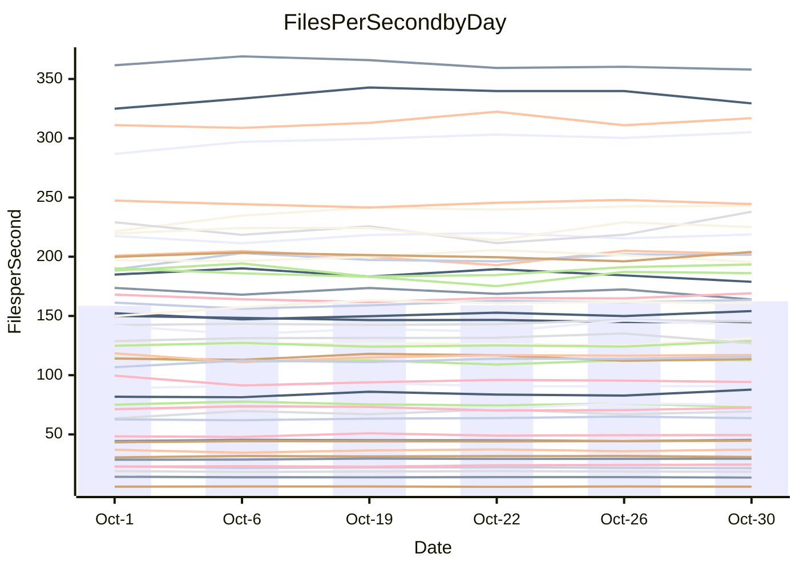

<!---
# This file is auto-generated. Do not edit.
# cspell:disable
--->
# Performance Report

## Daily Performance

```mermaid
xychart-beta
    title Files Per Second by Day
    y-axis Files per Second
    x-axis Date [Oct-1, Oct-6, Oct-19, Oct-22, Oct-26, Oct-30]
    bar [158.54, 157.78, 160.58, 159.03, 162.88, 162.42]
    line [14.24, 13.86, 13.81, 14.01, 14.02, 13.57]
    line [200.83, 204.79, 199.89, 192.85, 204.98, 202.39]
    line [63.55, 69.72, 67.05, 71.08, 67.00, 69.34]
    line [114.39, 111.42, 112.56, 109.04, 112.63, 112.74]
    line [5.92, 6.00, 6.02, 5.75, 6.03, 5.91]
    line [22.93, 21.69, 22.11, 22.28, 21.78, 21.54]
    line [22.85, 23.16, 22.78, 23.92, 24.17, 24.53]
    line [150.02, 148.37, 146.50, 146.67, 144.85, 144.60]
    line [125.90, 126.66, 126.74, 126.46, 125.04, 131.34]
    line [88.83, 91.13, 93.37, 90.70, 90.60, 90.89]
    line [44.41, 45.48, 45.18, 45.07, 44.31, 45.38]
    line [37.04, 34.53, 36.49, 37.33, 35.82, 37.22]
    line [18.99, 18.38, 18.69, 19.00, 18.63, 18.56]
    line [124.85, 127.28, 123.99, 125.15, 124.19, 128.88]
    line [113.99, 112.94, 118.00, 116.85, 112.16, 113.54]
    line [62.65, 62.01, 63.29, 63.79, 65.07, 63.71]
    line [99.59, 91.34, 93.97, 96.00, 95.45, 94.28]
    line [324.92, 333.43, 342.86, 339.81, 339.82, 329.41]
    line [221.42, 234.66, 241.48, 239.78, 242.41, 242.94]
    line [217.51, 211.32, 218.31, 220.10, 215.49, 218.79]
    line [173.65, 167.92, 173.59, 168.67, 172.42, 163.92]
    line [118.39, 111.00, 115.01, 116.88, 116.53, 117.10]
    line [229.06, 218.48, 225.66, 211.47, 218.53, 237.91]
    line [75.07, 77.78, 75.28, 74.51, 76.18, 72.95]
    line [30.62, 31.79, 31.44, 31.67, 31.78, 30.90]
    line [189.24, 203.08, 197.32, 196.05, 201.96, 201.58]
    line [168.02, 164.09, 161.71, 165.23, 164.80, 169.11]
    line [184.88, 190.21, 183.26, 189.47, 184.23, 178.83]
    line [197.08, 196.39, 199.93, 205.59, 201.31, 195.51]
    line [69.38, 74.54, 72.64, 71.96, 76.44, 74.83]
    line [28.67, 28.81, 29.58, 29.31, 29.41, 29.44]
    line [311.05, 308.73, 313.03, 322.37, 310.93, 316.90]
    line [142.24, 143.38, 142.44, 143.06, 146.69, 145.46]
    line [190.16, 185.98, 183.04, 175.20, 187.18, 186.13]
    line [199.85, 203.55, 201.34, 199.55, 196.07, 204.03]
    line [106.75, 112.35, 111.02, 113.95, 113.80, 115.58]
    line [71.27, 73.77, 73.27, 70.11, 70.57, 72.49]
    line [152.29, 147.14, 149.81, 152.74, 149.93, 154.12]
    line [219.58, 224.28, 224.21, 213.97, 229.01, 225.06]
    line [286.74, 296.93, 299.41, 303.13, 300.22, 305.03]
    line [361.56, 369.11, 365.93, 359.34, 360.33, 357.94]
    line [247.38, 244.34, 241.58, 245.56, 247.95, 244.41]
    line [128.76, 131.24, 131.49, 131.59, 135.21, 126.79]
    line [188.26, 194.31, 183.18, 184.56, 191.17, 193.48]
    line [43.36, 44.34, 44.15, 44.08, 44.42, 44.62]
    line [161.21, 156.12, 158.95, 162.77, 161.40, 163.61]
    line [48.37, 47.88, 50.97, 49.03, 49.37, 49.53]
    line [81.78, 81.41, 86.03, 83.62, 82.78, 87.80]
    line [149.87, 157.33, 163.29, 160.80, 161.82, 160.75]
    line [141.74, 134.66, 139.08, 136.76, 146.14, 142.65]
```

## Time to Process Files

| Repository                                      | Elapsed | Min/Avg/Max           |   SD | SD Graph                |
| ----------------------------------------------- | ------: | :-------------------: | ---: | ----------------------- |
| AdaDoom3/AdaDoom3                    |    3.46 | 3.4 /   3.5 /   3.7   | 0.09 | `     ┣━┻●━╋━━┻━┫     ` |
| alexiosc/megistos                    |    7.59 | 7.3 /   8.0 /   8.6   | 0.34 | `    ┣━━●━━╋━━┻━━┫    ` |
| apollographql/apollo-server          |    2.93 | 2.6 /   2.8 /   3.0   | 0.10 | `     ┣━┻━━╋━━┻━●     ` |
| aspnetboilerplate/aspnetboilerplate  |   10.47 | 10.3 /  10.5 /  10.9  | 0.21 | `    ┣━━┻━●╋━━┻━━┫    ` |
| aws-amplify/docs                     |   12.49 | 12.4 /  12.9 /  13.9  | 0.44 | `    ┣━━●━━╋━━┻━━┫    ` |
| Azure/azure-rest-api-specs           |    9.76 | 9.6 /  10.0 /  10.7   | 0.28 | `    ┣━━┻●━╋━━┻━━┫    ` |
| bitjson/typescript-starter           |    1.06 | 1.0 /   1.1 /   1.1   | 0.02 | `     ┣━━┻●╋━┻━━┫     ` |
| caddyserver/caddy                    |    3.90 | 3.7 /   3.8 /   4.0   | 0.09 | `     ┣━┻━━╋━━●━┫     ` |
| canada-ca/open-source-logiciel-libre |    1.16 | 1.1 /   1.2 /   1.3   | 0.03 | `     ┣━┻━●╋━━┻━┫     ` |
| chef/chef                            |    6.08 | 5.7 /   6.0 /   6.4   | 0.18 | `    ┣━━┻━━╋●━┻━━┫    ` |
| dart-lang/sdk                        |   66.47 | 63.7 /  66.9 /  73.2  | 2.60 | `  ┣━━━┻━━●╋━━━┻━━━┫  ` |
| django/django                        |   15.22 | 14.9 /  15.6 /  16.5  | 0.50 | `    ┣━━●━━╋━━┻━━┫    ` |
| eslint/eslint                        |   10.83 | 10.7 /  11.1 /  11.8  | 0.36 | `    ┣━━●━━╋━━┻━━┫    ` |
| exonum/exonum                        |    3.77 | 3.5 /   3.7 /   3.8   | 0.09 | `     ┣━┻━━╋━━●━┫     ` |
| flutter/samples                      |   16.63 | 16.2 /  16.7 /  17.2  | 0.31 | `    ┣━━┻━━●━━┻━━┫    ` |
| gitbucket/gitbucket                  |    3.59 | 3.5 /   3.7 /   3.8   | 0.09 | `     ┣━●━━╋━━┻━┫     ` |
| googleapis/google-cloud-cpp          |  145.91 | 139.9 / 148.4 / 165.8 | 6.88 | `  ┣━━━┻━━●╋━━━┻━━━┫  ` |
| graphql/express-graphql              |    1.24 | 1.1 /   1.2 /   1.2   | 0.03 | `     ┣━┻━━╋━━┻━●     ` |
| graphql/graphql-js                   |    2.79 | 2.8 /   2.9 /   3.1   | 0.08 | `     ┣●┻━━╋━━┻━┫     ` |
| graphql/graphql-relay-js             |    1.14 | 1.1 /   1.2 /   1.3   | 0.04 | `     ┣━●━━╋━━┻━┫     ` |
| graphql/graphql-spec                 |    1.44 | 1.3 /   1.4 /   1.4   | 0.04 | `     ┣━┻━━╋━━┻━┫●    ` |
| iluwatar/java-design-patterns        |   12.89 | 12.8 /  13.2 /  13.8  | 0.27 | `    ┣━●┻━━╋━━┻━━┫    ` |
| ktaranov/sqlserver-kit               |    6.81 | 6.6 /   6.8 /   7.1   | 0.18 | `    ┣━━┻━━●━━┻━━┫    ` |
| liriliri/licia                       |    4.55 | 4.1 /   4.3 /   4.4   | 0.09 | `    ┣━━┻━━╋━━┻━━┫ ●  ` |
| MartinThoma/LaTeX-examples           |    6.93 | 6.8 /   7.0 /   7.6   | 0.21 | `    ┣━━┻●━╋━━┻━━┫    ` |
| mdx-js/mdx                           |    2.03 | 2.0 /   2.1 /   2.3   | 0.10 | `     ┣━┻●━╋━━┻━┫     ` |
| microsoft/TypeScript-Website         |    5.95 | 5.6 /   5.8 /   6.1   | 0.16 | `    ┣━━┻━━╋━━●━━┫    ` |
| MicrosoftDocs/PowerShell-Docs        |   23.25 | 23.3 /  24.2 /  27.2  | 0.99 | `   ┣━━━●━━╋━━┻━━━┫   ` |
| neovim/nvim-lspconfig                |    4.61 | 4.3 /   4.4 /   4.7   | 0.11 | `    ┣━━┻━━╋━━┻●━┫    ` |
| pagekit/pagekit                      |    3.59 | 3.5 /   3.7 /   4.0   | 0.14 | `    ┣━━┻●━╋━━┻━━┫    ` |
| php/php-src                          |   25.66 | 26.3 /  27.5 /  30.2  | 1.15 | `   ┣━●━┻━━╋━━┻━━━┫   ` |
| plasticrake/tplink-smarthome-api     |    1.28 | 1.3 /   1.4 /   1.5   | 0.04 | `  ●  ┣━┻━━╋━━┻━┫     ` |
| prettier/prettier                    |    7.63 | 7.2 /   7.5 /   7.8   | 0.16 | `    ┣━━┻━━╋━●┻━━┫    ` |
| pycontribs/jira                      |    1.61 | 1.5 /   1.6 /   1.7   | 0.06 | `     ┣━┻━━●━━┻━┫     ` |
| RustPython/RustPython                |    5.24 | 5.2 /   5.4 /   5.8   | 0.19 | `    ┣━━●━━╋━━┻━━┫    ` |
| shoelace-style/shoelace              |    3.05 | 2.9 /   3.0 /   3.1   | 0.05 | `     ┣━┻━━╋━━●━┫     ` |
| slint-ui/slint                       |   14.10 | 13.1 /  13.7 /  14.4  | 0.41 | `    ┣━━┻━━╋━━●━━┫    ` |
| SoftwareBrothers/admin-bro           |    2.63 | 2.6 /   2.7 /   2.9   | 0.08 | `     ┣━┻●━╋━━┻━┫     ` |
| sveltejs/svelte                      |   21.91 | 21.4 /  22.0 /  22.9  | 0.44 | `    ┣━━┻━●╋━━┻━━┫    ` |
| TheAlgorithms/Python                 |    5.84 | 5.7 /   5.9 /   6.6   | 0.24 | `    ┣━━┻━●╋━━┻━━┫    ` |
| twbs/bootstrap                       |    1.82 | 1.8 /   1.9 /   2.0   | 0.05 | `     ┣━┻●━╋━━┻━┫     ` |
| typescript-cheatsheets/react         |    1.37 | 1.4 /   1.5 /   1.6   | 0.06 | `     ┣●┻━━╋━━┻━┫     ` |
| typescript-eslint/typescript-eslint  |    4.20 | 4.2 /   4.3 /   4.5   | 0.09 | `     ┣━●━━╋━━┻━┫     ` |
| vitest-dev/vitest                    |    9.35 | 9.2 /  10.1 /  10.9   | 0.47 | `    ┣●━┻━━╋━━┻━━┫    ` |
| w3c/aria-practices                   |    3.55 | 3.5 /   3.6 /   3.7   | 0.10 | `     ┣━┻━●╋━━┻━┫     ` |
| w3c/specberus                        |    2.15 | 2.0 /   2.1 /   2.3   | 0.07 | `     ┣━┻━━╋━━●━┫     ` |
| webdeveric/webpack-assets-manifest   |    1.17 | 1.2 /   1.2 /   1.3   | 0.03 | `   ● ┣━━┻━╋━┻━━┫     ` |
| webpack/webpack                      |    5.75 | 5.4 /   5.7 /   6.1   | 0.17 | `    ┣━━┻━━╋●━┻━━┫    ` |
| wireapp/wire-desktop                 |    1.56 | 1.4 /   1.4 /   1.5   | 0.04 | `     ┣━┻━━╋━━┻━┫   ● ` |
| wireapp/wire-webapp                  |   10.65 | 10.7 /  11.2 /  12.5  | 0.45 | `    ┣━●┻━━╋━━┻━━┫    ` |

Note:
- Elapsed time is in seconds.

## Files per Second over Time

| Repository                                      | Files |    Sec |    Fps |    Rel | Trend Fps        |    N |
| ----------------------------------------------- | ----: | -----: | -----: | -----: | ---------------- | ---: |
| AdaDoom3/AdaDoom3                    |   103 |   3.46 |  29.75 |  1.85% | `▆▆█▅██▆█▆█▇▇▇█` |   13 |
| alexiosc/megistos                    |   583 |   7.59 |  76.86 |  4.98% | `▄▃▆▆▅▇▃▄▅█▆▅▅▇` |   13 |
| apollographql/apollo-server          |   253 |   2.93 |  86.24 | -5.69% | `▇▄▇▅▇█▆▇▅▅▇▆█▄` |   13 |
| aspnetboilerplate/aspnetboilerplate  |  2286 |  10.47 | 218.43 |  0.75% | `█▆▅▆▆███▇▆▆█▇▇` |   13 |
| aws-amplify/docs                     |  2871 |  12.49 | 229.91 |  3.22% | `▅█▆▇▇▇▆▇▄█▇█▆█` |   13 |
| Azure/azure-rest-api-specs           |  2376 |   9.76 | 243.40 | -0.76% | `▇▇▆▇▄▇▇▅█▇█▇▇▆` |   13 |
| bitjson/typescript-starter           |    20 |   1.06 |  18.86 |  0.94% | `▇█▆▆▅▇█▇█▇▇▅▅▇` |   13 |
| caddyserver/caddy                    |   288 |   3.90 |  73.86 | -2.13% | `▇▆██▇▆▇▆▆▇▇█▅▆` |   13 |
| canada-ca/open-source-logiciel-libre |     7 |   1.16 |   6.02 |  1.24% | `█▅█▇▇█▇▄▇██▇▆▇` |   13 |
| chef/chef                            |  1191 |   6.08 | 195.74 | -2.02% | `▅▆▇▄▇▆▇█▇▆█▆▅▆` |   13 |
| dart-lang/sdk                        | 10703 |  66.47 | 161.02 |  1.03% | `▆▃▇▅▇▇██▆█▇▆▇▇` |   13 |
| django/django                        |  2877 |  15.22 | 189.04 |  2.54% | `▇█▇▇▅▅█▄▅▇▆█▆▇` |   13 |
| eslint/eslint                        |  2098 |  10.83 | 193.73 |  2.77% | `█▅██▅▅▇▇▄▇▇▇██` |   13 |
| exonum/exonum                        |   421 |   3.77 | 111.57 | -2.88% | `▅▇▅▆██▇▆█▆▆▅▇▅` |   13 |
| flutter/samples                      |  2400 |  16.63 | 144.33 |  0.26% | `▆▆▇▆▆▆▇█▅█▇██▇` |   13 |
| gitbucket/gitbucket                  |   413 |   3.59 | 115.09 |  2.78% | `█▆▆▅▅▅█▅▅▇▆▅▅▇` |   13 |
| googleapis/google-cloud-cpp          | 20799 | 145.91 | 142.55 |  1.56% | `▆█▇▃▆▆▆▇▄▇██▇▇` |   13 |
| graphql/express-graphql              |    26 |   1.24 |  20.96 | -5.26% | `█▇▄▇▆▆▆█▅▄▆▇▆▄` |   13 |
| graphql/graphql-js                   |   364 |   2.79 | 130.48 |  4.30% | `▆▇▇▇▇▇▄▅▇▆█▅▇█` |   13 |
| graphql/graphql-relay-js             |    28 |   1.14 |  24.64 |  4.98% | `▇▄▆▅▅▆▅█▅▇▇███` |   13 |
| graphql/graphql-spec                 |    19 |   1.44 |  13.16 | -5.80% | `▇▇▇▅▅▆▆▅▇▄█▆▆▄` |   13 |
| iluwatar/java-design-patterns        |  1992 |  12.89 | 154.52 |  2.63% | `▇▇▆▆▆▇▆█▇█▇▅██` |   13 |
| ktaranov/sqlserver-kit               |   489 |   6.81 |  71.77 | -0.22% | `▇▅█▇██▇▅▆▆▅▇▇▇` |   13 |
| liriliri/licia                       |  1437 |   4.55 | 316.03 | -6.35% | `▅▅▅▇█▇█▇▇█▆▇▇▄` |   13 |
| MartinThoma/LaTeX-examples           |  1409 |   6.93 | 203.46 |  1.62% | `▆█▇█▇█▆▇▆▄█▆█▇` |   13 |
| mdx-js/mdx                           |   141 |   2.03 |  69.58 |  2.80% | `▃▆▇▇▅▇▆█▇▅▇▆▇▇` |   13 |
| microsoft/TypeScript-Website         |   761 |   5.95 | 127.88 | -2.72% | `▅▆▅█▆▆▇▆▇▇██▅▅` |   13 |
| MicrosoftDocs/PowerShell-Docs        |  2708 |  23.25 | 116.47 |  4.05% | `▇▃▇▇▇▆▆▇██▆███` |   13 |
| neovim/nvim-lspconfig                |   759 |   4.61 | 164.58 | -3.70% | `▇█▇▅██▆▅▇▇▇▇▅▅` |   13 |
| pagekit/pagekit                      |   741 |   3.59 | 206.51 |  2.86% | `▆▆█▆▇█▄▅▅▇█▇▆▇` |   13 |
| php/php-src                          |  2289 |  25.66 |  89.20 |  6.73% | `▅▆▃▇▇▇▇▇▅▇▅▅▇█` |   13 |
| plasticrake/tplink-smarthome-api     |    62 |   1.28 |  48.51 |  8.61% | `▅▅▆▆▆▅▆▅▆▅▄▆▄█` |   13 |
| prettier/prettier                    |  2374 |   7.63 | 311.26 | -0.79% | `▆▆▅▆▆▆▆█▇▅▅██▆` |   13 |
| pycontribs/jira                      |    79 |   1.61 |  49.08 | -0.55% | `▅▅▆▄█▆▇▆▅▄▆█▆▆` |   13 |
| RustPython/RustPython                |   688 |   5.24 | 131.19 |  3.68% | `▅▇▆▆▅▇▆▄█▅▄██▇` |   13 |
| shoelace-style/shoelace              |   439 |   3.05 | 143.75 | -2.14% | `█▇▇▇▇▇▆▇▇▇▅▇▆▆` |   13 |
| slint-ui/slint                       |  2543 |  14.10 | 180.29 | -2.70% | `▇▆█▇▅▇▇█▇▅▇█▅▅` |   13 |
| SoftwareBrothers/admin-bro           |   441 |   2.63 | 167.60 |  1.59% | `▇██▅▇▇▄▇▆▇▇▆█▇` |   13 |
| sveltejs/svelte                      |  8016 |  21.91 | 365.92 |  1.02% | `▆▇▇█▇▇█▇▆▆▆▇▅▇` |   13 |
| TheAlgorithms/Python                 |  1399 |   5.84 | 239.68 |  0.85% | `▆▃▇▆▇▇█▇▇█▇██▇` |   13 |
| twbs/bootstrap                       |   118 |   1.82 |  64.67 |  1.94% | `▅▇▆▅▄▇█▇▆▇█▇▆▇` |   13 |
| typescript-cheatsheets/react         |    53 |   1.37 |  38.73 |  7.03% | `▇▇▃▆▆▇▆█▆▇▄▆▆█` |   13 |
| typescript-eslint/typescript-eslint  |  1285 |   4.20 | 305.73 |  2.52% | `▅▅▇▆▇▇▇█▇██▆██` |   13 |
| vitest-dev/vitest                    |  2212 |   9.35 | 236.50 |  6.38% | `█▅▄▆▅▇▆▅▄▄▅▆██` |   13 |
| w3c/aria-practices                   |   414 |   3.55 | 116.77 |  0.89% | `██▅▅▆▅██▆▇▆█▇▇` |   13 |
| w3c/specberus                        |   197 |   2.15 |  91.52 | -3.99% | `▇█▃▆▆▅▆▇▆▆▆▇▇▅` |   13 |
| webdeveric/webpack-assets-manifest   |    55 |   1.17 |  47.00 |  6.91% | `▅▅▆▆▅▆▆▆▅▇▅▅▄█` |   13 |
| webpack/webpack                      |  1137 |   5.75 | 197.77 | -0.34% | `▄▆▇█▆█▆▇▆█▇▇█▇` |   13 |
| wireapp/wire-desktop                 |    46 |   1.56 |  29.39 | -6.85% | `▄▅▅█▇▆▅▇▆▅█▇▇▃` |   13 |
| wireapp/wire-webapp                  |  1781 |  10.65 | 167.21 |  4.44% | `▇▆▄█▆▅▇▆█▇█▆▇█` |   13 |

## Data Throughput

| Repository                                      | Files |    Sec |     Kps |    Rel | Trend Kps        |    N |
| ----------------------------------------------- | ----: | -----: | ------: | -----: | ---------------- | ---: |
| AdaDoom3/AdaDoom3                    |   103 |   3.46 |  632.22 |  1.85% | `▆▆█▅██▆█▆█▇▇▇█` |   13 |
| alexiosc/megistos                    |   583 |   7.59 |  603.95 |  4.98% | `▄▃▆▆▅▇▃▄▅█▆▅▅▇` |   13 |
| apollographql/apollo-server          |   253 |   2.93 |  703.23 | -4.50% | `▇▄▇▅▇█▆▇▅▅▆▆█▅` |   13 |
| aspnetboilerplate/aspnetboilerplate  |  2286 |  10.47 |  531.47 |  0.75% | `█▆▅▆▆███▇▆▆█▇▇` |   13 |
| aws-amplify/docs                     |  2871 |  12.49 |  802.55 |  3.21% | `▅█▆▇▇▇▆▇▄█▇█▆█` |   13 |
| Azure/azure-rest-api-specs           |  2376 |   9.76 |  660.86 |  0.92% | `▇▆▅▇▄▇▇▅█▇█▇▇▇` |   13 |
| bitjson/typescript-starter           |    20 |   1.06 |   75.46 |  0.94% | `▇█▆▆▅▇█▇█▇▇▅▅▇` |   13 |
| caddyserver/caddy                    |   288 |   3.90 |  640.40 | -1.45% | `▇▅█▇▆▅▇▆▆▇▇█▅▆` |   13 |
| canada-ca/open-source-logiciel-libre |     7 |   1.16 |   49.88 |  1.24% | `█▅█▇▇█▇▄▇██▇▆▇` |   13 |
| chef/chef                            |  1191 |   6.08 |  907.22 | -1.73% | `▅▆▇▄▇▆▆█▇▆█▆▆▆` |   13 |
| dart-lang/sdk                        | 10703 |  66.47 | 1096.52 |  0.79% | `▆▃▇▅▇▇██▆█▇▆▇▇` |   13 |
| django/django                        |  2877 |  15.22 | 1188.16 |  2.71% | `▇█▇▇▅▅█▄▅▇▆█▆▇` |   13 |
| eslint/eslint                        |  2098 |  10.83 | 1392.86 |  2.65% | `█▅██▅▅▇▇▄▇▇▇██` |   13 |
| exonum/exonum                        |   421 |   3.77 | 1067.23 | -2.88% | `▅▇▅▆██▇▆█▆▆▅▇▅` |   13 |
| flutter/samples                      |  2400 |  16.63 | 1287.94 |  0.26% | `▆▆▇▆▆▆▇█▅█▇██▇` |   13 |
| gitbucket/gitbucket                  |   413 |   3.59 |  523.04 |  2.75% | `█▆▆▅▅▅█▅▅▇▆▅▅▇` |   13 |
| googleapis/google-cloud-cpp          | 20799 | 145.91 | 1157.89 |  1.56% | `▆▇▇▃▆▆▆▇▄▇██▇▇` |   13 |
| graphql/express-graphql              |    26 |   1.24 |   95.92 | -5.26% | `█▇▄▇▆▆▆█▅▄▆▇▆▄` |   13 |
| graphql/graphql-js                   |   364 |   2.79 |  754.23 |  4.62% | `▆▇▇▇▇▇▄▆▇▆█▅▇█` |   13 |
| graphql/graphql-relay-js             |    28 |   1.14 |   96.79 |  4.98% | `▇▄▆▅▅▆▅█▅▇▇███` |   13 |
| graphql/graphql-spec                 |    19 |   1.44 |  439.28 | -5.80% | `▇▇▇▅▅▆▆▅▇▄█▆▆▄` |   13 |
| iluwatar/java-design-patterns        |  1992 |  12.89 |  477.59 |  2.63% | `▇▇▆▆▆▇▆█▇█▇▅██` |   13 |
| ktaranov/sqlserver-kit               |   489 |   6.81 | 1086.65 | -0.22% | `▇▅█▇██▇▅▆▆▅▇▇▇` |   13 |
| liriliri/licia                       |  1437 |   4.55 |  376.51 | -6.35% | `▅▅▅▇█▇█▇▇█▆▇▇▄` |   13 |
| MartinThoma/LaTeX-examples           |  1409 |   6.93 |  420.20 |  1.62% | `▆█▇█▇█▆▇▆▄█▆█▇` |   13 |
| mdx-js/mdx                           |   141 |   2.03 |  323.72 |  2.80% | `▃▆▇▇▅▇▆█▇▅▇▆▇▇` |   13 |
| microsoft/TypeScript-Website         |   761 |   5.95 |  884.58 | -2.71% | `▅▆▅█▆▆▇▆▇▇██▅▅` |   13 |
| MicrosoftDocs/PowerShell-Docs        |  2708 |  23.25 | 1198.77 |  4.06% | `▇▃▇▇▇▆▆▇██▆███` |   13 |
| neovim/nvim-lspconfig                |   759 |   4.61 |  274.95 | -3.47% | `▇█▇▅██▆▅▇▇▇▇▅▅` |   13 |
| pagekit/pagekit                      |   741 |   3.59 |  430.57 |  2.86% | `▆▆█▆▇█▄▅▅▇█▇▆▇` |   13 |
| php/php-src                          |  2289 |  25.66 | 1558.03 |  6.91% | `▅▆▃▇▇▇▇▇▅▇▆▅▇█` |   13 |
| plasticrake/tplink-smarthome-api     |    62 |   1.28 |  262.11 |  8.61% | `▅▅▆▆▆▅▆▅▆▅▄▆▄█` |   13 |
| prettier/prettier                    |  2374 |   7.63 |  434.90 | -1.02% | `▆▆▆▆▆▆▆█▇▅▅██▆` |   13 |
| pycontribs/jira                      |    79 |   1.61 |  347.91 | -0.55% | `▅▅▆▄█▆▇▆▅▄▆█▆▆` |   13 |
| RustPython/RustPython                |   688 |   5.24 | 1046.25 |  4.49% | `▅▇▆▆▅▇▆▄█▅▄███` |   13 |
| shoelace-style/shoelace              |   439 |   3.05 |  694.51 | -2.14% | `█▇▇▇▇▇▆▇▇▇▅▇▆▆` |   13 |
| slint-ui/slint                       |  2543 |  14.10 | 1112.04 | -2.42% | `▇▇█▇▅▇▆█▇▅▇█▅▆` |   13 |
| SoftwareBrothers/admin-bro           |   441 |   2.63 |  369.41 |  1.59% | `▇██▅▇▇▄▇▆▇▇▆█▇` |   13 |
| sveltejs/svelte                      |  8016 |  21.91 |  243.86 |  0.83% | `▆▇▇█▇▇█▇▆▆▆▇▅▇` |   13 |
| TheAlgorithms/Python                 |  1399 |   5.84 |  609.57 |  0.87% | `▆▃▇▆▇▇█▇▇█▇██▇` |   13 |
| twbs/bootstrap                       |   118 |   1.82 |  530.53 |  1.94% | `▅▇▆▅▄▇█▇▆▇█▇▆▇` |   13 |
| typescript-cheatsheets/react         |    53 |   1.37 |  286.45 |  7.03% | `▇▇▃▆▆▇▆█▆▇▄▆▆█` |   13 |
| typescript-eslint/typescript-eslint  |  1285 |   4.20 | 1571.95 |  2.60% | `▅▅▇▆▇▇▇█▇██▆██` |   13 |
| vitest-dev/vitest                    |  2212 |   9.35 |  528.06 |  5.57% | `█▆▅▆▅▇▆▅▄▄▅▆██` |   13 |
| w3c/aria-practices                   |   414 |   3.55 | 1088.74 |  0.89% | `██▅▅▆▅██▆▇▆█▇▇` |   13 |
| w3c/specberus                        |   197 |   2.15 |  289.42 | -3.82% | `▇█▃▆▆▆▆▇▆▆▆▇▇▅` |   13 |
| webdeveric/webpack-assets-manifest   |    55 |   1.17 |  108.52 |  6.46% | `▆▆▆▆▅▆▆▆▅▇▅▅▄█` |   13 |
| webpack/webpack                      |  1137 |   5.75 |  894.59 | -1.04% | `▄▆▇█▆█▆▆▆█▇▇█▆` |   13 |
| wireapp/wire-desktop                 |    46 |   1.56 |  164.22 | -3.13% | `▂▃▂█▇▇▆▇▇▆█▇█▅` |   13 |
| wireapp/wire-webapp                  |  1781 |  10.65 |  617.28 |  5.15% | `▇▆▃█▇▆▇▇█▇█▆▇█` |   13 |

