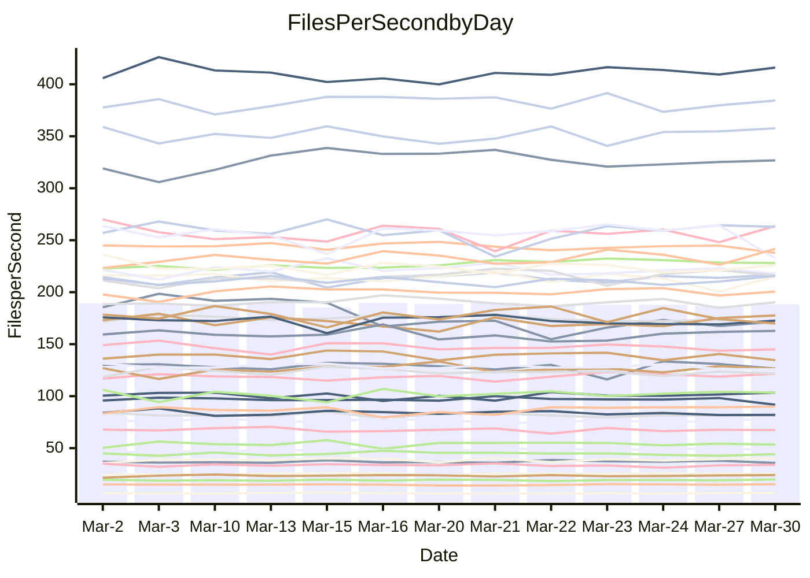

<!---
# This file is auto-generated. Do not edit.
# cspell:disable
--->
# Performance Report

Daily Performance

```mermaid
xychart-beta
    title Files Per Second by Day
    y-axis Files per Second
    x-axis Date [Mar-2, Mar-3, Mar-10, Mar-13, Mar-15, Mar-16, Mar-20, Mar-21, Mar-22, Mar-23, Mar-24, Mar-27, Mar-30]
    bar [189.15, 187.99, 188.38, 189.98, 185.21, 189.57, 188.63, 189.87, 187.45, 187.93, 187.93, 186.35, 188.30]
    line [130.27, 130.71, 127.81, 125.76, 132.01, 131.14, 128.67, 125.67, 130.11, 116.06, 133.46, 130.91, 126.44]
    line [15.09, 15.05, 14.93, 14.92, 15.23, 14.84, 14.06, 13.99, 14.45, 15.39, 15.15, 14.76, 15.30]
    line [84.29, 81.35, 81.66, 80.93, 85.41, 78.19, 83.51, 83.81, 81.43, 79.47, 81.70, 81.36, 81.35]
    line [19.63, 18.78, 19.22, 18.67, 19.78, 18.71, 19.79, 19.47, 18.35, 19.30, 19.37, 19.08, 19.88]
    line [136.06, 139.99, 140.01, 135.63, 143.93, 142.95, 134.36, 139.82, 141.15, 141.79, 134.53, 140.55, 134.62]
    line [214.66, 206.78, 214.22, 219.20, 204.44, 213.42, 215.32, 218.95, 211.96, 209.30, 215.41, 213.73, 216.98]
    line [116.93, 121.24, 118.95, 118.40, 114.99, 118.14, 119.47, 113.95, 118.70, 123.16, 121.00, 118.77, 121.60]
    line [100.48, 103.18, 103.33, 98.05, 102.55, 95.32, 100.34, 95.68, 103.94, 100.49, 100.37, 101.61, 103.43]
    line [216.40, 215.81, 217.40, 210.64, 213.63, 210.38, 215.44, 220.20, 209.66, 217.73, 213.19, 200.65, 215.04]
    line [77.40, 74.68, 79.36, 75.39, 75.58, 78.40, 76.58, 74.92, 73.83, 77.77, 74.02, 77.10, 77.41]
    line [185.47, 198.42, 191.68, 193.62, 189.84, 166.89, 171.60, 172.56, 154.71, 166.00, 173.35, 167.42, 171.49]
    line [244.96, 243.99, 244.22, 247.23, 240.74, 246.80, 248.37, 243.77, 240.29, 242.61, 244.28, 244.79, 237.77]
    line [171.61, 178.31, 176.56, 173.19, 174.63, 177.66, 175.92, 178.79, 174.01, 172.30, 172.16, 173.35, 170.18]
    line [222.82, 225.14, 221.56, 225.82, 223.33, 223.62, 225.78, 230.86, 229.00, 232.44, 230.81, 228.49, 228.09]
    line [173.05, 179.29, 168.17, 175.84, 172.23, 167.20, 162.09, 175.73, 167.53, 169.26, 167.37, 175.14, 177.59]
    line [377.66, 385.69, 370.91, 378.91, 387.90, 387.80, 386.06, 387.41, 376.59, 391.51, 373.44, 379.72, 384.27]
    line [270.01, 257.62, 250.97, 253.10, 248.68, 263.99, 260.91, 239.46, 259.16, 256.10, 260.18, 248.06, 263.68]
    line [83.89, 88.30, 81.02, 82.11, 85.90, 84.63, 82.99, 84.87, 85.57, 82.40, 83.84, 81.84, 82.00]
    line [24.45, 24.76, 24.74, 25.60, 26.18, 25.98, 23.83, 25.61, 25.64, 25.22, 25.67, 25.63, 25.15]
    line [221.50, 212.02, 224.11, 219.75, 232.68, 220.52, 223.12, 228.15, 216.79, 218.07, 220.91, 223.03, 217.84]
    line [37.02, 36.08, 36.38, 35.91, 38.37, 36.25, 36.61, 35.87, 38.67, 37.37, 36.99, 37.97, 35.69]
    line [197.81, 190.62, 200.86, 205.50, 202.63, 202.69, 199.56, 199.40, 197.96, 202.91, 203.92, 196.82, 200.56]
    line [211.23, 203.79, 213.30, 213.00, 209.05, 214.75, 216.78, 222.67, 220.47, 206.28, 217.42, 221.24, 216.32]
    line [50.34, 56.33, 53.77, 52.96, 57.64, 49.40, 55.01, 55.07, 55.14, 54.97, 52.69, 54.36, 53.37]
    line [21.50, 23.56, 24.56, 23.16, 23.57, 24.07, 23.83, 22.72, 24.07, 23.01, 23.19, 23.80, 24.02]
    line [257.02, 267.92, 259.39, 256.02, 269.97, 254.79, 259.65, 234.19, 251.38, 263.45, 259.03, 264.42, 262.82]
    line [149.07, 153.47, 146.06, 140.05, 150.95, 150.81, 144.94, 146.39, 146.52, 149.65, 147.78, 143.68, 144.97]
    line [95.82, 98.55, 97.82, 96.22, 96.21, 96.60, 95.61, 100.00, 97.34, 96.90, 96.73, 98.18, 91.72]
    line [6.62, 6.55, 6.32, 6.79, 7.12, 6.59, 6.35, 6.19, 6.26, 6.60, 6.25, 6.74, 6.77]
    line [46.60, 45.68, 47.70, 47.47, 48.64, 47.90, 46.22, 49.72, 49.15, 48.47, 48.92, 49.74, 47.82]
    line [159.28, 163.36, 159.01, 157.48, 159.10, 169.05, 154.54, 158.47, 152.54, 153.40, 160.13, 161.83, 162.72]
    line [83.26, 89.40, 86.73, 86.09, 89.20, 79.46, 84.64, 82.02, 89.37, 88.80, 89.20, 89.35, 90.00]
    line [188.54, 189.19, 186.81, 190.52, 190.26, 197.02, 193.75, 189.15, 186.42, 190.28, 193.49, 184.99, 190.27]
    line [44.95, 42.68, 45.79, 43.00, 44.30, 47.55, 45.42, 45.55, 44.76, 44.94, 43.55, 42.67, 44.21]
    line [126.96, 116.50, 125.61, 123.50, 128.64, 128.22, 133.34, 123.28, 125.66, 126.65, 122.93, 128.82, 126.34]
    line [358.90, 343.06, 352.21, 348.39, 359.59, 349.81, 342.75, 347.71, 359.34, 340.76, 354.09, 354.69, 357.70]
    line [67.78, 66.98, 69.18, 70.51, 65.83, 66.30, 67.73, 68.98, 63.91, 69.35, 66.34, 67.66, 67.35]
    line [175.82, 173.02, 172.27, 176.52, 160.55, 175.49, 175.91, 178.24, 172.29, 170.07, 169.37, 169.09, 172.70]
    line [35.65, 38.90, 38.99, 38.46, 40.13, 39.77, 36.42, 40.38, 36.50, 39.38, 38.08, 39.48, 40.18]
    line [263.63, 252.65, 260.43, 254.55, 236.73, 261.47, 259.22, 254.59, 258.80, 265.17, 259.19, 264.34, 232.73]
    line [319.02, 305.87, 317.67, 331.44, 338.69, 332.97, 333.24, 336.87, 327.34, 320.84, 322.94, 325.27, 326.73]
    line [223.28, 229.19, 235.85, 231.18, 227.46, 239.47, 235.22, 227.41, 228.79, 241.01, 235.98, 226.38, 241.62]
    line [118.58, 127.90, 124.38, 120.45, 128.40, 126.26, 121.85, 123.29, 123.31, 123.57, 119.37, 123.63, 121.70]
    line [106.04, 94.30, 104.19, 100.36, 94.07, 106.95, 99.82, 102.15, 104.63, 100.11, 102.26, 104.28, 103.40]
    line [178.41, 174.58, 186.65, 179.06, 166.05, 180.55, 173.75, 182.92, 186.30, 171.18, 184.68, 174.16, 169.88]
    line [213.20, 207.00, 210.46, 215.67, 209.05, 214.60, 209.59, 204.82, 212.94, 211.50, 207.03, 210.21, 215.65]
    line [34.99, 32.10, 34.36, 33.03, 34.53, 33.80, 33.49, 35.23, 32.80, 33.41, 31.17, 33.44, 33.97]
    line [405.86, 426.09, 413.29, 411.20, 402.18, 405.65, 399.88, 410.92, 409.10, 416.42, 413.72, 409.38, 416.05]
    line [236.51, 222.64, 222.38, 225.56, 216.60, 228.18, 224.68, 217.69, 227.52, 226.28, 219.14, 221.19, 226.02]
    line [131.45, 127.22, 127.60, 130.54, 131.20, 126.76, 126.98, 130.36, 127.52, 127.75, 130.81, 125.94, 125.76]
```

Time to Process Files

| Repository                                      | Elapsed | Min/Avg/Max           |   SD | SD Graph                |
| ----------------------------------------------- | ------: | :-------------------: | ---: | ----------------------- |
| AdaDoom3/AdaDoom3                    |    2.77 | 2.6 /   2.8 /   3.0   | 0.09 | `    ┣━━┻━●╋━━┻━━┫    ` |
| alexiosc/megistos                    |    7.36 | 6.7 /   7.2 /   8.1   | 0.32 | `    ┣━━┻━━╋━●┻━━┫    ` |
| apollographql/apollo-server          |    2.46 | 2.4 /   2.5 /   2.9   | 0.11 | `    ┣━━┻●━╋━━┻━━┫    ` |
| aspnetboilerplate/aspnetboilerplate  |    8.71 | 8.4 /   8.8 /   9.8   | 0.27 | `    ┣━━┻━●╋━━┻━━┫    ` |
| aws-amplify/docs                     |   12.17 | 11.4 /  11.8 /  12.5  | 0.30 | `    ┣━━┻━━╋━━┻●━┫    ` |
| Azure/azure-rest-api-specs           |    9.61 | 8.9 /   9.7 /  11.2   | 0.54 | `   ┣━━━┻━━●━━┻━━━┫   ` |
| bitjson/typescript-starter           |    1.02 | 1.0 /   1.0 /   1.2   | 0.05 | `     ┣━┻━●╋━━┻━┫     ` |
| caddyserver/caddy                    |    3.32 | 3.3 /   3.5 /   4.1   | 0.15 | `    ┣━━●━━╋━━┻━━┫    ` |
| canada-ca/open-source-logiciel-libre |    1.03 | 1.0 /   1.1 /   1.2   | 0.06 | `     ┣━┻●━╋━━┻━┫     ` |
| chef/chef                            |    5.35 | 5.2 /   5.4 /   5.8   | 0.16 | `    ┣━━┻━●╋━━┻━━┫    ` |
| dart-lang/sdk                        |   57.67 | 52.6 /  55.5 /  60.9  | 1.52 | `  ┣━━━┻━━━╋━━━┻━●━┫  ` |
| django/django                        |   13.31 | 13.0 /  13.7 /  16.7  | 0.68 | `   ┣━━━┻●━╋━━┻━━━┫   ` |
| eslint/eslint                        |    9.68 | 9.1 /   9.6 /  10.0   | 0.23 | `    ┣━━┻━━╋●━┻━━┫    ` |
| exonum/exonum                        |    3.41 | 3.2 /   3.4 /   3.8   | 0.11 | `    ┣━━┻━●╋━━┻━━┫    ` |
| flutter/samples                      |   14.09 | 13.7 /  14.8 /  17.3  | 0.82 | `   ┣━━━●━━╋━━┻━━━┫   ` |
| gitbucket/gitbucket                  |    3.21 | 3.1 /   3.3 /   4.3   | 0.24 | `    ┣━━┻━●╋━━┻━━┫    ` |
| googleapis/google-cloud-cpp          |  118.35 | 116.7 / 120.8 / 131.2 | 3.46 | `  ┣━━━┻●━━╋━━━┻━━━┫  ` |
| graphql/express-graphql              |    1.09 | 1.0 /   1.1 /   1.2   | 0.06 | `     ┣━┻━●╋━━┻━┫     ` |
| graphql/graphql-js                   |    2.70 | 2.6 /   2.7 /   2.9   | 0.09 | `    ┣━━┻━━╋●━┻━━┫    ` |
| graphql/graphql-relay-js             |    1.13 | 1.0 /   1.1 /   1.3   | 0.06 | `     ┣━┻━━╋●━┻━┫     ` |
| graphql/graphql-spec                 |    1.23 | 1.2 /   1.3 /   1.6   | 0.08 | `     ┣━┻●━╋━━┻━┫     ` |
| iluwatar/java-design-patterns        |   12.00 | 11.3 /  11.8 /  12.7  | 0.32 | `    ┣━━┻━━╋━●┻━━┫    ` |
| ktaranov/sqlserver-kit               |    6.14 | 5.5 /   5.9 /   6.5   | 0.22 | `    ┣━━┻━━╋━━●━━┫    ` |
| liriliri/licia                       |    3.74 | 3.6 /   3.8 /   4.1   | 0.11 | `    ┣━━┻━●╋━━┻━━┫    ` |
| MartinThoma/LaTeX-examples           |    6.08 | 6.0 /   6.2 /   7.0   | 0.20 | `    ┣━━┻●━╋━━┻━━┫    ` |
| mdx-js/mdx                           |    1.87 | 1.7 /   1.8 /   2.0   | 0.07 | `     ┣━┻━━╋━●┻━┫     ` |
| microsoft/TypeScript-Website         |    5.29 | 4.9 /   5.2 /   5.7   | 0.20 | `    ┣━━┻━━╋━●┻━━┫    ` |
| MicrosoftDocs/PowerShell-Docs        |   22.14 | 19.6 /  20.7 /  26.2  | 1.18 | `   ┣━━┻━━━╋━━━●━━┫   ` |
| neovim/nvim-lspconfig                |    4.91 | 3.8 /   4.6 /   5.6   | 0.51 | `    ┣━━┻━━╋━●┻━━┫    ` |
| pagekit/pagekit                      |    3.44 | 3.3 /   3.5 /   3.8   | 0.13 | `    ┣━━┻━━●━━┻━━┫    ` |
| php/php-src                          |   23.36 | 22.7 /  23.5 /  26.4  | 0.68 | `   ┣━━━┻━●╋━━┻━━━┫   ` |
| plasticrake/tplink-smarthome-api     |    1.30 | 1.1 /   1.3 /   1.5   | 0.07 | `     ┣━┻━━●━━┻━┫     ` |
| prettier/prettier                    |    7.38 | 7.3 /   7.6 /   8.3   | 0.22 | `    ┣━━●━━╋━━┻━━┫    ` |
| pycontribs/jira                      |    1.50 | 1.4 /   1.5 /   1.7   | 0.09 | `     ┣━┻━━╋●━┻━┫     ` |
| RustPython/RustPython                |    6.14 | 6.0 /   6.4 /   7.0   | 0.21 | `    ┣━●┻━━╋━━┻━━┫    ` |
| shoelace-style/shoelace              |    2.74 | 2.5 /   2.8 /   3.2   | 0.13 | `    ┣━━┻━●╋━━┻━━┫    ` |
| slint-ui/slint                       |   13.46 | 12.8 /  13.3 /  14.1  | 0.31 | `    ┣━━┻━━╋●━┻━━┫    ` |
| SoftwareBrothers/admin-bro           |    2.48 | 2.2 /   2.5 /   3.0   | 0.17 | `    ┣━━┻━━●━━┻━━┫    ` |
| sveltejs/svelte                      |   21.03 | 20.0 /  20.9 /  23.3  | 0.76 | `   ┣━━━┻━━●━━┻━━━┫   ` |
| TheAlgorithms/Python                 |    5.58 | 5.2 /   5.5 /   6.6   | 0.26 | `    ┣━━┻━━╋●━┻━━┫    ` |
| twbs/bootstrap                       |    1.81 | 1.7 /   1.7 /   2.0   | 0.07 | `     ┣━┻━━╋━━●━┫     ` |
| typescript-cheatsheets/react         |    1.31 | 1.3 /   1.4 /   1.6   | 0.07 | `     ┣━●━━╋━━┻━┫     ` |
| typescript-eslint/typescript-eslint  |    4.12 | 3.8 /   4.0 /   4.5   | 0.15 | `    ┣━━┻━━╋━●┻━━┫    ` |
| vitest-dev/vitest                    |   10.66 | 10.2 /  11.0 /  12.1  | 0.48 | `   ┣━━━●━━╋━━┻━━━┫   ` |
| w3c/aria-practices                   |    3.12 | 3.1 /   3.3 /   3.7   | 0.15 | `    ┣━━●━━╋━━┻━━┫    ` |
| w3c/specberus                        |    1.89 | 1.8 /   1.9 /   2.2   | 0.10 | `    ┣━━┻━●╋━━┻━━┫    ` |
| webdeveric/webpack-assets-manifest   |    1.31 | 1.1 /   1.2 /   1.4   | 0.08 | `     ┣━┻━━╋━━●━┫     ` |
| webpack/webpack                      |    4.99 | 4.8 /   5.1 /   5.5   | 0.18 | `    ┣━━┻●━╋━━┻━━┫    ` |
| wireapp/wire-desktop                 |    1.39 | 1.2 /   1.3 /   1.6   | 0.08 | `     ┣━┻━━╋━●┻━┫     ` |
| wireapp/wire-webapp                  |   11.14 | 10.6 /  11.2 /  12.6  | 0.36 | `    ┣━━┻━●╋━━┻━━┫    ` |

Note:
- Elapsed time is in seconds.

Files per Second over Time

| Repository                                      | Files |    Sec |    Fps |    Rel | Trend Fps              |    N |
| ----------------------------------------------- | ----: | -----: | -----: | -----: | ---------------------- | ---: |
| AdaDoom3/AdaDoom3                    |   103 |   2.77 |  37.21 |  0.88% | `▅▆▇▄▅██▇▆▇▇▅▇▆██▇▇▄▆` |   33 |
| alexiosc/megistos                    |   583 |   7.36 |  79.18 | -3.06% | `▆█▇▇▇█▅█▆▄▇▆▆▅██▆▆▇▆` |   33 |
| apollographql/apollo-server          |   254 |   2.46 | 103.45 |  2.52% | `▆▇▆▆▅▇█▆▇▇▇▇▆███▃▇▇▇` |   33 |
| aspnetboilerplate/aspnetboilerplate  |  2286 |   8.71 | 262.46 |  1.25% | `▅█▅▇▃▆▅██▆▆▇▇▇▇▇▇█▇▇` |   33 |
| aws-amplify/docs                     |  2931 |  12.17 | 240.89 | -1.42% | `▇▇██▇▄██▄▇▇▆▇▇█▇▅▇▅▆` |   33 |
| Azure/azure-rest-api-specs           |  2489 |   9.61 | 258.91 |  1.26% | `▇█▇▇▅▆███▄█▆█▃█▇▄▇█▇` |   33 |
| bitjson/typescript-starter           |    20 |   1.02 |  19.52 |  1.64% | `▆▆▆█▆▄▆▇▅▆▇▆▇▇▇▆▅▄█▇` |   33 |
| caddyserver/caddy                    |   302 |   3.32 |  90.92 |  4.64% | `▃▇▅▆▅▇▇▇█▇▇█▇█▇▇▇█▇█` |   33 |
| canada-ca/open-source-logiciel-libre |     7 |   1.03 |   6.81 |  4.53% | `▅▅▃▅▄▄▅▅▆▆▆▄▃█▆▄▆▅▆▆` |   33 |
| chef/chef                            |  1201 |   5.35 | 224.60 |  1.44% | `▆▆▇██▅▇▇▆▆▇▆▇█▆▆██▅▇` |   33 |
| dart-lang/sdk                        | 11172 |  57.67 | 193.71 | -3.46% | `█▇▇▆▇▇▆▇█▇█▇▇▇▇▄▇▅█▆` |   33 |
| django/django                        |  2897 |  13.31 | 217.62 |  2.39% | `▇▇█▇█▆█▇██▇▇▇██▅▅▃▇█` |   33 |
| eslint/eslint                        |  2058 |   9.68 | 212.62 | -0.66% | `▅▆▇▆▇▅▇▅▆▅▆▆█▆▇▇▆▅█▆` |   33 |
| exonum/exonum                        |   421 |   3.41 | 123.59 |  0.56% | `▇▅▇▇▇▆▇▆▆█▆▄█▇▇▇▇▆▆▇` |   33 |
| flutter/samples                      |  2494 |  14.09 | 176.97 |  3.74% | `▅▄▄▇▇▇▅█▇▄▅█▅▇▇▇█▇█▇` |   33 |
| gitbucket/gitbucket                  |   415 |   3.21 | 129.29 |  0.90% | `█▆█▇▇▇▇█▂▆██▇█▇███▆▇` |   33 |
| googleapis/google-cloud-cpp          | 20799 | 118.35 | 175.74 |  2.04% | `███▇█▇▆▆▆▇▄▇█▆▅▆▇▆▆█` |   33 |
| graphql/express-graphql              |    26 |   1.09 |  23.89 |  1.16% | `▇█▇▆▆▇▇█▃▇▇▇▅██▇▄█▇▇` |   33 |
| graphql/graphql-js                   |   371 |   2.70 | 137.33 | -1.00% | `█▄▆▇▇█▆▇▇█▅▅▆▇▇▆█▇▅▆` |   33 |
| graphql/graphql-relay-js             |    28 |   1.13 |  24.81 | -1.57% | `▇▅▆▃▆▆▆▆▇▅▅▇▇▇▇▃█▆▆▆` |   33 |
| graphql/graphql-spec                 |    19 |   1.23 |  15.51 |  4.42% | `▆█▆▂▅▅▇▇▇█▇▇▆▄█▇▇▆▇█` |   33 |
| iluwatar/java-design-patterns        |  2060 |  12.00 | 171.64 | -1.56% | `█▇███▆██▆▆█▅▆███▇▄▆▆` |   33 |
| ktaranov/sqlserver-kit               |   490 |   6.14 |  79.86 | -3.84% | `▆▇▆▇▇█▇▆▇▆█▅▇▇▅█▆▆▇▅` |   33 |
| liriliri/licia                       |  1437 |   3.74 | 384.67 |  1.21% | `▇▇▇▇▇▆▇█▇█▅▇▅█▆▅▇▆▇▇` |   33 |
| MartinThoma/LaTeX-examples           |  1409 |   6.08 | 231.61 |  2.30% | `▆▇▇▆█▇██████▇▆▇███▇█` |   33 |
| mdx-js/mdx                           |   140 |   1.87 |  74.78 | -2.75% | `▇▆▅▆▅▆▃▇▇▆▄▅▅▅█▄▄█▇▅` |   33 |
| microsoft/TypeScript-Website         |   756 |   5.29 | 142.99 | -2.36% | `█▆█▅▇█▆▇███▇▇█▆█▅▄▇▆` |   33 |
| MicrosoftDocs/PowerShell-Docs        |  2648 |  22.14 | 119.62 | -6.80% | `▆▅█▇▇▆▇▇▆█▆███▇█▂██▅` |   33 |
| neovim/nvim-lspconfig                |   838 |   4.91 | 170.57 | -3.75% | `▇█▆▇▇▅▃▄█▇▇█▇▇▆▆▆▆▇▇` |   33 |
| pagekit/pagekit                      |   741 |   3.44 | 215.47 |  0.26% | `▆▆█▇██▇▅▇▃▆█▇██▆██▇▇` |   33 |
| php/php-src                          |  2275 |  23.36 |  97.41 |  0.63% | `▆▆█▆█▇▇▆██▇▇▇█▇█▇▇▃▇` |   33 |
| plasticrake/tplink-smarthome-api     |    62 |   1.30 |  47.69 | -0.85% | `▅▄▅▄▆▅▆▅▅▇▅▇▆█▆▄█▅▅▅` |   33 |
| prettier/prettier                    |  2666 |   7.38 | 361.17 |  2.88% | `▆█▆▄▆▇█▆▅▆▆▇█▇██▆▇▇█` |   33 |
| pycontribs/jira                      |    79 |   1.50 |  52.75 | -1.88% | `▅█▇▆▇▇▇▅██▇▅▆██▃▇█▇▆` |   33 |
| RustPython/RustPython                |   764 |   6.14 | 124.47 |  4.51% | `▅▇▅▇▅▆▆▇▇██▆▆█▆▃▆▇▆█` |   33 |
| shoelace-style/shoelace              |   440 |   2.74 | 160.53 |  0.96% | `▇▇▆▄▆▆▄▃▆▇█▆▇█▇▇▇▆▇▇` |   33 |
| slint-ui/slint                       |  2858 |  13.46 | 212.36 |  0.60% | `▇▅▇▆▅▆▇▅▇▇█▄▆▆▆▇▆▇█▇` |   33 |
| SoftwareBrothers/admin-bro           |   441 |   2.48 | 177.66 | -0.51% | `▇▇▆▃▇█▆▄▆▅▇▇▆▄▂█▆▇▄▆` |   33 |
| sveltejs/svelte                      |  8669 |  21.03 | 412.31 |  0.41% | `▆▇▇▄▇█▆▇██▆█▇██▄▇██▇` |   33 |
| TheAlgorithms/Python                 |  1407 |   5.58 | 252.38 | -2.29% | `▇█▆█▇▇▇██▇█▇▆▇████▃▆` |   33 |
| twbs/bootstrap                       |   118 |   1.81 |  65.24 | -3.99% | `▄▅█▇▇▃▆▇█▇▅▆▇▆▇█▄█▇▅` |   33 |
| typescript-cheatsheets/react         |    53 |   1.31 |  40.48 |  5.06% | `█▄▅▆█▇▃▆█▇▆▇▆█▇█▇▅██` |   33 |
| typescript-eslint/typescript-eslint  |  1322 |   4.12 | 320.54 | -1.43% | `▆▆█▇▇▇▆▅█▄▆▆▆▅▆▆▇▆▇▆` |   33 |
| vitest-dev/vitest                    |  2594 |  10.66 | 243.25 |  4.46% | `█▅█▅▅▆▅▅███▅▅▅▃▅█▄▇▇` |   33 |
| w3c/aria-practices                   |   414 |   3.12 | 132.57 |  4.98% | `▆█▇█▆▅▇▆▆▇▇▇▃▇▆▇▇▇▅█` |   33 |
| w3c/specberus                        |   197 |   1.89 | 104.24 |  1.70% | `▇▄▅▇▆▇▆▅▆▅▅▇▆█▃▇▆█▆▆` |   33 |
| webdeveric/webpack-assets-manifest   |    55 |   1.31 |  41.85 | -6.20% | `▇▆▅▆▆▅▆▅▆▅▅▇▂▃▃▄█▄▆▄` |   33 |
| webpack/webpack                      |  1148 |   4.99 | 229.94 |  2.67% | `▇▆▅█▅█▆▆▆█▄▇▅▅▅▇▆▆▆▇` |   33 |
| wireapp/wire-desktop                 |    45 |   1.39 |  32.49 | -3.16% | `▅▆▇▆█▆▆▇▄█▅▂▇▇▇▆▄██▆` |   33 |
| wireapp/wire-webapp                  |  2130 |  11.14 | 191.27 |  0.96% | `██▇▇▆▇▅█▇▅▇▇▇▃▆▆▇▅▆▇` |   33 |

Data Throughput

| Repository                                      | Files |    Sec |     Kps |    Rel | Trend Kps              |    N |
| ----------------------------------------------- | ----: | -----: | ------: | -----: | ---------------------- | ---: |
| AdaDoom3/AdaDoom3                    |   103 |   2.77 |  790.80 |  0.88% | `▅▆▇▄▅██▇▆▇▇▅▇▆██▇▇▄▆` |   33 |
| alexiosc/megistos                    |   583 |   7.36 |  622.16 | -3.06% | `▆█▇▇▇█▅█▆▄▇▆▆▅██▆▆▇▆` |   33 |
| apollographql/apollo-server          |   254 |   2.46 |  853.67 |  2.94% | `▆▇▆▆▅▇█▆▇▇▇▇▆███▃▇▇▇` |   33 |
| aspnetboilerplate/aspnetboilerplate  |  2286 |   8.71 |  638.57 |  1.25% | `▅█▅▇▃▆▅██▆▆▇▇▇▇▇▇█▇▇` |   33 |
| aws-amplify/docs                     |  2931 |  12.17 |  847.01 | -0.88% | `▇▇██▇▄██▄▇▇▆▇▇█▇▅▇▅▆` |   33 |
| Azure/azure-rest-api-specs           |  2489 |   9.61 |  762.49 |  2.68% | `▇█▇▇▅▆███▄█▆█▃█▇▄▇█▇` |   33 |
| bitjson/typescript-starter           |    20 |   1.02 |   78.07 |  1.64% | `▆▆▆█▆▄▆▇▅▆▇▆▇▇▇▆▅▄█▇` |   33 |
| caddyserver/caddy                    |   302 |   3.32 |  808.63 |  4.74% | `▃▇▅▆▅▇▇▇█▇▇█▇█▇▇▇█▇█` |   33 |
| canada-ca/open-source-logiciel-libre |     7 |   1.03 |   56.46 |  4.53% | `▅▅▃▅▄▄▅▅▆▆▆▄▃█▆▄▆▅▆▆` |   33 |
| chef/chef                            |  1201 |   5.35 | 1053.81 |  1.37% | `▆▇▇██▅▇▇▆▆▇▆▇█▆▆██▅▇` |   33 |
| dart-lang/sdk                        | 11172 |  57.67 | 1309.57 | -3.57% | `█▇▇▆▇▇▆▇█▇█▇▇▇▇▄▇▅█▆` |   33 |
| django/django                        |  2897 |  13.31 | 1378.81 |  2.48% | `▇▇█▇█▆▇▇██▇▇▇██▅▅▃▇█` |   33 |
| eslint/eslint                        |  2058 |   9.68 | 1476.66 | -0.66% | `▅▆▇▆▇▅▇▅▆▅▆▆█▆▇▇▆▅█▆` |   33 |
| exonum/exonum                        |   421 |   3.41 | 1182.16 |  0.56% | `▇▅▇▇▇▆▇▆▆█▆▄█▇▇▇▇▆▆▇` |   33 |
| flutter/samples                      |  2494 |  14.09 | 1525.79 |  4.60% | `▅▄▅▇▇▇▅█▇▄▅█▅▇▇▇█▇█▇` |   33 |
| gitbucket/gitbucket                  |   415 |   3.21 |  597.21 |  1.00% | `█▆█▇▇▇▇█▂▆██▇█▇███▆▇` |   33 |
| googleapis/google-cloud-cpp          | 20799 | 118.35 | 1487.12 |  2.07% | `███▇█▇▆▆▆▇▄▇█▆▅▆▇▆▆█` |   33 |
| graphql/express-graphql              |    26 |   1.09 |  109.33 |  1.16% | `▇█▇▆▆▇▇█▃▇▇▇▅██▇▄█▇▇` |   33 |
| graphql/graphql-js                   |   371 |   2.70 |  804.74 | -0.97% | `█▄▆▇▇█▆▇▇█▅▅▆▇▇▆█▇▅▆` |   33 |
| graphql/graphql-relay-js             |    28 |   1.13 |   97.46 | -1.57% | `▇▅▆▃▆▆▆▆▇▅▅▇▇▇▇▃█▆▆▆` |   33 |
| graphql/graphql-spec                 |    19 |   1.23 |  517.50 |  4.42% | `▆█▆▂▅▅▇▇▇█▇▇▆▄█▇▇▆▇█` |   33 |
| iluwatar/java-design-patterns        |  2060 |  12.00 |  528.99 | -1.56% | `█▇███▆██▆▆█▅▆███▇▄▆▆` |   33 |
| ktaranov/sqlserver-kit               |   490 |   6.14 | 1209.79 | -3.76% | `▆▇▆▇▇█▇▆▇▆█▅▇▇▅█▆▆▇▅` |   33 |
| liriliri/licia                       |  1437 |   3.74 |  458.29 |  1.21% | `▇▇▇▇▇▆▇█▇█▅▇▅█▆▅▇▆▇▇` |   33 |
| MartinThoma/LaTeX-examples           |  1409 |   6.08 |  478.34 |  2.30% | `▆▇▇▆█▇██████▇▆▇███▇█` |   33 |
| mdx-js/mdx                           |   140 |   1.87 |  349.86 | -2.47% | `▇▆▅▆▅▆▃▇▇▆▄▅▅▅█▄▄█▇▅` |   33 |
| microsoft/TypeScript-Website         |   756 |   5.29 |  987.33 | -2.48% | `█▆█▅▇█▆▇███▇▇█▆█▅▄▇▆` |   33 |
| MicrosoftDocs/PowerShell-Docs        |  2648 |  22.14 | 1251.67 | -6.76% | `▆▅█▇▇▆▇▇▆█▆███▇█▂██▅` |   33 |
| neovim/nvim-lspconfig                |   838 |   4.91 |  459.60 | 10.10% | `▇█▇██▆▅▆█▇▇███▇▇▇▇█▇` |   33 |
| pagekit/pagekit                      |   741 |   3.44 |  449.26 |  0.26% | `▆▆█▇██▇▅▇▃▆█▇██▆██▇▇` |   33 |
| php/php-src                          |  2275 |  23.36 | 1699.67 |  0.70% | `▆▆█▆█▇▇▆██▇▇▇█▇█▇▇▃▇` |   33 |
| plasticrake/tplink-smarthome-api     |    62 |   1.30 |  257.70 | -0.85% | `▅▄▅▄▆▅▆▅▅▇▅▇▆█▆▄█▅▅▅` |   33 |
| prettier/prettier                    |  2666 |   7.38 |  496.51 |  2.85% | `▆█▆▄▆▇█▆▅▆▆▇█▇██▆▇▇█` |   33 |
| pycontribs/jira                      |    79 |   1.50 |  373.92 | -1.88% | `▅█▇▆▇▇▇▅██▇▅▆██▃▇█▇▆` |   33 |
| RustPython/RustPython                |   764 |   6.14 | 1951.74 |  6.10% | `▅▇▅▆▅▆▆▇▇██▆▆█▆▃▆▇▆█` |   33 |
| shoelace-style/shoelace              |   440 |   2.74 |  774.94 |  1.00% | `▇▇▆▄▆▆▄▃▆▇█▆▇█▇▇▇▆█▇` |   33 |
| slint-ui/slint                       |  2858 |  13.46 | 1324.49 |  0.10% | `█▅▇▆▅▆█▆███▅▆▆▇█▆▇█▇` |   33 |
| SoftwareBrothers/admin-bro           |   441 |   2.48 |  391.58 | -0.51% | `▇▇▆▃▇█▆▄▆▅▇▇▆▄▂█▆▇▄▆` |   33 |
| sveltejs/svelte                      |  8669 |  21.03 |  279.43 |  0.52% | `▆▇▇▄▇█▅▇██▇█▇██▄▇██▇` |   33 |
| TheAlgorithms/Python                 |  1407 |   5.58 |  644.48 | -2.27% | `▇█▆█▇▇▇██▇█▇▆▇████▃▆` |   33 |
| twbs/bootstrap                       |   118 |   1.81 |  535.78 | -3.99% | `▄▅█▇▇▃▆▇█▇▅▆▇▆▇█▄█▇▅` |   33 |
| typescript-cheatsheets/react         |    53 |   1.31 |  300.17 |  5.06% | `█▄▅▆█▇▃▆█▇▆▇▆█▇█▇▅██` |   33 |
| typescript-eslint/typescript-eslint  |  1322 |   4.12 | 1688.04 | -1.77% | `▆▆█▇▇▆▆▅█▄▆▆▆▅▆▆▇▆▇▆` |   33 |
| vitest-dev/vitest                    |  2594 |  10.66 |  741.55 |  4.52% | `█▆█▅▅▆▅▅███▅▅▅▃▅█▄▇▇` |   33 |
| w3c/aria-practices                   |   414 |   3.12 | 1238.30 |  4.98% | `▆█▇█▆▅▇▆▆▇▇▇▃▇▆▇▇▇▅█` |   33 |
| w3c/specberus                        |   197 |   1.89 |  343.42 |  1.07% | `▇▄▅▇▆▇▆▅▆▅▅▇▆█▃▇▆█▆▆` |   33 |
| webdeveric/webpack-assets-manifest   |    55 |   1.31 |   95.88 | -6.76% | `▇▆▅▆▆▅▅▅▆▅▅▇▃▃▃▄█▄▆▄` |   33 |
| webpack/webpack                      |  1148 |   4.99 | 1080.81 |  2.88% | `▇▆▅█▅█▆▆▆█▄▇▅▅▅▇▆▆▆▇` |   33 |
| wireapp/wire-desktop                 |    45 |   1.39 |  142.96 | -4.31% | `▅▆▇▆█▆▆▇▄█▅▂▇▇▇▆▄██▆` |   33 |
| wireapp/wire-webapp                  |  2130 |  11.14 |  757.71 |  1.43% | `██▇▇▆▇▅█▇▅▇▇▇▃▆▆▇▅▆▇` |   33 |

