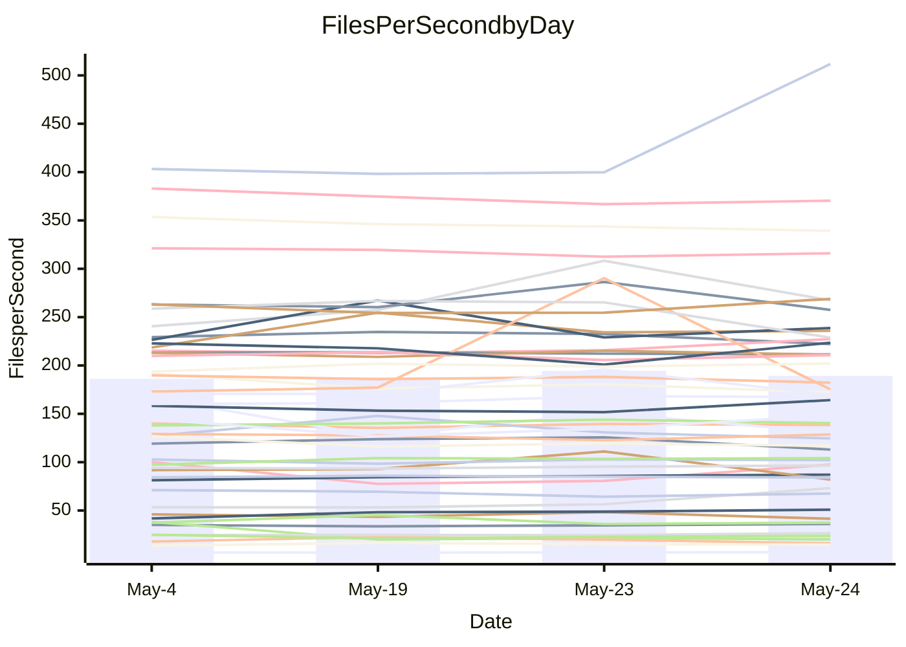

<!---
# This file is auto-generated. Do not edit.
# cspell:disable
--->
# Performance Report

Daily Performance

```mermaid
xychart-beta
    title Files Per Second by Day
    y-axis Files per Second
    x-axis Date [May-4, May-19, May-23, May-24]
    bar [186.25, 187.94, 194.38, 189.26]
    line [35.07, 33.61, 34.69, 36.05]
    line [140.01, 135.42, 139.50, 138.49]
    line [53.38, 53.17, 56.48, 73.13]
    line [38.18, 20.00, 21.53, 20.21]
    line [46.04, 43.44, 48.37, 41.48]
    line [71.11, 69.47, 64.25, 67.56]
    line [100.08, 77.54, 80.59, 97.52]
    line [81.26, 84.52, 85.73, 87.08]
    line [191.37, 176.15, 180.59, 172.23]
    line [166.55, 126.61, 150.87, 130.72]
    line [119.17, 123.77, 125.73, 113.02]
    line [17.95, 22.53, 19.87, 16.02]
    line [24.56, 24.84, 24.48, 26.62]
    line [24.93, 21.05, 22.73, 23.79]
    line [91.75, 92.82, 111.10, 82.04]
    line [102.79, 98.35, 102.96, 102.06]
    line [382.99, 374.77, 366.83, 370.43]
    line [158.32, 153.28, 151.73, 164.19]
    line [13.72, 16.48, 15.39, 14.72]
    line [6.46, 6.48, 6.70, 7.00]
    line [229.32, 234.71, 232.57, 222.14]
    line [189.78, 185.86, 188.16, 182.19]
    line [240.52, 257.39, 308.24, 267.29]
    line [37.38, 45.35, 36.07, 37.44]
    line [218.55, 254.57, 234.26, 235.79]
    line [127.00, 147.92, 130.77, 124.57]
    line [215.39, 212.55, 215.84, 227.30]
    line [226.51, 267.13, 229.05, 238.78]
    line [353.58, 346.15, 343.69, 339.23]
    line [160.29, 160.94, 168.26, 167.30]
    line [213.17, 213.72, 212.23, 211.44]
    line [129.13, 127.71, 122.71, 128.70]
    line [94.12, 93.35, 95.34, 96.59]
    line [138.03, 140.07, 144.01, 140.38]
    line [213.15, 208.87, 215.23, 211.16]
    line [84.38, 85.95, 85.08, 84.06]
    line [321.24, 319.57, 312.48, 316.06]
    line [41.81, 48.29, 48.86, 50.81]
    line [126.81, 116.06, 119.43, 116.94]
    line [144.52, 126.78, 134.48, 148.32]
    line [263.11, 260.36, 286.42, 257.52]
    line [172.93, 177.15, 290.28, 175.29]
    line [258.73, 266.74, 265.26, 228.77]
    line [97.37, 104.19, 103.43, 104.20]
    line [263.28, 254.35, 254.61, 268.91]
    line [403.25, 398.12, 399.78, 511.84]
    line [209.84, 213.89, 205.67, 210.66]
    line [222.86, 217.73, 200.96, 223.50]
    line [193.68, 201.86, 198.76, 202.03]
    line [170.59, 170.67, 195.94, 169.69]
```

Time to Process Files

| Repository                                      | Elapsed | Min/Avg/Max          |    SD | SD Graph                |
| ----------------------------------------------- | ------: | :------------------: | ----: | ----------------------- |
| AdaDoom3/AdaDoom3                    |    2.75 | 2.2 /   2.6 /   2.9  |  0.27 | `    ┣━━┻━━╋━●┻━━┫    ` |
| alexiosc/megistos                    |    6.94 | 6.7 /   6.8 /   7.0  |  0.13 | `    ┣━━┻━━╋━●┻━━┫    ` |
| apollographql/apollo-server          |    2.50 | 2.5 /   2.5 /   2.6  |  0.06 | `     ┣━┻━●╋━━┻━┫     ` |
| aspnetboilerplate/aspnetboilerplate  |    8.50 | 8.7 /   8.9 /   9.2  |  0.17 | `   ●┣━━┻━━╋━━┻━━┫    ` |
| aws-amplify/docs                     |   12.39 | 10.1 /  12.3 /  13.4 |  1.16 | `    ┣━━┻━━●━━┻━━┫    ` |
| Azure/azure-rest-api-specs           |   10.92 | 9.3 /   9.4 /   9.6  |  0.13 | `        ┣┻╋┻┫       ●` |
| bitjson/typescript-starter           |    1.25 | 0.8 /   1.0 /   1.1  |  0.10 | `     ┣━┻━━╋━━┻━┫ ●   ` |
| caddyserver/caddy                    |    3.82 | 2.7 /   3.2 /   3.4  |  0.29 | `    ┣━━┻━━╋━━┻━━●    ` |
| canada-ca/open-source-logiciel-libre |    1.00 | 1.0 /   1.1 /   1.1  |  0.05 | `     ┣━●━━╋━━┻━┫     ` |
| chef/chef                            |    4.89 | 4.7 /   4.9 /   4.9  |  0.09 | `     ┣━┻━━╋●━┻━┫     ` |
| dart-lang/sdk                        |   56.41 | 55.7 /  57.3 /  58.7 |  1.08 | `   ┣━━━●━━╋━━┻━━━┫   ` |
| django/django                        |   13.82 | 13.4 /  13.9 /  14.2 |  0.28 | `    ┣━━┻━●╋━━┻━━┫    ` |
| eslint/eslint                        |    9.80 | 9.5 /   9.7 /   9.9  |  0.13 | `    ┣━━┻━━╋━●┻━━┫    ` |
| exonum/exonum                        |    3.72 | 3.3 /   3.4 /   3.5  |  0.08 | `     ┣━┻━━╋━━┻━┫    ●` |
| flutter/samples                      |   11.43 | 11.7 /  12.7 /  13.6 |  0.64 | `    ●━━┻━━╋━━┻━━┫    ` |
| gitbucket/gitbucket                  |    3.19 | 2.5 /   2.9 /   3.4  |  0.40 | `    ┣━━┻━━╋━●┻━━┫    ` |
| googleapis/google-cloud-cpp          |  123.32 | 95.0 / 117.0 / 123.3 | 10.98 | `  ┣━━━┻━━━╋━●━┻━━━┫  ` |
| graphql/express-graphql              |    1.09 | 1.0 /   1.2 /   1.3  |  0.08 | `     ┣━┻●━╋━━┻━┫     ` |
| graphql/graphql-js                   |    2.68 | 2.6 /   2.7 /   2.9  |  0.08 | `     ┣━┻━━●━━┻━┫     ` |
| graphql/graphql-relay-js             |    1.05 | 1.1 /   1.1 /   1.2  |  0.02 | ` ●   ┣━━┻━╋━┻━━┫     ` |
| graphql/graphql-spec                 |    1.29 | 1.0 /   1.2 /   1.4  |  0.13 | `     ┣━┻━━╋●━┻━┫     ` |
| iluwatar/java-design-patterns        |   11.76 | 7.1 /  10.6 /  11.9  |  2.01 | `   ┣━━━┻━━╋━●┻━━━┫   ` |
| ktaranov/sqlserver-kit               |    5.63 | 5.7 /   5.8 /   6.0  |  0.13 | `    ┣━●┻━━╋━━┻━━┫    ` |
| liriliri/licia                       |    3.88 | 3.7 /   3.9 /   4.1  |  0.14 | `    ┣━━┻━━●━━┻━━┫    ` |
| MartinThoma/LaTeX-examples           |    6.34 | 5.9 /   6.1 /   6.1  |  0.10 | `    ┣━━┻━━╋━━┻━━┫ ●  ` |
| mdx-js/mdx                           |    1.44 | 1.4 /   1.7 /   1.9  |  0.17 | `     ┣●┻━━╋━━┻━┫     ` |
| microsoft/TypeScript-Website         |    5.45 | 5.2 /   5.4 /   5.6  |  0.13 | `    ┣━━┻━━╋●━┻━━┫    ` |
| MicrosoftDocs/PowerShell-Docs        |   24.29 | 24.0 /  24.8 /  25.7 |  0.65 | `   ┣━━━●━━╋━━┻━━━┫   ` |
| neovim/nvim-lspconfig                |    5.12 | 5.1 /   5.2 /   5.4  |  0.12 | `    ┣━━●━━╋━━┻━━┫    ` |
| pagekit/pagekit                      |    3.26 | 3.4 /   3.5 /   3.6  |  0.07 | `   ● ┣━┻━━╋━━┻━┫     ` |
| php/php-src                          |   23.71 | 23.6 /  24.3 /  25.6 |  0.71 | `   ┣━━━●━━╋━━┻━━━┫   ` |
| plasticrake/tplink-smarthome-api     |    1.22 | 1.3 /   1.3 /   1.5  |  0.08 | `     ┣━●━━╋━━┻━┫     ` |
| prettier/prettier                    |    7.88 | 7.6 /   7.7 /   7.9  |  0.12 | `    ┣━━┻━━╋━━┻●━┫    ` |
| pycontribs/jira                      |    1.09 | 1.4 /   1.5 /   1.6  |  0.07 | `●     ┣━┻━╋━┻━┫      ` |
| RustPython/RustPython                |    6.66 | 6.2 /   6.5 /   6.7  |  0.21 | `    ┣━━┻━━╋━●┻━━┫    ` |
| shoelace-style/shoelace              |    2.68 | 2.8 /   2.9 /   3.0  |  0.11 | `     ●━┻━━╋━━┻━┫     ` |
| slint-ui/slint                       |   13.42 | 11.3 /  13.1 /  13.8 |  0.93 | `    ┣━━┻━━╋●━┻━━┫    ` |
| SoftwareBrothers/admin-bro           |    2.56 | 2.3 /   2.4 /   2.6  |  0.10 | `     ┣━┻━━╋━━●━┫     ` |
| sveltejs/svelte                      |   17.16 | 21.6 /  22.0 /  22.5 |  0.37 | `●       ┣┻╋┻┫        ` |
| TheAlgorithms/Python                 |    5.46 | 4.3 /   5.2 /   5.7  |  0.47 | `    ┣━━┻━━╋●━┻━━┫    ` |
| twbs/bootstrap                       |    1.75 | 1.7 /   1.7 /   1.9  |  0.10 | `     ┣━┻━━●━━┻━┫     ` |
| typescript-cheatsheets/react         |    1.19 | 1.1 /   1.2 /   1.4  |  0.11 | `     ┣━┻━━●━━┻━┫     ` |
| typescript-eslint/typescript-eslint  |    4.18 | 3.9 /   4.2 /   4.6  |  0.24 | `    ┣━━┻━━●━━┻━━┫    ` |
| vitest-dev/vitest                    |   10.05 | 7.7 /   9.9 /  11.1  |  1.18 | `    ┣━━┻━━●━━┻━━┫    ` |
| w3c/aria-practices                   |    3.32 | 2.5 /   3.1 /   3.3  |  0.29 | `    ┣━━┻━━╋━━●━━┫    ` |
| w3c/specberus                        |    1.88 | 1.8 /   1.9 /   2.0  |  0.09 | `     ┣━┻━●╋━━┻━┫     ` |
| webdeveric/webpack-assets-manifest   |    1.33 | 1.1 /   1.2 /   1.4  |  0.09 | `     ┣━┻━━╋━━┻●┫     ` |
| webpack/webpack                      |    5.23 | 5.2 /   5.4 /   5.8  |  0.23 | `    ┣━━●━━╋━━┻━━┫    ` |
| wireapp/wire-desktop                 |    1.25 | 1.3 /   1.3 /   1.4  |  0.06 | `     ┣━●━━╋━━┻━┫     ` |
| wireapp/wire-webapp                  |   12.27 | 11.7 /  11.9 /  12.2 |  0.15 | `    ┣━━┻━━╋━━┻━━┫●   ` |

Note:
- Elapsed time is in seconds.

Files per Second over Time

| Repository                                      | Files |    Sec |    Fps |     Rel | Trend Fps |    N |
| ----------------------------------------------- | ----: | -----: | -----: | ------: | --------- | ---: |
| AdaDoom3/AdaDoom3                    |   103 |   2.75 |  37.44 |  -6.49% | `▃▇█▃▂▃`  |    5 |
| alexiosc/megistos                    |   583 |   6.94 |  84.06 |  -1.45% | `▆█▇█▅▆`  |    5 |
| apollographql/apollo-server          |   255 |   2.50 | 102.06 |   0.96% | `█▆▅█▇▇`  |    5 |
| aspnetboilerplate/aspnetboilerplate  |  2286 |   8.50 | 268.91 |   4.95% | `▇▅▆▅▆█`  |    5 |
| aws-amplify/docs                     |  2959 |  12.39 | 238.78 |  -2.05% | `▃▄█▄▂▄`  |    5 |
| Azure/azure-rest-api-specs           |  2497 |  10.92 | 228.77 | -13.53% | `▆█▇▇█ `  |    5 |
| bitjson/typescript-starter           |    20 |   1.25 |  16.02 | -22.05% | `▂█▄▄▄ `  |    5 |
| caddyserver/caddy                    |   313 |   3.82 |  82.04 | -17.89% | `▂▃▃▅█ `  |    5 |
| canada-ca/open-source-logiciel-libre |     7 |   1.00 |   7.00 |   6.54% | `▅▄▇█▅█`  |    5 |
| chef/chef                            |  1032 |   4.89 | 211.16 |  -0.52% | `▇▆▆█▆▆`  |    5 |
| dart-lang/sdk                        | 11396 |  56.41 | 202.03 |   1.53% | `▅▇█▇▆▇`  |    5 |
| django/django                        |  2912 |  13.82 | 210.66 |   0.41% | `▆█▇▅▆▇`  |    5 |
| eslint/eslint                        |  2072 |   9.80 | 211.44 |  -0.74% | `▇█▆▇▇▆`  |    5 |
| exonum/exonum                        |   421 |   3.72 | 113.02 |  -8.58% | `▅▆███▃`  |    5 |
| flutter/samples                      |  1695 |  11.43 | 148.32 |  11.18% | `▇▄▃▆▅█`  |    5 |
| gitbucket/gitbucket                  |   417 |   3.19 | 130.72 |  -9.41% | `█▃▂█▃▃`  |    5 |
| googleapis/google-cloud-cpp          | 20926 | 123.32 | 169.69 |  -6.13% | `▃▂▃█▃▂`  |    5 |
| graphql/express-graphql              |    26 |   1.09 |  23.79 |   5.73% | `█▅▃▅▆▇`  |    5 |
| graphql/graphql-js                   |   371 |   2.68 | 138.49 |   0.38% | `██▅▇█▇`  |    5 |
| graphql/graphql-relay-js             |    28 |   1.05 |  26.62 |   8.03% | `▅▅▆▄▆█`  |    5 |
| graphql/graphql-spec                 |    19 |   1.29 |  14.72 |  -5.00% | `▂▃█▅▄▃`  |    5 |
| iluwatar/java-design-patterns        |  2061 |  11.76 | 175.29 | -14.23% | `▁▂▂█▂`   |    4 |
| ktaranov/sqlserver-kit               |   490 |   5.63 |  87.08 |   3.23% | `▅▇▆▇▇█`  |    5 |
| liriliri/licia                       |  1438 |   3.88 | 370.43 |  -0.75% | `█▆█▄█▇`  |    5 |
| MartinThoma/LaTeX-examples           |  1409 |   6.34 | 222.14 |  -4.57% | `▆▆█▆▇▄`  |    5 |
| mdx-js/mdx                           |   140 |   1.44 |  97.52 |  17.11% | `█▂▄▃▄█`  |    5 |
| microsoft/TypeScript-Website         |   765 |   5.45 | 140.38 |  -0.61% | `▅▇▅▇█▆`  |    5 |
| MicrosoftDocs/PowerShell-Docs        |  3126 |  24.29 | 128.70 |   2.15% | `█▆█▅▆█`  |    5 |
| neovim/nvim-lspconfig                |   857 |   5.12 | 167.30 |   2.18% | `▆▅▆███`  |    5 |
| pagekit/pagekit                      |   741 |   3.26 | 227.30 |   6.00% | `▆▄▆▅▇█`  |    5 |
| php/php-src                          |  2290 |  23.71 |  96.59 |   2.43% | `▇▅██▇█`  |    5 |
| plasticrake/tplink-smarthome-api     |    62 |   1.22 |  50.81 |   7.59% | `▃▆▇▇▇█`  |    5 |
| prettier/prettier                    |  2674 |   7.88 | 339.23 |  -2.14% | `█▇▇▆█▆`  |    5 |
| pycontribs/jira                      |    80 |   1.09 |  73.13 |  34.08% | `▃▂▃▄▄█`  |    5 |
| RustPython/RustPython                |   779 |   6.66 | 116.94 |  -2.19% | `█▄▅▇▅▅`  |    5 |
| shoelace-style/shoelace              |   440 |   2.68 | 164.19 |   6.85% | `▇▇▄▄▇█`  |    5 |
| slint-ui/slint                       |  3164 |  13.42 | 235.79 |  -1.44% | `▂█▃▄▄▄`  |    5 |
| SoftwareBrothers/admin-bro           |   441 |   2.56 | 172.23 |  -4.83% | `█▆▄▇▅▄`  |    5 |
| sveltejs/svelte                      |  8784 |  17.16 | 511.84 |  28.02% | `▃▃▂▃▃█`  |    5 |
| TheAlgorithms/Python                 |  1407 |   5.46 | 257.52 |  -5.09% | `▃▄▃▂█▃`  |    5 |
| twbs/bootstrap                       |   118 |   1.75 |  67.56 |  -0.22% | `██▇▃▆▆`  |    5 |
| typescript-cheatsheets/react         |    24 |   1.19 |  20.21 | -16.65% | `█▂▁▂▂▂`  |    5 |
| typescript-eslint/typescript-eslint  |  1322 |   4.18 | 316.06 |  -0.32% | `▇▅█▃█▆`  |    5 |
| vitest-dev/vitest                    |  2685 |  10.05 | 267.29 |  -2.58% | `▂▃▃▃█▃`  |    5 |
| w3c/aria-practices                   |   414 |   3.32 | 124.57 |  -8.99% | `▂▃█▃▃▂`  |    5 |
| w3c/specberus                        |   196 |   1.88 | 104.20 |   1.64% | `▄█▅▅█▇`  |    5 |
| webdeveric/webpack-assets-manifest   |    55 |   1.33 |  41.48 |  -9.69% | `▆▇▃▇█▄`  |    5 |
| webpack/webpack                      |  1169 |   5.23 | 223.50 |   4.04% | `█▇▇▄█`   |    4 |
| wireapp/wire-desktop                 |    45 |   1.25 |  36.05 |   4.98% | `▇█▄▆██`  |    5 |
| wireapp/wire-webapp                  |  2236 |  12.27 | 182.19 |  -2.87% | `██▆▇█▆`  |    5 |

Data Throughput

| Repository                                      | Files |    Sec |     Kps |     Rel | Trend Kps |    N |
| ----------------------------------------------- | ----: | -----: | ------: | ------: | --------- | ---: |
| AdaDoom3/AdaDoom3                    |   103 |   2.75 |  795.79 |  -6.49% | `▃▇█▃▂▃`  |    5 |
| alexiosc/megistos                    |   583 |   6.94 |  660.48 |  -1.45% | `▆█▇█▅▆`  |    5 |
| apollographql/apollo-server          |   255 |   2.50 |  843.27 |   0.97% | `█▆▅█▇▇`  |    5 |
| aspnetboilerplate/aspnetboilerplate  |  2286 |   8.50 |  654.29 |   4.95% | `▇▅▆▅▆█`  |    5 |
| aws-amplify/docs                     |  2959 |  12.39 |  863.46 |  -2.02% | `▃▄█▄▂▄`  |    5 |
| Azure/azure-rest-api-specs           |  2497 |  10.92 |  684.92 | -13.48% | `▆█▇▇█ `  |    5 |
| bitjson/typescript-starter           |    20 |   1.25 |   64.07 | -22.05% | `▂█▄▄▄ `  |    5 |
| caddyserver/caddy                    |   313 |   3.82 |  733.40 | -17.91% | `▂▃▃▅█ `  |    5 |
| canada-ca/open-source-logiciel-libre |     7 |   1.00 |   57.96 |   6.54% | `▅▄▇█▅█`  |    5 |
| chef/chef                            |  1032 |   4.89 | 1033.89 |  -0.47% | `▆▆▆█▆▆`  |    5 |
| dart-lang/sdk                        | 11396 |  56.41 | 1380.95 |   1.55% | `▅▇█▇▆▇`  |    5 |
| django/django                        |  2912 |  13.82 | 1350.94 |   0.55% | `▆█▇▅▆▇`  |    5 |
| eslint/eslint                        |  2072 |   9.80 | 1470.87 |  -0.74% | `▇█▆▇▇▆`  |    5 |
| exonum/exonum                        |   421 |   3.72 | 1081.10 |  -8.58% | `▅▆███▃`  |    5 |
| flutter/samples                      |  1695 |  11.43 |  887.73 |  11.18% | `▇▄▃▆▅█`  |    5 |
| gitbucket/gitbucket                  |   417 |   3.19 |  623.20 |  -8.84% | `▇▃▂█▃▃`  |    5 |
| googleapis/google-cloud-cpp          | 20926 | 123.32 | 1448.23 |  -6.13% | `▃▂▃█▃▂`  |    5 |
| graphql/express-graphql              |    26 |   1.09 |  108.87 |   5.73% | `█▅▃▅▆▇`  |    5 |
| graphql/graphql-js                   |   371 |   2.68 |  820.49 |   0.38% | `██▅▇█▇`  |    5 |
| graphql/graphql-relay-js             |    28 |   1.05 |  104.58 |   8.03% | `▅▅▆▄▆█`  |    5 |
| graphql/graphql-spec                 |    19 |   1.29 |  491.08 |  -5.00% | `▂▃█▅▄▃`  |    5 |
| iluwatar/java-design-patterns        |  2061 |  11.76 |  540.32 | -14.23% | `▁▂▂█▂`   |    4 |
| ktaranov/sqlserver-kit               |   490 |   5.63 | 1319.18 |   3.23% | `▅▇▆▇▇█`  |    5 |
| liriliri/licia                       |  1438 |   3.88 |  442.05 |  -0.72% | `█▆█▄█▇`  |    5 |
| MartinThoma/LaTeX-examples           |  1409 |   6.34 |  458.78 |  -4.57% | `▆▆█▆▇▄`  |    5 |
| mdx-js/mdx                           |   140 |   1.44 |  456.23 |  17.07% | `█▂▄▃▄█`  |    5 |
| microsoft/TypeScript-Website         |   765 |   5.45 |  966.85 |  -0.61% | `▅▇▅▇█▆`  |    5 |
| MicrosoftDocs/PowerShell-Docs        |  3126 |  24.29 | 1371.38 |   2.12% | `█▆█▅▆█`  |    5 |
| neovim/nvim-lspconfig                |   857 |   5.12 |  490.40 |   2.27% | `▅▅▆███`  |    5 |
| pagekit/pagekit                      |   741 |   3.26 |  473.94 |   6.00% | `▆▄▆▅▇█`  |    5 |
| php/php-src                          |  2290 |  23.71 | 1698.76 |   2.44% | `▇▅██▇█`  |    5 |
| plasticrake/tplink-smarthome-api     |    62 |   1.22 |  274.52 |   7.59% | `▃▆▇▇▇█`  |    5 |
| prettier/prettier                    |  2674 |   7.88 |  465.83 |  -2.14% | `█▇▇▆█▆`  |    5 |
| pycontribs/jira                      |    80 |   1.09 |  516.45 |  34.08% | `▃▂▃▄▄█`  |    5 |
| RustPython/RustPython                |   779 |   6.66 | 1991.82 |  -0.86% | `▇▅▆█▆▆`  |    5 |
| shoelace-style/shoelace              |   440 |   2.68 |  792.95 |   6.86% | `▇▇▄▄▇█`  |    5 |
| slint-ui/slint                       |  3164 |  13.42 | 1231.58 |  -4.82% | `▆█▃▃▄▄`  |    5 |
| SoftwareBrothers/admin-bro           |   441 |   2.56 |  379.62 |  -4.83% | `█▆▄▇▅▄`  |    5 |
| sveltejs/svelte                      |  8784 |  17.16 |  347.29 |  28.02% | `▃▃▂▃▃█`  |    5 |
| TheAlgorithms/Python                 |  1407 |   5.46 |  657.61 |  -5.09% | `▃▄▃▂█▃`  |    5 |
| twbs/bootstrap                       |   118 |   1.75 |  554.82 |  -0.22% | `██▇▃▆▆`  |    5 |
| typescript-cheatsheets/react         |    24 |   1.19 |  181.88 | -11.76% | `█▃▂▃▃▂`  |    5 |
| typescript-eslint/typescript-eslint  |  1322 |   4.18 | 1710.83 |  -0.30% | `▇▅█▃█▆`  |    5 |
| vitest-dev/vitest                    |  2685 |  10.05 |  691.37 |  -6.21% | `▅▂▂▃█▃`  |    5 |
| w3c/aria-practices                   |   414 |   3.32 | 1163.89 |  -8.99% | `▂▃█▃▃▂`  |    5 |
| w3c/specberus                        |   196 |   1.88 |  339.72 |   1.56% | `▄█▅▅█▇`  |    5 |
| webdeveric/webpack-assets-manifest   |    55 |   1.33 |   95.04 |  -9.69% | `▆▇▃▇█▄`  |    5 |
| webpack/webpack                      |  1169 |   5.23 | 1124.77 |   4.91% | `▇▇▇▄█`   |    4 |
| wireapp/wire-desktop                 |    45 |   1.25 |  158.61 |   4.98% | `▇█▄▆██`  |    5 |
| wireapp/wire-webapp                  |  2236 |  12.27 |  761.18 |  -2.59% | `██▆██▆`  |    5 |

