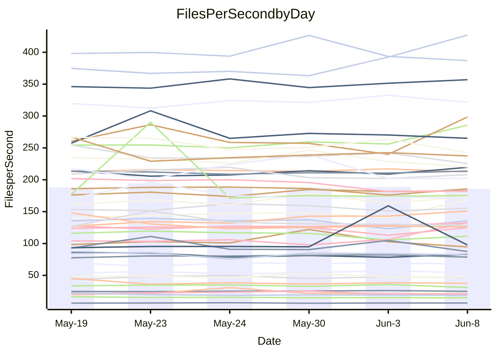

<!---
# This file is auto-generated. Do not edit.
# cspell:disable
--->
# Performance Report

Daily Performance

```mermaid
xychart-beta
    title Files Per Second by Day
    y-axis Files per Second
    x-axis Date [May-19, May-23, May-24, May-30, Jun-3, Jun-8]
    bar [187.94, 194.38, 187.53, 187.84, 188.70, 185.94]
    line [24.84, 24.48, 25.27, 25.51, 26.21, 24.98]
    line [20.00, 21.53, 30.85, 21.86, 21.33, 21.39]
    line [43.44, 48.37, 49.79, 45.03, 47.69, 46.53]
    line [16.48, 15.39, 15.58, 14.86, 15.18, 14.82]
    line [98.35, 102.96, 100.96, 122.12, 102.88, 94.63]
    line [374.77, 366.83, 370.08, 363.31, 392.45, 426.97]
    line [123.77, 125.73, 125.94, 125.35, 112.95, 124.98]
    line [85.95, 85.08, 78.77, 81.14, 78.40, 82.91]
    line [140.07, 144.01, 147.15, 148.03, 140.54, 168.50]
    line [69.47, 64.25, 69.53, 68.78, 69.37, 68.04]
    line [77.54, 80.59, 80.29, 81.53, 82.29, 78.66]
    line [212.55, 215.84, 214.38, 213.29, 217.13, 212.41]
    line [153.28, 151.73, 162.52, 159.30, 150.77, 155.35]
    line [254.35, 254.61, 250.00, 259.58, 256.09, 285.68]
    line [260.36, 286.42, 258.60, 257.18, 239.81, 298.54]
    line [135.42, 139.50, 135.65, 137.15, 123.09, 135.75]
    line [21.05, 22.73, 23.64, 25.47, 20.39, 20.42]
    line [213.89, 205.67, 207.63, 214.21, 208.82, 219.49]
    line [160.94, 168.26, 160.60, 178.51, 162.97, 173.49]
    line [319.57, 312.48, 324.31, 321.30, 332.58, 321.33]
    line [213.72, 212.23, 208.69, 211.05, 210.52, 213.61]
    line [45.35, 36.07, 38.42, 36.32, 38.54, 37.53]
    line [254.57, 234.26, 233.79, 236.78, 241.94, 225.54]
    line [33.61, 34.69, 34.94, 32.78, 35.79, 30.94]
    line [185.86, 188.16, 188.58, 186.13, 176.02, 185.66]
    line [22.53, 19.87, 18.72, 19.42, 19.15, 18.57]
    line [127.71, 122.71, 127.15, 126.61, 128.67, 132.07]
    line [257.39, 308.24, 265.00, 272.73, 270.27, 265.09]
    line [48.29, 48.86, 46.46, 52.80, 47.62, 47.34]
    line [53.17, 56.48, 52.20, 54.24, 57.32, 54.17]
    line [6.48, 6.70, 7.10, 6.34, 6.74, 6.63]
    line [147.92, 130.77, 123.22, 125.33, 127.25, 126.20]
    line [208.87, 215.23, 219.43, 203.27, 201.99, 207.99]
    line [116.06, 119.43, 116.84, 115.92, 105.51, 111.49]
    line [176.15, 180.59, 173.73, 184.72, 181.71, 182.64]
    line [84.52, 85.73, 75.59, 84.88, 83.99, 82.22]
    line [104.19, 103.43, 105.92, 97.87, 106.45, 133.15]
    line [346.15, 343.69, 358.26, 344.65, 351.41, 356.96]
    line [234.71, 232.57, 226.13, 246.49, 228.60, 220.30]
    line [217.73, 200.96, 223.84, 239.63, 201.75, 202.36]
    line [92.82, 111.10, 90.94, 90.56, 104.84, 87.37]
    line [126.78, 134.48, 131.99, 142.83, 143.00, 151.04]
    line [126.61, 150.87, 133.44, 130.84, 130.22, 128.36]
    line [177.15, 290.28, 171.42, 175.26, 173.98, 175.35]
    line [267.13, 229.05, 234.58, 238.79, 242.50, 237.35]
    line [398.12, 399.78, 393.93, 426.44, 393.52, 386.97]
    line [201.86, 198.76, 200.08, 195.61, 181.39, 182.13]
    line [93.35, 95.34, 95.32, 94.79, 159.13, 97.78]
    line [266.74, 265.26, 247.18, 250.86, 263.73, 242.46]
    line [170.67, 195.94, 175.36, 171.10, 172.66, 171.37]
```

Time to Process Files

| Repository                                      | Elapsed | Min/Avg/Max          |   SD | SD Graph                |
| ----------------------------------------------- | ------: | :------------------: | ---: | ----------------------- |
| AdaDoom3/AdaDoom3                    |    2.70 | 2.2 /   2.7 /   2.9  | 0.21 | `    ┣━━┻━━●━━┻━━┫    ` |
| alexiosc/megistos                    |    6.84 | 6.7 /   7.1 /   7.9  | 0.35 | `    ┣━━●━━╋━━┻━━┫    ` |
| apollographql/apollo-server          |    2.58 | 1.4 /   2.4 /   2.8  | 0.32 | `    ┣━━┻━━╋●━┻━━┫    ` |
| aspnetboilerplate/aspnetboilerplate  |    7.31 | 8.7 /   8.9 /   9.3  | 0.17 | `●       ┣┻╋┻┫        ` |
| aws-amplify/docs                     |   12.56 | 10.1 /  12.3 /  13.4 | 0.74 | `    ┣━━┻━━╋●━┻━━┫    ` |
| Azure/azure-rest-api-specs           |    9.94 | 9.1 /   9.8 /  10.8  | 0.58 | `    ┣━━┻━━╋●━┻━━┫    ` |
| bitjson/typescript-starter           |    1.04 | 0.8 /   1.0 /   1.1  | 0.08 | `     ┣━┻━━╋●━┻━┫     ` |
| caddyserver/caddy                    |    3.60 | 2.7 /   3.3 /   3.7  | 0.28 | `    ┣━━┻━━╋━━●━━┫    ` |
| canada-ca/open-source-logiciel-libre |    1.07 | 0.9 /   1.1 /   1.2  | 0.07 | `     ┣━┻━━●━━┻━┫     ` |
| chef/chef                            |    5.12 | 4.6 /   4.9 /   5.3  | 0.20 | `    ┣━━┻━━╋━━●━━┫    ` |
| dart-lang/sdk                        |   70.00 | 55.5 /  57.8 /  62.8 | 1.88 | `       ┣┻━╋━┻┫      ●` |
| django/django                        |   13.41 | 13.1 /  13.8 /  14.2 | 0.34 | `    ┣━━●━━╋━━┻━━┫    ` |
| eslint/eslint                        |    9.84 | 9.5 /   9.8 /  10.3  | 0.21 | `    ┣━━┻━━╋●━┻━━┫    ` |
| exonum/exonum                        |    3.33 | 3.3 /   3.4 /   3.7  | 0.11 | `    ┣━━┻●━╋━━┻━━┫    ` |
| flutter/samples                      |   11.34 | 11.1 /  12.4 /  13.6 | 0.78 | `    ┣━●┻━━╋━━┻━━┫    ` |
| gitbucket/gitbucket                  |    3.27 | 2.5 /   3.1 /   3.4  | 0.23 | `    ┣━━┻━━╋━●┻━━┫    ` |
| googleapis/google-cloud-cpp          |  119.98 | 95.0 / 119.6 / 125.2 | 7.67 | `  ┣━━━┻━━━●━━━┻━━━┫  ` |
| graphql/express-graphql              |    1.28 | 0.9 /   1.1 /   1.3  | 0.11 | `     ┣━┻━━╋━━●━┫     ` |
| graphql/graphql-js                   |    2.83 | 2.6 /   2.7 /   3.0  | 0.13 | `    ┣━━┻━━╋━●┻━━┫    ` |
| graphql/graphql-relay-js             |    1.14 | 1.1 /   1.1 /   1.2  | 0.04 | `     ┣━┻━━╋━●┻━┫     ` |
| graphql/graphql-spec                 |    1.30 | 1.0 /   1.2 /   1.4  | 0.08 | `     ┣━┻━━╋━●┻━┫     ` |
| iluwatar/java-design-patterns        |   11.91 | 7.1 /  11.4 /  12.1  | 1.36 | `   ┣━━━┻━━╋●━┻━━━┫   ` |
| ktaranov/sqlserver-kit               |    5.99 | 5.5 /   5.9 /   7.5  | 0.51 | `    ┣━━┻━━●━━┻━━┫    ` |
| liriliri/licia                       |    3.90 | 3.0 /   3.8 /   4.1  | 0.29 | `    ┣━━┻━━╋●━┻━━┫    ` |
| MartinThoma/LaTeX-examples           |    6.40 | 4.7 /   6.0 /   6.5  | 0.43 | `    ┣━━┻━━╋━━●━━┫    ` |
| mdx-js/mdx                           |    1.79 | 1.7 /   1.7 /   1.9  | 0.06 | `     ┣━┻━━╋━●┻━┫     ` |
| microsoft/TypeScript-Website         |    4.07 | 5.0 /   5.3 /   5.6  | 0.18 | `●      ┣┻━╋━┻┫       ` |
| MicrosoftDocs/PowerShell-Docs        |   24.40 | 23.0 /  24.6 /  25.8 | 0.82 | `   ┣━━━┻━●╋━━┻━━━┫   ` |
| neovim/nvim-lspconfig                |    4.98 | 4.0 /   5.1 /   5.6  | 0.38 | `    ┣━━┻━●╋━━┻━━┫    ` |
| pagekit/pagekit                      |    3.58 | 3.3 /   3.5 /   3.6  | 0.08 | `     ┣━┻━━╋━━┻●┫     ` |
| php/php-src                          |   23.25 | 14.4 /  23.3 /  25.6 | 2.75 | `   ┣━━┻━━━●━━━┻━━┫   ` |
| plasticrake/tplink-smarthome-api     |    1.27 | 1.0 /   1.3 /   1.4  | 0.09 | `     ┣━┻━━●━━┻━┫     ` |
| prettier/prettier                    |    7.29 | 7.4 /   7.7 /   8.3  | 0.24 | `    ┣●━┻━━╋━━┻━━┫    ` |
| pycontribs/jira                      |    1.39 | 1.4 /   1.5 /   1.6  | 0.08 | `     ┣━●━━╋━━┻━┫     ` |
| RustPython/RustPython                |    6.83 | 6.4 /   6.8 /   7.4  | 0.27 | `    ┣━━┻━━╋●━┻━━┫    ` |
| shoelace-style/shoelace              |    2.92 | 2.7 /   2.8 /   3.0  | 0.10 | `     ┣━┻━━╋━━●━┫     ` |
| slint-ui/slint                       |   13.79 | 11.3 /  13.3 /  14.3 | 0.70 | `    ┣━━┻━━╋━●┻━━┫    ` |
| SoftwareBrothers/admin-bro           |    2.41 | 2.3 /   2.4 /   2.6  | 0.10 | `     ┣━┻━●╋━━┻━┫     ` |
| sveltejs/svelte                      |   23.20 | 17.1 /  21.7 /  22.8 | 1.45 | `   ┣━━━┻━━╋━━●━━━┫   ` |
| TheAlgorithms/Python                 |    5.55 | 4.1 /   5.3 /   5.9  | 0.51 | `    ┣━━┻━━╋●━┻━━┫    ` |
| twbs/bootstrap                       |    1.81 | 1.7 /   1.7 /   1.9  | 0.07 | `     ┣━┻━━╋━━●━┫     ` |
| typescript-cheatsheets/react         |    1.12 | 0.7 /   1.1 /   1.3  | 0.14 | `     ┣━┻━━╋●━┻━┫     ` |
| typescript-eslint/typescript-eslint  |    4.12 | 3.9 /   4.1 /   4.6  | 0.18 | `    ┣━━┻━━●━━┻━━┫    ` |
| vitest-dev/vitest                    |   10.14 | 7.7 /   9.9 /  10.5  | 0.70 | `    ┣━━┻━━╋●━┻━━┫    ` |
| w3c/aria-practices                   |    3.24 | 2.5 /   3.2 /   3.4  | 0.24 | `    ┣━━┻━━●━━┻━━┫    ` |
| w3c/specberus                        |    2.01 | 1.2 /   1.9 /   2.2  | 0.24 | `    ┣━━┻━━╋━●┻━━┫    ` |
| webdeveric/webpack-assets-manifest   |    1.17 | 1.0 /   1.2 /   1.4  | 0.08 | `     ┣━┻━●╋━━┻━┫     ` |
| webpack/webpack                      |    5.62 | 4.2 /   5.3 /   5.9  | 0.46 | `    ┣━━┻━━╋━●┻━━┫    ` |
| wireapp/wire-desktop                 |    1.57 | 1.3 /   1.3 /   1.5  | 0.08 | `     ┣━┻━━╋━━┻━┫  ●  ` |
| wireapp/wire-webapp                  |   11.77 | 11.8 /  12.1 /  12.7 | 0.24 | `    ┣━━●━━╋━━┻━━┫    ` |

Note:
- Elapsed time is in seconds.

Files per Second over Time

| Repository                                      | Files |    Sec |    Fps |     Rel | Trend Fps       |    N |
| ----------------------------------------------- | ----: | -----: | -----: | ------: | --------------- | ---: |
| AdaDoom3/AdaDoom3                    |   103 |   2.70 |  38.13 |  -0.61% | `▇█▃▃▅▃▃▂▃▃▄▃▄` |   12 |
| alexiosc/megistos                    |   583 |   6.84 |  85.28 |   4.09% | `█▇█▆▇▃▆▇▄▆▅▆▇` |   12 |
| apollographql/apollo-server          |   255 |   2.58 |  98.68 |  -7.95% | `▂▂▂▂▂▂▂█▂▂▂▁▂` |   12 |
| aspnetboilerplate/aspnetboilerplate  |  2286 |   7.31 | 312.56 |  22.13% | `▃▄▃▃▃▃▃▄▄▄▃▄█` |   12 |
| aws-amplify/docs                     |  2959 |  12.56 | 235.50 |  -2.50% | `▄█▄▂▄▃▄▄▃▄▄▄▃` |   12 |
| Azure/azure-rest-api-specs           |  2497 |   9.94 | 251.29 |  -1.43% | `▇▇▇█▃▇▃█▆▅▇▃▅` |   12 |
| bitjson/typescript-starter           |    20 |   1.04 |  19.23 |  -2.59% | `█▄▄▄▄▂▄▃▄▃▃▂▃` |   12 |
| caddyserver/caddy                    |   313 |   3.60 |  86.97 |  -8.82% | `▄▄▆█▃▃▃▄▂▃▆▃▃` |   12 |
| canada-ca/open-source-logiciel-libre |     7 |   1.07 |   6.53 |  -1.23% | `▃▆▆▄█▅▂▅▃▆▅▅▅` |   12 |
| chef/chef                            |  1032 |   5.12 | 201.72 |  -3.81% | `▆▆█▆▇█▅▄▄▇▅▇▅` |   12 |
| dart-lang/sdk                        | 11396 |  70.00 | 162.81 | -17.45% | `▇█▇▆▆█▇▆▆▇▄▇ ` |   12 |
| django/django                        |  2912 |  13.41 | 217.12 |   2.50% | `▇▆▅▅▅▅▆▆▇█▅█▇` |   12 |
| eslint/eslint                        |  2072 |   9.84 | 210.68 |  -0.49% | `█▆▇▇▇▆█▇▅▇▇█▇` |   12 |
| exonum/exonum                        |   421 |   3.33 | 126.27 |   1.76% | `▆▇▇▇█▇▇█▇▇▄▇▇` |   12 |
| flutter/samples                      |  1695 |  11.34 | 149.41 |   8.44% | `▄▃▅▄▄▄█▆▇▄▆██` |   12 |
| gitbucket/gitbucket                  |   417 |   3.27 | 127.49 |  -4.66% | `▃▂█▃▄▃▃▃▃▄▃▃▃` |   12 |
| googleapis/google-cloud-cpp          | 20926 | 119.98 | 174.41 |  -0.78% | `▃▃█▃▃▃▂▃▃▃▃▂▃` |   12 |
| graphql/express-graphql              |    26 |   1.28 |  20.37 | -11.93% | `▃▂▃▄▄▄▄█▄▅▂▂▂` |   12 |
| graphql/graphql-js                   |   371 |   2.83 | 131.25 |  -3.55% | `█▅▇██▅▅███▄█▆` |   12 |
| graphql/graphql-relay-js             |    28 |   1.14 |  24.49 |  -2.98% | `▅▆▄▆▄█▅▇▇▆█▇▅` |   12 |
| graphql/graphql-spec                 |    19 |   1.30 |  14.60 |  -5.03% | `▃█▄▄▄▄▃▂▄▄▄▄▃` |   12 |
| iluwatar/java-design-patterns        |  2061 |  11.91 | 173.06 |  -6.69% | `▂▂█▁▂▂▂▂▂▂▂▂`  |   11 |
| ktaranov/sqlserver-kit               |   490 |   5.99 |  81.83 |  -1.58% | `▇▇▇▇▂▇▅███▇▆▆` |   12 |
| liriliri/licia                       |  1438 |   3.90 | 368.68 |  -2.86% | `▃▄▂▄▃▃▃▂▃▄▄█▃` |   12 |
| MartinThoma/LaTeX-examples           |  1409 |   6.40 | 220.23 |  -6.34% | `▃▄▃▃▃▂█▃▃▃▃▂▂` |   12 |
| mdx-js/mdx                           |   140 |   1.79 |  78.23 |  -2.66% | `▄█▆█▇▇█▇█▇█▆▆` |   12 |
| microsoft/TypeScript-Website         |   765 |   4.07 | 187.83 |  29.22% | `▃▂▃▃▂▄▃▃▃▄▃▄█` |   12 |
| MicrosoftDocs/PowerShell-Docs        |  3126 |  24.40 | 128.10 |   0.71% | `▅▇▄▅▆▅▄▆▇▅▆█▆` |   12 |
| neovim/nvim-lspconfig                |   857 |   4.98 | 172.17 |   1.70% | `▃▃▃▃▂▃▃█▄▃▃▄▄` |   12 |
| pagekit/pagekit                      |   741 |   3.58 | 206.89 |  -3.54% | `▅▇▆█▆▆▅▅█▆▇▇▅` |   12 |
| php/php-src                          |  2290 |  23.25 |  98.49 |  -1.79% | `▁▂▂▂▂▂▂▂▂▂█▂▂` |   12 |
| plasticrake/tplink-smarthome-api     |    62 |   1.27 |  48.94 |  -0.76% | `▄▄▄▄▄▂█▅▅▄▄▃▄` |   12 |
| prettier/prettier                    |  2674 |   7.29 | 367.00 |   5.53% | `▆▆▅▆▇▇█▅▇▄▇▆█` |   12 |
| pycontribs/jira                      |    80 |   1.39 |  57.43 |   6.20% | `▄▇▇▇▅▅▇▅█▃█▄█` |   12 |
| RustPython/RustPython                |   779 |   6.83 | 114.10 |  -0.98% | `▆▆█▆▆▇▆▆▅█▃▄▆` |   12 |
| shoelace-style/shoelace              |   440 |   2.92 | 150.48 |  -4.11% | `▇▄▄▇██▇██▇▅▇▅` |   12 |
| slint-ui/slint                       |  3164 |  13.79 | 229.51 |  -3.56% | `█▃▃▄▄▄▃▄▄▅▅▃▃` |   12 |
| SoftwareBrothers/admin-bro           |   441 |   2.41 | 182.72 |   1.32% | `▆▄▇▅▅▅▇█▇▄▆▆▆` |   12 |
| sveltejs/svelte                      |  8784 |  23.20 | 378.67 |  -6.85% | `▃▂▃▃▃▂▃█▃▂▃▃▂` |   12 |
| TheAlgorithms/Python                 |  1407 |   5.55 | 253.49 |  -5.61% | `▄▃▂▇▃▄▃▃▃▃▂█▃` |   12 |
| twbs/bootstrap                       |   118 |   1.81 |  65.11 |  -4.95% | `█▇▃▇█▇▇█▇▆▇█▅` |   12 |
| typescript-cheatsheets/react         |    24 |   1.12 |  21.46 |  -6.30% | `▂▁▂▂█▄▃▂▂▂▂▂▂` |   12 |
| typescript-eslint/typescript-eslint  |  1322 |   4.12 | 320.53 |  -0.16% | `▅█▃█▇▇▆▇▇▅█▇▆` |   12 |
| vitest-dev/vitest                    |  2685 |  10.14 | 264.73 |  -3.38% | `▂▂▃█▃▃▃▄▃▃▃▃▃` |   12 |
| w3c/aria-practices                   |   414 |   3.24 | 127.69 |  -1.60% | `▃█▃▃▂▃▃▂▃▂▃▃▃` |   12 |
| w3c/specberus                        |   196 |   2.01 |  97.64 |  -9.43% | `▃▂▂▃▃▃▃▂▁▂▃█▂` |   12 |
| webdeveric/webpack-assets-manifest   |    55 |   1.17 |  47.02 |   1.29% | `▅▂▅▆█▅▅▄▄▄▅▅▅` |   12 |
| webpack/webpack                      |  1169 |   5.62 | 208.03 |  -6.26% | `▃▄▂▄▄▄█▄▄▂▂▃`  |   11 |
| wireapp/wire-desktop                 |    45 |   1.57 |  28.68 | -15.34% | `█▅▆██▇█▆▇▃█▆▂` |   12 |
| wireapp/wire-webapp                  |  2236 |  11.77 | 189.91 |   2.33% | `█▇███▇▇▇▇▇▅▆█` |   12 |

Data Throughput

| Repository                                      | Files |    Sec |     Kps |     Rel | Trend Kps       |    N |
| ----------------------------------------------- | ----: | -----: | ------: | ------: | --------------- | ---: |
| AdaDoom3/AdaDoom3                    |   103 |   2.70 |  810.42 |  -0.61% | `▇█▃▃▅▃▃▂▃▃▄▃▄` |   12 |
| alexiosc/megistos                    |   583 |   6.84 |  670.08 |   4.09% | `█▇█▆▇▃▆▇▄▆▅▆▇` |   12 |
| apollographql/apollo-server          |   255 |   2.58 |  815.39 |  -7.95% | `▂▂▂▂▂▂▂█▂▂▂▁▂` |   12 |
| aspnetboilerplate/aspnetboilerplate  |  2286 |   7.31 |  760.47 |  22.13% | `▃▄▃▃▃▃▃▄▄▄▃▄█` |   12 |
| aws-amplify/docs                     |  2959 |  12.56 |  851.60 |  -2.50% | `▄█▄▂▄▃▄▄▃▄▄▄▃` |   12 |
| Azure/azure-rest-api-specs           |  2497 |   9.94 |  752.36 |  -1.43% | `▇▇▇█▃▇▃█▆▅▇▃▅` |   12 |
| bitjson/typescript-starter           |    20 |   1.04 |   76.94 |  -2.59% | `█▄▄▄▄▂▄▃▄▃▃▂▃` |   12 |
| caddyserver/caddy                    |   313 |   3.60 |  777.49 |  -8.82% | `▄▄▆█▃▃▃▄▂▃▆▃▃` |   12 |
| canada-ca/open-source-logiciel-libre |     7 |   1.07 |   54.13 |  -1.23% | `▃▆▆▄█▅▂▅▃▆▅▅▅` |   12 |
| chef/chef                            |  1032 |   5.12 |  987.66 |  -3.81% | `▆▆█▆▇█▅▄▄▇▅▇▅` |   12 |
| dart-lang/sdk                        | 11396 |  70.00 | 1112.82 | -17.45% | `▇█▇▆▆█▇▆▆▇▄▇ ` |   12 |
| django/django                        |  2912 |  13.41 | 1392.32 |   2.50% | `▇▆▅▅▅▅▆▆▇█▅█▇` |   12 |
| eslint/eslint                        |  2072 |   9.84 | 1465.58 |  -0.49% | `█▆▇▇▇▆█▇▅▇▇█▇` |   12 |
| exonum/exonum                        |   421 |   3.33 | 1207.78 |   1.76% | `▆▇▇▇█▇▇█▇▇▄▇▇` |   12 |
| flutter/samples                      |  1695 |  11.34 |  894.28 |   8.44% | `▄▃▅▄▄▄█▆▇▄▆██` |   12 |
| gitbucket/gitbucket                  |   417 |   3.27 |  607.81 |  -4.66% | `▃▂█▃▄▃▃▃▃▄▃▃▃` |   12 |
| googleapis/google-cloud-cpp          | 20926 | 119.98 | 1488.55 |  -0.78% | `▃▃█▃▃▃▂▃▃▃▃▂▃` |   12 |
| graphql/express-graphql              |    26 |   1.28 |   93.23 | -11.93% | `▃▂▃▄▄▄▄█▄▅▂▂▂` |   12 |
| graphql/graphql-js                   |   371 |   2.83 |  777.60 |  -3.55% | `█▅▇██▅▅███▄█▆` |   12 |
| graphql/graphql-relay-js             |    28 |   1.14 |   96.22 |  -2.98% | `▅▆▄▆▄█▅▇▇▆█▇▅` |   12 |
| graphql/graphql-spec                 |    19 |   1.30 |  487.31 |  -5.03% | `▃█▄▄▄▄▃▂▄▄▄▄▃` |   12 |
| iluwatar/java-design-patterns        |  2061 |  11.91 |  533.46 |  -6.69% | `▂▂█▁▂▂▂▂▂▂▂▂`  |   11 |
| ktaranov/sqlserver-kit               |   490 |   5.99 | 1239.69 |  -1.58% | `▇▇▇▇▂▇▅███▇▆▆` |   12 |
| liriliri/licia                       |  1438 |   3.90 |  439.95 |  -2.86% | `▃▄▂▄▃▃▃▂▃▄▄█▃` |   12 |
| MartinThoma/LaTeX-examples           |  1409 |   6.40 |  454.83 |  -6.34% | `▃▄▃▃▃▂█▃▃▃▃▂▂` |   12 |
| mdx-js/mdx                           |   140 |   1.79 |  365.99 |  -2.66% | `▄█▆█▇▇█▇█▇█▆▆` |   12 |
| microsoft/TypeScript-Website         |   765 |   4.07 | 1293.70 |  29.22% | `▃▂▃▃▂▄▃▃▃▄▃▄█` |   12 |
| MicrosoftDocs/PowerShell-Docs        |  3126 |  24.40 | 1364.97 |   0.71% | `▅▇▄▅▆▅▄▆▇▅▆█▆` |   12 |
| neovim/nvim-lspconfig                |   857 |   4.98 |  504.65 |   1.70% | `▃▃▃▃▂▃▃█▄▃▃▄▄` |   12 |
| pagekit/pagekit                      |   741 |   3.58 |  431.37 |  -3.54% | `▅▇▆█▆▆▅▅█▆▇▇▅` |   12 |
| php/php-src                          |  2290 |  23.25 | 1732.19 |  -1.79% | `▁▂▂▂▂▂▂▂▂▂█▂▂` |   12 |
| plasticrake/tplink-smarthome-api     |    62 |   1.27 |  264.44 |  -0.76% | `▄▄▄▄▄▂█▅▅▄▄▃▄` |   12 |
| prettier/prettier                    |  2674 |   7.29 |  503.97 |   5.53% | `▆▆▅▆▇▇█▅▇▄▇▆█` |   12 |
| pycontribs/jira                      |    80 |   1.39 |  405.61 |   6.20% | `▄▇▇▇▅▅▇▅█▃█▄█` |   12 |
| RustPython/RustPython                |   779 |   6.83 | 1943.43 |  -0.98% | `▆▆█▆▆▇▆▆▅█▃▄▆` |   12 |
| shoelace-style/shoelace              |   440 |   2.92 |  726.75 |  -4.11% | `▇▄▄▇██▇██▇▅▇▅` |   12 |
| slint-ui/slint                       |  3164 |  13.79 | 1198.77 |  -3.56% | `█▃▃▄▄▄▃▄▄▅▅▃▃` |   12 |
| SoftwareBrothers/admin-bro           |   441 |   2.41 |  402.72 |   1.32% | `▆▄▇▅▅▅▇█▇▄▆▆▆` |   12 |
| sveltejs/svelte                      |  8784 |  23.20 |  256.93 |  -6.85% | `▃▂▃▃▃▂▃█▃▂▃▃▂` |   12 |
| TheAlgorithms/Python                 |  1407 |   5.55 |  647.33 |  -5.61% | `▄▃▂▇▃▄▃▃▃▃▂█▃` |   12 |
| twbs/bootstrap                       |   118 |   1.81 |  534.65 |  -4.95% | `█▇▃▇█▇▇█▇▆▇█▅` |   12 |
| typescript-cheatsheets/react         |    24 |   1.12 |  193.15 |  -6.30% | `▂▁▂▂█▄▃▂▂▂▂▂▂` |   12 |
| typescript-eslint/typescript-eslint  |  1322 |   4.12 | 1735.04 |  -0.16% | `▅█▃█▇▇▆▇▇▅█▇▆` |   12 |
| vitest-dev/vitest                    |  2685 |  10.14 |  684.74 |  -3.38% | `▂▂▃█▃▃▃▄▃▃▃▃▃` |   12 |
| w3c/aria-practices                   |   414 |   3.24 | 1192.98 |  -1.60% | `▃█▃▃▂▃▃▂▃▂▃▃▃` |   12 |
| w3c/specberus                        |   196 |   2.01 |  318.33 |  -9.43% | `▃▂▂▃▃▃▃▂▁▂▃█▂` |   12 |
| webdeveric/webpack-assets-manifest   |    55 |   1.17 |  107.72 |   1.29% | `▅▂▅▆█▅▅▄▄▄▅▅▅` |   12 |
| webpack/webpack                      |  1169 |   5.62 | 1046.92 |  -6.26% | `▃▄▂▄▄▄█▄▄▂▂▃`  |   11 |
| wireapp/wire-desktop                 |    45 |   1.57 |  126.21 | -15.34% | `█▅▆██▇█▆▇▃█▆▂` |   12 |
| wireapp/wire-webapp                  |  2236 |  11.77 |  793.46 |   2.33% | `█▇███▇▇▇▇▇▅▆█` |   12 |

