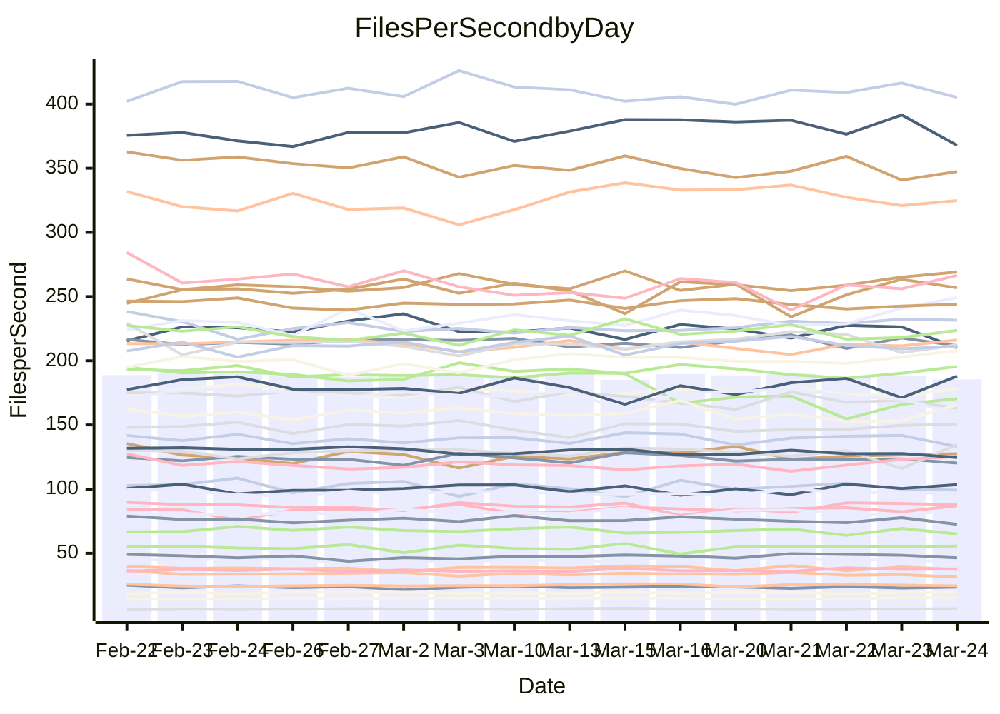

<!---
# This file is auto-generated. Do not edit.
# cspell:disable
--->
# Performance Report

Daily Performance

```mermaid
xychart-beta
    title Files Per Second by Day
    y-axis Files per Second
    x-axis Date [Feb-22, Feb-23, Feb-24, Feb-26, Feb-27, Mar-2, Mar-3, Mar-10, Mar-13, Mar-15, Mar-16, Mar-20, Mar-21, Mar-22, Mar-23, Mar-24]
    bar [188.84, 190.95, 190.14, 188.86, 187.47, 189.15, 187.99, 188.38, 189.98, 185.21, 189.57, 188.63, 189.87, 187.45, 187.93, 185.46]
    line [25.16, 23.04, 24.66, 23.19, 24.07, 21.50, 23.56, 24.56, 23.16, 23.57, 24.07, 23.83, 22.72, 24.07, 23.01, 23.70]
    line [39.75, 38.29, 38.55, 38.02, 38.35, 35.65, 38.90, 38.99, 38.46, 40.13, 39.77, 36.42, 40.38, 36.50, 39.38, 37.42]
    line [5.92, 6.38, 6.30, 6.44, 6.78, 6.62, 6.55, 6.32, 6.79, 7.12, 6.59, 6.35, 6.19, 6.26, 6.60, 6.79]
    line [66.82, 66.94, 70.88, 67.89, 70.56, 67.78, 66.98, 69.18, 70.51, 65.83, 66.30, 67.73, 68.98, 63.91, 69.35, 65.05]
    line [135.57, 126.55, 124.20, 119.96, 129.35, 126.96, 116.50, 125.61, 123.50, 128.64, 128.22, 133.34, 123.28, 125.66, 126.65, 127.56]
    line [102.79, 103.56, 108.60, 97.11, 104.32, 106.04, 94.30, 104.19, 100.36, 94.07, 106.95, 99.82, 102.15, 104.63, 100.11, 99.21]
    line [84.08, 83.91, 75.76, 83.59, 84.08, 83.89, 88.30, 81.02, 82.11, 85.90, 84.63, 82.99, 84.87, 85.57, 82.40, 87.06]
    line [215.58, 226.36, 225.70, 222.46, 230.96, 236.51, 222.64, 222.38, 225.56, 216.60, 228.18, 224.68, 217.69, 227.52, 226.28, 210.09]
    line [18.38, 19.68, 18.34, 19.60, 19.60, 19.63, 18.78, 19.22, 18.67, 19.78, 18.71, 19.79, 19.47, 18.35, 19.30, 19.48]
    line [46.89, 43.13, 47.48, 43.86, 43.58, 44.95, 42.68, 45.79, 43.00, 44.30, 47.55, 45.42, 45.55, 44.76, 44.94, 43.23]
    line [124.67, 122.06, 125.40, 123.31, 123.27, 118.58, 127.90, 124.38, 120.45, 128.40, 126.26, 121.85, 123.29, 123.31, 123.57, 120.28]
    line [331.76, 320.00, 316.72, 330.45, 317.84, 319.02, 305.87, 317.67, 331.44, 338.69, 332.97, 333.24, 336.87, 327.34, 320.84, 324.76]
    line [148.15, 148.90, 152.11, 143.30, 150.41, 149.07, 153.47, 146.06, 140.05, 150.95, 150.81, 144.94, 146.39, 146.52, 149.65, 150.55]
    line [194.82, 190.50, 191.36, 189.34, 184.31, 185.47, 198.42, 191.68, 193.62, 189.84, 166.89, 171.60, 172.56, 154.71, 166.00, 170.54]
    line [244.70, 255.35, 256.03, 252.54, 255.82, 263.63, 252.65, 260.43, 254.55, 236.73, 261.47, 259.22, 254.59, 258.80, 265.17, 269.15]
    line [141.79, 137.76, 142.75, 135.42, 139.26, 136.06, 139.99, 140.01, 135.63, 143.93, 142.95, 134.36, 139.82, 141.15, 141.79, 133.17]
    line [89.64, 87.93, 87.72, 85.68, 85.69, 83.26, 89.40, 86.73, 86.09, 89.20, 79.46, 84.64, 82.02, 89.37, 88.80, 87.93]
    line [375.70, 377.89, 371.33, 366.95, 377.92, 377.66, 385.69, 370.91, 378.91, 387.90, 387.80, 386.06, 387.41, 376.59, 391.51, 367.84]
    line [14.08, 14.28, 13.96, 14.98, 14.69, 15.09, 15.05, 14.93, 14.92, 15.23, 14.84, 14.06, 13.99, 14.45, 15.39, 15.32]
    line [80.37, 81.15, 79.72, 81.93, 80.10, 84.29, 81.35, 81.66, 80.93, 85.41, 78.19, 83.51, 83.81, 81.43, 79.47, 84.14]
    line [49.05, 48.06, 46.41, 47.91, 43.77, 46.60, 45.68, 47.70, 47.47, 48.64, 47.90, 46.22, 49.72, 49.15, 48.47, 46.41]
    line [36.75, 33.50, 33.75, 33.98, 34.43, 34.99, 32.10, 34.36, 33.03, 34.53, 33.80, 33.49, 35.23, 32.80, 33.41, 31.42]
    line [130.26, 129.44, 123.58, 128.31, 129.87, 130.27, 130.71, 127.81, 125.76, 132.01, 131.14, 128.67, 125.67, 130.11, 116.06, 134.73]
    line [55.45, 55.44, 54.09, 53.55, 56.91, 50.34, 56.33, 53.77, 52.96, 57.64, 49.40, 55.01, 55.07, 55.14, 54.97, 55.59]
    line [263.71, 255.40, 259.16, 257.65, 254.22, 257.02, 267.92, 259.39, 256.02, 269.97, 254.79, 259.65, 234.19, 251.38, 263.45, 256.83]
    line [238.32, 230.44, 216.76, 225.02, 229.69, 222.82, 225.14, 221.56, 225.82, 223.33, 223.62, 225.78, 230.86, 229.00, 232.44, 231.53]
    line [127.43, 118.55, 121.57, 118.53, 115.70, 116.93, 121.24, 118.95, 118.40, 114.99, 118.14, 119.47, 113.95, 118.70, 123.16, 125.31]
    line [100.38, 103.85, 96.33, 99.09, 99.19, 100.48, 103.18, 103.33, 98.05, 102.55, 95.32, 100.34, 95.68, 103.94, 100.49, 103.51]
    line [171.99, 177.77, 181.65, 177.93, 171.71, 171.61, 178.31, 176.56, 173.19, 174.63, 177.66, 175.92, 178.79, 174.01, 172.30, 178.48]
    line [223.87, 231.37, 229.84, 219.75, 240.64, 223.28, 229.19, 235.85, 231.18, 227.46, 239.47, 235.22, 227.41, 228.79, 241.01, 249.20]
    line [216.61, 212.54, 214.33, 212.86, 215.99, 216.40, 215.81, 217.40, 210.64, 213.63, 210.38, 215.44, 220.20, 209.66, 217.73, 211.67]
    line [213.31, 213.15, 214.61, 215.98, 216.39, 213.20, 207.00, 210.46, 215.67, 209.05, 214.60, 209.59, 204.82, 212.94, 211.50, 216.14]
    line [175.03, 175.02, 172.48, 176.50, 175.06, 173.05, 179.29, 168.17, 175.84, 172.23, 167.20, 162.09, 175.73, 167.53, 169.26, 163.10]
    line [193.32, 192.22, 196.28, 187.50, 189.10, 188.54, 189.19, 186.81, 190.52, 190.26, 197.02, 193.75, 189.15, 186.42, 190.28, 195.47]
    line [246.48, 246.10, 248.98, 240.98, 239.52, 244.96, 243.99, 244.22, 247.23, 240.74, 246.80, 248.37, 243.77, 240.29, 242.61, 244.02]
    line [402.15, 417.55, 417.69, 405.05, 412.32, 405.86, 426.09, 413.29, 411.20, 402.18, 405.65, 399.88, 410.92, 409.10, 416.42, 405.21]
    line [36.10, 37.37, 36.52, 37.66, 35.60, 37.02, 36.08, 36.38, 35.91, 38.37, 36.25, 36.61, 35.87, 38.67, 37.37, 37.84]
    line [177.56, 185.31, 187.50, 177.93, 177.54, 178.41, 174.58, 186.65, 179.06, 166.05, 180.55, 173.75, 182.92, 186.30, 171.18, 187.97]
    line [162.30, 157.06, 159.96, 153.79, 161.66, 159.28, 163.36, 159.01, 157.48, 159.10, 169.05, 154.54, 158.47, 152.54, 153.40, 165.56]
    line [99.76, 98.90, 95.69, 94.30, 98.50, 95.82, 98.55, 97.82, 96.22, 96.21, 96.60, 95.61, 100.00, 97.34, 96.90, 96.95]
    line [78.95, 76.37, 76.80, 73.75, 75.77, 77.40, 74.68, 79.36, 75.39, 75.58, 78.40, 76.58, 74.92, 73.83, 77.77, 72.58]
    line [25.87, 24.49, 24.03, 24.62, 25.06, 24.45, 24.76, 24.74, 25.60, 26.18, 25.98, 23.83, 25.61, 25.64, 25.22, 24.68]
    line [229.20, 204.56, 214.62, 214.22, 215.21, 211.23, 203.79, 213.30, 213.00, 209.05, 214.75, 216.78, 222.67, 220.47, 206.28, 212.36]
    line [227.37, 223.02, 226.36, 218.81, 215.75, 221.50, 212.02, 224.11, 219.75, 232.68, 220.52, 223.12, 228.15, 216.79, 218.07, 223.68]
    line [362.80, 356.26, 358.85, 353.61, 350.32, 358.90, 343.06, 352.21, 348.39, 359.59, 349.81, 342.75, 347.71, 359.34, 340.76, 347.39]
    line [207.58, 214.51, 202.85, 211.79, 211.44, 214.66, 206.78, 214.22, 219.20, 204.44, 213.42, 215.32, 218.95, 211.96, 209.30, 211.22]
    line [284.25, 260.54, 263.62, 267.57, 257.62, 270.01, 257.62, 250.97, 253.10, 248.68, 263.99, 260.91, 239.46, 259.16, 256.10, 266.48]
    line [131.83, 132.27, 131.01, 131.00, 133.00, 131.45, 127.22, 127.60, 130.54, 131.20, 126.76, 126.98, 130.36, 127.52, 127.75, 124.58]
    line [194.87, 203.28, 199.45, 200.84, 188.59, 197.81, 190.62, 200.86, 205.50, 202.63, 202.69, 199.56, 199.40, 197.96, 202.91, 207.84]
    line [171.39, 176.96, 177.51, 175.27, 171.69, 175.82, 173.02, 172.27, 176.52, 160.55, 175.49, 175.91, 178.24, 172.29, 170.07, 158.58]
```

Time to Process Files

| Repository                                      | Elapsed | Min/Avg/Max           |   SD | SD Graph                |
| ----------------------------------------------- | ------: | :-------------------: | ---: | ----------------------- |
| AdaDoom3/AdaDoom3                    |    2.72 | 2.6 /   2.8 /   3.0   | 0.09 | `    ┣━━┻●━╋━━┻━━┫    ` |
| alexiosc/megistos                    |    6.93 | 6.7 /   7.2 /   8.1   | 0.35 | `    ┣━━┻●━╋━━┻━━┫    ` |
| apollographql/apollo-server          |    2.45 | 2.4 /   2.5 /   2.9   | 0.11 | `    ┣━━┻●━╋━━┻━━┫    ` |
| aspnetboilerplate/aspnetboilerplate  |    8.90 | 8.5 /   8.9 /   9.8   | 0.26 | `    ┣━━┻━━●━━┻━━┫    ` |
| aws-amplify/docs                     |   11.78 | 11.4 /  11.8 /  12.5  | 0.26 | `    ┣━━┻━━●━━┻━━┫    ` |
| Azure/azure-rest-api-specs           |    9.33 | 8.6 /   9.5 /  10.7   | 0.47 | `    ┣━━┻━●╋━━┻━━┫    ` |
| bitjson/typescript-starter           |    1.03 | 0.9 /   1.0 /   1.2   | 0.05 | `     ┣━┻━●╋━━┻━┫     ` |
| caddyserver/caddy                    |    3.43 | 3.2 /   3.5 /   4.1   | 0.16 | `    ┣━━┻━━●━━┻━━┫    ` |
| canada-ca/open-source-logiciel-libre |    1.03 | 1.0 /   1.1 /   1.2   | 0.06 | `     ┣━●━━╋━━┻━┫     ` |
| chef/chef                            |    5.36 | 5.1 /   5.4 /   5.8   | 0.17 | `    ┣━━┻━●╋━━┻━━┫    ` |
| dart-lang/sdk                        |   53.69 | 52.6 /  55.2 /  60.9  | 1.39 | `  ┣━━━●━━━╋━━━┻━━━┫  ` |
| django/django                        |   13.69 | 13.0 /  13.5 /  14.8  | 0.38 | `   ┣━━━┻━━╋●━┻━━━┫   ` |
| eslint/eslint                        |    9.72 | 9.1 /   9.7 /  10.4   | 0.25 | `    ┣━━┻━━╋●━┻━━┫    ` |
| exonum/exonum                        |    3.50 | 3.2 /   3.4 /   3.7   | 0.11 | `    ┣━━┻━━╋━●┻━━┫    ` |
| flutter/samples                      |   15.29 | 14.0 /  14.8 /  17.3  | 0.70 | `   ┣━━━┻━━╋━●┻━━━┫   ` |
| gitbucket/gitbucket                  |    3.08 | 3.0 /   3.3 /   4.3   | 0.23 | `    ┣━━┻●━╋━━┻━━┫    ` |
| googleapis/google-cloud-cpp          |  131.16 | 112.8 / 118.4 / 129.5 | 3.48 | `    ┣━━┻━━╋━━┻━━┫   ●` |
| graphql/express-graphql              |    1.10 | 1.0 /   1.1 /   1.2   | 0.05 | `     ┣━┻━━●━━┻━┫     ` |
| graphql/graphql-js                   |    2.79 | 2.6 /   2.7 /   2.9   | 0.09 | `    ┣━━┻━━╋━━┻●━┫    ` |
| graphql/graphql-relay-js             |    1.13 | 1.0 /   1.1 /   1.3   | 0.07 | `     ┣━┻━━●━━┻━┫     ` |
| graphql/graphql-spec                 |    1.24 | 1.2 /   1.3 /   1.6   | 0.08 | `     ┣━┻●━╋━━┻━┫     ` |
| iluwatar/java-design-patterns        |   11.54 | 10.9 /  11.7 /  12.3  | 0.32 | `    ┣━━┻●━╋━━┻━━┫    ` |
| ktaranov/sqlserver-kit               |    5.63 | 5.5 /   5.9 /   6.6   | 0.25 | `    ┣━━●━━╋━━┻━━┫    ` |
| liriliri/licia                       |    3.91 | 3.6 /   3.8 /   4.1   | 0.12 | `    ┣━━┻━━╋━●┻━━┫    ` |
| MartinThoma/LaTeX-examples           |    6.09 | 5.9 /   6.2 /   7.0   | 0.23 | `    ┣━━┻●━╋━━┻━━┫    ` |
| mdx-js/mdx                           |    1.93 | 1.7 /   1.8 /   2.1   | 0.10 | `    ┣━━┻━━╋━━●━━┫    ` |
| microsoft/TypeScript-Website         |    5.02 | 4.9 /   5.2 /   5.7   | 0.21 | `    ┣━━┻●━╋━━┻━━┫    ` |
| MicrosoftDocs/PowerShell-Docs        |   21.25 | 19.6 /  20.4 /  22.4  | 0.62 | `   ┣━━━┻━━╋━━┻━●━┫   ` |
| neovim/nvim-lspconfig                |    4.91 | 3.8 /   4.3 /   5.6   | 0.48 | `    ┣━━┻━━╋━━┻●━┫    ` |
| pagekit/pagekit                      |    3.49 | 3.2 /   3.5 /   4.7   | 0.23 | `    ┣━━┻━━●━━┻━━┫    ` |
| php/php-src                          |   23.46 | 22.7 /  23.4 /  25.1  | 0.59 | `   ┣━━━┻━━●━━┻━━━┫   ` |
| plasticrake/tplink-smarthome-api     |    1.34 | 1.2 /   1.3 /   1.5   | 0.06 | `     ┣━┻━━╋●━┻━┫     ` |
| prettier/prettier                    |    7.67 | 7.2 /   7.6 /   8.3   | 0.22 | `    ┣━━┻━━╋●━┻━━┫    ` |
| pycontribs/jira                      |    1.42 | 1.4 /   1.5 /   1.7   | 0.08 | `     ┣━┻━●╋━━┻━┫     ` |
| RustPython/RustPython                |    6.10 | 5.9 /   6.4 /   6.9   | 0.22 | `    ┣━●┻━━╋━━┻━━┫    ` |
| shoelace-style/shoelace              |    2.66 | 2.5 /   2.8 /   3.2   | 0.13 | `    ┣━━●━━╋━━┻━━┫    ` |
| slint-ui/slint                       |   12.98 | 12.7 /  13.2 /  13.9  | 0.30 | `    ┣━━┻●━╋━━┻━━┫    ` |
| SoftwareBrothers/admin-bro           |    2.35 | 2.2 /   2.4 /   2.8   | 0.12 | `    ┣━━┻●━╋━━┻━━┫    ` |
| sveltejs/svelte                      |   21.26 | 19.8 /  20.8 /  22.9  | 0.66 | `   ┣━━━┻━━╋━●┻━━━┫   ` |
| TheAlgorithms/Python                 |    5.23 | 5.2 /   5.5 /   5.9   | 0.19 | `    ┣━●┻━━╋━━┻━━┫    ` |
| twbs/bootstrap                       |    1.81 | 1.6 /   1.7 /   2.0   | 0.08 | `     ┣━┻━━╋━━●━┫     ` |
| typescript-cheatsheets/react         |    1.42 | 1.2 /   1.4 /   1.6   | 0.08 | `     ┣━┻━━╋●━┻━┫     ` |
| typescript-eslint/typescript-eslint  |    4.03 | 3.8 /   4.0 /   4.5   | 0.16 | `    ┣━━┻━━●━━┻━━┫    ` |
| vitest-dev/vitest                    |   10.33 | 10.2 /  11.0 /  11.8  | 0.43 | `    ┣●━┻━━╋━━┻━━┫    ` |
| w3c/aria-practices                   |    3.25 | 3.1 /   3.3 /   4.1   | 0.19 | `    ┣━━┻━●╋━━┻━━┫    ` |
| w3c/specberus                        |    1.99 | 1.8 /   1.9 /   2.3   | 0.10 | `    ┣━━┻━━╋━●┻━━┫    ` |
| webdeveric/webpack-assets-manifest   |    1.25 | 1.1 /   1.2 /   1.4   | 0.08 | `     ┣━┻━━╋●━┻━┫     ` |
| webpack/webpack                      |    5.46 | 4.8 /   5.1 /   5.5   | 0.18 | `    ┣━━┻━━╋━━┻━━●    ` |
| wireapp/wire-desktop                 |    1.40 | 1.2 /   1.3 /   1.4   | 0.06 | `     ┣━┻━━╋━━┻●┫     ` |
| wireapp/wire-webapp                  |   10.91 | 10.5 /  11.1 /  12.1  | 0.35 | `    ┣━━┻━●╋━━┻━━┫    ` |

Note:
- Elapsed time is in seconds.

Files per Second over Time

| Repository                                      | Files |    Sec |    Fps |    Rel | Trend Fps              |    N |
| ----------------------------------------------- | ----: | -----: | -----: | -----: | ---------------------- | ---: |
| AdaDoom3/AdaDoom3                    |   103 |   2.72 |  37.84 |  2.61% | `▆▅▅▅▅▆▅█▇▅▆▇▄▅██▇▆▇▇` |   41 |
| alexiosc/megistos                    |   583 |   6.93 |  84.14 |  3.37% | `█▇█▃▆▆▇█▅▆█▇▇▇█▅█▆▄▇` |   41 |
| apollographql/apollo-server          |   254 |   2.45 | 103.51 |  2.60% | `▇███▇▆▆▇▄▇█▇▆▆██▆▇▇█` |   41 |
| aspnetboilerplate/aspnetboilerplate  |  2286 |   8.90 | 256.83 | -0.25% | `█▆▇▇▇▇▆█▇▅█▅▇▄▆▅██▆▆` |   41 |
| aws-amplify/docs                     |  2874 |  11.78 | 244.02 | -0.24% | `█▅▆▇█▇▇▆▇▇▇██▇▄██▄▇▇` |   41 |
| Azure/azure-rest-api-specs           |  2486 |   9.33 | 266.48 |  2.79% | `█▅▄▅▄█▅▅▇▇▇▆▆▄▆▇▇█▃▇` |   41 |
| bitjson/typescript-starter           |    20 |   1.03 |  19.48 |  1.11% | `▄▆▆▇▇▇▃▇▅▆▆▆█▆▄▆▇▅▆▇` |   41 |
| caddyserver/caddy                    |   302 |   3.43 |  87.93 |  1.65% | `██▇▆█▆▇█▇▃▇▆▆▆████▇▇` |   41 |
| canada-ca/open-source-logiciel-libre |     7 |   1.03 |   6.79 |  5.19% | `▄▃▆▅▇▆▇█▇▅▆▄▅▄▄▅▅▇▆▇` |   41 |
| chef/chef                            |  1200 |   5.36 | 223.68 |  0.90% | `▇▇▇█▇▇▄█▇▆▆▇▇▇▅▆▆▅▆▇` |   41 |
| dart-lang/sdk                        | 11160 |  53.69 | 207.84 |  3.68% | `▇▆▇▇██▆▇▇▇▇▆▆▆▆▆▆▇▇█` |   41 |
| django/django                        |  2897 |  13.69 | 211.67 | -1.24% | `█▇▇▇█▄▆▇▆▆▇█▆█▅▇▇▇█▆` |   41 |
| eslint/eslint                        |  2053 |   9.72 | 211.22 | -0.76% | `▆▇▆██▇▆▅▇▅▇▇▇▇▅▇▅▆▆▆` |   41 |
| exonum/exonum                        |   421 |   3.50 | 120.28 | -2.38% | `▇▆▆▇▆▅▆██▆▅▆▇▆▆▇▆▅█▆` |   41 |
| flutter/samples                      |  2494 |  15.29 | 163.10 | -5.14% | `█▃█▇▇██▇▇▅▄▅▇██▅██▄▆` |   41 |
| gitbucket/gitbucket                  |   415 |   3.08 | 134.73 |  5.50% | `██▇▇▆▇▇█▇█▆█▇▇▇▇█▂▆█` |   41 |
| googleapis/google-cloud-cpp          | 20799 | 131.16 | 158.58 | -9.02% | `▆▇▇▆██▇▄▇███▇█▇▆▆▆▇▄` |   41 |
| graphql/express-graphql              |    26 |   1.10 |  23.70 |  0.55% | `██▇█▇▇▄▇█▇█▇▆▆█▇█▃▇▇` |   41 |
| graphql/graphql-js                   |   371 |   2.79 | 133.17 | -4.03% | `▆▇█▆█▅▅███▄▆▇▇█▆▇▇▇▅` |   41 |
| graphql/graphql-relay-js             |    28 |   1.13 |  24.68 | -0.76% | `▇▅██▇█▇█▇█▆▇▃▇▇▇▇█▆▆` |   41 |
| graphql/graphql-spec                 |    19 |   1.24 |  15.32 |  4.49% | `▇▇▆▇█▆▇▇▇▆█▆▂▅▅▇▇▇█▇` |   41 |
| iluwatar/java-design-patterns        |  2060 |  11.54 | 178.48 |  1.43% | `▅█▇▇▆▅▇▇▇▇▆█▇█▅▇█▅▅█` |   41 |
| ktaranov/sqlserver-kit               |   490 |   5.63 |  87.06 |  4.82% | `▆▅█▇█▅▆██▆▇▆▇▇█▇▆▇▆█` |   41 |
| liriliri/licia                       |  1437 |   3.91 | 367.84 | -2.73% | `▆▆▄▇▆▇▆▇▇▇▇▇▇▇▆▇█▇█▅` |   41 |
| MartinThoma/LaTeX-examples           |  1409 |   6.09 | 231.53 |  2.22% | `▆██▆▆▇█▆▇▆▇▇▆▇▇▇████` |   41 |
| mdx-js/mdx                           |   140 |   1.93 |  72.58 | -5.23% | `▇▇█▇▄█▆▆▇▇▇▆▇▆▇▄▇▇▆▅` |   41 |
| microsoft/TypeScript-Website         |   756 |   5.02 | 150.55 |  2.17% | `██▃▇▃▆▅▇▇▇▆▇▅▆▇▆▇▇▇▇` |   41 |
| MicrosoftDocs/PowerShell-Docs        |  2648 |  21.25 | 124.58 | -4.05% | `▇▇▇▅█▆▇▇▇▅▄█▆▇▅▇▆▅▇▅` |   41 |
| neovim/nvim-lspconfig                |   837 |   4.91 | 170.54 | -7.34% | `▇▇█▇▇▆█▇▄▄▅▄▅▅▃▂▃▅▄▄` |   41 |
| pagekit/pagekit                      |   741 |   3.49 | 212.36 |  0.09% | `█▇▇▆▇▇▇▆▇▇▇█▇██▇▆▇▅▇` |   41 |
| php/php-src                          |  2274 |  23.46 |  96.95 | -0.23% | `▇██▇▇▇▆▇▇▆▅█▆█▇▇▅▇█▇` |   41 |
| plasticrake/tplink-smarthome-api     |    62 |   1.34 |  46.41 | -2.40% | `▆▆▆▅▅▆▇▇▆▆▅▆▅▇▆▇▆▅█▅` |   41 |
| prettier/prettier                    |  2666 |   7.67 | 347.39 | -1.37% | `▆▇█▇▆▅██▇▆█▆▄▆▇█▆▅▆▆` |   41 |
| pycontribs/jira                      |    79 |   1.42 |  55.59 |  2.41% | `▇▇▅█▇▅▆█▄▅█▇▆▇▇▇▅██▇` |   41 |
| RustPython/RustPython                |   764 |   6.10 | 125.31 |  5.30% | `█▆▆▅▆▅▇▅▇▅▇▅▇▅▆▆▇▇██` |   41 |
| shoelace-style/shoelace              |   440 |   2.66 | 165.56 |  4.91% | `▆▆▄▇▆▄▆▆█▇▆▅▄▆▆▄▃▆▇▇` |   41 |
| slint-ui/slint                       |  2805 |  12.98 | 216.14 |  1.63% | `▆▆▅████▆▇█▆█▆▅▇█▅███` |   41 |
| SoftwareBrothers/admin-bro           |   441 |   2.35 | 187.97 |  4.03% | `█▆▇▆▅▆▇▄▅▇▇▆▃▆█▅▃▆▅▇` |   41 |
| sveltejs/svelte                      |  8615 |  21.26 | 405.21 | -1.49% | `▅███▅▇█▆▇▆▇▇▄▇█▅▇██▆` |   41 |
| TheAlgorithms/Python                 |  1407 |   5.23 | 269.15 |  4.77% | `▆█▇▆▆▄█▄▇▇█▅█▆▇▆██▇█` |   41 |
| twbs/bootstrap                       |   118 |   1.81 |  65.05 | -4.50% | `██▆▇▇██▆█▅▅█▇▇▄▇▇█▇▆` |   41 |
| typescript-cheatsheets/react         |    53 |   1.42 |  37.42 | -2.39% | `▅▇▇▇▇▅██▇█▅▅▆█▇▄▆█▇▆` |   41 |
| typescript-eslint/typescript-eslint  |  1310 |   4.03 | 324.76 |  0.22% | `▇▇▃▇▇▇▇▇█▆▆█▇▇▇▆▅█▄▆` |   41 |
| vitest-dev/vitest                    |  2575 |  10.33 | 249.20 |  7.56% | `▅▅▅▆▆▆▄▅▆█▆█▅▅▆▅▅███` |   41 |
| w3c/aria-practices                   |   414 |   3.25 | 127.56 |  1.18% | `▇▄██▇▅▆▇█▆█▇█▆▆▇▆▆█▇` |   41 |
| w3c/specberus                        |   197 |   1.99 |  99.21 | -3.09% | `▇██▇▅▇▆▅██▅▆█▇█▇▆▆▆▆` |   41 |
| webdeveric/webpack-assets-manifest   |    54 |   1.25 |  43.23 | -3.23% | `█▆▆▆▆▄▄▅▆▇▆▅▆▆▅▅▅▆▅▅` |   41 |
| webpack/webpack                      |  1148 |   5.46 | 210.09 | -6.73% | `▇█▄▄▆▆▇▅▇▇▆▅█▅█▆▆▆█▄` |   41 |
| wireapp/wire-desktop                 |    44 |   1.40 |  31.42 | -7.18% | `█▇▇▇▄▆▅▇█▄▅▇▅▇▆▅▆▃█▄` |   40 |
| wireapp/wire-webapp                  |  2133 |  10.91 | 195.47 |  2.63% | `▅▇▅▆▇▇▆▆▇█▇▇▇▆▇▅█▆▅▇` |   41 |

Data Throughput

| Repository                                      | Files |    Sec |     Kps |    Rel | Trend Kps              |    N |
| ----------------------------------------------- | ----: | -----: | ------: | -----: | ---------------------- | ---: |
| AdaDoom3/AdaDoom3                    |   103 |   2.72 |  804.29 |  2.61% | `▆▅▅▅▅▆▅█▇▅▆▇▄▅██▇▆▇▇` |   41 |
| alexiosc/megistos                    |   583 |   6.93 |  661.12 |  3.37% | `█▇█▃▆▆▇█▅▆█▇▇▇█▅█▆▄▇` |   41 |
| apollographql/apollo-server          |   254 |   2.45 |  850.48 |  2.60% | `▇███▇▆▆▇▄▇█▇▆▆██▆▇▇█` |   41 |
| aspnetboilerplate/aspnetboilerplate  |  2286 |   8.90 |  624.88 | -0.25% | `█▆▇▇▇▇▆█▇▅█▅▇▄▆▅██▆▆` |   41 |
| aws-amplify/docs                     |  2874 |  11.78 |  853.21 | -0.24% | `█▅▆▇█▇▇▆▇▇▇██▇▄██▄▇▇` |   41 |
| Azure/azure-rest-api-specs           |  2486 |   9.33 |  781.97 |  8.41% | `█▆▅▆▅█▅▆▇▇█▆▇▅▆▇▇█▄▇` |   41 |
| bitjson/typescript-starter           |    20 |   1.03 |   77.93 |  1.11% | `▄▆▆▇▇▇▃▇▅▆▆▆█▆▄▆▇▅▆▇` |   41 |
| caddyserver/caddy                    |   302 |   3.43 |  780.86 |  2.13% | `██▇▆█▆▇█▇▃▇▆▆▆████▇▇` |   41 |
| canada-ca/open-source-logiciel-libre |     7 |   1.03 |   56.30 |  5.19% | `▄▃▆▅▇▆▇█▇▅▆▄▅▄▄▅▅▇▆▇` |   41 |
| chef/chef                            |  1200 |   5.36 | 1050.38 |  0.93% | `▇▇▇█▇▇▄█▇▆▆▇▇▇▅▆▆▅▆▇` |   41 |
| dart-lang/sdk                        | 11160 |  53.69 | 1404.57 |  3.32% | `▇▆▇▇██▆▇▆▇▇▆▆▆▆▆▆▇▇█` |   41 |
| django/django                        |  2897 |  13.69 | 1340.94 | -1.09% | `█▇▇▇█▄▆▇▆▆▇█▆█▅▇▇▇█▆` |   41 |
| eslint/eslint                        |  2053 |   9.72 | 1466.48 | -0.78% | `▆▇▆██▇▆▅▇▅▇▇▇▇▅▇▅▆▆▆` |   41 |
| exonum/exonum                        |   421 |   3.50 | 1150.50 | -2.38% | `▇▆▆▇▆▅▆██▆▅▆▇▆▆▇▆▅█▆` |   41 |
| flutter/samples                      |  2494 |  15.29 | 1406.21 | -3.69% | `▇▃▇▇▇▇▇▇▇▆▄▅▇██▅██▄▆` |   41 |
| gitbucket/gitbucket                  |   415 |   3.08 |  622.35 |  6.03% | `██▇▇▆▇▇█▇█▆█▇▇▇▇█▂▆█` |   41 |
| googleapis/google-cloud-cpp          | 20799 | 131.16 | 1341.86 | -8.41% | `▆▇▇▆██▇▄▇███▇█▇▆▆▆▇▄` |   41 |
| graphql/express-graphql              |    26 |   1.10 |  108.46 |  0.55% | `██▇█▇▇▄▇█▇█▇▆▆█▇█▃▇▇` |   41 |
| graphql/graphql-js                   |   371 |   2.79 |  780.73 | -3.70% | `▆▇█▆█▅▅███▄▆▇▇█▆▇▇▇▅` |   41 |
| graphql/graphql-relay-js             |    28 |   1.13 |   96.95 | -0.76% | `▇▅██▇█▇█▇█▆▇▃▇▇▇▇█▆▆` |   41 |
| graphql/graphql-spec                 |    19 |   1.24 |  511.37 |  4.49% | `▇▇▆▇█▆▇▇▇▆█▆▂▅▅▇▇▇█▇` |   41 |
| iluwatar/java-design-patterns        |  2060 |  11.54 |  550.09 |  1.41% | `▅█▇▇▆▅▇▇▇▇▆█▇█▅▇█▅▅█` |   41 |
| ktaranov/sqlserver-kit               |   490 |   5.63 | 1318.87 |  4.99% | `▆▅▇▇█▅▆██▆▇▆▇▇█▇▆▇▆█` |   41 |
| liriliri/licia                       |  1437 |   3.91 |  438.23 | -2.73% | `▆▆▄▇▆▇▆▇▇▇▇▇▇▇▆▇█▇█▅` |   41 |
| MartinThoma/LaTeX-examples           |  1409 |   6.09 |  478.18 |  2.22% | `▆██▆▆▇█▆▇▆▇▇▆▇▇▇████` |   41 |
| mdx-js/mdx                           |   140 |   1.93 |  339.57 | -4.73% | `▇▇█▇▄█▆▆▇█▇▆▇▆▇▅▇▇▆▅` |   41 |
| microsoft/TypeScript-Website         |   756 |   5.02 | 1039.90 |  1.75% | `██▃▇▃▆▅▇▇▇▆▇▅▆▇▆▇▇▇▇` |   41 |
| MicrosoftDocs/PowerShell-Docs        |  2648 |  21.25 | 1302.99 | -4.04% | `▇▇▇▅█▆▇▇▇▅▄█▆▇▅▇▆▅▇▅` |   41 |
| neovim/nvim-lspconfig                |   837 |   4.91 |  458.64 | 18.97% | `▄▄▄▄▄▃▅▃▇██▇██▆▅▆█▇█` |   41 |
| pagekit/pagekit                      |   741 |   3.49 |  442.78 |  0.09% | `█▇▇▆▇▇▇▆▇▇▇█▇██▇▆▇▅▇` |   41 |
| php/php-src                          |  2274 |  23.46 | 1690.32 | -0.16% | `▇██▇▇▇▆▇▇▆▅█▆█▇▇▅▇█▇` |   41 |
| plasticrake/tplink-smarthome-api     |    62 |   1.34 |  250.76 | -2.40% | `▆▆▆▅▅▆▇▇▆▆▅▆▅▇▆▇▆▅█▅` |   41 |
| prettier/prettier                    |  2666 |   7.67 |  477.56 | -1.42% | `▆▇█▇▆▅██▇▆█▆▄▆▇█▆▅▆▆` |   41 |
| pycontribs/jira                      |    79 |   1.42 |  394.04 |  2.41% | `▇▇▅█▇▅▆█▄▅█▇▆▇▇▇▅██▇` |   41 |
| RustPython/RustPython                |   764 |   6.10 | 1950.45 |  8.55% | `▇▆▆▅▆▆▇▅▇▅▇▅▇▅▆▆▇▇██` |   41 |
| shoelace-style/shoelace              |   440 |   2.66 |  798.80 |  4.90% | `▆▆▄▇▆▄▆▆█▇▆▅▄▆▆▄▃▆▇▇` |   41 |
| slint-ui/slint                       |  2805 |  12.98 | 1363.57 |  2.73% | `▆▆▅███▇▆▇█▅▇▆▅▆█▆███` |   41 |
| SoftwareBrothers/admin-bro           |   441 |   2.35 |  414.30 |  4.03% | `█▆▇▆▅▆▇▄▅▇▇▆▃▆█▅▃▆▅▇` |   41 |
| sveltejs/svelte                      |  8615 |  21.26 |  274.36 | -1.38% | `▅███▅▇█▆▇▆▇▇▄▇█▅▇██▆` |   41 |
| TheAlgorithms/Python                 |  1407 |   5.23 |  687.31 |  4.92% | `▆█▇▆▆▄█▄▇▇█▅█▆▇▆██▇█` |   41 |
| twbs/bootstrap                       |   118 |   1.81 |  534.15 | -4.50% | `██▆▇▇██▆█▅▅█▇▇▄▇▇█▇▆` |   41 |
| typescript-cheatsheets/react         |    53 |   1.42 |  277.50 | -2.39% | `▅▇▇▇▇▅██▇█▅▅▆█▇▄▆█▇▆` |   41 |
| typescript-eslint/typescript-eslint  |  1310 |   4.03 | 1719.23 |  0.49% | `▇▇▃▇▇▇▇▇▇▆▆█▇▇▆▆▅█▄▆` |   41 |
| vitest-dev/vitest                    |  2575 |  10.33 |  760.27 |  7.94% | `▅▅▅▆▆▆▄▅▆█▆█▅▅▆▅▅███` |   41 |
| w3c/aria-practices                   |   414 |   3.25 | 1191.52 |  1.18% | `▇▄██▇▅▆▇█▆█▇█▆▆▇▆▆█▇` |   41 |
| w3c/specberus                        |   197 |   1.99 |  330.35 | -1.88% | `▇██▇▅▇▆▅██▅▆█▇█▇▆▇▆▆` |   41 |
| webdeveric/webpack-assets-manifest   |    54 |   1.25 |  100.86 | -1.57% | `█▆▆▆▆▄▄▅▆▇▆▅▆▆▅▅▅▇▆▅` |   41 |
| webpack/webpack                      |  1148 |   5.46 |  986.40 | -6.43% | `▇█▄▄▆▆▇▅▇▇▆▅█▅█▆▆▆█▄` |   41 |
| wireapp/wire-desktop                 |    44 |   1.40 |  139.97 | -7.18% | `█▇▇▇▄▆▅▇█▄▅▇▅▇▆▅▆▃█▄` |   40 |
| wireapp/wire-webapp                  |  2133 |  10.91 |  773.43 |  3.41% | `▅▇▅▆▆▆▆▆▇██▇▇▆▇▅█▆▅▇` |   41 |

