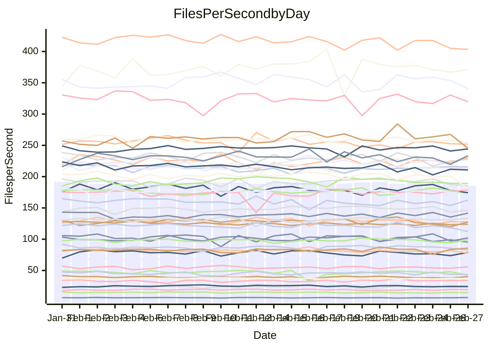

<!---
# This file is auto-generated. Do not edit.
# cspell:disable
--->
# Performance Report

Daily Performance

```mermaid
xychart-beta
    title Files Per Second by Day
    y-axis Files per Second
    x-axis Date [Jan-31, Feb-1, Feb-2, Feb-3, Feb-4, Feb-6, Feb-7, Feb-8, Feb-9, Feb-10, Feb-11, Feb-12, Feb-14, Feb-15, Feb-16, Feb-17, Feb-19, Feb-20, Feb-21, Feb-22, Feb-23, Feb-24, Feb-26, Feb-27]
    bar [192.01, 191.89, 188.72, 191.38, 188.90, 190.72, 190.17, 190.44, 190.91, 190.55, 190.54, 188.86, 190.65, 191.15, 192.54, 190.97, 189.21, 190.95, 191.93, 188.84, 190.95, 190.14, 188.86, 185.68]
    line [6.62, 6.41, 6.91, 6.36, 6.58, 6.71, 6.80, 6.54, 6.62, 5.96, 6.86, 6.86, 6.52, 6.16, 6.48, 6.78, 6.24, 6.45, 6.67, 5.92, 6.38, 6.30, 6.44, 6.78]
    line [219.07, 234.91, 232.08, 226.54, 219.34, 230.80, 225.22, 227.18, 223.96, 236.18, 221.89, 211.43, 221.91, 216.06, 220.67, 225.17, 231.02, 220.24, 226.17, 215.58, 226.36, 225.70, 222.46, 230.18]
    line [21.57, 23.77, 24.71, 24.15, 24.26, 23.40, 25.18, 24.34, 21.29, 24.41, 23.32, 24.52, 23.95, 23.93, 26.14, 23.05, 24.64, 20.92, 22.32, 25.16, 23.04, 24.66, 23.19, 23.41]
    line [48.96, 48.60, 48.80, 46.86, 44.78, 49.77, 46.58, 46.37, 48.10, 48.71, 50.07, 49.29, 45.43, 50.01, 33.04, 44.04, 44.67, 46.36, 48.18, 49.05, 48.06, 46.41, 47.91, 42.63]
    line [41.91, 40.21, 40.30, 38.59, 39.97, 40.70, 38.75, 38.14, 39.24, 39.45, 39.06, 40.44, 38.93, 40.19, 35.66, 39.21, 40.89, 39.79, 40.82, 39.75, 38.29, 38.55, 38.02, 40.24]
    line [47.60, 46.28, 48.66, 45.03, 44.68, 43.73, 45.57, 47.74, 41.63, 41.21, 45.64, 48.81, 44.68, 43.13, 46.03, 46.35, 45.95, 47.66, 45.50, 46.89, 43.13, 47.48, 43.86, 43.57]
    line [17.77, 19.48, 18.59, 18.27, 20.00, 20.26, 18.55, 19.66, 20.05, 18.72, 19.96, 20.29, 18.59, 19.07, 20.25, 18.95, 19.76, 18.01, 18.46, 18.38, 19.68, 18.34, 19.60, 19.38]
    line [175.63, 188.19, 178.84, 190.27, 179.88, 183.71, 188.14, 181.32, 186.40, 168.60, 184.20, 174.99, 182.26, 184.13, 178.63, 177.91, 178.13, 170.26, 181.98, 177.56, 185.31, 187.50, 177.93, 174.26]
    line [210.58, 224.80, 219.16, 222.44, 214.46, 210.98, 218.39, 222.45, 224.30, 218.74, 221.76, 200.54, 218.78, 219.30, 216.79, 209.78, 203.99, 220.72, 225.56, 229.20, 204.56, 214.62, 214.22, 215.03]
    line [64.96, 64.42, 71.54, 66.41, 68.48, 67.32, 68.66, 69.54, 66.78, 64.72, 66.96, 67.81, 67.54, 69.24, 69.14, 67.84, 76.41, 70.89, 67.31, 66.82, 66.94, 70.88, 67.89, 70.03]
    line [105.85, 104.82, 108.27, 101.16, 101.71, 96.80, 105.17, 106.78, 104.49, 88.12, 105.95, 95.68, 105.24, 108.38, 96.07, 105.42, 104.57, 104.52, 96.66, 102.79, 103.56, 108.60, 97.11, 101.96]
    line [126.00, 129.13, 135.02, 129.21, 131.37, 130.21, 127.48, 133.83, 127.77, 122.88, 128.37, 135.10, 130.41, 132.90, 121.26, 129.83, 131.86, 128.62, 131.04, 130.26, 129.44, 123.58, 128.31, 127.66]
    line [143.93, 149.76, 150.71, 139.56, 149.35, 149.31, 151.26, 147.89, 143.35, 146.05, 148.59, 146.97, 147.88, 152.57, 150.80, 149.13, 152.26, 152.78, 149.55, 148.15, 148.90, 152.11, 143.30, 146.22]
    line [15.62, 14.38, 14.96, 14.97, 15.27, 14.50, 15.88, 15.38, 15.78, 13.95, 14.61, 15.64, 15.09, 14.85, 15.30, 15.16, 14.06, 14.46, 15.41, 14.08, 14.28, 13.96, 14.98, 14.64]
    line [128.28, 128.07, 127.23, 125.91, 129.12, 126.49, 131.65, 129.27, 131.48, 127.09, 130.68, 129.17, 127.78, 130.44, 128.86, 131.22, 132.26, 123.16, 133.27, 135.57, 126.55, 124.20, 119.96, 127.63]
    line [164.87, 161.06, 158.29, 161.96, 164.85, 164.28, 164.40, 159.10, 159.22, 159.55, 156.17, 168.86, 156.43, 163.15, 147.05, 161.97, 157.72, 155.61, 153.59, 162.30, 157.06, 159.96, 153.79, 162.54]
    line [34.29, 34.92, 32.72, 32.24, 34.39, 32.11, 29.25, 34.28, 34.27, 30.99, 32.76, 34.39, 34.12, 31.87, 32.51, 34.43, 31.35, 34.71, 33.66, 36.75, 33.50, 33.75, 33.98, 34.02]
    line [69.80, 79.78, 83.19, 79.99, 81.38, 78.37, 78.87, 76.33, 81.76, 73.03, 78.44, 82.16, 76.45, 81.35, 81.75, 78.06, 74.92, 73.32, 81.29, 78.95, 76.37, 76.80, 73.75, 78.88]
    line [344.39, 377.92, 368.78, 357.60, 388.25, 362.18, 363.07, 369.70, 375.89, 360.98, 379.16, 371.95, 380.17, 380.03, 383.65, 403.62, 329.33, 387.65, 379.15, 375.70, 377.89, 371.33, 366.95, 370.74]
    line [229.98, 223.23, 220.66, 222.78, 222.35, 231.30, 222.88, 223.28, 209.50, 215.15, 218.83, 217.74, 220.20, 225.26, 234.21, 221.97, 226.10, 219.20, 223.30, 227.37, 223.02, 226.36, 218.81, 211.88]
    line [103.49, 99.40, 99.16, 97.64, 98.18, 103.70, 106.20, 99.99, 97.22, 103.26, 104.26, 101.58, 98.06, 97.55, 103.52, 102.20, 104.64, 105.41, 96.15, 100.38, 103.85, 96.33, 99.09, 95.29]
    line [80.82, 83.46, 83.98, 85.68, 83.63, 81.75, 82.99, 80.30, 81.36, 82.63, 82.18, 80.51, 83.91, 83.57, 87.71, 81.51, 80.83, 78.91, 82.42, 80.37, 81.15, 79.72, 81.93, 77.81]
    line [196.17, 191.05, 192.93, 192.90, 193.43, 182.93, 188.24, 197.74, 194.04, 183.39, 196.97, 181.19, 192.15, 188.44, 188.43, 193.17, 194.32, 195.93, 197.80, 193.32, 192.22, 196.28, 187.50, 185.72]
    line [185.13, 193.14, 197.96, 188.03, 184.87, 192.18, 186.89, 188.37, 189.97, 197.93, 196.64, 199.99, 198.18, 196.78, 191.66, 183.24, 198.97, 195.69, 196.29, 194.82, 190.50, 191.36, 189.34, 189.24]
    line [130.52, 121.85, 125.25, 129.66, 129.52, 125.44, 125.65, 123.91, 126.45, 124.46, 122.70, 126.21, 125.01, 121.92, 124.63, 126.05, 123.51, 125.30, 123.36, 124.67, 122.06, 125.40, 123.31, 124.07]
    line [92.24, 85.84, 87.34, 84.11, 87.49, 86.37, 87.72, 85.83, 80.71, 86.83, 85.89, 88.80, 88.35, 86.20, 79.88, 88.50, 88.86, 89.95, 85.47, 89.64, 87.93, 87.72, 85.68, 82.86]
    line [57.11, 52.81, 55.66, 56.60, 51.29, 52.77, 57.05, 53.25, 56.05, 58.16, 56.27, 53.18, 53.98, 54.67, 55.62, 52.95, 56.33, 56.16, 52.87, 55.45, 55.44, 54.09, 53.55, 56.00]
    line [23.09, 24.19, 23.67, 25.80, 25.02, 24.57, 25.83, 26.53, 27.12, 25.19, 24.73, 26.32, 25.72, 25.93, 26.65, 24.45, 25.52, 23.53, 25.65, 25.87, 24.49, 24.03, 24.62, 24.52]
    line [36.96, 37.04, 36.98, 36.58, 36.57, 37.20, 37.62, 37.00, 38.62, 38.34, 38.10, 37.49, 36.82, 37.56, 36.77, 36.33, 37.40, 36.62, 38.51, 36.10, 37.37, 36.52, 37.66, 37.02]
    line [355.36, 343.22, 341.35, 343.34, 343.75, 345.17, 341.37, 358.57, 359.43, 367.04, 357.06, 346.78, 363.25, 359.22, 355.34, 343.44, 363.00, 335.36, 339.22, 362.80, 356.26, 358.85, 353.61, 340.56]
    line [143.14, 142.73, 142.84, 131.70, 135.60, 134.90, 137.77, 133.55, 139.08, 139.48, 135.67, 138.79, 139.27, 140.69, 136.31, 141.26, 136.95, 140.26, 134.61, 141.79, 137.76, 142.75, 135.42, 141.71]
    line [251.39, 257.09, 256.60, 252.24, 257.13, 261.45, 265.63, 258.24, 253.80, 254.33, 238.72, 270.54, 256.71, 261.76, 251.74, 255.44, 255.70, 246.95, 250.90, 244.70, 255.35, 256.03, 252.54, 251.87]
    line [238.25, 234.41, 226.71, 230.40, 229.74, 237.81, 232.23, 224.57, 237.26, 238.90, 231.61, 222.35, 235.22, 226.17, 229.70, 226.87, 232.74, 235.31, 224.47, 238.32, 230.44, 216.76, 225.02, 227.63]
    line [177.76, 179.20, 178.55, 179.09, 179.41, 173.82, 171.95, 172.64, 171.28, 176.43, 175.80, 180.86, 176.28, 173.64, 175.63, 176.43, 178.51, 182.28, 170.09, 171.99, 177.77, 181.65, 177.93, 171.20]
    line [81.99, 83.50, 81.95, 82.10, 83.95, 83.89, 81.23, 83.38, 84.02, 78.63, 78.33, 84.47, 83.13, 83.66, 80.84, 83.02, 84.44, 80.37, 87.47, 84.08, 83.91, 75.76, 83.59, 85.75]
    line [216.87, 219.73, 217.00, 217.80, 206.42, 216.86, 217.40, 212.93, 213.99, 216.37, 207.17, 209.51, 213.52, 203.34, 215.88, 213.12, 205.73, 212.95, 211.55, 213.31, 213.15, 214.61, 215.98, 215.69]
    line [175.53, 174.36, 175.31, 176.60, 177.03, 168.50, 172.68, 169.57, 174.00, 174.69, 174.76, 142.58, 173.78, 169.32, 168.80, 179.63, 179.91, 171.61, 176.10, 175.03, 175.02, 172.48, 176.50, 178.41]
    line [249.14, 241.45, 239.07, 239.51, 243.53, 244.90, 249.62, 243.56, 245.16, 248.01, 245.77, 245.71, 246.33, 249.20, 246.02, 244.24, 231.62, 249.13, 242.45, 246.48, 246.10, 248.98, 240.98, 244.30]
    line [260.12, 259.24, 266.03, 264.66, 253.81, 264.19, 262.88, 255.12, 259.81, 256.65, 259.10, 261.07, 258.76, 261.47, 267.24, 254.70, 257.67, 260.94, 258.83, 263.71, 255.40, 259.16, 257.65, 254.89]
    line [222.32, 209.91, 217.01, 216.15, 212.32, 213.20, 215.93, 213.93, 215.54, 211.99, 212.34, 214.45, 216.77, 218.28, 216.31, 214.05, 214.67, 213.49, 218.19, 216.61, 212.54, 214.33, 212.86, 213.00]
    line [215.86, 227.49, 237.43, 233.36, 227.18, 233.42, 233.14, 230.84, 225.21, 232.83, 240.89, 231.65, 231.34, 231.21, 244.19, 223.55, 239.70, 229.90, 235.21, 223.87, 231.37, 229.84, 219.75, 233.50]
    line [422.79, 413.85, 411.47, 422.24, 425.96, 422.90, 426.77, 417.49, 413.10, 427.18, 415.79, 423.61, 413.93, 415.75, 423.97, 415.82, 402.21, 417.90, 421.85, 402.15, 417.55, 417.69, 405.05, 403.39]
    line [130.01, 133.77, 131.00, 132.25, 127.77, 131.87, 132.83, 130.24, 129.37, 135.96, 133.33, 120.48, 131.69, 126.77, 128.95, 131.05, 132.77, 134.30, 133.46, 131.83, 132.27, 131.01, 131.00, 133.55]
    line [97.24, 99.79, 99.21, 94.63, 98.63, 99.54, 99.93, 96.90, 95.85, 100.02, 98.95, 99.68, 93.47, 96.18, 99.12, 97.35, 97.51, 101.87, 100.27, 99.76, 98.90, 95.69, 94.30, 99.01]
    line [257.16, 251.63, 250.02, 261.80, 245.30, 263.91, 261.35, 263.52, 260.14, 262.60, 262.38, 253.84, 256.03, 271.88, 272.11, 262.81, 268.41, 258.56, 256.27, 284.25, 260.54, 263.62, 267.57, 245.18]
    line [122.01, 124.68, 121.40, 124.27, 121.00, 122.72, 124.94, 121.83, 120.56, 119.51, 117.66, 126.41, 120.64, 118.92, 126.15, 122.12, 122.32, 119.71, 119.61, 127.43, 118.55, 121.57, 118.53, 112.15]
    line [330.58, 325.66, 323.17, 336.90, 335.91, 322.03, 323.49, 318.09, 297.24, 321.28, 332.16, 332.97, 319.43, 324.88, 322.69, 320.99, 329.84, 297.30, 325.03, 331.76, 320.00, 316.72, 330.45, 319.75]
    line [223.69, 217.62, 221.92, 210.52, 217.06, 217.75, 221.18, 215.63, 217.27, 218.63, 215.55, 219.85, 215.87, 211.04, 214.14, 215.28, 213.09, 213.97, 220.46, 207.58, 214.51, 202.85, 211.79, 210.73]
    line [203.99, 203.12, 208.67, 201.18, 195.78, 203.73, 196.42, 202.06, 200.13, 204.90, 199.89, 202.61, 200.63, 203.97, 207.62, 204.11, 196.35, 204.19, 205.00, 194.87, 203.28, 199.45, 200.84, 180.84]
    line [180.67, 179.91, 166.82, 180.26, 174.86, 175.68, 174.32, 177.53, 181.20, 174.17, 176.92, 176.20, 178.74, 179.75, 180.11, 177.55, 173.68, 176.25, 178.32, 171.39, 176.96, 177.51, 175.27, 171.56]
```

Time to Process Files

| Repository                                      | Elapsed | Min/Avg/Max           |   SD | SD Graph                |
| ----------------------------------------------- | ------: | :-------------------: | ---: | ----------------------- |
| AdaDoom3/AdaDoom3                    |    2.78 | 2.6 /   2.8 /   3.0   | 0.07 | `    ┣━━┻━━╋●━┻━━┫    ` |
| alexiosc/megistos                    |    7.49 | 6.6 /   7.1 /   7.9   | 0.28 | `    ┣━━┻━━╋━━┻●━┫    ` |
| apollographql/apollo-server          |    2.67 | 2.4 /   2.5 /   2.9   | 0.13 | `    ┣━━┻━━╋━━●━━┫    ` |
| aspnetboilerplate/aspnetboilerplate  |    8.97 | 8.3 /   8.8 /   9.9   | 0.24 | `    ┣━━┻━━╋━●┻━━┫    ` |
| aws-amplify/docs                     |   11.76 | 11.4 /  11.8 /  12.5  | 0.24 | `    ┣━━┻━━●━━┻━━┫    ` |
| Azure/azure-rest-api-specs           |    9.97 | 8.6 /   9.4 /  11.2   | 0.46 | `    ┣━━┻━━╋━━┻●━┫    ` |
| bitjson/typescript-starter           |    1.03 | 0.9 /   1.0 /   1.2   | 0.06 | `     ┣━┻━━●━━┻━┫     ` |
| caddyserver/caddy                    |    3.56 | 3.1 /   3.4 /   3.7   | 0.13 | `    ┣━━┻━━╋━━┻●━┫    ` |
| canada-ca/open-source-logiciel-libre |    1.03 | 1.0 /   1.1 /   1.2   | 0.06 | `     ┣━┻●━╋━━┻━┫     ` |
| chef/chef                            |    5.66 | 5.0 /   5.4 /   5.8   | 0.17 | `    ┣━━┻━━╋━━┻━●┫    ` |
| dart-lang/sdk                        |   60.94 | 50.2 /  54.4 /  58.9  | 1.24 | `      ┣━┻━╋━┻━┫     ●` |
| django/django                        |   13.58 | 12.9 /  13.5 /  14.7  | 0.38 | `    ┣━━┻━━╋●━┻━━┫    ` |
| eslint/eslint                        |    9.78 | 9.2 /   9.6 /  10.4   | 0.27 | `    ┣━━┻━━╋━●┻━━┫    ` |
| exonum/exonum                        |    3.39 | 3.2 /   3.4 /   3.7   | 0.11 | `    ┣━━┻━━●━━┻━━┫    ` |
| flutter/samples                      |   14.35 | 13.5 /  14.5 /  17.4  | 0.55 | `   ┣━━━┻━●╋━━┻━━━┫   ` |
| gitbucket/gitbucket                  |    3.24 | 3.0 /   3.2 /   3.6   | 0.13 | `    ┣━━┻━━╋●━┻━━┫    ` |
| googleapis/google-cloud-cpp          |  118.12 | 112.8 / 118.2 / 135.3 | 3.75 | `  ┣━━━┻━━━●━━━┻━━━┫  ` |
| graphql/express-graphql              |    1.11 | 1.0 /   1.1 /   1.3   | 0.07 | `     ┣━┻━━●━━┻━┫     ` |
| graphql/graphql-js                   |    2.60 | 2.5 /   2.7 /   3.1   | 0.10 | `    ┣━━┻●━╋━━┻━━┫    ` |
| graphql/graphql-relay-js             |    1.14 | 1.0 /   1.1 /   1.3   | 0.07 | `     ┣━┻━━╋●━┻━┫     ` |
| graphql/graphql-spec                 |    1.30 | 1.2 /   1.3 /   1.5   | 0.06 | `     ┣━┻━━╋●━┻━┫     ` |
| iluwatar/java-design-patterns        |   12.03 | 10.9 /  11.5 /  12.3  | 0.33 | `    ┣━━┻━━╋━━┻━●┫    ` |
| ktaranov/sqlserver-kit               |    5.71 | 5.5 /   5.9 /   6.9   | 0.25 | `    ┣━━●━━╋━━┻━━┫    ` |
| liriliri/licia                       |    3.88 | 3.4 /   3.9 /   4.4   | 0.17 | `    ┣━━┻━━●━━┻━━┫    ` |
| MartinThoma/LaTeX-examples           |    6.19 | 5.8 /   6.1 /   6.7   | 0.21 | `    ┣━━┻━━╋●━┻━━┫    ` |
| mdx-js/mdx                           |    1.79 | 1.7 /   1.8 /   2.1   | 0.11 | `    ┣━━┻━●╋━━┻━━┫    ` |
| microsoft/TypeScript-Website         |    5.20 | 4.9 /   5.1 /   5.9   | 0.19 | `    ┣━━┻━━╋●━┻━━┫    ` |
| MicrosoftDocs/PowerShell-Docs        |   19.83 | 19.3 /  20.2 /  22.0  | 0.55 | `   ┣━━━┻●━╋━━┻━━━┫   ` |
| neovim/nvim-lspconfig                |    4.07 | 3.8 /   4.0 /   4.6   | 0.15 | `    ┣━━┻━━╋●━┻━━┫    ` |
| pagekit/pagekit                      |    3.45 | 3.2 /   3.4 /   4.7   | 0.22 | `    ┣━━┻━━●━━┻━━┫    ` |
| php/php-src                          |   22.97 | 22.1 /  23.3 /  28.7  | 0.96 | `   ┣━━┻━━●╋━━━┻━━┫   ` |
| plasticrake/tplink-smarthome-api     |    1.45 | 1.2 /   1.3 /   1.9   | 0.10 | `     ┣━┻━━╋━━┻●┫     ` |
| prettier/prettier                    |    7.82 | 7.2 /   7.5 /   8.1   | 0.24 | `    ┣━━┻━━╋━━┻●━┫    ` |
| pycontribs/jira                      |    1.41 | 1.3 /   1.5 /   1.7   | 0.08 | `     ┣━┻━●╋━━┻━┫     ` |
| RustPython/RustPython                |    6.74 | 5.8 /   6.2 /   6.9   | 0.21 | `    ┣━━┻━━╋━━┻━━┫ ●  ` |
| shoelace-style/shoelace              |    2.71 | 2.6 /   2.8 /   3.1   | 0.11 | `    ┣━━┻━●╋━━┻━━┫    ` |
| slint-ui/slint                       |   12.98 | 12.2 /  12.9 /  14.1  | 0.44 | `   ┣━━━┻━━●━━┻━━━┫   ` |
| SoftwareBrothers/admin-bro           |    2.53 | 2.3 /   2.4 /   2.6   | 0.09 | `    ┣━━┻━━╋━━●━━┫    ` |
| sveltejs/svelte                      |   21.09 | 19.5 /  20.2 /  21.6  | 0.47 | `   ┣━━━┻━━╋━━┻━━●┫   ` |
| TheAlgorithms/Python                 |    5.56 | 5.2 /   5.5 /   6.4   | 0.22 | `    ┣━━┻━━╋●━┻━━┫    ` |
| twbs/bootstrap                       |    1.69 | 1.5 /   1.7 /   2.0   | 0.09 | `     ┣━┻●━╋━━┻━┫     ` |
| typescript-cheatsheets/react         |    1.32 | 1.2 /   1.4 /   1.6   | 0.07 | `     ┣━┻━●╋━━┻━┫     ` |
| typescript-eslint/typescript-eslint  |    4.08 | 3.8 /   4.0 /   4.5   | 0.18 | `    ┣━━┻━━╋●━┻━━┫    ` |
| vitest-dev/vitest                    |   10.83 | 9.9 /  10.9 /  11.8   | 0.37 | `    ┣━━┻━●╋━━┻━━┫    ` |
| w3c/aria-practices                   |    3.24 | 3.1 /   3.2 /   4.1   | 0.16 | `    ┣━━┻━━●━━┻━━┫    ` |
| w3c/specberus                        |    1.93 | 1.8 /   1.9 /   2.3   | 0.11 | `    ┣━━┻━━●━━┻━━┫    ` |
| webdeveric/webpack-assets-manifest   |    1.26 | 1.1 /   1.2 /   1.4   | 0.08 | `     ┣━┻━━╋●━┻━┫     ` |
| webpack/webpack                      |    4.98 | 4.8 /   5.1 /   5.6   | 0.20 | `    ┣━━┻●━╋━━┻━━┫    ` |
| wireapp/wire-desktop                 |    1.29 | 1.2 /   1.3 /   1.6   | 0.08 | `     ┣━┻━●╋━━┻━┫     ` |
| wireapp/wire-webapp                  |   11.25 | 10.3 /  10.8 /  12.1  | 0.36 | `    ┣━━┻━━╋━━┻●━┫    ` |

Note:
- Elapsed time is in seconds.

Files per Second over Time

| Repository                                      | Files |    Sec |    Fps |     Rel | Trend Fps              |    N |
| ----------------------------------------------- | ----: | -----: | -----: | ------: | ---------------------- | ---: |
| AdaDoom3/AdaDoom3                    |   103 |   2.78 |  37.02 |  -0.58% | `▇▆██▆▇█▇▆▄▇██▆▆▆██▇▇` |   56 |
| alexiosc/megistos                    |   583 |   7.49 |  77.81 |  -5.42% | `▆▅▇▆▆▃▅██▇▅▆▅▄▇▆▇█▅▅` |   56 |
| apollographql/apollo-server          |   254 |   2.67 |  95.29 |  -5.40% | `██▆▅▇█████▇▇▇█▃▆█▆▆▅` |   56 |
| aspnetboilerplate/aspnetboilerplate  |  2286 |   8.97 | 254.89 |  -1.60% | `▇▇▆██▇▆▇▆█▆▇▇▇▇█▆▆█▇` |   56 |
| aws-amplify/docs                     |  2874 |  11.76 | 244.30 |  -0.08% | `▅█▇▆▇██▇▇██▆███▆▇▆▇▇` |   56 |
| Azure/azure-rest-api-specs           |  2444 |   9.97 | 245.18 |  -5.94% | `▇▆▇▄█▄█▆▆▆▇▆▅▆▇▆▆▇▇▅` |   56 |
| bitjson/typescript-starter           |    20 |   1.03 |  19.38 |   0.50% | `▆▄▃▅▄█▃▅▄▅▆▇▆▅▄▅▅▇▆▅` |   56 |
| caddyserver/caddy                    |   295 |   3.56 |  82.86 |  -4.44% | `▇█▅▇▇▇▆▆▇▆▇██▆█▇▇▅▅▅` |   56 |
| canada-ca/open-source-logiciel-libre |     7 |   1.03 |   6.78 |   4.11% | `▄▅█▄▃▆▆▄▄▅▃▇▆▃▇▃▆▆▇▇` |   56 |
| chef/chef                            |  1199 |   5.66 | 211.88 |  -4.76% | `▇▅▇▆▇▅▆▄▅▇▇▆█▇▆▅▆▆▄▄` |   56 |
| dart-lang/sdk                        | 11020 |  60.94 | 180.84 | -10.39% | `▆███▆███▆▇█▇▇▇▇▇▆▇▇▃` |   56 |
| django/django                        |  2892 |  13.58 | 213.00 |  -0.62% | `▇▇██▇▇██▆▄▇▇▇▆▇▆▇▆█▇` |   56 |
| eslint/eslint                        |  2060 |   9.78 | 210.73 |  -2.12% | `▆▆█▇▅▆▅▇█▇▇▇▆▄▅▅▅▇▇▆` |   56 |
| exonum/exonum                        |   421 |   3.39 | 124.07 |  -0.47% | `▇▇▇▇▇██▆▇▇▇▄▅█▇▅█▇▇▇` |   56 |
| flutter/samples                      |  2561 |  14.35 | 178.41 |   2.78% | `█▇▇▇▇▆▇▇█▇▇██▆▇██▇▇█` |   56 |
| gitbucket/gitbucket                  |   414 |   3.24 | 127.66 |  -1.55% | `▇▆▇▇▇▇▆▇█▄█▆▇▄▆▇█▃▇▆` |   56 |
| googleapis/google-cloud-cpp          | 20264 | 118.12 | 171.56 |  -3.04% | `▆▇▆█▆▇▇▇▇▇▇▇▇▇▇▆▆▇█▆` |   56 |
| graphql/express-graphql              |    26 |   1.11 |  23.41 |  -1.02% | `█▄▄▆█▆▅▆▆▇▅▇▅▇█▇▆▅▆▆` |   56 |
| graphql/graphql-js                   |   368 |   2.60 | 141.71 |   2.91% | `▇▇▆▇██▇▇▆██▅▇███▄▇▇█` |   56 |
| graphql/graphql-relay-js             |    28 |   1.14 |  24.52 |  -2.35% | `▇▅▇▇▇▄▅▇▇▅▇▇▅█▃▇▇▆▄▆` |   56 |
| graphql/graphql-spec                 |    19 |   1.30 |  14.64 |  -1.48% | `▅▆█▇▅█▇▆▃▅▅▅▆▅▅▇▇▇▇▆` |   56 |
| iluwatar/java-design-patterns        |  2060 |  12.03 | 171.20 |  -2.99% | `▆▇▅▄▅▆▆▇▄▇▇▅▆▅█▇▆▅▅▅` |   56 |
| ktaranov/sqlserver-kit               |   490 |   5.71 |  85.75 |   3.58% | `▇▅▇█▇▇▆▄▇▇▇▇█▄▅▇▇▆▆▇` |   56 |
| liriliri/licia                       |  1437 |   3.88 | 370.74 |  -0.77% | `▃▇▇▇▆▇▅█▇▅▆█▇▆▆▅▇▆▆▆` |   56 |
| MartinThoma/LaTeX-examples           |  1409 |   6.19 | 227.63 |  -1.12% | `▇▇▆▅█▆██▅██▆▆▆▄▆▆▇▄▆` |   56 |
| mdx-js/mdx                           |   141 |   1.79 |  78.88 |   1.14% | `▅▅▇█▇▇▄█▆█▃▅▇█▅▅▄▇▆▇` |   56 |
| microsoft/TypeScript-Website         |   760 |   5.20 | 146.22 |  -1.29% | `██▇▇▇▆█▇█▅▆▇██▇▆▄▅█▆` |   56 |
| MicrosoftDocs/PowerShell-Docs        |  2648 |  19.83 | 133.55 |   1.72% | `▇██▇▇█▆▆▇██▇▇▇▇▇█▇▆█` |   56 |
| neovim/nvim-lspconfig                |   770 |   4.07 | 189.24 |  -1.34% | `█▇▇█▇▇▇▆▆█▆▇▆▆▇▇▇▇▄▆` |   56 |
| pagekit/pagekit                      |   741 |   3.45 | 215.03 |  -0.52% | `▆▇███▅▇▂▆█▇▅██▆▇▇▇▆▇` |   56 |
| php/php-src                          |  2274 |  22.97 |  99.01 |   1.39% | `▇████▇▇█▇█▇▇▇▆▇▆█▅▆▇` |   56 |
| plasticrake/tplink-smarthome-api     |    62 |   1.45 |  42.63 |  -9.84% | `▆▇█▆█▇▇▆▇▇██▇▇▆▇▇█▇▅` |   56 |
| prettier/prettier                    |  2664 |   7.82 | 340.56 |  -3.29% | `▇▅▄▆▇▆▇▆▇▇▆█▇▆▇▆▆▇▇▅` |   56 |
| pycontribs/jira                      |    79 |   1.41 |  56.00 |   2.66% | `▇▇▃█▇▆█▄█▇▇▇█▆▆▆▅▆▇▇` |   56 |
| RustPython/RustPython                |   756 |   6.74 | 112.15 |  -7.44% | `▇▆▆▆█▅█▆▅▅▅▇▅▇▆▇▃▇▆▄` |   56 |
| shoelace-style/shoelace              |   440 |   2.71 | 162.54 |   2.09% | `▆▆▇▃▇▇▅█▆▆▅▅▅▇▆▄▆▇▄▇` |   56 |
| slint-ui/slint                       |  2800 |  12.98 | 215.69 |   1.06% | `▆▇█▆▇▇▆▇█▇▆▆▇█▇▇▆██▇` |   56 |
| SoftwareBrothers/admin-bro           |   441 |   2.53 | 174.26 |  -4.52% | `▅▄▆▆▅▄▇▆▇█▇▆▆▆█▄▄▆▆▅` |   56 |
| sveltejs/svelte                      |  8507 |  21.09 | 403.39 |  -3.27% | `▅▇▇█▅▄▇▇▇▇▇██▇▆▆▄▆▇▅` |   56 |
| TheAlgorithms/Python                 |  1401 |   5.56 | 251.87 |  -1.28% | `▇▆▆▆▆▅█▆▇█▇▆▆▆█▇▇▆▅▆` |   56 |
| twbs/bootstrap                       |   118 |   1.69 |  70.03 |   3.16% | `█▆▅▅▅▅▆▆▅▅▂▅▆▇▆▅▆▅▆▆` |   56 |
| typescript-cheatsheets/react         |    53 |   1.32 |  40.24 |   2.70% | `▇▇▇▇▇▆▅█▆█▆▂▅▅▇▄▆▅▇▇` |   56 |
| typescript-eslint/typescript-eslint  |  1306 |   4.08 | 319.75 |  -1.18% | `▇▄▆▇▇▄▆▆▆▇▆▇▇▅▇▇▆█▇▆` |   56 |
| vitest-dev/vitest                    |  2528 |  10.83 | 233.50 |   1.25% | `▇▆▅█▅▅▅▇▆▆▇▆█▆▅▅▄▄▅▆` |   56 |
| w3c/aria-practices                   |   414 |   3.24 | 127.63 |  -0.24% | `█▆███▇▆▅█▇▆▇▇▇▆▇▇▆▂▇` |   56 |
| w3c/specberus                        |   197 |   1.93 | 101.96 |  -1.01% | `▇▇▄▆▇▇▇█▆▅▆▇███▇▆▂▅▆` |   56 |
| webdeveric/webpack-assets-manifest   |    55 |   1.26 |  43.57 |  -3.45% | `▇▇█▄▇▇▅▆▄▃▆▆▃█▇▆▇▆▃▅` |   56 |
| webpack/webpack                      |  1146 |   4.98 | 230.18 |   2.30% | `▇▆█▆▅▆▇▆▅██▆▇▇▆▅▇▇▅▇` |   56 |
| wireapp/wire-desktop                 |    44 |   1.29 |  34.02 |   1.80% | `▆▅▇▆▆█▆▆▆▆▆▆▆▆█▄▆▆▇▆` |   55 |
| wireapp/wire-webapp                  |  2090 |  11.25 | 185.72 |  -3.37% | `▇▇██▇▄▇█▇█▇█▇▇█▇▇▇▃▆` |   55 |

Data Throughput

| Repository                                      | Files |    Sec |     Kps |     Rel | Trend Kps              |    N |
| ----------------------------------------------- | ----: | -----: | ------: | ------: | ---------------------- | ---: |
| AdaDoom3/AdaDoom3                    |   103 |   2.78 |  786.76 |  -0.58% | `▇▆██▆▇█▇▆▄▇██▆▆▆██▇▇` |   56 |
| alexiosc/megistos                    |   583 |   7.49 |  611.36 |  -5.42% | `▆▅▇▆▆▃▅██▇▅▆▅▄▇▆▇█▅▅` |   56 |
| apollographql/apollo-server          |   254 |   2.67 |  782.97 |  -5.26% | `██▆▅▇█████▇▇▇█▃▆█▆▆▅` |   56 |
| aspnetboilerplate/aspnetboilerplate  |  2286 |   8.97 |  620.15 |  -1.60% | `▇▇▆██▇▆▇▆█▆▇▇▇▇█▆▆█▇` |   56 |
| aws-amplify/docs                     |  2874 |  11.76 |  854.19 |  -0.06% | `▅█▇▆▇██▇▇██▆███▆▇▆▇▇` |   56 |
| Azure/azure-rest-api-specs           |  2444 |   9.97 |  645.45 |  -5.85% | `▇▆▇▄█▄█▆▆▇▇▆▆▆▇▆▆▇▇▅` |   56 |
| bitjson/typescript-starter           |    20 |   1.03 |   77.52 |   0.50% | `▆▄▃▅▄█▃▅▄▅▆▇▆▅▄▅▅▇▆▅` |   56 |
| caddyserver/caddy                    |   295 |   3.56 |  727.48 |  -4.25% | `▇▇▅▇▇▇▆▆▇▆▇██▆█▇▇▅▅▅` |   56 |
| canada-ca/open-source-logiciel-libre |     7 |   1.03 |   56.19 |   4.11% | `▄▅█▄▃▆▆▄▄▅▃▇▆▃▇▃▆▆▇▇` |   56 |
| chef/chef                            |  1199 |   5.66 |  994.73 |  -4.71% | `▆▅▇▆▇▅▆▄▅▇▇▆█▇▆▅▆▆▄▄` |   56 |
| dart-lang/sdk                        | 11020 |  60.94 | 1228.52 | -10.48% | `▆███▆███▆▇█▇▇▇▇▇▆▇▇▃` |   56 |
| django/django                        |  2892 |  13.58 | 1346.12 |  -0.54% | `▇▇██▇▇██▆▄▇▇▇▆▇▆▇▆█▇` |   56 |
| eslint/eslint                        |  2060 |   9.78 | 1463.22 |  -2.01% | `▆▆█▇▅▆▅▇█▇▇▇▆▄▅▅▅▇▇▆` |   56 |
| exonum/exonum                        |   421 |   3.39 | 1186.72 |  -0.47% | `▇▇▇▇▇██▆▇▇▇▄▅█▇▅█▇▇▇` |   56 |
| flutter/samples                      |  2561 |  14.35 | 1506.97 |   0.93% | `█▇▇▇▇▆▇▇█▇▇▇█▆▇██▇▇█` |   56 |
| gitbucket/gitbucket                  |   414 |   3.24 |  583.74 |  -1.39% | `▇▆▇▇▇▇▆▇█▄█▆▇▄▆▇█▃▇▆` |   56 |
| googleapis/google-cloud-cpp          | 20264 | 118.12 | 1433.47 |  -1.03% | `▆▇▆█▆▇█▇██▇███▇▇▇██▇` |   56 |
| graphql/express-graphql              |    26 |   1.11 |  107.15 |  -1.02% | `█▄▄▆█▆▅▆▆▇▅▇▅▇█▇▆▅▆▆` |   56 |
| graphql/graphql-js                   |   368 |   2.60 |  825.26 |   3.00% | `▇▇▆▇██▇▇▆██▅▇███▄▇▇█` |   56 |
| graphql/graphql-relay-js             |    28 |   1.14 |   96.31 |  -2.35% | `▇▅▇▇▇▄▅▇▇▅▇▇▅█▃▇▇▆▄▆` |   56 |
| graphql/graphql-spec                 |    19 |   1.30 |  488.65 |  -1.48% | `▅▆█▇▅█▇▆▃▅▅▅▆▅▅▇▇▇▇▆` |   56 |
| iluwatar/java-design-patterns        |  2060 |  12.03 |  527.64 |  -3.23% | `▆▇▅▄▅▆▆▇▄▇▇▅▆▅█▇▆▅▅▅` |   56 |
| ktaranov/sqlserver-kit               |   490 |   5.71 | 1296.19 |   3.56% | `▇▅▇█▇▇▆▄▇▇▇▇█▄▅▇▇▆▆▇` |   56 |
| liriliri/licia                       |  1437 |   3.88 |  441.69 |  -0.77% | `▃▇▇▇▆▇▅█▇▅▆█▇▆▆▅▇▆▆▆` |   56 |
| MartinThoma/LaTeX-examples           |  1409 |   6.19 |  470.12 |  -1.12% | `▇▇▆▅█▆██▅██▆▆▆▄▆▆▇▄▆` |   56 |
| mdx-js/mdx                           |   141 |   1.79 |  366.43 |   1.14% | `▅▅▇█▇▇▄█▆█▃▅▇█▅▅▄▇▆▇` |   56 |
| microsoft/TypeScript-Website         |   760 |   5.20 | 1019.31 |  -0.70% | `▇▇▇▇▇▆█▇█▅▆▇██▇▆▄▅█▆` |   56 |
| MicrosoftDocs/PowerShell-Docs        |  2648 |  19.83 | 1396.31 |   1.72% | `▇██▇▇█▆▆▇██▇▇▇▇▇█▇▆█` |   56 |
| neovim/nvim-lspconfig                |   770 |   4.07 |  360.30 |  -0.54% | `█▇▇█▇▇▇▇▆█▆▇▆▆▇▇▇▇▅▇` |   56 |
| pagekit/pagekit                      |   741 |   3.45 |  448.35 |  -0.52% | `▆▇███▅▇▂▆█▇▅██▆▇▇▇▆▇` |   56 |
| php/php-src                          |  2274 |  22.97 | 1723.51 |   1.30% | `▇████▇▇█▇█▇▇▇▆▇▆█▅▆▇` |   56 |
| plasticrake/tplink-smarthome-api     |    62 |   1.45 |  230.34 |  -9.84% | `▆▇█▆█▇▇▆▇▇██▇▇▆▇▇█▇▅` |   56 |
| prettier/prettier                    |  2664 |   7.82 |  468.53 |  -3.48% | `▇▅▄▆▇▆▇▆▇▇▆█▇▆▇▆▆▇▇▅` |   56 |
| pycontribs/jira                      |    79 |   1.41 |  396.94 |   2.66% | `▇▇▃█▇▆█▄█▇▇▇█▆▆▆▅▆▇▇` |   56 |
| RustPython/RustPython                |   756 |   6.74 | 1648.21 |  -3.33% | `▇▆▆▆█▅█▆▅▆▆█▅▇▆█▄▇▆▅` |   56 |
| shoelace-style/shoelace              |   440 |   2.71 |  784.26 |   1.99% | `▆▆▇▃▇▇▅█▆▆▅▅▅▇▆▄▆▇▄▇` |   56 |
| slint-ui/slint                       |  2800 |  12.98 | 1342.10 |   1.00% | `▆▇█▅▇▇▆▇█▇▆▆▇▇▇▇▆██▇` |   56 |
| SoftwareBrothers/admin-bro           |   441 |   2.53 |  384.08 |  -4.52% | `▅▄▆▆▅▄▇▆▇█▇▆▆▆█▄▄▆▆▅` |   56 |
| sveltejs/svelte                      |  8507 |  21.09 |  272.56 |  -2.96% | `▅▇▇█▅▄▇▇▇▇▇██▇▆▆▅▆▇▅` |   56 |
| TheAlgorithms/Python                 |  1401 |   5.56 |  641.28 |  -1.28% | `▇▆▆▆▆▅█▆▇█▇▆▆▆█▇▇▆▅▆` |   56 |
| twbs/bootstrap                       |   118 |   1.69 |  575.06 |   3.16% | `█▆▅▅▅▅▆▆▅▅▂▅▆▇▆▅▆▅▆▆` |   56 |
| typescript-cheatsheets/react         |    53 |   1.32 |  298.38 |   2.86% | `▇▇▇▇▇▆▅█▆█▆▂▅▅▇▄▆▅▇▇` |   56 |
| typescript-eslint/typescript-eslint  |  1306 |   4.08 | 1686.89 |  -1.07% | `▇▄▆▇▇▄▆▆▆▇▆▇▇▅▇▇▆█▇▆` |   56 |
| vitest-dev/vitest                    |  2528 |  10.83 |  708.91 |   2.77% | `▇▆▅█▅▅▅▇▆▆▇▆█▇▆▅▅▄▅▇` |   56 |
| w3c/aria-practices                   |   414 |   3.24 | 1192.18 |  -0.24% | `█▆███▇▆▅█▇▆▇▇▇▆▇▇▆▂▇` |   56 |
| w3c/specberus                        |   197 |   1.93 |  333.30 |   1.41% | `▆▆▃▆▆▇▇█▆▅▆▇███▇▆▂▅▆` |   56 |
| webdeveric/webpack-assets-manifest   |    55 |   1.26 |   99.81 |  -3.45% | `▇▇█▄▇▇▅▆▄▃▆▆▃█▇▆▇▆▃▅` |   56 |
| webpack/webpack                      |  1146 |   4.98 | 1074.56 |   2.44% | `▇▆█▆▅▆▇▆▅██▆▇▇▆▅▇▇▅▇` |   56 |
| wireapp/wire-desktop                 |    44 |   1.29 |  151.53 |   1.80% | `▆▅▇▆▆█▆▆▆▆▆▆▆▆█▄▆▆▇▆` |   55 |
| wireapp/wire-webapp                  |  2090 |  11.25 |  726.88 |  -2.87% | `▇▇▇█▇▄▇█▇█▇█▇▇█▇▇▇▃▆` |   55 |

